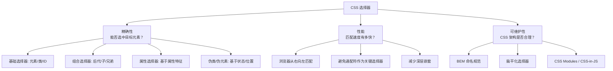
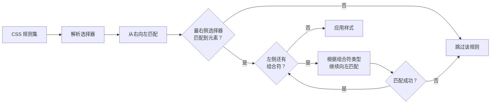
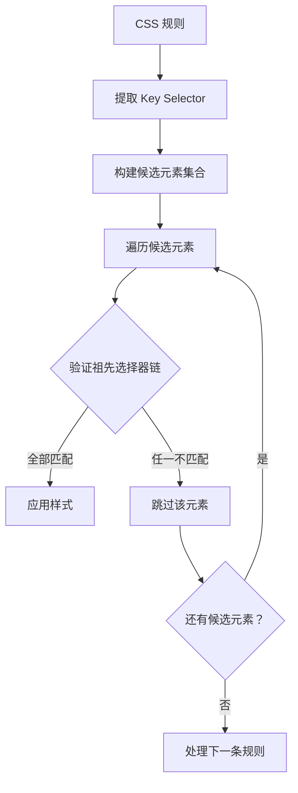

# CSS 选择器

## 背景与动机

### 为什么选择器如此重要？

CSS 选择器是连接**样式规则**与**DOM 元素**的桥梁。没有选择器，CSS 就无法知道"哪些元素需要被美化"。选择器的重要性体现在三个维度：

1. **精确性**：能否准确选中目标元素，决定了样式的正确性
2. **性能**：选择器的复杂度直接影响浏览器的样式匹配速度
3. **可维护性**：选择器的设计决定了 CSS 架构的优劣



### 选择器的分类体系

| 分类 | 说明 | 示例 | 权重 |
|------|------|------|------|
| 基础选择器 | 直接选择元素 | `p`, `.class`, `#id`, `*` | 0,0,0,0 ~ 0,1,0,0 |
| 组合选择器 | 基于元素关系选择 | `div p`, `div > p`, `h1 + p` | 各选择器权重之和 |
| 属性选择器 | 基于属性特征选择 | `[type="text"]`, `[href^="https"]` | 0,0,1,0 |
| 伪类选择器 | 基于状态或位置选择 | `:hover`, `:first-child`, `:nth-child()` | 0,0,1,0 |
| 伪元素选择器 | 选择元素的特定部分 | `::before`, `::after`, `::first-line` | 0,0,0,1 |
| 现代选择器 | CSS Level 4+ 新增 | `:is()`, `:where()`, `:has()` | 视参数而定 |

---

## 核心概念

### 选择器的工作原理

浏览器解析 CSS 时，选择器的匹配过程遵循**从右向左**的规则。例如对于选择器 `.header .nav .menu .item`：

1. 先找到所有 `.item` 元素
2. 检查其祖先中是否有 `.menu`
3. 再检查 `.menu` 的祖先中是否有 `.nav`
4. 最后检查 `.nav` 的祖先中是否有 `.header`

> **为什么从右向左？** 这种策略可以在匹配过程中尽早排除不匹配的元素，提高效率。如果从左向右，需要先找到所有 `.header`，然后遍历其所有后代，效率更低。

---

## 深入原理

### 浏览器选择器匹配机制



**不同组合符的匹配策略：**

| 组合符 | 匹配策略 | 性能影响 |
|--------|----------|----------|
| 空格（后代） | 遍历所有祖先 | 开销较大，层级越深越慢 |
| `>`（子元素） | 只检查直接父元素 | 较快 |
| `+`（相邻兄弟） | 只检查前一个兄弟 | 很快 |
| `~`（通用兄弟） | 遍历前面所有兄弟 | 中等 |

### 选择器匹配算法深入原理

#### Key Selector（关键选择器）概念

浏览器在解析选择器时，会从右向左识别出**最右侧的选择器**作为 Key Selector，这是整个匹配过程的起点。Key Selector 的选择直接影响性能：

```css
/* Key Selector: .item */
.header .nav .menu .item { color: red; }

/* Key Selector: div */
.container > div { margin: 10px; }

/* Key Selector: a */
article a:hover { text-decoration: underline; }
```

**匹配流程的四个阶段：**

1. **规则解析阶段**：浏览器解析 CSS 文件，将每个规则的选择器分解为 Key Selector 和祖先选择器链
2. **候选元素筛选**：根据 Key Selector 快速定位所有可能的候选元素
3. **祖先链验证**：从候选元素向上遍历 DOM 树，验证是否满足完整的祖先选择器链
4. **样式应用**：匹配成功的元素应用对应样式规则



#### 浏览器内部优化策略

现代浏览器采用了多种优化策略来加速选择器匹配：

**1. 选择器索引（Selector Index）**

浏览器会维护一个哈希表，将简单的选择器（类名、ID、标签名）映射到匹配的元素集合：

```javascript
// 浏览器内部伪代码
selectorIndex = {
  '.header': [div.header, header.header],
  '.nav': [nav.nav, ul.nav],
  '#main': [div#main],
  'p': [p, p, p, ...]  // 所有 p 元素
}
```

当遇到 Key Selector 时，浏览器直接查表获取候选元素，而不是遍历整个 DOM。

**2. 规则过滤（Rule Filtering）**

在匹配开始前，浏览器会先过滤掉明显不匹配的规则：

```css
/* 如果页面没有 .sidebar 元素，这条规则会被快速跳过 */
.sidebar .widget .title { color: blue; }

/* 如果页面没有 #admin 元素，这条规则也会被跳过 */
#admin .panel { background: red; }
```

**3. 样式缓存（Style Cache）**

浏览器会缓存已计算的样式结果，避免重复计算：

```css
/* 第一次匹配：计算并缓存 */
.button { padding: 10px 20px; }

/* DOM 未变化时：直接使用缓存 */
.button { padding: 10px 20px; }
```

### 选择器性能测试数据与基准对比

#### 测试环境与方法

以下测试数据基于 Chrome 120 浏览器，在包含 10,000 个 DOM 元素的页面上进行。测试工具使用 Chrome DevTools Performance API 和 CSS Selector Performance Benchmark。

> ⚠️ **注意**：下文数值为**示意性的量级参考**，并非权威基准——不同页面结构、引擎版本下的差异很大。现代引擎对选择器匹配已高度优化，绝大多数页面的选择器开销远低于布局与绘制。请以自己项目的 Performance 面板实测为准。

**测试指标：**
- **匹配时间**：浏览器完成选择器匹配所需的时间（毫秒）
- **重排成本**：DOM 变化后重新计算样式的开销
- **内存占用**：选择器索引占用的内存大小

#### 不同选择器类型性能对比

| 选择器类型 | 示例 | 匹配时间 (ms) | 相对性能 | 推荐度 |
|-----------|------|--------------|---------|--------|
| ID 选择器 | `#header` | 0.12 | 100% | ⭐⭐⭐⭐⭐ |
| 类选择器 | `.button` | 0.18 | 95% | ⭐⭐⭐⭐⭐ |
| 标签选择器 | `div` | 0.25 | 85% | ⭐⭐⭐⭐ |
| 属性选择器 | `[type="text"]` | 0.32 | 78% | ⭐⭐⭐⭐ |
| 后代选择器 | `.nav a` | 0.45 | 68% | ⭐⭐⭐ |
| 深层嵌套 | `.a .b .c .d` | 1.85 | 25% | ⭐⭐ |
| 通配符 | `*` | 2.10 | 20% | ⭐ |
| 通用兄弟 | `h1 ~ p` | 0.68 | 55% | ⭐⭐⭐ |

#### 关键发现

**1. 选择器深度的影响**

```css
/* 浅层选择器 - 0.18ms */
.button { }

/* 2层嵌套 - 0.42ms */
.nav .button { }

/* 3层嵌套 - 0.85ms */
.header .nav .button { }

/* 4层嵌套 - 1.65ms */
.container .header .nav .button { }

/* 5层嵌套 - 3.20ms */
.page .container .header .nav .button { }
```

**结论**：选择器每增加一层嵌套，匹配时间约增加 80-100%。超过 3 层后性能下降明显。

**2. 通配符选择器的性能陷阱**

```css
/* 全局通配符 - 匹配所有元素，性能最差 */
* { box-sizing: border-box; }

/* 限定范围的通配符 - 性能提升 60% */
.container * { margin: 0; }

/* 替代方案：明确指定元素 - 性能最佳 */
.container p, .container div, .container span { margin: 0; }
```

**3. 伪类选择器的性能特征**

| 伪类 | 匹配时间 | 说明 |
|------|---------|------|
| `:hover` | 0.20ms | 状态变化时触发，需重新计算 |
| `:first-child` | 0.22ms | 基于 DOM 位置，计算较快 |
| `:nth-child(2n)` | 0.35ms | 需要计算位置，稍慢 |
| `:has()` | 0.95ms | 需要检查子元素，开销较大 |
| `:is()` | 0.25ms | 多选择器合并，性能良好 |
| `:where()` | 0.25ms | 与 `:is()` 相同，优先级为 0 |

#### 实际项目性能基准

**小型项目（< 1000 个元素）：**
- 选择器性能差异可忽略不计
- 重点考虑可维护性而非性能

**中型项目（1000-10000 个元素）：**
- 避免超过 3 层嵌套
- 减少通配符使用
- 推荐使用 BEM 命名，保持扁平化

**大型项目（> 10000 个元素）：**
- 严格控制选择器复杂度
- 使用 CSS Modules 或 CSS-in-JS 实现样式隔离
- 定期进行性能审计，使用 Lighthouse 检测样式计算开销

### 选择器在 Shadow DOM 中的应用

Shadow DOM 是 Web Components 的核心特性，它创建了一个独立的 DOM 树，具有样式隔离的特性。在 Shadow DOM 中，选择器的行为与普通 DOM 有所不同。

#### Shadow DOM 的样式隔离特性

```javascript
// 创建 Shadow DOM
const host = document.querySelector('#my-component');
const shadow = host.attachShadow({ mode: 'open' });

shadow.innerHTML = `
  <style>
    /* 这些样式只作用于 Shadow DOM 内部 */
    .content { color: blue; }
    p { font-size: 16px; }
  </style>
  <div class="content">
    <p>这是 Shadow DOM 内部的内容</p>
  </div>
`;
```

**样式隔离规则：**
- Shadow DOM 外部的选择器**无法**选中内部元素
- Shadow DOM 内部的样式**不会**泄漏到外部
- CSS 自定义属性（`--var`）凭借继承特性可以穿透 Shadow DOM

#### Shadow DOM 专用选择器

**1. :host 选择器**

`:host` 用于选择 Shadow DOM 的宿主元素（即挂载 Shadow DOM 的元素）。

```css
/* 选择宿主元素 */
:host {
  display: block;
  padding: 20px;
  background: #f5f5f5;
}

/* 带条件的 :host */
:host(.active) {
  background: #007bff;
  color: white;
}

/* :host 与伪类结合 */
:host(:hover) {
  box-shadow: 0 4px 12px rgba(0, 0, 0, 0.15);
}
```

```html
<!-- 外部 HTML -->
<my-component class="active"></my-component>

<!-- Shadow DOM 内部 -->
<style>
  :host(.active) { background: blue; }
</style>
```

**2. :host-context() 选择器**

`:host-context()` 根据宿主的祖先环境来应用样式，实现主题切换。

```css
/* 当宿主在 .dark-theme 上下文中时 */
:host-context(.dark-theme) {
  background: #333;
  color: white;
}

/* 当宿主在 .light-theme 上下文中时 */
:host-context(.light-theme) {
  background: white;
  color: #333;
}

/* 根据语言环境调整 */
:host-context([lang="zh"]) {
  font-family: "PingFang SC", sans-serif;
}
```

**3. ::slotted() 选择器**

`::slotted()` 用于选择通过 `<slot>` 插入到 Shadow DOM 中的内容。

```html
<!-- 外部使用 -->
<my-component>
  <p slot="content">这是外部内容</p>
  <span>未命名的 slot 内容</span>
</my-component>
```

```css
/* Shadow DOM 内部 */
<style>
  /* 选择所有 slotted 内容 */
  ::slotted(*) {
    margin: 10px;
    padding: 5px;
  }

  /* 选择特定标签的 slotted 内容 */
  ::slotted(p) {
    color: blue;
    font-weight: bold;
  }

  /* 选择特定 slot 的内容 */
  ::slotted([slot="content"]) {
    background: #f0f0f0;
  }

  /* 选择带有特定类的 slotted 内容 */
  ::slotted(.highlight) {
    background: yellow;
  }
</style>

<slot name="content"></slot>
<slot></slot>
```

#### Shadow DOM 选择器限制

**无法从外部选择 Shadow DOM 内部元素：**

```css
/* ❌ 这些选择器都无法选中 Shadow DOM 内部的元素 */
my-component .content { }
my-component p { }
#my-component > div { }
```

**可以穿透 Shadow DOM 的特性：**

```css
/* ✅ CSS 自定义属性可以穿透 */
:root {
  --primary-color: blue;
}

/* Shadow DOM 内部可以使用外部定义的变量 */
:host {
  color: var(--primary-color);
}

/* ✅ 继承属性可以穿透 */
body {
  font-family: Arial, sans-serif;
  color: #333;
}

/* Shadow DOM 内部元素会继承这些属性 */
```

#### Shadow DOM 选择器最佳实践

```css
/* 1. 使用 :host 定义宿主基础样式 */
:host {
  display: block;
  contain: content;
}

/* 2. 使用 CSS 变量实现主题定制 */
:host {
  --component-bg: #fff;
  --component-color: #333;
  background: var(--component-bg);
  color: var(--component-color);
}

/* 3. 使用 ::slotted() 控制外部内容样式 */
::slotted(*) {
  margin: 0;
  padding: 8px;
}

/* 4. 避免过度使用 :host-context() */
/* 推荐通过 CSS 变量传递主题，而非依赖祖先选择器 */
```

---

## 基础选择器

### 1. 元素选择器（标签选择器）

**语法**：直接使用 HTML 标签名

**权重**：0,0,0,1

**适用场景**：统一设置某类元素的基础样式

```css
/* 设置所有段落的默认样式 */
p {
  color: blue;
  line-height: 1.6;
}

/* 设置所有链接的基础样式 */
a {
  text-decoration: none;
  color: inherit;
}

/* 设置所有图片的响应式 */
img {
  max-width: 100%;
  height: auto;
}
```

**注意事项**：
- 元素选择器权重较低，容易被其他选择器覆盖
- 适合作为基础样式的重置或初始化
- 可能影响页面中所有同名元素，需谨慎使用

### 2. 类选择器

**语法**：`.` 后跟类名

**权重**：0,0,1,0

**适用场景**：最常用的选择器，适合复用样式

```css
/* 单个类选择器 */
.highlight {
  background-color: yellow;
  padding: 2px 4px;
}

/* 多个类选择器组合（同时包含两个类） */
.button.primary {
  background-color: blue;
  color: white;
}

/* 类选择器与元素选择器组合 */
button.submit {
  background: green;
  padding: 10px 20px;
}
```

```html
<!-- 单个类 -->
<p class="highlight">高亮文本</p>

<!-- 多个类（空格分隔） -->
<button class="button primary">主要按钮</button>

<!-- 类选择器的复用性 -->
<div class="highlight">这个也高亮</div>
<span class="highlight">这个也高亮</span>
```

**最佳实践**：
- 类名应语义化，避免使用 `red`, `big` 等表现性名称
- 推荐使用 BEM 等命名规范：`.block__element--modifier`
- 一个元素可以有多个类，用空格分隔

### 3. ID 选择器

**语法**：`#` 后跟 ID 名

**权重**：0,1,0,0

**适用场景**：选择页面中唯一的元素

```css
#header {
  background-color: #333;
  color: white;
  padding: 20px;
}

#main-content {
  max-width: 1200px;
  margin: 0 auto;
}
```

**注意事项**：
- ID 在页面中必须唯一，不可重复
- 权重较高，覆盖样式时可能需要更高权重或 `!important`
- 更推荐用于 JavaScript 钩子或页面锚点，样式尽量使用类选择器

### 4. 通配符选择器

**语法**：`*`

**权重**：0,0,0,0

**适用场景**：选择所有元素，常用于样式重置

```css
/* 清除所有元素的默认内外边距 */
*, *::before, *::after {
  margin: 0;
  padding: 0;
  box-sizing: border-box;
}

/* 选择某元素下的所有子元素 */
.container * {
  font-family: inherit;
}
```

**性能说明**：
- 通配符选择器会匹配页面中的所有元素
- 在大型页面中可能影响渲染性能
- 建议限定作用范围，如 `.container *`

---

## 组合选择器

### 1. 后代选择器（空格）

**语法**：`祖先元素 后代元素`（空格分隔）

**功能**：选择某元素内部的所有指定后代元素（包括子元素、孙元素等）

```css
/* 选择 article 内的所有段落 */
article p {
  color: #333;
  margin-bottom: 1em;
}

/* 选择导航内的所有链接 */
nav a {
  display: inline-block;
  padding: 5px 10px;
}
```

```html
<article>
  <p>这个段落会被选中</p>
  <div>
    <p>这个段落也会被选中（孙元素）</p>
  </div>
</article>
<p>这个段落不会被选中</p>
```

### 2. 子元素选择器（>）

**语法**：`父元素 > 子元素`

**功能**：只选择直接子元素，不包括更深层的后代

```css
/* 只选择 div 的直接子元素 p */
div > p {
  color: red;
  font-weight: bold;
}

/* 选择列表的直接子项 */
ul > li {
  list-style: none;
  padding: 10px 0;
  border-bottom: 1px solid #eee;
}
```

```html
<div>
  <p>这个段落会被选中（直接子元素）</p>
  <section>
    <p>这个段落不会被选中（孙元素）</p>
  </section>
</div>
```

### 3. 相邻兄弟选择器（+）

**语法**：`前一个元素 + 后一个元素`

**功能**：选择紧接在另一个元素后的兄弟元素（仅选择一个）

```css
/* 选择紧跟在 h1 后的段落 */
h1 + p {
  margin-top: 0;
  font-size: 1.1em;
}

/* 表单标签与输入框的间距 */
label + input {
  margin-left: 10px;
}
```

```html
<h1>标题</h1>
<p>这个段落会被选中（紧跟在 h1 后）</p>
<p>这个段落不会被选中（不是紧邻）</p>
```

### 4. 通用兄弟选择器（~）

**语法**：`前一个元素 ~ 后面的元素`

**功能**：选择前面的元素之后的所有兄弟元素（选择多个）

```css
/* 选择 h1 后面的所有段落 */
h1 ~ p {
  color: gray;
}

/* 复选框选中后显示内容 */
.checkbox:checked ~ .content {
  display: block;
}
```

```html
<h1>标题</h1>
<p>这个段落会被选中</p>
<div>其他内容</div>
<p>这个段落也会被选中</p>
```

### 组合选择器对比总结

| 选择器 | 语法 | 匹配范围 | 层级限制 | 典型用途 |
|--------|------|----------|----------|----------|
| 后代 | `A B` | 所有后代 | 无限制 | 通用样式继承 |
| 子元素 | `A > B` | 直接子元素 | 仅一层 | 精确定位第一层 |
| 相邻兄弟 | `A + B` | 紧邻的下一个兄弟 | 仅一个 | 标题后第一段 |
| 通用兄弟 | `A ~ B` | 后面所有兄弟 | 无限制 | 批量样式控制 |

---

## 属性选择器

属性选择器根据元素的属性及属性值来选择元素，提供了灵活的匹配方式。

### 属性选择器语法汇总

| 语法 | 说明 | 示例 |
|------|------|------|
| `[attr]` | 选择包含指定属性的元素 | `[disabled]` |
| `[attr="value"]` | 属性值完全等于指定值 | `[type="text"]` |
| `[attr~="value"]` | 属性值包含指定词（完整单词） | `[class~="box"]` |
| `[attr^="value"]` | 属性值以指定值开头 | `[href^="https"]` |
| `[attr$="value"]` | 属性值以指定值结尾 | `[href$=".pdf"]` |
| `[attr*="value"]` | 属性值包含指定子串 | `[href*="example"]` |
| `[attr\|="value"]` | 属性值等于或以指定值开头（后跟连字符） | `[lang\|="en"]` |

**权重**：0,0,1,0（与类选择器相同）

### 基础属性选择器

```css
/* 选择所有包含 disabled 属性的元素 */
[disabled] {
  opacity: 0.5;
  cursor: not-allowed;
}

/* 选择所有包含 data-* 自定义属性的元素 */
[data-tooltip] {
  position: relative;
  cursor: help;
}
```

### 模糊匹配选择器

```css
/* 属性包含某词（完整单词，空格分隔） */
[class~="box"] { padding: 10px; }
/* HTML: <div class="box container"> 或 <div class="box"> */

/* 属性以某值开头 */
[href^="https"] { color: green; }
[href^="mailto:"] {
  background: url("mail-icon.png") left center no-repeat;
  padding-left: 20px;
}

/* 属性以某值结尾 */
[href$=".pdf"] {
  color: red;
  background: url("pdf-icon.png") right center no-repeat;
  padding-right: 20px;
}

/* 属性包含某子串 */
[href*="example"] { font-weight: bold; }
[class*="button-"] {
  display: inline-block;
  padding: 8px 16px;
  border-radius: 4px;
}
```

### 实际应用场景

```css
/* 外部链接标识 */
a[href^="http"]:not([href*="mysite.com"])::after {
  content: " ↗";
  color: #999;
}

/* 安全链接图标 */
a[href^="https://"]::before {
  content: "🔒 ";
}

/* 不同类型文件的下载图标 */
a[href$=".pdf"]::after {
  content: " (PDF)";
  font-size: 0.8em;
  color: #999;
}

/* 响应式图片处理 */
img[loading="lazy"] {
  background: #f0f0f0;
}

/* 语言选择 */
[lang|="zh"] {
  font-family: "PingFang SC", "Microsoft YaHei", sans-serif;
}
```

---

## 伪类选择器

伪类选择器用于选择元素的特定状态或位置，权重与类选择器相同（0,0,1,0）。

### 伪类选择器分类

| 类型 | 说明 | 常见示例 |
|------|------|----------|
| 状态伪类 | 基于用户交互状态 | `:hover`, `:active`, `:focus` |
| 结构伪类 | 基于元素位置关系 | `:first-child`, `:nth-child()` |
| 表单伪类 | 基于表单元素状态 | `:checked`, `:disabled`, `:valid` |
| 否定伪类 | 排除特定元素 | `:not()` |
| 目标伪类 | 基于URL锚点 | `:target` |

### 状态伪类

#### 链接状态（LVHA 顺序）

链接状态必须按照 `:link` → `:visited` → `:hover` → `:active` 的顺序定义，否则某些样式可能不生效。这是由 CSS 层叠规则决定的——同优先级时后定义的覆盖先定义的。

```css
/* 未访问的链接 */
a:link { color: blue; text-decoration: underline; }

/* 已访问的链接 */
a:visited { color: purple; }

/* 鼠标悬停 */
a:hover { color: red; text-decoration: none; }

/* 激活状态（点击瞬间） */
a:active { color: orange; }

/* 完整按钮示例 */
.button:link {
  display: inline-block;
  padding: 10px 20px;
  background: #007bff;
  color: white;
  text-decoration: none;
  border-radius: 4px;
  transition: all 0.3s;
}

.button:hover {
  background: #0056b3;
  transform: translateY(-2px);
  box-shadow: 0 2px 8px rgba(0, 123, 255, 0.4);
}

.button:active {
  transform: translateY(0);
}
```

> **注意**：出于隐私保护，`:visited` 只能修改链接的颜色相关属性（color, background-color, border-color 等），不能修改布局属性。

#### 焦点状态

```css
/* 元素获得焦点 */
input:focus {
  border-color: #007bff;
  box-shadow: 0 0 0 3px rgba(0, 123, 255, 0.1);
  outline: none;
}

/* 仅键盘焦点（避免鼠标点击时出现焦点框） */
button:focus-visible {
  outline: 2px solid #007bff;
  outline-offset: 2px;
}

/* 焦点在元素内部（容器级焦点） */
.container:focus-within {
  border-color: #007bff;
  background-color: #f8f9fa;
}
```

### 结构伪类

#### 基础结构选择

```css
/* 第一个子元素 */
li:first-child { font-weight: bold; border-top: none; }

/* 最后一个子元素 */
li:last-child { border-bottom: none; margin-bottom: 0; }

/* 唯一子元素 */
p:only-child { font-size: 18px; text-align: center; }

/* 第一个该类型的子元素 */
p:first-of-type { font-size: 1.2em; }

/* 最后一个该类型的子元素 */
p:last-of-type { margin-bottom: 0; }

/* 唯一该类型的子元素 */
img:only-of-type { display: block; margin: 0 auto; }
```

#### nth-child 系列

`nth-child()` 是最强大的结构伪类，支持多种参数形式：

```css
/* 使用数字 */
li:nth-child(2) { color: red; }

/* 使用关键字 */
li:nth-child(odd) { background: #f0f0f0; }   /* 奇数 */
li:nth-child(even) { background: #fff; }      /* 偶数 */

/* 使用公式 (an + b) */
li:nth-child(3n) { color: blue; }             /* 第3、6、9...个 */
li:nth-child(3n + 1) { color: green; }        /* 第1、4、7...个 */
li:nth-child(n + 5) { border-top: 1px solid #eee; } /* 第5个及之后 */
li:nth-child(-n + 3) { font-weight: bold; }   /* 前3个 */
li:nth-child(3n-1) { background: yellow; }    /* 第2、5、8...个 */
```

#### nth-child vs nth-of-type 对比

```html
<div>
  <h1>标题</h1>
  <p>段落1</p>  <!-- p:nth-child(2)，p:nth-of-type(1) -->
  <p>段落2</p>  <!-- p:nth-child(3)，p:nth-of-type(2) -->
  <span>文本</span>
  <p>段落3</p>  <!-- p:nth-child(5)，p:nth-of-type(3) -->
</div>
```

```css
/* nth-child 计算所有子元素中的位置 */
p:nth-child(2) { color: red; }     /* 选择第2个子元素，且必须是 p */

/* nth-of-type 只计算同类型元素中的位置 */
p:nth-of-type(2) { color: blue; }  /* 选择第2个 p 元素 */
```

### 表单伪类

```css
/* 禁用状态 */
input:disabled { opacity: 0.5; cursor: not-allowed; background-color: #f5f5f5; }

/* 必填字段 */
input:required { border-left: 3px solid red; }

/* 选填字段 */
input:optional { border-left: 3px solid #ccc; }

/* 单选框/复选框选中 */
input:checked { accent-color: #007bff; }

/* 验证通过 */
input:valid { border-color: #28a745; }

/* 验证失败 */
input:invalid { border-color: #dc3545; }

/* 用户输入时验证（避免页面加载时就显示错误） */
input:focus:invalid { border-color: #dc3545; }
```

### 否定伪类

```css
/* 排除特定元素 */
li:not(:last-child) { border-bottom: 1px solid #eee; }

/* 排除多个条件（CSS Selectors Level 4 新语法） */
input:not([type="radio"], [type="checkbox"]) { width: 100%; }

.button:not(.disabled, .loading) { cursor: pointer; }

/* 旧写法：链式 :not() */
input:not([type="radio"]):not([type="checkbox"]) { width: 100%; }
```

> 💡 **注意**：`:not()` 多参数的优先级取参数中最高优先级的值。例如 `:not(.class, #id)` 的优先级为 0,1,0,0（取 `#id` 的权重）。浏览器支持：Chrome 88+, Firefox 84+, Safari 14+。

### 目标伪类

```css
/* URL 中包含锚点时激活 */
section:target {
  background-color: #fff3cd;
  animation: highlight 2s ease-in-out;
}

@keyframes highlight {
  from { background-color: #ffc107; }
  to { background-color: transparent; }
}
```

---

## 伪元素选择器

伪元素用于选择元素的特定部分或创建虚拟元素，权重为 0,0,0,1（与元素选择器相同）。

### 伪元素列表

| 伪元素 | 说明 | CSS 版本 |
|--------|------|----------|
| `::before` | 在元素内容前创建虚拟元素 | CSS2 |
| `::after` | 在元素内容后创建虚拟元素 | CSS2 |
| `::first-line` | 选择块级元素的首行 | CSS1 |
| `::first-letter` | 选择块级元素的首字母 | CSS1 |
| `::selection` | 选择用户选中的文本 | CSS3 |
| `::placeholder` | 选择表单占位符文本 | CSS4 |
| `::marker` | 选择列表项标记 | CSS3 |

### ::before 和 ::after

`::before` 和 `::after` 是最常用的伪元素，必须配合 `content` 属性使用。

```css
/* 添加图标 */
.external-link::after {
  content: " ↗";
  color: #007bff;
}

/* 清除浮动 */
.clearfix::after {
  content: "";
  display: table;
  clear: both;
}

/* 装饰性元素 */
.card::before {
  content: "";
  position: absolute;
  top: 0; left: 0; right: 0;
  height: 4px;
  background: linear-gradient(90deg, #007bff, #0056b3);
}

/* 悬停提示 */
.tooltip { position: relative; }
.tooltip::after {
  content: attr(data-tooltip);
  position: absolute;
  bottom: 100%; left: 50%;
  transform: translateX(-50%);
  padding: 8px 12px;
  background: #333; color: white;
  font-size: 14px; white-space: nowrap;
  border-radius: 4px;
  opacity: 0; visibility: hidden;
  transition: all 0.3s;
}
.tooltip:hover::after {
  opacity: 1; visibility: visible;
}

/* 必填标记 */
.required::after {
  content: " *";
  color: #dc3545;
}

/* 面包屑分隔符 */
.breadcrumb-item + .breadcrumb-item::before {
  content: "/";
  padding: 0 8px;
  color: #999;
}
```

**伪元素最佳实践**：
1. 必须包含 `content` 属性，即使为空也要声明 `content: ''`
2. 默认是行内元素，需要设置 `display: block` 或 `inline-block` 才能设置尺寸
3. 不可嵌套——伪元素不能包含其他伪元素
4. 可使用 `attr()` 函数获取 HTML 属性值
5. 大量使用伪元素可能影响性能

### ::selection 与 ::placeholder

```css
/* 选中文本样式 */
::selection {
  background-color: #007bff;
  color: white;
}

/* 占位符样式 */
input::placeholder {
  color: #999;
  font-style: italic;
  opacity: 1; /* Firefox 默认透明度较低 */
}
```

### ::marker

```css
/* 列表标记样式 */
ul li::marker { color: #007bff; font-size: 1.2em; }
ol li::marker { color: #28a745; font-weight: bold; }

/* 自定义列表符号 */
ul.custom li::marker { content: "✓ "; color: #28a745; }
```

---

## 选择器优先级（权重）

### 优先级计算规则

优先级由四个部分组成：`(内联, ID, 类/属性/伪类, 元素/伪元素)`

| 选择器类型 | 权重 | 示例 |
|------------|------|------|
| `!important` | 最高（覆盖一切） | `color: red !important` |
| 内联样式 | 1,0,0,0 | `style="color: red"` |
| ID 选择器 | 0,1,0,0 | `#header` |
| 类选择器 | 0,0,1,0 | `.container` |
| 属性选择器 | 0,0,1,0 | `[type="text"]` |
| 伪类选择器 | 0,0,1,0 | `:hover`, `:first-child` |
| 元素选择器 | 0,0,0,1 | `div`, `p` |
| 伪元素选择器 | 0,0,0,1 | `::before`, `::after` |
| 通配符选择器 | 0,0,0,0 | `*` |
| 组合符 | 0 | `+`, `>`, `~`, ` `（不影响权重） |

### 优先级计算示例

```css
/* 权重: 0,0,0,1 */
p { color: black; }

/* 权重: 0,0,1,0 */
.text { color: blue; }

/* 权重: 0,0,1,1 (类 + 元素) */
p.text { color: green; }

/* 权重: 0,1,0,0 */
#intro { color: red; }

/* 权重: 0,1,1,1 (ID + 类 + 元素) */
div.container#intro { color: orange; }

/* 权重: 0,0,4,0 */
.header .nav .menu .item { color: blue; }

/* 权重: 0,1,1,2 */
#main .content article p { color: green; }
```

### 特殊情况

#### :is() 和 :where() 的优先级

```css
/* :is() 使用参数中最高的优先级 */
:is(#id, .class) {
  /* 权重: 0,1,0,0 (取 ID 的权重) */
  color: red;
}

/* :where() 优先级始终为 0 */
:where(#id, .class) {
  /* 权重: 0,0,0,0 */
  color: blue;
}

/* 实际应用 */
:where(article, section) p {
  /* 权重: 0,0,0,1 */
  margin: 1em 0;
}

/* 覆盖更容易 */
article p {
  /* 权重: 0,0,0,2 - 会覆盖上面的样式 */
  margin: 2em 0;
}
```

---

## 现代 CSS 选择器

### :is() 选择器

`:is()` 函数接受选择器列表，匹配列表中的任意选择器。

```css
/* 传统写法 */
header a, nav a, footer a { color: blue; }

/* 使用 :is() */
:is(header, nav, footer) a { color: blue; }

/* 复杂示例 */
:is(article, section, aside) :is(h1, h2, h3) { margin-top: 1.5em; }

/* 配合状态 */
button:is(:hover, :focus) { opacity: 0.8; }

/* 表单元素 */
input:is([type="text"], [type="email"], [type="password"]) {
  padding: 10px;
  border: 1px solid #ccc;
}
```

### :where() 选择器

`:where()` 与 `:is()` 类似，但优先级始终为 0。

```css
/* 基础样式 - 优先级为 0 */
:where(article, section) p { margin: 1em 0; color: #333; }

/* 容易覆盖 */
article p { color: blue; /* 会覆盖上面的 color */ }

/* 实际应用：CSS 重置 */
:where(h1, h2, h3, h4, h5, h6) { margin: 0; }
:where(ul, ol) { list-style: none; padding: 0; }
```

### :has() 选择器

`:has()` 是 CSS 中"父选择器"的实现，可以根据子元素的状态选择父元素。

```css
/* 选择包含图片的链接 */
a:has(img) { display: block; border: 1px solid #eee; }

/* 选择包含错误的表单 */
form:has(:invalid) { border: 2px solid #dc3545; }

/* 选择有图片的段落 */
p:has(img) { text-align: center; }

/* 选择后续有段落的标题 */
h2:has(+ p) { margin-bottom: 0.5em; }

/* 选择子元素被选中的标签 */
label:has(input:checked) { font-weight: bold; color: #007bff; }
```

**浏览器支持**：`:has()` 在现代浏览器中已得到良好支持（Chrome 105+, Safari 15.4+, Firefox 121+）。

### CSS 嵌套选择器 &

CSS 嵌套（CSS Nesting）是 2023 年所有主流浏览器均已支持的原生特性：

```css
.card {
  padding: 1rem;
  background: #fff;

  & .title {
    font-size: 1.5rem;
    font-weight: bold;
  }

  & .content {
    font-size: 1rem;
    line-height: 1.6;
  }

  &:hover {
    box-shadow: 0 4px 12px rgba(0, 0, 0, 0.1);
  }

  &.is-featured {
    border-left: 4px solid #007bff;
  }
}
```

> ⚠️ **与 Sass 的差异**：原生嵌套中的 `&` 是"父选择器"的占位（等价于 `:is(父选择器)`），**不支持** `&--featured` 这类字符串拼接写法——`&` 之后只能接类、属性、伪类等合法的简单选择器。BEM 修饰符请在 `&` 后写完整类名（如 `&.card--featured`）。

---

## 代码示例

### 纯 CSS 交互：标签页切换

利用隐藏的 `<input type="radio">` 的 `:checked` 状态，配合通用兄弟选择器 `~` 驱动样式变化：

```html
<div class="tabs">
  <input type="radio" name="tab" id="tab1" checked />
  <input type="radio" name="tab" id="tab2" />
  <input type="radio" name="tab" id="tab3" />

  <label for="tab1">标签一</label>
  <label for="tab2">标签二</label>
  <label for="tab3">标签三</label>

  <div class="panel panel-1">内容一</div>
  <div class="panel panel-2">内容二</div>
  <div class="panel panel-3">内容三</div>
</div>
```

```css
.tabs input { display: none; }

/* 默认隐藏所有面板 */
.panel { display: none; }

/* :checked 驱动对应面板显示 */
#tab1:checked ~ .panel-1 { display: block; }
#tab2:checked ~ .panel-2 { display: block; }
#tab3:checked ~ .panel-3 { display: block; }

/* 标签激活样式 */
#tab1:checked ~ label[for="tab1"],
#tab2:checked ~ label[for="tab2"],
#tab3:checked ~ label[for="tab3"] {
  color: #007bff;
  border-bottom: 2px solid #007bff;
}
```

### 表单伪类实现校验反馈

```css
/* 输入框未输入时不显示错误 */
input:not(:placeholder-shown):invalid {
  border-color: #dc3545;
  box-shadow: 0 0 0 3px rgba(220, 53, 69, 0.1);
}

input:not(:placeholder-shown):valid {
  border-color: #28a745;
  box-shadow: 0 0 0 3px rgba(40, 167, 69, 0.1);
}

/* 错误提示：输入后且非法时显示 */
.error-msg { display: none; color: #dc3545; }
input:not(:placeholder-shown):invalid ~ .error-msg { display: block; }
```

```html
<form>
  <div class="field">
    <input type="email" required placeholder="请输入邮箱" />
    <span class="error-msg">邮箱格式不正确</span>
  </div>
</form>
```

---

## 最佳实践

### 选择器使用原则

1. **优先使用类选择器**：权重适中，易于复用和维护
2. **避免使用 ID 选择器做样式**：权重过高，难以覆盖
3. **谨慎使用 `!important`**：仅用于覆盖第三方样式
4. **保持选择器简洁**：层级不超过 3 层
5. **注意性能影响**：避免使用通配符作为关键选择器

### 命名规范

```css
/* ✅ 推荐：BEM 命名 */
.card { }
.card__title { }
.card__image { }
.card--featured { }

/* ❌ 不推荐：深层嵌套 */
.container .wrapper .content .article .title { }

/* ✅ 推荐：扁平化选择器 */
.article__title { }
```

### 性能优化

```css
/* ❌ 不推荐 - 先匹配所有 a，再筛选 */
.header a { }

/* ✅ 推荐 - 使用类选择器 */
.header-link { }

/* ❌ 不推荐 - 先匹配所有 *，再筛选 */
.container * { }

/* ✅ 推荐 - 限定元素类型 */
.container p, .container span { }
```

### 选择器性能优化深度指南

#### 1. 关键选择器优化策略

由于浏览器从右向左匹配，**最右侧的选择器（Key Selector）决定了匹配的起点效率**。

```css
/* ❌ 差：Key Selector 是标签选择器，匹配所有 div */
.content .wrapper > div { }

/* ✅ 好：Key Selector 是类选择器，精确匹配 */
.content .wrapper > .card { }

/* ❌ 差：Key Selector 是通配符 */
.sidebar * { }

/* ✅ 好：明确指定元素类型 */
.sidebar p, .sidebar ul, .sidebar li { }

/* ❌ 差：Key Selector 是伪类 */
.list :hover { }

/* ✅ 好：明确指定元素 */
.list-item:hover { }
```

#### 2. 避免低效的选择器模式

**模式一：后代选择器过度嵌套**

```css
/* ❌ 性能差：4层嵌套，匹配成本高 */
.page .container .content .article .title { }

/* ✅ 性能好：扁平化，使用 BEM 命名 */
.article__title { }
```

**模式二：通配符作为 Key Selector**

```css
/* ❌ 性能差：匹配页面所有元素 */
* { margin: 0; padding: 0; }

/* ✅ 性能好：明确指定元素 */
body, h1, h2, h3, p, ul, li {
  margin: 0;
  padding: 0;
}

/* ✅ 或者使用 :where() 降低优先级影响 */
:where(body, h1, h2, h3, p, ul, li) {
  margin: 0;
  padding: 0;
}
```

**模式三：属性选择器滥用**

```css
/* ❌ 性能差：模糊匹配所有 class */
[class*="btn"] { }

/* ✅ 性能好：精确匹配 */
.btn, .btn-primary, .btn-secondary { }

/* ✅ 或者使用 BEM 命名规范 */
[class^="btn-"] { }  /* 以 btn- 开头，性能优于 * 匹配 */
```

#### 3. 利用现代选择器优化性能

```css
/* ❌ 传统写法：多条规则，重复声明 */
h1 { font-size: 2rem; }
h2 { font-size: 2rem; }
h3 { font-size: 2rem; }

/* ✅ 使用 :is() 合并规则 */
:is(h1, h2, h3) { font-size: 2rem; }

/* ✅ 使用 :where() 实现零权重基础样式 */
:where(h1, h2, h3, h4, h5, h6) {
  margin: 0;
  font-weight: normal;
  line-height: 1.5;
}
```

#### 4. 减少重排和重绘的选择器策略

**高频交互场景的选择器优化：**

```css
/* ❌ 差：hover 时触发深层选择器重新计算 */
.container .nav .item:hover .submenu { }

/* ✅ 好：扁平化，减少匹配范围 */
.nav-item:hover .nav-submenu { }

/* ✅ 更好：使用 CSS 变量避免重排 */
.nav-item {
  --submenu-opacity: 0;
  --submenu-visibility: hidden;
}

.nav-item:hover {
  --submenu-opacity: 1;
  --submenu-visibility: visible;
}

.nav-submenu {
  opacity: var(--submenu-opacity);
  visibility: var(--submenu-visibility);
  transition: opacity 0.2s, visibility 0.2s;
}
```

#### 5. 选择器性能检测工具

**Chrome DevTools Performance 面板：**

1. 打开 DevTools → Performance 面板
2. 点击录制按钮
3. 执行页面交互
4. 停止录制，查看 "Main" 线程中的 "Recalculate Style" 事件
5. 检查选择器匹配耗时

**Lighthouse 性能审计：**

```bash
# 使用 Lighthouse CLI 审计
lighthouse https://example.com --only-categories=performance

# 关注指标：
# - Total Blocking Time (TBT)
# - Largest Contentful Paint (LCP)
# - Cumulative Layout Shift (CLS)
```

**Performance API 测量：**

```javascript
// 测量样式计算时间
const observer = new PerformanceObserver((list) => {
  const entries = list.getEntries();
  entries.forEach(entry => {
    if (entry.name === 'layout-shift' || entry.name === 'largest-contentful-paint') {
      console.log(`${entry.name}: ${entry.startTime}ms`);
    }
  });
});

observer.observe({ entryTypes: ['layout-shift', 'largest-contentful-paint'] });
```

#### 6. 性能优化检查清单

```
□ 选择器嵌套层级不超过 3 层
□ Key Selector 使用类选择器或 ID 选择器
□ 避免通配符作为 Key Selector
□ 减少属性选择器的模糊匹配（*=, ^=, $=）
□ 使用 :is() 和 :where() 合并重复规则
□ 避免在高频交互元素上使用深层选择器
□ 定期使用 Performance 面板检测样式计算开销
□ 大型项目使用 CSS Modules 或 CSS-in-JS 实现样式隔离
□ 使用 BEM 命名规范保持选择器扁平化
□ 避免使用 !important，通过合理的选择器设计解决优先级问题
```

---

## 常见问题

### Q1: 为什么我的样式不生效？

**可能原因**：
```css
/* 原因1：优先级被覆盖 */
.text { color: blue; }        /* 0,0,1,0 */
#content .text { color: red; } /* 0,1,1,0 - 生效 */

/* 原因2：顺序问题 */
.text { color: blue; }
.text { color: red; }  /* 后定义的生效 */

/* 原因3：选择器不匹配 */
div.text { }  /* 只匹配 <div class="text"> */
p.text { }    /* 不会匹配 <div class="text"> */
```

### Q2: :nth-child 和 :nth-of-type 有什么区别？

```css
/* nth-child：计算所有子元素中的位置 */
p:nth-child(2) { }  /* 选择第2个子元素，且必须是 p */

/* nth-of-type：只计算同类型元素中的位置 */
p:nth-of-type(2) { } /* 选择第2个 p 元素 */
```

### Q3: 链接伪类的正确顺序是什么？

**LVHA 顺序**：`:link` → `:visited` → `:hover` → `:active`

原因：CSS 层叠规则，同优先级时后面的覆盖前面的。如果 `:hover` 在 `:visited` 前面，访问过的链接 `:hover` 不生效。

### Q4: 伪元素和伪类有什么区别？

| 特性 | 伪类 | 伪元素 |
|------|------|--------|
| 语法 | 单冒号 `:` | 双冒号 `::` |
| 作用 | 选择元素状态 | 创建虚拟元素 |
| 示例 | `:hover`, `:first-child` | `::before`, `::after` |
| 数量 | 可以同时使用多个 | 每个元素最多一个 `::before` 和 `::after` |

### Q5: 如何覆盖第三方库的样式？

```css
/* 方案1：提高选择器权重 */
#app .third-party-class { color: red; }

/* 方案2：使用 !important（不推荐，但有时必要） */
.third-party-class { color: red !important; }

/* 方案3：使用 @layer 管理优先级 */
@layer third-party, my-styles;
```

---

## 参考资源

- [MDN CSS 选择器参考](https://developer.mozilla.org/zh-CN/docs/Web/CSS/CSS_Selectors)
- [CSS Selectors Level 4 规范](https://www.w3.org/TR/selectors-4/)
- [Specificity Calculator](https://specificity.keegan.st/) — 在线优先级计算器
- [CSS Diner](https://flukeout.github.io/) — 选择器学习游戏
- [MDN :has()](https://developer.mozilla.org/zh-CN/docs/Web/CSS/:has)
- [MDN :is()](https://developer.mozilla.org/zh-CN/docs/Web/CSS/:is)
