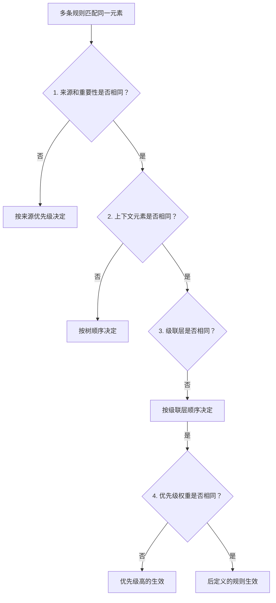
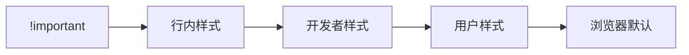
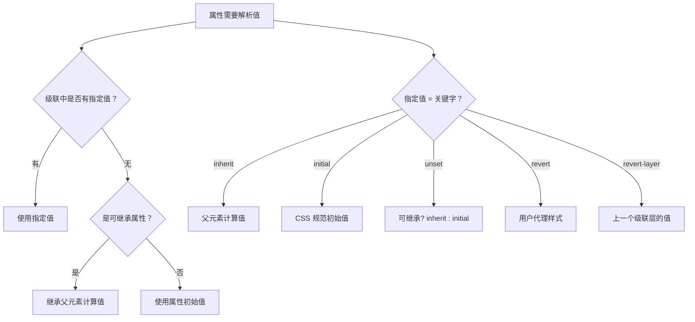
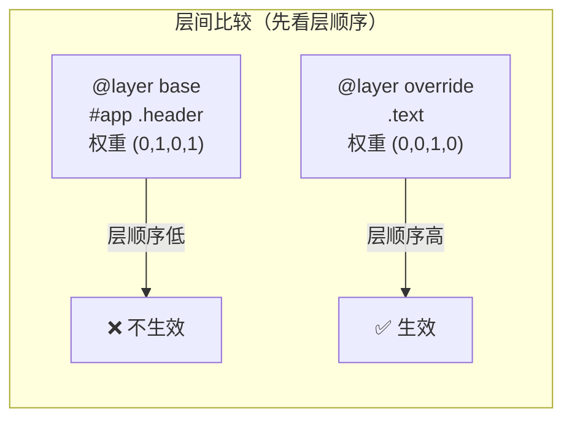
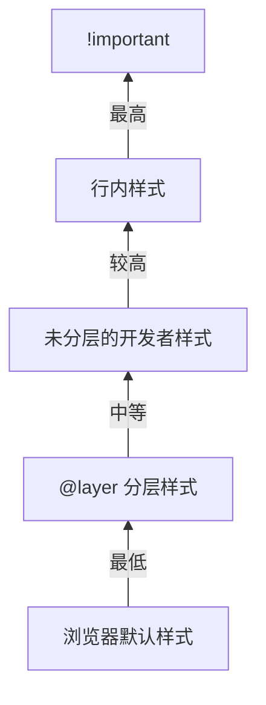
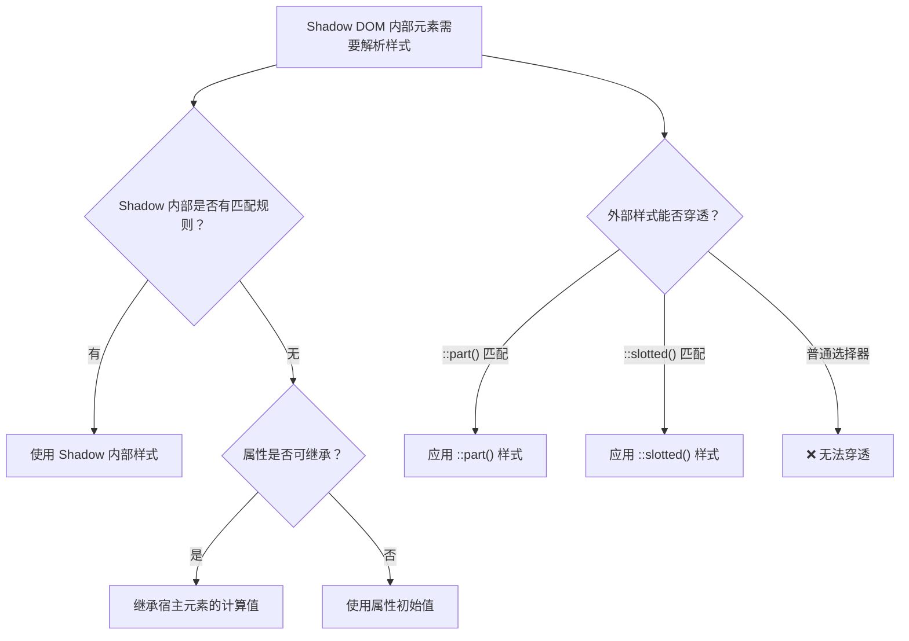

# CSS 优先级与继承

## 一、背景与动机

### 1.1 为什么需要优先级和继承？

在真实的 Web 项目中，一个 HTML 元素往往同时匹配多条 CSS 规则。例如，一个按钮可能同时匹配 `.btn`、`.btn-primary`、`button`、`#submit-btn` 等多条规则，浏览器需要一套明确的算法来决定最终应用哪条规则的声明。

与此同时，开发者也希望某些样式（如字体、颜色）能够从父元素自动传递到子元素，避免在每个元素上重复声明。这就是**继承**机制存在的意义。

优先级（Specificity）和继承（Inheritance）是 CSS **层叠（Cascade）** 机制的两大核心支柱。理解它们的工作原理，是解决"样式为什么不生效"这类问题的关键。

### 1.2 层叠机制的三大要素

CSS 层叠机制在决定最终样式时，按以下顺序依次判断：



> **关键认知**：优先级只是层叠机制的一个环节。即使优先级相同，声明顺序、级联层、来源层级也会影响最终结果。

### 1.3 现代 CSS 的挑战

随着 Web 应用复杂度提升，CSS 优先级管理面临新挑战：

- **组件化开发**：React/Vue 组件需要样式隔离
- **第三方库集成**：Bootstrap、Ant Design 等库的样式冲突
- **微前端架构**：多个独立应用的样式共存
- **设计系统**：需要可预测的样式覆盖机制

这些挑战催生了 `@layer`、CSS Modules、Shadow DOM 等现代解决方案。

---

## 二、核心概念

### 2.1 优先级权重体系

CSS 优先级使用 `(a, b, c, d)` 四元组表示（也称权重向量），从左到右依次比较，高位胜出：

| 选择器类型 | 权重贡献 | 权重表示 | 示例 |
|-----------|---------|---------|------|
| `!important` | 最高优先 | 覆盖所有普通声明 | `color: red !important;` |
| 行内样式 | 1 个 a 位 | (1, 0, 0, 0) | `style="color: red"` |
| ID 选择器 | 1 个 b 位 | (0, 1, 0, 0) | `#header` |
| 类选择器 | 1 个 c 位 | (0, 0, 1, 0) | `.container` |
| 伪类选择器 | 1 个 c 位 | (0, 0, 1, 0) | `:hover`、`:focus` |
| 属性选择器 | 1 个 c 位 | (0, 0, 1, 0) | `[type="text"]` |
| 元素选择器 | 1 个 d 位 | (0, 0, 0, 1) | `div`、`p` |
| 伪元素选择器 | 1 个 d 位 | (0, 0, 0, 1) | `::before`、`::after` |
| 通配符选择器 | 无贡献 | (0, 0, 0, 0) | `*` |
| 组合选择器 | 无贡献 | 不计入 | `>`、`+`、`~`、空格 |

> **注意**：CSS 规范中实际上使用的是三元组 `(a, b, c)`，行内样式单独处理。本文使用四元组 `(a, b, c, d)` 是为了将行内样式也纳入统一模型，便于理解。

### 2.2 优先级计算步骤

计算一个选择器的优先级，遵循以下步骤：

1. **行内样式** → 填入 a 位（无行内样式则为 0）
2. **统计 ID 选择器数量** → 填入 b 位
3. **统计类选择器、伪类、属性选择器数量** → 填入 c 位
4. **统计元素选择器、伪元素数量** → 填入 d 位
5. **忽略通配符 `*` 和组合选择器**
6. **从左到右依次比较**，高位胜出

### 2.3 继承的基本规则

CSS 继承是指子元素自动获得父元素某些属性值的机制：

- **可继承属性**：子元素自动继承父元素的计算值（如 `color`、`font-family`）
- **不可继承属性**：子元素不继承，使用 CSS 规范定义的初始值（如 `margin`、`padding`）
- **继承值的优先级**：继承的值优先级低于直接指定的值

---

## 三、深入原理

### 3.1 优先级的底层计算

#### 3.1.1 计算示例

```css
/* 权重: (0, 0, 0, 1) - 1个元素选择器 */
p { color: black; }

/* 权重: (0, 0, 1, 0) - 1个类选择器 */
.text { color: blue; }

/* 权重: (0, 0, 1, 1) - 1个类 + 1个元素 */
p.text { color: green; }

/* 权重: (0, 1, 0, 0) - 1个ID选择器 */
#intro { color: red; }

/* 权重: (0, 1, 0, 1) - 1个ID + 1个元素 */
#intro p { color: purple; }

/* 权重: (0, 1, 1, 1) - 1个ID + 1个类 + 1个元素 */
#intro p.text { color: orange; }

/* 权重: (0, 2, 1, 0) - 2个ID + 1个类 */
#main #sidebar .widget { color: teal; }

/* 权重: (0, 0, 2, 0) - 2个类选择器 */
.btn.primary { color: navy; }
```

#### 3.1.2 实际案例对比

```html
<div id="container" class="wrapper">
  <p class="text highlight">这段文字是什么颜色？</p>
</div>
```

```css
/* 规则 1: (0, 0, 0, 1) - 元素选择器 */
p { color: black; }

/* 规则 2: (0, 0, 1, 0) - 类选择器 */
.text { color: blue; }

/* 规则 3: (0, 0, 2, 0) - 2个类选择器 */
.text.highlight { color: green; }

/* 规则 4: (0, 0, 1, 1) - 类 + 元素 */
p.text { color: yellow; }

/* 规则 5: (0, 1, 0, 1) - ID + 元素 */
#container p { color: red; }

/* 规则 6: (0, 1, 1, 0) - ID + 类 ← 最高优先级 */
#container .text { color: purple; }

/* 结果: 规则 6 生效，文字颜色为紫色 */
```

#### 3.1.3 优先级比较的常见误区

**误区 1：权重可以"进位"**

```css
/* ❌ 错误认知：100个类选择器 > 1个ID选择器 */
/* ✅ 正确理解：权重从左到右比较，不进位 */

/* 权重: (0, 0, 100, 0) */
.class1.class2.class3...class100 { color: red; }

/* 权重: (0, 1, 0, 0) */
#id { color: blue; }

/* 结果: #id 生效，因为 b 位 1 > 0，不管 c 位多大 */
```

**误区 2：选择器越长优先级越高**

```css
/* ❌ 错误认知：选择器复杂就一定优先级高 */
html body div ul li a.link { color: red; } /* (0, 0, 1, 6) */

/* ✅ 一个 ID 就能覆盖 */
#content { color: blue; } /* (0, 1, 0, 0) - b位1 > 0 */
```

### 3.2 特殊选择器的优先级

#### 3.2.1 `:is()` 和 `:not()` 伪类

这些伪类**本身不增加优先级**，但会采用参数中选择器的**最高优先级**：

```css
/* 权重: (0, 1, 0, 0) - 取参数中最高优先级的 #id1 */
:is(.class1, #id1) {
  color: red;
}

/* 权重: (0, 0, 1, 0) - :not 本身不增加权重，取 .active 的权重 */
:not(.active) {
  opacity: 0.5;
}

/* 权重: (0, 0, 1, 1) - div 元素 + :not 中 .active 的类权重 */
div:not(.active) {
  color: blue;
}
```

#### 3.2.2 `:where()` 伪类

`:where()` 的优先级**始终为 0**，无论参数内容如何：

```css
/* 权重: (0, 0, 0, 0) - :where 优先级始终为 0 */
:where(article, section, aside) h2 {
  margin-top: 0;
}

/* 权重: (0, 0, 0, 1) - 只有 h2 元素选择器的权重 */
article h2 {
  margin-top: 1rem; /* 生效：(0,0,0,2) > (0,0,0,1) */
}
```

#### 3.2.3 `:has()` 伪类

`:has()` 的优先级计算规则与 `:is()` 相同——取参数中最高优先级的选择器：

```css
/* 权重: (0, 0, 1, 0) - :has 参数中 .active 是类选择器 */
div:has(.active) {
  border: 2px solid blue;
}

/* 权重: (0, 1, 0, 0) - :has 参数中 #id 是 ID 选择器 */
section:has(#highlight) {
  background: yellow;
}
```

### 3.3 层叠规则（Cascade）

#### 3.3.1 来源优先级顺序

CSS 声明按来源分为五个层级，从高到低依次为：

1. **`!important` 声明**（开发者样式中的重要声明）
2. **行内样式**（`style` 属性中的声明）
3. **开发者样式表**（Author Styles）
4. **用户样式表**（User Styles，浏览器扩展等）
5. **浏览器默认样式**（User Agent Styles）

> **说明**：这是一个面向教学的简化模型。严格的级联顺序中 `!important` 会**反转**来源层级——浏览器 `!important` > 用户 `!important` > 开发者 `!important`（详见第 3.8.5 节的层间反转）。



#### 3.3.2 就近原则（声明顺序）

当优先级相同时，**后定义的规则覆盖先定义的**：

```css
/* 同一文件中，后面的规则生效 */
p { color: red; }
p { color: blue; } /* 生效：蓝色 */

/* 多个样式表，后加载的生效 */
/* <link rel="stylesheet" href="base.css"> */
/* <link rel="stylesheet" href="override.css"> ← 优先级更高 */
```

#### 3.3.3 `!important` 的作用与限制

`!important` 会提升声明的优先级到最高，但**不改变选择器的优先级计算**：

```css
/* 低优先级选择器 + !important */
p { color: red !important; } /* 生效 */

/* 高优先级选择器，但没有 !important */
#content p { color: blue; } /* 不生效 */

/* 两个 !important 比较时，按正常优先级规则 */
p { color: red !important; }      /* (0,0,0,1) + !important */
.text { color: blue !important; }  /* (0,0,1,0) + !important ← 生效 */
```

> **工程警示**：`!important` 会破坏层叠的可预测性，应仅在特殊场景使用（覆盖第三方库、用户代理样式等）。

### 3.4 继承机制详解

#### 3.4.1 可继承属性分类

**字体相关属性**（全部可继承）：

```css
/* 这些属性会被子元素自动继承 */
font-family: Arial, sans-serif;
font-size: 16px;
font-weight: 400;
font-style: normal;
font-variant: normal;
font-stretch: normal;
line-height: 1.6;
```

**文本相关属性**（大部分可继承）：

```css
/* 文本属性可继承 */
color: #333;
text-align: left;
text-indent: 2em;
text-transform: none;
letter-spacing: 0;
word-spacing: 0;
direction: ltr;
white-space: normal;
text-shadow: none;
word-break: normal;
word-wrap: break-word;
```

**列表相关属性**（可继承）：

```css
/* 列表样式可继承 */
list-style-type: disc;
list-style-position: outside;
list-style-image: none;
list-style: disc outside none; /* 简写形式 */
```

**其他可继承属性**：

```css
visibility: visible;
cursor: pointer;
quotes: "«" "»";
```

#### 3.4.2 不可继承属性分类

**盒模型属性**（不可继承）：

```css
/* 盒模型属性不可继承 */
width: 100px;
height: 100px;
margin: 10px;
padding: 10px;
border: 1px solid #000;
box-sizing: border-box;
```

**布局属性**（不可继承）：

```css
/* 布局属性不可继承 */
display: block;
position: relative;
float: left;
clear: both;
overflow: hidden;
z-index: 1;
```

**背景属性**（不可继承）：

```css
/* 背景属性不可继承 */
background-color: #fff;
background-image: url('bg.png');
background-repeat: repeat;
background-position: center;
background-size: cover;
```

**其他不可继承属性**：

```css
opacity: 1;
transform: none;
transition: none;
animation: none;
box-shadow: none;
outline: none;
```

#### 3.4.3 继承值的优先级

继承的值优先级**低于**直接指定的值，也**低于**用户代理样式的初始值：

```css
/* 父元素设置了颜色 */
.parent { color: red; }

/* 子元素继承父元素颜色 */
.child { /* color: red (继承) */ }

/* 但如果子元素匹配了浏览器默认样式（如 <a> 标签的蓝色） */
/* 浏览器默认样式 > 继承值 */
.parent a { /* color: blue (浏览器默认) 而非 red (继承) */ }
```

### 3.5 控制继承的关键字

CSS 提供了五个关键字来精确控制属性的继承行为：

#### 3.5.1 `inherit` — 强制继承

强制继承父元素的属性值，即使该属性本身不可继承：

```css
.parent {
  border: 1px solid #000;
}

.child {
  border: inherit; /* 强制继承父元素的 border（该属性本身不可继承） */
}
```

**应用场景**：

```css
/* 重置按钮样式，继承父元素样式 */
button {
  background: inherit;
  color: inherit;
  font: inherit;
  border: inherit;
}

/* 继承链接颜色 */
a.disabled {
  color: inherit;
  pointer-events: none;
}
```

#### 3.5.2 `initial` — 重置为初始值

重置为 CSS 规范定义的初始值（与父元素无关）：

```css
.child {
  color: initial; /* 重置为 black（CSS 规范定义） */
  display: initial; /* 重置为 inline（CSS 规范定义） */
}
```

**应用场景**：

```css
/* 重置所有样式 */
.reset-all {
  all: initial; /* 重置所有属性为初始值 */
  display: block; /* 重新设置需要的属性 */
}

/* 重置列表样式 */
ul.custom {
  list-style: initial;
}
```

#### 3.5.3 `unset` — 智能重置

根据属性是否可继承自动选择行为：

```css
.child {
  color: unset; /* 可继承属性 → 等同于 inherit */
  border: unset; /* 不可继承属性 → 等同于 initial */
}
```

#### 3.5.4 `revert` — 重置为浏览器默认

重置为浏览器默认样式（用户代理样式层级）：

```css
.child {
  color: revert; /* 重置为浏览器默认颜色 */
  display: revert; /* 重置为浏览器默认 display */
}
```

**`initial` vs `revert` 的关键区别**：

```css
/* initial: 重置为 CSS 规范定义的初始值 */
div {
  display: initial; /* inline（规范定义的初始值） */
}

/* revert: 重置为浏览器默认样式 */
div {
  display: revert; /* block（浏览器对 <div> 的默认样式） */
}
```

#### 3.5.5 `revert-layer` — 级联层回退

`revert-layer` 与 `@layer` 配合使用，将属性值回退到**当前级联层的上一层**：

```css
@layer base {
  h1 { font-size: 2rem; color: #333; }
}

@layer components {
  h1 {
    font-size: 1.5rem;
    color: #007bff;
  }

  h1.revert-size {
    font-size: revert-layer; /* 回退到 @layer base 中的 2rem */
  }
}
```

> 如果当前样式不在任何级联层中，`revert-layer` 等同于 `revert`。

#### 3.5.6 关键字对比总结

| 关键字 | 可继承属性结果 | 不可继承属性结果 | 来源层级 | 典型用途 |
|--------|--------------|----------------|---------|---------|
| `inherit` | 父元素计算值 | 父元素计算值 | 父元素 | 强制继承 |
| `initial` | CSS 初始值 | CSS 初始值 | CSS 规范 | 重置为规范值 |
| `unset` | 父元素计算值 | CSS 初始值 | 混合 | 智能重置 |
| `revert` | 浏览器默认 | 浏览器默认 | 用户代理 | 恢复默认样式 |
| `revert-layer` | 上一层规则值 | 上一层规则值 | @layer 上层 | 级联层回退 |

### 3.6 显式默认值解析流程



### 3.7 `all` 属性与关键字组合

`all` 属性可以一次性重置所有属性（除 `direction` 和 `unicode-bidi`）：

```css
/* 彻底重置——移除所有样式（含继承），只剩 CSS 规范初始值 */
.element { all: initial; }

/* 智能重置——可继承属性保留继承，不可继承属性取初始值 */
.element { all: unset; }

/* 恢复浏览器默认——保留用户代理样式 */
.element { all: revert; }

/* 实战：嵌入第三方组件时彻底隔离 */
.embed-widget { all: initial; display: block; font-family: sans-serif; }
```

| `all` 值 | 继承属性结果 | 非继承属性结果 | 保留浏览器样式？ |
|----------|-------------|---------------|----------------|
| `initial` | CSS 规范初始值 | CSS 规范初始值 | 否 |
| `inherit` | 父元素计算值 | 父元素计算值 | 否 |
| `unset` | 父元素计算值 | CSS 规范初始值 | 否 |
| `revert` | 用户代理样式 | 用户代理样式 | 是 |
| `revert-layer` | 上层规则值 | 上层规则值 | 视@layer情况 |


#### all 交互演示（MDN）

将所有属性重置为指定值（inherit/initial/unset/revert）。

```html
<!DOCTYPE html>
<html lang="zh-CN">
  <head>
    <meta charset="UTF-8" />
    <meta name="viewport" content="width=device-width, initial-scale=1.0" />
    <title>all 属性演示 - MDN 示例</title>
    <meta name="description" content="视觉与颜色示例：all 属性演示。" />
    <style>
      * {
        margin: 0;
        padding: 0;
        box-sizing: border-box;
      }
      body {
        font-family: -apple-system, BlinkMacSystemFont, "Segoe UI", Roboto, "Helvetica Neue", Arial, sans-serif;
        min-height: 100vh;
        padding: 0;
      }
      .demo-layout {
        display: flex;
        height: 100vh;
        gap: 0;
      }
      .snippet-panel {
        width: 320px;
        flex-shrink: 0;
        padding: 16px;
        display: flex;
        flex-direction: column;
        gap: 8px;
        overflow-y: auto;
        border-right: 1px solid #ddd;
        background: #fafafa;
      }
      .snippet-btn {
        padding: 10px 14px;
        border: 1px solid #ccc;
        border-radius: 6px;
        background: #fff;
        font-family: "JetBrains Mono", "Fira Code", monospace;
        font-size: 13px;
        color: #333;
        cursor: pointer;
        text-align: left;
        transition: all 0.2s;
        line-height: 1.4;
      }
      .snippet-btn:hover {
        border-color: #8083ff;
        background: #f0f0ff;
      }
      .snippet-btn.active {
        border-color: #8083ff;
        background: #e8e8ff;
        color: #571bc1;
        font-weight: 600;
      }
      .preview-panel {
        flex: 1;
        padding: 16px;
        display: flex;
        align-items: center;
        justify-content: center;
        background: #fff;
        overflow: auto;
      }
      .preview-panel > section,
      .preview-panel > div:not(.snippet-panel):not(.demo-layout) {
        flex: 1;
        width: 100%;
        min-height: 0;
        height: 100%;
        display: flex;
        align-items: center;
        justify-content: center;
      }
      #example-element {
        color: gold;
        padding: 10px;
        font-size: 1.5rem;
        text-align: left;
        width: 100%;
      }

      .example-container {
        border: 2px dashed #2d5ae1;
      }

      .example-container-bg {
        background-color: #77767b;
        padding: 20px;
      }
    </style>
  </head>
  <body>
    <div class="demo-layout">
      <div class="snippet-panel">
        <button class="snippet-btn active" data-index="0">/*unset all property*/</button>
        <button class="snippet-btn" data-index="1">all: initial;</button>
        <button class="snippet-btn" data-index="2">all: inherit;</button>
        <button class="snippet-btn" data-index="3">all: unset;</button>
        <button class="snippet-btn" data-index="4">all: revert;</button>
      </div>
      <div class="preview-panel">
        <blockquote id="quote">Lorem ipsum dolor sit amet, consectetur adipiscing elit.</blockquote>
        Phasellus eget velit sagittis.
      </div>
    </div>
    <script>
      const snippets = [
        `#example-element {
  /*未设置 all 属性*/
}`,
        `#example-element {
  all: initial;
}`,
        `#example-element {
  all: inherit;
}`,
        `#example-element {
  all: unset;
}`,
        `#example-element {
  all: revert;
}`,
      ];

      let styleEl = document.createElement("style");
      document.head.appendChild(styleEl);

      function applySnippet(index) {
        styleEl.textContent = snippets[index];
        document.querySelectorAll(".snippet-btn").forEach((btn, i) => {
          btn.classList.toggle("active", i === index);
        });
      }

      document.querySelectorAll(".snippet-btn").forEach((btn) => {
        btn.addEventListener("click", () => applySnippet(parseInt(btn.dataset.index)));
      });

      applySnippet(0);
    </script>
  </body>
</html>

```
### 3.8 @layer 级联层深入讲解

CSS Cascade Layers（`@layer`）是 CSS Cascading and Inheritance Level 5 引入的新特性，它允许开发者在**来源层级**内显式定义样式的优先级层级，从根本上解决了样式覆盖的可预测性问题。

#### 3.8.1 为什么需要 @layer？

在没有 `@layer` 的时代，管理样式优先级主要依赖以下手段：

- 增加选择器复杂度（如 `.nav .item .link`）
- 使用 `!important` 强制覆盖
- 精心控制样式表的加载顺序

这些方法都缺乏**结构化的优先级管理**。`@layer` 提供了一种声明式的优先级分层机制。

#### 3.8.2 基本语法

```css
/* 方式 1: 先声明层级顺序，再填充内容 */
@layer reset, base, components, utilities;

@layer reset {
  * { margin: 0; padding: 0; box-sizing: border-box; }
}

@layer base {
  body { font-family: system-ui; line-height: 1.6; }
  a { color: blue; }
}

@layer components {
  .btn { padding: 0.5rem 1rem; border-radius: 4px; }
  .card { padding: 1rem; border: 1px solid #ddd; }
}

@layer utilities {
  .hidden { display: none; }
  .text-center { text-align: center; }
}
```

```css
/* 方式 2: 直接定义块（按出现顺序确定层级） */
@layer reset {
  * { margin: 0; }
}

@layer base {
  body { font-size: 16px; }
}
```

> **核心规则**：后声明的层优先级高于先声明的层。**层顺序一旦确定，层内选择器的优先级不影响层间比较**——高优先级层中再低优先级的选择器，也会覆盖低优先级层中高优先级的选择器。

#### 3.8.3 层间优先级覆盖

这是 `@layer` 最关键的认知——**层级顺序优先于选择器权重**：

```css
@layer base {
  /* 选择器优先级很高：(0, 1, 0, 1) */
  #app .header {
    color: red;
  }
}

@layer override {
  /* 选择器优先级很低：(0, 0, 1, 0) */
  .text {
    color: blue; /* 生效！因为 override 层 > base 层 */
  }
}
```



#### 3.8.4 未分层样式 vs 分层样式

**未放入任何 `@layer` 的样式，优先级高于所有分层样式**：

```css
@layer base {
  h1 { color: red; }       /* 分层样式 */
}

h1 { color: blue; }        /* 未分层样式 — 优先级更高，生效 */
```



#### 3.8.5 @layer 与 !important 的交互

`!important` 在 `@layer` 中的行为与普通样式**相反**——在层内使用 `!important` 时，**先声明的层优先级更高**：

```css
@layer base {
  h1 { color: red !important; }    /* 生效！important 在 base 层（先声明） */
}

@layer override {
  h1 { color: blue !important; }   /* 不生效 */
}
```

> **原理**：`!important` 反转了层间顺序。普通声明中后声明的层优先级高；`!important` 声明中先声明的层优先级高。这与来源层级的 `!important` 反转行为一致。

#### 3.8.6 嵌套 @layer

`@layer` 支持嵌套，形成子层级：

```css
@layer framework {
  @layer reset {
    * { margin: 0; }
  }

  @layer base {
    body { font-size: 16px; }
  }

  @layer components {
    .btn { padding: 8px 16px; }
  }
}

/* 等价于 */
@layer framework.reset {
  * { margin: 0; }
}

@layer framework.base {
  body { font-size: 16px; }
}

@layer framework.components {
  .btn { padding: 8px 16px; }
}
```

#### 3.8.7 第三方库集成实战

```css
/* 将第三方库放入低优先级层 */
@layer vendor, base, components, overrides;

/* @import 只能出现在样式表顶部（@charset/@layer 语句除外），
   不能嵌套在 @layer 块内；用 layer(vendor) 直接指定所属层 */
@import url('bootstrap.min.css') layer(vendor);

@layer base {
  /* 你的基础样式 */
  body { font-family: system-ui; }
}

@layer components {
  /* 你的组件样式 — 可以覆盖 vendor 层 */
  .btn {
    border-radius: 8px; /* 覆盖 Bootstrap 的 border-radius */
  }
}

@layer overrides {
  /* 特殊覆盖 */
  .btn-custom {
    background: linear-gradient(135deg, #667eea, #764ba2);
  }
}
```

### 3.9 Shadow DOM 中的优先级规则

Shadow DOM 为 Web Components 提供了样式封装能力。Shadow Tree 内部的样式默认**不会影响外部元素**，外部样式也**默认不会穿透**到 Shadow Tree 内部。

#### 3.9.1 样式隔离边界

```javascript
// 创建 Shadow DOM
const host = document.querySelector('#my-component');
const shadow = host.attachShadow({ mode: 'open' });

shadow.innerHTML = `
  <style>
    /* 这些样式只影响 Shadow Tree 内部 */
    p { color: red; }      /* 不会影响外部的 <p> */
    .content { font-size: 14px; }
  </style>
  <p class="content">Shadow 内部的段落</p>
`;
```

```css
/* 外部样式 */
p { color: blue; }          /* 不会影响 Shadow 内部的 <p> */
.content { font-size: 20px; } /* 不会影响 Shadow 内部的 .content */
```

> **关键规则**：Shadow DOM 创建了一个**样式作用域边界**。大多数外部 CSS 选择器无法穿透这个边界。

#### 3.9.2 可继承属性穿透 Shadow 边界

虽然样式被隔离，但**可继承属性**（如 `color`、`font-family`）会**穿透 Shadow 边界**——Shadow 内部的元素可以继承宿主元素（Host）的计算值：

```html
<div id="host" style="color: red; font-family: Arial;">
  <!-- Shadow DOM -->
  #shadow-root
    <p>这段文字是什么颜色？</p>
    <!-- 答案：红色（继承自宿主元素 #host） -->
```

```css
/* 外部样式可以影响宿主的继承属性 */
#host {
  color: red;           /* Shadow 内部的 <p> 会继承这个颜色 */
  font-family: Arial;   /* Shadow 内部会继承字体 */
}

/* 但不可继承属性不会穿透 */
#host {
  border: 2px solid blue;  /* 不会影响 Shadow 内部元素 */
  background: yellow;       /* 不会影响 Shadow 内部元素 */
}
```

#### 3.9.3 :host 伪类

`:host` 选择器用于选中 Shadow DOM 的宿主元素，其优先级为 **(0, 0, 1, 0)**（等同于类选择器）：

```css
/* 在 Shadow DOM 内部的 <style> 中 */

/* 选中宿主元素 */
:host {
  display: block;
  padding: 16px;
  border: 1px solid #ccc;
}

/* 带条件的 :host() */
:host(.active) {
  border-color: blue;    /* 仅当宿主有 .active 类时生效 */
}

/* :host-context() — 根据祖先元素条件匹配 */
:host-context(.dark-theme) {
  background: #333;
  color: #fff;
}
```

#### 3.9.4 ::slotted() 伪元素

`::slotted()` 用于选中通过 `<slot>` 插入到 Shadow DOM 中的元素。其优先级为 **(0, 0, 0, 1)**（等同于伪元素）：

```html
<my-component>
  <p slot="content">这段文字通过 slot 插入</p>
</my-component>
```

```css
/* 在 Shadow DOM 内部 */
::slotted(p) {
  color: red;           /* 选中 slot 插入的 <p> */
  font-weight: bold;
}

::slotted(.highlight) {
  background: yellow;   /* 选中有 .highlight 类的 slotted 元素 */
}
```

> **注意**：`::slotted()` 只能选中直接分配到 slot 的元素，不能选中 slotted 元素的后代。

#### 3.9.5 ::part() 伪元素——受控的样式穿透

`::part()` 允许外部样式选中 Shadow DOM 内部标记了 `part` 属性的元素，实现**受控的样式穿透**：

```html
<custom-button>
  #shadow-root
    <button part="button">
      <span part="label">Click me</span>
    </button>
</custom-button>
```

```css
/* 在外部样式中——通过 ::part() 穿透 Shadow DOM */
custom-button::part(button) {
  background: blue;
  color: white;
  border: none;
  padding: 8px 16px;
}

custom-button::part(label) {
  font-weight: bold;
}
```

#### 3.9.6 Shadow DOM 优先级决策流程



### 3.10 CSS 变量的继承

CSS 自定义属性（变量）天然支持继承，且继承的是**计算后的值**：

```css
:root {
  --primary-color: #3498db;
  --font-size-base: 16px;
}

.container {
  --primary-color: #e74c3c; /* 重写变量 */
}

.child {
  color: var(--primary-color); /* 继承最近的变量值 */
}
```

**变量继承示例**：

```html
<div class="parent">
  <p>父元素的 primary-color: #3498db</p>
  <div class="child">
    <p>子元素的 primary-color: #e74c3c</p>
  </div>
</div>
```

```css
:root {
  --primary-color: #3498db;
}

.parent {
  color: var(--primary-color); /* #3498db */
}

.child {
  --primary-color: #e74c3c; /* 重写变量 */
  color: var(--primary-color); /* #e74c3c */
}
```

---

## 四、代码示例

### 4.1 优先级计算实战

```html
<!DOCTYPE html>
<html lang="zh-CN">
<head>
  <meta charset="UTF-8">
  <title>优先级计算示例</title>
  <style>
    /* 规则 1: (0, 0, 0, 1) */
    p { color: black; }

    /* 规则 2: (0, 0, 1, 0) */
    .text { color: blue; }

    /* 规则 3: (0, 0, 2, 0) */
    .text.highlight { color: green; }

    /* 规则 4: (0, 0, 1, 1) */
    p.text { color: yellow; }

    /* 规则 5: (0, 1, 0, 1) */
    #container p { color: red; }

    /* 规则 6: (0, 1, 1, 0) ← 最高优先级 */
    #container .text { color: purple; }
  </style>
</head>
<body>
  <div id="container" class="wrapper">
    <p class="text highlight">这段文字是什么颜色？</p>
    <!-- 答案：紫色，因为规则 6 的优先级 (0,1,1,0) 最高 -->
  </div>
</body>
</html>
```

### 4.2 继承机制演示

```html
<!DOCTYPE html>
<html lang="zh-CN">
<head>
  <meta charset="UTF-8">
  <title>继承机制示例</title>
  <style>
    /* 在 body 设置通用样式 */
    body {
      font-family: -apple-system, BlinkMacSystemFont, 'Segoe UI', Roboto, sans-serif;
      font-size: 16px;
      color: #333;
      line-height: 1.6;
    }

    /* 子元素自动继承，无需重复设置 */
    .parent {
      color: #007bff; /* 覆盖 body 的颜色 */
    }

    .child {
      /* 自动继承 .parent 的 color: #007bff */
      /* 自动继承 body 的 font-family、font-size、line-height */
    }

    /* 不可继承属性需要显式设置 */
    .box {
      border: 1px solid #ccc; /* border 不可继承 */
      padding: 16px; /* padding 不可继承 */
    }
  </style>
</head>
<body>
  <div class="parent">
    <p>这段文字颜色为 #007bff（继承自 .parent）</p>
    <div class="child">
      <p>这段文字也继承 #007bff（通过 .parent 传递）</p>
    </div>
  </div>

  <div class="box">
    <p>这个盒子有边框和内边距（不可继承，需要显式设置）</p>
  </div>
</body>
</html>
```

### 4.3 继承控制关键字实战

```html
<!DOCTYPE html>
<html lang="zh-CN">
<head>
  <meta charset="UTF-8">
  <title>继承控制关键字</title>
  <style>
    .parent {
      color: #007bff;
      border: 2px solid #333;
    }

    /* inherit: 强制继承 */
    .child-inherit {
      color: inherit; /* 继承父元素的 color */
      border: inherit; /* 强制继承 border（该属性本身不可继承） */
    }

    /* initial: 重置为初始值 */
    .child-initial {
      color: initial; /* 重置为 black（CSS 初始值） */
      border: initial; /* 重置为 none（CSS 初始值） */
    }

    /* unset: 智能重置 */
    .child-unset {
      color: unset; /* color 可继承 → 等同于 inherit → #007bff */
      border: unset; /* border 不可继承 → 等同于 initial → none */
    }

    /* revert: 重置为浏览器默认 */
    .child-revert {
      color: revert; /* 重置为浏览器默认颜色（通常是 black） */
    }
  </style>
</head>
<body>
  <div class="parent">
    <p class="child-inherit">inherit: 继承父元素所有样式</p>
    <p class="child-initial">initial: 重置为 CSS 初始值</p>
    <p class="child-unset">unset: 可继承则继承，不可继承则重置</p>
    <p class="child-revert">revert: 重置为浏览器默认样式</p>
  </div>
</body>
</html>
```

### 4.4 `:where()` 降低优先级

```css
/* 基础样式使用 :where()，优先级为 0，方便覆盖 */
:where(article, section, aside) h2 {
  margin-top: 0;
  font-size: 1.5em;
}

/* 轻松覆盖基础样式——单个类选择器即可 */
article h2 {
  margin-top: 2rem; /* 生效：(0,0,0,2) > (0,0,0,1) */
}

/* 对比：如果使用 :is()，优先级会更高 */
:is(article, section, aside) h2 {
  margin-top: 0; /* 优先级 (0,0,0,2) */
}

article h2 {
  margin-top: 2rem; /* 需要更高优先级才能覆盖 */
}
```

### 4.5 实际项目冲突案例

#### 4.5.1 案例 1：按钮样式被全局样式覆盖

**问题场景**：

```html
<button class="btn btn-primary">提交</button>
```

```css
/* 全局样式 */
button {
  background: #f0f0f0;
  color: #333;
  border: 1px solid #ccc;
}

/* 组件样式 */
.btn {
  padding: 8px 16px;
  border-radius: 4px;
}

.btn-primary {
  background: #007bff;
  color: white;
}
```

**问题分析**：
- `button` 选择器权重：(0, 0, 0, 1)
- `.btn` 选择器权重：(0, 0, 1, 0)
- `.btn-primary` 选择器权重：(0, 0, 1, 0)

**结果**：`.btn-primary` 生效，因为类选择器优先级高于元素选择器。

**解决方案**：使用更具体的选择器

```css
/* 方案 1：组合选择器 */
button.btn-primary {
  background: #007bff;
  color: white;
}

/* 方案 2：使用 :where() 降低全局样式优先级 */
:where(button) {
  background: #f0f0f0;
  color: #333;
  border: 1px solid #ccc;
}
```

#### 4.5.2 案例 2：导航栏链接颜色冲突

**问题场景**：

```html
<nav class="main-nav">
  <ul class="nav-list">
    <li class="nav-item">
      <a href="#" class="nav-link">首页</a>
    </li>
    <li class="nav-item active">
      <a href="#" class="nav-link">关于我们</a>
    </li>
  </ul>
</nav>
```

```css
/* 全局链接样式 */
a {
  color: blue;
  text-decoration: underline;
}

/* 导航样式 */
.nav-link {
  color: #333;
  text-decoration: none;
}

/* 激活状态 */
.nav-item.active .nav-link {
  color: #007bff;
  font-weight: bold;
}
```

**问题分析**：
- `a` 权重：(0, 0, 0, 1)
- `.nav-link` 权重：(0, 0, 1, 0)
- `.nav-item.active .nav-link` 权重：(0, 0, 3, 0)

**结果**：激活状态的链接显示蓝色加粗，因为选择器更具体。

#### 4.5.3 案例 3：表单输入框样式被重置

**问题场景**：

```html
<form class="contact-form">
  <input type="text" class="form-input" placeholder="请输入姓名">
  <input type="email" class="form-input" placeholder="请输入邮箱">
</form>
```

```css
/* CSS Reset */
* {
  margin: 0;
  padding: 0;
  box-sizing: border-box;
}

/* 表单样式 */
.form-input {
  padding: 8px 12px;
  border: 1px solid #ddd;
  border-radius: 4px;
  font-size: 14px;
}

/* 焦点状态 */
.form-input:focus {
  border-color: #007bff;
  outline: none;
  box-shadow: 0 0 0 3px rgba(0, 123, 255, 0.1);
}
```

**问题分析**：
- `*` 通配符权重：(0, 0, 0, 0)
- `.form-input` 权重：(0, 0, 1, 0)
- `.form-input:focus` 权重：(0, 0, 2, 0)

**结果**：表单样式正常生效，因为类选择器优先级高于通配符。

#### 4.5.4 案例 4：表格样式被第三方库覆盖

**问题场景**：

```html
<table class="data-table">
  <thead>
    <tr>
      <th>姓名</th>
      <th>年龄</th>
    </tr>
  </thead>
  <tbody>
    <tr>
      <td>张三</td>
      <td>25</td>
    </tr>
  </tbody>
</table>
```

```css
/* 第三方库样式（如 Bootstrap） */
.table {
  width: 100%;
  border-collapse: collapse;
}

.table th,
.table td {
  padding: 8px;
  border: 1px solid #ddd;
}

/* 自定义样式 */
.data-table {
  background: #f9f9f9;
}

.data-table th {
  background: #007bff;
  color: white;
}
```

**问题分析**：
- `.table th` 权重：(0, 0, 1, 1)
- `.data-table th` 权重：(0, 0, 1, 1)

**结果**：后定义的样式生效。如果 `.data-table th` 在后面定义，则显示蓝色背景。

**解决方案**：

```css
/* 方案 1：提高选择器优先级 */
table.data-table th {
  background: #007bff;
  color: white;
}

/* 方案 2：使用 @layer 管理第三方库 */
@layer vendor, custom;

@layer vendor {
  /* Bootstrap 样式 */
}

@layer custom {
  .data-table th {
    background: #007bff;
    color: white;
  }
}
```

#### 4.5.5 案例 5：卡片组件样式冲突

**问题场景**：

```html
<div class="container">
  <div class="card">
    <h3 class="card-title">标题</h3>
    <p class="card-content">内容</p>
  </div>
</div>
```

```css
/* 全局标题样式 */
h3 {
  font-size: 1.5rem;
  color: #333;
  margin-bottom: 1rem;
}

/* 卡片组件样式 */
.card {
  padding: 1rem;
  border: 1px solid #ddd;
  border-radius: 8px;
}

.card-title {
  font-size: 1.25rem;
  color: #007bff;
  margin-bottom: 0.5rem;
}

/* 容器内的卡片 */
.container .card-title {
  font-size: 1.5rem;
  color: #333;
}
```

**问题分析**：
- `h3` 权重：(0, 0, 0, 1)
- `.card-title` 权重：(0, 0, 1, 0)
- `.container .card-title` 权重：(0, 0, 2, 0)

**结果**：`.container .card-title` 生效，显示 1.5rem 和 #333 颜色。

**解决方案**：使用 BEM 命名避免深层嵌套

```css
/* 使用 BEM 命名 */
.card__title {
  font-size: 1.25rem;
  color: #007bff;
}

.card__title--large {
  font-size: 1.5rem;
  color: #333;
}
```

#### 4.5.6 案例 6：响应式设计中的优先级问题

**问题场景**：

```css
/* 基础样式 */
.sidebar {
  width: 300px;
  display: block;
}

/* 移动端样式 */
@media (max-width: 768px) {
  .sidebar {
    width: 100%;
    display: none;
  }

  .sidebar.active {
    display: block;
  }
}

/* 问题：下面的样式会覆盖媒体查询 */
.sidebar {
  width: 250px;
}
```

**问题分析**：
- 第一个 `.sidebar` 权重：(0, 0, 1, 0)
- 媒体查询中的 `.sidebar` 权重：(0, 0, 1, 0)
- 第二个 `.sidebar` 权重：(0, 0, 1, 0)

**结果**：第二个 `.sidebar` 生效，因为它在后面定义，覆盖了媒体查询中的样式。

**解决方案**：调整样式顺序

```css
/* 基础样式 */
.sidebar {
  width: 300px;
  display: block;
}

/* 覆盖样式（放在媒体查询之前） */
.sidebar {
  width: 250px;
}

/* 响应式样式（放在最后） */
@media (max-width: 768px) {
  .sidebar {
    width: 100%;
    display: none;
  }

  .sidebar.active {
    display: block;
  }
}
```

#### 4.5.7 案例 7：CSS 变量继承冲突

**问题场景**：

```css
:root {
  --primary-color: blue;
}

.theme-dark {
  --primary-color: #666;
}

.button {
  background: var(--primary-color);
}

/* 问题：下面的样式会覆盖变量 */
.button {
  --primary-color: red;
}
```

**问题分析**：
- CSS 变量遵循正常的层叠规则
- 后定义的 `.button` 会覆盖前面的变量值

**结果**：按钮背景显示红色，因为后面的变量定义覆盖了前面的。

**解决方案**：使用更具体的选择器

```css
:root {
  --primary-color: blue;
}

.theme-dark {
  --primary-color: #666;
}

.theme-dark .button {
  --primary-color: #666;
  background: var(--primary-color);
}

.button {
  background: var(--primary-color);
}
```

---

## 五、最佳实践

### 5.1 优先级管理策略

#### 5.1.1 避免过度使用 `!important`

```css
/* ❌ 不推荐：滥用 !important */
p { color: red !important; }
.text { color: blue !important; }

/* ✅ 推荐：通过提高选择器优先级 */
#content p.text { color: red; }
```

**`!important` 的合理使用场景**：

```css
/* 覆盖第三方库样式 */
.third-party-lib .element {
  color: red !important;
}

/* 工具类样式 */
.hidden { display: none !important; }
.text-center { text-align: center !important; }

/* 用户代理样式覆盖 */
[aria-hidden="true"] {
  display: none !important;
}
```

#### 5.1.2 使用低优先级选择器

```css
/* ❌ 不推荐：优先级过高，难以覆盖 */
#header .nav .menu .item a.link { }

/* ✅ 推荐：使用 BEM 命名，降低选择器复杂度 */
.nav__link { }

/* ✅ 推荐：使用单一类选择器 */
.menu-item-link { }
```

#### 5.1.3 使用 `:where()` 降低优先级

```css
/* 基础样式使用 :where()，方便覆盖 */
:where(article, section, aside) h2 {
  margin-top: 0;
  font-size: 1.5em;
}

/* 轻松覆盖基础样式 */
article h2 {
  margin-top: 2rem;
}
```

#### 5.1.4 优先级分层管理

```css
/* 层级 1: 基础样式 (优先级最低) */
:where(base) { }

/* 层级 2: 组件样式 (中等优先级) */
.component { }

/* 层级 3: 工具类 (优先级最高) */
.utils { }

/* 层级 4: 例外情况 (使用 !important) */
.override { color: red !important; }
```

### 5.2 合理利用继承

#### 5.2.1 在根元素设置全局样式

```css
/* 在 body 设置通用样式 */
body {
  font-family: -apple-system, BlinkMacSystemFont, 'Segoe UI', Roboto, sans-serif;
  font-size: 16px;
  color: #333;
  line-height: 1.6;
}

/* 子元素自动继承，减少重复代码 */
```

#### 5.2.2 利用 CSS 变量继承

```css
:root {
  --font-size-base: 16px;
  --line-height-base: 1.6;
  --color-text: #333;
}

body {
  font-size: var(--font-size-base);
  line-height: var(--line-height-base);
  color: var(--color-text);
}

/* 在组件中重写变量 */
.article {
  --font-size-base: 18px;
  --color-text: #222;
}
```

#### 5.2.3 避免不必要的继承覆盖

```css
/* ❌ 不推荐：重复设置继承属性 */
.parent { color: #333; }
.child { color: #333; } /* 不必要 */

/* ✅ 推荐：利用继承 */
.parent { color: #333; }
.child { /* 自动继承 */ }
```

### 5.3 选择器命名规范

#### 5.3.1 使用 BEM 命名法

```css
/* Block（块）*/
.card { }

/* Element（元素）*/
.card__title { }
.card__content { }

/* Modifier（修饰符）*/
.card--featured { }
.card__title--large { }
```

#### 5.3.2 避免深层嵌套

```css
/* ❌ 不推荐：嵌套过深 */
#app .container .row .col .card .title { }

/* ✅ 推荐：扁平化选择器 */
.card__title { }

/* ❌ 不推荐：过度限定 */
div.container div.row { }

/* ✅ 推荐：简化选择器 */
.container .row { }
```

### 5.4 CSS 架构中的优先级管理策略

#### 5.4.1 使用 CSS Layers（@layer）构建分层架构

现代 CSS 架构推荐使用 `@layer` 建立清晰的优先级分层：

```css
/* 定义层级顺序（从低到高） */
@layer reset, base, components, utilities, overrides;

/* 第 1 层：重置样式 */
@layer reset {
  *, *::before, *::after {
    box-sizing: border-box;
    margin: 0;
    padding: 0;
  }
}

/* 第 2 层：基础样式 */
@layer base {
  body {
    font-family: system-ui, -apple-system, sans-serif;
    font-size: 16px;
    line-height: 1.6;
    color: #333;
  }

  a {
    color: #007bff;
    text-decoration: none;
  }
}

/* 第 3 层：组件样式 */
@layer components {
  .btn {
    display: inline-block;
    padding: 0.5rem 1rem;
    border-radius: 4px;
    background: #007bff;
    color: white;
  }

  .card {
    padding: 1rem;
    border: 1px solid #ddd;
    border-radius: 8px;
  }
}

/* 第 4 层：工具类 */
@layer utilities {
  .hidden { display: none; }
  .text-center { text-align: center; }
  .mt-4 { margin-top: 1rem; }
}

/* 第 5 层：覆盖层（特殊场景） */
@layer overrides {
  .btn-custom {
    background: linear-gradient(135deg, #667eea, #764ba2);
  }
}
```

#### 5.4.2 第三方库集成策略

使用 `@layer` 管理第三方库样式，避免样式冲突：

```css
/* 策略 1：将第三方库放入低优先级层 */
@layer vendor, base, components, overrides;

/* @import 位于样式表顶部，用 layer() 指定所属层 */
@import url('bootstrap.min.css') layer(vendor);

@layer base {
  /* 你的基础样式 */
}

@layer components {
  /* 可以覆盖 vendor 层的样式 */
  .btn {
    border-radius: 8px; /* 覆盖 Bootstrap 的 border-radius */
  }
}
```

```css
/* 策略 2：使用 :where() 降低第三方库选择器优先级 */
:where(.third-party-lib .component) {
  /* 优先级为 0，容易被覆盖 */
}
```

#### 5.4.3 微前端架构中的样式隔离

在微前端场景下，多个独立应用需要样式隔离：

```css
/* 方案 1：使用 Shadow DOM 完全隔离 */
<my-micro-app>
  #shadow-root
    <style>
      /* 这些样式完全隔离，不影响外部 */
      .btn { background: red; }
    </style>
</my-micro-app>

/* 方案 2：使用 CSS Modules（构建工具支持） */
/* button.module.css */
.btn {
  background: blue; /* 编译后变成 .btn_abc123 */
}

/* 方案 3：使用 BEM + 命名空间 */
.app1-btn { background: red; }
.app2-btn { background: blue; }
```

#### 5.4.4 设计系统中的优先级管理

设计系统需要可预测的样式覆盖机制：

```css
/* 设计系统层级结构 */
@layer design-system.tokens, design-system.base, design-system.components, design-system.themes;

/* Token 层：设计变量 */
@layer design-system.tokens {
  :root {
    --color-primary: #007bff;
    --color-secondary: #6c757d;
    --color-text: #333;
    --font-family-base: system-ui, -apple-system, sans-serif;
    --spacing-sm: 0.5rem;
    --spacing-md: 1rem;
  }
}

/* Base 层：基础样式 */
@layer design-system.base {
  body {
    font-family: var(--font-family-base);
    color: var(--color-text);
  }
}

/* Components 层：组件样式 */
@layer design-system.components {
  .ds-button {
    padding: var(--spacing-sm) var(--spacing-md);
    background: var(--color-primary);
  }
}

/* Themes 层：主题覆盖 */
@layer design-system.themes {
  [data-theme="dark"] {
    --color-primary: #667eea;
    --color-text: #fff;
  }
}
```

#### 5.4.5 模块化组织

```
styles/
├── layers/
│   ├── reset.css          /* @layer reset */
│   ├── base.css           /* @layer base */
│   ├── components.css     /* @layer components */
│   ├── utilities.css      /* @layer utilities */
│   └── overrides.css      /* @layer overrides */
├── vendor/
│   ├── bootstrap.css
│   └── third-party.css
├── themes/
│   ├── light.css
│   └── dark.css
└── main.css               /* 入口文件，定义 @layer 顺序 */
```

```css
/* main.css */
@import url('./layers/reset.css') layer(reset);
@import url('./layers/base.css') layer(base);
@import url('./layers/components.css') layer(components);
@import url('./layers/utilities.css') layer(utilities);
@import url('./layers/overrides.css') layer(overrides);

/* 未分层的普通样式优先级高于所有分层样式 */
.critical-override {
  color: red;
}
/* ⚠️ 注意：如果这里改用 !important 结论会反转——
   !important 声明中，分层样式的优先级高于未分层样式（见 3.8.5） */
```

### 5.5 显式默认值实战模式

**CSS 重置最佳方案**：

```css
/* 推荐的 CSS 重置——使用 unset 保留继承属性 */
*, *::before, *::after {
  box-sizing: border-box;
  margin: unset;
  padding: unset;
}

/* 更激进的重置——但会破坏继承 */
*, *::before, *::after {
  all: unset;
  box-sizing: border-box;
}
```

**组件卸载样式**：

```css
/* 在组件内部重置所有样式，然后重建 */
.card {
  all: unset;
  display: block;
  box-sizing: border-box;
  padding: 1rem;
  border-radius: 8px;
  background: #fff;
  font-family: inherit; /* 恢复关键继承 */
  font-size: inherit;
  color: inherit;
}
```

**`initial` vs `revert` 实际差异**：

```css
/* display: initial → inline (CSS规范初始值) */
/* display: revert → block (浏览器对 <div> 的默认值) */

div.reset-initial { display: initial; }  /* 行内元素！可能不符合预期 */
div.reset-revert  { display: revert; }   /* 块级元素——恢复浏览器默认 */
```

> **关键结论**：`revert` 通常比 `initial` 更符合直觉——它恢复浏览器默认样式而非CSS规范定义的抽象初始值。`unset` 是最常用的"智能重置"。

---

## 六、常见问题

### Q1: 为什么我的样式没有生效？

**可能原因及解决方案**：

```css
/* 问题 1: 优先级不足 */
.text { color: red; }
#container .text { color: blue; } /* 生效 */

/* 解决方案：提高选择器优先级 */
.container .text { color: red; }
#container .text { color: blue; } /* 仍然生效 */

/* 问题 2: 样式被覆盖 */
p { color: red; }
p { color: blue; } /* 后面的生效 */

/* 解决方案：调整样式顺序或提高优先级 */

/* 问题 3: 属性不可继承 */
.parent { border: 1px solid #000; }
.child { /* 没有边框 */ }

/* 解决方案：显式设置或使用 inherit */
.child { border: inherit; }
```

### Q2: 如何快速调试优先级问题？

**使用浏览器开发者工具**：

1. 打开开发者工具（F12）
2. 选择 Elements 面板
3. 查看 Styles 面板中的样式
4. 被划掉的样式表示优先级较低

**调试技巧**：

```css
/* 使用 :where() 快速降低优先级 */
:where(.test) { color: red; }

/* 使用 !important 快速测试（仅用于调试） */
.test { color: red !important; }
```

### Q3: 如何覆盖第三方库的样式？

**方案 1: 提高选择器优先级**

```css
/* 第三方库样式 */
.third-party .button { color: blue; }

/* 覆盖样式：增加 ID 选择器 */
#app .third-party .button { color: red; }
```

**方案 2: 使用 `!important`**

```css
.third-party .button {
  color: red !important;
}
```

**方案 3: 使用 CSS Layers**

```css
@layer third-party, my-styles;

@layer third-party {
  .button { color: blue; }
}

@layer my-styles {
  .button { color: red; } /* 优先级更高 */
}
```

### Q4: `:is()` 和 `:where()` 有什么区别？

**主要区别在于优先级**：

```css
/* :is() - 采用参数中最高优先级 */
:is(.class1, #id1) { color: red; }
/* 权重: (0, 1, 0, 0) - 取 #id1 的权重 */

/* :where() - 优先级始终为 0 */
:where(.class1, #id1) { color: red; }
/* 权重: (0, 0, 0, 0) - 始终为 0 */

/* 应用场景 */
:is(article, section, aside) h2 { } /* 复杂选择器 */
:where(article, section, aside) h2 { } /* 可覆盖的基础样式 */
```

### Q5: 如何重置所有样式？

**方案 1: 使用 `all: initial`**

```css
.reset-all {
  all: initial; /* 重置所有属性为初始值 */
  display: block; /* 重新设置需要的属性 */
}
```

**方案 2: 使用 `all: unset`**

```css
.reset-all {
  all: unset; /* 可继承属性继承，不可继承属性重置 */
}
```

**方案 3: 使用 `all: revert`**

```css
.reset-all {
  all: revert; /* 恢复为浏览器默认样式 */
}
```

### Q6: CSS 变量如何影响继承？

**CSS 变量天然支持继承**：

```css
:root {
  --color: blue;
}

.parent {
  --color: red; /* 重写变量 */
  color: var(--color); /* red */
}

.child {
  /* 继承父元素的变量值 */
  color: var(--color); /* red */
}

.child2 {
  --color: green; /* 重写变量 */
  color: var(--color); /* green */
}
```

**利用变量继承实现主题切换**：

```css
:root {
  --bg-color: #fff;
  --text-color: #333;
}

[data-theme="dark"] {
  --bg-color: #1a1a1a;
  --text-color: #fff;
}

body {
  background-color: var(--bg-color);
  color: var(--text-color);
}

/* 所有子元素自动继承新主题的变量值 */
```

---

## 七、参考资源

- [MDN - CSS 优先级](https://developer.mozilla.org/zh-CN/docs/Web/CSS/Specificity)
- [MDN - CSS 继承](https://developer.mozilla.org/zh-CN/docs/Web/CSS/inheritance)
- [CSS Working Group - CSS Cascading and Inheritance](https://drafts.csswg.org/css-cascade/)
- [CSS Tricks - Specificity](https://css-tricks.com/specifics-on-css-specificity/)
- [W3C CSS Selectors Level 4](https://www.w3.org/TR/selectors-4/)
- [Josh Comeau - CSS Specificity](https://www.joshwcomeau.com/css/specificity/)

