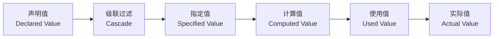
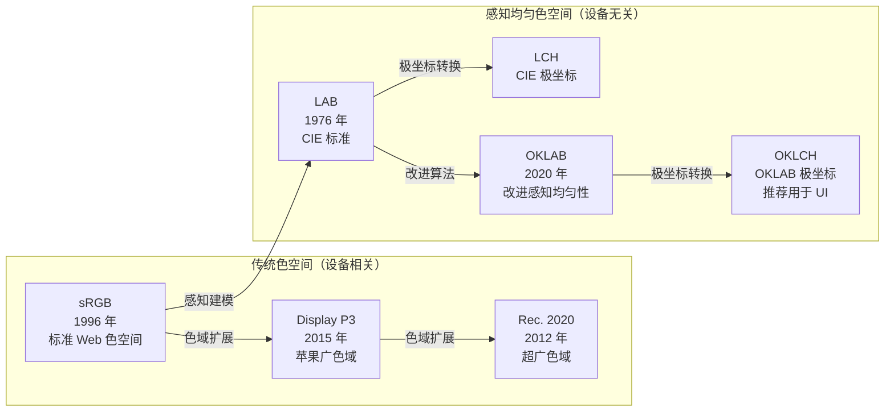
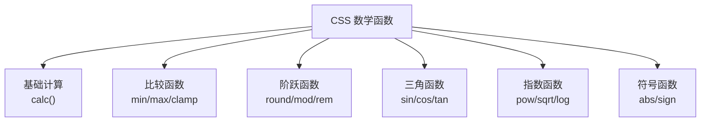
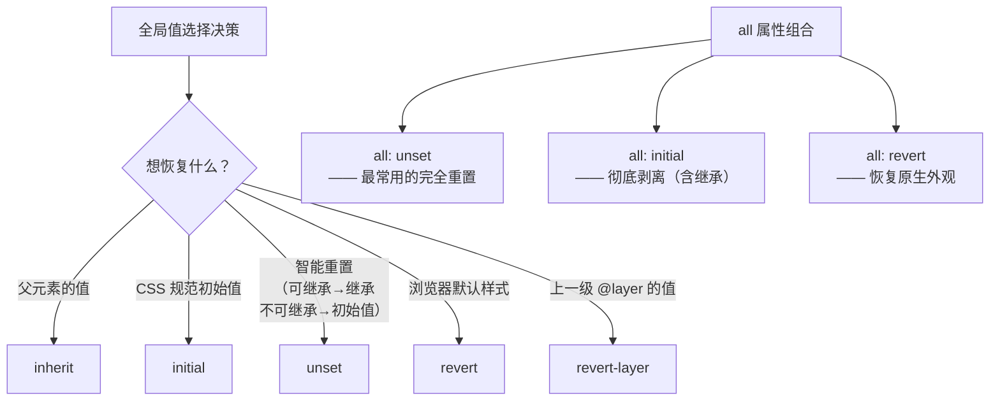
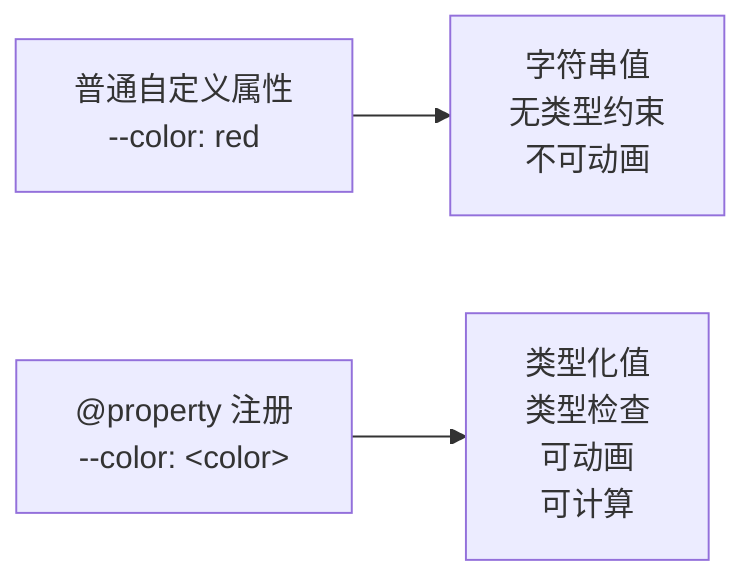

# CSS 属性与值

## 一、背景与动机

### 1.1 为什么需要深入理解属性值？

CSS 的核心工作是**为 HTML 元素应用样式**，而样式的本质就是**属性 - 值对（property-value pairs）**。每个 CSS 属性都有严格的值类型定义，只有提供正确类型的值，浏览器才能正确解析和应用样式。

在实际开发中，开发者经常遇到以下问题：

- **颜色显示不一致**：不同颜色格式在不同设备上的表现差异，sRGB 与 Display P3 色域冲突
- **布局尺寸异常**：单位选择不当导致响应式失效，em 级联计算错误
- **性能问题**：过度使用复杂函数或渐变导致渲染卡顿，calc() 嵌套过深
- **代码冗余**：不理解简写属性导致重复声明，CSS 变量作用域混乱
- **兼容性问题**：现代颜色空间（OKLCH、color-mix）在旧浏览器中的回退处理

理解属性值的**类型体系、解析算法、计算规则和最佳实践**，是编写高效、可维护 CSS 的基础。

### 1.2 CSS 值类型体系概览

```mermaid
flowchart TD
    A["CSS 属性值"] --> B["关键字值"]
    A --> C["数值类型"]
    A --> D["颜色值"]
    A --> E["长度值"]
    A --> F["函数值"]
    A --> G["全局值"]

    B --> B1["通用关键字<br/>inherit/initial/unset"]
    B --> B2["专用关键字<br/>block/flex/relative"]

    C --> C1["整数/小数"]
    C --> C2["角度值<br/>deg/rad/grad/turn"]
    C --> C3["时间值<br/>s/ms"]
    C --> C4["百分比<br/>%"]

    D --> D1["十六进制<br/>#RGB/#RRGGBB"]
    D --> D2["RGB/HSL<br/>传统语法"]
    D --> D3["LAB/LCH/OKLCH<br/>现代颜色空间"]
    D --> D4["渐变<br/>linear/radial/conic"]
    D --> D5["color-mix()<br/>颜色混合"]

    E --> E1["绝对单位<br/>px/cm/in/pt"]
    E --> E2["相对单位<br/>em/rem/vw/vh"]
    E --> E3["视口单位<br/>svh/lvh/dvh"]

    F --> F1["数学函数<br/>calc/min/max/clamp"]
    F --> F2["三角函数<br/>sin/cos/tan"]
    F --> F3["变换函数<br/>translate/rotate/scale"]
    F --> F4["滤镜函数<br/>blur/brightness"]
    F --> F5["变量函数<br/>var()"]

    G --> G1["inherit"]
    G --> G2["initial"]
    G --> G3["unset"]
    G --> G4["revert"]
    G --> G5["revert-layer"]

```



### 1.3 学习目标

完成本章学习后，你将掌握：

1. CSS 属性值的完整类型体系和语法规则
2. 属性值的解析算法和计算流程（指定值→计算值→使用值）
3. 现代颜色空间（OKLCH、Display P3）的原理和应用
4. CSS 数学函数（包括三角函数、指数函数）的高级用法
5. CSS 变量的作用域、继承和动态更新机制
6. 属性值的性能优化和可访问性最佳实践

---

## 二、核心概念

### 2.1 属性声明的基本结构

CSS 属性声明由**属性名**、**冒号**和**属性值**组成，以分号结尾：

```css
/* 基本语法 */
property: value;

/* 示例 */
color: red;
width: 100px;
margin: 10px 20px;
background: linear-gradient(to right, #007bff, #00d4ff);
```

**关键规则：**
- 属性名是大小写不敏感的（但建议统一小写）
- 值与属性名之间的空白会被忽略
- 多个声明之间用分号分隔
- 最后一个分号可以省略（但建议保留）

### 2.2 值类型分类

CSS 属性值可以分为以下几大类：

1. **关键字值**：CSS 预定义的标识符（如 `block`、`flex`、`red`）
2. **数值类型**：整数、小数、百分比、角度、时间等
3. **颜色值**：十六进制、RGB、HSL、LAB、OKLCH 等多种表示方式
4. **长度值**：绝对单位（px、cm）和相对单位（em、rem、vw）
5. **函数值**：`calc()`、`var()`、`transform` 函数等
6. **全局值**：`inherit`、`initial`、`unset`、`revert`、`revert-layer`

### 2.2.1 CSS 属性分类体系

CSS 属性数量庞大（超过 500 个），按功能可分为以下核心类别。理解分类体系有助于快速定位属性、理解属性间的关联与约束。

```mermaid
flowchart TD
    A["CSS 属性分类"] --> B["布局类"]
    A --> C["盒模型类"]
    A --> D["文本排版类"]
    A --> E["背景与边框类"]
    A --> F["动画与过渡类"]
    A --> G["变换类"]
    A --> H["其他功能类"]

    B --> B1["display / position / float"]
    B --> B2["flex 布局族"]
    B --> B3["grid 布局族"]
    B --> B4["columns / gap"]

    C --> C1["width / height / min-* / max-*"]
    C --> C2["margin / padding"]
    C --> C3["border / border-radius"]
    C --> C4["box-sizing / overflow"]

    D --> D1["font-* / line-height"]
    D --> D2["text-* / letter-spacing"]
    D --> D3["word-* / white-space"]
    D --> D4["writing-mode / direction"]

    E --> E1["background-*"]
    E --> E2["border-image / outline"]
    E --> E3["box-shadow"]

    F --> F1["animation-*"]
    F --> F2["transition-*"]
    F --> F3["@keyframes"]

    G --> G1["transform / transform-origin"]
    G --> G2["perspective / backface-visibility"]

    H --> H1["opacity / visibility / cursor"]
    H --> H2["filter / backdrop-filter"]
    H --> H3["clip-path / mask"]
    H --> H4["mix-blend-mode / isolation"]

```



**各分类核心属性速查：**

| 分类 | 核心属性 | 典型值类型 | 关联简写 |
|------|----------|-----------|----------|
| **布局** | `display`, `position`, `float`, `clear` | 关键字 | — |
| **Flex** | `flex-direction`, `flex-wrap`, `justify-content`, `align-items` | 关键字 | `flex` |
| **Grid** | `grid-template-columns`, `grid-template-rows`, `grid-area` | `<track-size>`, 关键字 | `grid`, `grid-template` |
| **盒模型** | `width`, `height`, `margin`, `padding`, `box-sizing` | `<length>`, `<percentage>` | `margin`, `padding` |
| **文本排版** | `font-size`, `font-weight`, `line-height`, `text-align` | `<length>`, `<number>`, 关键字 | `font` |
| **背景** | `background-color`, `background-image`, `background-position` | `<color>`, `<image>`, `<position>` | `background` |
| **动画** | `animation-name`, `animation-duration`, `animation-timing-function` | `<time>`, `<easing-function>` | `animation` |
| **过渡** | `transition-property`, `transition-duration`, `transition-timing-function` | `<time>`, `<easing-function>` | `transition` |
| **变换** | `transform`, `transform-origin`, `perspective` | `<transform-function>`, `<length>` | — |
| **滤镜** | `filter`, `backdrop-filter` | `<filter-function>` | — |

> **关键认知**：同一分类的属性往往共享值类型约束。例如，所有 `margin-*` 属性都接受 `<length> | <percentage> | auto`，而所有 `animation-*` 属性的时间值都使用 `<time>` 类型。理解分类体系后，学习新属性只需关注其特有的值类型即可。

### 2.3 属性值语法规范

CSS 规范使用特殊符号表示值的语法结构（值定义语法）：

| 符号 | 含义 | 示例 | 说明 |
|-----|------|------|------|
| `<类型>` | 值类型 | `<length>`、`<color>` | 表示特定类型的值 |
| `\|` | 互斥或 | `underline \| overline` | 只能选择其中一个 |
| `\|\|` | 或（至少一个） | `bold \|\| italic` | 可选一个或多个，顺序任意 |
| `&&` | 与（必须） | `<length> && <length>` | 必须都出现，顺序任意 |
| `[]` | 分组 | `[ bold \|\| italic ]` | 将多个值组合 |
| `?` | 可选 | `underline?` | 出现 0 次或 1 次 |
| `*` | 零或多次 | `<color>*` | 出现 0 次或多次 |
| `+` | 一或多次 | `<length>+` | 出现 1 次或多次 |
| `{n}` | 精确 n 次 | `<length>{2}` | 必须出现 n 次 |
| `{n,m}` | n 到 m 次 | `<length>{1,4}` | 出现 n 到 m 次 |
| `#` | 逗号分隔 | `<color>#` | 逗号分隔的列表 |
| `!` | 必须 | `<color>!` | 该值必须出现 |

**示例：`background` 属性的语法定义**

```
background = <bg-layer> , <bg-layer> , <final-bg-layer>

<bg-layer> = <bg-image> || <bg-position> [ / <bg-size> ]? || <repeat-style> || <attachment> || <box> || <box>

<final-bg-layer> = <bg-image> || <bg-position> [ / <bg-size> ]? || <repeat-style> || <attachment> || <box> || <box> || <'background-color'>
```

### 2.4 CSS 类型系统详解

CSS 值类型系统是一个**强类型系统**，每个属性都有严格的类型约束。理解类型系统有助于避免无效声明和调试错误。

#### 2.4.1 基本类型

```css
/* <length> - 长度类型 */
width: 100px;           /* 绝对长度 */
font-size: 1.5rem;      /* 相对长度 */
margin: 10%;            /* 百分比长度 */

/* <percentage> - 百分比类型 */
width: 50%;             /* 相对于父元素宽度 */
opacity: 50%;           /* opacity 接受 <number> 或 <percentage>，两者等价（50% = 0.5） */

/* <number> - 数值类型 */
opacity: 0.5;           /* 0-1 之间的数值 */
z-index: 100;           /* 整数 */
line-height: 1.5;       /* 无单位数值 */

/* <color> - 颜色类型 */
color: red;             /* 关键字 */
color: #ff0000;         /* 十六进制 */
color: rgb(255, 0, 0);  /* RGB 函数 */
color: oklch(0.7 0.15 0); /* OKLCH 颜色 */

/* <string> - 字符串类型 */
content: "Hello";
font-family: "Arial";

/* <url> - URL 类型 */
background-image: url('image.png');

/* <integer> - 整数类型 */
z-index: 100;
column-count: 3;

/* <angle> - 角度类型 */
transform: rotate(45deg);
background: linear-gradient(90deg, red, blue);

/* <time> - 时间类型 */
transition-duration: 0.3s;
animation-delay: 100ms;

/* <frequency> - 频率类型（用于 CSS 语音模块） */
voice-pitch: 250Hz;        /* 频率值，赫兹 */
voice-pitch: 1.5kHz;       /* 千赫兹 */

/* <resolution> - 分辨率类型（用于媒体查询） */
@media (min-resolution: 96dpi) { }     /* 每英寸点数 */
@media (min-resolution: 2dppx) { }     /* 每像素点数（即 DPR） */
@media (min-resolution: 38dpcm) { }    /* 每厘米点数 */
```

**值类型完整对照表：**

| 值类型 | 语法表示 | 单位/格式 | 适用属性示例 |
|--------|----------|-----------|-------------|
| 关键字 | `<ident>` | 预定义标识符 | `display: flex` |
| 长度 | `<length>` | px, em, rem, vw 等 | `width: 100px` |
| 百分比 | `<percentage>` | `%` | `width: 50%` |
| 整数 | `<integer>` | 无单位整数 | `z-index: 10` |
| 数字 | `<number>` | 无单位数值 | `opacity: 0.5` |
| 颜色 | `<color>` | 关键字/十六进制/函数 | `color: #ff0` |
| 字符串 | `<string>` | 引号包裹 | `content: "★"` |
| URL | `<url>` | `url()` | `background-image: url(...)` |
| 角度 | `<angle>` | deg, rad, grad, turn | `transform: rotate(45deg)` |
| 时间 | `<time>` | s, ms | `transition-duration: 0.3s` |
| 频率 | `<frequency>` | Hz, kHz | `voice-pitch: 250Hz` |
| 分辨率 | `<resolution>` | dpi, dpcm, dppx | `@media (min-resolution: 2dppx)` |

#### 2.4.2 复合类型

```css
/* <position> - 位置类型（用于 background-position 等） */
background-position: center;
background-position: top left;
background-position: 50% 50%;
background-position: 10px 20px;
background-position: right 10px bottom 20px;

/* <gradient> - 渐变类型 */
background: linear-gradient(to right, red, blue);
background: radial-gradient(circle, red, blue);
background: conic-gradient(red, yellow, green);

/* <transform-function> - 变换函数类型 */
transform: translate(100px, 50px);
transform: rotate(45deg);
transform: scale(1.5);
transform: matrix(1, 0, 0, 1, 0, 0);

/* <filter-function> - 滤镜函数类型 */
filter: blur(5px);
filter: brightness(1.2);
filter: drop-shadow(5px 5px 10px rgba(0,0,0,0.5));

/* <timing-function> - 缓动函数类型 */
transition-timing-function: ease;
transition-timing-function: cubic-bezier(0.4, 0, 0.2, 1);
transition-timing-function: steps(4, end);
```

#### 2.4.3 类型转换规则

CSS 在某些情况下允许类型转换，但大多数情况下类型是严格的：

```css
/* 允许的类型转换 */
color: red;              /* <color> → 内部转换为 rgb(255, 0, 0) */
opacity: 50%;            /* 正确：opacity 接受 <percentage>，等价于 0.5 */
opacity: 0.5;            /* 同样正确 */

/* 单位转换 */
width: 1in;              /* 内部转换为 96px */
width: 2.54cm;           /* 内部转换为 96px */
transform: rotate(0.5turn); /* 内部转换为 180deg */

/* 颜色空间转换 */
color: #ff0000;          /* 内部转换为 sRGB 颜色 */
color: oklch(0.7 0.15 0); /* 浏览器根据设备支持选择颜色空间 */
```

### 2.5 属性值解析算法

CSS 属性值的解析是一个多阶段过程，理解这个过程有助于调试和优化：



**各阶段详解：**

1. **声明值（Declared Value）**
   - 开发者在样式表中声明的原始值
   - 例如：`width: calc(100% - 20px)`

2. **级联过滤（Cascade）**
   - 根据选择器权重、来源、顺序确定最终生效的声明
   - 多个声明竞争同一个属性时，权重高的胜出

3. **指定值（Specified Value）**
   - 级联后的值，或继承的值，或初始值
   - 如果属性可继承且没有声明值，则继承父元素的计算值
   - 如果属性不可继承且没有声明值，则使用初始值

4. **计算值（Computed Value）**
   - 完成可能的数学计算（如 `calc(10px + 20px)` → `30px`）
   - 完成相对单位转换（如 `em` → `px`）
   - 完成颜色空间转换
   - 可以通过 `getComputedStyle(element).getPropertyValue('property')` 获取

5. **使用值（Used Value）**
   - 依赖于布局上下文的值（如百分比宽度需要知道父元素宽度）
   - 例如：`width: 50%` 需要知道父元素宽度才能确定使用值

6. **实际值（Actual Value）**
   - 浏览器渲染时实际使用的值
   - 可能受到设备限制（如字体大小不能小于某个值）

**示例：值解析流程**

```css
/* 假设 html { font-size: 16px; } */
.parent {
  font-size: 20px;
}

.child {
  font-size: 1.5em;  /* 声明值 */
  /* 指定值：1.5em */
  /* 计算值：30px（20px × 1.5） */
  /* 使用值：30px */
  /* 实际值：30px */
}
```

```javascript
// 获取不同阶段的值
const element = document.querySelector('.child');

// 计算值
const computed = getComputedStyle(element).fontSize;
console.log(computed); // "30px"

// 指定值（仅反映行内 style 属性；类/样式表设置的值不会出现在 element.style 中）
const specified = element.style.fontSize;
console.log(specified); // "1.5em"（若通过行内样式设置）
```

---

## 三、深入原理

### 3.1 关键字值

#### 3.1.1 通用关键字

通用关键字可用于**任何 CSS 属性**：

```css
/* display 属性 */
display: block;      /* 块级元素 */
display: inline;     /* 行内元素 */
display: inline-block; /* 行内块元素 */
display: flex;       /* 弹性容器 */
display: grid;       /* 网格容器 */
display: none;       /* 不显示 */

/* position 属性 */
position: static;    /* 默认定位 */
position: relative;  /* 相对定位 */
position: absolute;  /* 绝对定位 */
position: fixed;     /* 固定定位 */
position: sticky;    /* 粘性定位 */

/* overflow 属性 */
overflow: visible;   /* 可见 */
overflow: hidden;    /* 隐藏溢出 */
overflow: scroll;    /* 始终滚动 */
overflow: auto;      /* 自动滚动 */
overflow: clip;      /* 裁剪溢出 */

/* box-sizing 属性 */
box-sizing: content-box; /* 标准盒模型 */
box-sizing: border-box;  /* IE 盒模型 */
```

#### 3.1.2 专用关键字

专用关键字只能用于**特定属性**：

```css
/* 文本相关 */
text-align: left | center | right | justify | start | end;
text-decoration: none | underline | overline | line-through;
text-transform: none | capitalize | uppercase | lowercase;

/* 字体相关 */
font-weight: normal | bold | lighter | bolder;
font-style: normal | italic | oblique;

/* 边框相关 */
border-style: none | solid | dashed | dotted | double | groove | ridge | inset | outset;

/* 尺寸相关 */
width: auto;
height: auto;
min-width: min-content | max-content | fit-content;
```

### 3.2 颜色值

#### 3.2.1 颜色关键字

```css
/* 标准颜色名称 */
color: red;
color: blue;
color: green;
color: orange;

/* 特殊关键字 */
color: transparent;    /* 透明 */
color: currentColor;   /* 当前颜色值 */

/* 系统颜色 */
color: LinkText;       /* 链接颜色 */
color: Canvas;         /* 背景颜色 */
color: CanvasText;     /* 文本颜色 */
```

#### 3.2.2 十六进制表示法

```css
/* 3 位十六进制（RGB） */
color: #f00;        /* 红色 */
color: #0f0;        /* 绿色 */
color: #00f;        /* 蓝色 */

/* 6 位十六进制 */
color: #ff0000;     /* 红色 */
color: #00ff00;     /* 绿色 */
color: #0000ff;     /* 蓝色 */

/* 4 位十六进制（RGBA） */
color: #f00f;       /* 红色，不透明 */
color: #f008;       /* 红色，半透明 */

/* 8 位十六进制（RGBA） */
color: #ff0000ff;   /* 红色，不透明 */
color: #ff000080;   /* 红色，50% 透明 */
```

#### 3.2.3 RGB/RGBA 函数

```css
/* RGB */
color: rgb(255, 0, 0);           /* 红色 */
color: rgb(0, 255, 0);           /* 绿色 */
color: rgb(0, 0, 255);           /* 蓝色 */

/* RGBA */
color: rgba(255, 0, 0, 1);       /* 红色，不透明 */
color: rgba(255, 0, 0, 0.5);     /* 红色，50% 透明 */

/* 现代语法（空格分隔） */
color: rgb(255 0 0);
color: rgb(255 0 0 / 0.5);       /* 带透明度 */
color: rgb(255 0 0 / 50%);       /* 透明度用百分比 */
```

#### 3.2.4 HSL/HSLA 函数

```css
/* HSL - 色相 (0-360) 饱和度 (0-100%) 亮度 (0-100%) */
color: hsl(0, 100%, 50%);        /* 红色 */
color: hsl(120, 100%, 50%);      /* 绿色 */
color: hsl(240, 100%, 50%);      /* 蓝色 */
color: hsl(0, 0%, 50%);          /* 灰色 */

/* HSLA */
color: hsla(0, 100%, 50%, 0.5);  /* 红色，50% 透明 */

/* 现代语法 */
color: hsl(0 100% 50%);
color: hsl(0 100% 50% / 0.5);
```

#### 3.2.5 现代颜色函数

```css
/* HWB - 色相 白度 黑度 */
color: hwb(0, 0%, 0%);           /* 红色 */
color: hwb(0, 20%, 20%);         /* 浅红色 */
color: hwb(0, 0%, 0%, 0.5);      /* 红色，50% 透明 */

/* LAB - 亮度 a 轴 (绿 - 红) b 轴 (蓝 - 黄) */
color: lab(50% 0 0);             /* 中灰 */
color: lab(100% 0 0);            /* 白色 */
color: lab(50% 80 0);            /* 红色 */

/* LCH - 亮度 色度 色相 */
color: lch(50% 0 0);             /* 中灰 */
color: lch(50% 100 0);           /* 红色 */

/* OKLAB */
color: oklab(0.5 0 0);

/* OKLCH */
color: oklch(0.5 0 0);

/* color() 函数 - 指定颜色空间 */
color: color(display-p3 1 0 0);  /* Display P3 红色 */
color: color(srgb 1 0 0);        /* sRGB 红色 */
color: color(rec2020 1 0 0);     /* Rec. 2020 红色 */
```

#### 3.2.6 颜色值对比表

| 表示法 | 优点 | 缺点 | 适用场景 |
|--------|------|------|----------|
| 关键字 | 简洁直观 | 颜色有限（148 种） | 快速原型开发 |
| 十六进制 | 简洁、广泛支持 | 不直观、无法表达广色域 | 通用场景 |
| RGB/RGBA | 直观、支持透明度 | 设备相关色空间 | 需要透明度的场景 |
| HSL/HSLA | 直观、易调整色调 | 感知不均匀 | 需要调整色调的场景 |
| OKLCH | 感知均匀、超广色域 | 兼容性较新 | 现代 UI 设计首选 |
| Display P3 | 广色域、苹果设备优化 | 需要降级方案 | HDR/广色域显示 |
| color-mix() | 动态混色、语义化 | 浏览器支持较新 | 主题系统、状态色 |

#### 3.2.7 颜色空间演进与深入原理



**各颜色空间详解：**

**1. OKLCH — 现代 UI 设计首选**

OKLCH 是 OKLAB 颜色空间的极坐标表示，由瑞典色彩学家 Björn Ottosson 于 2020 年提出。相比 HSL，OKLCH 在感知均匀性上有显著优势：相同亮度变化在人眼看来是一致的。

```css
/* OKLCH 语法：oklch(亮度 色度 色相 / 透明度) */
/* 亮度 L: 0(黑) ~ 1(白) */
/* 色度 C: 0(灰) ~ 0.4(最鲜艳) */
/* 色相 H: 0~360 (角度) */

/* 生成感知均匀的色阶 — 这是 HSL 做不到的 */
:root {
  /* 基础色 */
  --brand: oklch(0.65 0.25 250);

  /* 等感知亮度变化的色阶 */
  --brand-50:  oklch(0.97 0.02 250);  /* 极浅 */
  --brand-100: oklch(0.93 0.04 250);
  --brand-200: oklch(0.87 0.08 250);
  --brand-300: oklch(0.80 0.12 250);
  --brand-400: oklch(0.72 0.18 250);
  --brand-500: oklch(0.65 0.25 250);  /* 基础色 */
  --brand-600: oklch(0.55 0.25 250);
  --brand-700: oklch(0.45 0.22 250);
  --brand-800: oklch(0.35 0.17 250);
  --brand-900: oklch(0.25 0.12 250);  /* 极深 */
}

/* 对比：HSL 色阶在视觉上不均匀 */
.hsl-scale {
  --hsl-200: hsl(250, 80%, 80%);  /* 视觉上偏亮 */
  --hsl-800: hsl(250, 80%, 20%);  /* 视觉上偏暗 */
  /* 同样的饱和度变化，人眼感知的差异不一致 */
}
```

**2. Display P3 — 广色域显示**

Display P3 由苹果推广，色域比 sRGB 大约 25%，能显示更鲜艳的颜色。iPhone、Mac 等苹果设备均支持 P3 色域。

```css
/* 使用 color() 函数指定 Display P3 色空间 */
.vivid-red {
  /* P3 红色比 sRGB 红色更鲜艳 */
  color: color(display-p3 1 0 0);

  /* 带 sRGB 回退方案 */
  color: #ff0000;                          /* sRGB 回退 */
  @supports (color: color(display-p3 1 0 0)) {
    color: color(display-p3 1 0 0);        /* P3 优先 */
  }
}

/* 渐进增强：先写 sRGB，再覆盖 P3 */
.hero {
  background: linear-gradient(to right, #ff0000, #0000ff);           /* sRGB */
  @supports (background: linear-gradient(to right, color(display-p3 1 0 0), color(display-p3 0 0 1))) {
    background: linear-gradient(to right, color(display-p3 1 0 0), color(display-p3 0 0 1));
  }
}
```

**3. color-mix() — 颜色混合函数**

`color-mix()` 允许在指定颜色空间中混合两种颜色，是构建主题系统的强大工具。

```css
/* 语法：color-mix(in <颜色空间>, <颜色1> <百分比>, <颜色2> <百分比>) */

/* 在 OKLCH 空间中混合（感知最均匀） */
.half-mix {
  color: color-mix(in oklch, #007bff 50%, white);
  /* 结果：感知上均匀的浅蓝色 */
}

/* 在不同颜色空间中混合，结果不同 */
.srgb-mix {
  color: color-mix(in srgb, #ff0000 50%, #0000ff);
  /* sRGB 空间混合 → 偏暗的紫色 */
}

.oklch-mix {
  color: color-mix(in oklch, #ff0000 50%, #0000ff);
  /* OKLCH 空间混合 → 更鲜艳的紫红色 */
}

/* 实际应用：生成状态色 */
:root {
  --color-primary: oklch(0.65 0.25 250);
}

.btn-primary {
  background: var(--color-primary);
}

.btn-primary:hover {
  /* 混合 15% 黑色 → 自动变深 */
  background: color-mix(in oklch, var(--color-primary), black 15%);
}

.btn-primary:active {
  background: color-mix(in oklch, var(--color-primary), black 25%);
}

.btn-primary:disabled {
  /* 混合 60% 灰色 → 自动变灰 */
  background: color-mix(in oklch, var(--color-primary), gray 60%);
}

/* 生成半透明效果（替代 rgba） */
.overlay {
  background: color-mix(in srgb, var(--color-primary) 40%, transparent);
}
```

**4. 相对颜色（Relative Colors）— CSS Color Level 5**

CSS Color Level 5 引入了相对颜色语法，可以从现有颜色中提取通道值进行修改：

```css
/* 语法：color-space from <color> 通道值 */

:root {
  --brand: oklch(0.65 0.25 250);
}

/* 从现有颜色创建变体 */
.lighter {
  /* 提高亮度 15% */
  color: oklch(from var(--brand) calc(l + 0.15) c h);
}

.darker {
  /* 降低亮度 15% */
  color: oklch(from var(--brand) calc(l - 0.15) c h);
}

.complementary {
  /* 色相旋转 180° */
  color: oklch(from var(--brand) l c calc(h + 180));
}

.desaturated {
  /* 降低色度 */
  color: oklch(from var(--brand) l calc(c * 0.3) h);
}

/* 在 HSL 空间中操作 */
.hsl-shift {
  color: hsl(from var(--brand) calc(h + 30) s l);
}

/* 提取透明度 */
.semi-transparent {
  color: oklch(from var(--brand) l c h / 0.5);
}
```

### 3.3 长度值

#### 3.3.1 绝对单位

```css
/* 像素 - 最常用 */
width: 100px;

/* 厘米 */
width: 1cm;

/* 毫米 */
width: 10mm;

/* 英寸 */
width: 1in;        /* 1in = 96px = 2.54cm */

/* 点（印刷单位） */
width: 72pt;       /* 1pt = 1/72in */

/* 派卡（印刷单位） */
width: 6pc;        /* 1pc = 12pt */
```

#### 3.3.2 相对单位

```css
/* em - 相对于父元素字体大小 */
font-size: 1.5em;     /* 父元素字体大小的 1.5 倍 */
padding: 2em;         /* 当前元素字体大小的 2 倍 */

/* rem - 相对于根元素 (html) 字体大小 */
font-size: 1.2rem;    /* 根元素字体大小的 1.2 倍 */
width: 10rem;

/* vw - 视口宽度的 1% */
width: 50vw;          /* 视口宽度的 50% */

/* vh - 视口高度的 1% */
height: 100vh;        /* 视口高度的 100% */

/* vmin - 视口较小边的 1% */
width: 100vmin;       /* 视口宽高中较小值的 100% */

/* vmax - 视口较大边的 1% */
width: 100vmax;       /* 视口宽高中较大值的 100% */

/* % - 相对于父元素 */
width: 50%;           /* 父元素宽度的 50% */
height: 100%;         /* 父元素高度的 100% */

/* ch - 字符"0"的宽度 */
width: 80ch;          /* 80 个字符的宽度 */

/* ex - 字母"x"的高度 */
line-height: 2ex;

/* lh - 元素的行高 */
margin-top: 2lh;      /* 两倍行高 */

/* rlh - 根元素的行高 */
margin-top: 2rlh;

/* cap - 大写字母高度 */
height: 1cap;

/* ic - CJK 文字宽度 */
width: 10ic;
```

#### 3.3.3 相对单位对比表

| 单位 | 参照物 | 特点 | 适用场景 |
|------|--------|------|----------|
| `em` | 元素自身字体大小（`font-size` 属性则相对父元素） | 可级联，可能产生意外结果 | 按比例缩放的元素 |
| `rem` | 根元素字体大小 | 固定参照，易于控制 | 响应式布局 |
| `vw/vh` | 视口尺寸 | 响应视口变化 | 全屏布局、响应式设计 |
| `%` | 父元素 | 依赖父元素 | 流式布局 |
| `ch` | 字符宽度 | 与字体相关 | 文本容器宽度限制 |

### 3.4 百分比值

```css
/* 宽高 */
width: 50%;
height: 100%;

/* 字体大小（相对于父元素字体大小） */
font-size: 120%;
font-size: 80%;

/* 内边距（相对于父元素宽度） */
padding: 10%;

/* 行高（相对于元素自身字体大小） */
line-height: 150%;
line-height: 1.5;

/* 定位偏移 */
left: 50%;
top: 25%;

/* 变形原点 */
transform-origin: 50% 50%;

/* 背景位置 */
background-position: 50% 50%;

/* 透明度 */
opacity: 0.5;           /* 50% 透明 */

/* 缩放 */
transform: scale(150%); /* 放大 1.5 倍 */
```

### 3.5 数值

```css
/* 整数 */
z-index: 100;
order: 2;
column-count: 3;
flex-grow: 1;

/* 小数 */
opacity: 0.5;
opacity: 0.75;
transform: scale(1.5);
line-height: 1.5;

/* 无单位数值 */
line-height: 1.5;       /* 字体大小的 1.5 倍 */
font-weight: 400;       /* normal */
font-weight: 700;       /* bold */
flex: 1;
aspect-ratio: 16 / 9;
```

### 3.6 角度值

```css
/* 度 (0-360) */
transform: rotate(45deg);

/* 弧度 */
transform: rotate(0.785rad);   /* 约等于 45deg */

/* 梯度 */
transform: rotate(50grad);     /* 约等于 45deg */

/* 圈数 */
transform: rotate(0.125turn);  /* 约等于 45deg */

/* 渐变角度 */
background: linear-gradient(45deg, red, blue);
background: conic-gradient(from 90deg, red, blue);

/* 角度换算 */
/* 1turn = 360deg = 2πrad = 400grad */
```

### 3.7 时间值

```css
/* 秒 */
transition-duration: 0.3s;
animation-duration: 1s;

/* 毫秒 */
transition-duration: 300ms;
animation-duration: 1000ms;

/* 延迟 */
transition-delay: 0.5s;
animation-delay: 200ms;
```

### 3.8 字符串值

```css
/* 引号方式 */
content: "Hello";
content: 'World';
content: "It's a test";

/* 转义字符 */
content: "Line1\A Line2";     /* 换行 */

/* 字体名称 */
font-family: "Helvetica Neue";
font-family: "Microsoft YaHei";

/* 伪元素内容 */
content: "→";
content: "Read more";
```

### 3.9 URL 值

```css
/* 相对路径 */
background-image: url('image.png');
background-image: url('./images/bg.jpg');
background-image: url('../assets/logo.svg');

/* 绝对路径 */
background-image: url('https://example.com/image.png');
background-image: url('/assets/image.png');

/* 数据 URI */
background-image: url('data:image/svg+xml;base64,PHN2ZyB4bWxucz0iaHR0cDovL3d3dy53My5vcmcvMjAwMC9zdmciPjwvc3ZnPg==');

/* 引号可选 */
background-image: url(image.png);
background-image: url("image.png");
background-image: url('image.png');
```

### 3.10 函数值

#### 3.10.1 数学函数

CSS 数学函数已经从简单的 `calc()` 发展为一个完整的数学表达式系统。理解这些函数可以实现复杂的动态计算。



**1. calc() — 基础计算函数**

`calc()` 是最基础的 CSS 数学函数，支持加减乘除和混合单位：

```css
/* 基本运算 */
width: calc(100% - 20px);           /* 减法：最常用 */
padding: calc(1rem + 10px);         /* 加法 */
font-size: calc(16px * 1.5);        /* 乘法 */
width: calc(100% / 3);              /* 除法 */

/* 混合单位 */
height: calc(100vh - 60px - 2rem);
margin: calc(var(--spacing) * 2 + 10px);

/* 嵌套 calc()（不推荐，可读性差） */
width: calc(100% - calc(20px + calc(10px * 2)));

/* 推荐：简化表达式 */
width: calc(100% - 40px);

/* 与 CSS 变量结合 */
:root {
  --container-width: 1200px;
  --gutter: 20px;
}

.column {
  width: calc((var(--container-width) - var(--gutter) * 2) / 3);
}

/* 注意事项 */
.invalid {
  width: calc(100px + 20);     /* 错误：必须带单位 */
  width: calc(100px 20px);     /* 错误：缺少运算符 */
}

.valid {
  width: calc(100px + 20px);   /* 正确 */
  width: calc(100 + 20);       /* 正确：无单位数值 */
}
```

**2. min() / max() / clamp() — 比较函数**

这三个函数用于值的比较和限制，是响应式设计的核心工具：

```css
/* min() — 取最小值 */
.container {
  /* 宽度不超过 500px，但可以是 50%（如果更小） */
  width: min(50%, 500px);

  /* 等价于 */
  width: 50%;
  max-width: 500px;
}

/* max() — 取最大值 */
.sidebar {
  /* 宽度至少 300px，但可以是 50%（如果更大） */
  width: max(300px, 50%);

  /* 等价于 */
  width: 50%;
  min-width: 300px;
}

/* clamp() — 区间限制（最常用） */
.text {
  /* 字体大小在 16px 到 24px 之间，首选 2vw */
  font-size: clamp(16px, 2vw, 24px);

  /* 等价于 */
  font-size: max(16px, min(2vw, 24px));
}

/* 响应式布局 */
.hero {
  /* 高度在 400px 到 800px 之间，首选 60vh */
  height: clamp(400px, 60vh, 800px);
}

/* 流式排版 */
h1 {
  /* 字体大小随视口缩放，但有上下限 */
  font-size: clamp(2rem, 5vw, 4rem);
}

/* 组合使用 */
.grid {
  /* 列宽：最小 250px，首选 1fr，最大不超过 400px */
  grid-template-columns: repeat(auto-fit, minmax(250px, 1fr));
}

/* 复杂场景 */
.element {
  /* 宽度：至少 200px，首选 calc(50% - 20px)，最大 600px */
  width: clamp(200px, calc(50% - 20px), 600px);
}
```

**3. round() — 舍入函数（CSS Values Level 5）**

`round()` 函数允许对值进行舍入操作，支持多种舍入策略：

```css
/* 语法：round(<舍入策略>, <值>, <舍入间隔>) */

/* 舍入策略 */
.nearest {
  /* 四舍五入到最近的 10px 倍数 */
  width: round(nearest, 105px, 10px);  /* 结果：110px */
}

.up {
  /* 向上舍入（天花板） */
  width: round(up, 101px, 10px);       /* 结果：110px */
}

.down {
  /* 向下舍入（地板） */
  width: round(down, 109px, 10px);     /* 结果：100px */
}

.to-zero {
  /* 向零舍入（截断） */
  width: round(to-zero, -109px, 10px); /* 结果：-100px */
}

/* 实际应用：网格对齐 */
.grid-item {
  /* 宽度舍入到最近的 20px 倍数，确保网格对齐 */
  width: round(nearest, calc(100% / 3), 20px);
}

/* 整数舍入 */
.columns {
  /* 列数必须是整数 */
  column-count: round(nearest, calc(100vw / 300px), 1);
}
```

**4. mod() / rem() — 取模函数**

`mod()` 和 `rem()` 都计算余数，但对负数的处理不同：

```css
/* mod() — 数学取模（结果符号与除数相同） */
.example1 {
  width: mod(100px, 30px);    /* 结果：10px */
  width: mod(-100px, 30px);   /* 结果：20px（-100 = -4*30 + 20） */
}

/* rem() — 余数（结果符号与被除数相同） */
.example2 {
  width: rem(100px, 30px);    /* 结果：10px */
  width: rem(-100px, 30px);   /* 结果：-10px */
}

/* 实际应用：循环样式 */
.item:nth-child(1) { --index: 1; }
.item:nth-child(2) { --index: 2; }
.item:nth-child(3) { --index: 3; }
.item:nth-child(4) { --index: 4; }

.item {
  /* 每 3 个元素循环一次颜色 */
  --color-index: mod(var(--index), 3);
}

/* 网格布局中的周期性模式 */
.grid-item {
  /* 每 4 列换行 */
  --column: mod(var(--index) - 1, 4);
  grid-column: calc(var(--column) + 1);
}
```

**5. 三角函数 — sin() / cos() / tan() / asin() / acos() / atan() / atan2()**

CSS Values Level 4 引入了完整的三角函数，用于创建圆形布局、旋转效果等：

```css
/* 基本三角函数 */
.circle-point {
  /* 计算圆上的点 */
  --angle: 45deg;
  --radius: 100px;

  /* x 坐标 */
  left: calc(50% + cos(var(--angle)) * var(--radius));
  /* y 坐标 */
  top: calc(50% + sin(var(--angle)) * var(--radius));
}

/* 圆形布局 */
.circular-menu {
  position: relative;
  width: 300px;
  height: 300px;
}

.menu-item {
  position: absolute;
  --i: 0;  /* 第几个元素，通过 CSS 变量或 attr() 设置 */
  --total: 8;  /* 总元素数 */
  --angle: calc(360deg / var(--total) * var(--i));
  --radius: 120px;

  left: calc(50% + cos(var(--angle)) * var(--radius));
  top: calc(50% + sin(var(--angle)) * var(--radius));
  transform: translate(-50%, -50%);
}

/* 旋转效果 */
.rotating-element {
  --rotation: 30deg;
  transform: rotate(var(--rotation));

  /* 计算旋转后的尺寸 */
  --cos: cos(var(--rotation));
  --sin: sin(var(--rotation));
  width: calc(100px * var(--cos) + 50px * var(--sin));
}

/* 反三角函数 */
.angle-calc {
  /* atan() — 反正切 */
  --angle: atan(1);  /* 结果：45deg（0.785rad） */

  /* atan2() — 双参数反正切（更常用） */
  --angle: atan2(1, 1);  /* 结果：45deg */
  --angle: atan2(-1, -1);  /* 结果：-135deg */

  /* asin() / acos() — 反正弦/反余弦 */
  --angle: asin(0.5);  /* 结果：30deg */
  --angle: acos(0.5);  /* 结果：60deg */
}

/* 波浪效果 */
.wave {
  --amplitude: 20px;
  --frequency: 0.02;
  --x: 100px;

  /* y = A * sin(f * x) */
  transform: translateY(calc(var(--amplitude) * sin(var(--frequency) * var(--x))));
}
```

**6. 指数函数 — pow() / sqrt() / hypot() / log() / exp()**

指数函数用于创建非线性变化、缓动效果等：

```css
/* pow() — 幂运算 */
.power-example {
  /* 2 的 3 次方 */
  width: calc(1px * pow(2, 3));  /* 结果：8px */

  /* 平方 */
  width: calc(1px * pow(10, 2));  /* 结果：100px */

  /* 实际应用：指数增长的间距 */
  --level: 3;
  padding: calc(1rem * pow(1.5, var(--level)));  /* 1rem * 3.375 = 3.375rem */
}

/* sqrt() — 平方根 */
.sqrt-example {
  /* 平方根 */
  width: calc(1px * sqrt(100));  /* 结果：10px */

  /* 实际应用：根据面积计算边长 */
  --area: 256;
  width: calc(1px * sqrt(var(--area)));  /* 结果：16px */
}

/* hypot() — 斜边长度（勾股定理） */
.hypot-example {
  /* 计算直角三角形的斜边 */
  --a: 3;
  --b: 4;
  --hypotenuse: hypot(var(--a), var(--b));  /* 结果：5 */

  width: calc(1px * hypot(var(--a), var(--b)));  /* 结果：5px */

  /* 实际应用：计算对角线距离 */
  --width: 300px;
  --height: 400px;
  --diagonal: hypot(var(--width), var(--height));  /* 结果：500px */
}

/* log() — 对数 */
.log-example {
  /* 自然对数 */
  --value: log(10);  /* 结果：2.302... */

  /* 指定底数 */
  --value: log(100, 10);  /* 结果：2（以 10 为底） */

  /* 实际应用：对数缩放 */
  --size: calc(1rem * log(var(--count), 2));
}

/* exp() — 指数函数（e 的幂） */
.exp-example {
  /* e 的 1 次方 */
  --value: exp(1);  /* 结果：2.718... */

  /* 实际应用：指数衰减 */
  --distance: 100px;
  --opacity: calc(1 / exp(var(--distance) / 50px));
}

/* 缓动函数示例 */
.ease-in {
  /* 二次缓入 */
  --progress: 0.5;
  --eased: calc(var(--progress) * var(--progress));
  transform: translateX(calc(var(--eased) * 100px));
}
```

**7. abs() / sign() — 符号函数**

`abs()` 计算绝对值，`sign()` 返回符号（-1、0、1）：

```css
/* abs() — 绝对值 */
.abs-example {
  /* 绝对值 */
  width: abs(-100px);  /* 结果：100px */
  width: abs(100px);   /* 结果：100px */

  /* 实际应用：计算距离 */
  --start: 100px;
  --end: 250px;
  --distance: abs(var(--end) - var(--start));  /* 结果：150px */
}

/* sign() — 符号函数 */
.sign-example {
  /* 返回符号 */
  --value: sign(100px);   /* 结果：1 */
  --value: sign(-100px);  /* 结果：-1 */
  --value: sign(0px);     /* 结果：0 */

  /* 实际应用：根据方向应用变换 */
  --direction: sign(var(--velocity));
  transform: scaleX(var(--direction));  /* 根据速度方向翻转 */
}

/* 组合使用：计算有符号距离 */
.signed-distance {
  --from: 100px;
  --to: 50px;
  --distance: calc(sign(var(--to) - var(--from)) * abs(var(--to) - var(--from)));
  /* 结果：-50px（负值表示向左移动） */
}
```

**8. 数学函数综合示例**

```css
/* 示例 1：螺旋布局 */
.spiral-container {
  position: relative;
  width: 400px;
  height: 400px;
}

.spiral-item {
  position: absolute;
  --i: 0;  /* 元素索引 */
  --total: 20;

  /* 螺旋参数 */
  --angle: calc(360deg * var(--i) / 5);  /* 每 5 个元素转一圈 */
  --radius: calc(var(--i) * 15px);  /* 半径随索引增长 */

  /* 计算位置 */
  left: calc(50% + cos(var(--angle)) * var(--radius));
  top: calc(50% + sin(var(--angle)) * var(--radius));

  /* 大小随半径变化 */
  width: calc(20px + var(--i) * 2px);
  height: calc(20px + var(--i) * 2px);

  transform: translate(-50%, -50%);
}

/* 示例 2：动态网格 */
.dynamic-grid {
  --min-width: 200px;
  --max-width: 400px;
  --gap: 20px;

  /* 计算列数 */
  --available-width: calc(100vw - 40px);
  --columns: floor(calc(var(--available-width) / (var(--min-width) + var(--gap))));

  /* 计算实际列宽 */
  --column-width: calc((var(--available-width) - var(--gap) * (var(--columns) - 1)) / var(--columns));

  /* 限制列宽范围 */
  --final-width: clamp(var(--min-width), var(--column-width), var(--max-width));

  display: grid;
  grid-template-columns: repeat(auto-fit, minmax(var(--min-width), 1fr));
  gap: var(--gap);
}

/* 示例 3：物理模拟（简谐振动） */
.oscillator {
  --time: 0s;
  --amplitude: 100px;
  --frequency: 2;  /* Hz */
  --phase: 0deg;

  /* y = A * sin(2πft + φ) */
  --position: calc(
    var(--amplitude) *
    sin(360deg * var(--frequency) * var(--time) + var(--phase))
  );

  transform: translateY(var(--position));
}
```

#### 3.10.2 属性函数

```css
/* attr() - 获取属性值 */
content: attr(data-tooltip);
/* ⚠️ 带类型的 attr()（如 attr(data-width px)）出自 CSS Values Level 4，
   截至目前尚未在主流浏览器普遍落地；当前可靠的用例仅限 content 中的字符串形式 */
width: attr(data-width px);

/* var() - CSS 变量 */
color: var(--main-color);
color: var(--main-color, #333); /* 带默认值 */
background: var(--bg-color, var(--fallback-color, white));
```

#### 3.10.3 变换函数

```css
/* 2D 变换 */
transform: translate(100px, 50px);
transform: translateX(100px);
transform: translateY(50px);
transform: translate3d(100px, 50px, 20px);

transform: rotate(45deg);
transform: rotateX(45deg);
transform: rotateY(45deg);
transform: rotateZ(45deg);
transform: rotate3d(1, 1, 0, 45deg);

transform: scale(1.5);
transform: scale(1.5, 2);
transform: scaleX(1.5);
transform: scaleY(2);
transform: scale3d(1.5, 2, 1);

transform: skew(10deg, 20deg);
transform: skewX(10deg);
transform: skewY(20deg);

transform: matrix(1, 0, 0, 1, 100, 50);

/* 3D 变换 */
transform: perspective(1000px);
transform: translateZ(100px);
transform: rotate3d(1, 1, 0, 45deg);
transform: matrix3d(...);
```

#### 3.10.4 滤镜函数

```css
/* 单个滤镜 */
filter: blur(5px);                    /* 模糊 */
filter: brightness(1.2);              /* 亮度 */
filter: contrast(1.5);                /* 对比度 */
filter: grayscale(100%);              /* 灰度 */
filter: hue-rotate(90deg);            /* 色相旋转 */
filter: invert(100%);                 /* 反转 */
filter: opacity(0.5);                 /* 透明度 */
filter: saturate(2);                  /* 饱和度 */
filter: sepia(100%);                  /* 褐色 */
filter: drop-shadow(5px 5px 10px rgba(0,0,0,0.5));

/* 组合滤镜 */
filter: blur(2px) brightness(1.2) contrast(1.1);
```

#### 3.10.5 其他函数

```css
/* 图像函数 */
/* ⚠️ image() 尚未被浏览器实现；element() 仅 Firefox 支持（-moz-element）。
   生产中请使用 url() 与广泛支持的 image-set() */
background-image: image("image.png");
background-image: image-set("image.png" 1x, "image@2x.png" 2x);
background-image: cross-fade(url(a.png), url(b.png), 50%);
background-image: element(#myElement);

/* 渐变函数 */
background: linear-gradient(to right, red, blue);
background: radial-gradient(circle, red, blue);
background: conic-gradient(red, yellow, green, blue);

/* 选择器函数 */
:is(h1, h2, h3) { }
:where(ul, ol) li { }
:not(p) { }
:has(img) { }

/* 伪类函数 */
:nth-child(2n+1) { }
:nth-of-type(odd) { }
:lang(zh-CN) { }

/* 计数器函数 */
counter-reset: section;
counter-increment: section;
content: counter(section);
content: counters(section, ".");
```

### 3.11 颜色渐变

#### 3.11.1 线性渐变

```css
/* 基本语法 */
background: linear-gradient(方向, 颜色 1, 颜色 2, ...);

/* 方向关键词 */
background: linear-gradient(to right, red, blue);       /* 从左到右 */
background: linear-gradient(to left, red, blue);        /* 从右到左 */
background: linear-gradient(to top, red, blue);         /* 从下到上 */
background: linear-gradient(to bottom, red, blue);      /* 从上到下 */
background: linear-gradient(to top right, red, blue);   /* 对角 */

/* 角度 */
background: linear-gradient(45deg, red, blue);          /* 45 度角 */
background: linear-gradient(0deg, red, blue);           /* 从下到上 */
background: linear-gradient(90deg, red, blue);          /* 从左到右 */

/* 多色渐变 */
background: linear-gradient(red, yellow, green, blue);

/* 颜色位置 */
background: linear-gradient(red 0%, yellow 50%, blue 100%);
background: linear-gradient(red 30%, blue 70%);
background: linear-gradient(red 0%, red 30%, blue 30%, blue 100%); /* 硬边缘 */

/* 透明渐变 */
background: linear-gradient(to right, transparent, red);
background: linear-gradient(to right, rgba(255,0,0,0), rgba(255,0,0,1));

/* 重复渐变 */
background: repeating-linear-gradient(45deg, red, red 10px, blue 10px, blue 20px);
```

#### 3.11.2 径向渐变

```css
/* 基本语法 */
background: radial-gradient(形状 大小 at 位置, 颜色 1, 颜色 2, ...);

/* 形状 */
background: radial-gradient(circle, red, blue);         /* 圆形 */
background: radial-gradient(ellipse, red, blue);        /* 椭圆（默认） */

/* 大小 */
background: radial-gradient(closest-side, red, blue);   /* 最近边 */
background: radial-gradient(closest-corner, red, blue); /* 最近角 */
background: radial-gradient(farthest-side, red, blue);  /* 最远边 */
background: radial-gradient(farthest-corner, red, blue);/* 最远角 */
background: radial-gradient(circle 100px, red, blue);   /* 固定大小 */

/* 位置 */
background: radial-gradient(at center, red, blue);      /* 居中 */
background: radial-gradient(at top left, red, blue);    /* 左上角 */
background: radial-gradient(at 50% 50%, red, blue);     /* 指定位置 */
background: radial-gradient(at 100px 200px, red, blue); /* 固定位置 */

/* 组合使用 */
background: radial-gradient(circle closest-side at 50% 50%, red, blue);

/* 多色渐变 */
background: radial-gradient(circle, red, yellow, green, blue);

/* 重复渐变 */
background: repeating-radial-gradient(circle, red, red 10px, blue 10px, blue 20px);
```

#### 3.11.3 锥形渐变

```css
/* 基本语法 */
background: conic-gradient(from 起始角度 at 位置, 颜色 1, 颜色 2, ...);

/* 基本用法 */
background: conic-gradient(red, yellow, green, blue, red);

/* 指定起始角度 */
background: conic-gradient(from 0deg, red, yellow, green, blue);
background: conic-gradient(from 90deg, red, yellow, green, blue);

/* 指定中心点 */
background: conic-gradient(at center, red, yellow, blue);
background: conic-gradient(at 25% 25%, red, yellow, blue);

/* 饼图效果 */
background: conic-gradient(red 0% 30%, yellow 30% 60%, blue 60% 100%);

/* 重复渐变 */
background: repeating-conic-gradient(red 0% 10%, yellow 10% 20%);

/* 实际应用 - 棋盘格 */
background: repeating-conic-gradient(#ccc 0% 25%, #fff 0% 50%) 50% / 20px 20px;
```

---

## 四、代码示例

### 4.1 CSS 变量应用

```css
/* 定义变量 */
:root {
  --main-color: #007bff;
  --secondary-color: #6c757d;
  --font-size-base: 16px;
  --spacing: 1rem;
  --border-radius: 4px;
}

/* 使用变量 */
.button {
  background-color: var(--main-color);
  font-size: var(--font-size-base);
  padding: var(--spacing);
  border-radius: var(--border-radius);
}

/* 带默认值 */
.alert {
  color: var(--alert-color, #ff0000);  /* 如果未定义，使用默认值 */
}

/* 变量组合 */
.box {
  padding: var(--spacing) calc(var(--spacing) * 2);
}
```

### 4.2 变量作用域与继承

```css
/* 全局变量 */
:root {
  --global-color: blue;
}

/* 局部变量 */
.card {
  --card-padding: 20px;
  padding: var(--card-padding);
}

/* 变量覆盖 */
.dark-theme {
  --main-color: #1a1a1a;
  --text-color: #ffffff;
}

/* 嵌套作用域 */
.parent {
  --parent-value: red;
}
.parent .child {
  --child-value: blue;
  color: var(--parent-value);  /* 可继承父级变量 */
}
```

### 4.3 动态更新变量

```css
/* CSS 中动态更新 */
.button:hover {
  --button-color: #0056b3;
  background-color: var(--button-color);
}

/* 响应式更新 */
@media (max-width: 768px) {
  :root {
    --font-size-base: 14px;
    --spacing: 0.75rem;
  }
}
```

```javascript
// JavaScript 中动态更新
const root = document.documentElement;
root.style.setProperty('--main-color', '#ff0000');

// 读取变量值
const color = getComputedStyle(root).getPropertyValue('--main-color');
```

### 4.4 简写属性示例

```css
/* background 简写 */
background: #fff url('bg.png') no-repeat center/cover fixed;

/* 等同于以下独立属性 */
background-color: #fff;
background-image: url('bg.png');
background-repeat: no-repeat;
background-position: center;
background-size: cover;
background-attachment: fixed;
background-origin: padding-box;
background-clip: border-box;

/* font 简写 */
font: italic small-caps bold 16px/1.5 Arial, sans-serif;

/* 等同于 */
font-style: italic;
font-variant: small-caps;
font-weight: bold;
font-size: 16px;
line-height: 1.5;
font-family: Arial, sans-serif;

/* margin/padding 简写 */
margin: 10px 20px 30px 40px;  /* 上 右 下 左 */
margin: 10px 20px 30px;       /* 上 左右 下 */
margin: 10px 20px;            /* 上下 左右 */
margin: 10px;                 /* 四边相同 */

/* border 简写 */
border: 1px solid #ccc;

/* 等同于 */
border-width: 1px;
border-style: solid;
border-color: #ccc;
```

### 4.5 全局值应用

全局值（CSS-wide keywords）可以用于**任何 CSS 属性**，它们不表示具体的样式值，而是改变属性值的获取方式。理解这五个全局值的精确语义，是控制样式级联行为的关键。

#### 4.5.1 各全局值详解

**inherit — 强制继承父元素的值**

`inherit` 让属性强制取父元素的同名属性的计算值，无论该属性是否天然可继承。这是"覆盖不可继承属性"的唯一方式。

```css
/* 继承属性无需 inherit，天然继承 */
body { color: #333; }
p { /* color 自动继承 #333，无需声明 */ }

/* 不可继承属性需要 inherit 才能继承 */
.parent {
  border: 1px solid red;
}
.child {
  border: inherit;  /* 强制继承父元素的边框 */
}

/* 常见用途：重置链接颜色继承父元素 */
a {
  color: inherit;   /* 链接颜色跟随父元素，而非浏览器默认蓝色 */
}
```

**initial — 重置为 CSS 规范定义的初始值**

`initial` 将属性重置为 CSS 规范中定义的**初始值**（initial value），而非浏览器默认样式表中的值。这两者可能不同。

```css
/* CSS 规范初始值 vs 浏览器默认样式 */
/* display 的初始值是 inline，但浏览器给 <div> 设了 block */
div {
  display: initial;  /* → inline（规范初始值），而非 block（浏览器默认） */
}

/* color 的初始值是 CanvasText（通常为黑色） */
.highlight {
  color: initial;    /* → 黑色 */
}

/* 重置所有属性为初始值（慎用） */
.reset-all {
  all: initial;      /* 将所有属性重置为规范初始值 */
  /* 注意：display 变为 inline，font-size 变为 medium，等 */
}
```

**unset — 自然继承或初始值**

`unset` 是 `inherit` 和 `initial` 的智能组合：如果属性天然可继承，则等同于 `inherit`；如果不可继承，则等同于 `initial`。

```css
/* 可继承属性 → unset 等同于 inherit */
p {
  color: unset;    /* color 可继承 → 等同于 inherit */
}

/* 不可继承属性 → unset 等同于 initial */
div {
  border: unset;   /* border 不可继承 → 等同于 initial（none） */
  margin: unset;   /* margin 不可继承 → 等同于 initial（0） */
}

/* 实际用途：完全重置元素样式 */
.reset-button {
  all: unset;      /* 可继承属性恢复继承，不可继承属性恢复初始值 */
  /* 比 all: initial 更合理，因为保留了字体、颜色等继承 */
}
```

**revert — 重置为浏览器默认样式**

`revert` 将属性值回退到**浏览器默认样式表**（User Agent Stylesheet）中的值，而非 CSS 规范初始值。这是与 `initial` 的关键区别。

```css
/* revert vs initial 的核心区别 */
div {
  display: revert;   /* → block（浏览器给 div 的默认样式） */
  display: initial;  /* → inline（CSS 规范初始值） */
}

h1 {
  font-size: revert;  /* → 约 2em（浏览器默认 h1 样式） */
  font-size: initial; /* → medium（CSS 规范初始值，通常 16px） */
}

/* 实际用途：在自定义组件中恢复原生表单样式 */
input[type="text"] {
  /* 先用自定义样式覆盖 */
  border: 2px solid blue;
  border-radius: 8px;
}

input[type="text"].native {
  /* 恢复浏览器原生输入框样式 */
  all: revert;
}
```

**revert-layer — 重置到上一级层叠层的值**

`revert-layer`（CSS Cascading and Inheritance Level 5）将属性值回退到**当前层叠层的上一层**的值。如果不存在上一层级，则回退到浏览器默认样式。

```css
/* @layer 场景下的 revert-layer */
@layer base {
  h1 {
    color: blue;
    font-size: 2rem;
  }
}

@layer components {
  h1 {
    color: red;
    font-size: revert-layer;  /* 回退到 base 层的 2rem */
  }
}

@layer override {
  h1 {
    color: revert-layer;      /* 回退到 components 层的 red */
  }
}
```

#### 4.5.2 全局值对比总览

| 全局值 | 值来源 | 可继承属性行为 | 不可继承属性行为 | 典型用途 |
|--------|--------|---------------|-----------------|----------|
| `inherit` | 父元素的计算值 | 继承父值 | 继承父值 | 强制继承不可继承属性 |
| `initial` | CSS 规范初始值 | 取规范初始值 | 取规范初始值 | 彻底重置属性 |
| `unset` | 视属性而定 | 继承父值（= inherit） | 取规范初始值（= initial） | 智能重置 |
| `revert` | 浏览器默认样式 | 取浏览器默认 | 取浏览器默认 | 恢复原生样式 |
| `revert-layer` | 上一级层叠层 | 回退到上层 | 回退到上层 | @layer 内精细控制 |



> **实践建议**：需要重置元素样式时，优先使用 `all: unset`（保留继承），而非 `all: initial`（破坏继承）。需要恢复浏览器原生样式时使用 `revert`。

---

## 五、最佳实践

### 5.1 单位选择建议

| 场景 | 推荐单位 | 原因 |
|------|----------|------|
| 字体大小 | `rem` | 相对于根元素，易于统一控制 |
| 间距（margin/padding） | `rem` | 保持与字体大小的比例关系 |
| 边框 | `px` | 固定细线，不随字体缩放 |
| 媒体查询 | `em` 或 `rem` | 相对单位更灵活 |
| 宽高 | `%` 或 `vw/vh` | 响应式布局 |
| 行高 | 无单位数值 | 继承时更直观 |

### 5.2 现代颜色管理

#### 5.2.1 使用 OKLCH 构建感知均匀的色阶

```css
/* 推荐：使用 OKLCH 生成视觉均匀的色阶 */
:root {
  /* 基础品牌色 */
  --brand-hue: 250;
  --brand-chroma: 0.25;
  --brand-lightness: 0.65;
  
  /* 感知均匀的色阶 */
  --brand-50:  oklch(0.97 0.02 var(--brand-hue));
  --brand-100: oklch(0.93 0.04 var(--brand-hue));
  --brand-200: oklch(0.87 0.08 var(--brand-hue));
  --brand-300: oklch(0.80 0.12 var(--brand-hue));
  --brand-400: oklch(0.72 0.18 var(--brand-hue));
  --brand-500: oklch(var(--brand-lightness) var(--brand-chroma) var(--brand-hue));
  --brand-600: oklch(0.55 0.25 var(--brand-hue));
  --brand-700: oklch(0.45 0.22 var(--brand-hue));
  --brand-800: oklch(0.35 0.17 var(--brand-hue));
  --brand-900: oklch(0.25 0.12 var(--brand-hue));
}

/* 对比：HSL 色阶在视觉上不均匀 */
.hsl-scale {
  /* 同样的饱和度变化，人眼感知的差异不一致 */
  --hsl-200: hsl(250, 80%, 80%);  /* 视觉上偏亮 */
  --hsl-500: hsl(250, 80%, 50%);  /* 标准 */
  --hsl-800: hsl(250, 80%, 20%);  /* 视觉上偏暗 */
}
```

#### 5.2.2 使用 color-mix() 简化状态色生成

```css
/* 推荐：使用 color-mix() 自动生成状态变体 */
:root {
  --color-primary: oklch(0.65 0.25 250);
  --color-success: oklch(0.7 0.19 145);
  --color-warning: oklch(0.8 0.15 85);
  --color-danger: oklch(0.65 0.25 25);
}

/* 自动生成悬停、激活、禁用状态 */
.btn-primary {
  background: var(--color-primary);
}

.btn-primary:hover {
  /* 混合 15% 黑色 → 自动变深 */
  background: color-mix(in oklch, var(--color-primary), black 15%);
}

.btn-primary:active {
  background: color-mix(in oklch, var(--color-primary), black 25%);
}

.btn-primary:disabled {
  /* 混合 60% 灰色 → 自动变灰 */
  background: color-mix(in oklch, var(--color-primary), gray 60%);
}

/* 生成半透明覆盖层 */
.overlay {
  background: color-mix(in srgb, var(--color-primary) 40%, transparent);
}

/* 生成柔和的背景色 */
.alert-info {
  background: color-mix(in oklch, var(--color-primary) 10%, white);
  border-color: color-mix(in oklch, var(--color-primary) 30%, white);
}
```

#### 5.2.3 Display P3 渐进增强

```css
/* 为广色域设备提供更鲜艳的颜色 */
.hero {
  /* 基础 sRGB 版本 */
  background: linear-gradient(135deg, #667eea 0%, #764ba2 100%);
  
  /* Display P3 增强版本 */
  @supports (background: linear-gradient(to right, color(display-p3 1 0 0), color(display-p3 0 0 1))) {
    background: linear-gradient(
      135deg,
      color(display-p3 0.4 0.5 0.9) 0%,
      color(display-p3 0.5 0.3 0.6) 100%
    );
  }
}

/* 检测广色域支持 */
@media (color-gamut: p3) {
  .vivid-colors {
    /* 仅在支持 P3 色域的设备上应用 */
    color: color(display-p3 1 0 0);
  }
}
```

### 5.3 CSS 数学函数最佳实践

#### 5.3.1 流式排版系统

```css
/* 使用 clamp() 实现无断点流式排版 */
:root {
  /* 字体大小随视口平滑缩放 */
  --font-size-sm: clamp(0.875rem, 0.8rem + 0.25vw, 1rem);
  --font-size-base: clamp(1rem, 0.9rem + 0.35vw, 1.125rem);
  --font-size-lg: clamp(1.25rem, 1rem + 0.5vw, 1.5rem);
  --font-size-xl: clamp(1.5rem, 1.2rem + 0.8vw, 2rem);
  --font-size-2xl: clamp(2rem, 1.5rem + 1.2vw, 3rem);
  --font-size-3xl: clamp(2.5rem, 2rem + 1.5vw, 4rem);
}

/* 间距也使用流式系统 */
:root {
  --spacing-xs: clamp(0.25rem, 0.2rem + 0.15vw, 0.5rem);
  --spacing-sm: clamp(0.5rem, 0.4rem + 0.3vw, 0.75rem);
  --spacing-md: clamp(1rem, 0.8rem + 0.5vw, 1.5rem);
  --spacing-lg: clamp(1.5rem, 1.2rem + 0.8vw, 2.5rem);
  --spacing-xl: clamp(2rem, 1.5rem + 1.2vw, 4rem);
}

/* 应用 */
h1 {
  font-size: var(--font-size-3xl);
  margin-bottom: var(--spacing-lg);
}

p {
  font-size: var(--font-size-base);
  line-height: 1.6;
  margin-bottom: var(--spacing-md);
}
```

#### 5.3.2 使用三角函数创建几何布局

```css
/* 六边形网格布局 */
.hex-grid {
  --hex-size: 100px;
  --hex-gap: 10px;
  
  /* 六边形的几何关系 */
  --hex-width: var(--hex-size);
  --hex-height: calc(var(--hex-size) * sqrt(3) / 2);
  --hex-offset-x: calc(var(--hex-width) * 3 / 4 + var(--hex-gap));
  --hex-offset-y: calc(var(--hex-height) + var(--hex-gap));
}

.hex-item {
  width: var(--hex-width);
  height: var(--hex-height);
  
  /* 奇数行偏移 */
  --row: calc(var(--index) / 6);
  --is-odd: mod(var(--row), 2);
  margin-left: calc(var(--is-odd) * var(--hex-offset-x) / 2);
}

/* 圆形进度条 */
.circular-progress {
  --progress: 75;  /* 0-100 */
  --radius: 50px;
  --circumference: calc(2 * 3.14159 * var(--radius));
  
  width: calc(var(--radius) * 2);
  height: calc(var(--radius) * 2);
  
  /* 使用 conic-gradient 创建进度效果 */
  background: conic-gradient(
    from 0deg,
    #007bff calc(var(--progress) * 3.6deg),
    #e0e0e0 0
  );
  border-radius: 50%;
}
```

#### 5.3.3 避免过度复杂的数学表达式

```css
/* ❌ 不推荐：嵌套过深，难以维护 */
.complex {
  width: calc(100% - calc(20px + calc(10px * calc(2 + 1))));
}

/* ✅ 推荐：使用 CSS 变量分解计算 */
.better {
  --base-spacing: 10px;
  --multiplier: 3;
  --total-spacing: calc(var(--base-spacing) * var(--multiplier));
  --side-padding: calc(var(--total-spacing) * 2);
  
  width: calc(100% - var(--side-padding));
}

/* ✅ 推荐：简化表达式 */
.simplified {
  width: calc(100% - 60px);  /* 直接计算结果 */
}
```

### 5.4 性能优化

```css
/* 避免复杂的 calc() */
/* 不推荐 */
.box {
  width: calc(100% - calc(20px + calc(10px * 2)));
}

/* 推荐 */
.box {
  --spacing: 40px;
  width: calc(100% - var(--spacing));
}

/* 避免过度使用渐变 */
/* 不推荐 - 每个元素都有复杂渐变 */
.card {
  background: linear-gradient(45deg, red, orange, yellow, green, blue, indigo, violet);
}

/* 推荐 - 简化渐变或使用图片 */
.card {
  background: linear-gradient(135deg, #667eea 0%, #764ba2 100%);
}
```

### 5.5 可访问性

```css
/* 确保颜色对比度 */
.button {
  background-color: #007bff;
  color: #ffffff;  /* 对比度 > 4.5:1 */
}

/* 使用相对单位 */
html {
  font-size: 100%;  /* 用户可在浏览器中调整 */
}

body {
  font-size: 1rem;
}

/* 支持用户偏好 */
@media (prefers-reduced-motion: reduce) {
  * {
    animation-duration: 0.01ms !important;
    transition-duration: 0.01ms !important;
  }
}

/* 为色盲用户提供备用方案 */
.color-blind-safe {
  /* 不仅依赖颜色，还使用图标、纹理或文字标签 */
  background: #dc3545;
  &::before {
    content: "⚠️ ";
  }
}
```

### 5.6 简写属性注意事项

简写属性（shorthand properties）将多个子属性合并为一行声明，代码更简洁，但也隐藏了重要的行为规则，容易引入 bug。

#### 5.6.1 核心规则：简写会重置未指定的子属性

**这是简写属性最重要的规则**：当你使用简写属性时，未显式指定的子属性会被重置为初始值，而非保留之前的值。

```css
/* 问题：简写属性会重置未指定的值 */
background: url('bg.png');
background-color: #fff;
background: no-repeat;  /* 这会重置背景图片和颜色！ */

/* 解决方案：使用完整简写或避免后续覆盖 */
background: #fff url('bg.png') no-repeat;

/* 或者分开设置 */
background-image: url('bg.png');
background-repeat: no-repeat;
background-color: #fff;
```

#### 5.6.2 常见简写陷阱

**陷阱一：font 简写必须包含 font-size 和 font-family**

```css
/* ❌ 错误：缺少 font-size 和 font-family，整条声明无效 */
font: bold;

/* ✅ 正确：font 简写必须同时指定 font-size 和 font-family */
font: bold 16px/1.5 Arial, sans-serif;

/* ✅ 如果只想设置 font-weight，使用独立属性 */
font-weight: bold;
```

**陷阱二：margin/padding 简写的方向顺序**

```css
/* 方向顺序：上 → 右 → 下 → 左（顺时针） */
margin: 10px 20px 30px 40px;

/* 记忆口诀：TRBL（Top-Right-Bottom-Left）= "TRouBLe" */

/* 缺省规则 */
margin: 10px 20px 30px;  /* 左 = 右 = 20px */
margin: 10px 20px;       /* 上下 = 10px，左右 = 20px */
margin: 10px;            /* 四边 = 10px */
```

**陷阱三：border-radius 的水平/垂直半径**

```css
/* 完整语法：水平半径 / 垂直半径 */
border-radius: 10px 20px 30px 40px / 5px 10px 15px 20px;

/* 常见误解：斜杠前是水平半径，斜杠后是垂直半径 */
/* 省略垂直半径时，垂直半径 = 水平半径 */
border-radius: 10px;  /* 四个角都是 10px 圆形圆角 */
```

**陷阱四：animation 简写中 name 与 duration 的歧义**

```css
/* animation 简写的子属性顺序：
   name duration timing-function delay iteration-count direction fill-mode play-state */

/* ❌ 歧义：第一个时间值是 duration，第二个是 delay */
animation: fadeIn 2s 1s ease-in;

/* ✅ 推荐写法：明确各子属性 */
animation-name: fadeIn;
animation-duration: 2s;
animation-delay: 1s;
animation-timing-function: ease-in;
```

#### 5.6.3 简写属性完整列表

| 简写属性 | 包含的子属性 | 必填项 |
|----------|-------------|--------|
| `margin` | `margin-top`, `margin-right`, `margin-bottom`, `margin-left` | 无（均可省略） |
| `padding` | `padding-top`, `padding-right`, `padding-bottom`, `padding-left` | 无 |
| `border` | `border-width`, `border-style`, `border-color` | `border-style` |
| `border-radius` | `border-top-left-radius` 等 4 个 | 无 |
| `background` | `background-color`, `background-image`, `background-repeat`, `background-position`, `background-size`, `background-attachment`, `background-origin`, `background-clip` | 无 |
| `font` | `font-style`, `font-variant`, `font-weight`, `font-size`, `line-height`, `font-family` | `font-size`, `font-family` |
| `animation` | `animation-name`, `animation-duration`, `animation-timing-function`, `animation-delay`, `animation-iteration-count`, `animation-direction`, `animation-fill-mode`, `animation-play-state` | `animation-name` |
| `transition` | `transition-property`, `transition-duration`, `transition-timing-function`, `transition-delay` | `transition-property` |
| `list-style` | `list-style-type`, `list-style-position`, `list-style-image` | 无 |
| `outline` | `outline-color`, `outline-style`, `outline-width` | `outline-style` |
| `text-decoration` | `text-decoration-line`, `text-decoration-style`, `text-decoration-color`, `text-decoration-thickness` | `text-decoration-line` |
| `columns` | `column-width`, `column-count` | 无 |
| `flex` | `flex-grow`, `flex-shrink`, `flex-basis` | 无 |
| `grid` | `grid-template-rows`, `grid-template-columns`, `grid-template-areas`, `grid-auto-rows`, `grid-auto-columns`, `grid-auto-flow` | 无 |
| `gap` | `row-gap`, `column-gap` | 无 |
| `place-content` | `align-content`, `justify-content` | 无 |
| `place-items` | `align-items`, `justify-items` | 无 |
| `place-self` | `align-self`, `justify-self` | 无 |
| `overflow` | `overflow-x`, `overflow-y` | 无 |
| `inset` | `top`, `right`, `bottom`, `left` | 无 |

> **最佳实践**：当需要覆盖某个子属性时，优先使用独立属性而非简写属性，避免意外重置其他子属性。仅在需要一次性设置多个子属性时使用简写。

---

## 六、常见问题

### Q1: em 和 rem 有什么区别？

```css
/* em - 相对于父元素的字体大小 */
.parent {
  font-size: 16px;
}
.parent .child {
  font-size: 1.5em;    /* 16px * 1.5 = 24px */
  padding: 2em;        /* 24px * 2 = 48px（相对于自身字体大小） */
}

/* rem - 相对于根元素 (html) 的字体大小 */
html {
  font-size: 16px;
}
.element {
  font-size: 1.5rem;   /* 16px * 1.5 = 24px */
  padding: 2rem;       /* 16px * 2 = 32px */
}
```

**建议**：优先使用 rem 进行布局，em 用于组件内部的比例缩放。

### Q2: 如何选择颜色值格式？

```css
/* 快速开发 - 使用关键字或十六进制 */
color: red;
color: #007bff;

/* 需要透明度 - 使用 rgba 或 hsla */
background: rgba(0, 0, 0, 0.5);
background: hsla(0, 0%, 0%, 0.5);

/* 需要调整色调 - 使用 HSL */
color: hsl(200, 100%, 50%);     /* 主色 */
color: hsl(200, 100%, 70%);     /* 浅色 */
color: hsl(200, 100%, 30%);     /* 深色 */

/* 高精度颜色 - 使用 LAB/LCH */
color: lab(50% 0 0);
color: lch(50% 100 200);
```

### Q3: 如何正确使用简写属性？

```css
/* 问题：简写属性会重置未指定的值 */
background: url('bg.png');
background-color: #fff;
background: no-repeat;  /* 这会重置背景图片和颜色 */

/* 解决方案：使用完整简写或避免后续覆盖 */
background: #fff url('bg.png') no-repeat;

/* 或者分开设置 */
background-image: url('bg.png');
background-repeat: no-repeat;
background-color: #fff;
```

### Q4: 如何处理单位兼容性问题？

```css
/* CSS 变量作为回退 */
.box {
  width: 50vw;
  width: var(--vw, 50vw);
}

/* 使用 @supports 检测 */
@supports (height: 100dvh) {
  .container {
    height: 100dvh;
  }
}

/* 移动端安全区域 */
.container {
  height: 100vh;
  height: 100svh;  /* 小视口高度 */
  height: 100lvh;  /* 大视口高度 */
  height: 100dvh;  /* 动态视口高度 */
}
```

### Q5: calc() 有哪些常见用法？

```css
/* 固定头部布局 */
.content {
  height: calc(100vh - 60px);
}

/* 响应式字体 */
.text {
  font-size: calc(16px + 1vw);
}

/* 居中定位 */
.centered {
  left: calc(50% - 100px);
  width: 200px;
}

/* 动态间距 */
.box {
  margin: calc(var(--spacing) * 2);
}

/* 组合单位 */
.element {
  width: calc(100% - 2rem);
  width: calc(50em - 20px);
}
```

### Q6: OKLCH 和 HSL 有什么区别？为什么推荐用 OKLCH？

**主要区别：**

1. **感知均匀性**：OKLCH 是感知均匀的颜色空间，相同的数值变化在人眼看来是一致的；HSL 不是感知均匀的
2. **色域范围**：OKLCH 可以表示更广的色域（包括 Display P3），HSL 仅限于 sRGB
3. **色阶生成**：OKLCH 生成的色阶在视觉上更均匀，HSL 生成的色阶可能出现视觉跳跃

```css
/* HSL 色阶 - 视觉上不均匀 */
.hsl-scale {
  --hsl-100: hsl(250, 80%, 90%);  /* 太亮 */
  --hsl-500: hsl(250, 80%, 50%);  /* 标准 */
  --hsl-900: hsl(250, 80%, 10%);  /* 太暗 */
}

/* OKLCH 色阶 - 视觉上均匀 */
.oklch-scale {
  --oklch-100: oklch(0.93 0.04 250);  /* 柔和的浅色 */
  --oklch-500: oklch(0.65 0.25 250);  /* 标准 */
  --oklch-900: oklch(0.25 0.12 250);  /* 舒适的深色 */
}
```

**建议**：新项目优先使用 OKLCH，但需要提供 sRGB 回退方案以兼容旧浏览器。

### Q7: color-mix() 的浏览器兼容性如何？如何处理回退？

`color-mix()` 在 Chrome 111+、Firefox 113+、Safari 16.2+ 中支持。对于旧浏览器，需要提供回退方案：

```css
/* 方法 1：使用 @supports 检测 */
.button {
  background: #007bff;  /* 回退值 */
  
  @supports (background: color-mix(in oklch, red, blue)) {
    background: color-mix(in oklch, var(--primary), black 15%);
  }
}

/* 方法 2：使用 CSS 变量预计算 */
:root {
  --primary-hover: #0056b3;  /* 预计算的回退值 */
  
  @supports (background: color-mix(in oklch, red, blue)) {
    --primary-hover: color-mix(in oklch, var(--primary), black 15%);
  }
}

.button {
  background: var(--primary-hover);
}
```

### Q8: 三角函数在 CSS 中有什么用？

三角函数可以用于创建圆形布局、螺旋效果、波浪动画等几何图形：

```css
/* 圆形布局 */
.circle-item {
  --angle: calc(360deg * var(--i) / var(--total));
  --radius: 100px;
  
  left: calc(50% + cos(var(--angle)) * var(--radius));
  top: calc(50% + sin(var(--angle)) * var(--radius));
}

/* 波浪效果 */
.wave {
  --amplitude: 20px;
  --frequency: 0.02;
  
  transform: translateY(
    calc(var(--amplitude) * sin(var(--frequency) * var(--x)))
  );
}

/* 六边形网格 */
.hex-grid {
  --hex-height: calc(var(--hex-size) * sqrt(3) / 2);
}
```

### Q9: 如何选择合适的视口单位（vh、svh、lvh、dvh）？

不同视口单位适用于不同场景：

- **vh**：传统视口高度，在移动浏览器中可能因地址栏显示/隐藏而变化
- **svh（small viewport height）**：最小视口高度（地址栏展开时）
- **lvh（large viewport height）**：最大视口高度（地址栏收起时）
- **dvh（dynamic viewport height）**：动态视口高度，随地址栏状态自动调整

```css
/* 推荐：使用 dvh 获得最佳移动端体验 */
.hero {
  height: 100vh;   /* 回退 */
  height: 100dvh;  /* 动态视口高度 */
}

/* 需要固定高度时使用 svh */
.fixed-header {
  height: 100svh;
}

/* 需要最大高度时使用 lvh */
.max-height-container {
  max-height: 100lvh;
}
```

---

## 七、@property 规则 — 注册自定义属性

### 8.1 为什么需要 @property？

CSS 自定义属性（CSS Variables）通过 `--name: value` 声明，但默认情况下浏览器将自定义属性的值视为**字符串**，不进行类型检查、不参与计算、不支持动画。`@property` 规则（CSS Houdini 的一部分）允许开发者注册自定义属性，为其指定**值类型、初始值和继承行为**，从而解锁以下能力：

- **类型约束**：确保自定义属性只接受合法值，无效值回退到初始值
- **CSS 动画**：让自定义属性可以被 `transition` 和 `@keyframes` 动画化
- **计算参与**：让自定义属性的值参与 `calc()` 等数学运算
- **初始值保证**：未设置自定义属性时使用确定的默认值



### 8.2 @property 语法

```css
@property <自定义属性名> {
  syntax: "<值类型>";       /* 必填：值的类型语法 */
  inherits: true | false;  /* 必填：是否继承 */
  initial-value: <值>;     /* 条件必填：非继承属性必须指定 */
}
```

**syntax 字段支持的类型：**

| syntax 值 | 含义 | 示例值 |
|-----------|------|--------|
| `<length>` | 长度 | `10px`, `2rem` |
| `<number>` | 数字 | `1.5`, `42` |
| `<percentage>` | 百分比 | `50%` |
| `<length-percentage>` | 长度或百分比 | `10px` 或 `50%` |
| `<color>` | 颜色 | `red`, `#ff0`, `oklch(...)` |
| `<integer>` | 整数 | `1`, `10` |
| `<angle>` | 角度 | `45deg`, `0.5turn` |
| `<time>` | 时间 | `0.3s`, `200ms` |
| `<url>` | URL | `url(...)` |
| `<resolution>` | 分辨率 | `2dppx` |
| `*` | 任意值 | 任何 CSS 值 |
| `red \| blue \| green` | 枚举值 | 限定的关键字列表 |

### 8.3 实战示例

#### 注册颜色属性并实现渐变动画

```css
/* 注册自定义属性 —— 指定为颜色类型 */
@property --hue {
  syntax: "<number>";      /* 色相值是数字 */
  inherits: false;
  initial-value: 0;        /* 初始色相 = 0（红色） */
}

/* 利用自定义属性动画实现色相旋转 */
.rainbow-box {
  --hue: 0;
  background: linear-gradient(
    135deg,
    hsl(var(--hue) 80% 60%),
    hsl(calc(var(--hue) + 120) 80% 60%),
    hsl(calc(var(--hue) + 240) 80% 60%)
  );
  /* 无 @property 时，transition 对自定义属性无效 */
  /* 有 @property 后，自定义属性可以参与过渡 */
  transition: --hue 2s ease;
}

.rainbow-box:hover {
  --hue: 360;  /* 色相旋转一整圈，渐变颜色平滑过渡 */
}
```

#### 注册长度属性实现尺寸动画

```css
/* 注册长度类型的自定义属性 */
@property --box-size {
  syntax: "<length>";
  inherits: false;
  initial-value: 100px;
}

.animated-box {
  width: var(--box-size);
  height: var(--box-size);
  background: #667eea;
  transition: --box-size 0.5s ease;
}

.animated-box:hover {
  --box-size: 200px;  /* 尺寸平滑过渡，无需分别对 width/height 做 transition */
}
```

#### 注册百分比属性实现进度条

```css
@property --progress {
  syntax: "<percentage>";
  inherits: false;
  initial-value: 0%;
}

.progress-bar {
  --progress: 0%;
  background: linear-gradient(to right, #667eea var(--progress), #e0e0e0 var(--progress));
  height: 8px;
  border-radius: 4px;
  transition: --progress 0.3s ease;
}

/* 通过 JS 设置进度 */
/* element.style.setProperty('--progress', '75%'); */
```

#### 枚举类型约束

```css
/* 限制自定义属性只能取特定关键字 */
@property --theme {
  syntax: "light | dark";
  inherits: true;
  initial-value: light;
}

/* 无效值会被自动回退到 initial-value */
.card {
  --theme: dark;       /* ✅ 合法 */
  --theme: blue;       /* ❌ 无效，回退到 light */
}
```

### 8.4 @property 注意事项

1. **注册时机**：`@property` 规则必须在自定义属性使用之前声明，且不能在行内样式中注册
2. **不可覆盖**：同一自定义属性只能注册一次，重复注册会被忽略
3. **浏览器支持**：Chrome 85+、Edge 85+、Safari 16.4+、Firefox 128+ 支持
4. **JS 注册方式**：也可以通过 JavaScript 的 `CSS.registerProperty()` 注册

```javascript
// JavaScript 注册方式
CSS.registerProperty({
  name: '--hue',
  syntax: '<number>',
  inherits: false,
  initialValue: '0',
});
```

---

## 八、参考资源

### 官方规范
- [CSS Values and Units Module Level 4](https://www.w3.org/TR/css-values-4/) - CSS 值和单位核心规范
- [CSS Values and Units Module Level 5](https://www.w3.org/TR/css-values-5/) - 新增数学函数（round、mod、rem、三角函数等）
- [CSS Color Module Level 4](https://www.w3.org/TR/css-color-4/) - 颜色系统（HSL、HWB、LAB、LCH）
- [CSS Color Module Level 5](https://www.w3.org/TR/css-color-5/) - 颜色混合（color-mix）、相对颜色
- [CSS Custom Properties for Cascading Variables](https://www.w3.org/TR/css-variables-1/) - CSS 变量规范

### MDN 文档
- [MDN - CSS 值和单位](https://developer.mozilla.org/zh-CN/docs/Learn/CSS/Building_blocks/Values_and_units)
- [MDN - CSS 颜色](https://developer.mozilla.org/zh-CN/docs/Web/CSS/color)
- [MDN - CSS 长度](https://developer.mozilla.org/zh-CN/docs/Web/CSS/length)
- [MDN - calc()](https://developer.mozilla.org/zh-CN/docs/Web/CSS/calc)
- [MDN - var()](https://developer.mozilla.org/zh-CN/docs/Web/CSS/var)
- [MDN - clamp()](https://developer.mozilla.org/zh-CN/docs/Web/CSS/clamp)

### 现代颜色空间
- [OKLCH 颜色详解](https://oklch.com/) - OKLCH 颜色空间可视化工具
- [Display P3 色域](https://developer.apple.com/documentation/coregraphics/color_management/display_p3) - 苹果 Display P3 文档
- [color-mix() 浏览器支持](https://caniuse.com/mdn-css_types_color_color-mix) - 兼容性查询

### 教程与文章
- [Smashing Magazine - CSS Values](https://www.smashingmagazine.com/tag/css-values/) - CSS 值相关文章集
- [CSS Tricks - Complete Guide to Flexbox](https://css-tricks.com/snippets/css/a-guide-to-flexbox/) - Flexbox 完整指南
- [Web.dev - Modern CSS](https://web.dev/learn/css/) - Google 现代 CSS 教程

### 工具
- [CSS Math Functions Validator](https://css-tricks.com/css-calc-validator/) - CSS 数学函数验证工具
- [Color Space Converter](https://colordesigner.io/color-space-converter) - 颜色空间转换工具
- [Can I Use](https://caniuse.com/) - CSS 特性兼容性查询
