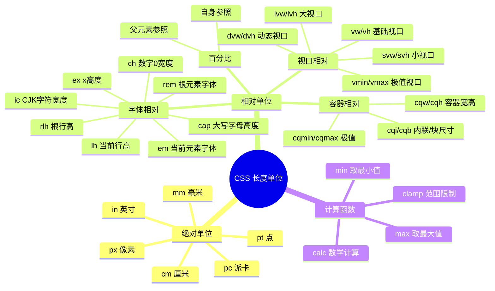
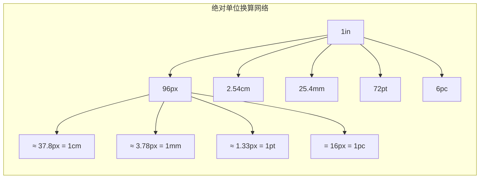
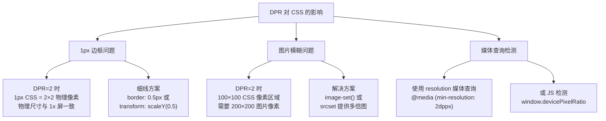
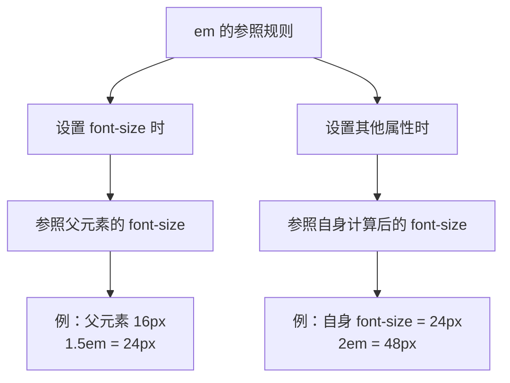
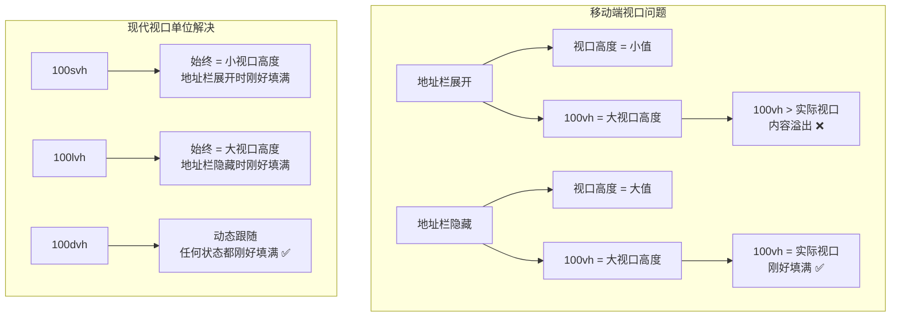
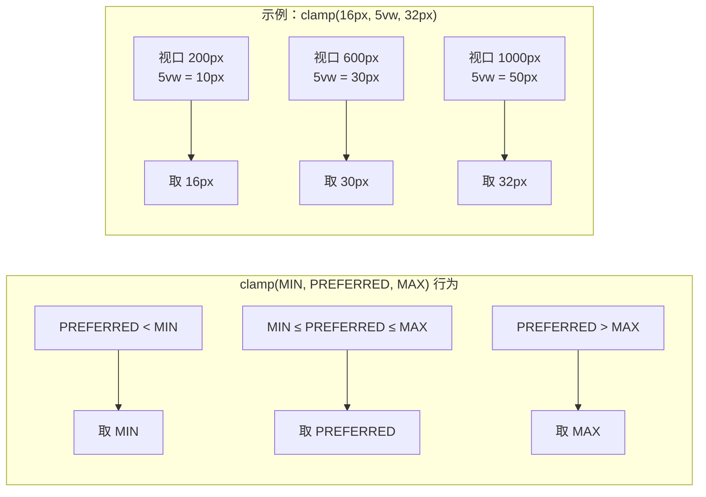
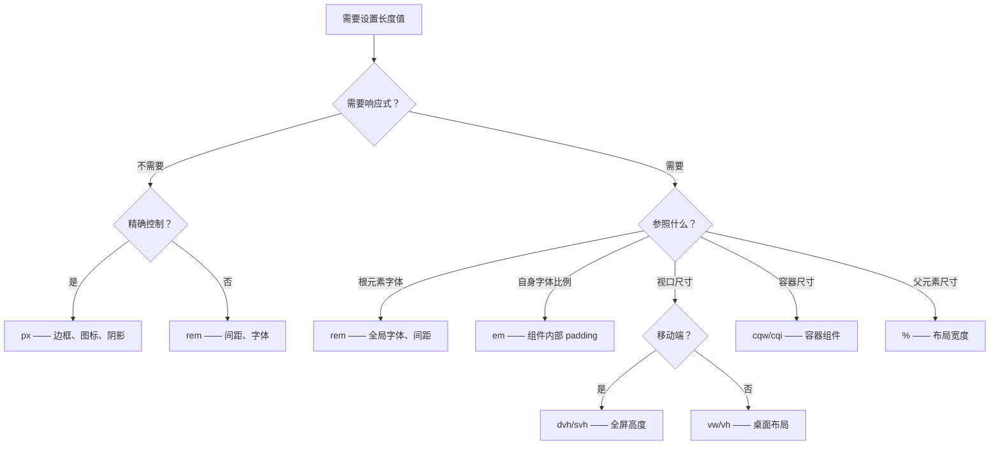

# CSS 长度单位

## 背景与动机

CSS 长度单位是样式系统中最基础也最关键的度量工具。无论是控制元素的宽高、间距、字体大小，还是构建响应式布局、适配移动端视口，都离不开对长度单位的精准选择。

在 CSS 的早期版本中，可用的长度单位非常有限——`px`、`em`、`cm` 等少数几种即可满足绝大多数场景。但随着 Web 从桌面端走向移动端、从固定布局走向响应式设计、从单一视口走向组件化容器，对长度单位的需求也发生了深刻变化：

- **可访问性需求**：用户可能在浏览器中设置默认字体大小，硬编码的 `px` 值无法尊重用户偏好
- **响应式需求**：不同屏幕尺寸需要动态调整元素大小，固定单位无法适应
- **移动端适配**：浏览器地址栏的动态显示/隐藏导致视口高度变化，传统 `vh` 单位行为不一致
- **组件化需求**：组件需要根据容器尺寸而非视口尺寸自适应
- **排版精度需求**：需要基于字符宽度、行高等排版维度精确控制布局

CSS 规范因此不断扩展长度单位体系——从 CSS Values Level 3 的 `rem`、`vw/vh`、`vmin/vmax`，到 CSS Values Level 4 的 `calc()`、`min()`、`max()`、`clamp()`，再到 CSS Containment Level 3 的容器查询单位 `cqw/cqh` 等，以及 CSS Values Level 4 新增的 `lh`、`rlh`、`cap`、`ic` 等排版单位。

本文系统梳理 CSS 长度单位的完整体系，从底层原理到工程实践，帮助你做出最优的单位选择。



## 核心概念

### 单位分类总览

CSS 长度单位按参照物的不同，分为**绝对单位**和**相对单位**两大类：

```
CSS 长度单位
├── 绝对单位（物理/设备相关）
│   ├── px      像素（最常用）
│   ├── cm      厘米
│   ├── mm      毫米
│   ├── in      英寸
│   ├── pt      点（印刷）
│   └── pc      派卡（印刷）
│
└── 相对单位（环境相关）
    ├── 字体相对单位
    │   ├── em      相对当前元素字体大小
    │   ├── rem     相对根元素字体大小
    │   ├── ex      相对字母 x 高度
    │   ├── ch      相对数字 0 宽度
    │   ├── cap     相对大写字母高度
    │   ├── ic      相对 CJK 字符宽度
    │   ├── lh      相对当前行高
    │   └── rlh     相对根元素行高
    │
    ├── 视口相对单位
    │   ├── vw/vh      视口宽/高的 1%
    │   ├── vmin/vmax  视口较小/较大值的 1%
    │   ├── svw/svh    小视口宽/高的 1%
    │   ├── lvw/lvh    大视口宽/高的 1%
    │   └── dvw/dvh    动态视口宽/高的 1%
    │
    ├── 容器相对单位
    │   ├── cqw/cqh    容器宽/高的 1%
    │   ├── cqi/cqb    容器内联/块尺寸的 1%
    │   └── cqmin/cqmax 容器较小/较大值的 1%
    │
    └── 百分比（%）
        └── 相对于父元素或参照物的对应属性
```

### 绝对单位 vs 相对单位

| 维度 | 绝对单位 | 相对单位 |
|------|----------|----------|
| **参照物** | 物理尺寸基准（1in = 96px） | 环境属性（字体大小、视口尺寸等） |
| **响应式** | 不具备（固定值） | 天然响应式 |
| **可访问性** | 无法响应用户偏好 | 可跟随用户设置 |
| **可预测性** | 高（值即结果） | 需要理解参照物 |
| **典型用途** | 边框、固定尺寸、打印 | 布局、字体、间距 |

## 深入原理

### 绝对单位的物理基准

CSS 规范定义了绝对单位之间的固定换算关系，核心基准为：

```
1in = 96px = 2.54cm
```

由此推导出所有绝对单位的换算：

| 单位 | 名称 | 换算关系 | 像素等价 |
|------|------|----------|----------|
| `px` | 像素 | 基准单位 | 1px |
| `in` | 英寸 | 1in = 96px | 96px |
| `cm` | 厘米 | 1cm = 96/2.54 px | ≈ 37.8px |
| `mm` | 毫米 | 1mm = 96/25.4 px | ≈ 3.78px |
| `pt` | 点 | 1pt = 1/72 in = 96/72 px | ≈ 1.33px |
| `pc` | 派卡 | 1pc = 12pt = 96/6 px | = 16px |



#### px 的设备像素映射

`px` 在 CSS 中并非直接对应屏幕的物理像素（设备像素），而是一个**参考像素**（reference pixel）。CSS 规范定义：

> 参考像素 = 在 96 DPI 的设备上，1px 对应 1/96 英寸。

在实际渲染中，浏览器会根据**设备像素比**（DPR, Device Pixel Ratio）将 CSS 像素映射到设备像素：

```
设备像素 = CSS 像素 × DPR
```

例如：
- 标准屏幕（DPR = 1）：`1px` = 1 个设备像素
- Retina 屏幕（DPR = 2）：`1px` = 2×2 = 4 个设备像素
- 高端手机（DPR = 3）：`1px` = 3×3 = 9 个设备像素

这意味着 `1px` 的**物理尺寸在不同 DPR 的设备上基本一致**（这正是"参考像素"的意义——DPR 越高，每个物理像素越小，2 个物理像素恰好补回 1 个 CSS 像素的物理大小）。真正的差异在于：`0.5px` 这样的细线只有 DPR≥2 时才能精确渲染（映射为 1 个物理像素），DPR=1 时会被取整或消失——这就是移动端"细线边框"问题的本质。

#### DPR 对布局的实际影响

设备像素比（DPR）直接影响 CSS 像素在屏幕上的物理呈现。理解 DPR 对于处理以下场景至关重要：



```css
/* 1px 边框在高清屏上的处理 */
/* 方案一：0.5px 边框（Safari/Chrome 支持） */
.hairline-border {
  border: 0.5px solid #ccc;
}

/* 方案二：使用 @media 检测 DPR */
@media (-webkit-min-device-pixel-ratio: 2), (min-resolution: 2dppx) {
  .hairline-border {
    border-width: 0.5px;
  }
}

/* 方案三：使用 transform 模拟细线（兼容性最好） */
.hairline {
  position: relative;
}
.hairline::after {
  content: '';
  position: absolute;
  left: 0;
  bottom: 0;
  width: 100%;
  height: 1px;
  background: #ccc;
  transform: scaleY(0.5);      /* 在 DPR=2 时看起来是 0.5px */
  transform-origin: 0 0;
}

/* 图片适配不同 DPR */
.responsive-image {
  background-image: url('icon@1x.png');  /* 默认 1 倍图 */
}

@media (min-resolution: 2dppx) {
  .responsive-image {
    background-image: url('icon@2x.png');  /* 2 倍图 */
  }
}

/* 使用 image-set() 自动选择 */
.modern-image {
  background-image: image-set(
    'icon@1x.png' 1x,
    'icon@2x.png' 2x,
    'icon@3x.png' 3x
  );
}
```

> **关键认知**：CSS 中的 `1px` 始终是逻辑像素，与 DPR 无关。DPR 只影响渲染时映射到多少物理像素。因此，CSS 布局代码通常不需要关心 DPR，但图片资源和细线边框需要特殊处理。

#### 印刷单位的实际用途

印刷单位（`cm`、`mm`、`pt`、`pc`）在屏幕样式中极少使用，主要应用于**打印媒体查询**：

```css
/* 打印样式 —— 使用印刷单位 */
@media print {
  /* A4 纸张尺寸 */
  @page {
    size: A4;       /* 21cm × 29.7cm */
    margin: 2cm;
  }

  .page {
    font-size: 12pt;        /* 印刷标准字号 */
    line-height: 1.5;
    width: 17cm;            /* A4 宽度减去左右边距 */
    margin: 0;
    padding: 0;
  }

  /* 脚注使用 pt */
  .footnote {
    font-size: 9pt;
  }
}
```

### 字体相对单位的计算机制

字体相对单位的核心特征是：**以字体相关属性作为参照物**。但不同单位的参照物选择规则差异很大。

#### em 的复合参照规则

`em` 是最复杂也最容易出错的相对单位，其参照规则取决于所设置的属性：



**em 的级联放大问题**：

当嵌套元素都使用 `em` 设置 `font-size` 时，会产生级联放大效应：

```css
/* 级联放大示例 */
.level-1 {
  font-size: 16px;
}

.level-2 {
  font-size: 1.5em;    /* 16px × 1.5 = 24px */
}

.level-3 {
  font-size: 1.5em;    /* 24px × 1.5 = 36px（在 24px 基础上再放大） */
}

.level-4 {
  font-size: 1.5em;    /* 36px × 1.5 = 54px（继续放大） */
}

/* 结果：第 4 层文字是第 1 层的 3.375 倍，远超预期 */
```

**真实场景中的 em 陷阱**：导航菜单嵌套

```html
<nav class="nav">
  <ul>
    <li>首页
      <ul>
        <li>子页面
          <ul>
            <li>孙页面</li>  <!-- 这里字体可能已经失控 -->
          </ul>
        </li>
      </ul>
    </li>
  </ul>
</nav>
```

```css
/* ❌ 问题代码：嵌套列表使用 em 导致字体逐级放大 */
.nav ul {
  font-size: 0.9em;    /* 每嵌套一层，字体缩小 10%，但累积缩小 0.9³ = 0.729 */
}

.nav li {
  font-size: 1.1em;    /* 每嵌套一层，字体放大 10%，累积放大 1.1³ = 1.331 */
  padding: 0.5em;      /* padding 跟随自身 font-size 变化 */
}

/* ✅ 修正：使用 rem 避免级联问题 */
.nav ul {
  font-size: 0.9rem;   /* 始终相对于根元素，不受嵌套影响 */
}

.nav li {
  font-size: 1rem;     /* 始终 = 根元素字体大小 */
  padding: 0.5em;      /* em 用于内部比例，而非 font-size 级联 */
}
```

**em 的正确使用模式**：em 最适合用于组件内部的比例关系，而非 font-size 的级联设置。

```css
/* ✅ em 的正确用法：组件内部保持比例 */
.button {
  font-size: 1rem;           /* 用 rem 设定基准 */
  padding: 0.5em 1.5em;      /* 用 em 保持内部比例 */
  border-radius: 0.25em;     /* 圆角随字体缩放 */
  gap: 0.5em;                /* 间距随字体缩放 */
}

.button-large {
  font-size: 1.25rem;        /* 只改 font-size，其余自动按比例放大 */
}

.button-small {
  font-size: 0.875rem;       /* 只改 font-size，其余自动按比例缩小 */
}
```

这个级联效应是 `rem` 被引入的直接动机——`rem` 始终参照根元素，消除了级联问题。

#### rem 的根元素基准

`rem`（root em）始终参照根元素（`<html>`）的 `font-size`：

```css
/* 根元素基准 */
html {
  font-size: 16px;      /* 浏览器默认值通常就是 16px */
}

/* 所有 rem 都相对于 16px，不受嵌套层级影响 */
h1 {
  font-size: 2rem;      /* 始终 = 32px */
}

.nested {
  font-size: 0.875rem;  /* 始终 = 14px，无论嵌套多深 */
}

.deeply-nested .inner {
  font-size: 1.25rem;   /* 始终 = 20px */
}
```

**rem 的响应式优势**：只需修改根元素一个值，所有 `rem` 单位的尺寸都会等比缩放：

```css
/* 响应式基准字体 */
html {
  font-size: 16px;              /* 默认 */
}

@media (min-width: 768px) {
  html {
    font-size: 18px;            /* 所有 rem 值自动放大 12.5% */
  }
}

@media (min-width: 1200px) {
  html {
    font-size: 20px;            /* 所有 rem 值自动放大 25% */
  }
}
```

#### ex / ch / cap / ic —— 字体度量单位

这组单位参照字体的**度量属性**（font metrics），即字体文件中定义的几何特征：

| 单位 | 参照物 | 典型值 | 用途 |
|------|--------|--------|------|
| `ex` | 字母 x 的高度 | ≈ 0.5em | 下标对齐、行内间距 |
| `ch` | 数字 0 的宽度 | ≈ 等宽字体中一个字符宽 | 控制文本列宽 |
| `cap` | 大写字母（如 H）的高度 | ≈ 0.7em | 大写字母对齐 |
| `ic` | CJK 表意文字的宽度 | ≈ 一个中文字符宽 | 中文排版缩进 |

```css
/* ex —— 基于 x 高度 */
.subscript {
  vertical-align: -0.5ex;     /* 下标偏移半个 x 高度 */
  font-size: 0.8ex;           /* 下标字体缩小到 x 高度的 80% */
}

/* ch —— 基于字符宽度 */
.code-block {
  font-family: 'Fira Code', monospace;
  width: 80ch;                /* 约 80 个字符宽度（等宽字体中精确） */
  max-width: 75ch;            /* 最佳阅读宽度 */
}

.input-field {
  width: 20ch;                /* 约 20 个字符的输入框 */
}

/* cap —— 基于大写字母高度 */
.icon-badge {
  height: 1cap;               /* 与大写字母等高 */
  line-height: 1cap;
}

/* ic —— 基于 CJK 字符宽度 */
.zh-paragraph {
  text-indent: 2ic;           /* 首行缩进两个中文字符 */
}

.zh-column {
  width: 30ic;                /* 约 30 个中文字符宽度 */
}
```

> **注意**：`ex`、`ch`、`cap`、`ic` 的实际像素值取决于所使用的字体。不同字体的 x 高度、字符宽度差异很大，因此这些单位在不同字体下会产生不同的像素值。在等宽字体中 `ch` 最精确，在比例字体中 `ch` 只是数字 0 的宽度，其他字符可能更宽或更窄。

#### lh / rlh —— 行高单位

`lh` 和 `rlh` 是 CSS Values Level 4 新增的单位，分别参照当前元素和根元素的行高：

```css
/* lh —— 相对于当前元素的行高 */
.paragraph {
  line-height: 1.6;
  margin-block: 1lh;          /* 间距 = 当前行高 = font-size × 1.6 */
}

.section-gap {
  margin-bottom: 2lh;         /* 两行的间距 */
}

/* rlh —— 相对于根元素的行高 */
:root {
  font-size: 16px;
  line-height: 1.5;           /* 根元素行高 = 24px */
}

.global-section {
  margin-bottom: 1rlh;        /* 始终 = 24px，不受当前元素行高影响 */
}
```

### 视口相对单位的演进

视口相对单位的演进历程反映了 Web 从桌面到移动端的适配挑战。

#### 基础视口单位：vw / vh

```css
/* vw —— 视口宽度的 1% */
.full-width {
  width: 100vw;               /* 视口全宽 */
}

.half-width {
  width: 50vw;                /* 视口宽度的一半 */
}

/* vh —— 视口高度的 1% */
.full-height {
  height: 100vh;              /* 视口全高 */
}

.hero-section {
  height: 100vh;              /* 首屏高度 */
}
```

#### vmin / vmax

```css
/* vmin —— 视口宽高中较小值的 1% */
.square {
  width: 50vmin;              /* 无论横竖屏，始终是正方形 */
  height: 50vmin;
}

/* vmax —— 视口宽高中较大值的 1% */
.banner {
  height: 30vmax;             /* 横屏时参照宽度，竖屏时参照高度 */
}

/* 组合使用：保持可读性 */
.title {
  font-size: clamp(1rem, 5vmin, 2rem);  /* 限制在 1rem ~ 2rem 之间 */
}
```

#### 移动端视口问题与现代解决方案

移动端浏览器（Safari、Chrome 等）的地址栏会动态显示/隐藏，导致视口高度变化。传统 `vh` 取的是**大视口**（地址栏隐藏时）的高度，导致 `100vh` 在地址栏展开时溢出屏幕底部。



**三种视口定义**：

| 视口类型 | 单位 | 定义 | 行为 |
|----------|------|------|------|
| **小视口** | `svh` `svw` `svmin` `svmax` | 地址栏展开时的视口 | 最小保证，始终安全 |
| **大视口** | `lvh` `lvw` `lvmin` `lvmax` | 地址栏隐藏时的视口 | 最大空间，沉浸体验 |
| **动态视口** | `dvh` `dvw` `dvmin` `dvmax` | 随地址栏状态动态变化 | 自适应，推荐方案 |

> **关系**：`svh ≤ dvh ≤ lvh`。桌面浏览器或地址栏不可隐藏的浏览器中，三者相等。

#### 视口单位全面对比

| 单位族 | 宽度 | 高度 | 最小值 | 最大值 | 行为 |
|--------|------|------|--------|--------|------|
| 基础视口 | `vw` | `vh` | `vmin` | `vmax` | 固定取大视口值 |
| 小视口 | `svw` | `svh` | `svmin` | `svmax` | 始终取最小值 |
| 大视口 | `lvw` | `lvh` | `lvmin` | `lvmax` | 始终取最大值 |
| 动态视口 | `dvw` | `dvh` | `dvmin` | `dvmax` | 随浏览器 UI 动态变化 |

| 场景 | 推荐单位 | 理由 |
|------|----------|------|
| 移动端全屏布局 | `dvh` / `dvw` | 动态适应地址栏，最通用 |
| 确保内容不溢出 | `svh` | 取最小值，保证安全 |
| 全屏沉浸体验 | `lvh` | 取最大值，利用全部空间 |
| 桌面端 | `vh` / `vw` | 桌面端三者等价，无需区分 |

### 容器相对单位

容器查询单位（Container Query Units）相对于**查询容器**的尺寸计算，而非视口。这使得组件能根据自身容器的大小自适应，实现真正的"组件级响应式"。

| 单位 | 含义 | 说明 |
|------|------|------|
| `cqw` | 容器宽度的 1% | 类似 `vw`，但参照容器 |
| `cqh` | 容器高度的 1% | 类似 `vh`，但参照容器 |
| `cqi` | 容器内联尺寸的 1% | 水平书写模式下等于 `cqw` |
| `cqb` | 容器块尺寸的 1% | 水平书写模式下等于 `cqh` |
| `cqmin` | 容器较小尺寸的 1% | `min(cqi, cqb)` |
| `cqmax` | 容器较大尺寸的 1% | `max(cqi, cqb)` |

```css
/* 定义查询容器 */
.sidebar {
  container-type: inline-size;   /* 声明为尺寸查询容器 */
  container-name: sidebar;       /* 可选：命名容器 */
}

/* 容器单位使组件自适应容器宽度 */
.card {
  padding: 2cqi;                 /* 容器宽度的 2% */
  font-size: clamp(0.875rem, 3cqi, 1.25rem);
  gap: 1.5cqi;
}

/* 结合容器查询实现断点切换 */
@container sidebar (min-width: 400px) {
  .card {
    display: flex;
    flex-direction: row;
  }
  
  .card-image {
    width: 30cqi;                /* 容器宽度的 30% */
    height: 40cqb;               /* 容器高度的 40% */
  }
}
```

#### 容器查询单位完整组件示例

以下是一个完整的卡片组件，根据容器宽度自适应布局，无需任何媒体查询：

```css
/* 容器定义 */
.card-container {
  container-type: inline-size;
  container-name: card;
}

/* 卡片基础样式 —— 默认竖向布局（窄容器） */
.card {
  display: flex;
  flex-direction: column;
  padding: 4cqi;                /* 容器宽度的 4% —— 自适应间距 */
  gap: 2cqi;                    /* 容器宽度的 2% */
  border-radius: 2cqi;          /* 容器宽度的 2% —— 自适应圆角 */
  font-size: clamp(0.875rem, 2.5cqi, 1.125rem);
}

.card-title {
  font-size: clamp(1rem, 4cqi, 1.5rem);
  line-height: 1.3;
}

.card-image {
  width: 100%;
  aspect-ratio: 16 / 9;
  object-fit: cover;
  border-radius: 1cqi;
}

/* 宽容器时切换为横向布局 */
@container card (min-width: 400px) {
  .card {
    flex-direction: row;
    padding: 3cqi;
  }

  .card-image {
    width: 40cqi;               /* 容器宽度的 40% */
    aspect-ratio: 1;            /* 正方形图片 */
  }

  .card-content {
    flex: 1;
    padding-left: 3cqi;
  }
}

/* 更宽容器时增大间距和字体 */
@container card (min-width: 600px) {
  .card {
    padding: 4cqi;
    gap: 3cqi;
  }

  .card-title {
    font-size: clamp(1.25rem, 5cqi, 2rem);
  }
}
```

> **cqi vs cqw 的区别**：`cqi`（内联尺寸）和 `cqb`（块尺寸）会根据书写模式自动调整。在水平书写模式（默认）下，`cqi = cqw`，`cqb = cqh`；在垂直书写模式下，`cqi = cqh`，`cqb = cqw`。推荐使用 `cqi/cqb` 以支持多语言布局。

### 百分比值的参照物规则

百分比（`%`）的参照物取决于所设置的属性，这是 CSS 中最容易混淆的规则之一：

| 属性 | 参照物 | 注意事项 |
|------|--------|----------|
| `width` | 包含块（父元素）的宽度 | — |
| `height` | 包含块的高度 | **父元素必须有明确高度，否则失效** |
| `padding` | 包含块的**宽度** | 四个方向都参照宽度（含上下） |
| `margin` | 包含块的**宽度** | 四个方向都参照宽度（含上下） |
| `font-size` | 父元素的 `font-size` | — |
| `line-height` | 自身的 `font-size` | — |
| `top/bottom` | 定位父元素的高度 | 需要 `position` 非 `static` |
| `left/right` | 定位父元素的宽度 | 需要 `position` 非 `static` |
| `transform: translate()` | **自身**的尺寸 | `translateX(50%)` = 自身宽度的一半 |
| `background-position` | 元素尺寸减去背景图尺寸 | 0% = 左/上对齐，100% = 右/下对齐 |

```css
/* padding 百分比参照宽度（含上下方向） */
.box {
  width: 400px;
  padding: 10%;                 /* 四个方向都是 40px（400px × 10%） */
}

/* height 百分比需要父元素有明确高度 */
.parent-no-height {
  /* 没有设置高度 */
}
.child {
  height: 100%;                 /* 无效 —— 父元素高度为 auto */
}

.parent-with-height {
  height: 500px;
}
.child {
  height: 100%;                 /* 有效 = 500px */
}

/* transform 参照自身尺寸 */
.centered {
  position: absolute;
  left: 50%;                    /* 定位父元素宽度的 50% */
  top: 50%;                     /* 定位父元素高度的 50% */
  transform: translate(-50%, -50%);  /* 自身宽度的 -50%、自身高度的 -50% */
}
```

### 单位计算函数

CSS 提供了四个计算函数，允许在样式中动态计算长度值。

#### calc() — 数学计算

`calc()` 允许混合不同单位进行四则运算，是响应式布局的核心工具：

```css
/* 基本四则运算 */
.element {
  width: calc(100% - 20px);          /* 减法：混合百分比和像素 */
  padding: calc(1rem + 10px);         /* 加法：混合 rem 和像素 */
  margin: calc(2rem * 1.5);           /* 乘法：数值缩放 */
  font-size: calc(20px / 2);          /* 除法：数值分割 */
}

/* 运算符两侧必须有空格（加减法） */
.correct {
  width: calc(100% - 20px);           /* ✅ 正确 */
}

.incorrect {
  width: calc(100% -20px);            /* ❌ 错误：- 后无空格会被解析为负值 */
}

/* 乘除法中数值可以不带单位 */
.scale {
  width: calc(200px * 1.5);           /* ✅ = 300px */
  width: calc(1.5 * 200px);           /* ✅ 乘法可交换 */
  width: calc(300px / 2);             /* ✅ = 150px */
  /* width: calc(2 / 300px); */        /* ❌ 错误：除法右侧必须是 <number>，不能除以长度 */
}

/* 嵌套括号 */
.complex {
  width: calc((100% - 20px) / 3);     /* 先减后除 */
  padding: calc(1rem + (1rem * 0.5));
}

/* 固定头部布局 */
.header {
  height: 60px;
  position: fixed;
}
.content {
  margin-top: 60px;
  height: calc(100vh - 60px);         /* 视口高度减去头部高度 */
}

/* 侧边栏布局 */
.sidebar {
  width: 250px;
  position: fixed;
}
.main-content {
  width: calc(100% - 250px);          /* 总宽度减去侧边栏 */
  margin-left: 250px;
}
```

#### min() / max() — 取极值

```css
/* min() —— 取最小值 */
.box {
  width: min(50%, 500px);             /* 50% 和 500px 中取较小值 */
  /* 当视口 < 1000px 时，50% < 500px，取 50% */
  /* 当视口 >= 1000px 时，50% >= 500px，取 500px */
}

.font-responsive {
  font-size: min(3vw, 24px);          /* 不超过 24px */
}

/* max() —— 取最大值 */
.sidebar {
  width: max(250px, 20%);             /* 至少 250px，或 20%（取较大值） */
  /* 当视口 < 1250px 时，20% < 250px，取 250px */
  /* 当视口 >= 1250px 时，20% >= 250px，取 20% */
}

.min-font {
  font-size: max(1rem, 16px);         /* 不小于 16px */
}
```

#### clamp() — 范围限制

`clamp(最小值, 首选值, 最大值)` 等价于 `max(最小值, min(首选值, 最大值))`：

```css
/* clamp —— 限制在范围内 */
.title {
  font-size: clamp(1rem, 5vw, 2rem);
  /* 最小 1rem（16px），首选 5vw，最大 2rem（32px） */
  /* 当 5vw < 1rem 时，取 1rem */
  /* 当 5vw > 2rem 时，取 2rem */
  /* 否则取 5vw */
}

.responsive-padding {
  padding: clamp(1rem, 5vw, 3rem);
}

.responsive-width {
  width: clamp(300px, 50%, 800px);
}

/* clamp 实现流式字体 */
:root {
  font-size: clamp(14px, 2vw, 18px);
  /* 字体大小随视口平滑变化，但有上下限 */
}
```



#### 函数组合使用

```css
/* 组合 min/max/clamp */
.responsive {
  width: clamp(300px, 50%, 800px);
  padding: min(5vw, 3rem);
  margin: max(20px, 2vh);
}

/* calc 与 clamp 组合 */
.fluid-typography {
  font-size: calc(clamp(1rem, 3vw, 2rem) * 1.2);
}

/* 与 CSS 变量组合 */
:root {
  --header-height: 60px;
  --sidebar-width: 250px;
  --spacing: 1rem;
}

.layout {
  min-height: calc(100vh - var(--header-height));
  width: calc(100% - var(--sidebar-width));
  padding: calc(var(--spacing) * 2);
  gap: calc(var(--spacing) * 1.5);
}
```

## 代码示例

### 完整响应式页面布局

以下是一个完整的响应式页面布局示例，展示了各种长度单位的综合使用：

```html
<!DOCTYPE html>
<html lang="zh-CN">
<head>
  <meta charset="UTF-8">
  <meta name="viewport" content="width=device-width, initial-scale=1.0">
  <title>CSS 长度单位综合示例</title>
  <style>
    /* ========== 根元素基准设置 ========== */
    :root {
      /* 字体基准 —— 使用 clamp 实现流式字体 */
      font-size: clamp(14px, 2vw, 18px);
      
      /* 间距变量 —— 使用 rem */
      --space-xs: 0.25rem;    /* 约 4px */
      --space-sm: 0.5rem;     /* 约 8px */
      --space-md: 1rem;       /* 约 16px */
      --space-lg: 1.5rem;     /* 约 24px */
      --space-xl: 2rem;       /* 约 32px */
      --space-2xl: 3rem;      /* 约 48px */
      
      /* 布局变量 */
      --max-width: 75rem;     /* 1200px */
      --content-width: 75ch;  /* 最佳阅读宽度 */
      --header-height: 3.75rem; /* 60px */
    }

    /* ========== 全局重置 ========== */
    * {
      margin: 0;
      padding: 0;
      box-sizing: border-box;
    }

    body {
      font-size: 1rem;
      line-height: 1.6;       /* 无单位数值 —— 推荐做法 */
      font-family: -apple-system, BlinkMacSystemFont, 'Segoe UI', sans-serif;
    }

    /* ========== 头部 —— 固定高度 + 视口宽度 ========== */
    .header {
      height: var(--header-height);
      width: 100%;
      position: fixed;
      top: 0;
      display: flex;
      align-items: center;
      padding: 0 var(--space-md);
      background: #fff;
      border-bottom: 1px solid #e0e0e0;  /* 1px 边框 —— px 的典型用途 */
      z-index: 100;
    }

    /* ========== 主内容区 —— calc 计算剩余高度 ========== */
    .main {
      margin-top: var(--header-height);
      min-height: calc(100vh - var(--header-height));
      min-height: calc(100dvh - var(--header-height));  /* 移动端优化 */
      padding: var(--space-xl) var(--space-md);
    }

    /* ========== 容器 —— 流式宽度 ========== */
    .container {
      width: min(90%, var(--max-width));  /* 不超过最大宽度 */
      margin: 0 auto;
    }

    /* ========== 文章内容 —— ch 控制阅读宽度 ========== */
    .article {
      max-width: var(--content-width);    /* 75ch */
      margin: 0 auto;
    }

    .article h1 {
      font-size: 2.5rem;
      margin-bottom: var(--space-lg);
    }

    .article p {
      margin-bottom: 1.5em;               /* em 用于段落间距 */
    }

    /* ========== 按钮组件 —— em 保持内部比例 ========== */
    .btn {
      font-size: 1rem;
      padding: 0.5em 1.5em;              /* 相对于自身字体大小 */
      border-radius: 0.25em;             /* 圆角随字体缩放 */
      border: 1px solid currentColor;
      cursor: pointer;
    }

    .btn-lg {
      font-size: 1.25rem;                /* padding/border-radius 自动按比例放大 */
    }

    .btn-sm {
      font-size: 0.875rem;               /* padding/border-radius 自动按比例缩小 */
    }

    /* ========== 卡片网格 —— clamp 响应式间距 ========== */
    .card-grid {
      display: grid;
      grid-template-columns: repeat(auto-fit, minmax(min(100%, 300px), 1fr));
      gap: clamp(1rem, 3vw, 2rem);       /* 响应式间距 */
    }

    .card {
      padding: clamp(1rem, 3vw, 1.5rem);
      border: 1px solid #e0e0e0;
      border-radius: 0.5rem;
    }

    /* ========== 首屏英雄区 —— dvh 全屏 ========== */
    .hero {
      min-height: 100vh;
      min-height: 100dvh;                /* 移动端动态适应 */
      display: flex;
      align-items: center;
      justify-content: center;
      padding: var(--space-2xl) var(--space-md);
      background: linear-gradient(135deg, #667eea, #764ba2);
      color: #fff;
    }

    .hero-title {
      font-size: clamp(2rem, 8vw, 4rem);  /* 流式大标题 */
      text-align: center;
    }

    /* ========== 安全区域适配 ========== */
    .bottom-bar {
      position: fixed;
      bottom: 0;
      left: 0;
      right: 0;
      padding: var(--space-md);
      padding-bottom: calc(var(--space-md) + env(safe-area-inset-bottom));
      background: #fff;
      border-top: 1px solid #e0e0e0;
    }
  </style>
</head>
<body>
  <header class="header">
    <nav>导航栏</nav>
  </header>
  
  <main class="main">
    <div class="container">
      <article class="article">
        <h1>CSS 长度单位实战</h1>
        <p>本文展示了如何在实际项目中综合使用各种 CSS 长度单位...</p>
      </article>
    </div>
  </main>
</body>
</html>
```

### 移动端适配方案对比

```css
/* ===== 方案一：rem + viewport（早期方案） ===== */
/* 基于 375px 设计稿，1rem = 100px（设计稿尺寸） */
html {
  font-size: calc(100vw / 3.75);   /* 375px 设计稿 → 1rem = 100px */
}
.box {
  width: 1rem;                      /* 设计稿 100px → 1rem */
  height: 0.5rem;                   /* 设计稿 50px → 0.5rem */
}
/* 问题：字体大小也会随视口缩放，需要额外处理 */

/* ===== 方案二：固定基准 + clamp（推荐） ===== */
html {
  font-size: clamp(14px, 4vw, 18px);  /* 限制范围，避免极端值 */
}
/* 优势：字体大小可控，同时保持响应式 */

/* ===== 方案三：vw 直接方案 ===== */
/* 设计稿 100px → 26.67vw（100/375*100） */
.box {
  width: 26.67vw;
  height: 13.33vw;
}
/* 优势：直接，无需换算 */
/* 问题：所有元素都随视口缩放，包括不需要缩放的元素 */

/* ===== 方案四：构建工具自动转换（工程化方案） ===== */
/* 使用 postcss-px-to-viewport 等插件 */
/* 源码使用 px，构建时自动转换为 vw */
.box {
  width: 100px;    /* 构建后 → 26.67vw */
  height: 50px;    /* 构建后 → 13.33vw */
}
/* 优势：开发体验好，设计稿直接写 px */
/* 注意：需要配置排除不需要转换的属性（如 border: 1px） */
```

### 弹性卡片网格

```css
/* 完全流式的卡片网格 —— 无需媒体查询 */
.card-grid {
  display: grid;
  /* auto-fit + minmax 实现自动换行 */
  grid-template-columns: repeat(auto-fit, minmax(min(100%, 300px), 1fr));
  gap: clamp(1rem, 3vw, 2rem);
}

.card {
  padding: clamp(1rem, 3vw, 1.5rem);
  border-radius: 0.5rem;
  border: 1px solid #e0e0e0;
}

/* 响应式间距 */
.section {
  padding: clamp(2rem, 5vw, 4rem) clamp(1rem, 3vw, 2rem);
}

/* 流式容器 */
.fluid-container {
  width: min(90%, 1200px);
  margin: 0 auto;
}
```

## 最佳实践

### 单位选择决策树



### 场景推荐表

| 场景 | 推荐单位 | 原因 | 示例 |
|------|----------|------|------|
| 字体大小 | `rem` | 统一控制，可访问性好 | `font-size: 1rem` |
| 行高 | 无单位数值 | 继承更直观 | `line-height: 1.5` |
| 边框 | `px` | 固定细线，不缩放 | `border: 1px solid` |
| 内边距 | `rem` | 保持与字体比例 | `padding: 1rem` |
| 外边距 | `rem` | 保持与字体比例 | `margin: 1rem` |
| 布局宽度 | `%` / `vw` | 响应式 | `width: 100%` |
| 全屏高度 | `dvh` / `svh` | 移动端适配 | `height: 100dvh` |
| 媒体查询 | `em` / `px` | 兼容性好 | `@media (min-width: 48em)` |
| 组件内部 | `em` | 保持比例关系 | `padding: 0.5em` |
| 文本宽度 | `ch` | 控制字符数 | `max-width: 75ch` |
| 图标大小 | `em` | 与文字对齐 | `width: 1em` |
| 容器组件 | `cqw` / `cqi` | 容器响应式 | `padding: 5cqi` |
| 响应式计算 | `clamp()` | 流式变化 | `font-size: clamp(1rem, 2vw, 1.5rem)` |

### 间距系统设计

```css
/* 使用 rem 构建间距比例尺 */
:root {
  --space-xs: 0.25rem;    /* 4px */
  --space-sm: 0.5rem;     /* 8px */
  --space-md: 1rem;       /* 16px */
  --space-lg: 1.5rem;     /* 24px */
  --space-xl: 2rem;       /* 32px */
  --space-2xl: 3rem;      /* 48px */
  --space-3xl: 4rem;      /* 64px */
}

/* 全局统一使用变量，便于维护 */
.card {
  padding: var(--space-md);
  margin-bottom: var(--space-lg);
  gap: var(--space-sm);
}

.section {
  padding: var(--space-2xl) var(--space-md);
}
```

### 响应式字体系统

```css
:root {
  /* 基础字体大小 —— 流式响应 */
  --font-size-base: clamp(1rem, 2vw, 1.125rem);
  
  /* 模块化比例（Major Third = 1.25） */
  --scale-ratio: 1.25;
  
  /* 字体比例尺 */
  --font-size-xs: calc(var(--font-size-base) / var(--scale-ratio));
  --font-size-sm: var(--font-size-base);
  --font-size-md: calc(var(--font-size-base) * var(--scale-ratio));
  --font-size-lg: calc(var(--font-size-base) * var(--scale-ratio) * var(--scale-ratio));
  --font-size-xl: calc(var(--font-size-base) * var(--scale-ratio) * var(--scale-ratio) * var(--scale-ratio));
}

body {
  font-size: var(--font-size-base);
}

h1 { font-size: var(--font-size-xl); }
h2 { font-size: var(--font-size-lg); }
h3 { font-size: var(--font-size-md); }
small { font-size: var(--font-size-xs); }
```

### 可访问性最佳实践

```css
/* 1. 尊重用户的字体大小偏好 */
html {
  font-size: 100%;            /* 使用 100% 而非 16px，尊重浏览器设置 */
}

/* 2. 使用 rem 确保所有字体大小可被用户偏好覆盖 */
body {
  font-size: 1rem;            /* 而非 16px */
}

/* 3. 行高使用无单位数值 */
p {
  line-height: 1.6;           /* 而非 1.6em 或 25.6px */
}

/* 4. 避免使用 vh 设置移动端全屏高度 */
.hero {
  min-height: 100vh;          /* 回退 */
  min-height: 100dvh;         /* 现代方案 */
}

/* 5. 支持用户的减少动画偏好 */
@media (prefers-reduced-motion: reduce) {
  * {
    animation-duration: 0.01ms !important;
    transition-duration: 0.01ms !important;
  }
}
```

### 响应式设计中的单位选择策略

响应式设计的核心目标是让页面在不同设备和屏幕尺寸下都保持良好的可用性和视觉效果。单位选择是实现这一目标的基础工具。

#### 策略一：流式排版（Fluid Typography）

流式排版让字体大小随视口平滑变化，无需断点切换。核心工具是 `clamp()`：

```css
/* 流式字体系统 —— 无断点响应式 */
:root {
  /* 基础字体：14px ~ 18px 之间随视口变化 */
  --font-base: clamp(0.875rem, 0.8rem + 0.25vw, 1.125rem);

  /* 模块化比例（1.25 倍递增） */
  --font-sm: calc(var(--font-base) / 1.25);
  --font-md: var(--font-base);
  --font-lg: calc(var(--font-base) * 1.25);
  --font-xl: calc(var(--font-base) * 1.25 * 1.25);
  --font-2xl: calc(var(--font-base) * 1.25 * 1.25 * 1.25);
  --font-3xl: calc(var(--font-base) * 1.25 * 1.25 * 1.25 * 1.25);
}

/* 流式间距系统 */
:root {
  --space-xs: clamp(0.25rem, 0.2rem + 0.15vw, 0.5rem);
  --space-sm: clamp(0.5rem, 0.4rem + 0.3vw, 0.75rem);
  --space-md: clamp(1rem, 0.8rem + 0.5vw, 1.5rem);
  --space-lg: clamp(1.5rem, 1.2rem + 0.8vw, 2.5rem);
  --space-xl: clamp(2rem, 1.5rem + 1.2vw, 4rem);
}
```

**clamp 中间值的计算公式**：`clamp(最小值, 首选值, 最大值)` 中的首选值通常使用 `固定值 + 视口比例` 的形式（如 `0.8rem + 0.5vw`），其中固定值保证最小值底线，视口比例提供响应式变化。

#### 策略二：视口单位 + rem 混合方案

在移动端适配中，纯 `vw` 方案会导致极端屏幕尺寸下的问题。混合方案通过 `rem` 提供安全下限，`vw` 提供响应式：

```css
/* 方案：rem 为基础 + vw 微调 */
html {
  /* 基准字体使用 clamp 限制范围 */
  font-size: clamp(14px, 4vw, 18px);
}

/* 所有尺寸使用 rem，自动跟随基准缩放 */
body {
  font-size: 1rem;          /* 14px ~ 18px */
  line-height: 1.6;
  padding: 1rem;
}

h1 { font-size: 2rem; }     /* 28px ~ 36px */
h2 { font-size: 1.5rem; }   /* 21px ~ 27px */
```

#### 策略三：容器查询单位实现组件级响应式

传统响应式依赖视口宽度，但组件可能出现在不同宽度的容器中（如侧边栏 vs 主内容区）。容器查询单位让组件根据自身容器自适应：

```css
/* 容器定义 */
.layout {
  display: grid;
  grid-template-columns: 250px 1fr;
}

.sidebar {
  container-type: inline-size;
  container-name: sidebar;
}

.main {
  container-type: inline-size;
  container-name: main;
}

/* 同一组件在不同容器中自适应 */
.widget {
  padding: 3cqi;
  font-size: clamp(0.8rem, 2.5cqi, 1.2rem);
}

/* 侧边栏中的 widget 自动缩小 */
@container sidebar (max-width: 300px) {
  .widget {
    padding: 2cqi;
    font-size: 0.8rem;
  }
}

/* 主内容区的 widget 自动放大 */
@container main (min-width: 600px) {
  .widget {
    padding: 4cqi;
    display: grid;
    grid-template-columns: 1fr 1fr;
  }
}
```

#### 策略四：不同场景的单位组合

```css
/* ===== 全局布局 ===== */
:root {
  font-size: clamp(14px, 2vw, 18px);  /* 流式基准 */
}

.page {
  max-width: 75rem;           /* rem 限制最大宽度 */
  padding: 0 clamp(1rem, 3vw, 2rem);  /* 流式内边距 */
  margin: 0 auto;
}

/* ===== 组件内部 ===== */
.button {
  font-size: 1rem;            /* rem 全局基准 */
  padding: 0.5em 1.5em;       /* em 保持内部比例 */
  border: 1px solid;          /* px 固定边框 */
  border-radius: 0.25em;      /* em 比例圆角 */
}

/* ===== 全屏区域 ===== */
.hero {
  min-height: 100dvh;         /* dvh 移动端适配 */
  padding: 10vmin;            /* vmin 正方形安全区 */
}

.hero-title {
  font-size: clamp(2rem, 8vw, 5rem);  /* 流式大标题 */
}

/* ===== 文本内容 ===== */
.article {
  max-width: 75ch;            /* ch 控制行宽 */
  font-size: 1rem;
  line-height: 1.6;           /* 无单位行高 */
  margin-bottom: 1.5em;       /* em 段落间距 */
}

/* ===== 容器组件 ===== */
.sidebar-widget {
  container-type: inline-size;
}

.sidebar-widget .content {
  padding: 3cqi;              /* cqi 容器自适应 */
  font-size: clamp(0.8rem, 2cqi, 1.1rem);
}
```

#### 常见反模式

```css
/* ❌ 反模式一：全部使用 px —— 无法响应用户偏好 */
body {
  font-size: 16px;    /* 用户在浏览器中设置的字体大小被忽略 */
}

/* ✅ 正确：使用 rem 尊重用户偏好 */
body {
  font-size: 1rem;    /* 跟随浏览器设置 */
}

/* ❌ 反模式二：em 用于全局布局 —— 级联放大问题 */
.header { font-size: 1.2em; }
.header .nav { font-size: 1.1em; }      /* 实际 = 1.2 × 1.1 = 1.32em */
.header .nav .item { font-size: 1.1em; } /* 实际 = 1.2 × 1.1 × 1.1 = 1.452em */

/* ✅ 正确：全局布局用 rem，组件内部用 em */
.header { font-size: 1.2rem; }
.header .nav { font-size: 1rem; }
.header .nav .item { font-size: 1rem; padding: 0.5em 1em; } /* em 用于内部比例 */

/* ❌ 反模式三：移动端使用 100vh —— 地址栏导致溢出 */
.hero {
  height: 100vh;     /* 移动端地址栏展开时溢出 */
}

/* ✅ 正确：使用 dvh 或渐进增强 */
.hero {
  min-height: 100vh;  /* 回退 */
  min-height: 100dvh; /* 动态视口高度 */
}

/* ❌ 反模式四：过度使用 vw —— 极端屏幕尺寸失控 */
.title {
  font-size: 5vw;    /* 4K 屏幕上可能 80px+，手机上可能 15px- */
}

/* ✅ 正确：使用 clamp 限制范围 */
.title {
  font-size: clamp(1.5rem, 5vw, 3rem);
}
```

## 常见问题

### Q1: em 和 rem 该怎么选择？

**原则**：全局布局用 `rem`，组件内部用 `em`。

```css
/* 全局布局 —— rem */
:root {
  --spacing: 1rem;
}

.layout {
  padding: 2rem;
  gap: 1rem;
}

/* 组件内部 —— em（保持比例关系） */
.button {
  font-size: 1rem;
  padding: 0.5em 1em;         /* 相对于自身字体 */
  border-radius: 0.25em;
}

.button-large {
  font-size: 1.25rem;          /* padding 和 border-radius 自动按比例放大 */
}

.button-small {
  font-size: 0.875rem;         /* padding 和 border-radius 自动按比例缩小 */
}
```

`em` 在组件内部的优势在于：当你修改组件的 `font-size` 时，`padding`、`margin`、`border-radius` 等都会自动按比例调整，无需逐个修改。

### Q2: 为什么移动端 100vh 会溢出？

移动端浏览器地址栏的显示/隐藏会改变视口高度。传统 `vh` 取的是大视口（地址栏隐藏时）的高度，导致 `100vh` 在地址栏展开时溢出屏幕底部。

```css
/* ❌ 问题代码 */
.hero {
  height: 100vh;               /* 地址栏展开时溢出 */
}

/* ✅ 方案一：使用 dvh（推荐） */
.hero {
  height: 100dvh;              /* 动态适应地址栏状态 */
}

/* ✅ 方案二：渐进增强 */
.hero {
  min-height: 100vh;           /* 回退方案 */
  min-height: 100dvh;          /* 现代浏览器覆盖 */
}

/* ✅ 方案三：@supports 检测 */
.hero {
  min-height: 100vh;
}
@supports (min-height: 100dvh) {
  .hero {
    min-height: 100dvh;
  }
}

/* ✅ 方案四：JS 动态计算（兼容旧浏览器） */
:root {
  --vh: 1vh;
}
.hero {
  height: calc(var(--vh, 1vh) * 100);
}
```

```javascript
// JS 动态计算实际视口高度
function setVH() {
  const vh = window.innerHeight * 0.01;
  document.documentElement.style.setProperty('--vh', `${vh}px`);
}

window.addEventListener('resize', setVH);
setVH();
```

### Q3: 为什么 percentage height 不生效？

`height: 100%` 要求父元素有**明确的计算高度**。如果父元素的高度是 `auto`（默认值），子元素的百分比高度无法计算。

```css
/* ❌ 问题：父元素无明确高度 */
.parent {
  /* height 默认为 auto */
}
.child {
  height: 100%;                /* 无效 —— 100% of auto = ? */
}

/* ✅ 方案一：给父元素设置明确高度 */
.parent {
  height: 500px;
}
.child {
  height: 100%;                /* = 500px */
}

/* ✅ 方案二：使用视口单位 */
.child {
  height: 100vh;               /* 不依赖父元素 */
}

/* ✅ 方案三：使用 Flexbox */
.parent {
  display: flex;
  flex-direction: column;
}
.child {
  flex: 1;                     /* 自动填满剩余空间 */
}

/* ✅ 方案四：使用 Grid */
.parent {
  display: grid;
  grid-template-rows: 1fr;
}
.child {
  /* 自动填满 */
}
```

### Q4: 行高该用有单位还是无单位？

**推荐使用无单位数值**。无单位的行高会被子元素继承为**比例值**，而非计算后的像素值。

```css
/* ❌ 不推荐：使用单位 */
.parent {
  line-height: 1.5em;          /* 16px × 1.5 = 24px */
}
.child {
  font-size: 32px;
  /* 继承了 24px 的计算值 */
  /* 行高 24px < 字体 32px，文字会重叠！ */
}

/* ✅ 推荐：使用无单位数值 */
.parent {
  line-height: 1.5;            /* 继承的是 1.5 这个比例 */
}
.child {
  font-size: 32px;
  /* 行高 = 32px × 1.5 = 48px ✅ */
}
```

### Q5: 如何保证文本可读性？

```css
.article {
  /* 控制每行字符数（英文 60-75ch，中文 25-35ic） */
  max-width: 75ch;
  
  /* 合适的行高 */
  line-height: 1.6;
  
  /* 段落间距 */
  margin-bottom: 1.5em;
  
  /* 响应式字体 */
  font-size: clamp(1rem, 2vw, 1.125rem);
  
  /* 字间距（微调） */
  letter-spacing: 0.01em;
}

/* 移动端调整 */
@media (max-width: 768px) {
  .article {
    max-width: 90%;            /* 移动端屏幕窄，不需要 ch 限制 */
    line-height: 1.5;
  }
}
```

### Q6: calc() 中运算符为什么要求空格？

在 `calc()` 中，`+` 和 `-` 运算符两侧**必须有空格**，而 `*` 和 `/` 不强制要求。这是因为 `-` 无空格时会被解析为负值：

```css
/* ✅ 正确 */
width: calc(100% - 20px);      /* 减法 */
width: calc(100% + 20px);      /* 加法 */
width: calc(200px * 1.5);      /* 乘法（空格可选） */
width: calc(300px / 2);        /* 除法（空格可选） */

/* ❌ 错误 */
width: calc(100% -20px);       /* 被解析为 100% 和 -20px，但 - 需要空格 */
width: calc(100% +20px);       /* 同理 */
width: calc(100%-20px);        /* 无空格，解析失败 */
```

## 浏览器兼容性

### 单位支持情况

| 单位 | Chrome | Firefox | Safari | Edge | 备注 |
|------|--------|---------|--------|------|------|
| `px`, `em`, `%` | 全部 | 全部 | 全部 | 全部 | 基础单位 |
| `rem` | 4+ | 3.6+ | 5+ | 12+ | CSS Values 3 |
| `vw/vh` | 20+ | 19+ | 6+ | 12+ | CSS Values 3 |
| `vmin/vmax` | 20+ | 19+ | 6.1+ | 12+ | CSS Values 3 |
| `ch` | 27+ | 1+ | 7+ | 12+ | CSS Values 3 |
| `ex` | 全部 | 全部 | 全部 | 全部 | CSS2 |
| `calc()` | 26+ | 4+ | 6+ | 9+ | CSS Values 3 |
| `min()/max()` | 79+ | 75+ | 11.1+ | 79+ | CSS Values 4 |
| `clamp()` | 79+ | 75+ | 13.1+ | 79+ | CSS Values 4 |
| `lh/rlh` | 109+ | 120+ | 16.4+ | 109+ | CSS Values 4 |
| `cap/ic` | 111+ | — | 16.4+ | 111+ | CSS Values 4 |
| `dvh/dvw/svh/svw` | 108+ | 101+ | 15.4+ | 108+ | CSS Values 4 |
| `cqw/cqh` 等 | 105+ | 110+ | 16+ | 105+ | CSS Containment 3 |

### 兼容性处理策略

```css
/* 策略一：渐进增强（推荐） */
.element {
  /* 回退方案 */
  height: 100vh;
  /* 现代方案（覆盖上面的回退） */
  height: 100dvh;
}

/* 策略二：@supports 特性检测 */
@supports (height: 100dvh) {
  .element {
    height: 100dvh;
  }
}

@supports (width: 1cqw) {
  .container-based {
    width: 50cqw;
  }
}

@supports (font-size: clamp(1rem, 1vw, 2rem)) {
  .text {
    font-size: clamp(1rem, 2vw, 1.5rem);
  }
}

/* 策略三：PostCSS 插件自动添加回退 */
/* 使用 postcss-preset-env 等工具自动处理 */
```

## 参考资源

- [MDN: CSS 长度单位](https://developer.mozilla.org/zh-CN/docs/Web/CSS/length)
- [MDN: calc()](https://developer.mozilla.org/zh-CN/docs/Web/CSS/calc)
- [MDN: clamp()](https://developer.mozilla.org/zh-CN/docs/Web/CSS/clamp)
- [CSS Values and Units Module Level 4](https://www.w3.org/TR/css-values-4/)
- [CSS Values and Units Module Level 3](https://www.w3.org/TR/css-values-3/)
- [CSS Containment Module Level 3](https://www.w3.org/TR/css-contain-3/)
- [The NewViewport Units: dvh, lvh, svh](https://css-tricks.com/the-new-viewport-units-dvh-lvh-svh/)
- [A Complete Guide to calc()](https://css-tricks.com/a-complete-guide-to-calc/)
