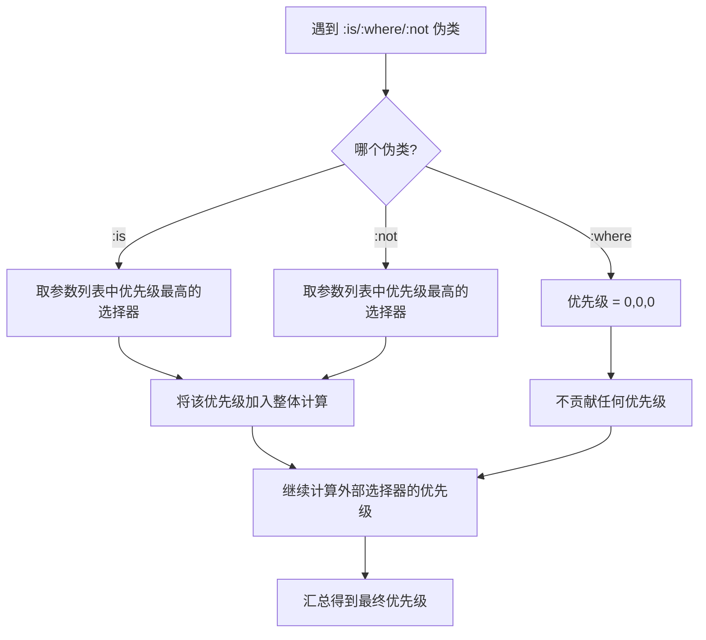

# 现代选择器

> CSS 现代选择器突破了传统选择器的方向限制与优先级控制瓶颈，赋予开发者更精准的元素匹配能力和更灵活的样式架构策略。

## 核心概念

CSS Selectors Level 4 引入了一系列新型伪类选择器，从根本上改变了开发者书写选择器的方式。这些选择器可以按功能维度划分为以下体系：

```mermaid
flowchart TD
    A[现代CSS选择器] --> B[选择器简化与优先级控制]
    A --> C[关系型选择器]
    A --> D[结构性伪类增强]
    A --> E[状态伪类]
    A --> F[输入伪类]

    B --> B1[":is() — 可容错取并，保留优先级"]
    B --> B2[":where() — 可容错取并，零优先级"]
    B --> B3[":not() — 反向选择，多参数"]

    C --> C1[":has() — 父选择器/关系选择器"]

    D --> D1[":nth-child(of) — 条件筛选"]
    D --> D2[":nth-last-child() — 倒序结构匹配"]
    D --> D3[":nth-of-type() — 类型限定匹配"]
    D --> D4[":nth-last-of-type() — 倒序类型匹配"]
    D --> D5[":blank vs :empty — 空元素检测"]

    E --> E1[":playing / :paused — 播放状态"]
    E --> E2[":seeking — 定位状态"]
    E --> E3[":picture-in-picture — 画中画"]

    F --> F1[":autofill — 自动填充"]
    F --> F2[":placeholder-shown — 占位符可见"]
    F --> F3[":read-only / :read-write — 读写状态"]

```



这些选择器解决的核心痛点包括：

- **选择器冗长**：`:is()` 和 `:where()` 将重复的选择器列表压缩为简洁的表达式
- **优先级失控**：`:where()` 提供零优先级机制，使默认样式可被轻松覆盖
- **方向限制**：`:has()` 打破了 CSS 只能从父到子、从前到后的单向匹配限制
- **条件筛选不足**：`:nth-child(of)` 允许在特定子集中进行位置匹配
- **状态感知缺失**：媒体播放状态、输入状态等无法通过纯 CSS 检测

## 详细解析

### :is() — 选择器列表简化

`:is()` 伪类接受一个选择器列表作为参数，匹配列表中任一选择器对应的元素。它的核心价值在于**简化重复选择器**和**容错解析**。

#### 语法

```css
/* 基本语法 */
:is(selector1, selector2, selectorN) {
  /* 样式声明 */
}
```

#### 优先级规则

`:is()` 的优先级等于其参数列表中**优先级最高的那个选择器**，而非取平均值或最低值。这意味着使用 `:is()` 不会降低选择器的权重，需要特别留意。

```css
/* 优先级 = (0, 1, 0)，取 #id 的优先级 */
:is(h1, h2, #title) {
  color: red;
}
```

#### 与 `:any()` 的关系

`:is()` 的前身是带浏览器前缀的 `:any()`（`:-moz-any()`、`:-webkit-any()`）。`:any()` 存在两个关键缺陷：一是需要浏览器前缀，二是优先级只按伪类自身计算（0,1,0），不取参数中的最高优先级。`:is()` 统一了语法并修正了优先级计算方式，是 `:any()` 的正式替代品。目前 `:any()` 已从标准中移除，不应再使用。

#### 实际应用场景

```css
/* 简化前：大量重复 */
article h2,
article h3,
section h2,
section h3,
aside h2,
aside h3 {
  margin-top: 2em;
}

/* 简化后 */
:is(article, section, aside) :is(h2, h3) {
  margin-top: 2em;
}
```

```css
/* 容错解析：无效选择器不会导致整条规则失效 */
:is(h1, h2, :unknown-pseudo, h3) {
  color: #333;
  /* :unknown-pseudo 被忽略，h1/h2/h3 正常生效 */
}
```

### :where() — 零优先级选择器

`:where()` 的语法与 `:is()` 完全相同，接受选择器列表并匹配其中任一选择器。唯一的区别在于**优先级**：`:where()` 的优先级始终为 **0**，无论其参数列表中包含何种选择器。

#### 与 `:is()` 的区别

| 特性 | `:is()` | `:where()` |
|------|---------|------------|
| 功能 | 选择器列表取并集 | 选择器列表取并集 |
| 优先级 | 取列表中最高值 | 始终为 0 |
| 可容错 | 支持 | 支持 |
| 典型用途 | 简化选择器，保留权重 | 提供可覆盖的默认样式 |

#### 适用场景

`:where()` 最适合用于**组件库的默认样式**、**CSS Reset** 和**基础主题**——这些场景下，样式应当容易被使用者覆盖。

```css
/* 组件库默认样式：使用 :where() 确保用户可轻松覆盖 */
:where(.btn) {
  padding: 0.5rem 1rem;
  border-radius: 4px;
  background: #007bff;
  color: #fff;
}

/* 用户自定义：单个类选择器即可覆盖 :where() 的样式 */
.btn {
  background: #28a745; /* 生效，优先级 (0,1,0) > :where() 的 (0,0,0) */
}
```

### :not() — 反向选择

`:not()` 伪类用于匹配**不满足**参数选择器的元素。CSS Selectors Level 4 将其从单参数扩展为多参数，并改变了优先级计算方式。

#### 从单参数到多参数的演进

CSS3 时代的 `:not()` 只接受单个简单选择器，而 Level 4 允许接受选择器列表：

```css
/* 旧写法：单参数，需要链式调用 */
p:not(.intro):not(.footer) {
  color: #333;
}

/* 新写法：多参数，逗号分隔 */
p:not(.intro, .footer) {
  color: #333;
}
```

#### 优先级计算

与 `:is()` 相同，`:not()` 的优先级等于其参数列表中**优先级最高的选择器**。这是一个容易踩的坑——`:not()` 看似是排除，但优先级并不会因此降低。

```css
/* 优先级 = (1, 0, 0)，因为 #sidebar 是 ID 选择器 */
div:not(#sidebar) {
  width: 100%;
}
```

#### 常见陷阱

1. **优先级膨胀**：在 `:not()` 中使用 ID 选择器会导致整条规则优先级升高
2. **过度排除**：`:not(*)` 会匹配零个元素，没有实际意义
3. **不可包含自身**：`:not(:not(x))` 的嵌套写法不被规范允许（`:not()` 内不能再嵌套 `:not()`），属无效选择器
4. **性能隐患**：`:not()` 需要遍历所有不匹配的元素，范围过大时影响性能

```css
/* 陷阱：优先级膨胀 */
/* 这条规则的优先级是 (1,1,0)，因为 :not(#main) 贡献了 ID 级别 */
.card:not(#main) {
  padding: 1rem;
}

/* 更好的写法：保持低优先级 */
.card:not(.main) {
  padding: 1rem; /* 优先级 (0,2,0)，更合理 */
}
```

#### 优先级计算流程



### :has() — 父选择器革命

`:has()` 是 CSS 历史上最具变革性的选择器之一。它允许根据**后代元素或后续兄弟元素**的存在来匹配当前元素，打破了 CSS 只能从上到下、从左到右匹配的限制。

#### 语法

```css
/* 匹配包含 <a> 直接子元素的 <div> */
div:has(> a) { }

/* 匹配后续紧接 <p> 的 <h2> */
h2:has(+ p) { }

/* 匹配内部存在 .active 类的 <li> */
li:has(.active) { }

/* 多重条件——满足任一即可 */
article:has(> h2, > h3) { }
```

#### 浏览器支持

截至 2025 年，`:has()` 已获得所有主流浏览器的支持：Chrome 105+、Firefox 121+、Safari 15.4+、Edge 105+。对于需要兼容旧浏览器的场景，可使用 `@supports selector(:has(*))` 进行特性检测。

#### 创意用法

**前向选择（子→父）：**

```css
/* 表单组内输入框获焦时，高亮整个表单组 */
.form-group:has(input:focus) {
  border-color: #007bff;
  box-shadow: 0 0 0 3px rgba(0, 123, 255, 0.15);
}

/* 包含图片的卡片采用网格布局 */
.card:has(img) {
  display: grid;
  grid-template-rows: 200px auto;
}
```

**兄弟选择（后→前）：**

```css
/* 紧接段落之后的标题添加额外间距 */
h2:has(+ p) {
  margin-bottom: 1.5em;
}

/* 后面跟着代码块的段落调整底部间距 */
p:has(+ pre) {
  margin-bottom: 0.5em;
}
```

**条件组合：**

```css
/* checkbox 选中时展开内容 */
.details:has(input[type="checkbox"]:checked) .content {
  max-height: 500px;
  opacity: 1;
}

/* 输入框无效且未获焦时显示错误 */
.form-group:has(input:invalid):not(:has(input:focus)) {
  border-color: #dc3545;
}
```

### :nth-child() 增强

CSS Selectors Level 4 为 `:nth-child()` 引入了 `of` 语法，允许在**特定子集**中进行位置匹配，而非在所有兄弟元素中匹配。

#### `of` 语法

```css
/* 语法 */
:nth-child(An+B of selectorList) { }

/* 匹配第 2 个具有 .active 类的子元素 */
:nth-child(2 of .active) { }

/* 匹配第 1 个不是 .disabled 的子元素（-n+1 在 n=0 时取 1，仅匹配首位） */
:nth-child(-n+1 of :not(.disabled)) { }
```

#### 与传统语法的区别

传统 `:nth-child(2)` 匹配的是父元素下**所有子元素中的第 2 个**，而 `:nth-child(2 of .active)` 匹配的是**具有 .active 类的子元素中的第 2 个**。

```html
<ul>
  <li class="active">项目 1</li>    <!-- 第 1 个 .active -->
  <li>项目 2</li>
  <li class="active">项目 3</li>    <!-- 第 2 个 .active ✓ -->
  <li>项目 4</li>
  <li class="active">项目 5</li>    <!-- 第 3 个 .active -->
</ul>
```

```css
/* 传统写法：匹配第 2 个子元素（项目 2），无论是否有 .active */
li:nth-child(2) {
  color: red;
}

/* of 写法：匹配第 2 个 .active 子元素（项目 3） */
li:nth-child(2 of .active) {
  color: blue;
}
```

### 其他现代伪类

#### :nth-last-child() / :nth-of-type() / :nth-last-of-type()

这四个结构性伪类各有侧重，理解它们的区别对于精确匹配至关重要：

| 伪类 | 计数方向 | 计数范围 | 示例含义 |
|------|----------|----------|----------|
| `:nth-child(n)` | 从前到后 | 所有兄弟元素 | 第 n 个子元素 |
| `:nth-last-child(n)` | 从后到前 | 所有兄弟元素 | 倒数第 n 个子元素 |
| `:nth-of-type(n)` | 从前到后 | 同类型兄弟 | 第 n 个该类型子元素 |
| `:nth-last-of-type(n)` | 从后到前 | 同类型兄弟 | 倒数第 n 个该类型子元素 |

**进阶用法：**

```css
/* 最后两个列表项不显示底部边框 */
li:nth-last-child(-n+2) {
  border-bottom: none;
}

/* 每种类型的第一个元素添加顶部间距 */
h2:nth-of-type(1),
h3:nth-of-type(1) {
  margin-top: 0;
}

/* 倒数第一个段落调整底部间距 */
p:nth-last-of-type(1) {
  margin-bottom: 0;
}

/* 结合 of 语法：倒数第 1 个未禁用的按钮 */
/* ⚠️ of 语法只支持 :nth-child() / :nth-last-child()，
   :nth-of-type() / :nth-last-of-type() 不接受 of */
button:nth-last-child(1 of :not(:disabled)) {
  margin-right: 0;
}
```

#### :blank 与 :empty 的区别

`:empty` 和 `:blank` 都用于匹配"空"元素，但判断标准不同：

| 伪类 | 匹配条件 | 示例 |
|------|----------|------|
| `:empty` | 元素完全没有子节点（包括文本节点、空白文本） | `<div></div>` ✓、`<div> </div>` ✗ |
| `:blank` | 元素没有内容或仅有空白字符 | `<div></div>` ✓、`<div> </div>` ✓ |

> **注意**：`:blank` 目前仍处于 Working Draft 阶段，浏览器支持有限。Firefox 使用 `:-moz-blank` 前缀实现。在实际项目中，建议使用 `:placeholder-shown` 或 `:empty` 作为替代方案。

```css
/* :empty — 匹配完全空的元素 */
div:empty {
  display: none;
}

/* :blank — 匹配空或仅含空白的元素（草案阶段） */
input:blank {
  border-color: #ccc;
}

/* 实际替代方案：用 :placeholder-shown 检测空输入框 */
input:placeholder-shown {
  border-color: #ccc;
}
```

#### 状态伪类：:playing / :paused / :picture-in-picture / :seeking

这些伪类用于检测媒体元素的播放状态，无需 JavaScript 即可根据播放状态调整样式。

| 伪类 | 匹配条件 | 适用元素 |
|------|----------|----------|
| `:playing` | 正在播放 | `<audio>`、`<video>` |
| `:paused` | 已暂停 | `<audio>`、`<video>` |
| `:seeking` | 正在定位（用户拖动进度条） | `<audio>`、`<video>` |
| `:picture-in-picture` | 处于画中画模式 | `<video>` |

```css
/* 视频播放时隐藏播放按钮覆盖层 */
video:playing ~ .play-overlay {
  opacity: 0;
  pointer-events: none;
}

/* 视频暂停时显示播放按钮 */
video:paused ~ .play-overlay {
  opacity: 1;
}

/* 画中画状态下隐藏自定义控件 */
video:picture-in-picture ~ .controls {
  opacity: 0;
  pointer-events: none;
}

/* 定位中显示加载指示器 */
video:seeking ~ .loading-indicator {
  display: block;
}
```

#### 输入伪类：:autofill / :placeholder-shown / :read-only / :read-write

这些伪类用于检测表单元素的各种状态，帮助开发者创建更精细的表单交互体验。

| 伪类 | 匹配条件 | 适用元素 |
|------|----------|----------|
| `:autofill` | 浏览器自动填充了内容 | `<input>`、`<select>`、`<textarea>` |
| `:placeholder-shown` | 占位符正在显示（即用户未输入内容） | `<input>`、`<textarea>` |
| `:read-only` | 元素不可编辑 | `<input>`、`<textarea>` 及设置了 `readonly` 的元素 |
| `:read-write` | 元素可编辑 | `<input>`、`<textarea>` 及 `contenteditable` 元素 |

```css
/* 自动填充时修改输入框背景色 */
input:autofill {
  -webkit-box-shadow: 0 0 0 30px #f0f7ff inset;
  box-shadow: 0 0 0 30px #f0f7ff inset;
}

/* 占位符可见时（用户未输入），标签保持默认样式 */
input:placeholder-shown + label {
  color: #999;
  font-size: 1rem;
  transform: translateY(0);
}

/* 用户输入后（占位符隐藏），标签上浮 */
input:not(:placeholder-shown) + label {
  color: #007bff;
  font-size: 0.75rem;
  transform: translateY(-1.5rem);
}

/* 只读字段添加视觉提示 */
input:read-only,
textarea:read-only {
  background: #f5f5f5;
  color: #666;
  cursor: not-allowed;
}

/* 可编辑字段添加交互提示 */
input:read-write {
  border-color: #ccc;
}

input:read-write:focus {
  border-color: #007bff;
}
```

## 代码示例

### :is() 完整示例

```html
<!DOCTYPE html>
<html lang="zh-CN">
<head>
  <meta charset="UTF-8">
  <meta name="viewport" content="width=device-width, initial-scale=1.0">
  <title>:is() 选择器示例</title>
  <style>
    /* 使用 :is() 简化标题样式 */
    :is(h1, h2, h3) {
      color: #1a1a2e;
      font-family: system-ui, sans-serif;
    }

    /* 使用 :is() 简化区域内的段落样式 */
    :is(article, section, aside) p {
      line-height: 1.8;
      margin-bottom: 1em;
    }

    /* 使用 :is() 简化交互状态 */
    :is(.btn, .link, .card):hover {
      opacity: 0.85;
      transition: opacity 0.2s ease;
    }

    /* 容错解析：:unknown 会被忽略，其余正常生效 */
    :is(.primary, .secondary, :unknown) {
      font-weight: 600;
    }

    .btn {
      padding: 0.5rem 1rem;
      border-radius: 4px;
      border: none;
      cursor: pointer;
    }

    .primary { background: #007bff; color: #fff; }
    .secondary { background: #6c757d; color: #fff; }
  </style>
</head>
<body>
  <article>
    <h2>文章标题</h2>
    <p>这是一段文章内容，使用了 :is() 简化的段落样式。</p>
  </article>
  <button class="btn primary">主要按钮</button>
  <button class="btn secondary">次要按钮</button>
</body>
</html>
```

### :where() 完整示例

```html
<!DOCTYPE html>
<html lang="zh-CN">
<head>
  <meta charset="UTF-8">
  <meta name="viewport" content="width=device-width, initial-scale=1.0">
  <title>:where() 选择器示例</title>
  <style>
    /* 组件库默认样式：使用 :where() 确保用户可轻松覆盖 */
    :where(.card) {
      padding: 16px;
      border-radius: 8px;
      background: #fff;
      border: 1px solid #e0e0e0;
      margin-bottom: 1rem;
    }

    :where(.card-title) {
      font-size: 1.25rem;
      font-weight: 600;
      margin-bottom: 0.5rem;
    }

    /* 用户自定义样式：单个类选择器即可覆盖 :where() */
    .card {
      padding: 24px;           /* 生效：优先级 (0,1,0) > :where() 的 (0,0,0) */
      background: #f8f9fa;
    }

    .card-title {
      color: #007bff;          /* 生效：优先级 (0,1,0) > :where() 的 (0,0,0) */
    }
  </style>
</head>
<body>
  <div class="card">
    <div class="card-title">卡片标题</div>
    <p>卡片内容，使用 :where() 提供的默认样式可被轻松覆盖。</p>
  </div>
</body>
</html>
```

### :not() 完整示例

```html
<!DOCTYPE html>
<html lang="zh-CN">
<head>
  <meta charset="UTF-8">
  <meta name="viewport" content="width=device-width, initial-scale=1.0">
  <title>:not() 选择器示例</title>
  <style>
    /* 多参数 :not()：排除多个类 */
    p:not(.intro, .footer, .highlight) {
      color: #333;
      line-height: 1.6;
    }

    /* 特殊段落样式 */
    p.intro {
      font-size: 1.125rem;
      color: #007bff;
    }

    p.footer {
      font-size: 0.875rem;
      color: #999;
    }

    p.highlight {
      background: #fff3cd;
      padding: 0.5rem;
    }

    /* 列表项：排除最后一项的底部边框 */
    li:not(:last-child) {
      border-bottom: 1px solid #eee;
      padding-bottom: 0.5rem;
      margin-bottom: 0.5rem;
    }

    /* 注意：:not(#main) 会导致优先级膨胀到 ID 级别 */
    /* 推荐使用类选择器替代 */
    .nav-item:not(.active) {
      color: #666;
    }

    .nav-item.active {
      color: #007bff;
      font-weight: 600;
    }
  </style>
</head>
<body>
  <p class="intro">这是介绍段落，不受 :not() 规则影响。</p>
  <p>这是普通段落，受 :not() 规则影响。</p>
  <p class="highlight">这是高亮段落，不受 :not() 规则影响。</p>
  <p class="footer">这是页脚段落，不受 :not() 规则影响。</p>

  <ul>
    <li>列表项 1</li>
    <li>列表项 2</li>
    <li>列表项 3（无底部边框）</li>
  </ul>

  <nav>
    <a class="nav-item active">首页</a>
    <a class="nav-item">关于</a>
    <a class="nav-item">联系</a>
  </nav>
</body>
</html>
```

### :has() 完整示例

```html
<!DOCTYPE html>
<html lang="zh-CN">
<head>
  <meta charset="UTF-8">
  <meta name="viewport" content="width=device-width, initial-scale=1.0">
  <title>:has() 选择器示例</title>
  <style>
    /* 基础卡片样式 */
    .card {
      border: 1px solid #e0e0e0;
      border-radius: 8px;
      overflow: hidden;
      margin-bottom: 1rem;
    }

    /* :has() — 有图片的卡片采用网格布局 */
    .card:has(img) {
      display: grid;
      grid-template-rows: 180px auto;
    }

    /* :has() — 无图片的卡片添加内边距 */
    .card:not(:has(img)) {
      padding: 1.5rem;
    }

    .card img {
      width: 100%;
      height: 100%;
      object-fit: cover;
      transition: transform 0.3s ease;
    }

    /* :has() — 悬浮时放大图片 */
    .card:has(img):hover img {
      transform: scale(1.05);
    }

    .card-body {
      padding: 1rem;
    }

    /* :has() — 表单组获焦时高亮 */
    .form-group {
      border: 2px solid #e0e0e0;
      border-radius: 8px;
      padding: 1rem;
      margin-bottom: 1rem;
      transition: all 0.2s ease;
    }

    .form-group:has(input:focus) {
      border-color: #007bff;
      box-shadow: 0 0 0 3px rgba(0, 123, 255, 0.15);
    }

    .form-group:has(input:invalid):not(:has(input:focus)) {
      border-color: #dc3545;
    }

    .form-group input {
      width: 100%;
      padding: 0.5rem;
      border: 1px solid #ccc;
      border-radius: 4px;
    }

    /* :has() — checkbox 选中时展开内容 */
    .toggle-panel:has(input[type="checkbox"]:checked) .content {
      max-height: 200px;
      opacity: 1;
    }

    .toggle-panel .content {
      max-height: 0;
      opacity: 0;
      overflow: hidden;
      transition: all 0.3s ease;
    }
  </style>
</head>
<body>
  <!-- 有图片的卡片 -->
  <div class="card">
    
    <div class="card-body">
      <h3>有图片的卡片</h3>
      <p>使用网格布局</p>
    </div>
  </div>

  <!-- 无图片的卡片 -->
  <div class="card">
    <div class="card-body">
      <h3>纯文本卡片</h3>
      <p>没有图片，使用内边距布局</p>
    </div>
  </div>

  <!-- 表单组 -->
  <div class="form-group">
    <label>邮箱</label>
    <input type="email" required placeholder="请输入邮箱">
  </div>

  <!-- 折叠面板 -->
  <div class="toggle-panel">
    <label>
      <input type="checkbox"> 展开详情
    </label>
    <div class="content">
      <p>这是通过 :has() + :checked 实现的纯 CSS 折叠面板，无需 JavaScript。</p>
    </div>
  </div>
</body>
</html>
```

### :nth-child() of 语法完整示例

```html
<!DOCTYPE html>
<html lang="zh-CN">
<head>
  <meta charset="UTF-8">
  <meta name="viewport" content="width=device-width, initial-scale=1.0">
  <title>:nth-child() of 语法示例</title>
  <style>
    /* 基础列表样式 */
    li {
      padding: 0.75rem 1rem;
      border-bottom: 1px solid #eee;
      list-style: none;
    }

    /* 传统 :nth-child：匹配所有子元素中的第 2 个 */
    li:nth-child(2) {
      background: #fff3cd;
    }

    /* of 语法：匹配第 2 个 .active 子元素 */
    li:nth-child(2 of .active) {
      background: #d4edda;
      font-weight: 600;
    }

    /* of 语法：匹配第 1 个未禁用的按钮 */
    button:nth-child(1 of :not(:disabled)) {
      border: 2px solid #007bff;
    }

    /* of 语法：奇数位可见项添加斑马纹 */
    li:nth-child(odd of :not(.hidden)) {
      background: #f8f9fa;
    }

    .active { color: #155724; }
    .hidden { display: none; }

    button {
      padding: 0.5rem 1rem;
      margin-right: 0.5rem;
      border-radius: 4px;
      border: 1px solid #ccc;
      cursor: pointer;
    }

    button:disabled {
      opacity: 0.5;
      cursor: not-allowed;
    }
  </style>
</head>
<body>
  <h3>列表示例</h3>
  <ul>
    <li class="active">项目 1（第 1 个 .active）</li>
    <li>项目 2（第 2 个子元素 — 黄色高亮）</li>
    <li class="active">项目 3（第 2 个 .active — 绿色高亮）</li>
    <li class="hidden">项目 4（隐藏）</li>
    <li>项目 5</li>
    <li class="active">项目 6（第 3 个 .active）</li>
  </ul>

  <h3>按钮示例</h3>
  <div>
    <button disabled>禁用按钮</button>
    <button>第 1 个可用按钮（蓝色边框）</button>
    <button>第 2 个可用按钮</button>
  </div>
</body>
</html>
```

### 状态伪类与输入伪类完整示例

```html
<!DOCTYPE html>
<html lang="zh-CN">
<head>
  <meta charset="UTF-8">
  <meta name="viewport" content="width=device-width, initial-scale=1.0">
  <title>状态伪类与输入伪类示例</title>
  <style>
    /* ========== 自动填充样式 ========== */
    input:-webkit-autofill {
      -webkit-box-shadow: 0 0 0 30px #f0f7ff inset;
      -webkit-text-fill-color: #333;
    }

    input:autofill {
      box-shadow: 0 0 0 30px #f0f7ff inset;
    }

    /* ========== 占位符浮动标签 ========== */
    .float-label {
      position: relative;
      margin-bottom: 1.5rem;
    }

    .float-label input {
      width: 100%;
      padding: 1rem 0.75rem 0.5rem;
      border: 2px solid #ccc;
      border-radius: 6px;
      font-size: 1rem;
      transition: border-color 0.2s;
    }

    .float-label label {
      position: absolute;
      left: 0.75rem;
      top: 50%;
      transform: translateY(-50%);
      color: #999;
      font-size: 1rem;
      pointer-events: none;
      transition: all 0.2s ease;
    }

    /* 占位符隐藏时（用户已输入），标签上浮 */
    .float-label input:not(:placeholder-shown) + label {
      top: 0.25rem;
      transform: translateY(0);
      font-size: 0.75rem;
      color: #007bff;
    }

    /* 获焦时标签上浮并变色 */
    .float-label input:focus + label {
      top: 0.25rem;
      transform: translateY(0);
      font-size: 0.75rem;
      color: #007bff;
    }

    .float-label input:focus {
      border-color: #007bff;
      outline: none;
    }

    /* ========== 只读/可编辑状态 ========== */
    input:read-only {
      background: #f5f5f5;
      color: #666;
      cursor: not-allowed;
      border: 1px solid #ddd;
    }

    input:read-write {
      border: 2px solid #ccc;
    }

    input:read-write:focus {
      border-color: #007bff;
    }

    /* ========== 视频播放状态 ========== */
    .video-container {
      position: relative;
      display: inline-block;
    }

    .play-overlay {
      position: absolute;
      inset: 0;
      display: flex;
      align-items: center;
      justify-content: center;
      background: rgba(0, 0, 0, 0.3);
      transition: opacity 0.3s ease;
    }

    /* 视频播放时隐藏覆盖层 */
    video:playing ~ .play-overlay {
      opacity: 0;
      pointer-events: none;
    }

    /* 视频暂停时显示覆盖层 */
    video:paused ~ .play-overlay {
      opacity: 1;
    }

    /* 画中画指示器 */
    .pip-badge {
      display: none;
      padding: 0.25rem 0.5rem;
      background: #007bff;
      color: #fff;
      border-radius: 4px;
      font-size: 0.75rem;
    }

    video:picture-in-picture ~ .pip-badge {
      display: inline-block;
    }
  </style>
</head>
<body>
  <!-- 浮动标签输入框 -->
  <div class="float-label">
    <input type="text" id="name" placeholder=" ">
    <label for="name">用户名</label>
  </div>

  <div class="float-label">
    <input type="email" id="email" placeholder=" ">
    <label for="email">邮箱地址</label>
  </div>

  <!-- 只读字段 -->
  <div>
    <label>用户 ID（只读）</label>
    <input type="text" value="USR-20240001" readonly>
  </div>

  <!-- 视频播放器 -->
  <div class="video-container">
    <video controls width="400" src="example.mp4"></video>
    <div class="play-overlay">▶ 点击播放</div>
    <span class="pip-badge">画中画</span>
  </div>
</body>
</html>
```

## 浏览器兼容性

以下数据基于 2024-2025 年的浏览器版本情况：

| 选择器 | Chrome | Firefox | Safari | Edge | 标准状态 |
|--------|--------|---------|--------|------|----------|
| `:is()` | 88+ | 78+ | 14+ | 88+ | Selectors Level 4 |
| `:where()` | 88+ | 78+ | 14+ | 88+ | Selectors Level 4 |
| `:not()` 多参数 | 88+ | 84+ | 14+ | 88+ | Selectors Level 4 |
| `:has()` | 105+ | 121+ | 15.4+ | 105+ | Selectors Level 4 |
| `:nth-child(of)` | 111+ | 113+ | 17.2+ | 111+ | Selectors Level 4 |
| `:blank` | — | ¹ | — | — | Working Draft |
| `:empty` | 1+ | 1+ | 3.1+ | 12+ | Selectors Level 3 |
| `:playing` / `:paused` | — | — | — | — | Working Draft ² |
| `:picture-in-picture` | 110+ | — | — | 110+ | Working Draft |
| `:autofill` | ³ | ⁴ | 17+ | ³ | 非标准 |
| `:placeholder-shown` | 47+ | 51+ | 9+ | 79+ | Selectors Level 4 |
| `:read-only` / `:read-write` | 1+ | ⁵ | 1+ | 12+ | Selectors Level 4 |

> ¹ Firefox 使用 `:-moz-blank` 前缀实现
> ² `:playing` / `:paused` 目前仅 Safari 有部分支持，其他浏览器尚未实现
> ³ Chrome/Edge 使用 `:-webkit-autofill` 前缀
> ⁴ Firefox 使用 `:-moz-autofill-preview` 前缀
> ⁵ Firefox 对 `:read-write` 的匹配范围与规范略有差异

### 兼容性处理策略

```css
/* 策略一：@supports 特性检测 */
@supports selector(:has(*)) {
  .card:has(img) {
    display: grid;
    grid-template-rows: 200px auto;
  }
}

/* 策略二：渐进增强——先写基础样式，再写增强样式 */
.card {
  padding: 1rem; /* 所有浏览器 */
}

.card:has(img) {
  padding: 0; /* 支持 :has() 的浏览器覆盖 */
}

/* 策略三：前缀回退——针对 :autofill */
input:-webkit-autofill {
  -webkit-box-shadow: 0 0 0 30px #f0f7ff inset;
}

input:autofill {
  box-shadow: 0 0 0 30px #f0f7ff inset;
}
```

## 最佳实践

### 1. 优先级控制策略

```css
/* 组件库默认样式 → 使用 :where() */
:where(.btn) {
  padding: 0.5rem 1rem;
  border-radius: 4px;
}

/* 必须生效的样式 → 使用 :is() */
:is(.btn-primary, .btn-danger) {
  font-weight: 600;
}

/* 用户自定义 → 普通选择器即可覆盖 :where() */
.btn {
  padding: 0.75rem 1.5rem;
}
```

### 2. :has() 使用原则

- **避免过度嵌套**：`A:has(B:has(C))` 会导致多层样式重评估，性能较差
- **优先使用直接子元素组合器**：`:has(> .child)` 比 `:has(.descendant)` 更高效
- **配合表单伪类**：`:has(:checked)`、`:has(:invalid)` 是高频模式
- **使用 @supports 提供回退**：确保不支持 `:has()` 的浏览器仍有可用样式

### 3. :not() 使用原则

- **避免在 :not() 中使用 ID 选择器**：会导致优先级膨胀
- **优先使用类选择器**：`:not(.class)` 比 `:not(#id)` 优先级更合理
- **多参数优于链式调用**：`:not(.a, .b)` 比 `:not(.a):not(.b)` 更简洁

### 4. 选择器性能优化

- **减少 DOM 遍历范围**：尽量添加前置限定（如 `.container :is(h2, h3)` 而非 `:is(h2, h3)`）
- **避免通配符组合**：`:has(*)` 会匹配包含任何子元素的元素，范围过大
- **右侧尽量精确**：选择器从右向左匹配，右侧越精确，性能越好
- **关注动态元素**：在频繁增删子元素的容器上慎用 `:has()` 和 `:nth-child(of)`

## 常见问题

### Q1: :is() 和 :where() 该怎么选择？

核心判断依据是**是否希望样式被轻松覆盖**：

- **组件库、CSS Reset、基础主题** → 使用 `:where()`，优先级为 0，用户样式轻松覆盖
- **业务逻辑中必须生效的样式** → 使用 `:is()`，保留优先级，不会被意外覆盖
- **不确定时** → 默认使用 `:is()`，因为它与逗号分隔选择器的行为一致，不会出现优先级意外降低的情况

### Q2: :has() 的性能如何？

`:has()` 的性能取决于使用方式：

- **简单匹配**（如 `div:has(> a)`）：性能良好，浏览器已做优化
- **深层嵌套**（如 `A:has(B:has(C))`）：性能较差，应避免
- **通配符匹配**（如 `div:has(*)`）：范围过大，应避免
- **动态内容**：`:has()` 内部的元素频繁变化时，可能触发频繁的样式重计算

### Q3: :nth-child(of) 与 :nth-of-type() 有什么区别？

`:nth-of-type(n)` 按元素标签类型分组，而 `:nth-child(n of selector)` 按任意选择器条件分组：

```css
/* 匹配第 2 个 <p> 元素（按标签类型） */
p:nth-of-type(2) { }

/* 匹配第 2 个具有 .active 类的子元素（按选择器条件） */
:nth-child(2 of .active) { }
```

`:nth-child(of)` 更灵活，可以按类名、属性等任意条件分组，而 `:nth-of-type()` 只能按标签名分组。

### Q4: 如何处理 :autofill 的跨浏览器兼容？

`:autofill` 目前没有标准化的实现，各浏览器使用不同前缀：

```css
/* Webkit 内核（Chrome/Safari/Edge） */
input:-webkit-autofill {
  -webkit-box-shadow: 0 0 0 30px #f0f7ff inset;
  -webkit-text-fill-color: #333;
}

/* 标准语法（未来） */
input:autofill {
  box-shadow: 0 0 0 30px #f0f7ff inset;
}
```

### Q5: :playing / :paused 为什么不能在所有浏览器中使用？

`:playing` 和 `:paused` 伪类目前仍处于 CSS Working Draft 阶段，仅有 Safari 提供了部分支持。在主流浏览器全面实现之前，建议使用 JavaScript 监听 `play` / `pause` 事件来添加对应类名作为替代方案。

## 总结

CSS 现代选择器从根本上扩展了样式表的能力边界：

| 选择器 | 核心价值 | 关键记忆点 |
|--------|----------|------------|
| `:is()` | 简化选择器列表 | 优先级取参数中最高值 |
| `:where()` | 提供可覆盖的默认样式 | 优先级始终为 0 |
| `:not()` | 反向选择 | 优先级取参数中最高值，避免 ID 膨胀 |
| `:has()` | 突破方向限制 | 避免深层嵌套，注意性能 |
| `:nth-child(of)` | 条件子集匹配 | 比传统 :nth-child 更精确 |
| 状态伪类 | 媒体状态感知 | 浏览器支持尚不完善 |
| 输入伪类 | 表单状态检测 | :placeholder-shown 实用性最高 |

掌握这些选择器的关键在于理解**优先级计算规则**和**浏览器支持现状**，在工程实践中选择合适的工具，并通过渐进增强策略确保兼容性。

## 参考资料

- [CSS Selectors Level 4 — W3C](https://www.w3.org/TR/selectors-4/)
- [MDN: :is()](https://developer.mozilla.org/zh-CN/docs/Web/CSS/:is)
- [MDN: :where()](https://developer.mozilla.org/zh-CN/docs/Web/CSS/:where)
- [MDN: :not()](https://developer.mozilla.org/zh-CN/docs/Web/CSS/:not)
- [MDN: :has()](https://developer.mozilla.org/zh-CN/docs/Web/CSS/:has)
- [MDN: :nth-child()](https://developer.mozilla.org/zh-CN/docs/Web/CSS/:nth-child)
- [MDN: :placeholder-shown](https://developer.mozilla.org/zh-CN/docs/Web/CSS/:placeholder-shown)
- [Can I Use: CSS Selectors](https://caniuse.com/css-sel4)
- [Chrome Developers: :has() Selector](https://developer.chrome.com/blog/has-m105)
