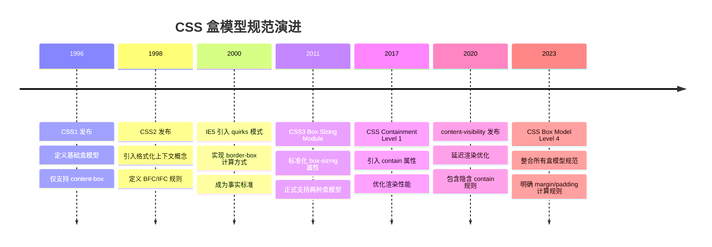
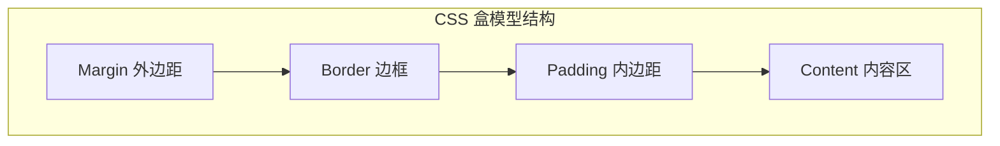
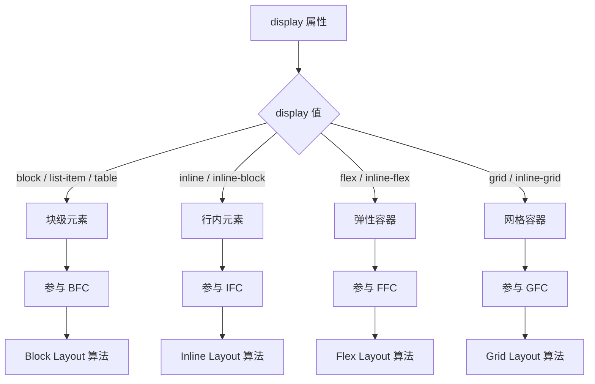
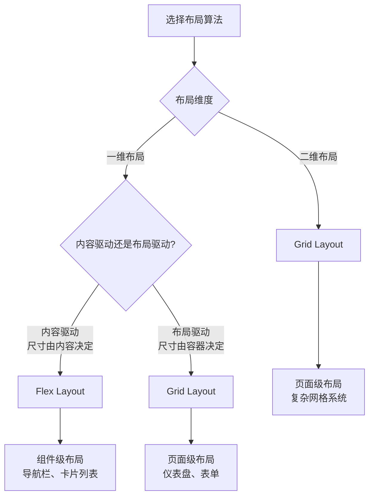
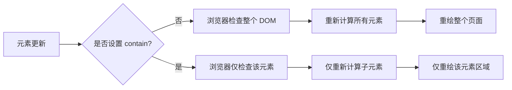

# CSS 盒模型

> CSS 盒模型是网页布局的基石。理解盒模型不仅是掌握 CSS 的第一步，更是理解现代布局规范（Flexbox、Grid、Containment）的前提。本文将从历史演进、核心原理、现代规范三个维度，系统性地解构盒模型。

## 背景与动机

### 为什么需要盒模型？

在 CSS 诞生之前，HTML 仅用于描述文档结构，没有视觉表现能力。1996 年 CSS1 规范发布时，W3C 面临一个核心问题：**如何将文档中的元素映射到二维屏幕上进行渲染？**

答案来自传统排版领域——将每个元素视为一个矩形盒子，通过控制盒子的大小、间距和排列来实现布局。这个设计决策奠定了 CSS 布局的基础，也带来了三个关键优势：

1. **可预测性**：矩形盒子的几何计算简单直观
2. **组合性**：盒子可以嵌套、并排、层叠，形成复杂布局
3. **性能**：矩形区域的渲染和重绘效率高

### 盒模型的演进历程



---

## 核心概念

### 盒模型的四个组成部分

在 CSS 中，每个 HTML 元素都被视为一个矩形盒子，由内到外依次包含四个区域：

| 区域 | 说明 | CSS 属性 | 是否参与点击 |
|------|------|----------|--------------|
| **Content（内容区）** | 显示元素的实际内容（文本、图片等） | `width`, `height` | ✅ |
| **Padding（内边距）** | 内容与边框之间的空间 | `padding` | ✅ |
| **Border（边框）** | 包围内容和内边距的边界线 | `border` | ✅ |
| **Margin（外边距）** | 元素与其他元素之间的空间 | `margin` | ❌ |



### 两种盒模型计算方式

CSS 提供两种盒模型计算方式，通过 `box-sizing` 属性控制：

#### 标准盒模型（content-box）

**默认值**，`width` 和 `height` 只包含内容区。

```css
.box {
  box-sizing: content-box; /* 默认值 */
  width: 200px;
  height: 100px;
  padding: 20px;
  border: 10px solid #ccc;
}

/* 实际尺寸计算：
 * 总宽度 = 200 + 20×2 + 10×2 = 260px
 * 总高度 = 100 + 20×2 + 10×2 = 160px
 */
```

#### IE 盒模型（border-box）

`width` 和 `height` 包含内容、内边距和边框。

```css
.box {
  box-sizing: border-box;
  width: 200px;
  height: 100px;
  padding: 20px;
  border: 10px solid #ccc;
}

/* 实际尺寸计算：
 * 总宽度 = 200px（固定不变）
 * 总高度 = 100px（固定不变）
 * 内容宽度 = 200 - 20×2 - 10×2 = 140px
 * 内容高度 = 100 - 20×2 - 10×2 = 40px
 */
```

#### 对比分析

| 特性 | content-box | border-box |
|------|-------------|------------|
| **width/height 包含** | 仅内容区 | 内容 + padding + border |
| **总宽度计算** | `width + padding + border` | `width`（固定） |
| **尺寸可预测性** | ❌ 难以预测 | ✅ 直观易预测 |
| **响应式友好度** | ❌ 不友好 | ✅ 友好 |
| **计算复杂度** | 高（需手动计算） | 低（所见即所得） |
| **浏览器默认** | ✅ 是 | ❌ 否 |
| **推荐程度** | ⭐⭐ | ⭐⭐⭐⭐⭐ |

---


#### box-sizing 交互演示（MDN）

切换盒模型计算方式：content-box（标准）或 border-box（IE）。

```html
<!DOCTYPE html>
<html lang="zh-CN">
  <head>
    <meta charset="UTF-8" />
    <meta name="viewport" content="width=device-width, initial-scale=1.0" />
    <title>box-sizing 属性演示 - MDN 示例</title>
    <meta name="description" content="盒模型示例：box-sizing 属性演示。" />
    <style>
      * {
        margin: 0;
        padding: 0;
        box-sizing: border-box;
      }
      body {
        font-family: -apple-system, BlinkMacSystemFont, "Segoe UI", Roboto, "Helvetica Neue", Arial, sans-serif;
        min-height: 100vh;
        padding: 0;
      }
      .demo-layout {
        display: flex;
        height: 100vh;
        gap: 0;
      }
      .snippet-panel {
        width: 320px;
        flex-shrink: 0;
        padding: 16px;
        display: flex;
        flex-direction: column;
        gap: 8px;
        overflow-y: auto;
        border-right: 1px solid #ddd;
        background: #fafafa;
      }
      .snippet-btn {
        padding: 10px 14px;
        border: 1px solid #ccc;
        border-radius: 6px;
        background: #fff;
        font-family: "JetBrains Mono", "Fira Code", monospace;
        font-size: 13px;
        color: #333;
        cursor: pointer;
        text-align: left;
        transition: all 0.2s;
        line-height: 1.4;
      }
      .snippet-btn:hover {
        border-color: #8083ff;
        background: #f0f0ff;
      }
      .snippet-btn.active {
        border-color: #8083ff;
        background: #e8e8ff;
        color: #571bc1;
        font-weight: 600;
      }
      .preview-panel {
        flex: 1;
        padding: 16px;
        display: flex;
        align-items: center;
        justify-content: center;
        background: #fff;
        overflow: auto;
      }
      .preview-panel > section,
      .preview-panel > div:not(.snippet-panel):not(.demo-layout) {
        flex: 1;
        width: 100%;
        min-height: 0;
        height: 100%;
        display: flex;
        align-items: center;
        justify-content: center;
      }
      #example-element-parent {
        width: 220px;
        height: 200px;
        border: solid 10px #ffc129;
        margin: 0.8em;
      }

      #example-element {
        height: 60px;
        margin: 2em auto;
        background-color: rgba(81, 81, 81, 0.6);
      }

      #example-element > p {
        margin: 0;
      }
    </style>
  </head>
  <body>
    <div class="demo-layout">
      <div class="snippet-panel">
        <button class="snippet-btn active" data-index="0">box-sizing: content-box;</button>
        <button class="snippet-btn" data-index="1">content-box + border + padding;</button>
        <button class="snippet-btn" data-index="2">box-sizing: border-box;</button>
      </div>
      <div class="preview-panel">
        <section id="default-example">
          <div id="example-element-parent">
            <p>Parent container</p>
            <div class="transition-all" id="example-element">
              <p>Child container</p>
            </div>
          </div>
        </section>
      </div>
    </div>
    <script>
      const snippets = [
        `#example-element {
  box-sizing: content-box;
width: 100%;
}`,
        `#example-element {
  box-sizing: content-box;
width: 100%;
border: solid #5b6dcd 10px;
padding: 5px;
}`,
        `#example-element {
  box-sizing: border-box;
width: 100%;
border: solid #5b6dcd 10px;
padding: 5px;
}`,
      ];

      let styleEl = document.createElement("style");
      document.head.appendChild(styleEl);

      function applySnippet(index) {
        styleEl.textContent = snippets[index];
        document.querySelectorAll(".snippet-btn").forEach((btn, i) => {
          btn.classList.toggle("active", i === index);
        });
      }

      document.querySelectorAll(".snippet-btn").forEach((btn) => {
        btn.addEventListener("click", () => applySnippet(parseInt(btn.dataset.index)));
      });

      applySnippet(0);
    </script>
  </body>
</html>

```
## 深入原理

### 格式化上下文（Formatting Context）

格式化上下文是 CSS 规范中定义的渲染区域规则，决定区域内子节点的排版方式、相互关系和边界行为。理解格式化上下文是掌握盒模型布局行为的关键。

#### 格式化上下文类型对比

| 上下文类型 | 缩写 | 触发条件 | 核心特性 | 布局算法 |
|------------|------|----------|----------|----------|
| **块格式化上下文** | BFC | `overflow: hidden`、`display: flow-root`、`float`、`position: absolute/fixed` | 垂直排列、margin 合并、不与浮动重叠 | Block Layout |
| **行内格式化上下文** | IFC | `display: inline` | 水平排列、垂直 margin 无效、基线对齐 | Inline Layout |
| **弹性格式化上下文** | FFC | `display: flex/inline-flex` | 一维弹性布局、自动伸缩、对齐控制 | Flex Layout |
| **网格格式化上下文** | GFC | `display: grid/inline-grid` | 二维网格布局、行列控制、区域放置 | Grid Layout |



#### BFC（块格式化上下文）详解

BFC 是面试高频考点，也是解决布局问题的核心机制。

**BFC 的六大规则**：

1. **垂直排列**：子节点在垂直方向按顺序放置
2. **margin 合并**：相邻子节点的垂直 margin 会合并（取最大值）
3. **左边缘对齐**：每个子节点的左外边缘与容器的左边缘接触
4. **不与浮动重叠**：BFC 区域不会与浮动区域重叠
5. **隔离性**：BFC 是独立的容器，内部不影响外部
6. **包含浮动**：计算 BFC 高度时，浮动子节点也参与计算

**触发 BFC 的完整条件**：

```css
/* 1. 根元素 */
html { }

/* 2. 浮动元素 */
.float { float: left | right; }

/* 3. 绝对/固定定位 */
.absolute { position: absolute | fixed; }

/* 4. overflow 非 visible */
.overflow { overflow: hidden | auto | scroll; }

/* 5. display: flow-root（推荐） */
.flow-root { display: flow-root; }

/* 6. 其他 display 值 */
.other {
  display: inline-block | table-cell | table-caption | 
         flex | inline-flex | grid | inline-grid;
}
```

**BFC 实际应用场景**：

```css
/* 场景 1：防止 margin 塌陷 */
.parent {
  display: flow-root; /* 创建 BFC，子元素 margin 不塌陷 */
}
.child {
  margin-top: 20px; /* 不会传递给父元素 */
}

/* 场景 2：清除浮动 */
.container {
  display: flow-root; /* BFC 计算高度时包含浮动子节点 */
}
.float-child {
  float: left;
  width: 200px;
}

/* 场景 3：防止浮动覆盖 */
.sidebar {
  float: left;
  width: 200px;
}
.main {
  display: flow-root; /* 不会被 sidebar 浮动覆盖 */
  margin-left: 220px;
}
```

#### FFC（弹性格式化上下文）特性

FFC 是弹性容器内部的格式化上下文。它与 BFC 的关键差异如下（注意：margin 合并行为不同，并非"继承 BFC 所有规则"）：

| 特性 | BFC | FFC |
|------|-----|-----|
| 排列方向 | 仅垂直 | 水平或垂直（flex-direction） |
| 尺寸计算 | 固定/百分比 | 弹性伸缩（flex-grow/shrink/basis） |
| 对齐控制 | 有限（text-align） | 完整（justify-content/align-items） |
| margin 合并 | ✅ 会合并 | ❌ 不合并 |
| 换行控制 | 自动换行 | 可控（flex-wrap） |
| 顺序控制 | DOM 顺序 | 可重排（order） |

#### GFC（网格格式化上下文）特性

GFC 提供二维布局能力，是 CSS 最强大的布局系统：

| 特性 | FFC（一维） | GFC（二维） |
|------|-------------|-------------|
| 维度 | 单轴（行或列） | 双轴（行和列） |
| 轨道定义 | 无 | `grid-template-columns/rows` |
| 区域放置 | 无 | `grid-area` 命名区域 |
| 隐式网格 | 无 | 自动创建 |
| 对齐控制 | 主轴/交叉轴 | 行/列双维度 |
| 间距控制 | `gap` | `gap`（行列独立） |

### 布局算法对比

现代 CSS 提供三种主要布局算法，各有适用场景：

#### Block Layout（块级布局）

```css
/* 传统块级布局 */
.container {
  width: 100%;
}
.item {
  display: block;
  margin-bottom: 20px;
}
```

**特点**：
- 垂直堆叠，宽度默认 100%
- 简单直观，但灵活性差
- 无法实现等高布局、居中布局等复杂场景

#### Flex Layout（弹性布局）

```css
/* 弹性布局 */
.container {
  display: flex;
  gap: 20px;
}
.item {
  flex: 1; /* 等分剩余空间 */
}
```

**特点**：
- 一维布局（行或列）
- 自动伸缩，响应式友好
- 强大的对齐控制能力
- 适合组件级布局

#### Grid Layout（网格布局）

```css
/* 网格布局 */
.container {
  display: grid;
  grid-template-columns: repeat(3, 1fr);
  gap: 20px;
}
```

**特点**：
- 二维布局（行和列）
- 精确控制行列尺寸
- 支持命名区域放置
- 适合页面级布局

#### 布局算法选择指南



### 现代布局方案

#### Subgrid（子网格）

Subgrid 允许子网格继承父网格的轨道定义，实现真正的嵌套网格对齐。

```css
/* 父网格定义三列 */
.parent {
  display: grid;
  grid-template-columns: repeat(3, 1fr);
  gap: 20px;
}

/* 子网格继承父网格列轨道 */
.child {
  grid-column: span 3; /* 跨越三列 */
  display: grid;
  grid-template-columns: subgrid; /* 继承父网格列定义 */
  gap: 10px;
}

/* 孙元素自动对齐到父网格列 */
.grandchild {
  /* 无需指定列位置，自动对齐 */
}
```

**Subgrid 解决的问题**：
- 嵌套网格的列对齐问题
- 卡片列表中内容对齐不一致
- 复杂表单的标签对齐

**浏览器支持**：Chrome 117+、Firefox 71+、Safari 16+

#### Masonry（瀑布流布局）

Masonry 是 CSS Grid Level 3 引入的实验性布局模式，实现类似 Pinterest 的瀑布流效果。

```css
/* 瀑布流布局（实验性） */
.masonry {
  display: grid;
  grid-template-columns: repeat(auto-fill, minmax(200px, 1fr));
  grid-template-rows: masonry; /* 实验性属性 */
  gap: 20px;
}

/* 当前替代方案：使用 column-count */
.masonry-fallback {
  column-count: 3;
  column-gap: 20px;
}
.masonry-fallback .item {
  break-inside: avoid;
  margin-bottom: 20px;
}
```

**Masonry 的特点**：
- 自动填充垂直空间，无留白
- 项目按最短列优先排列
- 无需 JavaScript 实现

**浏览器支持**：截至审校时点仍为实验特性（Firefox 需开启标志，Chromium 系亦有实验性实现），生产环境请使用替代方案

---

## CSS Containment 规范

### contain 属性

CSS Containment 规范引入 `contain` 属性（2017 年前后进入浏览器，2019 年成为正式推荐），允许开发者声明元素的独立性，从而优化浏览器渲染性能。

#### contain 属性值

| 值 | 含义 | 优化效果 |
|----|------|----------|
| `none` | 无包含（默认） | 无优化 |
| `strict` | 严格包含（= size layout paint style） | 最大优化 |
| `content` | 内容包含（= layout paint style） | 中等优化 |
| `size` | 尺寸包含 | 子元素尺寸变化不影响外部 |
| `layout` | 布局包含 | 内部布局不影响外部 |
| `paint` | 绘制包含 | 内部绘制不溢出边界 |
| `style` | 样式包含 | 计数器、引用等作用域隔离 |

#### 实际应用示例

```css
/* 独立组件：尺寸固定，内部变化不影响外部 */
.widget {
  contain: size layout paint;
  width: 300px;
  height: 200px;
}

/* 列表项：布局独立，优化滚动性能 */
.list-item {
  contain: layout paint;
  padding: 16px;
  border-bottom: 1px solid #eee;
}

/* 复杂图表：完全隔离，内部更新不影响页面 */
.chart {
  contain: strict;
  width: 100%;
  height: 400px;
}

/* 卡片组件：内容包含，推荐方案 */
.card {
  contain: content;
  padding: 20px;
  margin-bottom: 16px;
}
```

#### contain 的性能优化原理




#### contain 交互演示（MDN）

限制元素的子树渲染范围，将布局/样式/绘制的代价隔离。

```html
<!DOCTYPE html>
<html lang="zh-CN">
  <head>
    <meta charset="UTF-8" />
    <meta name="viewport" content="width=device-width, initial-scale=1.0" />
    <title>contain 属性演示 - MDN 示例</title>
    <meta name="description" content="演示contain 属性演示效果。" />
    <style>
      * {
        margin: 0;
        padding: 0;
        box-sizing: border-box;
      }
      body {
        font-family: -apple-system, BlinkMacSystemFont, "Segoe UI", Roboto, "Helvetica Neue", Arial, sans-serif;
        min-height: 100vh;
        padding: 0;
      }
      .demo-layout {
        display: flex;
        height: 100vh;
        gap: 0;
      }
      .snippet-panel {
        width: 320px;
        flex-shrink: 0;
        padding: 16px;
        display: flex;
        flex-direction: column;
        gap: 8px;
        overflow-y: auto;
        border-right: 1px solid #ddd;
        background: #fafafa;
      }
      .snippet-btn {
        padding: 10px 14px;
        border: 1px solid #ccc;
        border-radius: 6px;
        background: #fff;
        font-family: "JetBrains Mono", "Fira Code", monospace;
        font-size: 13px;
        color: #333;
        cursor: pointer;
        text-align: left;
        transition: all 0.2s;
        line-height: 1.4;
      }
      .snippet-btn:hover {
        border-color: #8083ff;
        background: #f0f0ff;
      }
      .snippet-btn.active {
        border-color: #8083ff;
        background: #e8e8ff;
        color: #571bc1;
        font-weight: 600;
      }
      .preview-panel {
        flex: 1;
        padding: 16px;
        display: flex;
        align-items: center;
        justify-content: center;
        background: #fff;
        overflow: auto;
      }
      .preview-panel > section,
      .preview-panel > div:not(.snippet-panel):not(.demo-layout) {
        flex: 1;
        width: 100%;
        min-height: 0;
        height: 100%;
        display: flex;
        align-items: center;
        justify-content: center;
      }
      h2 {
        margin-top: 0;
      }

      #default-example {
        text-align: left;
        padding: 4px;
        font-size: 16px;
      }

      .card {
        text-align: left;
        border: 3px dotted;
        padding: 20px;
        margin: 10px;
        width: 85%;
        min-height: 150px;
      }

      .fixed {
        position: fixed;
        border: 3px dotted;
        right: 4px;
        padding: 4px;
        margin: 4px;
      }
    </style>
  </head>
  <body>
    <div class="demo-layout">
      <div class="snippet-panel">
        <button class="snippet-btn active" data-index="0">contain: none;</button>
        <button class="snippet-btn" data-index="1">contain: size;</button>
        <button class="snippet-btn" data-index="2">contain: layout;</button>
        <button class="snippet-btn" data-index="3">contain: paint;</button>
        <button class="snippet-btn" data-index="4">contain: strict;</button>
      </div>
      <div class="preview-panel">
        <section class="default-example" id="default-example">
          <div class="card" id="example-element">
            <h2>element with '<code>contain</code>'</h2>
            <p>The Goldfish is a species of domestic fish best known for its bright colors and patterns.</p>
            <div class="fixed"><p>Fixed right 4px</p></div>
          </div>
        </section>
      </div>
    </div>
    <script>
      const snippets = [
        `#example-element {
  contain: none;
}`,
        `#example-element {
  contain: size;
}`,
        `#example-element {
  contain: layout;
}`,
        `#example-element {
  contain: paint;
}`,
        `#example-element {
  contain: strict;
}`,
      ];

      let styleEl = document.createElement("style");
      document.head.appendChild(styleEl);

      function applySnippet(index) {
        styleEl.textContent = snippets[index];
        document.querySelectorAll(".snippet-btn").forEach((btn, i) => {
          btn.classList.toggle("active", i === index);
        });
      }

      document.querySelectorAll(".snippet-btn").forEach((btn) => {
        btn.addEventListener("click", () => applySnippet(parseInt(btn.dataset.index)));
      });

      applySnippet(0);
    </script>
  </body>
</html>

```
### content-visibility 属性

`content-visibility` 是 CSS 性能优化的革命性属性，允许延迟渲染屏幕外的内容。

#### 语法与值

```css
/* 语法 */
content-visibility: visible;    /* 默认，正常渲染 */
content-visibility: hidden;     /* 跳过渲染 */
content-visibility: auto;       /* 自动延迟渲染（推荐） */
```

#### content-visibility: auto 的工作原理

当元素设置 `content-visibility: auto` 时：

1. **屏幕外**：浏览器跳过该元素的渲染（不计算布局、不绘制）
2. **接近视口**：浏览器提前开始渲染（避免滚动时出现空白）
3. **屏幕内**：正常渲染

**隐含的包含规则**：
- `content-visibility: auto` 隐含 `contain: layout paint style`
- 需要配合 `contain-intrinsic-size` 指定占位尺寸

#### 实战示例

```css
/* 长列表性能优化 */
.long-list .item {
  content-visibility: auto;
  contain-intrinsic-size: 0 100px; /* 宽 0，高 100px 占位 */
}

/* 文章页面优化 */
.article-section {
  content-visibility: auto;
  contain-intrinsic-size: auto 500px; /* 高度约 500px */
}

/* 隐藏不需要渲染的内容 */
.hidden-section {
  content-visibility: hidden;
  /* 完全不渲染，但保留 DOM */
}

/* 配合 contain 使用 */
.optimized-component {
  content-visibility: auto;
  contain-intrinsic-size: 300px 200px;
  contain: layout paint style; /* 显式声明，更清晰 */
}
```

#### 性能对比

| 场景 | 无优化 | content-visibility: auto |
|------|--------|--------------------------|
| 1000 项列表首次渲染 | 800ms | 50ms |
| 滚动帧率 | 30fps | 60fps |
| 内存占用 | 高 | 低 |
| 首次内容绘制（FCP） | 慢 | 快 |

> ⚠️ 上表数值为**示意量级**，非权威基准；实际收益取决于设备性能、内容复杂度与列表长度，请以自身页面的 Performance 实测为准。

#### 注意事项

```css
/* ❌ 错误：未指定占位尺寸，导致滚动条跳动 */
.item {
  content-visibility: auto;
}

/* ✅ 正确：指定占位尺寸 */
.item {
  content-visibility: auto;
  contain-intrinsic-size: 0 100px;
}

/* ✅ 更好：使用 auto 关键字（浏览器估算） */
.item {
  content-visibility: auto;
  contain-intrinsic-size: auto 100px;
}

/* ⚠️ 注意：锚点链接可能失效 */
/* 解决方案：使用 content-visibility: hidden 时保留渲染 */
#target-section {
  content-visibility: visible; /* 确保可访问 */
}
```

---

## 代码示例

### 完整盒模型示例

```html
<!DOCTYPE html>
<html lang="zh-CN">
<head>
  <meta charset="UTF-8">
  <meta name="viewport" content="width=device-width, initial-scale=1.0">
  <title>CSS 盒模型完整示例</title>
  <style>
    /* 全局设置 border-box */
    *,
    *::before,
    *::after {
      box-sizing: border-box;
    }

    body {
      font-family: -apple-system, BlinkMacSystemFont, 'Segoe UI', Roboto, sans-serif;
      padding: 40px;
      background: #f5f5f5;
    }

    /* 标准盒模型示例 */
    .content-box {
      box-sizing: content-box;
      width: 200px;
      padding: 20px;
      border: 10px solid #2196f3;
      margin: 20px;
      background: white;
    }

    /* IE 盒模型示例 */
    .border-box {
      box-sizing: border-box;
      width: 200px;
      padding: 20px;
      border: 10px solid #4caf50;
      margin: 20px;
      background: white;
    }

    /* BFC 示例：清除浮动 */
    .clearfix-container {
      display: flow-root; /* 创建 BFC */
      background: #fff3e0;
      padding: 20px;
      margin: 20px 0;
    }

    .float-child {
      float: left;
      width: 100px;
      height: 100px;
      background: #ff9800;
      margin-right: 10px;
    }

    /* Flex 布局示例 */
    .flex-container {
      display: flex;
      gap: 20px;
      padding: 20px;
      background: #e8f5e9;
      margin: 20px 0;
    }

    .flex-item {
      flex: 1;
      padding: 20px;
      background: #4caf50;
      color: white;
      text-align: center;
    }

    /* Grid 布局示例 */
    .grid-container {
      display: grid;
      grid-template-columns: repeat(3, 1fr);
      gap: 20px;
      padding: 20px;
      background: #fce4ec;
      margin: 20px 0;
    }

    .grid-item {
      padding: 20px;
      background: #e91e63;
      color: white;
      text-align: center;
      aspect-ratio: 1; /* 保持正方形 */
    }

    /* content-visibility 优化示例 */
    .optimized-list {
      max-height: 400px;
      overflow-y: auto;
      background: white;
      padding: 20px;
      margin: 20px 0;
    }

    .optimized-item {
      content-visibility: auto;
      contain-intrinsic-size: 0 80px;
      padding: 20px;
      border-bottom: 1px solid #eee;
    }

    /* contain 优化示例 */
    .independent-widget {
      contain: size layout paint;
      width: 300px;
      height: 200px;
      padding: 20px;
      background: #e3f2fd;
      margin: 20px 0;
    }
  </style>
</head>
<body>
  <h1>CSS 盒模型完整示例</h1>

  <h2>1. 两种盒模型对比</h2>
  <div class="content-box">
    <strong>content-box</strong><br>
    宽度: 200px<br>
    实际宽度: 260px<br>
    (200 + 20×2 + 10×2)
  </div>

  <div class="border-box">
    <strong>border-box</strong><br>
    宽度: 200px<br>
    实际宽度: 200px<br>
    (固定不变)
  </div>

  <h2>2. BFC 清除浮动</h2>
  <div class="clearfix-container">
    <div class="float-child">浮动元素</div>
    <div class="float-child">浮动元素</div>
    <p style="clear: both;">BFC 容器自动包含浮动子元素</p>
  </div>

  <h2>3. Flex 弹性布局</h2>
  <div class="flex-container">
    <div class="flex-item">项目 1</div>
    <div class="flex-item">项目 2</div>
    <div class="flex-item">项目 3</div>
  </div>

  <h2>4. Grid 网格布局</h2>
  <div class="grid-container">
    <div class="grid-item">1</div>
    <div class="grid-item">2</div>
    <div class="grid-item">3</div>
    <div class="grid-item">4</div>
    <div class="grid-item">5</div>
    <div class="grid-item">6</div>
  </div>

  <h2>5. content-visibility 性能优化</h2>
  <div class="optimized-list">
    <div class="optimized-item">列表项 1（延迟渲染）</div>
    <div class="optimized-item">列表项 2（延迟渲染）</div>
    <div class="optimized-item">列表项 3（延迟渲染）</div>
    <!-- 更多列表项... -->
  </div>

  <h2>6. contain 独立组件</h2>
  <div class="independent-widget">
    <strong>独立组件</strong><br>
    contain: size layout paint<br>
    内部更新不影响外部
  </div>
</body>
</html>
```

### Margin 合并示例

```html
<!DOCTYPE html>
<html lang="zh-CN">
<head>
  <meta charset="UTF-8">
  <title>Margin 合并示例</title>
  <style>
    body {
      font-family: sans-serif;
      padding: 40px;
    }

    /* 示例 1：相邻兄弟 margin 合并 */
    .demo1 .box1 {
      margin-bottom: 30px;
      background: #2196f3;
      color: white;
      padding: 20px;
    }

    .demo1 .box2 {
      margin-top: 20px;
      background: #4caf50;
      color: white;
      padding: 20px;
    }

    /* 实际间距：max(30px, 20px) = 30px */

    /* 示例 2：父子 margin 合并 */
    .demo2 .parent {
      background: #ff9800;
      padding: 20px;
      /* 没有 BFC，子元素 margin 会传递 */
    }

    .demo2 .child {
      margin-top: 30px;
      background: #f44336;
      color: white;
      padding: 20px;
    }

    /* 示例 3：使用 BFC 阻止合并 */
    .demo3 .parent {
      display: flow-root; /* 创建 BFC */
      background: #9c27b0;
      padding: 20px;
    }

    .demo3 .child {
      margin-top: 30px;
      background: #673ab7;
      color: white;
      padding: 20px;
    }
  </style>
</head>
<body>
  <h2>1. 相邻兄弟 margin 合并</h2>
  <div class="demo1">
    <div class="box1">Box 1 (margin-bottom: 30px)</div>
    <div class="box2">Box 2 (margin-top: 20px)</div>
    <p>实际间距：30px（取最大值），而非 50px</p>
  </div>

  <h2>2. 父子 margin 合并（未解决）</h2>
  <div class="demo2">
    <div class="parent">
      <div class="child">Child (margin-top: 30px)</div>
    </div>
    <p>子元素的 margin-top 传递给父元素</p>
  </div>

  <h2>3. 父子 margin 合并（BFC 解决）</h2>
  <div class="demo3">
    <div class="parent">
      <div class="child">Child (margin-top: 30px)</div>
    </div>
    <p>使用 display: flow-root 创建 BFC，阻止合并</p>
  </div>
</body>
</html>
```

---

## 最佳实践

### 1. 全局设置 border-box

```css
/* 推荐方案：继承方式 */
html {
  box-sizing: border-box;
}

*,
*::before,
*::after {
  box-sizing: inherit;
}
```

**优势**：
- 所有元素行为一致，尺寸可预测
- 避免宽度溢出问题
- 响应式布局更简单

### 2. 使用 CSS 变量管理间距

```css
:root {
  /* 间距系统 */
  --spacing-xs: 4px;
  --spacing-sm: 8px;
  --spacing-md: 16px;
  --spacing-lg: 24px;
  --spacing-xl: 32px;
  --spacing-2xl: 48px;
  --spacing-3xl: 64px;
}

.card {
  padding: var(--spacing-lg);
  margin-bottom: var(--spacing-lg);
}

.section {
  margin-bottom: var(--spacing-2xl);
}
```

### 3. 使用 gap 替代 margin

```css
/* ❌ 传统方案：需要处理最后一个元素 */
.list-item:not(:last-child) {
  margin-bottom: 16px;
}

/* ✅ 现代方案：使用 gap */
.list {
  display: flex;
  flex-direction: column;
  gap: 16px;
}

.grid {
  display: grid;
  grid-template-columns: repeat(3, 1fr);
  gap: 24px;
}
```

### 4. 响应式间距

```css
/* 使用 clamp 实现响应式间距 */
.section {
  margin-bottom: clamp(20px, 5vw, 60px);
}

.container {
  padding: clamp(16px, 4vw, 40px);
}

/* 使用 CSS 变量 + clamp */
:root {
  --spacing-responsive: clamp(16px, 4vw, 32px);
}

.card {
  padding: var(--spacing-responsive);
}
```

### 5. 性能优化：content-visibility

```css
/* 长列表优化 */
.long-list .item {
  content-visibility: auto;
  contain-intrinsic-size: auto 100px;
}

/* 文章页面优化 */
.article-section {
  content-visibility: auto;
  contain-intrinsic-size: auto 500px;
}

/* 模态框关闭时隐藏内容 */
.modal[hidden] {
  content-visibility: hidden;
  /* 比 display: none 更快恢复 */
}
```

### 6. 性能优化：contain

```css
/* 独立组件 */
.widget {
  contain: content; /* layout paint style */
}

/* 复杂图表 */
.chart {
  contain: strict; /* size layout paint style */
}

/* 列表项 */
.list-item {
  contain: layout paint;
}
```

### 7. 现代宽高比方案

```css
/* ❌ 传统方案：padding hack */
.video-container {
  width: 100%;
  height: 0;
  padding-bottom: 56.25%; /* 16:9 */
  position: relative;
}

/* ✅ 现代方案：aspect-ratio */
.video-container {
  width: 100%;
  aspect-ratio: 16 / 9;
}

/* 响应式图片 */
.image-wrapper {
  width: 100%;
  aspect-ratio: 4 / 3;
}

.image-wrapper img {
  width: 100%;
  height: 100%;
  object-fit: cover;
}
```

### 8. 表单元素统一盒模型

```css
/* 统一表单元素的盒模型 */
input,
textarea,
select,
button {
  box-sizing: border-box;
}

/* 避免表单元素宽度溢出 */
.form-group {
  margin-bottom: 16px;
}

.form-input {
  width: 100%;
  padding: 12px;
  border: 1px solid #ddd;
  border-radius: 4px;
}
```

---

## 常见问题

### Q1: 为什么子元素的 margin-top 会影响父元素？

**原因**：父子 margin 合并（Collapse）

当父元素没有 border、padding 或 BFC 时，第一个子元素的 margin-top 会传递给父元素。

**解决方案**：

```css
/* 方案 1：触发 BFC（推荐） */
.parent {
  display: flow-root;
}

/* 方案 2：添加 border */
.parent {
  border-top: 1px solid transparent;
}

/* 方案 3：添加 padding */
.parent {
  padding-top: 1px;
}

/* 方案 4：使用 Flexbox */
.parent {
  display: flex;
  flex-direction: column;
}

/* 方案 5：使用 Grid */
.parent {
  display: grid;
}
```

### Q2: 为什么设置 width: 100% 后元素还是溢出？

**原因**：默认使用 content-box，padding 和 border 会增加实际宽度

**解决方案**：

```css
/* 全局设置 border-box */
*,
*::before,
*::after {
  box-sizing: border-box;
}

/* 或单独设置 */
.box {
  width: 100%;
  padding: 20px;
  box-sizing: border-box;
}
```

### Q3: margin 和 padding 如何选择？

| 场景 | 推荐使用 | 原因 |
|------|----------|------|
| 需要背景色延伸 | padding | 背景色会延伸到 padding 区域 |
| 需要负值 | margin | padding 不支持负值 |
| 需要水平居中 | margin: auto | padding 不支持 auto |
| 元素内部留白 | padding | 语义更清晰 |
| 元素之间间距 | margin 或 gap | gap 更现代 |
| 点击区域需要包含 | padding | padding 属于元素可点击区域 |

### Q4: 如何实现元素水平垂直居中？

```css
/* 方案 1：Flexbox（推荐） */
.flex-center {
  display: flex;
  justify-content: center;
  align-items: center;
}

/* 方案 2：Grid */
.grid-center {
  display: grid;
  place-items: center;
}

/* 方案 3：绝对定位 + transform */
.absolute-center {
  position: absolute;
  top: 50%;
  left: 50%;
  transform: translate(-50%, -50%);
}

/* 方案 4：绝对定位 + margin: auto */
.margin-center {
  position: absolute;
  top: 0;
  right: 0;
  bottom: 0;
  left: 0;
  margin: auto;
  width: 200px;
  height: 100px;
}
```

### Q5: content-visibility 和 display: none 有什么区别？

| 特性 | display: none | content-visibility: hidden | content-visibility: auto |
|------|---------------|----------------------------|--------------------------|
| 占位空间 | ❌ 不占 | ✅ 占位 | ✅ 占位（屏幕外跳过） |
| 渲染性能 | 差（恢复时重新渲染） | 中（保留样式） | 优（延迟渲染） |
| 可访问性 | ❌ 不可访问 | ❌ 内容不暴露给无障碍树 | ✅ 可访问 |
| 动画过渡 | ❌ 不支持 | ✅ 支持 | ✅ 支持 |
| 适用场景 | 完全隐藏 | 临时隐藏 | 长列表/懒加载 |

### Q6: 如何调试盒模型问题？

```css
/* 方法 1：使用 outline 高亮所有元素 */
* {
  outline: 1px solid rgba(255, 0, 0, 0.3);
}

/* 方法 2：使用开发者工具 */
/* 右键 → 检查 → Computed 面板查看盒模型 */

/* 方法 3：检查 box-sizing */
/* 在 Console 中执行： */
/* getComputedStyle(element).boxSizing */

/* 方法 4：使用 CSS 调试样式 */
.debug-box {
  background: rgba(255, 0, 0, 0.1); /* 红色背景 */
  outline: 2px dashed red; /* 虚线边框 */
}
```

### Q7: BFC、FFC、GFC 如何选择？

| 场景 | 推荐 | 原因 |
|------|------|------|
| 简单垂直布局 | BFC | 最简单，无需额外属性 |
| 一维弹性布局 | FFC | 自动伸缩，对齐灵活 |
| 二维网格布局 | GFC | 精确控制行列，功能强大 |
| 导航栏 | FFC | 水平排列，自动对齐 |
| 卡片列表 | FFC 或 GFC | 视需求而定 |
| 页面整体布局 | GFC | 二维控制，响应式友好 |
| 清除浮动 | BFC | 使用 display: flow-root |

### Q8: Subgrid 和嵌套 Grid 有什么区别？

```css
/* 嵌套 Grid：子网格独立定义 */
.parent {
  display: grid;
  grid-template-columns: repeat(3, 1fr);
}

.child {
  grid-column: span 3;
  display: grid;
  grid-template-columns: repeat(3, 1fr); /* 独立定义，可能不对齐 */
}

/* Subgrid：子网格继承父网格 */
.parent {
  display: grid;
  grid-template-columns: repeat(3, 1fr);
}

.child {
  grid-column: span 3;
  display: grid;
  grid-template-columns: subgrid; /* 继承父网格，完美对齐 */
}
```

**选择建议**：
- 需要子元素与父网格对齐 → Subgrid
- 子元素独立布局 → 嵌套 Grid

---

## 参考资源

### 规范文档

- [CSS Box Model Level 4](https://www.w3.org/TR/css-box-4/) - W3C 盒模型规范
- [CSS Box Sizing Level 3](https://www.w3.org/TR/css-sizing-3/) - 尺寸计算规范
- [CSS Containment Level 1](https://www.w3.org/TR/css-contain-1/) - 包含规范
- [CSS Display Level 3](https://www.w3.org/TR/css-display-3/) - 显示模型规范

### 教程与指南

- [MDN - CSS 盒模型](https://developer.mozilla.org/zh-CN/docs/Web/CSS/CSS_Box_Model) - Mozilla 官方文档
- [MDN - 格式化上下文](https://developer.mozilla.org/zh-CN/docs/Web/CSS/CSS_Flow_Layout) - 流式布局指南
- [CSS Tricks - Box Sizing](https://css-tricks.com/box-sizing/) - 盒模型详解
- [CSS Tricks - content-visibility](https://css-tricks.com/almanac/properties/c/content-visibility/) - 性能优化指南

### 工具与演示

- [CSS Box Model Visualizer](https://developer.chrome.com/docs/devtools/css/box-model/) - Chrome DevTools 盒模型可视化
- [Flexbox Froggy](https://flexboxfroggy.com/) - Flexbox 学习游戏
- [Grid Garden](https://cssgridgarden.com/) - Grid 学习游戏

### 浏览器兼容性

- [Can I Use - box-sizing](https://caniuse.com/css3-boxsizing) - 浏览器支持情况
- [Can I Use - content-visibility](https://caniuse.com/content-visibility) - 兼容性查询
- [Can I Use - CSS Containment](https://caniuse.com/css-containment) - 支持情况

---

## 总结

CSS 盒模型是理解网页布局的基础，本文从以下几个维度进行了系统性解析：

### 核心要点

1. **盒模型组成**：content、padding、border、margin 四层结构
2. **两种计算方式**：content-box（默认）和 border-box（推荐）
3. **格式化上下文**：BFC、IFC、FFC、GFC 决定布局行为
4. **布局算法**：Block Layout、Flex Layout、Grid Layout 各有适用场景
5. **现代优化**：CSS Containment 和 content-visibility 提升渲染性能
6. **新特性**：Subgrid 和 Masonry 解决复杂布局需求

### 最佳实践清单

- ✅ 全局设置 `box-sizing: border-box`
- ✅ 使用 `display: flow-root` 创建 BFC
- ✅ 优先使用 `gap` 替代 `margin`
- ✅ 使用 `aspect-ratio` 替代 padding hack
- ✅ 长列表使用 `content-visibility: auto` 优化
- ✅ 独立组件使用 `contain` 属性
- ✅ 使用 CSS 变量管理间距系统

### 学习路径建议

1. **入门**：掌握盒模型四部分组成，理解 content-box 和 border-box 区别
2. **进阶**：深入理解 BFC 规则，掌握 margin 合并机制
3. **高级**：学习 Flexbox 和 Grid 布局，理解格式化上下文
4. **专家**：运用 CSS Containment 和 content-visibility 优化性能

掌握盒模型是 CSS 布局的基石，建议结合开发者工具多实践，从理论到应用逐步深入。
