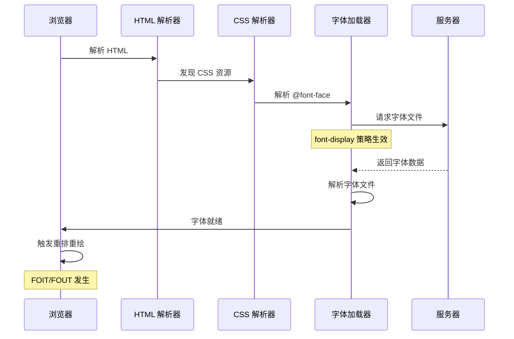

# CSS 字体属性

## 背景与动机

在现代 Web 开发中，字体不仅仅是视觉装饰，更是用户体验、品牌识别和可访问性的核心组成部分。选择合适的字体、优化字体加载性能、确保跨平台一致性，是每个前端开发者必须掌握的技能。

### 为什么字体如此重要？

1. **品牌识别**：字体是品牌形象的重要组成部分，独特的字体可以增强品牌辨识度
2. **可读性**：合适的字体大小、行高、字重直接影响用户的阅读体验
3. **性能影响**：字体文件通常较大，不当的加载策略会严重影响页面加载速度
4. **跨平台一致性**：不同操作系统默认字体不同，需要合理的字体栈策略
5. **可访问性**：字体选择影响视觉障碍用户的阅读体验

### 核心挑战

- 如何平衡字体美观性与加载性能？
- 如何处理中文字体文件过大的问题？
- 如何实现字体的响应式设计？
- 如何利用可变字体减少 HTTP 请求？

本文将系统性地解答这些问题，从基础概念到高级优化，全面覆盖 CSS 字体属性的各个方面。

---

## 核心概念

### 字体属性体系概览

```mermaid
graph TD
    A[CSS 字体属性] --> B[font-family<br/>字体系列]
    A --> C[font-size<br/>字体大小]
    A --> D[font-weight<br/>字体粗细]
    A --> E[font-style<br/>字体样式]
    A --> F[line-height<br/>行高]
    A --> G[font-variant<br/>字体变体]
    A --> H[font-stretch<br/>字体拉伸]
    A --> I[font 简写属性]
    
    B --> B1[系统字体栈]
    B --> B2[@font-face<br/>自定义字体]
    B --> B3[unicode-range<br/>字符集控制]
    
    C --> C1[绝对单位<br/>px, pt]
    C --> C2[相对单位<br/>em, rem]
    C --> C3[视口单位<br/>vw, vh]
    C --> C4[响应式字体<br/>clamp]
    
    D --> D1[数值<br/>100-900]
    D --> D2[关键字<br/>normal, bold]
    D --> D3[相对值<br/>lighter, bolder]
    
```

### 字体加载流程

理解字体加载流程是优化性能的基础：



---

## 深入原理

### 字体渲染机制

浏览器的字体渲染是一个复杂的过程，涉及多个阶段：

#### 1. 字体解析阶段

浏览器接收到字体文件后，需要解析字体格式：

- **TrueType (TTF)**：苹果和微软共同开发，使用二次 B 样条描述字形
- **OpenType (OTF)**：基于 TrueType 扩展，支持 PostScript 字形
- **WOFF/WOFF2**：Web 优化格式，WOFF2 使用 Brotli 压缩，体积减少 30%

#### 2. 字形光栅化

将矢量字形转换为像素：

```javascript
// 字体渲染质量影响因子
const renderingFactors = {
  hinting: '字形微调，改善小字体显示',
  antiAliasing: '抗锯齿处理',
  subpixelRendering: '子像素渲染（ClearType）',
  kerning: '字距调整',
  ligatures: '连字处理'
};
```

#### 3. 字体合成与回退

当请求的字重或字形不存在时，浏览器会：

1. 尝试使用最接近的字体文件
2. 使用算法合成（效果通常不理想）
3. 回退到下一个字体栈成员

### 字体加载性能优化

#### 核心策略

**1. font-display 属性**

```css
@font-face {
  font-family: 'MyFont';
  src: url('font.woff2') format('woff2');
  font-display: swap; /* 关键优化点 */
}
```

**font-display 策略对比：**

| 值 | 阻塞期 | 交换期 | 行为 | 适用场景 |
|---|--------|--------|------|----------|
| `auto` | 3s | 无 | 浏览器默认 | 不推荐 |
| `block` | 3s | 无 | 阻塞渲染，显示空白 | 不推荐 |
| `swap` | 0s | 无限 | 立即显示后备字体 | **正文推荐** |
| `fallback` | 100ms | 3s | 短暂阻塞后交换 | 标题 |
| `optional` | 0s | 0s | 根据网络决定 | 性能优先 |

**2. 预加载关键字体**

```html
<!-- 在 <head> 中预加载 -->
<link rel="preload" href="/fonts/main.woff2" as="font" type="font/woff2" crossorigin>

<!-- 预连接字体源 -->
<link rel="preconnect" href="https://fonts.gstatic.com" crossorigin>
```

**3. unicode-range 字符集控制**

```css
/* 仅加载拉丁字符 */
@font-face {
  font-family: 'MyFont';
  src: url('font-latin.woff2') format('woff2');
  unicode-range: U+0000-007F, U+00A0-00FF;
}

/* 加载中文常用字符（3500 字） */
@font-face {
  font-family: 'MyFont';
  src: url('font-chinese-common.woff2') format('woff2');
  unicode-range: U+4E00-9FFF, U+3000-303F, U+FF00-FFEF;
}
```

**4. 字体子集化**

使用工具提取页面实际使用的字符：

```bash
# 使用 fonttools 子集化
pyftsubset font.ttf --text="你好世界" --output-file=font-subset.woff2

# 使用 unicode-range
pyftsubset font.ttf --unicodes="U+4E00-9FFF" --output-file=font-chinese.woff2
```

**5. 使用可变字体**

```css
/* 一个文件包含所有字重 */
@font-face {
  font-family: 'VariableFont';
  src: url('VariableFont.woff2') format('woff2-variations');
  font-weight: 100 900; /* 支持范围 */
  font-display: swap;
}
```

**性能收益：**
- 减少 HTTP 请求（1 个文件 vs 多个文件）
- 总体积更小（可变字体通常比多个静态字体小 30-50%）
- 支持任意字重值（如 450、550）

### 可变字体高级用法

#### 核心概念

可变字体（Variable Fonts）是 OpenType 1.8 规范引入的特性，允许在一个文件中包含多个字体变体。

#### 注册轴与自定义轴

```css
/* 注册轴（Registered Axes） */
font-variation-settings: 
  'wght' 450,    /* Weight - 字重 */
  'wdth' 75,     /* Width - 字宽 */
  'slnt' -10,    /* Slant - 倾斜 */
  'ital' 1,      /* Italic - 斜体 */
  'opsz' 14;     /* Optical Size - 光学尺寸 */

/* 自定义轴（Custom Axes）- 字体设计师定义 */
font-variation-settings: 
  'GRAD' 0.5,    /* Gradient - 渐变 */
  'XTRA' 400;    /* Xtra Width - 额外宽度 */
```

#### 可变字体动画

```css
/* 字重动画 */
@keyframes weight-pulse {
  0%, 100% { font-variation-settings: 'wght' 400; }
  50% { font-variation-settings: 'wght' 700; }
}

.animated-text {
  font-variation-settings: 'wght' 400;
  animation: weight-pulse 2s ease-in-out infinite;
}

/* 交互式字宽调整 */
.slider-text {
  font-variation-settings: 'wdth' var(--width, 100);
  transition: font-variation-settings 0.3s ease;
}

.slider-text:hover {
  --width: 125;
}
```

#### 条件式可变字体

```css
/* 根据视口自动调整 */
@media (max-width: 768px) {
  body {
    font-variation-settings: 'wght' 400, 'wdth' 100;
  }
}

@media (min-width: 769px) {
  body {
    font-variation-settings: 'wght' 300, 'wdth' 90;
  }
}
```

### 中文字体优化

中文字体文件通常非常大（5-20MB），需要特殊优化策略。

#### 字体栈策略

```css
/* 跨平台中文字体栈 */
body {
  font-family: 
    /* macOS/iOS */
    -apple-system, BlinkMacSystemFont, "PingFang SC",
    /* Windows */
    "Segoe UI", "Microsoft YaHei",
    /* Android */
    "Noto Sans CJK SC", "Source Han Sans SC",
    /* 后备 */
    sans-serif;
}

/* 代码字体（包含中文等宽） */
code, pre {
  font-family: 
    "JetBrains Mono", "Fira Code", 
    "Source Code Pro", Consolas,
    "Microsoft YaHei", monospace;
}
```

#### 中文字体子集化

```css
/* 方案 1：按使用频率分层加载 */
@font-face {
  font-family: 'ChineseFont';
  src: url('chinese-common.woff2') format('woff2');
  unicode-range: U+4E00-9FFF; /* 常用汉字 */
  font-display: swap;
}

@font-face {
  font-family: 'ChineseFont';
  src: url('chinese-rare.woff2') format('woff2');
  unicode-range: U+3400-4DBF, U+20000-2A6DF; /* 扩展区 */
  font-display: optional;
}

/* 方案 2：使用字体子集化工具 */
/* 构建时提取页面实际使用的字符 */
```

#### 中文字体性能优化清单

1. **优先使用系统字体**：`-apple-system`, `"Microsoft YaHei"` 等
2. **字体子集化**：提取常用 3500 字，体积从 10MB 降至 500KB
3. **使用 WOFF2**：压缩率比 WOFF 高 30%
4. **延迟加载**：非首屏字体使用 `font-display: optional`
5. **预连接**：`<link rel="preconnect" href="https://fonts.googleapis.com">`

---

## 代码示例

### font-family 字体系列

```css
/* 系统字体栈（推荐） */
.system-fonts {
  font-family: 
    -apple-system, BlinkMacSystemFont, 
    "Segoe UI", Roboto, "Helvetica Neue", Arial,
    "Noto Sans", sans-serif;
}

/* 自定义字体 + 后备 */
.custom-font {
  font-family: 'CustomFont', 'PingFang SC', sans-serif;
}

/* 等宽字体栈 */
.mono-font {
  font-family: 
    SFMono-Regular, Consolas, "Liberation Mono", 
    Menlo, Monaco, "Courier New", monospace;
}
```


#### font-family 交互演示（MDN）

指定字体系列，浏览器按列表依次回退匹配可用字体。

```html
<!DOCTYPE html>
<html lang="zh-CN">
  <head>
    <meta charset="UTF-8" />
    <meta name="viewport" content="width=device-width, initial-scale=1.0" />
    <title>font-family 属性演示 - MDN 示例</title>
    <meta name="description" content="文本与字体示例：font（family 属性演示）。" />
    <style>
      * {
        margin: 0;
        padding: 0;
        box-sizing: border-box;
      }
      body {
        font-family: -apple-system, BlinkMacSystemFont, "Segoe UI", Roboto, "Helvetica Neue", Arial, sans-serif;
        min-height: 100vh;
        padding: 0;
      }
      .demo-layout {
        display: flex;
        height: 100vh;
        gap: 0;
      }
      .snippet-panel {
        width: 320px;
        flex-shrink: 0;
        padding: 16px;
        display: flex;
        flex-direction: column;
        gap: 8px;
        overflow-y: auto;
        border-right: 1px solid #ddd;
        background: #fafafa;
      }
      .snippet-btn {
        padding: 10px 14px;
        border: 1px solid #ccc;
        border-radius: 6px;
        background: #fff;
        font-family: "JetBrains Mono", "Fira Code", monospace;
        font-size: 13px;
        color: #333;
        cursor: pointer;
        text-align: left;
        transition: all 0.2s;
        line-height: 1.4;
      }
      .snippet-btn:hover {
        border-color: #8083ff;
        background: #f0f0ff;
      }
      .snippet-btn.active {
        border-color: #8083ff;
        background: #e8e8ff;
        color: #571bc1;
        font-weight: 600;
      }
      .preview-panel {
        flex: 1;
        padding: 16px;
        display: flex;
        align-items: center;
        justify-content: center;
        background: #fff;
        overflow: auto;
      }
      .preview-panel > section,
      .preview-panel > div:not(.snippet-panel):not(.demo-layout) {
        flex: 1;
        width: 100%;
        min-height: 0;
        height: 100%;
        display: flex;
        align-items: center;
        justify-content: center;
      }
    </style>
  </head>
  <body>
    <div class="demo-layout">
      <div class="snippet-panel">
        <button class="snippet-btn active" data-index="0">font-family: Georgia, serif;</button>
        <button class="snippet-btn" data-index="1">font-family: &quot;Gill Sans&quot;, sans-serif;</button>
        <button class="snippet-btn" data-index="2">font-family: sans-serif;</button>
        <button class="snippet-btn" data-index="3">font-family: serif;</button>
        <button class="snippet-btn" data-index="4">font-family: cursive;</button>
        <button class="snippet-btn" data-index="5">font-family: system-ui;</button>
      </div>
      <div class="preview-panel">
        <section id="default-example">
          <p id="example-element">
            London. Michaelmas term lately over, and the Lord Chancellor sitting in Lincoln's Inn Hall. Implacable
            November weather. As much mud in the streets as if the waters had but newly retired from the face of the
            earth, and it would not be wonderful to meet a Megalosaurus, forty feet long or so, waddling like an
            elephantine lizard up Holborn Hill.
          </p>
        </section>
      </div>
    </div>
    <script>
      const snippets = [
        `#example-element {
  font-family: Georgia, serif;
}`,
        `#example-element {
  font-family: "Gill Sans", sans-serif;
}`,
        `#example-element {
  font-family: sans-serif;
}`,
        `#example-element {
  font-family: serif;
}`,
        `#example-element {
  font-family: cursive;
}`,
        `#example-element {
  font-family: system-ui;
}`,
      ];

      let styleEl = document.createElement("style");
      document.head.appendChild(styleEl);

      function applySnippet(index) {
        styleEl.textContent = snippets[index];
        document.querySelectorAll(".snippet-btn").forEach((btn, i) => {
          btn.classList.toggle("active", i === index);
        });
      }

      document.querySelectorAll(".snippet-btn").forEach((btn) => {
        btn.addEventListener("click", () => applySnippet(parseInt(btn.dataset.index)));
      });

      applySnippet(0);
    </script>
  </body>
</html>

```
### font-size 字体大小

```css
/* 响应式字体大小 */
html {
  font-size: clamp(14px, 2vw, 18px);
}

/* 使用 rem 保持一致性 */
body {
  font-size: 1rem; /* 16px */
}

h1 {
  font-size: 2.5rem; /* 40px */
}

h2 {
  font-size: 2rem; /* 32px */
}

/* 流式排版 */
.fluid-text {
  font-size: calc(16px + (24 - 16) * ((100vw - 320px) / (1200 - 320)));
}
```


#### font-size 交互演示（MDN）

设置文字大小，支持 px、em、rem、百分比、vw 等单位。

```html
<!DOCTYPE html>
<html lang="zh-CN">
  <head>
    <meta charset="UTF-8" />
    <meta name="viewport" content="width=device-width, initial-scale=1.0" />
    <title>font-size 属性演示 - MDN 示例</title>
    <meta name="description" content="文本与字体示例：font（size 属性演示）。" />
    <style>
      * {
        margin: 0;
        padding: 0;
        box-sizing: border-box;
      }
      body {
        font-family: -apple-system, BlinkMacSystemFont, "Segoe UI", Roboto, "Helvetica Neue", Arial, sans-serif;
        min-height: 100vh;
        padding: 0;
      }
      .demo-layout {
        display: flex;
        height: 100vh;
        gap: 0;
      }
      .snippet-panel {
        width: 320px;
        flex-shrink: 0;
        padding: 16px;
        display: flex;
        flex-direction: column;
        gap: 8px;
        overflow-y: auto;
        border-right: 1px solid #ddd;
        background: #fafafa;
      }
      .snippet-btn {
        padding: 10px 14px;
        border: 1px solid #ccc;
        border-radius: 6px;
        background: #fff;
        font-family: "JetBrains Mono", "Fira Code", monospace;
        font-size: 13px;
        color: #333;
        cursor: pointer;
        text-align: left;
        transition: all 0.2s;
        line-height: 1.4;
      }
      .snippet-btn:hover {
        border-color: #8083ff;
        background: #f0f0ff;
      }
      .snippet-btn.active {
        border-color: #8083ff;
        background: #e8e8ff;
        color: #571bc1;
        font-weight: 600;
      }
      .preview-panel {
        flex: 1;
        padding: 16px;
        display: flex;
        align-items: center;
        justify-content: center;
        background: #fff;
        overflow: auto;
      }
      .preview-panel > section,
      .preview-panel > div:not(.snippet-panel):not(.demo-layout) {
        flex: 1;
        width: 100%;
        min-height: 0;
        height: 100%;
        display: flex;
        align-items: center;
        justify-content: center;
      }
    </style>
  </head>
  <body>
    <div class="demo-layout">
      <div class="snippet-panel">
        <button class="snippet-btn active" data-index="0">font-size: 1.2rem;</button>
        <button class="snippet-btn" data-index="1">font-size: x-small;</button>
        <button class="snippet-btn" data-index="2">font-size: smaller;</button>
        <button class="snippet-btn" data-index="3">font-size: 12px;</button>
        <button class="snippet-btn" data-index="4">font-size: 80%;</button>
      </div>
      <div class="preview-panel">
        <section id="default-example">
          <p id="example-element">
            London. Michaelmas term lately over, and the Lord Chancellor sitting in Lincoln's Inn Hall. Implacable
            November weather. As much mud in the streets as if the waters had but newly retired from the face of the
            earth, and it would not be wonderful to meet a Megalosaurus, forty feet long or so, waddling like an
            elephantine lizard up Holborn Hill.
          </p>
        </section>
      </div>
    </div>
    <script>
      const snippets = [
        `#example-element {
  font-size: 1.2rem;
}`,
        `#example-element {
  font-size: x-small;
}`,
        `#example-element {
  font-size: smaller;
}`,
        `#example-element {
  font-size: 12px;
}`,
        `#example-element {
  font-size: 80%;
}`,
      ];

      let styleEl = document.createElement("style");
      document.head.appendChild(styleEl);

      function applySnippet(index) {
        styleEl.textContent = snippets[index];
        document.querySelectorAll(".snippet-btn").forEach((btn, i) => {
          btn.classList.toggle("active", i === index);
        });
      }

      document.querySelectorAll(".snippet-btn").forEach((btn) => {
        btn.addEventListener("click", () => applySnippet(parseInt(btn.dataset.index)));
      });

      applySnippet(0);
    </script>
  </body>
</html>

```
### font-weight 字体粗细

```css
/* 数值字重 */
.light { font-weight: 300; }
.regular { font-weight: 400; }
.medium { font-weight: 500; }
.semibold { font-weight: 600; }
.bold { font-weight: 700; }

/* 可变字体支持任意值 */
.variable-weight {
  font-weight: 450; /* 需要可变字体支持 */
}

/* 相对值 */
.parent { font-weight: 400; }
.child-lighter { font-weight: lighter; } /* 300（父元素 400 → lighter 降一档） */
.child-bolder { font-weight: bolder; } /* 700 */
```


#### font-weight 交互演示（MDN）

设置字体粗细（100-900 或 bold/bolder/lighter）。

```html
<!DOCTYPE html>
<html lang="zh-CN">
  <head>
    <meta charset="UTF-8" />
    <meta name="viewport" content="width=device-width, initial-scale=1.0" />
    <title>font-weight 属性演示 - MDN 示例</title>
    <meta name="description" content="文本与字体示例：font（weight 属性演示）。" />
    <style>
      * {
        margin: 0;
        padding: 0;
        box-sizing: border-box;
      }
      body {
        font-family: -apple-system, BlinkMacSystemFont, "Segoe UI", Roboto, "Helvetica Neue", Arial, sans-serif;
        min-height: 100vh;
        padding: 0;
      }
      .demo-layout {
        display: flex;
        height: 100vh;
        gap: 0;
      }
      .snippet-panel {
        width: 320px;
        flex-shrink: 0;
        padding: 16px;
        display: flex;
        flex-direction: column;
        gap: 8px;
        overflow-y: auto;
        border-right: 1px solid #ddd;
        background: #fafafa;
      }
      .snippet-btn {
        padding: 10px 14px;
        border: 1px solid #ccc;
        border-radius: 6px;
        background: #fff;
        font-family: "JetBrains Mono", "Fira Code", monospace;
        font-size: 13px;
        color: #333;
        cursor: pointer;
        text-align: left;
        transition: all 0.2s;
        line-height: 1.4;
      }
      .snippet-btn:hover {
        border-color: #8083ff;
        background: #f0f0ff;
      }
      .snippet-btn.active {
        border-color: #8083ff;
        background: #e8e8ff;
        color: #571bc1;
        font-weight: 600;
      }
      .preview-panel {
        flex: 1;
        padding: 16px;
        display: flex;
        align-items: center;
        justify-content: center;
        background: #fff;
        overflow: auto;
      }
      .preview-panel > section,
      .preview-panel > div:not(.snippet-panel):not(.demo-layout) {
        flex: 1;
        width: 100%;
        min-height: 0;
        height: 100%;
        display: flex;
        align-items: center;
        justify-content: center;
      }
    </style>
  </head>
  <body>
    <div class="demo-layout">
      <div class="snippet-panel">
        <button class="snippet-btn active" data-index="0">font-weight: normal;</button>
        <button class="snippet-btn" data-index="1">font-weight: bold;</button>
        <button class="snippet-btn" data-index="2">font-weight: lighter;</button>
        <button class="snippet-btn" data-index="3">font-weight: bolder;</button>
        <button class="snippet-btn" data-index="4">font-weight: 100;</button>
        <button class="snippet-btn" data-index="5">font-weight: 900;</button>
      </div>
      <div class="preview-panel">
        <section id="default-example">
          <p id="example-element">
            London. Michaelmas term lately over, and the Lord Chancellor sitting in Lincoln's Inn Hall. Implacable
            November weather. As much mud in the streets as if the waters had but newly retired from the face of the
            earth, and it would not be wonderful to meet a Megalosaurus, forty feet long or so, waddling like an
            elephantine lizard up Holborn Hill.
          </p>
        </section>
      </div>
    </div>
    <script>
      const snippets = [
        `#example-element {
  font-weight: normal;
}`,
        `#example-element {
  font-weight: bold;
}`,
        `#example-element {
  font-weight: lighter;
}`,
        `#example-element {
  font-weight: bolder;
}`,
        `#example-element {
  font-weight: 100;
}`,
        `#example-element {
  font-weight: 900;
}`,
      ];

      let styleEl = document.createElement("style");
      document.head.appendChild(styleEl);

      function applySnippet(index) {
        styleEl.textContent = snippets[index];
        document.querySelectorAll(".snippet-btn").forEach((btn, i) => {
          btn.classList.toggle("active", i === index);
        });
      }

      document.querySelectorAll(".snippet-btn").forEach((btn) => {
        btn.addEventListener("click", () => applySnippet(parseInt(btn.dataset.index)));
      });

      applySnippet(0);
    </script>
  </body>
</html>

```
### line-height 行高

```css
/* 无单位数值（推荐） */
body {
  line-height: 1.6; /* 继承比例值 */
}

/* 不同内容类型 */
p { line-height: 1.6; } /* 正文 */
h1, h2, h3 { line-height: 1.2; } /* 标题 */
code, pre { line-height: 1.5; } /* 代码 */
small { line-height: 1.4; } /* 小字 */
```


#### line-height 交互演示（MDN）

设置行高，影响文本行与行之间的垂直间距。

```html
<!DOCTYPE html>
<html lang="zh-CN">
  <head>
    <meta charset="UTF-8" />
    <meta name="viewport" content="width=device-width, initial-scale=1.0" />
    <title>line-height 属性演示 - MDN 示例</title>
    <meta name="description" content="文本与字体示例：line（height 属性演示）。" />
    <style>
      * {
        margin: 0;
        padding: 0;
        box-sizing: border-box;
      }
      body {
        font-family: -apple-system, BlinkMacSystemFont, "Segoe UI", Roboto, "Helvetica Neue", Arial, sans-serif;
        min-height: 100vh;
        padding: 0;
      }
      .demo-layout {
        display: flex;
        height: 100vh;
        gap: 0;
      }
      .snippet-panel {
        width: 320px;
        flex-shrink: 0;
        padding: 16px;
        display: flex;
        flex-direction: column;
        gap: 8px;
        overflow-y: auto;
        border-right: 1px solid #ddd;
        background: #fafafa;
      }
      .snippet-btn {
        padding: 10px 14px;
        border: 1px solid #ccc;
        border-radius: 6px;
        background: #fff;
        font-family: "JetBrains Mono", "Fira Code", monospace;
        font-size: 13px;
        color: #333;
        cursor: pointer;
        text-align: left;
        transition: all 0.2s;
        line-height: 1.4;
      }
      .snippet-btn:hover {
        border-color: #8083ff;
        background: #f0f0ff;
      }
      .snippet-btn.active {
        border-color: #8083ff;
        background: #e8e8ff;
        color: #571bc1;
        font-weight: 600;
      }
      .preview-panel {
        flex: 1;
        padding: 16px;
        display: flex;
        align-items: center;
        justify-content: center;
        background: #fff;
        overflow: auto;
      }
      .preview-panel > section,
      .preview-panel > div:not(.snippet-panel):not(.demo-layout) {
        flex: 1;
        width: 100%;
        min-height: 0;
        height: 100%;
        display: flex;
        align-items: center;
        justify-content: center;
      }
      #example-element {
        font-family: Georgia, sans-serif;
        max-width: 200px;
      }
    </style>
  </head>
  <body>
    <div class="demo-layout">
      <div class="snippet-panel">
        <button class="snippet-btn active" data-index="0">line-height: normal;</button>
        <button class="snippet-btn" data-index="1">line-height: 2.5;</button>
        <button class="snippet-btn" data-index="2">line-height: 3em;</button>
        <button class="snippet-btn" data-index="3">line-height: 150%;</button>
        <button class="snippet-btn" data-index="4">line-height: 32px;</button>
      </div>
      <div class="preview-panel">
        <section id="default-example">
          <div class="transition-all" id="example-element">
            Far out in the uncharted backwaters of the unfashionable end of the western spiral arm of the Galaxy lies a
            small unregarded yellow sun.
          </div>
        </section>
      </div>
    </div>
    <script>
      const snippets = [
        `#example-element {
  line-height: normal;
}`,
        `#example-element {
  line-height: 2.5;
}`,
        `#example-element {
  line-height: 3em;
}`,
        `#example-element {
  line-height: 150%;
}`,
        `#example-element {
  line-height: 32px;
}`,
      ];

      let styleEl = document.createElement("style");
      document.head.appendChild(styleEl);

      function applySnippet(index) {
        styleEl.textContent = snippets[index];
        document.querySelectorAll(".snippet-btn").forEach((btn, i) => {
          btn.classList.toggle("active", i === index);
        });
      }

      document.querySelectorAll(".snippet-btn").forEach((btn) => {
        btn.addEventListener("click", () => applySnippet(parseInt(btn.dataset.index)));
      });

      applySnippet(0);
    </script>
  </body>
</html>

```
### @font-face 完整示例

```css
/* 定义可变字体 */
@font-face {
  font-family: 'Inter';
  src: url('/fonts/Inter-Variable.woff2') format('woff2-variations');
  font-weight: 100 900;
  font-style: normal;
  font-display: swap;
  font-named-instance: 'Regular';
}

/* 定义静态字体 */
@font-face {
  font-family: 'CustomFont';
  src: url('/fonts/CustomFont-Light.woff2') format('woff2');
  font-weight: 300;
  font-style: normal;
  font-display: swap;
}

@font-face {
  font-family: 'CustomFont';
  src: url('/fonts/CustomFont-Regular.woff2') format('woff2');
  font-weight: 400;
  font-style: normal;
  font-display: swap;
}

@font-face {
  font-family: 'CustomFont';
  src: url('/fonts/CustomFont-Bold.woff2') format('woff2');
  font-weight: 700;
  font-style: normal;
  font-display: swap;
}

@font-face {
  font-family: 'CustomFont';
  src: url('/fonts/CustomFont-Italic.woff2') format('woff2');
  font-weight: 400;
  font-style: italic;
  font-display: swap;
}

/* 使用字体 */
body {
  font-family: 'Inter', 'CustomFont', sans-serif;
}
```

### 字体加载 JavaScript API

```javascript
// 使用 Font Face API
const font = new FontFace('MyFont', 'url(/fonts/myfont.woff2)', {
  weight: '400',
  style: 'normal',
  display: 'swap'
});

// 加载字体
font.load().then(() => {
  document.fonts.add(font);
  document.body.classList.add('fonts-loaded');
}).catch(err => {
  console.error('字体加载失败:', err);
});

// 检测字体是否加载完成
document.fonts.ready.then(() => {
  console.log('所有字体加载完成');
});

// 监听单个字体加载
document.fonts.onloadingdone = (fontFaceSetEvent) => {
  console.log('加载的字体:', fontFaceSetEvent.fontfaces);
};
```

---

## 最佳实践

### 1. 字体栈设计原则

```css
/* ✅ 推荐：多层后备字体 */
body {
  font-family: 
    'CustomFont',           /* 首选自定义字体 */
    -apple-system,          /* macOS/iOS 系统字体 */
    BlinkMacSystemFont,
    "Segoe UI",             /* Windows 系统字体 */
    Roboto,                 /* Android 系统字体 */
    "PingFang SC",          /* 中文后备 */
    "Microsoft YaHei",
    sans-serif;             /* 通用后备 */
}

/* ❌ 避免：单一字体无后备 */
body {
  font-family: 'CustomFont'; /* 加载失败时无后备 */
}
```

### 2. 性能优化清单

```css
/* ✅ 使用 WOFF2 格式 */
@font-face {
  src: url('font.woff2') format('woff2');
}

/* ✅ 设置 font-display */
@font-face {
  font-display: swap;
}

/* ✅ 预加载关键字体 */
/* <link rel="preload" href="font.woff2" as="font" type="font/woff2" crossorigin> */

/* ✅ 使用 unicode-range */
@font-face {
  unicode-range: U+0000-007F; /* 仅拉丁字符 */
}

/* ✅ 使用可变字体 */
@font-face {
  src: url('variable.woff2') format('woff2-variations');
  font-weight: 100 900;
}
```

### 3. 响应式排版

```css
/* ✅ 使用 clamp() 实现流式字体 */
html {
  font-size: clamp(14px, 2vw, 18px);
}

h1 {
  font-size: clamp(2rem, 5vw, 4rem);
}

/* ✅ 限制每行字符数 */
p {
  max-width: 65ch; /* 65-75 字符最佳可读性 */
}

/* ✅ 使用媒体查询调整 */
@media (max-width: 768px) {
  body {
    font-size: 16px;
    line-height: 1.6;
  }
}
```

### 4. 可访问性

```css
/* ✅ 确保足够的对比度 */
body {
  color: #333; /* 对比度 12.6:1 */
}

/* ✅ 允许用户缩放 */
html {
  font-size: 100%; /* 不要使用 px 固定 */
}

/* ✅ 避免过小的字体 */
small {
  font-size: 0.875rem; /* 最小 14px */
}

/* ✅ 使用相对单位 */
.text {
  font-size: 1rem; /* 而非 16px */
}
```

### 5. 字体文件大小建议

| 类型 | 建议大小 | 说明 |
|------|----------|------|
| 正文 Web 字体 | < 50KB | 单个文件 |
| 图标字体 | < 30KB | 仅包含使用的图标 |
| 可变字体 | < 100KB | 包含多个字重 |
| 中文字体（子集化） | < 500KB | 常用 3500 字 |

---

## 常见问题

### Q1: em 和 rem 有什么区别？应该用哪个？

**A:** 
- `em` 相对于**父元素**的字体大小，在嵌套时会叠加
- `rem` 相对于**根元素**（html）的字体大小，更可预测

```css
/* em 的叠加问题 */
.parent { font-size: 16px; }
.child { font-size: 1.5em; } /* 24px */
.grandchild { font-size: 1.5em; } /* 36px (24 × 1.5) */

/* rem 的一致性 */
:root { font-size: 16px; }
.any-element { font-size: 1.5rem; } /* 总是 24px */
```

**推荐：** 全局使用 `rem`，组件内部可使用 `em`。

### Q2: 为什么设置 font-weight: 500 没有效果？

**A:** 字重需要字体文件支持。如果字体没有提供 500 字重，浏览器会：
1. 选择最接近的字重
2. 或通过算法模拟（效果可能不理想）

**解决方案：**
```css
/* 使用可变字体 */
@font-face {
  src: url('variable.woff2') format('woff2-variations');
  font-weight: 100 900;
}

.text {
  font-weight: 450; /* 现在支持任意值 */
}
```

### Q3: 如何解决中文字体文件过大的问题？

**A:** 多种策略结合使用：

```css
/* 1. 优先使用系统字体 */
body {
  font-family: -apple-system, "PingFang SC", "Microsoft YaHei", sans-serif;
}

/* 2. 字体子集化 */
/* 构建时提取常用字符 */
@font-face {
  font-family: 'ChineseFont';
  src: url('chinese-3500.woff2') format('woff2');
  unicode-range: U+4E00-9FFF; /* 常用 3500 字 */
}

/* 3. 使用 WOFF2 */
@font-face {
  src: url('font.woff2') format('woff2'); /* 压缩率最高 */
}

/* 4. 延迟加载非关键字体 */
@font-face {
  font-family: 'DecorativeFont';
  src: url('decorative.woff2') format('woff2');
  font-display: optional; /* 根据网络速度决定 */
}
```

### Q4: 如何避免字体加载导致的布局偏移（CLS）？

**A:**

```css
/* 1. 使用 font-display: swap */
@font-face {
  font-display: swap;
}

/* 2. 使用 size-adjust 调整后备字体 */
@font-face {
  font-family: 'FallbackFont';
  src: local(Arial);
  size-adjust: 95%; /* 调整与主字体大小匹配 */
  descent-override: 20%;
  line-gap-override: 0%;
}

/* 3. 预加载关键字体 */
/* <link rel="preload" href="font.woff2" as="font" type="font/woff2" crossorigin> */

/* 4. 使用系统字体作为后备 */
body {
  font-family: 'CustomFont', -apple-system, sans-serif;
}
```

### Q5: 可变字体有什么优势？

**A:**

1. **文件体积小**：一个文件包含多个字重/样式
2. **精细控制**：支持任意字重值（如 450、550）
3. **性能优化**：减少 HTTP 请求
4. **灵活设计**：可实现动画效果

```css
/* 可变字体动画 */
@keyframes weight-change {
  from { font-variation-settings: 'wght' 100; }
  to { font-variation-settings: 'wght' 900; }
}

.text {
  animation: weight-change 2s ease-in-out infinite alternate;
}
```

### Q6: 如何处理图标字体？

**A:**

```css
/* 图标字体最佳实践 */
.icon-font {
  font-family: "IconFont";
  font-weight: normal;
  font-style: normal;
  font-variant: normal;
  text-transform: none;
  line-height: 1;
  -webkit-font-smoothing: antialiased;
  -moz-osx-font-smoothing: grayscale;
}

/* 或使用 SVG 图标（推荐） */
.icon {
  display: inline-block;
  width: 1em;
  height: 1em;
  fill: currentColor;
}
```

### Q7: line-height 为什么推荐用无单位数值？

**A:** 因为继承行为不同：

```css
/* 无单位（推荐） */
.parent {
  font-size: 20px;
  line-height: 1.5; /* 继承比例值 */
}
.child {
  font-size: 40px;
  /* 行高 = 40 × 1.5 = 60px */
}

/* 百分比（不推荐） */
.parent {
  font-size: 20px;
  line-height: 150%; /* 计算为 30px */
}
.child {
  font-size: 40px;
  /* 行高 = 30px（继承的固定值，可能太小） */
}
```

### Q8: 如何检测字体是否加载完成？

**A:**

```javascript
// 方法 1：使用 document.fonts API
document.fonts.ready.then(() => {
  console.log('所有字体加载完成');
  document.body.classList.add('fonts-loaded');
});

// 方法 2：监听单个字体
const font = new FontFace('MyFont', 'url(font.woff2)');
font.load().then(() => {
  document.fonts.add(font);
  console.log('MyFont 加载完成');
});

// 方法 3：使用 FontFaceSet 事件
document.fonts.onloadingdone = (event) => {
  console.log('加载的字体数量:', event.fontfaces.length);
};
```

---

## 参考资源

### 官方文档
- [MDN - CSS Fonts](https://developer.mozilla.org/zh-CN/docs/Web/CSS/CSS_Fonts)
- [MDN - @font-face](https://developer.mozilla.org/zh-CN/docs/Web/CSS/@font-face)
- [W3C CSS Fonts Module Level 4](https://www.w3.org/TR/css-fonts-4/)

### 字体资源
- [Google Fonts](https://fonts.google.com/) - 免费 Web 字体
- [Adobe Fonts](https://fonts.adobe.com/) - Adobe 字体库
- [Variable Fonts](https://v-fonts.com/) - 可变字体资源
- [Font Squirrel](https://www.fontsquirrel.com/) - 免费商用字体

### 工具
- [Font Squirrel Webfont Generator](https://www.fontsquirrel.com/tools/webfont-generator) - 字体格式转换
- [glyphhacker](https://www.glyphhacker.com/) - 字体子集化工具
- [Can I Use](https://caniuse.com/) - 浏览器兼容性查询

### 性能优化

- [Comprehensive Webfonts](https://www.zachleat.com/web/comprehensive-webfonts/) - 字体加载策略
- [Font Performance](https://web.dev/font-performance/) - Web 字体性能指南
- [Web Font Optimization](https://developers.google.com/web/fundamentals/performance/optimizing-content-efficiency/webfont-optimization) - Google 字体优化指南

### 技术文章
- [Variable Fonts for the Web](https://variablefonts.io/) - 可变字体完整指南
- [Font Size Adjust](https://developer.mozilla.org/en-US/docs/Web/CSS/font-size-adjust) - 字体大小调整详解
- [CSS Font Loading API](https://developer.mozilla.org/en-US/docs/Web/API/CSS_Font_Loading_API) - Font Face API 使用

### 字体工具
- [Fontaine](https://github.com/danielroe/fontaine) - 字体度量优化工具
- [Capsize](https://seek-oss.github.io/capsize/) - 字体间距计算工具
- [Font Metrics API](https://github.com/stefanjudis/font-access) - 字体度量访问 API

---

## 进阶主题

### font-size-adjust 字体大小调整

不同字体在相同 `font-size` 下视觉大小可能不同，这是因为 x-height（小写字母 x 的高度）不同。`font-size-adjust` 可以解决这个问题。

```css
/* 问题：不同字体视觉大小不一致 */
.text-1 {
  font-family: "Times New Roman";
  font-size: 16px; /* 看起来较小 */
}

.text-2 {
  font-family: "Verdana";
  font-size: 16px; /* 看起来较大 */
}

/* 解决方案：使用 font-size-adjust */
.text-1 {
  font-family: "Times New Roman";
  font-size: 16px;
  font-size-adjust: 0.5; /* Times New Roman 的 aspect value */
}

.text-2 {
  font-family: "Verdana";
  font-size: 16px;
  font-size-adjust: 0.5; /* 现在两者视觉大小一致 */
}
```

**工作原理：**
- `font-size-adjust` 基于字体的 aspect value（x-height ÷ font-size）
- 浏览器自动调整字体大小，使 x-height 保持一致
- 常用字体的 aspect value：
  - Verdana: 0.58
  - Times New Roman: 0.46
  - Georgia: 0.5
  - Arial: 0.52

### font-kerning 字距调整

字距调整（Kerning）是指调整特定字符对的间距，使文本更美观。

```css
/* 默认：由浏览器决定（通常对支持的字体启用） */
.text {
  font-kerning: auto;
}

/* 强制启用 */
.text {
  font-kerning: normal;
}

/* 禁用 */
.text {
  font-kerning: none;
}
```

**应用场景：**
- 标题和大号文字（效果明显）
- 品牌 Logo 文字
- 需要精确排版的场景

**注意：** 小字号下字距调整效果不明显，且可能影响性能。

### font-optical-sizing 光学尺寸

光学尺寸是指根据字体大小自动调整字形设计，以优化可读性。

```css
/* 启用光学尺寸（默认） */
.text {
  font-optical-sizing: auto;
}

/* 禁用 */
.text {
  font-optical-sizing: none;
}

/* 手动控制（需要可变字体支持） */
.text {
  font-variation-settings: 'opsz' 14; /* 光学尺寸轴 */
}
```

**工作原理：**
- 小号字体：字形更开放，间距更大，提高可读性
- 大号字体：字形更紧凑，细节更丰富
- 可变字体通过 `opsz` 轴实现自动调整

### font-stretch 字体拉伸

`font-stretch` 控制字体的宽度比例。

```css
/* 关键字值 */
.ultra-condensed { font-stretch: ultra-condensed; } /* 50% */
.extra-condensed { font-stretch: extra-condensed; } /* 62.5% */
.condensed { font-stretch: condensed; } /* 75% */
.semi-condensed { font-stretch: semi-condensed; } /* 87.5% */
.normal { font-stretch: normal; } /* 100% */
.semi-expanded { font-stretch: semi-expanded; } /* 112.5% */
.expanded { font-stretch: expanded; } /* 125% */
.extra-expanded { font-stretch: extra-expanded; } /* 150% */
.ultra-expanded { font-stretch: ultra-expanded; } /* 200% */

/* 百分比值 */
.stretch-75 { font-stretch: 75%; }
.stretch-125 { font-stretch: 125%; }

/* 可变字体（支持任意值） */
.variable {
  font-stretch: 85%; /* 需要字体支持 wdth 轴 */
}
```

**注意：** 只有可变字体或专门提供拉伸变体的字体才支持此属性。


#### font-stretch 交互演示（MDN）

拉伸或压缩字体字符宽度（需字体支持可变宽度字型）。

```html
<!DOCTYPE html>
<html lang="zh-CN">
  <head>
    <meta charset="UTF-8" />
    <meta name="viewport" content="width=device-width, initial-scale=1.0" />
    <title>font-stretch 属性演示 - MDN 示例</title>
    <meta name="description" content="文本与字体示例：font（stretch 属性演示）。" />
    <style>
      * {
        margin: 0;
        padding: 0;
        box-sizing: border-box;
      }
      body {
        font-family: -apple-system, BlinkMacSystemFont, "Segoe UI", Roboto, "Helvetica Neue", Arial, sans-serif;
        min-height: 100vh;
        padding: 0;
      }
      .demo-layout {
        display: flex;
        height: 100vh;
        gap: 0;
      }
      .snippet-panel {
        width: 320px;
        flex-shrink: 0;
        padding: 16px;
        display: flex;
        flex-direction: column;
        gap: 8px;
        overflow-y: auto;
        border-right: 1px solid #ddd;
        background: #fafafa;
      }
      .snippet-btn {
        padding: 10px 14px;
        border: 1px solid #ccc;
        border-radius: 6px;
        background: #fff;
        font-family: "JetBrains Mono", "Fira Code", monospace;
        font-size: 13px;
        color: #333;
        cursor: pointer;
        text-align: left;
        transition: all 0.2s;
        line-height: 1.4;
      }
      .snippet-btn:hover {
        border-color: #8083ff;
        background: #f0f0ff;
      }
      .snippet-btn.active {
        border-color: #8083ff;
        background: #e8e8ff;
        color: #571bc1;
        font-weight: 600;
      }
      .preview-panel {
        flex: 1;
        padding: 16px;
        display: flex;
        align-items: center;
        justify-content: center;
        background: #fff;
        overflow: auto;
      }
      .preview-panel > section,
      .preview-panel > div:not(.snippet-panel):not(.demo-layout) {
        flex: 1;
        width: 100%;
        min-height: 0;
        height: 100%;
        display: flex;
        align-items: center;
        justify-content: center;
      }
    </style>
  </head>
  <body>
    <div class="demo-layout">
      <div class="snippet-panel">
        <button class="snippet-btn active" data-index="0">font-stretch: condensed;</button>
        <button class="snippet-btn" data-index="1">font-stretch: expanded;</button>
        <button class="snippet-btn" data-index="2">font-stretch: ultra-expanded;</button>
        <button class="snippet-btn" data-index="3">font-stretch: 50%;</button>
        <button class="snippet-btn" data-index="4">font-stretch: 100%;</button>
        <button class="snippet-btn" data-index="5">font-stretch: 150%;</button>
      </div>
      <div class="preview-panel">
        <section class="default-example" id="default-example">
          <p class="transition-all" id="example-element">
            London. Michaelmas term lately over, and the Lord Chancellor sitting in Lincoln's Inn Hall. Implacable
            November weather. As much mud in the streets as if the waters had but newly retired from the face of the
            earth, and it would not be wonderful to meet a Megalosaurus, forty feet long or so, waddling like an
            elephantine lizard up Holborn Hill.
          </p>
        </section>
      </div>
    </div>
    <script>
      const snippets = [
        `#example-element {
  font-stretch: condensed;
}`,
        `#example-element {
  font-stretch: expanded;
}`,
        `#example-element {
  font-stretch: ultra-expanded;
}`,
        `#example-element {
  font-stretch: 50%;
}`,
        `#example-element {
  font-stretch: 100%;
}`,
        `#example-element {
  font-stretch: 150%;
}`,
      ];

      let styleEl = document.createElement("style");
      document.head.appendChild(styleEl);

      function applySnippet(index) {
        styleEl.textContent = snippets[index];
        document.querySelectorAll(".snippet-btn").forEach((btn, i) => {
          btn.classList.toggle("active", i === index);
        });
      }

      document.querySelectorAll(".snippet-btn").forEach((btn) => {
        btn.addEventListener("click", () => applySnippet(parseInt(btn.dataset.index)));
      });

      applySnippet(0);
    </script>
  </body>
</html>

```
### font-variant 字体变体

`font-variant` 控制字体的各种变体特性。

```css
/* 小型大写字母 */
.small-caps {
  font-variant: small-caps;
}

/* 东亚字形变体（注意：这些值属于 font-variant-east-asian，不适用于 font-variant-numeric） */
.east-asian {
  font-variant-east-asian: jis78; /* JIS78 字形 */
  font-variant-east-asian: jis83; /* JIS83 字形 */
  font-variant-east-asian: jis90; /* JIS90 字形 */
  font-variant-east-asian: jis04; /* JIS04 字形 */
  font-variant-east-asian: simplified; /* 简体 */
  font-variant-east-asian: traditional; /* 繁体 */
}

/* 数字变体 */
.numeric {
  font-variant-numeric: lining-nums; /* 等高数字 */
  font-variant-numeric: oldstyle-nums; /* 老式数字 */
  font-variant-numeric: proportional-nums; /* 比例宽度 */
  font-variant-numeric: tabular-nums; /* 等宽数字 */
  font-variant-numeric: diagonal-fractions; /* 对角分数 */
  font-variant-numeric: stacked-fractions; /* 堆叠分数 */
}

/* 连字 */
.ligatures {
  font-variant-ligatures: common-ligatures; /* 常见连字 */
  font-variant-ligatures: discretionary-ligatures; /* 自由连字 */
  font-variant-ligatures: historical-ligatures; /* 历史连字 */
  font-variant-ligatures: contextual; /* 上下文连字 */
}
```

**应用场景：**
- 小型大写字母：缩写词、首字母
- 老式数字：正文中的数字（更和谐）
- 等宽数字：表格、对齐场景
- 连字：提升排版美观度（如 fi, fl）


#### font-variant 交互演示（MDN）

设置字体变体，如 small-caps 小型大写字母。

```html
<!DOCTYPE html>
<html lang="zh-CN">
  <head>
    <meta charset="UTF-8" />
    <meta name="viewport" content="width=device-width, initial-scale=1.0" />
    <title>font-variant 属性演示 - MDN 示例</title>
    <meta name="description" content="文本与字体示例：font（variant 属性演示）。" />
    <style>
      * {
        margin: 0;
        padding: 0;
        box-sizing: border-box;
      }
      body {
        font-family: -apple-system, BlinkMacSystemFont, "Segoe UI", Roboto, "Helvetica Neue", Arial, sans-serif;
        min-height: 100vh;
        padding: 0;
      }
      .demo-layout {
        display: flex;
        height: 100vh;
        gap: 0;
      }
      .snippet-panel {
        width: 320px;
        flex-shrink: 0;
        padding: 16px;
        display: flex;
        flex-direction: column;
        gap: 8px;
        overflow-y: auto;
        border-right: 1px solid #ddd;
        background: #fafafa;
      }
      .snippet-btn {
        padding: 10px 14px;
        border: 1px solid #ccc;
        border-radius: 6px;
        background: #fff;
        font-family: "JetBrains Mono", "Fira Code", monospace;
        font-size: 13px;
        color: #333;
        cursor: pointer;
        text-align: left;
        transition: all 0.2s;
        line-height: 1.4;
      }
      .snippet-btn:hover {
        border-color: #8083ff;
        background: #f0f0ff;
      }
      .snippet-btn.active {
        border-color: #8083ff;
        background: #e8e8ff;
        color: #571bc1;
        font-weight: 600;
      }
      .preview-panel {
        flex: 1;
        padding: 16px;
        display: flex;
        align-items: center;
        justify-content: center;
        background: #fff;
        overflow: auto;
      }
      .preview-panel > section,
      .preview-panel > div:not(.snippet-panel):not(.demo-layout) {
        flex: 1;
        width: 100%;
        min-height: 0;
        height: 100%;
        display: flex;
        align-items: center;
        justify-content: center;
      }
      #example-element table {
        margin-left: auto;
        margin-right: auto;
      }

      .tabular {
        border: 1px solid;
      }
    </style>
  </head>
  <body>
    <div class="demo-layout">
      <div class="snippet-panel">
        <button class="snippet-btn active" data-index="0">font-variant: normal;</button>
        <button class="snippet-btn" data-index="1">font-variant: no-common-ligatures proportional-nums;</button>
        <button class="snippet-btn" data-index="2">font-variant: common-ligatures tabular-nums;</button>
        <button class="snippet-btn" data-index="3">font-variant: small-caps slashed-zero;</button>
      </div>
      <div class="preview-panel">
        <section id="default-example">
          <div id="example-element">
            <p>Difficult waffles</p>
            <table>
              <tr>
                <td><span class="tabular">0O</span></td>
              </tr>
              <tr>
                <td><span class="tabular">3.14</span></td>
              </tr>
              <tr>
                <td><span class="tabular">2.71</span></td>
              </tr>
            </table>
          </div>
        </section>
      </div>
    </div>
    <script>
      const snippets = [
        `#example-element {
  font-variant: normal;
}`,
        `#example-element {
  font-variant: no-common-ligatures proportional-nums;
}`,
        `#example-element {
  font-variant: common-ligatures tabular-nums;
}`,
        `#example-element {
  font-variant: small-caps slashed-zero;
}`,
      ];

      let styleEl = document.createElement("style");
      document.head.appendChild(styleEl);

      function applySnippet(index) {
        styleEl.textContent = snippets[index];
        document.querySelectorAll(".snippet-btn").forEach((btn, i) => {
          btn.classList.toggle("active", i === index);
        });
      }

      document.querySelectorAll(".snippet-btn").forEach((btn) => {
        btn.addEventListener("click", () => applySnippet(parseInt(btn.dataset.index)));
      });

      applySnippet(0);
    </script>
  </body>
</html>

```


#### font-variant-caps 交互演示（MDN）

控制大写字母的变体形式（小型大写、全大写等）。

```html
<!DOCTYPE html>
<html lang="zh-CN">
  <head>
    <meta charset="UTF-8" />
    <meta name="viewport" content="width=device-width, initial-scale=1.0" />
    <title>font-variant-caps 属性演示 - MDN 示例</title>
    <meta name="description" content="文本与字体示例：font（variant-caps 属性演示）。" />
    <style>
      * {
        margin: 0;
        padding: 0;
        box-sizing: border-box;
      }
      body {
        font-family: -apple-system, BlinkMacSystemFont, "Segoe UI", Roboto, "Helvetica Neue", Arial, sans-serif;
        min-height: 100vh;
        padding: 0;
      }
      .demo-layout {
        display: flex;
        height: 100vh;
        gap: 0;
      }
      .snippet-panel {
        width: 320px;
        flex-shrink: 0;
        padding: 16px;
        display: flex;
        flex-direction: column;
        gap: 8px;
        overflow-y: auto;
        border-right: 1px solid #ddd;
        background: #fafafa;
      }
      .snippet-btn {
        padding: 10px 14px;
        border: 1px solid #ccc;
        border-radius: 6px;
        background: #fff;
        font-family: "JetBrains Mono", "Fira Code", monospace;
        font-size: 13px;
        color: #333;
        cursor: pointer;
        text-align: left;
        transition: all 0.2s;
        line-height: 1.4;
      }
      .snippet-btn:hover {
        border-color: #8083ff;
        background: #f0f0ff;
      }
      .snippet-btn.active {
        border-color: #8083ff;
        background: #e8e8ff;
        color: #571bc1;
        font-weight: 600;
      }
      .preview-panel {
        flex: 1;
        padding: 16px;
        display: flex;
        align-items: center;
        justify-content: center;
        background: #fff;
        overflow: auto;
      }
      .preview-panel > section,
      .preview-panel > div:not(.snippet-panel):not(.demo-layout) {
        flex: 1;
        width: 100%;
        min-height: 0;
        height: 100%;
        display: flex;
        align-items: center;
        justify-content: center;
      }
    </style>
  </head>
  <body>
    <div class="demo-layout">
      <div class="snippet-panel">
        <button class="snippet-btn active" data-index="0">font-variant-caps: normal;</button>
        <button class="snippet-btn" data-index="1">font-variant-caps: small-caps;</button>
        <button class="snippet-btn" data-index="2">font-variant-caps: all-small-caps;</button>
      </div>
      <div class="preview-panel">
        <section id="default-example">
          <div id="example-element">
            <p>Difficult waffles</p>
          </div>
        </section>
      </div>
    </div>
    <script>
      const snippets = [
        `#example-element {
  font-variant-caps: normal;
}`,
        `#example-element {
  font-variant-caps: small-caps;
}`,
        `#example-element {
  font-variant-caps: all-small-caps;
}`,
      ];

      let styleEl = document.createElement("style");
      document.head.appendChild(styleEl);

      function applySnippet(index) {
        styleEl.textContent = snippets[index];
        document.querySelectorAll(".snippet-btn").forEach((btn, i) => {
          btn.classList.toggle("active", i === index);
        });
      }

      document.querySelectorAll(".snippet-btn").forEach((btn) => {
        btn.addEventListener("click", () => applySnippet(parseInt(btn.dataset.index)));
      });

      applySnippet(0);
    </script>
  </body>
</html>

```


#### font-variant-ligatures 交互演示（MDN）

控制字体的连字特性（如 fi、ffi 的合并显示）。

```html
<!DOCTYPE html>
<html lang="zh-CN">
  <head>
    <meta charset="UTF-8" />
    <meta name="viewport" content="width=device-width, initial-scale=1.0" />
    <title>font-variant-ligatures 属性演示 - MDN 示例</title>
    <meta name="description" content="文本与字体示例：font（variant-ligatures 属性演示）。" />
    <style>
      * {
        margin: 0;
        padding: 0;
        box-sizing: border-box;
      }
      body {
        font-family: -apple-system, BlinkMacSystemFont, "Segoe UI", Roboto, "Helvetica Neue", Arial, sans-serif;
        min-height: 100vh;
        padding: 0;
      }
      .demo-layout {
        display: flex;
        height: 100vh;
        gap: 0;
      }
      .snippet-panel {
        width: 320px;
        flex-shrink: 0;
        padding: 16px;
        display: flex;
        flex-direction: column;
        gap: 8px;
        overflow-y: auto;
        border-right: 1px solid #ddd;
        background: #fafafa;
      }
      .snippet-btn {
        padding: 10px 14px;
        border: 1px solid #ccc;
        border-radius: 6px;
        background: #fff;
        font-family: "JetBrains Mono", "Fira Code", monospace;
        font-size: 13px;
        color: #333;
        cursor: pointer;
        text-align: left;
        transition: all 0.2s;
        line-height: 1.4;
      }
      .snippet-btn:hover {
        border-color: #8083ff;
        background: #f0f0ff;
      }
      .snippet-btn.active {
        border-color: #8083ff;
        background: #e8e8ff;
        color: #571bc1;
        font-weight: 600;
      }
      .preview-panel {
        flex: 1;
        padding: 16px;
        display: flex;
        align-items: center;
        justify-content: center;
        background: #fff;
        overflow: auto;
      }
      .preview-panel > section,
      .preview-panel > div:not(.snippet-panel):not(.demo-layout) {
        flex: 1;
        width: 100%;
        min-height: 0;
        height: 100%;
        display: flex;
        align-items: center;
        justify-content: center;
      }
    </style>
  </head>
  <body>
    <div class="demo-layout">
      <div class="snippet-panel">
        <button class="snippet-btn active" data-index="0">font-variant-ligatures: normal;</button>
        <button class="snippet-btn" data-index="1">font-variant-ligatures: no-common-ligatures;</button>
        <button class="snippet-btn" data-index="2">font-variant-ligatures: common-ligatures;</button>
      </div>
      <div class="preview-panel">
        <section id="default-example">
          <div id="example-element">
            <p>Difficult waffles</p>
          </div>
        </section>
      </div>
    </div>
    <script>
      const snippets = [
        `#example-element {
  font-variant-ligatures: normal;
}`,
        `#example-element {
  font-variant-ligatures: no-common-ligatures;
}`,
        `#example-element {
  font-variant-ligatures: common-ligatures;
}`,
      ];

      let styleEl = document.createElement("style");
      document.head.appendChild(styleEl);

      function applySnippet(index) {
        styleEl.textContent = snippets[index];
        document.querySelectorAll(".snippet-btn").forEach((btn, i) => {
          btn.classList.toggle("active", i === index);
        });
      }

      document.querySelectorAll(".snippet-btn").forEach((btn) => {
        btn.addEventListener("click", () => applySnippet(parseInt(btn.dataset.index)));
      });

      applySnippet(0);
    </script>
  </body>
</html>

```


#### font-variant-numeric 交互演示（MDN）

控制数字的变体形式（旧式数字、表格数字等）。

```html
<!DOCTYPE html>
<html lang="zh-CN">
  <head>
    <meta charset="UTF-8" />
    <meta name="viewport" content="width=device-width, initial-scale=1.0" />
    <title>font-variant-numeric 属性演示 - MDN 示例</title>
    <meta name="description" content="文本与字体示例：font（variant-numeric 属性演示）。" />
    <style>
      * {
        margin: 0;
        padding: 0;
        box-sizing: border-box;
      }
      body {
        font-family: -apple-system, BlinkMacSystemFont, "Segoe UI", Roboto, "Helvetica Neue", Arial, sans-serif;
        min-height: 100vh;
        padding: 0;
      }
      .demo-layout {
        display: flex;
        height: 100vh;
        gap: 0;
      }
      .snippet-panel {
        width: 320px;
        flex-shrink: 0;
        padding: 16px;
        display: flex;
        flex-direction: column;
        gap: 8px;
        overflow-y: auto;
        border-right: 1px solid #ddd;
        background: #fafafa;
      }
      .snippet-btn {
        padding: 10px 14px;
        border: 1px solid #ccc;
        border-radius: 6px;
        background: #fff;
        font-family: "JetBrains Mono", "Fira Code", monospace;
        font-size: 13px;
        color: #333;
        cursor: pointer;
        text-align: left;
        transition: all 0.2s;
        line-height: 1.4;
      }
      .snippet-btn:hover {
        border-color: #8083ff;
        background: #f0f0ff;
      }
      .snippet-btn.active {
        border-color: #8083ff;
        background: #e8e8ff;
        color: #571bc1;
        font-weight: 600;
      }
      .preview-panel {
        flex: 1;
        padding: 16px;
        display: flex;
        align-items: center;
        justify-content: center;
        background: #fff;
        overflow: auto;
      }
      .preview-panel > section,
      .preview-panel > div:not(.snippet-panel):not(.demo-layout) {
        flex: 1;
        width: 100%;
        min-height: 0;
        height: 100%;
        display: flex;
        align-items: center;
        justify-content: center;
      }
      #example-element table {
        margin-left: auto;
        margin-right: auto;
      }

      .tabular {
        border: 1px solid;
      }
    </style>
  </head>
  <body>
    <div class="demo-layout">
      <div class="snippet-panel">
        <button class="snippet-btn active" data-index="0">font-variant-numeric: normal;</button>
        <button class="snippet-btn" data-index="1">font-variant-numeric: slashed-zero;</button>
        <button class="snippet-btn" data-index="2">font-variant-numeric: tabular-nums;</button>
        <button class="snippet-btn" data-index="3">font-variant-numeric: oldstyle-nums;</button>
      </div>
      <div class="preview-panel">
        <section id="default-example">
          <div id="example-element">
            <table>
              <tr>
                <td><span class="tabular">0</span></td>
              </tr>
              <tr>
                <td><span class="tabular">3.14</span></td>
              </tr>
              <tr>
                <td><span class="tabular">2.71</span></td>
              </tr>
            </table>
          </div>
        </section>
      </div>
    </div>
    <script>
      const snippets = [
        `#example-element {
  font-variant-numeric: normal;
}`,
        `#example-element {
  font-variant-numeric: slashed-zero;
}`,
        `#example-element {
  font-variant-numeric: tabular-nums;
}`,
        `#example-element {
  font-variant-numeric: oldstyle-nums;
}`,
      ];

      let styleEl = document.createElement("style");
      document.head.appendChild(styleEl);

      function applySnippet(index) {
        styleEl.textContent = snippets[index];
        document.querySelectorAll(".snippet-btn").forEach((btn, i) => {
          btn.classList.toggle("active", i === index);
        });
      }

      document.querySelectorAll(".snippet-btn").forEach((btn) => {
        btn.addEventListener("click", () => applySnippet(parseInt(btn.dataset.index)));
      });

      applySnippet(0);
    </script>
  </body>
</html>

```
### font-style

设置字体风格：正常、斜体（italic）或倾斜（oblique）。

#### font-style 交互演示（MDN）

设置字体风格：正常、斜体（italic）或倾斜（oblique）。

```html
<!DOCTYPE html>
<html lang="zh-CN">
  <head>
    <meta charset="UTF-8" />
    <meta name="viewport" content="width=device-width, initial-scale=1.0" />
    <title>font-style 属性演示 - MDN 示例</title>
    <meta name="description" content="文本与字体示例：font（style 属性演示）。" />
    <style>
      * {
        margin: 0;
        padding: 0;
        box-sizing: border-box;
      }
      body {
        font-family: -apple-system, BlinkMacSystemFont, "Segoe UI", Roboto, "Helvetica Neue", Arial, sans-serif;
        min-height: 100vh;
        padding: 0;
      }
      .demo-layout {
        display: flex;
        height: 100vh;
        gap: 0;
      }
      .snippet-panel {
        width: 320px;
        flex-shrink: 0;
        padding: 16px;
        display: flex;
        flex-direction: column;
        gap: 8px;
        overflow-y: auto;
        border-right: 1px solid #ddd;
        background: #fafafa;
      }
      .snippet-btn {
        padding: 10px 14px;
        border: 1px solid #ccc;
        border-radius: 6px;
        background: #fff;
        font-family: "JetBrains Mono", "Fira Code", monospace;
        font-size: 13px;
        color: #333;
        cursor: pointer;
        text-align: left;
        transition: all 0.2s;
        line-height: 1.4;
      }
      .snippet-btn:hover {
        border-color: #8083ff;
        background: #f0f0ff;
      }
      .snippet-btn.active {
        border-color: #8083ff;
        background: #e8e8ff;
        color: #571bc1;
        font-weight: 600;
      }
      .preview-panel {
        flex: 1;
        padding: 16px;
        display: flex;
        align-items: center;
        justify-content: center;
        background: #fff;
        overflow: auto;
      }
      .preview-panel > section,
      .preview-panel > div:not(.snippet-panel):not(.demo-layout) {
        flex: 1;
        width: 100%;
        min-height: 0;
        height: 100%;
        display: flex;
        align-items: center;
        justify-content: center;
      }
    </style>
  </head>
  <body>
    <div class="demo-layout">
      <div class="snippet-panel">
        <button class="snippet-btn active" data-index="0">font-style: normal;</button>
        <button class="snippet-btn" data-index="1">font-style: italic;</button>
        <button class="snippet-btn" data-index="2">font-style: oblique;</button>
        <button class="snippet-btn" data-index="3">font-style: oblique 40deg;</button>
      </div>
      <div class="preview-panel">
        <section id="default-example">
          <p id="example-element">
            London. Michaelmas term lately over, and the Lord Chancellor sitting in Lincoln's Inn Hall. Implacable
            November weather. As much mud in the streets as if the waters had but newly retired from the face of the
            earth, and it would not be wonderful to meet a Megalosaurus, forty feet long or so, waddling like an
            elephantine lizard up Holborn Hill.
          </p>
        </section>
      </div>
    </div>
    <script>
      const snippets = [
        `#example-element {
  font-style: normal;
}`,
        `#example-element {
  font-style: italic;
}`,
        `#example-element {
  font-style: oblique;
}`,
        `#example-element {
  font-style: oblique 40deg;
}`,
      ];

      let styleEl = document.createElement("style");
      document.head.appendChild(styleEl);

      function applySnippet(index) {
        styleEl.textContent = snippets[index];
        document.querySelectorAll(".snippet-btn").forEach((btn, i) => {
          btn.classList.toggle("active", i === index);
        });
      }

      document.querySelectorAll(".snippet-btn").forEach((btn) => {
        btn.addEventListener("click", () => applySnippet(parseInt(btn.dataset.index)));
      });

      applySnippet(0);
    </script>
  </body>
</html>

```

### font-feature-settings

直接控制 OpenType 字体特性标签，精细调节字形渲染。

#### font-feature-settings 交互演示（MDN）

直接控制 OpenType 字体特性标签，精细调节字形渲染。

```html
<!DOCTYPE html>
<html lang="zh-CN">
  <head>
    <meta charset="UTF-8" />
    <meta name="viewport" content="width=device-width, initial-scale=1.0" />
    <title>font-feature-settings 属性演示 - MDN 示例</title>
    <meta name="description" content="文本与字体示例：font（feature-settings 属性演示）。" />
    <style>
      * {
        margin: 0;
        padding: 0;
        box-sizing: border-box;
      }
      body {
        font-family: -apple-system, BlinkMacSystemFont, "Segoe UI", Roboto, "Helvetica Neue", Arial, sans-serif;
        min-height: 100vh;
        padding: 0;
      }
      .demo-layout {
        display: flex;
        height: 100vh;
        gap: 0;
      }
      .snippet-panel {
        width: 320px;
        flex-shrink: 0;
        padding: 16px;
        display: flex;
        flex-direction: column;
        gap: 8px;
        overflow-y: auto;
        border-right: 1px solid #ddd;
        background: #fafafa;
      }
      .snippet-btn {
        padding: 10px 14px;
        border: 1px solid #ccc;
        border-radius: 6px;
        background: #fff;
        font-family: "JetBrains Mono", "Fira Code", monospace;
        font-size: 13px;
        color: #333;
        cursor: pointer;
        text-align: left;
        transition: all 0.2s;
        line-height: 1.4;
      }
      .snippet-btn:hover {
        border-color: #8083ff;
        background: #f0f0ff;
      }
      .snippet-btn.active {
        border-color: #8083ff;
        background: #e8e8ff;
        color: #571bc1;
        font-weight: 600;
      }
      .preview-panel {
        flex: 1;
        padding: 16px;
        display: flex;
        align-items: center;
        justify-content: center;
        background: #fff;
        overflow: auto;
      }
      .preview-panel > section,
      .preview-panel > div:not(.snippet-panel):not(.demo-layout) {
        flex: 1;
        width: 100%;
        min-height: 0;
        height: 100%;
        display: flex;
        align-items: center;
        justify-content: center;
      }
      #example-element table {
        margin-left: auto;
        margin-right: auto;
      }

      .tabular {
        border: 1px solid;
      }
    </style>
  </head>
  <body>
    <div class="demo-layout">
      <div class="snippet-panel">
        <button class="snippet-btn active" data-index="0">font-feature-settings: normal;</button>
        <button class="snippet-btn" data-index="1">font-feature-settings: &quot;liga&quot; 0;</button>
        <button class="snippet-btn" data-index="2">font-feature-settings: &quot;tnum&quot;;</button>
        <button class="snippet-btn" data-index="3">font-feature-settings: &quot;smcp&quot;, &quot;zero&quot;;</button>
      </div>
      <div class="preview-panel">
        <section id="default-example">
          <div id="example-element">
            <p>Difficult waffles</p>
            <table>
              <tr>
                <td><span class="tabular">0O</span></td>
              </tr>
              <tr>
                <td><span class="tabular">3.14</span></td>
              </tr>
              <tr>
                <td><span class="tabular">2.71</span></td>
              </tr>
            </table>
          </div>
        </section>
      </div>
    </div>
    <script>
      const snippets = [
        `#example-element {
  font-feature-settings: normal;
}`,
        `#example-element {
  font-feature-settings: "liga" 0;
}`,
        `#example-element {
  font-feature-settings: "tnum";
}`,
        `#example-element {
  font-feature-settings: "smcp", "zero";
}`,
      ];

      let styleEl = document.createElement("style");
      document.head.appendChild(styleEl);

      function applySnippet(index) {
        styleEl.textContent = snippets[index];
        document.querySelectorAll(".snippet-btn").forEach((btn, i) => {
          btn.classList.toggle("active", i === index);
        });
      }

      document.querySelectorAll(".snippet-btn").forEach((btn) => {
        btn.addEventListener("click", () => applySnippet(parseInt(btn.dataset.index)));
      });

      applySnippet(0);
    </script>
  </body>
</html>

```

### font-synthesis

控制浏览器是否合成缺失的粗体或斜体字型。

#### font-synthesis 交互演示（MDN）

控制浏览器是否合成缺失的粗体或斜体字型。

```html
<!DOCTYPE html>
<html lang="zh-CN">
  <head>
    <meta charset="UTF-8" />
    <meta name="viewport" content="width=device-width, initial-scale=1.0" />
    <title>font-synthesis 属性演示 - MDN 示例</title>
    <meta name="description" content="文本与字体示例：font（synthesis 属性演示）。" />
    <style>
      * {
        margin: 0;
        padding: 0;
        box-sizing: border-box;
      }
      body {
        font-family: -apple-system, BlinkMacSystemFont, "Segoe UI", Roboto, "Helvetica Neue", Arial, sans-serif;
        min-height: 100vh;
        padding: 0;
      }
      .demo-layout {
        display: flex;
        height: 100vh;
        gap: 0;
      }
      .snippet-panel {
        width: 320px;
        flex-shrink: 0;
        padding: 16px;
        display: flex;
        flex-direction: column;
        gap: 8px;
        overflow-y: auto;
        border-right: 1px solid #ddd;
        background: #fafafa;
      }
      .snippet-btn {
        padding: 10px 14px;
        border: 1px solid #ccc;
        border-radius: 6px;
        background: #fff;
        font-family: "JetBrains Mono", "Fira Code", monospace;
        font-size: 13px;
        color: #333;
        cursor: pointer;
        text-align: left;
        transition: all 0.2s;
        line-height: 1.4;
      }
      .snippet-btn:hover {
        border-color: #8083ff;
        background: #f0f0ff;
      }
      .snippet-btn.active {
        border-color: #8083ff;
        background: #e8e8ff;
        color: #571bc1;
        font-weight: 600;
      }
      .preview-panel {
        flex: 1;
        padding: 16px;
        display: flex;
        align-items: center;
        justify-content: center;
        background: #fff;
        overflow: auto;
      }
      .preview-panel > section,
      .preview-panel > div:not(.snippet-panel):not(.demo-layout) {
        flex: 1;
        width: 100%;
        min-height: 0;
        height: 100%;
        display: flex;
        align-items: center;
        justify-content: center;
      }
      .english {
        font-size: 1.2em;
        font-family: Oxygen;
      }

      .chinese {
        font-size: 1.2em;
        font-family: "Ma Shan Zheng";
      }

      .bold {
        font-weight: bold;
      }

      .italic {
        font-style: italic;
      }

      .small-caps {
        font-variant: small-caps;
      }

      .sub {
        font-variant: sub;
      }

      .sup {
        font-variant: super;
      }
    </style>
  </head>
  <body>
    <div class="demo-layout">
      <div class="snippet-panel">
        <button class="snippet-btn active" data-index="0">font-synthesis: weight style small-caps;</button>
        <button class="snippet-btn" data-index="1">font-synthesis: none;</button>
        <button class="snippet-btn" data-index="2">font-synthesis: weight;</button>
        <button class="snippet-btn" data-index="3">font-synthesis: style;</button>
        <button class="snippet-btn" data-index="4">font-synthesis: small-caps;</button>
        <button class="snippet-btn" data-index="5">font-synthesis: position;</button>
      </div>
      <div class="preview-panel">
        <section class="default-example" id="default-example">
          <div class="transition-all" id="example-element">
            <p class="english">
              This font does not include <span class="bold">bold</span>, <span class="italic">italic</span>,
              <span class="small-caps">small-caps</span>, and <span class="sub">subscript</span> or
              <span class="sup">superscript</span> variants.
            </p>
            <p class="chinese">
              中文排版通常不运用<span class="bold">粗体</span>或<span class="italic">斜体</span
              ><span class="sub">常不</span><span class="sup">运用</span>。
            </p>
          </div>
        </section>
      </div>
    </div>
    <script>
      const snippets = [
        `#example-element {
  font-synthesis: weight style small-caps;
}`,
        `#example-element {
  font-synthesis: none;
}`,
        `#example-element {
  font-synthesis: weight;
}`,
        `#example-element {
  font-synthesis: style;
}`,
        `#example-element {
  font-synthesis: small-caps;
}`,
        `#example-element {
  font-synthesis: position;
}`,
      ];

      let styleEl = document.createElement("style");
      document.head.appendChild(styleEl);

      function applySnippet(index) {
        styleEl.textContent = snippets[index];
        document.querySelectorAll(".snippet-btn").forEach((btn, i) => {
          btn.classList.toggle("active", i === index);
        });
      }

      document.querySelectorAll(".snippet-btn").forEach((btn) => {
        btn.addEventListener("click", () => applySnippet(parseInt(btn.dataset.index)));
      });

      applySnippet(0);
    </script>
  </body>
</html>

```


### font 简写属性完整语法

`font` 简写属性可以一次性设置所有字体相关属性。

```css
/* 完整语法 */
.element {
  font: 
    italic /* font-style */
    small-caps /* font-variant */
    bold /* font-weight */
    16px/1.5 /* font-size/line-height */
    "CustomFont" /* font-family */
    ;
}

/* 常见用法 */
.heading {
  font: bold 2rem/1.2 "Helvetica Neue", sans-serif;
}

.body-text {
  font: 16px/1.6 "Georgia", serif;
}

/* 系统字体关键字 */
.system-ui {
  font: caption; /* 标题控件 */
}

.menu {
  font: menu; /* 菜单 */
}

.message {
  font: message-box; /* 消息框 */
}

.small-caption {
  font: small-caption; /* 小标题控件 */
}

.status-bar {
  font: status-bar; /* 状态栏 */
}
```

**注意：** 使用 `font` 简写会重置所有未指定的字体属性为默认值。


#### font 交互演示（MDN）

字体相关属性的简写形式，可一次设置字体系列、大小、粗细、行高等。

```html
<!DOCTYPE html>
<html lang="zh-CN">
  <head>
    <meta charset="UTF-8" />
    <meta name="viewport" content="width=device-width, initial-scale=1.0" />
    <title>font 属性演示 - MDN 示例</title>
    <meta name="description" content="文本与字体示例：font 属性演示。" />
    <style>
      * {
        margin: 0;
        padding: 0;
        box-sizing: border-box;
      }
      body {
        font-family: -apple-system, BlinkMacSystemFont, "Segoe UI", Roboto, "Helvetica Neue", Arial, sans-serif;
        min-height: 100vh;
        padding: 0;
      }
      .demo-layout {
        display: flex;
        height: 100vh;
        gap: 0;
      }
      .snippet-panel {
        width: 320px;
        flex-shrink: 0;
        padding: 16px;
        display: flex;
        flex-direction: column;
        gap: 8px;
        overflow-y: auto;
        border-right: 1px solid #ddd;
        background: #fafafa;
      }
      .snippet-btn {
        padding: 10px 14px;
        border: 1px solid #ccc;
        border-radius: 6px;
        background: #fff;
        font-family: "JetBrains Mono", "Fira Code", monospace;
        font-size: 13px;
        color: #333;
        cursor: pointer;
        text-align: left;
        transition: all 0.2s;
        line-height: 1.4;
      }
      .snippet-btn:hover {
        border-color: #8083ff;
        background: #f0f0ff;
      }
      .snippet-btn.active {
        border-color: #8083ff;
        background: #e8e8ff;
        color: #571bc1;
        font-weight: 600;
      }
      .preview-panel {
        flex: 1;
        padding: 16px;
        display: flex;
        align-items: center;
        justify-content: center;
        background: #fff;
        overflow: auto;
      }
      .preview-panel > section,
      .preview-panel > div:not(.snippet-panel):not(.demo-layout) {
        flex: 1;
        width: 100%;
        min-height: 0;
        height: 100%;
        display: flex;
        align-items: center;
        justify-content: center;
      }
    </style>
  </head>
  <body>
    <div class="demo-layout">
      <div class="snippet-panel">
        <button class="snippet-btn active" data-index="0">font:</button>
        <button class="snippet-btn" data-index="1">font:</button>
        <button class="snippet-btn" data-index="2">font: italic small-caps bold 16px/2 cursive;</button>
        <button class="snippet-btn" data-index="3">font: small-caps bold 24px/1 sans-serif;</button>
        <button class="snippet-btn" data-index="4">font: caption;</button>
      </div>
      <div class="preview-panel">
        <section id="default-example">
          <p id="example-element">
            London. Michaelmas term lately over, and the Lord Chancellor sitting in Lincoln's Inn Hall. Implacable
            November weather. As much mud in the streets as if the waters had but newly retired from the face of the
            earth, and it would not be wonderful to meet a Megalosaurus, forty feet long or so, waddling like an
            elephantine lizard up Holborn Hill.
          </p>
        </section>
      </div>
    </div>
    <script>
      const snippets = [
        `#example-element {
  font:
  1.2rem "Fira Sans",
  sans-serif;
}`,
        `#example-element {
  font:
  italic 1.2rem "Fira Sans",
  serif;
}`,
        `#example-element {
  font: italic small-caps bold 16px/2 cursive;
}`,
        `#example-element {
  font: small-caps bold 24px/1 sans-serif;
}`,
        `#example-element {
  font: caption;
}`,
      ];

      let styleEl = document.createElement("style");
      document.head.appendChild(styleEl);

      function applySnippet(index) {
        styleEl.textContent = snippets[index];
        document.querySelectorAll(".snippet-btn").forEach((btn, i) => {
          btn.classList.toggle("active", i === index);
        });
      }

      document.querySelectorAll(".snippet-btn").forEach((btn) => {
        btn.addEventListener("click", () => applySnippet(parseInt(btn.dataset.index)));
      });

      applySnippet(0);
    </script>
  </body>
</html>

```
### 字体加载策略详解

#### 关键字体 vs 非关键字体

```css
/* 关键字体：首屏必需 */
@font-face {
  font-family: 'CriticalFont';
  src: url('critical.woff2') format('woff2');
  font-display: swap; /* 立即显示后备字体 */
}

/* 非关键字体：装饰性字体 */
@font-face {
  font-family: 'DecorativeFont';
  src: url('decorative.woff2') format('woff2');
  font-display: optional; /* 根据网络决定 */
}

/* 延迟加载字体 */
@font-face {
  font-family: 'LazyFont';
  src: url('lazy.woff2') format('woff2');
  font-display: fallback; /* 短暂阻塞后交换 */
}
```

#### 字体预加载策略

```html
<!-- 预加载关键字体 -->
<link 
  rel="preload" 
  href="/fonts/critical.woff2" 
  as="font" 
  type="font/woff2" 
  crossorigin
>

<!-- 预连接字体源 -->
<link 
  rel="preconnect" 
  href="https://fonts.gstatic.com" 
  crossorigin
>

<!-- DNS 预解析 -->
<link 
  rel="dns-prefetch" 
  href="https://fonts.googleapis.com"
>
```

#### 字体加载 JavaScript 模式

```javascript
// 模式 1：字体加载完成后显示内容
class FontLoader {
  constructor() {
    this.fonts = [
      { family: 'MainFont', url: '/fonts/main.woff2', weight: '400' },
      { family: 'MainFont', url: '/fonts/main-bold.woff2', weight: '700' }
    ];
  }

  async load() {
    try {
      const promises = this.fonts.map(font => {
        const fontFace = new FontFace(font.family, `url(${font.url})`, {
          weight: font.weight,
          display: 'swap'
        });
        return fontFace.load();
      });

      const loadedFonts = await Promise.all(promises);
      loadedFonts.forEach(font => document.fonts.add(font));
      
      document.body.classList.add('fonts-loaded');
      console.log('字体加载完成');
    } catch (error) {
      console.error('字体加载失败:', error);
      document.body.classList.add('fonts-failed');
    }
  }
}

// 使用
const loader = new FontLoader();
loader.load();

// 模式 2：字体加载超时处理
async function loadFontWithTimeout(url, timeout = 3000) {
  const font = new FontFace('CustomFont', `url(${url})`, {
    display: 'swap'
  });

  try {
    await Promise.race([
      font.load(),
      new Promise((_, reject) => 
        setTimeout(() => reject(new Error('Timeout')), timeout)
      )
    ]);
    document.fonts.add(font);
    return true;
  } catch (error) {
    console.warn('字体加载超时:', error);
    return false;
  }
}
```

### 字体文件大小优化

#### 字体格式对比

| 格式 | 压缩方式 | 压缩率 | 浏览器支持 | 推荐度 |
|------|---------|--------|-----------|--------|
| WOFF2 | Brotli | 最高 | 现代浏览器 | ⭐⭐⭐⭐⭐ |
| WOFF | gzip | 高 | 所有现代浏览器 | ⭐⭐⭐⭐ |
| TTF | 无 | 低 | 所有浏览器 | ⭐⭐ |
| OTF | 无 | 低 | 所有浏览器 | ⭐⭐ |
| EOT | 无 | 低 | IE6-8 | ⭐ |

#### 字体子集化工具

```bash
# 使用 fonttools (Python)
pip install fonttools brotli

# 提取指定字符
pyftsubset input.ttf \
  --text="你好世界Hello" \
  --output-file=output.woff2 \
  --flavor=woff2

# 提取指定 Unicode 范围
pyftsubset input.ttf \
  --unicodes="U+4E00-9FFF,U+0020-007F" \
  --output-file=output.woff2 \
  --flavor=woff2

# 使用 glyphhanger (Node.js)
npm install -g glyphhanger

# 自动检测页面使用的字符并子集化
glyphhanger https://example.com \
  --formats=woff2 \
  --subset=*.ttf
```

#### 构建时自动化

```javascript
// webpack.config.js
const FontminPlugin = require('fontmin-webpack-plugin');

module.exports = {
  plugins: [
    new FontminPlugin({
      extractText: true, // 自动提取文本
      allowedFiles: ['*.ttf'],
      output: 'fonts/optimized'
    })
  ]
};

// 或使用 fontmin (Node.js)
const Fontmin = require('fontmin');

new Fontmin()
  .src('fonts/*.ttf')
  .dest('fonts/optimized')
  .use(Fontmin.glyph({
    text: '你好世界 Hello World',
    hinting: false
  }))
  .use(Fontmin.ttf2woff2())
  .run((err, files) => {
    if (err) throw err;
    console.log('字体优化完成');
  });
```

### 字体性能监控

```javascript
// 监控字体加载性能
class FontPerformanceMonitor {
  constructor() {
    this.metrics = {};
  }

  startMonitoring() {
    const observer = new PerformanceObserver((list) => {
      const entries = list.getEntries();
      entries.forEach(entry => {
        if (entry.initiatorType === 'font') {
          this.metrics[entry.name] = {
            duration: entry.duration,
            startTime: entry.startTime,
            transferSize: entry.transferSize,
            encodedBodySize: entry.encodedBodySize
          };
        }
      });
    });

    observer.observe({ entryTypes: ['resource'] });
  }

  reportMetrics() {
    console.log('字体加载性能:', this.metrics);
    
    // 发送到分析服务
    fetch('/api/font-metrics', {
      method: 'POST',
      body: JSON.stringify(this.metrics)
    });
  }

  checkCLS() {
    // 检查字体导致的布局偏移
    new PerformanceObserver((list) => {
      let clsValue = 0;
      list.getEntries().forEach((entry) => {
        if (!entry.hadRecentInput) {
          clsValue += entry.value;
        }
      });
      console.log('当前 CLS:', clsValue);
    }).observe({ type: 'layout-shift', buffered: true });
  }
}

// 使用
const monitor = new FontPerformanceMonitor();
monitor.startMonitoring();
monitor.checkCLS();
```

### 字体度量优化

字体度量（Font Metrics）影响行高和布局，使用 `size-adjust` 可以优化后备字体的度量。

```css
/* 主字体 */
@font-face {
  font-family: 'MainFont';
  src: url('main.woff2') format('woff2');
  size-adjust: 100%;
  ascent-override: 90%;
  descent-override: 20%;
  line-gap-override: 0%;
}

/* 后备字体（调整度量以匹配主字体） */
@font-face {
  font-family: 'FallbackFont';
  src: local('Arial');
  size-adjust: 95%; /* 调整大小 */
  ascent-override: 85%; /* 调整上升 */
  descent-override: 19%; /* 调整下降 */
  line-gap-override: 0%;
}

body {
  font-family: 'MainFont', 'FallbackFont', sans-serif;
}
```

**好处：**
- 减少字体加载时的布局偏移（CLS）
- 后备字体与主字体视觉大小一致
- 提升用户体验

---

*最后更新：2025年*

