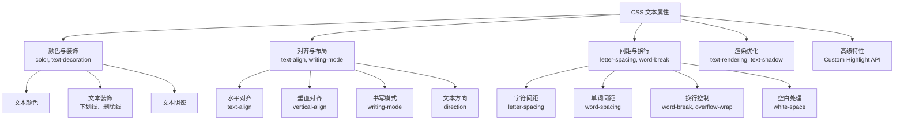
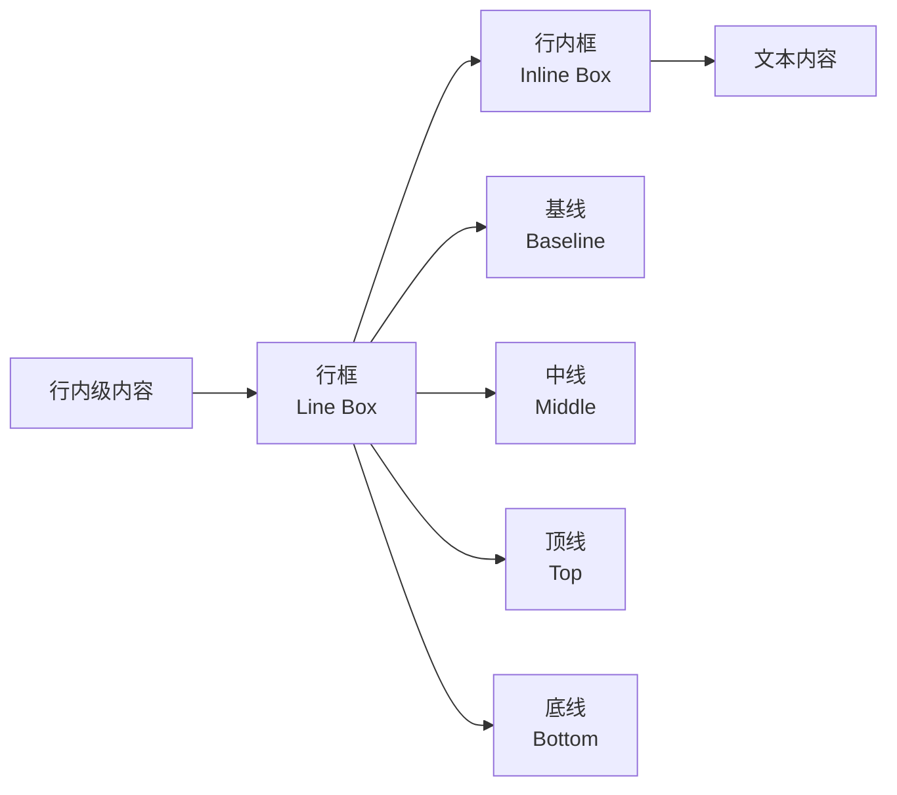
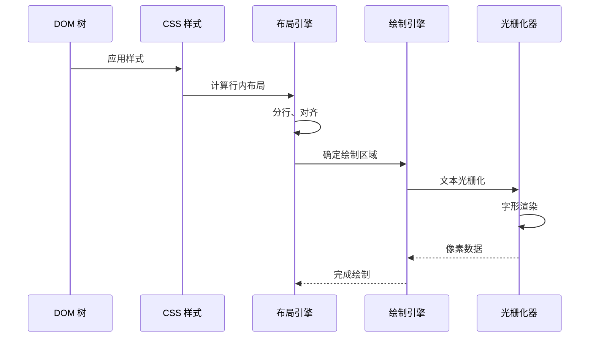
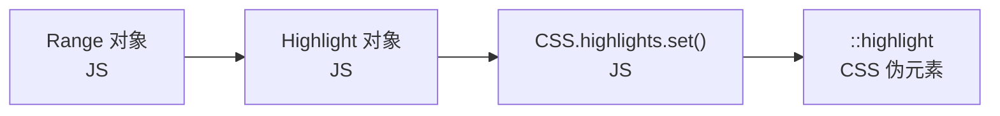

# CSS 文本属性

## 背景与动机

文本是 Web 内容的核心载体。从标题到段落，从链接到按钮，文本属性直接决定了内容的可读性、美观性和可访问性。掌握文本属性不仅是实现设计稿的基础，更是创建高质量用户体验的关键。

### 为什么文本属性如此重要？

1. **可读性**：合适的行高、字间距、对齐方式直接影响阅读体验
2. **国际化**：支持 RTL（从右到左）语言、CJK（中日韩）排版需求
3. **可访问性**：确保文本对比度、可读性符合无障碍标准
4. **性能优化**：文本渲染是浏览器性能的关键环节
5. **现代特性**：Custom Highlight API、CSS Inline Layout 等新规范带来更强能力

### 核心挑战

- 如何实现精确的文本对齐和换行控制？
- 如何处理多语言混合排版的复杂性？
- 如何优化大量文本的渲染性能？
- 如何实现搜索高亮、文本标注等高级功能？

本文将系统性地解答这些问题，从基础属性到高级特性，全面覆盖 CSS 文本属性的各个方面。

---

## 核心概念

### 文本属性体系概览



### CSS Inline Layout 模型

理解文本属性需要掌握 CSS Inline Layout 模型：



**关键概念：**
- **行框（Line Box）**：包含一行内联内容的矩形区域
- **基线（Baseline）**：文本对齐的基准线
- **行高（Line Height）**：行框的高度，影响垂直间距
- **内联级元素**：不会打断文本流的元素（如 `<span>`、`<a>`）

### 文本渲染流程



---

## 深入原理

### 文本渲染引擎原理

浏览器的文本渲染涉及多个复杂阶段：

#### 1. 文本分行（Line Breaking）

浏览器根据以下规则将文本分割成多行：

- **强制换行**：`\n`、`<br>` 标签
- **机会换行**：空格、连字符等可换行位置
- **禁止换行**：某些字符组合不允许换行（如中文标点）

```css
/* 控制换行行为 */
.text {
  /* ⚠️ word-break: break-word 是已废弃的非标准值,请统一使用 overflow-wrap */
  overflow-wrap: break-word; /* 允许在单词内换行 */
  hyphens: auto; /* 自动连字符 */
}
```

#### 2. 对齐算法（Justification）

`text-align: justify` 的对齐算法：

1. 计算行内所有可调整空间（单词间距、字符间距）
2. 根据 `text-justify` 属性决定调整策略
3. 均匀分配空间使行宽相等

```css
.text {
  text-align: justify;
  text-justify: inter-word; /* 调整单词间距 */
  /* 或 */
  text-justify: inter-character; /* 调整字符间距（CJK） */
}
```

#### 3. 字形定位（Glyph Positioning）

每个字符在行框中的位置由以下因素决定：

- **基线对齐**：`vertical-align: baseline`
- **行高计算**：`line-height` 影响垂直空间
- **字距调整**：`font-kerning` 优化字符间距

### RTL 与双向文本

RTL（Right-to-Left）语言（如阿拉伯语、希伯来语）需要特殊处理：

```css
/* 设置文本方向 */
.rtl-text {
  direction: rtl;
  text-align: right;
}

/* 双向文本隔离 */
.mixed-text {
  unicode-bidi: isolate;
}
```

**Unicode 双向算法：**
- 浏览器自动检测文本方向
- `direction` 属性设置基础方向
- `unicode-bidi` 控制嵌入行为

### CJK 排版特性

中日韩（CJK）文本有独特的排版需求：

```css
/* 中文排版最佳实践 */
.chinese-text {
  /* 字体栈 */
  font-family: "PingFang SC", "Microsoft YaHei", sans-serif;
  
  /* 对齐 */
  text-align: justify;
  text-justify: inter-character; /* 字符间距调整 */
  
  /* 缩进 */
  text-indent: 2em; /* 首行缩进两字符 */
  
  /* 间距 */
  letter-spacing: 0.05em; /* 适当增加间距 */
  
  /* 换行 */
  word-break: break-all; /* 允许在任意位置换行 */
  
  /* 标点 */
  /* ⚠️ hanging-punctuation 目前仅 Safari 支持,需做无该属性的降级预期 */
  hanging-punctuation: first;
}
```

**CJK 特殊规则：**
- 标点符号不能出现在行首/行尾
- 允许在任意字符间换行（除标点）
- 竖排排版（`writing-mode: vertical-rl`）

### Custom Highlight API

Custom Highlight API 是现代浏览器提供的强大文本标注能力，允许通过 JavaScript 在文本范围上应用自定义样式，无需修改 DOM。

#### 核心概念



#### 使用流程

```javascript
// 1. 创建 Range 对象
const range = new Range();
range.setStart(textNode, startOffset);
range.setEnd(textNode, endOffset);

// 2. 创建 Highlight 对象
const highlight = new Highlight(range);

// 3. 注册到 CSS.highlights
CSS.highlights.set("search-result", highlight);
```

```css
/* 4. CSS 中样式化高亮 */
::highlight(search-result) {
  background-color: #ffeb3b;
  color: #000;
}

::highlight(active-result) {
  background-color: #ff9800;
  color: #fff;
}
```

#### 搜索高亮实战

```javascript
function highlightText(searchTerm) {
  // 清除之前的高亮
  CSS.highlights.delete("search");
  
  if (!searchTerm) return;
  
  const ranges = [];
  const treeWalker = document.createTreeWalker(
    document.body,
    NodeFilter.SHOW_TEXT
  );
  
  while (treeWalker.nextNode()) {
    const node = treeWalker.currentNode;
    const text = node.textContent.toLowerCase();
    const term = searchTerm.toLowerCase();
    let index = text.indexOf(term);
    
    while (index !== -1) {
      const range = new Range();
      range.setStart(node, index);
      range.setEnd(node, index + term.length);
      ranges.push(range);
      index = text.indexOf(term, index + 1);
    }
  }
  
  if (ranges.length) {
    const highlight = new Highlight(...ranges);
    CSS.highlights.set("search", highlight);
  }
}
```

```css
::highlight(search) {
  background-color: rgba(255, 235, 59, 0.6);
  border-radius: 2px;
}
```

**与 `<mark>` 的区别：**
- `<mark>` 修改 DOM 结构
- Custom Highlight API 不修改 DOM，适用于频繁增删高亮的场景

---

## 代码示例

### color 文本颜色

```css
/* 多种颜色格式 */
.text {
  /* 关键字 */
  color: red;
  color: transparent;
  color: currentColor; /* 继承当前 color 值 */
  
  /* 十六进制 */
  color: #ff0000;
  color: #f00; /* 简写 */
  color: #ff000080; /* 带透明度 */
  
  /* RGB/RGBA */
  color: rgb(255, 0, 0);
  color: rgba(255, 0, 0, 0.5);
  color: rgb(255 0 0 / 50%); /* 现代语法 */
  
  /* HSL/HSLA */
  color: hsl(0, 100%, 50%);
  color: hsl(0deg 100% 50% / 50%); /* 现代语法 */
  
  /* 现代颜色空间 */
  color: lch(50% 100 30); /* LCH */
  color: lab(50% 40 30); /* Lab */
  color: color(display-p3 1 0 0); /* Display P3 */
}

/* currentColor 应用 */
.button {
  color: #007bff;
  border: 1px solid currentColor; /* 边框颜色跟随文字 */
}

.button svg {
  fill: currentColor; /* SVG 图标继承文字颜色 */
}
```


#### color 交互演示（MDN）

设置文字颜色，是使用最频繁的颜色属性。

```html
<!DOCTYPE html>
<html lang="zh-CN">
  <head>
    <meta charset="UTF-8" />
    <meta name="viewport" content="width=device-width, initial-scale=1.0" />
    <title>color 属性演示 - MDN 示例</title>
    <meta name="description" content="视觉与颜色示例：color 属性演示。" />
    <style>
      * {
        margin: 0;
        padding: 0;
        box-sizing: border-box;
      }
      body {
        font-family: -apple-system, BlinkMacSystemFont, "Segoe UI", Roboto, "Helvetica Neue", Arial, sans-serif;
        min-height: 100vh;
        padding: 0;
      }
      .demo-layout {
        display: flex;
        height: 100vh;
        gap: 0;
      }
      .snippet-panel {
        width: 320px;
        flex-shrink: 0;
        padding: 16px;
        display: flex;
        flex-direction: column;
        gap: 8px;
        overflow-y: auto;
        border-right: 1px solid #ddd;
        background: #fafafa;
      }
      .snippet-btn {
        padding: 10px 14px;
        border: 1px solid #ccc;
        border-radius: 6px;
        background: #fff;
        font-family: "JetBrains Mono", "Fira Code", monospace;
        font-size: 13px;
        color: #333;
        cursor: pointer;
        text-align: left;
        transition: all 0.2s;
        line-height: 1.4;
      }
      .snippet-btn:hover {
        border-color: #8083ff;
        background: #f0f0ff;
      }
      .snippet-btn.active {
        border-color: #8083ff;
        background: #e8e8ff;
        color: #571bc1;
        font-weight: 600;
      }
      .preview-panel {
        flex: 1;
        padding: 16px;
        display: flex;
        align-items: center;
        justify-content: center;
        background: #fff;
        overflow: auto;
      }
      .preview-panel > section,
      .preview-panel > div:not(.snippet-panel):not(.demo-layout) {
        flex: 1;
        width: 100%;
        min-height: 0;
        height: 100%;
        display: flex;
        align-items: center;
        justify-content: center;
      }
      #example-element {
        font-size: 1.5em;
      }

      .example-container {
        background-color: white;
        padding: 10px;
      }
    </style>
  </head>
  <body>
    <div class="demo-layout">
      <div class="snippet-panel">
        <button class="snippet-btn active" data-index="0">color: rebeccapurple;</button>
        <button class="snippet-btn" data-index="1">color: #00a400;</button>
        <button class="snippet-btn" data-index="2">color: rgb(214, 122, 127);</button>
        <button class="snippet-btn" data-index="3">color: hsl(30deg 82% 43%);</button>
        <button class="snippet-btn" data-index="4">color: hsla(237deg 74% 33% / 61%);</button>
        <button class="snippet-btn" data-index="5">color: hwb(152deg 0% 58% / 70%);</button>
      </div>
      <div class="preview-panel">
        <section id="default-example">
          <div class="example-container">
            <p id="example-element">
              London. Michaelmas term lately over, and the Lord Chancellor sitting in Lincoln's Inn Hall. Implacable
              November weather.
            </p>
          </div>
        </section>
      </div>
    </div>
    <script>
      const snippets = [
        `#example-element {
  color: rebeccapurple;
}`,
        `#example-element {
  color: #00a400;
}`,
        `#example-element {
  color: rgb(214, 122, 127);
}`,
        `#example-element {
  color: hsl(30deg 82% 43%);
}`,
        `#example-element {
  color: hsla(237deg 74% 33% / 61%);
}`,
        `#example-element {
  color: hwb(152deg 0% 58% / 70%);
}`,
      ];

      let styleEl = document.createElement("style");
      document.head.appendChild(styleEl);

      function applySnippet(index) {
        styleEl.textContent = snippets[index];
        document.querySelectorAll(".snippet-btn").forEach((btn, i) => {
          btn.classList.toggle("active", i === index);
        });
      }

      document.querySelectorAll(".snippet-btn").forEach((btn) => {
        btn.addEventListener("click", () => applySnippet(parseInt(btn.dataset.index)));
      });

      applySnippet(0);
    </script>
  </body>
</html>

```
### text-align 文本对齐

```css
/* 基础对齐 */
.left { text-align: left; }
.center { text-align: center; }
.right { text-align: right; }
.justify { text-align: justify; }

/* 逻辑属性（推荐用于国际化） */
.start { text-align: start; } /* LTR: left, RTL: right */
.end { text-align: end; } /* LTR: right, RTL: left */

/* 两端对齐 + 最后一行 */
.newspaper {
  text-align: justify;
  text-align-last: center; /* 最后一行居中 */
}
```


#### text-align 交互演示（MDN）

设置文本在块容器中的水平对齐方式（left/right/center/justify）。

```html
<!DOCTYPE html>
<html lang="zh-CN">
  <head>
    <meta charset="UTF-8" />
    <meta name="viewport" content="width=device-width, initial-scale=1.0" />
    <title>text-align 属性演示 - MDN 示例</title>
    <meta name="description" content="文本与字体示例：text（align 属性演示）。" />
    <style>
      * {
        margin: 0;
        padding: 0;
        box-sizing: border-box;
      }
      body {
        font-family: -apple-system, BlinkMacSystemFont, "Segoe UI", Roboto, "Helvetica Neue", Arial, sans-serif;
        min-height: 100vh;
        padding: 0;
      }
      .demo-layout {
        display: flex;
        height: 100vh;
        gap: 0;
      }
      .snippet-panel {
        width: 320px;
        flex-shrink: 0;
        padding: 16px;
        display: flex;
        flex-direction: column;
        gap: 8px;
        overflow-y: auto;
        border-right: 1px solid #ddd;
        background: #fafafa;
      }
      .snippet-btn {
        padding: 10px 14px;
        border: 1px solid #ccc;
        border-radius: 6px;
        background: #fff;
        font-family: "JetBrains Mono", "Fira Code", monospace;
        font-size: 13px;
        color: #333;
        cursor: pointer;
        text-align: left;
        transition: all 0.2s;
        line-height: 1.4;
      }
      .snippet-btn:hover {
        border-color: #8083ff;
        background: #f0f0ff;
      }
      .snippet-btn.active {
        border-color: #8083ff;
        background: #e8e8ff;
        color: #571bc1;
        font-weight: 600;
      }
      .preview-panel {
        flex: 1;
        padding: 16px;
        display: flex;
        align-items: center;
        justify-content: center;
        background: #fff;
        overflow: auto;
      }
      .preview-panel > section,
      .preview-panel > div:not(.snippet-panel):not(.demo-layout) {
        flex: 1;
        width: 100%;
        min-height: 0;
        height: 100%;
        display: flex;
        align-items: center;
        justify-content: center;
      }
      #default-example > div {
        width: 250px;
      }
    </style>
  </head>
  <body>
    <div class="demo-layout">
      <div class="snippet-panel">
        <button class="snippet-btn active" data-index="0">text-align: start;</button>
        <button class="snippet-btn" data-index="1">text-align: end;</button>
        <button class="snippet-btn" data-index="2">text-align: center;</button>
        <button class="snippet-btn" data-index="3">text-align: justify;</button>
      </div>
      <div class="preview-panel">
        <section id="default-example">
          <div id="example-element">
            <p>
              Lorem ipsum dolor sit amet, consectetur adipisicing elit, sed do eiusmod tempor incididunt ut labore et
              dolore magna aliqua. Ut enim ad minim veniam, quis nostrud exercitation ullamco laboris nisi ut aliquip ex
              ea commodo consequat. Duis aute irure dolor in reprehenderit in voluptate velit esse cillum dolore eu
              fugiat nulla pariatur. Excepteur sint occaecat cupidatat non proident, sunt in culpa qui officia deserunt
              mollit anim id est laborum.
            </p>
          </div>
        </section>
      </div>
    </div>
    <script>
      const snippets = [
        `#example-element {
  text-align: start;
}`,
        `#example-element {
  text-align: end;
}`,
        `#example-element {
  text-align: center;
}`,
        `#example-element {
  text-align: justify;
}`,
      ];

      let styleEl = document.createElement("style");
      document.head.appendChild(styleEl);

      function applySnippet(index) {
        styleEl.textContent = snippets[index];
        document.querySelectorAll(".snippet-btn").forEach((btn, i) => {
          btn.classList.toggle("active", i === index);
        });
      }

      document.querySelectorAll(".snippet-btn").forEach((btn) => {
        btn.addEventListener("click", () => applySnippet(parseInt(btn.dataset.index)));
      });

      applySnippet(0);
    </script>
  </body>
</html>

```
### text-decoration 文本装饰

```css
/* 基础装饰 */
.underline { text-decoration: underline; }
.overline { text-decoration: overline; }
.line-through { text-decoration: line-through; }
.none { text-decoration: none; }

/* 自定义装饰 */
.custom-underline {
  text-decoration: underline wavy red;
  text-underline-offset: 4px; /* 下划线偏移 */
  text-decoration-thickness: 2px; /* 下划线粗细 */
}

/* 多重装饰 */
.multiple {
  text-decoration-line: underline overline;
  text-decoration-style: wavy;
  text-decoration-color: blue;
}
```


#### text-decoration 交互演示（MDN）

设置文本装饰线：下划线、上划线、删除线及其样式。

```html
<!DOCTYPE html>
<html lang="zh-CN">
  <head>
    <meta charset="UTF-8" />
    <meta name="viewport" content="width=device-width, initial-scale=1.0" />
    <title>text-decoration 属性演示 - MDN 示例</title>
    <meta name="description" content="文本与字体示例：text（decoration 属性演示）。" />
    <style>
      * {
        margin: 0;
        padding: 0;
        box-sizing: border-box;
      }
      body {
        font-family: -apple-system, BlinkMacSystemFont, "Segoe UI", Roboto, "Helvetica Neue", Arial, sans-serif;
        min-height: 100vh;
        padding: 0;
      }
      .demo-layout {
        display: flex;
        height: 100vh;
        gap: 0;
      }
      .snippet-panel {
        width: 320px;
        flex-shrink: 0;
        padding: 16px;
        display: flex;
        flex-direction: column;
        gap: 8px;
        overflow-y: auto;
        border-right: 1px solid #ddd;
        background: #fafafa;
      }
      .snippet-btn {
        padding: 10px 14px;
        border: 1px solid #ccc;
        border-radius: 6px;
        background: #fff;
        font-family: "JetBrains Mono", "Fira Code", monospace;
        font-size: 13px;
        color: #333;
        cursor: pointer;
        text-align: left;
        transition: all 0.2s;
        line-height: 1.4;
      }
      .snippet-btn:hover {
        border-color: #8083ff;
        background: #f0f0ff;
      }
      .snippet-btn.active {
        border-color: #8083ff;
        background: #e8e8ff;
        color: #571bc1;
        font-weight: 600;
      }
      .preview-panel {
        flex: 1;
        padding: 16px;
        display: flex;
        align-items: center;
        justify-content: center;
        background: #fff;
        overflow: auto;
      }
      .preview-panel > section,
      .preview-panel > div:not(.snippet-panel):not(.demo-layout) {
        flex: 1;
        width: 100%;
        min-height: 0;
        height: 100%;
        display: flex;
        align-items: center;
        justify-content: center;
      }
      p {
        font: 1.5em sans-serif;
      }
    </style>
  </head>
  <body>
    <div class="demo-layout">
      <div class="snippet-panel">
        <button class="snippet-btn active" data-index="0">text-decoration: underline;</button>
        <button class="snippet-btn" data-index="1">text-decoration: underline dotted;</button>
        <button class="snippet-btn" data-index="2">text-decoration: underline dotted red;</button>
        <button class="snippet-btn" data-index="3">text-decoration: green wavy underline;</button>
        <button class="snippet-btn" data-index="4">text-decoration: underline overline #ff3028;</button>
      </div>
      <div class="preview-panel">
        <section id="default-example">
          <p>
            I'd far rather be
            <span class="transition-all" id="example-element">happy than right</span>
            any day.
          </p>
        </section>
      </div>
    </div>
    <script>
      const snippets = [
        `#example-element {
  text-decoration: underline;
}`,
        `#example-element {
  text-decoration: underline dotted;
}`,
        `#example-element {
  text-decoration: underline dotted red;
}`,
        `#example-element {
  text-decoration: green wavy underline;
}`,
        `#example-element {
  text-decoration: underline overline #ff3028;
}`,
      ];

      let styleEl = document.createElement("style");
      document.head.appendChild(styleEl);

      function applySnippet(index) {
        styleEl.textContent = snippets[index];
        document.querySelectorAll(".snippet-btn").forEach((btn, i) => {
          btn.classList.toggle("active", i === index);
        });
      }

      document.querySelectorAll(".snippet-btn").forEach((btn) => {
        btn.addEventListener("click", () => applySnippet(parseInt(btn.dataset.index)));
      });

      applySnippet(0);
    </script>
  </body>
</html>

```

#### text-decoration-color 交互演示（MDN）

指定文本装饰线的颜色。

```html
<!DOCTYPE html>
<html lang="zh-CN">
  <head>
    <meta charset="UTF-8" />
    <meta name="viewport" content="width=device-width, initial-scale=1.0" />
    <title>text-decoration-color 属性演示 - MDN 示例</title>
    <meta name="description" content="文本与字体示例：text（decoration-color 属性演示）。" />
    <style>
      * {
        margin: 0;
        padding: 0;
        box-sizing: border-box;
      }
      body {
        font-family: -apple-system, BlinkMacSystemFont, "Segoe UI", Roboto, "Helvetica Neue", Arial, sans-serif;
        min-height: 100vh;
        padding: 0;
      }
      .demo-layout {
        display: flex;
        height: 100vh;
        gap: 0;
      }
      .snippet-panel {
        width: 320px;
        flex-shrink: 0;
        padding: 16px;
        display: flex;
        flex-direction: column;
        gap: 8px;
        overflow-y: auto;
        border-right: 1px solid #ddd;
        background: #fafafa;
      }
      .snippet-btn {
        padding: 10px 14px;
        border: 1px solid #ccc;
        border-radius: 6px;
        background: #fff;
        font-family: "JetBrains Mono", "Fira Code", monospace;
        font-size: 13px;
        color: #333;
        cursor: pointer;
        text-align: left;
        transition: all 0.2s;
        line-height: 1.4;
      }
      .snippet-btn:hover {
        border-color: #8083ff;
        background: #f0f0ff;
      }
      .snippet-btn.active {
        border-color: #8083ff;
        background: #e8e8ff;
        color: #571bc1;
        font-weight: 600;
      }
      .preview-panel {
        flex: 1;
        padding: 16px;
        display: flex;
        align-items: center;
        justify-content: center;
        background: #fff;
        overflow: auto;
      }
      .preview-panel > section,
      .preview-panel > div:not(.snippet-panel):not(.demo-layout) {
        flex: 1;
        width: 100%;
        min-height: 0;
        height: 100%;
        display: flex;
        align-items: center;
        justify-content: center;
      }
      p {
        font: 1.5em sans-serif;
      }

      #example-element {
        text-decoration-line: underline;
      }
    </style>
  </head>
  <body>
    <div class="demo-layout">
      <div class="snippet-panel">
        <button class="snippet-btn active" data-index="0">text-decoration-color: red;</button>
        <button class="snippet-btn" data-index="1">text-decoration-color: #21ff21;</button>
        <button class="snippet-btn" data-index="2">text-decoration-color: rgb(255, 90, 255);</button>
        <button class="snippet-btn" data-index="3">text-decoration-color: hsl(70, 100%, 40%);</button>
        <button class="snippet-btn" data-index="4">text-decoration-color: currentColor;</button>
      </div>
      <div class="preview-panel">
        <section id="default-example">
          <p>
            I'd far rather be
            <span class="transition-all" id="example-element">happy than right</span>
            any day.
          </p>
        </section>
      </div>
    </div>
    <script>
      const snippets = [
        `#example-element {
  text-decoration-color: red;
}`,
        `#example-element {
  text-decoration-color: #21ff21;
}`,
        `#example-element {
  text-decoration-color: rgb(255, 90, 255);
}`,
        `#example-element {
  text-decoration-color: hsl(70, 100%, 40%);
}`,
        `#example-element {
  text-decoration-color: currentColor;
}`,
      ];

      let styleEl = document.createElement("style");
      document.head.appendChild(styleEl);

      function applySnippet(index) {
        styleEl.textContent = snippets[index];
        document.querySelectorAll(".snippet-btn").forEach((btn, i) => {
          btn.classList.toggle("active", i === index);
        });
      }

      document.querySelectorAll(".snippet-btn").forEach((btn) => {
        btn.addEventListener("click", () => applySnippet(parseInt(btn.dataset.index)));
      });

      applySnippet(0);
    </script>
  </body>
</html>

```

#### text-decoration-style 交互演示（MDN）

指定文本装饰线的样式（实线、虚线、波浪线等）。

```html
<!DOCTYPE html>
<html lang="zh-CN">
  <head>
    <meta charset="UTF-8" />
    <meta name="viewport" content="width=device-width, initial-scale=1.0" />
    <title>text-decoration-style 属性演示 - MDN 示例</title>
    <meta name="description" content="文本与字体示例：text（decoration-style 属性演示）。" />
    <style>
      * {
        margin: 0;
        padding: 0;
        box-sizing: border-box;
      }
      body {
        font-family: -apple-system, BlinkMacSystemFont, "Segoe UI", Roboto, "Helvetica Neue", Arial, sans-serif;
        min-height: 100vh;
        padding: 0;
      }
      .demo-layout {
        display: flex;
        height: 100vh;
        gap: 0;
      }
      .snippet-panel {
        width: 320px;
        flex-shrink: 0;
        padding: 16px;
        display: flex;
        flex-direction: column;
        gap: 8px;
        overflow-y: auto;
        border-right: 1px solid #ddd;
        background: #fafafa;
      }
      .snippet-btn {
        padding: 10px 14px;
        border: 1px solid #ccc;
        border-radius: 6px;
        background: #fff;
        font-family: "JetBrains Mono", "Fira Code", monospace;
        font-size: 13px;
        color: #333;
        cursor: pointer;
        text-align: left;
        transition: all 0.2s;
        line-height: 1.4;
      }
      .snippet-btn:hover {
        border-color: #8083ff;
        background: #f0f0ff;
      }
      .snippet-btn.active {
        border-color: #8083ff;
        background: #e8e8ff;
        color: #571bc1;
        font-weight: 600;
      }
      .preview-panel {
        flex: 1;
        padding: 16px;
        display: flex;
        align-items: center;
        justify-content: center;
        background: #fff;
        overflow: auto;
      }
      .preview-panel > section,
      .preview-panel > div:not(.snippet-panel):not(.demo-layout) {
        flex: 1;
        width: 100%;
        min-height: 0;
        height: 100%;
        display: flex;
        align-items: center;
        justify-content: center;
      }
      p {
        font: 1.5em sans-serif;
      }

      #example-element {
        text-decoration-line: underline;
      }
    </style>
  </head>
  <body>
    <div class="demo-layout">
      <div class="snippet-panel">
        <button class="snippet-btn active" data-index="0">text-decoration-style: solid;</button>
        <button class="snippet-btn" data-index="1">text-decoration-style: double;</button>
        <button class="snippet-btn" data-index="2">text-decoration-style: dotted;</button>
        <button class="snippet-btn" data-index="3">text-decoration-style: dashed;</button>
        <button class="snippet-btn" data-index="4">text-decoration-style: wavy;</button>
      </div>
      <div class="preview-panel">
        <section id="default-example">
          <p>
            I'd far rather be
            <span class="transition-all" id="example-element">happy than right</span>
            any day.
          </p>
        </section>
      </div>
    </div>
    <script>
      const snippets = [
        `#example-element {
  text-decoration-style: solid;
}`,
        `#example-element {
  text-decoration-style: double;
}`,
        `#example-element {
  text-decoration-style: dotted;
}`,
        `#example-element {
  text-decoration-style: dashed;
}`,
        `#example-element {
  text-decoration-style: wavy;
}`,
      ];

      let styleEl = document.createElement("style");
      document.head.appendChild(styleEl);

      function applySnippet(index) {
        styleEl.textContent = snippets[index];
        document.querySelectorAll(".snippet-btn").forEach((btn, i) => {
          btn.classList.toggle("active", i === index);
        });
      }

      document.querySelectorAll(".snippet-btn").forEach((btn) => {
        btn.addEventListener("click", () => applySnippet(parseInt(btn.dataset.index)));
      });

      applySnippet(0);
    </script>
  </body>
</html>

```

#### text-decoration-thickness 交互演示（MDN）

指定文本装饰线的粗细。

```html
<!DOCTYPE html>
<html lang="zh-CN">
  <head>
    <meta charset="UTF-8" />
    <meta name="viewport" content="width=device-width, initial-scale=1.0" />
    <title>text-decoration-thickness 属性演示 - MDN 示例</title>
    <meta name="description" content="文本与字体示例：text（decoration-thickness 属性演示）。" />
    <style>
      * {
        margin: 0;
        padding: 0;
        box-sizing: border-box;
      }
      body {
        font-family: -apple-system, BlinkMacSystemFont, "Segoe UI", Roboto, "Helvetica Neue", Arial, sans-serif;
        min-height: 100vh;
        padding: 0;
      }
      .demo-layout {
        display: flex;
        height: 100vh;
        gap: 0;
      }
      .snippet-panel {
        width: 320px;
        flex-shrink: 0;
        padding: 16px;
        display: flex;
        flex-direction: column;
        gap: 8px;
        overflow-y: auto;
        border-right: 1px solid #ddd;
        background: #fafafa;
      }
      .snippet-btn {
        padding: 10px 14px;
        border: 1px solid #ccc;
        border-radius: 6px;
        background: #fff;
        font-family: "JetBrains Mono", "Fira Code", monospace;
        font-size: 13px;
        color: #333;
        cursor: pointer;
        text-align: left;
        transition: all 0.2s;
        line-height: 1.4;
      }
      .snippet-btn:hover {
        border-color: #8083ff;
        background: #f0f0ff;
      }
      .snippet-btn.active {
        border-color: #8083ff;
        background: #e8e8ff;
        color: #571bc1;
        font-weight: 600;
      }
      .preview-panel {
        flex: 1;
        padding: 16px;
        display: flex;
        align-items: center;
        justify-content: center;
        background: #fff;
        overflow: auto;
      }
      .preview-panel > section,
      .preview-panel > div:not(.snippet-panel):not(.demo-layout) {
        flex: 1;
        width: 100%;
        min-height: 0;
        height: 100%;
        display: flex;
        align-items: center;
        justify-content: center;
      }
      p {
        font: 1.5em sans-serif;
        text-decoration-color: red;
      }
    </style>
  </head>
  <body>
    <div class="demo-layout">
      <div class="snippet-panel">
        <button class="snippet-btn active" data-index="0">text-decoration-line: underline;</button>
        <button class="snippet-btn" data-index="1">text-decoration-line: line-through;</button>
        <button class="snippet-btn" data-index="2">text-decoration-line: underline overline;</button>
      </div>
      <div class="preview-panel">
        <section id="default-example">
          <p id="example-element">困惑轻吻我的脸颊，留下苦涩中带着甜蜜的滋味</p>
        </section>
      </div>
    </div>
    <script>
      const snippets = [
        `#example-element {
  text-decoration-line: underline;
text-decoration-thickness: 3px;
}`,
        `#example-element {
  text-decoration-line: line-through;
text-decoration-thickness: 0.4rem;
}`,
        `#example-element {
  text-decoration-line: underline overline;
text-decoration-thickness: from-font;
font-size: 2rem;
}`,
      ];

      let styleEl = document.createElement("style");
      document.head.appendChild(styleEl);

      function applySnippet(index) {
        styleEl.textContent = snippets[index];
        document.querySelectorAll(".snippet-btn").forEach((btn, i) => {
          btn.classList.toggle("active", i === index);
        });
      }

      document.querySelectorAll(".snippet-btn").forEach((btn) => {
        btn.addEventListener("click", () => applySnippet(parseInt(btn.dataset.index)));
      });

      applySnippet(0);
    </script>
  </body>
</html>

```

#### text-underline-offset 交互演示（MDN）

设置下划线与文本基线之间的偏移距离。

```html
<!DOCTYPE html>
<html lang="zh-CN">
  <head>
    <meta charset="UTF-8" />
    <meta name="viewport" content="width=device-width, initial-scale=1.0" />
    <title>text-underline-offset 属性演示 - MDN 示例</title>
    <meta name="description" content="文本与字体示例：text（underline-offset 属性演示）。" />
    <style>
      * {
        margin: 0;
        padding: 0;
        box-sizing: border-box;
      }
      body {
        font-family: -apple-system, BlinkMacSystemFont, "Segoe UI", Roboto, "Helvetica Neue", Arial, sans-serif;
        min-height: 100vh;
        padding: 0;
      }
      .demo-layout {
        display: flex;
        height: 100vh;
        gap: 0;
      }
      .snippet-panel {
        width: 320px;
        flex-shrink: 0;
        padding: 16px;
        display: flex;
        flex-direction: column;
        gap: 8px;
        overflow-y: auto;
        border-right: 1px solid #ddd;
        background: #fafafa;
      }
      .snippet-btn {
        padding: 10px 14px;
        border: 1px solid #ccc;
        border-radius: 6px;
        background: #fff;
        font-family: "JetBrains Mono", "Fira Code", monospace;
        font-size: 13px;
        color: #333;
        cursor: pointer;
        text-align: left;
        transition: all 0.2s;
        line-height: 1.4;
      }
      .snippet-btn:hover {
        border-color: #8083ff;
        background: #f0f0ff;
      }
      .snippet-btn.active {
        border-color: #8083ff;
        background: #e8e8ff;
        color: #571bc1;
        font-weight: 600;
      }
      .preview-panel {
        flex: 1;
        padding: 16px;
        display: flex;
        align-items: center;
        justify-content: center;
        background: #fff;
        overflow: auto;
      }
      .preview-panel > section,
      .preview-panel > div:not(.snippet-panel):not(.demo-layout) {
        flex: 1;
        width: 100%;
        min-height: 0;
        height: 100%;
        display: flex;
        align-items: center;
        justify-content: center;
      }
      p {
        font: 1.5em sans-serif;
        text-decoration-line: underline;
        text-decoration-color: #ff0000;
      }
    </style>
  </head>
  <body>
    <div class="demo-layout">
      <div class="snippet-panel">
        <button class="snippet-btn active" data-index="0">text-underline-offset: auto;</button>
        <button class="snippet-btn" data-index="1">text-underline-offset: 8px;</button>
        <button class="snippet-btn" data-index="2">text-underline-offset: -0.5rem;</button>
      </div>
      <div class="preview-panel">
        <section id="default-example">
          <p id="example-element">And after all we are only ordinary</p>
        </section>
      </div>
    </div>
    <script>
      const snippets = [
        `#example-element {
  text-underline-offset: auto;
}`,
        `#example-element {
  text-underline-offset: 8px;
}`,
        `#example-element {
  text-underline-offset: -0.5rem;
}`,
      ];

      let styleEl = document.createElement("style");
      document.head.appendChild(styleEl);

      function applySnippet(index) {
        styleEl.textContent = snippets[index];
        document.querySelectorAll(".snippet-btn").forEach((btn, i) => {
          btn.classList.toggle("active", i === index);
        });
      }

      document.querySelectorAll(".snippet-btn").forEach((btn) => {
        btn.addEventListener("click", () => applySnippet(parseInt(btn.dataset.index)));
      });

      applySnippet(0);
    </script>
  </body>
</html>

```
### text-shadow 文本阴影

```css
/* 基础阴影 */
.shadow {
  text-shadow: 2px 2px 4px rgba(0, 0, 0, 0.3);
}

/* 多层阴影 */
.multi-shadow {
  text-shadow: 
    1px 1px 2px black,
    0 0 1em blue,
    0 0 0.2em blue;
}

/* 霓虹灯效果 */
.neon {
  text-shadow: 
    0 0 5px #fff,
    0 0 10px #fff,
    0 0 20px #ff00de,
    0 0 30px #ff00de;
}

/* 3D 文字 */
.text-3d {
  text-shadow: 
    1px 1px 0 #333,
    2px 2px 0 #333,
    3px 3px 0 #333,
    4px 4px 0 #333;
}
```

### text-overflow 文本溢出

```css
/* 单行省略 */
.ellipsis {
  white-space: nowrap;
  overflow: hidden;
  text-overflow: ellipsis;
  max-width: 200px;
}

/* 多行省略（WebKit） */
.line-clamp {
  display: -webkit-box;
  -webkit-box-orient: vertical;
  -webkit-line-clamp: 3; /* 显示 3 行 */
  overflow: hidden;
  text-overflow: ellipsis;
}
```


#### text-overflow 交互演示（MDN）

文本溢出容器时的显示方式（省略号 ellipsis 等）。

```html
<!DOCTYPE html>
<html lang="zh-CN">
  <head>
    <meta charset="UTF-8" />
    <meta name="viewport" content="width=device-width, initial-scale=1.0" />
    <title>text-overflow 属性演示 - MDN 示例</title>
    <meta name="description" content="文本与字体示例：text（overflow 属性演示）。" />
    <style>
      * {
        margin: 0;
        padding: 0;
        box-sizing: border-box;
      }
      body {
        font-family: -apple-system, BlinkMacSystemFont, "Segoe UI", Roboto, "Helvetica Neue", Arial, sans-serif;
        min-height: 100vh;
        padding: 0;
      }
      .demo-layout {
        display: flex;
        height: 100vh;
        gap: 0;
      }
      .snippet-panel {
        width: 320px;
        flex-shrink: 0;
        padding: 16px;
        display: flex;
        flex-direction: column;
        gap: 8px;
        overflow-y: auto;
        border-right: 1px solid #ddd;
        background: #fafafa;
      }
      .snippet-btn {
        padding: 10px 14px;
        border: 1px solid #ccc;
        border-radius: 6px;
        background: #fff;
        font-family: "JetBrains Mono", "Fira Code", monospace;
        font-size: 13px;
        color: #333;
        cursor: pointer;
        text-align: left;
        transition: all 0.2s;
        line-height: 1.4;
      }
      .snippet-btn:hover {
        border-color: #8083ff;
        background: #f0f0ff;
      }
      .snippet-btn.active {
        border-color: #8083ff;
        background: #e8e8ff;
        color: #571bc1;
        font-weight: 600;
      }
      .preview-panel {
        flex: 1;
        padding: 16px;
        display: flex;
        align-items: center;
        justify-content: center;
        background: #fff;
        overflow: auto;
      }
      .preview-panel > section,
      .preview-panel > div:not(.snippet-panel):not(.demo-layout) {
        flex: 1;
        width: 100%;
        min-height: 0;
        height: 100%;
        display: flex;
        align-items: center;
        justify-content: center;
      }
      #example-element-container {
        width: 100%;
        max-width: 18em;
      }

      #example-element {
        line-height: 50px;
        border: 1px solid #c5c5c5;
        overflow: hidden;
        white-space: nowrap;
        font-family: sans-serif;
        padding: 0 0.5em;
        text-align: left;
      }
    </style>
  </head>
  <body>
    <div class="demo-layout">
      <div class="snippet-panel">
        <button class="snippet-btn active" data-index="0">text-overflow: clip;</button>
        <button class="snippet-btn" data-index="1">text-overflow: ellipsis;</button>
        <button class="snippet-btn" data-index="2">text-overflow: &quot;-&quot;;</button>
        <button class="snippet-btn" data-index="3">text-overflow: &quot;&quot;;</button>
      </div>
      <div class="preview-panel">
        <section id="default-example">
          <div id="example-element-container">
            <p id="example-element">"Is there any tea on this spaceship?" he asked.</p>
          </div>
        </section>
      </div>
    </div>
    <script>
      const snippets = [
        `#example-element {
  text-overflow: clip;
}`,
        `#example-element {
  text-overflow: ellipsis;
}`,
        `#example-element {
  text-overflow: "-";
}`,
        `#example-element {
  text-overflow: "";
}`,
      ];

      let styleEl = document.createElement("style");
      document.head.appendChild(styleEl);

      function applySnippet(index) {
        styleEl.textContent = snippets[index];
        document.querySelectorAll(".snippet-btn").forEach((btn, i) => {
          btn.classList.toggle("active", i === index);
        });
      }

      document.querySelectorAll(".snippet-btn").forEach((btn) => {
        btn.addEventListener("click", () => applySnippet(parseInt(btn.dataset.index)));
      });

      applySnippet(0);
    </script>
  </body>
</html>

```
### writing-mode 书写模式

```css
/* 水平排版（默认） */
.horizontal {
  writing-mode: horizontal-tb;
}

/* 垂直排版（从右到左） */
.vertical-rl {
  writing-mode: vertical-rl;
  text-orientation: upright; /* 字符直立 */
}

/* 垂直排版（从左到右） */
.vertical-lr {
  writing-mode: vertical-lr;
}

/* 中文竖排 */
.chinese-vertical {
  writing-mode: vertical-rl;
  text-orientation: mixed; /* 字符根据方向旋转 */
}
```


#### writing-mode 交互演示（MDN）

设置文本的书写方向：水平（lr-tb）或垂直（rl-tb/lr-tb）。

```html
<!DOCTYPE html>
<html lang="zh-CN">
  <head>
    <meta charset="UTF-8" />
    <meta name="viewport" content="width=device-width, initial-scale=1.0" />
    <title>writing-mode 属性演示 - MDN 示例</title>
    <meta name="description" content="演示writing（mode 属性演示）效果。" />
    <style>
      * {
        margin: 0;
        padding: 0;
        box-sizing: border-box;
      }
      body {
        font-family: -apple-system, BlinkMacSystemFont, "Segoe UI", Roboto, "Helvetica Neue", Arial, sans-serif;
        min-height: 100vh;
        padding: 0;
      }
      .demo-layout {
        display: flex;
        height: 100vh;
        gap: 0;
      }
      .snippet-panel {
        width: 320px;
        flex-shrink: 0;
        padding: 16px;
        display: flex;
        flex-direction: column;
        gap: 8px;
        overflow-y: auto;
        border-right: 1px solid #ddd;
        background: #fafafa;
      }
      .snippet-btn {
        padding: 10px 14px;
        border: 1px solid #ccc;
        border-radius: 6px;
        background: #fff;
        font-family: "JetBrains Mono", "Fira Code", monospace;
        font-size: 13px;
        color: #333;
        cursor: pointer;
        text-align: left;
        transition: all 0.2s;
        line-height: 1.4;
      }
      .snippet-btn:hover {
        border-color: #8083ff;
        background: #f0f0ff;
      }
      .snippet-btn.active {
        border-color: #8083ff;
        background: #e8e8ff;
        color: #571bc1;
        font-weight: 600;
      }
      .preview-panel {
        flex: 1;
        padding: 16px;
        display: flex;
        align-items: center;
        justify-content: center;
        background: #fff;
        overflow: auto;
      }
      .preview-panel > section,
      .preview-panel > div:not(.snippet-panel):not(.demo-layout) {
        flex: 1;
        width: 100%;
        min-height: 0;
        height: 100%;
        display: flex;
        align-items: center;
        justify-content: center;
      }
      #example-element {
        border: 1px solid #c5c5c5;
        padding: 0.75em;
        width: 80%;
        max-height: 300px;
        display: flex;
      }

      #example-element > div {
        background-color: rgba(0, 0, 255, 0.2);
        border: 3px solid blue;
        margin: 10px;
        flex: 1;
      }
    </style>
  </head>
  <body>
    <div class="demo-layout">
      <div class="snippet-panel">
        <button class="snippet-btn active" data-index="0">writing-mode: horizontal-tb;</button>
        <button class="snippet-btn" data-index="1">writing-mode: vertical-lr;</button>
        <button class="snippet-btn" data-index="2">writing-mode: vertical-rl;</button>
        <button class="snippet-btn" data-index="3">writing-mode: sideways-rl;</button>
        <button class="snippet-btn" data-index="4">writing-mode: sideways-lr;</button>
      </div>
      <div class="preview-panel">
        <section class="default-example" id="default-example">
          <div class="transition-all" id="example-element">
            <div>1</div>
            <div>2</div>
            <div>3</div>
            <div>4</div>
          </div>
        </section>
      </div>
    </div>
    <script>
      const snippets = [
        `#example-element {
  writing-mode: horizontal-tb;
}`,
        `#example-element {
  writing-mode: vertical-lr;
}`,
        `#example-element {
  writing-mode: vertical-rl;
}`,
        `#example-element {
  writing-mode: sideways-rl;
}`,
        `#example-element {
  writing-mode: sideways-lr;
}`,
      ];

      let styleEl = document.createElement("style");
      document.head.appendChild(styleEl);

      function applySnippet(index) {
        styleEl.textContent = snippets[index];
        document.querySelectorAll(".snippet-btn").forEach((btn, i) => {
          btn.classList.toggle("active", i === index);
        });
      }

      document.querySelectorAll(".snippet-btn").forEach((btn) => {
        btn.addEventListener("click", () => applySnippet(parseInt(btn.dataset.index)));
      });

      applySnippet(0);
    </script>
  </body>
</html>

```
### letter-spacing 与 word-spacing

```css
/* 字符间距 */
.tight { letter-spacing: -0.02em; }
.normal { letter-spacing: normal; }
.loose { letter-spacing: 0.1em; }
.artistic { letter-spacing: 0.5em; }

/* 单词间距 */
.compact { word-spacing: -0.05em; }
.readable { word-spacing: 0.2em; }
```


#### letter-spacing 交互演示（MDN）

设置字符之间的间距。

```html
<!DOCTYPE html>
<html lang="zh-CN">
  <head>
    <meta charset="UTF-8" />
    <meta name="viewport" content="width=device-width, initial-scale=1.0" />
    <title>letter-spacing 属性演示 - MDN 示例</title>
    <meta name="description" content="文本与字体示例：letter（spacing 属性演示）。" />
    <style>
      * {
        margin: 0;
        padding: 0;
        box-sizing: border-box;
      }
      body {
        font-family: -apple-system, BlinkMacSystemFont, "Segoe UI", Roboto, "Helvetica Neue", Arial, sans-serif;
        min-height: 100vh;
        padding: 0;
      }
      .demo-layout {
        display: flex;
        height: 100vh;
        gap: 0;
      }
      .snippet-panel {
        width: 320px;
        flex-shrink: 0;
        padding: 16px;
        display: flex;
        flex-direction: column;
        gap: 8px;
        overflow-y: auto;
        border-right: 1px solid #ddd;
        background: #fafafa;
      }
      .snippet-btn {
        padding: 10px 14px;
        border: 1px solid #ccc;
        border-radius: 6px;
        background: #fff;
        font-family: "JetBrains Mono", "Fira Code", monospace;
        font-size: 13px;
        color: #333;
        cursor: pointer;
        text-align: left;
        transition: all 0.2s;
        line-height: 1.4;
      }
      .snippet-btn:hover {
        border-color: #8083ff;
        background: #f0f0ff;
      }
      .snippet-btn.active {
        border-color: #8083ff;
        background: #e8e8ff;
        color: #571bc1;
        font-weight: 600;
      }
      .preview-panel {
        flex: 1;
        padding: 16px;
        display: flex;
        align-items: center;
        justify-content: center;
        background: #fff;
        overflow: auto;
      }
      .preview-panel > section,
      .preview-panel > div:not(.snippet-panel):not(.demo-layout) {
        flex: 1;
        width: 100%;
        min-height: 0;
        height: 100%;
        display: flex;
        align-items: center;
        justify-content: center;
      }
    </style>
  </head>
  <body>
    <div class="demo-layout">
      <div class="snippet-panel">
        <button class="snippet-btn active" data-index="0">letter-spacing: normal;</button>
        <button class="snippet-btn" data-index="1">letter-spacing: 0.2rem;</button>
        <button class="snippet-btn" data-index="2">letter-spacing: 1px;</button>
        <button class="snippet-btn" data-index="3">letter-spacing: -1px;</button>
      </div>
      <div class="preview-panel">
        <section id="default-example">
          <p id="example-element">
            As much mud in the streets as if the waters had but newly retired from the face of the earth, and it would
            not be wonderful to meet a Megalosaurus, forty feet long or so, waddling like an elephantine lizard up
            Holborn Hill.
          </p>
        </section>
      </div>
    </div>
    <script>
      const snippets = [
        `#example-element {
  letter-spacing: normal;
}`,
        `#example-element {
  letter-spacing: 0.2rem;
}`,
        `#example-element {
  letter-spacing: 1px;
}`,
        `#example-element {
  letter-spacing: -1px;
}`,
      ];

      let styleEl = document.createElement("style");
      document.head.appendChild(styleEl);

      function applySnippet(index) {
        styleEl.textContent = snippets[index];
        document.querySelectorAll(".snippet-btn").forEach((btn, i) => {
          btn.classList.toggle("active", i === index);
        });
      }

      document.querySelectorAll(".snippet-btn").forEach((btn) => {
        btn.addEventListener("click", () => applySnippet(parseInt(btn.dataset.index)));
      });

      applySnippet(0);
    </script>
  </body>
</html>

```

#### word-spacing 交互演示（MDN）

设置单词之间的间距。

```html
<!DOCTYPE html>
<html lang="zh-CN">
  <head>
    <meta charset="UTF-8" />
    <meta name="viewport" content="width=device-width, initial-scale=1.0" />
    <title>word-spacing 属性演示 - MDN 示例</title>
    <meta name="description" content="文本与字体示例：word（spacing 属性演示）。" />
    <style>
      * {
        margin: 0;
        padding: 0;
        box-sizing: border-box;
      }
      body {
        font-family: -apple-system, BlinkMacSystemFont, "Segoe UI", Roboto, "Helvetica Neue", Arial, sans-serif;
        min-height: 100vh;
        padding: 0;
      }
      .demo-layout {
        display: flex;
        height: 100vh;
        gap: 0;
      }
      .snippet-panel {
        width: 320px;
        flex-shrink: 0;
        padding: 16px;
        display: flex;
        flex-direction: column;
        gap: 8px;
        overflow-y: auto;
        border-right: 1px solid #ddd;
        background: #fafafa;
      }
      .snippet-btn {
        padding: 10px 14px;
        border: 1px solid #ccc;
        border-radius: 6px;
        background: #fff;
        font-family: "JetBrains Mono", "Fira Code", monospace;
        font-size: 13px;
        color: #333;
        cursor: pointer;
        text-align: left;
        transition: all 0.2s;
        line-height: 1.4;
      }
      .snippet-btn:hover {
        border-color: #8083ff;
        background: #f0f0ff;
      }
      .snippet-btn.active {
        border-color: #8083ff;
        background: #e8e8ff;
        color: #571bc1;
        font-weight: 600;
      }
      .preview-panel {
        flex: 1;
        padding: 16px;
        display: flex;
        align-items: center;
        justify-content: center;
        background: #fff;
        overflow: auto;
      }
      .preview-panel > section,
      .preview-panel > div:not(.snippet-panel):not(.demo-layout) {
        flex: 1;
        width: 100%;
        min-height: 0;
        height: 100%;
        display: flex;
        align-items: center;
        justify-content: center;
      }
    </style>
  </head>
  <body>
    <div class="demo-layout">
      <div class="snippet-panel">
        <button class="snippet-btn active" data-index="0">word-spacing: normal;</button>
        <button class="snippet-btn" data-index="1">word-spacing: 1rem;</button>
        <button class="snippet-btn" data-index="2">word-spacing: 4px;</button>
        <button class="snippet-btn" data-index="3">word-spacing: -0.4ch;</button>
      </div>
      <div class="preview-panel">
        <section id="default-example">
          <p id="example-element">
            As much mud in the streets as if the waters had but newly retired from the face of the earth, and it would
            not be wonderful to meet a Megalosaurus, forty feet long or so, waddling like an elephantine lizard up
            Holborn Hill.
          </p>
        </section>
      </div>
    </div>
    <script>
      const snippets = [
        `#example-element {
  word-spacing: normal;
}`,
        `#example-element {
  word-spacing: 1rem;
}`,
        `#example-element {
  word-spacing: 4px;
}`,
        `#example-element {
  word-spacing: -0.4ch;
}`,
      ];

      let styleEl = document.createElement("style");
      document.head.appendChild(styleEl);

      function applySnippet(index) {
        styleEl.textContent = snippets[index];
        document.querySelectorAll(".snippet-btn").forEach((btn, i) => {
          btn.classList.toggle("active", i === index);
        });
      }

      document.querySelectorAll(".snippet-btn").forEach((btn) => {
        btn.addEventListener("click", () => applySnippet(parseInt(btn.dataset.index)));
      });

      applySnippet(0);
    </script>
  </body>
</html>

```
### word-break 与 overflow-wrap

```css
/* 换行控制 */
.break-all {
  word-break: break-all; /* 任意位置换行 */
}

.keep-all {
  word-break: keep-all; /* 仅在单词边界换行 */
}

.overflow-wrap {
  overflow-wrap: break-word; /* 溢出时换行 */
}

/* 长 URL 处理 */
.url-container {
  overflow-wrap: break-word; /* 标准方案;需要更激进可再加 word-break: break-all */
  hyphens: auto;
}
```


#### word-break 交互演示（MDN）

控制长单词/长串字符的换行策略（normal/break-all/keep-all）。

```html
<!DOCTYPE html>
<html lang="zh-CN">
  <head>
    <meta charset="UTF-8" />
    <meta name="viewport" content="width=device-width, initial-scale=1.0" />
    <title>word-break 属性演示 - MDN 示例</title>
    <meta name="description" content="文本与字体示例：word（break 属性演示）。" />
    <style>
      * {
        margin: 0;
        padding: 0;
        box-sizing: border-box;
      }
      body {
        font-family: -apple-system, BlinkMacSystemFont, "Segoe UI", Roboto, "Helvetica Neue", Arial, sans-serif;
        min-height: 100vh;
        padding: 0;
      }
      .demo-layout {
        display: flex;
        height: 100vh;
        gap: 0;
      }
      .snippet-panel {
        width: 320px;
        flex-shrink: 0;
        padding: 16px;
        display: flex;
        flex-direction: column;
        gap: 8px;
        overflow-y: auto;
        border-right: 1px solid #ddd;
        background: #fafafa;
      }
      .snippet-btn {
        padding: 10px 14px;
        border: 1px solid #ccc;
        border-radius: 6px;
        background: #fff;
        font-family: "JetBrains Mono", "Fira Code", monospace;
        font-size: 13px;
        color: #333;
        cursor: pointer;
        text-align: left;
        transition: all 0.2s;
        line-height: 1.4;
      }
      .snippet-btn:hover {
        border-color: #8083ff;
        background: #f0f0ff;
      }
      .snippet-btn.active {
        border-color: #8083ff;
        background: #e8e8ff;
        color: #571bc1;
        font-weight: 600;
      }
      .preview-panel {
        flex: 1;
        padding: 16px;
        display: flex;
        align-items: center;
        justify-content: center;
        background: #fff;
        overflow: auto;
      }
      .preview-panel > section,
      .preview-panel > div:not(.snippet-panel):not(.demo-layout) {
        flex: 1;
        width: 100%;
        min-height: 0;
        height: 100%;
        display: flex;
        align-items: center;
        justify-content: center;
      }
      #example-element {
        width: 80%;
        padding: 20px;
        text-align: start;
        border: solid 1px darkgray;
      }
    </style>
  </head>
  <body>
    <div class="demo-layout">
      <div class="snippet-panel">
        <button class="snippet-btn active" data-index="0">word-break: normal;</button>
        <button class="snippet-btn" data-index="1">word-break: break-all;</button>
        <button class="snippet-btn" data-index="2">word-break: keep-all;</button>
        <button class="snippet-btn" data-index="3">word-break: break-word;</button>
      </div>
      <div class="preview-panel">
        <section class="default-example" id="default-example">
          <div class="transition-all" id="example-element">
            Honorificabilitudinitatibus califragilisticexpialidocious
            Taumatawhakatangihangakoauauotamateaturipukakapikimaungahoronukupokaiwhenuakitanatahu
            グレートブリテンおよび北アイルランド連合王国という言葉は本当に長い言葉
          </div>
        </section>
      </div>
    </div>
    <script>
      const snippets = [
        `#example-element {
  word-break: normal;
}`,
        `#example-element {
  word-break: break-all;
}`,
        `#example-element {
  word-break: keep-all;
}`,
        `#example-element {
  word-break: break-word;
}`,
      ];

      let styleEl = document.createElement("style");
      document.head.appendChild(styleEl);

      function applySnippet(index) {
        styleEl.textContent = snippets[index];
        document.querySelectorAll(".snippet-btn").forEach((btn, i) => {
          btn.classList.toggle("active", i === index);
        });
      }

      document.querySelectorAll(".snippet-btn").forEach((btn) => {
        btn.addEventListener("click", () => applySnippet(parseInt(btn.dataset.index)));
      });

      applySnippet(0);
    </script>
  </body>
</html>

```

#### overflow-wrap 交互演示（MDN）

控制长单词在行尾是否允许断行（break-word/anywhere）。

```html
<!DOCTYPE html>
<html lang="zh-CN">
  <head>
    <meta charset="UTF-8" />
    <meta name="viewport" content="width=device-width, initial-scale=1.0" />
    <title>overflow-wrap 属性演示 - MDN 示例</title>
    <meta name="description" content="滚动行为示例：overflow（wrap 属性演示）。" />
    <style>
      * {
        margin: 0;
        padding: 0;
        box-sizing: border-box;
      }
      body {
        font-family: -apple-system, BlinkMacSystemFont, "Segoe UI", Roboto, "Helvetica Neue", Arial, sans-serif;
        min-height: 100vh;
        padding: 0;
      }
      .demo-layout {
        display: flex;
        height: 100vh;
        gap: 0;
      }
      .snippet-panel {
        width: 320px;
        flex-shrink: 0;
        padding: 16px;
        display: flex;
        flex-direction: column;
        gap: 8px;
        overflow-y: auto;
        border-right: 1px solid #ddd;
        background: #fafafa;
      }
      .snippet-btn {
        padding: 10px 14px;
        border: 1px solid #ccc;
        border-radius: 6px;
        background: #fff;
        font-family: "JetBrains Mono", "Fira Code", monospace;
        font-size: 13px;
        color: #333;
        cursor: pointer;
        text-align: left;
        transition: all 0.2s;
        line-height: 1.4;
      }
      .snippet-btn:hover {
        border-color: #8083ff;
        background: #f0f0ff;
      }
      .snippet-btn.active {
        border-color: #8083ff;
        background: #e8e8ff;
        color: #571bc1;
        font-weight: 600;
      }
      .preview-panel {
        flex: 1;
        padding: 16px;
        display: flex;
        align-items: center;
        justify-content: center;
        background: #fff;
        overflow: auto;
      }
      .preview-panel > section,
      .preview-panel > div:not(.snippet-panel):not(.demo-layout) {
        flex: 1;
        width: 100%;
        min-height: 0;
        height: 100%;
        display: flex;
        align-items: center;
        justify-content: center;
      }
      .example-container {
        background-color: rgba(255, 0, 200, 0.2);
        border: 3px solid #663399;
        padding: 0.75em;
        width: min-content;
        max-width: 11em;
        height: 200px;
      }
    </style>
  </head>
  <body>
    <div class="demo-layout">
      <div class="snippet-panel">
        <button class="snippet-btn active" data-index="0">overflow-wrap: normal;</button>
        <button class="snippet-btn" data-index="1">overflow-wrap: anywhere;</button>
        <button class="snippet-btn" data-index="2">overflow-wrap: break-word;</button>
      </div>
      <div class="preview-panel">
        <section class="default-example" id="default-example">
          <div class="example-container">
            Most words are short &amp; don't need to break. But
            <strong class="transition-all" id="example-element">Antidisestablishmentarianism</strong>
            is long. The width is set to min-content, with a max-width of 11em.
          </div>
        </section>
      </div>
    </div>
    <script>
      const snippets = [
        `#example-element {
  overflow-wrap: normal;
}`,
        `#example-element {
  overflow-wrap: anywhere;
}`,
        `#example-element {
  overflow-wrap: break-word;
}`,
      ];

      let styleEl = document.createElement("style");
      document.head.appendChild(styleEl);

      function applySnippet(index) {
        styleEl.textContent = snippets[index];
        document.querySelectorAll(".snippet-btn").forEach((btn, i) => {
          btn.classList.toggle("active", i === index);
        });
      }

      document.querySelectorAll(".snippet-btn").forEach((btn) => {
        btn.addEventListener("click", () => applySnippet(parseInt(btn.dataset.index)));
      });

      applySnippet(0);
    </script>
  </body>
</html>

```
### white-space 空白处理

```css
/* 合并空白，自动换行 */
.normal { white-space: normal; }

/* 合并空白，不换行 */
.nowrap { white-space: nowrap; }

/* 保留空白，不换行 */
.pre { white-space: pre; }

/* 保留空白，自动换行 */
.pre-wrap { white-space: pre-wrap; }

/* 保留换行，合并空白 */
.pre-line { white-space: pre-line; }

/* 代码块 */
pre {
  white-space: pre-wrap;
  tab-size: 4;
}
```


#### white-space 交互演示（MDN）

控制空白字符的合并方式与换行行为。

```html
<!DOCTYPE html>
<html lang="zh-CN">
  <head>
    <meta charset="UTF-8" />
    <meta name="viewport" content="width=device-width, initial-scale=1.0" />
    <title>white-space 属性演示 - MDN 示例</title>
    <meta name="description" content="文本与字体示例：white（space 属性演示）。" />
    <style>
      * {
        margin: 0;
        padding: 0;
        box-sizing: border-box;
      }
      body {
        font-family: -apple-system, BlinkMacSystemFont, "Segoe UI", Roboto, "Helvetica Neue", Arial, sans-serif;
        min-height: 100vh;
        padding: 0;
      }
      .demo-layout {
        display: flex;
        height: 100vh;
        gap: 0;
      }
      .snippet-panel {
        width: 320px;
        flex-shrink: 0;
        padding: 16px;
        display: flex;
        flex-direction: column;
        gap: 8px;
        overflow-y: auto;
        border-right: 1px solid #ddd;
        background: #fafafa;
      }
      .snippet-btn {
        padding: 10px 14px;
        border: 1px solid #ccc;
        border-radius: 6px;
        background: #fff;
        font-family: "JetBrains Mono", "Fira Code", monospace;
        font-size: 13px;
        color: #333;
        cursor: pointer;
        text-align: left;
        transition: all 0.2s;
        line-height: 1.4;
      }
      .snippet-btn:hover {
        border-color: #8083ff;
        background: #f0f0ff;
      }
      .snippet-btn.active {
        border-color: #8083ff;
        background: #e8e8ff;
        color: #571bc1;
        font-weight: 600;
      }
      .preview-panel {
        flex: 1;
        padding: 16px;
        display: flex;
        align-items: center;
        justify-content: center;
        background: #fff;
        overflow: auto;
      }
      .preview-panel > section,
      .preview-panel > div:not(.snippet-panel):not(.demo-layout) {
        flex: 1;
        width: 100%;
        min-height: 0;
        height: 100%;
        display: flex;
        align-items: center;
        justify-content: center;
      }
      #example-element {
        width: 16rem;
      }

      #example-element p {
        border: 1px solid #c5c5c5;
        padding: 0.75rem;
        text-align: left;
      }
    </style>
  </head>
  <body>
    <div class="demo-layout">
      <div class="snippet-panel">
        <button class="snippet-btn active" data-index="0">white-space: normal;</button>
        <button class="snippet-btn" data-index="1">white-space: pre;</button>
        <button class="snippet-btn" data-index="2">white-space: pre-wrap;</button>
        <button class="snippet-btn" data-index="3">white-space: pre-line;</button>
        <button class="snippet-btn" data-index="4">white-space: wrap;</button>
        <button class="snippet-btn" data-index="5">white-space: collapse;</button>
        <button class="snippet-btn" data-index="6">white-space: preserve nowrap;</button>
      </div>
      <div class="preview-panel">
        <section class="default-example" id="default-example">
          <div id="example-element">
            <p>
              But ere she from the church-door stepped She smiled and told us why: 'It was a wicked woman's curse,'
              Quoth she, 'and what care I?' She smiled, and smiled, and passed it off Ere from the door she stept—
            </p>
          </div>
        </section>
      </div>
    </div>
    <script>
      const snippets = [
        `#example-element {
  white-space: normal;
}`,
        `#example-element {
  white-space: pre;
}`,
        `#example-element {
  white-space: pre-wrap;
}`,
        `#example-element {
  white-space: pre-line;
}`,
        `#example-element {
  white-space: wrap;
}`,
        `#example-element {
  white-space: collapse;
}`,
        `#example-element {
  white-space: preserve nowrap;
}`,
      ];

      let styleEl = document.createElement("style");
      document.head.appendChild(styleEl);

      function applySnippet(index) {
        styleEl.textContent = snippets[index];
        document.querySelectorAll(".snippet-btn").forEach((btn, i) => {
          btn.classList.toggle("active", i === index);
        });
      }

      document.querySelectorAll(".snippet-btn").forEach((btn) => {
        btn.addEventListener("click", () => applySnippet(parseInt(btn.dataset.index)));
      });

      applySnippet(0);
    </script>
  </body>
</html>

```
### vertical-align 垂直对齐

```css
/* 基线对齐 */
.baseline { vertical-align: baseline; }

/* 顶部对齐 */
.top { vertical-align: top; }

/* 中部对齐 */
.middle { vertical-align: middle; }

/* 底部对齐 */
.bottom { vertical-align: bottom; }

/* 上标/下标 */
.superscript { vertical-align: super; }
.subscript { vertical-align: sub; }

/* 精确偏移 */
.offset { vertical-align: 10px; }
```


#### vertical-align 交互演示（MDN）

设置行内元素/表格单元格的垂直对齐方式。

```html
<!DOCTYPE html>
<html lang="zh-CN">
  <head>
    <meta charset="UTF-8" />
    <meta name="viewport" content="width=device-width, initial-scale=1.0" />
    <title>vertical-align 属性演示 - MDN 示例</title>
    <meta name="description" content="文本与字体示例：vertical（align 属性演示）。" />
    <style>
      * {
        margin: 0;
        padding: 0;
        box-sizing: border-box;
      }
      body {
        font-family: -apple-system, BlinkMacSystemFont, "Segoe UI", Roboto, "Helvetica Neue", Arial, sans-serif;
        min-height: 100vh;
        padding: 0;
      }
      .demo-layout {
        display: flex;
        height: 100vh;
        gap: 0;
      }
      .snippet-panel {
        width: 320px;
        flex-shrink: 0;
        padding: 16px;
        display: flex;
        flex-direction: column;
        gap: 8px;
        overflow-y: auto;
        border-right: 1px solid #ddd;
        background: #fafafa;
      }
      .snippet-btn {
        padding: 10px 14px;
        border: 1px solid #ccc;
        border-radius: 6px;
        background: #fff;
        font-family: "JetBrains Mono", "Fira Code", monospace;
        font-size: 13px;
        color: #333;
        cursor: pointer;
        text-align: left;
        transition: all 0.2s;
        line-height: 1.4;
      }
      .snippet-btn:hover {
        border-color: #8083ff;
        background: #f0f0ff;
      }
      .snippet-btn.active {
        border-color: #8083ff;
        background: #e8e8ff;
        color: #571bc1;
        font-weight: 600;
      }
      .preview-panel {
        flex: 1;
        padding: 16px;
        display: flex;
        align-items: center;
        justify-content: center;
        background: #fff;
        overflow: auto;
      }
      .preview-panel > section,
      .preview-panel > div:not(.snippet-panel):not(.demo-layout) {
        flex: 1;
        width: 100%;
        min-height: 0;
        height: 100%;
        display: flex;
        align-items: center;
        justify-content: center;
      }
      #default-example > p {
        line-height: 3em;
        font-family: monospace;
        font-size: 1.2em;
        text-decoration: underline overline;
      }
    </style>
  </head>
  <body>
    <div class="demo-layout">
      <div class="snippet-panel">
        <button class="snippet-btn active" data-index="0">vertical-align: baseline;</button>
        <button class="snippet-btn" data-index="1">vertical-align: top;</button>
        <button class="snippet-btn" data-index="2">vertical-align: middle;</button>
        <button class="snippet-btn" data-index="3">vertical-align: bottom;</button>
        <button class="snippet-btn" data-index="4">vertical-align: sub;</button>
        <button class="snippet-btn" data-index="5">vertical-align: text-top;</button>
      </div>
      <div class="preview-panel">
        <section class="default-example" id="default-example">
          <p>
            Align the star:
            
          </p>
        </section>
      </div>
    </div>
    <script>
      const snippets = [
        `#example-element {
  vertical-align: baseline;
}`,
        `#example-element {
  vertical-align: top;
}`,
        `#example-element {
  vertical-align: middle;
}`,
        `#example-element {
  vertical-align: bottom;
}`,
        `#example-element {
  vertical-align: sub;
}`,
        `#example-element {
  vertical-align: text-top;
}`,
      ];

      let styleEl = document.createElement("style");
      document.head.appendChild(styleEl);

      function applySnippet(index) {
        styleEl.textContent = snippets[index];
        document.querySelectorAll(".snippet-btn").forEach((btn, i) => {
          btn.classList.toggle("active", i === index);
        });
      }

      document.querySelectorAll(".snippet-btn").forEach((btn) => {
        btn.addEventListener("click", () => applySnippet(parseInt(btn.dataset.index)));
      });

      applySnippet(0);
    </script>
  </body>
</html>

```
### direction 与 unicode-bidi

```css
/* RTL 文本 */
.arabic {
  direction: rtl;
  text-align: right;
}

/* 双向文本隔离 */
.isolate {
  unicode-bidi: isolate;
}

/* 嵌入不同方向 */
.embed-ltr {
  direction: ltr;
  unicode-bidi: embed;
}
```


#### direction 交互演示（MDN）

设置文本方向：ltr（从左到右）或 rtl（从右到左）。

```html
<!DOCTYPE html>
<html lang="zh-CN">
  <head>
    <meta charset="UTF-8" />
    <meta name="viewport" content="width=device-width, initial-scale=1.0" />
    <title>direction 属性演示 - MDN 示例</title>
    <meta name="description" content="演示direction 属性演示效果。" />
    <style>
      * {
        margin: 0;
        padding: 0;
        box-sizing: border-box;
      }
      body {
        font-family: -apple-system, BlinkMacSystemFont, "Segoe UI", Roboto, "Helvetica Neue", Arial, sans-serif;
        min-height: 100vh;
        padding: 0;
      }
      .demo-layout {
        display: flex;
        height: 100vh;
        gap: 0;
      }
      .snippet-panel {
        width: 320px;
        flex-shrink: 0;
        padding: 16px;
        display: flex;
        flex-direction: column;
        gap: 8px;
        overflow-y: auto;
        border-right: 1px solid #ddd;
        background: #fafafa;
      }
      .snippet-btn {
        padding: 10px 14px;
        border: 1px solid #ccc;
        border-radius: 6px;
        background: #fff;
        font-family: "JetBrains Mono", "Fira Code", monospace;
        font-size: 13px;
        color: #333;
        cursor: pointer;
        text-align: left;
        transition: all 0.2s;
        line-height: 1.4;
      }
      .snippet-btn:hover {
        border-color: #8083ff;
        background: #f0f0ff;
      }
      .snippet-btn.active {
        border-color: #8083ff;
        background: #e8e8ff;
        color: #571bc1;
        font-weight: 600;
      }
      .preview-panel {
        flex: 1;
        padding: 16px;
        display: flex;
        align-items: center;
        justify-content: center;
        background: #fff;
        overflow: auto;
      }
      .preview-panel > section,
      .preview-panel > div:not(.snippet-panel):not(.demo-layout) {
        flex: 1;
        width: 100%;
        min-height: 0;
        height: 100%;
        display: flex;
        align-items: center;
        justify-content: center;
      }
      #example-element {
        border: 1px solid #c5c5c5;
        padding: 0.75em;
        width: 80%;
        max-height: 300px;
        display: flex;
      }

      #example-element > div {
        background-color: rgba(0, 0, 255, 0.2);
        border: 3px solid blue;
        margin: 10px;
        flex: 1;
      }
    </style>
  </head>
  <body>
    <div class="demo-layout">
      <div class="snippet-panel">
        <button class="snippet-btn active" data-index="0">direction: ltr;</button>
        <button class="snippet-btn" data-index="1">direction: rtl;</button>
      </div>
      <div class="preview-panel">
        <section class="default-example" id="default-example">
          <div class="transition-all" id="example-element">
            <div>1</div>
            <div>2</div>
            <div>3</div>
            <div>4</div>
          </div>
        </section>
      </div>
    </div>
    <script>
      const snippets = [
        `#example-element {
  direction: ltr;
}`,
        `#example-element {
  direction: rtl;
}`,
      ];

      let styleEl = document.createElement("style");
      document.head.appendChild(styleEl);

      function applySnippet(index) {
        styleEl.textContent = snippets[index];
        document.querySelectorAll(".snippet-btn").forEach((btn, i) => {
          btn.classList.toggle("active", i === index);
        });
      }

      document.querySelectorAll(".snippet-btn").forEach((btn) => {
        btn.addEventListener("click", () => applySnippet(parseInt(btn.dataset.index)));
      });

      applySnippet(0);
    </script>
  </body>
</html>

```
### hyphens 连字符

```css
/* 自动连字符 */
.hyphenate {
  hyphens: auto;
  -webkit-hyphens: auto;
}

/* 手动连字符 */
.manual {
  hyphens: manual;
}

/* 禁用连字符 */
.no-hyphens {
  hyphens: none;
}
```

### text-rendering 文本渲染优化

```css
/* 优先可读性 */
.headings {
  text-rendering: optimizeLegibility;
}

/* 优先速度 */
.long-text {
  text-rendering: optimizeSpeed;
}

/* 几何精度 */
svg text {
  text-rendering: geometricPrecision;
}
```

### user-select 文本选择

```css
/* 禁止选择 */
.no-select {
  user-select: none;
  -webkit-user-select: none;
}

/* 允许选择 */
.can-select {
  user-select: text;
}

/* 全选 */
.all-select {
  user-select: all;
}

/* 按钮/图标 */
button, .icon {
  user-select: none;
}
```


#### user-select 交互演示（MDN）

控制用户能否选中元素文本。

```html
<!DOCTYPE html>
<html lang="zh-CN">
  <head>
    <meta charset="UTF-8" />
    <meta name="viewport" content="width=device-width, initial-scale=1.0" />
    <title>user-select 属性演示 - MDN 示例</title>
    <meta name="description" content="演示user（select 属性演示）效果。" />
    <style>
      * {
            margin: 0;
            padding: 0;
            box-sizing: border-box;
          }
          body {
            font-family: -apple-system, BlinkMacSystemFont, 'Segoe UI', Roboto, 'Helvetica Neue', Arial, sans-serif;
            min-height: 100vh;
            padding: 0;
          }
          .demo-layout {
            display: flex;
            height: 100vh;
            gap: 0;
          }
          .snippet-panel {
            width: 320px;
            flex-shrink: 0;
            padding: 16px;
            display: flex;
            flex-direction: column;
            gap: 8px;
            overflow-y: auto;
            border-right: 1px solid #ddd;
            background: #fafafa;
          }
          .snippet-btn {
            padding: 10px 14px;
            border: 1px solid #ccc;
            border-radius: 6px;
            background: #fff;
            font-family: 'JetBrains Mono', 'Fira Code', monospace;
            font-size: 13px;
            color: #333;
            cursor: pointer;
            text-align: left;
            transition: all 0.2s;
            line-height: 1.4;
          }
          .snippet-btn:hover {
            border-color: #8083ff;
            background: #f0f0ff;
          }
          .snippet-btn.active {
            border-color: #8083ff;
            background: #e8e8ff;
            color: #571bc1;
            font-weight: 600;
          }
          .preview-panel {
            flex: 1;
            padding: 16px;
            display: flex;
            align-items: center;
            justify-content: center;
            background: #fff;
            overflow: auto;
          }
          .preview-panel > section,
          .preview-panel > div:not(.snippet-panel):not(.demo-layout) {
            flex: 1;
            width: 100%;
            min-height: 0;
            height: 100%;
            display: flex;
            align-items: center;
            justify-content: center;
          }
      :root {
        --link-color: 0;
        --secondary-button-fill-color: 0;
        --secondary-button-border-color: 0;
        --secondary-button-text-color: 0;
        --background-color: 0;
        --google-gray-800: 0;
        --google-gray-100: 0;
        --google-blue-300: 0;
        --primary-button-text-color: 0;
        --primary-button-fill-color: 0;
        --primary-button-fill-color-active: 0;
        --secondary-button-hover-fill-color: 0;
        --secondary-button-hover-border-color: 0;
        --error-code-color: 0;
        --heading-color: 0;
        --google-red-10: 0;
        --small-link-color: 0;
        --google-blue-600: 0;
        --google-gray-300: 0;
        --google-gray-700: 0;
        --text-color: 0;
        --google-gray-50: 0;
      }

      /* Copyright 2017 The Chromium Authors * Use of this source code is governed by a BSD-style license that can be * found in the LICENSE file. */ a {
        color: var(--link-color);
        text-decoration: none
      }

      .nav-wrapper .secondary-button {
        background: var(--secondary-button-fill-color);
        border: 1px solid var(--secondary-button-border-color);
        color: var(--secondary-button-text-color);
        float: none;
        margin: 0;
        padding: 8px 16px
      }

      .hidden {
        display: none
      }

      .icon {
        background-repeat: no-repeat;
        background-size: 100%;
        height: 72px;
        margin: 0 0 40px;
        width: 72px;
        -webkit-user-select: none;
        display: inline-block
      }

      @media (prefers-color-scheme: dark) {
        ;
        .icon {
        filter: {
        .icon filter: invert(1);
      .offline .runner-canvas {
        filter: invert(1)
      }

      .offline.inverted {
        background-color: var(--background-color)
      }

      filter: invert(0);
        .offline.inverted .offline.inverted .offline-runner-live-region color: #fff;
        #suggestions-list a color: var(--link-color);
        .slow-speed-option {
        background: var(--google-gray-800)
      }

      color: var(--google-gray-100);
        .slow-speed-option .slow-speed-toggle::before, .slow-speed-option [type=checkbox]:checked:disabled + .slow-speed-toggle::before background: rgb(189,193,198);
        .slow-speed-option [type=checkbox]: checked + .slow-speed-toggle::after, .slow-speed-option [type=checkbox]:checked + .slow-speed-toggle::before {
        background: var(--google-blue-300)
      }

      }

      button {
        border: 0;
        border-radius: 20px;
        box-sizing: border-box;
        color: var(--primary-button-text-color);
        cursor: pointer;
        float: right;
        font-size: .875em;
        margin: 0;
        padding: 8px 16px;
        transition: box-shadow 150ms cubic-bezier(0.4, 0, 0.2, 1);
        user-select: none
      }

      [dir='rtl'] button {
        float: left
      }

      .bad-clock button, .captive-portal button, .https-only button, .insecure-form button, .lookalike-url button, .main-frame-blocked button, .neterror button, .pdf button, .ssl button, .enterprise-block button, .enterprise-warn button, .managed-profile-required button, .safe-browsing-billing button, .supervised-user-verify button, .supervised-user-verify-subframe button {
        background: var(--primary-button-fill-color)
      }

      button:active {
        background: var(--primary-button-fill-color-active);
        outline: 0
      }

      #debugging {
        display: inline;
        overflow: auto
      }

      .debugging-content {
        line-height: 1em;
        margin-bottom: 0;
        margin-top: 1em
      }

      .debugging-content-fixed-width {
        display: block;
        font-family: monospace;
        font-size: 1.2em;
        margin-top: 0.5em
      }

      .debugging-title {
        font-weight: bold
      }

      #details {
        margin: 0 0 50px
      }

      #details {
        p:not(:first-of-type) {
        margin-top: 20px
      }

      }

      .secondary-button:active {
        border-color: white;
        box-shadow: 0 1px 2px 0 rgba(60, 64, 67, .3), 0 2px 6px 2px rgba(60, 64, 67, .15)
      }

      .secondary-button:hover {
        background: var(--secondary-button-hover-fill-color);
        border-color: var(--secondary-button-hover-border-color);
        text-decoration: none
      }

      .error-code {
        color: var(--error-code-color);
        font-size: .8em;
        margin-top: 12px;
        text-transform: uppercase
      }

      #error-debugging-info {
        font-size: 0.8em
      }

      h1 {
        color: var(--heading-color);
        font-size: 1.6em;
        font-weight: normal;
        line-height: 1.25em;
        margin-bottom: 16px;
        margin-top: 0;
        word-wrap: break-word
      }

      h2 {
        font-size: 1.2em;
        font-weight: normal
      }

      input[type=checkbox] {
        opacity: 0
      }

      input[type=checkbox]:focus ~ .checkbox::after {
        outline: -webkit-focus-ring-color auto 5px
      }

      .interstitial-wrapper {
        box-sizing: border-box;
        font-size: 1em;
        line-height: 1.6em;
        margin: 14vh auto 0;
        max-width: 600px;
        width: 100%
      }

      #main-message > p {
        display: inline
      }

      #extended-reporting-opt-in {
        font-size: .875em;
        margin-top: 32px
      }

      #extended-reporting-opt-in label {
        display: grid;
        grid-template-columns: 1.8em 1fr;
        position: relative
      }

      #enhanced-protection-message {
        border-radius: 20px;
        font-size: 1em;
        margin-top: 32px;
        padding: 10px 5px
      }

      #enhanced-protection-message a {
        color: var(--google-red-10)
      }

      #enhanced-protection-message label {
        display: grid;
        grid-template-columns: 2.5em 1fr;
        position: relative
      }

      #enhanced-protection-message div {
        margin: 0.5em
      }

      #enhanced-protection-message .icon {
        height: 1.5em;
        vertical-align: middle;
        width: 1.5em
      }

      .nav-wrapper {
        margin-top: 51px
      }

      .nav-wrapper::after {
        clear: both;
        content: '';
        display: table;
        width: 100%
      }

      .small-link {
        color: var(--small-link-color);
        font-size: .875em
      }

      .checkboxes {
        flex: 0 0 24px
      }

      .checkbox {
        --padding: .9em;
        background: transparent;
        display: block;
        height: 1em;
        left: -1em;
        padding-inline-start: var(--padding);
        position: absolute;
        right: 0;
        top: -.5em;
        width: 1em
      }

      .checkbox::after {
        border: 1px solid white;
        border-radius: 2px;
        content: '';
        height: 1em;
        left: var(--padding);
        position: absolute;
        top: var(--padding);
        width: 1em
      }

      .checkbox::before {
        background: transparent;
        border: 2px solid white;
        border-inline-end-width: 0;
        border-top-width: 0;
        content: '';
        height: .2em;
        left: calc(.3em + var(--padding));
        opacity: 0;
        position: absolute;
        top: calc(.3em + var(--padding));
        transform: rotate(-45deg);
        width: .5em
      }

      input[type=checkbox]:checked ~ .checkbox::before {
        opacity: 1
      }

      @media (max-width: 700px) {
        .inters {
        .interstitial-wrapper padding: 0 10%;
        #error-debugging-info {
        overflow: auto
      }

      }

      @media (max-width: 420px) {
        button, [dir='rtl'] {
        button, [dir='rtl'] button, .small-link float: none;
        font-size: .825em;
        font-weight: 500;
        margin: 0;
        width: 100%;
      button {
        padding: 16px 24px
      }

      #details {
        margin: 20px 0 20px 0
      }

      #details {
        p: not(:first-of-type) margin-top: 10px
      }

      .secondary-button: not(.hidden) {
        display: block
      }

      margin-top: 20px;
        text-align: center;
        width: 100%;
        .interstitial-wrapper {
        padding: 0 5%
      }

      #extended-reporting-opt-in {
        margin-top: 24px
      }

      #enhanced-protection-message {
        margin-top: 24px
      }

      .nav-wrapper {
        margin-top: 30px
      }

      #download {
        #download-button padding-bottom: 12px;
        padding-top: 12px;
        .suggested-left > #control-buttons, .suggested-right > #control-buttons float: none;
        .snackbar {
        border-radius: 0
      }

      bottom: 0;
        left: 0;
        width: 100%
      }

      /** * Mobile specific styling. * Navigation buttons are anchored to the bottom of the screen. * Details message replaces the top content in its own scrollable area. */ @media (max-width: 420px) {
        .nav- {
        .nav-wrapper .secondary-button border: 0;
        margin: 16px 0 0;
        margin-inline-end: 0;
        padding-bottom: 16px;
        padding-top: 16px
      }

      @media (min-width: 240px) and (max-width: 420px) and (min-height: 401px), (min-width: 421px) and (min-height: 240px) and (max-height: 560px) {
        body .nav-wra {
        body .nav-wrapper background: var(--background-color);
        bottom: 0;
        box-shadow: 0 -12px 24px var(--background-color);
        left: 0;
        margin: 0 auto;
        max-width: 736px;
        padding-inline-end: 24px;
        padding-inline-start: 24px;
        position: fixed;
        right: 0;
        width: 100%;
        z-index: 2;
        .interstitial-wrapper {
        max-width: 736px
      }

      #details, #main-content padding-bottom: 40px;
        #details {
        padding-top: 5.5vh
      }

      button.small-link color: var(--google-blue-600)
      }

      @media (max-width: 420px) and (orientation: portrait), (max-height: 560px) {
        button, [dir='rtl'] but {
        button, [dir='rtl'] button, button.small-link, .nav-wrapper .secondary-button font-family: Roboto-Regular,Helvetica;
        font-size: .933em;
        margin: 6px 0;
        transform: translatez(0);
        .nav-wrapper {
        box-sizing: border-box
      }

      padding-bottom: 8px;
        width: 100%;
        #details {
        box-sizing: border-box
      }

      height: auto;
        margin: 0;
        opacity: 1;
        transition: opacity 250ms cubic-bezier(0.4, 0, 0.2, 1);
        #details.hidden, #main-content.hidden height: 0;
        opacity: 0;
        overflow: hidden;
        padding-bottom: 0;
        transition: none;
      h1 {
        font-size: 1.5em
      }

      margin-bottom: 8px;
        .icon {
        margin-bottom: 5.69vh
      }

      .interstitial-wrapper {
        box-sizing: border-box
      }

      margin: 7vh auto 12px;
        padding: 0 24px;
        position: relative;
        .interstitial-wrapper p font-size: .95em;
        line-height: 1.61em;
        margin-top: 8px;
        #main-content {
        margin: 0
      }

      transition: opacity 100ms cubic-bezier(0.4, 0, 0.2, 1);
        .small-link {
        border: 0
      }

      .suggested-left > #control-buttons, .suggested-right > #control-buttons float: none;
        margin: 0
      }

      @media (min-width: 421px) and (min-height: 500px) and (max-height: 560px) {
        .inte {
        .interstitial-wrapper margin-top: 10vh
      }

      @media (min-height: 400px) and (orientation: portrait) {
        .inte {
        .interstitial-wrapper margin-bottom: 145px
      }

      @media (min-height: 299px) {
        .nav- {
        .nav-wrapper padding-bottom: 16px
      }

      @media (max-height: 560px) and (min-height: 240px) and (orientation: landscape) {
        .exte {
        .extended-reporting-has-checkbox #details padding-bottom: 80px
      }

      @media (min-height: 500px) and (max-height: 650px) and (max-width: 414px) and (orientation: portrait) {
        .inte {
        .interstitial-wrapper margin-top: 7vh
      }

      @media (min-height: 650px) and (max-width: 414px) and (orientation: portrait) {
        .inte {
        .interstitial-wrapper margin-top: 10vh
      }

      @media (max-height: 400px) and (orientation: portrait), (max-height: 239px) and (orientation: landscape), (max-width: 419px) and (max-height: 399px) {
        .interstitial-w {
        .interstitial-wrapper display: flex;
        flex-direction: column;
        margin-bottom: 0;
        #details {
        flex: 1 1 auto
      }

      order: 0;
        #main-content {
        flex: 1 1 auto
      }

      order: 0;
        .nav-wrapper {
        flex: 0 1 auto
      }

      margin-top: 8px;
        order: 1;
        padding-inline-end: 0;
        padding-inline-start: 0;
        position: relative;
        width: 100%;
        button, .nav-wrapper .secondary-button padding: 16px 24px;
        button.small-link color: var(--google-blue-600)
      }

      @media (max-width: 239px) and (orientation: portrait) {
        .nav- {
        .nav-wrapper padding-inline-end: 0;
        padding-inline-start: 0
      }

      /* Copyright 2013 The Chromium Authors * Use of this source code is governed by a BSD-style license that can be * found in the LICENSE file. */ html[subframe] #main-frame-error {
        display: none
      }

      html:not([subframe]) #sub-frame-error {
        display: none
      }

      h1 span {
        font-weight: 500
      }

      .icon-generic {
        content: image-set( url(data:image/png;
        base64,iVBORw0KGgoAAAANSUhEUgAAAEgAAABIAQMAAABvIyEEAAAABlBMVEUAAABTU1OoaSf/AAAAAXRSTlMAQObYZgAAAENJREFUeF7tzbEJACEQRNGBLeAasBCza2lLEGx0CxFGG9hBMDDxRy/72O9FMnIFapGylsu1fgoBdkXfUHLrQgdfrlJN1BdYBjQQm3UAAAAASUVORK5CYII=) 1x, url(data: image/png;
        base64,iVBORw0KGgoAAAANSUhEUgAAAJAAAACQAQMAAADdiHD7AAAABlBMVEUAAABTU1OoaSf/AAAAAXRSTlMAQObYZgAAAFJJREFUeF7t0cENgDAMQ9FwYgxG6WjpaIzCCAxQxVggFuDiCvlLOeRdHR9yzjncHVoq3npu+wQUrUuJHylSTmBaespJyJQoObUeyxDQb3bEm5Au81c0pSCD8HYAAAAASUVORK5CYII=) 2x)
      }

      .icon-info {
        content: image-set( url(data:image/png;
        base64,iVBORw0KGgoAAAANSUhEUgAAAEgAAABICAYAAABV7bNHAAAAAXNSR0IArs4c6QAAB21JREFUeAHtXF1IHFcU9ie2bovECqWxeWyLjRH60BYpKZHYpoFCU60/xKCt5ME3QaSpT6WUPElCEXyTUpIojfgTUwshNpBgqZVQ86hGktdgSsFGQqr1t9+nd2WZPefO7LjrzjYzcJmZc8495zvf3Ll3Zu+dzcoKt5CBkIGQgZCBkIFMZSB7r4G3tLS8sLCw8D7ivo1Ssrm5WYL9AZSC7OzsAuyzIHuCHcsjyOawZ7lbVFT0W09Pzz843rNtTwhqaGh4ZXV1tQFZfYZSDgKe85MhyFpBvTsoV/Py8q5g+9OPn0TqpJSgurq6CpBxFuUEQO1LBJgH2zUQdgPlwuDg4LgHe18mKSGovr7+2Pr6+jkgOuILVeKVJnJzc78eGBi4nXhVe42kEtTY2Fi8vLz8HVrMKXvY1GjRmvrz8/Pb+/r65pMVIWkEodV8vLGx8SPI2Z8scH78gKTFnJyc02hN1/3Ud9ZJCkG1tbVfwnEnyMlxBpDOkcQybG9ifwv6OezvRyKRv5eWljhyZeG4AMcvweYNnHKkq4TNcezzqXfbYLsBm46hoaELbrZu+l0R1Nra+vz8/HwPgH/uFgj6xwA+inINt8Evvb29Tz3U2TFpamp6EbfvR4hVhXISisIdpXKAWJeLi4tburu7/1VMXMW+CcII9TKA/oTyni0KQC5B34V9J0abRZutVx1i70fcDti3YR+x1UPcSZRPEfsvm52m80WQaTm3beQA1Dr0F9EffANwDzUAu5GDqIPo975FrGbEytV8QT+JlnTMT0vyRRD6nEsAZLutOIpUDw8P86Eu5VtNTU05goygFGvBQNJl9ElfaHpNrrKuVWCHDHLOanoAmUKr+QBgZjWbZMtnZ2cflpWV9cPvUZRXFf9vHT58+OnMzMzvil4UJ0QQh3KQ8wM8iS0P5PSjVOGWWhCjpVCIxJ+AgD6EeA2lTAoFbB+CyKnp6en7kl6SiYlKhuYhcBYEic85JAethu9bad/Qyq8Ap/iwCpyLGEUPeX2Y9PTcwozNE7JGzhQCn0k7MwYAsaBMSXh4gZmLpJNknlqQebe6JTmAbB59zru7GanQyW5KvtHJe8In1TUj3B/QiR033t0qvby7eWpB5sUzDgeu0jqE1bshJ85pkgQGU7XBGOdVy8lp6EoQrkQFKolv5WiuF/dqKHcC93JObMSo2B4xuSnqbbErQQggDum4Mkt8CLR6D4CSGIlVgqLlFmtrJYi/BMIJf+yStq4g3lpOoAZjl1POc+bGHCVdVGYlaGVl5TQMpV8C+eLZGXUS9L3B+ljAuc/8FCyotkVS8jvGcFwNlnfOoweQj+LKJOXFkz53M1pFMdn2xIpno1HkIr0e8XdysYXRp9qCOPsAPd9x4jYQdC1OGHCBBXO5yVXMQCWIUzNgPG72AYGW+XuO6C3AQmImdidE5mimoZyqrXOVIGg5bxW3weHNRH/sinOSBgExE7sSWsyVtjaCSiRnuAraE7VkHiiZBbuYK8GrBIFtsRKC3AtU1gmA0bBrudK1bRQ7oMR+oMh9i1PxLqaA0bBrueotCAG25smdgTj74JRlyrkFu5gr81JvMTRHsVJ0aiZTSInFqWHXcrUSFOv4WT5WWxA6rq1JPCc5nNRzyjLlXMOu5cq8VIKgEwnijGemEOLEacEu5sr6NoIeOQPwHGxzOjgjNwt2MVcmqRKEjmtOYUF8PlJsgyYWsVty1QlCZiJBuAqVQcvaKx4LdjFX+lVbEHR3pcBg+zgXEki6IMuImdgVjGKutFUJ4oJJOFxxOsRVyOcqC6c86OdmZUjc8hnmyFw1/CpBZjWpOLcOkqo0h0GVWzDfsa2cVQkyiV6VEkawk5gRECcRJft0y4iVmBUcYo5RWytBXGoLw7Woccy+EAE7Ys4DfWiwFgog10yOgmpbZCWI65Bxj44ptdtwZQ4qusCIDcY2CRByu+G21tpKEJ3CyXnJOa5KhIuXJF2QZMRIrBIm5Oa6htGVIMwIjMP5hBKg2SxektRplxEbSGhWgEyY3BT1ttiVIJpxkbbkBVeG64tGgnirGUwjBmMcfC0np6Hn1RMua264/OUorog4xesMmupzkBMBMb+ivCPFAlbPa5k8tSAGwbRJOxyLk4UEgsKVZ4HYiMVCDhdQtXsF6rkF0aFZTf8zgovE8sqgnElXSzIth+SckggAtg0sZvgkkVX4Ca1R5Nq+0tJSfq+lvWpwbeAJrBW8zjWDEshUydjngJgxFA0bR+SvcPEuJYIhoRYUdYz+6JlZBizeKlEitD2X9+NqTGp6yIuhn8Aw+70ZTSym/lX0zRiMxZiaJ2IlZk1vk/tqQXQIcOGnCDZmqQs/ZnFjyOjRJ/n+HArNn1PZDzipF5234uyD+YH9dXS6b6Jk5udQsfz9Xz+o89VJxxITPeazBR7ADqFF8JuJtGyMTQyJPOe4AfXdSdscm4Xn52AjLh+21fWpy4yPep3JYaSrQP+Rys/Cx9BqzuPhb9wZO1nnKWlBTnDhHws4GbGcZ9pfU1hSCVUhAyEDIQMhAyEDAWfgP5qNU5RLQmxEAAAAAElFTkSuQmCC) 1x, url(data: image/png;
        base64,iVBORw0KGgoAAAANSUhEUgAAAJAAAACQCAYAAADnRuK4AAAAAXNSR0IArs4c6QAAEp1JREFUeAHtnVuMFkUWx2dgRlBhvUxQSZTsw25wAUPiNQTRgFkv8YIbZhBcB8hK2NVkXnxRY0xMDFFffJkHsyxskBFRGIJ4iWjioLJqdL3EENFZ35AELxnRHZFFBtjff+gePsbv0qe6+vv6+6Y66XR39alT5/zPv6urq6q7m5rCEhAICAQEAgIBgYBAQCAgEBAICAQEAgIBgYBAQCAgEBAICAQEAgIBgYBAQCAgEBBoTASaG9Ot8l6tWLFi4sGDB3+P1HStx44d0/a85ubmyWwnHz9+fHgbHTdxPEj6IMfD2+j423HjxvWTPryeeeaZX65fv/5/HI+pZUwQ6I477vjD0NDQAgiwgOBfynYa23E+I43OY+jcy/Zjtn0tLS19zz///Oc+y8ijroYkUEdHxxSCuBDAF7DOZ/+CWoAPmb6m3J2sfexv37Jly3e1sCPLMhuGQF1dXRP2799/G2TpBLCbWFuyBM5B9xB5XoVIPVOnTn2xu7v7sIOO3GWpewJR21xJG+ZukF3MenbuEC5u0A8kb6YNtY5a6YPiIvWRWrcEWrx48XyI8xA1znX1AXVxK6mR3oBIqzdv3qxbXd0tdUcgapybIY2IM6fu0C5jMER6j3U1NdIrZcRyd6puCARx5kCabtbLcoeiR4Mg0UesXRDpPY9qM1OVewItW7asjT6bJ0DgL6y5t9dTpI6j55/0Ld2/YcOGAU86M1GT24BQ0zS3t7evxOvHWNsy8T7/SkWeB3t7e9dSK4lUuVtySSBuV9NoID8LWnNzh1htDHqHhvad3Nb21qb40qV67Y0tXUzyMzxd3Urt8wk5AnlOwjZXmAibk0n52MtNDbRq1arWgYGBx4HlvmpAwy3hJ8rpJzD98ZgW+1+RPjh+/PjB0047bfDQoUMa+2o6/fTTJ//yyy+Tjx49OjxOhsxFJA+PobE/PJ5G3kmSrcLyZFtb2wNr1qw5UoWyKhaRCwItWbLkIsaqthCEqypa7CggwqD/bbZ9bPsuueSSTx955JFjjupOyYaecbt3756Nbo21acztGraZEQr97zPW1vHcc899dYohNTioOYFo78ygvfMavl+Ygf8aQe+lhumZMWPGLgKt4YTMF8pp2bNnzzz86oRI7RSo0X3fyz78uoF20R7fii36akqgqG/nZUA+12J0JVlI8zrr08htA+BDleSzPM+t+YwDBw7cjo/LWa/3WRY+fs96Sy37jGpGIMhzM1foZgA9wweoAKnb0VbaL6uZRvGpD52+dTCtZDbtqIfQuwgy+XqA+ZmaaDEkqkkPdk0IRP/OnwFwPUCmHjGPiPNMa2vrY5s2bfrCd9Cz0Ld06dKLjxw58iC67/JEpCFItBwSqeujqkvVCRTVPC/gpQ/yfEgA7tm6deuHVUXNU2GLFi26nAvgKXy43INKkej2atdEvqrRRP6rzRPdtlKRB9APANa9s2bNuqpeySPAZLt8kC/yKRGIpYVahK0wLi3i/0zVaiAcm8GVtos1VYMZoHfQL7O8p6fnW/9w1E5jZ2fnefQ7PQ0+N6axAnzUsJ5HTVSVp7OqEEj9PNzz3wWYNI/qqqIfZt7MEwCUy3GhNIFXXsjTTG/z/dQkj3KYppbeN3HixDkbN27cl9amSvkzv4Wph1mdhBiShjzq85jPVfV4o5JHgZJv8lG+cpgm+BcePny4V9hLb5ZL5gTS8ARXVpoe5k8B9AqA/VeWQORJt3yVz9jk3B0hzKOhoUxdy/QWpsE/+j1edPWAK/It1oUA+qOrjnrOR7vxLIiwnfVaVz/oF7uN2/5Lrvkr5cusBsL5adzL11cyoNR5iLNt0qRJN45V8ggX+S4MhEUpnCqlKwaKRSU51/OZEIgrphnDn2Xr9MQlwFg7xuKbnqMDKQyEhSuJFIMoFpncbTIhUDST0Gk+D0C9xVWnyVNHR4M5Vo+FhTARNo4YzI1i4pi9dDbvrIzmMPdTpMs0VDWYrx3Lt63SoWpqUpuI2kQkml1OrsS5AeZYT/c9x9p7DRRNgHchjx7Vx3Sbp0TgR5J1YQkjElwe8eOXE0b0+djxWgNxhWio4h0Ms+pVJ6H6eWr2qM64lKlzkmEIq48+4jWsA5yvBuedHLQYlR4H57ng7O2VIa81EA22bhwyA4tTD9eSPMYg1FxcWAkzB0Oaoxg5ZC2exRuBuCr0xuhlxYspnUrDcIeGJ0pLhDPFEIiGdHYUO1cuTTFSrMrJWM55IxCGaaKUaYE8BzQwytZ0+zAV0qDCwizCzjyK7xKrUjB6IRA9zvoGj3kaASA81Gij6qWAziJd2AlDq27FSjGz5ism74VANOjMTuD4hzNnzvx7MaNCWnIEhKGwTJ7jhKRLzIqVkZpA3E+vhNGmT6zgsD4Hd4+v12qKOTZW0oShsBSmFp8VM8XOkqeYbGoCYcjKYoorpD1TzzMJK/hW9dMRls9YC3aM3SnFpCKQPiuHER2naKxwoCtFE+AriIXTRgSEqUMt1KEYGos6RTwVgfRNQrRZPyu3tV7enjgFqZwfRJhuNZp5dhRDY7aT4qkIhJplJ1Ul29N7W8kkg5QVARdsuYPoo6TOizOBaIDpU7qmCeBUsa/n9aU/ZwRzlFHYCmOjSTcplsY8I+LWsZSRjJBnIQem/Dj39IiCnO3UcmzLJxTCmNhYXqFuiWK51sUO5xqIwhYYCxxE3nlmnbGssSwujIW1ZbHGckR3GgKZejK5MnoZBKzphw5GvG7gHWEsrI0ummJZqNuJQNwz9ZKg6fcBjB73FBYc9rNDwIq1Yqn/ibhY5EQgusFNjOWK+Enf53ExMOSxIyCshbklp35GY5GPZZ0IhHGmwmD429X6uFPs2FjeCmthbsHAGtNYtxOBMO7SWEGSLcb1JZELMv4QsGJujWlsqZlA+lkbxpneM8K4QKAY8SptrZgrpoqt1TwzgfSnP4xLnA/DftIHLa2GBfl0CAhzYZ9Ui2Ia/cUxaZZhucREKNCqz9palv4wbcMClx/ZCHO9XmVZrLFtypxAMNvqhMXhIFsGAQfssycQj/CmQuiTCAQqE+QsT1mxt8ZWtpvGspSB++r5MFu7SZe6IFA9vReWFHjkTNgrtgbdw6IutzDTR7Mh21dWo4K8HwQcsDfFVla6EMj0CX9YbR3Y84Ne0KK7hRV7U2ydCASrTSxlkpPViRB6TwhYsbfG1olAZDIRSH+98YRHUGNEwAF7U2xljvkWRrVoKiT+ZZLR9yDuAQEr9tbYykQzgTz4FVQ0EAJmAnGfNN2S9LO2BsKrrlyxYm+NrcAwE4g8JgLpT391hXoDGeuAvSm2gspMIOujoX4T2UAxqStXrNhbY+tEIDKZWOryaFhXUcqxsQ7Ym2LrSqDEUwRUAKzWD2rDUgMErNhXpQ1EId8YsTANvhp1B/HyCFixN/8BydwGqsYIb3lMwtmkCFhH162xlR1mApHHOsJrvQqS4hPkKiDALcyKvSm2Kj5zAlHGdGbHuZRTAZ5wuhwCEeb5IxBfO/8SZh8rZ3zhOdpMk3bv3j27MC3sZ4+AMBf2SUtSTBXbpPKxnLlm0M8/MGxvrCDJFuMWJJELMv4QsGKumLr83MZMILmIcR9bXMW4QCALYB5krZhbYxqb6EQgjDO954Vx13BPNk+fjY0MWxsCwlqYW3JZYxrrdiJQS0uLiUAYN2nPnj3z4kLDNlsEhLUwt5RijWms24lAfAnrcxj+dawkyZY+iVSfUktSRpA5gYAVa8VSMXXBz4lAUUH6W0zihSuinc/CnJ44QxB0QkAYC2tjZlMsC3WnIZDpNkahGpX/U2HhYT8TBISxdQaENZYjhjsTiGpvO1qGRjQl2OHKWJ5ALIikQACMVxizD0WxNGY7Ie5MID6l9h0qXrWUinPX8yWs0KloAc0gK2zB+I+GLBJ9NYqlMdsJcWcCKTvMNX+2jklO5h+zOHk2BjO5YOsSw0JoUxFo6tSpL6Lsh0KFCfYXLV269OIEckHEgECE6SJDFon+EMXQmO2keCoCdXd3H0bV5pPqKu9RxY47cuTIg5Ulg4QFAWEqbC15kN0cxdCY7aS4tcCTOaM95pCs+1Vi5YS7+JjB5ZXFgkQSBCIs70oiWyjjGLtCFU7TOU5RQAPsA+6jb5ySWOFAVwp5ngrTPCoAleC0MBSW1tpHMVPsEhRRViR1DSTtMNn8AxUcvvyzzz77a1nrwsmKCAhDYVlRcJSAS8xGqRg+9EIg/iC8E0a/V6yAcmk4vrqzs/O8cjLhXGkEhJ0wLC1R/IxipZgVP2tL9UIgFYlRZkdw/hze39bPQZptZgdpYRZhd44VDZdYlSrDG4G4n76CYR+VKqhUOkDcyB+E7y91PqQXR0CYCbviZ0unKkaKVWkJ2xlvBFKxGNfF5rjNhKYmRo8fZRDwamu+sSovrISZg//Hoxg5ZC2exfutg0fKtRR1d/Hiyqbuo2F3BVeHaZpIWY0NeBLyXAB5/o1rFzq4t47/oq10yFcyi9caSKUwMVu3o4GSJZY+cSHA7ACgs0qLjO0zwkYYgYILeQai2HgF0TuBNmzYIPK49jRrMHC7yyf3vaKSQ2XCRNhgmutg9INRbLx65/0WJutwtLm9vX0Xu3NdrOU+vY21g9vZUZf8jZaHmmc8mG5h1Vwfl+Wd3t7eeWBqbp9WKsx7DaQCZSjtmTvZfl/JgGLnBZQACzVRU1NU8ziTRzGIYuGdPMOxLhZAX2k8at7KFAON2DstOP8W60Jqoh+dFNR5JrV5uJC2s17r6gpfar2NTsOXXPNXyje+kkCa83Sz/4e/5/0GHXMc9fwW8G6aNWvWC7xpYPqsjGN5uckGefS0pTHGq1IY9SS3ru4U+StmzeQWVlhqW1vbA9Qi7xemGfdn67EVQMdMP5F8lc/g5NpgVjPifWFvxNosnkkjerQVS5YsuYj5Ku+S7vL4Gasb4l7+MNXxE4CTyf08LqhWW2rbZvUwQx51EqZ5EXPfxIkT52zcuHFf1r5UhUBygqtKf3rexXpuGqcgzw6+Prq8p6fH/DGkNOVmnVcDo9HYlnl4otA28PmedR7txj2F6VntZ9oGKjSaNsx3M2fOFIGWkt5aeM64/zv+MLwSXf/lav34zTffrOvaSPN5pkyZ8jdq6G1gc4kRi9HiP1NL3wh5Phl9IqvjqtVAsQPURDdTRb/AcZoqOlandsK9dM9/GCfU01YzCaktNBnMPJ+niJ+6xd8OebwNlBYp41dJVSeQLIBEd0Kip9lNTSICcAw9z7S2tj62adOmL6Q/74smwEfzwu+CPD4eZESe5ZDn2Wr7XhMCycmoJtKE/DN8OB0RaSv9Hqt5z/tTHzp969B7W9GrN4s8EUcm6ra1uNo1T4xNzQgkAyDRHIB8mTVVwzp2Jt5CptdZVcNtA9hDcXottvio7wGoZ3056/U+bcBHNZhvwUfzbFBfdtSUQHICgGdwO3uN3TSP+KXwGATgXq7QHjo0d9FgHSol6DOdclr0iRX86oQ07eie7FN/pEvTX26APFV52iplf80JJMPUT8STlcZ70vS6lvJxOB0i/YT+t9n2se3Tf9UJtNpPqRc9SembhOhegO4FbK9ha/o+j8UI9L8/YcKE9mr081SyKxcEkpGrVq1qHRgYeJzd+yoZ7eM8QdDQSD+B7udK7o/2vyJ9UH/608/a4v9t6a83+nEJ7ZfJyE9G5iLkp1PDTGdfX0KdniVh0F+4PKke5jVr1hwpTKzVfm4IFAOgAVgCs56AeG0XxfrrdQtRNaq+IsuBURdsckcgOUG7aBok0iOp03wiFyBynucdyHMn7Z29ebMzlwQSSNRAmpS2kt3HWNuUNgaX4dmdjKivpQbKZY+7j06sTOIqwOhh/gfzeNXGWMeaSwAzcf6Er+vkuzDIK3nke25roNGBifqMuqmZLht9rpGOIctHrF217Nux4Fk3BIqdgkg3Q6KHWF0nqcWqcrWFNO+xroY4VR3LSgtC3REodpintfk0tEWk6+K0etxCmjdoIK/29a56tTGoWwLFQFEjXQmJVrJ2kHZ2nJ7z7Q8QZwvrWmqc1J9YqaWvdU+gGLyurq4J+/fvv43jZZBJk7JSj/THuj1t9TVUvRS4QZ+VS/tlME82pVbTMAQqRIJaaQokWkjaAtb57F9QeL5a+xBGr2nvZO1jfzu1jb5s21BLQxJodIQglAZs5xNEjVVdynYaW69dGOg8hs69bD9m20e7ZieEqelA52gcsjgeEwQaDZxe1jt48ODvSR8ex4JcGtM6n2ONmk+CANpqzGt4FJ3jQY41sq+txtAGSfsGkgyPoXHcT5/Nly7/2yJvWAICAYGAQEAgIBAQCAgEBAICAYGAQEAgIBAQCAgEBAICAYGAQEAgIBAQCAgEBAICAYEcIvB/Q079+h6myXwAAAAASUVORK5CYII=) 2x)
      }

      .icon-offline {
        content: image-set( url(data:image/png;
        base64,iVBORw0KGgoAAAANSUhEUgAAAEgAAABIAQMAAABvIyEEAAAABlBMVEUAAABTU1OoaSf/AAAAAXRSTlMAQObYZgAAAGxJREFUeF7tyMEJwkAQRuFf5ipMKxYQiJ3Z2nSwrWwBA0+DQZcdxEOueaePp9+dQZFB7GpUcURSVU66yVNFj6LFICatThZB6r/ko/pbRpUgilY0Cbw5sNmb9txGXUKyuH7eV25x39DtJXUNPQGJtWFV+BT/QAAAAABJRU5ErkJggg==) 1x, url(data: image/png;
        base64,iVBORw0KGgoAAAANSUhEUgAAAJAAAACQBAMAAAAVaP+LAAAAGFBMVEUAAABTU1NNTU1TU1NPT09SUlJSUlJTU1O8B7DEAAAAB3RSTlMAoArVKvVgBuEdKgAAAJ1JREFUeF7t1TEOwyAMQNG0Q6/UE+RMXD9d/tC6womIFSL9P+MnAYOXeTIzMzMzMzMzaz8J9Ri6HoITmuHXhISE8nEh9yxDh55aCEUoTGbbQwjqHwIkRAEiIaG0+0AA9VBMaE89Rogeoww936MQrWdBr4GN/z0IAdQ6nQ/FIpRXDwHcA+JIJcQowQAlFUA0MfQpXLlVQfkzR4igS6ENjknm/wiaGhsAAAAASUVORK5CYII=) 2x);
        position: relative
      }

      .icon-disabled {
        content: image-set( url(data:image/png;
        base64,iVBORw0KGgoAAAANSUhEUgAAAHAAAABICAMAAAAZF4G5AAAABlBMVEVMaXFTU1OXUj8tAAAAAXRSTlMAQObYZgAAASZJREFUeAHd11Fq7jAMRGGf/W/6PoWB67YMqv5DybwG/CFjRuR8JBw3+ByiRjgV9W/TJ31P0tBfC6+cj1haUFXKHmVJo5wP98WwQ0ZCbfUc6LQ6VuUBz31ikADkLMkDrfUC4rR6QGW+gF6rx7NaHWCj1Y/W6lf4L7utvgBSt3rBFSS/XBMPUILcJINHCBWYUfpWn4NBi1ZfudIc3rf6/NGEvEA+AsYTJozmXemjXeLZAov+mnkN2HfzXpMSVQDnGw++57qNJ4D1xitA2sJ+VAWMygSEaYf2mYPTjZfk2K8wmP7HLIH5Mg4/pP+PEcDzUvDMvYbs/2NWwPO5vBdMZE4EE5UTQLiBFDaUlTDPBRoJ9HdAYIkIo06og3BNXtCzy7zA1aXk5x+tJARq63eAygAAAABJRU5ErkJggg==) 1x, url(data: image/png;
        base64,iVBORw0KGgoAAAANSUhEUgAAAOAAAACQAQMAAAArwfVjAAAABlBMVEVMaXFTU1OXUj8tAAAAAXRSTlMAQObYZgAAAYdJREFUeF7F1EFqwzAUBNARAmVj0FZe5QoBH6BX+dn4GlY2PYNzGx/A0CvkCIJuvIraKJKbgBvzf2g62weDGD7CYggpfFReis4J0ey9EGFIiEQQojFSlA9kSIiqd0KkFjKsewgRbStEN19mxUPTtmW9HQ/h6tyqNQ8NlSMZdzyE6qkoE0trVYGFm0n1WYeBhduzwbwBC7voS+vIxfeMjeaiLxsMMtQNwMPtuew+DjzcTHk8YMfDknEcIUOtf2lVfgVH3K4Xv5PRYAXRVMtItIJ3rfaCIVn9DsTH2NxisAVRex2Hh3hX+/mRUR08bAwPEYsI51ZxWH4Q0SpicQRXeyEaIug48FEdegARfMz/tADVsRciwTAxW308ehmC2gLraC+YCbV3QoTZexa+zegAEW5PhhgYfmbvJgcRqngGByOSXdFJcLk2JeDPEN0kxe1JhIt5FiFA+w+ItMELsUyPF2IaJ4aILqb4FbxPwhImwj6JauKgDUCYaxmYIsd4KXdMjIC9ItB5Bn4BNRwsG0XM2nwAAAAASUVORK5CYII=) 2x);
        width: 112px
      }

      #suggestions-list a {
        color: var(--google-blue-600)
      }

      #suggestions-list p {
        margin-block-end: 0
      }

      #suggestions-list ul {
        margin-top: 0
      }

      .single-suggestion {
        list-style-type: none;
        padding-inline-start: 0
      }

      .link-button {
        color: rgb(66, 133, 244);
        display: inline-block;
        font-weight: bold;
        text-transform: uppercase
      }

      #sub-frame-error-details {
        c {
        color: #8F8F8F;
        text-shadow: 0 1px 0 rgba(255,255,255,0.3); {
        margin: 0 10px;
        text-align: center;
        opacity: 0
      }

      .secondary-button {
        background: #d9d9d9;
        color: #696969;
        margin-inline-end: 16px
      }

      .snackbar {
        background: #323232;
        border-radius: 2px;
        bottom: 24px;
        box-sizing: border-box;
        color: #fff;
        font-size: .87em;
        left: 24px;
        max-width: 568px;
        min-width: 288px;
        opacity: 0;
        padding: 16px 24px 12px;
        position: fixed;
        transform: translateY(90px);
        will-change: opacity, transform;
        z-index: 999
      }

      .snackbar-show {
        -webkit-animation: show-snackbar 250ms cubic-bezier(0, 0, 0.2, 1) forwards, hide-snackbar 250ms cubic-bezier(0.4, 0, 1, 1) forwards 5s
      }

      @-webkit-keyframes show-snackbar {
        100% {
        100% opacity: 1;
        transform: translateY(0)
      }

      @-webkit-keyframes hide-snackbar {
        0% {
        0% opacity: 1;
        transform: translateY(0);
        100% {
        opacity: 0
      }

      transform: translateY(90px)
      }

      .suggestions {
        margin-top: 18px
      }

      .suggestion-header {
        font-weight: bold;
        margin-bottom: 4px
      }

      .suggestion- @media (max-width: 640px), (max-height: 640px) {
        h1 {
        h1 margin: 0 0 15px;
        .suggestions {
        margin-top: 10px
      }

      .suggestion-header {
        margin-bottom: 0
      }

      }

      #cancel-save-page-button {
        background-image: url(data:image/svg+xml;
        base64,PHN2ZyB4bWxucz0iaHR0cDovL3d3dy53My5vcmcvMjAwMC9zdmciIHZpZXdCb3g9IjAgMCAyNCAyNCIgd2lkdGg9IjI0IiBoZWlnaHQ9IjI0Ij48Y2xpcFBhdGggaWQ9Im1hc2siPjxwYXRoIGQ9Ik0xMiAyQzYuNSAyIDIgNi41IDIgMTJzNC41IDEwIDEwIDEwIDEwLTQuNSAxMC0xMFMxNy41IDIgMTIgMnptNSAxNkg3di0yaDEwdjJ6bS02LjctNEw3IDEwLjdsMS40LTEuNCAxLjkgMS45IDUuMy01LjNMMTcgNy4zIDEwLjMgMTR6IiBmaWxsPSIjOUFBMEE2Ii8+PC9jbGlwUGF0aD48cGF0aCBjbGlwLXBhdGg9InVybCgjbWFzaykiIGZpbGw9IiM5QUEwQTYiIGQ9Ik0wIDBoMjR2MjRIMHoiLz48cGF0aCBjbGlwLXBhdGg9InVybCgjbWFzaykiIGZpbGw9IiMxQTczRTgiIHN0eWxlPSJhbmltYXRpb246b2ZmbGluZUFuaW1hdGlvbiA0cyBpbmZpbml0ZSIgZD0iTTAgMGgyNHYyNEgweiIvPjxzdHlsZT5Aa2V5ZnJhbWVzIG9mZmxpbmVBbmltYXRpb257MCUsMzUle2hlaWdodDowfTYwJXtoZWlnaHQ6MTAwJX05MCV7ZmlsbC1vcGFjaXR5OjF9dG97ZmlsbC1vcGFjaXR5OjB9fTwvc3R5bGU+PC9zdmc+);
        background-position: right 27px center;
        background-repeat: no-repeat;
        border: 1px solid var(--google-gray-300);
        border-radius: 5px;
        color: var(--google-gray-700);
        margin-bottom: 26px;
        padding-bottom: 16px;
        padding-inline-end: 88px;
        padding-inline-start: 16px;
        padding-top: 16px;
        text-align: start
      }

      html[dir='rtl'] #cancel-save-page-button {
        background-position: left 27px center
      }

      #save-page-for-later-button {
        display: flex;
        justify-content: start
      }

      #save-page-for-later-button {
        a::before {
        content: url(data:image/svg+xml
      }

      base64,PHN2ZyB4bWxucz0iaHR0cDovL3d3dy53My5vcmcvMjAwMC9zdmciIHdpZHRoPSIxLjJlbSIgaGVpZ2h0PSIxLjJlbSIgdmlld0JveD0iMCAwIDI0IDI0Ij48cGF0aCBkPSJNNSAyMGgxNHYtMkg1bTE0LTloLTRWM0g5djZINWw3IDcgNy03eiIgZmlsbD0iIzQyODVGNCIvPjwvc3ZnPg==);
        display: inline-block;
        margin-inline-end: 4px;
        vertical-align: -webkit-baseline-middle
      }

      .hidden#save-page-for-later-button {
        display: none
      }

      html[subframe] #sub-frame-error {
        -webkit-align-items: center;
        -webkit-flex-flow: column;
        -webkit-justify-content: center;
        background-color: #DDD;

        height: 100%;
        left: 0;
        position: absolute;
        text-align: center;
        top: 0;
        transition: background-color 200ms ease-in-out;
        width: 100%
      }

      #sub-frame-error:hover {
        background-color: #EEE
      }

      #sub-frame-error .icon-generic {
        margin: 0 0 16px
      }

      #sub-frame-error:hover #sub-frame-error-details {
        opacity: 1
      }

      @media (max-width: 200px), (max-height: 95px) {
        #sub- {
        #sub-frame-error-details display: none
      }

      @media (max-height: 100px) {
        #sub- {
        #sub-frame-error .icon-generic height: auto;
        margin: 0;
        padding-top: 0;
        width: 25px
      }

      #details-button {
        box-shadow: none;
        min-width: 0
      }

      .suggested-left > #control-buttons, .suggested-right > #details-button {
        float: left
      }

      .suggested-right > #control-buttons, .suggested-left > #details-button {
        float: right
      }

      .suggested-left .secondary-button {
        margin-inline-end: 0;
        margin-inline-start: 16px
      }

      #details-button.singular {
        float: none
      }

      #download-button {
        padding-bottom: 4px;
        padding-top: 4px;
        position: relative
      }

      #download-button::before {
        background: image-set( url(data:image/png;
        base64,iVBORw0KGgoAAAANSUhEUgAAABgAAAAYCAQAAABKfvVzAAAAO0lEQVQ4y2NgGArgPxIY1YChsOE/LtBAmpYG0mxpIOSDBpKUo2lpIDZxNJCkHKqlYZAla3RAHQ1DFgAARRroHyLNTwwAAAAASUVORK5CYII=) 1x, url(data: image/png;
        base64,iVBORw0KGgoAAAANSUhEUgAAADAAAAAwCAQAAAD9CzEMAAAAZElEQVRYw+3Ruw3AMAwDUY3OzZUmRRD4E9iim9wNwAdbEURHyk4AAAAATiCVK8lLyPsKeT9K3lsownnunfkPxO78hKiYHxBV8x2icr5BVM+/CMf8g3DN34Rzns6ViwHUAUQ/6wIAd5Km7l6c8AAAAABJRU5ErkJggg==) 2x) no-repeat;
        content: '';
        display: inline-block;
        height: 24px;
        margin-inline-end: 4px;
        margin-inline-start: -4px;
        vertical-align: middle;
        width: 24px
      }

      #download-button:disabled {
        background: rgb(180, 206, 249);
        color: rgb(255, 255, 255)
      }

      #buttons::after {
        clear: both;
        content: '';
        display: block;
        width: 100%
      }

      html[dir='rtl'] .runner-container, html[dir='rtl'].offline .icon-offline {
        transform: scaleX(-1)
      }

      .offline {
        t {
        transition: filter 1.5s cubic-bezier(0.65, 0.05, 0.36, 1), background-color 1.5s cubic-bezier(0.65, 0.05, 0.36, 1);
        will-change: filter, background-color
      }

      .offline .offline #main-message > p {
        display: none
      }

      .offline.inverted {
        background-color: #fff;
        filter: invert(1)
      }

      .offline.inverted .offline .interstitial-wrapper {
        color: var(--text-color);
        font-size: 1em;
        line-height: 1.55;
        margin: 0 auto;
        max-width: 600px;
        padding-top: 100px;
        position: relative;
        width: 100%
      }

      .offline .runner-container {
        direction: ltr;
        height: 150px;
        max-width: 600px;
        overflow: hidden;
        position: absolute;
        top: 35px;
        width: 44px
      }

      .offline .runner-container:focus {
        outline: none
      }

      .offline .runner-container:focus-visible {
        outline: 3px solid var(--google-blue-300)
      }

      .offline .runner-canvas {
        height: 150px;
        max-width: 600px;
        opacity: 1;
        overflow: hidden;
        position: absolute;
        top: 0;
        z-index: 10
      }

      .offline .controller {
        height: 100vh;
        left: 0;
        position: absolute;
        top: 0;
        width: 100vw;
        z-index: 9
      }

      #offline-resources {
        display: none
      }

      #offline-instruction {
        image-rendering: pixelated;
        left: 0;
        margin: auto;
        position: absolute;
        right: 0;
        top: 60px;
        width: fit-content
      }

      .offline-runner-live-region {
        bottom: 0;
        clip-path: polygon(0 0, 0 0, 0 0);
        color: var(--background-color);
        display: block;
        font-size: xx-small;
        overflow: hidden;
        position: absolute;
        text-align: center;
        transition: color 1.5s cubic-bezier(0.65, 0.05, 0.36, 1);
        user-select: none
      }

      .slow-speed-option {
        align-items: center;
        background: var(--google-gray-50);
        border-radius: 24px/50%;
        bottom: 0;
        color: var(--error-code-color);
        display: inline-flex;
        font-size: 1em;
        left: 0;
        line-height: 1.1em;
        margin: 5px auto;
        padding: 2px 12px 3px 20px;
        position: absolute;
        right: 0;
        width: max-content;
        z-index: 999
      }

      .slow-speed-option.hidden {
        display: none
      }

      .slow-speed-option [type=checkbox] {
        opacity: 0;
        pointer-events: none;
        position: absolute
      }

      .slow-speed-option .slow-speed-toggle {
        cursor: pointer;
        margin-inline-start: 8px;
        padding: 8px 4px;
        position: relative
      }

      .slow-speed-option [type=checkbox]:disabled ~ .slow-speed-toggle {
        cursor: default
      }

      .slow-speed-option-label [type=checkbox] {
        opacity: 0;
        pointer-events: none;
        position: absolute
      }

      .slow-speed-option .slow-speed-toggle::before, .slow-speed-option .slow-speed-toggle::after {
        content: '';
        display: block;
        margin: 0 3px;
        transition: all 100ms cubic-bezier(0.4, 0, 1, 1)
      }

      .slow-speed-option .slow-speed-toggle::before {
        background: rgb(189,193,198);
        border-radius: 0.65em;
        height: 0.9em;
        width: 2em
      }

      .slow-speed-option .slow-speed-toggle::after {
        background: #fff;
        border-radius: 50%;
        box-shadow: 0 1px 3px 0 rgb(0 0 0 / 40%);
        height: 1.2em;
        position: absolute;
        top: 51%;
        transform: translate(-20%, -50%);
        width: 1.1em
      }

      .slow-speed-option [type=checkbox]:focus + .slow-speed-toggle {
        box-shadow: 0 0 8px rgb(94, 158, 214);
        outline: 1px solid rgb(93, 157, 213)
      }

      .slow-speed-option [type=checkbox]:checked + .slow-speed-toggle::before {
        background: var(--google-blue-600);
        opacity: 0.5
      }

      .slow-speed-option [type=checkbox]:checked + .slow-speed-toggle::after {
        background: var(--google-blue-600);
        transform: translate(calc(2em - 90%), -50%)
      }

      .slow-speed-option [type=checkbox]:checked:disabled + .slow-speed-toggle::before {
        background: rgb(189,193,198)
      }

      .slow-speed-option [type=checkbox]:checked:disabled + .slow-speed-toggle::after {
        background: var(--google-gray-50)
      }

      @media (max-height: 350px) {
        h1 {
        ma {
        h1 margin: 0 0 15px;
        .icon-offline {
        margin: 0 0 10px
      }

      .interstitial-wrapper {
        margin-top: 5%
      }

      .nav-wrapper {
        margin-top: 30px
      }

      }

      @media (min-width: 420px) and (max-width: 736px) and (min-height: 240px) and (max-height: 420px) and (orientation:landscape) {
        .inte {
        .interstitial-wrapper margin-bottom: 100px
      }

      @media (max-width: 360px) and (max-height: 480px) {
        .offlin {
        .offline .interstitial-wrapper padding-top: 60px;
      .offline .runner-container {
        top: 8px
      }

      }

      @media (min-height: 240px) and (orientation: landscape) {
        .offlin {
        .offline .interstitial-wrapper margin-bottom: 90px;
        .icon-offline {
        margin-bottom: 20px
      }

      }

      @media (max-height: 320px) and (orientation: landscape) {
        .icon-o {
        .icon-offline margin-bottom: 0;
      .offline .runner-container {
        top: 10px
      }

      }

      @media (max-width: 240px) {
        button {
        button padding-inline-end: 12px;
        padding-inline-start: 12px;
        .interstitial-wrapper {
        overflow: inherit
      }

      padding: 0 8px
      }

      @media (max-width: 120px) {
        butto {
        button width: auto
      }

      .arcade-mode, .arcade-mode .runner-container, .arcade-mode .runner-canvas {
        image-rendering: pixelated;
        max-width: 100%;
        overflow: hidden
      }

      .arcade-mode #buttons, .arcade-mode #main-content {
        opacity: 0;
        overflow: hidden
      }

      .arcade-mode .interstitial-wrapper {
        height: 100vh;
        max-width: 100%;
        overflow: hidden
      }

      .arcade-mode .runner-container {
        left: 0;
        margin: auto;
        right: 0;
        transform-origin: top center;
        transition: transform 250ms cubic-bezier(0.4, 0, 1, 1) 400ms;
        z-index: 2
      }

      #main-frame-error:not(.showing-details) #details {
        display: none
      }

      @media (min-width: 240px) and (max-width: 420px) and (min-height: 401px), (min-height: 240px) and (max-height: 560px) and (min-width: 421px) {
        #main {
        #main-frame-error.showing-details #main-content, #main-frame-error.showing-details .runner-container display: none
      }

      }

      }

      }

      }

      }

      }

      }

      }

      }

      }

      }

      }

      }

      }

      }

      }

      }

      }

      }

      }

      }

      }

      }

      }

      }

      }

      }

      }

      }

      }

      }

      }

      }
    </style>
  </head>
  <body>
    <div class="demo-layout">
      <div class="snippet-panel">
        <button class="snippet-btn active" data-index="0">user-select: none;</button>
        <button class="snippet-btn" data-index="1">user-select: text;</button>
        <button class="snippet-btn" data-index="2">user-select: all;</button>
      </div>
      <div class="preview-panel">
        <section id="default-example">
          <p id="example-element">Try to select this text</p>
        </section>
      </div>
    </div>
    <script>
      const snippets = [
        `#example-element {
  user-select: none;
}`,
        `#example-element {
  user-select: text;
}`,
        `#example-element {
  user-select: all;
}`,
      ];

      let styleEl = document.createElement("style");
      document.head.appendChild(styleEl);

      function applySnippet(index) {
        styleEl.textContent = snippets[index];
        document.querySelectorAll(".snippet-btn").forEach((btn, i) => {
          btn.classList.toggle("active", i === index);
        });
      }

      document.querySelectorAll(".snippet-btn").forEach((btn) => {
        btn.addEventListener("click", () => applySnippet(parseInt(btn.dataset.index)));
      });

      applySnippet(0);
    </script>
  </body>
</html>

```
### text-indent

设置文本块首行缩进距离。

#### text-indent 交互演示（MDN）

设置文本块首行缩进距离。

```html
<!DOCTYPE html>
<html lang="zh-CN">
  <head>
    <meta charset="UTF-8" />
    <meta name="viewport" content="width=device-width, initial-scale=1.0" />
    <title>text-indent 属性演示 - MDN 示例</title>
    <meta name="description" content="文本与字体示例：text（indent 属性演示）。" />
    <style>
      * {
        margin: 0;
        padding: 0;
        box-sizing: border-box;
      }
      body {
        font-family: -apple-system, BlinkMacSystemFont, "Segoe UI", Roboto, "Helvetica Neue", Arial, sans-serif;
        min-height: 100vh;
        padding: 0;
      }
      .demo-layout {
        display: flex;
        height: 100vh;
        gap: 0;
      }
      .snippet-panel {
        width: 320px;
        flex-shrink: 0;
        padding: 16px;
        display: flex;
        flex-direction: column;
        gap: 8px;
        overflow-y: auto;
        border-right: 1px solid #ddd;
        background: #fafafa;
      }
      .snippet-btn {
        padding: 10px 14px;
        border: 1px solid #ccc;
        border-radius: 6px;
        background: #fff;
        font-family: "JetBrains Mono", "Fira Code", monospace;
        font-size: 13px;
        color: #333;
        cursor: pointer;
        text-align: left;
        transition: all 0.2s;
        line-height: 1.4;
      }
      .snippet-btn:hover {
        border-color: #8083ff;
        background: #f0f0ff;
      }
      .snippet-btn.active {
        border-color: #8083ff;
        background: #e8e8ff;
        color: #571bc1;
        font-weight: 600;
      }
      .preview-panel {
        flex: 1;
        padding: 16px;
        display: flex;
        align-items: center;
        justify-content: center;
        background: #fff;
        overflow: auto;
      }
      .preview-panel > section,
      .preview-panel > div:not(.snippet-panel):not(.demo-layout) {
        flex: 1;
        width: 100%;
        min-height: 0;
        height: 100%;
        display: flex;
        align-items: center;
        justify-content: center;
      }
      #example-element {
        text-align: left;
        margin: 0 0 0 3em;
        background-color: #6a5acd;
        color: white;
      }
    </style>
  </head>
  <body>
    <div class="demo-layout">
      <div class="snippet-panel">
        <button class="snippet-btn active" data-index="0">text-indent: 0;</button>
        <button class="snippet-btn" data-index="1">text-indent: 30%;</button>
        <button class="snippet-btn" data-index="2">text-indent: -3em;</button>
        <button class="snippet-btn" data-index="3">text-indent: 3em each-line;</button>
        <button class="snippet-btn" data-index="4">text-indent: 3em hanging;</button>
        <button class="snippet-btn" data-index="5">text-indent: 3em hanging each-line;</button>
      </div>
      <div class="preview-panel">
        <section id="default-example">
          <div id="example-element">
            <p>This text is contained within a single paragraph. This paragraph is two sentences long.</p>
            <p>
              This is a new paragraph. There is a line break element
              <code>&lt;br&gt;</code> after this sentence.<br />There it is! Notice how it affects the indentation.
            </p>
          </div>
        </section>
      </div>
    </div>
    <script>
      const snippets = [
        `#example-element {
  text-indent: 0;
}`,
        `#example-element {
  text-indent: 30%;
}`,
        `#example-element {
  text-indent: -3em;
}`,
        `#example-element {
  text-indent: 3em each-line;
}`,
        `#example-element {
  text-indent: 3em hanging;
}`,
        `#example-element {
  text-indent: 3em hanging each-line;
}`,
      ];

      let styleEl = document.createElement("style");
      document.head.appendChild(styleEl);

      function applySnippet(index) {
        styleEl.textContent = snippets[index];
        document.querySelectorAll(".snippet-btn").forEach((btn, i) => {
          btn.classList.toggle("active", i === index);
        });
      }

      document.querySelectorAll(".snippet-btn").forEach((btn) => {
        btn.addEventListener("click", () => applySnippet(parseInt(btn.dataset.index)));
      });

      applySnippet(0);
    </script>
  </body>
</html>

```

### text-transform

转换文本大小写形式（uppercase/lowercase/capitalize）。

#### text-transform 交互演示（MDN）

转换文本大小写形式（uppercase/lowercase/capitalize）。

```html
<!DOCTYPE html>
<html lang="zh-CN">
  <head>
    <meta charset="UTF-8" />
    <meta name="viewport" content="width=device-width, initial-scale=1.0" />
    <title>text-transform 属性演示 - MDN 示例</title>
    <meta name="description" content="文本与字体示例：text（transform 属性演示）。" />
    <style>
      * {
        margin: 0;
        padding: 0;
        box-sizing: border-box;
      }
      body {
        font-family: -apple-system, BlinkMacSystemFont, "Segoe UI", Roboto, "Helvetica Neue", Arial, sans-serif;
        min-height: 100vh;
        padding: 0;
      }
      .demo-layout {
        display: flex;
        height: 100vh;
        gap: 0;
      }
      .snippet-panel {
        width: 320px;
        flex-shrink: 0;
        padding: 16px;
        display: flex;
        flex-direction: column;
        gap: 8px;
        overflow-y: auto;
        border-right: 1px solid #ddd;
        background: #fafafa;
      }
      .snippet-btn {
        padding: 10px 14px;
        border: 1px solid #ccc;
        border-radius: 6px;
        background: #fff;
        font-family: "JetBrains Mono", "Fira Code", monospace;
        font-size: 13px;
        color: #333;
        cursor: pointer;
        text-align: left;
        transition: all 0.2s;
        line-height: 1.4;
      }
      .snippet-btn:hover {
        border-color: #8083ff;
        background: #f0f0ff;
      }
      .snippet-btn.active {
        border-color: #8083ff;
        background: #e8e8ff;
        color: #571bc1;
        font-weight: 600;
      }
      .preview-panel {
        flex: 1;
        padding: 16px;
        display: flex;
        align-items: center;
        justify-content: center;
        background: #fff;
        overflow: auto;
      }
      .preview-panel > section,
      .preview-panel > div:not(.snippet-panel):not(.demo-layout) {
        flex: 1;
        width: 100%;
        min-height: 0;
        height: 100%;
        display: flex;
        align-items: center;
        justify-content: center;
      }
      #example-element {
        font-size: 1.2em;
      }
    </style>
  </head>
  <body>
    <div class="demo-layout">
      <div class="snippet-panel">
        <button class="snippet-btn active" data-index="0">text-transform: capitalize;</button>
        <button class="snippet-btn" data-index="1">text-transform: uppercase;</button>
        <button class="snippet-btn" data-index="2">text-transform: lowercase;</button>
        <button class="snippet-btn" data-index="3">text-transform: none;</button>
        <button class="snippet-btn" data-index="4">text-transform: full-width;</button>
        <button class="snippet-btn" data-index="5">text-transform: full-size-kana;</button>
        <button class="snippet-btn" data-index="6">text-transform: math-auto;</button>
      </div>
      <div class="preview-panel">
        <section id="default-example">
          <div class="transition-all" id="example-element">
            <p>LONDON. Michaelmas term lately over, and the Lord Chancellor sitting in Lincoln's Inn Hall.</p>
            <p lang="el">Σ is a Greek letter and appears in ΟΔΥΣΣΕΥΣ. Θα πάμε στο "Θεϊκό φαΐ" ή στη "Νεράιδα"</p>
            <p lang="ja">ァィゥェ ォヵㇰヶ</p>
          </div>
        </section>
      </div>
    </div>
    <script>
      const snippets = [
        `#example-element {
  text-transform: capitalize;
}`,
        `#example-element {
  text-transform: uppercase;
}`,
        `#example-element {
  text-transform: lowercase;
}`,
        `#example-element {
  text-transform: none;
}`,
        `#example-element {
  text-transform: full-width;
}`,
        `#example-element {
  text-transform: full-size-kana;
}`,
        `#example-element {
  text-transform: math-auto;
}`,
      ];

      let styleEl = document.createElement("style");
      document.head.appendChild(styleEl);

      function applySnippet(index) {
        styleEl.textContent = snippets[index];
        document.querySelectorAll(".snippet-btn").forEach((btn, i) => {
          btn.classList.toggle("active", i === index);
        });
      }

      document.querySelectorAll(".snippet-btn").forEach((btn) => {
        btn.addEventListener("click", () => applySnippet(parseInt(btn.dataset.index)));
      });

      applySnippet(0);
    </script>
  </body>
</html>

```

### text-emphasis

文本强调标记的简写属性（CJK 场景常用）。

#### text-emphasis 交互演示（MDN）

文本强调标记的简写属性（CJK 场景常用）。

```html
<!DOCTYPE html>
<html lang="zh-CN">
  <head>
    <meta charset="UTF-8" />
    <meta name="viewport" content="width=device-width, initial-scale=1.0" />
    <title>text-emphasis 属性演示 - MDN 示例</title>
    <meta name="description" content="文本与字体示例：text（emphasis 属性演示）。" />
    <style>
      * {
        margin: 0;
        padding: 0;
        box-sizing: border-box;
      }
      body {
        font-family: -apple-system, BlinkMacSystemFont, "Segoe UI", Roboto, "Helvetica Neue", Arial, sans-serif;
        min-height: 100vh;
        padding: 0;
      }
      .demo-layout {
        display: flex;
        height: 100vh;
        gap: 0;
      }
      .snippet-panel {
        width: 320px;
        flex-shrink: 0;
        padding: 16px;
        display: flex;
        flex-direction: column;
        gap: 8px;
        overflow-y: auto;
        border-right: 1px solid #ddd;
        background: #fafafa;
      }
      .snippet-btn {
        padding: 10px 14px;
        border: 1px solid #ccc;
        border-radius: 6px;
        background: #fff;
        font-family: "JetBrains Mono", "Fira Code", monospace;
        font-size: 13px;
        color: #333;
        cursor: pointer;
        text-align: left;
        transition: all 0.2s;
        line-height: 1.4;
      }
      .snippet-btn:hover {
        border-color: #8083ff;
        background: #f0f0ff;
      }
      .snippet-btn.active {
        border-color: #8083ff;
        background: #e8e8ff;
        color: #571bc1;
        font-weight: 600;
      }
      .preview-panel {
        flex: 1;
        padding: 16px;
        display: flex;
        align-items: center;
        justify-content: center;
        background: #fff;
        overflow: auto;
      }
      .preview-panel > section,
      .preview-panel > div:not(.snippet-panel):not(.demo-layout) {
        flex: 1;
        width: 100%;
        min-height: 0;
        height: 100%;
        display: flex;
        align-items: center;
        justify-content: center;
      }
      p {
        font: 1.5em sans-serif;
      }
    </style>
  </head>
  <body>
    <div class="demo-layout">
      <div class="snippet-panel">
        <button class="snippet-btn active" data-index="0">text-emphasis: none;</button>
        <button class="snippet-btn" data-index="1">text-emphasis: filled red;</button>
        <button class="snippet-btn" data-index="2">text-emphasis: &quot;x&quot;;</button>
        <button class="snippet-btn" data-index="3">text-emphasis: filled double-circle #ffb703;</button>
      </div>
      <div class="preview-panel">
        <section id="default-example">
          <p>
            I'd far rather be
            <span class="transition-all" id="example-element">happy than right</span>
            any day.
          </p>
        </section>
      </div>
    </div>
    <script>
      const snippets = [
        `#example-element {
  text-emphasis: none;
}`,
        `#example-element {
  text-emphasis: filled red;
}`,
        `#example-element {
  text-emphasis: "x";
}`,
        `#example-element {
  text-emphasis: filled double-circle #ffb703;
}`,
      ];

      let styleEl = document.createElement("style");
      document.head.appendChild(styleEl);

      function applySnippet(index) {
        styleEl.textContent = snippets[index];
        document.querySelectorAll(".snippet-btn").forEach((btn, i) => {
          btn.classList.toggle("active", i === index);
        });
      }

      document.querySelectorAll(".snippet-btn").forEach((btn) => {
        btn.addEventListener("click", () => applySnippet(parseInt(btn.dataset.index)));
      });

      applySnippet(0);
    </script>
  </body>
</html>

```

### text-emphasis-color

设置文本强调标记的颜色。

#### text-emphasis-color 交互演示（MDN）

设置文本强调标记的颜色。

```html
<!DOCTYPE html>
<html lang="zh-CN">
  <head>
    <meta charset="UTF-8" />
    <meta name="viewport" content="width=device-width, initial-scale=1.0" />
    <title>text-emphasis-color 属性演示 - MDN 示例</title>
    <meta name="description" content="文本与字体示例：text（emphasis-color 属性演示）。" />
    <style>
      * {
        margin: 0;
        padding: 0;
        box-sizing: border-box;
      }
      body {
        font-family: -apple-system, BlinkMacSystemFont, "Segoe UI", Roboto, "Helvetica Neue", Arial, sans-serif;
        min-height: 100vh;
        padding: 0;
      }
      .demo-layout {
        display: flex;
        height: 100vh;
        gap: 0;
      }
      .snippet-panel {
        width: 320px;
        flex-shrink: 0;
        padding: 16px;
        display: flex;
        flex-direction: column;
        gap: 8px;
        overflow-y: auto;
        border-right: 1px solid #ddd;
        background: #fafafa;
      }
      .snippet-btn {
        padding: 10px 14px;
        border: 1px solid #ccc;
        border-radius: 6px;
        background: #fff;
        font-family: "JetBrains Mono", "Fira Code", monospace;
        font-size: 13px;
        color: #333;
        cursor: pointer;
        text-align: left;
        transition: all 0.2s;
        line-height: 1.4;
      }
      .snippet-btn:hover {
        border-color: #8083ff;
        background: #f0f0ff;
      }
      .snippet-btn.active {
        border-color: #8083ff;
        background: #e8e8ff;
        color: #571bc1;
        font-weight: 600;
      }
      .preview-panel {
        flex: 1;
        padding: 16px;
        display: flex;
        align-items: center;
        justify-content: center;
        background: #fff;
        overflow: auto;
      }
      .preview-panel > section,
      .preview-panel > div:not(.snippet-panel):not(.demo-layout) {
        flex: 1;
        width: 100%;
        min-height: 0;
        height: 100%;
        display: flex;
        align-items: center;
        justify-content: center;
      }
      p {
        font: 1.5em sans-serif;
      }

      #example-element {
        text-emphasis: filled;
      }
    </style>
  </head>
  <body>
    <div class="demo-layout">
      <div class="snippet-panel">
        <button class="snippet-btn active" data-index="0">text-emphasis-color: currentColor;</button>
        <button class="snippet-btn" data-index="1">text-emphasis-color: red;</button>
        <button class="snippet-btn" data-index="2">text-emphasis-color: rgba(90, 200, 160, 0.8);</button>
      </div>
      <div class="preview-panel">
        <section id="default-example">
          <p>
            I'd far rather be
            <span class="transition-all" id="example-element">happy than right</span>
            any day.
          </p>
        </section>
      </div>
    </div>
    <script>
      const snippets = [
        `#example-element {
  text-emphasis-color: currentColor;
}`,
        `#example-element {
  text-emphasis-color: red;
}`,
        `#example-element {
  text-emphasis-color: rgba(90, 200, 160, 0.8);
}`,
      ];

      let styleEl = document.createElement("style");
      document.head.appendChild(styleEl);

      function applySnippet(index) {
        styleEl.textContent = snippets[index];
        document.querySelectorAll(".snippet-btn").forEach((btn, i) => {
          btn.classList.toggle("active", i === index);
        });
      }

      document.querySelectorAll(".snippet-btn").forEach((btn) => {
        btn.addEventListener("click", () => applySnippet(parseInt(btn.dataset.index)));
      });

      applySnippet(0);
    </script>
  </body>
</html>

```

### text-emphasis-position

设置文本强调标记的位置（上方/下方、左侧/右侧）。

#### text-emphasis-position 交互演示（MDN）

设置文本强调标记的位置（上方/下方、左侧/右侧）。

```html
<!DOCTYPE html>
<html lang="zh-CN">
  <head>
    <meta charset="UTF-8" />
    <meta name="viewport" content="width=device-width, initial-scale=1.0" />
    <title>text-emphasis-position 属性演示 - MDN 示例</title>
    <meta name="description" content="文本与字体示例：text（emphasis-position 属性演示）。" />
    <style>
      * {
        margin: 0;
        padding: 0;
        box-sizing: border-box;
      }
      body {
        font-family: -apple-system, BlinkMacSystemFont, "Segoe UI", Roboto, "Helvetica Neue", Arial, sans-serif;
        min-height: 100vh;
        padding: 0;
      }
      .demo-layout {
        display: flex;
        height: 100vh;
        gap: 0;
      }
      .snippet-panel {
        width: 320px;
        flex-shrink: 0;
        padding: 16px;
        display: flex;
        flex-direction: column;
        gap: 8px;
        overflow-y: auto;
        border-right: 1px solid #ddd;
        background: #fafafa;
      }
      .snippet-btn {
        padding: 10px 14px;
        border: 1px solid #ccc;
        border-radius: 6px;
        background: #fff;
        font-family: "JetBrains Mono", "Fira Code", monospace;
        font-size: 13px;
        color: #333;
        cursor: pointer;
        text-align: left;
        transition: all 0.2s;
        line-height: 1.4;
      }
      .snippet-btn:hover {
        border-color: #8083ff;
        background: #f0f0ff;
      }
      .snippet-btn.active {
        border-color: #8083ff;
        background: #e8e8ff;
        color: #571bc1;
        font-weight: 600;
      }
      .preview-panel {
        flex: 1;
        padding: 16px;
        display: flex;
        align-items: center;
        justify-content: center;
        background: #fff;
        overflow: auto;
      }
      .preview-panel > section,
      .preview-panel > div:not(.snippet-panel):not(.demo-layout) {
        flex: 1;
        width: 100%;
        min-height: 0;
        height: 100%;
        display: flex;
        align-items: center;
        justify-content: center;
      }
      p {
        font: 1.5em sans-serif;
      }

      #example-element {
        text-emphasis: filled double-circle #ffb703;
      }
    </style>
  </head>
  <body>
    <div class="demo-layout">
      <div class="snippet-panel">
        <button class="snippet-btn active" data-index="0">text-emphasis-position: auto;</button>
        <button class="snippet-btn" data-index="1">text-emphasis-position: over right;</button>
        <button class="snippet-btn" data-index="2">text-emphasis-position: under right;</button>
        <button class="snippet-btn" data-index="3">text-emphasis-position: auto;</button>
        <button class="snippet-btn" data-index="4">text-emphasis-position: over left;</button>
        <button class="snippet-btn" data-index="5">text-emphasis-position: over right;</button>
      </div>
      <div class="preview-panel">
        <section id="default-example">
          <p>
            I'd far rather be
            <span class="transition-all" id="example-element">happy than right</span>
            any day.
          </p>
        </section>
      </div>
    </div>
    <script>
      const snippets = [
        `#example-element {
  text-emphasis-position: auto;
}`,
        `#example-element {
  text-emphasis-position: over right;
}`,
        `#example-element {
  text-emphasis-position: under right;
}`,
        `#example-element {
  text-emphasis-position: auto;
writing-mode: vertical-rl;
}`,
        `#example-element {
  text-emphasis-position: over left;
writing-mode: vertical-rl;
}`,
        `#example-element {
  text-emphasis-position: over right;
writing-mode: vertical-rl;
}`,
      ];

      let styleEl = document.createElement("style");
      document.head.appendChild(styleEl);

      function applySnippet(index) {
        styleEl.textContent = snippets[index];
        document.querySelectorAll(".snippet-btn").forEach((btn, i) => {
          btn.classList.toggle("active", i === index);
        });
      }

      document.querySelectorAll(".snippet-btn").forEach((btn) => {
        btn.addEventListener("click", () => applySnippet(parseInt(btn.dataset.index)));
      });

      applySnippet(0);
    </script>
  </body>
</html>

```

### text-emphasis-style

设置文本强调标记的样式（圆点、圈、三角等）。

#### text-emphasis-style 交互演示（MDN）

设置文本强调标记的样式（圆点、圈、三角等）。

```html
<!DOCTYPE html>
<html lang="zh-CN">
  <head>
    <meta charset="UTF-8" />
    <meta name="viewport" content="width=device-width, initial-scale=1.0" />
    <title>text-emphasis-style 属性演示 - MDN 示例</title>
    <meta name="description" content="文本与字体示例：text（emphasis-style 属性演示）。" />
    <style>
      * {
        margin: 0;
        padding: 0;
        box-sizing: border-box;
      }
      body {
        font-family: -apple-system, BlinkMacSystemFont, "Segoe UI", Roboto, "Helvetica Neue", Arial, sans-serif;
        min-height: 100vh;
        padding: 0;
      }
      .demo-layout {
        display: flex;
        height: 100vh;
        gap: 0;
      }
      .snippet-panel {
        width: 320px;
        flex-shrink: 0;
        padding: 16px;
        display: flex;
        flex-direction: column;
        gap: 8px;
        overflow-y: auto;
        border-right: 1px solid #ddd;
        background: #fafafa;
      }
      .snippet-btn {
        padding: 10px 14px;
        border: 1px solid #ccc;
        border-radius: 6px;
        background: #fff;
        font-family: "JetBrains Mono", "Fira Code", monospace;
        font-size: 13px;
        color: #333;
        cursor: pointer;
        text-align: left;
        transition: all 0.2s;
        line-height: 1.4;
      }
      .snippet-btn:hover {
        border-color: #8083ff;
        background: #f0f0ff;
      }
      .snippet-btn.active {
        border-color: #8083ff;
        background: #e8e8ff;
        color: #571bc1;
        font-weight: 600;
      }
      .preview-panel {
        flex: 1;
        padding: 16px;
        display: flex;
        align-items: center;
        justify-content: center;
        background: #fff;
        overflow: auto;
      }
      .preview-panel > section,
      .preview-panel > div:not(.snippet-panel):not(.demo-layout) {
        flex: 1;
        width: 100%;
        min-height: 0;
        height: 100%;
        display: flex;
        align-items: center;
        justify-content: center;
      }
      p {
        font: 1.5em sans-serif;
      }
    </style>
  </head>
  <body>
    <div class="demo-layout">
      <div class="snippet-panel">
        <button class="snippet-btn active" data-index="0">text-emphasis-style: none;</button>
        <button class="snippet-btn" data-index="1">text-emphasis-style: triangle;</button>
        <button class="snippet-btn" data-index="2">text-emphasis-style: &quot;x&quot;;</button>
        <button class="snippet-btn" data-index="3">text-emphasis-style: filled double-circle;</button>
      </div>
      <div class="preview-panel">
        <section id="default-example">
          <p>
            I'd far rather be
            <span class="transition-all" id="example-element">happy than right</span>
            any day.
          </p>
        </section>
      </div>
    </div>
    <script>
      const snippets = [
        `#example-element {
  text-emphasis-style: none;
}`,
        `#example-element {
  text-emphasis-style: triangle;
}`,
        `#example-element {
  text-emphasis-style: "x";
}`,
        `#example-element {
  text-emphasis-style: filled double-circle;
}`,
      ];

      let styleEl = document.createElement("style");
      document.head.appendChild(styleEl);

      function applySnippet(index) {
        styleEl.textContent = snippets[index];
        document.querySelectorAll(".snippet-btn").forEach((btn, i) => {
          btn.classList.toggle("active", i === index);
        });
      }

      document.querySelectorAll(".snippet-btn").forEach((btn) => {
        btn.addEventListener("click", () => applySnippet(parseInt(btn.dataset.index)));
      });

      applySnippet(0);
    </script>
  </body>
</html>

```

### text-orientation

控制垂直书写模式下字符的朝向（mixed/upright/sideways）。

#### text-orientation 交互演示（MDN）

控制垂直书写模式下字符的朝向（mixed/upright/sideways）。

```html
<!DOCTYPE html>
<html lang="zh-CN">
  <head>
    <meta charset="UTF-8" />
    <meta name="viewport" content="width=device-width, initial-scale=1.0" />
    <title>text-orientation 属性演示 - MDN 示例</title>
    <meta name="description" content="文本与字体示例：text（orientation 属性演示）。" />
    <style>
      * {
        margin: 0;
        padding: 0;
        box-sizing: border-box;
      }
      body {
        font-family: -apple-system, BlinkMacSystemFont, "Segoe UI", Roboto, "Helvetica Neue", Arial, sans-serif;
        min-height: 100vh;
        padding: 0;
      }
      .demo-layout {
        display: flex;
        height: 100vh;
        gap: 0;
      }
      .snippet-panel {
        width: 320px;
        flex-shrink: 0;
        padding: 16px;
        display: flex;
        flex-direction: column;
        gap: 8px;
        overflow-y: auto;
        border-right: 1px solid #ddd;
        background: #fafafa;
      }
      .snippet-btn {
        padding: 10px 14px;
        border: 1px solid #ccc;
        border-radius: 6px;
        background: #fff;
        font-family: "JetBrains Mono", "Fira Code", monospace;
        font-size: 13px;
        color: #333;
        cursor: pointer;
        text-align: left;
        transition: all 0.2s;
        line-height: 1.4;
      }
      .snippet-btn:hover {
        border-color: #8083ff;
        background: #f0f0ff;
      }
      .snippet-btn.active {
        border-color: #8083ff;
        background: #e8e8ff;
        color: #571bc1;
        font-weight: 600;
      }
      .preview-panel {
        flex: 1;
        padding: 16px;
        display: flex;
        align-items: center;
        justify-content: center;
        background: #fff;
        overflow: auto;
      }
      .preview-panel > section,
      .preview-panel > div:not(.snippet-panel):not(.demo-layout) {
        flex: 1;
        width: 100%;
        min-height: 0;
        height: 100%;
        display: flex;
        align-items: center;
        justify-content: center;
      }
    </style>
  </head>
  <body>
    <div class="demo-layout">
      <div class="snippet-panel">
        <button class="snippet-btn active" data-index="0">writing-mode: vertical-rl;</button>
        <button class="snippet-btn" data-index="1">writing-mode: vertical-rl;</button>
      </div>
      <div class="preview-panel">
        <section class="default-example" id="default-example">
          <div class="transition-all" id="example-element">
            <p>
              In another moment down went Alice after it, never once considering how in the world she was to get out
              again.
            </p>
          </div>
        </section>
      </div>
    </div>
    <script>
      const snippets = [
        `#example-element {
  writing-mode: vertical-rl;
text-orientation: mixed;
}`,
        `#example-element {
  writing-mode: vertical-rl;
text-orientation: upright;
}`,
      ];

      let styleEl = document.createElement("style");
      document.head.appendChild(styleEl);

      function applySnippet(index) {
        styleEl.textContent = snippets[index];
        document.querySelectorAll(".snippet-btn").forEach((btn, i) => {
          btn.classList.toggle("active", i === index);
        });
      }

      document.querySelectorAll(".snippet-btn").forEach((btn) => {
        btn.addEventListener("click", () => applySnippet(parseInt(btn.dataset.index)));
      });

      applySnippet(0);
    </script>
  </body>
</html>

```

### tab-size

设置制表符（Tab）的显示宽度。

#### tab-size 交互演示（MDN）

设置制表符（Tab）的显示宽度。

```html
<!DOCTYPE html>
<html lang="zh-CN">
  <head>
    <meta charset="UTF-8" />
    <meta name="viewport" content="width=device-width, initial-scale=1.0" />
    <title>tab-size 属性演示 - MDN 示例</title>
    <meta name="description" content="演示tab（size 属性演示）的实现方式。" />
    <style>
      * {
        margin: 0;
        padding: 0;
        box-sizing: border-box;
      }
      body {
        font-family: -apple-system, BlinkMacSystemFont, "Segoe UI", Roboto, "Helvetica Neue", Arial, sans-serif;
        min-height: 100vh;
        padding: 0;
      }
      .demo-layout {
        display: flex;
        height: 100vh;
        gap: 0;
      }
      .snippet-panel {
        width: 320px;
        flex-shrink: 0;
        padding: 16px;
        display: flex;
        flex-direction: column;
        gap: 8px;
        overflow-y: auto;
        border-right: 1px solid #ddd;
        background: #fafafa;
      }
      .snippet-btn {
        padding: 10px 14px;
        border: 1px solid #ccc;
        border-radius: 6px;
        background: #fff;
        font-family: "JetBrains Mono", "Fira Code", monospace;
        font-size: 13px;
        color: #333;
        cursor: pointer;
        text-align: left;
        transition: all 0.2s;
        line-height: 1.4;
      }
      .snippet-btn:hover {
        border-color: #8083ff;
        background: #f0f0ff;
      }
      .snippet-btn.active {
        border-color: #8083ff;
        background: #e8e8ff;
        color: #571bc1;
        font-weight: 600;
      }
      .preview-panel {
        flex: 1;
        padding: 16px;
        display: flex;
        align-items: center;
        justify-content: center;
        background: #fff;
        overflow: auto;
      }
      .preview-panel > section,
      .preview-panel > div:not(.snippet-panel):not(.demo-layout) {
        flex: 1;
        width: 100%;
        min-height: 0;
        height: 100%;
        display: flex;
        align-items: center;
        justify-content: center;
      }
      #example-element {
        border: 1px solid;
      }
    </style>
  </head>
  <body>
    <div class="demo-layout">
      <div class="snippet-panel">
        <button class="snippet-btn active" data-index="0">tab-size: 10px;</button>
        <button class="snippet-btn" data-index="1">tab-size: 16px;</button>
        <button class="snippet-btn" data-index="2">tab-size: 24px;</button>
        <button class="snippet-btn" data-index="3">tab-size: 4;</button>
      </div>
      <div class="preview-panel">
        <section id="default-example">
          <pre id="example-element">  123</pre>
        </section>
      </div>
    </div>
    <script>
      const snippets = [
        `#example-element {
  tab-size: 10px;
}`,
        `#example-element {
  tab-size: 16px;
}`,
        `#example-element {
  tab-size: 24px;
}`,
        `#example-element {
  tab-size: 4;
}`,
      ];

      let styleEl = document.createElement("style");
      document.head.appendChild(styleEl);

      function applySnippet(index) {
        styleEl.textContent = snippets[index];
        document.querySelectorAll(".snippet-btn").forEach((btn, i) => {
          btn.classList.toggle("active", i === index);
        });
      }

      document.querySelectorAll(".snippet-btn").forEach((btn) => {
        btn.addEventListener("click", () => applySnippet(parseInt(btn.dataset.index)));
      });

      applySnippet(0);
    </script>
  </body>
</html>

```

### quotes

设置引号替换规则，与 content 属性的 open-quote/close-quote 配合使用。

#### quotes 交互演示（MDN）

设置引号替换规则，与 content 属性的 open-quote/close-quote 配合使用。

```html
<!DOCTYPE html>
<html lang="zh-CN">
  <head>
    <meta charset="UTF-8" />
    <meta name="viewport" content="width=device-width, initial-scale=1.0" />
    <title>quotes 属性演示 - MDN 示例</title>
    <meta name="description" content="文本与字体示例：quotes 属性演示。" />
    <style>
      * {
        margin: 0;
        padding: 0;
        box-sizing: border-box;
      }
      body {
        font-family: -apple-system, BlinkMacSystemFont, "Segoe UI", Roboto, "Helvetica Neue", Arial, sans-serif;
        min-height: 100vh;
        padding: 0;
      }
      .demo-layout {
        display: flex;
        height: 100vh;
        gap: 0;
      }
      .snippet-panel {
        width: 320px;
        flex-shrink: 0;
        padding: 16px;
        display: flex;
        flex-direction: column;
        gap: 8px;
        overflow-y: auto;
        border-right: 1px solid #ddd;
        background: #fafafa;
      }
      .snippet-btn {
        padding: 10px 14px;
        border: 1px solid #ccc;
        border-radius: 6px;
        background: #fff;
        font-family: "JetBrains Mono", "Fira Code", monospace;
        font-size: 13px;
        color: #333;
        cursor: pointer;
        text-align: left;
        transition: all 0.2s;
        line-height: 1.4;
      }
      .snippet-btn:hover {
        border-color: #8083ff;
        background: #f0f0ff;
      }
      .snippet-btn.active {
        border-color: #8083ff;
        background: #e8e8ff;
        color: #571bc1;
        font-weight: 600;
      }
      .preview-panel {
        flex: 1;
        padding: 16px;
        display: flex;
        align-items: center;
        justify-content: center;
        background: #fff;
        overflow: auto;
      }
      .preview-panel > section,
      .preview-panel > div:not(.snippet-panel):not(.demo-layout) {
        flex: 1;
        width: 100%;
        min-height: 0;
        height: 100%;
        display: flex;
        align-items: center;
        justify-content: center;
      }
      q {
        font-size: 1.2rem;
      }
    </style>
  </head>
  <body>
    <div class="demo-layout">
      <div class="snippet-panel">
        <button class="snippet-btn active" data-index="0">quotes: none;</button>
        <button class="snippet-btn" data-index="1">quotes: initial;</button>
        <button class="snippet-btn" data-index="2">quotes: &quot;'&quot; &quot;'&quot;;</button>
        <button class="snippet-btn" data-index="3">
          quotes: &quot;„&quot; &quot;“&quot; &quot;‚&quot; &quot;‘&quot;;
        </button>
        <button class="snippet-btn" data-index="4">
          quotes: &quot;«&quot; &quot;»&quot; &quot;‹&quot; &quot;›&quot;;
        </button>
      </div>
      <div class="preview-panel">
        <section id="default-example">
          <q id="example-element"
            >Show us the wonder-working <q>Brothers,</q> let them come out publicly—and we will believe in them!</q
          >
        </section>
      </div>
    </div>
    <script>
      const snippets = [
        `#example-element {
  quotes: none;
}`,
        `#example-element {
  quotes: initial;
}`,
        `#example-element {
  quotes: "\'" "\'";
}`,
        `#example-element {
  quotes: "„" "“" "‚" "‘";
}`,
        `#example-element {
  quotes: "«" "»" "‹" "›";
}`,
      ];

      let styleEl = document.createElement("style");
      document.head.appendChild(styleEl);

      function applySnippet(index) {
        styleEl.textContent = snippets[index];
        document.querySelectorAll(".snippet-btn").forEach((btn, i) => {
          btn.classList.toggle("active", i === index);
        });
      }

      document.querySelectorAll(".snippet-btn").forEach((btn) => {
        btn.addEventListener("click", () => applySnippet(parseInt(btn.dataset.index)));
      });

      applySnippet(0);
    </script>
  </body>
</html>

```


### Custom Highlight API 完整示例

```javascript
// 搜索高亮功能
class TextHighlighter {
  constructor() {
    this.highlights = new Map();
  }
  
  highlight(searchTerm, className = 'search') {
    // 清除之前的高亮
    CSS.highlights.delete(className);
    
    if (!searchTerm) return;
    
    const ranges = [];
    const treeWalker = document.createTreeWalker(
      document.body,
      NodeFilter.SHOW_TEXT
    );
    
    while (treeWalker.nextNode()) {
      const node = treeWalker.currentNode;
      const text = node.textContent.toLowerCase();
      const term = searchTerm.toLowerCase();
      let index = text.indexOf(term);
      
      while (index !== -1) {
        const range = new Range();
        range.setStart(node, index);
        range.setEnd(node, index + term.length);
        ranges.push(range);
        index = text.indexOf(term, index + 1);
      }
    }
    
    if (ranges.length) {
      const highlight = new Highlight(...ranges);
      CSS.highlights.set(className, highlight);
      this.highlights.set(className, highlight);
    }
  }
  
  clear(className = 'search') {
    CSS.highlights.delete(className);
    this.highlights.delete(className);
  }
}

// 使用示例
const highlighter = new TextHighlighter();
highlighter.highlight('关键词');
```

```css
::highlight(search) {
  background-color: rgba(255, 235, 59, 0.6);
  border-radius: 2px;
  transition: background-color 0.2s;
}

::highlight(search):hover {
  background-color: rgba(255, 235, 59, 0.8);
}
```

---

## 最佳实践

### 1. 可读性优先

```css
/* ✅ 正文最佳实践 */
body {
  font-size: 16px;
  line-height: 1.6;
  color: #333;
  max-width: 65ch; /* 限制每行字符数 */
}

/* ✅ 对比度要求（WCAG AA） */
/* 正文：至少 4.5:1 */
/* 大文本：至少 3:1（≥24px，或 ≥18.66px 且加粗） */

/* ❌ 避免过小的字体 */
small {
  font-size: 0.875rem; /* 最小 14px */
}
```

### 2. 国际化支持

```css
/* ✅ 使用逻辑属性 */
.multilingual {
  text-align: start; /* 自动适应方向 */
  padding-inline-start: 1em;
  margin-inline-end: 1em;
}

/* ✅ 设置语言 */
html[lang="zh"] {
  font-family: "PingFang SC", "Microsoft YaHei", sans-serif;
}

html[lang="ja"] {
  font-family: "Hiragino Sans", "Yu Gothic", sans-serif;
}

html[lang="ar"] {
  direction: rtl;
  text-align: right;
}
```

### 3. 响应式文本

```css
/* ✅ 流式字体大小 */
html {
  font-size: clamp(14px, 2vw, 18px);
}

/* ✅ 响应式行高 */
h1 {
  line-height: clamp(1.2, 1.2 + 0.5vw, 1.4);
}

/* ✅ 响应式字间距 */
.responsive-spacing {
  letter-spacing: clamp(0, 0.5vw, 0.1em);
}
```

### 4. 性能优化

```css
/* ✅ 避免在大段文本上使用 optimizeLegibility */
.long-text {
  text-rendering: optimizeSpeed; /* 或 auto */
}

/* ✅ 限制 text-shadow 数量 */
.shadow-optimized {
  text-shadow: 0 1px 1px rgba(0,0,0,0.3); /* 单层即可 */
}

/* ✅ 使用 will-change 优化动画 */
.animated-text {
  will-change: transform;
}
```

### 5. 可访问性

```css
/* ✅ 确保足够的对比度 */
.text {
  color: #333; /* 背景 #fff，对比度 12.6:1 */
}

/* ✅ 焦点样式 */
a:focus {
  outline: 2px solid #007bff;
  outline-offset: 2px;
}

/* ✅ 不要仅用颜色传达信息 */
.required::after {
  content: " *";
  color: red;
}

/* ✅ 允许用户缩放 */
html {
  font-size: 100%;
}
```

### 6. CJK 排版最佳实践

```css
/* ✅ 中文排版 */
.chinese-article {
  font-family: "PingFang SC", "Microsoft YaHei", sans-serif;
  text-align: justify;
  text-justify: inter-character;
  text-indent: 2em;
  letter-spacing: 0.05em;
  line-height: 1.8;
  word-break: break-all;
}

/* ✅ 避免中文使用 text-transform */
.chinese-text {
  text-transform: none; /* 对中文无效 */
}

/* ✅ 标点悬挂（仅 Safari 支持,渐进增强） */
.chinese-article {
  hanging-punctuation: first;
}
```

---

## 常见问题

### Q1: text-overflow: ellipsis 不生效？

**A:** 需要同时满足三个条件：

```css
.ellipsis {
  width: 200px;          /* 1. 限制宽度 */
  white-space: nowrap;   /* 2. 禁止换行 */
  overflow: hidden;      /* 3. 隐藏溢出 */
  text-overflow: ellipsis; /* 4. 显示省略号 */
}
```

### Q2: 如何实现中英文混排的正确对齐？

**A:**

```css
.chinese-english {
  text-align: justify;
  text-justify: auto; /* 或 inter-character */
  overflow-wrap: break-word; /* 替代废弃的 word-break: break-word */
  font-family: "PingFang SC", "Helvetica Neue", Arial, sans-serif;
}
```

### Q3: vertical-align: middle 为什么不准确？

**A:** `vertical-align: middle` 将元素的中点与父元素基线加上 x 高度的一半对齐，并非真正的垂直居中。

```css
/* ✅ 推荐使用 Flexbox */
.container {
  display: flex;
  align-items: center;
}

/* ✅ 或使用 Grid */
.container {
  display: grid;
  place-items: center;
}
```

### Q4: 如何处理长 URL 溢出？

**A:**

```css
.url-container {
  overflow-wrap: break-word;
  word-break: break-all; /* 更激进 */
  hyphens: auto; /* 可选 */
}
```

### Q5: 中文首行缩进用 px 还是 em？

**A:** 推荐使用 `em`：

```css
p {
  text-indent: 2em; /* 始终等于两个字符宽度 */
}

/* ❌ px 在字体改变时不会自适应 */
p {
  text-indent: 32px; /* 字体变大时可能不足 */
}
```

### Q6: text-transform 会影响 SEO 吗？

**A:** 不会。`text-transform` 仅影响视觉渲染，搜索引擎读取的是原始 HTML 文本。

### Q7: 如何实现 RTL 语言支持？

**A:**

```css
/* ✅ 使用逻辑属性 */
.rtl-support {
  text-align: start;
  margin-inline-start: 1em;
}

/* ✅ 方向切换 */
[dir="rtl"] .sidebar {
  order: -1;
}
```

### Q8: 为什么 line-height: 1.5 比 150% 更推荐？

**A:** 因为继承行为不同：

```css
/* ✅ 无单位（推荐） */
.parent {
  line-height: 1.5; /* 继承比例值 */
}
.child {
  font-size: 2em;
  /* 行高 = 2em × 1.5 = 3em */
}

/* ❌ 百分比（不推荐） */
.parent {
  font-size: 16px;
  line-height: 150%; /* 24px */
}
.child {
  font-size: 2em; /* 32px */
  /* 行高 = 24px（继承的固定值，可能太小） */
}
```

### Q9: Custom Highlight API 的浏览器支持如何？

**A:** Chrome 105+、Edge 105+、Safari 17.4+ 支持；Firefox 140+（2025 年）也已支持。对不支持的浏览器降级为 `<mark>` 方案。

```javascript
// 检测支持
if (CSS.highlights) {
  // 支持 Custom Highlight API
} else {
  // 降级方案：使用 <mark> 标签
}
```

### Q10: 如何优化大量文本的渲染性能？

**A:**

```css
/* ✅ 避免在大段文本上使用复杂效果 */
.long-text {
  text-rendering: optimizeSpeed;
  /* 避免 optimizeLegibility */
}

/* ✅ 限制 text-shadow 层数 */
.shadow {
  text-shadow: 0 1px 1px rgba(0,0,0,0.3);
}

/* ✅ 使用 content-visibility 优化 */
.article {
  content-visibility: auto;
  contain-intrinsic-size: 0 500px;
}

/* ✅ 使用 will-change 优化动画 */
.animated {
  will-change: transform;
}
```

---

## 参考资源

### 官方文档
- [MDN - CSS Text](https://developer.mozilla.org/zh-CN/docs/Web/CSS/CSS_Text)
- [MDN - text-align](https://developer.mozilla.org/zh-CN/docs/Web/CSS/text-align)
- [MDN - text-decoration](https://developer.mozilla.org/zh-CN/docs/Web/CSS/text-decoration)
- [MDN - writing-mode](https://developer.mozilla.org/zh-CN/docs/Web/CSS/writing-mode)
- [W3C - CSS Text Module Level 3](https://www.w3.org/TR/css-text-3/)
- [W3C - CSS Text Module Level 4](https://www.w3.org/TR/css-text-4/)

### 规范与指南
- [CSS Inline Layout Module](https://www.w3.org/TR/css-inline-3/)
- [CSS Writing Modes Module](https://www.w3.org/TR/css-writing-modes-4/)
- [Custom Highlight API](https://drafts.csswg.org/css-custom-highlight-1/)
- [WCAG - 对比度要求](https://www.w3.org/WAI/WCAG21/Understanding/contrast-minimum.html)

### 工具与资源
- [Can I Use](https://caniuse.com/) - 浏览器兼容性查询
- [Unicode Bidirectional Algorithm](https://www.unicode.org/reports/tr9/) - 双向算法规范
- [CJK Typography](https://www.w3.org/TR/clreq/) - 中文排版需求

---

*最后更新：2025年*

