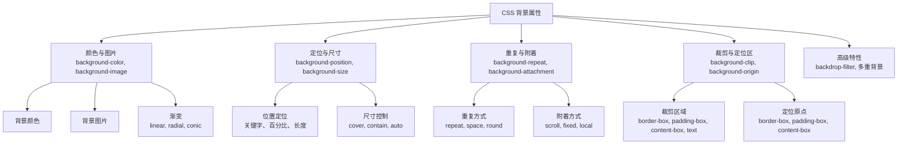
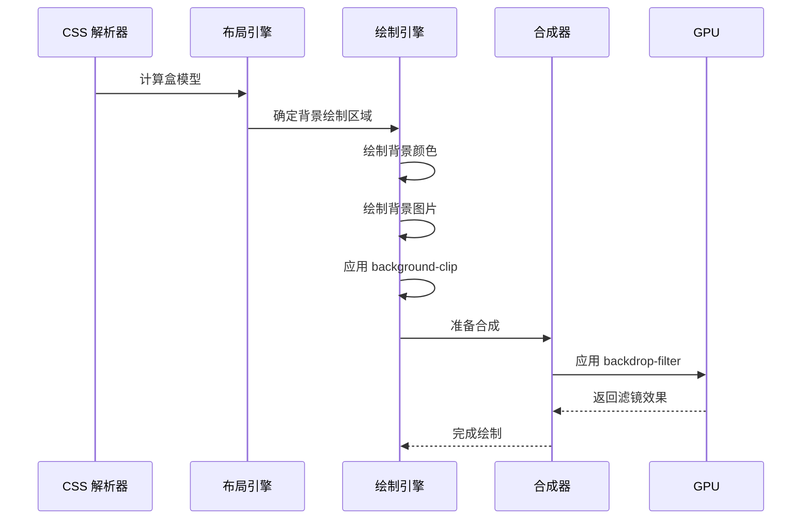
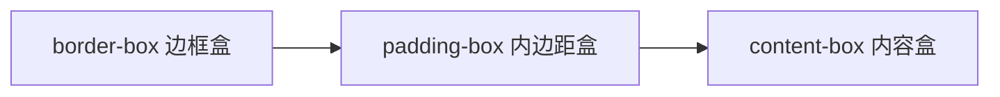
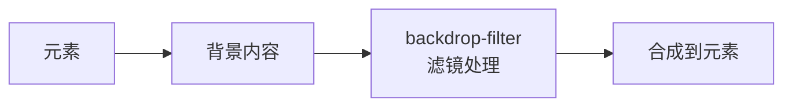

# CSS 背景属性完全指南（01）：深入原理

## CSS 背景属性

### 背景与动机

背景属性是 CSS 中最常用的视觉样式之一，从简单的颜色填充到复杂的渐变叠加，从静态图片到动态视差效果，背景属性为 Web 页面提供了丰富的视觉表现力。

#### 为什么背景属性如此重要？

1. **视觉层次**：背景创建页面的视觉层次和空间感
2. **品牌识别**：独特的背景设计强化品牌形象
3. **用户体验**：合适的背景提升内容的可读性和吸引力
4. **性能影响**：背景图片和渐变直接影响页面加载和渲染性能
5. **现代特性**：backdrop-filter、conic-gradient 等新特性带来更强能力

#### 核心挑战

- 如何平衡背景视觉效果与性能？
- 如何实现响应式背景设计？
- 如何使用 backdrop-filter 创建现代 UI 效果？
- 如何优化渐变性能影响？

本文将系统性地解答这些问题，从基础属性到高级优化，全面覆盖 CSS 背景属性的各个方面。

---

### 核心概念

#### 背景属性体系概览



#### 背景渲染流程



#### 盒模型与背景区域



> **两个属性的分工**：`background-clip` 决定背景绘制延伸到哪一层（默认 `border-box`，`text` 可裁剪到文字）；`background-origin` 决定 `background-position` 的定位原点（默认 `padding-box`）。

---

### 深入原理

#### 背景渲染性能优化

背景渲染是浏览器性能的关键环节，理解渲染流程有助于优化性能。

##### 1. 背景绘制阶段

浏览器按以下顺序绘制背景：

1. **背景颜色**：最底层，首先绘制
2. **背景图片**：多重背景先声明的在最上层，后声明的在下层
3. **背景裁剪**：根据 `background-clip` 裁剪超出部分

##### 2. 性能影响因素

```javascript
// 性能影响因子
const performanceFactors = {
  imageSize: '图片尺寸直接影响解码时间',
  imageFormat: 'WebP/AVIF 比 JPEG/PNG 更高效',
  gradientComplexity: '复杂渐变增加绘制开销',
  backdropFilter: 'backdrop-filter 触发 GPU 合成，开销较大',
  backgroundAttachment: 'fixed 附着触发重绘，影响滚动性能',
  multipleBackgrounds: '多重背景增加绘制层数'
};
```

##### 3. 优化策略

**图片优化：**
- 使用 WebP/AVIF 格式（体积减少 30-50%）
- 响应式图片（根据设备提供不同尺寸）
- 懒加载非首屏背景图

**渐变优化：**
- 避免过多颜色停止点
- 使用 `will-change` 提示浏览器优化
- 减少渐变动画频率

**backdrop-filter 优化：**
- 限制使用范围（仅必要元素）
- 避免在滚动元素上使用
- 使用 `contain: strict` 限制重绘范围

#### backdrop-filter 深入讲解

`backdrop-filter` 是 CSS Filter Effects Module Level 2 引入的特性，允许对元素背后的区域应用滤镜效果。

##### 核心概念



##### 支持的滤镜函数

```css
/* 模糊效果（最常用） */
.glass {
  backdrop-filter: blur(10px);
}

/* 亮度调整 */
.bright {
  backdrop-filter: brightness(1.2);
}

/* 对比度调整 */
.contrast {
  backdrop-filter: contrast(1.5);
}

/* 灰度效果 */
.grayscale {
  backdrop-filter: grayscale(100%);
}

/* 色相旋转 */
.hue-rotate {
  backdrop-filter: hue-rotate(90deg);
}

/* 反色效果 */
.invert {
  backdrop-filter: invert(100%);
}

/* 饱和度调整 */
.saturate {
  backdrop-filter: saturate(2);
}

/* .sepia 效果 */
.sepia {
  backdrop-filter: sepia(100%);
}

/* 多重滤镜组合 */
.complex {
  backdrop-filter: blur(10px) brightness(1.1) saturate(1.2);
}
```

##### 玻璃态效果（Glassmorphism）

```css
/* 现代玻璃态卡片 */
.glass-card {
  background: rgba(255, 255, 255, 0.1);
  backdrop-filter: blur(10px) saturate(180%);
  border: 1px solid rgba(255, 255, 255, 0.2);
  border-radius: 16px;
  box-shadow: 0 8px 32px rgba(0, 0, 0, 0.1);
}

/* 深色模式玻璃态 */
.glass-dark {
  background: rgba(0, 0, 0, 0.25);
  backdrop-filter: blur(12px) saturate(150%);
  border: 1px solid rgba(255, 255, 255, 0.1);
}
```

##### 性能注意事项

```css
/* ✅ 推荐：限制使用范围 */
.specific-element {
  backdrop-filter: blur(10px);
}

/* ❌ 避免：在大面积元素上使用 */
.full-page {
  backdrop-filter: blur(10px); /* 性能开销大 */
}

/* ✅ 使用 contain: paint 限制重绘范围 */
/* ⚠️ 不建议这里用 strict——它包含 size 包含，要求元素有显式尺寸，
   自动高度的毛玻璃元素会被压塌 */
.optimized {
  backdrop-filter: blur(10px);
  contain: paint;
}

/* ✅ 媒体查询：移动端降级 */
@media (min-width: 768px) {
  .glass {
    backdrop-filter: blur(10px);
  }
}

@media (max-width: 767px) {
  .glass {
    backdrop-filter: none; /* 移动端禁用 */
    background: rgba(255, 255, 255, 0.9); /* 降级方案 */
  }
}
```

#### 渐变性能影响

渐变是 CSS 中强大的视觉工具，但使用不当会影响性能。

##### 渐变类型对比

| 渐变类型 | 性能开销 | 适用场景 |
|---------|---------|---------|
| `linear-gradient` | 低 | 大多数场景 |
| `radial-gradient` | 中 | 圆形/径向效果 |
| `conic-gradient` | 中高 | 饼图、色轮 |
| `repeating-*-gradient` | 高 | 图案、纹理 |

##### 性能优化建议

```css
/* ✅ 简单渐变（推荐） */
.simple {
  background: linear-gradient(45deg, #667eea, #764ba2);
}

/* ⚠️ 复杂渐变（谨慎使用） */
.complex {
  background: linear-gradient(
    45deg,
    #667eea 0%,
    #764ba2 20%,
    #f093fb 40%,
    #4facfe 60%,
    #00f2fe 80%,
    #43e97b 100%
  );
}

/* ✅ 使用 will-change 优化动画 */
.animated-gradient {
  background: linear-gradient(45deg, #667eea, #764ba2);
  background-size: 200% 200%;
  animation: gradient-shift 3s ease infinite;
  will-change: background-position;
}

@keyframes gradient-shift {
  0%, 100% { background-position: 0% 50%; }
  50% { background-position: 100% 50%; }
}

/* ✅ 避免在大量元素上使用复杂渐变 */
/* 考虑使用图片替代重复的复杂渐变 */
```

##### 渐变与 GPU 加速

```css
/* 触发 GPU 加速的渐变 */
.gpu-accelerated {
  background: linear-gradient(45deg, #667eea, #764ba2);
  transform: translateZ(0); /* 或 will-change: transform */
}

/* 渐变动画优化 */
.optimized-animation {
  background: linear-gradient(45deg, #667eea, #764ba2);
  background-size: 200% 200%;
  animation: gradient-move 2s ease infinite;
  will-change: background-position;
  /* 使用 transform 而非 background-position 动画更高效 */
}
```

#### 创意设计案例

##### 1. 现代玻璃态 UI

```css
/* 玻璃态导航栏 */
.glass-nav {
  background: rgba(255, 255, 255, 0.1);
  backdrop-filter: blur(10px) saturate(180%);
  border-bottom: 1px solid rgba(255, 255, 255, 0.2);
  position: sticky;
  top: 0;
  z-index: 100;
}

/* 玻璃态模态框 */
.glass-modal {
  background: rgba(255, 255, 255, 0.15);
  backdrop-filter: blur(12px);
  border: 1px solid rgba(255, 255, 255, 0.3);
  border-radius: 20px;
  box-shadow: 0 8px 32px rgba(0, 0, 0, 0.2);
}
```

##### 2. 渐变文字效果

```css
/* 彩虹渐变文字 */
.rainbow-text {
  background: linear-gradient(
    90deg,
    #667eea 0%,
    #764ba2 25%,
    #f093fb 50%,
    #4facfe 75%,
    #667eea 100%
  );
  background-size: 200% auto;
  -webkit-background-clip: text;
  -webkit-text-fill-color: transparent;
  background-clip: text;
  animation: rainbow-shift 3s linear infinite;
}

@keyframes rainbow-shift {
  to { background-position: 200% center; }
}

/* 金属质感文字 */
.metallic-text {
  background: linear-gradient(
    180deg,
    #e8e8e8 0%,
    #9c9c9c 50%,
    #e8e8e8 100%
  );
  -webkit-background-clip: text;
  -webkit-text-fill-color: transparent;
  background-clip: text;
}
```

##### 3. 动态网格背景

```css
/* 动态网格 */
.animated-grid {
  background-image: 
    linear-gradient(rgba(99, 102, 241, 0.1) 1px, transparent 1px),
    linear-gradient(90deg, rgba(99, 102, 241, 0.1) 1px, transparent 1px);
  background-size: 50px 50px;
  animation: grid-move 20s linear infinite;
}

@keyframes grid-move {
  0% { background-position: 0 0; }
  100% { background-position: 50px 50px; }
}

/* 点阵背景 */
.dot-pattern {
  background-image: radial-gradient(
    circle,
    rgba(99, 102, 241, 0.3) 1px,
    transparent 1px
  );
  background-size: 20px 20px;
}
```

##### 4. 波浪分割线

```css
/* 波浪背景分割 */
.wave-section {
  position: relative;
  background: linear-gradient(135deg, #667eea 0%, #764ba2 100%);
}

.wave-section::after {
  content: '';
  position: absolute;
  bottom: 0;
  left: 0;
  right: 0;
  height: 100px;
  background: url('data:image/svg+xml,<svg xmlns="http://www.w3.org/2000/svg" viewBox="0 0 1200 120" preserveAspectRatio="none"><path d="M321.39,56.44c58-10.79,114.16-30.13,172-41.86,82.39-16.72,168.19-17.73,250.45-.39C823.78,31,906.67,72,985.66,92.83c70.05,18.48,146.53,26.09,214.34,3V0H0V27.35A600.21,600.21,0,0,0,321.39,56.44Z" fill="white"/></svg>');
  background-size: cover;
}
```

##### 5. 光晕效果

```css
/* 光晕背景 */
.glow-background {
  background: 
    radial-gradient(circle at 20% 80%, rgba(120, 119, 198, 0.3) 0%, transparent 50%),
    radial-gradient(circle at 80% 20%, rgba(255, 119, 198, 0.3) 0%, transparent 50%),
    radial-gradient(circle at 40% 40%, rgba(120, 219, 255, 0.2) 0%, transparent 50%),
    #0f172a;
}

/* 动态光晕 */
.animated-glow {
  background: 
    radial-gradient(circle at var(--x, 50%) var(--y, 50%), rgba(120, 119, 198, 0.4) 0%, transparent 50%),
    #0f172a;
  transition: background 0.3s ease;
}
```

---

