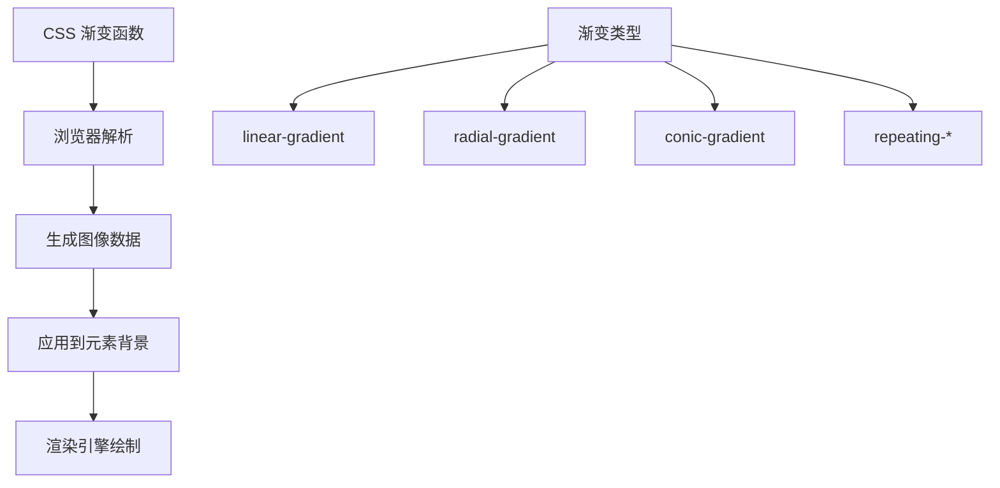
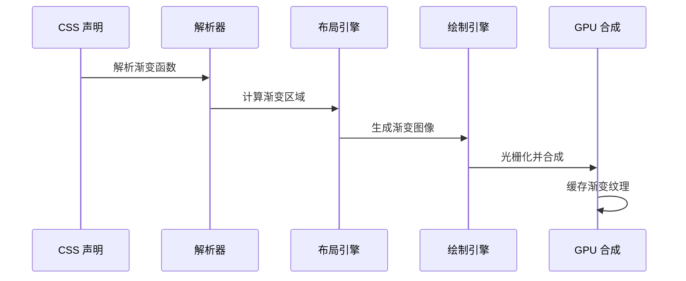

# CSS 渐变

CSS 渐变是一种特殊的图片类型（`<gradient>` 数据类型），通过渐变函数创建平滑过渡的颜色效果。渐变属于 CSS Image Module 规范，本质上是浏览器动态生成的图像，无需额外的网络请求。

## 背景与动机

### 为什么需要渐变

在 Web 设计早期，实现颜色过渡效果需要依赖位图图像，这带来了诸多问题：

1. **网络请求开销**：每个渐变背景都需要额外的 HTTP 请求
2. **文件体积**：渐变图像占用存储空间和带宽
3. **缩放失真**：位图在不同分辨率下可能模糊或像素化
4. **维护成本**：修改颜色需要重新生成和上传图像

CSS 渐变通过声明式语法解决了这些问题，让开发者能够：

- 使用纯 CSS 创建丰富的颜色过渡效果
- 减少网络请求，提升页面加载性能
- 实现响应式渐变，自适应不同屏幕尺寸
- 通过代码轻松维护和修改渐变效果

### 渐变的本质



渐变在 CSS 中属于 `<image>` 数据类型，这意味着它可以用在任何接受图像的地方：

- `background-image`：背景图像
- `border-image`：边框图像
- `list-style-image`：列表项标记
- `mask-image`：遮罩图像
- `content`：伪元素内容

## 核心概念

### 渐变类型总览

| 类型 | 函数 | 描述 | 适用场景 |
|------|------|------|----------|
| 线性渐变 | `linear-gradient()` | 沿直线方向过渡 | 背景、按钮、进度条 |
| 径向渐变 | `radial-gradient()` | 从中心点向外辐射 | 聚光灯、光晕、渐变阴影 |
| 锥形渐变 | `conic-gradient()` | 围绕中心点旋转 | 饼图、色轮、评分环 |
| 重复线性 | `repeating-linear-gradient()` | 重复的线性渐变 | 条纹、斑马线 |
| 重复径向 | `repeating-radial-gradient()` | 重复的径向渐变 | 同心圆、靶心 |
| 重复锥形 | `repeating-conic-gradient()` | 重复的锥形渐变 | 放射状条纹、棋盘格 |

### 渐变特点

- **无网络请求**：渐变由浏览器动态生成，不需要加载外部图片
- **可缩放**：渐变可以根据容器大小自适应，不会失真
- **性能友好**：相比位图，渐变占用内存更小，渲染更快
- **可动画**：部分渐变属性支持 CSS 动画（通过背景位置等方式）
- **可组合**：多个渐变可以叠加，创建复杂效果

### 基本使用场景

```css
/* 背景图片 */
background: linear-gradient(to right, #667eea, #764ba2);

/* 边框图像 */
border-image: linear-gradient(to right, red, blue) 1;

/* 内容遮罩 */
mask-image: linear-gradient(to bottom, black, transparent);

/* 列表项目符号 */
list-style-image: linear-gradient(to right, red, blue);

/* 伪元素内容 */
.element::before {
  content: linear-gradient(to right, red, blue);
}
```

## 线性渐变 (linear-gradient)

线性渐变沿直线方向进行颜色过渡，是最常用的渐变类型。

### 基本语法

```css
linear-gradient(
  [ <angle> | to <side-or-corner> ]?, /* 方向（可选） */
  <color-stop-list>                   /* 颜色断点列表 */
)
```

### 方向参数

#### 关键字方向

```css
/* 基本方向 */
background: linear-gradient(to top, red, blue);       /* 从下到上 */
background: linear-gradient(to right, red, blue);     /* 从左到右 */
background: linear-gradient(to bottom, red, blue);    /* 从上到下（默认） */
background: linear-gradient(to left, red, blue);      /* 从右到左 */

/* 对角方向 */
background: linear-gradient(to top right, red, blue);     /* 左下到右上 */
background: linear-gradient(to top left, red, blue);      /* 右下到左上 */
background: linear-gradient(to bottom right, red, blue);  /* 左上到右下 */
background: linear-gradient(to bottom left, red, blue);   /* 右上到左下 */
```

#### 角度方向

角度从上方（12点方向）开始顺时针计算：

```
      0deg (to top)
        ↑
270deg ←  → 90deg (to right)
        ↓
     180deg (to bottom)
```

```css
background: linear-gradient(0deg, red, blue);      /* 从下到上 */
background: linear-gradient(45deg, red, blue);     /* 左下到右上 */
background: linear-gradient(90deg, red, blue);     /* 从左到右 */
background: linear-gradient(135deg, red, blue);    /* 左上到右下 */
background: linear-gradient(180deg, red, blue);    /* 从上到下 */
background: linear-gradient(270deg, red, blue);    /* 从右到左 */
background: linear-gradient(-45deg, red, blue);    /* 右上到左下（负角度） */
```

### 颜色断点 (Color Stops)

#### 基本用法

```css
/* 两个颜色，均匀分布 */
background: linear-gradient(red, blue);

/* 多个颜色，均匀分布 */
background: linear-gradient(red, yellow, green, blue);
```

#### 指定位置

位置可以是百分比或长度单位：

```css
/* 百分比位置 */
background: linear-gradient(red 0%, yellow 50%, blue 100%);

/* 长度单位 */
background: linear-gradient(red 0px, yellow 100px, blue 200px);

/* 混合使用 */
background: linear-gradient(red 0%, yellow 200px, blue 100%);
```

#### 颜色提示 (Color Hint)

控制两个颜色之间的过渡中点：

```css
/* 默认：中点在 50% */
background: linear-gradient(red, blue);

/* 中点移到 30% */
background: linear-gradient(red, 30%, blue);

/* 中点移到 80% */
background: linear-gradient(red, 80%, blue);

/* 多个颜色提示 */
background: linear-gradient(red, 20%, yellow, 80%, blue);
```

#### 多位置颜色

一个颜色可以出现在多个位置：

```css
/* 颜色占据范围 */
background: linear-gradient(
  red 0% 30%,      /* 红色从 0% 到 30% */
  blue 30% 70%,    /* 蓝色从 30% 到 70% */
  red 70% 100%     /* 红色从 70% 到 100% */
);
```

### 硬边缘效果

相邻颜色位置相同时，创建锐利的边缘：

```css
/* 水平分割 */
background: linear-gradient(90deg, red 50%, blue 50%);

/* 三等分 */
background: linear-gradient(90deg, 
  red 0% 33.33%, 
  blue 33.33% 66.66%, 
  green 66.66% 100%
);

/* 使用 calc() 精确计算 */
background: linear-gradient(90deg,
  red 0 calc(100% / 3),
  blue calc(100% / 3) calc(100% / 3 * 2),
  green calc(100% / 3 * 2) 100%
);
```

### 透明度渐变

```css
/* 使用 rgba */
background: linear-gradient(rgba(0,0,0,0), rgba(0,0,0,0.8));
background: linear-gradient(to top, transparent, black);

/* 使用十六进制透明度 */
background: linear-gradient(#00000000, #000000cc);

/* 使用 currentColor */
background: linear-gradient(transparent, currentColor);
```

### 多背景叠加

```css
/* 多层渐变叠加 */
background: 
  linear-gradient(135deg, transparent 40%, rgba(255,255,255,0.3) 50%, transparent 60%),
  linear-gradient(to right, #667eea, #764ba2);

/* 渐变 + 图片 */
background: 
  linear-gradient(to bottom, transparent, rgba(0,0,0,0.8)),
  url('image.jpg');
```

## 径向渐变 (radial-gradient)

径向渐变从中心点向外辐射，创建圆形或椭圆形的颜色过渡。

### 基本语法

```css
radial-gradient(
  [ <shape> || <size> ]? [ at <position> ]?, /* 形状、大小、位置（可选） */
  <color-stop-list>                          /* 颜色断点列表 */
)
```

### 形状参数

```css
background: radial-gradient(circle, red, blue);    /* 圆形 */
background: radial-gradient(ellipse, red, blue);   /* 椭圆（默认） */
```

### 大小参数

#### 关键字大小

| 关键字 | 描述 |
|--------|------|
| `closest-side` | 渐变边缘接触最近的边 |
| `closest-corner` | 渐变边缘接触最近的角 |
| `farthest-side` | 渐变边缘接触最远的边 |
| `farthest-corner` | 渐变边缘接触最远的角（默认） |

```css
background: radial-gradient(closest-side, red, blue);
background: radial-gradient(closest-corner, red, blue);
background: radial-gradient(farthest-side, red, blue);
background: radial-gradient(farthest-corner, red, blue); /* 默认 */
```

#### 明确大小

```css
/* 圆形：单个半径 */
background: radial-gradient(circle 100px, red, blue);
background: radial-gradient(circle 50%, red, blue);

/* 椭圆：两个半径 */
background: radial-gradient(ellipse 200px 100px, red, blue);
background: radial-gradient(ellipse 50% 25%, red, blue);
```

### 位置参数

使用 `at` 关键字指定中心位置：

```css
/* 关键字位置 */
background: radial-gradient(at center, red, blue);
background: radial-gradient(at top, red, blue);
background: radial-gradient(at top left, red, blue);
background: radial-gradient(at right bottom, red, blue);

/* 百分比位置 */
background: radial-gradient(at 50% 50%, red, blue);
background: radial-gradient(at 0% 0%, red, blue);
background: radial-gradient(at 100% 100%, red, blue);

/* 长度位置 */
background: radial-gradient(at 100px 200px, red, blue);
background: radial-gradient(at 50% 100px, red, blue);
```

### 完整语法示例

```css
/* 形状 + 大小 */
background: radial-gradient(circle closest-side, red, blue);

/* 大小 + 位置 */
background: radial-gradient(50px at top right, red, blue);

/* 形状 + 大小 + 位置 */
background: radial-gradient(circle 100px at 50% 50%, red, blue);
background: radial-gradient(ellipse 80% 50% at center, red, blue);

/* 复杂示例 */
background: radial-gradient(
  ellipse farthest-corner at 20% 80%,
  #ff0000 0%,
  #0000ff 50%,
  transparent 100%
);
```

### 实用示例

```css
/* 聚光灯效果 */
.spotlight {
  background: radial-gradient(
    circle at center,
    rgba(255,255,255,0.8) 0%,
    rgba(255,255,255,0) 50%
  );
}

/* 渐变阴影 */
.gradient-shadow {
  background: radial-gradient(
    ellipse at center,
    transparent 0%,
    transparent 50%,
    rgba(0,0,0,0.3) 100%
  );
}

/* 光晕效果 */
.glow {
  background: radial-gradient(
    circle at center,
    rgba(255,255,255,1) 0%,
    rgba(255,255,255,0.5) 30%,
    rgba(255,255,255,0) 70%
  );
}

/* 按钮高光 */
.button-highlight {
  background: radial-gradient(
    ellipse at center top,
    rgba(255,255,255,0.5) 0%,
    transparent 50%
  );
}
```

## 锥形渐变 (conic-gradient)

锥形渐变围绕中心点旋转，颜色沿角度方向过渡。适用于创建饼图、色轮等效果。

### 基本语法

```css
conic-gradient(
  [ from <angle> ]? [ at <position> ]?, /* 起始角度、位置（可选） */
  <color-stop-list>                      /* 颜色断点列表 */
)
```

### 起始角度

```css
/* 默认从 0deg 开始 */
background: conic-gradient(red, yellow, green, blue, red);

/* 指定起始角度 */
background: conic-gradient(from 0deg, red, yellow, blue);
background: conic-gradient(from 45deg, red, yellow, blue);
background: conic-gradient(from 180deg, red, yellow, blue);
```

### 中心位置

```css
/* 默认中心 */
background: conic-gradient(at center, red, blue);

/* 关键字位置 */
background: conic-gradient(at top left, red, blue);

/* 百分比位置 */
background: conic-gradient(at 50% 50%, red, blue);
background: conic-gradient(at 25% 75%, red, blue);

/* 长度位置 */
background: conic-gradient(at 100px 100px, red, blue);
```

### 角度颜色断点

```css
/* 角度范围 */
background: conic-gradient(
  red 0deg 90deg,
  yellow 90deg 180deg,
  green 180deg 270deg,
  blue 270deg 360deg
);

/* 使用 turn 单位（1turn = 360deg） */
background: conic-gradient(
  red 0turn 0.25turn,
  yellow 0.25turn 0.5turn,
  green 0.5turn 0.75turn,
  blue 0.75turn 1turn
);

/* 百分比 */
background: conic-gradient(
  red 0% 25%,
  yellow 25% 50%,
  green 50% 75%,
  blue 75% 100%
);
```

### 实用示例

```css
/* 饼图 */
.pie-chart {
  background: conic-gradient(
    #ff6b6b 0deg 120deg,
    #4ecdc4 120deg 240deg,
    #45b7d1 240deg 360deg
  );
  border-radius: 50%;
}

/* 进度环 */
.progress-ring {
  background: conic-gradient(
    #667eea 0deg var(--progress),
    #e0e0e0 var(--progress) 360deg
  );
  border-radius: 50%;
}

/* 色轮 */
.color-wheel {
  background: conic-gradient(
    red, yellow, lime, aqua, blue, magenta, red
  );
  border-radius: 50%;
}

/* 雷达扫描效果 */
.radar {
  background: conic-gradient(
    from 0deg,
    transparent 0deg,
    rgba(0, 255, 0, 0.5) 30deg,
    transparent 60deg
  );
  border-radius: 50%;
  animation: radar-spin 2s linear infinite;
}

@keyframes radar-spin {
  from { transform: rotate(0deg); }
  to { transform: rotate(360deg); }
}

/* 渐变边框 */
.gradient-border {
  background: conic-gradient(#667eea, #764ba2, #667eea);
  padding: 3px;
  border-radius: 10px;
}

.gradient-border > div {
  background: white;
  border-radius: 7px;
}
```

### 锥形渐变深度解析

#### 完整语法

```css
conic-gradient(
  [ from <angle> ]?    /* 起始角度，默认 0deg */
  [ at <position> ]?,  /* 中心位置，默认 center */
  <color-stop-list>    /* 颜色断点列表 */
)
```

- `from <angle>`：渐变起始角度，支持 `deg`、`turn`、`rad`
- `at <position>`：渐变中心点，语法同 `background-position`
- 颜色断点支持角度（`deg`/`turn`）和百分比

#### repeating-conic-gradient

重复锥形渐变在 360deg 后自动重复，适合创建放射状条纹、棋盘格等周期性图案。

```css
/* 放射状条纹（12 条） */
.sunburst {
  background: repeating-conic-gradient(
    #ff6b6b 0deg 15deg,
    #4ecdc4 15deg 30deg
  );
  border-radius: 50%;
}

/* 棋盘格 */
.checkerboard {
  background:
    repeating-conic-gradient(
      #e0e0e0 0deg 90deg,
      #ffffff 90deg 180deg
    ) 0 0 / 40px 40px;
}

/* 极简加载动画 */
.spinner {
  background: repeating-conic-gradient(
    transparent 0deg 30deg,
    currentColor 30deg 60deg
  );
  border-radius: 50%;
  animation: spin 1s linear infinite;
}

@keyframes spin {
  to { transform: rotate(360deg); }
}
```

#### 实战模式

**1. 饼图**

```css
.pie-chart {
  --slice-1: 120deg;  /* 33.3% */
  --slice-2: 90deg;   /* 25% */
  --slice-3: 150deg;  /* 41.7% */

  background: conic-gradient(
    #ff6b6b 0deg var(--slice-1),
    #4ecdc4 var(--slice-1) calc(var(--slice-1) + var(--slice-2)),
    #45b7d1 calc(var(--slice-1) + var(--slice-2)) 360deg
  );
  border-radius: 50%;
}
```

**2. 色轮**

```css
.color-wheel {
  background: conic-gradient(
    hsl(0, 100%, 50%),
    hsl(60, 100%, 50%),
    hsl(120, 100%, 50%),
    hsl(180, 100%, 50%),
    hsl(240, 100%, 50%),
    hsl(300, 100%, 50%),
    hsl(360, 100%, 50%)
  );
  border-radius: 50%;
}
```

**3. 评分环**

```css
.rating-ring {
  --rating: 75;           /* 0-100 */
  --color-fill: #22c55e;
  --color-track: #e5e7eb;

  background: conic-gradient(
    var(--color-fill) 0deg calc(var(--rating) * 3.6deg),
    var(--color-track) calc(var(--rating) * 3.6deg) 360deg
  );
  border-radius: 50%;
  display: grid;
  place-items: center;
}

/* 中心挖空形成环形 */
.rating-ring::before {
  content: '';
  width: 75%;
  height: 75%;
  background: white;
  border-radius: 50%;
}
```

**4. 锥形渐变边框**

```css
/* 旋转渐变边框 */
.conic-border {
  --angle: 0deg;
  border: 3px solid transparent;
  border-radius: 12px;
  background:
    linear-gradient(white, white) padding-box,
    conic-gradient(from var(--angle), #667eea, #764ba2, #f093fb, #667eea) border-box;
  animation: border-rotate 3s linear infinite;
}

@property --angle {
  syntax: '<angle>';
  initial-value: 0deg;
  inherits: false;
}

@keyframes border-rotate {
  to { --angle: 360deg; }
}
```

**5. 动态色轮（conic-gradient + hue-rotate）**

```css
.dynamic-wheel {
  background: conic-gradient(
    red, yellow, lime, aqua, blue, magenta, red
  );
  border-radius: 50%;
  animation: hue-shift 6s linear infinite;
}

@keyframes hue-shift {
  to { filter: hue-rotate(360deg); }
}
```

#### conic-gradient vs radial-gradient 对比

| 特性 | `conic-gradient` | `radial-gradient` |
|------|-------------------|-------------------|
| 过渡方向 | 沿角度旋转 | 从中心向外辐射 |
| 颜色分布 | 角度方向（0-360deg） | 径向方向（中心到边缘） |
| 典型用途 | 饼图、色轮、评分环 | 聚光灯、光晕、渐变阴影 |
| 是否支持 `from` | 支持（起始角度） | 不支持 |
| 中心位置语法 | `at <position>` | `at <position>` |
| 硬边缘分割 | 天然适合（角度段） | 需要精确位置计算 |
| 重复形式 | `repeating-conic-gradient` | `repeating-radial-gradient` |
| 浏览器支持 | Chrome 69+, Firefox 83+ | 全浏览器支持 |

```
┌─────────────────────┐    ┌─────────────────────┐
│   conic-gradient    │    │  radial-gradient    │
│                     │    │                     │
│    颜色沿角度旋转    │    │   颜色沿半径辐射    │
│    0° → 360°        │    │   中心 → 边缘       │
│                     │    │                     │
│  适合：饼图、色轮   │    │  适合：光晕、聚光灯 │
└─────────────────────┘    └─────────────────────┘
```

## 重复渐变

重复渐变可以创建重复的图案效果。

### repeating-linear-gradient

```css
/* 斜条纹 */
.stripes {
  background: repeating-linear-gradient(
    45deg,
    #606dbc,
    #606dbc 10px,
    #465298 10px,
    #465298 20px
  );
}

/* 垂直条纹 */
.vertical-stripes {
  background: repeating-linear-gradient(
    90deg,
    #e0e0e0,
    #e0e0e0 20px,
    #ffffff 20px,
    #ffffff 40px
  );
}

/* 斑马线 */
.zebra {
  background: repeating-linear-gradient(
    transparent,
    transparent 10px,
    rgba(0,0,0,0.1) 10px,
    rgba(0,0,0,0.1) 20px
  );
}

/* 渐隐条纹 */
.fade-stripes {
  background: repeating-linear-gradient(
    45deg,
    transparent,
    transparent 10px,
    rgba(255,255,255,0.3) 10px,
    rgba(255,255,255,0.3) 20px
  ),
  linear-gradient(to right, #667eea, #764ba2);
}
```

### repeating-radial-gradient

```css
/* 同心圆 */
.concentric-circles {
  background: repeating-radial-gradient(
    circle at center,
    white,
    white 10px,
    black 10px,
    black 20px
  );
}

/* 靶心效果 */
.bullseye {
  background: repeating-radial-gradient(
    circle at center,
    red,
    red 10px,
    white 10px,
    white 20px
  );
}

/* 水波纹 */
.ripple {
  background: repeating-radial-gradient(
    circle at center,
    transparent,
    transparent 20px,
    rgba(0, 150, 255, 0.2) 20px,
    rgba(0, 150, 255, 0.2) 40px
  );
}
```

### repeating-conic-gradient

```css
/* 放射状条纹 */
.sunburst {
  background: repeating-conic-gradient(
    red 0deg 30deg,
    yellow 30deg 60deg
  );
}

/* 星光效果 */
.starburst {
  background: repeating-conic-gradient(
    from 0deg,
    rgba(255,255,255,0.2) 0deg 10deg,
    transparent 10deg 20deg
  ),
  linear-gradient(to bottom, #1a1a2e, #16213e);
}

/* 棋盘格 */
.checkerboard {
  background: 
    repeating-conic-gradient(
      #ccc 0deg 90deg,
      #fff 90deg 180deg
    ) 0 0 / 40px 40px;
}
```

## 常见应用

### 按钮渐变

```css
/* 基础渐变按钮 */
.btn-gradient {
  background: linear-gradient(135deg, #667eea 0%, #764ba2 100%);
  border: none;
  padding: 12px 24px;
  color: white;
  border-radius: 4px;
  cursor: pointer;
  transition: all 0.3s ease;
}

.btn-gradient:hover {
  background: linear-gradient(135deg, #764ba2 0%, #667eea 100%);
  transform: translateY(-2px);
  box-shadow: 0 4px 15px rgba(102, 126, 234, 0.4);
}

/* 玻璃态按钮 */
.btn-glass {
  background: linear-gradient(
    135deg,
    rgba(255, 255, 255, 0.1),
    rgba(255, 255, 255, 0.05)
  );
  backdrop-filter: blur(10px);
  border: 1px solid rgba(255, 255, 255, 0.2);
  border-radius: 8px;
  padding: 12px 24px;
  color: white;
}

/* 发光按钮 */
.btn-glow {
  background: linear-gradient(90deg, #00d2ff, #3a7bd5);
  box-shadow: 0 0 20px rgba(0, 210, 255, 0.5),
              0 0 40px rgba(0, 210, 255, 0.3),
              0 0 60px rgba(0, 210, 255, 0.1);
  border-radius: 30px;
  padding: 12px 30px;
  color: white;
}
```

### 文字渐变

```css
/* 基础文字渐变 */
.gradient-text {
  background: linear-gradient(45deg, #667eea, #764ba2);
  -webkit-background-clip: text;
  background-clip: text;
  -webkit-text-fill-color: transparent;
}

/* 彩虹文字 */
.rainbow-text {
  background: linear-gradient(
    90deg,
    #ff0000, #ff7f00, #ffff00,
    #00ff00, #0000ff, #4b0082, #9400d3
  );
  background-size: 200% auto;
  -webkit-background-clip: text;
  background-clip: text;
  -webkit-text-fill-color: transparent;
  animation: rainbow 3s linear infinite;
}

@keyframes rainbow {
  to { background-position: 200% center; }
}

/* 金属文字 */
.metallic-text {
  background: linear-gradient(
    180deg,
    #bfbfbf 0%,
    #ffffff 25%,
    #bfbfbf 50%,
    #8c8c8c 75%,
    #bfbfbf 100%
  );
  -webkit-background-clip: text;
  background-clip: text;
  -webkit-text-fill-color: transparent;
  background-size: 100% 200%;
  animation: metallic 2s ease infinite;
}

@keyframes metallic {
  0%, 100% { background-position: 0% 0%; }
  50% { background-position: 0% 100%; }
}
```

### 边框渐变

```css
/* 方法一：border-image */
.border-gradient-1 {
  border: 4px solid transparent;
  border-image: linear-gradient(45deg, #667eea, #764ba2) 1;
}

/* 方法二：background 叠加 */
.border-gradient-2 {
  border: 4px solid transparent;
  background: 
    linear-gradient(white, white) padding-box,
    linear-gradient(45deg, #667eea, #764ba2) border-box;
  border-radius: 8px;
}

/* 方法三：伪元素 */
.border-gradient-3 {
  position: relative;
  border-radius: 8px;
}

.border-gradient-3::before {
  content: '';
  position: absolute;
  inset: 0;
  border-radius: inherit;
  padding: 2px;
  background: linear-gradient(45deg, #667eea, #764ba2);
  -webkit-mask: 
    linear-gradient(#fff 0 0) content-box, 
    linear-gradient(#fff 0 0);
  mask: 
    linear-gradient(#fff 0 0) content-box, 
    linear-gradient(#fff 0 0);
  -webkit-mask-composite: xor;
  mask-composite: exclude;
}

/* 动态边框 */
.border-animated {
  --angle: 0deg;
  border: 2px solid transparent;
  background: 
    linear-gradient(white, white) padding-box,
    conic-gradient(from var(--angle), #667eea, #764ba2, #667eea) border-box;
  animation: border-spin 3s linear infinite;
}

@keyframes border-spin {
  to { --angle: 360deg; }
}
/* ⚠️ @keyframes 内不允许嵌套 @supports 等其他 at 规则，
   如需兼容性分流，请把 @supports 写在外层并各自定义动画 */
@property --angle {
  syntax: '<angle>';
  initial-value: 0deg;
  inherits: false;
}
```

### 卡片效果

```css
/* 新拟态卡片 */
.neumorphic-card {
  background: linear-gradient(145deg, #e6e6e6, #ffffff);
  box-shadow: 
    10px 10px 20px rgba(0,0,0,0.1),
    -10px -10px 20px rgba(255,255,255,0.9);
  border-radius: 20px;
  padding: 20px;
}

.neumorphic-card:hover {
  background: linear-gradient(145deg, #ffffff, #e6e6e6);
}

/* 玻璃态卡片 */
.glass-card {
  background: linear-gradient(
    135deg,
    rgba(255, 255, 255, 0.1),
    rgba(255, 255, 255, 0.05)
  );
  backdrop-filter: blur(10px);
  border: 1px solid rgba(255, 255, 255, 0.2);
  border-radius: 16px;
  box-shadow: 0 8px 32px rgba(0, 0, 0, 0.1);
}

/* 渐变卡片 */
.gradient-card {
  background: linear-gradient(135deg, #667eea 0%, #764ba2 100%);
  border-radius: 16px;
  padding: 24px;
  color: white;
}

.gradient-card::before {
  content: '';
  position: absolute;
  inset: 0;
  background: linear-gradient(
    135deg,
    transparent 0%,
    rgba(255, 255, 255, 0.2) 50%,
    transparent 100%
  );
  border-radius: inherit;
}
```

### 进度条

```css
/* 基础进度条 */
.progress-bar {
  height: 20px;
  background: #e0e0e0;
  border-radius: 10px;
  overflow: hidden;
}

.progress-bar-fill {
  height: 100%;
  background: linear-gradient(90deg, #00b09b, #96c93d);
  border-radius: 10px;
  transition: width 0.3s ease;
}

/* 动态进度条 */
.progress-animated {
  height: 4px;
  background: linear-gradient(90deg, #667eea, #764ba2, #667eea);
  background-size: 200% 100%;
  animation: progress 1.5s ease infinite;
}

@keyframes progress {
  0% { background-position: 0% 0%; }
  100% { background-position: 200% 0%; }
}

/* 条纹进度条 */
.progress-striped {
  height: 20px;
  background: repeating-linear-gradient(
    45deg,
    #4CAF50,
    #4CAF50 10px,
    #45a049 10px,
    #45a049 20px
  );
  background-size: 200% 100%;
  animation: stripe-move 1s linear infinite;
}

@keyframes stripe-move {
  0% { background-position: 0 0; }
  100% { background-position: 40px 0; }
}

/* 圆形进度 */
.progress-circle {
  --progress: 0%;
  width: 100px;
  height: 100px;
  border-radius: 50%;
  background: conic-gradient(
    #667eea 0deg calc(var(--progress) * 3.6deg),
    #e0e0e0 calc(var(--progress) * 3.6deg) 360deg
  );
  display: grid;
  place-items: center;
}

.progress-circle::before {
  content: '';
  width: 80px;
  height: 80px;
  background: white;
  border-radius: 50%;
}
```

### 骨架屏

```css
/* 基础骨架屏 */
.skeleton {
  background: linear-gradient(
    90deg,
    #f0f0f0 25%,
    #e0e0e0 50%,
    #f0f0f0 75%
  );
  background-size: 200% 100%;
  animation: skeleton-loading 1.5s infinite;
  border-radius: 4px;
}

@keyframes skeleton-loading {
  0% { background-position: 200% 0; }
  100% { background-position: -200% 0; }
}

/* 卡片骨架屏 */
.skeleton-card {
  padding: 16px;
  background: white;
  border-radius: 8px;
}

.skeleton-card .image {
  height: 200px;
  background: linear-gradient(90deg, #f0f0f0 25%, #e0e0e0 50%, #f0f0f0 75%);
  background-size: 200% 100%;
  animation: skeleton-loading 1.5s infinite;
  border-radius: 8px;
  margin-bottom: 12px;
}

.skeleton-card .title {
  height: 24px;
  width: 60%;
  margin-bottom: 8px;
}

.skeleton-card .text {
  height: 16px;
  margin-bottom: 8px;
}

.skeleton-card .text:last-child {
  width: 80%;
}
```

### 遮罩效果

```css
/* 底部渐变遮罩 */
.overlay-bottom {
  background: linear-gradient(
    to top,
    rgba(0, 0, 0, 0.8) 0%,
    transparent 100%
  );
}

/* 中心渐变遮罩 */
.overlay-center {
  background: radial-gradient(
    circle at center,
    transparent 0%,
    rgba(0, 0, 0, 0.8) 100%
  );
}

/* 边缘渐变遮罩 */
.overlay-edges {
  background: linear-gradient(
    to bottom,
    rgba(0, 0, 0, 0.6) 0%,
    transparent 20%,
    transparent 80%,
    rgba(0, 0, 0, 0.6) 100%
  ),
  linear-gradient(
    to right,
    rgba(0, 0, 0, 0.6) 0%,
    transparent 20%,
    transparent 80%,
    rgba(0, 0, 0, 0.6) 100%
  );
}

/* 文字渐隐 */
.text-fade {
  mask-image: linear-gradient(
    to bottom,
    black 50%,
    transparent 100%
  );
  -webkit-mask-image: linear-gradient(
    to bottom,
    black 50%,
    transparent 100%
  );
}
```

### 图案效果

```css
/* 网格图案 */
.grid-pattern {
  background-image: 
    linear-gradient(rgba(0,0,0,0.1) 1px, transparent 1px),
    linear-gradient(90deg, rgba(0,0,0,0.1) 1px, transparent 1px);
  background-size: 20px 20px;
}

/* 点阵图案 */
.dot-pattern {
  background-image: radial-gradient(
    circle,
    rgba(0,0,0,0.1) 1px,
    transparent 1px
  );
  background-size: 20px 20px;
}

/* 棋盘格图案 */
.checkerboard-pattern {
  background-image: 
    linear-gradient(45deg, #ccc 25%, transparent 25%),
    linear-gradient(-45deg, #ccc 25%, transparent 25%),
    linear-gradient(45deg, transparent 75%, #ccc 75%),
    linear-gradient(-45deg, transparent 75%, #ccc 75%);
  background-size: 20px 20px;
  background-position: 0 0, 0 10px, 10px -10px, -10px 0px;
}

/* 波浪图案 */
.wave-pattern {
  background: repeating-linear-gradient(
    45deg,
    transparent,
    transparent 10px,
    rgba(100, 149, 237, 0.2) 10px,
    rgba(100, 149, 237, 0.2) 20px
  );
}
```

## 浏览器兼容性

### 基本支持

| 特性 | Chrome | Firefox | Safari | Edge |
|------|--------|---------|--------|------|
| `linear-gradient` | 10+ | 3.6+ | 5.1+ | 12+ |
| `radial-gradient` | 10+ | 3.6+ | 5.1+ | 12+ |
| `conic-gradient` | 69+ | 83+ | 12.1+ | 79+ |
| `repeating-*-gradient` | 10+ | 3.6+ | 5.1+ | 12+ |
| 多位置颜色 | 71+ | 64+ | 12.1+ | 79+ |
| 颜色提示 | 40+ | 36+ | 7+ | 12+ |

### 兼容性写法

```css
/* 渐变后备方案 */
.box {
  /* 纯色后备 */
  background: #667eea;
  
  /* 带前缀的渐变 */
  background: -webkit-linear-gradient(top, #667eea, #764ba2);
  background: -moz-linear-gradient(top, #667eea, #764ba2);
  background: -o-linear-gradient(top, #667eea, #764ba2);
  
  /* 标准写法 */
  background: linear-gradient(to bottom, #667eea, #764ba2);
}

/* 特性检测 */
@supports (background: conic-gradient(red, blue)) {
  .modern-browser {
    background: conic-gradient(red, blue);
  }
}

@supports not (background: conic-gradient(red, blue)) {
  .modern-browser {
    background: linear-gradient(red, blue);
  }
}
```

### 常见兼容性问题

```css
/* 1. 旧版语法角度差异 */
/* 旧版：角度从右侧开始 */
background: -webkit-linear-gradient(0deg, red, blue);   /* 从左到右 */

/* 新版：角度从上方开始 */
background: linear-gradient(0deg, red, blue);           /* 从下到上 */

/* 2. 透明度兼容 */
/* 使用 rgba 或 transparent 关键字 */
background: linear-gradient(transparent, black);
background: linear-gradient(rgba(0,0,0,0), rgba(0,0,0,1));

/* 注意：transparent 在旧版浏览器中可能显示为灰色 */
/* 推荐使用 rgba 形式 */
```

## 最佳实践

### 1. 性能优化

```css
/* ❌ 避免过度复杂的渐变 */
background: linear-gradient(
  45deg,
  red, orange, yellow, green, blue, indigo, violet,
  red, orange, yellow, green, blue, indigo, violet
);

/* ✅ 使用合理的颜色数量 */
background: linear-gradient(45deg, red, blue, red);

/* ❌ 避免在动画中使用渐变 */
.box {
  animation: gradient-change 1s infinite;
}

@keyframes gradient-change {
  from { background: linear-gradient(red, blue); }
  to { background: linear-gradient(blue, red); }
}

/* ✅ 使用 opacity 或 transform */
.box {
  background: linear-gradient(red, blue);
  animation: fade 1s infinite;
}

@keyframes fade {
  0%, 100% { opacity: 1; }
  50% { opacity: 0.5; }
}
```

### 2. 可维护性

```css
/* ✅ 使用 CSS 变量 */
:root {
  --gradient-primary: linear-gradient(135deg, #667eea, #764ba2);
  --gradient-secondary: linear-gradient(135deg, #f093fb, #f5576c);
  --gradient-dark: linear-gradient(135deg, #434343, #000000);
}

.button {
  background: var(--gradient-primary);
}

.button-secondary {
  background: var(--gradient-secondary);
}

/* ✅ 复用渐变 */
.gradient-bg {
  background: var(--gradient-primary);
}

.gradient-text {
  background: var(--gradient-primary);
  -webkit-background-clip: text;
  background-clip: text;
  -webkit-text-fill-color: transparent;
}
```

### 3. 可访问性

```css
/* ✅ 确保足够的对比度 */
.text-on-gradient {
  background: linear-gradient(135deg, #1a1a2e, #16213e);
  color: #ffffff;
}

/* ✅ 提供后备颜色 */
.box {
  background: #667eea; /* 后备颜色 */
  background: linear-gradient(135deg, #667eea, #764ba2);
}

/* ✅ 考虑色盲用户 */
/* 避免仅依靠颜色传达信息 */
.status {
  padding-left: 20px;
  position: relative;
}

.status::before {
  content: '●';
  position: absolute;
  left: 0;
}

.status.success::before { color: #28a745; }
.status.warning::before { color: #ffc107; }
.status.error::before { color: #dc3545; }
```

### 4. 响应式设计

```css
/* ✅ 根据容器大小调整渐变 */
.responsive-gradient {
  background: linear-gradient(
    to right,
    red 0%,
    blue min(50%, 300px)
  );
}

/* ✅ 使用媒体查询调整渐变 */
.box {
  background: linear-gradient(to right, #667eea, #764ba2);
}

@media (max-width: 768px) {
  .box {
    background: linear-gradient(to bottom, #667eea, #764ba2);
  }
}

/* ✅ 使用容器查询 */
@container (max-width: 400px) {
  .card {
    background: linear-gradient(to bottom, #667eea, #764ba2);
  }
}
```

## 常见问题

### Q1: 为什么渐变显示为纯色？

**可能原因：**
1. 浏览器不支持渐变（旧版浏览器）
2. 语法错误
3. 渐变颜色位置重叠

```css
/* 检查语法 */
/* ❌ 错误：缺少颜色 */
background: linear-gradient(to right);

/* ❌ 错误：位置格式错误 */
background: linear-gradient(red 0, blue 100);  /* 缺少单位 */

/* ✅ 正确 */
background: linear-gradient(to right, red, blue);
background: linear-gradient(red 0%, blue 100%);
```

### Q2: 如何让渐变自适应容器大小？

```css
/* 使用百分比 */
.box {
  background: linear-gradient(
    to right,
    red 0%,
    blue 50%,
    green 100%
  );
}

/* 使用 min/max 函数 */
.box {
  background: linear-gradient(
    to right,
    red 0px,
    blue min(50%, 200px),
    green 100%
  );
}
```

### Q3: 渐变可以应用动画吗？

渐变本身不能直接动画化，但可以通过以下方式实现：

```css
/* 方法一：背景位置 */
.animated-gradient {
  background: linear-gradient(90deg, #667eea, #764ba2, #667eea);
  background-size: 200% 100%;
  animation: gradient-shift 2s ease infinite;
}

@keyframes gradient-shift {
  0% { background-position: 0% 50%; }
  100% { background-position: 100% 50%; }
}

/* 方法二：CSS Houdini (@property) */
@property --gradient-angle {
  syntax: '<angle>';
  initial-value: 0deg;
  inherits: false;
}

.animated-border {
  --gradient-angle: 0deg;
  background: conic-gradient(
    from var(--gradient-angle),
    #667eea, #764ba2, #667eea
  );
  animation: rotate-gradient 2s linear infinite;
}

@keyframes rotate-gradient {
  to { --gradient-angle: 360deg; }
}

/* 方法三：opacity 动画 */
.gradient-overlay {
  position: relative;
}

.gradient-overlay::after {
  content: '';
  position: absolute;
  inset: 0;
  background: linear-gradient(135deg, #667eea, #764ba2);
  opacity: 0;
  transition: opacity 0.3s ease;
}

.gradient-overlay:hover::after {
  opacity: 1;
}
```

### Q4: 如何创建不规则渐变？

```css
/* 使用多个渐变叠加 */
.irregular-gradient {
  background: 
    radial-gradient(circle at 20% 80%, rgba(102, 126, 234, 0.8), transparent 50%),
    radial-gradient(circle at 80% 20%, rgba(118, 75, 162, 0.8), transparent 50%),
    linear-gradient(135deg, #1a1a2e, #16213e);
}

/* 使用 mask 裁剪 */
.masked-gradient {
  background: linear-gradient(135deg, #667eea, #764ba2);
  mask-image: url('mask.svg');
  -webkit-mask-image: url('mask.svg');
}
```

### Q5: 渐变边框如何实现圆角？

`border-image` 不支持圆角，需要使用其他方法：

```css
/* 方法一：background 叠加 */
.rounded-border {
  border-radius: 16px;
  border: 2px solid transparent;
  background: 
    linear-gradient(white, white) padding-box,
    linear-gradient(135deg, #667eea, #764ba2) border-box;
}

/* 方法二：伪元素 */
.rounded-border-pseudo {
  position: relative;
  border-radius: 16px;
  background: white;
}

.rounded-border-pseudo::before {
  content: '';
  position: absolute;
  inset: -2px;
  border-radius: inherit;
  background: linear-gradient(135deg, #667eea, #764ba2);
  z-index: -1;
}

/* 方法三：outline + border-radius（仅限简单场景） */
.simple-rounded {
  border-radius: 16px;
  outline: 2px solid transparent;
  background: 
    linear-gradient(white, white) padding-box,
    linear-gradient(135deg, #667eea, #764ba2) border-box;
}
```

### Q6: 如何调试渐变问题？

```css
/* 使用开发者工具 */
/* 1. 检查 computed 样式 */
/* 2. 使用渐变可视化工具 */
/* 3. 添加明显的颜色进行测试 */

.debug-gradient {
  /* 使用高对比度颜色测试 */
  background: linear-gradient(red, blue);
  
  /* 或者使用明显的位置标记 */
  background: linear-gradient(
    red 0%, red 25%,
    blue 25%, blue 50%,
    green 50%, green 75%,
    yellow 75%, yellow 100%
  );
}
```

## 参考资源

### 规范文档

| 资源 | 链接 | 说明 |
|------|------|------|
| CSS Images Module Level 3 | https://www.w3.org/TR/css-images-3/ | 渐变规范文档 |
| CSS Images Module Level 4 | https://www.w3.org/TR/css-images-4/ | 渐变增强特性 |
| MDN CSS Gradients | https://developer.mozilla.org/zh-CN/docs/Web/CSS/CSS_Images/Using_CSS_gradients | 渐变使用指南 |

### 工具与资源

| 工具 | 链接 | 说明 |
|------|------|------|
| CSS Gradient | https://cssgradient.io/ | 在线渐变生成器 |
| uiGradients | https://uigradients.com/ | 渐变色彩灵感库 |
| Gradient Hunt | https://gradienthunt.com/ | 渐变色彩搜索工具 |
| Grabient | https://www.grabient.com/ | 渐变代码生成器 |
| Can I Use | https://caniuse.com/css-gradients | 浏览器兼容性查询 |

### 进阶阅读

- [CSS Gradients: Beyond the Basics](https://css-tricks.com/css-gradients-beyond-the-basics/) - CSS-Tricks 进阶教程
- [Creative Gradients with CSS](https://smashingmagazine.com/creative-gradients-css) - Smashing Magazine 创意设计
- [Gradient Performance Optimization](https://web.dev/gradient-performance) - Web.dev 性能优化指南

---

## 深度原理：渐变性能优化

### 渐变渲染机制

浏览器渲染渐变时经历以下步骤：



### 性能影响因素

1. **渐变复杂度**：颜色断点越多，计算开销越大
2. **渐变层数**：多层渐变叠加增加绘制成本
3. **渐变尺寸**：大尺寸渐变需要更多内存
4. **动画渐变**：动态变化的渐变触发重绘

### 性能优化策略

#### 1. 简化渐变结构

```css
/* ❌ 避免：过多颜色断点 */
.complex-gradient {
  background: linear-gradient(
    45deg,
    red 0%, orange 10%, yellow 20%, green 30%,
    blue 40%, indigo 50%, violet 60%, red 70%,
    orange 80%, yellow 90%, green 100%
  );
}

/* ✅ 推荐：精简颜色断点 */
.simple-gradient {
  background: linear-gradient(45deg, red, blue, red);
}
```

#### 2. 使用 CSS 变量缓存渐变

```css
:root {
  --gradient-primary: linear-gradient(135deg, #667eea, #764ba2);
  --gradient-secondary: linear-gradient(135deg, #f093fb, #f5576c);
}

.button {
  background: var(--gradient-primary);
}

.card:hover {
  background: var(--gradient-secondary);
}
```

#### 3. 避免动画中直接改变渐变

```css
/* ❌ 避免：直接动画渐变属性 */
@keyframes bad-gradient {
  from { background: linear-gradient(red, blue); }
  to { background: linear-gradient(blue, red); }
}

/* ✅ 推荐：动画背景位置 */
.animated-gradient {
  background: linear-gradient(90deg, #667eea, #764ba2, #667eea);
  background-size: 200% 100%;
  animation: gradient-shift 2s ease infinite;
}

@keyframes gradient-shift {
  0% { background-position: 0% 50%; }
  100% { background-position: 100% 50%; }
}
```

#### 4. 使用 will-change 提示优化

```css
.gradient-animated {
  background: linear-gradient(135deg, #667eea, #764ba2);
  will-change: background-position;
  /* 提示浏览器提前优化渐变渲染 */
}
```

#### 5. 响应式渐变优化

```css
/* 移动端使用简单渐变 */
@media (max-width: 768px) {
  .responsive-bg {
    background: linear-gradient(to bottom, #667eea, #764ba2);
  }
}

/* 桌面端使用复杂渐变 */
@media (min-width: 769px) {
  .responsive-bg {
    background: 
      radial-gradient(circle at 20% 80%, rgba(102, 126, 234, 0.3), transparent 50%),
      radial-gradient(circle at 80% 20%, rgba(118, 75, 162, 0.3), transparent 50%),
      linear-gradient(135deg, #1a1a2e, #16213e);
  }
}
```

### 渐变与硬件加速

现代浏览器对渐变进行了硬件加速优化：

- **GPU 缓存**：渐变被光栅化后缓存在 GPU 内存中
- **纹理复用**：相同渐变在不同元素间共享纹理
- **合成优化**：渐变层独立合成，减少重绘范围

```css
/* 触发硬件加速 */
.hw-accelerated-gradient {
  background: linear-gradient(135deg, #667eea, #764ba2);
  transform: translateZ(0); /* 或 will-change: transform */
  /* 创建新的合成层，渐变渲染更高效 */
}
```

---

## 深度原理：backdrop-filter 与渐变

### backdrop-filter 基础

`backdrop-filter` 对元素**背景区域**应用图形效果（模糊、颜色偏移等），与 `filter`（作用于元素本身）不同。

```css
/* 基础用法 */
.glass-effect {
  background: rgba(255, 255, 255, 0.1);
  backdrop-filter: blur(10px);
  border: 1px solid rgba(255, 255, 255, 0.2);
}
```

### 渐变与 backdrop-filter 结合

```css
/* 渐变模糊遮罩 */
.gradient-blur-overlay {
  position: fixed;
  inset: 0;
  background: linear-gradient(
    to bottom,
    rgba(255, 255, 255, 0.1) 0%,
    rgba(255, 255, 255, 0.3) 50%,
    rgba(255, 255, 255, 0.1) 100%
  );
  backdrop-filter: blur(20px);
  pointer-events: none;
}

/* 局部模糊效果 */
.partial-blur {
  background: linear-gradient(
    to right,
    transparent 0%,
    rgba(255, 255, 255, 0.2) 50%,
    transparent 100%
  );
  backdrop-filter: blur(10px);
  mask-image: linear-gradient(to right, transparent, black 20%, black 80%, transparent);
}
```

### backdrop-filter 性能优化

1. **限制使用范围**：仅对必要元素应用
2. **避免过度模糊**：大半径模糊消耗更多性能
3. **使用 will-change**：提示浏览器优化
4. **移动端谨慎使用**：低端设备可能卡顿

```css
/* 性能优化示例 */
.optimized-backdrop {
  backdrop-filter: blur(10px);
  will-change: backdrop-filter;
  /* 限制模糊半径，避免性能问题 */
}

/* 移动端降级 */
@media (max-width: 768px) {
  .optimized-backdrop {
    backdrop-filter: none;
    background: rgba(255, 255, 255, 0.9); /* 降级方案 */
  }
}
```

---

## 创意设计案例

### 案例一：动态极光背景

```css
.aurora-background {
  position: relative;
  min-height: 100vh;
  background: #0a0e27;
  overflow: hidden;
}

.aurora-background::before {
  content: '';
  position: absolute;
  inset: 0;
  background: 
    radial-gradient(ellipse at 20% 30%, rgba(120, 119, 198, 0.5) 0%, transparent 50%),
    radial-gradient(ellipse at 80% 70%, rgba(255, 119, 198, 0.5) 0%, transparent 50%),
    radial-gradient(ellipse at 50% 50%, rgba(120, 219, 255, 0.3) 0%, transparent 70%);
  animation: aurora-move 15s ease-in-out infinite alternate;
  filter: blur(60px);
}

@keyframes aurora-move {
  0% {
    transform: translate(0, 0) scale(1);
  }
  50% {
    transform: translate(5%, -5%) scale(1.1);
  }
  100% {
    transform: translate(-5%, 5%) scale(0.9);
  }
}
```

### 案例二：玻璃态卡片

```css
.glass-card {
  position: relative;
  background: linear-gradient(
    135deg,
    rgba(255, 255, 255, 0.1) 0%,
    rgba(255, 255, 255, 0.05) 100%
  );
  backdrop-filter: blur(20px);
  border: 1px solid rgba(255, 255, 255, 0.2);
  border-radius: 20px;
  padding: 2rem;
  box-shadow: 
    0 8px 32px rgba(0, 0, 0, 0.1),
    inset 0 1px 0 rgba(255, 255, 255, 0.2);
}

.glass-card::before {
  content: '';
  position: absolute;
  inset: 0;
  border-radius: inherit;
  background: linear-gradient(
    135deg,
    rgba(255, 255, 255, 0.2) 0%,
    transparent 50%
  );
  pointer-events: none;
}
```

### 案例三：渐变文字动画

```css
.animated-gradient-text {
  font-size: 4rem;
  font-weight: 900;
  background: linear-gradient(
    90deg,
    #667eea 0%,
    #764ba2 25%,
    #f093fb 50%,
    #764ba2 75%,
    #667eea 100%
  );
  background-size: 200% auto;
  background-clip: text;
  -webkit-background-clip: text;
  -webkit-text-fill-color: transparent;
  animation: text-shine 3s linear infinite;
}

@keyframes text-shine {
  to {
    background-position: 200% center;
  }
}
```

### 案例四：网格背景图案

```css
.grid-background {
  background-image: 
    linear-gradient(rgba(102, 126, 234, 0.1) 1px, transparent 1px),
    linear-gradient(90deg, rgba(102, 126, 234, 0.1) 1px, transparent 1px);
  background-size: 50px 50px;
  background-position: center center;
}

/* 带渐变叠加的网格 */
.grid-with-gradient {
  background: 
    linear-gradient(135deg, rgba(102, 126, 234, 0.8), rgba(118, 75, 162, 0.8)),
    linear-gradient(rgba(255, 255, 255, 0.1) 1px, transparent 1px),
    linear-gradient(90deg, rgba(255, 255, 255, 0.1) 1px, transparent 1px);
  background-size: 100% 100%, 40px 40px, 40px 40px;
}
```

### 案例五：波浪分隔线

```css
.wave-divider {
  position: relative;
  height: 100px;
  background: linear-gradient(135deg, #667eea, #764ba2);
}

.wave-divider::after {
  content: '';
  position: absolute;
  bottom: 0;
  left: 0;
  right: 0;
  height: 50px;
  background: 
    radial-gradient(circle at 25% 0%, transparent 25%, white 25%),
    radial-gradient(circle at 75% 0%, transparent 25%, white 25%);
  background-size: 50px 50px;
  background-repeat: repeat-x;
}
```

---

## 常见问题与解决方案

### Q1: 渐变在移动端显示模糊

**原因**：高 DPI 屏幕未适配

**解决方案**：

```css
.gradient-box {
  background: linear-gradient(135deg, #667eea, #764ba2);
  /* 确保渐变区域足够大 */
  min-height: 200px;
  /* 使用 transform 触发硬件加速 */
  transform: translateZ(0);
}
```

### Q2: 渐变边框不支持圆角

**原因**：`border-image` 不支持 `border-radius`

**解决方案**：

```css
.rounded-gradient-border {
  border-radius: 16px;
  border: 2px solid transparent;
  background: 
    linear-gradient(white, white) padding-box,
    linear-gradient(135deg, #667eea, #764ba2) border-box;
}
```

### Q3: 渐变动画卡顿

**原因**：直接动画渐变属性触发重绘

**解决方案**：

```css
/* 使用背景位置动画 */
.smooth-gradient {
  background: linear-gradient(90deg, #667eea, #764ba2, #667eea);
  background-size: 200% 100%;
  animation: gradient-move 2s ease infinite;
  /* 添加 will-change 提示 */
  will-change: background-position;
}

@keyframes gradient-move {
  0% { background-position: 0% 50%; }
  100% { background-position: 100% 50%; }
}
```

### Q4: 渐变在不同浏览器显示不一致

**原因**：浏览器渲染引擎差异

**解决方案**：

```css
/* 提供回退颜色 */
.cross-browser-gradient {
  background-color: #667eea; /* 回退颜色 */
  background-image: linear-gradient(135deg, #667eea, #764ba2);
  /* 使用标准语法 */
}
```

### Q5: 如何创建对角线渐变

**解决方案**：

```css
/* 方法一：使用角度 */
.diagonal-gradient {
  background: linear-gradient(135deg, #667eea, #764ba2);
}

/* 方法二：使用方向关键字 */
.diagonal-gradient-alt {
  background: linear-gradient(to bottom right, #667eea, #764ba2);
}
```

---

## 最佳实践总结

### 1. 性能优先

- 避免过多颜色断点（建议 2-5 个）
- 减少多层渐变叠加
- 使用 CSS 变量缓存常用渐变
- 移动端谨慎使用复杂渐变

### 2. 可访问性

- 确保渐变背景上的文字有足够对比度
- 提供纯色回退方案
- 考虑色盲用户的视觉体验

### 3. 响应式设计

- 根据屏幕尺寸调整渐变方向
- 移动端使用简单渐变，桌面端使用复杂渐变
- 使用容器查询适配不同容器尺寸

### 4. 代码维护

- 使用 CSS 变量管理渐变主题
- 创建渐变工具类库
- 添加注释说明复杂渐变的效果

### 5. 浏览器兼容

- 提供回退颜色
- 使用 @supports 进行特性检测
- 测试主流浏览器和设备的显示效果

---

## 参考资源

### 规范文档

| 资源 | 链接 | 说明 |
|------|------|------|
| CSS Images Module Level 3 | https://www.w3.org/TR/css-images-3/ | 渐变规范文档 |
| CSS Images Module Level 4 | https://www.w3.org/TR/css-images-4/ | 渐变增强特性 |
| MDN CSS Gradients | https://developer.mozilla.org/zh-CN/docs/Web/CSS/CSS_Images/Using_CSS_gradients | 渐变使用指南 |

### 工具与资源

| 工具 | 链接 | 说明 |
|------|------|------|
| CSS Gradient | https://cssgradient.io/ | 在线渐变生成器 |
| uiGradients | https://uigradients.com/ | 渐变色彩灵感库 |
| Gradient Hunt | https://gradienthunt.com/ | 渐变色彩搜索工具 |
| Grabient | https://www.grabient.com/ | 渐变代码生成器 |
| Can I Use | https://caniuse.com/css-gradients | 浏览器兼容性查询 |

### 进阶阅读

- [CSS Gradients: Beyond the Basics](https://css-tricks.com/css-gradients-beyond-the-basics/) - CSS-Tricks 进阶教程
- [Creative Gradients with CSS](https://smashingmagazine.com/creative-gradients-css) - Smashing Magazine 创意设计
- [Gradient Performance Optimization](https://web.dev/gradient-performance) - Web.dev 性能优化指南
