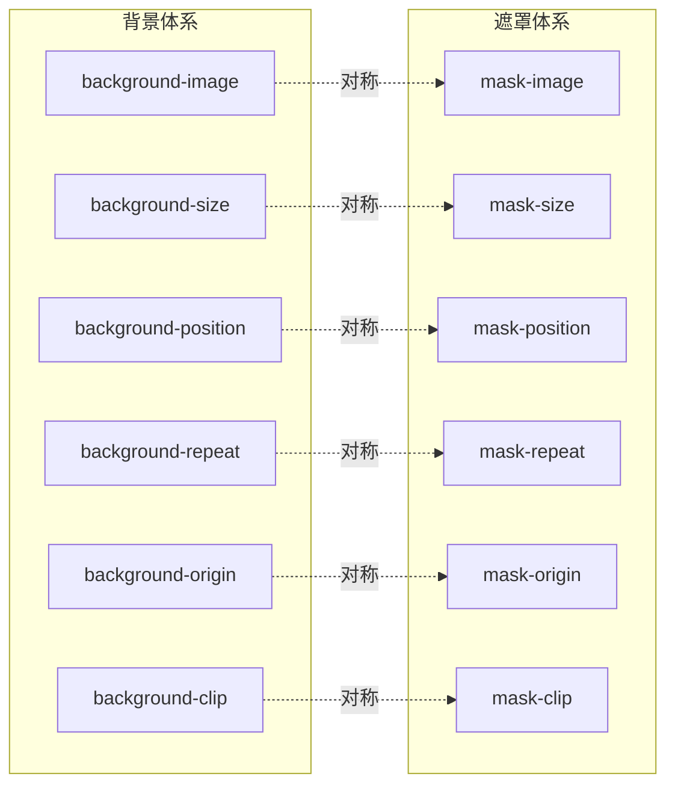
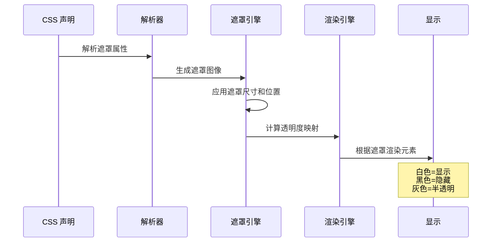
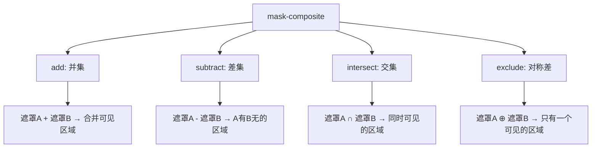

# 遮罩 Mask

CSS 遮罩（Mask）用于控制元素的**可见区域**——通过遮罩图像的透明度决定元素哪些部分显示、哪些部分隐藏。遮罩与背景（Background）在属性体系上高度对称，掌握背景就能快速掌握遮罩。

## 背景与动机

### 为什么需要遮罩

在 Web 开发中，经常需要对元素的可见区域进行精确控制：

1. **创意视觉效果**：实现非矩形的元素显示，如圆形头像、不规则卡片
2. **内容渐显**：创建柔和的淡入淡出效果，提升用户体验
3. **纹理遮罩**：使用图像或图案控制元素显示区域
4. **动态效果**：结合动画实现揭示、擦除等交互效果

传统方案依赖 PNG 透明图像或 SVG 裁切，存在以下问题：

- 需要额外的图像资源和网络请求
- 难以动态调整遮罩效果
- 无法实现渐变过渡的柔和边缘
- 维护成本高，修改效果需要重新制作图像

CSS 遮罩通过声明式语法解决了这些问题，让开发者能够：

- 使用纯 CSS 创建灵活的遮罩效果
- 支持渐变遮罩，实现柔和的透明度过渡
- 动态调整遮罩参数，无需重新制作资源
- 结合动画实现丰富的交互效果

### 遮罩的本质

遮罩的核心原理是**基于透明度的可见性控制**：

- **白色区域**：完全显示元素内容
- **黑色区域**：完全隐藏元素内容
- **灰色区域**：根据灰度值半透明显示（50% 灰色 = 50% 透明度）

这与背景（Background）形成对比：背景用图像**填充**元素，遮罩用图像的**透明度**控制元素的可见性。

## 核心概念

### 遮罩与背景的对称关系



遮罩属性体系与背景高度对称，语法和用法几乎完全一致：

| 背景属性 | 遮罩属性 | 作用 |
|---------|---------|------|
| `background-image` | `mask-image` | 定义图像源 |
| `background-size` | `mask-size` | 控制图像尺寸 |
| `background-position` | `mask-position` | 控制图像位置 |
| `background-repeat` | `mask-repeat` | 控制图像平铺 |
| `background-origin` | `mask-origin` | 定义坐标参考系 |
| `background-clip` | `mask-clip` | 定义裁切区域 |

### 遮罩类型

CSS 遮罩支持多种图像源：

1. **图片遮罩**：使用 PNG、JPG、SVG 等图像
2. **渐变遮罩**：使用线性、径向、锥形渐变（最常用）
3. **SVG 遮罩**：引用 SVG 中的 `<mask>` 元素
4. **多重遮罩**：叠加多个遮罩层，通过合成模式组合

### 遮罩工作流程



## 核心属性

### mask-image

定义遮罩图像源，支持图片、渐变、SVG 等多种来源。

```css
/* 图片遮罩 */
.mask-image {
  -webkit-mask-image: url("star.png");
  mask-image: url("star.png");
}

/* 渐变遮罩（最常用） */
.mask-gradient {
  -webkit-mask-image: linear-gradient(to right, #000, transparent);
  mask-image: linear-gradient(to right, #000, transparent);
}

/* 多重遮罩 */
.mask-multiple {
  -webkit-mask-image:
    linear-gradient(to right, #000 50%, transparent),
    linear-gradient(to bottom, #000 50%, transparent);
  mask-image:
    linear-gradient(to right, #000 50%, transparent),
    linear-gradient(to bottom, #000 50%, transparent);
}

/* SVG 遮罩 */
.mask-svg {
  -webkit-mask-image: url("mask.svg#mask-id");
  mask-image: url("mask.svg#mask-id");
}
```

### mask-size

控制遮罩图像的尺寸，语法与 `background-size` 完全一致。

```css
.mask-cover {
  -webkit-mask-size: cover;
  mask-size: cover;
}

.mask-contain {
  -webkit-mask-size: contain;
  mask-size: contain;
}

.mask-percentage {
  -webkit-mask-size: 50% 50%;
  mask-size: 50% 50%;
}
```

### mask-position

控制遮罩图像的起始位置，语法与 `background-position` 完全一致。

```css
.mask-center {
  -webkit-mask-position: center;
  mask-position: center;
}

.mask-custom {
  -webkit-mask-position: 20px 30px;
  mask-position: 20px 30px;
}
```

### mask-repeat

控制遮罩图像的平铺方式，语法与 `background-repeat` 完全一致。

```css
.mask-no-repeat {
  -webkit-mask-repeat: no-repeat;
  mask-repeat: no-repeat;
}
```

### mask-composite

多重遮罩的合成算法，决定多个遮罩层如何叠加。这是遮罩体系最复杂也是最有表现力的属性。



| 值 | 标准 `mask-composite` | WebKit `-webkit-mask-composite` | 效果 |
|----|----------------------|--------------------------------|------|
| add | `add` | `source-over` | 并集：两个遮罩合并 |
| subtract | `subtract` | `source-out` | 差集：第一个遮罩减去第二个 |
| intersect | `intersect` | `source-in` | 交集：只保留重叠区域 |
| exclude | `exclude` | `xor` | 对称差：去掉重叠区域 |

> **兼容性注意**：标准属性与 WebKit 前缀的值名不同，需要同时写两套。

```css
.mask-composite-example {
  -webkit-mask-image:
    radial-gradient(circle at 30% 50%, #000 50px, transparent 50px),
    radial-gradient(circle at 70% 50%, #000 50px, transparent 50px);
  -webkit-mask-composite: exclude;  /* WebKit */
  mask-image:
    radial-gradient(circle at 30% 50%, #000 50px, transparent 50px),
    radial-gradient(circle at 70% 50%, #000 50px, transparent 50px);
  mask-composite: exclude;  /* 标准 */
}
```

## 连写属性

`mask` 连写属性的语法与 `background` 完全一致：

```css
.mask-shorthand {
  -webkit-mask: url("star.png") no-repeat center / contain;
  mask: url("star.png") no-repeat center / contain;
}
```

连写顺序：`mask-image mask-position / mask-size mask-repeat`

## 实战案例

### 图片淡入淡出效果

利用线性渐变遮罩实现图片从左到右的渐显效果：

```css
.fade-image {
  -webkit-mask-image: linear-gradient(to right, transparent, #000 20%, #000 80%, transparent);
  mask-image: linear-gradient(to right, transparent, #000 20%, #000 80%, transparent);
}
```

### 文字遮罩效果

利用文字作为遮罩，背景图片只在文字区域显示：

```css
.text-mask {
  -webkit-mask-image: linear-gradient(#000, #000); /* 基础遮罩 */
  /* 更复杂的文字遮罩需要配合 SVG <text> 作为 mask */
}

/* 推荐方案：background-clip: text */
.text-clip {
  background: url("bg.jpg") center / cover;
  -webkit-background-clip: text;
  background-clip: text;
  -webkit-text-fill-color: transparent;
  color: transparent;
  font-size: 80px;
  font-weight: 900;
}
```

### 不规则形状裁切

利用渐变遮罩裁出圆形、菱形等非矩形区域：

```css
/* 圆形裁切 */
.mask-circle {
  -webkit-mask-image: radial-gradient(circle, #000 50%, transparent 50%);
  mask-image: radial-gradient(circle, #000 50%, transparent 50%);
}

/* 菱形裁切 */
.mask-diamond {
  -webkit-mask-image: linear-gradient(45deg, transparent 30%, #000 30%, #000 70%, transparent 70%),
    linear-gradient(-45deg, transparent 30%, #000 30%, #000 70%, transparent 70%);
  -webkit-mask-composite: source-in; /* WebKit 值名与标准不同：intersect → source-in */
  mask-image: linear-gradient(45deg, transparent 30%, #000 30%, #000 70%, transparent 70%),
    linear-gradient(-45deg, transparent 30%, #000 30%, #000 70%, transparent 70%);
  mask-composite: intersect;
}
```

### 瀑布流加载占位渐显

卡片加载完成时从底部渐显内容：

```css
.card-reveal {
  -webkit-mask-image: linear-gradient(to bottom, #000 70%, transparent);
  mask-image: linear-gradient(to bottom, #000 70%, transparent);
  transition: -webkit-mask-image 0.5s;
  transition: mask-image 0.5s;
}

.card-reveal.loaded {
  -webkit-mask-image: linear-gradient(to bottom, #000);
  mask-image: linear-gradient(to bottom, #000);
}
```

### mask 与 clip-path 对比

| 特性 | `mask` | `clip-path` |
|------|--------|-------------|
| 裁切方式 | 基于图像透明度 | 基于几何路径 |
| 支持渐变 | 支持（半透明过渡） | 不支持（硬边界） |
| 支持图片 | 支持 | 不支持 |
| 可过渡动画 | 部分支持 | 支持（`path()` 动画） |
| 性能 | 较低（需要光栅化遮罩） | 较高（几何计算） |
| 适用场景 | 柔和过渡、纹理遮罩 | 精确几何裁切、动画变形 |

### clip-path 深度解析

`clip-path` 通过几何路径裁切元素的可见区域，与 `mask` 不同，它只支持硬边界裁切，但性能更优且支持动画。

#### 基本形状函数

**circle()** — 圆形裁切

```css
/* 语法：circle(<radius> at <x> <y>) */
.clip-circle {
  clip-path: circle(50% at center);         /* 正圆 */
  clip-path: circle(50px at 30% 70%);       /* 指定半径和圆心 */
  clip-path: circle(closest-side at 25% 25%);  /* 半径取最近边 */
}

/* 头像圆形裁切 */
.avatar {
  clip-path: circle(50%);
}
```

**ellipse()** — 椭圆裁切

```css
/* 语法：ellipse(<rx> <ry> at <x> <y>) */
.clip-ellipse {
  clip-path: ellipse(50% 30% at center);
  clip-path: ellipse(100px 60px at 50% 50%);
}
```

**inset()** — 矩形内缩裁切

```css
/* 语法：inset(<top> <right> <bottom> <left> round <border-radius>) */
.clip-inset {
  clip-path: inset(10px);                         /* 四边内缩 10px */
  clip-path: inset(10px 20px 10px 20px);          /* 分别指定 */
  clip-path: inset(20px 20px 20px 20px round 10px); /* 带圆角 */
}

/* 切角效果 */
.clip-notch {
  clip-path: polygon(
    20px 0, calc(100% - 20px) 0,
    100% 20px, 100% calc(100% - 20px),
    calc(100% - 20px) 100%, 20px 100%,
    0 calc(100% - 20px), 0 20px
  );
}
```

**polygon()** — 多边形裁切

```css
/* 三角形 */
.clip-triangle {
  clip-path: polygon(50% 0, 0 100%, 100% 100%);
}

/* 多边形裁切 */
.clip-pentagon {
  clip-path: polygon(50% 0%, 100% 38%, 82% 100%, 18% 100%, 0% 38%);
}

/* 菱形 */
.clip-diamond {
  clip-path: polygon(50% 0, 100% 50%, 50% 100%, 0 50%);
}

/* 五角星 */
.clip-star {
  clip-path: polygon(
    50% 0%, 61% 35%, 98% 35%, 68% 57%,
    79% 91%, 50% 70%, 21% 91%, 32% 57%,
    2% 35%, 39% 35%
  );
}

/* 箭头 */
.clip-arrow {
  clip-path: polygon(0 20%, 60% 20%, 60% 0, 100% 50%, 60% 100%, 60% 80%, 0 80%);
}

/* 消息气泡 */
.clip-message {
  clip-path: polygon(0% 0%, 100% 0%, 100% 75%, 75% 75%, 75% 100%, 50% 75%, 0% 75%);
}
```

#### clip-path vs mask 对比（扩展）

| 特性 | `clip-path` | `mask` |
|------|-------------|--------|
| 裁切方式 | 几何路径（硬边界） | 图像透明度（软边界） |
| 半透明过渡 | 不支持 | 支持 |
| 支持图片 | 不支持 | 支持 |
| 支持渐变 | 不支持 | 支持（渐变遮罩） |
| CSS 动画 | 支持（同顶点数可过渡） | 有限支持 |
| 性能 | 高（GPU 几何计算） | 较低（需要光栅化遮罩） |
| SVG 引用 | `clip-path: url(#id)` | `mask: url(#id)` |
| 事件穿透 | 裁切区域外不响应事件 | 裁切区域外不响应事件 |
| 适用场景 | 几何形状裁切、形变动画 | 柔和过渡、纹理遮罩、渐显 |

> **选择建议**：需要硬边界几何裁切或形变动画时用 `clip-path`；需要柔和过渡或纹理效果时用 `mask`。

#### clip-path 动画

`clip-path` 在两个状态之间过渡的条件是：**前后形状函数相同，且顶点数量相同**。

```css
/* 圆形展开动画 */
.reveal-circle {
  clip-path: circle(0% at center);
  transition: clip-path 0.6s ease;
}

.reveal-circle:hover {
  clip-path: circle(75% at center);
}

/* 多边形变形动画（同顶点数） */
.morph-shape {
  clip-path: polygon(50% 0%, 100% 50%, 50% 100%, 0% 50%);
  transition: clip-path 0.4s ease;
}

.morph-shape:hover {
  clip-path: polygon(100% 0%, 100% 100%, 0% 100%, 0% 0%);
}

/* inset 展开动画 */
.reveal-inset {
  clip-path: inset(50% 50% 50% 50%);
  transition: clip-path 0.5s cubic-bezier(0.4, 0, 0.2, 1);
}

.reveal-inset:hover {
  clip-path: inset(0% 0% 0% 0%);
}
```

> **动画要点**：`polygon()` 前后状态的顶点数必须一致；`circle()` 和 `inset()` 天然可过渡；`ellipse()` 同样可过渡。

#### clip-path: url() — 引用 SVG clipPath

当基本形状函数无法满足复杂裁切需求时，可以引用 SVG `<clipPath>` 元素实现任意路径裁切。

```html
<svg width="0" height="0" style="position:absolute">
  <defs>
    <!-- 波浪形裁切路径 -->
    <clipPath id="wave-clip" clipPathUnits="objectBoundingBox">
      <path d="M0,0.8 C0.25,1 0.25,0.6 0.5,0.8 S0.75,0.6 1,0.8 L1,1 L0,1 Z" />
    </clipPath>

    <!-- 文字形裁切 -->
    <clipPath id="text-clip">
      <text x="0" y="100" font-size="120" font-weight="900">CSS</text>
    </clipPath>
  </defs>
</svg>
```

```css
/* 引用 SVG clipPath */
.wave-section {
  clip-path: url(#wave-clip);
}

.text-shaped {
  clip-path: url(#text-clip);
}
```

> **注意**：`clipPathUnits="objectBoundingBox"` 时坐标为 0-1 的相对值；`clipPathUnits="userSpaceOnUse"`（默认）时坐标为绝对像素值。引用外部 SVG 文件的路径需要同源：`clip-path: url(mask.svg#clip-id)`。

## 参考资源

### 规范文档

| 资源 | 链接 | 说明 |
|------|------|------|
| CSS Masking Module Level 1 | https://www.w3.org/TR/css-masking-1/ | 遮罩规范文档 |
| CSS Shapes Module Level 1 | https://www.w3.org/TR/css-shapes-1/ | 形状规范文档 |
| MDN: mask | https://developer.mozilla.org/zh-CN/docs/Web/CSS/mask | 遮罩使用指南 |
| MDN: clip-path | https://developer.mozilla.org/zh-CN/docs/Web/CSS/clip-path | 裁切路径指南 |

### 工具与资源

| 工具 | 链接 | 说明 |
|------|------|------|
| Clippy | https://bennettfeely.com/clippy/ | clip-path 生成器 |
| CSS Mask Generator | https://cssmask.com/ | 遮罩效果生成器 |
| Shape Divider | https://www.shapedivider.app/ | 形状分隔符生成器 |
| Can I Use | https://caniuse.com/css-masks | 浏览器兼容性查询 |

### 进阶阅读

- [Clipping and Masking in CSS](https://css-tricks.com/clipping-masking-css/) - CSS-Tricks 完整教程
- [CSS Masking](https://developer.mozilla.org/en-US/docs/Web/CSS/CSS_Masking) - MDN 遮罩模块
- [Creative CSS Shapes](https://smashingmagazine.com/creative-css-shapes) - Smashing Magazine 创意设计
