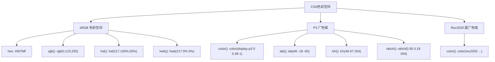
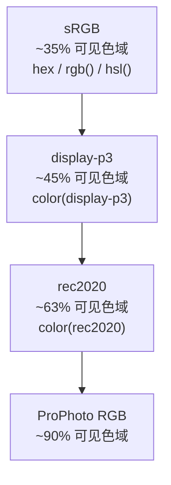
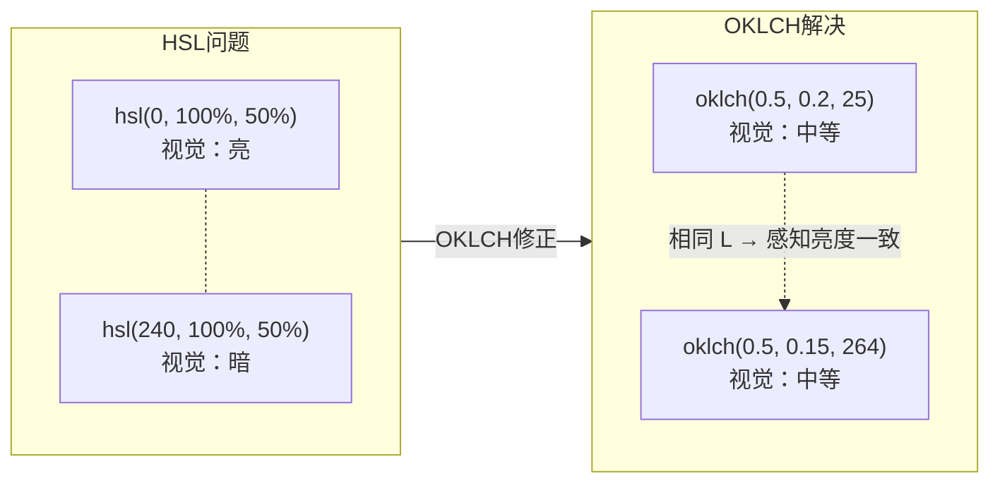

# 现代 CSS 色彩体系

CSS 色彩系统正在经历从 sRGB 到感知均匀色彩空间的根本性转变。OKLCH、display-p3 等新色彩空间解决了传统 HSL 在感知均匀性上的缺陷，为设计系统和高对比度无障碍适配提供了坚实基础。

## 背景与动机

### 传统色彩系统的局限

CSS 色彩系统经历了从简单到复杂的演进过程：

**CSS1-3 时代：sRGB 色彩空间**

- 使用 `hex`、`rgb()`、`hsl()` 表示颜色
- 基于 sRGB 色彩空间，色域有限（仅覆盖约 35% 可见色域）
- HSL 色彩模型存在感知不均匀问题
- 无法充分利用现代显示器的广色域能力

**核心问题**：

1. **感知不均匀**：HSL 中相同亮度值（L）的颜色，视觉感知亮度差异巨大
   - `hsl(0, 100%, 50%)` 红色看起来较亮
   - `hsl(240, 100%, 50%)` 蓝色看起来较暗
   - 这导致调整亮度时色相偏移，设计系统难以保持一致性

2. **色域限制**：sRGB 无法表示鲜艳的绿色、蓝紫色等颜色
   - 现代显示器（P3、Rec2020）可以显示更鲜艳的颜色
   - sRGB 限制了设计表现力

3. **色彩混合不自然**：在 sRGB 空间内混合颜色，过渡不自然
   - 红色和蓝色混合产生灰紫色，而非自然的品红过渡
   - 渐变效果不够平滑

### 现代色彩系统的需求

随着硬件和设计的进步，需要新的色彩系统：

1. **感知均匀性**：调整亮度时保持色相稳定
2. **广色域支持**：充分利用 P3、Rec2020 等广色域显示器
3. **动态色彩计算**：支持色彩混合、对比度计算等高级功能
4. **无障碍适配**：自动满足 WCAG 对比度标准

## 核心概念

### 色彩空间演进



### 色彩空间对比

| 时代 | 色彩空间 | 特点 | 问题 |
|------|----------|------|------|
| CSS1-3 | sRGB (hex/rgb/hsl) | 通用兼容 | 感知不均匀、色域有限 |
| CSS Color 4 | lab/lch/oklch/oklab | 感知均匀 | 需要新语法 |
| CSS Color 4 | display-p3 | 广色域 | 仅限支持硬件 |
| CSS Color 5 | color-mix/color-contrast | 动态混合 | 浏览器支持中 |

### 色彩空间层次



## 深度原理：sRGB 格式回顾

### hex 十六进制

```css
/* 3位简写 */
color: #f00;       /* red */

/* 6位完整 */
color: #ff0000;    /* red */

/* 8位带透明度 */
color: #ff000080;  /* red, 50% 透明度 */
```

### rgb()

```css
/* 传统语法 */
color: rgb(255, 0, 0);
color: rgba(255, 0, 0, 0.5);

/* 现代语法——空格分隔，斜杠表示透明度 */
color: rgb(255 0 0);
color: rgb(255 0 0 / 50%);
```

### hsl()

```css
/* 传统语法 */
color: hsl(0, 100%, 50%);
color: hsla(0, 100%, 50%, 0.5);

/* 现代语法 */
color: hsl(0deg 100% 50%);
color: hsl(0 100% 50% / 50%);

/* 色相支持角度单位 */
color: hsl(0.5turn 100% 50%);  /* 半圈 = 180deg */
color: hsl(200grad 100% 50%);  /* 200grad = 180deg */
```

### hwb()

HWB（Hue-Whiteness-Blackness）是 HSL 的替代表示，更直观：

```css
color: hwb(0deg 0% 0%);      /* 纯红 */
color: hwb(0deg 20% 0%);     /* 浅红（混入20%白） */
color: hwb(0deg 0% 20%);     /* 深红（混入20%黑） */
color: hwb(0deg 20% 20% / 50%); /* 半透明浅深红 */
```

## 深度原理：CIELAB 色彩空间

### lab()

基于人类视觉感知的 CIE L*a*b* 色彩空间，L 为亮度，a 为绿-红轴，b 为蓝-黄轴：

```css
color: lab(46 -18 -65);        /* 纯蓝 */
color: lab(75 30 50);          /* 鲜艳橙色 */
color: lab(46 -18 -65 / 50%);  /* 半透明蓝 */
```

| 参数 | 范围 | 含义 |
|------|------|------|
| L | 0-100（或%） | 亮度：0=黑，100=白 |
| a | -125~125 | 绿(-) ↔ 红(+) |
| b | -125~125 | 蓝(-) ↔ 黄(+) |

### lch()

LCH 是 Lab 的极坐标形式——L 为亮度，C 为色度（饱和度），H 为色相角度：

```css
color: lch(46 67 254);        /* 纯蓝 */
color: lch(75 58 59);         /* 鲜艳橙色 */
color: lch(46 67 254 / 50%);  /* 半透明蓝 */
```

> LCH 比 Lab 更直观——色度和色相独立控制，调整饱和度不影响色相。

## 深度原理：OKLCH 与 OKLAB

OKLCH/OKLAB 是对 Lab/LCH 的修正，解决了 Lab 在蓝色色相偏移和感知均匀性上的缺陷。

### 为什么 OKLCH 优于 HSL

```css
/* HSL：相同亮度50%，但视觉亮度差异巨大 */
hsl(0deg 100% 50%);    /* 红色——视觉较亮 */
hsl(240deg 100% 50%);  /* 蓝色——视觉较暗 */

/* OKLCH：相同亮度0.5，视觉亮度一致 */
oklch(0.5 0.2 25);     /* 红色——视觉中等 */
oklch(0.5 0.15 264);   /* 蓝色——视觉中等 */
```



### oklch() 语法

```css
color: oklch(L C H);
color: oklch(L C H / alpha);

/* 实例 */
color: oklch(0.63 0.24 25);      /* 红色 */
color: oklch(0.45 0.15 264);     /* 蓝色 */
color: oklch(0.95 0.02 100);     /* 浅黄 */
color: oklch(0.63 0.24 25 / 50%); /* 半透明红 */
```

| 参数 | 范围 | 含义 |
|------|------|------|
| L | 0-1（或0%-100%） | 感知亮度 |
| C | 0-0.4（约） | 色度（饱和度），0=灰色 |
| H | 0-360（度） | 色相角度 |

### oklab() 语法

```css
color: oklab(L a b);
color: oklab(0.63 0.22 0.08);     /* 红色 */
color: oklab(0.45 -0.03 -0.15);   /* 蓝色 */
```

### 设计系统实战

```css
:root {
  /* OKLCH 设计令牌——感知均匀的色阶 */
  --blue-50:  oklch(0.97 0.02 250);
  --blue-100: oklch(0.93 0.04 250);
  --blue-200: oklch(0.85 0.08 250);
  --blue-300: oklch(0.75 0.12 250);
  --blue-400: oklch(0.65 0.16 250);
  --blue-500: oklch(0.55 0.20 250);
  --blue-600: oklch(0.45 0.18 250);
  --blue-700: oklch(0.37 0.15 250);
  --blue-800: oklch(0.30 0.12 250);
  --blue-900: oklch(0.25 0.08 250);
}

/* 亮度均匀递减——视觉感知一致 */
.btn-primary   { background: var(--blue-500); }
.btn-primary:hover { background: var(--blue-600); }
```


#### color-scheme 交互演示（MDN）

声明页面支持的颜色方案（light/dark），让表单控件与滚动条跟随系统主题。

```html
<!DOCTYPE html>
<html lang="zh-CN">
  <head>
    <meta charset="UTF-8" />
    <meta name="viewport" content="width=device-width, initial-scale=1.0" />
    <title>color-scheme 属性演示 - MDN 示例</title>
    <meta name="description" content="视觉与颜色示例：color（scheme 属性演示）。" />
    <style>
      * {
        margin: 0;
        padding: 0;
        box-sizing: border-box;
      }
      body {
        font-family: -apple-system, BlinkMacSystemFont, "Segoe UI", Roboto, "Helvetica Neue", Arial, sans-serif;
        min-height: 100vh;
        padding: 0;
      }
      .demo-layout {
        display: flex;
        height: 100vh;
        gap: 0;
      }
      .snippet-panel {
        width: 320px;
        flex-shrink: 0;
        padding: 16px;
        display: flex;
        flex-direction: column;
        gap: 8px;
        overflow-y: auto;
        border-right: 1px solid #ddd;
        background: #fafafa;
      }
      .snippet-btn {
        padding: 10px 14px;
        border: 1px solid #ccc;
        border-radius: 6px;
        background: #fff;
        font-family: "JetBrains Mono", "Fira Code", monospace;
        font-size: 13px;
        color: #333;
        cursor: pointer;
        text-align: left;
        transition: all 0.2s;
        line-height: 1.4;
      }
      .snippet-btn:hover {
        border-color: #8083ff;
        background: #f0f0ff;
      }
      .snippet-btn.active {
        border-color: #8083ff;
        background: #e8e8ff;
        color: #571bc1;
        font-weight: 600;
      }
      .preview-panel {
        flex: 1;
        padding: 16px;
        display: flex;
        align-items: center;
        justify-content: center;
        background: #fff;
        overflow: auto;
      }
      .preview-panel > section,
      .preview-panel > div:not(.snippet-panel):not(.demo-layout) {
        flex: 1;
        width: 100%;
        min-height: 0;
        height: 100%;
        display: flex;
        align-items: center;
        justify-content: center;
      }
      #example-element {
        width: 80%;
        height: 50%;
      }
    </style>
  </head>
  <body>
    <div class="demo-layout">
      <div class="snippet-panel">
        <button class="snippet-btn active" data-index="0">color-scheme: normal;</button>
        <button class="snippet-btn" data-index="1">color-scheme: dark;</button>
        <button class="snippet-btn" data-index="2">color-scheme: light;</button>
      </div>
      <div class="preview-panel">
        <section class="default-example container" id="default-example">
          <textarea id="example-element">Text Area</textarea>
        </section>
      </div>
    </div>
    <script>
      const snippets = [
        `#example-element {
  color-scheme: normal;
}`,
        `#example-element {
  color-scheme: dark;
}`,
        `#example-element {
  color-scheme: light;
}`,
      ];

      let styleEl = document.createElement("style");
      document.head.appendChild(styleEl);

      function applySnippet(index) {
        styleEl.textContent = snippets[index];
        document.querySelectorAll(".snippet-btn").forEach((btn, i) => {
          btn.classList.toggle("active", i === index);
        });
      }

      document.querySelectorAll(".snippet-btn").forEach((btn) => {
        btn.addEventListener("click", () => applySnippet(parseInt(btn.dataset.index)));
      });

      applySnippet(0);
    </script>
  </body>
</html>

```
## HD 广色域

display-p3 色彩空间比 sRGB 大约大 25%，能呈现更鲜艳的绿色和蓝紫色。

### color() 函数

```css
/* display-p3 色彩 */
color: color(display-p3 0 0.48 1);     /* P3 纯蓝——sRGB无法表示 */
color: color(display-p3 0 1 0);        /* P3 纯绿 */
color: color(display-p3 1 0 0.5);      /* P3 品红 */

/* 带透明度 */
color: color(display-p3 0 0.48 1 / 50%);

/* rec2020 超广色域 */
color: color(rec2020 0 0.5 1);
```

### 色域检测与渐进增强

```css
/* 默认使用 sRGB */
.vibrant-green {
  background: hsl(140 100% 45%);
}

/* 广色域显示器使用 display-p3 */
@media (color-gamut: p3) {
  .vibrant-green {
    background: color(display-p3 0.3 1 0.1);
  }
}

/* 超广色域 */
@media (color-gamut: rec2020) {
  .vibrant-green {
    background: color(rec2020 0.22 1 0.05);
  }
}
```

## color-contrast()

`color-contrast()` 从候选颜色中选择与背景色对比度最高的颜色，是自动满足 WCAG 无障碍标准的利器。

```css
/* 在白色背景上选择对比度最高的文字颜色 */
.text-on-light {
  background: white;
  color: color-contrast(white vs black, gray, blue);
  /* 选择 black——与白色对比度最高 */
}

/* 在深色背景上选择对比度最高的文字颜色 */
.text-on-dark {
  background: #1a1a2e;
  color: color-contrast(#1a1a2e vs white, lightgray, yellow);
  /* 选择 white——与深色对比度最高 */
}

/* 指定最低对比度目标 */
.accessible-text {
  color: color-contrast(white vs black, blue to AA);
  /* 选择满足 WCAG AA 标准(4.5:1)的颜色 */
}
```

> **注意**：`color-contrast()` 目前仅在 Safari 技术预览版中支持，尚处于实验阶段。

## 色彩空间迁移指南

### HSL → OKLCH

```css
/* HSL：调整亮度时色相偏移 */
.button {
  background: hsl(250 100% 50%);
}
.button:hover {
  background: hsl(250 100% 40%); /* 变暗时可能偏紫 */
}

/* OKLCH：调整亮度时色相稳定 */
.button {
  background: oklch(0.55 0.2 270);
}
.button:hover {
  background: oklch(0.45 0.2 270); /* 变暗时色相不变 */
}
```

### hex → color(display-p3)

```css
/* 渐进增强方案 */
.accent {
  --accent: #007bff;                    /* sRGB 回退 */
  --accent: color(display-p3 0 0.48 1); /* P3 增强（覆盖上面的值） */
  background: var(--accent);
}
```

## 浏览器兼容性

| 特性 | Chrome | Firefox | Safari | Edge |
|------|--------|---------|--------|------|
| `hwb()` | 101+ | 99+ | 15+ | 101+ |
| `lab()` / `lch()` | 111+ | 113+ | 15.4+ | 111+ |
| `oklch()` / `oklab()` | 111+ | 113+ | 15.4+ | 111+ |
| `color(display-p3)` | 111+ | 113+ | 15.4+ | 111+ |
| `color-mix()` | 111+ | 113+ | 16.2+ | 111+ |
| `color-contrast()` | 不支持 | 不支持 | 技术预览版 | 不支持 |
| `color-gamut` 媒体查询 | 111+ | 113+ | 15+ | 111+ |

## 参考资源

- [MDN: CSS Color](https://developer.mozilla.org/zh-CN/docs/Web/CSS/color_value)
- [CSS Color Module Level 4](https://www.w3.org/TR/css-color-4/)
- [CSS Color Module Level 5](https://www.w3.org/TR/css-color-5/)
- [OKLCH in CSS](https://oklch.com/)

