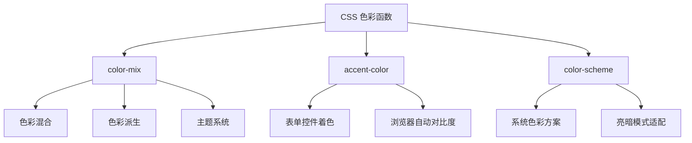
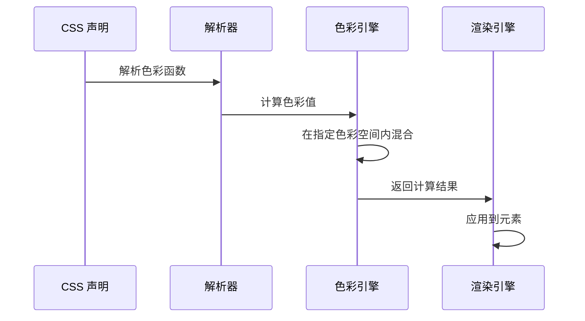
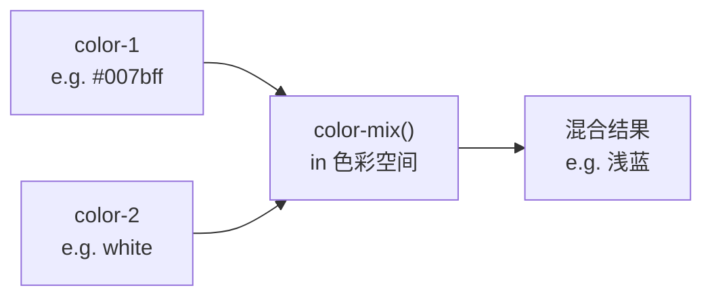

# CSS 色彩函数

CSS Color Level 5 引入了 `color-mix()` 等色彩函数，配合 `accent-color` 和 `color-scheme`，让 CSS 具备了动态色彩计算和主题化能力——无需预处理器或 JavaScript 即可派生完整色彩系统。

## 背景与动机

### 传统色彩管理的痛点

在 CSS 预处理器时代，色彩派生依赖 Sass/Less 等工具：

```scss
// Sass 示例
$brand: #007bff;
$brand-light: lighten($brand, 20%);
$brand-dark: darken($brand, 20%);
```

**问题**：

1. **编译时固定**：色彩派生在编译时完成，无法动态调整
2. **色彩空间限制**：Sass 在 sRGB 空间内计算，混合结果不自然
3. **主题切换困难**：暗色模式需要预定义所有色彩变量
4. **运行时无法计算**：无法根据用户偏好或上下文动态调整色彩

### 现代色彩函数的需求

CSS 原生色彩函数解决了这些问题：

1. **运行时计算**：浏览器实时计算色彩，支持动态调整
2. **感知均匀混合**：在 OKLCH 等空间内混合，过渡更自然
3. **主题化能力**：通过 CSS 变量和色彩函数构建灵活的主题系统
4. **无障碍适配**：自动满足对比度要求，支持系统级色彩方案

## 核心概念

### 色彩函数体系



### 色彩函数工作流程



## 深度原理：color-mix()

### 基本语法

```css
color-mix(in <color-space>, <color-1> [<percentage>], <color-2> [<percentage>])
```



| 参数 | 说明 |
|------|------|
| `in <color-space>` | 混合色彩空间：srgb、srgb-linear、lab、oklab、xyz、xyz-d50、xyz-d65、hsl、hwb、lch、oklch |
| `<color-1>` | 第一种颜色 |
| `<percentage-1>` | 第一种颜色的占比，默认 50% |
| `<color-2>` | 第二种颜色 |
| `<percentage-2>` | 第二种颜色的占比，默认 50% |

> 两个百分比之和不必等于 100%——如果总和小于 100%，结果透明度按比例降低；如果总和大于 100%，颜色等比归一化。

### sRGB 内混合

```css
/* 50/50 混合红蓝 → 紫色 */
color-mix(in srgb, red, blue);

/* 75% 红 + 25% 蓝 → 偏红紫 */
color-mix(in srgb, red 75%, blue);

/* 混合白色创建浅色变体 */
color-mix(in srgb, #007bff, white);

/* 混合黑色创建深色变体 */
color-mix(in srgb, #007bff, black);
```

### OKLCH 内混合

OKLCH 混合在感知上更均匀——色相过渡更自然：

```css
/* OKLCH 混合——色相平滑过渡 */
color-mix(in oklch, red, blue);     /* 经过品红的自然过渡 */
color-mix(in srgb, red, blue);      /* 经过灰紫的非自然过渡 */

/* 在 oklch 中仅混合亮度——色相/色度不变 */
color-mix(in oklch, oklch(0.7 0.15 250), oklch(0.3 0.15 250));
/* 结果：oklch(0.5 0.15 250)——亮度平均，色相不变 */
```

### 色彩空间对混合的影响

```css
/* srgb：红→蓝经过灰色 */
background: linear-gradient(to right, red, color-mix(in srgb, red, blue), blue);

/* oklch：红→蓝经过品红 */
background: linear-gradient(to right, red, color-mix(in oklch, red, blue), blue);

/* hsl：红→蓝色相旋转 */
background: linear-gradient(to right, red, color-mix(in hsl, red, blue), blue);
```

### 设计令牌派生

```css
:root {
  --brand: oklch(0.55 0.2 270);

  /* 亮色变体 */
  --brand-light: color-mix(in oklch, var(--brand), white 30%);
  --brand-lighter: color-mix(in oklch, var(--brand), white 60%);

  /* 暗色变体 */
  --brand-dark: color-mix(in oklch, var(--brand), black 30%);
  --brand-darker: color-mix(in oklch, var(--brand), black 60%);

  /* 半透明变体 */
  --brand-faded: color-mix(in oklch, var(--brand), transparent 70%);

  /* 表面着色 */
  --surface-brand: color-mix(in oklch, var(--brand), white 90%);
}

.button {
  background: var(--brand);
  border: 1px solid var(--brand-dark);
}
.button:hover {
  background: var(--brand-light);
}
.button:focus-visible {
  box-shadow: 0 0 0 3px var(--brand-faded);
}

.alert-brand {
  background: var(--surface-brand);
  color: var(--brand-dark);
  border-left: 4px solid var(--brand);
}
```

### 暗色模式

```css
:root {
  --brand: oklch(0.55 0.2 270);
}

@media (prefers-color-scheme: dark) {
  :root {
    --brand: oklch(0.65 0.18 270); /* 暗色模式下略亮 */
  }
}

/* 或者用 color-mix 直接派生暗色变体 */
.dark-mode .card {
  background: color-mix(in oklch, var(--brand), black 80%);
  color: color-mix(in oklch, var(--brand), white 20%);
}
```

## accent-color

`accent-color` 为表单控件（checkbox、radio、range、progress）指定主题强调色，浏览器自动处理亮暗状态和对比度。

### 语法

```css
accent-color: <color> | auto;
```

### 实战

```css
/* 品牌化表单控件 */
:root {
  --brand: oklch(0.55 0.2 270);
  accent-color: var(--brand);
}

/* 仅对特定控件设置 */
input[type="checkbox"] {
  accent-color: #28a745; /* 绿色复选框 */
}

input[type="range"] {
  accent-color: #dc3545; /* 红色滑块 */
}

progress {
  accent-color: #ffc107; /* 黄色进度条 */
}

/* 恢复浏览器默认 */
input[type="radio"] {
  accent-color: auto;
}
```

> **关键特性**：浏览器会自动确保控件在 `accent-color` 下保持可见性和对比度——浅色背景自动使用深色边框/对勾，深色背景自动反转。

## color-scheme

`color-scheme` 告诉浏览器当前页面支持的色彩方案（亮/暗），影响表单控件、滚动条、系统级UI元素的默认外观。

### 语法

```css
color-scheme: normal | light | dark | light dark;
```

### 实战

```css
/* 支持亮色和暗色——浏览器自动适配 */
:root {
  color-scheme: light dark;
}

/* 仅亮色 */
.light-only {
  color-scheme: light;
}

/* 仅暗色 */
.dark-only {
  color-scheme: dark;
}
```

```html
<!-- HTML meta 标签方式——更早生效 -->
<meta name="color-scheme" content="light dark">
```

### 与 prefers-color-scheme 配合

```css
:root {
  color-scheme: light dark;

  --bg: #fff;
  --text: #333;
}

@media (prefers-color-scheme: dark) {
  :root {
    --bg: #1a1a2e;
    --text: #e0e0e0;
  }
}

body {
  background: var(--bg);
  color: var(--text);
}
```

## 组合实战：完整主题系统

```css
:root {
  /* 品牌色 */
  --brand: oklch(0.55 0.2 270);

  /* 派生色阶 */
  --brand-50:  color-mix(in oklch, var(--brand), white 92%);
  --brand-100: color-mix(in oklch, var(--brand), white 80%);
  --brand-200: color-mix(in oklch, var(--brand), white 60%);
  --brand-300: color-mix(in oklch, var(--brand), white 40%);
  --brand-400: color-mix(in oklch, var(--brand), white 20%);
  --brand-500: var(--brand);
  --brand-600: color-mix(in oklch, var(--brand), black 20%);
  --brand-700: color-mix(in oklch, var(--brand), black 40%);
  --brand-800: color-mix(in oklch, var(--brand), black 60%);
  --brand-900: color-mix(in oklch, var(--brand), black 80%);

  /* 系统配置 */
  color-scheme: light dark;
  accent-color: var(--brand);

  /* 语义色 */
  --surface: #fff;
  --text: #1a1a2e;
  --border: color-mix(in oklch, var(--brand), black 85%);
}

@media (prefers-color-scheme: dark) {
  :root {
    --brand: oklch(0.65 0.18 270);
    --surface: #1a1a2e;
    --text: #e0e0e0;
    --border: color-mix(in oklch, var(--brand), white 80%);
  }
}

/* 组件直接使用 */
.card {
  background: var(--surface);
  color: var(--text);
  border: 1px solid var(--border);
}

.btn-primary {
  background: var(--brand-500);
  color: white;
}
.btn-primary:hover {
  background: var(--brand-400);
}
.btn-primary:active {
  background: var(--brand-600);
}
```

## 浏览器兼容性

| 特性 | Chrome | Firefox | Safari | Edge |
|------|--------|---------|--------|------|
| `color-mix()` | 111+ | 113+ | 16.2+ | 111+ |
| `accent-color` | 93+ | 92+ | 15.4+ | 93+ |
| `color-scheme` | 81+ | 96+ | 13+ | 81+ |

## 参考资源

- [MDN: color-mix()](https://developer.mozilla.org/zh-CN/docs/Web/CSS/color_value/color-mix)
- [MDN: accent-color](https://developer.mozilla.org/zh-CN/docs/Web/CSS/accent-color)
- [CSS Color Module Level 5](https://www.w3.org/TR/css-color-5/)
