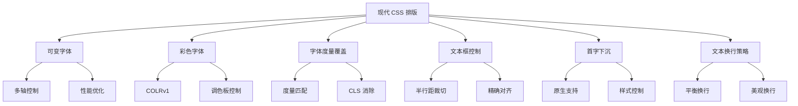
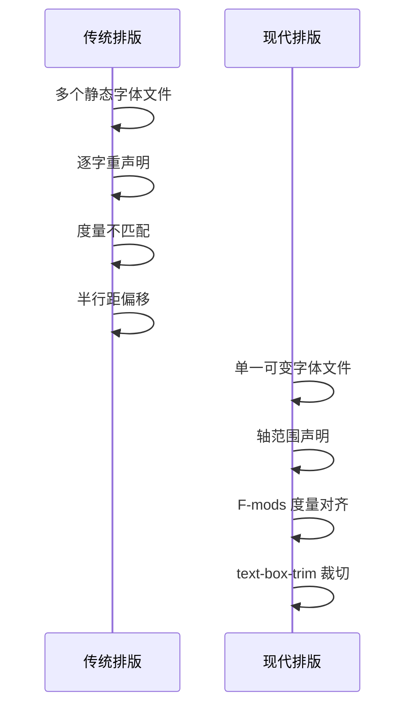
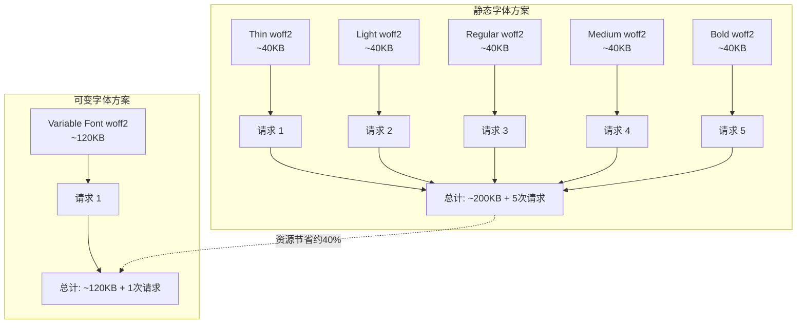
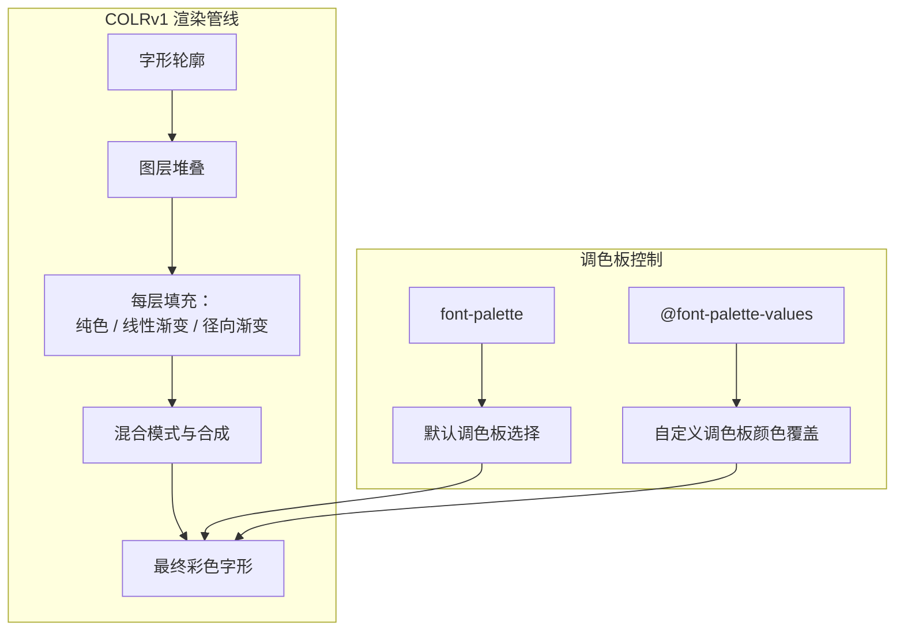
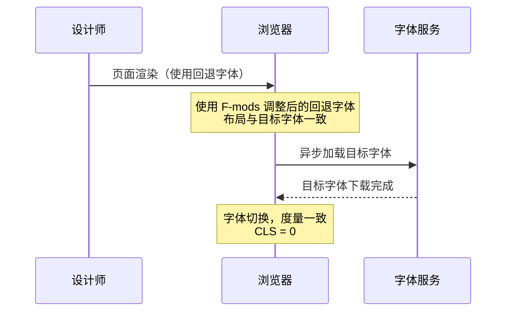
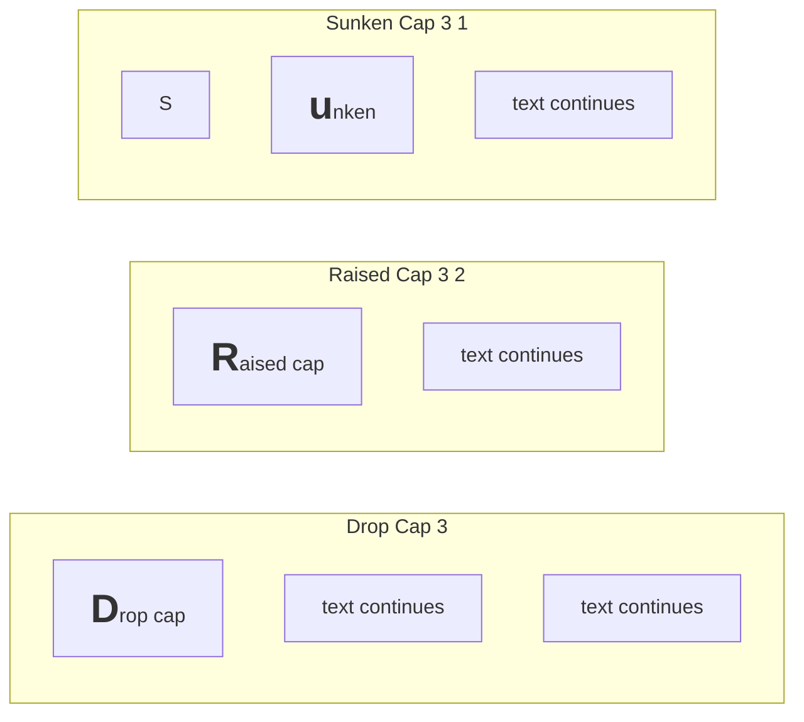

# 现代排版

CSS 排版能力在近年来经历了根本性变革：可变字体将多款静态字体压缩为单一资源，彩色字体让文字本身携带色彩信息，字体度量覆盖让回退字体无缝衔接，而全新的行内排版控制属性则终结了开发者与半行距的长期博弈。本文档系统梳理现代 CSS 排版的核心特性，为高级前端工程场景提供权威参考。

## 背景与动机

### 传统排版的局限

传统 CSS 排版围绕静态字体资源构建，存在以下问题：

1. **字体资源管理复杂**：每种字重、宽度、样式组合都需要独立的字体文件
2. **加载性能问题**：多个字体文件导致多次网络请求，影响页面加载速度
3. **布局偏移**：字体加载过程中的度量不匹配导致 CLS（Cumulative Layout Shift）
4. **排版控制粒度不足**：半行距导致的对齐问题、首字下沉缺乏原生支持、文本换行策略粗糙

### 现代排版的需求

随着 Web 应用复杂度的提升，需要更强大的排版能力：

1. **字体资源优化**：单一文件覆盖多种变体，减少网络请求
2. **精确排版控制**：原生支持首字下沉、文本框裁切、策略化换行
3. **视觉一致性**：回退字体与目标字体度量匹配，消除布局偏移
4. **创意表现力**：彩色字体、可变字体动画等高级视觉效果

## 核心概念

### 现代排版技术体系



### 排版技术演进



## 深度原理：可变字体

### 注册轴与自定义轴

可变字体轴分为两类：

| 类型 | 命名规则 | 说明 | 常见轴 |
|------|----------|------|--------|
| 注册轴（Registered Axes） | 四字母小写标签 | OpenType 规范定义的标准轴 | `wght`、`wdth`、`slnt`、`ital`、`opsz` |
| 自定义轴（Custom Axes） | 四字母大写标签 | 字体设计师自行定义的轴 | `GRAD`、`XTRA`、`CRSV` 等 |

### 核心注册轴详解

**wght（Weight）—— 字重轴**

控制字形的视觉粗细，取代传统的 `font-weight` 离散值。

```css
/* 传统方式：仅支持离散值 */
.traditional-thin {
  font-weight: 100; /* 必须有对应静态字体文件 */
}
.traditional-bold {
  font-weight: 700;
}

/* 可变字体：连续值精确控制 */
.variable-thin {
  font-weight: 100;
}
.variable-semi {
  font-weight: 450; /* 传统方式无法实现的中间值 */
}
.variable-bold {
  font-weight: 700;
}
.variable-exact {
  font-variation-settings: "wght" 632; /* 精确到任意数值 */
}
```

**wdth（Width）—— 宽度轴**

控制字形的水平拉伸/压缩程度。

```css
.condensed {
  font-variation-settings: "wdth" 75; /* 压缩至 75% */
}
.normal {
  font-variation-settings: "wdth" 100; /* 正常宽度 */
}
.expanded {
  font-variation-settings: "wdth" 125; /* 扩展至 125% */
}

/* 配合 font-stretch 使用 */
.font-stretch-approach {
  font-stretch: 75%;   /* condensed */
  font-stretch: 100%;  /* normal */
  font-stretch: 125%;  /* expanded（extra-expanded 是 150%） */
}
```

**slnt（Slant）—— 倾斜轴**

控制字形的倾斜角度，与 `ital` 的区别在于它是连续值而非开关。

```css
.upright {
  font-variation-settings: "slnt" 0;   /* 正立 */
}
.slight-slant {
  font-variation-settings: "slnt" -5;  /* 轻微倾斜（负值向右倾斜） */
}
.full-slant {
  font-variation-settings: "slnt" -12; /* 最大倾斜 */
}
```

**ital（Italic）—— 斜体轴**

这是一个开关型轴（通常 0 = 正体，1 = 斜体），触发字形替换而非单纯倾斜。

```css
.roman {
  font-variation-settings: "ital" 0; /* 正体 */
}
.italic {
  font-variation-settings: "ital" 1; /* 斜体，触发 cursive 替换 */
}
```

**opsz（Optical Size）—— 光学尺寸轴**

根据字号自动调整字形的细节精细度——小字号增大 x-height、加粗笔画、打开间距；大字号则恢复精细细节。

```css
/* 自动光学尺寸（推荐） */
.auto-optical {
  font-optical-sizing: auto; /* 默认值，浏览器根据 font-size 自动映射 */
}

/* 关闭自动映射 */
.no-optical {
  font-optical-sizing: none;
}

/* 手动指定光学尺寸值 */
.caption-optical {
  font-variation-settings: "opsz" 8;   /* 小字号形态 */
}
.body-optical {
  font-variation-settings: "opsz" 16;  /* 正文形态 */
}
.display-optical {
  font-variation-settings: "opsz" 72;  /* 展示形态 */
}
```

### font-variation-settings

`font-variation-settings` 是可变字体的底层控制属性，通过四字母标签与数值的配对直接操控字体轴。

```css
/* 语法 */
.element {
  font-variation-settings:
    "轴标签1" 数值1,
    "轴标签2" 数值2;
}

/* 单轴控制 */
.weight-only {
  font-variation-settings: "wght" 550;
}

/* 多轴组合 */
.multi-axis {
  font-variation-settings:
    "wght" 450,
    "wdth" 110,
    "opsz" 24;
}

/* 重置为默认值 */
.reset-to-default {
  font-variation-settings: normal;
}
```

> **最佳实践**：优先使用高级属性（`font-weight`、`font-stretch`、`font-style`、`font-optical-sizing`），仅在需要控制自定义轴或注册轴的精确中间值时才使用 `font-variation-settings`。原因是高级属性具有更好的语义性和回退兼容性。

```css
/* 推荐：语义化高级属性 */
.good {
  font-weight: 450;
  font-stretch: 110%;
  font-style: oblique 8deg;
}

/* 不推荐：无语义的底层控制（除非有自定义轴需求） */
.avoid-unless-necessary {
  font-variation-settings: "wght" 450, "wdth" 110, "slnt" -8;
}

/* 合理使用：控制自定义轴 */
.custom-axis {
  font-weight: 450;                             /* 高级属性控制注册轴 */
  font-variation-settings: "GRAD" 50, "CRSV" 1; /* 底层属性控制自定义轴 */
}
```


#### font-variation-settings 交互演示（MDN）

直接设置可变字体的轴值，精细控制字重、宽度、斜度等。

```html
<!DOCTYPE html>
<html lang="zh-CN">
  <head>
    <meta charset="UTF-8" />
    <meta name="viewport" content="width=device-width, initial-scale=1.0" />
    <title>font-variation-settings 属性演示 - MDN 示例</title>
    <meta name="description" content="文本与字体示例：font（variation-settings 属性演示）。" />
    <style>
      * {
        margin: 0;
        padding: 0;
        box-sizing: border-box;
      }
      body {
        font-family: -apple-system, BlinkMacSystemFont, "Segoe UI", Roboto, "Helvetica Neue", Arial, sans-serif;
        min-height: 100vh;
        padding: 0;
      }
      .demo-layout {
        display: flex;
        height: 100vh;
        gap: 0;
      }
      .snippet-panel {
        width: 320px;
        flex-shrink: 0;
        padding: 16px;
        display: flex;
        flex-direction: column;
        gap: 8px;
        overflow-y: auto;
        border-right: 1px solid #ddd;
        background: #fafafa;
      }
      .snippet-btn {
        padding: 10px 14px;
        border: 1px solid #ccc;
        border-radius: 6px;
        background: #fff;
        font-family: "JetBrains Mono", "Fira Code", monospace;
        font-size: 13px;
        color: #333;
        cursor: pointer;
        text-align: left;
        transition: all 0.2s;
        line-height: 1.4;
      }
      .snippet-btn:hover {
        border-color: #8083ff;
        background: #f0f0ff;
      }
      .snippet-btn.active {
        border-color: #8083ff;
        background: #e8e8ff;
        color: #571bc1;
        font-weight: 600;
      }
      .preview-panel {
        flex: 1;
        padding: 16px;
        display: flex;
        align-items: center;
        justify-content: center;
        background: #fff;
        overflow: auto;
      }
      .preview-panel > section,
      .preview-panel > div:not(.snippet-panel):not(.demo-layout) {
        flex: 1;
        width: 100%;
        min-height: 0;
        height: 100%;
        display: flex;
        align-items: center;
        justify-content: center;
      }
      p {
        font-size: 1.5rem;
        font-family: Amstelvar;
      }
    </style>
  </head>
  <body>
    <div class="demo-layout">
      <div class="snippet-panel">
        <button class="snippet-btn active" data-index="0">font-variation-settings: &quot;wght&quot; 50;</button>
        <button class="snippet-btn" data-index="1">font-variation-settings: &quot;wght&quot; 850;</button>
        <button class="snippet-btn" data-index="2">font-variation-settings: &quot;wdth&quot; 25;</button>
        <button class="snippet-btn" data-index="3">font-variation-settings: &quot;wdth&quot; 75;</button>
      </div>
      <div class="preview-panel">
        <section id="default-example">
          <p id="example-element">
            ...it would not be wonderful to meet a Megalosaurus, forty feet long or so, waddling like an elephantine
            lizard up Holborn Hill.
          </p>
        </section>
      </div>
    </div>
    <script>
      const snippets = [
        `#example-element {
  font-variation-settings: "wght" 50;
}`,
        `#example-element {
  font-variation-settings: "wght" 850;
}`,
        `#example-element {
  font-variation-settings: "wdth" 25;
}`,
        `#example-element {
  font-variation-settings: "wdth" 75;
}`,
      ];

      let styleEl = document.createElement("style");
      document.head.appendChild(styleEl);

      function applySnippet(index) {
        styleEl.textContent = snippets[index];
        document.querySelectorAll(".snippet-btn").forEach((btn, i) => {
          btn.classList.toggle("active", i === index);
        });
      }

      document.querySelectorAll(".snippet-btn").forEach((btn) => {
        btn.addEventListener("click", () => applySnippet(parseInt(btn.dataset.index)));
      });

      applySnippet(0);
    </script>
  </body>
</html>

```
### @font-face 与可变字体

可变字体在 `@font-face` 中的声明方式与静态字体有所不同，关键在于通过 `font-weight`、`font-stretch`、`font-style` 的范围值声明轴的可用区间。

```css
/* 基本声明：可变字体文件 */
@font-face {
  font-family: "Source Sans 3 VF";
  src: url("SourceSans3-VF.woff2") format("woff2");
  font-weight: 200 900;     /* wght 轴范围 */
  font-stretch: 75% 125%;   /* wdth 轴范围 */
  font-style: oblique -12deg 0deg; /* slnt 轴范围 */
  font-display: swap;
}

/* 使用 */
.body-text {
  font-family: "Source Sans 3 VF", sans-serif;
  font-weight: 400;
  font-stretch: 100%;
}

.heading {
  font-family: "Source Sans 3 VF", sans-serif;
  font-weight: 800;
  font-stretch: 110%;
}

/* 完整声明：包含多源回退 */
@font-face {
  font-family: "Inter";
  src: url("Inter-Variable.woff2") format("woff2")
       tech("variations"),                   /* 支持 variations 的浏览器 */
       url("Inter-Variable.woff2") format("woff2"); /* 回退 */
  font-weight: 100 900;
  font-style: oblique 0deg 10deg;
  font-named-instance: "Regular";            /* 指定默认实例 */
  font-display: swap;
}
```

> **注意**：`tech("variations")` 是 CSS Fonts Level 4 引入的字体技术描述符，用于精确匹配支持可变字体的浏览器。但当前浏览器支持有限，实践中更常通过 `font-weight` 范围值让浏览器自动判断。

### 性能优势

可变字体在性能方面具有显著优势，但也需要理性评估。



| 指标 | 静态字体（5 字重） | 可变字体（单文件） |
|------|-------------------|-------------------|
| 总体积 | ~200KB | ~120KB |
| 网络请求数 | 5 | 1 |
| 字重粒度 | 离散（5级） | 连续（无限级） |
| 布局偏移风险 | 高（逐个加载触发重排） | 低（单次加载完成） |
| HTTP 缓存效率 | 低（需分别缓存） | 高（单一缓存条目） |

```css
/* 性能优化：subsetting 减少 Unicode 覆盖范围 */
@font-face {
  font-family: "Inter VF";
  src: url("Inter-Variable-latin.woff2") format("woff2");
  font-weight: 100 900;
  unicode-range: U+0000-00FF, U+0131, U+0152-0153, U+02BB-02BC,
                 U+02C6, U+02DA, U+02DC, U+0300-0301, U+0304;
  font-display: swap;
}

/* 性能优化：预加载关键可变字体 */
```
```html
<link
  rel="preload"
  href="/fonts/Inter-Variable.woff2"
  as="font"
  type="font/woff2"
  crossorigin
/>
```

### 实战示例

```css
/* 设计系统中的可变字体集成 */
:root {
  --font-display: "Inter", sans-serif;
  --font-body: "Inter", sans-serif;

  /* 字重刻度 */
  --weight-regular: 400;
  --weight-medium: 500;
  --weight-semibold: 600;
  --weight-bold: 700;
  --weight-extrabold: 800;

  /* 宽度刻度 */
  --width-normal: 100%;
  --width-condensed: 87.5%;
  --width-expanded: 112.5%;
}

/* 响应式排版：利用可变字体精确控制 */
.hero-title {
  font-family: var(--font-display);
  /* 视口越大字重越重、宽度越宽，实现视觉张力 */
  font-weight: 700;
  font-stretch: 100%;
  font-size: clamp(2.5rem, 5vw, 5rem);
}

@media (min-width: 1200px) {
  .hero-title {
    font-weight: 800;
    font-stretch: 112.5%;
  }
}

/* 交互状态：微妙的字重变化 */
.btn-text {
  font-variation-settings: "wght" var(--weight-medium);
  transition: font-variation-settings 0.2s ease;
}

.btn-text:hover {
  font-variation-settings: "wght" var(--weight-semibold);
}

.btn-text:active {
  font-variation-settings: "wght" var(--weight-bold);
}

/* 暗色模式下的光学尺寸适配 */
:root {
  font-optical-sizing: auto;
}

@media (prefers-contrast: more) {
  /* 高对比度偏好：增加字重 */
  body {
    font-variation-settings: "wght" 500;
  }
}
```

---

## 深度原理：彩色字体

### 彩色字体格式

| 格式 | 技术标准 | 特点 | tech() 技术标识 |
|------|----------|------|----------------|
| COLRv0 | OpenType | 基于图层的矢量彩色，平面色块 | `color-COLRv0` |
| COLRv1 | OpenType | 基于图层的矢量彩色，支持渐变/混合/复合 | `color-COLRv1` |
| SVG | OpenType | 内嵌 SVG 描绘，支持渐变和滤镜 | `color-SVG` |
| sbix | OpenType | 内嵌位图彩色（Apple 推广） | `color-sbix` |
| CBDT | OpenType | 内嵌位图彩色（Google 推广） | `color-CBDT` |

> 注意：这些标识用于 `src` 中的 `tech()` 描述符（如 `tech(color-COLRv1)`），`format()` 中并无 `colrv0/colrv1` 值。 |



### font-palette

`font-palette` 属性选择彩色字体中的预设调色板。彩色字体可以内嵌多组调色板，以适配不同的背景色或设计需求。

```css
/* 语法 */
.element {
  font-palette: normal;           /* 使用字体默认调色板（默认值） */
  font-palette: light;            /* 适合浅色背景的调色板 */
  font-palette: dark;             /* 适合深色背景的调色板 */
  font-palette: --custom-palette; /* 使用自定义调色板 */
}

/* 浅色/深色背景适配 */
.light-background {
  background-color: #f5f5f5;
  font-palette: light; /* 字体提供的浅色调色板 */
}

.dark-background {
  background-color: #1a1a2e;
  font-palette: dark; /* 字体提供的深色调色板 */
}
```

### @font-palette-values

`@font-palette-values` 规则允许开发者创建自定义调色板，覆盖字体中的原始颜色值。

```css
/* 语法 */
@font-palette-values --标识符 {
  font-family: "字体名称";
  override-colors:
    色彩索引 颜色值,
    色彩索引 颜色值,
    ...;
}

/* 示例：为 Emoji 字体自定义调色板 */
@font-palette-values --brand-primary {
  font-family: "Nabla";
  override-colors:
    0 #0066cc,   /* 第 0 层颜色 */
    1 #00aaff,   /* 第 1 层颜色 */
    2 #66ddff,   /* 第 2 层颜色 */
    3 #ffffff;   /* 第 3 层颜色 */
}

@font-palette-values --brand-accent {
  font-family: "Nabla";
  override-colors:
    0 #ff3366,
    1 #ff6699,
    2 #ffaacc,
    3 #ffffff;
}

/* 应用自定义调色板 */
.brand-primary-text {
  font-family: "Nabla";
  font-palette: --brand-primary;
}

.brand-accent-text {
  font-family: "Nabla";
  font-palette: --brand-accent;
}
```

### COLRv1 实战

COLRv1 是当前最先进的矢量彩色字体格式，支持渐变填充、混合模式和复合路径，且体积远小于位图方案。

```css
/* 声明 COLRv1 彩色字体 */
@font-face {
  font-family: "Nabla";
  src: url("Nabla.woff2") format("woff2");
  font-weight: 400;
  font-display: swap;
}

/* 基础使用 */
.colored-heading {
  font-family: "Nabla", sans-serif;
  font-size: 4rem;
  font-palette: normal; /* 使用字体默认调色板 */
}

/* 创建品牌调色板 */
@font-palette-values --sunset {
  font-family: "Nabla";
  override-colors:
    0 #ff6b35,   /* 橙色 */
    1 #f7931e,   /* 金色 */
    2 #ff4e50,   /* 红色 */
    3 #f9d423;   /* 黄色 */
}

@font-palette-values --ocean {
  font-family: "Nabla";
  override-colors:
    0 #0077b6,
    1 #00b4d8,
    2 #90e0ef,
    3 #caf0f8;
}

/* 暗色模式自动切换调色板 */
.heading-sunset {
  font-family: "Nabla", sans-serif;
  font-palette: --sunset;
}

@media (prefers-color-scheme: dark) {
  .heading-sunset {
    font-palette: --ocean;
  }
}
```

> **注意**：`font-palette` 和 `@font-palette-values` 仅对包含调色板信息的彩色字体生效（如 COLRv0/v1、sbix、CBDT 格式）。SVG 彩色字体的颜色由 SVG 描绘直接决定，不受调色板属性控制。对于普通非彩色字体，`color` 属性仍然控制文字颜色。

---

## 深度原理：@font-face F-mods

### 核心描述符

| 描述符 | 作用 | 取值类型 | 说明 |
|--------|------|----------|------|
| `ascent-override` | 覆盖字体升部 | `<percentage>` | 基线以上的空间 |
| `descent-override` | 覆盖字体降部 | `<percentage>` | 基线以下的空间 |
| `line-gap-override` | 覆盖行间距 | `<percentage>` | 行间额外间距 |
| `size-adjust` | 整体尺寸缩放 | `<percentage>` | 统一缩放字形大小 |

> **所有百分比值均相对于字体的 em 尺寸计算。**

### 典型场景：回退字体匹配



```css
/* 目标字体声明 */
@font-face {
  font-family: "Mona Sans";
  src: url("Mona-Sans.woff2") format("woff2");
  font-weight: 200 900;
  font-display: swap;
}

/* 回退字体：匹配 Mona Sans 的度量 */
@font-face {
  font-family: "Mona Sans Fallback";
  src: local("Arial");            /* 使用系统字体作为回退源 */
  ascent-override: 105%;
  descent-override: 28%;
  line-gap-override: 0%;
  size-adjust: 97%;
}

/* 使用：回退字体与目标字体共享度量，消除布局偏移 */
body {
  font-family: "Mona Sans", "Mona Sans Fallback", sans-serif;
}
```

### 度量值获取方法

要精确设置 F-mods 值，需要先测量目标字体的度量参数。以下是常见方法：

**方法一：使用工具自动生成**

```bash
# 使用 fontpie 工具自动分析并生成 F-mods
npx fontpie ./path/to/font.woff2
```

**方法二：使用 JavaScript 测量**

```javascript
// 测量目标字体的度量值
function measureFontMetrics(fontFamily, fontSize = 200) {
  const canvas = document.createElement("canvas");
  const ctx = canvas.getContext("2d");

  ctx.font = `${fontSize}px "${fontFamily}"`;
  const metrics = ctx.measureText("Hg|");

  return {
    ascent: metrics.actualBoundingBoxAscent / fontSize,
    descent: metrics.actualBoundingBoxDescent / fontSize,
    // line-gap 需要通过其他方式获取
  };
}
```

**方法三：使用字体工具提取**

```bash
# 使用 fonttools 提取 OS/2 表度量
python -m fontTools.ttLib ~/.fonts/target-font.woff2
# 查看 OS/2 表中的 sTypoAscender, sTypoDescender, sTypoLineGap
```

### 回退字体链的最佳实践

```css
/* 完整的字体回退链，每级都精确匹配度量 */
@font-face {
  font-family: "Inter";
  src: url("Inter-Variable.woff2") format("woff2");
  font-weight: 100 900;
  font-display: swap;
}

/* 回退 1：系统 Arial，调整度量匹配 Inter */
@font-face {
  font-family: "Inter Fallback";
  src: local("Arial");
  ascent-override: 90%;
  descent-override: 22%;
  line-gap-override: 0%;
  size-adjust: 107%;
}

/* 回退 2：系统 sans-serif 兜底 */
@font-face {
  font-family: "Inter Fallback 2";
  src: local("Helvetica Neue"), local("Helvetica"), local("sans-serif");
  ascent-override: 90%;
  descent-override: 22%;
  line-gap-override: 0%;
  size-adjust: 107%;
}

/* 应用 */
body {
  font-family: "Inter", "Inter Fallback", "Inter Fallback 2", sans-serif;
}
```

> **何时使用 F-mods**：
> - 使用 `font-display: swap` 或 `fallback` 时，回退字体与目标字体度量差异显著
> - 字体加载导致 CLS（Cumulative Layout Shift）问题
> - 需要精确控制内容区域高度（如 FOUT 期间的布局稳定性）
>
> **何时不使用**：
> - 使用 `font-display: optional` 且接受闪现不可见文本（FOFT）
> - 回退字体与目标字体度量天然接近
> - 字体加载极快，布局偏移不可感知

---

## 深度原理：text-box-trim 与 text-box-edge

### 半行距问题

```mermaid
diagram
  +-------------------------------------------------+
  |           content area (em-square)              |
  |  ┌───────────────────────────────────────────┐  |
  |  │         ascent                           │  |
  |  │─────────────────────────────────────────  │  |
  |  │         baseline ──── 文字坐落于此       │  │
  |  │─────────────────────────────────────────  │  |
  |  │         descent                          │  │
  |  └───────────────────────────────────────────┘  |
  |                                                 |
  +-------------------------------------------------+
  ↑ 半行距（half-leading）    半行距（half-leading）↑
  ↑                                                  ↑
  line-box 顶部                              line-box 底部
```

CSS 行内排版模型中，`line-height` 大于 `normal`（约 1.2）时，会在内容区上下各添加半行距。对于多行文本这是必要的，但对于标题、按钮等单行文本，半行距导致文字无法与容器边缘精确对齐——这在设计系统中是常见的对齐痛点。

### text-box-trim

`text-box-trim` 控制是否裁切行内框的半行距。

```css
/* 语法 */
.element {
  text-box-trim: none;      /* 不裁切（默认值） */
  text-box-trim: trim-both; /* 裁切上下两侧半行距 */
  text-box-trim: trim-start; /* 裁切行首方向半行距 */
  text-box-trim: trim-end;   /* 裁切行尾方向半行距 */
}
```

### text-box-edge

`text-box-edge` 定义裁切的参考边缘，即以何种字形度量作为裁切边界。

```css
/* 语法 */
.element {
  text-box-edge: leading;     /* 裁切到半行距边界（默认，等同无效果） */
  text-box-edge: text;        /* 裁切到文字的 ascent/descent 边界 */
  text-box-edge: cap;         /* 裁切到大写字母高度/文字 descent 边界 */
  text-box-edge: ex;          /* 裁切到 x-height/文字 descent 边界 */
  text-box-edge: alphabetic;  /* 裁切到基线/文字 descent 边界 */
  /* 也可以分别指定 before 和 after 的边缘 */
  text-box-edge: cap alphabetic;
}
```

| 值 | before 边缘 | after 边缘 | 适用场景 |
|----|------------|------------|----------|
| `leading` | 半行距顶部 | 半行距底部 | 默认行为，不裁切 |
| `text` | 文字 ascent | 文字 descent | 通用裁切，适合大多数字体 |
| `cap` | 大写字母顶部（cap-height） | 文字 descent | 标题对齐，去除大写字母上方空间 |
| `ex` | x-height 顶部 | 文字 descent | 小写字母对齐 |
| `alphabetic` | 基线 | 文字 descent | 精确基线对齐 |

### 实战示例

```css
/* 标题与容器顶部精确对齐 */
.hero {
  padding: 0;
}

.hero-heading {
  font-size: 3rem;
  line-height: 1.1;
  /* 裁切顶部半行距，使大写字母顶部与容器顶部对齐 */
  text-box-trim: trim-both;
  text-box-edge: cap alphabetic;
}

/* 按钮内文字垂直居中（消除半行距干扰） */
.btn {
  display: inline-flex;
  align-items: center;
  padding: 0 1.5rem;
  height: 44px;
  font-size: 0.875rem;
  line-height: 1.25;
  /* 消除文字上下半行距，确保视觉居中 */
  text-box-trim: trim-both;
  text-box-edge: cap alphabetic;
}

/* 设计系统中的卡片标题对齐 */
.card {
  display: grid;
  grid-template-rows: auto 1fr auto;
  gap: 0;
}

.card-title {
  font-size: 1.25rem;
  line-height: 1.3;
  text-box-trim: trim-both;
  text-box-edge: cap alphabetic;
  margin-block: 0; /* 依赖 text-box-trim 而非 margin 控制 */
}

/* 多行文本的首行裁切 */
.lead-paragraph {
  font-size: 1.125rem;
  line-height: 1.6;
  /* 仅裁切首行顶部，保留底部行距 */
  text-box-trim: trim-start;
  text-box-edge: cap;
}

/* 导航项精确对齐 */
.nav-link {
  font-size: 0.875rem;
  line-height: 1;
  padding: 0.75rem 1rem;
  text-box-trim: trim-both;
  text-box-edge: cap alphabetic;
}

.nav-link:hover {
  border-bottom: 2px solid currentColor;
  /* 裁切后下划线精确贴合字形底部 */
}
```

### 与传统方案的对比

```css
/* 传统方案：负 margin 抵消半行距（脆弱、依赖字体度量） */
.heading-traditional {
  font-size: 3rem;
  line-height: 1.1;
  margin-top: -0.3em;   /* 需要针对每个字体手动调整 */
  margin-bottom: -0.15em;
}

/* 现代方案：text-box-trim（精确、字体无关） */
.heading-modern {
  font-size: 3rem;
  line-height: 1.1;
  text-box-trim: trim-both;
  text-box-edge: cap alphabetic;
}
```

---

## 深度原理：initial-letter

### 语法

```css
.element::first-letter {
  initial-letter: <行数> <沉入行数>;
}
```

| 参数 | 说明 | 示例 |
|------|------|------|
| 第一个值 | 首字占据的行数（必需） | `3` = 占 3 行高 |
| 第二个值 | 首字沉入的行数（可选，默认等于第一个值） | `3 2` = 占 3 行高，沉入 2 行 |

```css
/* 占据 3 行，全部沉入（传统 Drop Cap） */
.drop-cap::first-letter {
  initial-letter: 3;
}

/* 占据 3 行，沉入 2 行（Raised Cap 效果） */
.raised-cap::first-letter {
  initial-letter: 3 2;
}

/* 占据 2 行，全部沉入（小型首字） */
.small-drop::first-letter {
  initial-letter: 2;
}

/* 占据 4 行（大号展示性首字） */
.large-drop::first-letter {
  initial-letter: 4;
}

/* normal 值：重置为默认行为 */
.normal-letter::first-letter {
  initial-letter: normal;
}
```

### 排版效果示意



### 实战示例

```css
/* 文章首字下沉：经典排版 */
.article-body > p:first-child::first-letter {
  initial-letter: 3;
  font-weight: 700;
  color: var(--color-primary);
  margin-right: 0.1em; /* 首字与正文间距 */
}

/* 杂志风格：彩色首字下沉 */
.magazine > p:first-of-type::first-letter {
  initial-letter: 4;
  font-family: "Playfair Display", serif;
  color: var(--color-accent);
  margin-right: 0.05em;
}

/* 现代简约：小型首字 */
.modern-article > p:first-child::first-letter {
  initial-letter: 2;
  font-weight: 800;
  color: var(--color-text);
}

/* 配合可变字体的首字下沉 */
.vf-drop-cap > p:first-child::first-letter {
  initial-letter: 3;
  font-variation-settings: "wght" 900;
  color: var(--color-primary);
  margin-right: 0.08em;
}

/* 完整文章排版示例 */
.article {
  max-width: 42rem;
  font-family: "Source Serif 4", serif;
  font-size: 1.0625rem;
  line-height: 1.7;
}

.article > p:first-child::first-letter {
  initial-letter: 3;
  font-family: "Playfair Display", serif;
  font-weight: 700;
  color: #2d3436;
  margin-right: 0.1em;
}

/* 兼容回退：不支持 initial-letter 时使用伪元素 */
@supports not (initial-letter: 3) {
  .article > p:first-child::first-letter {
    float: left;
    font-size: 3.5em;
    line-height: 0.8;
    padding-right: 0.1em;
    padding-top: 0.05em;
  }
}
```

> **注意**：`initial-letter` 必须应用于 `::first-letter` 伪元素。直接应用于元素本身无效。当前浏览器支持有限，生产环境建议配合 `@supports` 回退方案。

---

## 深度原理：text-wrap

### 属性值

```css
/* 语法 */
.element {
  text-wrap: wrap;      /* 默认值，正常换行 */
  text-wrap: nowrap;    /* 不换行 */
  text-wrap: balance;   /* 平衡换行（各行长度尽量均匀） */
  text-wrap: pretty;    /* 美观换行（避免孤词等） */
  text-wrap: stable;    /* 稳定换行（编辑场景减少跳动） */
}
```

### text-wrap: balance

`text-wrap: balance` 让浏览器在换行时平衡各行长度，使文本块的视觉宽度更均匀。这是解决标题和短文本末行孤词（orphan）问题的利器。

```css
/* 标题平衡换行 */
h1, h2, h3 {
  text-wrap: balance;
  /* 无需 max-width 或 <br> 手动断行 */
}

/* 卡片标题 */
.card-title {
  text-wrap: balance;
  font-size: 1.25rem;
  line-height: 1.3;
}

/* 摘要文本 */
.summary {
  text-wrap: balance;
  max-width: 30em;
}

/* 平衡前 vs 平衡后示意 */
/* balance 前：
   This is a heading that wraps
   awkwardly

   balance 后：
   This is a heading
   that wraps evenly
*/
```

> **限制**：`text-wrap: balance` 仅在有限行数内生效（Chromium 实现限制为约 4-6 行），超出部分回退为正常换行。这使其适合标题、卡片文本、引用等短文本场景，不适合长段落。

### text-wrap: pretty

`text-wrap: pretty` 让浏览器在换行时考虑排版美学，主动避免孤词（orphan）、连续断词等不美观的换行结果，但可能需要更长的计算时间。

```css
/* 段落美观换行 */
.article-body p {
  text-wrap: pretty;
}

/* 引用文本 */
blockquote p {
  text-wrap: pretty;
  font-style: italic;
}

/* pretty 的优化效果示意：
   普通 wrap：
   ...and the final word is
   alone

   pretty：
   ...and the final
   word is alone
*/
```

> **注意**：`pretty` 的计算成本高于 `balance` 和 `wrap`，因为浏览器需要评估多种断行方案。仅对排版质量有高要求的场景使用，避免在大规模文本上滥用。

### text-wrap: stable

`text-wrap: stable` 适用于可编辑文本（如 `<textarea>`、`contenteditable`），确保前文内容在编辑过程中不会因后续换行变化而重新排列，减少编辑时的视觉跳动。

```css
/* 可编辑区域稳定换行 */
textarea {
  text-wrap: stable;
}

/* contenteditable 区域 */
[contenteditable="true"] {
  text-wrap: stable;
}

/* 聊天消息输入框 */
.chat-input {
  text-wrap: stable;
  min-height: 3rem;
}
```

### 实战示例

```css
/* 设计系统中的 text-wrap 策略 */
:root {
  /* 标题：平衡换行 */
  --text-wrap-heading: balance;
  /* 正文：美观换行 */
  --text-wrap-body: pretty;
  /* 输入：稳定换行 */
  --text-wrap-input: stable;
}

h1, h2, h3, h4, h5, h6 {
  text-wrap: var(--text-wrap-heading);
}

p, li, blockquote {
  text-wrap: var(--text-wrap-body);
}

textarea, [contenteditable] {
  text-wrap: var(--text-wrap-input);
}

/* 新闻网站标题平衡 */
.news-headline {
  text-wrap: balance;
  font-size: clamp(1.5rem, 3vw, 2.5rem);
  line-height: 1.2;
  max-width: 20em;
}

/* 产品卡片网格中的标题 */
.product-card h3 {
  text-wrap: balance;
  display: -webkit-box;
  -webkit-line-clamp: 2;
  -webkit-box-orient: vertical;
  overflow: hidden;
}

/* 响应式排版中的组合策略 */
.hero-content {
  text-wrap: balance;
  font-size: clamp(2rem, 5vw, 4rem);
  line-height: 1.1;
}

.hero-content + p {
  text-wrap: pretty;
  font-size: clamp(1rem, 1.5vw, 1.25rem);
  line-height: 1.6;
  max-width: 35em;
}
```

---

## 浏览器兼容性

### 兼容性总览

| 特性 | Chrome | Firefox | Safari | Edge | 状态 |
|------|--------|---------|--------|------|------|
| 可变字体（基本支持） | 62+ | 53+ | 11.1+ | 17+ | 稳定 |
| `font-variation-settings` | 62+ | 53+ | 11.1+ | 17+ | 稳定 |
| `font-optical-sizing` | 79+ | 62+ | 16+ | 79+ | 稳定 |
| `font-weight` 范围值 | 62+ | 61+ | 11.1+ | 17+ | 稳定 |
| `font-stretch` 范围值 | 62+ | 61+ | 11.1+ | 17+ | 稳定 |
| `font-palette` | 101+ | 107+ | 不支持 | 101+ | 部分支持 |
| `@font-palette-values` | 101+ | 107+ | 不支持 | 101+ | 部分支持 |
| `ascent-override` | 87+ | 89+ | 不支持 | 87+ | 部分支持 |
| `descent-override` | 87+ | 89+ | 不支持 | 87+ | 部分支持 |
| `line-gap-override` | 87+ | 89+ | 不支持 | 87+ | 部分支持 |
| `size-adjust` | 86+ | 89+ | 不支持 | 86+ | 部分支持 |
| `text-box-trim` | 133+ | 不支持 | 16.4+ | 133+ | 部分支持 |
| `text-box-edge` | 133+ | 不支持 | 16.4+ | 133+ | 部分支持 |
| `initial-letter` | 不支持 | 不支持 | 9+ | 不支持 | 部分支持 |
| `text-wrap: balance` | 114+ | 不支持 | 17.5+ | 114+ | 部分支持 |
| `text-wrap: pretty` | 117+ | 不支持 | 17.5+ | 117+ | 部分支持 |
| `text-wrap: stable` | 不支持 | 不支持 | 不支持 | 不支持 | 实验性 |

### 渐进增强策略

```css
/* 可变字体：高级属性优先，底层属性渐进 */
.heading {
  font-weight: 700;                    /* 所有浏览器支持 */
}

@supports (font-variation-settings: "wght" 700) {
  .heading {
    font-variation-settings: "wght" 700; /* 可变字体精确控制 */
  }
}

/* text-box-trim：渐进增强 */
.hero-heading {
  /* 回退：传统负 margin 方案 */
  margin-top: -0.28em;
  margin-bottom: -0.14em;
}

@supports (text-box-trim: trim-both) {
  .hero-heading {
    text-box-trim: trim-both;
    text-box-edge: cap alphabetic;
    margin-top: 0;
    margin-bottom: 0;
  }
}

/* initial-letter：渐进增强 */
.article > p:first-child::first-letter {
  /* 回退：伪元素 + float 模拟 */
  float: left;
  font-size: 3.5em;
  line-height: 0.85;
  padding-right: 0.08em;
  padding-top: 0.04em;
}

@supports (initial-letter: 3) {
  .article > p:first-child::first-letter {
    initial-letter: 3;
    float: none;
    font-size: inherit;
    line-height: inherit;
    padding: 0;
  }
}

/* text-wrap: balance 渐进增强 */
.card-title {
  /* 默认换行即可，balance 为增强体验 */
  text-wrap: balance;
}
```

---

## 参考资源

### 规范文档

| 资源 | 链接 | 说明 |
|------|------|------|
| CSS Fonts Level 4 | https://drafts.csswg.org/css-fonts-4/ | 可变字体、font-palette、F-mods 规范 |
| CSS Fonts Level 5 | https://drafts.csswg.org/css-fonts-5/ | font-size-adjust 改进等 |
| CSS Inline Layout Level 3 | https://drafts.csswg.org/css-inline-3/ | text-box-trim、text-box-edge、initial-letter 规范 |
| CSS Text Level 4 | https://drafts.csswg.org/css-text-4/ | text-wrap 规范 |
| OpenType Spec: Variation Fonts | https://learn.microsoft.com/en-us/typography/opentype/spec/otvaroverview | 可变字体 OpenType 规范 |
| OpenType Spec: COLR | https://learn.microsoft.com/en-us/typography/opentype/spec/colr | 彩色字体 COLR 规范 |

### MDN 文档

| 属性 | 链接 |
|------|------|
| font-variation-settings | https://developer.mozilla.org/en-US/docs/Web/CSS/font-variation-settings |
| font-optical-sizing | https://developer.mozilla.org/en-US/docs/Web/CSS/font-optical-sizing |
| font-palette | https://developer.mozilla.org/en-US/docs/Web/CSS/font-palette |
| @font-palette-values | https://developer.mozilla.org/en-US/docs/Web/CSS/@font-palette-values |
| ascent-override | https://developer.mozilla.org/en-US/docs/Web/CSS/@font-face/ascent-override |
| size-adjust | https://developer.mozilla.org/en-US/docs/Web/CSS/@font-face/size-adjust |
| text-box-trim | https://developer.mozilla.org/en-US/docs/Web/CSS/text-box-trim |
| text-box-edge | https://developer.mozilla.org/en-US/docs/Web/CSS/text-box-edge |
| initial-letter | https://developer.mozilla.org/en-US/docs/Web/CSS/initial-letter |
| text-wrap | https://developer.mozilla.org/en-US/docs/Web/CSS/text-wrap |

### 实用工具与资源

| 资源 | 链接 | 说明 |
|------|------|------|
| Google Fonts Variable | https://fonts.google.com/?axis=wgth | 支持按轴筛选的 Google 字体库 |
| Axis Praxis | https://www.axis-praxis.org/ | 可变字体在线交互式演示 |
| Wakamai Fondue | https://wakamaifondue.com/ | 字体特性在线检测工具（含轴、调色板等） |
| fontpie | https://github.com/bramstein/fontpie | 自动生成 F-mods 回退度量的 CLI 工具 |
| Variable Fonts Repo | https://github.com/fonttools/fonttools | 字体处理 Python 工具集 |
| Can I Use | https://caniuse.com/ | 浏览器兼容性查询 |

