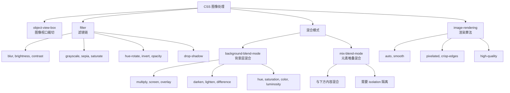
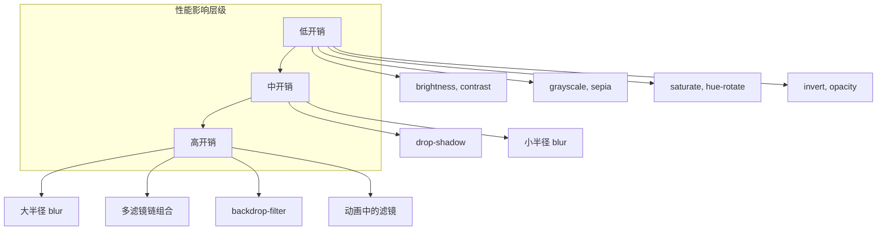
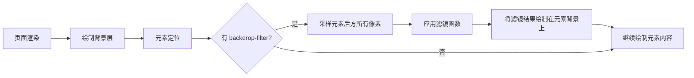
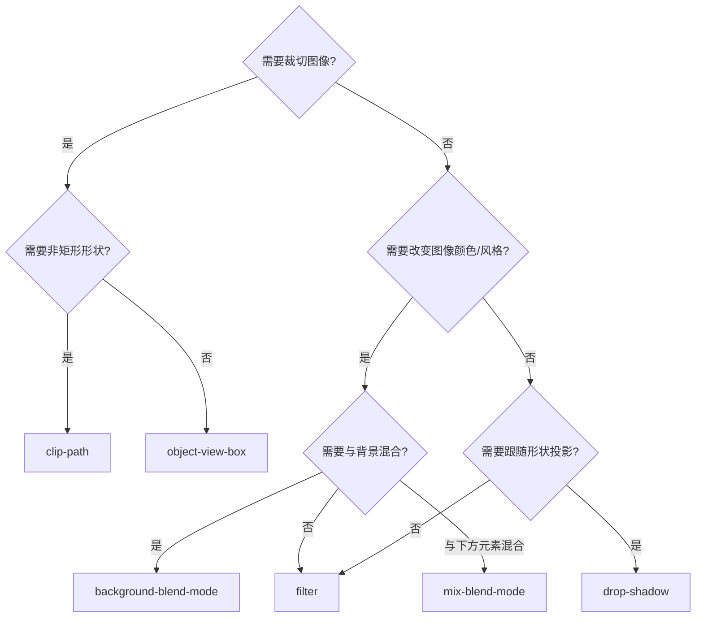

# CSS 图像处理完全指南

CSS 原生提供了强大的图像处理能力——从裁切、滤镜到混合模式，无需 JavaScript 和 Canvas 即可实现丰富的视觉效果。本文将系统性地介绍 CSS 图像处理的核心概念、深入原理、实战应用和性能优化策略。

---

## 背景与动机

### 为什么需要 CSS 图像处理？

在 Web 开发中，图像处理是常见需求。传统方案依赖 JavaScript 和 Canvas，或需要后端预处理图片。CSS 原生图像处理能力的优势在于：

1. **声明式语法**：无需编写复杂的 JavaScript 逻辑
2. **GPU 加速**：现代浏览器将滤镜和混合模式交给 GPU 处理，性能优异
3. **可动画化**：大多数图像处理属性支持 CSS 过渡和动画
4. **响应式设计**：通过媒体查询和 CSS 变量实现自适应效果
5. **无需额外依赖**：减少 JavaScript 库的引入，降低包体积

### 典型应用场景

- **电商产品展示**：灰度图、双色调效果、悬浮揭示
- **社交媒体滤镜**：复古、暖色、冷色、电影感滤镜
- **设计系统**：统一的图像风格、品牌色调
- **创意网站**：图像混合、动态效果、艺术化处理
- **性能优化**：懒加载占位图、渐进式图像加载

---

## 核心概念体系

CSS 图像处理能力可以分为四大类：



---

## object-view-box — CSS 原生图像裁切

`object-view-box` 是 CSS 新增属性，允许通过指定视口区域来裁切和缩放替换元素（如 ``、`<video>`），无需额外的容器或 `clip-path`。

### 基本语法

```css
img {
  object-view-box: inset(<top> <right> <bottom> <left>);
}
```

**参数说明**：
- 参数含义与 `clip-path: inset()` 一致：从上、右、下、左内缩的距离
- 支持 `px`、`%`、`em` 等长度单位
- 裁切后图像自动缩放填充元素框（由 `object-fit` 控制）

### 使用示例

```css
/* 裁切掉图片四周 10% */
.crop-edges {
  object-view-box: inset(10%);
}

/* 只裁切顶部 50px 和底部 20px */
.crop-top-bottom {
  object-view-box: inset(50px 0 20px 0);
}

/* 缩放 + 裁切：先裁切再缩放 */
.crop-zoom {
  object-view-box: inset(25% 25% 25% 25%);  /* 取中间 50% */
  object-fit: cover;                          /* 填满容器 */
}

/* 聚焦裁切：保留图片左侧主体 */
.focus-left {
  object-view-box: inset(0 60% 0 0);
}

/* 响应式裁切：移动端裁切更多 */
.responsive-crop {
  object-view-box: inset(5%);
}

@media (max-width: 768px) {
  .responsive-crop {
    object-view-box: inset(15%);
  }
}
```

### 与 clip-path 裁切的对比

| 特性 | `object-view-box` | `clip-path` |
|------|-------------------|-------------|
| 裁切原理 | 改变图像的可见视口区域 | 几何路径裁切元素渲染区域 |
| 裁切后缩放 | 自动缩放填充（配合 object-fit） | 不缩放，直接裁切 |
| 布局影响 | 不影响元素布局尺寸 | 不影响元素布局尺寸 |
| 事件穿透 | 裁切外不响应 | 裁切外不响应 |
| 支持形状 | 仅矩形（inset） | 圆形、多边形、SVG 路径 |
| 动画支持 | 可过渡 | 同顶点数可过渡 |
| 浏览器支持 | 实验性（Chrome 104+ 需开启标志，Firefox/Safari 暂不支持） | 全面支持 |
| 适用场景 | 图像焦点裁切、缩放 | 几何形变、创意裁切 |

> **选择建议**：图像焦点裁切优先使用 `object-view-box`，它语义更明确且自动处理缩放；复杂形状裁切使用 `clip-path`。

---

## CSS 滤镜链深入讲解

`filter` 属性将图形效果（模糊、亮度、对比度等）应用于元素渲染，支持多个函数链式组合。

### 滤镜渲染引擎原理

现代浏览器的滤镜处理流程如下：


**关键点**：
1. **离屏缓冲区**：滤镜在独立的缓冲区中计算，不影响原始 DOM
2. **GPU 加速**：大多数滤镜函数由 GPU 处理，性能优异
3. **链式处理**：多个滤镜函数按顺序依次应用，前一个的输出是后一个的输入
4. **合成优化**：现代浏览器会优化滤镜层的合成策略

### 单个滤镜函数详解

| 函数 | 语法 | 说明 | 取值范围 | 性能影响 |
|------|------|------|----------|----------|
| `blur()` | `blur(5px)` | 高斯模糊 | 0 ~ ∞ px | 高（大半径尤其耗时） |
| `brightness()` | `brightness(1.2)` | 亮度 | 0 ~ ∞ (1=原始) | 低 |
| `contrast()` | `contrast(1.5)` | 对比度 | 0 ~ ∞ (1=原始) | 低 |
| `grayscale()` | `grayscale(1)` | 灰度 | 0 ~ 1 | 低 |
| `saturate()` | `saturate(2)` | 饱和度 | 0 ~ ∞ (1=原始) | 低 |
| `sepia()` | `sepia(0.8)` | 复古色调 | 0 ~ 1 | 低 |
| `hue-rotate()` | `hue-rotate(90deg)` | 色相旋转 | 0 ~ 360deg | 低 |
| `invert()` | `invert(1)` | 反色 | 0 ~ 1 | 低 |
| `opacity()` | `opacity(0.5)` | 透明度 | 0 ~ 1 | 低 |
| `drop-shadow()` | `drop-shadow(4px 4px 8px rgba(0,0,0,0.3))` | 投影（跟随形状） | — | 中 |

### 滤镜链 — 多函数组合

```css
/* 链式组合：从左到右依次应用 */
.image-vintage {
  filter: sepia(0.6) contrast(1.1) brightness(0.9);
}

/* 高对比度黑白 */
.image-dramatic {
  filter: grayscale(1) contrast(1.5) brightness(1.1);
}

/* 暖色发光效果 */
.image-warm-glow {
  filter: brightness(1.1) saturate(1.3) hue-rotate(-10deg);
}

/* 冷色朦胧 */
.image-cool-haze {
  filter: brightness(1.05) saturate(0.8) hue-rotate(15deg) blur(1px);
}

/* 暗调电影感 */
.image-cinematic {
  filter: contrast(1.2) brightness(0.9) saturate(0.85) sepia(0.15);
}

/* 赛博朋克风格 */
.image-cyberpunk {
  filter: saturate(2) contrast(1.3) hue-rotate(280deg) brightness(1.1);
}

/* 复古胶片效果 */
.image-retro-film {
  filter: sepia(0.4) contrast(1.2) brightness(0.95) saturate(0.8);
}
```

### drop-shadow vs box-shadow

```css
/* box-shadow：矩形阴影，忽略透明区域 */
.icon-box-shadow {
  box-shadow: 4px 4px 8px rgba(0,0,0,0.3);
}

/* drop-shadow：跟随元素实际形状 */
.icon-drop-shadow {
  filter: drop-shadow(4px 4px 8px rgba(0,0,0,0.3));
}

/* drop-shadow 对 PNG 透明图片特别有用 */
.transparent-icon {
  background: url(icon.png) no-repeat center;
  filter: drop-shadow(0 4px 12px rgba(102, 126, 234, 0.5));
}
```

> `drop-shadow` 对 PNG 透明图片、SVG 图标、裁切后的元素尤为有用，阴影会跟随非透明区域轮廓。

### 滤镜动画与过渡

```css
/* 悬浮滤镜过渡 */
.hover-filter {
  filter: grayscale(1) brightness(0.8);
  transition: filter 0.4s ease;
}

.hover-filter:hover {
  filter: grayscale(0) brightness(1);
}

/* 关键帧动画 */
@keyframes pulse-blur {
  0%, 100% {
    filter: blur(0px) brightness(1);
  }
  50% {
    filter: blur(2px) brightness(1.1);
  }
}

.animated-blur {
  animation: pulse-blur 3s ease-in-out infinite;
}

/* 渐进式加载效果 */
.progressive-load {
  filter: blur(20px) opacity(0.5);
  transition: filter 0.6s ease-out;
}

.progressive-load.loaded {
  filter: blur(0) opacity(1);
}
```

---

## background-blend-mode

`background-blend-mode` 定义元素多层背景之间的混合方式，可实现图像与颜色、图像与图像的融合效果。

### 常用混合模式

| 模式 | 效果 | 典型用途 |
|------|------|----------|
| `normal` | 默认，不混合 | — |
| `multiply` | 正片叠底（变暗） | 暗化叠加、纹理融合 |
| `screen` | 滤色（变亮） | 亮化叠加、光效 |
| `overlay` | 叠加（暗处更暗/亮处更亮） | 增强对比度 |
| `darken` | 取较暗值 | 去亮留暗 |
| `lighten` | 取较亮值 | 去暗留亮 |
| `color-dodge` | 颜色减淡 | 高光效果 |
| `color-burn` | 颜色加深 | 暗角效果 |
| `hard-light` | 强光 | 强对比叠加 |
| `soft-light` | 柔光 | 柔和叠加 |
| `difference` | 差值 | 反色效果 |
| `hue` / `saturation` / `color` / `luminosity` | 取对应通道 | 色彩替换 |

### 使用示例

```css
/* 渐变叠加图像：给照片加渐变色滤镜 */
.gradient-overlay {
  background:
    linear-gradient(135deg, rgba(102,126,234,0.7), rgba(118,75,162,0.7)),
    url(photo.jpg);
  background-blend-mode: overlay;
  background-size: cover;
}

/* 双色调效果 */
.duotone {
  background:
    linear-gradient(to bottom, #667eea, #764ba2),
    url(photo.jpg);
  background-blend-mode: multiply;
  background-size: cover;
}

/* 纹理叠加 */
.texture-overlay {
  background:
    url(texture.png),
    url(photo.jpg);
  background-blend-mode: overlay;
  background-size: 200px, cover;
}

/* 多层渐变混合 */
.gradient-mix {
  background:
    linear-gradient(to right, #ff6b6b, transparent),
    linear-gradient(to bottom, #4ecdc4, transparent),
    #45b7d1;
  background-blend-mode: screen;
}
```

> `background-blend-mode` 控制的是**同一元素**上多个 `background-image` 层之间的混合，不影响元素与页面其他内容的关系。

---

## mix-blend-mode

`mix-blend-mode` 定义元素与其**下方堆叠内容**的混合方式，使元素与背景产生视觉融合。

### 基本使用

```css
/* 文字与背景混合 */
.blended-text {
  mix-blend-mode: difference;
  color: white;  /* 在深色背景上显示为浅色，浅色背景上为深色 */
}

/* 浮动元素与背景融合 */
.floating-card {
  mix-blend-mode: multiply;
}

/* 图标与背景色调统一 */
.icon {
  mix-blend-mode: screen;
  color: #667eea;
}
```

### isolation: isolate

`isolation: isolate` 创建新的堆叠上下文，阻止子元素的 `mix-blend-mode` 与外部内容混合。

```css
/* 问题场景：文字混合穿透到页面背景 */
.hero-section {
  background: url(hero.jpg);
}

.hero-title {
  mix-blend-mode: difference;  /* 与页面背景混合——可能不期望 */
  color: white;
}

/* 解决：用 isolation 隔离混合范围 */
.hero-section {
  background: url(hero.jpg);
  isolation: isolate;  /* 阻止子元素混合穿透到外部 */
}

.hero-title {
  mix-blend-mode: difference;  /* 仅与 .hero-section 的背景混合 */
  color: white;
}
```

```css
/* 另一个典型场景：卡片内的混合 */
.card {
  background: white;
  isolation: isolate;  /* 防止 mix-blend-mode 影响卡片外的内容 */
}

.card-icon {
  mix-blend-mode: multiply;
}
```


#### isolation 交互演示（MDN）

创建新的层叠上下文，隔离 mix-blend-mode 的混合范围。

```html
<!DOCTYPE html>
<html lang="zh-CN">
  <head>
    <meta charset="UTF-8" />
    <meta name="viewport" content="width=device-width, initial-scale=1.0" />
    <title>isolation 属性演示 - MDN 示例</title>
    <meta name="description" content="视觉与颜色示例：isolation 属性演示。" />
    <style>
      * {
        margin: 0;
        padding: 0;
        box-sizing: border-box;
      }
      body {
        font-family: -apple-system, BlinkMacSystemFont, "Segoe UI", Roboto, "Helvetica Neue", Arial, sans-serif;
        min-height: 100vh;
        padding: 0;
      }
      .demo-layout {
        display: flex;
        height: 100vh;
        gap: 0;
      }
      .snippet-panel {
        width: 320px;
        flex-shrink: 0;
        padding: 16px;
        display: flex;
        flex-direction: column;
        gap: 8px;
        overflow-y: auto;
        border-right: 1px solid #ddd;
        background: #fafafa;
      }
      .snippet-btn {
        padding: 10px 14px;
        border: 1px solid #ccc;
        border-radius: 6px;
        background: #fff;
        font-family: "JetBrains Mono", "Fira Code", monospace;
        font-size: 13px;
        color: #333;
        cursor: pointer;
        text-align: left;
        transition: all 0.2s;
        line-height: 1.4;
      }
      .snippet-btn:hover {
        border-color: #8083ff;
        background: #f0f0ff;
      }
      .snippet-btn.active {
        border-color: #8083ff;
        background: #e8e8ff;
        color: #571bc1;
        font-weight: 600;
      }
      .preview-panel {
        flex: 1;
        padding: 16px;
        display: flex;
        align-items: center;
        justify-content: center;
        background: #fff;
        overflow: auto;
      }
      .preview-panel > section,
      .preview-panel > div:not(.snippet-panel):not(.demo-layout) {
        flex: 1;
        width: 100%;
        min-height: 0;
        height: 100%;
        display: flex;
        align-items: center;
        justify-content: center;
      }
      .background-container {
        background-color: #f4f460;
        width: 250px;
      }

      #example-element {
        border: 1px solid black;
        margin: 2em;
      }

      #example-element {
        isolation: auto;
      }
    </style>
  </head>
  <body>
    <div class="demo-layout">
      <div class="snippet-panel">
        <button class="snippet-btn active" data-index="0">isolation: auto;</button>
        <button class="snippet-btn" data-index="1">isolation: isolate;</button>
      </div>
      <div class="preview-panel">
        <section class="default-example" id="default-example">
          <div class="background-container">
            <div id="example-element">
              
              <p><code>mix-blend-mode: multiply;</code></p>
            </div>
          </div>
        </section>
      </div>
    </div>
    <script>
      const snippets = [
        `#example-element {
  isolation: auto;
}`,
        `#example-element {
  isolation: isolate;
}`,
      ];

      let styleEl = document.createElement("style");
      document.head.appendChild(styleEl);

      function applySnippet(index) {
        styleEl.textContent = snippets[index];
        document.querySelectorAll(".snippet-btn").forEach((btn, i) => {
          btn.classList.toggle("active", i === index);
        });
      }

      document.querySelectorAll(".snippet-btn").forEach((btn) => {
        btn.addEventListener("click", () => applySnippet(parseInt(btn.dataset.index)));
      });

      applySnippet(0);
    </script>
  </body>
</html>

```
### mix-blend-mode vs background-blend-mode

| 特性 | `mix-blend-mode` | `background-blend-mode` |
|------|-------------------|------------------------|
| 混合对象 | 元素 vs 下方堆叠内容 | 同一元素的多个背景层 |
| 影响范围 | 整个元素（包括边框、阴影） | 仅背景层 |
| 需要 `isolation` | 是（需要控制混合范围时） | 否 |
| 典型用途 | 文字与背景融合、浮动元素混合 | 图像着色、渐变叠加、纹理融合 |

---


#### mix-blend-mode 交互演示（MDN）

设置元素与其下层内容之间的颜色混合模式。

```html
<!DOCTYPE html>
<html lang="zh-CN">
  <head>
    <meta charset="UTF-8" />
    <meta name="viewport" content="width=device-width, initial-scale=1.0" />
    <title>mix-blend-mode 属性演示 - MDN 示例</title>
    <meta name="description" content="动画与变换示例：mix（blend-mode 属性演示）。" />
    <style>
      * {
        margin: 0;
        padding: 0;
        box-sizing: border-box;
      }
      body {
        font-family: -apple-system, BlinkMacSystemFont, "Segoe UI", Roboto, "Helvetica Neue", Arial, sans-serif;
        min-height: 100vh;
        padding: 0;
      }
      .demo-layout {
        display: flex;
        height: 100vh;
        gap: 0;
      }
      .snippet-panel {
        width: 320px;
        flex-shrink: 0;
        padding: 16px;
        display: flex;
        flex-direction: column;
        gap: 8px;
        overflow-y: auto;
        border-right: 1px solid #ddd;
        background: #fafafa;
      }
      .snippet-btn {
        padding: 10px 14px;
        border: 1px solid #ccc;
        border-radius: 6px;
        background: #fff;
        font-family: "JetBrains Mono", "Fira Code", monospace;
        font-size: 13px;
        color: #333;
        cursor: pointer;
        text-align: left;
        transition: all 0.2s;
        line-height: 1.4;
      }
      .snippet-btn:hover {
        border-color: #8083ff;
        background: #f0f0ff;
      }
      .snippet-btn.active {
        border-color: #8083ff;
        background: #e8e8ff;
        color: #571bc1;
        font-weight: 600;
      }
      .preview-panel {
        flex: 1;
        padding: 16px;
        display: flex;
        align-items: center;
        justify-content: center;
        background: #fff;
        overflow: auto;
      }
      .preview-panel > section,
      .preview-panel > div:not(.snippet-panel):not(.demo-layout) {
        flex: 1;
        width: 100%;
        min-height: 0;
        height: 100%;
        display: flex;
        align-items: center;
        justify-content: center;
      }
      .example-container {
        background-color: sandybrown;
      }
    </style>
  </head>
  <body>
    <div class="demo-layout">
      <div class="snippet-panel">
        <button class="snippet-btn active" data-index="0">mix-blend-mode: normal;</button>
        <button class="snippet-btn" data-index="1">mix-blend-mode: multiply;</button>
        <button class="snippet-btn" data-index="2">mix-blend-mode: hard-light;</button>
        <button class="snippet-btn" data-index="3">mix-blend-mode: difference;</button>
      </div>
      <div class="preview-panel">
        <section class="default-example" id="default-example">
          <div class="example-container">
            
          </div>
        </section>
      </div>
    </div>
    <script>
      const snippets = [
        `#example-element {
  mix-blend-mode: normal;
}`,
        `#example-element {
  mix-blend-mode: multiply;
}`,
        `#example-element {
  mix-blend-mode: hard-light;
}`,
        `#example-element {
  mix-blend-mode: difference;
}`,
      ];

      let styleEl = document.createElement("style");
      document.head.appendChild(styleEl);

      function applySnippet(index) {
        styleEl.textContent = snippets[index];
        document.querySelectorAll(".snippet-btn").forEach((btn, i) => {
          btn.classList.toggle("active", i === index);
        });
      }

      document.querySelectorAll(".snippet-btn").forEach((btn) => {
        btn.addEventListener("click", () => applySnippet(parseInt(btn.dataset.index)));
      });

      applySnippet(0);
    </script>
  </body>
</html>

```
## image-rendering

`image-rendering` 控制浏览器缩放图像时使用的算法，影响图像的清晰度和锐利度。

### 取值说明

| 值 | 效果 | 适用场景 |
|------|------|----------|
| `auto` | 浏览器默认（通常双线性插值） | 照片、一般图像 |
| `smooth` | 平滑缩放（与 auto 类似） | 照片 |
| `crisp-edges` | 保持边缘锐利，不放缩对比度 | 像素艺术、图标、线稿 |
| `pixelated` | 最近邻插值，放大时呈现方块 | 像素艺术、8-bit 风格 |
| `high-quality` | 高质量缩放 | 需要更高质量的图像 |

### 使用示例

```css
/* 像素艺术游戏：保持像素块清晰 */
.pixel-art {
  image-rendering: pixelated;
  /* 放大时每个像素显示为清晰方块 */
}

/* 图标/线稿：保持边缘锐利 */
.line-art {
  image-rendering: crisp-edges;
  /* 缩放时保持线条清晰，避免模糊 */
}

/* 高清照片：优先质量 */
.photo-hq {
  image-rendering: high-quality;
  /* 提示浏览器使用更高质量缩放算法 */
}

/* 兼容性写法 */
.pixel-art-compat {
  image-rendering: -webkit-optimize-contrast;  /* 旧 WebKit */
  image-rendering: crisp-edges;
}
```

> **注意**：`pixelated` 和 `crisp-edges` 的区别在于 `pixelated` 放大时显示像素方块，`crisp-edges` 使用更复杂的边缘保持算法。对于真正的像素艺术，`pixelated` 效果更准确。

---

## 实战组合

### 双色调效果（Duotone）

利用 `filter` + `background-blend-mode` 实现图片双色调效果，无需图片编辑软件。

```css
.duotone {
  position: relative;
}

.duotone img {
  width: 100%;
  filter: grayscale(1) contrast(1.2);  /* 先转灰度增强对比 */
}

.duotone::after {
  content: '';
  position: absolute;
  inset: 0;
  background: linear-gradient(135deg, #667eea, #764ba2);
  mix-blend-mode: color;   /* 用混合模式着色 */
}
```

```css
/* 纯 CSS background 方案 */
.duotone-bg {
  background:
    linear-gradient(135deg, #667eea, #764ba2),
    url(photo.jpg);
  background-blend-mode: color;
  background-size: cover;
}

/* 可自定义的双色调令牌 */
.duotone-custom {
  --duotone-from: #667eea;
  --duotone-to: #764ba2;

  background:
    linear-gradient(135deg, var(--duotone-from), var(--duotone-to)),
    url(photo.jpg);
  background-blend-mode: color;
  background-size: cover;
}
```

### 图像悬浮揭示

利用 `filter` 和 `mix-blend-mode` 实现鼠标悬浮时的视觉揭示效果。

```css
.reveal-card {
  position: relative;
  overflow: hidden;
}

.reveal-card img {
  transition: filter 0.5s ease, transform 0.5s ease;
  filter: grayscale(1) brightness(0.7);
}

.reveal-card:hover img {
  filter: grayscale(0) brightness(1);
  transform: scale(1.05);
}

/* 叠加渐变揭示 */
.reveal-card::after {
  content: '';
  position: absolute;
  inset: 0;
  background: linear-gradient(
    to bottom,
    transparent 40%,
    rgba(0, 0, 0, 0.7) 100%
  );
  mix-blend-mode: multiply;
  transition: opacity 0.5s;
}

.reveal-card:hover::after {
  opacity: 0.5;
}
```

### 渐变叠加混合模式

结合渐变与 `background-blend-mode` 创建丰富的图像叠加效果。

```css
/* 暗色主题覆盖 */
.dark-overlay {
  background:
    linear-gradient(to bottom, transparent, rgba(0,0,0,0.8)),
    url(hero.jpg);
  background-blend-mode: normal;
  background-size: cover;
}

/* 彩色色调覆盖 */
.color-tint {
  background:
    linear-gradient(135deg, rgba(102,126,234,0.6), rgba(118,75,162,0.6)),
    url(photo.jpg);
  background-blend-mode: overlay;
  background-size: cover;
}

/* 聚光灯效果 */
.spotlight {
  background:
    radial-gradient(circle at 30% 50%, transparent 20%, rgba(0,0,0,0.7) 80%),
    url(photo.jpg);
  background-blend-mode: normal;
  background-size: cover;
}

/* 日落增强 */
.sunset-enhance {
  background:
    linear-gradient(to top, rgba(255,100,50,0.3), rgba(255,200,50,0.2), transparent),
    linear-gradient(to bottom, rgba(100,0,50,0.3), transparent),
    url(sunset.jpg);
  background-blend-mode: screen, multiply, normal;
  background-size: cover;
}
```

---

## 背景渲染性能优化深入

### 滤镜性能影响分析

CSS 滤镜虽然强大，但不当使用会严重影响渲染性能。理解其性能影响机制至关重要：



**性能开销原理**：
- **低开销滤镜**：逐像素简单数学运算，GPU 并行处理效率高
- **中开销滤镜**：需要采样周围像素（如 drop-shadow 需要计算阴影轮廓）
- **高开销滤镜**：blur 需要高斯核采样，半径越大采样范围越大；backdrop-filter 需要采样背景层所有像素

### 滤镜性能优化策略

```css
/* 1. 使用 will-change 提示浏览器提前优化 */
.will-animate {
  will-change: filter;
  /* 浏览器会为该元素创建独立的合成层 */
}

/* 注意：动画结束后移除 will-change */
.will-animate.done {
  will-change: auto;
}

/* 2. 限制滤镜链长度 */
/* 不好：过长的滤镜链 */
.bad-filter-chain {
  filter: sepia(0.5) saturate(1.5) hue-rotate(30deg) 
          brightness(1.1) contrast(1.2) blur(1px);
}

/* 好：精简滤镜链，合并效果 */
.good-filter-chain {
  filter: sepia(0.3) contrast(1.1) brightness(1.05);
}

/* 3. 避免在滚动容器中大量使用滤镜 */
/* 不好：列表中每个元素都有滤镜 */
.bad-list-item {
  filter: grayscale(1);
}

/* 好：仅在可见区域使用，或使用伪元素隔离 */
.good-list-item {
  position: relative;
}

.good-list-item::before {
  content: '';
  position: absolute;
  inset: 0;
  background: rgba(0, 0, 0, 0.3);
  pointer-events: none;
}

/* 4. 使用 contain 限制重绘范围 */
.contained-filter {
  contain: layout style paint;
  filter: brightness(1.1);
}

/* 5. 移动端降级策略 */
@media (max-width: 768px) {
  .heavy-filter {
    filter: none; /* 移动端移除复杂滤镜 */
  }
}

/* 6. 使用 prefers-reduced-motion 尊重用户偏好 */
@media (prefers-reduced-motion: reduce) {
  .animated-filter {
    transition: none;
    animation: none;
  }
}
```

### backdrop-filter 深入讲解

`backdrop-filter` 对元素**后方**的内容应用滤镜效果，是实现毛玻璃效果的核心属性。

#### 工作原理



**关键区别**：
- `filter`：对元素**自身**内容应用滤镜
- `backdrop-filter`：对元素**后方**（下方堆叠内容）应用滤镜

#### 毛玻璃效果实现

```css
/* 基础毛玻璃卡片 */
.glass-card {
  background: rgba(255, 255, 255, 0.15);
  backdrop-filter: blur(16px) saturate(180%);
  -webkit-backdrop-filter: blur(16px) saturate(180%);
  border: 1px solid rgba(255, 255, 255, 0.2);
  border-radius: 16px;
  box-shadow: 0 8px 32px rgba(0, 0, 0, 0.1);
}

/* 导航栏毛玻璃 */
.glass-navbar {
  position: fixed;
  top: 0;
  left: 0;
  right: 0;
  height: 64px;
  background: rgba(255, 255, 255, 0.72);
  backdrop-filter: blur(20px) saturate(180%);
  -webkit-backdrop-filter: blur(20px) saturate(180%);
  border-bottom: 1px solid rgba(0, 0, 0, 0.08);
  z-index: 1000;
}

/* 深色模式毛玻璃 */
.glass-dark {
  background: rgba(0, 0, 0, 0.4);
  backdrop-filter: blur(20px) brightness(0.8);
  -webkit-backdrop-filter: blur(20px) brightness(0.8);
  border: 1px solid rgba(255, 255, 255, 0.1);
}

/* 多滤镜组合毛玻璃 */
.glass-advanced {
  background: rgba(255, 255, 255, 0.1);
  backdrop-filter: blur(12px) saturate(150%) brightness(110%);
  -webkit-backdrop-filter: blur(12px) saturate(150%) brightness(110%);
}
```

#### backdrop-filter 性能优化

```css
/* 1. 限制 backdrop-filter 元素数量 */
/* 不好：大量元素使用 backdrop-filter */
.bad-glass-item {
  backdrop-filter: blur(10px);
}

/* 好：仅在关键 UI 元素使用 */
.key-glass-element {
  backdrop-filter: blur(16px);
  /* 全页面不超过 3-5 个 backdrop-filter 元素 */
}

/* 2. 使用较小的模糊半径 */
.efficient-blur {
  backdrop-filter: blur(10px); /* 10-20px 是最佳范围 */
}

.inefficient-blur {
  backdrop-filter: blur(50px); /* 过大的半径严重消耗性能 */
}

/* 3. 避免 backdrop-filter 与动画同时使用 */
/* 不好：backdrop-filter 元素做 transform 动画 */
.bad-animate {
  backdrop-filter: blur(10px);
  transition: transform 0.3s;
}

/* 好：用 opacity 过渡替代 */
.good-animate {
  backdrop-filter: blur(10px);
  transition: opacity 0.3s;
}

/* 4. 移动端降级 */
@supports not (backdrop-filter: blur(1px)) {
  .glass-card {
    background: rgba(255, 255, 255, 0.95);
    /* 不支持 backdrop-filter 时使用不透明背景 */
  }
}
```

### 渐变与图像处理结合的性能影响

```css
/* 性能优化：使用 CSS 变量缓存复杂的图像处理组合 */
:root {
  --filter-vintage: sepia(0.4) contrast(1.1) brightness(0.95);
  --filter-dramatic: grayscale(1) contrast(1.4) brightness(1.05);
  --filter-warm: brightness(1.05) saturate(1.2) hue-rotate(-5deg);
}

.vintage-photo {
  filter: var(--filter-vintage);
}

/* 性能优化：避免在渐变上使用 backdrop-filter */
/* 不好：渐变 + backdrop-filter 双重性能消耗 */
.bad-combo {
  background: linear-gradient(135deg, rgba(102,126,234,0.8), rgba(118,75,162,0.8)),
              url(photo.jpg);
  backdrop-filter: blur(10px);
}

/* 好：选择其一 */
.good-combo-filter {
  background: url(photo.jpg);
  filter: var(--filter-vintage);
}

.good-combo-blend {
  background: linear-gradient(135deg, #667eea, #764ba2),
              url(photo.jpg);
  background-blend-mode: overlay;
  /* background-blend-mode 比 backdrop-filter 性能更好 */
}
```

---

## 创意设计案例

### 案例一：电影海报风格

```css
.movie-poster {
  position: relative;
  width: 400px;
  height: 600px;
  overflow: hidden;
  border-radius: 8px;
}

.movie-poster img {
  width: 100%;
  height: 100%;
  object-fit: cover;
  filter: contrast(1.3) brightness(0.85) saturate(0.7);
}

.movie-poster::before {
  content: '';
  position: absolute;
  inset: 0;
  background: linear-gradient(
    to bottom,
    transparent 30%,
    rgba(0, 0, 0, 0.4) 60%,
    rgba(0, 0, 0, 0.85) 100%
  );
  z-index: 1;
}

.movie-poster::after {
  content: '';
  position: absolute;
  inset: 0;
  background: linear-gradient(
    135deg,
    rgba(255, 180, 50, 0.15) 0%,
    transparent 50%,
    rgba(50, 50, 150, 0.15) 100%
  );
  mix-blend-mode: color;
  z-index: 2;
}
```

### 案例二：图像对比滑块

```css
.image-compare {
  position: relative;
  width: 600px;
  height: 400px;
  overflow: hidden;
}

.image-compare .before,
.image-compare .after {
  position: absolute;
  inset: 0;
}

.image-compare .before img {
  width: 100%;
  height: 100%;
  object-fit: cover;
  filter: grayscale(1) contrast(1.1);
}

.image-compare .after {
  clip-path: inset(0 50% 0 0); /* 默认显示左半部分 */
  transition: clip-path 0.3s ease;
}

.image-compare:hover .after {
  clip-path: inset(0 0 0 0); /* 悬浮显示全部 */
}
```

### 案例三：动态极光背景

```css
.aurora-bg {
  position: relative;
  min-height: 100vh;
  background: #0a0e27;
  overflow: hidden;
}

.aurora-bg::before {
  content: '';
  position: absolute;
  inset: -50%;
  background: 
    radial-gradient(ellipse at 20% 30%, rgba(120, 119, 198, 0.5) 0%, transparent 50%),
    radial-gradient(ellipse at 80% 70%, rgba(255, 119, 198, 0.5) 0%, transparent 50%),
    radial-gradient(ellipse at 50% 50%, rgba(120, 219, 255, 0.3) 0%, transparent 70%);
  animation: aurora-move 15s ease-in-out infinite alternate;
  filter: blur(60px);
}

.aurora-bg::after {
  content: '';
  position: absolute;
  inset: 0;
  background: 
    radial-gradient(ellipse at 30% 60%, rgba(78, 205, 196, 0.3) 0%, transparent 50%),
    radial-gradient(ellipse at 70% 40%, rgba(255, 107, 107, 0.2) 0%, transparent 50%);
  animation: aurora-move 20s ease-in-out infinite alternate-reverse;
  filter: blur(40px);
  mix-blend-mode: screen;
}

@keyframes aurora-move {
  0% { transform: translate(0, 0) scale(1) rotate(0deg); }
  33% { transform: translate(3%, -3%) scale(1.05) rotate(1deg); }
  66% { transform: translate(-2%, 4%) scale(0.95) rotate(-1deg); }
  100% { transform: translate(5%, -5%) scale(1.1) rotate(2deg); }
}
```

### 案例四：复古照片画廊

```css
.retro-gallery {
  display: grid;
  grid-template-columns: repeat(auto-fill, minmax(250px, 1fr));
  gap: 24px;
  padding: 24px;
}

.retro-gallery figure {
  position: relative;
  overflow: hidden;
  border-radius: 4px;
  box-shadow: 0 4px 20px rgba(0, 0, 0, 0.3);
}

.retro-gallery figure img {
  width: 100%;
  display: block;
  filter: sepia(0.3) contrast(1.1) brightness(0.95) saturate(0.85);
  transition: filter 0.5s ease, transform 0.5s ease;
}

.retro-gallery figure:hover img {
  filter: sepia(0) contrast(1) brightness(1) saturate(1);
  transform: scale(1.03);
}

/* 暗角效果 */
.retro-gallery figure::after {
  content: '';
  position: absolute;
  inset: 0;
  background: radial-gradient(
    ellipse at center,
    transparent 50%,
    rgba(0, 0, 0, 0.4) 100%
  );
  pointer-events: none;
}
```

---

## 最佳实践

### 图像处理属性选择指南




### object-fit

设置替换元素（img/video）内容适应其盒子尺寸的方式。

#### object-fit 交互演示（MDN）

设置替换元素（img/video）内容适应其盒子尺寸的方式。

```html
<!DOCTYPE html>
<html lang="zh-CN">
  <head>
    <meta charset="UTF-8" />
    <meta name="viewport" content="width=device-width, initial-scale=1.0" />
    <title>object-fit 属性演示 - MDN 示例</title>
    <meta name="description" content="盒模型示例：object（fit 属性演示）。" />
    <style>
      * {
        margin: 0;
        padding: 0;
        box-sizing: border-box;
      }
      body {
        font-family: -apple-system, BlinkMacSystemFont, "Segoe UI", Roboto, "Helvetica Neue", Arial, sans-serif;
        min-height: 100vh;
        padding: 0;
      }
      .demo-layout {
        display: flex;
        height: 100vh;
        gap: 0;
      }
      .snippet-panel {
        width: 320px;
        flex-shrink: 0;
        padding: 16px;
        display: flex;
        flex-direction: column;
        gap: 8px;
        overflow-y: auto;
        border-right: 1px solid #ddd;
        background: #fafafa;
      }
      .snippet-btn {
        padding: 10px 14px;
        border: 1px solid #ccc;
        border-radius: 6px;
        background: #fff;
        font-family: "JetBrains Mono", "Fira Code", monospace;
        font-size: 13px;
        color: #333;
        cursor: pointer;
        text-align: left;
        transition: all 0.2s;
        line-height: 1.4;
      }
      .snippet-btn:hover {
        border-color: #8083ff;
        background: #f0f0ff;
      }
      .snippet-btn.active {
        border-color: #8083ff;
        background: #e8e8ff;
        color: #571bc1;
        font-weight: 600;
      }
      .preview-panel {
        flex: 1;
        padding: 16px;
        display: flex;
        align-items: center;
        justify-content: center;
        background: #fff;
        overflow: auto;
      }
      .preview-panel > section,
      .preview-panel > div:not(.snippet-panel):not(.demo-layout) {
        flex: 1;
        width: 100%;
        min-height: 0;
        height: 100%;
        display: flex;
        align-items: center;
        justify-content: center;
      }
      #example-element {
        height: 100%;
        width: 100%;
        border: 2px dotted #888;
      }
    </style>
  </head>
  <body>
    <div class="demo-layout">
      <div class="snippet-panel">
        <button class="snippet-btn active" data-index="0">object-fit: fill;</button>
        <button class="snippet-btn" data-index="1">object-fit: contain;</button>
        <button class="snippet-btn" data-index="2">object-fit: cover;</button>
        <button class="snippet-btn" data-index="3">object-fit: none;</button>
        <button class="snippet-btn" data-index="4">object-fit: scale-down;</button>
      </div>
      <div class="preview-panel">
        <section id="default-example">
          <img
            class="transition-all"
            id="example-element"
            src="data:image/jpeg;base64,/9j/4AAQSkZJRgABAQEASABIAAD/4U0qRXhpZgAASUkqAAgAAAAJAA8BAgAGAAAAigAAABABAgAbAAAAkAAAABIBAwABAAAAAQAAABoBBQABAAAAegAAABsBBQABAAAAggAAACgBAwABAAAAAgAAADIBAgAUAAAArAAAABMCAwABAAAAAgAAAGmHBAABAAAAwAAAAC4jAABIAAAAAQAAAEgAAAABAAAAQ2Fub24AQ2Fub24gRU9TIERJR0lUQUwgUkVCRUwgWFQAADIwMDU6MTI6MjYgMTA6Mzg6MTUAHACaggUAAQAAABYCAACdggUAAQAAAB4CAAAiiAMAAQAAAAMAAAAniAMAAQAAAGQAAAAAkAcABAAAADAyMjEDkAIAFAAAAOAiAAAEkAIAFAAAAPQiAAABkQcABAAAAAECAwABkgoAAQAAACYCAAACkgUAAQAAAC4CAAAEkgoAAQAAADYCAAAHkgMAAQAAAAUAAAAJkgMAAQAAABAAAAAKkgUAAQAAAD4CAAB8kgcAiiAAAEYCAACGkgcACAAAAAgjAAAAoAcABAAAADAxMDABoAMAAQAAAAEAAAACoAMAAQAAAD8GAAADoAMAAQAAACoEAAAFoAQAAQAAABAjAAAOogUAAQAAANAiAAAPogUAAQAAANgiAAAQogMAAQAAAAIAAAABpAMAAQAAAAAAAAACpAMAAQAAAAAAAAADpAMAAQAAAAAAAAAGpAMAAQAAAAAAAAAAAAAAAQAAACADAAA4AAAACgAAANSkCQAAAAEAivgEAAAAAQAAAAAAAgAAABIAAAABAAAAGAABAAMALgAAAGwDAAACAAMABAAAAMgDAAADAAMABAAAANADAAAEAAMAIgAAANgDAAAGAAIAIAAAABwEAAAHAAIAIAAAADwEAAAJAAIAIAAAAFwEAAAMAAQAAQAAANvfwkgNAAcAAAQAAHwEAAAPAAMACgAAAHwIAAAQAAQAAQAAAIkBAIASAAMAGAAAAJAIAAATAAMABAAAAMAIAAAVAAQAAQAAAAAAAKAZAAMAAQAAAAEAAACDAAQAAQAAAAAAAACTAAMAEAAAAMgIAACgAAMADgAAAOgIAACqAAMABQAAAAQJAADQAAQAAQAAAAAAAADgAAMAEQAAAA4JAAABQAMARgIAADAJAAACQAMAdAoAALwNAAADQAMAFgAAAKQiAAAAAAAAXAACAAAAAwAAAAAAAAAAAAAAAQAAAAEAAAABAAEAAQD/fwMAAgAAAAMA/////zcAEgABAIAAMAEAAAAAAAAAAAAA/////wAAAAAAAAAA//8AAP9/AAD/f/////8CABIAiwNdAmQAAAAAAAAARAAAAKAAMAGfADUBAAAAAAMAAAAIAAgAAAAAAAAAAAAAAAAAAQAAAAAAoADQAasAAAAAAPwAAAD//wAAAAAAAAAAAABDYW5vbiBFT1MgRElHSVRBTCBSRUJFTCBYVAAAAAAAAEZpcm13YXJlIDEuMC4zAAAAAAAAAAAAAAAAAAAAAAAAdW5rbm93bgABAAAAPAAAAAEAAABQAAAAAQAAAGQAAAAAAAAAAAAAAAAAAAAAAAAAAAAAAAAAAAAAAAAAAAAAAAAAAAAAAAAAAAAAAAAAAAAAAAAAAAAAAAAAAAAAAAAAAAAAAAAAAAAAAAAAAAAAAAAAAAAAAAAAAAAAAAAAAAAAAAAAAAAAAAAAAAAAAAAAAAAAAAAAAAAAAAAAAAAAAAAAAAAAAAAAAAAAAAAAAAAAAAAAAAAAAAAAAAAAAAAAAAAAAAAAAAAAAAAAAAAAAAAAAAAAAAAAAAAAAAAAAAAAAAAAAAAAAAAAAAAAAAAAAAAAAAAAAAAAAAAAAAAAAAAAAAAAAAAAAAAAAAAAAAAAAAAAAAAAAAAAAAAAAAAAAAAAAAAAAAAAAAAAAAAAAAAAAAAAAAAAAAAAAAAAAAAAAAAAAAAAAAAAAAAAAAAAAAAAAAAAAAAAAAAAAAAAAAAAAAAAAAAAAAAAAAAAAAAAAAAAAAAAAAAAAAAAAAAAAAAAAAAAAAAAAAAAAAAAAAAAAAAAAAAAAAAAAAAAAAAAAAAAAAAAAAAAAAAAAAAAAAAAAAAAAAAAAAAAAAAAAAAAAAAAAAAAAAAAAAAAAAAAAAAAAAAAAAAAAAAAAAAAAAAAAAAAAAAAAAAAAAAAAAAAAAAAAAAAAAAAAAAAAAAAAAAAAAAAAAAAAAAAAAAAAAAAAAAAAAAAAAAAAAAAAAAAAAAAAAAAAAAAAAAAAAAAAAAAAAAAAAAAAAAAAAAAAAAAAAAAAAAAAAAAAAAAAAAAAAAAAAAAAAAAAAAAAAAAAAAAAAAAAAAAAAAAAAAAAAAAAAAAAAAAAAAAAAAAAAAAAAAAAAAAAAAAAAAAAAAAAAAAAAAAAAAAAAAAAAAAAAAAAAAAAAAAAAAAAAAAAAAAAAAAAAAAAAAAAAAAAAAAAAAAAAAAAAAAAAAAAAAAAAAAAAAAAAAAAAAAAAAAAAAAAAAAAAAAAAAAAAAAAAAAAAAAAAAAAAAAAAAAAAAAAAAAAAAAAAAAAAAAAAAAAAAAAAAAAAAAAAAAAAAAAAAAAAAAAAAAAAAAAAAAAAAAAAAAAAAAAAAAAAAAAAAAAAAAAAAAAAAAAAAAAAAAAAAAAAAAAAAAAAAAAAAAAAAAAAAAAAAAAAAAAAAAAAAAAAAAAAAAAAAAAAAAAAAAAAAAAAAAAAAAAAAAAAAAAAAAAAAAAAAAAAAAAAAAAAAAAAAAAAAAAAAAAAAAAAAAAAAAAAAAAAAAAAAAAAAAAAAAAAAAAAAAAAAAAAAAAAAAAAAAAAAAAAAAAAAAAAAAAAAAAAAAAAAAAAAAAAAAAAAAAAAAAAAAAAAAAAAAAAAAAAAAAAAAAAAAAAAAAAAAAAAAAAAAAAAAAAAAAAAAAAAAFAAAAAABAAIAAwAEAAUABgAHAAgHAAcAgA0ACYANAAm9ALwAAAAr+xr9AADmAtUEAACX/QAAAAAAAAAAAABpAhgA//8AAJ8ABwBwACAAghqCAAAAAAAAAP////8AAAAAAAAAAAAAAAAAAAAAHAAAAAAAAAAAAAAAAAAAAACAUBQAAAAAAAAAAAoAHwIABAAE9QEiALwNGAkBAAEANAATALMNEgkAAAAAAAAAAAAAAAAAAAAAjAQKAwAEAARkAQMCAAQABAYCVgEABAAE6wLoACMBIwFpAKMANwE2AaIAewBjAWIBEQG1CPkD/QNSBlAStQj9AwEEUgZQEtsI/QMBBNYFUBR+Cv0DAQTPBFgbrAn9AwEEQQVwF8MF/QMBBE0JgQxjB/0DAQTmBz8PDgr9AwEEDwUsGdsI/QMBBNYFUBTbCP0DAQTWBVAUTQEGBF7+ZStbAdIDgf4zJW8BjQOz/kAfhgFTA+H+WBunAQsDIP9wF7gB6AJA/+AVzgG9Amj/UBTtAYsCm/+NEhQCVwLV/9gQNAIzAgAAtw9mAgMCPwBwDrsCvwGhALIM6AKkAc4A6wsdA4UBAgE3C9gDPwGWAW0J9AEVCCcIFQgnCBUIJwgVCCcIFQgnCBUIJwgVCCcIFQgnCBUIJwgVCCcIFQgnCBUIJwgVCCcIFQgnCBUIJwgBAQEBAQEBAQAAAAAAACsAGwAoADEAGwBIAD0AaAAwAHAAMQA4ACMAeABvAEQARABBADoAPwBeAFwAXABOAE8ARABQADIALgBPACcAQgCBAHAAYABrAGEAWQBoAF4AUwBMAFMAPQAzAFAAWwBhAF0AZgB0AHEAcAByAGsAagBLAD8AQABDAEQAAAAAAAAAeQAnADQAdwArAF4AUgCbAEEApwA+AEIAJQAcAZ8AjwCQAIAAbwCTAKUAqgCUAHUAcgBoAHQAQQA8AKoAKwCEABwB9wDMAMgAyACzAMEApwCHAHQAeQBTADsArADEANMA0wDjAP0A8wDuAOwA1gDPAIwAcABuAGgAWwAAAAAAAABbAC8AQgBeAC0AcABbAJoAQQCWAD8AQAAjACkB4ACaAI8AgABtAH0AqgClAJkAeQB0AGIAbwA+ADMAvwBMAJYAHwHvAMYAzwDAAKoAuQCdAIEAcQB4AFAAOADRAOgA9QDaAOUA/QDyAO0A6gDUAMsAhgBqAGcAYABUAAAAAAAAAGYAHAAkAFkAHgA7ADIAXQAlAFwAHwAhABAA/wCHAHoAbQBbAEsAZQBpAGkAVgBAADoAMwA4AB0AGgCWACMAbADPAKgAhAB9AHwAawBuAFoAQwA3ADYAIwAVAIgAlgCeAIwAjwCZAI8AhwB+AGoAXwA9AC4ALQApAB0AAAAAAAAAAAAAAAAAAAAAAAAAAAAAAAAAAAAAAAAAAAAAAAAAAAAAAAAAAAAAAAAAAAAAAAAAAAAAAAAAAAAAAAAAAAAAAAAAAAAAAAAAAAAAAAAAAAAAAAAAAAAAAAAAAAAAAAAAAAAAAAAAAAAAAAAAAAAAAAAAAAAAAAAAAAAAAAAAAAACAAIAAgABAAUADwAGAAMACQAGAAcAJwACAAEAAgAGACAAEQAJAAMAFQAxAB4AHAA8ABgAIwCuAAQACgABAAQARgAUACYAEgBOAGUALQA0AEIALAAuAIwABQC0AFsAzQBHJIQsdSV9EdggTSPYF0wNGwfBAjYCPQU4AKYCqwG8AZ0CYgFXAwAAbgDFAMcAZAD/AwAEAAQAAAAAAAAAAAAAAAAAAAAAZgQABAAE6QqiD6ka6BQAAAAAAAAZFv//AP8ApBEF//+QAQAAAXAaA9oPPAHEADAA0AHtDocMAACllpaWQABAAEAAAACWc49wD8YAAAAAnA/hAQ0AoQN4APYBlgEAACwBvAFeADsR2QGZAFUh6QHPAKkx2wH+APYEVoAAAB4B9gRWgAAAHgH2BFaAAAAeAQAAdgBCAk0HAADtEZ8HXwAfEdQHkgD6MdEHwAD3MPAH4ABMBK4w9gfuAPAFKYAAAPwAEAQQBBAEAAARABMAMwUcADoAgAAxAwgAEgAAACAAIAAgAAAAAQAAAAIAwACHS/8BAAIAAgACAQABAE4AlwAcAAAAAAMAAAAAAAMAAAAABggLCxEAIAAAAP9CAQAACwACZlVwCj8ACQAdAAYAGgCFAD8ADQAgAAUADwBDAD8ACgApAAUAFQBEAD8AFQAkABAAHABmAD8ADQAgAAoAGwB2ACgAAALKAIQAAAAfBQAAKACAAZAAWAAAABgEAAAwAAAAAAAAAAAAAAAAAAAAAAAAAAAAAAAAAAAAAAAAAAAAAAAAAAAAAAAAAAAAAAAAAAAAAAAAAAAAAAAAAAAAAAAAAAAAAAAAAAAAAAAAAAAAAAAAAAAAAAAAAAAAAAAAAAEAAAAAADACkAEIDEsEAAAAAAAAAAAAAAAAAAAAAAAAAAAAAAAAAAEAAAAAAAAAAAAAAAAAAAABAAEgAAERAAEAAQAAAAAAAAAAAAAAAJABkAGQAZARkBGllpaWlpaWc6WWlpaWlpZzpZaWlpaWlnOllpaWlpaWc6WWlpaWlpZzAAAAAAAAAAAAAAAAAAAAAAAAAAAAAAAAAAAAAAAAAAAAAAAAAAAAAAAAAAAAAAAAAAAAAAAAAAAAAAAAAAAAAAAAAAAAAAAAAAAAAAAAAAAAAAAAAAAAAAAAAAAAAAAAAAAAAAAAAAAAAAAAAAAAAAAAAAAAAAAAAAAAAAAAAAAAAAAAAAAAAAAAAAAAAAAAAAAAAAAAAAAAAAAAAAAAAAAAAAAAAAAAAAAAAAAAAAAAAAAAAAAAAAAAAAAAAAAAAAAAAAAAAABAAEAAQABAAEAAQAAAABwAOgAUACgAQABAADIAAAA+ADcACgAjAEAAIwAwAEYALgA3AB4AQAA0ACAAQACcD+EBDQChA3gA9gGWAQAALAG8AV4AOxHZAZkAVSHpAc8AqTHbAf4A9gRWgAAAHgH2BFaAAAAeAfYEVoAAAB4BnA/hAQ0AoQN4APYBlgEAACwBvAFeADsR2QGZAFUh6QHPAKkx2wH+APYEVoAAAB4B9gRWgAAAHgH2BFaAAAAeAZwP4QENAKEDeAD2AZYBAAAsAbwBXgA7EdkBmQBVIekBzwCpMdsB/gD2BFaAAAAeAfYEVoAAAB4B9gRWgAAAHgGcD+EBDQChA3gA9gGWAQAALAG8AV4AOxHZAZkAVSHpAc8AqTHbAf4A9gRWgAAAHgH2BFaAAAAeAfYEVoAAAB4BnA/hAQ0AoQN4APYBlgEAACwBvAFeADsR2QGZAFUh6QHPAKkx2wH+APYEVoAAAB4B9gRWgAAAHgH2BFaAAAAeAZwP4QENAKEDeAD2AZYBAAAsAbwBXgA7EdkBmQBVIekBzwCpMdsB/gD2BFaAAAAeAfYEVoAAAB4B9gRWgAAAHgGcD+EBDQChA3gA9gGWAQAALAG8AV4AOxHZAZkAVSHpAc8AqTHbAf4A9gRWgAAAHgH2BFaAAAAeAfYEVoAAAB4BnA/hAQ0AoQN4APYBlgEAACwBvAFeADsR2QGZAFUh6QHPAKkx2wH+APYEVoAAAB4B9gRWgAAAHgH2BFaAAAAeAZwP4QENAKEDeAD2AZYBAAAsAbwBXgA7EdkBmQBVIekBzwCpMdsB/gD2BFaAAAAeAfYEVoAAAB4B9gRWgAAAHgGcD+EBDQChA3gA9gGWAQAALAG8AV4AOxHZAZkAVSHpAc8AqTHbAf4A9gRWgAAAHgH2BFaAAAAeAfYEVoAAAB4BAAB2AIQCIgcAANERlQdlAN0htQeTAJwx6we5ACYx9AfXAN4DBjHyB+IA3AUwgAAA+wAAAHYAVgJLBwAABgG6B2MAwyHIB5QA8zHYB7sAFjHtB9wA3gPjMPIH5gDcBTCAAAD7AAAAdgBCAk0HAADtEZ8HXwAfEdQHkgD6MdEHwAD3MPAH4ABMBK4w9gfuAPAFKYAAAPwAAAB2AOwBogcAADwBsgddAC0R1geaACgh3AfMALkw5gftAN4DdjD4B/MA0wQcgAAA+QAAAHYAXQERAAAAfAGhB1QAZBHJB50AOCHYB9YAsTDFB/gA3gMZMP0H/ADBBAmAAAD9AAAAdgCDAiMHAADUEZIHZQDWIb4HkwDMMd4HugANMeAH2QDeA7ow+wfiANwFOoAAAPYAAAB2AFYCSwcAAAYBugdjAMMhyAeUAPMx2Ae7ABYx2QfcAN4DsTD5B+UA3AUzgAAA9wAAAHYAQgJOBwAA7hGeB18AHhHVB5IA/jHQB8AA8zDrB+AATASUMPgH7QDwBSmAAAD5AAAAdgAAApAHAAAwAboHXgA2EdEHmgAXIeIHzADbMMwH7QDeA1Uw/gfzAOIEGYAAAPgAAAB2AF0BEQAAAHwBoQdUAGQRyQedADgh2AfWALEwxQf4AN4DGTD9B/wAwQQJgAAA/QAAAHYAgwIjBwAA1BGSB2UA1iG+B5MAzDHeB7oADTHgB9kA3gO6MPsH4gDcBUGAAAD2AAAAdgBWAksHAAAGAboHYwDDIcgHlADzMdgHuwAWMdkH3ADeA7Ew+QflANwFM4AAAPcAAAB2AEICTgcAAO4RngdfAB4R1QeSAP4x0AfAAPMw6wfgAEwElDD4B+0A8AUugAAA+QAAAHYAAAKQBwAAMAG6B14ANhHRB5oAFyHiB8wA2zDMB+0A3gNVMP4H8wDiBBuAAAD4AAAAdgBdAREAAAB8AaEHVABkEckHnQA4IdgH1gCxMMUH+ADeAxkw/Qf8AMEECYAAAP0AAAB2AIMCIwcAANQRkgdlANYhvgeTAMwx4ge6ACUx4QfaAN4D1TD2B+QA3AU7gAAA+QAAAHYAVgJLBwAABgG6B2MAwyHIB5QA8zHdB7sALjHaB90A3gPMMPYH5wDcBSeAAAD7AAAAdgBCAk4HAADuEZ4HXwAeEdUHkgD+MdAHwADzMPIH4ABMBLIw8gfuAOsFKoAAAPsAAAB2AAACkAcAADABugdeADYR0QeaABch4gfMANswzAftAN4DVTD+B/MA4gQfgAAA+AAAAHYAXQERAAAAfAGhB1QAZBHJB50AOCHYB9YAsTDFB/gA3gMZMP0H/ADBBAmAAAD9AAAAdgCDAiMHAADUEZIHZQDWIb4HkwDMMeIHugAlMeEH2gDeA9Uw9gfkANwFO4AAAPkAAAB2AFYCSwcAAAYBugdjAMMhyAeUAPMx3Qe7AC4x2gfdAN4DzDD2B+cA3AUngAAA+wAAAHYAQgJOBwAA7hGeB18AHhHVB5IA/jHQB8AA8zDyB+AATASyMPIH7gDrBSqAAAD7AAAAdgAAApAHAAAwAboHXgA2EdEHmgAXIeIHzADbMMwH7QDeA1Uw/gfzAOIEH4AAAPgAAAB2AF0BEQAAAHwBoQdUAGQRyQedADgh2AfWALEwxQf4AN4DGTD9B/wAwQQJgAAA/QAAAAgICAAIAAgAUABnZDQhUABnZDQhUABnZDQhVABnZDQhVABnZDQhTgCXABwAYgCeAAEAigB2AAEA/gABAAEAAQD+AAEABggLCxEAIAAGCAsLEQAgAAYICwsRACAACBAWGiQBIAAKGiMnOAEgAD8AFQAkABAAHABmAD8ADQAgAAoAGwB2AD8AFQAkABAAHABmAD8ADQAgAAoAGwB2AD8AFQAkAAgADgAzAD8ADQAgAAoAGwB2AD8AAAAAAAAAAAAAAD8ADQAgAAoAGwB2AD8AAAAAAAAAAAAAAD8ADQAgAAoAGwB2ACYAKwAwADoAQwCAAIAAgACAAIAAgACAAIAAAQABAAEAAQABAAEAAQABAAEAAQABAAEAAQABAAEAAQABAAEAAQABAAEAAQABAAEAAQC4CxoD5vwmANr/PAHEADAA0AHt/hMBeQOH/IgTGgPm/CYA2v88AcQAMADQAe3+EwF5A4f8WBsaA+b8JgDa/zwBxAAwANAB7f4TAXkDh/y4CxoD5vwmANr/PAHEADAA0AHt/hMBeQOH/IgTGgPm/CYA2v88AcQAMADQAe3+EwF5A4f8WBsaA+b8JgDa/zwBxAAwANAB7f4TAXkDh/y4CxoD5vwmANr/PAHEADAA0AHt/hMBeQOH/IgTGgPm/CYA2v88AcQAMADQAe3+EwF5A4f8WBsaA+b8JgDa/zwBxAAwANAB7f4TAXkDh/y4CxoD5vwmANr/PAHEADAA0AHt/hMBeQOH/IgTGgPm/CYA2v88AcQAMADQAe3+EwF5A4f8WBsaA+b8JgDa/zwBxAAwANAB7f4TAXkDh/y4CxoD5vwmANr/PAHEADAA0AHt/hMBeQOH/IgTGgPm/CYA2v88AcQAMADQAe3+EwF5A4f8WBsaA+b8JgDa/zwBxAAwANAB7f4TAXkDh/y4C74CQv0PAPH/VwGpAA0A8wES/+4AmQNn/IgTvgJC/Q8A8f9XAakADQDzARL/7gCZA2f8WBu+AkL9DwDx/1cBqQANAPMBEv/uAJkDZ/y4C7gCSP0aAOb/VAGsACUA2wES/+4AmQNn/IgTuAJI/RoA5v9UAawAJQDbARL/7gCZA2f8WBu4Akj9GgDm/1QBrAAlANsBEv/uAJkDZ/y4C7kCR/0OAPL/WAGoACIA3gEQ//AAkQNv/IgTuQJH/Q4A8v9YAagAIgDeARD/8ACRA2/8WBu5Akf9DgDy/1gBqAAiAN4BEP/wAJEDb/y4C8oCNv0LAPX/hAF8ABYA6gEG//oAhAN8/IgTygI2/QsA9f+EAXwAFgDqAQb/+gCEA3z8WBvKAjb9CwD1/4QBfAAWAOoBBv/6AIQDfPy4C6gCWP0PAPH/kwFtAAEA/wEW/+oAcAOQ/IgTqAJY/Q8A8f+TAW0AAQD/ARb/6gBwA5D8WBuoAlj9DwDx/5MBbQABAP8BFv/qAHADkPy4C/T/9P8OAAAAiBP0//T/DgAAAFgb9P/0/w4AAAC4C/r/+v8HAAAAiBP6//r/BwAAAFgb+v/6/wcAAAC4CwAAAAAAAAAAiBMAAAAAAAAAAFgbAAAAAAAAAAC4CwYABgD5/wAAiBMGAAYA+f8AAFgbBgAGAPn/AAC4CwwADADy/wAAiBMMAAwA8v8AAFgbDAAMAPL/AAC4C/L/8v8PAAAAiBPy//L/DwAAAFgb8v/y/w8AAAC4C/r/+v8HAAAAiBP6//r/BwAAAFgb+v/6/wcAAAC4CwAAAAAAAAAAiBMAAAAAAAAAAFgbAAAAAAAAAAC4CwYABgD5/wAAiBMGAAYA+f8AAFgbBgAGAPn/AAC4Cw0ADADy/wAAiBMNAAwA8v8AAFgbDQAMAPL/AABuAGQAhwAEAAUAyAAGAG4AZACHAAQABQDIAAYAbgBkAIcABAAFAMgABgBuAGQAhwAEAAUAyAAGAG4AZACHAAQABQDIAAYAfQBuAHoABAAGAL4ACQB9AG4AegAEAAYAvgAJAH0AbgB6AAQABgC+AAkAfQBuAHoABAAGAL4ACQB9AG4AegAEAAYAvgAJAI8AcABzAAkABgDGAA8AjwBwAHMACQAGAMYADwCPAHAAcwAJAAYAxgAPAI8AcABzAAkABgDGAA8AjwBwAHMACQAGAMYADwCiAHoAdwAKAAkAngAPAKIAegB3AAoACQCeAA8AogB6AHcACgAJAJ4ADwCiAHoAdwAKAAkAngAPAKIAegB3AAoACQCeAA8AsgB8AH0ADAALAJYAEQCyAHwAfQAMAAsAlgARALIAfAB9AAwACwCWABEAsgB8AH0ADAALAJYAEQCyAHwAfQAMAAsAlgARAGQAWgC1AAUAAgC0AAUAZABaALUABQACALQABQBkAFoAtQAFAAIAtAAFAGQAWgC1AAUAAgC0AAUAZABaALUABQACALQABQBuAGQAhwAFAAUAyAAGAG4AZACHAAUABQDIAAYAbgBkAIcABQAFAMgABgBuAGQAhwAFAAUAyAAGAG4AZACHAAUABQDIAAYAfQBuAHsABAAGAL4ACQB9AG4AewAEAAYAvgAJAH0AbgB7AAQABgC+AAkAfQBuAHsABAAGAL4ACQB9AG4AewAEAAYAvgAJAI8AcABzAAkABgDGAA8AjwBwAHMACQAGAMYADwCPAHAAcwAJAAYAxgAPAI8AcABzAAkABgDGAA8AjwBwAHMACQAGAMYADwCiAHoAdwAKAAkAngAPAKIAegB3AAoACQCeAA8AogB6AHcACgAJAJ4ADwCiAHoAdwAKAAkAngAPAKIAegB3AAoACQCeAA8ABwAAAJIAlACRAAAAAgAGAAoADgASABYAGgAeACIAJgAqAC4AMgA2ADoAPgBCAEYASgBOAFIAVgBaAF4AYgBmAGoAbgByAHYAegB+AIIAhgCKAI4AkgCWAJoAngCiAKYAqgCuALIAtgC6AL4AwgDGAMoAzgDSANYA2gDeAOIA5gDqAO4A8gD2APoA/gACAQYBCgEOARIBFgEaAR4BIgEmASoBMAE0ATgBPAFAAUQBSAFMAVABVAFaAV4BYgFoAWwBcAF2AXoBgAGEAYoBkAGUAZoBoAGkAaoBsAG2AbwBxAHKAdAB2AHeAeYB7gH0Af4BBgIOAhYCHgIoAjACOAJCAkoCVAJcAmYCcAJ4AoICjAKWAqACqgK0AsACygLWAuAC7AL2AgIDDgMaAyYDNANCA04DXANqA3gDiAOYA6gDuAPKA9wD7AP+AxAEIgQ0BEYEWARqBHwEjgSgBLIExgTYBOoE/AQQBSIFNgVIBVwFbgWCBZQFqAW8BdAF4gX2BQoGHgYyBkYGWgZuBoQGmAasBsIG2AbsBgIHGAcwB0YHXgd0B4wHpAe+B9YH8AcKCCQIPghaCHYIkgiuCMoI6AgGCSQJQglgCX4Jngm8CdwJ+gkaCjoKWgp6CpoKugrcCvwKHgtAC2ILhAumC8oL7AsQDDQMWAx8DKAMxgzqDBANNg1cDYQNqg3SDfoNAAAAAAAAAAAAAAAAAAAAAAAAAAAAAAAAAAAAAAAAAAAAAAAAAAAAAAAAAAAAvDQAagMAAAAoIwBGAgAAMjAwNToxMjoyNiAxMDozODoxNQAyMDA1OjEyOjI2IDEwOjM4OjE1AEFTQ0lJAAAAAgABAAIABAAAAFI5OAACAAcABAAAADAxMDAAAAAABgADAQMAAQAAAAYAAAAaAQUAAQAAAHwjAAAbAQUAAQAAAIQjAAAoAQMAAQAAAAIAAAABAgQAAQAAAIwjAAACAgQAAQAAAJYpAAAAAAAASAAAAAEAAABIAAAAAQAAAP/Y/8QBogAAAQUBAQEBAQEAAAAAAAAAAAECAwQFBgcICQoLAQADAQEBAQEBAQEBAAAAAAAAAQIDBAUGBwgJCgsQAAIBAwMCBAMFBQQEAAABfQECAwAEEQUSITFBBhNRYQcicRQygZGhCCNCscEVUtHwJDNicoIJChYXGBkaJSYnKCkqNDU2Nzg5OkNERUZHSElKU1RVVldYWVpjZGVmZ2hpanN0dXZ3eHl6g4SFhoeIiYqSk5SVlpeYmZqio6Slpqeoqaqys7S1tre4ubrCw8TFxsfIycrS09TV1tfY2drh4uPk5ebn6Onq8fLz9PX29/j5+hEAAgECBAQDBAcFBAQAAQJ3AAECAxEEBSExBhJBUQdhcRMiMoEIFEKRobHBCSMzUvAVYnLRChYkNOEl8RcYGRomJygpKjU2Nzg5OkNERUZHSElKU1RVVldYWVpjZGVmZ2hpanN0dXZ3eHl6goOEhYaHiImKkpOUlZaXmJmaoqOkpaanqKmqsrO0tba3uLm6wsPExcbHyMnK0tPU1dbX2Nna4uPk5ebn6Onq8vP09fb3+Pn6/9sAhAADAgIDAgIDAwIDAwMDBAUIBQUEBAUJBwcGCAsKDAsLCgsKDA4RDwwNEQ0NCw8VDxESExQUFAwPFRcVExcRExQTAQMDAwUEBQkFBQkTDQsNExMTExMTExMTExMTExMTExMTExMTExMTExMTExMTExMTExMTExMTExMTExMTExMTExP/wAARCAB4AKADASEAAhEBAxEB/9oADAMBAAIRAxEAPwD8zG+HfiZcZ0LU+eceSaZD8P8AxJcBvI0XUH29cRHivOlm+Dje9VaeZPOn1NLSfg54412YRaN4W1q8kJwFht2bJrU1D9nT4naVcpb6l4E8T20zjcqSWTgkevSuqliaVWPPCSaDnXc5PWvBmu+Hb9rLXdJvrC7XGYbiIowz7GpYvAXiOaaKKPQ9UMkqeZGvkNl19RxyPenPEU4LmlKyF7SPcuWPwq8Y6nM8WneGdauZUYKyRWzsQx7YA6+1dHpf7MfxY1uymu9I+Hviy8toc+ZJDYSMEx1zgcUUq9OtZ05J3HzK1zg28N6olxLA+n3azRP5ckbRkMjZxgjsabLoOowDM1lcJzj5kIolXpxdmw50+pWaynRwjQyBj2xzWjpfg/WtbLjSdMvLop94RISR+FEsRTjHmctA5kzWj+EvjOWMvH4Z1lkH8Qt2xVa++G/inTZRHf6BqkEhAIV4WyQelcdLOcFVfLCrFv1KWuxQufCusWeoLY3WmXsV42MW7REOc9OK2rL4P+N9SQtp/hXXLhRwTHau38hW2IzDD4dqNWaTe12Spp9TGPhLWhqLWB0q/F6p2m3MLbwfpirF34B8R2MXmXmi6jCg/ikiIFFXMMPSkoTmk3srhzx7mZ/Y98Y2kFpP5a9X2HA/Gmtpl2sayNbTBG6MVODXQ6sFZt7gpp9T6l8NXHjvxXLCNK0+21C4vAXURMA4PU/jWZqPwx8d3curXWpaRdaZPaRFpEmPlbwOpHrXwWX5XDmlUpptXs7nI3y7nvP7KngSfxXbiXxTrE1tZ6egY2Nsxj3luVBcfQ19GeJ/i58Im0+e21ue4sprOIwKJJSCWXgrnPJr6LE0qdPSsr37HThqalC6Pn/4lfsvv408Dan45tdYhs9K+ztdxNdPv8yNRkYPUVn/ALPP7O/xA+KugaHe6x4k0vR9Clg8zTZL5fNuBGpxtUDGAfcmppYVSp8q0jLp2IeH99xXQ+3/AA/4TsP2fPhOltrH9l6lcW6vcTao0SxoG6ghj3x+NfIvh/8AbUi0r4mapP4OeLStOkZTKLhjJBcSEncSD93PqK58RNxoP6u2pUttO36PY1qfu+WNtGebftD+A4/iP4wuPGPhKGy0W+uwJLmy5EEsmPvq4zgn0IA968a8QeFk07w2t948kkg1diYLW3hC7CB/EXGQfwNeRSz942K9nG1RtJrpbq0RKkoq8TjdQ+EPjzQPDsHi/UfCviC20CXEkOrvZSC3ZT91g5GNp7Hoe1dN8GdZOreK5DqFtC9yYyRcINpHrkDrXtZsnHCzl5GKbiz6XvLgaV4duJw2PLjL5+gzWX478beEoPhX4c8TT3kOr+M747VSFwFhiUY+dBwDmviuDsFGv7SpJ/C0/U0dZ04tLroanwR+AEnjyceM/GMctik64iJGJCp7jPT6179N4g8LfCbSFtNFtog6D5UU7pHPqWPP419k3Rw0amZ4pX/l8ktrebOW7SUUfMvxf+MWlXOrPfa79gt7tgVigt0XzCPcjk/jXiRvb74takik/wBl6JG2JZp5AgAz2/vHFfN5epVZzzbHLT7K79i7NWSPQJ9A8IeG9AmsreVJ9P37x9tmDF2/DHFeW+MPG3h698P3loLKNtRXMduYlwka+1feZfCt7WljcztJOLUIL7Gmjfmc1m21T011f5nuMen2/wAMvFyXOj+ZDpeojfFIrEGInupHQg1T1340a7rjN4f16Kz1jUIGLwzM+Tcw/wB04/irzqdOpKnKpTdrbrv5lKSfus2fDX7QpHgnUPC3w/0xNG1CWQCeGUYIJ4JUkcH6nivHfGmiXFt4tEGv6ozOMPcmVS0O49gw+99a0k3VabWyOmhWlB2INC8YeMvF/inTfhgniq8Xw7eXqWe0NlUjZsHGe2M8ZxX258RPiNpXwG0LR/BXgm6k1KPQkVJGjm/0vb1boMKevSpxFDlouVO97o78PVjz80z5c+N/7Q2r+MZF0/w7rviH/hEpblZ3sdTm3MZP4gx7gHoOleet8KNc1ozSaHaXF3qErK0dvao3zoeQff8AChVVzXb8tScc0krI+gPhb4V+JOj+HpLX4oeD/Emn2UWPsuoX2nTRRMv93eygHHY5q1feHkWWR7IDYc742UOj+zKcgj2Ir86zKm8Bjpciai9V0IV0k+p6f4c+K1prCNpfxKUwQ3MRge7jQNEyEbcPF0xj049q+SPhzodhpHjvxFZWts0f2W9lSCRlKEw7ztOD2IxivoMZm0sXlsk376381/W5NRJrmR6j8Sr1bbwLqTQ53+QwA+oxXzVoni2HTNQ02bU7GO6jsmTFs33JADnBrm4Lg/YVPNnNVeh94+IP2rPCy+HdOg8LPAuLNZpi3yx2gx90ju2e1fMHxA+MN/4ihe40q4Foty5UXd0drMP7wHYV6+a03mONhQl/Bhb/ALel2+SJpq+rPBdZuIyZpZL3+0bhHI84gkN75PNZ91rs1zpccDvyG3EgYwPSvqadCMUnb/gHQlYt2b6prgSO2E9zjA2oCx/+tWv4j+GXiXw/ocOsappV1Bpk4Gy6kXCsc4xn1q6tpSXcxb1Pe/Bvjqz8R6Y/hHxayjUrQ4tblGBD49zXOeDvDWq+OfixN4e8I6fFNqMjBd8h2bAvJbcOleJThKcPddjNR986T4p+DLbQfE1zo13qVzJr9xCEa2sGUqXUcln/AKVz2h/D/wAX3nw71TVr/wD03RYFZGjmj3PER/Fu7UqM6spNVFZLYuDSWqOC+HF3ouleI4dR8dWi3Wmp8whEskbs4PBDIQ36198/s/6z8PP2hLh7TwVYxaPq1nEWuF1Jmc7RxuMhDMcnA59a66NV+09m43i7a+fp2NaictIn0B4O/ZW8N6jZ+J7H4heFdJ1KKe3CW009tFKFJyd8Um3IPTvn1p3wc/ZQ0/4a6vqOr+H7u/tFurdIIVhnbEaBiWABJK5+XgHHArudCm5LTVGlOMrLmO51HwV4h05ZJNL1WW/icFZYJnPzqeoIJIOfevkz4ufDa48D6sJ1hli0q9YtGWGPLYctGfTHUe1fJcYYVzoKpu4v8H/SOjlutDz86WNTkjht1Z3lYKqAc8nAH1NfSuk/DLwv8KNFtvteh6Tq3ixoh9ou722SfyMjPlqGBAx375rzuEcLHEyk6ivGPTzZjseNftS/CvVNX8F2GszaFFoOl3VylnLPZ2Yi3tI2VkKqAcE4UHGOmOtfGXxD+G9r8D9dkh8SX9jqt+YxJbWtuxfyyRwZR2I9K+jeBeElVp0kkpNWt0T3OWfxHkM+r3V7cSSTSOd53Fc8flU2o6zd6oY/t0u8RjCjAAUV6UcPG8XbbYhszXUZ6CnWlqbm4SOJRuY+ldL0FzM9D8N+I/8AhHFkgUCC1nZWlkh4fA64qLxt401X4l6pY6Xp7Xk9hagxWVmWLAdy2OxPUms4VbJynsi/a88eXqdVa/C651OZbnR52S/N2sIaQ/dJPJ/CvqrXn8FfsveDRfadNFe+PNRtdrXSuQUBHzN7V5OX1uahKrPdbL8ib9EfNfhjSrrxE9/qF+2xtTDTPdSsTJEgycg9s16R4a+IMtr+yt4y0aBv9NS5SBQx+ZkPRvxFdME1bmHHVs+UZZ2uLQLPIHcHBTupr9R/+Ccfwu8Cp8Mm1jws0F74qldoNWu/OdnjOd6Rhc7Qm3ac4znPNb0Xy3R1UVaTR9ly6LLPo7w2t5c280edpilZQrD2B5rC8Uapfad8H/EWoW07W10mnXCwtG2HW4CMBtx0INTj/aRhCUHa2/p1O6kouTueMfB/XE+LHgazm0DV73QPGNtCI5ytw3l3zD+J8nIc/wB7ueta+s+AviX488K6honiLSP7StH+5LciOKaORc7XQkjdj6HIyM806+DpZlhPis2tzKUpU6jVro8c8AfDnW/BXxZ0az8c6RcWJgL3hE0ZEcyxAt8pPDDIHSvavh7CPiH8Q4UvR5sSyG5uM8ggHOPxOK+Y4cqRytyw9fSXM19yVvzJVJyTaPQv2tNdj0/4IeJPIaKKdo44rRmQMFmLrsIHqCN3ttz2r8aLTQJJ/E7yfEzRdS1a3uJna/mt5P30RJwpDdx39819HmGJpPERhKVtEzCUUk5M6HxR8HfhDaeGF1XS/iBdWF3Ju26dcQefIpH8JVQGH1NYPws+Bvh34rXZ03RvFUh1cJJMYBaYHlRqWZ+SCAFBJrSTnB+7qcjT6I17n9lOymj36V4ttp1IyC0BUH8dxo0j9mb7PGGXXIo5i4BlmgIQD0yCfy6msvrvN7qMHUvoVP2iPgcvwx0/w5LpFxcX8V4pjmldcBpuowOwx0FW/hp4Dg8Oad9oudjX8wHmyf3B/cHp7+tedxLivq+GVKO8vyOikr6kOh/GC30HUjZ2dmlw8ErSxzyPxK5GADXm2ueJtS+IPi2e68SXDuwc+YGfKIAfuj2rrVPko+7/AExRjZ3PTPH+sr4Z+G5fT0VZr1Ft4mB6R4+Y14xoPiW8spWeG8lVlwcE/KxHTI71s6PPBxfoXh1bU998C/sqeJPi/wCLtIi0bWvDd/Z35D3d3aTeW9uuNzHyJAsjnHA2Kwzjmv1G+BvwI0D4HaTa2fgrR9WYQJtknuZzH5x7sY1IBJ687iPWqwlKEo2Ten9anp1cHOhK8+v3HqSTiO4uHkElqJTu2Sg4B/3uleaeNvEb2dle6SZY4nlMjwOQHXMi7enQ4bB/Gvk+J87lSnCjSerdrHs5ZgPb3b6HxZceHvi58NtQfUfhv4R8UXj29zuDW2lzzRSpnp8q/Mpr7c+CH7Qlt4/0qDSPE0Fz4b8VhAG0vUFaJnYDnyywGf8Ad6j0xzXoe3rYbCSi003e1/66nkqneu+2ho+PtTi1+N9P1WE/2jaB2tZujDcpUj3BBxiuE+BdpLouqatM/wAhMahpWOFjXJySa/F6/E1TFVaSm/ejo38938j6eOXKEJNLfU7TxhrfhbxlNaw6npba/b2LlkS6ZhbeYRjeYxw5xkDdkDJwOTT7G40ezi26V4W8N2qEYxb2US8fgtfvOR5jhMw/eUld2Wr3PlcRh5UnaR5t8Xf2e/hx8adNlg8YeDdOtb1h8mraRElpeRH1EijDfRww9q8O/ZR/Y11X4HfHXxnea6JNW8KjQ5LbT9TZAju1z8uxkz94IHzg4wVPG4CvopRSadjmcbnh/wAUf2G/Fnwihl1Twx47trvTGlykUTS289spJILxkspUDjIbOe1R+ALj7Nf2b+ILuW8trfCpLIOS/wDEW7An6dK4KlGMal7HDiko2SPSfjrd6Xf+DbCKRYLuSWZXt1Jy0TL1f8uK+M/HXiSTQbm7MU0peVyEjDHaf9oj0rx8Slicd7J6pJf5mlCN0cA9w0JBGVYdj1FVbC9mV/JgOGdsk9zXqRheNmUo3PUteki1TwNpd1eX8Vy8DvbPbE4ZDjI4+leaTXSG7/0CLZGpHOM/nTjF312Kdoqx7H8KfiZeeG9VsdN8QwXs9ldyKthd2KMZ4pCQFVVXlxnHA+Yds9K/Qnwz+0L42+FcVx4d+Ira+0Wzyor54Eee2JUEECVTuIyCVY5HQgV5eJU8HP2tP4T3MLiI4ml7Ke6PnL44+N/Hw0afVW+L2t+Jk80tFboJbBQueFeCMIu4e24e9dh+wz+1vqnh1rnTPit4f8ReJlaZ3tvFRikvmsUAG6KQMeEGM7gc84wRjG9KWCxLhiJQV49WtUzni8RSk6VNvVa27H3Fo37WXwz123F1B8UvCtmSdohvrhbPB9Csu05puvfHz4M63th8WeNvhjqTMOBJqtpIzD2AfJr18ROnWpO9mjKNKpCWi1Es/Hfw6+Kjtb/DTxXoesazYoSIrS7+0OFBwQ3JYjP15rW+Hvg6WPR/tOoaZd3Cyu0jWs0YRCeRllblvx49q/mbO8mnhs8/2Si5xbvy9Pv6ry36H3OHxCeBftWlJaf0j0nQ7y0gsTFY2UFsiEL5EEYQDOf4R9KhvvDGj61IWksXt5j/AMtbcbDn34wfxFf0dk2GjTpRlCCimtkrW7nwteblJ3dyXTPAOmafKJpfNumXlVmxtH4Ac1gW3ha40ZNaTUb19Re+1Ka+SST7yxvjZHgcYQAIPZR3zXpYmfLG5nFXOU1L4NWvifSNX/teFZ5buB40RxkDIOP1xXhngX9ibSfCTS6v8VNQmvpJ1H/Elsm2wx9wJZhyxH+xt/3jXKuVrmkYVqHtJI5D9rnQfCOg/DQ3fhbRtNsr2wkVYPIi+dgeNrOTlh3wc1+UXim/udX1y5e48y42Oc7F6c1lTwlONeVeO8rL7i1FRVkbt7Pous6nfPp0DQwhWeKJnwUHbJ7muTubi2D7rNXUDqWPJqqabV2YR5tmMYmYGVZWD9cZrUsJDZ2Jkhtt8qNuaQk8j0qKl2uW9i+tz7R/4JpeEZPH3xam17UdPe7tvDNo97awsoMQu3YRwYz0Iy5HoQD2r2P9vfxX8QPhd4LufD2geHNaudN1Wdr7WPFcUBa3WZiP3SMMlAuAuWxnGec8aNRVJx+Rpd2vA+D49c1jWWRNT122aTyPOjWQ7d3+zxxn8KxU17WvC9xDd20gt/tQ82ItGmQMkZU445zyK4FgKdKLUVoz18HjJOS5txfFGqN4hsIrnW7/AO03Uv3pi7O647OCP1GayPBd1b6N4ohu9StI9SsrUGVojkxyADhWIIKgnAOOcHiqpRtBxex24hJ1E79j9U/2Evj78IdHsLhvCenjw3e6ska3Fld3DtKrR7gBGZGIZclvukZ6kCvti5+KuhRWxltZpJz/AHUjOfyrWliqNCm1NfDfpc8vEU5zlzPqeH/GDx7oPjvSrvRNVGq6ZE7rKl/ZOqSxyqcqSnRh6jIPvWNa/GrVPDN1AljqEkqiNARKd6twOcHpXwWZ8WQ9pKeHbjK6Vulu51Ucve8tj0nwl+0ZBq19FZ63bxQh+DcxNgKfdT2981r3nxI0XU/EV5Do16bm4tCLecR/NHuHPB74JIJHcGvqqef062EVap/NZeZzLCyVRwj2K2oeNLeFtj3UpJ6rHk4qvqHimzsLcNZXz3V1KOYwxKqvowPf2rq/tahGPvS1eyM5UJXPkD/goDrOiaJ8Hv7UvmXSNamuV/s+C3IUXrD72Y/7oHJZcc+tfnLoGjaXbeFX1rVNYWG9upD+4RxyPcV68G5QTtucrR50WQsTEW3GrEOm+bBJKGUhOoJxUuLSMeTqeufs7fDr4a/EjVLvR/in4j17wveykCxvrKGOa3HtJG2GY5/usOOx7fU2jf8ABMzV7i/0o+FPFnhzxt4OluEa7ubaY2l0ItwLZRsr930cn2rjrS5pqPZnVLC89NTg/U+5fgZ8MdF+DGqHw54F0W30bSTKZpFiJLSttIDMxJZuPU133j3wncanLLqGiX72d4YzHLBMDJaXS+ksWQG9MjnHrXTiuSpH2d7a2+YUrx1R+TX7ZfgTw1a+LZrOLwXbeBPFRJYyaaxXT9Q90jY/Jn1U4zwR3r5ei0a/jaNNZ3rEjBBHJ8xUZ6qCeK46FSpGLpVviX4o19klUhOnqmbOt+ANct9Qs4JreS2ubyRYoYguEkJwAQRx3Few/Ev4aeGfhl8PNI0LTxJqPi/VystwIyCzRqcvgHocgBQOuMZ655K+JtKMVp1foj26dF04yqT1SWnqzkvAHwC8cePtavR8Nba5Tw4JWMOpXpMMJXPBBYbiemQBkd6+s/hn4I+LPwmjijvPiHbarZrjdpt9bPcxr6hZCyuo9MYHtUZhiKeGpOrU0OF1HUl7OGqTdvToe4yXmneM9Mn+3XMena+E3Rxyv+7uCByoJ7/r7Ht5rqmttLfQRJu85UCsp6gjg5/KvwXOq9KriXVw70f5n1OBw8pU7TWxraL4gt9IlD3jfamP3olYhcehYEH8iPrXpegfHCTRtIksdGs7GwgcYC2sKxYPr8o5Puea/SOEM3pqnChbVdfXc+dzDDOM3JmA3j2Oe7aa/lJdjlnJ5P41bm+PQ8F6Dq03g3w/pPiLXfIJs4dTkZIhIOnQHP5D6ivtlllOtVjUrRu47M86Va0Wos/K742fFjxr8ZviHd6z8W75zrCloTayIY47VQeIkj6Io/XqSetecvDJD8k2cdQpPA9696cjz6krK5saTaTeJte06w0a22yyOsQIGTknk19weC/+Cbtjq+lX2qar4pW8ha2GyFAI5IpiMncO4FZzagryZSg5HoHhb9gD4b+D/C9tr/xR167eKKHfbWFjtRpJxnDyOMllBHCqR7n1k8E6J4iW7utS8B65N4a0+BsG7lmZIGI6LjncfwNcecRVOkqnVHTgZOEuXufSP7OvxffxJJ/wj/je4gbxNbFhb3LMNt4nP3GHBP8AsnnuO+PdL3UEWJkuiFOP4q+VzTOIvB/WKb/4dHoU8K1V5Gj5h/a3+AuifGv4fPczBU1jQmN5bXMabnMQ/wBYmMjIxzjP8NfmL8Uvhnqvgu/j1K1vYdR0q4OyC7iBMe4gHy2zgo3oGxnBxnBrsyzPaeNVObfxL+v68iHg5UKj1/4c639nHTn8WeOItO8QTPIpZGt0uGOYZCQHcHPO1Qa+gbz9nNvFPxsfxX4qvYpNItHSTT7S0LK+F4RXPGAMZOPvZ7V6FCj7fFvskdGLrKlhVHrJt/cfUng/wnda1NbWOm2xht8hcQx4WNfw4ArL8U+DJbLU7i1uDGrI5UF3znng4Ga6s6yqOMouFjycPXdOVzmLnwz4YudQh0jX/EESXzgyiws5FF0UXksFOSo6fMRjJHrU/h79nLxD4q8WSXsuganH4XkAMUlxfItzIuPvFgMEnrjaRX4JnOSrL8SsPTTnJ66aL06/f+B93leap0ZOdlpZdXc9E8N/smWd9qfmy6w7aKjYaNk23IPdG7D/AHu/pXdan+yf4Pu4m/smfUdPkI+UrMJFB+jDJ/Ov0DhHh9U6iqTV07Nej7r8GfL5ljHUbSPEPip+zjr/AID0yXU7aeHVdOQ/O9urB4x6svp7gmvDbhltw0k0gjRAWZmOAAOpzX657CKieBKTTPiD49eKNN8f/ES/1bwyu23QJAXZsmcoMGT8e3sBXnrlpXy3JPevPqtXJrPZFzQ73UtA1q0n0xJVvoXWSMqeeDmvubwt+3NeeIfBlv4Wn0c2via8K2EM8ChfNuJCER39gSDSq0+dKLV0bRlyLzPevEfgW4tNB0//AIT/AFkaXo9hbJBDbbw07qqgZY9AT1J5OTXsXg39nLRPGujaNe+ITJc6PFGsthp1tKwg2kZDuVI8xj154qcVShUXJL7i4to7fUfg/o3hi8tLnTPDlm1rGVdjDZLuj2nOcqMjjvVq7+LvgfxEstrdNNaZyokfKke+a8SWWYbF0q2HxFO0XotLbo7Y1qkHGcXdo8i1XxnbeF9fmgW/jv8ATH4JBzlD3x39xXxt8cdOg+F+r3kGp2q6l4N11WawuzD51vMCdxt5MEFZE6g5BIAI5Bx+fZHk9bATlgua7g/dfeO6/VHt5jVp4iEa0dL7+TPn7wwk+iR3Gp2F/eW8kkwWwjtn2+Vz/G55HHHv617x4c/bf/4Rm4tLXUPDo1p7VQJJZ5tjOw6ggAg/XjNfoeExNSNVzgkl1/r1OaWVxlRi5zu/+Dt9x6JL/wAFQbCZoLC18F3VnFI21mn1VY4Iz6mOKEEj8a+cPij+174/8f3l01jqVv4d095WUW+khkIUf9NGLOfwIr0K+KlU91I4qmXqNG8HeTe3Zdz1X9lG6sdc1LX/ABDZaaLC4aOG2aQ3LzvI+WeR8tyMnYce1fqt8GPFo8YeDLdrgg3tsBFL74HB/KvPnk8K841mujRx06jo3p3uT+PbbUND0rWtS8MPHBeyWE7IXQMgnRC0bFT1GRg18I+Fv+CqH9nQBPin4Hd2QfvLzQ7gKWx3EMv/AMcr0VWWXunTteLv6/1qc9SXM7s9Y0D/AIKLfDTxboP2vR9E8VXKyqym3uoYIxnurESNx+dfMfxe8aweOtWvp/DOiafoWmzxtH/Z8KtIGJ6szMcZ9lCj2ryM04xjSk6VGGq3v+hxyrqL0Vz498XfCAaI8txEXwzkLGgwM+1cLZva6RNK88JmuUP7pXwUU+rDv9K0wmZPGwbWgRqKo7szI2SGFZYpWknYA7hkMh9BXs/wM8HJexTeJdeYLBan5ZLg52nPX65r1sfJxpNJ2NKr0bPqS8+BHxH8XeC9b8a+L9aubPRbCBWstOvNzNeFiAm0k8DHTPrX0X+yb8O/jH8M3tR46urG08FSpuWyuLpZJoyeRs2n5R7bvwrzY4evSqxq819Nf8goKbaZ9H+I/ilbaApitLKdw4IFxIDsI9q+QPHlxHpur3Mll/qXYuoHYHnH4V24ury+4ehTXU8X8eeO4tLtZri9mSCGMZaRzgCvnzX/ANpC7NvNpumXk9zpUrhpLS6gSW3kPr5bk/yHWvmqOCniJuUdPPY9H65Tw0bS18jnNR+KkeoxvJDb22iG5QwzSWEWxJl/uvESV/FcV59qifZ9Vb99MrOAxZwwGD/EO54r2cJSnSjyT18zWpiIzpc8NFpp0HWmiXV1PbrapJdTPhkhVCxbvj3qxay291q8iX8awtIxAXGEQ+mO1aOfOnyk4epzR5Y9T6m/ZT1+00M3vhueNLa7kxLExP8ArgM9z14P6V+hf7M3il7HxONPlYiO6QoVPqORXqZRN1MP726bPBqxlTqOM9z3n4warHoXww8UahcHalvp07599hxX4Sa74TnuLW4McE7MVJ3Mc5NeFxHilRnSTff9CajsN+CviS00Dw5rK60LxRaPvYwxeYVB46ZFegeHfizpIjkmvbhbqAR+aggQrLgeqEnt7187jcgxGJrzqQSs9tTCOF5veuGq/ETwT4t0RrqbU7nToDIVVZIhuLY54BzXi/ivwf4auzPdeD/EUEqoC7x3ismf904rbLMLjMFJp07x62COHlE9h/YS+Bng74mz61e/ECxu9XurbatraLuEfIOTkcE+1fQH/CmtA+L3xD0/4dfCzRrjQrDR7pLjWVfK7Y0Occ/eLGvrsTUnKtGnGF13O/2MHG8n8j6f/aS/aY8PfBix/wCEcksotZvvsiRf2cAGAAGBuzwB9a/PbxL8f/iHrepz3Gk+I7zw3bSPvSw067ZI48dAOc/yrwsTjHOTp1Pst69/+GM8TKULKj13N2z/AGovixNpRtbjxxdlgAFZoo3Y/wDAvLJ/WuWX4jeNpdRmvtS1x9almADx38jsD9OPl/CuetmabTkzjjKtF3bOJ8bQ+J/HsxS/ggjt+QkMMoKg+pyck15Rd/DzxFalvM0e/YKcZSIsD+Vehl+ZYZJx50vXQU3OcnKRkT6Xe6fMIru1uYJW6RyRlSfwNfT3wN/Z50u00yLxT8YTHLGV3WmjyHGR1DSnqB/s/nXZjMRCFPmTu3sdWHnPWN9CH4g6z4Wh15Z/CuiWFlcWzfu3t02IOw4HX615l4t8LDVNLn8QarF9lRiQjxlQ8r/7vf6149CrKEkzrpzknddDB8L+JtY0EwTwo9zFC25EY/vYiD1XByPqK+xP2c/27fDHhXxJpd18U/tsMFs4El3bQ75B2yygjcPUgA+xr6DCVfY1G47Pf/M7sU6eKpqf2ke3/tn/APBQD4c+L/g+fD3wd8RJrl5rMqJcypDLEsEAILBvMVfmY4GB2zXxhoviOzW0V5VjKkZ5Gf618zxhSdeUHDpoeNWjZJnB+J/HlxDrcsfhy0K2cZYyLDENrMwwdxA5/GvOdVdpL6S50hP7PMi4eMHIJ7/T6V7WWVZQoQjPVpamaq8seWxmPoBFoHS7t5ZOrQlirL9NwwfzrJLPGzKjOh6YzXsU5qWxpGV1ofsH+zlYWXwA+Av9p3d1b3a3DPPAipGs0pxgDA6Zx35r57X42eNr7xbrfiTwnbt4dvNUYQfa4l3TRIDwit03H16187mmYToSulqtvS250VGuRPqzCb4ceKPGuo3OpatDqerXrsXuLu7ZnZj6szUeOPha3wx8JWniTxyLXTtNupjbwv5iu7uBkgIpLY98V8bz4nEV3Rinz2vZ6afMlYaco89tDhbHxz4Mu3VLO7uJ2P8Actzx9c4rsPFOmweCdK0zUPE1ne2FvqUJntjKqgvGP4sZ+lVPJ8bq5JKxlOKieZy/Hvwza3bwRaZqku0nDnYoP61m6p8aJdZh8vw1Ym1ZuBuYNIT6DjFejS4WnCSniJprsjOXKt2bem6MfCbQa342Pnak4EkVpKxZkz0JBHX2qj4l+IOqeKJ9lvLMsK5O1SRge/tXpOMVtsjZaaI639lXwl4a+LHxTg0TxTO09rtcusblckKTkEHOB61r/ET4G+EZPGl1beFpprbTLeU7pZCztIAeQGPArlx8q+AbxEneLVlH+8a80XTsl719/IxfCnwel8Saze+INNuYfBHw700mK4128Xebp16pCrffPv0H6V438TNM8N+I/GIsvhF/ad/Hkq0tyFLTHuyqoGB9a3y3E1faq6ukryfn2Q3BwXmzzya3mt5BG6khHwc+ua7vwt4lcRNb3Mu1R8pPXHoa9vMqKrUbowlG6sallq8mg60dR0G9tXREO4yFkWUjqv1/wrsLLxd4Y8fxGDVLW2i1FuPLusKT/uSjB/An868HHYCtFLFYd+8t15FypWikY178EbvVbmf/AIRa4gcpz9juX2S/RTjDfp9Kj039mjxbqmoNb3kWm2Eca7pp7i4UrEPfbk59q9DCZxTqQTe55837Nnkl38XvGl9aSWt34m1eS2kOWiM52n8Kg/4Wd4s/sWDSB4g1RdNgl8+O2WYhVk/vcd6+sjQpxd0tTvep0SftI/E+PTIdPj8b6+tlCMJCs+FArn/FfxS8W+ORaf8ACX+INS1UWi7IBcy7hGvoKy+o0Pautyrmel/I0VWajyX0Ma08QajYtutLyaJvVTWvrXxP8WeI7W1t9e8Q6rqEFrH5UEdzOXESZztXPQe1avD03ujJpPcwZNTupSDJPIxHcmrWmeJdU0a7iudLvZreeFtyOh5U+ooeHptWa0FyJ9C7qfxB8R6zO02q6zfXUrHJeR8moJPGWty2T2j6ndfZn+9GGwG+uOtYvAUHa8FoOxJ4Y8d+IPBmpf2h4U1e90u92lPPtn2vtPUZrQn+LfjG6VhceI9UcNnOZeuaMRl+HxFvawTt3BK2xL4k+MfjbxfoVloviTxNqt9pFkMW9jJLiGIeyDArB0TxRq3hu9+16Ffz2VztKebEcHBGCPyqlgqKi4KKs9y3Jt8z3Kh1K6Y5aeQkHdye/rSxardwsWiuJFLDBIPWtXRg1axI5davliMa3UoQncVzxn1ph1O6JBM8mR70Rowjsh3bNq1+I/iiyWEWuu6lH5P+rKynK/Q1oH4zeNzGYz4n1bYx3FfN4J9T61yLKsKm2qaIlBS3R//Z/9sAQwAGBAUGBQQGBgUGBwcGCAoQCgoJCQoUDg8MEBcUGBgXFBYWGh0lHxobIxwWFiAsICMmJykqKRkfLTAtKDAlKCko/9sAQwEHBwcKCAoTCgoTKBoWGigoKCgoKCgoKCgoKCgoKCgoKCgoKCgoKCgoKCgoKCgoKCgoKCgoKCgoKCgoKCgoKCgo/8AAEQgAyACSAwEiAAIRAQMRAf/EAB0AAAICAwEBAQAAAAAAAAAAAAUHAAYDBAgCAQn/xABAEAABAwMCBAQDBQYFAwUBAAABAgMEAAURBiESMUFRBxMiYRRxgTJCUpGhFSNiscHRCBZygvAkQ1QXMzRjkuL/xAAaAQACAwEBAAAAAAAAAAAAAAADBAECBQAG/8QAMREAAgIBAgUCAwgCAwAAAAAAAQIAAxEEIRITMUFRBSIyYXEVI4GRobHR8BRTBkPx/9oADAMBAAIRAxEAPwBeyZGnr7FZEJr4WcynKsp4T/YitiPLjmGloKQFg8JPSiGkPCRy5RLdcrrMXHZkYUUI2OD0zToi+EOlkMJZZAC1YPEFZJNZ12m54wdoPlnvBuhfC21LsSZQfc+JfHEp0HBrevukIkO1hm3MpVPaJIdJ3UDzST1B/mBV3uJ+Ajx4cNvgS0BlQGBik94k61XYpR4JY8xaThKTk/WiI1b5qXt1hGHAMy26J1dHgj4C7EsLQeEKVuPrQnxw0BA1TYHLxafLM5lPElxs5Cx2NI2x6pckTZDtxWpba1lSXDuUH+1MGzXuQ3GS5bZfEwsbp4spUPlSr66zSeywcS+e4lAA48RDoWtpKIy0YVx756b0aZMWQh0uuYW2Bw4q46h0zbbk+5JQXrdJUSoqSPNaJ6+nmPoaqTWkZ0e5IU/5cqFxZL8dXEnHuPtJ+oqU1dNo4s9JIQjpK+4mQ6VKWFqA2Bxtih8pw/YBpg6nu0FlpMOClvlwlVVGBp263qctiy22ZcXh6iiMypwpHvgbfWr6Ww2jiK48Sn0guCGhJbMgEtZ9WO1Glx2RKL9tkeXnGB70NudtnWmWqLdIcmHJSMlqQ0ptYHfBANaqFKQoKQdxTTAnpOBxGvY1TTbm0z1FSlHIyelWKCAKrOmHXHrbGLyuJWKtcdICc15TXtmxpafFvsMymVynS00FjKh0rBqi0v3GSqRZm3JMdKcrWN6C6ylpix2lOfY8wZpoMahtum/DRyS2807JlI/doG+5H9K0PT9IbaMjzLpYEzmLGLHZt7JkOoSZJGN+lUeRanblfFJbHpWcqPYVtPXSTNm4QStThxtTe0Ho3EdEmcnAIzg8zWo7Miiurdv7vFxucmUVvTUFLaUlokgAZ4alPlMKIkABhvA25VKW+ztR/tluITYtza4+jobdz8tDrLYCk9iBQ+Jqe5mC6LNbviVtcllwD8qrXiHqe3OTnozT6vPAxwg7ClrG1hedMTC7DWTHWCFNK3SoH+Rpkllu+UbUqVx3jFvPjVJt+nHoUqDxXVWUqXnCU8/rn2pIXKYu6QzLlOFby18yamoZzl2demPAJU8orUB71jsEZu4NOxuEqKdwBXA53E6zGDBTRfjl0NgqbI50e0fqVNnVwSM/DuK9YG/CfxAUSRZVvwlRmWi25yKlbVInhbqacM2+0TZnXLbRCf8A9HA/WudUuUq3eKKxztGD+6lMpcQQttSQUqSdiO4oXJhLbd446i2R94Eg1nsGmNSabtyI19tM6LHB/drcbJQnP3eIZAH/ADrW48QQBnnXnbK207le0N85V5UGFMccNygsvLUCC+hPC4Pc9DTU0PcLfbtPMWnTLphtoHE6hWzj6+q1K+8fbkBsKpTjHpKgMfKtVLS21caFFJHIjnTlGuevpOz5jC1da2dW2hduv6VOf+PKKcuxl/iST07p5Ee+DXL7NocF4kW58hLzK1Nq/wBQJH9K6I01rZyFwsXhHxMTIGSMqT8qSusVON+JN0lhlbMaXKW6wSNlNk7Ef82rXGpW6sldmlSvcS06eirixGWl7lI51ZUghG1BbUSWkKJzRcu/u8GvJ6glmJMrmUXxFcK0xmOLHErc0JuDv/TMstLy2hOMCtvXxLk5oJHpSN6rDTq2HCD6k8wK9LoBwUKPMh9wBG54N6YiTpjkuQtKnG8ENHpTukFLLASkBITXLPh/qd+w6lalKUosueh0e3f6UyNT+IBus5EKzrKWTu677dhTodaULt1g852jGM9gEgupz86lKFWoIKVFKnwSDgnNSsr7Vv8A9cnEYsvQcVtPmLUJbv2i4TzPesTum4xZ4FQ4ysDksZzS98MvEO4vz2LXNPxQkOJaSOoKjgYP1rqJdssclIiqjBpaRwh9snOe+/OtZCHJyMGWKsekV+i/DuxX68rYvNnZVFbZUvDa1JyeQ5YPWq9qrwdiWC/OmxS5MZlSeNsr9acfhJ7invpXT71mnzHHHEvMrSlLTieozvkdDyrbvDAclNBeQhYwod6kqvwkQg4isSPhPpq8W+6XGZMRGkLaCERnCAQkkniVg9QAB9TTLmT70k8L7rpA3yncVa4dqjxPM8hCUpcwSAMcqj6Wo6cvrQhBOApZwKlUCDCyyjaVCJqO4R14LvGk7FKxkGl/ry0oalKucBkNxJCvWhPJpZ549j0pwy7TDmI4+FOTyWg0FesZQh2O+n4iG6ClY64pXWUi1CrfhLARHOE8KUjnzrytrYADc0X1JZ3rBeHIsg8TeONpwjAWjfB/51oW24Dlaj7AV5gg1nB7SpGJpvscR4QBxY3zVg0roMatbXHmAJtrPqdeI3ZUeXAfxHtyxzrRhxnZcplllPG++sIQnuonAFOyW2xpq0xrNDUD5KeJ1Y/7jh+0o/8AOVavp1XOOT0EqMjeV5GltH2KMlhNrVMUkYLkh5SlE99iAPoKq2r7RYY9ofmWtqWmSp1IDXmAtspPPnuQem/WjspTj7u2SpRwAOtHoOgZMhh1VyPlIcbKQ0k5Vv8Ai7fKta3Q121lQoB7bSJyXqtmRInvFpKihA3xVaZYckPpaaSVOKOAKelosUqPrO6WS4RUluM5hx1Q2KTuD9QQaqviRMsFlurjenWUGYBwuLT9lJ/vQag1VIGNxtBnc4lRuDcexwgxkOTXBlZ/CO1V5M55JVwKKAe1eJkl6UvjeOVdTWulJotdWB7jkyZsecv8dSsO9SjbyMzo/wAEPCm3M2236jvjstU14pkRUx3Altofd49sqJ68sU9kRCycK/OlN/h51c9dbdKtU6MpuK0oGI6rkoH7SPodx86ea2krYCj90ZzUMcjaMrNfyXVR+DzXUgj7iynH5UHiuSGZphy3Vuj7TS1nJqwxHA6znrQu+tBIakpHqaUD9OtEbAWQOsLQ3eN1DZ6b0pLTqBud4n363ageddgF5xEdpSyEsqHpBT2OM03H324MNLyAPMcSCD7VzLrBt6269nOkqQ4p8uBR577/ANazUdqFw5yc5/DtD4BJxGxebLeNP+bLtU5b1sUcpW3spsdljkR/FQ2NrC7sHEjypCf404P5ijOgtUh9gsKIVgALaV0yOncUWkaMhXGV58GR8OwvdbPDnhP8Pt7HlWkoqtXyDFjxA7Sm6suMLVNlSwtr4eexlTKl7jP4eLsffrilk1hSuEgp4DhQPftXRg0FZQzwKEni6uBzB/LGKrV/8KGn0OvWmeESeHYOo+32BI/nisfWemhsmo7+JcsWG8qHhIwiRq1Ux4ZYtrC3zn8f2U/zP5VYbjMMqS68tWVLUTQjw+jOWu3anRJbU1JR5TC0K5pPErI/SsC5B4iAeZqml1K6apVPfP74nLWWGZePD+3JmXRUtxOW4wynPVZ5flzpiPLCRiq/oqOmDp9jOy3R5q/meX6Yoo4suHngHmc8q2qL0u+EyhUqJz5/iPvDlmvoENHlfFxEKdfT1IKgB88AVzvEU0lhc2YkKDy+FHFvjuqnj4pSo+p7/cy6SuA7+4aIO4SjZKx9ckfOl8jQlwuCkwmYcx1thICVsx1qC89RgVnG9bLGHz/SdgAZnj/0zE23MzbVdWXEujPCocjQ6b4YajitqWI6XQOiDuassTSOstPRVCJbbmthJ4ghcVe36Vt3bxcmwoyYSbc5HnoThYfBSR9DvTi4YZEFgxaK0re0qINtkZG32KlH1eJmoFKJ81kZOfs1K7BnTqOy6CsNpiMsPyHn/LA4URVFpCSOueZP5VfYT0MMhoKexjhytXET86wxbVG4UrSsupO4OdqyKtzGTwoUD/CTVwqjLAQ+MbTDEbWypaBuAdj3FY7l6mVIUOYrWulxgWRBcnXRmEkf+Q6lP86Bta+05cFBhq9Wx9athwvBCj8s4B+lZmt1LKhwDGaUBOCZvvTg/a46VHKmiG1j6/2pO+J3xEvUEqRMSlLinCElIwOAfZ+uMUxHkyZNwdjW9tTynAD6RsPcnpW3cPDeXf4fBcpTcdZWFhbaOJSdsEb457Gs7QDUakl8bf3+/jGtTUlSgZ3nP0zUEu0/Cvw3VNSGzjjHt3HUEU7vCjxGi6litNyCmJcslBbJ9LhH4T79ufzrFcPAKBPYDa7/AC0rB+0lhH96GK8BpVnZJtF4EoZCil1ngUCOowa2kquqTYTLx94T2Mdi3SW8n60ONyMd3Cj6Tyqj2C96k0/iJqOG7coSNhJj+p9odlJOCsfr86sc7ybnA+LtrqXmiMgo6fTmD7HevPerXWoRYhx+4j1CKdjNHU8SOs3KfHID0pltLyR1KCeFXzwrH0FL1DJL4zyzV4hrVJYeQ51QR+tBGIC3p6I7KcrKs/IDqfasO/1FtQwfvHE0wQERgxXf3TLDZ5ADA9hWxeGY71ucjSpa46HRwuFpQCynqkHpnvzoQ/KVBZLUFtb8kj1KSknH9qHw7RdrkvzXUlsHkp44/TnW16Zr+TXwAZJiV1XEcwha2NO2dITa7ZGQobeYW+JZ/wBysmif7fHIZA7UMOnbkwklIadHZCt/1rWWhbSuB9pTa+yhivUaa3iGOHhibLiGTe1fdUfoaDakgWTVEQxdRWyLPaI2LqPWn3SsepJ+Rr6ltJr0WBTkrFQ7/h+0at1am7te20FRIQFtK4R2yU5P1qU1vh/4T+VSoxOii0jq6TYnQ2qRK8rP2EOggf7VZFWDXn7S13aSdI6wkRZqU+u2LdEdD/yUMEH5nB9q8MaMhareusqE6mCWJK0lRTxM8HMe47bUs7qmPa7zJti5DK5cdWFJZc37jsfpWS3NoGe0bJSzYwPctEXSDHc/bSZP7Q6plElQ+ROcj3FUC7SXl4YdbSnyzzFM676pWmAIj0yQvgJKUPOKUMEcgDy+Ype3GMhYW6gl1KlZztkfP+9Hp1PMG4wYCykge2dB+Avi9Y4un4Wnrw61a57ADbch1JLUgdCVfdV89u1PlMmZKZDkZ9h1lXJbSgQfqK4f0+zYXCy9JstykrZGHHI8ngQs98FJxVoevLlukh7TeoJdskIb/wDjHICiOnEglOem4og1Cr7cQw0rkZJnW4jSEjjDnEvqM16RJfaOF8Y+dcfu+O2uYCUhu5trIGCJEZC8n54Br0P8RuuykpWq0Ag4z8F//VHFgYZgjUQcTsUSi4PXwq/1JBrx5EZTi3EstIcX9pbY4SfnjnXHUHx08Qp8zyxPj8J9ISxAbJz06E1sHxa14XFuvaicjoIAbYVFbSpSupHo5f8ABSepAsBQjMJXW3adOXm2LjvKkwU+ZxA+Y2Njy5gUFsUYSXHHvN8pCvSpQ3UR2AqzaQs16RY4v+Y7qJs5TaVOLSyhGFEZIHCAMCt6zaXh2tCktlx7KieJ5XERnttXjbv+P6prSa0wPrt/M0E1qLWVY7zHbXY8JCkxk8JUcqWTlSvmaKx5XmqCVAb9a9OW1haCkoSD0UkYIrRQy7EfHHulJzxdxXpfS9LqtOvLuOR+n5TOtdX3HWEUvJGck1HfIkI4HkpWk9FDNUSP4g2l3Ui7M4xMTJLpQHEhKkE7nvkVaI9xt7rwbDxSs8uIcP61rVWVgEBukDuZ6dsURaiWVra9huP1rNFskdo8ThU6R+LYflRBpKQPSSR71kpgHPSRPgSkAAAADsKlfMipXTpzh4t63g+HFoa03YlebcccSirq4ebq++OQH9q5kfku3O4eY6ol5xRUpajkqUeZJrufXKbK4lFv1bY2Z9vf9LT/AJQUAe3dJ9waTOsPABl9Rufh9MIA9XwM0kfRDn9D+dKNYOLB2xONZ6xGsQ5apgiLkrBPIKOcfQ1juUZ6LIMaSOErGErAwCfcV71Hb79Z7ytq8w34Uxn7jgwSO4PIj3FaSb047KadlpDgQc4xzq3Ap3kiwp3mFSXI6/SS2pPY1t24vSZCG2N3ydt8ZrFdZbdwlrfiNhpJ5t+/cVjZbcXFLxWg8JwUk4Un60Nh5jddgwG7QldWwpa40xHkvIOFb5/IigsqOtlAVgqT+IdaySJYfVh5alLSAnJO+By361jZbedcQ1EKnFOHhSgDJJqUBUSXKsciE9HTxAugkJkOsPoSVMKQMgODPCVew/rXQfh74mWzUiEQp6mY9zAwqO9gocPUoJ5/LmKQ8yzOWqzKeKChxbvlZUMFZxlWB2G350FtspMN9fmoSpC8cRKcqTg5BSem+OVQQHBIlSOHAM/RCxakjvR0NSiG3EgJ4uh/tR0TI5GUvNkeyq4Z0/4m3SzBARNTLjD/ALb5KtvY/aFNDTPjPYbg4lie4q3SNt3PU0rPZY5fUCrJc2MEQb1YM6Jl3qI1kF9APscmq5cdVMMqxHaLqs7lzYGq81OZlttvNqbfbO6VoUFBQ+Y50JvA8tai0VFk7pJ5p9jWdrdbfWpKjbzLV1KTvNu6Q7BcrzEvUBAtt0Yc4nGQP3cgEEHlyVvz69e9Y50/gcUAarapCm3m1E/ZUD+terq+UyFjPImsKz1M2IdsHvGF0/CZa7ZqGXHVhqSsJHTORVgg62cC0olNJWk81J2NKxqUUpO+5rahyiVjemdFrX9tamUtqAyTHgi8wVoSoSW8EZ3NSlKJYxzNSvTcwxLEas6MzLjrYlNIdZV91YyKX2otN3C3oclaUnyozqNzEDnpV/pzyPsdqYqiFJoZcMj1dBzoHNrduXZ+Evwkbicv6014vUcdNs1LCEtlpRQp1xsNSGljY8KhyPsaTN2ti4clQa4nY6j+7cxjI9+xrpD/ABFaGcnWV3UFqQBJjYXLQgbutj74909e4+VIe3uSG7apUk8SByz0qwXk7qcgzmZbPawwYCbhLS35iipBzgYokiI66yJMJlxSSOBQxkFWNxWFUxLknCzhChvttnvRe3352z2uTHijPnOocSsYIBTv+tEbO2IShQFOYBmw220pLaypewIIwffam54QaUbixW7jMSBLlI4kKPNpn27FWCSe2AOZqrOwEauunnQW22UeV8RJVslKGxutR98due1Mq5zzadHO3lSUR35H7qIwTyGOFA+gGfpSt9hA4AY3QiH7zxKH4t3WPcLozDtLHmLgoIfxkf7Ej+Ec/ck1T9VKiSUQnbepLjaoyAvhGOFQ+6fcVl0xFnSdTx24zbsh91YKgFeonPqJJ6YySTT/ANN6Ds1pmvTlRW1yXV+YEn1IaP8AAD19+/aj1IdgOkVe8sG+cSemPDe/3hoPCKIrCwMOScoyO4TzNXWP4ONBpn4+5uFbef8A2GwnIPTJzTn4gBgDetKTxKBwKre5QZAyYMHiwDKDY9IjTr/HZ7rcoxzlSA6FIX80EYNMax3pAeQ3ci0jPpLpTlCv9Q6CgrzSufDWJaCpsgivM6vX3KfhjlVSt3hjWlpRAR8XEAEde5QDxBPuk9U/yqt3aSFPcQP2kpV+YrHGucmE98H5bsmM7lPkpSVkZ7DtQySFl8tBDqinYNkELAHQg9ayWXjPEBgGalVJIwe0IRuN7IRy6k7AfWiDDzEUc/Nc79KEKM1CW0yIzsZtQyhKkFIPuM86yobURyJolTtS3t6xa6sHrLAnUUpKQlL6wkDAAWcCpQLyHPwGpWh/mW+Ypy1j/wDO4djtWCS4lSTkiiUm3qWDwqTkcqqV/YkwjxOpUEdFDcUb1ddRQvMVTgd/E7TcDnhzCCA2825HeSlaFJKSlQ2Uk7YP8q551DpCx2+9XCyyQ/CWhWY7oPmIW2rdJIPLtselOGFdsvJQ6oD8Kj0NU3xohByFFvgSQY37iQcZwhR9Kj7BWx/1UXS+oNqKlsXv+jePoe35SLtMKycj/wAnPWq9NLsUtKJaUrjvEliS0ctuY6A9CPwnegjDC2lKaeTmOvYKG+DTfbfjSITsK8NqkWx9OFoB3HZST3HMGl1qGzr028nhmIn2t8kx30HBIH3VD7qx1H1G1bGn1HNHCev96QBcLufzhzw4aBtN0iMqQZc91qIg8XqDWcrwOeCAKcuvtMw9QNRbap0sR4LPFlvB4Xj374Tjb3pDaZur0Rxm4wYxcdiL8zJQSkH3x0pw6K1Q3doyETgGJDmVBajs6oH1b99x+vapRc25eXa0ikKk29E6ZiacgANoC5riR5z5G6vYdgO1WxltSqlvYZdkIQ7IbaSo7rVkgflVrhR7ZHx5bUme4P4eBH5c61AFAwIkck5mnpm3fEXVgLQVNpPEoY7Vq3m0vxpjqVpS0kqJTxHGRnarUZV1U0UsRkRGB2AQB9aWuuta2exyeC5XiM/JxktsL81SfY45UN+HG8soJm0YLazhbqleyRgVsJhQY7KnXy200kZU48vCQPcnakxdfGF12SmPZISWkrUEh+Sc4yeYSP6mhF/smorld7e3qOeZTMt9KW/XhOOZAQNhtWdZp6WOeEE/PeSLiuwM6FhX1mLbi7p5KXhITlLw9KFDoR1Iqs/5I1JeLobjKbUvz/UFZCQB+eaIWB9iFMieY0FRGiB5fQJGw/KnbFCHWUuNEKbWkKSR1Feff0+6y8qTgdpoV6vlLlBvKRAtUy1WxEO6+XcIKgApt31pR7AncfMV6i6EtL0kS2Vu/Bn/ALBO6T24u1XhTKVoUhxIKCMEGg8AKttzVEWcsPbtk96c03pv/XZuvbyD/HygHvJ37zKiyWxCQlMKNgDAygVKzuTmULUgtSCUkgkN5FStP7JWA5hlDZ1w7xnzkY+VEv8ANkGbHUzIIwobhVLKTltagTjBrWckYB3pt7TjedjuIZur7CZDqUqxg7LHIitmDeI01pVuugQ4l1BbPGRwuIOxB+lUibL55VQGdP4AcLORuNqwf8ZK7GaoYDdR2P8ABj63M6BX3x0gbWltuHh9eFNLS5JsMlRMR/GeD/61e4/UbjqKp1xkt3WWQ8yGWl4yUHOD0VjvTCm6+k/sxdvukRmfEVtwvp4qAsvaRkMLbVGlQHHDlRbVxBJ9grO3tTquqDiwc+YIVEHbGPEHS5K7Xa/2fEATHWE+Y40NnBuck9+f/BWsu7S7IwmJFf8AMbdb40qKccJPPhogJ4sQfMZbV0tMnLbhWBlIwcZTzScnORttVPnF5xsN8Ry0ThPPg9gaNXUrr7t4wbMALjdenzhS36iurIw1PlIIPIOnH5UUHiTrNlHkp1PdA0BgAPY/XGapMZ11GHkrCVklG3PJBFeSteTxHbbamsEdIszhjmWy36unyrslWoLnPmR1gjL761hCvuqwT3oIFpcuEgq4SkEkg7ZyaGt4Lo4x6M7n2reuAZ+OWmBkMYABPM7VUqM7wnEbKuA7CY08DayScgHb2q6+GgXL1XAU88tQYDrgSpRO/Djr86p/wf8A06s81DYirx4VsMs3Nh1bp+IHEnlhJBHKqmxVIJ8xN+BMqsdbKuQpseHly8+EqG4craHEjP4T0pQNKwdqtekbkYdxjPZ9IUEr/wBJ2NPNSCwbvAK3aOPFD7xG81lLqRlxlQWnHPbmKIJIIyOVRQyDXBAJaavCFbjkd6lYFKwogKwAcc6lExKxFX7PnFwoKeLuMVWpbmM78qXytW3ly4iXLnPSlEYKXFenHYDkKLf5ugPM8TqlMuY3QQT+VZBbiEulymb0+QUpUpauFI3NLu96rJdW1AHpBwXVDOfkKzX6+KuSy2wCiN781fOqnOb4HicYCt66mlc+6c+pOcLMj90mOlRVIWcnbi3xXhE+QVYUtspJ39NahHOvmKb5a+ILmN5hP49cKUh6PwqUkcsZByMbjkedZ0vPSoanmUNKW2jCkE4VgDn7/wA6DgkcjXtLhB2G/Lbaq8uNV6kYIefI7mOBTiUqKVZUk5AV+Xet2K1xMlRR150w/D3w3VcWxOvzS48LHEhsKwpz59hVtvOntNMMJQxbmkJTncLVk/M53/pQrbQNhKZiZt1rfuzym2CguhBXhZ4SrHQe9DpKHGH1IWhTbiDgpUMEUwEsQbLMcdY41ggpRnfywemf60IvJauCiXkgqI9Dg5j596ot2+/SXFnmA7RKQcsvfZO47j5UahrdtcpElk8TPEDxp5A/0oBKtUhlj4gDLOccWd8/KskC6vxDwqJKDzBGQfmOtWdBYMiHwlow2x8zobT9yZu0JD8dQKsetOd0nrVggLKVEE0h9N6gbgyRIguCK6ccSVeppY7EcxTcsOpYVwS2HyIjysAcSstrP8K+X0OKeovDDhfrFLdO1e/adGackGVZYjqjlXAAfmNqIq2BoNo1pbOn4yXQUqIJwexNbGo7mzZ7JNnylhDTDSlqJPYUU9ZQdJVJuo2Gpj7ZdGUOKTz7E1K5Qn6znyp0mQlxQDrinAM9yTUpU6weJOJjCDgfuWdv4a8LhMuZ44rZ74JFHhESc+tG3UEV8MdtAyp1se5Nea57dpTErwssMjZlxO+fSqvE3TkSUyhKVvNrSeeAaP8AnwUH1TGB81ivDlytbQ9U1nPQA5q66i8H25kcHylTXozI/dzR/uRWnI0fJaSVGVHwO5IqwXLUjCApMTCv4zVcduDk9zhU844fwgU/TZqm3bYfSdwwK5BeQ4UABZzj0nOaZXh1pBiO4i5XtCSobttK5A9zWhYbS3EU3LnpVk7oSaLz71hJCMZA2ST09qO97EYEuqhesu941K2hHC2rCQOQ5fSl7e76qSVeS4Mfh71XZk5yS6VcSgfnWBOXFEk47k0Lh7mTmbCnVLJ4ckK5p51tWsWlLy/2xOLKEDIQhBUVHtTE8KNCQ9RsSVzEqX0QQcfM1pa00DbbI+UMhS1ZwRxZoK2hrTTg/WE4MLxxYaklxp0pKIBW3HAxuK0IrKPL8t3id322wfzq22vSb8icpcoeTESdh1VWrrNNttS0twkEOp5kKzvR11KhxSm5lAxzkQE/aJLLKn4yXQgHCkrTjB/kaxQr1KgEpClJHJSDyPzFMHQ+j9T6hgmXNdMK2LHpLw3c9wP61W/EHT0OyqQiLckS3ASFIHNP1oiXqX5bEEwosYDeGdJ+OGs9MI8mLcBMhJ+zHmp80IHZKs8QH1rc1541ag1pZkQriI0SGTxLajA/vD0ySeXtSjQlagSB6e9RRwmniSRjMEGwYS/aqPwqqUNC09hUqnKXxO4zOjfEeLYrXpW2mxvodcdI4sHOR1O1Ji7TnXeJhPpR3qVKXKgWZAgzuxMrjrCkL57Vk8wkpA596lSmQxI3kEmEI61khI3J9qY2mtON2iEbjcT+/cGUN4zwj3qVKTtJG0hPMFXy6uuuKSF8TZ225YoIhDrxw2FKqVKETwrkS82ZEQQGPOuKw2PuoBypVVuXcnHn0qSOBpJyED+tSpRdF94nMbrIY42nQ/8Ah6vSUW64SZKg2QkJSkntQfUE166zHHnHFJBcKh351KlB9SsNaDh7y6/DB8u4CNEUc8awMDuTRnQvhsww0vVmuOFKU+uPFc5DsVDqfapUpDSgJUzDrDUqDuZVvEXxWfmKVAtC/Kjo9OUbD6UpzLelScuKypZ3J3NSpWzp9PXUmVG57wDOWbeWvUWnm7Po62T3+ISZzpKR0CMbVUloQG8nkalSo0rFkyfJ/eEcYbEweUnok4qVKlN5lZ//2Q=="
            alt=""
          />
        </section>
      </div>
    </div>
    <script>
      const snippets = [
        `#example-element {
  object-fit: fill;
}`,
        `#example-element {
  object-fit: contain;
}`,
        `#example-element {
  object-fit: cover;
}`,
        `#example-element {
  object-fit: none;
}`,
        `#example-element {
  object-fit: scale-down;
}`,
      ];

      let styleEl = document.createElement("style");
      document.head.appendChild(styleEl);

      function applySnippet(index) {
        styleEl.textContent = snippets[index];
        document.querySelectorAll(".snippet-btn").forEach((btn, i) => {
          btn.classList.toggle("active", i === index);
        });
      }

      document.querySelectorAll(".snippet-btn").forEach((btn) => {
        btn.addEventListener("click", () => applySnippet(parseInt(btn.dataset.index)));
      });

      applySnippet(0);
    </script>
  </body>
</html>

```

### object-position

设置替换元素内容在其盒子内的对齐位置。

#### object-position 交互演示（MDN）

设置替换元素内容在其盒子内的对齐位置。

```html
<!DOCTYPE html>
<html lang="zh-CN">
  <head>
    <meta charset="UTF-8" />
    <meta name="viewport" content="width=device-width, initial-scale=1.0" />
    <title>object-position 属性演示 - MDN 示例</title>
    <meta name="description" content="盒模型示例：object（position 属性演示）。" />
    <style>
      * {
        margin: 0;
        padding: 0;
        box-sizing: border-box;
      }
      body {
        font-family: -apple-system, BlinkMacSystemFont, "Segoe UI", Roboto, "Helvetica Neue", Arial, sans-serif;
        min-height: 100vh;
        padding: 0;
      }
      .demo-layout {
        display: flex;
        height: 100vh;
        gap: 0;
      }
      .snippet-panel {
        width: 320px;
        flex-shrink: 0;
        padding: 16px;
        display: flex;
        flex-direction: column;
        gap: 8px;
        overflow-y: auto;
        border-right: 1px solid #ddd;
        background: #fafafa;
      }
      .snippet-btn {
        padding: 10px 14px;
        border: 1px solid #ccc;
        border-radius: 6px;
        background: #fff;
        font-family: "JetBrains Mono", "Fira Code", monospace;
        font-size: 13px;
        color: #333;
        cursor: pointer;
        text-align: left;
        transition: all 0.2s;
        line-height: 1.4;
      }
      .snippet-btn:hover {
        border-color: #8083ff;
        background: #f0f0ff;
      }
      .snippet-btn.active {
        border-color: #8083ff;
        background: #e8e8ff;
        color: #571bc1;
        font-weight: 600;
      }
      .preview-panel {
        flex: 1;
        padding: 16px;
        display: flex;
        align-items: center;
        justify-content: center;
        background: #fff;
        overflow: auto;
      }
      .preview-panel > section,
      .preview-panel > div:not(.snippet-panel):not(.demo-layout) {
        flex: 1;
        width: 100%;
        min-height: 0;
        height: 100%;
        display: flex;
        align-items: center;
        justify-content: center;
      }
      #example-element {
        height: 250px;
        width: 250px;
        object-fit: none;
        border: 1px solid red;
      }
    </style>
  </head>
  <body>
    <div class="demo-layout">
      <div class="snippet-panel">
        <button class="snippet-btn active" data-index="0">object-position: 50% 50%;</button>
        <button class="snippet-btn" data-index="1">object-position: right top;</button>
        <button class="snippet-btn" data-index="2">object-position: left bottom;</button>
        <button class="snippet-btn" data-index="3">object-position: 250px 125px;</button>
      </div>
      <div class="preview-panel">
        <section id="default-example">
          <img
            class="transition-all"
            id="example-element"
            src="data:image/jpeg;base64,/9j/4AAQSkZJRgABAQAAAQABAAD/2wCEAAYEBAQFBAYFBQYJBgUGCQsIBgYICwwKCgsKCgwQDAwMDAwMEAwODxAPDgwTExQUExMcGxsbHB8fHx8fHx8fHx8BBwcHDQwNGBAQGBoVERUaHx8fHx8fHx8fHx8fHx8fHx8fHx8fHx8fHx8fHx8fHx8fHx8fHx8fHx8fHx8fHx8fH//CABEIAMgAyAMAEQABEQECEQH/xAAcAAEAAgIDAQAAAAAAAAAAAAAABAUDBgIHCAH/2gAIAQAAAAAA8rgAAAcAAAAADL2b2TdWVZqXVGngAErv7vvZckSL9m5NJ8w9VAAvvZG0wKuwsc2Sxwfc3RHleMAWXsHbKvDY8MmHa5ldqdXv/Wnj2MA7/wCzZF5ysKymtdrZoej7hJ6X8rAbJ6Ms88m6zaZkx3FpA2K0+V07yB1eDsPu7FlnXXGmc8fzBc3Ou323a74QB2p2VX28y9nVMW5onK1taub2I8JaWHbm5fLG2u7qn4zamJn3uwpcNjceavPwdk7tYzLKRsVPh3Wxqpce6n4cVr0b5QDft+sraytqu42K5l5ZddVV9/dT/P3kgN63m42nYVGudvtvk+Vgq5d/x84+UQtOzdn2PaINfb7VJkSOcixxcZsXy557DlvnZd3YT8km3mzZebnPxc5lb4l69Bb9ibjNmz7SPebHJtI83HIyan4Fxg5bbtuwbbCt+Urc9rl4fmKZj8uefgErdtuurTYY+PsPfsHyu55tV8G4QC57M2rBsFtteyXXL7E+wfDOpgD7sHaOXZ7nZb6zsceOv8VacAD7adg7VtN7KtbCX0t53gAACRbbDZzKXR4YAAAAAAAAA//EABcBAQEBAQAAAAAAAAAAAAAAAAABAgP/2gAIAQEQAAAAAAAAAAAAAAsSgAAKgWAALIWKsAAazAqWyUAlliWyygAIUzotxQAM2idCZ1IAlqRV2mSACbkS2buZAlA1IC1lLYBZqFwqxYAJpLTMpYluaFWLcEFiygalgkCxZQNWRFyWUSgNIJYCKALZKSxCgAC3NIAAKlRYsAACUlAAAIoAAAAAAAAAH//EABYBAQEBAAAAAAAAAAAAAAAAAAABAv/aAAgBAhAAAAAAAAAAAAAAAQoAAlFElAAzqgRc0AJaFhKzQAsWwhNIAFSkWUgAUguUtlsAXNVCS0WAWAIKlAAARVgARUoSyiUAgoCwAIlUAACAUsAAQssoAAICyiUABACgACUhKFAASwSpoAAJFS0AAASgAAAAAAAAB//EACwQAAICAQMEAQQDAAIDAAAAAAECAwQSAAURBhMhIgcUIDAxFSMyJFAlQEL/2gAIAQAAAQgBzfWb6zfWb6zfWb6zfWb6zfWb6zfWb6zfWb6zfWb6zfWb6zfWb6zfWb6zfWb6zf8A6KOOSRxHHtnxp1hfAfVX4WcLlfHxJ04gHK/FvSOPMtn4i6ek81r3w3uSDKhu3SPUm1ZNd/PWrWLU6V6+wfFTkCffts27Z9piC7bFZ4bNmlhI0X9+Vd542I1/ecXLSzL41BNL+tb10F0zvILS9U/HW+bFnYH5Nm2W7u91atTpXpXb9jq8wtJy5GmsY/6muTyNqo8gfh/qeR6RuSoyiH/2kcvgqTFGsvt3hkRqG4Hj411l8dULzSW9nsV5607wWPw7fQsX7SVq/Tuz09pp9iKXcVCHI2Q/A0ql2UMkKFuFLYtk7TocgKk9gSsmou5gBIZI+TzmrsNWpQ8jnSWZ4ZMl5E8Q7vV/Q9fd4M4rNaetYkr2PwdG7SKtLvyyWgeFRIGfF5Vrwchx2Srcn1VEj1Y7HJBmkAIwj3KmyKHqT15Ey0ZIXbsarwH1U7jtQx7kUleVf3UD16sULbfYcqwl+SemProv5Sp9+wVln3GPOLyzKI/poR3J5HPd7uorkxIXS2v3jclf6BmjVkHIWNiOeSq5HmjbZXWJ7MvtktTcViOE1fd4w5jgO4VHJx+orhS6/UBpUdOznHwOv+nl2vd+/W+7peEHllqRrXgB1YtKZioQ+NQN550uMnkkukbIWwXnlX8rzIvD6DDzJoM+J17EeatgoJQsjg1gAUH7FWVkUNpOW5fXWOxjeOmrddfu6UhbESm9MRJGhRlLc6hYj9hjkGWA4KOIZZHmKC/CRN6JE2AOkqQ9pXM0haR+Ax7WkGQGhBYZFwnryLVXLhTwdVPPrp7EcgTiu/EmY6y2n+K6m3Cmv29OO/a1PIzMsTADzqHLyukj5j7jJbhC6pzphmtl0581zUwfOiAYmAu0ihyUgBcQoKuDra5T/Hqo7cjDNZ6D5sZatKQ4stcv23TUDHuK2vmKkE3ajeX7dmlwiB1GxaQNpFBbShj/AJHPPOu36khGjhj4DHJiUFSZ3B1ttdyOBPXdiOW2lZJeFm2qGCqxamxiK8fXxwggQ2PqY3TRfxI0O2lDI+YhIJx+XolbYNum+7ZvaIDVdypUmBe82owfAeFMz5EfC8rMgK4622sVh9YsDIHNblTzqR+4y6jIMg5swrKf6/49DCQdxzJx1WsTxTxmIKJcm1HU9iVx4xGvlwAdNVF+7pgd6ya2lbKNOK74t4rxER5vVro3pHJzHzldZjEXSpNMkYKiR+8FMDggajjaVnYeOPDusXmNZUxVTZjgnfkQRYTO4iGBcaqlTqywGKr8vz/+GpQ/dt85im1Rs8nQjBwaPb7Q5bVe80ZeSKdnlZ8o/XwaK8uTqKNeFGuVVgpSY5YajyY+rcgYgyFWVtV/8NJr1VG4jwx51XYB8NTTGQ+vy5aDTbZW+4Hg8ijOMQW2lhL4MsaRyDiKwqMEVbIw0jJJ7iK69WTnUV1ZXJ1jHyWEYfkLpso1OMQ5HmcIWx1xwEVXCg8aQMOdKMU1yyxmRevdw+t6ot4/dRmxbE0LnbA19UHjAaGWYn1Z815EFoBQdZVbKqjBjXsY622TKR+yR6DHtt2y+q5VU0AWY8TP+lVV4GTRdwjnVlhiEHUW5R7ZtVjcWd3d2d/uBIPIpWuQDqvKDyDA5AAetPD2Oy8KyM4jUL2zJG8jsvOq04imDCjaM4xNZQnEYHsoYAhVJKArEdM4YLpSzcDRxf8Afy11ALF6HZYfwV5zC/IqWVcALS5mOAjhsfoU5JskbTYSSK7t4IIhR5GLDZq8YCusOAVtdtB5Pr55ZGYklQvBOlPk66v6kr9NbObGpZZJpXll/Dt1hUftvt1gNiNW7EIiQyVNzeNy8kLpOeRBmzt3aUNDDuCBQCCokZj/AFiXPXKqQrNyx4AH6A3TdNv2bb5NwvdTdRXN/wB0kvWPx7duUkL4tHZF2NO+teXg8bfzHiSsP/I5FV1iGAgl8aSxEeTruIE8BslI0P1wd86g2zp+h9TuHU3VO5dQ3vqbn5am5Wq3hanVVbwkkW5A8AQ3lVeHW9F/tBahPgQ7gob3huCMFTNu8FaFZLG+/KcMSdnZb165ftPauf8AoRzyx84V95vwg6rdT4niWPrNwpzn69PP9Fvrnepy/as27Vpw9j/uv//EAEgQAAEDAgQDAwgGBgYLAAAAAAEAAhEhMQMSQVEiYXEEMoETI0JSkaGxwRQgMDPR8AVicoLh8SRAUJKiwjRDRFNUY4OTstLi/9oACAEAAAk/AXFOKcU4pxTinFOKcU4pxTinFOKcU4pxTinFOKcU4pxTinH+wml73Ua1oknoAux/RcM1D+0uGH/hq/3L9LMYdWYGGX/4nFvwXau147tg7Cwx/wCLk3teG7YYrSPbkXbe1YM+u1mIB7MhX6RwO0D1cUOwXf5x712DFZhN/wBe0Z8PrnbI/qGG7Gx8Q5cPDYJcTyAWKcEX+hYJGf8AffVregkrsmH2YRGdol7o3xDLj7UYGoOpTpPgfgpiDwSMvXdMyzYTdcIHq1a75q0cNPgjT0guy/Re1OmO1dnjDM/rN7rvYh9N/Rza/SsId0f8xlS3rbn9q2t8TEPdY31nFNntLh5ztjvvHzcD1W7BX0Rt3QuH3o8ZrPhYrvaoUM5WoUM5RvuoIuNwjFJBV2guO5HJUsK89K3TR2Ttplz8A8OBiu1DZ+7fsLHksN2FjYZyvw3iCDzH2Ql7/YBqT0Qgg+dxI4nObcyje3hsieaMNPpO2XdZfmgBWjuQ2VAO7/JGr7z+aIgu9YCFXhMFNq2JP6pUxMNb03WIbUmojaEMuK5vdHE1wv4p2T9I4Y/o2MbOGmFin3Ndp0WGcLHwnFuJhuoQRcH7EefxzY6MFIgowBAnponGfRb1TpEQWnfX2LiaBQHZCLw4e1O85yPvhOlrKc53Q87q4jVOEXLm2hOGZ0gByMFnCTI96E4hqGtqJ1lYbvZKdEzF3BpdS2wBTYa0RlPI5XeGqZPa8FvHlviYTR73MAnm3p9h3WHMKSMwqJGqdxCSYrzJTS5gI4J12TOPKQA48Mek4BcTbZbfD3LMCaMmOlVECAa159ZWl1rVX0X7p0HNRSxF61pyUQ4k+V/FFzpvTh3mViVPe096xBljNmmack0OY+fKU/unS9kMr2wcI+qQsIYX6P7bx4LG2ZiD73D8HVHIj64864946NbWi9L7xx+CiIAkV0rCrl7oVU6t2AIS5wuNP4LhdqFb5LTVBwaKBwtPVPpCM8kO+AA01FD8ky9nmnFqFebIyB6JVtuqbn7Rgj6R2Qi/lMMTH7zJb9cwxtR8YCPmsgfH6z+8V7FaJ6IwdFxGBUJga0NILrmqiLTp+1WyIZuD8t1jtxMR0z2doJiNyjGHOYNHdncJt7uXQhMdcDNpJt7VUtdVorpM+CqR7SFb0hoiM0Frv4+Ku0in56IZcIYpfgDTyeJxtjoDH1nQIbTku40DKB+KuqyJAXdn4J1haNdkJzCK6wqQZ8nHsrss/l3d3YA69U3MyHNvDj46ShDdWrlKiuulUeJr4k6D1YTLRxdE6MsDykZeKJp4aoSx08Qs6sSEPOCBFrI1/Bf7TgFh64Lv/Vw+sJkCfBDhjT3q82Ku200rsrHTZXLkQ4NGV3jyXHmtr4KWZakI5mHvC0kc03r803I3e7hs3n1Uh4PtO3IKz7ndEkuEEDQ81+rxO18E7MQ8xlFqV9qZBHcJ9EuurVIXeZ2l7P7zJ/y/W03VW3DUcpqQTrGnVNzQeMTBPTZel3jsUcrjPgqh1I3Kq5o4pNv5pnmjT97oqAGg0V9lEko93U7ao8f47IRblYIZ75mCvCbqWvDuKtRN5HRQHa/irNk15Kf9MB9uG/62XPiAhhecoBAkVsLKkWdsF4lVzW57quwOiBbGiBLhpsgSfSCk7H5qmihvrDktIqbLUCXddEBwmn4Kk7INJaeAxp/JNFXTIQykVKgOLV/xJI8MP/6+t6YynojwlVPpMOw+KGvXoIUT6U2A2Rq68UQM+k7VNznZOqavbFo2Vt+as6563XemmqNr3uriB7lTLor7rvVmmiqT3nHZCDUZvgncbGYuK9vJzgxpP/b+toqSJCp6psR1RIzVge+qbGUR4W8VDiHSM1jyQyxvp1URYuRt+QiXVoOl0ejj6qcCREkXX5/IVDr7VXMZMo0F1VxuEd6roz9pOzYXZo7LhchgjKf8cn65popHMXTwYIdhEeqd1rLtKxWESR3jiRF10cAL80coA706o5dHPFfHZOJ1cSdZ+YQg/JWoD/BNlw/NVUR+SqhsSeZvVadxiqdToUdOJ2p6KBh9mbOCw+liE8DepdHgjme4y5xuSb/YaaLS3zWtkRJpn5EbdbrU1G2k9EOOzqfBQ50xJsnZcM0cWoxFIFboy4cRC67Su8DBCIEcX4kodQqN0QgadEfNdh852qLHHcKD/psp1J+xrNCjTn8E4NPo5jSeqBBaCRYWvGpoi3EzCSAYgTFUSWEXbV38UM7RoVA5/wAFIoeI3/ivvDWVoqN9Ea9UYa3dd33q9kQ/t+Nwdhwjq8XcR6rJk+ATi/ExCXPeblxqSfshIdGUzEEKr9RYA/NAnFLeAC7SDcnfdAYmePKb0Rc0TOYCV5xre86Yr+18k9w3zb6W05o5qy0wP5oTlEuQjkjX0tv3ij0JsVJOqf5PAw7AVc92jGDVx/muFnd7PgAy3DwxZo+Z1P2hoTQp2JUDyT8uYxtS42Qjyd3GgradlNT3biD6XOqcMryXFmk8m7psubfKPeS6/NRm9I38JRLcSBIEwRtzVr8KBvQb813tB00WIPKR5jsrSPK4rjs3Qbk2RDcNnD2fszPu8NvLmdTr9s7Mz/duq32aeCY7k4uiPZssWC6e4MwvcHnqE8SaSBcc23CgZoBju8/ajWLdfwRGzuYtongFpkPqa9AnDA7Pr2lxDcMTrU18JWHnxgI+lYrRkadcjTV3V3sWM7H7Ri1fivMk/wBRcROxI+Cxnu2DjmHjM6Jr2g3cwgkcwDHxXlXO0E0XZz3QGYjiGuaRyEgjqi3Aa6IDalp3Y41CxX4rhQF5Jgcv7b//xAApEAEBAAICAgEDBAIDAQAAAAABEQAhMUFRYXGBkfEgMKGxwdFAUPDh/9oACAEAAAE/EPyDn5Bz8g5+Qc/IOfkHPyDn5Bz8g5+Qc/IOfkHPyDn5Bz8g5+Qc/IOfkHPyDn5Bz8g5+Qc/IOfkHPyD/wBErvqR3ihcE0s0ZfKwkhE70PGH2KkVwPG/78/+EdVrwB19N3eY2fONOUh6Og536MFSZHRTfBxN7f8AgHbEka6oXD3mBV7NP0ER9hjJHTRSXKhBDjY1u/QXCSeRBZ/5zj7iguj7OXPOKRBC6RSmusXi0RAMekdJzcBdTYmCe0wAPdtHXxMINqi1xplnta8ODhg218lPuX8H7pQFzQ2R6AeOXrAd6gQCAHZ0/VXBAQjZ4L74uBOkXZVeJlQMWKbebXEVwy0u60TresgNq2Ianf3yKySLcVq5IU2rVB7PiZAiiDsO44Am0NkjW4HxAVdLVDv3OsGcKihIi35DpxiuQVSqUbs/uY8w6g7kTZ+1SjtqyvaehholOIKiK0Xjo4OLjkVMs3V5cOSgA2Oh8l24z1dejYE+pMWKIOyIr1efWsYgEpOzoHQ+Ux967Q2pzQafrmyJ5AWk+Bk+McREWZR4nZkoVzIBexTvFSFgTvQpzocM6dSYgokaXW3vDpnDghym8TEbulXRaeJ9uOhsEIPfIS7Hy8AySar4B/Zamq1IshANZfhweAUOpCSendwJ71eTlteMqVwIlcqbxKZgOfsxhCFRlXhb7lNuBiBIISjxyJx7wyZ+2hPoh9Mc6aQAO2/eEKifQAZ3HDsIeUJyvhyANijo1oPjGVisFfIHmcYDxFS0nzYayFKqAidB5DDwJLlXlNpAf4YTbOGGORnTDzo6fsKfosmkThqp2E7wpKgVui2PW3dxGdbEKuG8pwuaQuVgXQGeneIjiHx86aPphaVDS/BVvrLchggKg9djP6wFKwU6+/1wIdAvPPJ7xwpKq4U94S3kPpBoNt4k7xwoN+EQQ9KzTZUrySHgMlxZxCLKjscPXvPuETbv2wb42gPB23MCwQIq6gdp2On1j8hVOB3oJ55yXwICGhF2W8ep+tSROQgNq7vXcMoWKmkm4LHvB0ACilxvOAQAfg7nGFCsNTyG7MdnGvYsRv0x4AidBdh1RrEBCE0QJ/OGKrcvs7crbWkOXHeLaELfB35essBAq3g8YvCDujm+sVry4YLXtGx5zbOVg8nyo/bCVOpiIOlxOB8Ro1PP3mJdg04IKOY9XDid+JcTtpXueP17cjbtTgeeK4iBc98j8lJkhtvpqecNNBCL23DDv+ZaOdYyrHZed6PWb1GYAj+ac5QNsE6Kap+o4tAC2u0YDOzj+PhkTXQ6NsMLyAJK4ADjjNYSUd6PU+mDsMeBwdzGwadIKaPiMX5HWbDseH+HGWFosexwvx/Wd9ohpdHlfI4i1kZoEEPaOTEVKC1wCj98FEWQnDY1B/R+pTGMPKAjh2Ckgau4Dc7w20RuHWUQmwOw27ccuAiXbpZjBUMOZ0h4f6wBCGfMSGPHF5yvPAIKo1Hg8d449q2RoWnQOvWXSUjsNgiKjvBaSizsJxPBhdU0uCnd+LhAQiEVcLMQcqor5C1C365dqNRBlSz67wGw3AHUjRGPomJQAuq+Sldj9MUYgAkWyf5wqQQDNhptnxgWIcb2kH5/Uy6QyzfDOgJYOzeIN32HF+M2vO05Bx9GCIJtFupsmShUJLXe9GVXos5d2Kx65zcKjZodYaCo3tJZp7xTQIJGy+Xq4lWs6ijoD0p3hxm+8XfqE1XOaM3LNsOxzQvpzVMo2r4VnWVSLxXkW9PhxFRAa2G2vhSGNRCXB6Ie1xTgWBdCb3rm8YprkdJULE8eMBcVrynHHxr+qxko3UC3n1rCjgeAnHGIICKRDRK8smIiSkPlun+MscEVuA5szbCEICK+fjvE9o2lPY/Dj6uGyCczp9MmCb0gwWVvq5osIVJt0T/OHyDsIFdbcdq7BUbf8GQwyG80u3X1zew7DTpaVh2oXgB4B0eMEEgG8XlHPEcuECIQmiDTY3ibQus0k/lec2DQOJuYA+K4PuFLs0Jfgv6jK5MFZl6ERvXGPSRHkTpD/OCc03UYnAyfxk87dQ8OF2a37xMDhTSN7v8AvLfogX4DvIA0aQQ8aOZ4wTJSlll47xs9UWag74fbBHjdqrz3cigR1w21LvfjLYgGuJHE1v5yxSCd2g5TXWTVUUczl9MPBG90VdJcOyhICJmk2+VyRFxcLNIr1rBGxVF7f/XONwG7gpwf5zZQN3wo+58/qoZIvtXJ9Zig6Eje7ktJLQ9DdPIXOQgLXgCw08eAzYliIFD0+fGCCbqdjxpeMYbsxHZNm/7zSgSnGqdzx24O4I9o4UbcqCpgNEFPvzvN8oaeA2D5nJjHNYJNh0QxilEnVO94EOcJOOyfWY9g0M5S6+vOSS20rVjvnpwRqph0Qd97xWGZecAu+srqj5G3RzcZ2Y+rAP8AUwaFU+mOLWfvFn9jj1CjawH9MfRdvO6kdFyFDtckGx5e8UONS0JpfMxcAoWBHeng6wiDZabd0RecKCGRQSiyvGEAFqTartvjxkuG+gNc7fBiq1jgr4TweMAFNZe0dcnftkiAAIu7VTrWzJUrAddJoQ9AuagaDal7PfnCgjA+A6PntxGkIC/L/rNnOy5EFNZdq2wkE/qLd39baYvs8zNFR5eYfL16yhxJRaXletYLHWFWo6b2zvEKMgZlUEXzeOMDQCDBR1H95uaraNnVNxzg3FV37YfDgxNUxXFcUujtwnVnXM7H3wShSalFXWmU6qasIvBXk7xMLUK6UNNvdcZQSjc6NHTfQYEOaGqqevXlximqkETzvxiT5ABydg9ZvgKacJJdFvo4yVJioVK9r+s0kTZhXrMV16MKZYGdhfL3jAKGoe01/wCcuRpmr1AjrZZzmpyajypy84DLDN4N1d785yz2QEDXkDGdAnlZYg8Hzm0IJtAuT1d4QijsiGh1xkArvbRVgl25ThMkqsgPWn+cfXZba1wh9usFncrHc9+u8A6Th/QfHechCarudWf1m1uIKyWnTTY6HX7MJAEHwuFnurw53XWvOCzTbYfDQEIc4WFcqhHJdHDEGA9gYD0vM7wTGXTooTjT74oEgoro89mcyJ11PHtMHsCAyB2a8sGu0gRwBr53ijQkb7Qte/OIK0iDwfK/OBEUVpVXV8zDhgt8qkOX1jQHnAaI664+MGFRwcnwi8jwXHilbVVB5Va/tNaChrRN+8Is0iH3DWLHMlBEQcIkO/kco2MDkaadROSZKCxbDNAEg93C5NAShFEBpOa5yzc2hGOAz05GHpQQ6NQ1f6ZLK5KSWhR31xMlmkdmI053vnFCEdxdtekwyjhv+wTWMFYS98yzfGWpyRKitJ/FDcAueWmok5nL3LkfR+0KNNJw4AekUrETx8YdAIE8xO8LsdOFUQCsEXMFV8mV3Qh2gUE0I4zctg6WkQ+m3KBkRsiRaM5YOQbaRQ0pTenFLCDVRKdUO8FFb6IiE5ysagsKDyS7uSNQFVH0Rzs/jEkA2oDRR9KnyglAu0BTUK75n38AD91SsRDv/Cdt24OixJKF60bW/c6uRF2wCxbXp5MCxZSBTXkcQCCKIBNpRljjWLAxwrnk3WsFXdsQqbq+DvEEUHsUEdm+vnN6a+y6K7M5r1mkLFImkZt1De8KM4VKADfgCAaD/g8Sc3kHvY3hjKmkXZQFTpEmHV1UgIgIfs9OP8DiFPlV49TLxomULYmvA7ZMl9mHyy28Kh1vBhr8JSnR8f8Ad//EACARAAMBAQEAAgMBAQAAAAAAAAABERAgMDFAIUFQAnH/2gAIAQEBAT8A/uT60ZObs95rYmUer3SGxjRB931vLITYIpfJ5/0pdgik1kJ6NfgouHiWuELs7YhjQyl1IRB5cfiz4EPJrxPJtHq6uLt/OL/ReaXx+NR8dMXp+xcQUGtQsXotY0UePiF9Zcv418Lu+KxDPxlxomLl+KEhjHs6Rcvo4PETlE97tKMXDQ19C5dR+vpvhvEvqzJ/e//EABwRAAIDAQEBAQAAAAAAAAAAAAERACBAEDBQIf/aAAgBAgEBPwD7yiPHhfisAiihyKD0MXmBUCHhwvi66jixijxqr6+CLEakZVF7naYDdYBoUUA+EfQwRaf2O4wqx4uDO4cKqqAZ19z/2Q=="
            alt=""
          />
        </section>
      </div>
    </div>
    <script>
      const snippets = [
        `#example-element {
  object-position: 50% 50%;
}`,
        `#example-element {
  object-position: right top;
}`,
        `#example-element {
  object-position: left bottom;
}`,
        `#example-element {
  object-position: 250px 125px;
}`,
      ];

      let styleEl = document.createElement("style");
      document.head.appendChild(styleEl);

      function applySnippet(index) {
        styleEl.textContent = snippets[index];
        document.querySelectorAll(".snippet-btn").forEach((btn, i) => {
          btn.classList.toggle("active", i === index);
        });
      }

      document.querySelectorAll(".snippet-btn").forEach((btn) => {
        btn.addEventListener("click", () => applySnippet(parseInt(btn.dataset.index)));
      });

      applySnippet(0);
    </script>
  </body>
</html>

```

### 性能优化清单

1. **滤镜链精简**：每个元素的滤镜函数不超过 3-4 个
2. **blur 半径控制**：保持 blur 半径在 20px 以内
3. **will-change 管理**：仅在动画开始前设置，结束后移除
4. **contain 属性**：使用 `contain: paint` 限制重绘范围
5. **移动端降级**：通过媒体查询在移动端移除复杂滤镜
6. **backdrop-filter 节制**：全页面不超过 3-5 个 backdrop-filter 元素
7. **合成层优化**：使用 `transform: translateZ(0)` 提升为合成层（谨慎使用）
8. **图片格式选择**：WebP/AVIF 格式自带更好的压缩，减少滤镜处理负担

### 浏览器兼容性处理

```css
/* 渐进增强策略 */

/* 基础方案：所有浏览器 */
.image-basic {
  opacity: 0.9;
}

/* 进阶方案：支持 filter 的浏览器 */
@supports (filter: brightness(1)) {
  .image-enhanced {
    filter: brightness(1.1) contrast(1.05);
  }
}

/* 高级方案：支持 backdrop-filter 的浏览器 */
@supports (backdrop-filter: blur(1px)) or (-webkit-backdrop-filter: blur(1px)) {
  .glass-card {
    background: rgba(255, 255, 255, 0.15);
    backdrop-filter: blur(16px);
    -webkit-backdrop-filter: blur(16px);
  }
}

/* Safari 兼容：backdrop-filter 需要 -webkit- 前缀 */
.safari-glass {
  background: rgba(255, 255, 255, 0.72);
  -webkit-backdrop-filter: blur(20px);
  backdrop-filter: blur(20px);
}
```

---

## 常见问题

### 1. filter 和 backdrop-filter 的区别是什么？

- `filter`：对元素**自身及其子元素**的内容应用滤镜效果
- `backdrop-filter`：对元素**后方**（下方堆叠的所有内容）应用滤镜效果，元素自身内容不受影响

### 2. 为什么 backdrop-filter 在某些情况下不生效？

常见原因：
- 元素背景完全透明（`background: transparent`），backdrop-filter 需要至少半透明背景
- 元素没有创建新的堆叠上下文
- 浏览器不支持（需要 `-webkit-` 前缀）
- 元素在 `overflow: hidden` 的容器外被裁切

```css
/* 修复方案 */
.fix-backdrop {
  background: rgba(255, 255, 255, 0.01); /* 至少有一点透明度 */
  -webkit-backdrop-filter: blur(10px);
  backdrop-filter: blur(10px);
}
```

### 3. 如何在动画中避免滤镜抖动？

- 使用 `will-change: filter` 提前创建合成层
- 避免在滤镜动画中同时改变布局属性
- 使用 `transform` 代替 `top/left` 进行位移动画

### 4. background-blend-mode 和 mix-blend-mode 如何选择？

- 需要**同一元素**的多个背景层之间混合 → `background-blend-mode`
- 需要**元素与页面其他内容**混合 → `mix-blend-mode`（配合 `isolation: isolate` 控制范围）

### 5. 如何优化大量图像的滤镜性能？

- 使用 `content-visibility: auto` 延迟渲染屏幕外的图像
- 使用 Intersection Observer 仅在图像进入视口时应用滤镜
- 考虑使用 Canvas 预渲染滤镜效果，避免实时计算

```css
/* 延迟渲染优化 */
.lazy-filter {
  content-visibility: auto;
  contain-intrinsic-size: 300px 200px;
}
```

---

## 参考资源

- [MDN - filter](https://developer.mozilla.org/zh-CN/docs/Web/CSS/filter)
- [MDN - backdrop-filter](https://developer.mozilla.org/zh-CN/docs/Web/CSS/backdrop-filter)
- [MDN - background-blend-mode](https://developer.mozilla.org/zh-CN/docs/Web/CSS/background-blend-mode)
- [MDN - mix-blend-mode](https://developer.mozilla.org/zh-CN/docs/Web/CSS/mix-blend-mode)
- [MDN - image-rendering](https://developer.mozilla.org/zh-CN/docs/Web/CSS/image-rendering)
- [MDN - object-view-box](https://developer.mozilla.org/en-US/docs/Web/CSS/object-view-box)
- [W3C Filter Effects Module Level 1](https://www.w3.org/TR/filter-effects-1/)
- [W3C Compositing and Blending Level 2](https://www.w3.org/TR/compositing-2/)
- [CSS Tricks - filter](https://css-tricks.com/almanac/properties/f/filter/)
- [Google Web Fundamentals - Performance](https://web.dev/performance/)

---

## 总结

CSS 原生图像处理能力覆盖了裁切、滤镜、混合模式三大领域：

| 能力 | 核心属性 | 核心场景 |
|------|----------|----------|
| 图像裁切 | `object-view-box` | 焦点裁切、缩放取景 |
| 图像滤镜 | `filter` | 亮度/对比度/模糊/投影 |
| 背景混合 | `background-blend-mode` | 图像着色、纹理叠加 |
| 元素混合 | `mix-blend-mode` | 文字融合、双色调 |
| 背景模糊 | `backdrop-filter` | 毛玻璃效果 |
| 渲染模式 | `image-rendering` | 像素艺术、锐利边缘 |

> **组合思路**：双色调 = `filter: grayscale()` + `mix-blend-mode: color`；图像揭示 = `filter` 过渡 + `::after` 渐变混合；氛围叠加 = 渐变 + `background-blend-mode`；毛玻璃 = `backdrop-filter: blur()` + 半透明背景。这些组合均无需 JavaScript，纯 CSS 即可实现。性能是关键考量：控制滤镜链长度、限制 backdrop-filter 使用范围、移动端适当降级。

