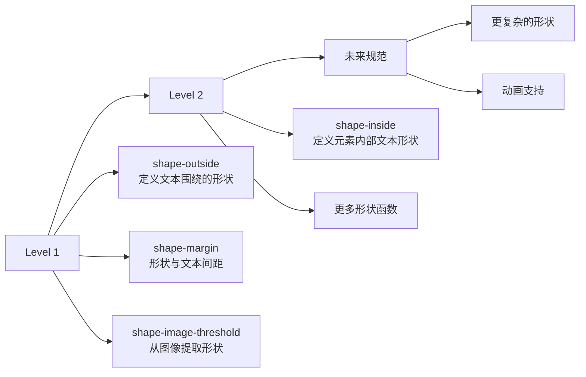
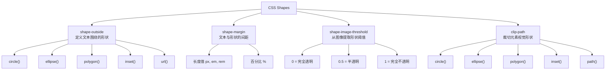
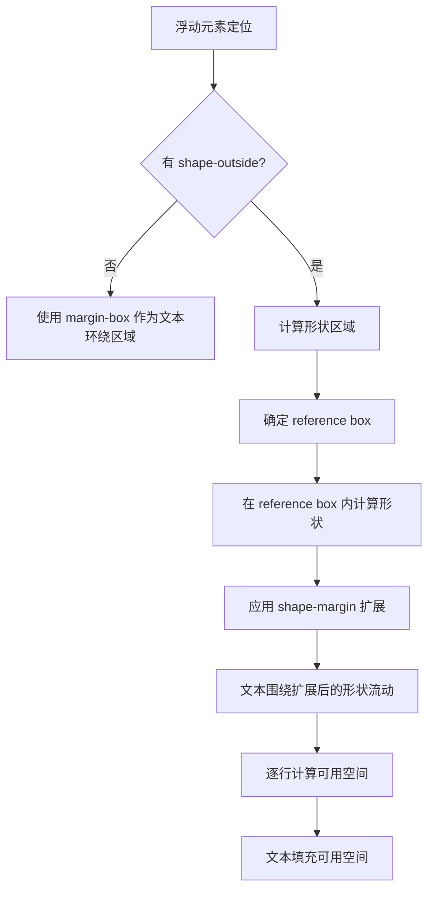
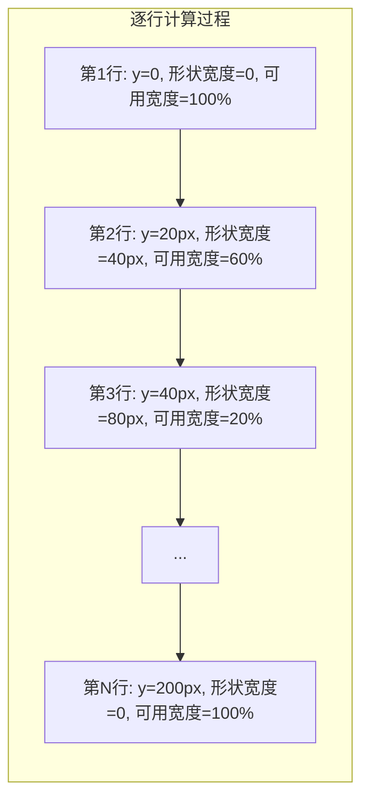
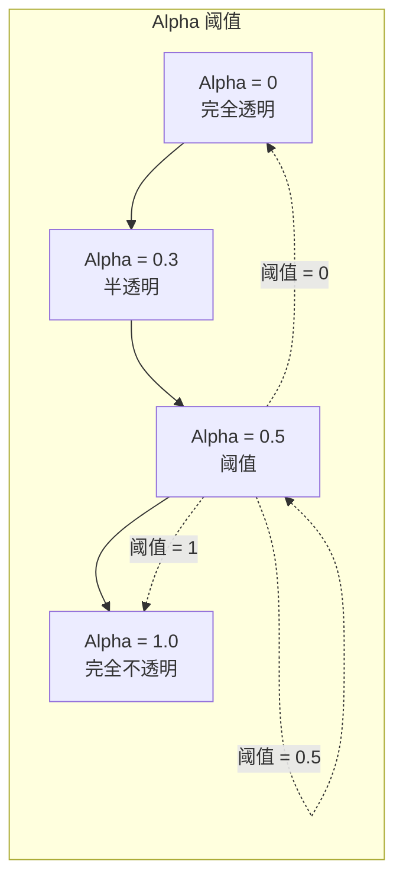
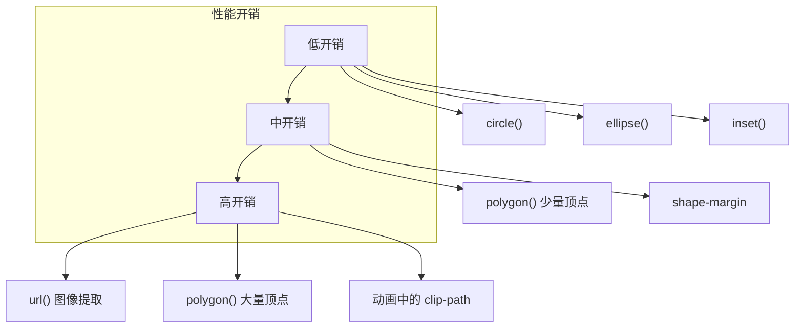
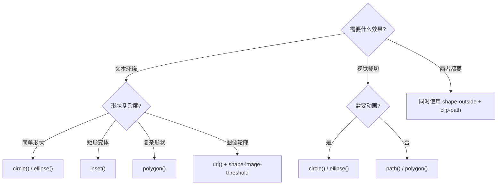

# CSS Shapes 完全指南：打破矩形布局限制

到目前为止，Web 布局技术都遵循同一原则：**让矩形块元素按行和列排列**。CSS Shapes 打破了这一限制，让文本内容能够围绕任意形状流动——圆形、椭圆、多边形甚至图像轮廓。本文将系统性地介绍 CSS Shapes 的核心概念、深入原理、实战应用和最佳实践。

---

## 背景与动机

### 为什么需要 CSS Shapes？

传统 Web 布局基于矩形盒子模型，所有元素都是矩形，文本围绕矩形盒子流动。这种限制导致：

1. **设计受限**：无法实现杂志般的不规则排版效果
2. **视觉单调**：所有内容都是方块，缺乏视觉层次
3. **创意受限**：设计师想要的不规则布局难以实现
4. **用户体验**：矩形布局无法引导视觉流动

CSS Shapes 的出现解决了这些问题，让 Web 排版更接近印刷媒体的专业水准。

### 典型应用场景

- **杂志排版**：文字围绕圆形头像、不规则图形流动
- **创意网站**：非矩形布局、艺术化排版
- **产品展示**：文字围绕产品图像轮廓流动
- **数据可视化**：图表周围的文本自适应
- **品牌设计**：独特的视觉识别系统

### CSS Shapes 规范演进



> **当前状态**：CSS Shapes Level 1 已广泛支持，Level 2 仍在开发中。本文主要讲解 Level 1 规范。

---

## 核心概念体系

CSS Shapes 由三个核心属性和 clip-path 组成：



> **关键认知**：CSS Shapes 改变的是**内容流**（文本围绕形状流动），`clip-path` 改变的是**视觉形状**（裁切元素的可见区域）。两者常常配合使用。

---

## shape-outside 属性

`shape-outside` 定义浮动元素的外部形状，影响**相邻内容如何围绕该元素流动**。

**前提条件**：`shape-outside` 只对**浮动元素**生效（`float: left` 或 `float: right`）。

### circle() — 圆形

```css
.shape-circle {
  float: left;
  width: 200px;
  height: 200px;
  border-radius: 50%;
  shape-outside: circle();           /* 默认：circle(closest-side at center) */
  shape-outside: circle(50%);        /* 半径 50%（按 sqrt(w²+h²)/√2 解析） */
  shape-outside: circle(100px at 0 0); /* 半径 100px，中心在左上角 */
}
```

```html
<div class="article">
  
  <p>这段文字会围绕圆形图片流动，而不是围绕矩形盒子流动。文本会在图片的右侧和下方自然地沿着圆形轮廓排列...</p>
</div>
```

### ellipse() — 椭圆

```css
.shape-ellipse {
  float: left;
  width: 300px;
  height: 200px;
  shape-outside: ellipse(150px 100px at 50% 50%);
}
```

### polygon() — 多边形

```css
.shape-triangle {
  float: left;
  width: 200px;
  height: 200px;
  shape-outside: polygon(50% 0%, 0% 100%, 100% 100%);
  clip-path: polygon(50% 0%, 0% 100%, 100% 100%);
}
```

**多边形坐标规则**：
- 坐标相对于元素的 `reference box`（默认为 margin-box）
- 百分比相对于元素尺寸
- 像素值相对于元素左上角
- 最少需要 3 个坐标点

### inset() — 内凹矩形

```css
.shape-inset {
  float: left;
  width: 200px;
  height: 200px;
  shape-outside: inset(20px 10px 30px 15px round 10px);
  /* 上右下左 内凹，round 圆角 */
}
```

### url() — 从图像提取形状

```css
.shape-image {
  float: left;
  width: 300px;
  height: auto;
  shape-outside: url(star.png);       /* 从图像的 Alpha 通道提取形状 */
  shape-image-threshold: 0.5;          /* Alpha 值 ≥ 0.5 的区域构成形状 */
}
```

> **`shape-image-threshold`**：指定 Alpha 通道阈值。`0` 表示完全透明区域也算，`1` 表示只有完全不透明区域才算。常用 `0.5`。

---

## shape-margin 属性

`shape-margin` 在形状边缘与围绕文本之间添加额外间距：

```css
.shape-with-margin {
  float: left;
  width: 200px;
  height: 200px;
  border-radius: 50%;
  shape-outside: circle();
  shape-margin: 20px; /* 文本与圆形之间留 20px 间距 */
}
```

> `shape-margin` 的最大值不能超过 `shape-outside` 定义的形状到 `reference box` 边缘的最短距离。

---

## clip-path 与 Shapes 的配合

`shape-outside` 控制文本流，`clip-path` 控制视觉裁切。两者配合实现完整的非矩形效果：

```css
.shape-complete {
  float: left;
  width: 300px;
  height: 300px;
  
  /* 文本围绕形状流动 */
  shape-outside: polygon(0% 0%, 100% 0%, 50% 100%);
  shape-margin: 15px;
  
  /* 元素视觉裁切为相同形状 */
  clip-path: polygon(0% 0%, 100% 0%, 50% 100%);
}
```

### clip-path 函数

| 函数 | 说明 | 示例 |
|------|------|------|
| `circle()` | 圆形裁切 | `clip-path: circle(50%)` |
| `ellipse()` | 椭圆裁切 | `clip-path: ellipse(50% 30% at 50% 50%)` |
| `polygon()` | 多边形裁切 | `clip-path: polygon(0 0, 100% 0, 50% 100%)` |
| `inset()` | 内凹矩形 | `clip-path: inset(10px round 5px)` |
| `path()` | SVG 路径 | `clip-path: path('M10 10 L90 10 L50 90 Z')` |

---


#### clip-path 交互演示（MDN）

裁剪元素的可见区域（circle/polygon/inset 等）。

```html
<!DOCTYPE html>
<html lang="zh-CN">
  <head>
    <meta charset="UTF-8" />
    <meta name="viewport" content="width=device-width, initial-scale=1.0" />
    <title>clip-path 属性演示 - MDN 示例</title>
    <meta name="description" content="视觉与颜色示例：clip（path 属性演示）。" />
    <style>
      * {
        margin: 0;
        padding: 0;
        box-sizing: border-box;
      }
      body {
        font-family: -apple-system, BlinkMacSystemFont, "Segoe UI", Roboto, "Helvetica Neue", Arial, sans-serif;
        min-height: 100vh;
        padding: 0;
      }
      .demo-layout {
        display: flex;
        height: 100vh;
        gap: 0;
      }
      .snippet-panel {
        width: 320px;
        flex-shrink: 0;
        padding: 16px;
        display: flex;
        flex-direction: column;
        gap: 8px;
        overflow-y: auto;
        border-right: 1px solid #ddd;
        background: #fafafa;
      }
      .snippet-btn {
        padding: 10px 14px;
        border: 1px solid #ccc;
        border-radius: 6px;
        background: #fff;
        font-family: "JetBrains Mono", "Fira Code", monospace;
        font-size: 13px;
        color: #333;
        cursor: pointer;
        text-align: left;
        transition: all 0.2s;
        line-height: 1.4;
      }
      .snippet-btn:hover {
        border-color: #8083ff;
        background: #f0f0ff;
      }
      .snippet-btn.active {
        border-color: #8083ff;
        background: #e8e8ff;
        color: #571bc1;
        font-weight: 600;
      }
      .preview-panel {
        flex: 1;
        padding: 16px;
        display: flex;
        align-items: center;
        justify-content: center;
        background: #fff;
        overflow: auto;
      }
      .preview-panel > section,
      .preview-panel > div:not(.snippet-panel):not(.demo-layout) {
        flex: 1;
        width: 100%;
        min-height: 0;
        height: 100%;
        display: flex;
        align-items: center;
        justify-content: center;
      }
      .example-container {
        text-align: left;
        padding: 20px;
      }

      #example-element {
        float: left;
        width: 150px;
        margin: 20px;
      }
    </style>
  </head>
  <body>
    <div class="demo-layout">
      <div class="snippet-panel">
        <button class="snippet-btn active" data-index="0">clip-path: circle(40%);</button>
        <button class="snippet-btn" data-index="1">clip-path: ellipse(130px 140px at 10% 20%);</button>
        <button class="snippet-btn" data-index="2">clip-path: polygon(50% 0, 100% 50%, 50% 100%, 0 50%);</button>
        <button class="snippet-btn" data-index="3">
          clip-path: path(&quot;M 0 200 L 0,75 A 5,5 0,0,1 150,75 L 200 200 z&quot;);
        </button>
        <button class="snippet-btn" data-index="4">clip-path: rect(5px 145px 160px 5px round 20%);</button>
        <button class="snippet-btn" data-index="5">clip-path: xywh(0 5px 100% 75% round 15% 0);</button>
      </div>
      <div class="preview-panel">
        <section class="default-example" id="default-example">
          <div class="example-container">
            <img
              class="transition-all"
              id="example-element"
              src="data:image/jpeg;base64,/9j/4AAQSkZJRgABAQAASABIAAD/4QBMRXhpZgAATU0AKgAAAAgAAYdpAAQAAAABAAAAGgAAAAAAA6ABAAMAAAABAAEAAKACAAQAAAABAAAAe6ADAAQAAAABAAAAlgAAAAD/7QA4UGhvdG9zaG9wIDMuMAA4QklNBAQAAAAAAAA4QklNBCUAAAAAABDUHYzZjwCyBOmACZjs+EJ+/8IAEQgAlgB7AwEiAAIRAQMRAf/EAB8AAAEFAQEBAQEBAAAAAAAAAAMCBAEFAAYHCAkKC//EAMMQAAEDAwIEAwQGBAcGBAgGcwECAAMRBBIhBTETIhAGQVEyFGFxIweBIJFCFaFSM7EkYjAWwXLRQ5I0ggjhU0AlYxc18JNzolBEsoPxJlQ2ZJR0wmDShKMYcOInRTdls1V1pJXDhfLTRnaA40dWZrQJChkaKCkqODk6SElKV1hZWmdoaWp3eHl6hoeIiYqQlpeYmZqgpaanqKmqsLW2t7i5usDExcbHyMnK0NTV1tfY2drg5OXm5+jp6vP09fb3+Pn6/8QAHwEAAwEBAQEBAQEBAQAAAAAAAQIAAwQFBgcICQoL/8QAwxEAAgIBAwMDAgMFAgUCBASHAQACEQMQEiEEIDFBEwUwIjJRFEAGMyNhQhVxUjSBUCSRoUOxFgdiNVPw0SVgwUThcvEXgmM2cCZFVJInotIICQoYGRooKSo3ODk6RkdISUpVVldYWVpkZWZnaGlqc3R1dnd4eXqAg4SFhoeIiYqQk5SVlpeYmZqgo6SlpqeoqaqwsrO0tba3uLm6wMLDxMXGx8jJytDT1NXW19jZ2uDi4+Tl5ufo6ery8/T19vf4+fr/2wBDAAICAgICAgMCAgMFAwMDBQYFBQUFBggGBgYGBggKCAgICAgICgoKCgoKCgoMDAwMDAwODg4ODg8PDw8PDw8PDw//2wBDAQICAgQEBAcEBAcQCwkLEBAQEBAQEBAQEBAQEBAQEBAQEBAQEBAQEBAQEBAQEBAQEBAQEBAQEBAQEBAQEBAQEBD/2gAMAwEAAhEDEQAAAfJZWr9b/CRYsUOCJDomz9M8T3vHY9Y820FfoX6nkCQeCGjaybDa5mZ18yLRr6V8d+pOq70rhfgf0rzv1n0zqOb1fDPI/senB8Oqe/sejy/nBl6n5n+jflzUTgP0/wCfW7tt2fN1dj6t4j5n+X/uX1xxNB1HjXiD323pvK0+bKb6rokbmukfeTerz+zeBcZ6l9Hj4qGyY/qP4Zbe1eMvvmPs33rvkbT8e/TPeeN8V9897j+fu66TpvY5/MuB+jaVpn3HIeKeLv7zyLXnvD77Lj+m5z9t/ILVo+lvH6fyKPcfzr9k9M67wIvz31/SdP48bl9f1Sn4NAPu3nvIn7PD+efoys8Y9b5d3eFH+x/h1xlbs8Kg9N5HmPzn9sp/SOfr/wA7/bvUqg5+LvrnpaUzDjST2ed674+8vv1f+eBt3Ifr/wA7t9ldXnpbudj0cPdPqb8S/pj3Puabrf5u/TaPx33Dyn0bxAR+x/qT8MTC0/pf4eILpvm9vKp6PPRC9QxOIz1ufdfnH2v+U/6buPm7veN+x+WHC4/fvw0aSQHCFy3TW3mJ14dtqiFas8ZH+P8A0BqlyH3PnBpXHqeKhK4DCbu2eetzKtryo0xUbatMTUJVEYSrUJKkzo8z9M8L8X63/9oACAEBAAEFAvv0dHT7lHRntR07cHVJaBCh7Reype73KlSSCJ8yMvj9wj7kCokmyWop3K22S7hsbEqFlbTKF5ZzPcNv5QtlbTDDeKuA5TGT2PeOEzyW1vi0bffmO42O7uJLTb7ayjju7ZLmvbRy21repg8N3cEtztF8lF1Ypka41RK7xRLmXteyoFyq6s9vR/STbwi78V0hub26ujaDS6SSI5ZrdVp4lvRD/Se0L5lnuEO+7VJbzs9ttSlDud9VYW/MmuZdu2a7kQrYrGNEMFmlxCNyUciUs7XZTQ7rstxE4bu4s5VbojdLSVGCz22SxjRbbqqHd/ENhY21kmbd7KxN/vd3NDb7xu6xb7puJRcbneY3G5z0i3m7sBa7nbbgnc9rt71PhsWyZd3szaXZ7X28KmK7CTbHN4kkvUx5qXtvh+eUI8H7ehcHhWzCZfC9hSHwvtJuN52SRACpI12viHS8tJ020m6fpPbj22+2SN88S3vOtfDO3T36rCwtLFPvcMAud+RFfxb3BjNvUJFju5Xdm5huE7ntNvePcbe7TfW93FuG27dGpERYY0O3Sy7nuN9BFss/9IVTOC5JVuyMbqE6Sr0244RG6What8jxO3e97ftd9J70EhIPHtHH+j7y9WL3b7eRcMsMtBfrEtumShWqoSow2s82IiQb+5VvATZbbZe7JZ76Nc67O7v7ZNxHbXFU2yxOhMIoIclXEoUbtalFciNvt7GNZi7H7ksaZo7W5ksJvcFyzbXsyIX+jrN/o+zD3PapIGZE2os7Y3Cu5Y+5cWyLlO33NxtE8F2lceRKblaoYt43SK2t4LRd3LT7h40+6tCJU7FcciSLLlXc0dvHN/Hrv7p+9RqSFpsN0RJBvN6m7k+8eP3g7ZO8vlyxffPH76fEVvtLVexbh988f5+XdJuZ/9oACAEDEQE/AdzbtP5PTfD49ol1OXbfpRJ/1nqfi4UZdPk316UQf9Z9uX5ILCbb+5H7idZ1sf1cCIR9JS5/1h/vNy/ul1NbcvVQyx9boEf1iR+T0fyvR9DHZ0mEf4T5P++Xq/mOj60bOrwD/CPI/wB8sP3YzTG2PXxxj0EYj/Y36/m/vr+5PV/H/wCqJkSgfWP+8vRi/BfD5uu6kYMENxeo6rJhjHoyK2cUPAcXTdTPnwj4U+ZSf7j/ANzOfpOox8jlyZcvV9Lk6GIvcPH+x4cmKWOZhMUQ/wC4e/InBLNt8kBx5IYAcmX8RZfI58x+zgPs9T+f+xf03Ufn/sXD1+bAds+Q5ckTXUYPIf3z6r3vkJZfUgX/AKz+63yEen62Ep/h9Un9Tk3y8PR/C3zLwx+Hwn0ZfEYh/Zev+JoH1Diyx6WZ3fhL1/U+9nlk/Nt/3Dr52GY/ps34h4/q9Nx9pYln5c8n9+v3gjkynp8B49f95MSl6Xqp4cgy4zRD+6H76YOuxiM+Jj0/3kica4cuWIjuL+/f79RiD0nSH7vU/k7mDbbg6ieOQnA0Q/uF+/uPq8X6fqTWQf7F/wBxG/3EMZB+h6E/4Zf74DuRJj2f7h7DBPq5DqP8X/fIf3jxY8fXZo4vw23pDstKNP3W6THlM/cFv//aAAgBAhEBPwFpsPV/K5ASOnx7q9bof670nyU5cZ8e3/PY/wBd3DQjT95P3g6fB/InZP5Dj/YuH5Lpd+/FCWM/0Ng/0IL1suo6o/zJcfkHo/1HTG8cj/gKev6WM90sBmfzlI/7B/d35/B1I9qNgj0KX5Lr4dNhOSZpx9B78j1E5cH1eu/eL4jpuN24/wBOU/7ibiHGLDx/hf8AgZw/tYf9i/HfvN8X1h2S+yX9f95uHpf0nUQ6gH7fzYzEgJRf3r6M5o4x6Py2Dqfk8o6bop/yY+T6PQfud8d0MN2b75f1/wB5In8Z6Yx/xK/qvjx4x/8AFofl/wB0uh+Rh7mD7Z/7x5D8AOq6bJL47r5fafw/4f6P7v4pQ6WMJelv709Fk6joMuPD+KuHoulj8b0senx/iPJeo6qX+d9+VPvz/N6XqpxlcS/OdDL5DpRLH/EgRT02LZjjEtP74fEzH8/H4cv3cp0wwf3W+Ilih7uT1TpmwxyRMJeH97fgs/RRllwiw/I9d1s53Odf56fgOs60ZRsluB/zv7q/u4Zbeozjj8nayGuXFGcdsxYf9xU/3DrPgyfq+igZQl6DyC/7hR/uG0ulh+u6+P3HxH/ebWkuz988mePTRPTjm34XJkn0mOWXzWs/ofL5pRraX//aAAgBAQAGPwL/AFLoWFzn5AcS1e726UD1pV1uLcKr58CyuI9Px4h6KB/mdI+cr9TymtxRyrSkRyRipTwr/t/BiefSr6IVKHyJf0kCwPkXz4xmjzB/raRaxcxagDU+Vfj/AHHUQhSPxfs8s+nl94RDz4sR26Cs/B1MKnjyihS6CqhoB5sBKQSPzK4vrmSP8p9M6P8ACDKZAFV8xxeCaKjT7JrR9MQV8izFKkoX8WY18U/cEcepLUtaso0pA/tK8/sf0ikwIf0QVJ9lP4XKIIMV+RUavK4mUuvx0/Bl8HlEpUZ+Bo4uYlMnTxOh4l43SDD8eIdQUzI/2/wapYhlFjWvp8/uKlIqrgPQPkwUM6/P9kPJRMsivtJY55EQ/EtapKyaefzf0cSR9j0A7apB+xoyjxVTinR5255yR+L5tusxrH+3q410xWCQsDyZHH49/ebvz6qHgB8WLe0OnKFVU0oD5PGFOvmo8S8ZV5L/AGU8XIm3pFVKqeZ4aavI3KvxfVcK/F/4wv8AF/vFqP8AaLxJ5sYoMT/deUJ6hxSeIZX7E37X913e33ek+Q0+Q8iyOKF6pPePboz0JSnL4q/0Hb7tMaL1SoeiT6vCz+jj9fzH+4wmMFSlcANSWld6rljTpGpZQmSUU/lOnOl/Ef3HrJKf8r/QaAYivX8yiWZLMlY4lB4/Z6vOMlC0+nEPk35oryX5H5sbqT+/Vl8U/s/qcC5P3yFFK/mPP7e/OXwxyH9oaNW2QnrUKqPp6BlKjyokGij5/IOluihPFX5j9r6zr6ORHKNK14+r9g/qeiCyeXQIFeLySzIPo5f2h5/NiymGOXn5U+D5S/IctQchV+ZZ/Vp3ChxHB8kmiplmvw/4YOO6hGNssUP9of3XS36R6+bqo1Ljl/bTT/B7yy/tKp+DyQaF4ynFX6i5twk/e+1F/ZHH8XPEg6LT/A8RwH3Jdwi/Ogj5E+bG3KVWiQa/yvJmGTRSdHVok/0tevyLIDLRH8Kn/K1dXgf3aNV/L0cSRwSrln5Dg1Sr/eSfqHp92hZJ/drYvYPbRx+I7GA/3xP6+L4vFl8tGqlcHyEGqjqo+pfMm4k5AffVGvzfJm9l52IyRJ/vLjkuF5rT5Dgz9F/C1fR+TMluc0jy82ZZP3quHwD95uBp5D+Zorj6spk6oz/A41QAyZiop6fFggpqfV5UzPniwtPUuT2Qzd3f5jWnr/N4LFQ/0XOacw1iV5V9HQ6kMyScEtV9KND7A+A/nQD/AMM08zJcv5sEKX9vT6vkxmsaf1n+fkVZxoxX0+3Q4jzIfLmACk/smo/n/d1Wk06icqpICfXTQv3qKKSHLimTjp9g0/1OrlgBPlV//8QAMxABAAMAAgICAgIDAQEAAAILAREAITFBUWFxgZGhscHw0RDh8SAwQFBgcICQoLDA0OD/2gAIAQEAAT8hOCxYsWP+RdcV/wCEWLFae1G0MP8ApFY5ZRkCvzZlkf8AEcFcED8j82LHHAfyVBjuTPy+vdP0Ibwk3/kVJulOP+RTK36P+6jMPUc/SVGo4+B4JIZjVX48Byx1z1VGf/wcWFDvsGssK4054HCWRMKBMExLM9K/LHkanw/vL4ali8qcH/Pbu+Bfrtf+qP4bt/8AbsKE5glSfFh1FxK/OH1eTr2Kpid6/wBlgY/q/Y5+6ihKIEiWJ7wgszgfFNM8Ein87eSaitTacU+vw/zdO/R8gPSgfHDifo1v5lyCmRhiABvMFWIOjD8EFCaOaId/VPlDy3/i+SDSJh18XIien9W09lmbH9qtQ+ZCYfpYvKnBSZTNMDy/0XZYrjPLHa9XX19yq+khP8J/umQ8JlBw6KORZ4FAfwC9AH4qJ+wFXCM9jds13ABB+u/qm0BD4fQ7spa2+UGnkbALA4HCUbQwpeBZj4ey9bYnclYSUw/iiYb8j5m/kcb7dFPEcTl7Pl4uQGnS+Mr/AGZoFt5tD0QSPghjkV9H8O/3HsoACLD3/c/dCEwHz/JbPxS8wf4jPvijaRBXuGJ8WD6EZ5+CquSC8Fk9mT6qtF8/2eno+6Vq2CR8X5Hy35eD6myKskQePkqahYP0A/gVb5H033dyi4DO6/hzSaQxUIUYEfOBPA6ffDUQbOMl8vgR4bz49rAfoR+aNpxSe368/XG4OD/Jh7e/V8xYTI5Dz7c+bDBzDfkW/wBXD1xA1akSQCHgT4pJc/ukjL9pSUFUyXc8e7LmY58l6xv/AIPf81pKUw1d1VgZMK44xPnkrodD+T7i8rwKnN7q83iL0nfwWElAHQbPvl81HB73P/V0cNV7sVGfkL/SVb0FXwxP0Jf5Lg/eKheNP+EVTkIfRr/j4LJtDfhXP7oQY4P+EZYsdec9on7FOU/Q+f40/Fkh6S4N0LyzQ+in8xR44Nl09XhW/lf+ll5RZn9z/hzVYJHZhgPZ31FgzC6fh/2/4NoYWKiEJHGzYzEPi7Mlk/wksVUVwvwIfso1QhPHKpDBShTIh2tLcBv/AAg6ojmKusian/OVDCxYptSHvp6bqiLz4/8AKGS9od3z6eqR8M0d68t1w1e/9ruRJRy955pfd5cf93cIUHm/t/i70Hm4X/qXlRlj/kXiuePD/wAplKSTz6U+h4qLtOFiKFuon5LHTbhtj0PNZw+xRyvxU8kQf4cUAAEBxY//AABgsWKliuZx+viosAnedvVeT3PmuLVJUMwlmvr9F64lP2V2xYqf85U4P/wR/wAdUDiYoZEfJYOHMqSQSAx226saXx/oK/8AI/6n/A4P/wAXYe6BXo7EpPyOvFeqKeC6hzrnOf8A8MWPFjK9H/4z9fGhsOU+5/iohXCRniSPgTtixY//AAc1DCx/+Inq8/8AY/61ekIAlzzf/9oADAMBAAIRAxEAABAsEkeSHLDEKxkHaGck+AOXNFNa58zcdHtUta+xRwkdhUWxv8hy+aMLsSNgw/zeGHOkDCmFh+SGAATJVwv/xAAzEQEBAQADAAECBQUBAQABAQkBABEhMRBBUWEgcfCRgaGx0cHh8TBAUGBwgJCgsMDQ4P/aAAgBAxEBPxCB8xdF6Fs+FGAPxqP2j/WYgz667Pri5ZGqP4Zy+p4O6bwPh2pwv34Ekm/wjfmI/RvPV+aCy2+VceX5h9C/Jefvw8f1c9ZfYGqM+PmV9TmyAyMyw13N+R+3Ep9icoccHavwfePrgblw5fnl1dYHoP2nPIfyZHxj+IXfBNnXEfqIHXyZ+3HzJMRiPCP0YFeCad5roPxvGxw/IHz1+tskPyP8zty2Dpv9aw7+Z/puu/dnCb9Yvkh+5xr/ADdmZz/R/hlbqOEwOH6CW7/vdF/VawPs/JID4nd+hYn0uPy+P6S92Orwdvh/kkv6XVg2GE8PVreK6P7P9+Ct9S0Z2vlf7fUfOfEcJ0+084PztHq4DofIP1/tKXWU+CIuQJYWl7eAfU+/1km0Orp+5/u0uvfgyfWmwFiOO/4Ji9Dx3ePziDcp9EPF395U4DNv/9oACAECEQE/EE8CdMyH5kPy9br+RODG9IHfpjMfpobb/MPtx0rtOn0Rif7g/Sfp+aAR+vxaBfo6A+gdf7+dkLG+eh/1by/l2PyxwB8ZnFxtLs1z7PaH35jFPBwL9blPbdYKfX7EgtF8a/q4IPR9Gg/sN8Wp+n0ixKfkN+3Synw8r4H659fh6l40TRL4olX6HFxfzNM1zu5y/Ygn5r0/j6Pz2MGL+H+JDpv6PpI3PrBh+Qf3LGJhp5H4C+iHXxfP0B+WuSX43935H3S6Y7T6qc/4Jaq79TOZG4lhjA/ruIDmMfVQ/rv9JO9Ab+fzalcuXf2f8MQ57+ZfFzmSBx22FecYf7f9ezJ1GN9MgPx/M1e1zODj7D/q12RiLj+/H58XDP2F9fv9rPxZx4mInYwFCcgv5I5x/wDWGYD5Pg+v0P0P3vt86x7t0x0TTM+YxMY38/EtR7kmej8S/9oACAEBAAE/EDKJ0WHg/Fh4PxYeD8WHg/Fg8H/B/wDBdtI6saksDYu3Lnc8UZ9Vcjqw8H4sPB+LKkVZ8mKZZOoT+KJoV0p59HlT5qkjHVdwRAz9/NIC7z1HWtPGVWL16V+L4BjqaDEZ2CfkykScPVdqAmqI80Rjz8XhoTeXrukGLkyfrV/UVS7ARQO9ZfC9tIJKQQDROlYDAd6MhqAEEyx476oqYX1/oUcRUI0+YI/JQWYy0T2DJ7yTH3QluXHPEhqI6OafGKuZ506+rO85lMr2Qj6fpvbXVJPKUm8H/Hjg2uRzfvKwEEEPK/t+WnUvSF/DUsILGWnJgBBrMUcBBFYNREPgBHlvCqxix9LZCq41UEvQVYkhf94VxBHIewdsD14uoYlng+mX6sIkMKB9Q/KX4soM5vkOH8UITWU0QPgsz8wCgPKnAO1rjHBYllzklBeV49MZAOFexM/uGs3J4Cf7Q/qnDXYXCT6k4THm6FSmgcwIB9UJCoNDbLyz/PVlXYlOeQZfZU1tCKA0OZgdWR/74PwfiyyFgSU/DnqZ8VaWHFEQDvhKEQjZkz1eWh+QKONgF5HvVSA61S88zrWDKmRJLMXqKE8uaUeDmPjCzYDZcvkAftcswLqC9ZS0MA6XyzYUIjA/0Uwfwj/VBivEIH9VIaBnsumJvZWmJSII2ev4n1YAwgnDluDyJS9sxXHLENkF8jxVKHL2Fj69nTlkbdB8FPR1wAPSLCU4CVumIRNWChKSCV4DaPqAaF+XfBB4L4xHI33z7WfVI4446SkMgnAKKkhMAP4s66ax3HVm5E7Qn9NCFTCRqx5s7shUifJJI+TyNRyYQ6e448GHkLNiCPEugH5uHXhgnbwqaYPgBCoSdjwoMk6jDIOvMj3dtGLwfxVoHDm4xc4HBU0O0eiHiPadSg2bNb5GAvY1PJPl0a3DF2EDV8v2+aNzcoajJ+f2e7gnNEJQEP8AuzBPoZsSOnI/tI/DZHOB5NKwxwLIiPJtKmcHl8Fso0CnMCSETs+mx7DFJLIRD9D2A6ypbPVUMGhqchHZUYi8AODg4GBwSOqk6CHxdg2M8LfyB/8AKPnuWXKdICulBrgx0EQrRwaO4B+FPjUE/u4ej4FOy47yNjo9qFnHGYIiwjz5sajDiTn2P9X0FgP5SbJ3PESCGAfabBz1Xl8J188PVDhikJjGAR9+HT0yhWngnF5AnkEYEKL44aAhBdATwPsremeHsjl7L6ihnQfUfxdGn6CbHw8NbqV6EnJ+AHxYNLlnnnkPLuXqkHcOSHkNPrL7K1SkYV1Kqyv3dT2JjnmJ7/Hubxn9UYTsLMeq9BIhYyvon/Io5/dUSdj0j4aGyJ8h4zF6cfJYnblxCwHgiHy92AAuemw+YM/FidQB6vNFBA8FhXCwFCEcCciRfcnZXEpukUhrmT49ZUqD7YQh5PF5xoZnuLo8biU1HqH532lQo8DKmfwzOZeeYA/Fh2R/FCKOaxKcl5inxNLTyATyFGX0TyJDm7jKczL82z7Z1UIqzoSei+lF4VB4RxGvCmVWHARPqKxMa88zE8j+T4ohV04+bFMgidRLP1/Dcuyq+N7WtQGp4ieX4DbKyVSPC4fRlh8QXwB6/wBUAT/0mfg9N7pwsMnFAh5Q/j1ZlanXVDOhl4P4sLCnQUCE+A8Q+KMUwBd+h8rpuywIQambg0q+TxLGoiaMYCYmdB7TLGy8iGDnxWRn+k4GUSoYXQytTGooM7Iz676ofKZzAo08f49mzXJH7yfIftrvHVScb0NG6kZ8FhYbLnxYqRHOX0fPp11RZgTyGYvySpSVDUdARQ9azORYUwJZEIYBknilHpI0B3EecobHE0NaqEkOAdBMI7OVJKhYpZn1/LqiWLAMAOAKwqd1mPdMIuxOQVPX/MDml+F4YD9ryukrr2V5cr//AAJGKV4RWI4efxSLSXWR7W5VAfwGp5VD3LZcrDvLhuUlSjdPN4P4qeLDdLBsJyriiahhR2iaJxFROGXhSJ6gYlUJi5Q8xwgxO/A8v4rVd5qeKidqdVCLJpea/Yg/7E2Cw1CYuQ+yzx+3OIIiqYqcGHZH4kAutUKdEEJISp5qeKk1K/hVDjKNHNP0H8f/AIo8V6Hw1ICyIAJuZPCkiOAoyRoAYOGWIqGfNUc7WDUsea5P/N+GP4/5gqR/+CA1A1ZS91IvNZtTK8XeHefmvwd4FxKnlifXF//Z"
              width="150"
              alt=""
            />
            We had agreed, my companion and I, that I should call for him at his house, after dinner, not later than
            eleven o’clock. This athletic young Frenchman belongs to a small set of Parisian sportsmen, who have taken
            up “ballooning” as a pastime. After having exhausted all the sensations that are to be found in ordinary
            sports, even those of “automobiling” at a breakneck speed, the members of the “Aéro Club” now seek in the
            air, where they indulge in all kinds of daring feats, the nerve-racking excitement that they have ceased to
            find on earth.
          </div>
        </section>
      </div>
    </div>
    <script>
      const snippets = [
        `#example-element {
  clip-path: circle(40%);
}`,
        `#example-element {
  clip-path: ellipse(130px 140px at 10% 20%);
}`,
        `#example-element {
  clip-path: polygon(50% 0, 100% 50%, 50% 100%, 0 50%);
}`,
        `#example-element {
  clip-path: path("M 0 200 L 0,75 A 5,5 0,0,1 150,75 L 200 200 z");
}`,
        `#example-element {
  clip-path: rect(5px 145px 160px 5px round 20%);
}`,
        `#example-element {
  clip-path: xywh(0 5px 100% 75% round 15% 0);
}`,
      ];

      let styleEl = document.createElement("style");
      document.head.appendChild(styleEl);

      function applySnippet(index) {
        styleEl.textContent = snippets[index];
        document.querySelectorAll(".snippet-btn").forEach((btn, i) => {
          btn.classList.toggle("active", i === index);
        });
      }

      document.querySelectorAll(".snippet-btn").forEach((btn) => {
        btn.addEventListener("click", () => applySnippet(parseInt(btn.dataset.index)));
      });

      applySnippet(0);
    </script>
  </body>
</html>

```
## 实战案例

### 文本围绕圆形图片流动

```html
<div class="article-flow">
  
  <p>文章内容会自然地围绕圆形头像流动，创造出杂志般的阅读体验...</p>
</div>
```

```css
.circle-flow {
  float: left;
  width: 150px;
  height: 150px;
  border-radius: 50%;
  shape-outside: circle();
  shape-margin: 20px;
  margin-right: 20px;
}
```

### 文本围绕不规则形状

```css
.leaf-shape {
  float: left;
  width: 200px;
  height: 300px;
  
  shape-outside: url(leaf.png);
  shape-image-threshold: 0.5;
  shape-margin: 10px;
  
  clip-path: url(leaf.png);
}
```

---

## 浏览器兼容性

| 属性/函数 | Chrome | Firefox | Safari | Edge |
|----------|--------|---------|--------|------|
| `shape-outside` | 37+ | 62+ | 10.1+ | 79+ |
| `shape-margin` | 37+ | 62+ | 10.1+ | 79+ |
| `shape-image-threshold` | 37+ | 62+ | 10.1+ | 79+ |
| `clip-path: circle()` | 55+ | 54+ | 13.1+ | 79+ |
| `clip-path: polygon()` | 55+ | 54+ | 13.1+ | 79+ |
| `clip-path: path()` | 88+ | 97+ | 13.1+ | 88+ |

### 调试工具

- **Firefox Shape Editor**：Firefox 开发者工具内置的 Shapes 编辑器，可直接在页面上可视化调整 `shape-outside`
- **Clippy**：在线工具 [bennettfeely.com/clippy](https://bennettfeely.com/clippy/) 生成 `clip-path` 代码

---

## 深入原理

### shape-outside 的工作机制

`shape-outside` 的工作流程如下：



**Reference Box（参考框）**：
- `shape-outside` 的形状是相对于元素的 **reference box** 计算的
- 默认 reference box 是 `margin-box`
- 可以通过 `shape-outside` 的 `<box>` 值修改：`border-box`、`padding-box`、`content-box`、`margin-box`

```css
/* 指定 reference box */
.shape-border {
  float: left;
  width: 200px;
  height: 200px;
  padding: 20px;
  border: 5px solid #333;
  shape-outside: border-box circle(); /* 使用 border-box 作为参考 */
}

.shape-content {
  float: left;
  width: 200px;
  height: 200px;
  padding: 20px;
  shape-outside: content-box circle(); /* 使用 content-box 作为参考 */
}
```


#### shape-outside 交互演示（MDN）

定义浮动元素周围文本环绕的形状。

```html
<!DOCTYPE html>
<html lang="zh-CN">
  <head>
    <meta charset="UTF-8" />
    <meta name="viewport" content="width=device-width, initial-scale=1.0" />
    <title>shape-outside 属性演示 - MDN 示例</title>
    <meta name="description" content="布局示例：shape（outside 属性演示）。" />
    <style>
      * {
        margin: 0;
        padding: 0;
        box-sizing: border-box;
      }
      body {
        font-family: -apple-system, BlinkMacSystemFont, "Segoe UI", Roboto, "Helvetica Neue", Arial, sans-serif;
        min-height: 100vh;
        padding: 0;
      }
      .demo-layout {
        display: flex;
        height: 100vh;
        gap: 0;
      }
      .snippet-panel {
        width: 320px;
        flex-shrink: 0;
        padding: 16px;
        display: flex;
        flex-direction: column;
        gap: 8px;
        overflow-y: auto;
        border-right: 1px solid #ddd;
        background: #fafafa;
      }
      .snippet-btn {
        padding: 10px 14px;
        border: 1px solid #ccc;
        border-radius: 6px;
        background: #fff;
        font-family: "JetBrains Mono", "Fira Code", monospace;
        font-size: 13px;
        color: #333;
        cursor: pointer;
        text-align: left;
        transition: all 0.2s;
        line-height: 1.4;
      }
      .snippet-btn:hover {
        border-color: #8083ff;
        background: #f0f0ff;
      }
      .snippet-btn.active {
        border-color: #8083ff;
        background: #e8e8ff;
        color: #571bc1;
        font-weight: 600;
      }
      .preview-panel {
        flex: 1;
        padding: 16px;
        display: flex;
        align-items: center;
        justify-content: center;
        background: #fff;
        overflow: auto;
      }
      .preview-panel > section,
      .preview-panel > div:not(.snippet-panel):not(.demo-layout) {
        flex: 1;
        width: 100%;
        min-height: 0;
        height: 100%;
        display: flex;
        align-items: center;
        justify-content: center;
      }
      .example-container {
        text-align: left;
        padding: 20px;
      }

      #example-element {
        float: left;
        width: 150px;
        height: 150px;
        margin: 20px;
        background-color: #f0f0f0;
      }
    </style>
  </head>
  <body>
    <div class="demo-layout">
      <div class="snippet-panel">
        <button class="snippet-btn active" data-index="0">shape-outside: circle(50%);</button>
        <button class="snippet-btn" data-index="1">shape-outside: ellipse(130px 140px at 20% 20%);</button>
        <button class="snippet-btn" data-index="2">
          shape-outside:
          url("data:image/png;base64,iVBORw0KGgoAAAANSUhEUgAAAJYAAACWCAMAAAAL34HQAAABS2lUWHRYTUw6Y29tLmFkb2JlLnhtcAAAAAAAPD94cGFja2V0IGJlZ2luPSLvu78iIGlkPSJXNU0wTXBDZWhpSHpyZVN6TlRjemtjOWQiPz4KPHg6eG1wbWV0YSB4bWxuczp4PSJhZG9iZTpuczptZXRhLyIgeDp4bXB0az0iQWRvYmUgWE1QIENvcmUgNS42LWMxNDAgNzkuMTYwNDUxLCAyMDE3LzA1LzA2LTAxOjA4OjIxICAgICAgICAiPgogPHJkZjpSREYgeG1sbnM6cmRmPSJodHRwOi8vd3d3LnczLm9yZy8xOTk5LzAyLzIyLXJkZi1zeW50YXgtbnMjIj4KICA8cmRmOkRlc2NyaXB0aW9uIHJkZjphYm91dD0iIi8+CiA8L3JkZjpSREY+CjwveDp4bXBtZXRhPgo8P3hwYWNrZXQgZW5kPSJyIj8+LUNEtwAAAwBQTFRFR3BM16eu3srSuXyGxJKd0rfAnXqHeQMGllZkvKWmkzE4m0FKr2p1jgUG6p+Q02dlzQoBfh4puiwq7kMnspWbqIiQyEtM8LimmwMF1JiP6xQAmhYa5i4T9Fo4cQAE7nJUfQgMnU1Vr2hx8aB8pjlCtiABpxkBqRsBoRgBsh4BsRsBqh0BrRwBixIDtR8BuSEBnBQBpRYBpBkBnhYBrRkBryACsSIDrB8CmhIBrx4BkRABlxUBlREBYQEBuxwAthsBWgEBUgEBaAEB/3IqjQwBph0EtyIBqxUB/qla/8h5/m8ovyAAohMB/qVV/45J/X1GoSQR/sBy/rtw2ToF/q1f/mok/XgwlQsB/rdooB0L/sR2/Z9PtiUC/os/qSQQmhgG0TQCnScWuyYDpioV/oY88VAFCAUEnQ4A/nZC0zkK/phM+7mH/VoQ/rJj/oE5Fw8M20ASyC4EshcA/M2X/l0Toyoi/n0xlyMcsicUwykCrSse/J5j5Uca/suG3j8CXRYYghUJ9lUJ/mEZ6ksE/pNL/mUjihwZ/MGI/pItmikfYh4d4kUGjxgL/KZldBMK+5dijQQAlSAMggUB/YNMJRkT/nA//atxXgoKZBINny8oqi8o/MeQpy0C/nYXo3R6pTIa/dKfdwEC/IhQ/ZNB/FYM/LF4/osm/ZBaomdplmBmfy4bkjQY6+nljiQbjyophSUn4V8v7p1y7VAh96R3/Wk4/tONyDYLmQIAVA8NsDsknzod6pRttEkx/3EVv0MeqQsA6DAEagsI/dmi/LZ9lT441GpF9UUEsjAN7/Ty00wckWl1ijUy6jwFmFRS1SoBqkEb+GE0QgMEzEEO7v7+/4MX92IXuDcJnXFr0nRZ7t7WulpBzR0B/n0Zz7i186qH/pszSiwo7nFA/V4m9lcpz1Qy/E4L7opbdiIZ4dLM8sq26I1s/moISB0avGVX3n1b/YQmvy8Vo19W7ntVh0dF8Wok1NvdXikiwRQAoEo7VkAwzq2o0cfGKSs1xIVtcFk8xQIASW7NOwAAACV0Uk5TADUNZEsj/teR/rSid9lThO7Nwsf+/Zz87v77zeC28Zbq8vJp8i8Ko3sAACAASURBVHjaxJZtSBt5HsfXp6Tjw9UusaculN5Ck2nVcx4ak2YivfMy6wvnRcAXYaB0NOUIhX2xFiSXRdxAITDdECbzZvUoI3mX6Sa6rzb2rqALaZWkca8nXLpKjitYTEsrTSUoCcX7/SfR9s1dn2z3K5nMJOj/4/f7/f9mPvnkcITpPv8d6HMdVvvJr6yG+jpQfUNtfZM+MjAQicChf+BEY3PDr4fU3KjXD4D6/9APPHJF6fTcZmSg/0RTTW0N6GPj1TfqByooEX96cy4ZTcsOWYps63SpVOpGJNLfr1l34mRjc/1Hg6o5po/Et5MyoMhyCkgURQnAxayiqqpuW55LpzcD8TRYJ0cGTuiP1HwUqiN6Oakqii4jSw55G1BSUVWBC382hagiGR2Ypuo0qcmALJ9s+tBgtQ01jXop3aZEo1HwRZpT1JR6Iwpcs3IGEaqRNDBBlMlAT088mWrTZYKJREvzB0Sqazqm749INrsUyCIuZTaynVWhS2lFzWbSWVWNpvxyWgGolDoXjwclWZ5TDG1i4lbd8ZoP2PKIHAkwdjviQhBqWo1GM3LQUUCUyLO0JEHDgErNQsxKajuQ0Rkw7mYxd7T+A+xLiC6CGi7JAcFqt9mAK3pAEgcUOC2AZZLN0aMirllXMD6bzKR0urY2LFrIlfOZEy1NdYc7a5v0sqMiKYBbwS4mASQFoIqqPY64VSooSjarZIMSEM8pUTW1KyUSCUmSgsmsAcOwUimPpeVI5GTT4XlWr484HAdYgstqZRhGSiqQU1a3LdniQmI2k0wmd2clxg7NQ6XPZmbDQXtQjEvStIKVsFy5bTudnLVJ7YcFVqcHD2w2h8sGWHIgzBEEgHkcmcJucjoddDniuNUlIbkYm51hgCuVjcKmUDNqNhvdpRd2S7kcBnnqDIboeKK97jComoHKpXGBbK6gF7AI8Mtqc2goNgcYaIe+oZdNe0uk1QJwgVIpaPxfL2JYDtNlAuF0NJdTFtqbDsMrF3QcVnShFe22Hi9JAxfajwCjKS54tFw1IbtcgaAdCp/MZDIFtbDL/YxhZUx1JFyJhLOtiC21f/revWqBKlm11RntaPNSOK19sA9ijQvWl1ggwRbnPS7I1WVnBIFbGFyCENsyUpChqYWFF8Xcs7334qptPqb3gDdAgda1a07EeStcgV+MlahihatnB4oHSfBUgKytNNVtvvIib9AVXB5GoCwLS6Viab310/dpVSTi1QqOXlU/XAGvh9ZiZDQ4QcM6MEpAL3xuvsePk7iJEggaZ807z8qGlLLr8lBs15VTWK54e731+Ls/J8iOHu8gjVYHLkBA2aHO07QGVhFjDYcJcIYQAEijEtjNez2hKRYP+buNpu7uc+6dNbiLKgWRW1hYWCvnih3rK62/eceqyw7YfV6TlcMrDAgK4AQvjlewqmhcGM0MmkCwAhLzlyf3htbn56dCoRDvD/aecq9c2Ub7Uhe9dXMNy+XKHVv5H1rf5YEHxgLa8K4Az5EIiwYqa8UdL0+/KsITDsNO1MQQiIx2bn4HRKH5U+tT8/A+5FtxpsPTGaXNYIB5X8rlOzpWY48T7cdr35rKhTYeGlODJGw9oLLuU8SdWoq4QFRYEBaDTlDv4SgQcecO02M6758K3pvyh0JjvpXZJJ6wi4U2DN2IoFsbsV9iUTbRXv+WCdqtdgINJquXJSk0qWi86o4n7CUhxgoSfE5zYdQ2+BrHtXhpTzzsgWv89wIw+UPzm+Hw9DTLwnD4es2QK5fz+YnO3HIeyxnOtx99m7aDV7C5UWoe7yhJ0dYDKNQfGKhVIkRSxaIrVzhO4ZzI0wL8wGzoZS3hKf/itRtLZ9jTlr4rC+6N+y9ul/KLE8vlzM1S8enb7MiWBK2NBVTsoDiIV9bDq2hW76vmwce8hoUfiBZ5iqKAD8cFk7nXF2DF/9z4KeTv7XW7h3bWVzq3VvOLfy8abu3dX+54c66mFthWqEvID4+X5yhKWw3lRBMMdIl7aZ6GpX17IF6kkFgQHM/4xvzfpJ/8NBTy+1Z8Y2Mjw4s/5GOPNrK58v29jdWO1jfMsaGFQzahngOGJzw6aKT2fUAeotA0wqpFpIZVFTKJF0mNCdRlsZw+tbIkPotP8fw34SnfyMjw8N3F0i+rawtPy8WOvdurW61v1vvGBEVyNEVqHJCk2FXFAigCgQijlUCrJC+xNJNw0glYlAlBmbosfW7fkDgt9gqhqfDUtfB1oJpcfLBcLOztrQHXeml1ovVN5kRNC0VxaAXgQh3iRkcH0WoIqrI65+Vx/FWDRqmXwikSfsFoNHWxXeCV+Qv32IVpcZoDvL7Q4vDmj5PfPrx791HZ8HRnb6Mc6xiO5TvfoF4Nn3EmCjfCAkZS84YURCMLfiGoikOc10keJIbTMKe0+44mnGWNo85B1gRQIEvfBbfv6/FLMyRrdrvHRpauTU5e/erqnQcGLPdiZe92MXZ/YvX562Os11tPG3GTEXERuNZ1TnQOUjRH7hcM5/hREkeXQuX2THjDhHbjgYcGECE6z3ZVhbCGZi5dunTO3Ae+DV+/fufhzJM//+kWdz9XLm10bhVjE48fdTa//vHKe4YyApaRIiBHFArFj5M0ZEMexCaMGilaYAgYTThlNA6O8kZ4Y1mTyYTS9obBVNZisXRZzH0XfO6ZizMW8wW32+0bgWI93Pz5n09v7uys5Yrlra187Ld3n0/UvM4reV68aOo+C3+fq5aFpKBLJDrZ94sivTzB0Dhp1ExFWCTgUTxwAVv3OGvEeZ6nWLPZDJVamr44cxao0HAYmbzzr++/3C74R3zrX5WKxXw5v/y888HrRoMn9Efv+JVu+Lc5ylRZFaY2Lw6+bLQJF+AJi6MqSHAELCdMhKpdQCZCeue6WJbn2T63luHMGagYQF0eGb767ZffF9Lmu8OXV4Y7ivlHYNfiv1dr/59fnyXgqdIu9p3t7oYgTSZYGNLiKFLU7KLQNRRKwHltc1a5TAgLpWgyalhOUeu7pc8MaODW3ywzl/qQWSOXhydhHz5c2/7u+uaPdyYXFx8XY4D1j1hs+ej/rteRlql5kub48fPnjDBzTJpdQEVVJhFgwOZkCMiOGjXum/VfOsw2tK3ziuOk/bDRJF1oPpi6+6p7de/zIEfKfeESZjGMLJDdWOBJYHDUKLapnQgzaX5PMbUdFTQ1ybIsBSkDMaMRCAqTE+NWsVG9gWSZeY4bgZEyImY5zqzCQkkb9gKFnfPcKyVp0yexfO0E35//53/+51yBSE4/fsnXT58f4gpsBemgKMqZqZh4V9HF6p6Ozs3NJa/e7Pnn9q1f7s3lN3ZqheJCpVguPjzy+g+W8MMvTkDtOkcnJI7qWLbjVpQI5QIo2wl4SIDMh2hy16WConFu/3MoIvX1SSqLLBm4oIZ+d6KlLlZ0biC/82Dz9zejezfXk7d395LLlx/DkpN6lj7yA3U8+IcvbE4z/OSeUZFS9BfhzKxSNqcbE/L4iWM2ntXOiRGLSmHdHBL8K3xifwliURUPGh6cnpETCeG5WAMjpbWNxM3t+79ev5uuVqv5fK1QLpS/3c+9OuwPHP7sUsiG93GOT9k1UIvYOpmn4cUacVgBil3j9ximjkV46vZD6xKVsqiSEogl41EAay0Ryqz19k6eHtLF2nv6YLM7un33d+v3/vGNpxpOzhfKqeL/mtMPV996tVif/d0GPx1qZ40pIiEUteLZ3Tmne/x983M7gbkg+KH18Ftm65Vbx4x1Ah5taMJHiYHV29uRSSgZzIbg0PQ0Ys2WluAif299/WZ6Je3yBObB8KlHq80fbDS/wl6vHf7QYQUoQjhOcsftKuU7EYpx8bZj4w7OQEJDwYCR2KA0Q5pZIfVttvoQ6BnnHLJcxzpzT1nLdKCxhrqjKNaTR5vT0Wg0ObK+O/bgP8OLi679YuHt1dUn+023j7xiT/7ZJZHDMnDwKo1OhYiV05uR56j1RKc74tS5eKyz5IblBlcGDk3eA72HvxDUTiXuCA56BzQhYLVsZ0KZbQxSFAvacCu3Oc0sNlP1fPPX3Ne54XCl+CzdnEbNjn5/Zh/8+ccipg3PEUqoFFOcHKl3FyyZEhfpqSsFH7aPb3WirfTTM46Nqw9BCbITAgvA1HaltzWTsWfWJoNL6Hcm1voqfh6Y2a260rncf/v7vZfLzyqrC4X9/VT5p99z/Ttwa7Aq4aAJqRpSYxLlKet4cvw4sEggl4NxEVYuP4HGQxD4Hw4/rVOpmA+YVyrsW1rvmUzvWoaJhX6/nd/JbUaZVoFqddHr/fppafjd5fR+cXkhVd4vF7/87qZ64DdE06CreZ5qKnA53TiDmBzHzRQVckZ8EhMLDMVRCZKrnlSAZTAZjch81d6uOqR45t/bGTZ2WBsmS/enDarZcLhtx9v/tyfn0qs7qceVVLm8Xyt8F+vQbwWqaRolMtJRwoViPgnKSfgTZiYaj+nEEQcsYCw09QjV15cGFhxoRCMcYJOx3+2zo7X0sQNrVu40o9odqYY9Lpe3K1daeJqvJhf3mjBTd2sHXs7U1350yaIJgsZrmgxgFErJx1Tkes/WCHCQy8agdIWkOhUhflyPDa6EkaTItbbSojTEis7NlLp1YwWq4bCrrc3bn/t2ea+6tVVN3imkauWm3drLC+Ebf/6oxWJRqCRoCMbxKg35YhSpaJ0KBOo0cwYV4f0Ovf0IrxK/oyGXL6HpwxCy1J7JtG5nOs7UxSo92phjJRyZDXva2ga9YxeWdwOLcKo3UoU7i8WtyktvrL5++E/+VpMiUAEUo7IkaWAvqW80ZH5ORaj5o/ckvl66kL+xg6rUDwmKKQ819EHGywaWZWW7I5MNBidZH+bTuW6AArFGZmdBLO+Yt7+ylQwvXhu81tZVLjbly5WrL7Xi4fcdcYupnWEJgsjjTKRUGh23ao0S8tbOKzj7DCzQTtIbEbpzvAcHAMinin194gs17JjMLgWHTgdPI1ZpfQOxZmYCIBZijS3s7MHVtcHBLk9TsRZYKM8/fIHr0GFH53i8tV3QDy8BFpRCxOZrqGW2ESniaHQf9UGGstWH46EtWe7C06HTyAc8UMOO7Syb0UND0Xwup1MlAwGjhmh3uBr0dnW5wFzznnKl8gLWO50OqzM21SpY8IiSKGJXarxVjvESCwncJQi6y/A5DzX292DIE1WjottXXxowtngC8QA1VFa+msxmN8FZ3dHp7mgpamiFNfS0edsuP96brWI1vV1Xu6CKlUCtVjv0wnOFChOHi03YFYvJBEHBKilSMxF9mKo4J60cs3eE7S7gMwmWG7fEkooQ0e2mlBle1hI+C0wgVcWExxreN1aHjX+B33UqMDxguW58mRwJh5nJhq/Oe6GKrj+mUkcb0XXwU2KjVJRiE60mi0UTNd1hNgfo0DcqwQ3hEQ1vT0W/X4JnCIxXTvLp5iJUFQBL1bHkBCapgmShlWxHMIvhAFgb6dJqdICVkInl8cwvBwJhHWt4uH9++HyhcOdGER4aGzWE7pI1WSTxiZZ2C7O9ptk5mwIBJo66QypnNSpHCT4+wI7PUU1U/Txj0TRUS9dK8CUEvQsVxbfyVXApuznE0iFampuLRhkVpoMr7IVoANEgVHWsk/O1YuqTVLGp+c36/qfykFWyatfiE62CaGFiUSvwwS21mM9pRU3YCbn9IYDCryAWenBMqRq0H2DJuCWLMKgNwzdqiFQb4PeBAQjUulhtyxANjAqx+vtP3jh1rlj8Sy1V3j1qhNan+HsqmijYlfhESGBYFhsHmsGdBDlilVTaOBEbp1+oIpgLGhZ+I9HnFvWFFPNBV6tXXIHEyi7pJbxdyqOx5gZ0sTyu5Z0GFWKdOnnh7MVUsbaTKlxr1gfQjz93wMOTTJFHifvsFgtcUQ6gVE2A2rrBXsZRYYT7Q/qlJvr8IaxhHYtdJfoEo4ZrK7DPZA2xSuk82j2pR2nYs/wUqXQoL2CdvHD+4rvlYmqrUny6qpv+4OdEsJhEEeyutFLoR+TioIQy8z4XGoXbMxSYlRyNOPRrGFLjZo0lCQACEnIJiQkdqzeUyU4GswwL/J7L63YPDKDNZx8jlY7lRaxTJ89e/OT69VqxvFguVPQqvuGE25s0wWQBMFGIT7VaTJSzGNkqSRYx5tO5CMfLIb9fVEE2CjpGeuAV/ojucSfBNxzalYQiM6pebWUpGLx/H8Wa/qCkJxb6fWYWqB4zKo8u1tjY8KkL53/xq1qX61ztxn6h+BNWxbecqgICARWElmCxx+P2Fp4YWCIvCHYhRmGZUKkVFgyVRrBeSAZO51WWFe4rnexNN87dZ2lnWCajhuis1ZxRQjTWyMwIUnnwMLHGoA9Pnb14/XqXd94zCM9mxaY3dSwZeQDKZNFAMftUXJRM9UEESsp23/+JNLuYtu4zjKeVKu1mudvSaZr2FYedE+scpcLHsiafY2xxAHt8BqwAxgpfUoJtFGHsOSDm4kAtrCVWxIptTAQlQdmSKipBDWkMSQhJC1JLWiZXNOmiMTWJRj+2NqhiGxd73v85Ts5NEuUiPz3P8z7v+0fJoPeLDhlNgFFaWxW6FI2WHu/vf0ftaua87RxMPFh06GzroVIztPKgtE5CLMJCZRWoYgjWhc2t3pgG5dS06mgZqhzwHXNPjyZB9fbbn72kmQgkjrRicIKgRDJmWSpYCAE5BcfEwUM0dnS1jFA78MBsbH2NMwMIWDxlTVJwmtIPJ6W2yALeYDc1DzeuEpbfz7rBX/3N4LAulYPWdRhUzdlHTvfoqBvVhW+FYf34lgQgojLwBAeuUhQYuWgp0zQTlJC3jKcywGzy7TSBRdRe7Y0H0QoWwmInKT8ZESTVVFp66z3mIVHdvnfv/cHOTsSdusF/LOcf1KVyFCyszM42oFNHu7Gv8QDS74dbkkfVPGQBEwxmXhzvU8BlNOoRE/gRxN7CmzjIArlwdpmppWqKuAIWNTI2It5hqsdzAM+dtZuruB0+XNUs1Hahf3MrFsvnnQUqYLV0NPueNBAe2uuzlZWV5F59EpFQ4KgqC5ggCQdZwMhDPWGc0GPKmLEsqQ5MSuvZMnYwojwPUFsxE4nKPElnluoR0PBtqHhKFlUWoChZoMrlkat8wwuqjpbTy6PDpBWoOv7515WZob3a/TAuegTBowKLBUw0GkXY1pcxFFs0sVAYFjmSKeaBBVWMeBdKPP3B236AuYiTlGFhI5pYaVHD//vmUVhIeae4w0OiGgaVsyHvcOjV0N0yM+de7GZeVg0NBVeWx2YY1g/mMxEXaaVqThoMRXR3GRD8RrooqDu4YgQOseeoY4sPKa01ODQ49ER7aanE1KIXAEyd1Dt+4drRtfX1kzhKNzq1KYRYF7ZzDTGW9e0GXatw1UzS6QizcUTTj/l8y9llhvXTMgq4qooqy71oMBlVFjG58QqCLxBjMUeDMOlVOAtXdIBXvCM8mUjNhSVl4iRSizP1aKsHT4uFh9fWVtcPH13b2H6/0Fj+YUZFWM5tgsLX9Wi0IazlaghbcWbZl9WwXvlhabEZl6mIRAiqYBBVi1llogk9hkw79OIEo5GpJmTMCncAK5yTR2oUcldBuHCeCtKkABkt/KSXYfEL63garh7+w+0vMIV6Y4Fq21+YwW1H2N0dDp+eczs1qVqGuppBFc8Gs75+PH9+NI865ELjbRQwFVSiUfeSM8nyeEjGRBazzAmKlOHLiljYvCMMC+4Vc20eqWaklH46I2qrBw2PA3599fDhExunPtQPUn8st9nLoCjtTmh0rmMu6XCE9Vh1VZYH6uKEFU+it341j7e5wPeNR1wklSoKRo3KYASl3J7h5GILoxIMcmSkTOBY7494ZTrHxMnGP75+ZikVTS0tnXn9jcuekyL+coHeFTdPHGZb59Qg5cqfz7l7n/eVw+10u5Nz007dwKqu5sr6I3XxLLCC2SROiF/eMpqoL6XxcQOcFEXOSB4KBo7BgMvUw9YlfT0hr6aSQnIpLs9vn0ZLSkpsqajNhl9LEuk3atpcbQvHj5KHt7+gKew8BbEYlZOwHIwqvOiemw2f62b+nT/f1VwOqqaKbDY4Fcx+hxNiPxa1RPYZ+sb7XC5VtfAqcYkW5qUqSxBGg1K5IiFj0q5XecT7sO1suoSArNZo1EpfKlFSkjpzdmF17Tg8vH18Y5Ac7OyM+Xtzx0DlLGjlXpzOTTugFKgIqrI+EKirbRoYANad2X/87GVgIQ6cgHqQOTgpu0ycqD5fRMTFZUIK8xC2UryglwlytTculdis9kSKsNI6ltVutaU+wtI5urq+BgsHycHBx7Ett9YM2imz6E4mw4vdzD+CglRHIBZhTd3xVb/58d/27MdrE80ALAMnR8bHI4rCqDhek0jkFDkELmDxnCrI3lAPisriUhOf2Og/5aYTwEqknmPZbc92zt5YP7G6xiykIfR3blXHdKHoaHBOz16kfu8gA8m/wJE6fE0VAwOgupgcffO/e/b3EJaqsn4QARaKyKKOpYIWqokImCDjAUkZk9vbFRPn8i5dTwHKrsmVsL5QK/GteWJiEkZuDJ5ib1V/bGuzt+Cfw7Hozs12nOvu6C6ESqeqG6h4905wLNl/un90HyLPMSwPYamqi/NCMRk54iAaJkDgULTYPJJs0XaTkvEqrpqULU15IrmiSHwBC2L95b2aiYmJu59+TZUFqt78VrU/T1BsDzZUk1QkFCnVXB4IBGBgXW1dbcWdqUcX+8fGlmeS+1AQKBq2qGET9QMnkpWygraAXDjE0BoGWcLhrDIs/NbVmLLZl6KAoi+qEWpYtmcPfgOqD+5P/PkqLIRWveRgvkGbwHOOJ0yqFqKiUIGJxKqtrR2YivdX9aPn477+fXt+Mm+SmE4qYxNNpBLATGgLGkmOygwwhivtMgudILddQdTtdp3Fmk5dT9M4Wq22qDX6bSmoJu5/sPNg9Z0LmlYxp4MtZ6SqezYZZlJp/pFSR5iFA8H46ZausRkfiisOrJdfNUks8apAURLNlDPZEAn1eajGIB7hiaKiZEIIHU71h427Cfq/3+lUQS4AMq5UtOTZZA3DmnzQeeqdj3t787nqYYrVNvrTAalaPn/uX2W95h/AKgB1vut0fZ2Piis+9z+c8rfg4gu1jEw5VcHBRWCc9kdVtCiuUEZ0iQaXa/dPZ4grrbWCzZb4ezSaTgHMlrq00EgWTn66cw953xyOMSqawG334ihJ1aIpVVlZXl6AagrGZ5qb0ae0fKag1q/pOJ2PSPRvs4CJbOXgV9SCCjBV0bEMiqi6+jIYgYff776FWliyp9JWkNhSia++ikYTTxPR6PX/3JUmdLHyeKle+GY2POzQTr58Q3K26nMo1cWUKtcnEFDZ+HJl+RGtIAaCU1Ma1iuvcpKWLURepLePqpWpKIsA0zaSSskXXRjIhzW719+y25cSKYTLZks/hU4lhGdNXf/koweXNawb9x6jsqpnn8QcWjMsVueS/yL7iImgAgFgBWBf1lcfoMgzKjTXVDauHVy8xDG1GBYvCiQcx8ZSFkgxmTYl81mOhNp2IZadcaWsqe8vpWkXkpXYira2qzt3iWpiZ/Px4+1ccrG7mqnV4EzOVYXhHuv0ci3r9eV1tJhpDJsqKqjjdbVm6OXz0i9CgolhoUWBRS1KFylhqYJCioky5oGuC4/surRr179oIprAErSxLW1j38Txaws7N0z3L399YfC7XPeXi+emsZydX47O9Xd0nNfcCwQYVSBQGw8GK0DUVNtUwHp3IHhnKvhz+nHz3vnQuEkxMCxUFU/N/n+6zT+k7fyM43dcb5TbsXGwP24McTBUTLKEdvlB/jAxHZq4kF6SZXfW1EB/4GiCE+x5lyZYPVaW1C0WqUvtxbTe5fJtm+yGTuJlWi2aDvFAQiVErg2NfxSlS1laKq5CK3s/zze2d73uSeI3EcEX7+fn5/P9pEbEQojBlRRjev1RcqVCYR7s28U6sLYGgciBhgpXw9Bi/sTc7SejNzfH/70+W4rOlo6fL5V+fS58plyJc/IcObA1cDISIagWwmqhC2FBrLF4NS8xvpL6Pu2R68hPGAUl3B7FC2MhpJp9PV6z+Si4zE0N8wMVqhGeZlDXiYm5DvRb8/mpE8uPb6/PFErR6OxsFHK9NxmqzAliSYda8F6qpdXewiZSEdbJFFwYqeZbBm9+UCdX+7hH8/BHMpFaXK0Q+GQ6FY2J5mbFqV82HhgYoWJ6AA2wwYBubRC1Iqz5futifuW3+Zs/PQP/gSkaLX004Y+VY26WiqsnvEdQbS02m4hFLmzpxRNiYTYNVYt3zj9QqtV6TFs9Pm+NTieRV5xIsVSDYmomHD0PF1BsHkhIQvTogRHSh91o4B+N84N/sS5OrawsnVj3V7Sajc5Mlnl4gcF5GKsQ5iIJsNoqVBztvZFAIODJ/PVHlRv6dRi44Cq1F5r5XGqdDmNfvYLLlVwhqoUOSWCnNA2chMSGgaYSVgYRa7C/f2g0P3V66R+flO5+XiKtZqMTx9tFpUycgIFIKlXxWputchWx2gKBDMxzpYL12s/2qan9HJbDi15fT4/P523Wd3NLbKY+DSy53gw2nffh39PzHFXoylTVG3exQHVhaGjIOppf+fP4Jx9GYzOiVhPts+4QF0+TxZSB83qBwfWgpc1ue+5D/M6eiYfD8fjkzGQF660bPJ4qeKmvk9R7fUi9I97DCp1ZIapllsvNLJp5AzUBBX4EawoWq/GFXINHQLU4dXr8X1+UormJ9RJTRQvtYVBZLJ2eQKS3jesB/RCdCB76aLO3dobDITw8Hk+8gvXjr9QqrZzjCc1apYUT5epj5FCfV69DaJnRpxUcZEc/w0CDLtO3ljY0ULiLWLfwutB/BM0wv3J6fPPDUrQgzBBVsFDOlcMmpwNC9ba2okCRVpXUs9lJJBhKRgjDnzvkuY8av4v1+rvGehUFOmWfQquB39Q1cOhhTLbvVQAAEHZJREFUH6UB5YFZpzMzl2Kek7DhwoOtkUbDZxztu1hDFFhTK0vjpRKwcpNXShNCtBAtFEJYlPb2QhGmarPtxhTNfpSYDlPI6T5zLuzB8gLFNLx7p3PvRWN3DWPRro2GRmY0SAomTgNEm0upY9nUItaBxpFkMpHYGGEgEWukfxSBtXJ6aZNSsFAO+ifcQbcbKgTGwESesolQtgoedOp0OBwWJ/4KTAsLCxjlxyLh3VuKb1y9itGzmXcEm+tlCl5hyHnM0ut0iqOUB5/6vHKdWSNSNRg2kolkNpudJjKY4dbgKJyIeF+6Fy3MFnI5IRePOEOhkMUZs7Vw17PxDPrC7J2tQHL6Q3FPgHRKpVJAG4v84vmZn70/eUJDF+0Y1cg14kpfrBByOXccXc1DxFqP10oDFn35L5GETU8TWWIgDS7r6JGh0UVgbeaicKEgCHaTIJRxFQItLJatFVi8loDzUMBMFkc4nmGihVRLb+p7WK+9ffWRUVXBqhG3ILhlY6CgFo2w0pt15qPeh2dRSXloF7Gy03hdv55NpDeuL9L4t/LH8UK5UABWMZhxCkGy9oDoOcKiWHJQo86gcKJTL7BIogGJYiv84hz9m3svubpVcl4aKmRa2qCvl9AeFyYJ7kEKzkTdHSnqA8RqSCcSjMWKzc0tZb++OZRfXMxPLUVz5UKuLASLxbtuphJigQoVLyfsHhQKrOkxg/amEPgplol+LqQWKLSqv3Vv/+1ry0YV3V+pl8u1MvG+gUQur8SYgls2ZWJzg6EPLbFhJPElO5HQsg8eDDy+vZgYmsrn8+MoCGVSqViciIEp2C4423jJDHkibEhLG34BwrbdvsNYqTHaf/BXf/u8wTsXjRpgSYhLxjyEhUlHoleIZZ7L6qlBlKu+gQsjyQpVci473NHxdDuxdC8xlH+4+H6uECwylZOwAJYLjVVwMpEAO5FmLYS7QwyzNirzvQF0RP6bqu98F2LPn2qVGq2WNmrlMrr7Q9vxMIVEgtVODWHpUDHu9Bt43bWVSE4nL19OJKYTXR3Dw9vb21vZ8bmhs7cFoUhUwLJMgEmIhZyBhUgEIe5wWqgcdPITL4zvrbzGsGfslKR2uweCXqn67vGMvTdvKJX1SokEWErxljUFl06PEvHC7vzKgFVXX/pBgtx3diMxDaqu4e2dnZ3tx9m5a+vgEcUqdk7kYqgQzlgnqhN6osXpcFC3pkrFH/ltJ1u8Mx6Po017wlUvndf94bWbh3pcTXWQTNWkVavVXpeGbwy6XHjC0Cl9Xu8xrHH60gZDYhqGuE90dQ13dXRsr67ubHcln/3HsosV7Iw7UbSEQizgoDZtworLVDHMOPhoEiHDDlPYEUKXBlbmvZfP2OxdvnSoRzQq68fwtLqs1h6rlaFch6y+Y7DFjVu8mOjLIg03ktOQirmerq5u76yt3du0FIMc8cHAfSeKKkLLDiqLyeLGwPycymJxM5YpRBI6QqhghHWu6uWDUm98fOmYUaaVSWUqlaZJK5FI9EZyqR5vdHCl3qgn++9+cTFxK5HNIrIGyIXAAtjOzqPV7cRUsSiUKbgsfnc4DLBgnEFMbjfNERUmCxoOoZJeRBYKkViZUNXr3z+D92j5hkYjlWm1GlWtVELHf2ppm7Se0hPxX6dEzZBIzIOiXANZBHyyC0RENUzpuPrs0fbWvSAXiKK/nBMs4bBg6QQDLOZkul0sUFpEsJCJqTDR+KteccTzrYuX9smkGjpuoaprkskg2H7x5IES7+vrJfuISqJrEgf3dPIy+iIzdTAXCQZHPvldrgCumXZ0nXLOfd8TD3g8EMJPPdnJhJhVnWecLJ4lZMKURVSB+JXPX/Xthz3vXp2+oZHyQU0ZnXWQ1dca64kEGSoBpNGItxKluZ/lSg9ArK0u1kkUjCJ/59nqNKYHYX1dEBBjUc837x/0+/F/M3HkGWI6nonHEU5nYozHiBYn7R55Ju/GX/ld/3eePPp9k5QOkkq1tbUUZbJ9ShmwZHS4BddapVLZ3a13pdOYAwe2thKXtwBTEaujgwF/8HXfJrJvBlq1CwXn385/dLD9+PE/tMdo593vP+cPcymgSPJ4mBUWodXh/ZPVrzymu+fnl6z76DCPVCqT7gdUHegQWRJZnZHYtEqjXuNCln4JrnTfwNrW5Qcdu2LxFY+ny9n8rOCm0SFYzn1z9zcHD7bj4TxI1i7ud9N+mx8lAcZM6DkLCxHP+er/c3h4eflGUxMf0NLs3y+TSetILnApkZPd3UrXx0d6UNqMun6MfY0jW1tb8BugINTzyO96svnP2xlMmzGhXLj/v2LON6aN+4zjCSStBUwp0GYvSqNqU43b5FKfTdPr+ZIGasdScoJIaDtZTWLCUM7wIvxRO5OBynWjloCLndjxcKpNE04jT51sg0HMCVHAipMJQamZlCqjUwSYUolglLKKKC8m7Xl+d07eLM0/0j6Wjf3uo+/z/T0+o3u+P98PTIcPVzZ0qlh1lZ1QDQ3wPHdO+S8XTK4rMN+vhFK/fNB+z19tNGCRW3XxrsTSHVodGO2NHS3WHSDThwft1hZrqbbsNfd0+V74qTGLfjp2RoFqRJ81Ni6MX8rchMvNtrb3r/wr+FsQp/JwZ4NKdfww/CFYDVCVlQ3vE+NBL897gq886Jb5jZqkaDGU4tLAdq2utAy4aO2OlpY3jnQBk8VapuWtgGVAruWO3u7Z5eUzx7KOV/6uLSz0f7Bad4tcNYcGbg5WHq/LUtWBWFidClUnvIFr05Ngtyvn20JzD95C2pRvp20WA3KV6vBe8LIWvpToRFvxPrcymtdaaYO2rKV7uRy+sJGr8ZgyHhrx23H2av+vbv3++shxuEI97thfFRoYHGw7V4f2AioiFlKRClaiqCfRZef/6PEV/8C69abCvxttBnJTsMFIW7WWo04n6mTV0toyvBeW19NQuq6z0vT03u5Z4JqdbVQNdubY7Nx+gLr+2dzIrX9X+R1VVQ5/lWfw5mAInA5UqlgqVbCzweOBZqP520LFP7hsrdnmFG06I22grbT9aFfXURvPEx5aB0/Q0cjQo7aIk3/d3jsdX5uFunt3+ZiiWOONP18n9fHiYmoOsaAc7wUHQbK69359WKWCZ2VlMAiyeXBknBxEqocskmnyTKKeZ+xOZ5fTaYPeafW4V0BroX9aEEoris6IXTTqSy3u8nI4jWuzdz/vaFTEurH6gcLV/9/Veb8DioD5oZkDnlBdHcqlHMpKXzAUylJ5gsUPXW8r+I/L5QwDlI0WedxvMDA08tA8j68glYsnu6bGMqp7ebq8N77WmwhMg2Cz48MzK9c/vv59/3hNzcrS0JCKBeUfgmYODnrq6u5TdUILSRc9VcUPT7HI0XxhC3frwEAGWo/36GuBC8sAXDyPUpElWIZhurqoBPxMXO7d25uITy9fGv6qeWbl+9h4fU3TR9U3RvzIRcgcDpQuCP4f7AT/h4hWIULl8QT9JY+yxJ+rOSIEJNyDMuj0NMplFAmXTi/qIk5R1DOcwOgZaKagN8ruxFpHbzzeW/7tl3/68vJXl27U11Q3QY31j/iGCA5Aoc98VQ7lZIZ8VYCFSPASCg6VPFq0QMEXomzT6pHLyODeHQ0+xx6O2kEqsmLNsYJoj5BleYaJuCRJcic+jxz9TWvrnUszU0jV1D4ZW1r8xK9SoWY+H5D52uBkAg2I5QHJglWp4kdcsM4t1Nnj7hbcHtCZTGQDUc/wOmwgI2K4Ae7iskJUFnGXmKWiHMOZTELyKF36zq7aPZnxmvrqpvb29smP0GB+PzyzHkOyqiDMjJs3zw8EfeC51CuPvCyc9zPRLVFkxVRnwr1lXgdcMBZEhqzr49636IoKAsGCNyxFyebIRX77W7sO7flHpqYe5epp6pm8OuKfTw35s94HqiCS+ZAMHgMDi6uPsSqscY26A1qyjaLnOFw2p0UXaSDoJDAmzsTJEQ4DIljWHA4jFsWGL9IW3JK8c2mhpqm6urqpBwTrX1qdH7o3KpCLGCsU6gR3tcHZLH6MHfkcjUuQ7SYON/GBS28UmUhYENT1boHlOCEiCxgSgSkfLhY6SXGnk1rL9rf37at9LYN35jYhVs9Yj9JIFQx7CFhoKmTzOdKPlSiwGbjicRpjDEx6Ewv2dokMxxJXMbic7goLmJWBYFHZTGGxE0e0ZE1yz4XMVD3pI95DOTk34kj5748KpAqGgvjqc6SKH289HvTyUvGAmQcwvYANxDwIllMSKwQ2as5meMgRCnsom05N/IUme5K1784sAFc9GB+cH4NGLoJeRDFlUoDBiG7+VMnjBjvlaAqphNstwSnjIhFWUAI7QB+S5hF1ga3MSCW4omZKBjBWmLjIWxDr0Ju1mX9OkT5iI2OTscWl1DyC4ZlUJxjoNjRf8gThCwWFktcdl8yuSJjBtBGS40EiTgQ8fNlIlHBY6aHMRZIqFrbxhIIFc6I9Frs2tzQ3P5RKpYjL4EvSgYzpkieKaNmsKexLdHwbNTFEKDVrBA4gF1GiWhDsFAindlFO6nC/+53X4TTOzKj2Qrn+ELs2tLQaiwEW6oW7F8B4reTJgioIWLRDsrLYQFYJZgE4OHuC4iskQyxSHJs8iKtt6PraWnIaqxW52mPpWHp1pT+WBrCUUumS4qcIc9KEve6Akn3CQcuQRpCjZGApRUVlhYoyCRNneQO2cR+08XKmWZGL2B7qM//SSiyWBkCssZItG56icvKp3QE70YnF+YkkUUrxFfkgR1Uq2cRE4KeARTmMtQfU00jaiGDp9PzqytXxSXjbPlay9SkTiXLyTzGyLFGqNhR1KhoW8BOFYJQZDyIwwcNkCieNtizWiROZ4eZhVbAegpX+5pPVG1cXFpqKtqxDTFL+tlNUnGIYijjbLEWzDUSNzK6stQDLlLTZdWiufYB14HLmxPCwMr7alT4CWHpudWHr+qRd5T7f56UCCUbhQIubFabsR9XyJnGiC66GAIvI9fXMzIFh3LVT5wRBS38zVrxeGVw5mle9u3sTEsWRpgFSFoW673jZZBfP/o2x2cjsgiY2T2UuHGgezjYSseAxtXXD+tWmPInanXAHvFJUFcqsokXRWARLthvPTnCn7RbL24q5pqozrdBHBKtWR8XYC1s2rGfl5OY9n6jYXbEmsdw9pbwUYKozngW1dAeTst1OXE/Wu6fGM4dO3CaCEcXGvi5a/3DDjbmavEK3FJAYOIGKVhLlit7rJxDxyTCLYAoWcC18t6P2NhSCTd0pelYxfZsLve6OAEUxColERVUsCU6i3W69MGGW7TYbCadAt4/1f2dBruYDd14oyt3wzCon39sXCMTdlMQqWPcOIjTRtr01SZ0+ja6/z5X5cHR09OW8Lc84aDF3W19FIu52B+CqR3Lfw5KJq3YmXTLKdeQtEmkAvZtszyvYtPFHyEDNKch7ta+vb3eiN+Ge7nZi/1A3tLxl54WoWeHa1doKlhqeeqHoxwnKJBbL1RS6E4mKivIOr1mWSCGNZdftCcklQxuPbC/b+eaeZ2uo/5+ZuQlq82YNKEdJkovMLZ5/tyvR1+c9ZeZsn/7u5aItGzf8VAUTbVtFRZ9Xkp1deXlF+bm5BQUFJMr2pw7VzXnxuV8899JLL65juu//AIhzQl9ZCQtCAAAAAElFTkSuQmCC");
        </button>
        <button class="snippet-btn" data-index="3">shape-outside: polygon(50% 0, 100% 50%, 50% 100%, 0 50%);</button>
      </div>
      <div class="preview-panel">
        <section class="default-example" id="default-example">
          <div class="example-container">
            <img
              class="transition-all"
              id="example-element"
              src="data:image/png;base64,iVBORw0KGgoAAAANSUhEUgAAAJYAAACWCAMAAAAL34HQAAABS2lUWHRYTUw6Y29tLmFkb2JlLnhtcAAAAAAAPD94cGFja2V0IGJlZ2luPSLvu78iIGlkPSJXNU0wTXBDZWhpSHpyZVN6TlRjemtjOWQiPz4KPHg6eG1wbWV0YSB4bWxuczp4PSJhZG9iZTpuczptZXRhLyIgeDp4bXB0az0iQWRvYmUgWE1QIENvcmUgNS42LWMxNDAgNzkuMTYwNDUxLCAyMDE3LzA1LzA2LTAxOjA4OjIxICAgICAgICAiPgogPHJkZjpSREYgeG1sbnM6cmRmPSJodHRwOi8vd3d3LnczLm9yZy8xOTk5LzAyLzIyLXJkZi1zeW50YXgtbnMjIj4KICA8cmRmOkRlc2NyaXB0aW9uIHJkZjphYm91dD0iIi8+CiA8L3JkZjpSREY+CjwveDp4bXBtZXRhPgo8P3hwYWNrZXQgZW5kPSJyIj8+LUNEtwAAAwBQTFRFR3BM16eu3srSuXyGxJKd0rfAnXqHeQMGllZkvKWmkzE4m0FKr2p1jgUG6p+Q02dlzQoBfh4puiwq7kMnspWbqIiQyEtM8LimmwMF1JiP6xQAmhYa5i4T9Fo4cQAE7nJUfQgMnU1Vr2hx8aB8pjlCtiABpxkBqRsBoRgBsh4BsRsBqh0BrRwBixIDtR8BuSEBnBQBpRYBpBkBnhYBrRkBryACsSIDrB8CmhIBrx4BkRABlxUBlREBYQEBuxwAthsBWgEBUgEBaAEB/3IqjQwBph0EtyIBqxUB/qla/8h5/m8ovyAAohMB/qVV/45J/X1GoSQR/sBy/rtw2ToF/q1f/mok/XgwlQsB/rdooB0L/sR2/Z9PtiUC/os/qSQQmhgG0TQCnScWuyYDpioV/oY88VAFCAUEnQ4A/nZC0zkK/phM+7mH/VoQ/rJj/oE5Fw8M20ASyC4EshcA/M2X/l0Toyoi/n0xlyMcsicUwykCrSse/J5j5Uca/suG3j8CXRYYghUJ9lUJ/mEZ6ksE/pNL/mUjihwZ/MGI/pItmikfYh4d4kUGjxgL/KZldBMK+5dijQQAlSAMggUB/YNMJRkT/nA//atxXgoKZBINny8oqi8o/MeQpy0C/nYXo3R6pTIa/dKfdwEC/IhQ/ZNB/FYM/LF4/osm/ZBaomdplmBmfy4bkjQY6+nljiQbjyophSUn4V8v7p1y7VAh96R3/Wk4/tONyDYLmQIAVA8NsDsknzod6pRttEkx/3EVv0MeqQsA6DAEagsI/dmi/LZ9lT441GpF9UUEsjAN7/Ty00wckWl1ijUy6jwFmFRS1SoBqkEb+GE0QgMEzEEO7v7+/4MX92IXuDcJnXFr0nRZ7t7WulpBzR0B/n0Zz7i186qH/pszSiwo7nFA/V4m9lcpz1Qy/E4L7opbdiIZ4dLM8sq26I1s/moISB0avGVX3n1b/YQmvy8Vo19W7ntVh0dF8Wok1NvdXikiwRQAoEo7VkAwzq2o0cfGKSs1xIVtcFk8xQIASW7NOwAAACV0Uk5TADUNZEsj/teR/rSid9lThO7Nwsf+/Zz87v77zeC28Zbq8vJp8i8Ko3sAACAASURBVHjaxJZtSBt5HsfXp6Tjw9UusaculN5Ck2nVcx4ak2YivfMy6wvnRcAXYaB0NOUIhX2xFiSXRdxAITDdECbzZvUoI3mX6Sa6rzb2rqALaZWkca8nXLpKjitYTEsrTSUoCcX7/SfR9s1dn2z3K5nMJOj/4/f7/f9mPvnkcITpPv8d6HMdVvvJr6yG+jpQfUNtfZM+MjAQicChf+BEY3PDr4fU3KjXD4D6/9APPHJF6fTcZmSg/0RTTW0N6GPj1TfqByooEX96cy4ZTcsOWYps63SpVOpGJNLfr1l34mRjc/1Hg6o5po/Et5MyoMhyCkgURQnAxayiqqpuW55LpzcD8TRYJ0cGTuiP1HwUqiN6Oakqii4jSw55G1BSUVWBC382hagiGR2Ypuo0qcmALJ9s+tBgtQ01jXop3aZEo1HwRZpT1JR6Iwpcs3IGEaqRNDBBlMlAT088mWrTZYKJREvzB0Sqazqm749INrsUyCIuZTaynVWhS2lFzWbSWVWNpvxyWgGolDoXjwclWZ5TDG1i4lbd8ZoP2PKIHAkwdjviQhBqWo1GM3LQUUCUyLO0JEHDgErNQsxKajuQ0Rkw7mYxd7T+A+xLiC6CGi7JAcFqt9mAK3pAEgcUOC2AZZLN0aMirllXMD6bzKR0urY2LFrIlfOZEy1NdYc7a5v0sqMiKYBbwS4mASQFoIqqPY64VSooSjarZIMSEM8pUTW1KyUSCUmSgsmsAcOwUimPpeVI5GTT4XlWr484HAdYgstqZRhGSiqQU1a3LdniQmI2k0wmd2clxg7NQ6XPZmbDQXtQjEvStIKVsFy5bTudnLVJ7YcFVqcHD2w2h8sGWHIgzBEEgHkcmcJucjoddDniuNUlIbkYm51hgCuVjcKmUDNqNhvdpRd2S7kcBnnqDIboeKK97jComoHKpXGBbK6gF7AI8Mtqc2goNgcYaIe+oZdNe0uk1QJwgVIpaPxfL2JYDtNlAuF0NJdTFtqbDsMrF3QcVnShFe22Hi9JAxfajwCjKS54tFw1IbtcgaAdCp/MZDIFtbDL/YxhZUx1JFyJhLOtiC21f/revWqBKlm11RntaPNSOK19sA9ijQvWl1ggwRbnPS7I1WVnBIFbGFyCENsyUpChqYWFF8Xcs7334qptPqb3gDdAgda1a07EeStcgV+MlahihatnB4oHSfBUgKytNNVtvvIib9AVXB5GoCwLS6Viab310/dpVSTi1QqOXlU/XAGvh9ZiZDQ4QcM6MEpAL3xuvsePk7iJEggaZ807z8qGlLLr8lBs15VTWK54e731+Ls/J8iOHu8gjVYHLkBA2aHO07QGVhFjDYcJcIYQAEijEtjNez2hKRYP+buNpu7uc+6dNbiLKgWRW1hYWCvnih3rK62/eceqyw7YfV6TlcMrDAgK4AQvjlewqmhcGM0MmkCwAhLzlyf3htbn56dCoRDvD/aecq9c2Ub7Uhe9dXMNy+XKHVv5H1rf5YEHxgLa8K4Az5EIiwYqa8UdL0+/KsITDsNO1MQQiIx2bn4HRKH5U+tT8/A+5FtxpsPTGaXNYIB5X8rlOzpWY48T7cdr35rKhTYeGlODJGw9oLLuU8SdWoq4QFRYEBaDTlDv4SgQcecO02M6758K3pvyh0JjvpXZJJ6wi4U2DN2IoFsbsV9iUTbRXv+WCdqtdgINJquXJSk0qWi86o4n7CUhxgoSfE5zYdQ2+BrHtXhpTzzsgWv89wIw+UPzm+Hw9DTLwnD4es2QK5fz+YnO3HIeyxnOtx99m7aDV7C5UWoe7yhJ0dYDKNQfGKhVIkRSxaIrVzhO4ZzI0wL8wGzoZS3hKf/itRtLZ9jTlr4rC+6N+y9ul/KLE8vlzM1S8enb7MiWBK2NBVTsoDiIV9bDq2hW76vmwce8hoUfiBZ5iqKAD8cFk7nXF2DF/9z4KeTv7XW7h3bWVzq3VvOLfy8abu3dX+54c66mFthWqEvID4+X5yhKWw3lRBMMdIl7aZ6GpX17IF6kkFgQHM/4xvzfpJ/8NBTy+1Z8Y2Mjw4s/5GOPNrK58v29jdWO1jfMsaGFQzahngOGJzw6aKT2fUAeotA0wqpFpIZVFTKJF0mNCdRlsZw+tbIkPotP8fw34SnfyMjw8N3F0i+rawtPy8WOvdurW61v1vvGBEVyNEVqHJCk2FXFAigCgQijlUCrJC+xNJNw0glYlAlBmbosfW7fkDgt9gqhqfDUtfB1oJpcfLBcLOztrQHXeml1ovVN5kRNC0VxaAXgQh3iRkcH0WoIqrI65+Vx/FWDRqmXwikSfsFoNHWxXeCV+Qv32IVpcZoDvL7Q4vDmj5PfPrx791HZ8HRnb6Mc6xiO5TvfoF4Nn3EmCjfCAkZS84YURCMLfiGoikOc10keJIbTMKe0+44mnGWNo85B1gRQIEvfBbfv6/FLMyRrdrvHRpauTU5e/erqnQcGLPdiZe92MXZ/YvX562Os11tPG3GTEXERuNZ1TnQOUjRH7hcM5/hREkeXQuX2THjDhHbjgYcGECE6z3ZVhbCGZi5dunTO3Ae+DV+/fufhzJM//+kWdz9XLm10bhVjE48fdTa//vHKe4YyApaRIiBHFArFj5M0ZEMexCaMGilaYAgYTThlNA6O8kZ4Y1mTyYTS9obBVNZisXRZzH0XfO6ZizMW8wW32+0bgWI93Pz5n09v7uys5Yrlra187Ld3n0/UvM4reV68aOo+C3+fq5aFpKBLJDrZ94sivTzB0Dhp1ExFWCTgUTxwAVv3OGvEeZ6nWLPZDJVamr44cxao0HAYmbzzr++/3C74R3zrX5WKxXw5v/y888HrRoMn9Efv+JVu+Lc5ylRZFaY2Lw6+bLQJF+AJi6MqSHAELCdMhKpdQCZCeue6WJbn2T63luHMGagYQF0eGb767ZffF9Lmu8OXV4Y7ivlHYNfiv1dr/59fnyXgqdIu9p3t7oYgTSZYGNLiKFLU7KLQNRRKwHltc1a5TAgLpWgyalhOUeu7pc8MaODW3ywzl/qQWSOXhydhHz5c2/7u+uaPdyYXFx8XY4D1j1hs+ej/rteRlql5kub48fPnjDBzTJpdQEVVJhFgwOZkCMiOGjXum/VfOsw2tK3ziuOk/bDRJF1oPpi6+6p7de/zIEfKfeESZjGMLJDdWOBJYHDUKLapnQgzaX5PMbUdFTQ1ybIsBSkDMaMRCAqTE+NWsVG9gWSZeY4bgZEyImY5zqzCQkkb9gKFnfPcKyVp0yexfO0E35//53/+51yBSE4/fsnXT58f4gpsBemgKMqZqZh4V9HF6p6Ozs3NJa/e7Pnn9q1f7s3lN3ZqheJCpVguPjzy+g+W8MMvTkDtOkcnJI7qWLbjVpQI5QIo2wl4SIDMh2hy16WConFu/3MoIvX1SSqLLBm4oIZ+d6KlLlZ0biC/82Dz9zejezfXk7d395LLlx/DkpN6lj7yA3U8+IcvbE4z/OSeUZFS9BfhzKxSNqcbE/L4iWM2ntXOiRGLSmHdHBL8K3xifwliURUPGh6cnpETCeG5WAMjpbWNxM3t+79ev5uuVqv5fK1QLpS/3c+9OuwPHP7sUsiG93GOT9k1UIvYOpmn4cUacVgBil3j9ximjkV46vZD6xKVsqiSEogl41EAay0Ryqz19k6eHtLF2nv6YLM7un33d+v3/vGNpxpOzhfKqeL/mtMPV996tVif/d0GPx1qZ40pIiEUteLZ3Tmne/x983M7gbkg+KH18Ftm65Vbx4x1Ah5taMJHiYHV29uRSSgZzIbg0PQ0Ys2WluAif299/WZ6Je3yBObB8KlHq80fbDS/wl6vHf7QYQUoQjhOcsftKuU7EYpx8bZj4w7OQEJDwYCR2KA0Q5pZIfVttvoQ6BnnHLJcxzpzT1nLdKCxhrqjKNaTR5vT0Wg0ObK+O/bgP8OLi679YuHt1dUn+023j7xiT/7ZJZHDMnDwKo1OhYiV05uR56j1RKc74tS5eKyz5IblBlcGDk3eA72HvxDUTiXuCA56BzQhYLVsZ0KZbQxSFAvacCu3Oc0sNlP1fPPX3Ne54XCl+CzdnEbNjn5/Zh/8+ccipg3PEUqoFFOcHKl3FyyZEhfpqSsFH7aPb3WirfTTM46Nqw9BCbITAgvA1HaltzWTsWfWJoNL6Hcm1voqfh6Y2a260rncf/v7vZfLzyqrC4X9/VT5p99z/Ttwa7Aq4aAJqRpSYxLlKet4cvw4sEggl4NxEVYuP4HGQxD4Hw4/rVOpmA+YVyrsW1rvmUzvWoaJhX6/nd/JbUaZVoFqddHr/fppafjd5fR+cXkhVd4vF7/87qZ64DdE06CreZ5qKnA53TiDmBzHzRQVckZ8EhMLDMVRCZKrnlSAZTAZjch81d6uOqR45t/bGTZ2WBsmS/enDarZcLhtx9v/tyfn0qs7qceVVLm8Xyt8F+vQbwWqaRolMtJRwoViPgnKSfgTZiYaj+nEEQcsYCw09QjV15cGFhxoRCMcYJOx3+2zo7X0sQNrVu40o9odqYY9Lpe3K1daeJqvJhf3mjBTd2sHXs7U1350yaIJgsZrmgxgFErJx1Tkes/WCHCQy8agdIWkOhUhflyPDa6EkaTItbbSojTEis7NlLp1YwWq4bCrrc3bn/t2ea+6tVVN3imkauWm3drLC+Ebf/6oxWJRqCRoCMbxKg35YhSpaJ0KBOo0cwYV4f0Ovf0IrxK/oyGXL6HpwxCy1J7JtG5nOs7UxSo92phjJRyZDXva2ga9YxeWdwOLcKo3UoU7i8WtyktvrL5++E/+VpMiUAEUo7IkaWAvqW80ZH5ORaj5o/ckvl66kL+xg6rUDwmKKQ819EHGywaWZWW7I5MNBidZH+bTuW6AArFGZmdBLO+Yt7+ylQwvXhu81tZVLjbly5WrL7Xi4fcdcYupnWEJgsjjTKRUGh23ao0S8tbOKzj7DCzQTtIbEbpzvAcHAMinin194gs17JjMLgWHTgdPI1ZpfQOxZmYCIBZijS3s7MHVtcHBLk9TsRZYKM8/fIHr0GFH53i8tV3QDy8BFpRCxOZrqGW2ESniaHQf9UGGstWH46EtWe7C06HTyAc8UMOO7Syb0UND0Xwup1MlAwGjhmh3uBr0dnW5wFzznnKl8gLWO50OqzM21SpY8IiSKGJXarxVjvESCwncJQi6y/A5DzX292DIE1WjottXXxowtngC8QA1VFa+msxmN8FZ3dHp7mgpamiFNfS0edsuP96brWI1vV1Xu6CKlUCtVjv0wnOFChOHi03YFYvJBEHBKilSMxF9mKo4J60cs3eE7S7gMwmWG7fEkooQ0e2mlBle1hI+C0wgVcWExxreN1aHjX+B33UqMDxguW58mRwJh5nJhq/Oe6GKrj+mUkcb0XXwU2KjVJRiE60mi0UTNd1hNgfo0DcqwQ3hEQ1vT0W/X4JnCIxXTvLp5iJUFQBL1bHkBCapgmShlWxHMIvhAFgb6dJqdICVkInl8cwvBwJhHWt4uH9++HyhcOdGER4aGzWE7pI1WSTxiZZ2C7O9ptk5mwIBJo66QypnNSpHCT4+wI7PUU1U/Txj0TRUS9dK8CUEvQsVxbfyVXApuznE0iFampuLRhkVpoMr7IVoANEgVHWsk/O1YuqTVLGp+c36/qfykFWyatfiE62CaGFiUSvwwS21mM9pRU3YCbn9IYDCryAWenBMqRq0H2DJuCWLMKgNwzdqiFQb4PeBAQjUulhtyxANjAqx+vtP3jh1rlj8Sy1V3j1qhNan+HsqmijYlfhESGBYFhsHmsGdBDlilVTaOBEbp1+oIpgLGhZ+I9HnFvWFFPNBV6tXXIHEyi7pJbxdyqOx5gZ0sTyu5Z0GFWKdOnnh7MVUsbaTKlxr1gfQjz93wMOTTJFHifvsFgtcUQ6gVE2A2rrBXsZRYYT7Q/qlJvr8IaxhHYtdJfoEo4ZrK7DPZA2xSuk82j2pR2nYs/wUqXQoL2CdvHD+4rvlYmqrUny6qpv+4OdEsJhEEeyutFLoR+TioIQy8z4XGoXbMxSYlRyNOPRrGFLjZo0lCQACEnIJiQkdqzeUyU4GswwL/J7L63YPDKDNZx8jlY7lRaxTJ89e/OT69VqxvFguVPQqvuGE25s0wWQBMFGIT7VaTJSzGNkqSRYx5tO5CMfLIb9fVEE2CjpGeuAV/ojucSfBNxzalYQiM6pebWUpGLx/H8Wa/qCkJxb6fWYWqB4zKo8u1tjY8KkL53/xq1qX61ztxn6h+BNWxbecqgICARWElmCxx+P2Fp4YWCIvCHYhRmGZUKkVFgyVRrBeSAZO51WWFe4rnexNN87dZ2lnWCajhuis1ZxRQjTWyMwIUnnwMLHGoA9Pnb14/XqXd94zCM9mxaY3dSwZeQDKZNFAMftUXJRM9UEESsp23/+JNLuYtu4zjKeVKu1mudvSaZr2FYedE+scpcLHsiafY2xxAHt8BqwAxgpfUoJtFGHsOSDm4kAtrCVWxIptTAQlQdmSKipBDWkMSQhJC1JLWiZXNOmiMTWJRj+2NqhiGxd73v85Ts5NEuUiPz3P8z7v+0fJoPeLDhlNgFFaWxW6FI2WHu/vf0ftaua87RxMPFh06GzroVIztPKgtE5CLMJCZRWoYgjWhc2t3pgG5dS06mgZqhzwHXNPjyZB9fbbn72kmQgkjrRicIKgRDJmWSpYCAE5BcfEwUM0dnS1jFA78MBsbH2NMwMIWDxlTVJwmtIPJ6W2yALeYDc1DzeuEpbfz7rBX/3N4LAulYPWdRhUzdlHTvfoqBvVhW+FYf34lgQgojLwBAeuUhQYuWgp0zQTlJC3jKcywGzy7TSBRdRe7Y0H0QoWwmInKT8ZESTVVFp66z3mIVHdvnfv/cHOTsSdusF/LOcf1KVyFCyszM42oFNHu7Gv8QDS74dbkkfVPGQBEwxmXhzvU8BlNOoRE/gRxN7CmzjIArlwdpmppWqKuAIWNTI2It5hqsdzAM+dtZuruB0+XNUs1Hahf3MrFsvnnQUqYLV0NPueNBAe2uuzlZWV5F59EpFQ4KgqC5ggCQdZwMhDPWGc0GPKmLEsqQ5MSuvZMnYwojwPUFsxE4nKPElnluoR0PBtqHhKFlUWoChZoMrlkat8wwuqjpbTy6PDpBWoOv7515WZob3a/TAuegTBowKLBUw0GkXY1pcxFFs0sVAYFjmSKeaBBVWMeBdKPP3B236AuYiTlGFhI5pYaVHD//vmUVhIeae4w0OiGgaVsyHvcOjV0N0yM+de7GZeVg0NBVeWx2YY1g/mMxEXaaVqThoMRXR3GRD8RrooqDu4YgQOseeoY4sPKa01ODQ49ER7aanE1KIXAEyd1Dt+4drRtfX1kzhKNzq1KYRYF7ZzDTGW9e0GXatw1UzS6QizcUTTj/l8y9llhvXTMgq4qooqy71oMBlVFjG58QqCLxBjMUeDMOlVOAtXdIBXvCM8mUjNhSVl4iRSizP1aKsHT4uFh9fWVtcPH13b2H6/0Fj+YUZFWM5tgsLX9Wi0IazlaghbcWbZl9WwXvlhabEZl6mIRAiqYBBVi1llogk9hkw79OIEo5GpJmTMCncAK5yTR2oUcldBuHCeCtKkABkt/KSXYfEL63garh7+w+0vMIV6Y4Fq21+YwW1H2N0dDp+eczs1qVqGuppBFc8Gs75+PH9+NI865ELjbRQwFVSiUfeSM8nyeEjGRBazzAmKlOHLiljYvCMMC+4Vc20eqWaklH46I2qrBw2PA3599fDhExunPtQPUn8st9nLoCjtTmh0rmMu6XCE9Vh1VZYH6uKEFU+it341j7e5wPeNR1wklSoKRo3KYASl3J7h5GILoxIMcmSkTOBY7494ZTrHxMnGP75+ZikVTS0tnXn9jcuekyL+coHeFTdPHGZb59Qg5cqfz7l7n/eVw+10u5Nz007dwKqu5sr6I3XxLLCC2SROiF/eMpqoL6XxcQOcFEXOSB4KBo7BgMvUw9YlfT0hr6aSQnIpLs9vn0ZLSkpsqajNhl9LEuk3atpcbQvHj5KHt7+gKew8BbEYlZOwHIwqvOiemw2f62b+nT/f1VwOqqaKbDY4Fcx+hxNiPxa1RPYZ+sb7XC5VtfAqcYkW5qUqSxBGg1K5IiFj0q5XecT7sO1suoSArNZo1EpfKlFSkjpzdmF17Tg8vH18Y5Ac7OyM+Xtzx0DlLGjlXpzOTTugFKgIqrI+EKirbRoYANad2X/87GVgIQ6cgHqQOTgpu0ycqD5fRMTFZUIK8xC2UryglwlytTculdis9kSKsNI6ltVutaU+wtI5urq+BgsHycHBx7Ett9YM2imz6E4mw4vdzD+CglRHIBZhTd3xVb/58d/27MdrE80ALAMnR8bHI4rCqDhek0jkFDkELmDxnCrI3lAPisriUhOf2Og/5aYTwEqknmPZbc92zt5YP7G6xiykIfR3blXHdKHoaHBOz16kfu8gA8m/wJE6fE0VAwOgupgcffO/e/b3EJaqsn4QARaKyKKOpYIWqokImCDjAUkZk9vbFRPn8i5dTwHKrsmVsL5QK/GteWJiEkZuDJ5ib1V/bGuzt+Cfw7Hozs12nOvu6C6ESqeqG6h4905wLNl/un90HyLPMSwPYamqi/NCMRk54iAaJkDgULTYPJJs0XaTkvEqrpqULU15IrmiSHwBC2L95b2aiYmJu59+TZUFqt78VrU/T1BsDzZUk1QkFCnVXB4IBGBgXW1dbcWdqUcX+8fGlmeS+1AQKBq2qGET9QMnkpWygraAXDjE0BoGWcLhrDIs/NbVmLLZl6KAoi+qEWpYtmcPfgOqD+5P/PkqLIRWveRgvkGbwHOOJ0yqFqKiUIGJxKqtrR2YivdX9aPn477+fXt+Mm+SmE4qYxNNpBLATGgLGkmOygwwhivtMgudILddQdTtdp3Fmk5dT9M4Wq22qDX6bSmoJu5/sPNg9Z0LmlYxp4MtZ6SqezYZZlJp/pFSR5iFA8H46ZausRkfiisOrJdfNUks8apAURLNlDPZEAn1eajGIB7hiaKiZEIIHU71h427Cfq/3+lUQS4AMq5UtOTZZA3DmnzQeeqdj3t787nqYYrVNvrTAalaPn/uX2W95h/AKgB1vut0fZ2Piis+9z+c8rfg4gu1jEw5VcHBRWCc9kdVtCiuUEZ0iQaXa/dPZ4grrbWCzZb4ezSaTgHMlrq00EgWTn66cw953xyOMSqawG334ihJ1aIpVVlZXl6AagrGZ5qb0ae0fKag1q/pOJ2PSPRvs4CJbOXgV9SCCjBV0bEMiqi6+jIYgYff776FWliyp9JWkNhSia++ikYTTxPR6PX/3JUmdLHyeKle+GY2POzQTr58Q3K26nMo1cWUKtcnEFDZ+HJl+RGtIAaCU1Ma1iuvcpKWLURepLePqpWpKIsA0zaSSskXXRjIhzW719+y25cSKYTLZks/hU4lhGdNXf/koweXNawb9x6jsqpnn8QcWjMsVueS/yL7iImgAgFgBWBf1lcfoMgzKjTXVDauHVy8xDG1GBYvCiQcx8ZSFkgxmTYl81mOhNp2IZadcaWsqe8vpWkXkpXYira2qzt3iWpiZ/Px4+1ccrG7mqnV4EzOVYXhHuv0ci3r9eV1tJhpDJsqKqjjdbVm6OXz0i9CgolhoUWBRS1KFylhqYJCioky5oGuC4/surRr179oIprAErSxLW1j38Txaws7N0z3L399YfC7XPeXi+emsZydX47O9Xd0nNfcCwQYVSBQGw8GK0DUVNtUwHp3IHhnKvhz+nHz3vnQuEkxMCxUFU/N/n+6zT+k7fyM43dcb5TbsXGwP24McTBUTLKEdvlB/jAxHZq4kF6SZXfW1EB/4GiCE+x5lyZYPVaW1C0WqUvtxbTe5fJtm+yGTuJlWi2aDvFAQiVErg2NfxSlS1laKq5CK3s/zze2d73uSeI3EcEX7+fn5/P9pEbEQojBlRRjev1RcqVCYR7s28U6sLYGgciBhgpXw9Bi/sTc7SejNzfH/70+W4rOlo6fL5V+fS58plyJc/IcObA1cDISIagWwmqhC2FBrLF4NS8xvpL6Pu2R68hPGAUl3B7FC2MhpJp9PV6z+Si4zE0N8wMVqhGeZlDXiYm5DvRb8/mpE8uPb6/PFErR6OxsFHK9NxmqzAliSYda8F6qpdXewiZSEdbJFFwYqeZbBm9+UCdX+7hH8/BHMpFaXK0Q+GQ6FY2J5mbFqV82HhgYoWJ6AA2wwYBubRC1Iqz5futifuW3+Zs/PQP/gSkaLX004Y+VY26WiqsnvEdQbS02m4hFLmzpxRNiYTYNVYt3zj9QqtV6TFs9Pm+NTieRV5xIsVSDYmomHD0PF1BsHkhIQvTogRHSh91o4B+N84N/sS5OrawsnVj3V7Sajc5Mlnl4gcF5GKsQ5iIJsNoqVBztvZFAIODJ/PVHlRv6dRi44Cq1F5r5XGqdDmNfvYLLlVwhqoUOSWCnNA2chMSGgaYSVgYRa7C/f2g0P3V66R+flO5+XiKtZqMTx9tFpUycgIFIKlXxWputchWx2gKBDMxzpYL12s/2qan9HJbDi15fT4/P523Wd3NLbKY+DSy53gw2nffh39PzHFXoylTVG3exQHVhaGjIOppf+fP4Jx9GYzOiVhPts+4QF0+TxZSB83qBwfWgpc1ue+5D/M6eiYfD8fjkzGQF660bPJ4qeKmvk9R7fUi9I97DCp1ZIapllsvNLJp5AzUBBX4EawoWq/GFXINHQLU4dXr8X1+UormJ9RJTRQvtYVBZLJ2eQKS3jesB/RCdCB76aLO3dobDITw8Hk+8gvXjr9QqrZzjCc1apYUT5epj5FCfV69DaJnRpxUcZEc/w0CDLtO3ljY0ULiLWLfwutB/BM0wv3J6fPPDUrQgzBBVsFDOlcMmpwNC9ba2okCRVpXUs9lJJBhKRgjDnzvkuY8av4v1+rvGehUFOmWfQquB39Q1cOhhTLbvVQAAEHZJREFUH6UB5YFZpzMzl2Kek7DhwoOtkUbDZxztu1hDFFhTK0vjpRKwcpNXShNCtBAtFEJYlPb2QhGmarPtxhTNfpSYDlPI6T5zLuzB8gLFNLx7p3PvRWN3DWPRro2GRmY0SAomTgNEm0upY9nUItaBxpFkMpHYGGEgEWukfxSBtXJ6aZNSsFAO+ifcQbcbKgTGwESesolQtgoedOp0OBwWJ/4KTAsLCxjlxyLh3VuKb1y9itGzmXcEm+tlCl5hyHnM0ut0iqOUB5/6vHKdWSNSNRg2kolkNpudJjKY4dbgKJyIeF+6Fy3MFnI5IRePOEOhkMUZs7Vw17PxDPrC7J2tQHL6Q3FPgHRKpVJAG4v84vmZn70/eUJDF+0Y1cg14kpfrBByOXccXc1DxFqP10oDFn35L5GETU8TWWIgDS7r6JGh0UVgbeaicKEgCHaTIJRxFQItLJatFVi8loDzUMBMFkc4nmGihVRLb+p7WK+9ffWRUVXBqhG3ILhlY6CgFo2w0pt15qPeh2dRSXloF7Gy03hdv55NpDeuL9L4t/LH8UK5UABWMZhxCkGy9oDoOcKiWHJQo86gcKJTL7BIogGJYiv84hz9m3svubpVcl4aKmRa2qCvl9AeFyYJ7kEKzkTdHSnqA8RqSCcSjMWKzc0tZb++OZRfXMxPLUVz5UKuLASLxbtuphJigQoVLyfsHhQKrOkxg/amEPgplol+LqQWKLSqv3Vv/+1ry0YV3V+pl8u1MvG+gUQur8SYgls2ZWJzg6EPLbFhJPElO5HQsg8eDDy+vZgYmsrn8+MoCGVSqViciIEp2C4423jJDHkibEhLG34BwrbdvsNYqTHaf/BXf/u8wTsXjRpgSYhLxjyEhUlHoleIZZ7L6qlBlKu+gQsjyQpVci473NHxdDuxdC8xlH+4+H6uECwylZOwAJYLjVVwMpEAO5FmLYS7QwyzNirzvQF0RP6bqu98F2LPn2qVGq2WNmrlMrr7Q9vxMIVEgtVODWHpUDHu9Bt43bWVSE4nL19OJKYTXR3Dw9vb21vZ8bmhs7cFoUhUwLJMgEmIhZyBhUgEIe5wWqgcdPITL4zvrbzGsGfslKR2uweCXqn67vGMvTdvKJX1SokEWErxljUFl06PEvHC7vzKgFVXX/pBgtx3diMxDaqu4e2dnZ3tx9m5a+vgEcUqdk7kYqgQzlgnqhN6osXpcFC3pkrFH/ltJ1u8Mx6Po017wlUvndf94bWbh3pcTXWQTNWkVavVXpeGbwy6XHjC0Cl9Xu8xrHH60gZDYhqGuE90dQ13dXRsr67ubHcln/3HsosV7Iw7UbSEQizgoDZtworLVDHMOPhoEiHDDlPYEUKXBlbmvZfP2OxdvnSoRzQq68fwtLqs1h6rlaFch6y+Y7DFjVu8mOjLIg03ktOQirmerq5u76yt3du0FIMc8cHAfSeKKkLLDiqLyeLGwPycymJxM5YpRBI6QqhghHWu6uWDUm98fOmYUaaVSWUqlaZJK5FI9EZyqR5vdHCl3qgn++9+cTFxK5HNIrIGyIXAAtjOzqPV7cRUsSiUKbgsfnc4DLBgnEFMbjfNERUmCxoOoZJeRBYKkViZUNXr3z+D92j5hkYjlWm1GlWtVELHf2ppm7Se0hPxX6dEzZBIzIOiXANZBHyyC0RENUzpuPrs0fbWvSAXiKK/nBMs4bBg6QQDLOZkul0sUFpEsJCJqTDR+KteccTzrYuX9smkGjpuoaprkskg2H7x5IES7+vrJfuISqJrEgf3dPIy+iIzdTAXCQZHPvldrgCumXZ0nXLOfd8TD3g8EMJPPdnJhJhVnWecLJ4lZMKURVSB+JXPX/Xthz3vXp2+oZHyQU0ZnXWQ1dca64kEGSoBpNGItxKluZ/lSg9ArK0u1kkUjCJ/59nqNKYHYX1dEBBjUc837x/0+/F/M3HkGWI6nonHEU5nYozHiBYn7R55Ju/GX/ld/3eePPp9k5QOkkq1tbUUZbJ9ShmwZHS4BddapVLZ3a13pdOYAwe2thKXtwBTEaujgwF/8HXfJrJvBlq1CwXn385/dLD9+PE/tMdo593vP+cPcymgSPJ4mBUWodXh/ZPVrzymu+fnl6z76DCPVCqT7gdUHegQWRJZnZHYtEqjXuNCln4JrnTfwNrW5Qcdu2LxFY+ny9n8rOCm0SFYzn1z9zcHD7bj4TxI1i7ud9N+mx8lAcZM6DkLCxHP+er/c3h4eflGUxMf0NLs3y+TSetILnApkZPd3UrXx0d6UNqMun6MfY0jW1tb8BugINTzyO96svnP2xlMmzGhXLj/v2LON6aN+4zjCSStBUwp0GYvSqNqU43b5FKfTdPr+ZIGasdScoJIaDtZTWLCUM7wIvxRO5OBynWjloCLndjxcKpNE04jT51sg0HMCVHAipMJQamZlCqjUwSYUolglLKKKC8m7Xl+d07eLM0/0j6Wjf3uo+/z/T0+o3u+P98PTIcPVzZ0qlh1lZ1QDQ3wPHdO+S8XTK4rMN+vhFK/fNB+z19tNGCRW3XxrsTSHVodGO2NHS3WHSDThwft1hZrqbbsNfd0+V74qTGLfjp2RoFqRJ81Ni6MX8rchMvNtrb3r/wr+FsQp/JwZ4NKdfww/CFYDVCVlQ3vE+NBL897gq886Jb5jZqkaDGU4tLAdq2utAy4aO2OlpY3jnQBk8VapuWtgGVAruWO3u7Z5eUzx7KOV/6uLSz0f7Bad4tcNYcGbg5WHq/LUtWBWFidClUnvIFr05Ngtyvn20JzD95C2pRvp20WA3KV6vBe8LIWvpToRFvxPrcymtdaaYO2rKV7uRy+sJGr8ZgyHhrx23H2av+vbv3++shxuEI97thfFRoYHGw7V4f2AioiFlKRClaiqCfRZef/6PEV/8C69abCvxttBnJTsMFIW7WWo04n6mTV0toyvBeW19NQuq6z0vT03u5Z4JqdbVQNdubY7Nx+gLr+2dzIrX9X+R1VVQ5/lWfw5mAInA5UqlgqVbCzweOBZqP520LFP7hsrdnmFG06I22grbT9aFfXURvPEx5aB0/Q0cjQo7aIk3/d3jsdX5uFunt3+ZiiWOONP18n9fHiYmoOsaAc7wUHQbK69359WKWCZ2VlMAiyeXBknBxEqocskmnyTKKeZ+xOZ5fTaYPeafW4V0BroX9aEEoris6IXTTqSy3u8nI4jWuzdz/vaFTEurH6gcLV/9/Veb8DioD5oZkDnlBdHcqlHMpKXzAUylJ5gsUPXW8r+I/L5QwDlI0WedxvMDA08tA8j68glYsnu6bGMqp7ebq8N77WmwhMg2Cz48MzK9c/vv59/3hNzcrS0JCKBeUfgmYODnrq6u5TdUILSRc9VcUPT7HI0XxhC3frwEAGWo/36GuBC8sAXDyPUpElWIZhurqoBPxMXO7d25uITy9fGv6qeWbl+9h4fU3TR9U3RvzIRcgcDpQuCP4f7AT/h4hWIULl8QT9JY+yxJ+rOSIEJNyDMuj0NMplFAmXTi/qIk5R1DOcwOgZaKagN8ruxFpHbzzeW/7tl3/68vJXl27U11Q3QY31j/iGCA5Aoc98VQ7lZIZ8VYCFSPASCg6VPFq0QMEXomzT6pHLyODeHQ0+xx6O2kEqsmLNsYJoj5BleYaJuCRJcic+jxz9TWvrnUszU0jV1D4ZW1r8xK9SoWY+H5D52uBkAg2I5QHJglWp4kdcsM4t1Nnj7hbcHtCZTGQDUc/wOmwgI2K4Ae7iskJUFnGXmKWiHMOZTELyKF36zq7aPZnxmvrqpvb29smP0GB+PzyzHkOyqiDMjJs3zw8EfeC51CuPvCyc9zPRLVFkxVRnwr1lXgdcMBZEhqzr49636IoKAsGCNyxFyebIRX77W7sO7flHpqYe5epp6pm8OuKfTw35s94HqiCS+ZAMHgMDi6uPsSqscY26A1qyjaLnOFw2p0UXaSDoJDAmzsTJEQ4DIljWHA4jFsWGL9IW3JK8c2mhpqm6urqpBwTrX1qdH7o3KpCLGCsU6gR3tcHZLH6MHfkcjUuQ7SYON/GBS28UmUhYENT1boHlOCEiCxgSgSkfLhY6SXGnk1rL9rf37at9LYN35jYhVs9Yj9JIFQx7CFhoKmTzOdKPlSiwGbjicRpjDEx6Ewv2dokMxxJXMbic7goLmJWBYFHZTGGxE0e0ZE1yz4XMVD3pI95DOTk34kj5748KpAqGgvjqc6SKH289HvTyUvGAmQcwvYANxDwIllMSKwQ2as5meMgRCnsom05N/IUme5K1784sAFc9GB+cH4NGLoJeRDFlUoDBiG7+VMnjBjvlaAqphNstwSnjIhFWUAI7QB+S5hF1ga3MSCW4omZKBjBWmLjIWxDr0Ju1mX9OkT5iI2OTscWl1DyC4ZlUJxjoNjRf8gThCwWFktcdl8yuSJjBtBGS40EiTgQ8fNlIlHBY6aHMRZIqFrbxhIIFc6I9Frs2tzQ3P5RKpYjL4EvSgYzpkieKaNmsKexLdHwbNTFEKDVrBA4gF1GiWhDsFAindlFO6nC/+53X4TTOzKj2Qrn+ELs2tLQaiwEW6oW7F8B4reTJgioIWLRDsrLYQFYJZgE4OHuC4iskQyxSHJs8iKtt6PraWnIaqxW52mPpWHp1pT+WBrCUUumS4qcIc9KEve6Akn3CQcuQRpCjZGApRUVlhYoyCRNneQO2cR+08XKmWZGL2B7qM//SSiyWBkCssZItG56icvKp3QE70YnF+YkkUUrxFfkgR1Uq2cRE4KeARTmMtQfU00jaiGDp9PzqytXxSXjbPlay9SkTiXLyTzGyLFGqNhR1KhoW8BOFYJQZDyIwwcNkCieNtizWiROZ4eZhVbAegpX+5pPVG1cXFpqKtqxDTFL+tlNUnGIYijjbLEWzDUSNzK6stQDLlLTZdWiufYB14HLmxPCwMr7alT4CWHpudWHr+qRd5T7f56UCCUbhQIubFabsR9XyJnGiC66GAIvI9fXMzIFh3LVT5wRBS38zVrxeGVw5mle9u3sTEsWRpgFSFoW673jZZBfP/o2x2cjsgiY2T2UuHGgezjYSseAxtXXD+tWmPInanXAHvFJUFcqsokXRWARLthvPTnCn7RbL24q5pqozrdBHBKtWR8XYC1s2rGfl5OY9n6jYXbEmsdw9pbwUYKozngW1dAeTst1OXE/Wu6fGM4dO3CaCEcXGvi5a/3DDjbmavEK3FJAYOIGKVhLlit7rJxDxyTCLYAoWcC18t6P2NhSCTd0pelYxfZsLve6OAEUxColERVUsCU6i3W69MGGW7TYbCadAt4/1f2dBruYDd14oyt3wzCon39sXCMTdlMQqWPcOIjTRtr01SZ0+ja6/z5X5cHR09OW8Lc84aDF3W19FIu52B+CqR3Lfw5KJq3YmXTLKdeQtEmkAvZtszyvYtPFHyEDNKch7ta+vb3eiN+Ge7nZi/1A3tLxl54WoWeHa1doKlhqeeqHoxwnKJBbL1RS6E4mKivIOr1mWSCGNZdftCcklQxuPbC/b+eaeZ2uo/5+ZuQlq82YNKEdJkovMLZ5/tyvR1+c9ZeZsn/7u5aItGzf8VAUTbVtFRZ9Xkp1deXlF+bm5BQUFJMr2pw7VzXnxuV8899JLL65juu//AIhzQl9ZCQtCAAAAAElFTkSuQmCC"
              width="150"
              alt=""
            />
            We had agreed, my companion and I, that I should call for him at his house, after dinner, not later than
            eleven o’clock. This athletic young Frenchman belongs to a small set of Parisian sportsmen, who have taken
            up “ballooning” as a pastime. After having exhausted all the sensations that are to be found in ordinary
            sports, even those of “automobiling” at a breakneck speed, the members of the “Aéro Club” now seek in the
            air, where they indulge in all kinds of daring feats, the nerve-racking excitement that they have ceased to
            find on earth.
          </div>
        </section>
      </div>
    </div>
    <script>
      const snippets = [
        `#example-element {
  shape-outside: circle(50%);
}`,
        `#example-element {
  shape-outside: ellipse(130px 140px at 20% 20%);
}`,
        `#example-element {
  shape-outside: url("data:image/png;base64,iVBORw0KGgoAAAANSUhEUgAAAJYAAACWCAMAAAAL34HQAAABS2lUWHRYTUw6Y29tLmFkb2JlLnhtcAAAAAAAPD94cGFja2V0IGJlZ2luPSLvu78iIGlkPSJXNU0wTXBDZWhpSHpyZVN6TlRjemtjOWQiPz4KPHg6eG1wbWV0YSB4bWxuczp4PSJhZG9iZTpuczptZXRhLyIgeDp4bXB0az0iQWRvYmUgWE1QIENvcmUgNS42LWMxNDAgNzkuMTYwNDUxLCAyMDE3LzA1LzA2LTAxOjA4OjIxICAgICAgICAiPgogPHJkZjpSREYgeG1sbnM6cmRmPSJodHRwOi8vd3d3LnczLm9yZy8xOTk5LzAyLzIyLXJkZi1zeW50YXgtbnMjIj4KICA8cmRmOkRlc2NyaXB0aW9uIHJkZjphYm91dD0iIi8+CiA8L3JkZjpSREY+CjwveDp4bXBtZXRhPgo8P3hwYWNrZXQgZW5kPSJyIj8+LUNEtwAAAwBQTFRFR3BM16eu3srSuXyGxJKd0rfAnXqHeQMGllZkvKWmkzE4m0FKr2p1jgUG6p+Q02dlzQoBfh4puiwq7kMnspWbqIiQyEtM8LimmwMF1JiP6xQAmhYa5i4T9Fo4cQAE7nJUfQgMnU1Vr2hx8aB8pjlCtiABpxkBqRsBoRgBsh4BsRsBqh0BrRwBixIDtR8BuSEBnBQBpRYBpBkBnhYBrRkBryACsSIDrB8CmhIBrx4BkRABlxUBlREBYQEBuxwAthsBWgEBUgEBaAEB/3IqjQwBph0EtyIBqxUB/qla/8h5/m8ovyAAohMB/qVV/45J/X1GoSQR/sBy/rtw2ToF/q1f/mok/XgwlQsB/rdooB0L/sR2/Z9PtiUC/os/qSQQmhgG0TQCnScWuyYDpioV/oY88VAFCAUEnQ4A/nZC0zkK/phM+7mH/VoQ/rJj/oE5Fw8M20ASyC4EshcA/M2X/l0Toyoi/n0xlyMcsicUwykCrSse/J5j5Uca/suG3j8CXRYYghUJ9lUJ/mEZ6ksE/pNL/mUjihwZ/MGI/pItmikfYh4d4kUGjxgL/KZldBMK+5dijQQAlSAMggUB/YNMJRkT/nA//atxXgoKZBINny8oqi8o/MeQpy0C/nYXo3R6pTIa/dKfdwEC/IhQ/ZNB/FYM/LF4/osm/ZBaomdplmBmfy4bkjQY6+nljiQbjyophSUn4V8v7p1y7VAh96R3/Wk4/tONyDYLmQIAVA8NsDsknzod6pRttEkx/3EVv0MeqQsA6DAEagsI/dmi/LZ9lT441GpF9UUEsjAN7/Ty00wckWl1ijUy6jwFmFRS1SoBqkEb+GE0QgMEzEEO7v7+/4MX92IXuDcJnXFr0nRZ7t7WulpBzR0B/n0Zz7i186qH/pszSiwo7nFA/V4m9lcpz1Qy/E4L7opbdiIZ4dLM8sq26I1s/moISB0avGVX3n1b/YQmvy8Vo19W7ntVh0dF8Wok1NvdXikiwRQAoEo7VkAwzq2o0cfGKSs1xIVtcFk8xQIASW7NOwAAACV0Uk5TADUNZEsj/teR/rSid9lThO7Nwsf+/Zz87v77zeC28Zbq8vJp8i8Ko3sAACAASURBVHjaxJZtSBt5HsfXp6Tjw9UusaculN5Ck2nVcx4ak2YivfMy6wvnRcAXYaB0NOUIhX2xFiSXRdxAITDdECbzZvUoI3mX6Sa6rzb2rqALaZWkca8nXLpKjitYTEsrTSUoCcX7/SfR9s1dn2z3K5nMJOj/4/f7/f9mPvnkcITpPv8d6HMdVvvJr6yG+jpQfUNtfZM+MjAQicChf+BEY3PDr4fU3KjXD4D6/9APPHJF6fTcZmSg/0RTTW0N6GPj1TfqByooEX96cy4ZTcsOWYps63SpVOpGJNLfr1l34mRjc/1Hg6o5po/Et5MyoMhyCkgURQnAxayiqqpuW55LpzcD8TRYJ0cGTuiP1HwUqiN6Oakqii4jSw55G1BSUVWBC382hagiGR2Ypuo0qcmALJ9s+tBgtQ01jXop3aZEo1HwRZpT1JR6Iwpcs3IGEaqRNDBBlMlAT088mWrTZYKJREvzB0Sqazqm749INrsUyCIuZTaynVWhS2lFzWbSWVWNpvxyWgGolDoXjwclWZ5TDG1i4lbd8ZoP2PKIHAkwdjviQhBqWo1GM3LQUUCUyLO0JEHDgErNQsxKajuQ0Rkw7mYxd7T+A+xLiC6CGi7JAcFqt9mAK3pAEgcUOC2AZZLN0aMirllXMD6bzKR0urY2LFrIlfOZEy1NdYc7a5v0sqMiKYBbwS4mASQFoIqqPY64VSooSjarZIMSEM8pUTW1KyUSCUmSgsmsAcOwUimPpeVI5GTT4XlWr484HAdYgstqZRhGSiqQU1a3LdniQmI2k0wmd2clxg7NQ6XPZmbDQXtQjEvStIKVsFy5bTudnLVJ7YcFVqcHD2w2h8sGWHIgzBEEgHkcmcJucjoddDniuNUlIbkYm51hgCuVjcKmUDNqNhvdpRd2S7kcBnnqDIboeKK97jComoHKpXGBbK6gF7AI8Mtqc2goNgcYaIe+oZdNe0uk1QJwgVIpaPxfL2JYDtNlAuF0NJdTFtqbDsMrF3QcVnShFe22Hi9JAxfajwCjKS54tFw1IbtcgaAdCp/MZDIFtbDL/YxhZUx1JFyJhLOtiC21f/revWqBKlm11RntaPNSOK19sA9ijQvWl1ggwRbnPS7I1WVnBIFbGFyCENsyUpChqYWFF8Xcs7334qptPqb3gDdAgda1a07EeStcgV+MlahihatnB4oHSfBUgKytNNVtvvIib9AVXB5GoCwLS6Viab310/dpVSTi1QqOXlU/XAGvh9ZiZDQ4QcM6MEpAL3xuvsePk7iJEggaZ807z8qGlLLr8lBs15VTWK54e731+Ls/J8iOHu8gjVYHLkBA2aHO07QGVhFjDYcJcIYQAEijEtjNez2hKRYP+buNpu7uc+6dNbiLKgWRW1hYWCvnih3rK62/eceqyw7YfV6TlcMrDAgK4AQvjlewqmhcGM0MmkCwAhLzlyf3htbn56dCoRDvD/aecq9c2Ub7Uhe9dXMNy+XKHVv5H1rf5YEHxgLa8K4Az5EIiwYqa8UdL0+/KsITDsNO1MQQiIx2bn4HRKH5U+tT8/A+5FtxpsPTGaXNYIB5X8rlOzpWY48T7cdr35rKhTYeGlODJGw9oLLuU8SdWoq4QFRYEBaDTlDv4SgQcecO02M6758K3pvyh0JjvpXZJJ6wi4U2DN2IoFsbsV9iUTbRXv+WCdqtdgINJquXJSk0qWi86o4n7CUhxgoSfE5zYdQ2+BrHtXhpTzzsgWv89wIw+UPzm+Hw9DTLwnD4es2QK5fz+YnO3HIeyxnOtx99m7aDV7C5UWoe7yhJ0dYDKNQfGKhVIkRSxaIrVzhO4ZzI0wL8wGzoZS3hKf/itRtLZ9jTlr4rC+6N+y9ul/KLE8vlzM1S8enb7MiWBK2NBVTsoDiIV9bDq2hW76vmwce8hoUfiBZ5iqKAD8cFk7nXF2DF/9z4KeTv7XW7h3bWVzq3VvOLfy8abu3dX+54c66mFthWqEvID4+X5yhKWw3lRBMMdIl7aZ6GpX17IF6kkFgQHM/4xvzfpJ/8NBTy+1Z8Y2Mjw4s/5GOPNrK58v29jdWO1jfMsaGFQzahngOGJzw6aKT2fUAeotA0wqpFpIZVFTKJF0mNCdRlsZw+tbIkPotP8fw34SnfyMjw8N3F0i+rawtPy8WOvdurW61v1vvGBEVyNEVqHJCk2FXFAigCgQijlUCrJC+xNJNw0glYlAlBmbosfW7fkDgt9gqhqfDUtfB1oJpcfLBcLOztrQHXeml1ovVN5kRNC0VxaAXgQh3iRkcH0WoIqrI65+Vx/FWDRqmXwikSfsFoNHWxXeCV+Qv32IVpcZoDvL7Q4vDmj5PfPrx791HZ8HRnb6Mc6xiO5TvfoF4Nn3EmCjfCAkZS84YURCMLfiGoikOc10keJIbTMKe0+44mnGWNo85B1gRQIEvfBbfv6/FLMyRrdrvHRpauTU5e/erqnQcGLPdiZe92MXZ/YvX562Os11tPG3GTEXERuNZ1TnQOUjRH7hcM5/hREkeXQuX2THjDhHbjgYcGECE6z3ZVhbCGZi5dunTO3Ae+DV+/fufhzJM//+kWdz9XLm10bhVjE48fdTa//vHKe4YyApaRIiBHFArFj5M0ZEMexCaMGilaYAgYTThlNA6O8kZ4Y1mTyYTS9obBVNZisXRZzH0XfO6ZizMW8wW32+0bgWI93Pz5n09v7uys5Yrlra187Ld3n0/UvM4reV68aOo+C3+fq5aFpKBLJDrZ94sivTzB0Dhp1ExFWCTgUTxwAVv3OGvEeZ6nWLPZDJVamr44cxao0HAYmbzzr++/3C74R3zrX5WKxXw5v/y888HrRoMn9Efv+JVu+Lc5ylRZFaY2Lw6+bLQJF+AJi6MqSHAELCdMhKpdQCZCeue6WJbn2T63luHMGagYQF0eGb767ZffF9Lmu8OXV4Y7ivlHYNfiv1dr/59fnyXgqdIu9p3t7oYgTSZYGNLiKFLU7KLQNRRKwHltc1a5TAgLpWgyalhOUeu7pc8MaODW3ywzl/qQWSOXhydhHz5c2/7u+uaPdyYXFx8XY4D1j1hs+ej/rteRlql5kub48fPnjDBzTJpdQEVVJhFgwOZkCMiOGjXum/VfOsw2tK3ziuOk/bDRJF1oPpi6+6p7de/zIEfKfeESZjGMLJDdWOBJYHDUKLapnQgzaX5PMbUdFTQ1ybIsBSkDMaMRCAqTE+NWsVG9gWSZeY4bgZEyImY5zqzCQkkb9gKFnfPcKyVp0yexfO0E35//53/+51yBSE4/fsnXT58f4gpsBemgKMqZqZh4V9HF6p6Ozs3NJa/e7Pnn9q1f7s3lN3ZqheJCpVguPjzy+g+W8MMvTkDtOkcnJI7qWLbjVpQI5QIo2wl4SIDMh2hy16WConFu/3MoIvX1SSqLLBm4oIZ+d6KlLlZ0biC/82Dz9zejezfXk7d395LLlx/DkpN6lj7yA3U8+IcvbE4z/OSeUZFS9BfhzKxSNqcbE/L4iWM2ntXOiRGLSmHdHBL8K3xifwliURUPGh6cnpETCeG5WAMjpbWNxM3t+79ev5uuVqv5fK1QLpS/3c+9OuwPHP7sUsiG93GOT9k1UIvYOpmn4cUacVgBil3j9ximjkV46vZD6xKVsqiSEogl41EAay0Ryqz19k6eHtLF2nv6YLM7un33d+v3/vGNpxpOzhfKqeL/mtMPV996tVif/d0GPx1qZ40pIiEUteLZ3Tmne/x983M7gbkg+KH18Ftm65Vbx4x1Ah5taMJHiYHV29uRSSgZzIbg0PQ0Ys2WluAif299/WZ6Je3yBObB8KlHq80fbDS/wl6vHf7QYQUoQjhOcsftKuU7EYpx8bZj4w7OQEJDwYCR2KA0Q5pZIfVttvoQ6BnnHLJcxzpzT1nLdKCxhrqjKNaTR5vT0Wg0ObK+O/bgP8OLi679YuHt1dUn+023j7xiT/7ZJZHDMnDwKo1OhYiV05uR56j1RKc74tS5eKyz5IblBlcGDk3eA72HvxDUTiXuCA56BzQhYLVsZ0KZbQxSFAvacCu3Oc0sNlP1fPPX3Ne54XCl+CzdnEbNjn5/Zh/8+ccipg3PEUqoFFOcHKl3FyyZEhfpqSsFH7aPb3WirfTTM46Nqw9BCbITAgvA1HaltzWTsWfWJoNL6Hcm1voqfh6Y2a260rncf/v7vZfLzyqrC4X9/VT5p99z/Ttwa7Aq4aAJqRpSYxLlKet4cvw4sEggl4NxEVYuP4HGQxD4Hw4/rVOpmA+YVyrsW1rvmUzvWoaJhX6/nd/JbUaZVoFqddHr/fppafjd5fR+cXkhVd4vF7/87qZ64DdE06CreZ5qKnA53TiDmBzHzRQVckZ8EhMLDMVRCZKrnlSAZTAZjch81d6uOqR45t/bGTZ2WBsmS/enDarZcLhtx9v/tyfn0qs7qceVVLm8Xyt8F+vQbwWqaRolMtJRwoViPgnKSfgTZiYaj+nEEQcsYCw09QjV15cGFhxoRCMcYJOx3+2zo7X0sQNrVu40o9odqYY9Lpe3K1daeJqvJhf3mjBTd2sHXs7U1350yaIJgsZrmgxgFErJx1Tkes/WCHCQy8agdIWkOhUhflyPDa6EkaTItbbSojTEis7NlLp1YwWq4bCrrc3bn/t2ea+6tVVN3imkauWm3drLC+Ebf/6oxWJRqCRoCMbxKg35YhSpaJ0KBOo0cwYV4f0Ovf0IrxK/oyGXL6HpwxCy1J7JtG5nOs7UxSo92phjJRyZDXva2ga9YxeWdwOLcKo3UoU7i8WtyktvrL5++E/+VpMiUAEUo7IkaWAvqW80ZH5ORaj5o/ckvl66kL+xg6rUDwmKKQ819EHGywaWZWW7I5MNBidZH+bTuW6AArFGZmdBLO+Yt7+ylQwvXhu81tZVLjbly5WrL7Xi4fcdcYupnWEJgsjjTKRUGh23ao0S8tbOKzj7DCzQTtIbEbpzvAcHAMinin194gs17JjMLgWHTgdPI1ZpfQOxZmYCIBZijS3s7MHVtcHBLk9TsRZYKM8/fIHr0GFH53i8tV3QDy8BFpRCxOZrqGW2ESniaHQf9UGGstWH46EtWe7C06HTyAc8UMOO7Syb0UND0Xwup1MlAwGjhmh3uBr0dnW5wFzznnKl8gLWO50OqzM21SpY8IiSKGJXarxVjvESCwncJQi6y/A5DzX292DIE1WjottXXxowtngC8QA1VFa+msxmN8FZ3dHp7mgpamiFNfS0edsuP96brWI1vV1Xu6CKlUCtVjv0wnOFChOHi03YFYvJBEHBKilSMxF9mKo4J60cs3eE7S7gMwmWG7fEkooQ0e2mlBle1hI+C0wgVcWExxreN1aHjX+B33UqMDxguW58mRwJh5nJhq/Oe6GKrj+mUkcb0XXwU2KjVJRiE60mi0UTNd1hNgfo0DcqwQ3hEQ1vT0W/X4JnCIxXTvLp5iJUFQBL1bHkBCapgmShlWxHMIvhAFgb6dJqdICVkInl8cwvBwJhHWt4uH9++HyhcOdGER4aGzWE7pI1WSTxiZZ2C7O9ptk5mwIBJo66QypnNSpHCT4+wI7PUU1U/Txj0TRUS9dK8CUEvQsVxbfyVXApuznE0iFampuLRhkVpoMr7IVoANEgVHWsk/O1YuqTVLGp+c36/qfykFWyatfiE62CaGFiUSvwwS21mM9pRU3YCbn9IYDCryAWenBMqRq0H2DJuCWLMKgNwzdqiFQb4PeBAQjUulhtyxANjAqx+vtP3jh1rlj8Sy1V3j1qhNan+HsqmijYlfhESGBYFhsHmsGdBDlilVTaOBEbp1+oIpgLGhZ+I9HnFvWFFPNBV6tXXIHEyi7pJbxdyqOx5gZ0sTyu5Z0GFWKdOnnh7MVUsbaTKlxr1gfQjz93wMOTTJFHifvsFgtcUQ6gVE2A2rrBXsZRYYT7Q/qlJvr8IaxhHYtdJfoEo4ZrK7DPZA2xSuk82j2pR2nYs/wUqXQoL2CdvHD+4rvlYmqrUny6qpv+4OdEsJhEEeyutFLoR+TioIQy8z4XGoXbMxSYlRyNOPRrGFLjZo0lCQACEnIJiQkdqzeUyU4GswwL/J7L63YPDKDNZx8jlY7lRaxTJ89e/OT69VqxvFguVPQqvuGE25s0wWQBMFGIT7VaTJSzGNkqSRYx5tO5CMfLIb9fVEE2CjpGeuAV/ojucSfBNxzalYQiM6pebWUpGLx/H8Wa/qCkJxb6fWYWqB4zKo8u1tjY8KkL53/xq1qX61ztxn6h+BNWxbecqgICARWElmCxx+P2Fp4YWCIvCHYhRmGZUKkVFgyVRrBeSAZO51WWFe4rnexNN87dZ2lnWCajhuis1ZxRQjTWyMwIUnnwMLHGoA9Pnb14/XqXd94zCM9mxaY3dSwZeQDKZNFAMftUXJRM9UEESsp23/+JNLuYtu4zjKeVKu1mudvSaZr2FYedE+scpcLHsiafY2xxAHt8BqwAxgpfUoJtFGHsOSDm4kAtrCVWxIptTAQlQdmSKipBDWkMSQhJC1JLWiZXNOmiMTWJRj+2NqhiGxd73v85Ts5NEuUiPz3P8z7v+0fJoPeLDhlNgFFaWxW6FI2WHu/vf0ftaua87RxMPFh06GzroVIztPKgtE5CLMJCZRWoYgjWhc2t3pgG5dS06mgZqhzwHXNPjyZB9fbbn72kmQgkjrRicIKgRDJmWSpYCAE5BcfEwUM0dnS1jFA78MBsbH2NMwMIWDxlTVJwmtIPJ6W2yALeYDc1DzeuEpbfz7rBX/3N4LAulYPWdRhUzdlHTvfoqBvVhW+FYf34lgQgojLwBAeuUhQYuWgp0zQTlJC3jKcywGzy7TSBRdRe7Y0H0QoWwmInKT8ZESTVVFp66z3mIVHdvnfv/cHOTsSdusF/LOcf1KVyFCyszM42oFNHu7Gv8QDS74dbkkfVPGQBEwxmXhzvU8BlNOoRE/gRxN7CmzjIArlwdpmppWqKuAIWNTI2It5hqsdzAM+dtZuruB0+XNUs1Hahf3MrFsvnnQUqYLV0NPueNBAe2uuzlZWV5F59EpFQ4KgqC5ggCQdZwMhDPWGc0GPKmLEsqQ5MSuvZMnYwojwPUFsxE4nKPElnluoR0PBtqHhKFlUWoChZoMrlkat8wwuqjpbTy6PDpBWoOv7515WZob3a/TAuegTBowKLBUw0GkXY1pcxFFs0sVAYFjmSKeaBBVWMeBdKPP3B236AuYiTlGFhI5pYaVHD//vmUVhIeae4w0OiGgaVsyHvcOjV0N0yM+de7GZeVg0NBVeWx2YY1g/mMxEXaaVqThoMRXR3GRD8RrooqDu4YgQOseeoY4sPKa01ODQ49ER7aanE1KIXAEyd1Dt+4drRtfX1kzhKNzq1KYRYF7ZzDTGW9e0GXatw1UzS6QizcUTTj/l8y9llhvXTMgq4qooqy71oMBlVFjG58QqCLxBjMUeDMOlVOAtXdIBXvCM8mUjNhSVl4iRSizP1aKsHT4uFh9fWVtcPH13b2H6/0Fj+YUZFWM5tgsLX9Wi0IazlaghbcWbZl9WwXvlhabEZl6mIRAiqYBBVi1llogk9hkw79OIEo5GpJmTMCncAK5yTR2oUcldBuHCeCtKkABkt/KSXYfEL63garh7+w+0vMIV6Y4Fq21+YwW1H2N0dDp+eczs1qVqGuppBFc8Gs75+PH9+NI865ELjbRQwFVSiUfeSM8nyeEjGRBazzAmKlOHLiljYvCMMC+4Vc20eqWaklH46I2qrBw2PA3599fDhExunPtQPUn8st9nLoCjtTmh0rmMu6XCE9Vh1VZYH6uKEFU+it341j7e5wPeNR1wklSoKRo3KYASl3J7h5GILoxIMcmSkTOBY7494ZTrHxMnGP75+ZikVTS0tnXn9jcuekyL+coHeFTdPHGZb59Qg5cqfz7l7n/eVw+10u5Nz007dwKqu5sr6I3XxLLCC2SROiF/eMpqoL6XxcQOcFEXOSB4KBo7BgMvUw9YlfT0hr6aSQnIpLs9vn0ZLSkpsqajNhl9LEuk3atpcbQvHj5KHt7+gKew8BbEYlZOwHIwqvOiemw2f62b+nT/f1VwOqqaKbDY4Fcx+hxNiPxa1RPYZ+sb7XC5VtfAqcYkW5qUqSxBGg1K5IiFj0q5XecT7sO1suoSArNZo1EpfKlFSkjpzdmF17Tg8vH18Y5Ac7OyM+Xtzx0DlLGjlXpzOTTugFKgIqrI+EKirbRoYANad2X/87GVgIQ6cgHqQOTgpu0ycqD5fRMTFZUIK8xC2UryglwlytTculdis9kSKsNI6ltVutaU+wtI5urq+BgsHycHBx7Ett9YM2imz6E4mw4vdzD+CglRHIBZhTd3xVb/58d/27MdrE80ALAMnR8bHI4rCqDhek0jkFDkELmDxnCrI3lAPisriUhOf2Og/5aYTwEqknmPZbc92zt5YP7G6xiykIfR3blXHdKHoaHBOz16kfu8gA8m/wJE6fE0VAwOgupgcffO/e/b3EJaqsn4QARaKyKKOpYIWqokImCDjAUkZk9vbFRPn8i5dTwHKrsmVsL5QK/GteWJiEkZuDJ5ib1V/bGuzt+Cfw7Hozs12nOvu6C6ESqeqG6h4905wLNl/un90HyLPMSwPYamqi/NCMRk54iAaJkDgULTYPJJs0XaTkvEqrpqULU15IrmiSHwBC2L95b2aiYmJu59+TZUFqt78VrU/T1BsDzZUk1QkFCnVXB4IBGBgXW1dbcWdqUcX+8fGlmeS+1AQKBq2qGET9QMnkpWygraAXDjE0BoGWcLhrDIs/NbVmLLZl6KAoi+qEWpYtmcPfgOqD+5P/PkqLIRWveRgvkGbwHOOJ0yqFqKiUIGJxKqtrR2YivdX9aPn477+fXt+Mm+SmE4qYxNNpBLATGgLGkmOygwwhivtMgudILddQdTtdp3Fmk5dT9M4Wq22qDX6bSmoJu5/sPNg9Z0LmlYxp4MtZ6SqezYZZlJp/pFSR5iFA8H46ZausRkfiisOrJdfNUks8apAURLNlDPZEAn1eajGIB7hiaKiZEIIHU71h427Cfq/3+lUQS4AMq5UtOTZZA3DmnzQeeqdj3t787nqYYrVNvrTAalaPn/uX2W95h/AKgB1vut0fZ2Piis+9z+c8rfg4gu1jEw5VcHBRWCc9kdVtCiuUEZ0iQaXa/dPZ4grrbWCzZb4ezSaTgHMlrq00EgWTn66cw953xyOMSqawG334ihJ1aIpVVlZXl6AagrGZ5qb0ae0fKag1q/pOJ2PSPRvs4CJbOXgV9SCCjBV0bEMiqi6+jIYgYff776FWliyp9JWkNhSia++ikYTTxPR6PX/3JUmdLHyeKle+GY2POzQTr58Q3K26nMo1cWUKtcnEFDZ+HJl+RGtIAaCU1Ma1iuvcpKWLURepLePqpWpKIsA0zaSSskXXRjIhzW719+y25cSKYTLZks/hU4lhGdNXf/koweXNawb9x6jsqpnn8QcWjMsVueS/yL7iImgAgFgBWBf1lcfoMgzKjTXVDauHVy8xDG1GBYvCiQcx8ZSFkgxmTYl81mOhNp2IZadcaWsqe8vpWkXkpXYira2qzt3iWpiZ/Px4+1ccrG7mqnV4EzOVYXhHuv0ci3r9eV1tJhpDJsqKqjjdbVm6OXz0i9CgolhoUWBRS1KFylhqYJCioky5oGuC4/surRr179oIprAErSxLW1j38Txaws7N0z3L399YfC7XPeXi+emsZydX47O9Xd0nNfcCwQYVSBQGw8GK0DUVNtUwHp3IHhnKvhz+nHz3vnQuEkxMCxUFU/N/n+6zT+k7fyM43dcb5TbsXGwP24McTBUTLKEdvlB/jAxHZq4kF6SZXfW1EB/4GiCE+x5lyZYPVaW1C0WqUvtxbTe5fJtm+yGTuJlWi2aDvFAQiVErg2NfxSlS1laKq5CK3s/zze2d73uSeI3EcEX7+fn5/P9pEbEQojBlRRjev1RcqVCYR7s28U6sLYGgciBhgpXw9Bi/sTc7SejNzfH/70+W4rOlo6fL5V+fS58plyJc/IcObA1cDISIagWwmqhC2FBrLF4NS8xvpL6Pu2R68hPGAUl3B7FC2MhpJp9PV6z+Si4zE0N8wMVqhGeZlDXiYm5DvRb8/mpE8uPb6/PFErR6OxsFHK9NxmqzAliSYda8F6qpdXewiZSEdbJFFwYqeZbBm9+UCdX+7hH8/BHMpFaXK0Q+GQ6FY2J5mbFqV82HhgYoWJ6AA2wwYBubRC1Iqz5futifuW3+Zs/PQP/gSkaLX004Y+VY26WiqsnvEdQbS02m4hFLmzpxRNiYTYNVYt3zj9QqtV6TFs9Pm+NTieRV5xIsVSDYmomHD0PF1BsHkhIQvTogRHSh91o4B+N84N/sS5OrawsnVj3V7Sajc5Mlnl4gcF5GKsQ5iIJsNoqVBztvZFAIODJ/PVHlRv6dRi44Cq1F5r5XGqdDmNfvYLLlVwhqoUOSWCnNA2chMSGgaYSVgYRa7C/f2g0P3V66R+flO5+XiKtZqMTx9tFpUycgIFIKlXxWputchWx2gKBDMxzpYL12s/2qan9HJbDi15fT4/P523Wd3NLbKY+DSy53gw2nffh39PzHFXoylTVG3exQHVhaGjIOppf+fP4Jx9GYzOiVhPts+4QF0+TxZSB83qBwfWgpc1ue+5D/M6eiYfD8fjkzGQF660bPJ4qeKmvk9R7fUi9I97DCp1ZIapllsvNLJp5AzUBBX4EawoWq/GFXINHQLU4dXr8X1+UormJ9RJTRQvtYVBZLJ2eQKS3jesB/RCdCB76aLO3dobDITw8Hk+8gvXjr9QqrZzjCc1apYUT5epj5FCfV69DaJnRpxUcZEc/w0CDLtO3ljY0ULiLWLfwutB/BM0wv3J6fPPDUrQgzBBVsFDOlcMmpwNC9ba2okCRVpXUs9lJJBhKRgjDnzvkuY8av4v1+rvGehUFOmWfQquB39Q1cOhhTLbvVQAAEHZJREFUH6UB5YFZpzMzl2Kek7DhwoOtkUbDZxztu1hDFFhTK0vjpRKwcpNXShNCtBAtFEJYlPb2QhGmarPtxhTNfpSYDlPI6T5zLuzB8gLFNLx7p3PvRWN3DWPRro2GRmY0SAomTgNEm0upY9nUItaBxpFkMpHYGGEgEWukfxSBtXJ6aZNSsFAO+ifcQbcbKgTGwESesolQtgoedOp0OBwWJ/4KTAsLCxjlxyLh3VuKb1y9itGzmXcEm+tlCl5hyHnM0ut0iqOUB5/6vHKdWSNSNRg2kolkNpudJjKY4dbgKJyIeF+6Fy3MFnI5IRePOEOhkMUZs7Vw17PxDPrC7J2tQHL6Q3FPgHRKpVJAG4v84vmZn70/eUJDF+0Y1cg14kpfrBByOXccXc1DxFqP10oDFn35L5GETU8TWWIgDS7r6JGh0UVgbeaicKEgCHaTIJRxFQItLJatFVi8loDzUMBMFkc4nmGihVRLb+p7WK+9ffWRUVXBqhG3ILhlY6CgFo2w0pt15qPeh2dRSXloF7Gy03hdv55NpDeuL9L4t/LH8UK5UABWMZhxCkGy9oDoOcKiWHJQo86gcKJTL7BIogGJYiv84hz9m3svubpVcl4aKmRa2qCvl9AeFyYJ7kEKzkTdHSnqA8RqSCcSjMWKzc0tZb++OZRfXMxPLUVz5UKuLASLxbtuphJigQoVLyfsHhQKrOkxg/amEPgplol+LqQWKLSqv3Vv/+1ry0YV3V+pl8u1MvG+gUQur8SYgls2ZWJzg6EPLbFhJPElO5HQsg8eDDy+vZgYmsrn8+MoCGVSqViciIEp2C4423jJDHkibEhLG34BwrbdvsNYqTHaf/BXf/u8wTsXjRpgSYhLxjyEhUlHoleIZZ7L6qlBlKu+gQsjyQpVci473NHxdDuxdC8xlH+4+H6uECwylZOwAJYLjVVwMpEAO5FmLYS7QwyzNirzvQF0RP6bqu98F2LPn2qVGq2WNmrlMrr7Q9vxMIVEgtVODWHpUDHu9Bt43bWVSE4nL19OJKYTXR3Dw9vb21vZ8bmhs7cFoUhUwLJMgEmIhZyBhUgEIe5wWqgcdPITL4zvrbzGsGfslKR2uweCXqn67vGMvTdvKJX1SokEWErxljUFl06PEvHC7vzKgFVXX/pBgtx3diMxDaqu4e2dnZ3tx9m5a+vgEcUqdk7kYqgQzlgnqhN6osXpcFC3pkrFH/ltJ1u8Mx6Po017wlUvndf94bWbh3pcTXWQTNWkVavVXpeGbwy6XHjC0Cl9Xu8xrHH60gZDYhqGuE90dQ13dXRsr67ubHcln/3HsosV7Iw7UbSEQizgoDZtworLVDHMOPhoEiHDDlPYEUKXBlbmvZfP2OxdvnSoRzQq68fwtLqs1h6rlaFch6y+Y7DFjVu8mOjLIg03ktOQirmerq5u76yt3du0FIMc8cHAfSeKKkLLDiqLyeLGwPycymJxM5YpRBI6QqhghHWu6uWDUm98fOmYUaaVSWUqlaZJK5FI9EZyqR5vdHCl3qgn++9+cTFxK5HNIrIGyIXAAtjOzqPV7cRUsSiUKbgsfnc4DLBgnEFMbjfNERUmCxoOoZJeRBYKkViZUNXr3z+D92j5hkYjlWm1GlWtVELHf2ppm7Se0hPxX6dEzZBIzIOiXANZBHyyC0RENUzpuPrs0fbWvSAXiKK/nBMs4bBg6QQDLOZkul0sUFpEsJCJqTDR+KteccTzrYuX9smkGjpuoaprkskg2H7x5IES7+vrJfuISqJrEgf3dPIy+iIzdTAXCQZHPvldrgCumXZ0nXLOfd8TD3g8EMJPPdnJhJhVnWecLJ4lZMKURVSB+JXPX/Xthz3vXp2+oZHyQU0ZnXWQ1dca64kEGSoBpNGItxKluZ/lSg9ArK0u1kkUjCJ/59nqNKYHYX1dEBBjUc837x/0+/F/M3HkGWI6nonHEU5nYozHiBYn7R55Ju/GX/ld/3eePPp9k5QOkkq1tbUUZbJ9ShmwZHS4BddapVLZ3a13pdOYAwe2thKXtwBTEaujgwF/8HXfJrJvBlq1CwXn385/dLD9+PE/tMdo593vP+cPcymgSPJ4mBUWodXh/ZPVrzymu+fnl6z76DCPVCqT7gdUHegQWRJZnZHYtEqjXuNCln4JrnTfwNrW5Qcdu2LxFY+ny9n8rOCm0SFYzn1z9zcHD7bj4TxI1i7ud9N+mx8lAcZM6DkLCxHP+er/c3h4eflGUxMf0NLs3y+TSetILnApkZPd3UrXx0d6UNqMun6MfY0jW1tb8BugINTzyO96svnP2xlMmzGhXLj/v2LON6aN+4zjCSStBUwp0GYvSqNqU43b5FKfTdPr+ZIGasdScoJIaDtZTWLCUM7wIvxRO5OBynWjloCLndjxcKpNE04jT51sg0HMCVHAipMJQamZlCqjUwSYUolglLKKKC8m7Xl+d07eLM0/0j6Wjf3uo+/z/T0+o3u+P98PTIcPVzZ0qlh1lZ1QDQ3wPHdO+S8XTK4rMN+vhFK/fNB+z19tNGCRW3XxrsTSHVodGO2NHS3WHSDThwft1hZrqbbsNfd0+V74qTGLfjp2RoFqRJ81Ni6MX8rchMvNtrb3r/wr+FsQp/JwZ4NKdfww/CFYDVCVlQ3vE+NBL897gq886Jb5jZqkaDGU4tLAdq2utAy4aO2OlpY3jnQBk8VapuWtgGVAruWO3u7Z5eUzx7KOV/6uLSz0f7Bad4tcNYcGbg5WHq/LUtWBWFidClUnvIFr05Ngtyvn20JzD95C2pRvp20WA3KV6vBe8LIWvpToRFvxPrcymtdaaYO2rKV7uRy+sJGr8ZgyHhrx23H2av+vbv3++shxuEI97thfFRoYHGw7V4f2AioiFlKRClaiqCfRZef/6PEV/8C69abCvxttBnJTsMFIW7WWo04n6mTV0toyvBeW19NQuq6z0vT03u5Z4JqdbVQNdubY7Nx+gLr+2dzIrX9X+R1VVQ5/lWfw5mAInA5UqlgqVbCzweOBZqP520LFP7hsrdnmFG06I22grbT9aFfXURvPEx5aB0/Q0cjQo7aIk3/d3jsdX5uFunt3+ZiiWOONP18n9fHiYmoOsaAc7wUHQbK69359WKWCZ2VlMAiyeXBknBxEqocskmnyTKKeZ+xOZ5fTaYPeafW4V0BroX9aEEoris6IXTTqSy3u8nI4jWuzdz/vaFTEurH6gcLV/9/Veb8DioD5oZkDnlBdHcqlHMpKXzAUylJ5gsUPXW8r+I/L5QwDlI0WedxvMDA08tA8j68glYsnu6bGMqp7ebq8N77WmwhMg2Cz48MzK9c/vv59/3hNzcrS0JCKBeUfgmYODnrq6u5TdUILSRc9VcUPT7HI0XxhC3frwEAGWo/36GuBC8sAXDyPUpElWIZhurqoBPxMXO7d25uITy9fGv6qeWbl+9h4fU3TR9U3RvzIRcgcDpQuCP4f7AT/h4hWIULl8QT9JY+yxJ+rOSIEJNyDMuj0NMplFAmXTi/qIk5R1DOcwOgZaKagN8ruxFpHbzzeW/7tl3/68vJXl27U11Q3QY31j/iGCA5Aoc98VQ7lZIZ8VYCFSPASCg6VPFq0QMEXomzT6pHLyODeHQ0+xx6O2kEqsmLNsYJoj5BleYaJuCRJcic+jxz9TWvrnUszU0jV1D4ZW1r8xK9SoWY+H5D52uBkAg2I5QHJglWp4kdcsM4t1Nnj7hbcHtCZTGQDUc/wOmwgI2K4Ae7iskJUFnGXmKWiHMOZTELyKF36zq7aPZnxmvrqpvb29smP0GB+PzyzHkOyqiDMjJs3zw8EfeC51CuPvCyc9zPRLVFkxVRnwr1lXgdcMBZEhqzr49636IoKAsGCNyxFyebIRX77W7sO7flHpqYe5epp6pm8OuKfTw35s94HqiCS+ZAMHgMDi6uPsSqscY26A1qyjaLnOFw2p0UXaSDoJDAmzsTJEQ4DIljWHA4jFsWGL9IW3JK8c2mhpqm6urqpBwTrX1qdH7o3KpCLGCsU6gR3tcHZLH6MHfkcjUuQ7SYON/GBS28UmUhYENT1boHlOCEiCxgSgSkfLhY6SXGnk1rL9rf37at9LYN35jYhVs9Yj9JIFQx7CFhoKmTzOdKPlSiwGbjicRpjDEx6Ewv2dokMxxJXMbic7goLmJWBYFHZTGGxE0e0ZE1yz4XMVD3pI95DOTk34kj5748KpAqGgvjqc6SKH289HvTyUvGAmQcwvYANxDwIllMSKwQ2as5meMgRCnsom05N/IUme5K1784sAFc9GB+cH4NGLoJeRDFlUoDBiG7+VMnjBjvlaAqphNstwSnjIhFWUAI7QB+S5hF1ga3MSCW4omZKBjBWmLjIWxDr0Ju1mX9OkT5iI2OTscWl1DyC4ZlUJxjoNjRf8gThCwWFktcdl8yuSJjBtBGS40EiTgQ8fNlIlHBY6aHMRZIqFrbxhIIFc6I9Frs2tzQ3P5RKpYjL4EvSgYzpkieKaNmsKexLdHwbNTFEKDVrBA4gF1GiWhDsFAindlFO6nC/+53X4TTOzKj2Qrn+ELs2tLQaiwEW6oW7F8B4reTJgioIWLRDsrLYQFYJZgE4OHuC4iskQyxSHJs8iKtt6PraWnIaqxW52mPpWHp1pT+WBrCUUumS4qcIc9KEve6Akn3CQcuQRpCjZGApRUVlhYoyCRNneQO2cR+08XKmWZGL2B7qM//SSiyWBkCssZItG56icvKp3QE70YnF+YkkUUrxFfkgR1Uq2cRE4KeARTmMtQfU00jaiGDp9PzqytXxSXjbPlay9SkTiXLyTzGyLFGqNhR1KhoW8BOFYJQZDyIwwcNkCieNtizWiROZ4eZhVbAegpX+5pPVG1cXFpqKtqxDTFL+tlNUnGIYijjbLEWzDUSNzK6stQDLlLTZdWiufYB14HLmxPCwMr7alT4CWHpudWHr+qRd5T7f56UCCUbhQIubFabsR9XyJnGiC66GAIvI9fXMzIFh3LVT5wRBS38zVrxeGVw5mle9u3sTEsWRpgFSFoW673jZZBfP/o2x2cjsgiY2T2UuHGgezjYSseAxtXXD+tWmPInanXAHvFJUFcqsokXRWARLthvPTnCn7RbL24q5pqozrdBHBKtWR8XYC1s2rGfl5OY9n6jYXbEmsdw9pbwUYKozngW1dAeTst1OXE/Wu6fGM4dO3CaCEcXGvi5a/3DDjbmavEK3FJAYOIGKVhLlit7rJxDxyTCLYAoWcC18t6P2NhSCTd0pelYxfZsLve6OAEUxColERVUsCU6i3W69MGGW7TYbCadAt4/1f2dBruYDd14oyt3wzCon39sXCMTdlMQqWPcOIjTRtr01SZ0+ja6/z5X5cHR09OW8Lc84aDF3W19FIu52B+CqR3Lfw5KJq3YmXTLKdeQtEmkAvZtszyvYtPFHyEDNKch7ta+vb3eiN+Ge7nZi/1A3tLxl54WoWeHa1doKlhqeeqHoxwnKJBbL1RS6E4mKivIOr1mWSCGNZdftCcklQxuPbC/b+eaeZ2uo/5+ZuQlq82YNKEdJkovMLZ5/tyvR1+c9ZeZsn/7u5aItGzf8VAUTbVtFRZ9Xkp1deXlF+bm5BQUFJMr2pw7VzXnxuV8899JLL65juu//AIhzQl9ZCQtCAAAAAElFTkSuQmCC");
}`,
        `#example-element {
  shape-outside: polygon(50% 0, 100% 50%, 50% 100%, 0 50%);
}`,
      ];

      let styleEl = document.createElement("style");
      document.head.appendChild(styleEl);

      function applySnippet(index) {
        styleEl.textContent = snippets[index];
        document.querySelectorAll(".snippet-btn").forEach((btn, i) => {
          btn.classList.toggle("active", i === index);
        });
      }

      document.querySelectorAll(".snippet-btn").forEach((btn) => {
        btn.addEventListener("click", () => applySnippet(parseInt(btn.dataset.index)));
      });

      applySnippet(0);
    </script>
  </body>
</html>

```
### 文本环绕的逐行计算

浏览器在渲染时，对每一行文本进行以下计算：

1. **确定当前行的垂直位置**（y 坐标）
2. **在该 y 坐标处，计算形状的左边缘和右边缘**
3. **确定该行的可用宽度**（容器宽度减去形状占据的空间）
4. **将文本行放入可用空间**
5. **重复直到所有内容排完**



**关键点**：
- 形状越宽，留给文本的空间越少
- 圆形在最宽处（中心）留给文本的空间最少
- 多边形可以精确控制每一行的可用空间

### shape-image-threshold 深入

`shape-image-threshold` 控制从图像的哪个 Alpha 值开始构成形状边界：



```css
/* 低阈值：包含更多半透明像素 */
.low-threshold {
  float: left;
  shape-outside: url(feather.png);
  shape-image-threshold: 0.1;
  /* 形状边界更宽，包含边缘的半透明像素 */
}

/* 高阈值：只包含不透明像素 */
.high-threshold {
  float: left;
  shape-outside: url(feather.png);
  shape-image-threshold: 0.9;
  /* 形状边界更窄，只包含完全不透明区域 */
}

/* 常用值 */
.standard-threshold {
  float: left;
  shape-outside: url(logo.png);
  shape-image-threshold: 0.5;
  /* 平衡选择，包含 Alpha ≥ 0.5 的区域 */
}
```

**注意事项**：
- 图像必须与页面同源（CORS），否则无法读取 Alpha 通道
- 使用 `crossorigin` 属性加载跨域图像
- 阈值只对 `url()` 形状有效，对基本形状函数无效

---


#### shape-image-threshold 交互演示（MDN）

设置 shape-outside 使用图片时提取形状的透明度阈值。

```html
<!DOCTYPE html>
<html lang="zh-CN">
  <head>
    <meta charset="UTF-8" />
    <meta name="viewport" content="width=device-width, initial-scale=1.0" />
    <title>shape-image-threshold 属性演示 - MDN 示例</title>
    <meta name="description" content="演示shape（image-threshold 属性演示）效果。" />
    <style>
      * {
        margin: 0;
        padding: 0;
        box-sizing: border-box;
      }
      body {
        font-family: -apple-system, BlinkMacSystemFont, "Segoe UI", Roboto, "Helvetica Neue", Arial, sans-serif;
        min-height: 100vh;
        padding: 0;
      }
      .demo-layout {
        display: flex;
        height: 100vh;
        gap: 0;
      }
      .snippet-panel {
        width: 320px;
        flex-shrink: 0;
        padding: 16px;
        display: flex;
        flex-direction: column;
        gap: 8px;
        overflow-y: auto;
        border-right: 1px solid #ddd;
        background: #fafafa;
      }
      .snippet-btn {
        padding: 10px 14px;
        border: 1px solid #ccc;
        border-radius: 6px;
        background: #fff;
        font-family: "JetBrains Mono", "Fira Code", monospace;
        font-size: 13px;
        color: #333;
        cursor: pointer;
        text-align: left;
        transition: all 0.2s;
        line-height: 1.4;
      }
      .snippet-btn:hover {
        border-color: #8083ff;
        background: #f0f0ff;
      }
      .snippet-btn.active {
        border-color: #8083ff;
        background: #e8e8ff;
        color: #571bc1;
        font-weight: 600;
      }
      .preview-panel {
        flex: 1;
        padding: 16px;
        display: flex;
        align-items: center;
        justify-content: center;
        background: #fff;
        overflow: auto;
      }
      .preview-panel > section,
      .preview-panel > div:not(.snippet-panel):not(.demo-layout) {
        flex: 1;
        width: 100%;
        min-height: 0;
        height: 100%;
        display: flex;
        align-items: center;
        justify-content: center;
      }
      .example-container {
        text-align: left;
        padding: 20px;
      }

      #example-element {
        float: left;
        width: 150px;
        height: 150px;
        margin: 20px;
        background-image: linear-gradient(50deg, rgb(77, 26, 103), transparent 80%, transparent);
      }
    </style>
  </head>
  <body>
    <div class="demo-layout">
      <div class="snippet-panel">
        <button class="snippet-btn active" data-index="0">shape-outside: linear-gradient(</button>
        <button class="snippet-btn" data-index="1">shape-outside: linear-gradient(</button>
        <button class="snippet-btn" data-index="2">shape-outside: linear-gradient(</button>
      </div>
      <div class="preview-panel">
        <section class="default-example" id="default-example">
          <div class="example-container">
            <div class="transition-all" id="example-element"></div>
            We had agreed, my companion and I, that I should call for him at his house, after dinner, not later than
            eleven o’clock. This athletic young Frenchman belongs to a small set of Parisian sportsmen, who have taken
            up “ballooning” as a pastime. After having exhausted all the sensations that are to be found in ordinary
            sports, even those of “automobiling” at a breakneck speed, the members of the “Aéro Club” now seek in the
            air, where they indulge in all kinds of daring feats, the nerve-racking excitement that they have ceased to
            find on earth.
          </div>
        </section>
      </div>
    </div>
    <script>
      const snippets = [
        `#example-element {
  shape-outside: linear-gradient(
  50deg,
  rgb(77, 26, 103),
  transparent 80%,
  transparent
);
shape-image-threshold: 0.2;
}`,
        `#example-element {
  shape-outside: linear-gradient(
  50deg,
  rgb(77, 26, 103),
  transparent 80%,
  transparent
);
shape-image-threshold: 0.4;
}`,
        `#example-element {
  shape-outside: linear-gradient(
  50deg,
  rgb(77, 26, 103),
  transparent 80%,
  transparent
);
shape-image-threshold: 0.6;
}`,
      ];

      let styleEl = document.createElement("style");
      document.head.appendChild(styleEl);

      function applySnippet(index) {
        styleEl.textContent = snippets[index];
        document.querySelectorAll(".snippet-btn").forEach((btn, i) => {
          btn.classList.toggle("active", i === index);
        });
      }

      document.querySelectorAll(".snippet-btn").forEach((btn) => {
        btn.addEventListener("click", () => applySnippet(parseInt(btn.dataset.index)));
      });

      applySnippet(0);
    </script>
  </body>
</html>

```

#### shape-margin 交互演示（MDN）

设置形状周围文本环绕的间距。

```html
<!DOCTYPE html>
<html lang="zh-CN">
  <head>
    <meta charset="UTF-8" />
    <meta name="viewport" content="width=device-width, initial-scale=1.0" />
    <title>shape-margin 属性演示 - MDN 示例</title>
    <meta name="description" content="演示shape（margin 属性演示）效果。" />
    <style>
      * {
        margin: 0;
        padding: 0;
        box-sizing: border-box;
      }
      body {
        font-family: -apple-system, BlinkMacSystemFont, "Segoe UI", Roboto, "Helvetica Neue", Arial, sans-serif;
        min-height: 100vh;
        padding: 0;
      }
      .demo-layout {
        display: flex;
        height: 100vh;
        gap: 0;
      }
      .snippet-panel {
        width: 320px;
        flex-shrink: 0;
        padding: 16px;
        display: flex;
        flex-direction: column;
        gap: 8px;
        overflow-y: auto;
        border-right: 1px solid #ddd;
        background: #fafafa;
      }
      .snippet-btn {
        padding: 10px 14px;
        border: 1px solid #ccc;
        border-radius: 6px;
        background: #fff;
        font-family: "JetBrains Mono", "Fira Code", monospace;
        font-size: 13px;
        color: #333;
        cursor: pointer;
        text-align: left;
        transition: all 0.2s;
        line-height: 1.4;
      }
      .snippet-btn:hover {
        border-color: #8083ff;
        background: #f0f0ff;
      }
      .snippet-btn.active {
        border-color: #8083ff;
        background: #e8e8ff;
        color: #571bc1;
        font-weight: 600;
      }
      .preview-panel {
        flex: 1;
        padding: 16px;
        display: flex;
        align-items: center;
        justify-content: center;
        background: #fff;
        overflow: auto;
      }
      .preview-panel > section,
      .preview-panel > div:not(.snippet-panel):not(.demo-layout) {
        flex: 1;
        width: 100%;
        min-height: 0;
        height: 100%;
        display: flex;
        align-items: center;
        justify-content: center;
      }
      .example-container {
        text-align: left;
        padding: 20px;
      }

      #example-element {
        float: left;
        margin: 20px;
        width: 180px;
        height: 180px;
        border-radius: 50%;
        background-color: rebeccapurple;
        shape-outside: circle(50%);
      }
    </style>
  </head>
  <body>
    <div class="demo-layout">
      <div class="snippet-panel">
        <button class="snippet-btn active" data-index="0">shape-margin: 0;</button>
        <button class="snippet-btn" data-index="1">shape-margin: 20px;</button>
        <button class="snippet-btn" data-index="2">shape-margin: 1em;</button>
        <button class="snippet-btn" data-index="3">shape-margin: 5%;</button>
      </div>
      <div class="preview-panel">
        <section class="default-example" id="default-example">
          <div class="example-container">
            <div class="transition-all" id="example-element"></div>
            We had agreed, my companion and I, that I should call for him at his house, after dinner, not later than
            eleven o’clock. This athletic young Frenchman belongs to a small set of Parisian sportsmen, who have taken
            up “ballooning” as a pastime. After having exhausted all the sensations that are to be found in ordinary
            sports, even those of “automobiling” at a breakneck speed, the members of the “Aéro Club” now seek in the
            air, where they indulge in all kinds of daring feats, the nerve-racking excitement that they have ceased to
            find on earth.
          </div>
        </section>
      </div>
    </div>
    <script>
      const snippets = [
        `#example-element {
  shape-margin: 0;
}`,
        `#example-element {
  shape-margin: 20px;
}`,
        `#example-element {
  shape-margin: 1em;
}`,
        `#example-element {
  shape-margin: 5%;
}`,
      ];

      let styleEl = document.createElement("style");
      document.head.appendChild(styleEl);

      function applySnippet(index) {
        styleEl.textContent = snippets[index];
        document.querySelectorAll(".snippet-btn").forEach((btn, i) => {
          btn.classList.toggle("active", i === index);
        });
      }

      document.querySelectorAll(".snippet-btn").forEach((btn) => {
        btn.addEventListener("click", () => applySnippet(parseInt(btn.dataset.index)));
      });

      applySnippet(0);
    </script>
  </body>
</html>

```
## clip-path 高级用法

### SVG path() 函数

`clip-path: path()` 允许使用 SVG 路径语法定义裁切形状：

```css
/* 使用 SVG 路径裁切 */
.path-clip {
  clip-path: path('M 10 80 C 40 10, 65 10, 95 80 S 150 150, 180 80');
  /* 贝塞尔曲线路径 */
}

/* 心形裁切 */
.heart-clip {
  clip-path: path('M12 4.5C7 0.5 0 4 0 10c0 8 12 14 12 14s12-6 12-14c0-6-7-9.5-12-5.5z');
}

/* 星形裁切 */
.star-clip {
  clip-path: path('M50 0 L61 35 L98 35 L68 57 L79 91 L50 70 L21 91 L32 57 L2 35 L39 35 Z');
}
```

### clip-path 动画

`clip-path` 支持 CSS 过渡和动画，可以实现创意揭示效果：

```css
/* 圆形揭示动画 */
.reveal-circle {
  clip-path: circle(0% at 50% 50%);
  transition: clip-path 0.8s cubic-bezier(0.4, 0, 0.2, 1);
}

.reveal-circle.active {
  clip-path: circle(75% at 50% 50%);
}

/* 多边形变形动画 */
.morph-shape {
  clip-path: polygon(0% 0%, 100% 0%, 100% 100%, 0% 100%);
  transition: clip-path 0.6s ease;
}

.morph-shape:hover {
  clip-path: polygon(50% 0%, 100% 50%, 50% 100%, 0% 50%);
  /* 矩形变为菱形 */
}

/* 关键帧动画：旋转裁切 */
@keyframes rotate-clip {
  0% {
    clip-path: polygon(50% 0%, 100% 50%, 50% 100%, 0% 50%);
  }
  25% {
    clip-path: polygon(25% 0%, 75% 0%, 100% 50%, 75% 100%, 25% 100%, 0% 50%);
  }
  50% {
    clip-path: polygon(50% 0%, 100% 25%, 100% 75%, 50% 100%, 0% 75%, 0% 25%);
  }
  100% {
    clip-path: polygon(50% 0%, 100% 50%, 50% 100%, 0% 50%);
  }
}

.animated-clip {
  animation: rotate-clip 4s ease-in-out infinite;
}
```

**动画限制**：
- `polygon()` 动画要求顶点数量相同
- `circle()` 和 `ellipse()` 可以平滑过渡
- `path()` 动画需要路径命令数量和类型一致

### clip-path 与 SVG 结合

```css
/* 使用 SVG 定义复杂裁切形状 */
.svg-clip {
  clip-path: url(#myClipPath);
}

/* 响应式裁切 */
@media (max-width: 768px) {
  .responsive-clip {
    clip-path: circle(40% at 50% 50%);
  }
}

@media (min-width: 769px) {
  .responsive-clip {
    clip-path: circle(50% at 50% 50%);
  }
}
```

```html
<!-- SVG 定义裁切路径 -->
<svg width="0" height="0">
  <defs>
    <clipPath id="myClipPath">
      <path d="M50,0 L100,50 L50,100 L0,50 Z" />
    </clipPath>
  </defs>
</svg>

<div class="svg-clip">
  
</div>
```

---

## 实战案例

### 案例一：杂志风格文章排版

```html
<article class="magazine-article">
  <div class="drop-shape"></div>
  <h1>探索 CSS Shapes 的无限可能</h1>
  <p class="lead">在现代 Web 设计中，排版不再是矩形的天下...</p>
  <p>正文内容会围绕不规则形状流动，创造出杂志般的阅读体验...</p>
</article>
```

```css
.magazine-article {
  max-width: 700px;
  margin: 0 auto;
  font-size: 18px;
  line-height: 1.8;
}

.drop-shape {
  float: left;
  width: 200px;
  height: 200px;
  margin: 0 30px 20px 0;
  background: linear-gradient(135deg, #667eea, #764ba2);
  clip-path: polygon(50% 0%, 100% 38%, 82% 100%, 18% 100%, 0% 38%);
  shape-outside: polygon(50% 0%, 100% 38%, 82% 100%, 18% 100%, 0% 38%);
  shape-margin: 20px;
}

.magazine-article h1 {
  font-size: 36px;
  margin-bottom: 20px;
}

.magazine-article .lead {
  font-size: 22px;
  color: #666;
  margin-bottom: 20px;
}
```

### 案例二：产品卡片环绕布局

```html
<div class="product-showcase">
  <div class="product-image">
    
  </div>
  <div class="product-info">
    <h2>产品名称</h2>
    <p>产品描述文字会围绕产品图片流动，创造出自然的视觉流动...</p>
    <ul>
      <li>特性一</li>
      <li>特性二</li>
      <li>特性三</li>
    </ul>
  </div>
</div>
```

```css
.product-showcase {
  max-width: 800px;
  margin: 0 auto;
  overflow: hidden;
}

.product-image {
  float: left;
  width: 300px;
  margin: 0 30px 20px 0;
  shape-outside: margin-box;
  shape-margin: 20px;
}

.product-image img {
  width: 100%;
  border-radius: 16px;
  box-shadow: 0 8px 32px rgba(0, 0, 0, 0.12);
}

.product-info h2 {
  font-size: 28px;
  margin-bottom: 16px;
}

.product-info p {
  font-size: 16px;
  line-height: 1.8;
  margin-bottom: 20px;
}
```

### 案例三：三角形文本环绕

```css
.triangle-text {
  float: left;
  width: 200px;
  height: 200px;
  background: linear-gradient(to bottom, #667eea, #764ba2);
  shape-outside: polygon(50% 0%, 0% 100%, 100% 100%);
  shape-margin: 15px;
  clip-path: polygon(50% 0%, 0% 100%, 100% 100%);
}

/* 倒三角形 */
.inverted-triangle {
  float: right;
  width: 200px;
  height: 200px;
  background: linear-gradient(to top, #f093fb, #f5576c);
  shape-outside: polygon(0% 0%, 100% 0%, 50% 100%);
  shape-margin: 15px;
  clip-path: polygon(0% 0%, 100% 0%, 50% 100%);
}

/* 菱形 */
.diamond-shape {
  float: left;
  width: 200px;
  height: 200px;
  background: linear-gradient(135deg, #4ecdc4, #556270);
  shape-outside: polygon(50% 0%, 100% 50%, 50% 100%, 0% 50%);
  shape-margin: 15px;
  clip-path: polygon(50% 0%, 100% 50%, 50% 100%, 0% 50%);
}
```

### 案例四：图像轮廓文本环绕

```css
.profile-float {
  float: left;
  width: 250px;
  height: 250px;
  margin: 0 30px 20px 0;
  
  /* 使用图像 Alpha 通道提取形状 */
  shape-outside: url(profile-cutout.png);
  shape-image-threshold: 0.5;
  shape-margin: 20px;
  
  /* 视觉裁切保持一致 */
  clip-path: url(profile-cutout.png);
}

/* 配合 CORS 的跨域图像 */
.cross-origin-shape {
  float: left;
  shape-outside: url(https://example.com/image.png);
  shape-image-threshold: 0.5;
}
```

```html
<!-- 跨域图像需要 crossorigin 属性 -->

```

### 案例五：创意导航菜单

```css
.nav-shape {
  float: left;
  width: 100px;
  height: 100px;
  margin: 10px;
  background: linear-gradient(135deg, #667eea, #764ba2);
  border-radius: 50%;
  shape-outside: circle();
  shape-margin: 10px;
  clip-path: circle();
  display: flex;
  align-items: center;
  justify-content: center;
  color: white;
  font-weight: bold;
  transition: transform 0.3s ease;
}

.nav-shape:hover {
  transform: scale(1.1);
}
```

---

## 性能优化

### CSS Shapes 性能影响



**性能分析**：
- **基本形状函数**（circle, ellipse, inset）：计算简单，性能优异
- **polygon()**：顶点数量越多，计算开销越大
- **url() 图像提取**：需要读取图像像素，首次加载有性能开销
- **clip-path 动画**：每帧需要重新计算形状，大量顶点时可能卡顿

### 优化策略

```css
/* 1. 优先使用基本形状函数 */
/* 好：使用 circle() */
.good-shape {
  shape-outside: circle();
}

/* 不好：用 polygon 模拟圆形 */
.bad-shape {
  shape-outside: polygon(
    50% 0%, 62% 2%, 73% 8%, 82% 18%, 
    /* ... 几十个顶点 ... */
  );
}

/* 2. 控制 polygon 顶点数量 */
/* 好：简洁的多边形 */
.simple-polygon {
  shape-outside: polygon(0% 0%, 100% 0%, 50% 100%);
  /* 3 个顶点 */
}

/* 不好：过多顶点 */
.complex-polygon {
  shape-outside: polygon(
    0% 0%, 10% 5%, 20% 3%, 30% 8%, 40% 2%, 
    50% 6%, 60% 1%, 70% 7%, 80% 4%, 90% 9%, 100% 0%,
    /* ... 更多顶点 ... */
  );
}

/* 3. 图像提取形状时优化图像尺寸 */
/* 使用较小的图像作为形状源 */
.optimized-image-shape {
  shape-outside: url(small-shape.png);
  /* 图像尺寸 100x100 而非 1000x1000 */
}

/* 4. 避免在滚动时频繁重算 */
.static-shape {
  shape-outside: circle();
  /* 不要在滚动事件中动态改变 shape-outside */
}

/* 5. 使用 contain 限制重排范围 */
.contained-shape {
  contain: layout;
  float: left;
  shape-outside: circle();
}
```

---

## 最佳实践

### 形状选择指南



### 开发工作流

1. **设计阶段**：确定形状类型和复杂度
2. **原型阶段**：使用 Firefox Shape Editor 或 Clippy 生成代码
3. **实现阶段**：同时设置 `shape-outside` 和 `clip-path`
4. **测试阶段**：在不同浏览器和屏幕尺寸下测试
5. **优化阶段**：检查性能，必要时降级

### 响应式 Shapes

```css
/* 桌面端：复杂形状 */
@media (min-width: 1024px) {
  .responsive-shape {
    float: left;
    width: 300px;
    height: 300px;
    shape-outside: polygon(50% 0%, 100% 38%, 82% 100%, 18% 100%, 0% 38%);
    clip-path: polygon(50% 0%, 100% 38%, 82% 100%, 18% 100%, 0% 38%);
    shape-margin: 20px;
  }
}

/* 平板：简化形状 */
@media (min-width: 768px) and (max-width: 1023px) {
  .responsive-shape {
    float: left;
    width: 200px;
    height: 200px;
    shape-outside: circle();
    clip-path: circle();
    shape-margin: 15px;
  }
}

/* 移动端：不使用 Shapes */
@media (max-width: 767px) {
  .responsive-shape {
    float: none;
    width: 100%;
    height: auto;
    shape-outside: none;
    clip-path: none;
    margin-bottom: 20px;
  }
}
```

### 无障碍考虑

```css
/* 确保文本对比度不受形状影响 */
.shape-with-text {
  float: left;
  shape-outside: circle();
  shape-margin: 20px;
  /* 确保文本行高足够，不被形状压缩 */
  line-height: 1.8;
}

/* 提供降级方案 */
@supports not (shape-outside: circle()) {
  .shape-fallback {
    float: left;
    width: 200px;
    height: 200px;
    border-radius: 50%;
    margin-right: 20px;
    /* 降级为普通矩形浮动 */
  }
}
```

---

## 常见问题

### 1. shape-outside 不生效怎么办？

**最常见原因**：元素没有设置 `float`。

```css
/* 错误：没有 float */
.not-working {
  shape-outside: circle();
  /* 不会生效！ */
}

/* 正确：必须设置 float */
.working {
  float: left; /* 或 float: right */
  shape-outside: circle();
}
```

其他原因：
- 元素没有明确的宽高（需要 `width` 和 `height`）
- 元素是 `display: inline`（需要 `block` 或 `inline-block`）
- 没有相邻的文本内容可以环绕

### 2. clip-path 和 shape-outside 为什么要同时设置？

- `shape-outside` 只影响**文本流**，不改变元素的视觉外观
- `clip-path` 只改变**视觉外观**，不影响文本流
- 两者配合才能实现完整的非矩形效果

```css
/* 只设置 shape-outside：文本环绕圆形，但元素仍是矩形 */
.only-shape {
  float: left;
  width: 200px;
  height: 200px;
  shape-outside: circle();
  /* 背景仍然是矩形 */
}

/* 只设置 clip-path：元素视觉上是圆形，但文本仍围绕矩形流动 */
.only-clip {
  float: left;
  width: 200px;
  height: 200px;
  clip-path: circle();
  /* 文本仍然围绕矩形盒子流动 */
}

/* 两者都设置：完美效果 */
.both {
  float: left;
  width: 200px;
  height: 200px;
  shape-outside: circle();
  clip-path: circle();
  /* 文本环绕圆形，元素也显示为圆形 */
}
```

### 3. 如何处理跨域图像的 shape-image-threshold？

```html
<!-- 图像需要设置 crossorigin 属性 -->

```

```css
.cross-origin-shape {
  float: left;
  shape-outside: url(https://example.com/image.png);
  shape-image-threshold: 0.5;
}
```

服务器需要返回正确的 CORS 头：
```
Access-Control-Allow-Origin: *
```

### 4. polygon 动画顶点不匹配怎么办？

```css
/* 错误：顶点数量不同，无法动画 */
.bad-morph {
  clip-path: polygon(0% 0%, 100% 0%, 50% 100%);
  /* 3 个顶点 */
}
.bad-morph:hover {
  clip-path: polygon(0% 0%, 100% 0%, 100% 100%, 0% 100%);
  /* 4 个顶点 - 无法过渡！ */
}

/* 正确：保持相同顶点数量 */
.good-morph {
  clip-path: polygon(0% 0%, 100% 0%, 100% 100%, 0% 100%);
  /* 4 个顶点 */
  transition: clip-path 0.5s ease;
}
.good-morph:hover {
  clip-path: polygon(50% 0%, 100% 50%, 50% 100%, 0% 50%);
  /* 4 个顶点 - 可以过渡 */
}
```

### 5. 移动端如何降级？

```css
/* 检测 CSS Shapes 支持 */
@supports (shape-outside: circle()) {
  .enhanced-layout {
    float: left;
    shape-outside: circle();
    clip-path: circle();
    shape-margin: 20px;
  }
}

/* 降级方案：普通矩形布局 */
@supports not (shape-outside: circle()) {
  .enhanced-layout {
    float: left;
    border-radius: 50%;
    margin-right: 20px;
    /* 视觉上仍然是圆形，但文本围绕矩形流动 */
  }
}

/* 移动端完全禁用 Shapes */
@media (max-width: 768px) {
  .mobile-no-shape {
    float: none;
    shape-outside: none;
    clip-path: none;
    display: block;
    margin: 20px auto;
  }
}
```

---

## 参考资源

- [W3C CSS Shapes Module Level 1](https://www.w3.org/TR/css-shapes-1/)
- [MDN - CSS Shapes](https://developer.mozilla.org/zh-CN/docs/Web/CSS/CSS_Shapes)
- [MDN - shape-outside](https://developer.mozilla.org/zh-CN/docs/Web/CSS/shape-outside)
- [MDN - clip-path](https://developer.mozilla.org/zh-CN/docs/Web/CSS/clip-path)
- [Sara Soueidan - CSS Shapes 101](https://www.sarasoueidan.com/blog/css-shapes/)
- [Clippy - clip-path 生成器](https://bennettfeely.com/clippy/)
- [Firefox Shape Editor](https://firefox-source-docs.mozilla.org/devtools-user/page_inspector/how_to/examine_and_edit_shapes/)
- [CSS Tricks - shape-outside](https://css-tricks.com/almanac/properties/s/shape-outside/)
- [A List Apart - CSS Shapes](https://alistapart.com/article/css-shapes-101/)

---

## 核心要点

1. **`shape-outside` 只对浮动元素生效**：非浮动元素设置 `shape-outside` 无效
2. **Shapes 改变文本流，clip-path 改变视觉**：两者目标不同，常常配合使用
3. **`shape-outside` 和 `clip-path` 应保持一致**：文本围绕的形状与视觉裁切应匹配
4. **CSS Shapes 不会退出舞台**：即使 Flexbox/Grid 成为主流，不规则布局仍需要浮动 + Shapes
5. **从图像提取形状时注意阈值**：`shape-image-threshold` 控制哪些像素构成形状边界

---

> 参考来源：W3C [CSS Shapes Module Level 1](https://www.w3.org/TR/css-shapes-1/)、Sara Soueidan [CSS Shapes 101](https://www.sarasoueidan.com/blog/css-shapes/)
