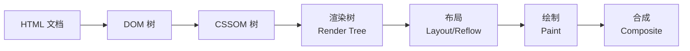
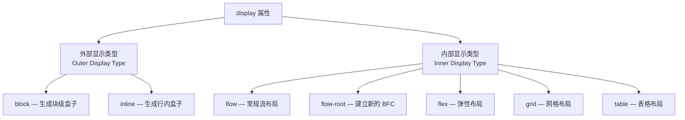
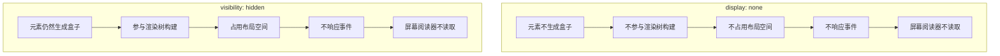
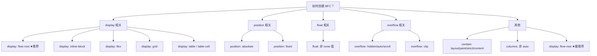
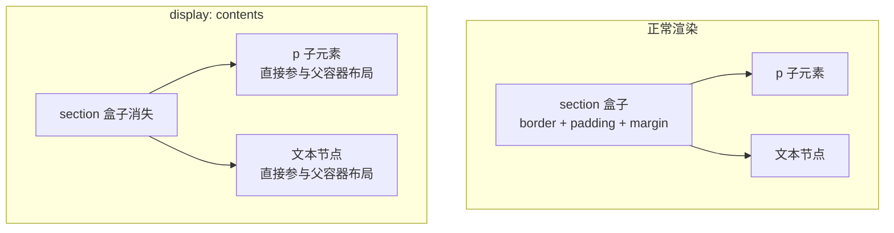
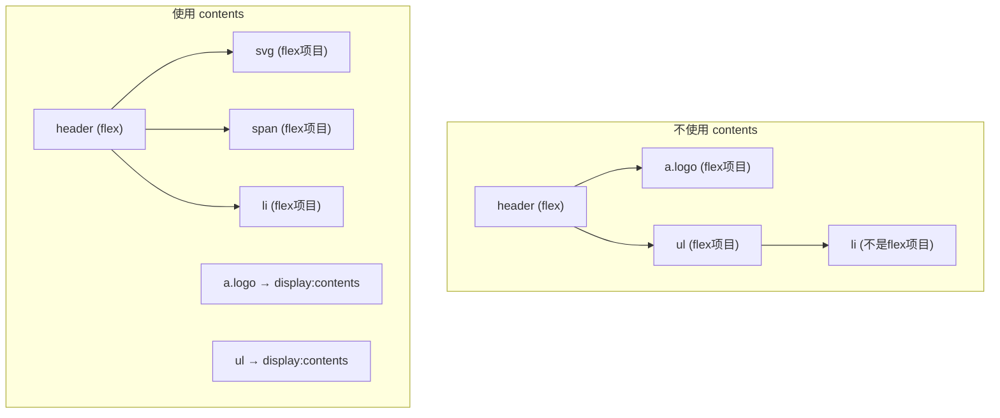

# display 属性

## 背景与动机

### 为什么 display 是 CSS 最重要的属性？

在浏览器将 HTML 文档转化为屏幕上的像素之前，它必须先完成一个核心步骤——**为每个元素生成盒子（Box）**。而决定一个元素"生成什么样的盒子"、"如何参与布局"、"能否设置宽高"的核心属性，就是 `display`。

`display` 属性之所以被称为 CSS 布局的"总开关"，是因为它同时控制着两个维度的行为：

1. **元素对外的表现**：是独占一行（块级），还是与其他元素并排（行内）？是否参与文档流？
2. **元素对内的组织**：内部子元素是按常规流排列，还是按弹性布局、网格布局排列？

这种"内外兼修"的特性使得 `display` 成为理解 CSS 布局体系的关键入口。

### 浏览器渲染流程中的 display

要真正理解 `display` 的作用，需要先了解浏览器渲染的基本流程：



**display 属性在"渲染树构建"阶段发挥作用**。浏览器遍历 DOM 树时，会根据每个元素的 `display` 计算值决定是否为其创建渲染对象（Render Object）：

- `display: none` → 不创建渲染对象，元素从渲染树中完全消失
- `display: block/inline/flex/grid/...` → 创建对应的渲染对象
- 所有子元素也受此影响——当父元素 `display: none` 时，子元素无论自身 `display` 值如何都不会被渲染

### display 属性的演进历史

| 时期 | 新增值 | 背景 |
|------|--------|------|
| CSS1 (1996) | `block`, `inline`, `list-item`, `none` | 基础盒模型分类 |
| CSS2 (1998) | `table` 系列、`inline-block`、`run-in` | 表格布局、行内块需求 |
| CSS Flexbox (2009→2017) | `flex`, `inline-flex` | 一维布局革命 |
| CSS Grid (2017) | `grid`, `inline-grid` | 二维布局革命 |
| CSS Display L3 (2018+) | `flow-root`, `contents`、两值语法 | 精确控制盒模型生成 |

## 核心概念

### 外部显示类型与内部显示类型

CSS Display Module Level 3 将 `display` 属性定义为两个维度的组合：



**外部显示类型**决定元素自身如何参与文档流——它是块级还是行内？这影响了元素是否与相邻元素并排、是否独占一行。

**内部显示类型**决定元素内部子元素的布局方式——子元素按常规流排列，还是按弹性/网格规则排列？

传统单值语法实际上是这两个维度的缩写：

| 单值写法 | 实际含义（外部 + 内部） | 等价两值语法 |
|---------|----------------------|------------|
| `block` | block + flow | `block flow` |
| `inline` | inline + flow | `inline flow` |
| `inline-block` | inline + flow-root | `inline flow-root` |
| `flex` | block + flex | `block flex` |
| `inline-flex` | inline + flex | `inline flex` |
| `grid` | block + grid | `block grid` |
| `inline-grid` | inline + grid | `inline grid` |
| `flow-root` | block + flow-root | `block flow-root` |


#### display 交互演示（MDN）

设置元素的外部与内部显示类型，是 CSS 布局的基石属性。

```html
<!DOCTYPE html>
<html lang="zh-CN">
  <head>
    <meta charset="UTF-8" />
    <meta name="viewport" content="width=device-width, initial-scale=1.0" />
    <title>display 属性演示 - MDN 示例</title>
    <meta name="description" content="布局示例：display 属性演示。" />
    <style>
      * {
        margin: 0;
        padding: 0;
        box-sizing: border-box;
      }
      body {
        font-family: -apple-system, BlinkMacSystemFont, "Segoe UI", Roboto, "Helvetica Neue", Arial, sans-serif;
        min-height: 100vh;
        padding: 0;
      }
      .demo-layout {
        display: flex;
        height: 100vh;
        gap: 0;
      }
      .snippet-panel {
        width: 320px;
        flex-shrink: 0;
        padding: 16px;
        display: flex;
        flex-direction: column;
        gap: 8px;
        overflow-y: auto;
        border-right: 1px solid #ddd;
        background: #fafafa;
      }
      .snippet-btn {
        padding: 10px 14px;
        border: 1px solid #ccc;
        border-radius: 6px;
        background: #fff;
        font-family: "JetBrains Mono", "Fira Code", monospace;
        font-size: 13px;
        color: #333;
        cursor: pointer;
        text-align: left;
        transition: all 0.2s;
        line-height: 1.4;
      }
      .snippet-btn:hover {
        border-color: #8083ff;
        background: #f0f0ff;
      }
      .snippet-btn.active {
        border-color: #8083ff;
        background: #e8e8ff;
        color: #571bc1;
        font-weight: 600;
      }
      .preview-panel {
        flex: 1;
        padding: 16px;
        display: flex;
        align-items: center;
        justify-content: center;
        background: #fff;
        overflow: auto;
      }
      .preview-panel > section,
      .preview-panel > div:not(.snippet-panel):not(.demo-layout) {
        flex: 1;
        width: 100%;
        min-height: 0;
        height: 100%;
        display: flex;
        align-items: center;
        justify-content: center;
      }
      .example-container {
        width: 100%;
        height: 100%;
      }

      code {
        background: #88888888;
      }

      #example-element {
        border: 3px dashed orange;
      }

      .child {
        display: inline-block;
        padding: 0.5em 1em;
        background-color: #ccccff;
        border: 1px solid #ababab;
        color: black;
      }
    </style>
  </head>
  <body>
    <div class="demo-layout">
      <div class="snippet-panel">
        <button class="snippet-btn active" data-index="0">display: block;</button>
        <button class="snippet-btn" data-index="1">display: inline-block;</button>
        <button class="snippet-btn" data-index="2">display: none;</button>
        <button class="snippet-btn" data-index="3">display: flex;</button>
        <button class="snippet-btn" data-index="4">display: grid;</button>
      </div>
      <div class="preview-panel">
        <p>
          对带有橙色虚线边框的
          <code>div</code>（包含三个子元素）应用不同的 <code>display</code> 值。
        </p>
        <section class="default-example" id="default-example">
          <div class="example-container">
            一些文本。
            <div id="example-element">
              <div class="child">子元素 1</div>
              <div class="child">子元素 2</div>
              <div class="child">子元素 3</div>
            </div>
            又一些文本
          </div>
        </section>
      </div>
    </div>
    <script>
      const snippets = [
        `#example-element {
  display: block;
}`,
        `#example-element {
  display: inline-block;
}`,
        `#example-element {
  display: none;
}`,
        `#example-element {
  display: flex;
}`,
        `#example-element {
  display: grid;
}`,
      ];

      let styleEl = document.createElement("style");
      document.head.appendChild(styleEl);

      function applySnippet(index) {
        styleEl.textContent = snippets[index];
        document.querySelectorAll(".snippet-btn").forEach((btn, i) => {
          btn.classList.toggle("active", i === index);
        });
      }

      document.querySelectorAll(".snippet-btn").forEach((btn) => {
        btn.addEventListener("click", () => applySnippet(parseInt(btn.dataset.index)));
      });

      applySnippet(0);
    </script>
  </body>
</html>

```
### 盒模型的影响

`display` 属性直接影响元素的盒模型特性，决定了元素在页面上的"占位方式"：

```
┌─────────────────────────────────────────┐
│           Block Element                 │
│  - 独占一行                              │
│  - 默认宽度：父元素100%                   │
│  - 可设置所有盒模型属性                   │
└─────────────────────────────────────────┘

┌──────┐ ┌──────┐ ┌──────┐
│Inline│ │Inline│ │Inline│  行内元素并排显示
└──────┘ └──────┘ └──────┘

┌─────────┐┌─────────┐┌─────────┐
│Inline-  ││Inline-  ││Inline-  │  行内块：并排 + 可设宽高
│Block    ││Block    ││Block    │
│ 100px   ││ 150px   ││ 120px   │
└─────────┘└─────────┘└─────────┘
```

## 深入原理

### block 块级元素

```css
.block {
  display: block;
}
```

**核心特点：**

| 特性 | 说明 |
|------|------|
| 布局方式 | 独占一行，前后有换行 |
| 宽度 | 默认为父元素的 100%（stretch） |
| 高度 | 由内容决定或显式设置 |
| 盒模型 | 可设置 width、height、margin、padding 的所有方向 |
| 垂直对齐 | 不支持 vertical-align |
| 溢出处理 | 支持 overflow 属性 |

**默认块级元素：**

```html
<!-- 结构化元素 -->
<div>, <section>, <article>, <aside>, <header>, <footer>, <nav>, <main>

<!-- 标题段落 -->
<h1> - <h6>, <p>

<!-- 列表 -->
<ul>, <ol>, <li>, <dl>, <dt>, <dd>

<!-- 表格表单 -->
<table>, <form>, <fieldset>

<!-- 其他 -->
<blockquote>, <pre>, <address>, <hr>
```

**实际应用示例：**

```css
/* 创建块级容器 */
.container {
  display: block;
  width: 1200px;
  max-width: 100%;
  margin: 0 auto;
  padding: 20px;
}

/* 段落样式 */
.paragraph {
  display: block;
  margin-bottom: 1em;
  text-align: justify;
}

/* 将行内元素转为块级 */
span.block-span {
  display: block;
  width: 200px;
  height: 100px;
  background: #f0f0f0;
}
```

### inline 行内元素

```css
.inline {
  display: inline;
}
```

**核心特点：**

| 特性 | 说明 |
|------|------|
| 布局方式 | 不独占一行，与其他行内元素并排 |
| 宽度 | 由内容决定，width 无效 |
| 高度 | 由内容决定，height 无效 |
| 盒模型 | 仅水平方向的 margin/padding 有效 |
| 垂直对齐 | 支持 vertical-align 属性 |
| 换行 | 在行尾自动换行 |

**默认行内元素：**

```html
<!-- 文本语义 -->
<span>, <a>, <strong>, <em>, <b>, <i>, <u>, <small>, <mark>

<!-- 代码相关 -->
<code>, <kbd>, <var>, <samp>

<!-- 其他 -->
<abbr>, <cite>, <q>, <sub>, <sup>, <time>
```

::: warning 注意
``、`<input>`、`<button>`、`<select>` 等表单元素虽然有行内特性，但它们是**可替换元素**（replaced element），行为更接近 `inline-block`。
:::

**行内元素的盒模型限制：**

```css
/* ❌ 无效：行内元素的垂直 margin/padding */
span.invalid {
  display: inline;
  margin: 20px;      /* 只有左右 margin 生效 */
  padding: 20px;     /* 只有左右 padding 生效，上下会溢出但不占空间 */
}

/* ✓ 有效：垂直方向的影响 */
span.valid {
  display: inline;
  line-height: 2;    /* 通过 line-height 控制高度 */
  vertical-align: middle; /* 垂直对齐 */
}
```

**为什么 inline 元素的垂直 margin/padding 无效？**

这源于浏览器构建**行框（line box）**的机制。行框的高度由 `line-height` 决定，而非 `margin` 或 `padding`。行内元素的垂直 padding 和 border 会**视觉上溢出**行框，但不会影响行框的高度计算——即不会推开上下相邻的行。这是 CSS 规范刻意的设计，目的是保证文本行的基线对齐不被破坏。

### inline-block 行内块元素

```css
.inline-block {
  display: inline-block;
}
```

**核心特点：**

| 特性 | 说明 |
|------|------|
| 布局方式 | 不独占一行，与其他行内元素并排 |
| 宽度 | 默认由内容决定，可显式设置 |
| 高度 | 默认由内容决定，可显式设置 |
| 盒模型 | 可设置所有方向的 margin/padding |
| 垂直对齐 | 支持 vertical-align 属性 |
| 基线对齐 | 默认基线对齐，可能产生底部间隙 |

**解决底部间隙问题：**

```css
/* 方法1：设置 vertical-align */
.inline-block-fix-1 {
  display: inline-block;
  vertical-align: top; /* 或 bottom, middle */
}

/* 方法2：设置 font-size 为 0（父元素） */
.parent {
  font-size: 0;
}
.parent > .inline-block-fix-2 {
  display: inline-block;
  font-size: 16px; /* 恢复字体大小 */
}

/* 方法3：使用 Flexbox（现代推荐） */
.parent {
  display: flex;
  gap: 10px;
}
```

### none 隐藏元素

```css
.hidden {
  display: none;
}
```

**核心特点：**

| 特性 | 说明 |
|------|------|
| 文档流 | 完全从文档流中移除 |
| 空间占用 | 不占用任何空间 |
| 子元素 | 所有子元素也不可见 |
| 可访问性 | 屏幕阅读器通常不读取 |
| 事件响应 | 不响应任何事件 |
| 过渡动画 | 不支持 CSS 过渡 |

### display:none 与 visibility:hidden 的深度对比

这是前端面试和工程实践中高频出现的问题。两者都能"隐藏"元素，但底层机制截然不同：



#### 性能差异详解

| 维度 | `display: none` | `visibility: hidden` |
|------|----------------|---------------------|
| **渲染树** | 元素及其子元素从渲染树中移除 | 元素仍在渲染树中，但标记为不可见 |
| **布局（Reflow）** | 切换时触发重排——其他元素需要重新计算位置 | **不触发重排**——盒子仍占位 |
| **绘制（Repaint）** | 切换时触发重绘 | 切换时触发重绘 |
| **合成（Composite）** | 无影响 | 无影响 |
| **事件处理** | 不触发任何事件（click、hover 等） | 不触发鼠标事件，但可监听部分事件 |
| **CSS 过渡** | 不支持（值变化是离散的） | 支持过渡动画 |
| **子元素覆盖** | 子元素无论怎样设置都不会显示 | 子元素可设置 `visibility: visible` 覆盖 |
| **表单元素** | 不提交某些表单控件的值（部分浏览器） | 表单控件值正常提交 |

**性能关键结论：**

```css
/* ❌ 频繁切换导致重排——性能差 */
.element {
  transition: all 0.3s;
}
.element:hover {
  display: none; /* 无法过渡，且触发重排 */
}

/* ✓ 仅触发重绘——性能好 */
.element {
  transition: opacity 0.3s, visibility 0.3s;
}
.element:hover {
  opacity: 0;
  visibility: hidden;
}
```

**何时使用哪个？**

- 需要**完全移除**元素（不占空间、不影响布局）→ `display: none`
- 需要**保留布局**、仅视觉隐藏、或需要过渡动画 → `visibility: hidden` + `opacity: 0`
- 需要**屏幕阅读器可读**的隐藏 → `sr-only` 技巧（见后文可访问性部分）


#### visibility 交互演示（MDN）

控制元素是否可见（visible/hidden/collapse），隐藏时仍占位。

```html
<!DOCTYPE html>
<html lang="zh-CN">
  <head>
    <meta charset="UTF-8" />
    <meta name="viewport" content="width=device-width, initial-scale=1.0" />
    <title>visibility 属性演示 - MDN 示例</title>
    <meta name="description" content="演示visibility 属性演示效果。" />
    <style>
      * {
        margin: 0;
        padding: 0;
        box-sizing: border-box;
      }
      body {
        font-family: -apple-system, BlinkMacSystemFont, "Segoe UI", Roboto, "Helvetica Neue", Arial, sans-serif;
        min-height: 100vh;
        padding: 0;
      }
      .demo-layout {
        display: flex;
        height: 100vh;
        gap: 0;
      }
      .snippet-panel {
        width: 320px;
        flex-shrink: 0;
        padding: 16px;
        display: flex;
        flex-direction: column;
        gap: 8px;
        overflow-y: auto;
        border-right: 1px solid #ddd;
        background: #fafafa;
      }
      .snippet-btn {
        padding: 10px 14px;
        border: 1px solid #ccc;
        border-radius: 6px;
        background: #fff;
        font-family: "JetBrains Mono", "Fira Code", monospace;
        font-size: 13px;
        color: #333;
        cursor: pointer;
        text-align: left;
        transition: all 0.2s;
        line-height: 1.4;
      }
      .snippet-btn:hover {
        border-color: #8083ff;
        background: #f0f0ff;
      }
      .snippet-btn.active {
        border-color: #8083ff;
        background: #e8e8ff;
        color: #571bc1;
        font-weight: 600;
      }
      .preview-panel {
        flex: 1;
        padding: 16px;
        display: flex;
        align-items: center;
        justify-content: center;
        background: #fff;
        overflow: auto;
      }
      .preview-panel > section,
      .preview-panel > div:not(.snippet-panel):not(.demo-layout) {
        flex: 1;
        width: 100%;
        min-height: 0;
        height: 100%;
        display: flex;
        align-items: center;
        justify-content: center;
      }
      .example-container {
        border: 1px solid #c5c5c5;
        padding: 0.75em;
        width: 80%;
        max-height: 300px;
        display: flex;
      }

      .example-container > div {
        background-color: rgba(0, 0, 255, 0.2);
        border: 3px solid blue;
        margin: 10px;
        flex: 1;
      }

      #example-element {
        background-color: rgba(255, 0, 200, 0.2);
        border: 3px solid rebeccapurple;
      }
    </style>
  </head>
  <body>
    <div class="demo-layout">
      <div class="snippet-panel">
        <button class="snippet-btn active" data-index="0">visibility: visible;</button>
        <button class="snippet-btn" data-index="1">visibility: hidden;</button>
        <button class="snippet-btn" data-index="2">visibility: collapse;</button>
      </div>
      <div class="preview-panel">
        <section class="default-example" id="default-example">
          <div class="example-container">
            <div class="transition-all" id="example-element">Hide me</div>
            <div>Item 2</div>
            <div>Item 3</div>
          </div>
        </section>
      </div>
    </div>
    <script>
      const snippets = [
        `#example-element {
  visibility: visible;
}`,
        `#example-element {
  visibility: hidden;
}`,
        `#example-element {
  visibility: collapse;
}`,
      ];

      let styleEl = document.createElement("style");
      document.head.appendChild(styleEl);

      function applySnippet(index) {
        styleEl.textContent = snippets[index];
        document.querySelectorAll(".snippet-btn").forEach((btn, i) => {
          btn.classList.toggle("active", i === index);
        });
      }

      document.querySelectorAll(".snippet-btn").forEach((btn) => {
        btn.addEventListener("click", () => applySnippet(parseInt(btn.dataset.index)));
      });

      applySnippet(0);
    </script>
  </body>
</html>

```
### 现代布局值

#### flex 弹性布局

```css
.container {
  display: flex;
}
```

**核心特点：**

- 子元素成为弹性项目（flex items）
- 默认主轴方向为水平（row）
- 子元素默认拉伸填满交叉轴
- 提供强大的对齐和分布能力

**快速上手示例：**

```css
/* 水平居中 */
.flex-center {
  display: flex;
  justify-content: center;
  align-items: center;
}

/* 等分空间 */
.flex-equal > * {
  flex: 1;
}

/* 两端对齐 */
.flex-between {
  display: flex;
  justify-content: space-between;
}

/* 垂直布局 */
.flex-column {
  display: flex;
  flex-direction: column;
}

/* 自动换行 */
.flex-wrap {
  display: flex;
  flex-wrap: wrap;
  gap: 10px;
}
```

#### grid 网格布局

```css
.container {
  display: grid;
}
```

**核心特点：**

- 二维布局系统，可同时控制行和列
- 支持命名网格区域
- 内置间隙（gap）支持
- 强大的轨道尺寸控制

**快速上手示例：**

```css
/* 固定列数网格 */
.grid-fixed {
  display: grid;
  grid-template-columns: repeat(3, 1fr);
  gap: 20px;
}

/* 自适应网格 */
.grid-auto {
  display: grid;
  grid-template-columns: repeat(auto-fit, minmax(250px, 1fr));
  gap: 20px;
}

/* 圣杯布局 */
.layout {
  display: grid;
  grid-template-areas:
    "header header header"
    "nav main aside"
    "footer footer footer";
  grid-template-columns: 200px 1fr 200px;
  grid-template-rows: auto 1fr auto;
  min-height: 100vh;
}

.header { grid-area: header; }
.nav { grid-area: nav; }
.main { grid-area: main; }
.aside { grid-area: aside; }
.footer { grid-area: footer; }
```

#### inline-flex / inline-grid

```css
.inline-flex-container {
  display: inline-flex;
}

.inline-grid-container {
  display: inline-grid;
}
```

**特点：**

- 外部表现为行内元素
- 内部保持 flex/grid 布局特性
- 宽度由内容决定（或显式设置）

### BFC 块级格式化上下文详解

BFC（Block Formatting Context）是 CSS 布局中最重要也最容易被忽视的概念之一。它与 `display` 属性密切相关。

#### 什么是 BFC？

BFC 是一个**独立的渲染区域**，在这个区域中：

1. 内部的 Box 在垂直方向上依次排列
2. 同一个 BFC 内相邻块级元素的 margin 会发生折叠（collapse）
3. BFC 区域不会与 float 元素重叠
4. 计算 BFC 高度时会包含内部的浮动元素
5. BFC 内外的元素互不影响

#### BFC 创建规则



#### BFC 的三大应用场景

**场景一：清除浮动（包含浮动子元素）**

```css
/* 传统方法：overflow */
.clearfix-overflow {
  overflow: hidden; /* 可能裁剪内容 */
}

/* 现代推荐：flow-root */
.clearfix-modern {
  display: flow-root; /* 无副作用，专为包含浮动设计 */
}
```

**场景二：防止 margin 折叠**

```css
/* 两个相邻元素的 margin 会折叠 */
.box-a { margin-bottom: 30px; }
.box-b { margin-top: 20px; }
/* 实际间距 = max(30px, 20px) = 30px，而非 50px */

/* 用 BFC 隔离 */
.wrapper {
  display: flow-root; /* 内部 margin 不与外部折叠 */
}
```

**场景三：阻止元素与浮动元素重叠**

```css
.float-sidebar {
  float: left;
  width: 200px;
}

.main-content {
  display: flow-root; /* 不与浮动元素重叠，自适应剩余宽度 */
}
```

#### BFC 创建方法对比

| 方法 | 副作用 | 推荐度 |
|------|--------|--------|
| `display: flow-root` | 无 | ★★★★★ |
| `overflow: hidden/auto` | 可能裁剪内容 | ★★★☆☆ |
| `float: left/right` | 改变布局流 | ★★☆☆☆ |
| `position: absolute/fixed` | 脱离文档流 | ★☆☆☆☆ |
| `display: inline-block` | 改变显示类型 | ★★☆☆☆ |

### display: contents 深度解析

`display: contents` 是 CSS Display Module Level 3 中一个容易被忽视但极具价值的属性值。它的核心能力是**从盒子树（Box Tree）中移除元素自身的盒子，但保留其子元素和伪元素**。

#### 盒子消失的本质

W3C 规范的描述：设置 `display: contents` 的元素自身不产生任何盒子，但其子元素和伪元素仍会正常生成盒子。对于盒子的生成和布局，该元素被视为被其内容所取代。

**最直观的理解方式**：想象元素的开始标签 `<section>` 和结束标签 `</section>` 被删除了，只剩下内部内容。



**关键行为**：
- 元素自身的 `border`、`padding`、`margin`、`background`、`width`、`filter` 等样式全部失效
- 子元素和伪元素的样式不受影响
- 元素的 HTML 属性（如 `id`、`class`、`aria-*`）保留
- JavaScript 事件绑定不受影响
- `::before` 和 `::after` 伪元素被视为子元素的一部分，正常渲染

#### 可替换元素的特殊行为

部分 HTML 元素设置 `display: contents` 时，效果等同于 `display: none`：

| 元素类型 | `display: contents` 行为 | 原因 |
|----------|-------------------------|------|
| ``、`<video>`、`<audio>` | 等同 `display: none` | 可替换元素，无"内部内容"可提升 |
| `<input>`、`<textarea>`、`<select>` | 等同 `display: none` | 表单控件由多个内部元素组成 |
| `<button>`、`<fieldset>`、`<details>` | 仅移除视觉框，内容保留 | 有语义但非可替换元素 |
| `<svg>` | 等同 `display: none` | SVG 渲染模型不同 |
| `<a>` | 仅移除视觉框，链接功能保留 | 非可替换元素 |
| 其他普通元素 | 正常行为 | — |

#### 在 Flexbox 布局中的应用

`display: contents` 在 Flexbox 中的核心价值：**让嵌套的 Flex 项目"上升"到父 Flex 容器**。

```html
<header class="nav">
  <a class="logo">
    <svg><!-- logo --></svg>
    <span>Logo</span>
  </a>
  <ul class="nav-list">
    <li><a href="">Home</a></li>
    <li><a href="">Service</a></li>
  </ul>
</header>
```

**问题**：`header` 设置 `display: flex` 后，只有 `a.logo` 和 `ul.nav-list` 是 Flex 项目，`li` 元素无法直接参与 Flex 布局。

**解决方案**：对中间容器使用 `display: contents`：

```css
.nav {
  display: flex;
  align-items: center;
  gap: 1rem;
}

.nav .logo,
.nav ul {
  display: contents; /* 子元素直接成为 .nav 的 Flex 项目 */
}
```



> **一句话总结**：`display: contents` 将 Flexbox 与 Flexbox 的嵌套关系"拍平"了。

#### 在 Grid 布局中的应用：模拟 subgrid

在 `subgrid` 浏览器支持不完善时，`display: contents` 可作为降级方案，让嵌套 Grid 项目"上升"到父 Grid 容器。

```css
.form-grid {
  display: grid;
  grid-template-columns: auto 1fr;
  gap: 1rem;
}

.form-group {
  display: contents; /* label 和 input 直接成为 Grid 项目 */
}

.form-group label {
  justify-self: end;
  align-self: center;
}
```

```html
<div class="form-grid">
  <div class="form-group">
    <label>Username</label>
    <input type="text" />
  </div>
  <div class="form-group">
    <label>Password</label>
    <input type="password" />
  </div>
</div>
```

#### contents vs subgrid 对比

| 特性 | `display: contents` | `subgrid` |
|------|---------------------|-----------|
| 继承父网格轨道 | 不继承，需手动指定位置 | 自动继承 |
| 代码量 | 需为每个子元素指定 `grid-area` | 子网格自动继承轨道定义 |
| 响应式能力 | 弱，需逐个调整 | 强，随父网格自动响应 |
| 浏览器支持 | 广泛 | Chrome 117+/Firefox 71+/Safari 16+ |
| 可访问性 | 有风险（语义丢失） | 无风险 |

> **建议**：`display: contents` 可以模拟 `subgrid` 的部分效果，但不应作为长期替代方案。`subgrid` 支持后应优先使用。

### 其他重要值

#### table 系列值

```css
/* 完整的表格结构 */
.table { display: table; width: 100%; }
.thead { display: table-header-group; }
.tbody { display: table-row-group; }
.tfoot { display: table-footer-group; }
.row { display: table-row; }
.cell { display: table-cell; padding: 10px; vertical-align: middle; }
.caption { display: table-caption; text-align: center; }
```

#### list-item

```css
.list-item {
  display: list-item;
  list-style-type: disc;
  list-style-position: inside;
}
```


##### list-style-type 交互演示（MDN）

设置列表项标记的样式（disc/decimal/circle 等）。

```html
<!DOCTYPE html>
<html lang="zh-CN">
  <head>
    <meta charset="UTF-8" />
    <meta name="viewport" content="width=device-width, initial-scale=1.0" />
    <title>list-style-type 属性演示 - MDN 示例</title>
    <meta name="description" content="文本与字体示例：list（style-type 属性演示）。" />
    <style>
      * {
        margin: 0;
        padding: 0;
        box-sizing: border-box;
      }
      body {
        font-family: -apple-system, BlinkMacSystemFont, "Segoe UI", Roboto, "Helvetica Neue", Arial, sans-serif;
        min-height: 100vh;
        padding: 0;
      }
      .demo-layout {
        display: flex;
        height: 100vh;
        gap: 0;
      }
      .snippet-panel {
        width: 320px;
        flex-shrink: 0;
        padding: 16px;
        display: flex;
        flex-direction: column;
        gap: 8px;
        overflow-y: auto;
        border-right: 1px solid #ddd;
        background: #fafafa;
      }
      .snippet-btn {
        padding: 10px 14px;
        border: 1px solid #ccc;
        border-radius: 6px;
        background: #fff;
        font-family: "JetBrains Mono", "Fira Code", monospace;
        font-size: 13px;
        color: #333;
        cursor: pointer;
        text-align: left;
        transition: all 0.2s;
        line-height: 1.4;
      }
      .snippet-btn:hover {
        border-color: #8083ff;
        background: #f0f0ff;
      }
      .snippet-btn.active {
        border-color: #8083ff;
        background: #e8e8ff;
        color: #571bc1;
        font-weight: 600;
      }
      .preview-panel {
        flex: 1;
        padding: 16px;
        display: flex;
        align-items: center;
        justify-content: center;
        background: #fff;
        overflow: auto;
      }
      .preview-panel > section,
      .preview-panel > div:not(.snippet-panel):not(.demo-layout) {
        flex: 1;
        width: 100%;
        min-height: 0;
        height: 100%;
        display: flex;
        align-items: center;
        justify-content: center;
      }
      .default-example {
        font-size: 1.2rem;
      }

      #example-element {
        width: 100%;
        background: #be094b;
        color: white;
      }

      hr {
        width: 50%;
        color: lightgray;
        margin: 0.5em;
      }

      .note {
        font-size: 0.8rem;
      }

      .note a {
        color: #009e5f;
      }

      @counter-style space-counter {
        symbols: "\1F680" "\1F6F8" "\1F6F0" "\1F52D";
        suffix: " ";
      }
    </style>
  </head>
  <body>
    <div class="demo-layout">
      <div class="snippet-panel">
        <button class="snippet-btn active" data-index="0">list-style-type: space-counter;</button>
        <button class="snippet-btn" data-index="1">list-style-type: disc;</button>
        <button class="snippet-btn" data-index="2">list-style-type: circle;</button>
        <button class="snippet-btn" data-index="3">list-style-type: &quot;\1F44D&quot;;</button>
      </div>
      <div class="preview-panel">
        <section class="default-example" id="default-example">
          <div>
            <p>NASA Notable Missions</p>
            <ul class="transition-all unhighlighted" id="example-element">
              <li>Apollo</li>
              <li>Hubble</li>
              <li>Chandra</li>
              <li>Cassini-Huygens</li>
            </ul>
          </div>
          <hr />
          <div class="note">
            <p>
              <code>space-counter</code> is defined with
              <a href="//developer.mozilla.org/docs/Web/CSS/@counter-style" target="_parent"
                ><code>@counter-style</code></a
              >
            </p>
          </div>
        </section>
      </div>
    </div>
    <script>
      const snippets = [
        `#example-element {
  list-style-type: space-counter;
}`,
        `#example-element {
  list-style-type: disc;
}`,
        `#example-element {
  list-style-type: circle;
}`,
        '#example-element {\n  list-style-type: "\1F44D";\n}',
      ];

      let styleEl = document.createElement("style");
      document.head.appendChild(styleEl);

      function applySnippet(index) {
        styleEl.textContent = snippets[index];
        document.querySelectorAll(".snippet-btn").forEach((btn, i) => {
          btn.classList.toggle("active", i === index);
        });
      }

      document.querySelectorAll(".snippet-btn").forEach((btn) => {
        btn.addEventListener("click", () => applySnippet(parseInt(btn.dataset.index)));
      });

      applySnippet(0);
    </script>
  </body>
</html>

```
#### flow / flow-root

```css
/* flow：常规流布局（默认行为） */
.flow-element {
  display: flow;
}

/* flow-root：创建新的 BFC */
.flow-root-element {
  display: flow-root;
}
```

## 代码示例

### 元素类型转换

```css
/* 行内元素转块级：设置宽高 */
span.block-like {
  display: block;
  width: 200px;
  height: 50px;
  background: #e0e0e0;
}

/* 块级元素转行内：水平排列 */
div.inline-like {
  display: inline;
  margin: 0 10px;
}

/* 链接转按钮 */
a.button {
  display: inline-block;
  padding: 12px 24px;
  background: #007bff;
  color: white;
  text-decoration: none;
  border-radius: 4px;
  transition: background 0.3s;
}

a.button:hover {
  background: #0056b3;
}
```

### 水平导航菜单

```css
/* 传统方法 */
.nav-traditional {
  font-size: 0; /* 消除空白字符间隙 */
}

.nav-traditional li {
  display: inline-block;
  font-size: 14px;
  margin-right: 20px;
}

/* 现代方法 */
.nav-modern {
  display: flex;
  gap: 20px;
  list-style: none;
  padding: 0;
  margin: 0;
}

/* 响应式导航 */
.nav-responsive {
  display: flex;
  gap: 15px;
}

@media (max-width: 768px) {
  .nav-responsive {
    flex-direction: column;
    gap: 10px;
  }
}
```

### 卡片网格布局

```css
/* 自适应卡片网格 */
.card-grid {
  display: grid;
  grid-template-columns: repeat(auto-fill, minmax(280px, 1fr));
  gap: 24px;
  padding: 20px;
}

.card {
  background: white;
  border-radius: 8px;
  box-shadow: 0 2px 8px rgba(0, 0, 0, 0.1);
  overflow: hidden;
}

.card-image {
  width: 100%;
  height: 200px;
  object-fit: cover;
}

.card-content {
  padding: 16px;
}
```

### 居中布局

```css
/* 水平居中：块级元素 */
.center-horizontal {
  display: block;
  width: 800px;
  max-width: 100%;
  margin-left: auto;
  margin-right: auto;
}

/* 垂直水平居中：Flexbox */
.center-flex {
  display: flex;
  justify-content: center;
  align-items: center;
  min-height: 100vh;
}

/* 垂直水平居中：Grid */
.center-grid {
  display: grid;
  place-items: center;
  min-height: 100vh;
}

/* 垂直水平居中：绝对定位 + transform */
.center-absolute {
  position: absolute;
  top: 50%;
  left: 50%;
  transform: translate(-50%, -50%);
}
```

### 粘性页脚

```css
/* Flexbox 方案 */
.page-flex {
  display: flex;
  flex-direction: column;
  min-height: 100vh;
}

.page-flex .content {
  flex: 1;
}

/* Grid 方案 */
.page-grid {
  display: grid;
  grid-template-rows: auto 1fr auto;
  min-height: 100vh;
}
```

## 最佳实践

### 1. 选择合适的显示类型

```css
/* 根据内容性质选择 */
.article { display: block; }       /* 文章内容 */
.navigation { display: flex; }     /* 导航栏 */
.gallery { display: grid; }        /* 图片网格 */
.text-link { display: inline; }    /* 文本链接 */
```

### 2. 语义化优先

```css
/* ✓ 推荐：语义化 HTML + 合理的 display */
/* <nav><ul style="display: flex;"><li>Item</li></ul></nav> */

/* ❌ 避免：滥用 display 改变语义 */
/* <div style="display: table;"><div style="display: table-cell;">Cell</div></div> */
```

### 3. 响应式设计

```css
/* 移动优先 */
.layout {
  display: block;
}

@media (min-width: 768px) {
  .layout {
    display: grid;
    grid-template-columns: 250px 1fr;
  }
}

/* 使用容器查询 */
@container (min-width: 600px) {
  .component {
    display: flex;
  }
}
```

### 4. 性能优化

```css
/* 减少布局计算 */
.optimized {
  contain: layout;
  content-visibility: auto;
}

/* 一维布局优先使用 Flexbox */
.one-dimension { display: flex; }

/* 二维布局使用 Grid */
.two-dimension { display: grid; }
```

### 5. 可访问性检查清单

- [ ] `display: none` 隐藏的内容是否需要在屏幕阅读器中读取？
- [ ] 使用 `display: contents` 时是否添加了必要的 ARIA 属性？
- [ ] 表单元素的隐藏是否影响标签关联？
- [ ] 响应式布局在小屏幕上是否保持内容可访问？
- [ ] 键盘导航是否完整可用？

```css
/* 仅视觉隐藏，屏幕阅读器可读 */
.visually-hidden {
  position: absolute;
  width: 1px;
  height: 1px;
  padding: 0;
  margin: -1px;
  overflow: hidden;
  clip: rect(0, 0, 0, 0);
  white-space: nowrap;
  border: 0;
}

/* 跳过链接示例 */
.skip-link {
  position: absolute;
  top: -40px;
  left: 0;
  background: #000;
  color: white;
  padding: 8px;
  z-index: 100;
}

.skip-link:focus {
  top: 0;
}
```

## 常见问题

### 1. inline-block 底部间隙

**问题原因：** 行内元素基线对齐导致。

```css
/* 方案1：修改 vertical-align */
.box {
  display: inline-block;
  vertical-align: top;
}

/* 方案2：父元素 font-size: 0 */
.container {
  font-size: 0;
}
.box {
  font-size: 16px;
}

/* 方案3：使用 Flexbox（推荐） */
.container {
  display: flex;
}
```

### 2. inline 元素的垂直 margin/padding

```css
/* ❌ 无效 */
span {
  display: inline;
  margin: 20px;  /* 只有左右生效 */
  padding: 20px; /* 只有左右生效 */
}

/* ✓ 使用 inline-block */
span {
  display: inline-block;
  margin: 20px;
  padding: 20px;
}

/* ✓ 使用 line-height 控制高度（保持 inline） */
span {
  display: inline;
  line-height: 40px;
  padding: 0 10px;
}
```

### 3. display: none 导致的动画问题

```css
/* ❌ 无法实现淡出效果 */
.element {
  opacity: 1;
  transition: all 0.3s;
}
.element.hidden {
  display: none;    /* 立即消失，无过渡 */
  opacity: 0;
}

/* ✓ 使用 visibility */
.element {
  opacity: 1;
  visibility: visible;
  transition: opacity 0.3s, visibility 0.3s;
}
.element.hidden {
  opacity: 0;
  visibility: hidden;
}

/* ✓ 使用 transitionend 事件 */
/* element.addEventListener('transitionend', () => {
  element.style.display = 'none';
}); */
```

### 4. float 与 display 的关系

```css
/* float 会隐式改变 display 值 */
.element {
  display: inline;
  float: left; /* 计算值变为 block */
}

/* 澄清：float 作用于 flex 容器本身是有效的——容器整体浮动 */
.element {
  display: flex;
  float: left; /* ✓ 有效：浮动的是这个 flex 容器 */
}

/* float 真正无效的场景：flex/grid 项目（父容器为 flex/grid 的子项） */
.flex-container { display: flex; }
.flex-container > .item {
  float: left; /* ❌ 无效：flex 项目忽略 float */
}
```

**float 对 display 的影响：**

| 指定值 | 计算值（浮动后） |
|--------|----------------|
| `inline` | `block` |
| `inline-block` | `block` |
| `table-cell` | `block` |
| `inline-table` | `table` |
| `flex` | `flex`（容器本身可浮动；作为 flex/grid **项目**时 float 被忽略）|
| `grid` | `grid`（同上）|

### 5. 绝对定位与 display

```css
/* position: absolute/fixed 会改变 display 计算 */
.element {
  display: inline;
  position: absolute; /* 计算值变为 block */
}
```

### 6. display: contents 的可访问性风险

```html
<!-- 风险：屏幕阅读器可能跳过 ul 的语义 -->
<ul style="display: contents">
  <li>Item 1</li>
  <li>Item 2</li>
</ul>

<!-- 缓解：添加 ARIA 属性补偿语义丢失 -->
<ul style="display: contents" role="list">
  <li>Item 1</li>
  <li>Item 2</li>
</ul>
```

**缓解策略**：
- 对设置了 `contents` 的列表元素添加 `role="list"`/`role="listitem"`
- 对设置了 `contents` 的语义容器添加 `role="group"` 等 ARIA 角色
- 避免在 `<nav>`、`<main>`、`<aside>` 等地标元素上使用 `contents`
- 定期使用屏幕阅读器（VoiceOver/NVDA）测试

## 参考资源

- [MDN: display - CSS](https://developer.mozilla.org/zh-CN/docs/Web/CSS/display)
- [CSS Display Module Level 3](https://www.w3.org/TR/css-display-3/)
- [CSS Flexbox Layout Guide](https://css-tricks.com/snippets/css/a-guide-to-flexbox/)
- [CSS Grid Layout Guide](https://css-tricks.com/snippets/css/complete-guide-grid/)
- [MDN: Block Formatting Context](https://developer.mozilla.org/zh-CN/docs/Web/Guide/CSS/Block_formatting_context)
- [MDN: content-visibility](https://developer.mozilla.org/zh-CN/docs/Web/CSS/content-visibility)

## 浏览器兼容性

### 基本支持情况

| 属性值 | Chrome | Firefox | Safari | Edge | 移动端 |
|--------|--------|---------|--------|------|--------|
| `block` | ✓ | ✓ | ✓ | ✓ | ✓ |
| `inline` | ✓ | ✓ | ✓ | ✓ | ✓ |
| `inline-block` | ✓ | ✓ | ✓ | ✓ | ✓ |
| `none` | ✓ | ✓ | ✓ | ✓ | ✓ |
| `flex` | 29+ | 22+ | 9+ | 12+ | ✓ |
| `grid` | 57+ | 52+ | 10.1+ | 16+ | ✓ |
| `flow-root` | 58+ | 53+ | 13+ | 79+ | ✓ |
| `contents` | 65+ | 37+ | 11.1+ | 79+ | ✓ |
| 两值语法 | 115+ | 70+ | 15+ | 115+ | ✓ |

### 兼容性处理

```css
/* flow-root 降级方案 */
.bfc {
  overflow: hidden; /* fallback */
  display: flow-root; /* modern browsers */
}

/* flex 降级方案 */
.flexible {
  display: inline-block; /* fallback */
  display: flex;
}

/* grid 降级方案 */
@supports (display: grid) {
  .grid-layout {
    display: grid;
  }
}

@supports not (display: grid) {
  .grid-layout {
    display: flex;
    flex-wrap: wrap;
  }
}
```

### 元素类型对比总表

| 属性值 | 独占一行 | 可设宽高 | margin/padding | 垂直对齐 | 基线对齐 |
|--------|---------|---------|---------------|---------|---------|
| `block` | ✓ | ✓ | 全方向 | ✗ | - |
| `inline` | ✗ | ✗ | 仅水平 | ✓ | ✓ |
| `inline-block` | ✗ | ✓ | 全方向 | ✓ | ✓ |
| `none` | - | - | - | - | - |

### 隐藏方式对比

| 属性 | 占用空间 | 子元素可见 | 事件响应 | 屏幕阅读器 | 过渡动画 |
|------|---------|-----------|---------|-----------|---------|
| `display: none` | 不占用 | 不可见 | 不响应 | 不读取 | 不支持 |
| `visibility: hidden` | 占用 | 不可见 | 不响应 | 不读取 | 支持 |
| `opacity: 0` | 占用 | 可见 | 响应 | 读取 | 支持 |
| `content-visibility: hidden` | 占用 | 不可见 | 不响应 | 不读取 | 不支持 |

