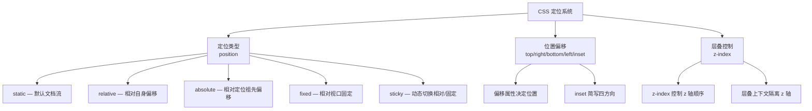
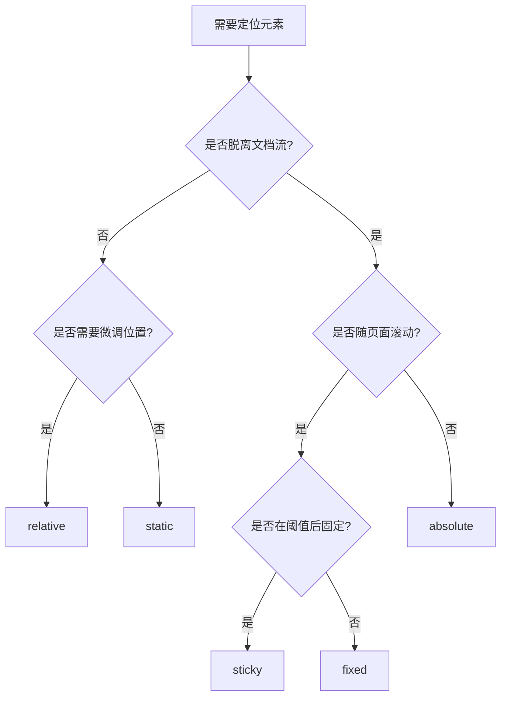
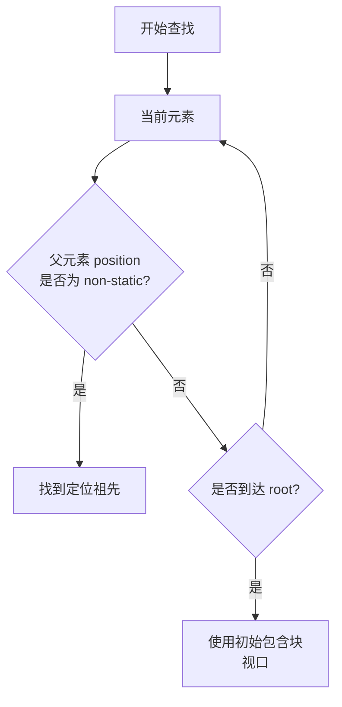
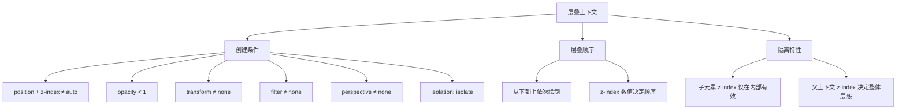
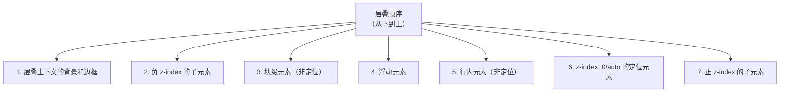

# position 定位

## 背景与动机

### 为什么需要 position 定位？

在 CSS 的默认行为中，元素按照**正常文档流**（Normal Flow）排列：块级元素垂直堆叠，行内元素水平排列。这种布局方式简单直观，但无法满足所有设计需求：

- **弹窗和模态框**需要覆盖在其他内容之上
- **固定导航栏**需要在滚动时保持可见
- **工具提示**需要精确定位在触发元素附近
- **徽章和角标**需要叠加在图标或图片上
- **粘性表头**需要在滚动到阈值时"粘住"

`position` 属性正是为了解决这些"脱离常规流"的定位需求而诞生的。它赋予开发者精确控制元素位置的能力，同时引入**层叠上下文**（stacking context）和 **z 轴堆叠**的概念，让复杂的 UI 层叠关系变得可控。

### 定位系统的核心概念

CSS 定位系统包含三个关键组成部分：



| 模块 | 核心属性 | 功能说明 |
|------|---------|---------|
| 定位类型 | `position` | 定义元素的定位模式 |
| 位置偏移 | `top`, `right`, `bottom`, `left`, `inset` | 精确控制元素位置 |
| 层叠控制 | `z-index` | 管理 z 轴堆叠顺序 |
| 包含块 | - | 定位计算的参考框 |
| 层叠上下文 | - | 隔离的 z 轴环境 |

## 核心概念

### 定位类型总览

| 定位类型 | 脱离文档流 | 参照对象 | 原始空间 | 常用场景 | 性能影响 |
|---------|-----------|---------|---------|---------|---------|
| `static` | 否 | 无 | 保留 | 默认文档流 | 无 |
| `relative` | 否 | 自身原始位置 | 保留 | 微调位置、创建定位上下文 | 低 |
| `absolute` | 是 | 最近的定位祖先 | 不保留 | 弹窗、徽章、工具提示 | 中 |
| `fixed` | 是 | 视口 | 不保留 | 固定导航、返回顶部 | 高 |
| `sticky` | 否* | 视口/容器 | 保留 | 粘性表头、侧边栏 | 中高 |

\* sticky 在阈值前处于文档流中，超过阈值后表现为固定定位

### 定位类型的选择决策



## 深入原理

### static 静态定位

**默认定位方式**，元素按照正常文档流排列。

```css
.static {
  position: static; /* 默认值，可省略 */
}
```

#### 核心特性

| 特性 | 说明 |
|------|------|
| 文档流 | 处于正常文档流中 |
| 偏移属性 | `top/right/bottom/left/z-index` 均无效 |
| 布局方式 | 块级元素垂直排列，行内元素水平排列 |
| 包含块 | 最近的块级容器祖先 |

#### 应用场景

```css
/* 默认布局，无需特殊设置 */
.container {
  /* position: static; 默认 */
}

/* 重置定位 */
.reset {
  position: static; /* 重置为默认行为 */
}
```

### relative 相对定位

**相对于元素自身原始位置**进行偏移，**不脱离文档流**。

```css
.relative {
  position: relative;
  top: 10px;
  left: 20px;
}
```

#### 核心特性

| 特性 | 说明 |
|------|------|
| 定位参照 | 自身原始位置 |
| 文档流 | 不脱离，原始空间保留 |
| 偏移属性 | `top/right/bottom/left/z-index` 均有效 |
| 包含块 | 最近的块级容器祖先 |
| 对其他元素影响 | 不影响其他元素位置 |

#### 布局示意图

```
原始位置：                    偏移后：
┌─────────────┐              ┌─────────────┐
│   Element   │  ──偏移──>   │   Element   │
└─────────────┘              └─────────────┘
                              ↑ 原始空间仍保留
```

#### 实际应用

**1. 创建定位上下文**

```css
/* 为 absolute 子元素提供定位参照 */
.container {
  position: relative;
  /* 其他样式... */
}

.child {
  position: absolute;
  top: 10px;
  right: 10px;
  /* 相对于 .container 定位 */
}
```

**2. 微调元素位置**

```css
/* 图标与文字对齐微调 */
.icon {
  position: relative;
  top: 2px; /* 向下微调 */
  margin-right: 5px;
}

/* 悬停效果 */
.card {
  position: relative;
  transition: transform 0.3s;
}

.card:hover {
  top: -5px; /* 向上浮动 */
  box-shadow: 0 10px 20px rgba(0, 0, 0, 0.15);
}
```

**3. 覆盖层效果**

```css
/* 图片遮罩 */
.image-wrapper {
  position: relative;
  display: inline-block;
}

.image-wrapper::after {
  content: '';
  position: absolute;
  inset: 0;
  background: rgba(0, 0, 0, 0.3);
  opacity: 0;
  transition: opacity 0.3s;
}

.image-wrapper:hover::after {
  opacity: 1;
}
```

### absolute 绝对定位

**相对于最近的定位祖先**进行定位，**脱离文档流**。

```css
.parent {
  position: relative; /* 创建定位上下文 */
}

.child {
  position: absolute;
  top: 10px;
  right: 20px;
}
```

#### 核心特性

| 特性 | 说明 |
|------|------|
| 定位参照 | 最近的非 static 祖先元素 |
| 文档流 | 完全脱离，原始空间不保留 |
| 宽度 | 默认由内容决定 |
| 偏移属性 | `top/right/bottom/left/z-index` 均有效 |
| margin | 仍可使用，但垂直方向的 auto 用于居中 |

#### 定位祖先查找规则



#### 包含块示意图

```
┌────────────────────────────────────────┐
│ position: relative                     │
│ ┌──────────────────────────────────┐   │
│ │ padding area (包含块)             │   │
│ │  ┌─────────────────────────────┐ │   │
│ │  │ position: absolute          │ │   │
│ │  │ top: 0                      │ │   │
│ │  │ left: 0                     │ │   │
│ │  └─────────────────────────────┘ │   │
│ └──────────────────────────────────┘   │
└────────────────────────────────────────┘
```

#### 实际应用场景

**1. 绝对定位居中**

```css
/* 方法1：transform */
.center-transform {
  position: absolute;
  top: 50%;
  left: 50%;
  transform: translate(-50%, -50%);
}

/* 方法2：margin auto */
.center-margin {
  position: absolute;
  top: 0;
  right: 0;
  bottom: 0;
  left: 0;
  margin: auto;
  width: 200px;
  height: 100px;
}

/* 方法3：calc */
.center-calc {
  position: absolute;
  top: calc(50% - 50px); /* height/2 */
  left: calc(50% - 100px); /* width/2 */
  width: 200px;
  height: 100px;
}
```

**2. 角标和徽章**

```css
/* 右上角徽章 */
.badge {
  position: absolute;
  top: -5px;
  right: -5px;
  min-width: 18px;
  height: 18px;
  padding: 0 5px;
  border-radius: 9px;
  background: #ff4757;
  color: white;
  font-size: 12px;
  line-height: 18px;
  text-align: center;
}
```

**3. 工具提示（Tooltip）**

```css
.tooltip-container {
  position: relative;
  display: inline-block;
}

.tooltip {
  position: absolute;
  bottom: calc(100% + 10px);
  left: 50%;
  transform: translateX(-50%);
  padding: 8px 12px;
  background: #333;
  color: white;
  font-size: 12px;
  white-space: nowrap;
  border-radius: 4px;
  opacity: 0;
  visibility: hidden;
  transition: all 0.2s;
  z-index: 100;
}

.tooltip::after {
  content: '';
  position: absolute;
  top: 100%;
  left: 50%;
  transform: translateX(-50%);
  border: 6px solid transparent;
  border-top-color: #333;
}

.tooltip-container:hover .tooltip {
  opacity: 1;
  visibility: visible;
}
```

### fixed 固定定位

**相对于视口**进行定位，**脱离文档流**，不随页面滚动。

```css
.fixed {
  position: fixed;
  top: 0;
  left: 0;
  width: 100%;
}
```

#### 核心特性

| 特性 | 说明 |
|------|------|
| 定位参照 | 视口（viewport） |
| 文档流 | 完全脱离，原始空间不保留 |
| 滚动行为 | 不随页面滚动 |
| 包含块 | 视口（transform 祖先会改变此行为） |
| 打印 | 通常在每页重复出现 |

#### 实际应用场景

**1. 固定导航栏**

```css
.fixed-header {
  position: fixed;
  top: 0;
  left: 0;
  right: 0;
  height: 60px;
  background: white;
  box-shadow: 0 2px 4px rgba(0, 0, 0, 0.1);
  z-index: 1000;
}

/* 页面内容需要留出空间 */
.main-content {
  margin-top: 60px; /* 或 padding-top */
}
```

**2. 返回顶部按钮**

```css
.back-to-top {
  position: fixed;
  bottom: 30px;
  right: 30px;
  width: 50px;
  height: 50px;
  border-radius: 50%;
  background: #007bff;
  color: white;
  border: none;
  cursor: pointer;
  opacity: 0;
  visibility: hidden;
  transition: all 0.3s;
  z-index: 999;
}

.back-to-top.visible {
  opacity: 1;
  visibility: visible;
}
```

#### transform 的影响

```css
/* ⚠️ 警告：transform 会改变 fixed 的定位参照 */
.parent {
  transform: translateX(0); /* 创建新的包含块 */
}

.child {
  position: fixed; /* 现在相对于 .parent 而不是视口 */
}

/* 其他创建新包含块的属性 */
.other-props {
  transform: translateZ(0);
  filter: blur(0);
  perspective: 1000px;
  contain: paint;
}
```

### sticky 粘性定位

**根据滚动位置在相对定位和固定定位之间动态切换**。

```css
.sticky {
  position: sticky;
  top: 0;
}
```

#### 核心特性

| 特性 | 说明 |
|------|------|
| 定位参照 | 滚动容器和视口 |
| 文档流 | 始终保留原始空间 |
| 滚动阈值 | 需设置 `top/right/bottom/left` 至少一个 |
| 生效范围 | 仅在父容器范围内 |
| 父元素限制 | 父元素不能有 `overflow: hidden/auto/scroll` |

#### 工作原理

```
阶段1：正常滚动（相对定位）
┌────────────────────────────────────┐
│                                    │
│  ┌──────────────────────────────┐  │
│  │  Sticky Element              │  │
│  └──────────────────────────────┘  │
│                                    │
└────────────────────────────────────┘
           ↓ 向下滚动

阶段2：达到阈值（固定定位）
┌────────────────────────────────────┐
│ ┌──────────────────────────────┐   │
│ │ Sticky Element               │   │ ← 固定在顶部
│ └──────────────────────────────┘   │
│                                    │
└────────────────────────────────────┘
           ↓ 继续滚动

阶段3：父容器滚出（随父容器消失）
┌────────────────────────────────────┐
│                                    │
│  ┌──────────────────────────────┐  │
│  │ Sticky Element               │  │ ← 随父容器滚动
│  └──────────────────────────────┘  │
└────────────────────────────────────┘
```

#### 实际应用场景

**1. 粘性表头**

```css
thead {
  position: sticky;
  top: 0;
  background: white;
  z-index: 10;
}

/* 多级表头 */
thead tr:first-child th {
  position: sticky;
  top: 0;
  background: #f8f9fa;
}

thead tr:nth-child(2) th {
  position: sticky;
  top: 40px; /* 第一行表头的高度 */
  background: white;
}
```

**2. 粘性侧边栏**

```css
.sidebar {
  position: sticky;
  top: 80px; /* 导航栏下方 */
  height: calc(100vh - 80px);
  overflow-y: auto;
}
```

#### 常见问题排查

```css
/* ❌ 不生效的常见原因 */

/* 原因1：未设置阈值 */
.sticky {
  position: sticky;
  /* 缺少 top/right/bottom/left */
}

/* 原因2：父元素有 overflow */
.parent {
  overflow: hidden; /* 或 auto/scroll */
}
.sticky {
  position: sticky;
  top: 0; /* 不会生效 */
}

/* ✓ 正确的设置 */
.parent {
  overflow: visible; /* 或不设置 */
  min-height: 500px; /* 足够的滚动空间 */
}

.sticky {
  position: sticky;
  top: 0;
}
```

### 层叠上下文（Stacking Context）详解

层叠上下文是 CSS 定位系统中最复杂也最重要的概念。它决定了一个元素在 **z 轴**上的堆叠顺序，以及其子元素的 z-index 作用范围。

#### 什么是层叠上下文？

层叠上下文是一个**三维概念**：在二维平面（x-y 轴）之外，引入了 z 轴（垂直于屏幕方向）。每个层叠上下文都是一个**隔离的 z 轴环境**，内部的 z-index 不会与外部的 z-index 直接比较。



#### 层叠上下文的创建规则

以下任一条件都会创建新的层叠上下文：

```css
/* 1. position + z-index（非 auto） */
.positioned {
  position: absolute/relative/fixed/sticky;
  z-index: 0; /* 任何非 auto 值 */
}

/* 2. opacity 小于 1 */
.transparent {
  opacity: 0.99; /* 即使接近 1 也会创建 */
}

/* 3. transform 不为 none */
.transformed {
  transform: translateZ(0); /* 即使无实际变换 */
}

/* 4. filter 不为 none */
.filtered {
  filter: blur(0); /* 即使无实际效果 */
}

/* 5. perspective 不为 none */
.perspective {
  perspective: 1000px;
}

/* 6. clip-path 不为 none */
.clipped {
  clip-path: inset(0);
}

/* 7. mask 不为 none */
.masked {
  mask: url(mask.png);
}

/* 8. isolation: isolate */
.isolated {
  isolation: isolate; /* 专门用于创建层叠上下文 */
}

/* 9. will-change 指定会变化的属性 */
.will-change {
  will-change: transform;
}

/* 10. contain 属性 */
.contained {
  contain: layout/paint/strict/content;
}
```

#### z-index 层叠顺序算法

在同一个层叠上下文中，元素按照以下顺序从下到上绘制：



**关键规则：**

1. **z-index 只对定位元素有效**（position 不为 static）
2. **层叠上下文隔离 z-index**：子元素的 z-index 仅在父层叠上下文内部有效
3. **父元素的 z-index 决定整体层级**：父元素 z-index 越高，其所有子元素都在更上层


##### z-index 交互演示（MDN）

设置定位元素的层叠顺序（数值越大越靠上）。

```html
<!DOCTYPE html>
<html lang="zh-CN">
  <head>
    <meta charset="UTF-8" />
    <meta name="viewport" content="width=device-width, initial-scale=1.0" />
    <title>z-index 属性演示 - MDN 示例</title>
    <meta name="description" content="演示z（index 属性演示）效果。" />
    <style>
      * {
        margin: 0;
        padding: 0;
        box-sizing: border-box;
      }
      body {
        font-family: -apple-system, BlinkMacSystemFont, "Segoe UI", Roboto, "Helvetica Neue", Arial, sans-serif;
        min-height: 100vh;
        padding: 0;
      }
      .demo-layout {
        display: flex;
        height: 100vh;
        gap: 0;
      }
      .snippet-panel {
        width: 320px;
        flex-shrink: 0;
        padding: 16px;
        display: flex;
        flex-direction: column;
        gap: 8px;
        overflow-y: auto;
        border-right: 1px solid #ddd;
        background: #fafafa;
      }
      .snippet-btn {
        padding: 10px 14px;
        border: 1px solid #ccc;
        border-radius: 6px;
        background: #fff;
        font-family: "JetBrains Mono", "Fira Code", monospace;
        font-size: 13px;
        color: #333;
        cursor: pointer;
        text-align: left;
        transition: all 0.2s;
        line-height: 1.4;
      }
      .snippet-btn:hover {
        border-color: #8083ff;
        background: #f0f0ff;
      }
      .snippet-btn.active {
        border-color: #8083ff;
        background: #e8e8ff;
        color: #571bc1;
        font-weight: 600;
      }
      .preview-panel {
        flex: 1;
        padding: 16px;
        display: flex;
        align-items: center;
        justify-content: center;
        background: #fff;
        overflow: auto;
      }
      .preview-panel > section,
      .preview-panel > div:not(.snippet-panel):not(.demo-layout) {
        flex: 1;
        width: 100%;
        min-height: 0;
        height: 100%;
        display: flex;
        align-items: center;
        justify-content: center;
      }
      #example-element {
        top: 15px;
        left: 15px;
        width: 180px;
        height: 230px;
        position: absolute;

        line-height: 215px;
        font-family: monospace;
        background-color: #fcfbe5;
        border: solid 5px #e3e0a1;
        z-index: auto;
        color: black;
      }

      .container {
        display: inline-block;
        width: 250px;
        position: relative;
      }

      .block {
        width: 150px;
        height: 50px;
        position: absolute;
        font-family: monospace;
        color: black;
      }

      .blue {
        background-color: #e5e8fc;
        border: solid 5px #112382;

        line-height: 55px;
      }

      .red {
        background-color: #fce5e7;
        border: solid 5px #e3a1a7;
      }

      .position1 {
        top: 0;
        left: 0;
        z-index: 6;
      }

      .position2 {
        top: 30px;
        left: 30px;
        z-index: 4;
      }

      .position3 {
        top: 60px;
        left: 60px;
        z-index: 2;
      }

      .position4 {
        top: 150px;
        left: 0;
        z-index: auto;
      }

      .position5 {
        top: 180px;
        left: 30px;
        z-index: auto;
      }

      .position6 {
        top: 210px;
        left: 60px;
        z-index: auto;
      }
    </style>
  </head>
  <body>
    <div class="demo-layout">
      <div class="snippet-panel">
        <button class="snippet-btn active" data-index="0">z-index: auto;</button>
        <button class="snippet-btn" data-index="1">z-index: 1;</button>
        <button class="snippet-btn" data-index="2">z-index: 3;</button>
        <button class="snippet-btn" data-index="3">z-index: 5;</button>
        <button class="snippet-btn" data-index="4">z-index: 7;</button>
      </div>
      <div class="preview-panel">
        <section class="default-example container" id="default-example">
          <div id="example-element">Change my z-index</div>
          <div class="block blue position1">z-index: 6</div>
          <div class="block blue position2">z-index: 4</div>
          <div class="block blue position3">z-index: 2</div>
          <div class="block red position4">z-index: auto</div>
          <div class="block red position5">z-index: auto</div>
          <div class="block red position6">z-index: auto</div>
        </section>
      </div>
    </div>
    <script>
      const snippets = [
        `#example-element {
  z-index: auto;
}`,
        `#example-element {
  z-index: 1;
}`,
        `#example-element {
  z-index: 3;
}`,
        `#example-element {
  z-index: 5;
}`,
        `#example-element {
  z-index: 7;
}`,
      ];

      let styleEl = document.createElement("style");
      document.head.appendChild(styleEl);

      function applySnippet(index) {
        styleEl.textContent = snippets[index];
        document.querySelectorAll(".snippet-btn").forEach((btn, i) => {
          btn.classList.toggle("active", i === index);
        });
      }

      document.querySelectorAll(".snippet-btn").forEach((btn) => {
        btn.addEventListener("click", () => applySnippet(parseInt(btn.dataset.index)));
      });

      applySnippet(0);
    </script>
  </body>
</html>

```
#### 层叠上下文的隔离特性

```css
/* 层叠上下文隔离 z-index */
.outer-context {
  position: relative;
  z-index: 1; /* 创建层叠上下文 */
}

.inner-high {
  position: absolute;
  z-index: 9999; /* 仅在外部上下文内部有效 */
}

.sibling {
  position: relative;
  z-index: 2; /* 在整个 .outer-context 上方 */
}
```

**实际案例：**

```html
<div class="parent-a"> <!-- z-index: 1 -->
  <div class="child-a">z-index: 9999</div>
</div>
<div class="parent-b"> <!-- z-index: 2 -->
  <div class="child-b">z-index: 1</div>
</div>
```

尽管 `.child-a` 的 z-index 是 9999，但由于其父元素 `.parent-a` 的 z-index 只有 1，而 `.parent-b` 的 z-index 是 2，所以 `.child-b` 会显示在 `.child-a` 上方。**这就是层叠上下文的隔离特性**。

#### z-index 管理策略

```css
/* 使用 CSS 变量统一管理 */
:root {
  --z-dropdown: 1000;
  --z-sticky: 1020;
  --z-fixed: 1030;
  --z-modal-backdrop: 1040;
  --z-modal: 1050;
  --z-popover: 1060;
  --z-tooltip: 1070;
}

.dropdown {
  position: absolute;
  z-index: var(--z-dropdown);
}

.modal {
  position: fixed;
  z-index: var(--z-modal);
}

.tooltip {
  position: absolute;
  z-index: var(--z-tooltip);
}
```

#### 常见陷阱

```css
/* 陷阱1：z-index 只对定位元素有效 */
.no-position {
  z-index: 999; /* 无效！需要设置 position */
}

.fixed-z-index {
  position: relative; /* 或 absolute/fixed/sticky */
  z-index: 999; /* 有效 */
}

/* 陷阱2：层叠上下文隔离 */
.parent {
  position: relative;
  z-index: 1;
}

.child {
  position: absolute;
  z-index: 9999; /* 仅在 parent 内部有效 */
}

.sibling {
  position: relative;
  z-index: 2; /* 在整个 parent 上方 */
}
```

### 包含块（Containing Block）

包含块是元素定位和尺寸计算的参考框。

#### 包含块判定规则

| 定位类型 | 包含块 |
|---------|--------|
| `static` / `relative` / `sticky` | 最近的块级容器祖先的内容区域 |
| `absolute` | 最近的定位祖先的 padding box |
| `fixed` | 视口（或 transform 祖先） |

#### absolute 的包含块

```css
.parent {
  position: relative;
  width: 400px;
  height: 300px;
  padding: 20px;
  border: 10px solid #333;
}

.child {
  position: absolute;
  top: 0;
  left: 0;
  /* 子元素从 padding 边缘开始定位 */
  /* 不包括 border */
}
```

```
┌──────────────────────────────────────┐
│ border (不参与定位)                   │
│ ┌────────────────────────────────┐   │
│ │ padding                        │   │
│ │  ┌──────────────────────────┐  │   │
│ │  │                          │  │   │
│ │  │  包含块区域               │  │   │
│ │  │  (absolute 定位参照)      │  │   │
│ │  │                          │  │   │
│ │  └──────────────────────────┘  │   │
│ └────────────────────────────────┘   │
└──────────────────────────────────────┘
```

#### fixed 的包含块变化

```css
/* 正常情况：相对于视口 */
.normal {
  position: fixed;
}

/* transform 改变包含块 */
.transform-parent {
  transform: translateX(0);
}

.transform-child {
  position: fixed;
  /* 现在相对于 .transform-parent */
}

/* 其他创建新包含块的属性 */
.filter-parent {
  filter: blur(0);
}

.perspective-parent {
  perspective: 1000px;
}

.contain-parent {
  contain: paint;
}

.will-change-parent {
  will-change: transform;
}
```

### 定位属性详解

#### 偏移属性

`top`、`right`、`bottom`、`left` 属性用于设置定位元素的位置偏移。

```css
.element {
  position: absolute;
  top: <length> | <percentage> | auto;
  right: <length> | <percentage> | auto;
  bottom: <length> | <percentage> | auto;
  left: <length> | <percentage> | auto;
}
```


##### top 交互演示（MDN）

设置定位元素相对于其包含块顶部的位置偏移。

```html
<!DOCTYPE html>
<html lang="zh-CN">
  <head>
    <meta charset="UTF-8" />
    <meta name="viewport" content="width=device-width, initial-scale=1.0" />
    <title>top 属性演示 - MDN 示例</title>
    <meta name="description" content="演示top 属性演示效果。" />
    <style>
      * {
        margin: 0;
        padding: 0;
        box-sizing: border-box;
      }
      body {
        font-family: -apple-system, BlinkMacSystemFont, "Segoe UI", Roboto, "Helvetica Neue", Arial, sans-serif;
        min-height: 100vh;
        padding: 0;
      }
      .demo-layout {
        display: flex;
        height: 100vh;
        gap: 0;
      }
      .snippet-panel {
        width: 320px;
        flex-shrink: 0;
        padding: 16px;
        display: flex;
        flex-direction: column;
        gap: 8px;
        overflow-y: auto;
        border-right: 1px solid #ddd;
        background: #fafafa;
      }
      .snippet-btn {
        padding: 10px 14px;
        border: 1px solid #ccc;
        border-radius: 6px;
        background: #fff;
        font-family: "JetBrains Mono", "Fira Code", monospace;
        font-size: 13px;
        color: #333;
        cursor: pointer;
        text-align: left;
        transition: all 0.2s;
        line-height: 1.4;
      }
      .snippet-btn:hover {
        border-color: #8083ff;
        background: #f0f0ff;
      }
      .snippet-btn.active {
        border-color: #8083ff;
        background: #e8e8ff;
        color: #571bc1;
        font-weight: 600;
      }
      .preview-panel {
        flex: 1;
        padding: 16px;
        display: flex;
        align-items: center;
        justify-content: center;
        background: #fff;
        overflow: auto;
      }
      .preview-panel > section,
      .preview-panel > div:not(.snippet-panel):not(.demo-layout) {
        flex: 1;
        width: 100%;
        min-height: 0;
        height: 100%;
        display: flex;
        align-items: center;
        justify-content: center;
      }
      .example-container {
        border: 0.75em solid;
        padding: 0.75em;
        text-align: left;
        position: relative;
        width: 100%;
        min-height: 200px;
      }

      #example-element {
        background-color: #264653;
        border: 4px solid #ffb500;
        color: white;
        position: absolute;
        width: 140px;
        height: 60px;
      }
    </style>
  </head>
  <body>
    <div class="demo-layout">
      <div class="snippet-panel">
        <button class="snippet-btn active" data-index="0">top: 0;</button>
        <button class="snippet-btn" data-index="1">top: 4em;</button>
        <button class="snippet-btn" data-index="2">top: 10%;</button>
        <button class="snippet-btn" data-index="3">top: 20px;</button>
      </div>
      <div class="preview-panel">
        <section id="default-example">
          <div class="example-container">
            <div id="example-element">I am absolutely positioned.</div>
            <p>
              As much mud in the streets as if the waters had but newly retired from the face of the earth, and it would
              not be wonderful to meet a Megalosaurus, forty feet long or so, waddling like an elephantine lizard up
              Holborn Hill.
            </p>
          </div>
        </section>
      </div>
    </div>
    <script>
      const snippets = [
        `#example-element {
  top: 0;
}`,
        `#example-element {
  top: 4em;
}`,
        `#example-element {
  top: 10%;
}`,
        `#example-element {
  top: 20px;
}`,
      ];

      let styleEl = document.createElement("style");
      document.head.appendChild(styleEl);

      function applySnippet(index) {
        styleEl.textContent = snippets[index];
        document.querySelectorAll(".snippet-btn").forEach((btn, i) => {
          btn.classList.toggle("active", i === index);
        });
      }

      document.querySelectorAll(".snippet-btn").forEach((btn) => {
        btn.addEventListener("click", () => applySnippet(parseInt(btn.dataset.index)));
      });

      applySnippet(0);
    </script>
  </body>
</html>

```
#### 百分比计算规则

```css
/* top/bottom 相对于包含块的高度 */
.element {
  position: absolute;
  top: 50%; /* 包含块高度的一半 */
}

/* left/right 相对于包含块的宽度 */
.element {
  position: absolute;
  left: 25%; /* 包含块宽度的 25% */
}
```

#### 对向属性同时设置

```css
/* 拉伸效果 */
.stretch {
  position: absolute;
  top: 0;
  bottom: 0; /* 高度自动拉伸 */
  left: 0;
  right: 0; /* 宽度自动拉伸 */
}

/* 固定宽高 + 居中 */
.center {
  position: absolute;
  top: 0;
  bottom: 0;
  left: 0;
  right: 0;
  margin: auto;
  width: 200px;
  height: 100px;
}
```

#### inset 简写属性

CSS Logical Properties 模块引入的简写属性，可同时设置四个方向的偏移。

```css
.element {
  position: absolute;
  
  /* 四个值相同 */
  inset: 10px;
  /* 等价于：top: 10px; right: 10px; bottom: 10px; left: 10px; */
  
  /* 两个值：上下 | 左右 */
  inset: 10px 20px;
  /* 等价于：top: 10px; right: 20px; bottom: 10px; left: 20px; */
  
  /* 三个值：上 | 左右 | 下 */
  inset: 10px 20px 30px;
  /* 等价于：top: 10px; right: 20px; bottom: 30px; left: 20px; */
  
  /* 四个值：上 | 右 | 下 | 左 */
  inset: 10px 20px 30px 40px;
  /* 等价于：top: 10px; right: 20px; bottom: 30px; left: 40px; */
}
```


##### inset 交互演示（MDN）

top/right/bottom/left 四个偏移属性的简写。

```html
<!DOCTYPE html>
<html lang="zh-CN">
  <head>
    <meta charset="UTF-8" />
    <meta name="viewport" content="width=device-width, initial-scale=1.0" />
    <title>inset 属性演示 - MDN 示例</title>
    <meta name="description" content="演示inset 属性演示效果。" />
    <style>
      * {
        margin: 0;
        padding: 0;
        box-sizing: border-box;
      }
      body {
        font-family: -apple-system, BlinkMacSystemFont, "Segoe UI", Roboto, "Helvetica Neue", Arial, sans-serif;
        min-height: 100vh;
        padding: 0;
      }
      .demo-layout {
        display: flex;
        height: 100vh;
        gap: 0;
      }
      .snippet-panel {
        width: 320px;
        flex-shrink: 0;
        padding: 16px;
        display: flex;
        flex-direction: column;
        gap: 8px;
        overflow-y: auto;
        border-right: 1px solid #ddd;
        background: #fafafa;
      }
      .snippet-btn {
        padding: 10px 14px;
        border: 1px solid #ccc;
        border-radius: 6px;
        background: #fff;
        font-family: "JetBrains Mono", "Fira Code", monospace;
        font-size: 13px;
        color: #333;
        cursor: pointer;
        text-align: left;
        transition: all 0.2s;
        line-height: 1.4;
      }
      .snippet-btn:hover {
        border-color: #8083ff;
        background: #f0f0ff;
      }
      .snippet-btn.active {
        border-color: #8083ff;
        background: #e8e8ff;
        color: #571bc1;
        font-weight: 600;
      }
      .preview-panel {
        flex: 1;
        padding: 16px;
        display: flex;
        align-items: center;
        justify-content: center;
        background: #fff;
        overflow: auto;
      }
      .preview-panel > section,
      .preview-panel > div:not(.snippet-panel):not(.demo-layout) {
        flex: 1;
        width: 100%;
        min-height: 0;
        height: 100%;
        display: flex;
        align-items: center;
        justify-content: center;
      }
      .example-container {
        border: 0.75em solid #ad1457;
        padding: 0.75em;
        text-align: left;
        position: relative;
        width: 100%;
        min-height: 200px;
      }

      #example-element {
        background-color: #07136c;
        border: 6px solid #ffa000;
        color: white;
        position: absolute;
        inset: 0;
      }
    </style>
  </head>
  <body>
    <div class="demo-layout">
      <div class="snippet-panel">
        <button class="snippet-btn active" data-index="0">inset: 1em;</button>
        <button class="snippet-btn" data-index="1">inset: 5% 0;</button>
        <button class="snippet-btn" data-index="2">inset: 2em 50px 20px;</button>
        <button class="snippet-btn" data-index="3">inset: 10px 30% 20px 0;</button>
        <button class="snippet-btn" data-index="4">inset: 0;</button>
      </div>
      <div class="preview-panel">
        <section id="default-example">
          <div class="example-container">
            <div id="example-element">我处于绝对定位状态。</div>
            <p>
              街道上四处泥泞，像是洪水刚刚从大地上退去一般，倘若此时你在霍尔本山腰间遇上一只大约四十英尺长的斑龙，如同巨象一般横冲直撞地进入山中，那也不足为奇。
            </p>
          </div>
        </section>
      </div>
    </div>
    <script>
      const snippets = [
        `#example-element {
  inset: 1em;
}`,
        `#example-element {
  inset: 5% 0;
}`,
        `#example-element {
  inset: 2em 50px 20px;
}`,
        `#example-element {
  inset: 10px 30% 20px 0;
}`,
        `#example-element {
  inset: 0;
}`,
      ];

      let styleEl = document.createElement("style");
      document.head.appendChild(styleEl);

      function applySnippet(index) {
        styleEl.textContent = snippets[index];
        document.querySelectorAll(".snippet-btn").forEach((btn, i) => {
          btn.classList.toggle("active", i === index);
        });
      }

      document.querySelectorAll(".snippet-btn").forEach((btn) => {
        btn.addEventListener("click", () => applySnippet(parseInt(btn.dataset.index)));
      });

      applySnippet(0);
    </script>
  </body>
</html>

```
#### 冲突解决规则

```css
/* 水平方向：left 优先 */
.horizontal-conflict {
  position: absolute;
  left: 0;
  right: 0;
  width: 100px;
  /* left 生效，right 被忽略 */
  /* 若设置 margin-left/right: auto，可实现居中 */
}

/* 垂直方向：top 优先 */
.vertical-conflict {
  position: absolute;
  top: 0;
  bottom: 0;
  height: 100px;
  /* top 生效，bottom 被忽略 */
}
```

## 代码示例

### 全屏模态框

```html
<div class="modal-overlay">
  <div class="modal">
    <h2>模态框标题</h2>
    <p>模态框内容</p>
    <button class="close-btn">&times;</button>
  </div>
</div>

<style>
.modal-overlay {
  position: fixed;
  inset: 0;
  background: rgba(0, 0, 0, 0.5);
  z-index: 1000;
  display: flex;
  justify-content: center;
  align-items: center;
  opacity: 0;
  visibility: hidden;
  transition: all 0.3s;
}

.modal-overlay.active {
  opacity: 1;
  visibility: visible;
}

.modal {
  position: relative;
  max-width: 500px;
  width: 90%;
  max-height: 90vh;
  background: white;
  border-radius: 8px;
  overflow-y: auto;
  transform: translateY(-20px);
  transition: transform 0.3s;
}

.modal-overlay.active .modal {
  transform: translateY(0);
}

.close-btn {
  position: absolute;
  top: 10px;
  right: 15px;
  width: 30px;
  height: 30px;
  border: none;
  background: none;
  font-size: 24px;
  cursor: pointer;
}
</style>
```

### 下拉菜单

```html
<div class="dropdown">
  <button class="dropdown-toggle">菜单 ▼</button>
  <ul class="dropdown-menu">
    <li><a href="#">选项 1</a></li>
    <li><a href="#">选项 2</a></li>
    <li><a href="#">选项 3</a></li>
  </ul>
</div>

<style>
.dropdown {
  position: relative;
  display: inline-block;
}

.dropdown-menu {
  position: absolute;
  top: 100%;
  left: 0;
  min-width: 150px;
  padding: 8px 0;
  background: white;
  border-radius: 4px;
  box-shadow: 0 4px 12px rgba(0, 0, 0, 0.15);
  opacity: 0;
  visibility: hidden;
  transform: translateY(-10px);
  transition: all 0.2s;
  z-index: 100;
}

.dropdown:hover .dropdown-menu {
  opacity: 1;
  visibility: visible;
  transform: translateY(0);
}

.dropdown-menu li {
  list-style: none;
}

.dropdown-menu a {
  display: block;
  padding: 8px 16px;
  color: #333;
  text-decoration: none;
}

.dropdown-menu a:hover {
  background: #f5f5f5;
}
</style>
```

### 固定侧边栏导航

```html
<div class="layout">
  <aside class="sidebar">
    <nav>
      <a href="#section1">章节 1</a>
      <a href="#section2">章节 2</a>
      <a href="#section3">章节 3</a>
    </nav>
  </aside>
  <main class="content">
    <section id="section1">...</section>
    <section id="section2">...</section>
    <section id="section3">...</section>
  </main>
</div>

<style>
.layout {
  display: flex;
  max-width: 1200px;
  margin: 0 auto;
}

.sidebar {
  position: sticky;
  top: 20px;
  width: 250px;
  height: calc(100vh - 40px);
  flex-shrink: 0;
  overflow-y: auto;
}

.content {
  flex: 1;
  padding: 0 20px;
}
</style>
```

## 最佳实践

### 1. 合理选择定位方式

```css
/* static: 默认文档流 */
.normal-flow {
  /* position: static; 默认 */
}

/* relative: 微调 + 创建定位上下文 */
.tooltip-container {
  position: relative;
}

/* absolute: 脱离文档流的组件 */
.modal,
.dropdown,
.badge {
  position: absolute;
}

/* fixed: 固定元素 */
.header,
.back-to-top {
  position: fixed;
}

/* sticky: 滚动固定 */
.section-header,
.sidebar {
  position: sticky;
}
```

### 2. 创建明确的定位上下文

```css
/* ✓ 推荐：明确创建 */
.container {
  position: relative;
}

.absolute-child {
  position: absolute;
}

/* ❌ 避免：依赖祖先的偶然定位 */
```

### 3. z-index 分层管理

```css
/* 使用 CSS 变量统一管理 */
:root {
  --z-base: 1;
  --z-dropdown: 100;
  --z-sticky: 200;
  --z-fixed: 300;
  --z-modal-backdrop: 400;
  --z-modal: 500;
  --z-popover: 600;
  --z-tooltip: 700;
}

/* 分层命名 */
.z-dropdown { z-index: var(--z-dropdown); }
.z-modal { z-index: var(--z-modal); }
.z-tooltip { z-index: var(--z-tooltip); }
```

### 4. 避免过度嵌套

```css
/* ❌ 避免：多层嵌套定位 */
.grandparent { position: relative; }
.parent { position: absolute; }
.child { position: absolute; }

/* ✓ 推荐：扁平结构 */
.container { position: relative; }
.element { position: absolute; }
```

### 5. 性能优化建议

- 慎用 `fixed` 和 `sticky`，可能影响滚动性能
- 使用 `transform` 代替 `top/left` 进行动画
- 合理使用 `will-change` 属性
- 避免在大量元素上使用定位
- 使用 `contain` 属性限制重排范围

```css
/* ❌ 避免：频繁改变 top/left */
.animated-bad {
  position: absolute;
  animation: move 1s infinite;
}

@keyframes move {
  0% { top: 0; left: 0; }
  100% { top: 100px; left: 100px; }
}

/* ✓ 推荐：使用 transform */
.animated-good {
  position: absolute;
  top: 0;
  left: 0;
  animation: move 1s infinite;
}

@keyframes move {
  0% { transform: translate(0, 0); }
  100% { transform: translate(100px, 100px); }
}
```

### 6. 移动端注意事项

- 测试 `fixed` 在键盘弹出时的表现
- 注意 `transform` 对 `fixed` 的影响
- 考虑使用 `absolute` 或 `sticky` 替代 `fixed`
- 测试各种滚动场景

```css
/* iOS Safari 修复 */
.fixed-element {
  position: fixed;
  -webkit-overflow-scrolling: touch;
  transform: translateZ(0);
}
```

### 7. 可访问性检查清单

- [ ] 定位元素是否可以接收焦点？
- [ ] 屏幕阅读器是否正确读取内容？
- [ ] 键盘导航是否完整？
- [ ] 高对比度模式是否正常显示？
- [ ] 是否提供了跳过链接？

```css
/* 跳过链接 */
.skip-link {
  position: absolute;
  top: -40px;
  left: 0;
  padding: 8px;
  background: #000;
  color: white;
  z-index: 1000;
  transition: top 0.3s;
}

.skip-link:focus {
  top: 0;
}

/* 视觉隐藏但保持可访问 */
.visually-hidden {
  position: absolute;
  width: 1px;
  height: 1px;
  padding: 0;
  margin: -1px;
  overflow: hidden;
  clip: rect(0, 0, 0, 0);
  white-space: nowrap;
  border: 0;
}
```

## 常见问题

### Q1: absolute 定位找不到定位祖先怎么办？

**问题：** absolute 元素定位不符合预期。

**解决方案：**

```css
/* 始终为 absolute 子元素提供定位祖先 */
.container {
  position: relative; /* 创建定位上下文 */
}

.absolute-child {
  position: absolute;
  /* 现在相对于 .container */
}
```

### Q2: 为什么 z-index 不生效？

**可能原因和解决方案：**

```css
/* 原因1：元素未设置 position */
.element {
  z-index: 10; /* 无效 */
}

.fixed {
  position: relative; /* 或 absolute/fixed/sticky */
  z-index: 10; /* 有效 */
}

/* 原因2：在错误的层叠上下文中 */
.parent {
  position: relative;
  z-index: 1; /* 创建层叠上下文 */
}

.child {
  position: absolute;
  z-index: 9999; /* 仅在 parent 内有效 */
}

/* 解决：调整父元素 z-index */
.parent {
  z-index: 10; /* 提高层叠上下文层级 */
}
```

### Q3: sticky 定位为什么不生效？

**常见原因和解决方案：**

```css
/* 原因1：未设置阈值 */
.sticky {
  position: sticky;
  top: 0; /* 必须设置 */
}

/* 原因2：父元素有 overflow */
.parent {
  /* overflow: hidden; 删除或改值 */
  overflow: visible;
}

/* 原因3：父容器高度不足 */
.parent {
  height: 500px; /* 需要足够的滚动空间 */
}

/* 原因4：祖先元素的 overflow */
.grandparent {
  overflow: auto; /* 也会影响 */
}
```

### Q4: fixed 定位被 transform 影响怎么办？

**问题：** fixed 元素不再相对于视口定位。

**原因：** 祖先元素的 transform 创建了新的包含块。

**解决方案：**

```css
/* 方案1：移除 transform */
.parent {
  /* transform: translateX(0); 删除 */
}

/* 方案2：将 fixed 元素移出 transform 祖先 */
/* 方案3：使用 absolute 替代 */
.container {
  position: relative;
  height: 100vh;
  overflow: auto;
}

.absolute-fixed {
  position: absolute;
  top: 0;
}
```

### Q5: 如何实现多个粘性元素堆叠？

```css
/* 多个粘性元素依次固定 */
.sticky-1 {
  position: sticky;
  top: 0;
  z-index: 10;
}

.sticky-2 {
  position: sticky;
  top: 50px; /* 第一个元素的高度 */
  z-index: 9;
}

.sticky-3 {
  position: sticky;
  top: 100px; /* 前两个元素的总高度 */
  z-index: 8;
}
```

### Q6: absolute 元素如何自适应父容器大小？

```css
/* 方法1：使用 inset */
.fill-parent {
  position: absolute;
  inset: 0;
}

/* 方法2：使用百分比 */
.fill-percent {
  position: absolute;
  top: 0;
  left: 0;
  width: 100%;
  height: 100%;
}

/* 方法3：保持宽高比 */
.aspect-ratio {
  position: absolute;
  top: 0;
  left: 0;
  width: 100%;
  padding-bottom: 56.25%; /* 16:9 */
}
```

### Q7: 移动端 fixed 定位有哪些坑？

**常见问题：**

1. 键盘弹出时位置错乱
2. 滚动时闪烁
3. transform 影响定位参照

**解决方案：**

```css
/* 方案1：避免在 fixed 元素祖先上使用 transform */
/* 方案2：使用 absolute 模拟 */
.page {
  position: relative;
  height: 100vh;
  overflow: auto;
}

.fixed-like {
  position: absolute;
  top: 0;
}

/* 方案3：使用 iScroll 等库 */
```

### Q8: 如何调试层叠上下文问题？

```javascript
// 在控制台执行
function getStackingContext(element) {
  const contexts = [];
  let current = element;
  
  while (current && current !== document) {
    const style = getComputedStyle(current);
    const z = style.zIndex;
    
    if (z !== 'auto' && style.position !== 'static') {
      contexts.push({
        element: current,
        zIndex: z,
        position: style.position
      });
    }
    
    current = current.parentElement;
  }
  
  return contexts;
}

// 使用
getStackingContext(document.querySelector('.problem-element'));
```

## 参考资源

- [MDN - position](https://developer.mozilla.org/zh-CN/docs/Web/CSS/position)
- [CSS Positioned Layout Module Level 3](https://www.w3.org/TR/css-position-3/)
- [理解层叠上下文](https://developer.mozilla.org/zh-CN/docs/Web/CSS/CSS_Positioning/Understanding_z_index/The_stacking_context)
- [CSS stacking context](https://developer.mozilla.org/en-US/docs/Web/CSS/CSS_Positioning/Understanding_z_index/The_stacking_context)
- [Sticky positioning](https://developer.mozilla.org/en-US/docs/Web/CSS/position#sticky_positioning)
- [Containing Block](https://developer.mozilla.org/zh-CN/docs/Web/CSS/Containing_Block)

## 浏览器兼容性

### 各定位类型支持情况

| 定位类型 | Chrome | Firefox | Safari | Edge | IE |
|---------|--------|---------|--------|------|-----|
| `static` | 全支持 | 全支持 | 全支持 | 全支持 | 全支持 |
| `relative` | 全支持 | 全支持 | 全支持 | 全支持 | 全支持 |
| `absolute` | 全支持 | 全支持 | 全支持 | 全支持 | 全支持 |
| `fixed` | 全支持 | 全支持 | 全支持 | 全支持 | 7+ |
| `sticky` | 56+ | 32+ | 13+ | 16+ | 不支持 |

### 新特性支持

| 特性 | Chrome | Firefox | Safari | Edge |
|------|--------|---------|--------|------|
| `inset` | 87+ | 66+ | 14.1+ | 87+ |
| 多个 sticky | 56+ | 59+ | 13+ | 16+ |

### 兼容性处理

**sticky 降级方案：**

```css
.sticky-element {
  position: -webkit-sticky; /* Safari */
  position: sticky;
  top: 0;
}

/* 检测支持 */
@supports not (position: sticky) {
  .sticky-element {
    position: fixed;
    top: 0;
  }
}
```

**fixed 移动端兼容：**

```css
/* iOS Safari 修复 */
.fixed-element {
  position: fixed;
  -webkit-overflow-scrolling: touch;
  transform: translateZ(0);
}
```

