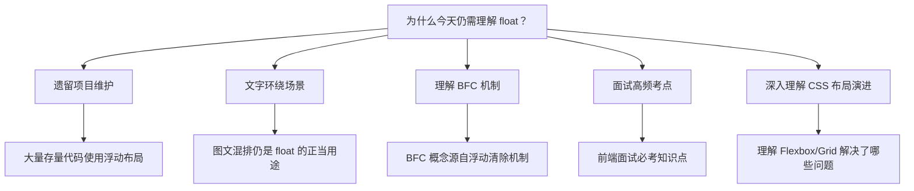
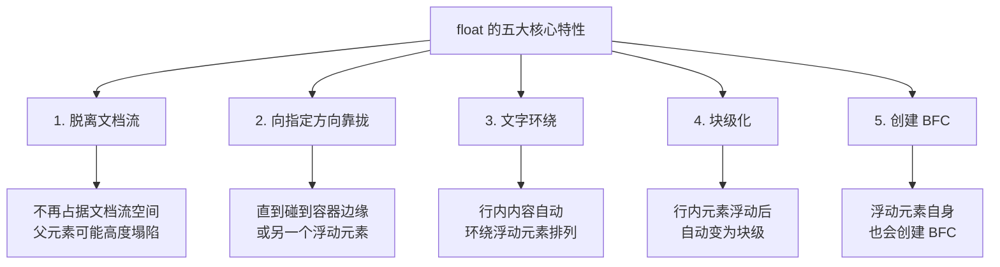
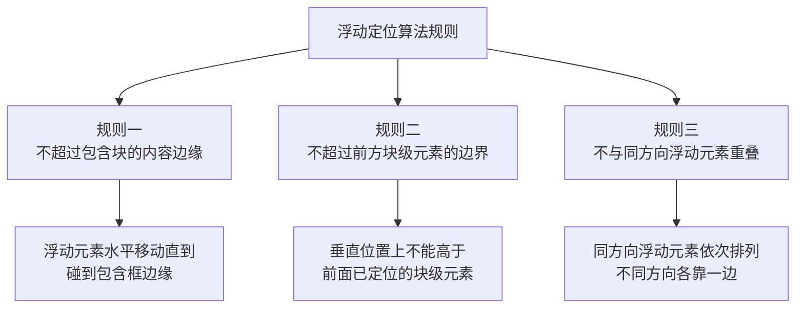
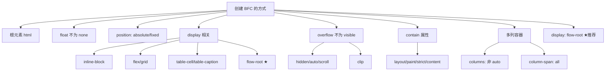
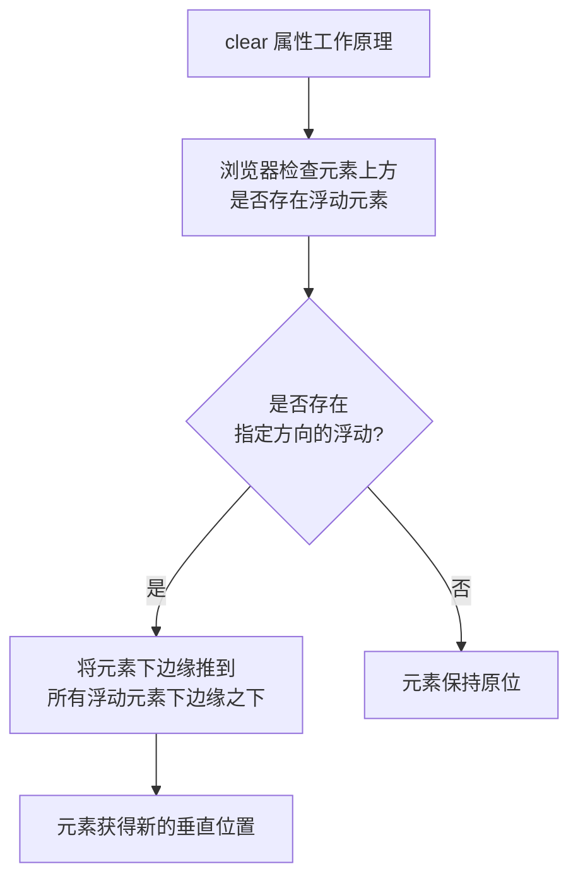
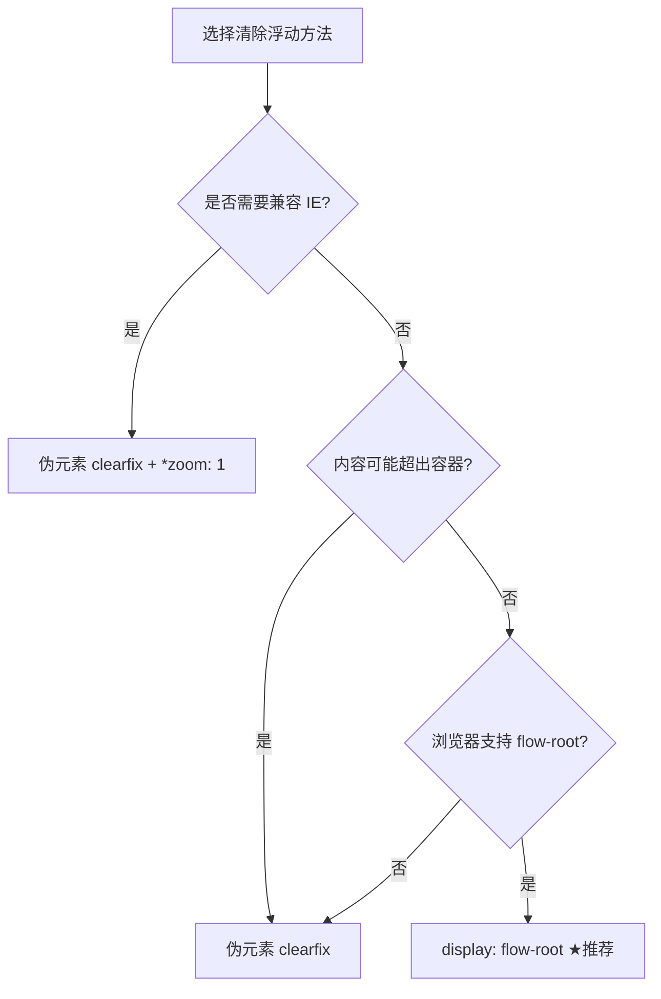

# float 浮动

## 背景与动机

### 浮动的历史定位

在 CSS 的历史长河中，`float` 属性曾是最核心的布局工具。它最初被设计用于实现**文字环绕图片**的排版效果——这一需求直接来源于传统印刷媒体的版面设计。然而，随着 Web 布局复杂度的提升，开发者发现 `float` 的"脱离文档流 + 向一侧靠拢"的特性，恰好可以用来实现多列布局、导航栏等复杂排版。于是，浮动从一个简单的排版特性，演变为 CSS2 时代整个布局体系的基石。

直到 2009 年 Flexbox 规范草案发布、2017 年 Grid 布局正式落地之前，几乎所有复杂的 CSS 布局方案——无论是圣杯布局、双飞翼布局、还是各种栅格系统——都建立在 `float` 之上。Bootstrap 3 及更早版本的栅格系统，本质上就是一套浮动布局方案。

### 为什么今天仍然需要理解 float？



尽管现代布局推荐使用 Flexbox 和 Grid，但理解 `float` 仍然至关重要：

1. **遗留项目维护**：大量生产环境代码仍在使用浮动布局
2. **文字环绕**：`float` 是实现图文混排最自然的方式，Flexbox/Grid 反而无法做到
3. **理解 BFC**：块级格式化上下文（BFC）的概念正是为了解决浮动带来的问题而诞生的
4. **布局思维演进**：只有理解了浮动的痛点，才能真正体会 Flexbox/Grid 的设计哲学

### 浮动解决的核心问题

在 `float` 出现之前，Web 页面只能依靠 `<table>` 进行布局，或者让所有元素简单堆叠。浮动提供了以下能力：

- **元素可以向左或向右靠拢**，实现多列并排
- **行内内容可以环绕浮动元素**，实现图文混排
- **脱离文档流**，为后续的定位体系奠定基础

## 核心概念

### float 属性语法

```css
float: none;           /* 默认值：不浮动 */
float: left;           /* 向左浮动 */
float: right;          /* 向右浮动 */
float: inline-start;   /* 行首方向浮动（遵循书写方向） */
float: inline-end;     /* 行尾方向浮动（遵循书写方向） */
```


#### float 交互演示（MDN）

将元素浮动到容器左侧或右侧，实现图文环绕等效果。

```html
<!DOCTYPE html>
<html lang="zh-CN">
  <head>
    <meta charset="UTF-8" />
    <meta name="viewport" content="width=device-width, initial-scale=1.0" />
    <title>float 属性演示 - MDN 示例</title>
    <meta name="description" content="布局示例：float 属性演示。" />
    <style>
      * {
        margin: 0;
        padding: 0;
        box-sizing: border-box;
      }
      body {
        font-family: -apple-system, BlinkMacSystemFont, "Segoe UI", Roboto, "Helvetica Neue", Arial, sans-serif;
        min-height: 100vh;
        padding: 0;
      }
      .demo-layout {
        display: flex;
        height: 100vh;
        gap: 0;
      }
      .snippet-panel {
        width: 320px;
        flex-shrink: 0;
        padding: 16px;
        display: flex;
        flex-direction: column;
        gap: 8px;
        overflow-y: auto;
        border-right: 1px solid #ddd;
        background: #fafafa;
      }
      .snippet-btn {
        padding: 10px 14px;
        border: 1px solid #ccc;
        border-radius: 6px;
        background: #fff;
        font-family: "JetBrains Mono", "Fira Code", monospace;
        font-size: 13px;
        color: #333;
        cursor: pointer;
        text-align: left;
        transition: all 0.2s;
        line-height: 1.4;
      }
      .snippet-btn:hover {
        border-color: #8083ff;
        background: #f0f0ff;
      }
      .snippet-btn.active {
        border-color: #8083ff;
        background: #e8e8ff;
        color: #571bc1;
        font-weight: 600;
      }
      .preview-panel {
        flex: 1;
        padding: 16px;
        display: flex;
        align-items: center;
        justify-content: center;
        background: #fff;
        overflow: auto;
      }
      .preview-panel > section,
      .preview-panel > div:not(.snippet-panel):not(.demo-layout) {
        flex: 1;
        width: 100%;
        min-height: 0;
        height: 100%;
        display: flex;
        align-items: center;
        justify-content: center;
      }
      .example-container {
        border: 1px solid #c5c5c5;
        padding: 0.75em;
        text-align: left;
        width: 80%;
        line-height: normal;
      }

      #example-element {
        border: solid 10px #efac09;
        background-color: #040d46;
        color: white;
        padding: 1em;
        width: 40%;
      }
    </style>
  </head>
  <body>
    <div class="demo-layout">
      <div class="snippet-panel">
        <button class="snippet-btn active" data-index="0">float: none;</button>
        <button class="snippet-btn" data-index="1">float: left;</button>
        <button class="snippet-btn" data-index="2">float: right;</button>
        <button class="snippet-btn" data-index="3">float: inline-start;</button>
        <button class="snippet-btn" data-index="4">float: inline-end;</button>
      </div>
      <div class="preview-panel">
        <section class="default-example" id="default-example">
          <div class="example-container">
            <div class="transition-all" id="example-element">Float me</div>
            As much mud in the streets as if the waters had but newly retired from the face of the earth, and it would
            not be wonderful to meet a Megalosaurus, forty feet long or so, waddling like an elephantine lizard up
            Holborn Hill.
          </div>
        </section>
      </div>
    </div>
    <script>
      const snippets = [
        `#example-element {
  float: none;
}`,
        `#example-element {
  float: left;
}`,
        `#example-element {
  float: right;
}`,
        `#example-element {
  float: inline-start;
}`,
        `#example-element {
  float: inline-end;
}`,
      ];

      let styleEl = document.createElement("style");
      document.head.appendChild(styleEl);

      function applySnippet(index) {
        styleEl.textContent = snippets[index];
        document.querySelectorAll(".snippet-btn").forEach((btn, i) => {
          btn.classList.toggle("active", i === index);
        });
      }

      document.querySelectorAll(".snippet-btn").forEach((btn) => {
        btn.addEventListener("click", () => applySnippet(parseInt(btn.dataset.index)));
      });

      applySnippet(0);
    </script>
  </body>
</html>

```
### 属性值详解

| 值 | 描述 | 使用场景 | 浏览器支持 |
|---|------|---------|-----------|
| `none` | 默认值，元素不浮动 | 常规文档流布局 | 全浏览器 |
| `left` | 元素向左浮动 | 多列布局、图片左浮动 | 全浏览器 |
| `right` | 元素向右浮动 | 图片右浮动、侧边栏 | 全浏览器 |
| `inline-start` | 在行首方向浮动 | RTL 布局适配 | Chrome 118+, Firefox 55+, Safari 14.1+ |
| `inline-end` | 在行尾方向浮动 | RTL 布局适配 | Chrome 118+, Firefox 55+, Safari 14.1+ |

### 浮动的五大核心特性



**特性一：脱离文档流**

浮动元素从正常文档流中移除，不再占据空间。父元素在计算高度时不会包含浮动子元素，这是导致**高度塌陷**的根本原因。

**特性二：向指定方向移动**

浮动元素会尽可能向左（`left`）或向右（`right`）移动，直到碰到包含框的边缘或另一个浮动元素。

**特性三：文字环绕**

浮动元素最原始的设计目的。行内内容（文字、行内元素）会自动环绕浮动元素排列，形成类似杂志排版的视觉效果。

**特性四：块级化**

浮动元素会自动变成块级元素。即使原来设置的是 `display: inline`，浮动后的计算值也会变为 `display: block`。这意味着：

- 可以设置 `width` 和 `height`（行内元素原本不支持）
- 元素独占一行（但会被浮动方向影响）
- `margin` 和 `padding` 的所有方向都生效

**特性五：创建 BFC**

浮动元素自身会创建一个新的块级格式化上下文（BFC），其内部渲染不受外部影响。

### 浮动元素的盒模型变化

```
浮动前的行内元素：              浮动后：

┌─────────────────────┐        ┌─────────────────────┐
│ display: inline      │        │ display: block（计算值）│
│ width/height: 无效   │   →    │ width/height: 有效     │
│ 垂直 margin: 无效    │        │ 全方向 margin: 有效    │
│ 不独占一行           │        │ 独占一行（浮动方向）    │
└─────────────────────┘        └─────────────────────┘
```

### float 对 display 计算值的影响

| 指定 display 值 | 浮动后的计算值 | 说明 |
|----------------|--------------|------|
| `inline` | `block` | 行内元素块级化 |
| `inline-block` | `block` | 行内块也变为块级 |
| `table-cell` | `block` | 表格单元格块级化 |
| `inline-table` | `table` | 行内表格变为块级表格 |
| `flex` | `flex`（容器本身可浮动） | 浮动的是 flex 容器整体；但作为 flex/grid **项目**时 float 被忽略 |
| `grid` | `grid`（容器本身可浮动） | 同上 |
| `block` | `block` | 不变 |

> **重要规则**：`float` 被忽略的场景是 **flex/grid 项目**（父容器为 `display: flex/grid` 的子项）——因为项目由弹性/网格算法摆放。而 `display: flex/grid` 的**容器本身**是可以正常浮动的。

## 深入原理

### 浮动定位的底层算法

浮动元素的定位并非简单的"靠左"或"靠右"，而是遵循一套精确的算法规则。理解这套算法，是掌握浮动布局的关键。

#### 浮动定位的三条核心规则



**规则一：浮动元素不会超过包含块的内容区域边缘**

浮动元素在水平方向上移动，直到其外边缘触及包含块（containing block）的内容区域边缘（即 padding 内侧）。注意是**内容区域**而非边框区域——这意味着 `padding` 会阻止浮动元素继续移动。

```
┌────────────────────────────────────────┐
│ padding                                │
│ ┌──────────────────────────────────┐   │
│ │ 内容区域                          │   │
│ │  ┌──────┐                        │   │
│ │  │Float │ ← 最远到这里            │   │
│ │  └──────┘                        │   │
│ └──────────────────────────────────┘   │
└────────────────────────────────────────┘
```

**规则二：浮动元素不会超过前方的块级元素**

如果浮动元素在文档流中位于某个块级元素之后，它的垂直位置不能高于该块级元素的上边缘。这条规则防止了浮动元素"穿越"正常文档流中的块级元素。

```
浮动前：                      浮动后：
┌──────────────┐              ┌──────────────┐
│ Block 1      │              │ Block 1      │
├──────────────┤              ├──────────────┤
│ [浮动元素]   │              │ ┌─────┐Block2│
│              │    →         │ │Float│文字  │
├──────────────┤              │ └─────┘环绕  │
│ Block 2      │              ├──────────────┤
└──────────────┘              └──────────────┘
```

**规则三：浮动元素之间不会重叠**

- **同方向浮动**：依次排列，后一个紧挨着前一个
- **不同方向浮动**：`float: left` 靠左，`float: right` 靠右
- **空间不足时**：自动换行到下一行

#### 浮动元素的换行机制

```
当一行放不下时：

┌────────────────────────────────────┐
│ ┌────┐ ┌────┐ ┌────┐              │
│ │ F1 │ │ F2 │ │ F3 │   第一行      │
│ └────┘ └────┘ └────┘              │
│ ┌────┐                             │
│ │ F4 │   ← 空间不足，换行           │
│ └────┘                             │
└────────────────────────────────────┘

高度不一致可能导致"卡住"：

┌────────────────────────────────────┐
│ ┌────┐ ┌────┐ ┌────┐              │
│ │    │ │    │ │ F3 │              │
│ │ F1 │ │ F2 │ └────┘ ← F3 被 F1  │
│ │    │ │    │ ┌────┐    卡住      │
│ └────┘ │    │ │ F4 │              │
│ ┌────┐ │    │ └────┘              │
│ │ F5 │ └────┘                     │
│ └────┘ ← F5 被 F2 卡住            │
└────────────────────────────────────┘
```

> **实践提示**：使用浮动实现等高多列布局时，务必确保所有浮动元素高度一致，否则可能出现意外的换行和间隙。

### 文字环绕的底层机制

文字环绕是 `float` 最初的设计目的。理解其底层机制有助于在实际项目中精确控制环绕效果。

#### 环绕原理

当浮动元素出现在行内内容的排列路径中时，浏览器会将浮动元素的**外边距盒（margin box）**作为障碍区域。行框（line box）在布局时会缩短自身宽度，为浮动元素腾出空间。

```
无浮动时：                       有浮动时：
┌──────────────────────────┐    ┌──────────────────────────┐
│ Line 1: ████████████████ │    │ Line 1: ██┌──────┐██████ │
│ Line 2: ████████████████ │    │ Line 2: ██│Float │██████ │
│ Line 3: ████████████████ │    │ Line 3: ██│      │██████ │
│ Line 4: ████████████████ │    │ Line 4: ████████████████ │ ← 恢复全宽
└──────────────────────────┘    └──────────────────────────┘
```

#### 行框缩短规则

1. 行框在浮动元素**同侧**缩短
2. 如果浮动元素高度跨越多行，所有这些行都会缩短
3. 浮动元素下方的行恢复正常宽度
4. 如果浮动元素宽度超过行框宽度的一半，行框可能缩短到极小

#### 阻止文字环绕

```css
/* 方法1：使用 overflow 创建 BFC */
.no-wrap {
  overflow: hidden; /* 或 auto */
  /* BFC 区域不与浮动元素重叠 */
}

/* 方法2：使用 display: flow-root（推荐） */
.no-wrap {
  display: flow-root;
}

/* 方法3：使用 clear 属性 */
.no-wrap {
  clear: both; /* 完全清除浮动影响 */
}
```

### BFC 创建原理详解

BFC（Block Formatting Context，块级格式化上下文）是 CSS 布局中最重要的概念之一，它与 `float` 有着密不可分的关系。

#### 什么是 BFC？

BFC 是一个**独立的渲染区域**，在这个区域中：

1. 内部的 Box 在垂直方向上依次排列
2. 同一个 BFC 内相邻块级元素的 margin 会发生折叠（collapse）
3. BFC 区域不会与 float 元素重叠
4. 计算 BFC 高度时会包含内部的浮动元素
5. BFC 内外的元素互不影响

#### 创建 BFC 的所有方式



| 条件 | CSS 示例 | 副作用 |
|------|---------|--------|
| 根元素 | `html { }` | 无 |
| `float` 不为 `none` | `float: left` | 脱离文档流 |
| `position: absolute/fixed` | `position: absolute` | 脱离文档流 |
| `display: inline-block` | `display: inline-block` | 改变显示类型 |
| `display: flex/grid` | `display: flex` | 改变布局模式 |
| `display: flow-root` | `display: flow-root` | **无副作用** ★ |
| `display: table-cell` | `display: table-cell` | 改变显示类型 |
| `overflow` 不为 `visible` | `overflow: hidden` | 可能裁剪内容 |
| `contain: layout/paint/...` | `contain: layout` | 限制重排范围 |
| `columns` 不为 `auto` | `columns: 2` | 创建多列 |

#### BFC 包含浮动的原理

BFC 在计算高度时，会将内部的浮动元素纳入计算。这正是利用 BFC 清除浮动的核心原理：

```
普通容器（非 BFC）：              BFC 容器：

┌──────────────┐                ┌──────────────┐
│ ┌────┐       │                │ ┌────┐       │
│ │Float│      │                │ │Float│      │
│ └────┘       │                │ └────┘       │
│              │                ├──────────────┤ ← BFC 高度包含浮动
│ 高度 = 0     │                │              │
└──────────────┘                └──────────────┘
     ↑ 浮动不占空间                  ↑ BFC 包含浮动
```

### clear 属性的清除算法

`clear` 属性的工作原理经常被误解。它并不是"取消浮动"，而是将元素**推到所有指定方向的浮动元素下方**。

#### clear 的工作机制

```css
clear: none;          /* 默认：允许浮动 */
clear: left;          /* 不允许左侧有浮动元素 */
clear: right;         /* 不允许右侧有浮动元素 */
clear: both;          /* 不允许两侧有浮动元素（常用） */
clear: inline-start;  /* 行首方向清除 */
clear: inline-end;    /* 行尾方向清除 */
```



**关键理解**：`clear` 不是"取消"浮动，而是让当前元素**避开**浮动元素。设置了 `clear: both` 的元素，其上边缘必须低于所有前方浮动元素的下边缘。

```
清除浮动前：                    清除浮动后（clear: both）：
┌──────────────────────────┐    ┌──────────────────────────┐
│ ┌─────┐                  │    │ ┌─────┐                  │
│ │Float│  Block 元素      │    │ │Float│                  │
│ │     │  （被覆盖）       │    │ └─────┘                  │
│ └─────┘                  │    │                          │
└──────────────────────────┘    │  Block 元素              │ ← 被推到浮动下方
                                └──────────────────────────┘
```


#### clear 交互演示（MDN）

清除元素一侧或两侧的浮动影响。

```html
<!DOCTYPE html>
<html lang="zh-CN">
  <head>
    <meta charset="UTF-8" />
    <meta name="viewport" content="width=device-width, initial-scale=1.0" />
    <title>clear 属性演示 - MDN 示例</title>
    <meta name="description" content="文本与字体示例：clear 属性演示。" />
    <style>
      * {
        margin: 0;
        padding: 0;
        box-sizing: border-box;
      }
      body {
        font-family: -apple-system, BlinkMacSystemFont, "Segoe UI", Roboto, "Helvetica Neue", Arial, sans-serif;
        min-height: 100vh;
        padding: 0;
      }
      .demo-layout {
        display: flex;
        height: 100vh;
        gap: 0;
      }
      .snippet-panel {
        width: 320px;
        flex-shrink: 0;
        padding: 16px;
        display: flex;
        flex-direction: column;
        gap: 8px;
        overflow-y: auto;
        border-right: 1px solid #ddd;
        background: #fafafa;
      }
      .snippet-btn {
        padding: 10px 14px;
        border: 1px solid #ccc;
        border-radius: 6px;
        background: #fff;
        font-family: "JetBrains Mono", "Fira Code", monospace;
        font-size: 13px;
        color: #333;
        cursor: pointer;
        text-align: left;
        transition: all 0.2s;
        line-height: 1.4;
      }
      .snippet-btn:hover {
        border-color: #8083ff;
        background: #f0f0ff;
      }
      .snippet-btn.active {
        border-color: #8083ff;
        background: #e8e8ff;
        color: #571bc1;
        font-weight: 600;
      }
      .preview-panel {
        flex: 1;
        padding: 16px;
        display: flex;
        align-items: center;
        justify-content: center;
        background: #fff;
        overflow: auto;
      }
      .preview-panel > section,
      .preview-panel > div:not(.snippet-panel):not(.demo-layout) {
        flex: 1;
        width: 100%;
        min-height: 0;
        height: 100%;
        display: flex;
        align-items: center;
        justify-content: center;
      }
      .example-container {
        border: 1px solid #c5c5c5;
        padding: 0.75em;
        text-align: left;
        line-height: normal;
      }

      .floated-left {
        border: solid 10px #ffc129;
        background-color: rgba(81, 81, 81, 0.6);
        padding: 1em;
        float: left;
      }

      .floated-right {
        border: solid 10px #ffc129;
        background-color: rgba(81, 81, 81, 0.6);
        padding: 1em;
        float: right;
        height: 150px;
      }
    </style>
  </head>
  <body>
    <div class="demo-layout">
      <div class="snippet-panel">
        <button class="snippet-btn active" data-index="0">clear: none;</button>
        <button class="snippet-btn" data-index="1">clear: left;</button>
        <button class="snippet-btn" data-index="2">clear: right;</button>
        <button class="snippet-btn" data-index="3">clear: both;</button>
      </div>
      <div class="preview-panel">
        <section class="default-example" id="default-example">
          <div class="example-container">
            <div class="floated-left">Left</div>
            <div class="floated-right">Right</div>
            <div class="transition-all" id="example-element">
              As much mud in the streets as if the waters had but newly retired from the face of the earth, and it would
              not be wonderful to meet a Megalosaurus, forty feet long or so, waddling like an elephantine lizard up
              Holborn Hill.
            </div>
          </div>
        </section>
      </div>
    </div>
    <script>
      const snippets = [
        `#example-element {
  clear: none;
}`,
        `#example-element {
  clear: left;
}`,
        `#example-element {
  clear: right;
}`,
        `#example-element {
  clear: both;
}`,
      ];

      let styleEl = document.createElement("style");
      document.head.appendChild(styleEl);

      function applySnippet(index) {
        styleEl.textContent = snippets[index];
        document.querySelectorAll(".snippet-btn").forEach((btn, i) => {
          btn.classList.toggle("active", i === index);
        });
      }

      document.querySelectorAll(".snippet-btn").forEach((btn) => {
        btn.addEventListener("click", () => applySnippet(parseInt(btn.dataset.index)));
      });

      applySnippet(0);
    </script>
  </body>
</html>

```
### 浮动造成的三大问题

#### 问题一：父元素高度塌陷

这是浮动最常见的问题。浮动元素脱离文档流后，父元素无法感知其高度。

```
正常情况：                    浮动后（高度塌陷）：

┌────────────────┐            ┌────────────────┐ ← border
│ ┌────────────┐ │            │                │ 
│ │   子元素   │ │            │                │ ← 高度为 0
│ └────────────┘ │            │                │
└────────────────┘            └────────────────┘
   parent 有高度                   parent 无高度
```

**影响范围**：

- 父元素的背景、边框无法正确显示
- 后续元素可能上移，导致布局混乱
- margin 不会发生预期的折叠

#### 问题二：后续块级元素被覆盖

浮动元素虽然脱离了文档流，但仍然在视觉上覆盖在非定位的块级元素之上。

```css
.float-element {
  float: left;
  width: 200px;
  height: 200px;
}

.next-block {
  /* 背景和内容会被浮动元素覆盖 */
  /* 但边框仍然可见（在浮动元素下方） */
}
```

#### 问题三：行内内容意外环绕

当不需要文字环绕时，浮动元素的文字环绕效果可能导致布局不符合预期。

## 代码示例

### 基本浮动示例

```html
<div class="container">
  <div class="float-left">左浮动</div>
  <div class="float-right">右浮动</div>
  <p>中间的文字内容会环绕浮动元素。这是 float 最初的设计目的——
     实现类似杂志排版的图文混排效果。</p>
</div>

<style>
.float-left {
  float: left;
  width: 200px;
  height: 150px;
  background: #e3f2fd;
  margin: 0 20px 10px 0;
}

.float-right {
  float: right;
  width: 200px;
  height: 150px;
  background: #fff3e0;
  margin: 0 0 10px 20px;
}

.container {
  width: 600px;
  border: 1px solid #ccc;
  padding: 20px;
}
</style>
```

### 文字环绕图片

```html
<article class="article">
  
  <p class="article-text">这是一段很长的文字内容，它会自动环绕在图片周围。
     当图片浮动后，文字会自动重新排列，形成环绕效果。这种排版方式在
     新闻网站、博客文章中非常常见。</p>
  <p>当文字长度超过图片高度后，后续段落会恢复全宽排列。</p>
</article>

<style>
.article {
  max-width: 700px;
  margin: 0 auto;
  padding: 20px;
}

.article-image {
  float: left;
  width: 280px;
  height: auto;
  margin: 0 20px 10px 0;
  border-radius: 4px;
}

.article-text {
  line-height: 1.8;
  text-indent: 2em;
}
</style>
```

**效果示意：**

```
┌────────────────────────────────────────┐
│ ┌────────┐ Lorem ipsum dolor sit amet, │
│ │        │ consectetur adipiscing elit.│
│ │  图片  │ Sed do eiusmod tempor       │
│ │        │ incididunt ut labore...     │
│ └────────┘                              │
│ Ut enim ad minim veniam, quis nostrud  │
│ exercitation ullamco laboris...         │
└────────────────────────────────────────┘
```

### 多列布局

```html
<div class="row">
  <div class="column">列 1</div>
  <div class="column">列 2</div>
  <div class="column">列 3</div>
</div>

<style>
.row::after {
  content: "";
  display: table;
  clear: both;
}

.column {
  float: left;
  width: 33.333%;
  padding: 0 15px;
  box-sizing: border-box;
  min-height: 200px;
  background: #f5f5f5;
}

/* 响应式调整 */
@media (max-width: 768px) {
  .column {
    width: 50%;
    margin-bottom: 15px;
  }
}

@media (max-width: 480px) {
  .column {
    width: 100%;
    float: none;
  }
}
</style>
```

### 导航栏

```html
<ul class="nav">
  <li class="nav-item"><a href="#" class="nav-link">首页</a></li>
  <li class="nav-item"><a href="#" class="nav-link">产品</a></li>
  <li class="nav-item"><a href="#" class="nav-link">关于</a></li>
  <li class="nav-item"><a href="#" class="nav-link">联系</a></li>
</ul>

<style>
.nav {
  list-style: none;
  margin: 0;
  padding: 0;
  background: #333;
}

.nav::after {
  content: "";
  display: table;
  clear: both;
}

.nav-item {
  float: left;
}

.nav-link {
  display: block;
  padding: 12px 20px;
  color: white;
  text-decoration: none;
  transition: background 0.3s;
}

.nav-link:hover {
  background: #555;
}
</style>
```

### 圣杯布局

三栏布局的经典实现，中间内容优先渲染和加载：

```html
<div class="container">
  <main class="main">主内容区</main>
  <aside class="left">左侧栏</aside>
  <aside class="right">右侧栏</aside>
</div>

<style>
.container {
  padding: 0 200px;  /* 为左右侧栏预留空间 */
  min-width: 600px;  /* 防止中间内容被挤压到极小 */
}

.container::after {
  content: "";
  display: table;
  clear: both;
}

.main {
  float: left;
  width: 100%;
  min-height: 300px;
  background: #e3f2fd;
}

.left {
  float: left;
  width: 200px;
  margin-left: -100%;      /* 移到最左侧 */
  position: relative;
  left: -200px;            /* 移到预留空间 */
  min-height: 300px;
  background: #fff3e0;
}

.right {
  float: left;
  width: 200px;
  margin-left: -200px;     /* 移到最右侧 */
  position: relative;
  right: -200px;           /* 移到预留空间 */
  min-height: 300px;
  background: #f3e5f5;
}
</style>
```

**布局原理示意：**

```
┌────────────────────────────────────────────────┐
│              ← 200px →    ← 200px →            │
├──────────┬─────────────────────┬───────────────┤
│  左侧栏  │     主内容区        │  右侧栏       │
│  200px   │      自适应         │   200px       │
│ margin-  │  width: 100%       │ margin-left:  │
│ left:    │  (实际被 padding    │  -200px       │
│ -100%    │   挤压)             │               │
│ + left:  │                     │               │
│ -200px   │                     │               │
└──────────┴─────────────────────┴───────────────┘
```

### 双飞翼布局

圣杯布局的改进版本，用额外的包裹层代替 `position: relative`，更灵活：

```html
<div class="main-wrap">
  <main class="main">主内容区</main>
</div>
<aside class="left">左侧栏</aside>
<aside class="right">右侧栏</aside>

<style>
.main-wrap {
  float: left;
  width: 100%;
}

.main {
  margin: 0 200px;  /* 左右留出侧栏空间 */
  min-height: 300px;
  background: #e3f2fd;
}

.left {
  float: left;
  width: 200px;
  margin-left: -100%;
  min-height: 300px;
  background: #fff3e0;
}

.right {
  float: left;
  width: 200px;
  margin-left: -200px;
  min-height: 300px;
  background: #f3e5f5;
}
</style>
```

**圣杯布局 vs 双飞翼布局对比：**

| 特性 | 圣杯布局 | 双飞翼布局 |
|-----|---------|-----------|
| DOM 结构 | 三栏同级 | 中间栏多一层包裹 |
| 中间栏处理 | `position: relative` + `left/right` | `margin` 留空 |
| 最小宽度限制 | 容器需要 `min-width` | 中间内容需要 `margin` |
| 灵活性 | 一般 | 更灵活 |
| 响应式适配 | 需要调整 padding | 只需调整 margin |

### 自适应两栏布局（利用 BFC）

```html
<div class="layout">
  <aside class="sidebar">侧边栏（固定宽度）</aside>
  <main class="content">主内容区（自适应宽度）</main>
</div>

<style>
.layout::after {
  content: "";
  display: table;
  clear: both;
}

.sidebar {
  float: left;
  width: 250px;
  min-height: 100vh;
  background: #f5f5f5;
}

.content {
  /* 创建 BFC，不与浮动元素重叠 */
  overflow: hidden;  /* 或 display: flow-root */
  /* 自动占据剩余宽度 */
  min-height: 100vh;
  padding: 20px;
}
</style>
```

**原理：** `.content` 创建 BFC 后，BFC 区域不会与浮动元素重叠，因此自动占据侧边栏右侧的所有空间。

### 图片画廊

```html
<div class="gallery">
  <div class="gallery-item"></div>
  <div class="gallery-item"></div>
  <div class="gallery-item"></div>
  <div class="gallery-item"></div>
</div>

<style>
.gallery {
  margin: -10px;  /* 负边距抵消内边距 */
}

.gallery::after {
  content: "";
  display: table;
  clear: both;
}

.gallery-item {
  float: left;
  width: 25%;
  padding: 10px;
  box-sizing: border-box;
}

.gallery-item img {
  width: 100%;
  height: auto;
  display: block;  /* 消除图片底部空隙 */
  border-radius: 4px;
}

/* 响应式 */
@media (max-width: 768px) {
  .gallery-item { width: 50%; }
}

@media (max-width: 480px) {
  .gallery-item { width: 100%; }
}
</style>
```

## 清除浮动的方法

清除浮动是为了解决浮动元素造成的高度塌陷和布局影响问题。以下是所有清除浮动方案的详细对比。

### 方法一：空元素 + clear（不推荐）

```html
<div class="parent">
  <div class="child float">浮动元素</div>
  <div style="clear: both;"></div>  <!-- 无语义的空元素 -->
</div>
```

| 优点 | 缺点 |
|------|------|
| 兼容性最好 | 添加无语义的 HTML 元素 |
| 简单直观 | 代码冗余，维护成本高 |
| 所有浏览器支持 | 违反结构与样式分离原则 |

### 方法二：overflow 方法

```css
.parent {
  overflow: hidden;  /* 或 auto | scroll */
  /* 触发 BFC，包含浮动元素 */
}
```

| 优点 | 缺点 |
|------|------|
| 代码简单 | 可能隐藏超出内容 |
| 无需额外 HTML | 可能显示滚动条 |
| 兼容性好 | 不适合有下拉菜单的场景 |

### 方法三：display: flow-root（推荐）

```css
.parent {
  display: flow-root;
  /* 创建 BFC，专门用于包含浮动 */
}
```

| 优点 | 缺点 |
|------|------|
| 语义清晰，专为此目的设计 | IE 不支持 |
| 无副作用 | 需要现代浏览器 |
| 代码简洁 | — |

### 方法四：伪元素清除（经典方案）

```css
.clearfix::after {
  content: "";
  display: table;  /* 或 block */
  clear: both;
}

/* HTML 中使用 */
<div class="parent clearfix">
  <div class="child float">浮动元素</div>
</div>
```

| 优点 | 缺点 |
|------|------|
| 无副作用 | 代码稍多 |
| 不需要额外 HTML | 需要记住 clearfix 模式 |
| 兼容性好 | — |

### 方法五：完整 clearfix 方案（兼容旧浏览器）

```css
.clearfix::before,
.clearfix::after {
  content: "";
  display: table;
}

.clearfix::after {
  clear: both;
}

/* 兼容 IE6/7 */
.clearfix {
  *zoom: 1;
}
```

> **说明**：`::before` 的作用是防止顶部 margin 折叠（IE6/7 特有 bug），`*zoom: 1` 触发 IE6/7 的 `hasLayout` 机制。

### 清除浮动方法选择决策



## 最佳实践

### 1. 优先使用现代布局

```css
/* ❌ 旧方式：浮动布局 */
.container::after {
  content: "";
  display: table;
  clear: both;
}
.item {
  float: left;
  width: 25%;
}

/* ✅ 新方式：Flexbox */
.container {
  display: flex;
  flex-wrap: wrap;
  gap: 20px;
}
.item {
  flex: 0 0 calc(25% - 15px);
}
```

### 2. 合理使用浮动的场景

浮动最合适的场景是**文字环绕**：

```css
/* ✅ 正确用法：图片文字环绕 */
.article img {
  float: left;
  margin: 0 20px 10px 0;
}

/* ✅ 正确用法：简单的侧边浮动 */
.sidebar-float {
  float: right;
  width: 300px;
  margin: 0 0 20px 20px;
}

/* ❌ 不推荐：用于整体页面布局 */
/* 改用 Flexbox 或 Grid */
```

### 3. 必须清除浮动

```css
/* 推荐：flow-root（现代浏览器） */
.container {
  display: flow-root;
}

/* 或：伪元素清除（兼容性好） */
.clearfix::after {
  content: "";
  display: table;
  clear: both;
}
```

### 4. 图片设置 display: block

```css
.gallery-item img {
  display: block;  /* 消除底部空隙 */
  width: 100%;
  height: auto;
}
```

### 5. 使用 box-sizing: border-box

```css
*, *::before, *::after {
  box-sizing: border-box;
}

.column {
  float: left;
  width: 25%;
  padding: 0 15px;  /* 不会撑大宽度 */
}
```

### 6. 提供响应式断点

```css
/* 移动优先 */
.column {
  width: 100%;
}

/* 平板 */
@media (min-width: 768px) {
  .column {
    float: left;
    width: 50%;
  }
}

/* 桌面 */
@media (min-width: 992px) {
  .column {
    width: 33.333%;
  }
}
```

### 7. 防止浮动元素高度不一致导致卡住

```css
/* 方案1：统一高度 */
.float-item {
  float: left;
  width: 25%;
  height: 200px;  /* 固定高度 */
}

/* 方案2：使用 clear 定期换行 */
.float-item:nth-child(4n+1) {
  clear: left;  /* 每行第一个清除左侧浮动 */
}

/* 方案3：改用 Flexbox（推荐） */
.flex-container {
  display: flex;
  flex-wrap: wrap;
}
```

## 常见问题

### Q1: 为什么浮动元素的高度不计入父元素？

**A:** 浮动元素脱离了文档流（normal flow），父元素在计算高度时不会包含浮动子元素。这是 CSS 规范的设计——浮动元素的定位独立于文档流。需要通过清除浮动或创建 BFC 来强制父元素包含浮动子元素的高度。

### Q2: clear: both 应该放在哪里？

**A:** `clear` 属性应该放在**浮动元素之后的元素**上：

```css
/* 方式一：放在后续元素 */
.float-element { float: left; }
.next-element { clear: both; }  /* 在浮动元素之后 */

/* 方式二：伪元素（推荐） */
.parent::after {
  content: "";
  display: table;
  clear: both;
}
```

### Q3: 图片底部为什么有空隙？

**A:** 图片默认是行内元素（`display: inline`），其基线（baseline）与文本基线对齐，底部会留出下标字母（descender）的空间。

**解决方案：**

```css
img {
  display: block;         /* 方案1：推荐 */
  /* 或 */
  vertical-align: bottom; /* 方案2：对齐底部 */
  /* 或 */
  float: left;            /* 方案3：浮动也消除空隙 */
}
```

### Q4: 浮动元素之间为什么有空白？

**A:** HTML 代码中的空白符（空格、换行）在行内级元素之间会产生间隙。

**解决方案：**

```css
/* 方案一：去除 HTML 空白 */
<div class="nav"><a href="#">首页</a><a href="#">产品</a></div>

/* 方案二：父元素 font-size: 0 */
.nav { font-size: 0; }
.nav-item { font-size: 14px; }

/* 方案三：改用 Flexbox（推荐） */
.nav { display: flex; gap: 20px; }
```

### Q5: overflow: hidden 会不会裁剪内容？

**A:** 会。如果子元素（如绝对定位的下拉菜单）超出父元素边界，会被隐藏。

**替代方案：**

```css
/* 不裁剪内容的方案 */
.clearfix::after {
  content: "";
  display: table;
  clear: both;
}

/* 或使用 flow-root */
.container {
  display: flow-root;
}
```

### Q6: 多个浮动元素如何换行？

**A:** 当一行放不下时，浮动元素会自动换行。但需注意高度不一致可能导致"卡住"现象：

```css
/* 确保高度一致 */
.float-item {
  float: left;
  width: 25%;
  height: 200px;
}

/* 或使用 Flexbox（推荐） */
.flex-container {
  display: flex;
  flex-wrap: wrap;
}
```

### Q7: 如何实现文字不环绕浮动元素？

**A:** 让包含文字的元素创建 BFC：

```css
.sidebar {
  float: left;
  width: 200px;
}

.content {
  display: flow-root;  /* 推荐 */
  /* 或 overflow: hidden; */
  /* BFC 不与浮动元素重叠，内容不会环绕 */
}
```

### Q8: 圣杯布局和双飞翼布局有什么区别？

**A:** 主要区别在于处理中间栏的方式：

| 特性 | 圣杯布局 | 双飞翼布局 |
|-----|---------|-----------|
| 中间栏处理 | 使用 `position: relative` | 使用 `margin` 留空 |
| DOM 结构 | 三栏同级 | 中间栏多一层包裹 |
| 容器要求 | 需要 `padding` 预留空间 | 不需要 |
| 灵活性 | 一般 | 更灵活 |

## 浮动的替代方案

现代布局中，Flexbox 和 Grid 是更好的选择。以下是常见浮动布局的现代替代方案。

### Flexbox 替代多列布局

```css
/* 传统浮动布局 */
.float-layout::after {
  content: "";
  display: table;
  clear: both;
}
.float-layout .item {
  float: left;
  width: 25%;
  padding: 10px;
  box-sizing: border-box;
}

/* Flexbox 替代 */
.flex-layout {
  display: flex;
  flex-wrap: wrap;
  gap: 20px;
}
.flex-layout .item {
  flex: 0 0 calc(25% - 15px);
}
```

### Grid 替代图片画廊

```css
/* 传统浮动 */
.gallery::after {
  content: "";
  display: table;
  clear: both;
}
.gallery-item {
  float: left;
  width: 25%;
  padding: 10px;
}

/* Grid 替代 */
.gallery {
  display: grid;
  grid-template-columns: repeat(4, 1fr);
  gap: 20px;
  /* 无需清除浮动 */
}
```

### Flexbox 替代导航栏

```css
/* 传统浮动 */
.nav::after {
  content: "";
  display: table;
  clear: both;
}
.nav-item {
  float: left;
}

/* Flexbox 替代 */
.nav {
  display: flex;
  gap: 20px;
  /* 无需清除浮动 */
}
```

### 布局方案对比总结

| 特性 | float | Flexbox | Grid |
|-----|-------|---------|------|
| 文档流 | 脱离 | 不脱离 | 不脱离 |
| 清除浮动 | 需要 | 不需要 | 不需要 |
| 垂直居中 | 困难 | 简单 | 简单 |
| 等高列 | 需要 hack | 天然支持 | 天然支持 |
| 排列方向 | 水平 | 一维（水平/垂直） | 二维 |
| 响应式 | 需要媒体查询 | 容易 | 容易 |
| 文字环绕 | ✅ 支持 | ❌ 不支持 | ❌ 不支持 |
| 浏览器支持 | 全浏览器 | IE11+（部分） | IE11+（部分） |

**选择原则：**

- **文字环绕** → 使用 `float`
- **一维布局** → 使用 `Flexbox`
- **二维布局** → 使用 `Grid`
- **旧项目维护** → 理解 `float`

## 参考资源

- [MDN - float](https://developer.mozilla.org/zh-CN/docs/Web/CSS/float)
- [MDN - clear](https://developer.mozilla.org/zh-CN/docs/Web/CSS/clear)
- [MDN - Block Formatting Context](https://developer.mozilla.org/zh-CN/docs/Web/Guide/CSS/Block_formatting_context)
- [CSS 2.2 - Floats](https://www.w3.org/TR/CSS22/visuren.html#floats)
- [CSS Display Module Level 3](https://www.w3.org/TR/css-display-3/)
- [All About Floats - CSS-Tricks](https://css-tricks.com/all-about-floats/)
- [The Holy Grail Layout - Philip Walton](https://philipwalton.github.io/solved-by-flexbox/demos/holy-grail/)

## 浏览器兼容性

### float 属性

| 浏览器 | 支持版本 |
|--------|---------|
| Chrome | 1+ |
| Firefox | 1+ |
| Safari | 1+ |
| Edge | 12+ |
| IE | 4+ |

### inline-start / inline-end

| 浏览器 | 支持版本 |
|--------|---------|
| Chrome | 118+ |
| Firefox | 55+ |
| Safari | 14.1+ |
| Edge | 118+ |

### display: flow-root

| 浏览器 | 支持版本 |
|--------|---------|
| Chrome | 58+ |
| Firefox | 53+ |
| Safari | 13+ |
| Edge | 79+ |
| IE | ❌ 不支持 |

### 兼容性降级方案

```css
/* 现代浏览器 */
.container {
  display: flow-root;
}

/* 兼容旧浏览器的写法 */
.container {
  overflow: hidden;      /* 回退方案 */
  display: flow-root;    /* 现代浏览器优先 */
}

/* 或使用 clearfix */
.clearfix::after {
  content: "";
  display: table;
  clear: both;
}
```

