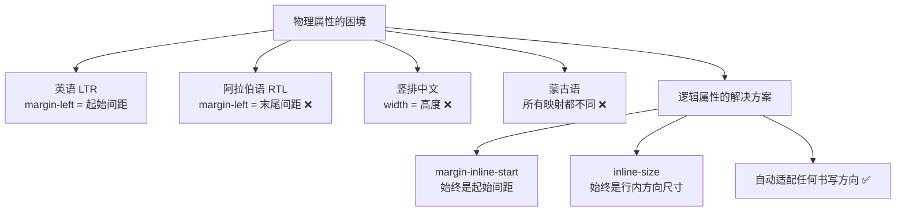
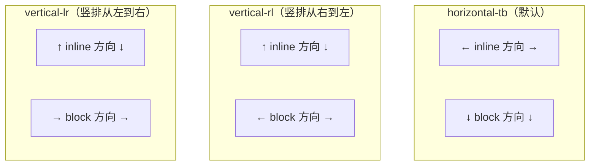
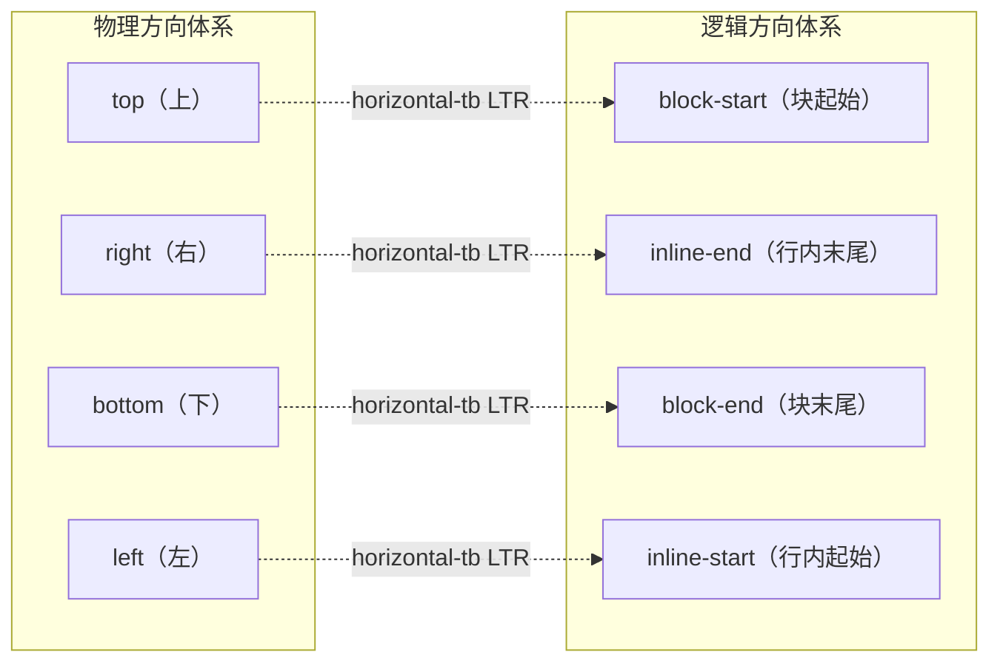
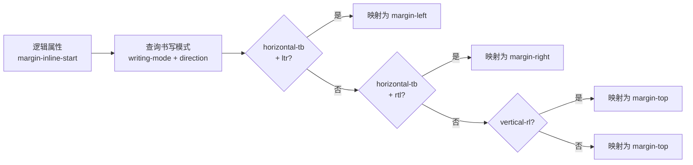
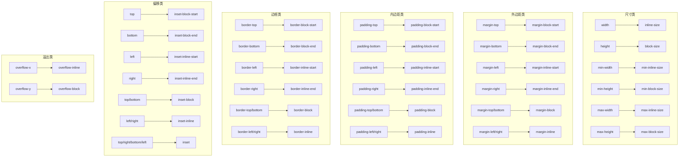
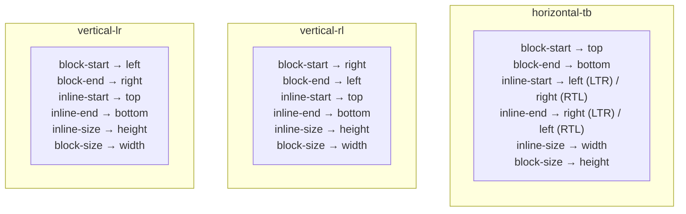
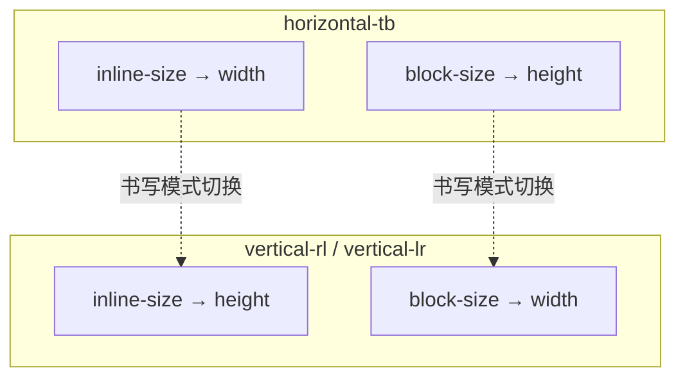
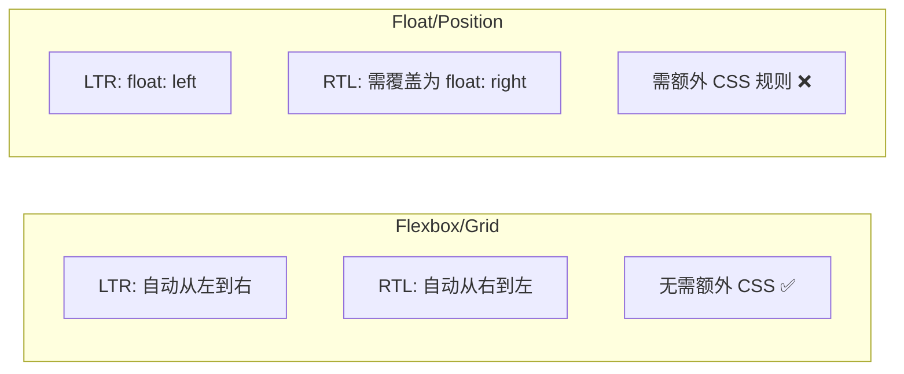
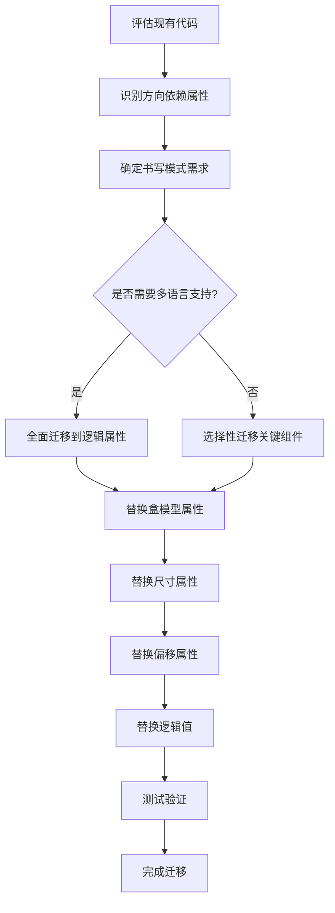

# CSS 逻辑属性与逻辑值

## 背景与动机

### 为什么需要逻辑属性？

CSS 诞生之初，所有布局属性都绑定在**物理方向**上——`top`、`right`、`bottom`、`left`、`width`、`height`。这种设计在英语世界（从左到右、从上到下书写）中运作良好，但当 Web 走向全球化时，问题暴露了：

- **阿拉伯语、希伯来语**：从右到左书写（RTL），`margin-left` 变成了"末尾间距"而非"起始间距"
- **传统中文、日文**：竖排书写（vertical-rl），`width` 变成了"高度"而非"宽度"
- **蒙古语**：竖排但从左到右（vertical-lr），物理方向映射更加复杂

如果继续使用物理属性，每支持一种新的书写方向，就需要编写一整套样式覆盖。这不仅代码冗余，而且极易出错。



### CSS 逻辑属性的诞生

CSS Logical Properties and Values Level 1 规范于 2018 年成为 W3C Candidate Recommendation，它定义了一套基于**书写方向**而非物理方向的属性体系。核心思想是：用**行内方向（inline）**和**块方向（block）**替代上、右、下、左。

### 核心优势

| 优势 | 说明 |
|------|------|
| **国际化支持** | 无需为 RTL 语言编写额外样式覆盖 |
| **书写模式适配** | 自动适应 `vertical-rl` 等竖排书写模式 |
| **代码维护性** | 减少条件样式和方向覆盖代码 |
| **语义更清晰** | 属性名直接表达布局意图而非物理位置 |
| **未来兼容** | 适应可能出现的新的书写模式 |

## 核心概念

### writing-mode 完整值列表

`writing-mode` 是逻辑属性体系的基础。它定义了文本的排列方向，决定了逻辑方向如何映射到物理方向。

| 值 | 说明 | 行内方向 | 块方向 | 典型语言 |
|---|------|---------|--------|---------|
| `horizontal-tb` | 水平书写，块方向向下 | 水平（左→右 或 右→左） | 垂直（上→下） | 英语、阿拉伯语、韩语 |
| `vertical-rl` | 竖排书写，块方向向左 | 垂直（上→下） | 水平（右→左） | 传统中文、日文 |
| `vertical-lr` | 竖排书写，块方向向右 | 垂直（上→下） | 水平（左→右） | 蒙古语 |
| `sideways-rl` | 侧排，文字旋转 90° 顺时针 | 垂直（上→下） | 水平（右→左） | 实验性 |
| `sideways-lr` | 侧排，文字旋转 90° 逆时针 | 垂直（下→上） | 水平（左→右） | 实验性 |

> **注意**：`sideways-*` 值目前浏览器支持有限，主要用于需要旋转文字的特殊排版场景。

### direction 属性

`direction` 属性定义了行内方向的文本排列方向，配合 `writing-mode` 使用：

| 值 | 说明 | 典型场景 |
|---|------|---------|
| `ltr` | 从左到右（Left To Right） | 英语、中文、日语、韩语 |
| `rtl` | 从右到左（Right To Left） | 阿拉伯语、希伯来语、波斯语 |

```css
/* 英语：水平 + 从左到右 */
.english {
  writing-mode: horizontal-tb;
  direction: ltr;
}

/* 阿拉伯语：水平 + 从右到左 */
.arabic {
  writing-mode: horizontal-tb;
  direction: rtl;
}

/* 传统中文：竖排 + 从右到左 */
.traditional-chinese {
  writing-mode: vertical-rl;
  /* direction 在竖排模式下由 writing-mode 隐式决定 */
}
```

### 行内方向与块方向

CSS 逻辑属性体系定义了两个核心方向轴：

- **块方向（Block Direction）**：块级元素的堆叠方向，即文本行换行的方向
- **行内方向（Inline Direction）**：一行文本的书写方向，即文字排列的方向



### 逻辑方向术语

| 逻辑术语 | 含义 | horizontal-tb LTR | horizontal-tb RTL | vertical-rl | vertical-lr |
|---------|------|-------------------|-------------------|-------------|-------------|
| `block-start` | 块方向起始 | top | top | right | left |
| `block-end` | 块方向末尾 | bottom | bottom | left | right |
| `inline-start` | 行内方向起始 | left | right | top | top |
| `inline-end` | 行内方向末尾 | right | left | bottom | bottom |

### 物理方向与逻辑方向的完整映射



## 深入原理

### 逻辑属性的映射机制

逻辑属性并不直接操作物理方向。浏览器在渲染时，会根据元素的 `writing-mode` 和 `direction` 计算值，将逻辑属性**动态映射**到对应的物理属性。



这意味着**同一行 CSS 代码**在不同书写模式下会产生完全不同的物理效果。这正是逻辑属性的设计目标——让样式自动适应书写方向。

### 物理属性 → 逻辑属性完整映射表

#### 盒模型属性映射

| 物理属性 | 逻辑属性 | 说明 |
|---------|---------|------|
| `margin-top` | `margin-block-start` | 块方向起始外边距 |
| `margin-bottom` | `margin-block-end` | 块方向末尾外边距 |
| `margin-left` | `margin-inline-start` | 行内方向起始外边距 |
| `margin-right` | `margin-inline-end` | 行内方向末尾外边距 |
| `margin-top/bottom` | `margin-block` | 块方向外边距简写 |
| `margin-left/right` | `margin-inline` | 行内方向外边距简写 |
| `padding-top` | `padding-block-start` | 块方向起始内边距 |
| `padding-bottom` | `padding-block-end` | 块方向末尾内边距 |
| `padding-left` | `padding-inline-start` | 行内方向起始内边距 |
| `padding-right` | `padding-inline-end` | 行内方向末尾内边距 |
| `padding-top/bottom` | `padding-block` | 块方向内边距简写 |
| `padding-left/right` | `padding-inline` | 行内方向内边距简写 |
| `border-top` | `border-block-start` | 块方向起始边框 |
| `border-bottom` | `border-block-end` | 块方向末尾边框 |
| `border-left` | `border-inline-start` | 行内方向起始边框 |
| `border-right` | `border-inline-end` | 行内方向末尾边框 |
| `border-top/bottom` | `border-block` | 块方向边框简写 |
| `border-left/right` | `border-inline` | 行内方向边框简写 |

#### 尺寸属性映射

| 物理属性 | 逻辑属性 | 说明 |
|---------|---------|------|
| `width` | `inline-size` | 行内方向尺寸 |
| `height` | `block-size` | 块方向尺寸 |
| `min-width` | `min-inline-size` | 行内方向最小尺寸 |
| `min-height` | `min-block-size` | 块方向最小尺寸 |
| `max-width` | `max-inline-size` | 行内方向最大尺寸 |
| `max-height` | `max-block-size` | 块方向最大尺寸 |

#### 偏移属性映射

| 物理属性 | 逻辑属性 | 说明 |
|---------|---------|------|
| `top` | `inset-block-start` | 块方向起始偏移 |
| `bottom` | `inset-block-end` | 块方向末尾偏移 |
| `left` | `inset-inline-start` | 行内方向起始偏移 |
| `right` | `inset-inline-end` | 行内方向末尾偏移 |
| `top/bottom` | `inset-block` | 块方向偏移简写 |
| `left/right` | `inset-inline` | 行内方向偏移简写 |
| `top/right/bottom/left` | `inset` | 全方向偏移简写 |

#### 溢出属性映射

| 物理属性 | 逻辑属性 | 说明 |
|---------|---------|------|
| `overflow-x` | `overflow-inline` | 行内方向溢出控制 |
| `overflow-y` | `overflow-block` | 块方向溢出控制 |

#### 物理属性→逻辑属性映射关系总览图



> **图例**：红色节点为物理属性，绿色节点为逻辑属性。每个物理属性都有对应的逻辑属性替代，逻辑属性会根据 `writing-mode` 和 `direction` 自动映射到正确的物理方向。

#### 逻辑值映射

| 属性 | 物理值 | 逻辑值 | horizontal-tb LTR | horizontal-tb RTL | vertical-rl |
|------|--------|--------|-------------------|-------------------|-------------|
| `float` | `left` | `inline-start` | left | right | top |
| `float` | `right` | `inline-end` | right | left | bottom |
| `clear` | `left` | `inline-start` | left | right | top |
| `clear` | `right` | `inline-end` | right | left | bottom |
| `text-align` | `left` | `start` | left | right | top |
| `text-align` | `right` | `end` | right | left | bottom |
| `resize` | `horizontal` | `inline` | horizontal | horizontal | vertical |
| `resize` | `vertical` | `block` | vertical | vertical | horizontal |

### 三种书写模式下的完整映射可视化



### 逻辑尺寸的原理

传统 CSS 使用 `width` 和 `height` 描述元素尺寸，这两个属性绑定物理方向。逻辑尺寸属性使用 `inline-size` 和 `block-size` 替代，使尺寸定义与书写方向解耦。

```
horizontal-tb 模式下：
┌──────────────────────────────────────┐
│            inline-size (width)        │
│  ┌──────────────────────────────┐    │ ↑
│  │                              │    │ │ block-size
│  │         元素内容              │    │ │ (height)
│  │                              │    │ │
│  └──────────────────────────────┘    │ ↓
└──────────────────────────────────────┘

vertical-rl 模式下：
┌──────────────────────────────────────┐
│            block-size (width)         │
│  ┌──────────────────────────────┐    │ ↑
│  │                              │    │ │ inline-size
│  │         元素内容              │    │ │ (height)
│  │                              │    │ │
│  └──────────────────────────────┘    │ ↓
└──────────────────────────────────────┘
```

> **关键理解**：`inline-size` 始终是**文字排列方向**的尺寸，`block-size` 始终是**文本行堆叠方向**的尺寸。当书写模式改变时，这两个方向也随之改变。

### 尺寸在不同书写模式下的表现



## 代码示例

### 逻辑盒模型属性

#### margin 逻辑属性

```css
/* 物理属性 */
.physical {
  margin-top: 10px;
  margin-right: 20px;
  margin-bottom: 30px;
  margin-left: 40px;
}

/* 逻辑属性（等价于 horizontal-tb LTR） */
.logical {
  margin-block-start: 10px;    /* → margin-top */
  margin-inline-end: 20px;     /* → margin-right */
  margin-block-end: 30px;      /* → margin-bottom */
  margin-inline-start: 40px;   /* → margin-left */
}

/* 逻辑简写 */
.logical-shorthand {
  margin-block: 10px 30px;     /* start end → top bottom */
  margin-inline: 40px 20px;    /* start end → left right */
}
```

#### padding 逻辑属性

```css
/* 物理属性 */
.physical {
  padding-top: 8px;
  padding-right: 16px;
  padding-bottom: 8px;
  padding-left: 16px;
}

/* 逻辑属性 */
.logical {
  padding-block-start: 8px;
  padding-inline-end: 16px;
  padding-block-end: 8px;
  padding-inline-start: 16px;
}

/* 逻辑简写 */
.logical-shorthand {
  padding-block: 8px;          /* 上下相同 */
  padding-inline: 16px;        /* 左右相同 */
}
```

#### border 逻辑属性

```css
/* 物理属性 */
.physical {
  border-top: 1px solid #ccc;
  border-right: 2px dashed #999;
  border-bottom: 1px solid #ccc;
  border-left: 2px dashed #999;
}

/* 逻辑属性 */
.logical {
  border-block-start: 1px solid #ccc;
  border-inline-end: 2px dashed #999;
  border-block-end: 1px solid #ccc;
  border-inline-start: 2px dashed #999;
}

/* 边框颜色、样式、宽度也可单独使用逻辑属性 */
.border-detail {
  border-inline-start-color: red;
  border-inline-start-style: solid;
  border-inline-start-width: 2px;
  border-block-start-color: blue;
  border-block-start-style: dashed;
  border-block-start-width: 1px;
}

/* 逻辑简写 */
.border-shorthand {
  border-block: 1px solid #ccc;    /* 上下边框 */
  border-inline: 2px dashed #999;  /* 左右边框 */
}
```

### 逻辑尺寸

```css
/* 水平书写模式：inline-size = width, block-size = height */
.card-horizontal {
  writing-mode: horizontal-tb;
  inline-size: 300px;      /* 等同于 width: 300px */
  block-size: 200px;       /* 等同于 height: 200px */
  min-inline-size: 200px;  /* 等同于 min-width: 200px */
  max-block-size: 400px;   /* 等同于 max-height: 400px */
}

/* 竖排书写模式：inline-size = height, block-size = width */
.card-vertical {
  writing-mode: vertical-rl;
  inline-size: 300px;      /* 等同于 height: 300px */
  block-size: 200px;       /* 等同于 width: 200px */
  min-inline-size: 200px;  /* 等同于 min-height: 200px */
  max-block-size: 400px;   /* 等同于 max-width: 400px */
}
```

### 逻辑偏移

```css
/* 全屏遮罩层 */
.overlay {
  position: fixed;
  inset: 0;  /* 替代 top:0; right:0; bottom:0; left:0; */
  background: rgba(0, 0, 0, 0.5);
}

/* inset 简写语法 */
.element {
  position: absolute;
  inset: 10px;                /* 四个方向均为 10px */
  inset: 10px 20px;           /* 上/下: 10px, 左/右: 20px（物理方向） */
  inset: 10px 20px 30px;      /* 上: 10px, 左右: 20px, 下: 30px */
  inset: 10px 20px 30px 40px; /* 上 右 下 左（物理方向，顺时针） */
  /* ⚠️ inset 是物理简写；逻辑方向的简写是 inset-block / inset-inline */
}

/* 绝对定位到容器顶部居中 */
.badge {
  position: absolute;
  inset-block-start: -8px;       /* 替代 top: -8px */
  inset-inline-start: 50%;       /* 替代 left: 50% */
  transform: translateX(-50%);
}

/* 侧边栏固定定位 */
.sidebar-fixed {
  position: fixed;
  inset-block: 0;                /* top: 0; bottom: 0; */
  inset-inline-start: 0;
  inline-size: 280px;
}

/* 拉伸定位 */
.stretch-element {
  position: absolute;
  inset-block: 20px;     /* 上下各偏移 20px */
  inset-inline: 40px;    /* 左右各偏移 40px */
  /* 元素会自动拉伸填充剩余空间 */
}
```

### 逻辑溢出

CSS 逻辑属性还提供了逻辑方向的溢出控制属性，用于控制内容在行内方向和块方向上的溢出行为：

| 物理属性 | 逻辑属性 | 说明 |
|---------|---------|------|
| `overflow-x` | `overflow-inline` | 行内方向溢出控制 |
| `overflow-y` | `overflow-block` | 块方向溢出控制 |

```css
/* 水平书写模式下的映射 */
.horizontal-box {
  writing-mode: horizontal-tb;
  overflow-inline: auto;  /* 等同于 overflow-x: auto */
  overflow-block: hidden; /* 等同于 overflow-y: hidden */
}

/* 竖排书写模式下的映射 */
.vertical-box {
  writing-mode: vertical-rl;
  overflow-inline: auto;  /* 等同于 overflow-y: auto（行内方向变为垂直） */
  overflow-block: hidden; /* 等同于 overflow-x: hidden（块方向变为水平） */
}
```

> **注意**：`overflow-inline` 和 `overflow-block` 是较新的逻辑属性，目前浏览器支持尚在推进中。在需要兼容旧浏览器时，建议使用物理属性 `overflow-x` / `overflow-y` 作为回退，或使用 PostCSS 插件进行转换。

### 逻辑值

```css
/* float 和 clear 的逻辑值 */
.float-inline-start { float: inline-start; }  /* LTR: left, RTL: right */
.float-inline-end { float: inline-end; }      /* LTR: right, RTL: left */
.clear-inline-start { clear: inline-start; }
.clear-inline-end { clear: inline-end; }

/* text-align 的逻辑值 */
.align-start { text-align: start; }  /* LTR: left, RTL: right */
.align-end { text-align: end; }      /* LTR: right, RTL: left */

/* resize 的逻辑值 */
.resize-inline { resize: inline; }   /* 水平书写模式: horizontal */
.resize-block { resize: block; }     /* 水平书写模式: vertical */
```

### RTL 适配示例

```css
/* 导航栏间距：使用逻辑属性自动适配 RTL */
.nav-item {
  /* 物理写法：RTL 下需要覆盖 */
  /* margin-right: 16px; */

  /* 逻辑写法：自动适配 */
  margin-inline-end: 16px;
}

/* 图标与文字间距 */
.icon-text {
  /* 物理写法：RTL 下图标间距方向错误 */
  /* margin-right: 8px; */

  /* 逻辑写法：自动适配 */
  margin-inline-end: 8px;
}

/* 多语言文章排版 */
.article {
  text-align: start;  /* 自动适配 LTR/RTL 对齐 */
}

/* 浮动侧边栏 */
.sidebar-float {
  float: inline-start;  /* LTR: 左浮动, RTL: 右浮动 */
  inline-size: 280px;
  margin-inline-end: 24px;  /* 与主内容间距 */
}
```

### 完整交互示例

```html
<!DOCTYPE html>
<html lang="zh">
<head>
  <meta charset="UTF-8">
  <title>逻辑属性交互示例</title>
  <style>
    /* 同一套样式，不同书写模式下的不同表现 */
    .card {
      inline-size: 300px;
      block-size: auto;
      padding-block: 16px;
      padding-inline: 24px;
      margin-block-end: 16px;
      border-inline-start: 4px solid #2196f3;
      background: #f5f5f5;
    }

    /* 切换书写模式查看效果 */
    .mode-horizontal { writing-mode: horizontal-tb; direction: ltr; }
    .mode-rtl { writing-mode: horizontal-tb; direction: rtl; }
    .mode-vertical { writing-mode: vertical-rl; }
  </style>
</head>
<body>
  <div class="mode-horizontal">
    <div class="card">水平 LTR 模式</div>
  </div>
  <div class="mode-rtl">
    <div class="card">水平 RTL 模式</div>
  </div>
  <div class="mode-vertical">
    <div class="card">竖排模式</div>
  </div>
</body>
</html>
```

**三种模式下的渲染效果：**

```
horizontal-tb LTR:                  horizontal-tb RTL:
┌──── 300px ────┐                   ┌──── 300px ────┐
│ ┃  padding    │                   │    padding  ┃ │
│ ┃  24px       │                   │       24px  ┃ │
│ ┃  内容       │                   │       内容  ┃ │
│ ┃             │                   │             ┃ │
└───────────────┘                   └───────────────┘
  ┃ = border-left                     ┃ = border-right

vertical-rl:
┌──────────┐
│ ┃        │ ← 300px（inline-size = height）
│ ┃ 内容   │
│ ┃        │
│ ┃        │
└──────────┘
  ┃ = border-top（竖排下 inline-start → top）
```

### 竖排布局实战

```css
/* 传统中文竖排书籍排版 */
.book-vertical {
  writing-mode: vertical-rl;

  /* 页面容器 */
  inline-size: 100vh;     /* 竖排下行内方向为垂直，即高度 */
  block-size: 100vw;      /* 竖排下块方向为水平，即宽度 */

  /* 章节间距 */
  margin-block-end: 2em;  /* 竖排下为左侧间距 */

  /* 段落缩进 */
  text-indent: 2em;

  /* 标题装饰线 */
  border-inline-start: 2px solid #c62828;  /* 竖排下为顶部装饰线 */
}

/* 竖排导航 */
.nav-vertical {
  writing-mode: vertical-rl;
  inline-size: 40px;
  block-size: 100%;
  padding-inline: 8px;    /* 竖排下为上下内边距 */
  padding-block: 12px;    /* 竖排下为左右内边距 */
}
```

### 混合书写模式

```css
/* 在水平文档中嵌入竖排标题 */
.page {
  writing-mode: horizontal-tb;
}

.vertical-title {
  writing-mode: vertical-rl;
  /* 此元素内部使用竖排逻辑映射 */
  /* 但外部仍受父元素流式布局影响 */
  inline-size: 3em;       /* 竖排下为高度 */
  block-size: auto;       /* 竖排下为宽度 */
  margin-block-end: 16px; /* 竖排下为左侧外边距 */
}

/* 在竖排文档中嵌入水平表格 */
.vertical-page {
  writing-mode: vertical-rl;
}

.horizontal-table {
  writing-mode: horizontal-tb;
  /* 表格内部恢复水平逻辑映射 */
  inline-size: 100%;      /* 水平下为宽度 */
  block-size: auto;       /* 水平下为高度 */
}
```

### 响应式布局中的逻辑尺寸

```css
/* 使用逻辑尺寸实现自适应布局 */
.container {
  inline-size: 100%;
  max-inline-size: 1200px;
  block-size: auto;
  min-block-size: 100vh;
  margin-inline: auto;  /* 水平居中（horizontal-tb 下） */
}

/* 侧边栏 */
.sidebar {
  inline-size: 280px;
  min-inline-size: 200px;
  max-inline-size: 320px;
  block-size: 100%;
}

/* 文本区域限制行内方向宽度以提升可读性 */
.readable-text {
  max-inline-size: 65ch;  /* 基于字符宽度的最大行内尺寸 */
}
```

### 逻辑属性在 Flex 和 Grid 中的自动应用

Flexbox 和 Grid 布局模型从设计之初就基于书写模式构建，这意味着它们天然地遵循逻辑方向，而非物理方向。理解这一点对于编写跨书写模式的布局至关重要。

#### Flexbox 中的逻辑方向

Flexbox 的主轴（main axis）和交叉轴（cross axis）直接对应逻辑方向：

- `flex-direction: row` — 主轴沿行内方向排列，交叉轴沿块方向
- `flex-direction: column` — 主轴沿块方向排列，交叉轴沿行内方向

当 `direction` 或 `writing-mode` 改变时，Flex 容器会自动调整排列方向：

```css
/* 导航栏：自动适配 RTL */
.nav {
  display: flex;
  flex-direction: row;  /* 行内方向排列 */
  gap: 1rem;
  /* LTR: 子元素从左到右排列 */
  /* RTL: 子元素自动从右到左排列 —— 无需额外代码 */
}

/* 侧边栏 + 主内容：自动适配竖排 */
.layout {
  display: flex;
  flex-direction: row;
  /* horizontal-tb: 水平排列 */
  /* vertical-rl: 竖排下沿行内方向（垂直）排列 */
}
```

> **关键理解**：`flex-direction: row` 并非"水平排列"，而是"沿行内方向排列"。在 `vertical-rl` 模式下，行内方向是垂直的，因此 `row` 实际表现为垂直排列。

#### Grid 中的逻辑方向

CSS Grid 的轴同样基于书写模式：

- Grid 的行（row）沿块方向排列
- Grid 的列（column）沿行内方向排列
- `grid-auto-flow: row` 表示沿块方向自动放置

```css
/* 卡片网格：自动适配书写模式 */
.card-grid {
  display: grid;
  grid-template-columns: repeat(auto-fill, minmax(280px, 1fr));
  gap: 1.5rem;
  /* LTR: 从左到右逐列填充 */
  /* RTL: 从右到左逐列填充 —— 无需额外代码 */
}

/* Grid 区域命名同样遵循逻辑方向 */
.page-layout {
  display: grid;
  grid-template-areas:
    "header header"
    "sidebar main"
    "footer footer";
  /* RTL 下 sidebar 和 main 自动交换位置 */
}
```

#### Flex/Grid 中逻辑属性的使用

在 Flex 和 Grid 容器内部，逻辑属性同样有效且推荐使用：

```css
/* Flex 容器中的逻辑属性 */
.flex-item {
  margin-inline-start: auto;  /* 将元素推到行内方向末尾 */
  padding-block: 12px;        /* 块方向内边距 */
  inline-size: 200px;         /* 行内方向尺寸 */
}

/* Grid 子项中的逻辑属性 */
.grid-item {
  inset-block-start: 0;       /* 块方向起始偏移 */
  inset-inline: 0;            /* 行内方向两端偏移 */
  margin-block-end: 1rem;     /* 块方向末尾外边距 */
}
```

#### Flex/Grid 与传统布局的对比

| 特性 | Flex/Grid | Float / Position |
|------|-----------|------------------|
| 主轴方向 | 基于书写模式，自动适配 | 绑定物理方向，需手动覆盖 |
| RTL 支持 | 自动翻转排列方向 | 需为 RTL 编写覆盖样式 |
| 竖排支持 | 轴方向自动切换 | 需完全重写布局代码 |
| `gap` 属性 | 逻辑方向间距 | 无对应属性 |
| 推荐度 | ✅ 多语言项目首选 | ⚠️ 需配合逻辑属性使用 |

### 完整示例：多语言导航栏

```html
<!DOCTYPE html>
<html lang="zh">
<head>
  <meta charset="UTF-8">
  <title>多语言导航栏 — 逻辑属性实战</title>
  <style>
    /* 基础重置 */
    * { margin: 0; padding: 0; box-sizing: border-box; }

    body {
      font-family: system-ui, sans-serif;
      min-block-size: 100vh;
    }

    /* 导航栏：使用逻辑属性自动适配 LTR/RTL */
    .navbar {
      display: flex;
      align-items: center;
      padding-block: 12px;
      padding-inline: 24px;
      background: #1a1a2e;
      color: #fff;
      gap: 16px;
    }

    /* Logo：使用逻辑外边距自动推到末尾 */
    .navbar .logo {
      font-size: 1.25rem;
      font-weight: bold;
      margin-inline-end: auto; /* LTR: 推到右侧; RTL: 推到左侧 */
    }

    /* 导航链接 */
    .nav-links {
      display: flex;
      gap: 8px;
      list-style: none;
    }

    .nav-links a {
      display: block;
      padding-block: 6px;
      padding-inline: 12px;
      color: #e0e0e0;
      text-decoration: none;
      border-block-end: 2px solid transparent;
      transition: border-block-end-color 0.2s;
    }

    .nav-links a:hover {
      color: #fff;
      border-block-end-color: #4fc3f7; /* 逻辑下边框高亮 */
    }

    /* 用户头像：行内方向起始外边距 */
    .avatar {
      inline-size: 36px;
      block-size: 36px;
      border-radius: 50%;
      margin-inline-start: 8px; /* LTR: 左侧间距; RTL: 右侧间距 */
      background: #4fc3f7;
    }

    /* RTL 模式演示 */
    [dir="rtl"] .navbar {
      /* 无需额外样式！逻辑属性自动适配 */
    }
  </style>
</head>
<body>
  <!-- LTR 导航栏 -->
  <nav class="navbar" dir="ltr">
    <span class="logo">MyApp</span>
    <ul class="nav-links">
      <li><a href="#">首页</a></li>
      <li><a href="#">产品</a></li>
      <li><a href="#">关于</a></li>
    </ul>
    <div class="avatar"></div>
  </nav>

  <!-- RTL 导航栏（阿拉伯语） -->
  <nav class="navbar" dir="rtl" style="margin-block-start: 24px;">
    <span class="logo">تطبيقي</span>
    <ul class="nav-links">
      <li><a href="#">الرئيسية</a></li>
      <li><a href="#">المنتجات</a></li>
      <li><a href="#">حول</a></li>
    </ul>
    <div class="avatar"></div>
  </nav>
</body>
</html>
```

### 完整示例：竖排中文书籍排版

```html
<!DOCTYPE html>
<html lang="zh-Hant">
<head>
  <meta charset="UTF-8">
  <title>竖排中文书籍排版 — 逻辑属性实战</title>
  <style>
    /* 基础重置 */
    * { margin: 0; padding: 0; box-sizing: border-box; }

    body {
      font-family: "Songti SC", "SimSun", serif;
      background: #faf8f0;
      color: #333;
    }

    /* 书籍容器：竖排从右到左 */
    .book {
      writing-mode: vertical-rl;
      inline-size: 100vh;     /* 竖排下行内方向为垂直 → 即视口高度 */
      block-size: 100vw;      /* 竖排下块方向为水平 → 即视口宽度 */
      padding-block: 40px;    /* 竖排下为左右内边距 */
      padding-inline: 60px;   /* 竖排下为上下内边距 */
      overflow-inline: auto;  /* 行内方向溢出自动滚动（垂直方向） */
    }

    /* 章节标题 */
    .chapter-title {
      font-size: 1.5rem;
      margin-block-end: 2em;  /* 竖排下为左侧间距 */
      padding-inline-start: 0.5em; /* 竖排下为顶部缩进 */
      border-inline-start: 3px solid #8b0000; /* 竖排下为顶部装饰线 */
      letter-spacing: 0.2em;
    }

    /* 段落 */
    .paragraph {
      margin-inline-end: 1.5em;  /* 竖排下为底部段落间距 */
      text-indent: 2em;
      line-height: 2;
    }

    /* 注释边栏 */
    .annotation {
      inline-size: 200px;       /* 竖排下为注释区高度 */
      border-inline-start: 1px dashed #999; /* 竖排下为顶部虚线 */
      padding-inline-start: 0.5em;          /* 竖排下为顶部内边距 */
      margin-block-start: 1em;              /* 竖排下为右侧间距 */
      font-size: 0.85rem;
      color: #666;
    }

    /* 页码 */
    .page-number {
      text-align: center;
      margin-block-end: 1em;   /* 竖排下为左侧间距 */
      font-variant-numeric: oldstyle-nums;
    }
  </style>
</head>
<body>
  <div class="book">
    <h1 class="chapter-title">第一章 紅樓夢</h1>
    <p class="paragraph">滿紙荒唐言，一把辛酸淚。都云作者癡，誰解其中味。</p>
    <p class="paragraph">此開卷第一回也。作者自云：因曾歷過一番夢幻之後，故將真事隱去，而借通靈之說，撰此石頭記一書也。</p>
    <div class="annotation">
      此處為作者自序，交代創作緣起。通靈寶玉乃全書核心意象。
    </div>
    <p class="paragraph">但書中所記何事何人？自又云：今風塵碌碌，一事無成，忽念及當日所有之女子，一一細考較去，覺其行止見識，皆出於我之上。</p>
    <p class="page-number">— 一 —</p>
  </div>
</body>
</html>
```

## 最佳实践

### 1. 新项目优先使用逻辑属性

```css
/* ✅ 推荐：新项目直接使用逻辑属性 */
.card {
  inline-size: 300px;
  padding-block: 16px;
  padding-inline: 24px;
  margin-block-end: 16px;
  border-inline-start: 4px solid #2196f3;
}

/* ❌ 不推荐：新项目仍使用物理属性 */
.card {
  width: 300px;
  padding-top: 16px;
  padding-bottom: 16px;
  padding-left: 24px;
  padding-right: 24px;
  margin-bottom: 16px;
  border-left: 4px solid #2196f3;
}
```

### 2. 渐进增强策略

```css
/* 策略1：物理属性作为回退 */
.progressive {
  /* 物理属性回退 */
  margin-left: 16px;
  /* 逻辑属性覆盖（支持的浏览器生效） */
  margin-inline-start: 16px;
}

/* 策略2：使用 @supports 检测 */
.supports-check {
  margin-left: 16px;
}

@supports (margin-inline-start: 16px) {
  .supports-check {
    margin-left: unset;
    margin-inline-start: 16px;
  }
}
```

### 3. 使用 PostCSS 自动化

```javascript
// postcss.config.js
module.exports = {
  plugins: [
    require('postcss-logical')({
      dir: 'ltr',       // 默认方向
      preserve: true     // 保留原始逻辑属性
    })
  ]
}
```

### 4. CSS 自定义属性辅助

```css
:root {
  /* 使用自定义属性封装逻辑间距 */
  --space-xs: 4px;
  --space-sm: 8px;
  --space-md: 16px;
  --space-lg: 24px;
  --space-xl: 32px;
}

.component {
  padding-block: var(--space-md);
  padding-inline: var(--space-lg);
  margin-block-end: var(--space-md);
  gap: var(--space-sm);
}
```

### 5. 简写属性优先

```css
/* ✅ 推荐：使用简写 */
.element {
  margin-block: 16px;
  margin-inline: 24px;
  padding-block: 8px;
  border-inline: 1px solid #ccc;
}

/* ❌ 不推荐：逐个设置 */
.element {
  margin-block-start: 16px;
  margin-block-end: 16px;
  margin-inline-start: 24px;
  margin-inline-end: 24px;
  padding-block-start: 8px;
  padding-block-end: 8px;
  border-inline-start: 1px solid #ccc;
  border-inline-end: 1px solid #ccc;
}
```

### 6. 不要混用物理和逻辑属性

```css
/* ❌ 避免：同一元素混用 */
.element {
  margin-top: 16px;           /* 物理 */
  margin-inline-start: 24px;  /* 逻辑 */
  /* 在竖排模式下会产生混乱 */
}

/* ✅ 推荐：统一使用逻辑属性 */
.element {
  margin-block-start: 16px;
  margin-inline-start: 24px;
}
```

### 7. Flexbox/Grid 天然支持 RTL

```css
/* Flexbox：RTL 下自动翻转 */
.nav {
  display: flex;
  gap: 1rem;
  /* LTR: logo 在左，链接在右 */
  /* RTL: logo 在右，链接在左 —— 无需额外代码 */
}

/* Float：RTL 下需要手动覆盖 */
.nav-float .logo { float: left; }
[dir="rtl"] .nav-float .logo { float: right; }
```



### 8. 测试验证清单

- [ ] 切换 `dir="rtl"` 验证布局翻转
- [ ] 切换 `writing-mode: vertical-rl` 验证竖排
- [ ] 检查 `box-shadow` 偏移方向
- [ ] 检查 `border-radius` 方向
- [ ] 检查绝对定位的偏移方向
- [ ] 检查背景图位置
- [ ] 检查 `transform` 方向

## 常见问题

### Q1: 逻辑属性会自动翻转 box-shadow 吗？

**A:** 不会。`box-shadow` 的偏移值是物理的，不会随 `direction` 自动翻转。

```css
/* 需要手动处理 */
.card { box-shadow: 4px 0 8px rgba(0,0,0,0.1); }
[dir="rtl"] .card { box-shadow: -4px 0 8px rgba(0,0,0,0.1); }
```

### Q2: 逻辑属性会自动翻转 border-radius 吗？

**A:** 不会。`border-radius` 的四个角是物理的。

```css
/* 需要手动处理 */
.card { border-radius: 8px 0 0 8px; }
[dir="rtl"] .card { border-radius: 0 8px 8px 0; }
```

### Q3: 逻辑属性支持 CSS 动画吗？

**A:** 支持。逻辑属性和物理属性一样可以参与过渡和动画。

```css
.element {
  margin-inline-start: 0;
  transition: margin-inline-start 0.3s;
}

.element:hover {
  margin-inline-start: 16px;
}
```

### Q4: 逻辑属性的简写语法是什么？

**A:** 与物理属性简写类似，遵循 block-start → inline-end → block-end → inline-start 的顺序：

```css
/* margin-block: 1个值 = 两个方向相同 */
margin-block: 16px;

/* margin-block: 2个值 = start end */
margin-block: 16px 24px;

/* margin-inline: 同理 */
margin-inline: 8px 16px;

/* inset 是物理方向简写（上 右 下 左）；逻辑简写是 inset-block / inset-inline */
inset: 10px 20px 30px 40px;
inset-block: 10px 30px;      /* 块方向 start end */
inset-inline: 20px 40px;     /* 行内方向 start end */
```

### Q5: 旧浏览器不支持逻辑属性怎么办？

**A:** 三种策略：

```css
/* 策略1：渐进增强（推荐） */
.element {
  margin-left: 16px;         /* 回退 */
  margin-inline-start: 16px; /* 增强 */
}

/* 策略2：PostCSS 自动转换 */
/* 使用 postcss-logical 插件 */

/* 策略3：@supports 检测 */
@supports (margin-inline-start: 16px) {
  .element { margin-inline-start: 16px; }
}
```

### Q6: letter-spacing 在 RTL 中会破坏阿拉伯语连字吗？

**A:** 会。阿拉伯字母应该连在一起书写，`letter-spacing` 会强制拉开字母间距。

```css
/* 错误：全局 letter-spacing 影响阿拉伯语 */
.text { letter-spacing: 1px; }

/* 正确：按方向分别设置 */
[dir="ltr"] .text { letter-spacing: 1px; }
[dir="rtl"] .text { letter-spacing: 0; }
```

### Q7: 固定宽度在多语言中会溢出吗？

**A:** 会。不同语言翻译后文本长度差异很大。

```css
/* 错误：固定宽度 */
.button { width: 104px; }

/* 正确：内在尺寸 + 最小宽度 */
.button {
  inline-size: auto;
  min-inline-size: 100px;
}
```

### Q8: line-height 在不同语系中需要不同值吗？

**A:** 是的。阿拉伯语的行高需求通常比拉丁语系更大。

```css
[dir="ltr"] body { line-height: 1.5; }
[dir="rtl"] body { line-height: 1.8; }
```

### Q9: 逻辑属性在 Flexbox/Grid 中有效吗？

**A:** 完全有效。Flexbox 和 Grid 本身就是基于书写模式设计的，与逻辑属性天然兼容。

```css
.flex-container {
  display: flex;
  padding-inline: 16px;    /* 有效 */
  margin-block-end: 24px;  /* 有效 */
  gap: 12px;
}

.grid-container {
  display: grid;
  inset: 0;                /* 有效 */
  inline-size: 100%;       /* 有效 */
}
```

### Q10: 如何快速将现有项目迁移到逻辑属性？



## 参考资源

- [MDN - CSS 逻辑属性与值](https://developer.mozilla.org/zh-CN/docs/Web/CSS/CSS_logical_properties_and_values)
- [CSS Logical Properties and Values Level 1 规范](https://drafts.csswg.org/css-logical-1/)
- [MDN - writing-mode](https://developer.mozilla.org/zh-CN/docs/Web/CSS/writing-mode)
- [MDN - direction](https://developer.mozilla.org/zh-CN/docs/Web/CSS/direction)
- [W3C - CSS Writing Modes Level 3](https://www.w3.org/TR/css-writing-modes-3/)
- [Chrome Developers - Logical Properties](https://developer.chrome.com/docs/css-ui/logical-properties)
- [postcss-logical 插件](https://github.com/csstools/postcss-plugins/tree/main/plugins/postcss-logical)
- [RTL Styling 101](https://rtlstyling.com/)

## 浏览器兼容性

### 逻辑属性支持情况

| 属性/值 | Chrome | Firefox | Safari | Edge | 说明 |
|---------|--------|---------|--------|------|------|
| `margin-inline-start/end` | 69+ | 41+ | 12.1+ | 79+ | 广泛支持 |
| `margin-block-start/end` | 69+ | 41+ | 12.1+ | 79+ | 广泛支持 |
| `margin-inline` | 87+ | 66+ | 14.1+ | 87+ | 简写属性 |
| `margin-block` | 87+ | 66+ | 14.1+ | 87+ | 简写属性 |
| `padding-inline-start/end` | 69+ | 41+ | 12.1+ | 79+ | 广泛支持 |
| `padding-block-start/end` | 69+ | 41+ | 12.1+ | 79+ | 广泛支持 |
| `padding-inline` | 87+ | 66+ | 14.1+ | 87+ | 简写属性 |
| `padding-block` | 87+ | 66+ | 14.1+ | 87+ | 简写属性 |
| `border-inline-start/end` | 69+ | 41+ | 12.1+ | 79+ | 广泛支持 |
| `border-block-start/end` | 69+ | 41+ | 12.1+ | 79+ | 广泛支持 |
| `border-inline` | 87+ | 66+ | 14.1+ | 87+ | 简写属性 |
| `border-block` | 87+ | 66+ | 14.1+ | 87+ | 简写属性 |
| `inline-size` / `block-size` | 57+ | 41+ | 12.1+ | 79+ | 广泛支持 |
| `min-inline-size` / `min-block-size` | 57+ | 41+ | 12.1+ | 79+ | 广泛支持 |
| `max-inline-size` / `max-block-size` | 57+ | 41+ | 12.1+ | 79+ | 广泛支持 |
| `inset` | 87+ | 66+ | 14.1+ | 87+ | 简写属性 |
| `inset-block` / `inset-inline` | 87+ | 66+ | 14.1+ | 87+ | 简写属性 |
| `inset-block-start/end` | 87+ | 66+ | 14.1+ | 87+ | 细分属性 |
| `inset-inline-start/end` | 87+ | 66+ | 14.1+ | 87+ | 细分属性 |
| `float: inline-start/end` | 118+ | 55+ | 14.1+ | 118+ | 较新支持 |
| `clear: inline-start/end` | 118+ | 55+ | 14.1+ | 118+ | 较新支持 |
| `text-align: start/end` | 1+ | 1+ | 1+ | 12+ | 早期支持 |
| `resize: inline/block` | 118+ | 66+ | 16.4+ | 118+ | 较新支持 |
| `overflow-inline` | 不支持* | 66+ | 不支持 | 不支持 | 支持推进中（见上文注意） |
| `overflow-block` | 不支持* | 66+ | 不支持 | 不支持 | 支持推进中（见上文注意） |

### 兼容性降级方案

```css
/* 渐进增强 — 物理属性作为回退 */
.progressive {
  margin-left: 16px;           /* 回退 */
  margin-inline-start: 16px;   /* 增强 */
}

/* @supports 检测 */
@supports (margin-inline-start: 16px) {
  .element {
    margin-left: unset;
    margin-inline-start: 16px;
  }
}
```
