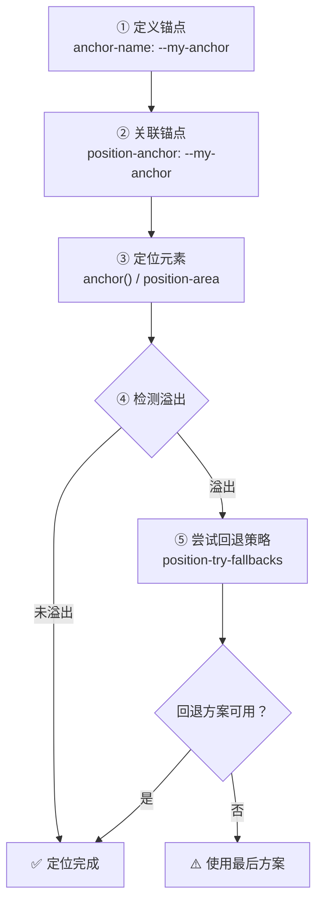
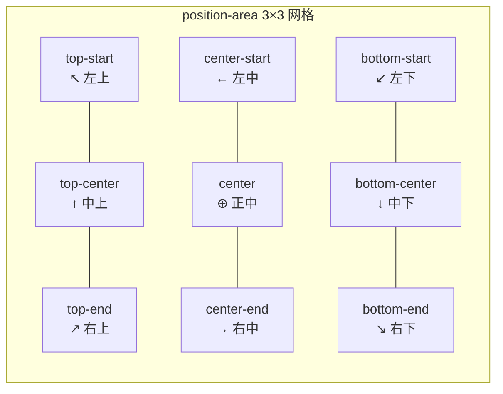

# 锚点定位

> CSS Anchor Positioning 让元素能够以纯声明式的方式相对于另一个元素定位，彻底告别 JavaScript 位置计算的时代。

## 核心概念

CSS 锚点定位（CSS Anchor Positioning）是 CSS 新引入的一套定位机制，它允许开发者将一个元素（定位元素）相对于另一个元素（锚点元素）进行精确定位，而**无需依赖 JavaScript 进行任何位置计算**。

在传统开发中，实现 Tooltip、下拉菜单、弹出层等组件时，开发者通常需要借助 JavaScript（或 Floating UI、Popper.js 等库）实时获取锚点元素的位置和尺寸，再动态设置定位元素的偏移量。这种方案存在诸多痛点：代码复杂度高、滚动和缩放场景下容易产生定位偏差、主线程计算可能引发掉帧。锚点定位将这些能力原生内置于 CSS 引擎中，使声明式定位成为可能，浏览器自动处理滚动、缩放等场景下的位置更新。

锚点定位建立在绝对定位（`position: fixed` / `position: absolute`）的基础之上。定位元素仍然需要设置 `position: fixed` 或 `position: absolute`，但其位置参照不再是包含块，而是通过锚点函数引用的锚点元素。可以将其理解为绝对定位的增强版——在保留绝对定位灵活性的同时，引入了以另一个元素为参照的定位能力。

### 锚点定位工作流程



### 核心术语

| 术语 | 说明 |
|------|------|
| **锚点元素（Anchor）** | 被其他元素作为定位参照的元素，通过 `anchor-name` 声明 |
| **定位元素（Positioned Element）** | 需要相对于锚点定位的元素，通过 `position-anchor` 关联锚点 |
| **`anchor()` 函数** | 在定位属性中引用锚点的边缘位置，实现精确定位 |
| **`position-area`** | 基于 3×3 网格的区域定位，简化常见对齐场景 |
| **`position-visibility`** | 控制锚点不可见时定位元素的行为 |
| **回退策略** | 当默认定位导致定位元素溢出视口时的备选方案 |

### 与传统方案的对比

| 对比维度 | 传统 JS 方案 | CSS 锚点定位 |
|---------|-------------|-------------|
| 实现方式 | JS 计算位置 + 动态设置样式 | 纯 CSS 声明式定位 |
| 滚动/缩放适配 | 需手动监听事件并更新 | 浏览器自动处理 |
| 性能 | JS 主线程计算，可能掉帧 | 浏览器引擎优化，性能更优 |
| 代码量 | 需引入 Floating UI 等库 | 原生 CSS，零依赖 |
| 响应式 | 需额外处理 | 自动适配 |
| 可访问性 | 需手动管理 | 与 Popover API 等原生集成 |

## 详细解析

### 定义锚点

`anchor-name` 属性用于将一个元素声明为锚点，并为其指定一个或多个名称，供其他元素通过 `position-anchor` 引用。

**语法：**

```css
.anchor-element {
  anchor-name: <dashed-ident>#;
}
```

取值为一个或多个以 `--` 开头的自定义标识符（dashed-ident），多个名称以空格分隔，默认值为 `none`。命名规则与 CSS 自定义属性一致，必须以双连字符 `--` 开头，例如 `--my-anchor`、`--tooltip-trigger`。

```css
/* 声明单个锚点名称 */
.button {
  anchor-name: --my-button;
}

/* 一个元素可以同时拥有多个锚点名称，供不同的定位元素引用 */
.trigger {
  anchor-name: --tooltip-anchor --menu-anchor --popover-anchor;
}
```

### 关联锚点

`position-anchor` 属性用于将定位元素与某个锚点名称关联。关联后，定位元素即可在定位属性中通过 `anchor()` 函数引用该锚点的边缘。

**语法：**

```css
.target-element {
  position-anchor: <dashed-ident> | auto;
}
```

取值为 `anchor-name` 中声明的锚点名称，默认值为 `auto`。当取值为 `auto` 时，浏览器尝试自动推断锚点关系（如通过 `popovertarget` 属性建立的关联）。

```css
/* 步骤1：声明锚点 */
.anchor {
  anchor-name: --my-anchor;
}

/* 步骤2：关联锚点并定位 */
.target {
  position-anchor: --my-anchor;
  position: fixed;
  top: anchor(bottom);    /* 定位到锚点底边下方 */
  left: anchor(center);   /* 水平居中对齐锚点 */
}
```

**隐式锚点：** 当定位元素与锚点元素存在 DOM 关联关系时，浏览器可以自动推断锚点关系——典型场景是由 `popovertarget` 打开的 popover：调用按钮（invoker）自动成为该 popover 的隐式锚点，无需显式声明 `anchor-name` 和 `position-anchor`。但在复杂场景中，**始终显式声明是推荐的做法**，避免歧义。

```css
/* 显式声明（推荐） */
.parent {
  anchor-name: --parent-anchor;
}
.child {
  position-anchor: --parent-anchor;
  position: fixed;
  top: anchor(bottom);
}

/* 隐式推断：当定位元素是锚点的 popovertarget 时，浏览器可自动推断 */
/* <button popovertarget="menu">打开菜单</button> */
/* <div id="menu" popover> 此 popover 自动以 button 为锚点 </div> */
```

**默认锚点：** 当一个定位元素只关联一个锚点时，`anchor()` 函数无需显式指定锚点名称。当需要引用非默认锚点时，可以在 `anchor()` 函数的第一个参数中显式指定锚点名称。

```css
.target {
  position-anchor: --primary-anchor; /* 默认锚点 */

  /* 以下两种写法等价 */
  top: anchor(bottom);                        /* 引用默认锚点的底边 */
  top: anchor(--primary-anchor bottom);       /* 显式引用 --primary-anchor 的底边 */

  /* 引用另一个锚点的右边 */
  left: anchor(--secondary-anchor right);
}
```

### anchor() 函数

`anchor()` 函数是锚点定位的核心，它允许在定位属性（`top`、`right`、`bottom`、`left`、`inset-block-start`、`inset-inline-start` 等）中引用锚点元素的边缘位置。

**完整语法：**

```css
.target {
  top: anchor(<anchor-name>? <anchor-side>, <fallback>?);
}
```

- **`anchor-name`**（可选）：要引用的锚点名称，省略时引用 `position-anchor` 指定的默认锚点
- **`anchor-side`**：锚点的边缘关键字或百分比值

**anchor-side 关键字：**

| 关键字 | 说明 | 适用轴 |
|--------|------|--------|
| `top` | 锚点的上边缘 | 垂直轴 |
| `bottom` | 锚点的下边缘 | 垂直轴 |
| `left` | 锚点的左边缘 | 水平轴 |
| `right` | 锚点的右边缘 | 水平轴 |
| `start` | 锚点的行内起始边（LTR 为 left） | 逻辑方向 |
| `end` | 锚点的行内末尾边（LTR 为 right） | 逻辑方向 |
| `self-start` | 定位元素自身的行内起始边 | 用于自身对齐 |
| `self-end` | 定位元素自身的行内末尾边 | 用于自身对齐 |
| `center` | 锚点在对应轴上的中心 | 双轴 |
| `<percentage>` | 锚点在对应轴上的百分比位置（`50%` 等同于 `center`） | 双轴 |

**在不同定位属性中使用：**

```css
.target {
  position-anchor: --anchor;
  position: fixed;

  /* 物理方向属性 */
  top: anchor(bottom);
  left: anchor(left);

  /* 逻辑方向属性 */
  inset-block-start: anchor(bottom);
  inset-inline-start: anchor(left);

  /* 配合 calc 添加间距 */
  top: calc(anchor(bottom) + 12px);
  left: calc(anchor(center) - 100px);
}
```

**anchor-size() 函数：** `anchor-size()` 函数允许定位元素引用锚点元素的**尺寸**，用于设置自身的宽度或高度。

```css
.dropdown {
  position-anchor: --trigger;
  position: fixed;
  top: anchor(bottom);
  /* 以下宽度方案按需选用（同一规则中后面的声明会覆盖前面的） */
  width: anchor-size(width);              /* 宽度与锚点一致 */
  min-width: anchor-size(width);          /* 常与上式搭配，保证最小宽度 */
  /* width: calc(anchor-size(width) + 40px); */ /* 或：比锚点宽 40px */
}
```

| anchor-size 参数 | 说明 |
|-----------------|------|
| `width` | 锚点元素的宽度 |
| `height` | 锚点元素的高度 |
| `block` | 锚点元素的块方向尺寸 |
| `inline` | 锚点元素的行内方向尺寸 |

### position-area 网格定位

`position-area` 属性提供了一种基于 **3×3 九宫格网格** 的简化定位方式，无需手动组合 `anchor()` 函数和 `calc()`，即可将定位元素快速对齐到锚点的九个区域之一。

**3×3 网格示意图：**



**语法：**

```css
.target {
  position-area: <position-area>;
}
```

`<position-area>` 由行值和列值组成，行值包括 `top`、`center`、`bottom`，列值包括 `start`、`center`、`end`（或物理值 `left`、`right`），使用连字符连接。

**完整取值与等效写法：**

| 取值 | 定位元素位置 | 等效 anchor() 写法 |
|------|------------|-------------------|
| `top-start` | 锚点上方，左对齐 | `bottom: anchor(top); left: anchor(left)` |
| `top-center` | 锚点上方，居中对齐 | `bottom: anchor(top); left: anchor(center)` |
| `top-end` | 锚点上方，右对齐 | `bottom: anchor(top); right: anchor(right)` |
| `center-start` | 锚点左侧，垂直居中 | `top: anchor(center); right: anchor(left)` |
| `center` | 锚点正中 | `top: anchor(center); left: anchor(center)` |
| `center-end` | 锚点右侧，垂直居中 | `top: anchor(center); left: anchor(right)` |
| `bottom-start` | 锚点下方，左对齐 | `top: anchor(bottom); left: anchor(left)` |
| `bottom-center` | 锚点下方，居中对齐 | `top: anchor(bottom); left: anchor(center)` |
| `bottom-end` | 锚点下方，右对齐 | `top: anchor(bottom); right: anchor(right)` |

**拓展值：** `position-area` 还支持 `span-all` 让定位元素跨越整个锚点宽度或高度。

```css
/* 定位元素水平跨越整个锚点宽度 */
.full-width-below {
  position-area: bottom span-all;
}

/* 定位元素垂直跨越整个锚点高度 */
.full-height-right {
  position-area: right span-all;
}
```

**position-area 与 anchor() 的选择：**

| 场景 | 推荐方式 | 原因 |
|------|---------|------|
| 标准九宫格位置 | `position-area` | 语法简洁，一行搞定 |
| 需要偏移间距 | `anchor()` + `calc()` | 可精确控制间距 |
| 多锚点定位 | `anchor()` | position-area 只支持单锚点 |
| 自定义对齐 | `anchor()` | 更灵活的边缘组合 |

### 回退策略

当锚点定位导致定位元素部分或全部溢出视口时，回退定位机制提供备选的定位方案，确保定位元素始终可见。

**position-try-fallbacks** 属性指定一个或多个备选定位方案，当默认定位导致溢出时，浏览器按顺序尝试这些方案。

```css
.target {
  position-try-fallbacks: <try-option>#;
}
```

`<try-option>` 可以是以下类型：

| 类型 | 说明 | 示例 |
|------|------|------|
| `flip-block` | 块方向翻转（上下翻转） | `bottom-start` → `top-start` |
| `flip-inline` | 行内方向翻转（左右翻转） | `bottom-start` → `bottom-end` |
| `flip-start` | 翻转到起始方向 | 交换行和列方向 |
| `flip-end` | 翻转到末尾方向 | 交换行和列方向到末尾 |
| `<position-area>` 值 | 直接指定备选位置 | `top-center`、`bottom-end` |
| `@position-try` 规则名称 | 自定义回退规则 | `--my-fallback` |

```css
/* 基本：默认在下方，溢出时依次尝试上方、左侧、右侧 */
.tooltip {
  position-anchor: --btn;
  position: fixed;
  position-area: bottom-center;
  position-try-fallbacks: top-center, center-end, center-start;
}

/* 组合 try-tactic 策略 */
.dropdown {
  position-anchor: --trigger;
  position: fixed;
  position-area: bottom-start;
  position-try-fallbacks: flip-block, flip-inline, flip-block flip-inline;
}
```

**@position-try 自定义回退规则：** 对于更复杂的回退方案，可以使用 `@position-try` 定义具名回退规则，其中可以覆盖任何定位相关属性。

```css
.tooltip {
  position-anchor: --btn;
  position: fixed;
  position-area: bottom-center;
  position-try-fallbacks: --tooltip-flip;
}

@position-try --tooltip-flip {
  position-area: top-center;
  width: 300px;
  max-height: 200px;
}
```

**position-try-order** 属性允许浏览器在应用回退方案之前，根据特定策略对备选方案排序，优先选择在屏幕上可见面积最大的方案。

```css
.tooltip {
  position-anchor: --btn;
  position: fixed;
  position-area: bottom-center;
  position-try-fallbacks: top-center, bottom-end, top-end;
  position-try-order: most-width; /* 优先选择水平方向可见面积最大的方案 */
}
```

| 取值 | 说明 |
|------|------|
| `most-width` | 优先选择水平方向可见面积最大的方案 |
| `most-height` | 优先选择垂直方向可见面积最大的方案 |
| `most-block-size` | 优先选择块方向尺寸最大的方案 |
| `most-inline-size` | 优先选择行内方向尺寸最大的方案 |

### 可见性控制

`position-visibility` 属性控制当锚点元素不可见时（如滚动出视口），定位元素的行为。

```css
.target {
  position-visibility: anchors-visible | no-overflow | always;
}
```

| 取值 | 说明 |
|------|------|
| `anchors-visible`（默认） | 锚点元素滚出视口后，定位元素随之隐藏 |
| `no-overflow` | 定位元素自身将要溢出视口时隐藏（与锚点可见性无关） |
| `always` | 定位元素始终显示，即使锚点完全不在视口中 |

```css
/* 默认行为：锚点不可见时隐藏 tooltip */
.tooltip {
  position-visibility: anchors-visible;
}

/* 固定工具栏：锚点滚走后仍保留 */
.floating-toolbar {
  position-visibility: no-scroll;
}

/* 始终显示的标注（如侧边栏目录高亮） */
.sidebar-highlight {
  position-visibility: always;
}
```

## 代码示例

### 示例一：Tooltip 提示

以下示例实现了一个完整的 Tooltip 组件，支持悬停显示、自动回退定位和箭头指示。

```html
<!DOCTYPE html>
<html lang="zh-CN">
<head>
  <meta charset="UTF-8">
  <title>CSS 锚点定位 - Tooltip 示例</title>
  <style>
    /* 页面基础样式 */
    body {
      font-family: -apple-system, BlinkMacSystemFont, "Segoe UI", sans-serif;
      display: flex;
      justify-content: center;
      align-items: center;
      min-height: 100vh;
      margin: 0;
      background: #f5f5f5;
    }

    /* 锚点元素：触发按钮 */
    .btn-tip {
      anchor-name: --tip-anchor;
      padding: 10px 24px;
      background: #1976d2;
      color: white;
      border: none;
      border-radius: 6px;
      cursor: pointer;
      font-size: 15px;
      transition: background 0.2s;
    }

    .btn-tip:hover {
      background: #1565c0;
    }

    /* 定位元素：Tooltip */
    .tip {
      position-anchor: --tip-anchor;
      position: fixed;
      position-area: top-center;
      /* 上方空间不足时回退到下方 */
      position-try-fallbacks: bottom-center;

      padding: 8px 14px;
      background: #333;
      color: white;
      font-size: 13px;
      border-radius: 6px;
      white-space: nowrap;
      pointer-events: none;

      /* 默认隐藏 */
      opacity: 0;
      visibility: hidden;
      transition: opacity 0.2s, visibility 0.2s;
    }

    /* 悬停或聚焦时显示 */
    .btn-tip:hover + .tip,
    .btn-tip:focus + .tip {
      opacity: 1;
      visibility: visible;
    }

    /* 箭头：默认朝下（Tooltip 在上方时） */
    .tip::after {
      content: '';
      position: absolute;
      top: 100%;
      left: 50%;
      translate: -50% 0;
      border: 6px solid transparent;
      border-top-color: #333;
    }
  </style>
</head>
<body>
  <button class="btn-tip" aria-describedby="tip1">保存文件</button>
  <div class="tip" id="tip1" role="tooltip">保存当前编辑内容（Ctrl+S）</div>
</body>
</html>
```

### 示例二：下拉菜单

以下示例实现了一个下拉菜单，配合 Popover API 使用，支持自动回退定位和宽度匹配。

```html
<!DOCTYPE html>
<html lang="zh-CN">
<head>
  <meta charset="UTF-8">
  <title>CSS 锚点定位 - 下拉菜单示例</title>
  <style>
    /* 页面基础样式 */
    body {
      font-family: -apple-system, BlinkMacSystemFont, "Segoe UI", sans-serif;
      display: flex;
      justify-content: center;
      align-items: center;
      min-height: 100vh;
      margin: 0;
      background: #f5f5f5;
    }

    /* 锚点元素：触发按钮 */
    .dropdown-trigger {
      anchor-name: --dd-trigger;
      padding: 10px 28px;
      background: #424242;
      color: white;
      border: none;
      border-radius: 6px;
      cursor: pointer;
      font-size: 15px;
      transition: background 0.2s;
    }

    .dropdown-trigger:hover {
      background: #616161;
    }

    /* 定位元素：下拉面板 */
    .dropdown-panel {
      position-anchor: --dd-trigger;
      position: fixed;
      position-area: bottom-start;
      /* 下方空间不足时依次尝试：上方左对齐、下方右对齐、上方右对齐 */
      position-try-fallbacks: top-start, bottom-end, top-end;

      /* 宽度与锚点一致 */
      width: anchor-size(width);
      min-width: 200px;
      padding: 6px 0;
      margin: 0;
      background: white;
      border: 1px solid #e0e0e0;
      border-radius: 8px;
      box-shadow: 0 8px 24px rgba(0, 0, 0, 0.12);
    }

    /* 菜单项样式 */
    .dropdown-item {
      display: block;
      padding: 10px 16px;
      color: #333;
      text-decoration: none;
      font-size: 14px;
      transition: background 0.15s, color 0.15s;
    }

    .dropdown-item:hover {
      background: #e3f2fd;
      color: #1976d2;
    }

    /* 分隔线 */
    .dropdown-divider {
      border: none;
      border-top: 1px solid #e0e0e0;
      margin: 4px 0;
    }
  </style>
</head>
<body>
  <button class="dropdown-trigger" popovertarget="dropdown-menu">
    选项 ▾
  </button>
  <div id="dropdown-menu" popover class="dropdown-panel">
    <a href="#" class="dropdown-item">新建文件</a>
    <a href="#" class="dropdown-item">打开文件</a>
    <a href="#" class="dropdown-item">保存文件</a>
    <hr class="dropdown-divider">
    <a href="#" class="dropdown-item">退出</a>
  </div>
</body>
</html>
```

### 示例三：对话气泡

以下示例实现了一个聊天气泡组件，气泡自动定位在头像旁边，支持回退和可见性控制。

```html
<!DOCTYPE html>
<html lang="zh-CN">
<head>
  <meta charset="UTF-8">
  <title>CSS 锚点定位 - 对话气泡示例</title>
  <style>
    /* 页面基础样式 */
    body {
      font-family: -apple-system, BlinkMacSystemFont, "Segoe UI", sans-serif;
      display: flex;
      justify-content: center;
      align-items: center;
      min-height: 100vh;
      margin: 0;
      background: #e8eaf6;
    }

    .chat-container {
      display: flex;
      gap: 16px;
      align-items: flex-start;
    }

    /* 锚点元素：头像 */
    .avatar {
      anchor-name: --avatar-anchor;
      width: 48px;
      height: 48px;
      border-radius: 50%;
      background: linear-gradient(135deg, #667eea, #764ba2);
      color: white;
      display: flex;
      align-items: center;
      justify-content: center;
      font-size: 20px;
      font-weight: bold;
      flex-shrink: 0;
    }

    /* 定位元素：对话气泡 */
    .bubble {
      position-anchor: --avatar-anchor;
      position: fixed;
      position-area: center-end;
      /* 右侧空间不足时回退到左侧 */
      position-try-fallbacks: center-start;
      /* 锚点不可见时隐藏气泡 */
      position-visibility: anchors-visible;

      max-width: 280px;
      padding: 12px 16px;
      background: white;
      color: #333;
      font-size: 14px;
      line-height: 1.5;
      border-radius: 12px;
      box-shadow: 0 2px 12px rgba(0, 0, 0, 0.1);
    }

    /* 气泡箭头：默认朝左（气泡在右侧时） */
    .bubble::before {
      content: '';
      position: absolute;
      top: 16px;
      right: 100%;
      border: 8px solid transparent;
      border-right-color: white;
    }

    .bubble .name {
      font-weight: 600;
      color: #667eea;
      margin-bottom: 4px;
    }

    .bubble .time {
      font-size: 12px;
      color: #999;
      margin-top: 6px;
    }
  </style>
</head>
<body>
  <div class="chat-container">
    <div class="avatar">李</div>
    <div class="bubble">
      <div class="name">李明</div>
      你好！CSS 锚点定位真的太好用了，再也不用写 JS 计算位置了 🎉
      <div class="time">14:32</div>
    </div>
  </div>
</body>
</html>
```

## 浏览器兼容性

CSS Anchor Positioning 是一项**较新的 CSS 特性**，目前仍处于 CSS Anchor Positioning Module Level 1 规范阶段，浏览器支持情况有限。

### 支持情况

| 特性 | Chrome | Edge | Firefox | Safari |
|------|--------|------|---------|--------|
| `anchor-name` | 125+ | 125+ | 实验性* | 26.0+ |
| `position-anchor` | 125+ | 125+ | 实验性* | 26.0+ |
| `anchor()` | 125+ | 125+ | 实验性* | 26.0+ |
| `anchor-size()` | 125+ | 125+ | 不支持 | 26.0+ |
| `position-area` | 125+ | 125+ | 实验性* | 26.0+ |
| `position-visibility` | 125+ | 125+ | 不支持 | 26.0+ |
| `position-try-fallbacks` | 125+ | 125+ | 不支持 | 26.0+ |
| `position-try-order` | 125+ | 125+ | 不支持 | 26.0+ |
| `@position-try` | 125+ | 125+ | 不支持 | 26.0+ |

> *Firefox 需通过 `layout.css.anchor-positioning.enabled` 标志启用实验性支持（后续版本逐步默认启用，以 Can I Use 实时数据为准）。Safari 自 26.0 起支持。

### 渐进增强策略

**策略一：@supports 特性检测**

```css
/* 回退方案：传统绝对定位 */
.tooltip {
  position: absolute;
  bottom: calc(100% + 8px);
  left: 50%;
  transform: translateX(-50%);
}

/* 支持锚点定位时使用原生方案 */
@supports (anchor-name: --test) {
  .anchor {
    anchor-name: --btn;
  }
  .tooltip {
    position-anchor: --btn;
    position: fixed;
    position-area: top-center;
    bottom: auto;
    left: auto;
    transform: none;
  }
}
```

**策略二：JS 特性检测 + Polyfill**

```javascript
// 检测浏览器是否支持 CSS 锚点定位
function supportsAnchorPositioning() {
  return CSS.supports('anchor-name', '--test');
}

if (!supportsAnchorPositioning()) {
  // 加载 polyfill 或回退库（如 Floating UI）
  console.log('当前浏览器不支持 CSS Anchor Positioning，启用回退方案');
}
```

**可用的 Polyfill：**

| 名称 | 说明 | 地址 |
|------|------|------|
| CSS Anchor Position Polyfill | Chrome 团队提供的 polyfill | https://github.com/oddbird/css-anchor-positioning |
| Floating UI | 不支持锚点定位时的 JS 回退方案 | https://floating-ui.com/ |

## 最佳实践

1. **始终显式声明锚点名称**：虽然浏览器支持隐式锚点推断，但在复杂场景中显式声明 `anchor-name` 和 `position-anchor` 可以避免歧义，提高代码可读性和可维护性。

2. **优先使用 position-area**：对于标准的九宫格定位场景，`position-area` 比 `anchor()` + `calc()` 更简洁，一行代码即可完成定位。

3. **始终设置回退策略**：使用 `position-try-fallbacks` 为定位元素设置至少一个回退方案，确保在视口边缘等极端情况下定位元素仍然可见。

4. **合理使用 position-visibility**：根据组件类型选择合适的可见性策略。Tooltip 等临时性组件应使用 `anchors-visible`，工具栏等持久性组件可使用 `no-scroll` 或 `always`。

5. **配合 Popover API 使用**：锚点定位与 Popover API 天然契合，`popovertarget` 属性会自动建立隐式锚点关系，简化代码。

6. **使用 @supports 做渐进增强**：由于浏览器兼容性有限，务必使用 `@supports` 检测或 JS 特性检测，为不支持的浏览器提供回退方案。

7. **锚点命名要有语义**：使用 `--tooltip-trigger`、`--menu-anchor` 等有意义的名称，而非 `--a1`、`--a2` 等无意义名称。

## 常见问题

**Q：锚点定位与绝对定位有什么区别？**

A：锚点定位建立在绝对定位的基础之上。绝对定位的参照物是包含块（通常是最近的定位祖先），而锚点定位的参照物是通过 `anchor-name` 声明的任意元素。定位元素仍需设置 `position: fixed` 或 `position: absolute`，但其位置由 `anchor()` 函数或 `position-area` 决定。

**Q：一个元素可以同时是锚点元素和定位元素吗？**

A：可以。一个元素可以通过 `anchor-name` 声明为锚点，同时通过 `position-anchor` 关联到另一个锚点，成为定位元素。这种链式关系在嵌套弹出层等场景中很有用。

**Q：锚点定位能替代 Floating UI 吗？**

A：在支持的浏览器中，锚点定位可以替代 Floating UI 的大部分功能（定位、翻转、偏移）。但 Floating UI 还提供了虚拟元素、中间件等高级功能，在某些复杂场景中仍有价值。建议采用渐进增强策略：原生锚点定位优先，不支持的浏览器回退到 Floating UI。

**Q：锚点元素和定位元素必须在 DOM 上相邻吗？**

A：不需要。锚点元素和定位元素可以在 DOM 的任意位置，只要定位元素通过 `position-anchor` 正确引用了锚点名称即可。这也是锚点定位相比传统绝对定位的一大优势——不受 DOM 层级限制。

**Q：position-area 和 anchor() 可以混用吗？**

A：不建议在同一元素上混用。`position-area` 会同时设置多个方向的定位属性，如果再通过 `anchor()` 手动设置某个方向，可能会产生冲突。如果需要精确控制某个方向的偏移，应全部使用 `anchor()` + `calc()` 方式。

**Q：滚动时锚点定位会自动更新吗？**

A：会。浏览器引擎会在滚动、缩放等场景下自动更新定位元素的位置，无需手动监听事件。这是锚点定位相比 JS 方案的核心优势之一。

## 总结

CSS Anchor Positioning 为前端定位问题提供了一套纯声明式的原生解决方案，核心要点如下：

- **定义锚点**：通过 `anchor-name` 将元素声明为锚点，命名规则与 CSS 自定义属性一致
- **关联锚点**：通过 `position-anchor` 将定位元素与锚点关联，支持隐式推断
- **精确定位**：`anchor()` 函数引用锚点边缘，`position-area` 提供九宫格快捷定位
- **回退策略**：`position-try-fallbacks` 提供溢出时的备选方案，`position-try-order` 控制优先级
- **可见性控制**：`position-visibility` 控制锚点不可见时定位元素的行为
- **配合 Popover API**：与 Popover API 天然契合，`popovertarget` 自动建立隐式锚点关系
- **渐进增强**：由于浏览器兼容性有限，务必使用 `@supports` 检测并提供回退方案

锚点定位代表了 CSS 定位能力的未来方向，虽然当前浏览器支持尚不完善，但通过渐进增强策略，开发者已经可以在生产环境中逐步采用这一特性，减少对 JavaScript 定位库的依赖。

## 参考资料

- [MDN - CSS Anchor Positioning](https://developer.mozilla.org/en-US/docs/Web/CSS/CSS_anchor_positioning)
- [CSS Anchor Positioning Module Level 1 规范](https://drafts.csswg.org/css-anchor-position-1/)
- [Chrome Developers - Introducing CSS anchor positioning](https://developer.chrome.com/blog/anchor-positioning)
- [Chrome Developers - CSS anchor positioning API](https://developer.chrome.com/docs/css-ui/anchor-positioning-api)
- [W3C - CSS Anchor Positioning Editor's Draft](https://w3c.github.io/csswg-drafts/css-anchor-position/)
- [Oddbird - CSS Anchor Positioning Polyfill](https://github.com/oddbird/css-anchor-positioning)
- [Floating UI - Positioning library](https://floating-ui.com/)
- [MDN - anchor-name](https://developer.mozilla.org/en-US/docs/Web/CSS/anchor-name)
- [MDN - position-anchor](https://developer.mozilla.org/en-US/docs/Web/CSS/position-anchor)
- [MDN - anchor()](https://developer.mozilla.org/en-US/docs/Web/CSS/anchor)
- [MDN - position-area](https://developer.mozilla.org/en-US/docs/Web/CSS/position-area)
- [MDN - position-visibility](https://developer.mozilla.org/en-US/docs/Web/CSS/position-visibility)
