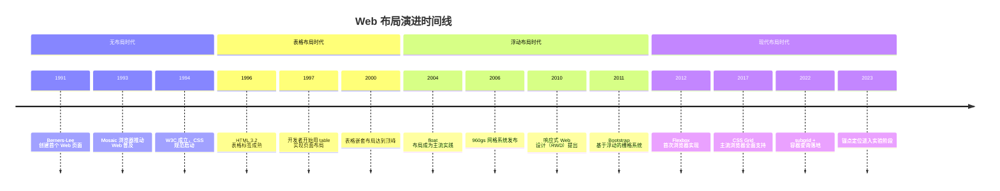
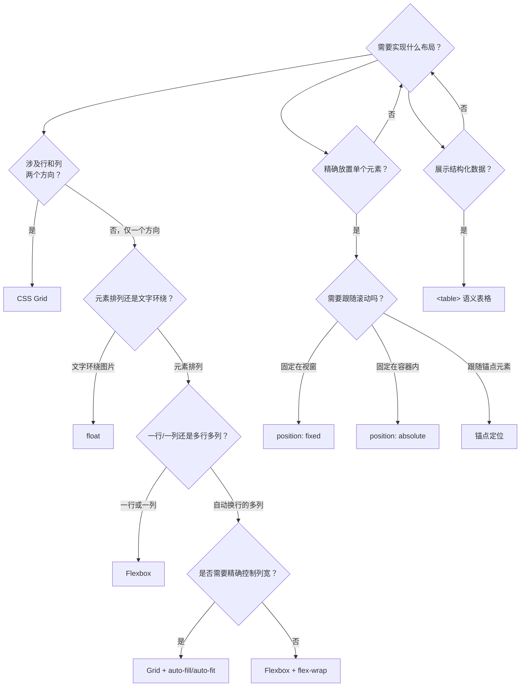

# Web 布局演进

> 从纯文档流到二维网格，Web 布局经历了三十余年的范式跃迁——每一次变革都源于对前一代方案的痛点反思。

## 前言

布局是 CSS 最核心的能力。一个网页无论视觉多么精美，如果元素无法按设计意图排列，一切都将无从谈起。然而 CSS 布局并非一开始就如此强大——它经历了一条漫长而曲折的演进之路：从完全没有布局能力，到用表格 Hack，到浮动拼凑，再到 Flexbox 与 Grid 的原生支持。理解这段演进史，不仅仅是为了怀旧，更是为了把握每项技术的设计意图与适用边界。当你理解了浮动为何被"滥用"于布局，就会明白 Flexbox 为何能精准地解决那些痛点；当你理解了绝对定位的局限，就会知道 Grid 的命名网格线为何是更优雅的答案。用对工具的前提，是理解每把工具为什么被发明。



## 无布局时代

1991 年，Tim Berners-Lee 在 CERN 创建了世界上第一个网站。彼时的 HTML 仅有约 18 个标签——`<p>`、`<h1>`~`<h6>`、`<a>`、`<ul>`、`<li>` 等，没有任何控制页面布局的能力。浏览器按照文档流的自然顺序，从上到下、从左到右依次渲染内容。网页就像一份排版朴素的 Word 文档——标题、段落、列表，仅此而已。

这个阶段唯一的"布局"手段是展示性标签：`<b>` 加粗、`<i>` 斜体、`<font size="+2" color="red">` 控制字号与颜色。开发者甚至发明了**单像素 GIF 技巧**——插入一张 1×1 像素的透明 GIF 图片，通过 `width` 和 `hspace` 属性来撑出间距。这是一种纯粹的 Hack，但它反映了早期开发者对布局控制的本能渴望。

1994 年，Håkon Wium Lie 提出了 CSS 的最初构想，试图将样式与结构分离。1996 年，CSS1 规范正式发布，但它只提供了基础的字体、颜色和间距控制，仍然没有真正的布局能力。Web 迫切需要一种方式来摆脱纯文档流的束缚。

```html
<!-- 无布局时代的典型页面：纯文档流，无任何布局控制 -->
<html>
  <head><title>我的主页</title></head>
  <body bgcolor="#ffffff">
    <h1><font color="blue">欢迎来到我的主页</font></h1>
    <p>这是第一段文字，只能按文档流排列。</p>
    <p>
      <!-- 单像素 GIF 技巧：用透明图片撑出间距 -->
      
      缩进的文字内容
    </p>
    <ul>
      <li>链接一</li>
      <li>链接二</li>
    </ul>
  </body>
</html>
```

## 表格布局时代

1996 年前后，HTML 3.2 规范让 `<table>` 标签的功能趋于成熟——`colspan` 跨列、`rowspan` 跨行、`cellpadding` 和 `cellspacing` 控制间距。这些特性本是为数据展示设计的，但开发者很快发现：表格的行列结构恰好可以用来实现多栏页面布局。于是，一种影响深远的 Hack 诞生了——用 `<table>` 做布局。

表格布局的核心思路是将整个页面视为一个大表格：顶部通栏放导航，中间拆成左右两栏放侧边栏和主内容，底部放页脚。通过嵌套表格，甚至可以实现非常复杂的布局结构。同一时期，`<frameset>` 和 `<frame>` 也被用于页面区域分割，每个 frame 加载独立的 HTML 文档。

表格布局在视觉上确实解决了多栏排列的问题，但代价沉重。首先是性能问题：浏览器必须等待整个表格的内容全部下载后才能开始渲染，在拨号上网时代这意味着漫长的白屏。其次是语义问题：`<table>` 的语义是"数据表格"，用它做布局意味着屏幕阅读器和搜索引擎无法正确理解页面结构。最后是维护问题：多层嵌套的表格代码如同俄罗斯套娃，修改一处往往牵动全局。

```html
<!-- 表格布局的典型写法：用 table 实现经典两栏布局 -->
<table width="800" cellpadding="0" cellspacing="0" border="0">
  <tr>
    <!-- 顶部通栏导航 -->
    <td colspan="2" bgcolor="#333" height="60">
      <font color="white">导航栏</font>
    </td>
  </tr>
  <tr>
    <!-- 左侧边栏 -->
    <td width="200" bgcolor="#f0f0f0" valign="top">
      侧边栏内容
    </td>
    <!-- 右侧主内容 -->
    <td width="600" valign="top">
      主要内容区域
    </td>
  </tr>
  <tr>
    <!-- 底部通栏页脚 -->
    <td colspan="2" bgcolor="#333" height="40">
      <font color="white">页脚</font>
    </td>
  </tr>
</table>
```

## 浮动布局时代

CSS2.0 规范引入了 `float` 和 `position` 两个关键属性。`float` 的设计初衷非常明确——让文本围绕图片排版，就像杂志排版中的文字环绕效果。然而，开发者很快发现浮动元素脱离文档流的特性可以用来实现多栏布局：将左侧栏设为 `float: left`，右侧栏设为 `float: right`，中间的主内容区用 `margin` 留出空间——一个两栏布局就完成了。

浮动布局从 2004 年左右开始成为主流实践，并催生了一系列经典布局方案。其中最著名的是**圣杯布局**（Holy Grail Layout）和**双飞翼布局**，它们都实现了三栏布局且中间主内容优先渲染。两者的区别在于处理中间栏与侧栏重叠的方式不同：圣杯布局用 `padding` + 相对定位，双飞翼布局在中间栏内嵌套一个子容器用 `margin` 避让。

浮动布局最大的痛点是**清除浮动**。浮动元素脱离了文档流，导致父容器高度塌陷——这是无数 Bug 的根源。从 `overflow: hidden` 到 clearfix Hack（`::after { content: ""; display: table; clear: both; }`），再到 CSS3 新增的 `display: flow-root`，清除浮动的方案迭代了整整十几年。2011 年发布的 Bootstrap 1.0 正是基于浮动的 12 列栅格系统，将浮动布局的实践标准化并推向了顶峰。

```css
/* 圣杯布局：经典三栏布局，中间主内容优先渲染 */
.container {
  padding: 0 200px;  /* 为左右侧栏预留空间 */
}
.main {
  float: left;
  width: 100%;       /* 主内容占满容器 */
}
.left {
  float: left;
  width: 200px;
  margin-left: -100%; /* 拉到最左侧 */
  position: relative;
  left: -200px;       /* 移入预留空间 */
}
.right {
  float: left;
  width: 200px;
  margin-left: -200px; /* 拉到右侧 */
  position: relative;
  right: -200px;       /* 移入预留空间 */
}

/* clearfix：清除浮动的经典 Hack */
.clearfix::after {
  content: "";
  display: table;
  clear: both;
}
```

## 定位布局

CSS2.0 同时引入了 `position` 属性，提供了 `static`、`relative`、`absolute`、`fixed` 四种定位模式。其中 `position: absolute` 允许元素相对于最近的定位祖先精确放置，这让开发者可以像在画布上作画一样，将元素摆放在页面的任意位置。

定位布局在 PSD2HTML 工作流中大放异彩。设计师在 Photoshop 中完成页面设计，切图工具直接导出绝对定位的 HTML/CSS 代码——每个元素都有精确的 `top`、`left`、`width`、`height` 值。这种工作流在 2000 年代初非常流行，但它有一个致命的局限：所有尺寸和坐标都是硬编码的。一旦内容长度变化、视窗尺寸不同，布局就会崩溃。绝对定位的元素完全脱离文档流，不会影响其他元素的位置，这意味着它无法实现"内容自适应"的弹性布局。

`position: relative` 则更多作为定位上下文使用——为子元素的绝对定位提供参照系，或通过 `top`/`left` 微调元素位置。`position: fixed` 用于固定导航栏、回到顶部按钮等场景。定位布局至今仍有其用武之地，但它更适合"在布局中精确定位某个元素"，而非"构建整个页面的布局结构"。

```css
/* 定位布局：用绝对定位实现页面布局 */
.page {
  position: relative;  /* 作为定位上下文 */
  width: 960px;
  height: 600px;
  margin: 0 auto;
}
.header {
  position: absolute;
  top: 0;
  left: 0;
  width: 960px;
  height: 80px;
}
.sidebar {
  position: absolute;
  top: 80px;
  left: 0;
  width: 200px;
  height: 520px;
}
.content {
  position: absolute;
  top: 80px;
  left: 200px;
  width: 760px;
  height: 520px;
}
```

## 行内块布局

`display: inline-block` 是另一种被"借用"于布局的属性。它的本意是让行内元素可以设置宽高（如给 `<a>` 标签设宽度和高度做成按钮），但开发者发现：将多个块级元素设为 `inline-block`，它们就会像文字一样横向排列——无需浮动，无需清除浮动，也不会造成高度塌陷。

行内块布局的典型应用是水平导航栏和网格卡片。将每个卡片设为 `inline-block` 并设置固定宽度，就能实现自动换行的多列布局。2000 年代后期，一些 CSS 框架（如早期版本的 Foundation）曾采用 `inline-block` 替代 `float` 来构建栅格系统。

然而行内块布局有一个令人头疼的问题：**元素间的空白间隙**。HTML 源码中标签之间的换行和空格会被渲染为约 4px 的间隙。解决方案五花八门：父容器设 `font-size: 0` 再在子元素中恢复、标签间不加空格紧挨着写、用 HTML 注释填充间隙、设 `letter-spacing` 和 `word-spacing` 为负值……每一种都是 Hack。此外，`inline-block` 元素的基线对齐行为也经常导致意外的垂直偏移，需要 `vertical-align: top` 来修正。这些琐碎的问题使得行内块布局始终未能成为主流方案。

```css
/* 行内块布局：用 inline-block 实现多列卡片 */
.card-grid {
  font-size: 0;       /* 消除元素间的空白间隙 */
  letter-spacing: 0;
}
.card {
  display: inline-block;
  width: 25%;
  font-size: 16px;    /* 恢复字号 */
  vertical-align: top; /* 顶部对齐，避免基线对齐问题 */
  box-sizing: border-box;
  padding: 10px;
}
```

```html
<!-- 行内块布局的间隙问题：标签间换行会产生空白 -->
<div class="card-grid">
  <div class="card">卡片一</div><!--
  --><div class="card">卡片二</div><!--
  --><div class="card">卡片三</div><!--
  --><div class="card">卡片四</div>
</div>
```

## Flexbox 时代

浮动布局的痛点积攒了十几年：清除浮动、高度塌陷、垂直居中困难、等高列需要 Hack……2009 年，Flexbox 的第一份工作草案发布，旨在彻底解决一维方向上的布局问题。经过多次语法变更（从 `display: box` 到 `display: flexbox` 再到最终的 `display: flex`），2012 年 Flexbox 在浏览器中首次实现，2015 年左右主流浏览器全面支持。

Flexbox 的革命性在于它**从布局的底层逻辑上重新思考**。在浮动布局中，开发者必须手动计算宽度、手动清除浮动、手动处理垂直居中；而在 Flexbox 中，这些需求变成了声明式的——`justify-content: center` 水平居中，`align-items: center` 垂直居中，`flex: 1` 弹性分配剩余空间。浮动布局中需要数十行 Hack 代码才能实现的效果，Flexbox 只需两三行。

Flexbox 是一维布局系统——它一次只处理一个方向（行或列）上的元素排列。对于导航栏、工具栏、卡片列表、表单布局等单行或单列的场景，Flexbox 是最佳选择。它也天然支持等高列（`align-items: stretch` 为默认值）和内容自适应（`flex-wrap: wrap`），这些都是浮动布局难以优雅实现的。

```css
/* Flexbox：用几行代码实现浮动布局需要大量 Hack 的效果 */
.navbar {
  display: flex;
  justify-content: space-between; /* 两端对齐 */
  align-items: center;            /* 垂直居中 */
  padding: 0 20px;
  height: 60px;
}
.card-list {
  display: flex;
  flex-wrap: wrap;   /* 自动换行 */
  gap: 16px;         /* 统一间距，无需 margin Hack */
}
.card {
  flex: 1 1 300px;   /* 弹性伸缩，最小宽度 300px */
}

/* Flexbox 实现经典的垂直水平居中 */
.center {
  display: flex;
  justify-content: center;
  align-items: center;
  min-height: 100vh;
}
```

## Grid 时代

如果说 Flexbox 解决了一维布局的痛点，那么 CSS Grid 则填补了二维布局的空白。2012 年，CSS Grid Layout 的第一份工作草案发布；2017 年 3 月，Firefox 和 Chrome 在同一个月内先后宣布全面支持 CSS Grid——这标志着 Web 布局进入了真正的二维时代。

Grid 的核心能力是**同时控制行和列**。在 Grid 之前，要实现一个复杂的二维布局，通常需要嵌套多层 Flex 容器或浮动容器；而 Grid 可以直接在一个容器上定义完整的行列结构。`grid-template-columns` 和 `grid-template-rows` 定义轨道，`grid-template-areas` 用直观的"ASCII 艺术"语法命名区域，`grid-column` 和 `grid-row` 将元素放置到任意网格位置——元素甚至可以跨越多个轨道，无需嵌套。

Grid 的设计哲学与 Flexbox 互补：Flexbox 是**内容驱动**的——容器根据内容自适应；Grid 是**布局驱动**的——先定义网格结构，再将内容填入。这意味着 Grid 特别适合页面级别的整体布局，而 Flexbox 更适合组件内部的元素排列。

2018 年，Jen Simmons 提出了**内在 Web 设计**（Intrinsic Web Design）的概念——利用 `fr` 单位、`minmax()`、`auto-fit`/`auto-fill` 等特性，让布局根据内容自动调整，而非依赖固定的断点和媒体查询。`subgrid` 先后在 Firefox 71（2019 年）和 Chrome 117（2023 年）落地，允许子网格继承父网格的轨道定义，解决了嵌套网格对齐的难题。实验性的 `masonry` 布局则试图为瀑布流场景提供原生支持。

```css
/* Grid：用声明式语法实现复杂的二维页面布局 */
.page {
  display: grid;
  /* 定义行列结构 */
  grid-template-columns: 250px 1fr 250px;
  grid-template-rows: auto 1fr auto;
  /* 用区域命名直观描述布局 */
  grid-template-areas:
    "header  header  header"
    "sidebar content aside"
    "footer  footer  footer";
  gap: 20px;
  min-height: 100vh;
}
.header  { grid-area: header;  }
.sidebar { grid-area: sidebar; }
.content { grid-area: content; }
.aside   { grid-area: aside;   }
.footer  { grid-area: footer;  }

/* 响应式：小屏幕时切换为单列 */
@media (max-width: 768px) {
  .page {
    grid-template-columns: 1fr;
    grid-template-areas:
      "header"
      "content"
      "sidebar"
      "aside"
      "footer";
  }
}
```

## 现代布局融合

今天的 Web 布局不再是"选一种技术用到底"的单选题，而是多种技术的协同组合。一个典型的现代页面可能用 Grid 搭建整体骨架，用 Flexbox 处理组件内部的元素排列，用容器查询实现组件级响应式，用锚点定位处理弹出层的对齐——每种技术各司其职，发挥其设计初衷所指向的优势。

**容器查询**（Container Queries）是现代布局融合的关键拼图。传统的 `@media` 媒体查询基于视窗宽度，这意味着同一个组件在不同宽度的容器中无法自适应——除非为每种容器宽度都写一套媒体查询。容器查询让组件能够感知自身所在容器的尺寸，从而实现真正的组件级响应式。一个放在侧边栏里的卡片和放在主内容区的卡片，可以自动呈现不同的布局形态，无需任何外部干预。

**锚点定位**（Anchor Positioning）则试图替代部分绝对定位的场景。传统绝对定位需要手动计算偏移量，而锚点定位允许一个元素（如 Tooltip、弹出菜单）相对于另一个"锚点元素"定位，浏览器自动计算位置。当锚点元素移动时，定位元素自动跟随——这比 JavaScript 计算位置要高效和优雅得多。

```css
/* 现代布局融合：Grid + Flex + 容器查询 + 锚点定位 */
.dashboard {
  display: grid;
  grid-template-columns: repeat(auto-fit, minmax(320px, 1fr));
  gap: 24px;
}

/* 组件内部用 Flexbox */
.card {
  display: flex;
  flex-direction: column;
  gap: 12px;
  /* 声明容器查询的容器类型 */
  container-type: inline-size;
  container-name: card;
}

/* 容器查询：根据卡片自身宽度自适应 */
@container card (min-width: 400px) {
  .card {
    flex-direction: row;  /* 宽卡片横向排列 */
  }
}

/* 锚点定位：Tooltip 跟随按钮 */
.button {
  anchor-name: --my-button;
}
.tooltip {
  position: absolute;             /* 锚点定位要求绝对/固定定位 */
  position-anchor: --my-button;   /* 绑定锚点元素 */
  top: anchor(bottom);            /* 在锚点下方 */
  left: anchor(center);           /* 水平居中 */
}
```

## 未来展望

CSS 布局的演进从未停止。以下几项新特性正在逐步落地，它们将进一步拓展 Web 布局的能力边界：

**锚点定位**（Anchor Positioning）让元素可以相对于页面中的任意"锚点"定位，浏览器自动处理溢出翻转和位置计算。这将大幅减少 Tooltip、下拉菜单等场景中的 JavaScript 定位代码。

**滚动驱动动画**（Scroll-Driven Animations）允许动画的进度由滚动位置驱动，而非仅由时间驱动。通过 `animation-timeline: scroll()` 和 `animation-timeline: view()`，可以实现视差滚动、滚动进度条、元素进入视口时的动画等效果，无需 JavaScript 监听滚动事件。

**视图过渡**（View Transitions API）为页面状态切换提供了原生的过渡动画支持。无论是单页应用的路由切换，还是多页应用的页面跳转，都可以用声明式的方式定义过渡效果——浏览器自动截图、对比差异、生成动画。

**CSS 的 masonry 布局**仍在实验阶段，它将为瀑布流场景提供原生支持，不再依赖 JavaScript 库。**滚动捕捉**（Scroll Snap）则已经在主流浏览器中可用，为轮播图、全屏滚动等场景提供了原生解决方案。

这些新特性的共同趋势是：**将原本需要 JavaScript 实现的布局和交互逻辑，逐步下沉到 CSS 原生能力中**。CSS 正在从一个"静态样式语言"进化为一个"声明式的布局与交互引擎"。

## 总结

回顾 Web 布局三十余年的演进，有一条清晰的脉络：每一次范式跃迁，都源于对前一代方案痛点的深刻反思。表格布局解决了无布局的问题，但带来了语义和性能的代价；浮动布局解决了表格的语义问题，但引入了清除浮动和高度塌陷的困扰；Flexbox 解决了一维布局的痛点；Grid 补齐了二维布局的空白；容器查询让组件真正自治；锚点定位让弹出层不再依赖 JavaScript。

核心原则是：**不存在一种布局技术替代另一种布局技术，每种技术都有其设计初衷和最佳适用场景。** 浮动仍然适合文本环绕图片，表格仍然适合数据展示，定位仍然适合精确放置——只是它们不再被"滥用"于本不该承担的布局任务。理解演进，才能用对工具。



## 参考资料

- [Web Design Museum — Web Design History Timeline](https://www.webdesignmuseum.org/web-design-history)
- Ethan Marcotte — [Responsive Web Design](https://alistapart.com/article/responsive-web-design/)
- Jen Simmons — [Designing Intrinsic Layouts](https://labs.jensimmons.com/)
- Una Kravets — [Component-Driven Web Design](https://web.dev/case-studies/google-io-2021)
- Rachel Andrew — [CSS Grid Layout](https://www.smashingmagazine.com/2018/11/css-grid-layout/)
- MDN — [CSS Layout](https://developer.mozilla.org/en-US/docs/Learn/CSS/CSS_layout)
- W3C — [CSS Grid Layout Module Level 2 (subgrid)](https://www.w3.org/TR/css-grid-2/)
- W3C — [CSS Anchor Positioning](https://www.w3.org/TR/css-anchor-position-1/)
