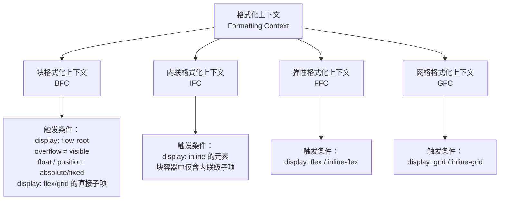
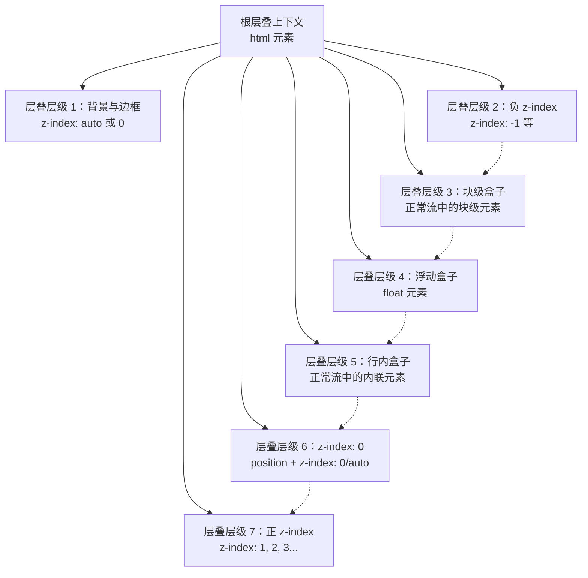

# 布局术语体系

> CSS 布局术语是理解所有布局模式的共同语言——掌握术语体系，才能精确理解规范、高效排查问题、自如切换布局方案。

## 概述

CSS 布局领域长期存在术语混乱的问题。同一概念在不同社区常有不同叫法：有人称"格式化上下文"为"渲染上下文"，有人把"包含块"简单等同于"父元素"，有人混淆"主轴"与"行内轴"的语义差异。这种混乱的根源在于 CSS 规范经历了从 CSS2 到 Flexbox、Grid、逻辑属性的多次演进，术语体系也在不断扩展和重构。

统一术语体系的意义在于三个方面。第一，精确沟通——当你说"BFC"时，听者应当知道你指的是块格式化上下文，而非泛指某种"清除浮动的技巧"。第二，规范阅读——W3C 规范使用严格的术语定义行为，理解术语是阅读规范的前提。第三，跨布局迁移——Flexbox 和 Grid 共享对齐体系、轴向体系和尺寸体系，掌握术语后可以举一反三。

本文将 CSS 布局术语按逻辑分为九个类别，逐一给出定义、触发条件与使用场景，并在文末提供完整的术语速查表。

## 盒模型术语

盒模型是 CSS 布局的原子单位，每个元素在渲染时都会生成一个矩形盒子，由四层同心区域构成。

### 四层结构

- **content（内容区）**：元素实际内容占据的区域，由 `width` 和 `height` 控制尺寸。
- **padding（内边距）**：内容区与边框之间的空白，不可为负值。
- **border（边框）**：包围内边距的边界线，具有宽度、样式和颜色三个子属性。
- **margin（外边距）**：边框外部与相邻元素之间的间距，可为负值。相邻块元素的垂直 margin 会发生**合并（margin collapsing）**。

### box-sizing 计算模型

`box-sizing` 决定了 `width` 和 `height` 作用域：

```css
/* content-box（默认）：width 仅指内容区 */
.box-content {
  box-sizing: content-box;
  width: 200px;       /* 内容区宽度 */
  padding: 20px;      /* 总宽度 = 200 + 20×2 = 240px */
  border: 1px solid;  /* 总宽度 = 240 + 1×2 = 242px */
}

/* border-box（推荐）：width 包含 padding + border */
.box-border {
  box-sizing: border-box;
  width: 200px;       /* 总宽度固定为 200px */
  padding: 20px;      /* 内容区 = 200 - 20×2 - 1×2 = 158px */
  border: 1px solid;
}
```

`border-box` 是工程实践中的推荐模型，因为它让尺寸计算更可预测。全局设置 `box-sizing: border-box` 已成为事实标准。

### 内在尺寸与外在尺寸

- **内在尺寸（Intrinsic Size）**：由元素自身内容决定的尺寸，如文字撑开的宽度、图片的原始尺寸。CSS 关键字 `min-content`、`max-content`、`fit-content` 均基于内在尺寸计算。
- **外在尺寸（Extrinsic Size）**：由外部容器或显式 CSS 属性指定的尺寸，如 `width: 300px` 或 `width: 50%`。当元素被赋予外在尺寸时，其内容可能溢出或留白。

理解这一区分对于掌握 Grid 和 Flexbox 的尺寸协商机制至关重要——当容器有剩余空间时，内在尺寸的元素可以被拉伸；当空间不足时，外在尺寸的元素可能溢出。

## 格式化上下文

格式化上下文（Formatting Context）是 CSS 视觉格式化模型的核心概念，它定义了一块渲染区域以及该区域内部子元素的布局规则。不同类型的格式化上下文决定了子元素如何排列、如何计算尺寸、如何处理溢出。

### 分类体系



### 各类格式化上下文详解

**BFC（Block Formatting Context，块格式化上下文）**

BFC 是最基础的格式化上下文。在 BFC 中，块级盒子沿块轴（通常是垂直方向）依次排列，每个盒子的左外边缘触及包含块的左边缘。BFC 的核心特性包括：内部浮动不会溢出、不会与外部浮动重叠、垂直 margin 不会与外部合并。最常见的显式触发方式是 `display: flow-root`，它没有副作用，语义清晰。

**IFC（Inline Formatting Context，内联格式化上下文）**

IFC 管辖内联级元素的布局。内联盒子沿行内轴排列，当一行放不下时自动换行形成行框（line box）。IFC 中垂直对齐通过 `vertical-align` 控制，水平对齐通过 `text-align` 控制。IFC 的行为较为复杂，涉及半行距、基线对齐等细节，是行内布局排障的关键。

**FFC（Flex Formatting Context，弹性格式化上下文）**

当元素设置 `display: flex` 或 `inline-flex` 时，该元素成为 Flex 容器，其直接子项成为 Flex 项目，整个容器进入弹性格式化上下文。FFC 中子元素不再遵循常规流的块级/内联级行为，而是沿主轴排列、在交叉轴上对齐。

**GFC（Grid Formatting Context，网格格式化上下文）**

当元素设置 `display: grid` 或 `inline-grid` 时，该元素成为 Grid 容器，其直接子项成为 Grid 项目，整个容器进入网格格式化上下文。GFC 是目前最强大的格式化上下文，支持二维布局、轨道尺寸协商、区域命名等特性。

> 注意：CSS2 时代还有表格格式化上下文（Table Formatting Context），由 `display: table` 触发，此处不展开。

## 轴向术语

轴向术语描述布局的方向参照系。CSS 中存在两套轴向体系：物理轴向和逻辑轴向。

### 主轴与交叉轴

这是 Flexbox 引入的轴向概念：

- **主轴（Main Axis）**：Flex 项目排列的方向，由 `flex-direction` 决定。`row` 为水平方向，`column` 为垂直方向。
- **交叉轴（Cross Axis）**：与主轴垂直的方向。当主轴为水平时，交叉轴为垂直，反之亦然。

主轴的起点和终点分别称为主轴起始（main-start）和主轴结束（main-end），交叉轴同理。

### 行内轴与块轴

这是逻辑属性体系中的轴向概念，与书写模式绑定：

- **行内轴（Inline Axis）**：文本行内书写的方向。在 `horizontal-tb` 模式下对应水平方向，在 `vertical-rl` 模式下对应垂直方向。
- **块轴（Block Axis）**：块盒子依次堆叠的方向。在 `horizontal-tb` 模式下对应垂直方向，在 `vertical-rl` 模式下对应水平方向。

关键区别：主轴/交叉轴是 Flexbox 的布局概念，由 `flex-direction` 控制；行内轴/块轴是书写模式的概念，由 `writing-mode` 决定。在 `flex-direction: row` 且 `writing-mode: horizontal-tb` 时，主轴与行内轴方向一致，但它们属于不同的概念层。

### 逻辑属性

逻辑属性使用 `start`/`end`/`inline`/`block` 替代物理方向 `top`/`right`/`bottom`/`left`，使布局自动适配书写模式：

```css
/* 物理属性：硬编码方向，RTL 场景下会出错 */
.card { margin-left: 16px; }

/* 逻辑属性：自动适配书写方向 */
.card { margin-inline-start: 16px; }
/* LTR 下等同于 margin-left: 16px */
/* RTL 下等同于 margin-right: 16px */
```

核心逻辑属性映射：

| 物理属性 | 逻辑属性 | 语义 |
|----------|----------|------|
| `width` | `inline-size` | 行内轴方向尺寸 |
| `height` | `block-size` | 块轴方向尺寸 |
| `top` | `inset-block-start` | 块轴起始偏移 |
| `left` | `inset-inline-start` | 行内轴起始偏移 |
| `margin-top` | `margin-block-start` | 块轴起始外边距 |
| `padding-left` | `padding-inline-start` | 行内轴起始内边距 |

## 对齐术语

CSS Box Alignment 模块从 Flexbox 规范中独立出来，成为 Flex 和 Grid 共享的对齐属性体系。理解对齐术语需要区分三个维度：对齐轴、对齐主体和对齐值。

### 对齐属性矩阵

| 属性 | 对齐轴 | 对齐主体 | Flex 可用 | Grid 可用 |
|------|--------|----------|-----------|-----------|
| `justify-content` | 主轴/行内轴 | 所有项目整体 | ✅ | ✅ |
| `align-content` | 交叉轴/块轴 | 所有项目整体 | ✅ | ✅ |
| `place-content` | 两个轴 | 所有项目整体 | ✅ | ✅ |
| `justify-items` | 主轴/行内轴 | 每个项目 | ❌ | ✅ |
| `align-items` | 交叉轴/块轴 | 每个项目 | ✅ | ✅ |
| `place-items` | 两个轴 | 每个项目 | ❌ | ✅ |
| `justify-self` | 主轴/行内轴 | 单个项目 | ❌ | ✅ |
| `align-self` | 交叉轴/块轴 | 单个项目 | ✅ | ✅ |
| `place-self` | 两个轴 | 单个项目 | ❌ | ✅ |

> `place-*` 是简写属性，格式为 `place-content: <align-content> <justify-content>`。

### 对齐值分类

**位置类对齐值**：控制项目在轴上的位置。

- `start` / `end`：对齐到容器的起始/结束边缘（逻辑方向）。
- `flex-start` / `flex-end`：Flexbox 专用，对齐到主轴起始/结束。在非 Flex 上下文中退化为 `start`/`end`。
- `center`：居中对齐。
- `stretch`：拉伸填满容器。仅适用于 `*-items` 和 `*-self`，且项目在该轴上没有显式尺寸。

**基线类对齐值**：

- `baseline`：按文本基线对齐，确保不同字号的文本视觉上对齐。
- `first baseline` / `last baseline`：指定使用第一个或最后一个基线。

**分布类对齐值**：控制项目之间的间距分布，仅适用于 `*-content` 属性。

- `space-between`：首尾项目贴边，中间等分间距。
- `space-around`：每个项目两侧等距，首尾间距为中间间距的一半。
- `space-evenly`：所有间距完全相等，包括首尾。

```css
/* 典型对齐示例 */
.flex-container {
  display: flex;
  justify-content: space-between; /* 主轴两端对齐 */
  align-items: center;            /* 交叉轴居中 */
}

.grid-container {
  display: grid;
  place-items: center stretch;    /* 行内轴居中，块轴拉伸 */
}
```

## 尺寸术语

CSS 尺寸体系包含内在尺寸关键字、弹性单位和自动填充策略三个层次。

### 内在尺寸关键字

这些关键字让元素尺寸基于内容自动计算，而非依赖固定值：

- **`min-content`**：内容在不溢出前提下的最小尺寸。对于文本，等于最长不可断词的宽度；对于图片，等于原始宽度。
- **`max-content`**：内容在不受容器约束时的最大尺寸。对于文本，等于所有文字排成一行时的宽度。
- **`fit-content`**：取 `min(max-content, max(min-content, available))`，即在可用空间内尽量容纳内容，但不超过 `max-content`、也不小于 `min-content`。当可用空间不小于 `min-content` 时，等价于 `min(max-content, available)`。
- **`available`**：包含块在当前轴上提供的可用空间，即容器尺寸减去已占空间。

```css
/* 让侧边栏宽度随内容自适应，但不超过 300px */
.sidebar {
  width: min(300px, fit-content);
}

/* 让列宽适应最长单词 */
.column {
  width: min-content;
}
```

### fr 单位

`fr`（fraction）是 Grid 布局专用的弹性单位，表示剩余空间的一份。它只分配可用空间，不参与内容尺寸的竞争：

```css
.grid {
  display: grid;
  /* 第一列 200px，剩余空间按 1:2 分配给后两列 */
  grid-template-columns: 200px 1fr 2fr;
}
```

`fr` 与 `auto` 的区别：`auto` 轨道的最大尺寸基于内容（趋近 `max-content`），最小尺寸基于 `min-content`；而 `fr` 轨道的最小尺寸为 0（除非受 `min-width` 约束）。当空间不足时，`fr` 轨道可以收缩到 0，`auto` 轨道不会低于其内容最小值。

### auto-fill 与 auto-fit

两者都用于 Grid 的响应式布局，在 `repeat()` 函数中生成自动数量的轨道：

```css
/* auto-fill：生成尽可能多的轨道，空轨道保留 */
.grid {
  grid-template-columns: repeat(auto-fill, minmax(200px, 1fr));
}

/* auto-fit：生成尽可能多的轨道，空轨道折叠为 0 */
.grid {
  grid-template-columns: repeat(auto-fit, minmax(200px, 1fr));
}
```

当项目数量少于可容纳数量时，`auto-fill` 会保留空轨道占位，`auto-fit` 会将空轨道折叠使现有项目拉伸填满。项目数量刚好填满时，两者表现一致。

## 层叠上下文术语

层叠上下文（Stacking Context）是 CSS 处理元素沿 z 轴排列的机制。理解层叠上下文是解决 z-index 失效问题的前提。

### 层叠上下文的层级关系



### 核心概念

**层叠上下文（Stacking Context）**：一个三维概念，每个层叠上下文内部的 z-index 只在本上下文内有意义。层叠上下文可以嵌套，子上下文的层叠层级整体受限于父上下文。

**层叠层级（Stacking Level）**：同一层叠上下文内，元素的绘制顺序编号。层级高的元素覆盖层级低的元素。

**层叠顺序（Painting Order）**：当两个元素处于同一层叠层级时，按源代码顺序绘制——后出现的覆盖先出现的。

### 层叠上下文的触发条件

以下任一条件会创建新的层叠上下文：

- `position` 为 `absolute`/`relative` 且 `z-index` 不为 `auto`
- `position` 为 `fixed`/`sticky`
- `opacity` 小于 1
- `transform` 不为 `none`
- `filter` 不为 `none`
- `will-change` 指定了上述属性
- `display: flex/grid` 的直接子项且 `z-index` 不为 `auto`
- `contain: paint`/`layout`/`strict`/`content`

```css
/* 常见陷阱：z-index 不生效 */
.box {
  z-index: 999; /* 无效！没有创建层叠上下文 */
}

/* 修复：需要同时设置定位 */
.box {
  position: relative;
  z-index: 999; /* 有效 */
}
```

## 包含块术语

包含块（Containing Block）是 CSS 布局中用于计算元素位置和尺寸的参照矩形。很多开发者误以为包含块就是父元素，但实际上包含块的确定规则取决于定位方式。

### 包含块的确定规则

| 定位方式 | 包含块 |
|----------|--------|
| `static` / `relative` | 最近的块容器祖先的内容区 |
| `absolute` | 最近的 `position` 非 `static` 的祖先的 padding box（含 padding） |
| `fixed` | 视口（viewport），除非祖先创建了变换上下文 |
| `absolute` / `fixed` 且祖先有 `transform`/`filter`/`will-change` | 创建变换上下文的祖先的 padding box |

### 初始包含块

**初始包含块（Initial Containing Block, ICB）**：根元素（`<html>`）的包含块，尺寸等于视口大小。`position: fixed` 的元素默认以 ICB 为参照。当根元素有 `transform` 等属性时，`fixed` 元素的包含块会改变——这是一个常见的排障盲点。

```css
/* 意外行为：fixed 元素不再以视口为参照 */
.parent {
  transform: translateZ(0); /* 创建了新的包含块 */
}

.child {
  position: fixed; /* 此时的包含块是 .parent，而非视口 */
}
```

### 绝对定位包含块

对于 `position: absolute` 的元素，其包含块是最近的定位祖先（`position` 不为 `static`）的 **padding box**。这意味着 `top: 0; left: 0` 定位到的是定位祖先的 padding 区域左上角，而非 border 区域左上角。百分比尺寸（如 `width: 50%`）也基于包含块的对应尺寸计算。

## 布局模式术语

CSS 定义了多种布局模式（Layout Mode），每种模式对应一套完整的布局算法。一个元素同时只能参与一种布局模式，但其子元素可能参与不同的模式。

### 常规流（Normal Flow）

常规流是默认的布局模式，包含块级格式化和内联格式化两种行为。块级盒子沿块轴堆叠，内联盒子沿行内轴排列。`position: static` 和 `position: relative` 的元素参与常规流。

### 浮动布局（Float）

浮动将元素从常规流中取出，使其向左或向右偏移，后续内容围绕浮动元素排列。浮动元素仍影响行框的位置，但不再参与块级盒子的堆叠。`clear` 属性用于控制元素是否与浮动元素相邻。现代布局中，浮动主要用于文字环绕图片，布局功能已被 Flex 和 Grid 取代。

### 定位布局（Positioned Layout）

通过 `position` 属性将元素从常规流中移出，相对包含块进行精确定位：

- `relative`：相对自身原始位置偏移，仍占据常规流空间。
- `absolute`：相对最近定位祖先偏移，脱离常规流。
- `fixed`：相对视口（或变换上下文祖先）偏移，脱离常规流。
- `sticky`：在滚动到阈值前表现为 `relative`，达到阈值后表现为 `fixed`。

### 弹性布局（Flex Layout）

Flex 布局是一维布局模式，沿主轴排列项目，通过 `flex-grow`、`flex-shrink`、`flex-basis` 控制项目的伸缩行为。Flex 擅长处理项目数量不确定、尺寸需要弹性分配的场景。

### 网格布局（Grid Layout）

Grid 布局是二维布局模式，同时控制行和列，通过轨道定义和区域命名实现复杂的对齐与尺寸协商。Grid 擅长处理整体页面框架和需要精确行列控制的场景。

### 多列布局（Multi-column Layout）

将内容分成等宽的多列排列，类似报纸排版。通过 `column-count` 或 `column-width` 控制列数和列宽。多列布局中内容自动流动填充，适合长文本的阅读场景。

## 术语速查表

| 英文术语 | 中文译名 | 简释 |
|----------|----------|------|
| Formatting Context | 格式化上下文 | 定义渲染区域内子元素布局规则的上下文 |
| BFC (Block Formatting Context) | 块格式化上下文 | 块级盒子垂直排列、浮动不溢出的上下文 |
| IFC (Inline Formatting Context) | 内联格式化上下文 | 内联盒子水平排列、自动换行的上下文 |
| FFC (Flex Formatting Context) | 弹性格式化上下文 | Flex 容器创建的一维弹性布局上下文 |
| GFC (Grid Formatting Context) | 网格格式化上下文 | Grid 容器创建的二维网格布局上下文 |
| Main Axis | 主轴 | Flex 项目排列的方向轴 |
| Cross Axis | 交叉轴 | 与主轴垂直的方向轴 |
| Inline Axis | 行内轴 | 书写模式中文本行内书写的方向 |
| Block Axis | 块轴 | 书写模式中块盒子堆叠的方向 |
| content | 内容区 | 盒模型中实际内容占据的区域 |
| padding | 内边距 | 内容区与边框之间的空白 |
| border | 边框 | 包围内边距的边界线 |
| margin | 外边距 | 边框外部与相邻元素的间距 |
| content-box | 内容盒模型 | width 仅指内容区的计算模型 |
| border-box | 边框盒模型 | width 包含 padding + border 的计算模型 |
| Intrinsic Size | 内在尺寸 | 由元素自身内容决定的尺寸 |
| Extrinsic Size | 外在尺寸 | 由外部容器或显式属性指定的尺寸 |
| min-content | 最小内容尺寸 | 内容不溢出时的最小尺寸 |
| max-content | 最大内容尺寸 | 内容不受约束时的最大尺寸 |
| fit-content | 适应内容尺寸 | 取 min(max-content, available) |
| available | 可用空间 | 包含块在当前轴上提供的剩余空间 |
| fr (fraction) | 弹性份额 | Grid 中分配剩余空间的单位 |
| auto-fill | 自动填充 | 生成尽可能多的轨道，保留空轨道 |
| auto-fit | 自动适配 | 生成尽可能多的轨道，折叠空轨道 |
| Stacking Context | 层叠上下文 | 定义 z 轴排列规则的三维上下文 |
| Stacking Level | 层叠层级 | 同一层叠上下文内的绘制顺序编号 |
| Painting Order | 层叠顺序 | 同一层级内按源码顺序绘制的规则 |
| z-index | z 轴索引 | 控制层叠层级数值的属性 |
| Containing Block | 包含块 | 计算元素位置和尺寸的参照矩形 |
| Initial Containing Block | 初始包含块 | 根元素的包含块，尺寸等于视口 |
| Normal Flow | 常规流 | 默认的块级+内联布局模式 |
| Float | 浮动 | 元素脱离常规流向一侧偏移的布局 |
| Positioned Layout | 定位布局 | 通过 position 属性精确偏移的布局 |
| Flex Layout | 弹性布局 | 一维弹性伸缩布局 |
| Grid Layout | 网格布局 | 二维行列布局 |
| Multi-column Layout | 多列布局 | 内容分成等宽多列的布局 |
| justify-content | 主轴内容对齐 | 沿主轴/行内轴分布所有项目 |
| align-content | 交叉轴内容对齐 | 沿交叉轴/块轴分布所有项目 |
| place-content | 双轴内容对齐 | align-content + justify-content 简写 |
| justify-items | 主轴项目对齐 | 沿主轴对齐每个项目（仅 Grid） |
| align-items | 交叉轴项目对齐 | 沿交叉轴对齐每个项目 |
| place-items | 双轴项目对齐 | align-items + justify-items 简写 |
| justify-self | 主轴自身对齐 | 单个项目沿主轴覆盖对齐（仅 Grid） |
| align-self | 交叉轴自身对齐 | 单个项目沿交叉轴覆盖对齐 |
| place-self | 双轴自身对齐 | align-self + justify-self 简写 |
| start | 起始 | 对齐到容器逻辑起始边缘 |
| end | 结束 | 对齐到容器逻辑结束边缘 |
| center | 居中 | 对齐到容器中心 |
| stretch | 拉伸 | 拉伸填满容器可用空间 |
| baseline | 基线 | 按文本基线对齐 |
| space-between | 两端对齐 | 首尾贴边，中间等分间距 |
| space-around | 等距环绕 | 每项两侧等距，首尾为中间一半 |
| space-evenly | 均匀分布 | 所有间距完全相等 |
| inline-size | 行内轴尺寸 | 逻辑属性，对应 width |
| block-size | 块轴尺寸 | 逻辑属性，对应 height |
| margin-block-start | 块轴起始外边距 | 逻辑属性，对应 margin-top |
| margin-inline-start | 行内轴起始外边距 | 逻辑属性，对应 margin-left |
| inset-block-start | 块轴起始偏移 | 逻辑属性，对应 top |
| inset-inline-start | 行内轴起始偏移 | 逻辑属性，对应 left |

## 总结

CSS 布局术语体系是一个分层结构：盒模型是基础单位，格式化上下文定义布局规则，轴向和对齐术语提供方向参照和定位手段，尺寸术语解决空间分配，层叠上下文处理 z 轴层级，包含块提供位置参照，布局模式则是完整的布局算法。

掌握术语体系的最大价值在于**建立精确的心智模型**。当你遇到 z-index 失效时，应当立即想到层叠上下文；当你遇到 margin 合并时，应当立即想到 BFC；当你需要国际化布局时，应当立即想到逻辑属性。术语不是死记硬背的名词，而是快速定位问题的思维索引。

## 参考资料

- [CSS Visual Formatting Model — W3C CSS2.2](https://www.w3.org/TR/CSS22/visuren.html)
- [CSS Logical Properties and Values Level 1](https://www.w3.org/TR/css-logical-1/)
- [CSS Box Alignment Module Level 3](https://www.w3.org/TR/css-align-3/)
- [CSS Grid Layout Module Level 2](https://www.w3.org/TR/css-grid-2/)
- [CSS Flexbox Layout Module Level 1](https://www.w3.org/TR/css-flexbox-1/)
- [CSS Positioned Layout Module Level 3](https://www.w3.org/TR/css-position-3/)
- [MDN: The stacking context](https://developer.mozilla.org/en-US/docs/Web/CSS/CSS_positioned_layout/Understanding_z-index/Stacking_context)
