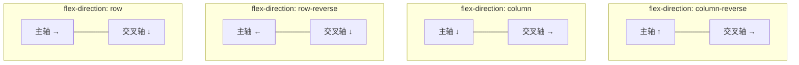
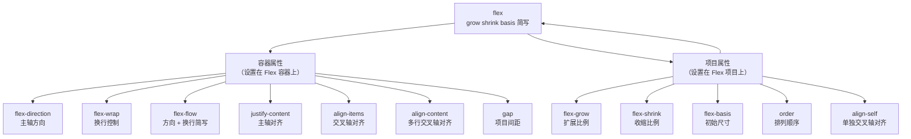

# Flex 布局

> Flexbox 是 CSS 的一维弹性布局模型，通过容器与项目的双轴协作，让空间分配与对齐从"手动计算"变为"声明式驱动"。

## 核心概念

### Flex 容器与项目

Flex 布局的核心模型是 **容器-项目** 二层结构。当一个元素的 `display` 设为 `flex` 或 `inline-flex` 时，它成为 **Flex 容器**，其所有直接子元素自动成为 **Flex 项目**。

```css
/* 块级 Flex 容器：独占一行 */
.container {
  display: flex;
}

/* 行内 Flex 容器：宽度由内容撑开，可与其他行内元素并排 */
.inline-container {
  display: inline-flex;
}
```

理解容器与项目的关系需要牢记以下规则：

| 规则 | 说明 |
|------|------|
| 仅限直接子元素 | 只有容器的**直接子元素**才是 Flex 项目，孙级元素不受影响 |
| 匿名 Flex 项目 | 容器内的裸文本节点会被自动包装为匿名 Flex 项目 |
| 绝对定位例外 | 设置了 `position: absolute` 或 `fixed` 的子元素**脱离** Flex 布局，不参与伸缩与对齐 |
| 嵌套容器 | Flex 项目本身也可以是 Flex 容器，形成嵌套布局 |
| float 失效 | Flex 项目上的 `float` 和 `clear` 无效 |
| vertical-align 失效 | Flex 项目上的 `vertical-align` 无效 |
| 外边距不折叠 | Flex 项目之间的垂直外边距**不会折叠**（不同于普通流中的块级元素） |

### 主轴与交叉轴

Flex 布局基于 **双轴模型** 运作：主轴（Main Axis）决定项目的排列方向，交叉轴（Cross Axis）与主轴垂直，决定项目的对齐方式。所有对齐属性都围绕这两条轴定义，理解轴向是掌握 Flex 布局的前提。

**轴向术语**：

| 术语 | 含义 | 相关属性 |
|------|------|----------|
| main start / main end | 主轴起点 / 终点 | `justify-content`、`flex-grow` |
| cross start / cross end | 交叉轴起点 / 终点 | `align-items`、`align-content` |
| main size | 主轴方向尺寸 | `flex-basis`、`width`（row 时） |
| cross size | 交叉轴方向尺寸 | `height`（row 时） |

主轴方向由 `flex-direction` 决定，交叉轴始终与主轴垂直。不同 `flex-direction` 值下两轴的方向关系如下：



**关键认知**：`justify-content` 永远作用于主轴，`align-items` 永远作用于交叉轴——它们不关心轴是水平还是垂直。当 `flex-direction: column` 时，`justify-content` 控制的是垂直方向对齐，`align-items` 控制的是水平方向对齐。

## 容器属性详解

Flex 容器属性控制项目的排列方向、换行行为、对齐方式和间距。以下属性均设置在 Flex 容器上。

### flex-direction

`flex-direction` 决定主轴方向，即项目的排列方向。它是 Flex 布局中最基础的属性，直接影响所有对齐属性的作用方向。

| 值 | 主轴方向 | 交叉轴方向 | 说明 |
|----|---------|-----------|------|
| `row` | 水平 → | 垂直 ↓ | **默认值**，从左到右 |
| `row-reverse` | 水平 ← | 垂直 ↓ | 从右到左 |
| `column` | 垂直 ↓ | 水平 → | 从上到下 |
| `column-reverse` | 垂直 ↑ | 水平 → | 从下到上 |

```html
<div class="container row">A B C</div>
<div class="container col">A B C</div>
```

```css
.container {
  display: flex;
  gap: 10px;
  padding: 10px;
  border: 2px solid #1976d2;
  margin-bottom: 10px;
}

/* 水平排列（默认） */
.row {
  flex-direction: row;
}

/* 垂直排列 */
.col {
  flex-direction: column;
}
```

> **注意**：`row-reverse` 和 `column-reverse` 仅改变视觉排列方向，不改变 DOM 顺序。屏幕阅读器等辅助技术仍按 DOM 顺序读取内容。

### flex-wrap

`flex-wrap` 控制项目是否换行。默认情况下，Flex 项目会尽量挤在一行中，即使被压缩到小于内容宽度。

| 值 | 行为 |
|----|------|
| `nowrap` | **默认值**，不换行，项目被压缩以适应单行 |
| `wrap` | 换行，第一行在上方 |
| `wrap-reverse` | 换行，第一行在下方 |

```html
<div class="container">
  <div class="item">1</div>
  <div class="item">2</div>
  <div class="item">3</div>
  <div class="item">4</div>
  <div class="item">5</div>
</div>
```

```css
.container {
  display: flex;
  flex-wrap: wrap; /* 允许换行 */
  gap: 10px;
}

.item {
  /* 每个项目最小 200px，空间不足时自动换行 */
  flex: 1 1 200px;
  min-width: 0;
  height: 80px;
  background: #e3f2fd;
  border: 1px solid #1976d2;
}
```

> **要点**：`nowrap` 下项目会被压缩（受 `flex-shrink` 控制）；`wrap` 下项目不会被压缩，空间不足时自动折到下一行。需要响应式布局时，`flex-wrap: wrap` 配合 `flex-basis` 是常用模式。


#### flex-wrap 交互演示（MDN）

设置 flex 项目是否换行（nowrap/wrap/wrap-reverse）。

```html
<!DOCTYPE html>
<html lang="zh-CN">
  <head>
    <meta charset="UTF-8" />
    <meta name="viewport" content="width=device-width, initial-scale=1.0" />
    <title>flex-wrap 属性演示 - MDN 示例</title>
    <meta name="description" content="flex-wrap 属性演示" />
    <style>
      * {
        margin: 0;
        padding: 0;
        box-sizing: border-box;
      }
      body {
        font-family: -apple-system, BlinkMacSystemFont, "Segoe UI", Roboto, "Helvetica Neue", Arial, sans-serif;
        min-height: 100vh;
        padding: 0;
      }
      .demo-layout {
        display: flex;
        height: 100vh;
        gap: 0;
      }
      .snippet-panel {
        width: 320px;
        flex-shrink: 0;
        padding: 16px;
        display: flex;
        flex-direction: column;
        gap: 8px;
        overflow-y: auto;
        border-right: 1px solid #ddd;
        background: #fafafa;
      }
      .snippet-btn {
        padding: 10px 14px;
        border: 1px solid #ccc;
        border-radius: 6px;
        background: #fff;
        font-family: "JetBrains Mono", "Fira Code", monospace;
        font-size: 13px;
        color: #333;
        cursor: pointer;
        text-align: left;
        transition: all 0.2s;
        line-height: 1.4;
      }
      .snippet-btn:hover {
        border-color: #8083ff;
        background: #f0f0ff;
      }
      .snippet-btn.active {
        border-color: #8083ff;
        background: #e8e8ff;
        color: #571bc1;
        font-weight: 600;
      }
      .preview-panel {
        flex: 1;
        padding: 16px;
        display: flex;
        align-items: center;
        justify-content: center;
        background: #fff;
        overflow: auto;
      }
      .preview-panel > section,
      .preview-panel > div:not(.snippet-panel):not(.demo-layout) {
        flex: 1;
        width: 100%;
        min-height: 0;
        height: 100%;
        display: flex;
        align-items: center;
        justify-content: center;
      }
      #example-element {
        border: 1px solid #c5c5c5;
        width: 80%;
        display: flex;
      }

      #example-element > div {
        background-color: rgba(0, 0, 255, 0.2);
        border: 3px solid blue;
        width: 60px;
        margin: 10px;
      }
    </style>
  </head>
  <body>
    <div class="demo-layout">
      <div class="snippet-panel">
        <button class="snippet-btn active" data-index="0">flex-wrap: nowrap;</button>
        <button class="snippet-btn" data-index="1">flex-wrap: wrap;</button>
        <button class="snippet-btn" data-index="2">flex-wrap: wrap-reverse;</button>
      </div>
      <div class="preview-panel">
        <section class="default-example" id="default-example">
          <div class="transition-all" id="example-element">
            <div>Item One</div>
            <div>Item Two</div>
            <div>Item Three</div>
            <div>Item Four</div>
            <div>Item Five</div>
            <div>Item Six</div>
          </div>
        </section>
      </div>
    </div>
    <script>
      const snippets = [
        `#example-element {
  flex-wrap: nowrap;
}`,
        `#example-element {
  flex-wrap: wrap;
}`,
        `#example-element {
  flex-wrap: wrap-reverse;
}`,
      ];

      let styleEl = document.createElement("style");
      document.head.appendChild(styleEl);

      function applySnippet(index) {
        styleEl.textContent = snippets[index];
        document.querySelectorAll(".snippet-btn").forEach((btn, i) => {
          btn.classList.toggle("active", i === index);
        });
      }

      document.querySelectorAll(".snippet-btn").forEach((btn) => {
        btn.addEventListener("click", () => applySnippet(parseInt(btn.dataset.index)));
      });

      applySnippet(0);
    </script>
  </body>
</html>

```
### flex-flow

`flex-flow` 是 `flex-direction` 和 `flex-wrap` 的简写属性，默认值为 `row nowrap`。

```css
.container {
  display: flex;

  /* 完整写法：方向 + 换行 */
  flex-flow: row wrap;

  /* 等同于分开写 */
  /* flex-direction: row; */
  /* flex-wrap: wrap; */
}
```

`flex-flow` 的两个值可以互换顺序，浏览器会自动识别。实际开发中，如果方向为默认的 `row`，通常只写 `flex-wrap` 即可。

### justify-content

`justify-content` 控制项目在**主轴**上的对齐方式，决定剩余空间如何分配。这是使用频率最高的 Flex 属性之一。

| 值 | 对齐方式 | 首项目前间距 | 项目间间距 | 尾项目后间距 |
|----|---------|-------------|-----------|-------------|
| `flex-start` | 起点对齐 | 0 | 0 | 全部剩余 |
| `flex-end` | 终点对齐 | 全部剩余 | 0 | 0 |
| `center` | 居中对齐 | 剩余/2 | 0 | 剩余/2 |
| `space-between` | 两端对齐 | 0 | 剩余/(n-1) | 0 |
| `space-around` | 等距环绕 | 剩余/2n | 剩余/n | 剩余/2n |
| `space-evenly` | 均匀分布 | 剩余/(n+1) | 剩余/(n+1) | 剩余/(n+1) |

> n 为项目数量。当只有一个项目时，`space-between` 等同于 `flex-start`。

```html
<div class="container">
  <div class="item">A</div>
  <div class="item">B</div>
  <div class="item">C</div>
</div>
```

```css
.container {
  display: flex;
  justify-content: space-between; /* 两端对齐，项目间间距相等 */
  padding: 10px;
  border: 2px solid #1976d2;
}

.item {
  width: 80px;
  height: 40px;
  background: #e3f2fd;
  border: 1px solid #1976d2;
  display: flex;
  justify-content: center;
  align-items: center;
}
```

> **注意**：`justify-content` 仅在有剩余空间时生效。如果项目设置了 `flex-grow` 占满了主轴，或项目总宽度已超出容器，则对齐效果不可见。


#### justify-content 交互演示（MDN）

设置 flex/grid 容器主轴方向项目的对齐与分布方式。

```html
<!DOCTYPE html>
<html lang="zh-CN">
  <head>
    <meta charset="UTF-8" />
    <meta name="viewport" content="width=device-width, initial-scale=1.0" />
    <title>justify-content 属性演示 - MDN 示例</title>
    <meta name="description" content="justify-content 属性演示" />
    <style>
      * {
        margin: 0;
        padding: 0;
        box-sizing: border-box;
      }
      body {
        font-family: -apple-system, BlinkMacSystemFont, "Segoe UI", Roboto, "Helvetica Neue", Arial, sans-serif;
        min-height: 100vh;
        padding: 0;
      }
      .demo-layout {
        display: flex;
        height: 100vh;
        gap: 0;
      }
      .snippet-panel {
        width: 320px;
        flex-shrink: 0;
        padding: 16px;
        display: flex;
        flex-direction: column;
        gap: 8px;
        overflow-y: auto;
        border-right: 1px solid #ddd;
        background: #fafafa;
      }
      .snippet-btn {
        padding: 10px 14px;
        border: 1px solid #ccc;
        border-radius: 6px;
        background: #fff;
        font-family: "JetBrains Mono", "Fira Code", monospace;
        font-size: 13px;
        color: #333;
        cursor: pointer;
        text-align: left;
        transition: all 0.2s;
        line-height: 1.4;
      }
      .snippet-btn:hover {
        border-color: #8083ff;
        background: #f0f0ff;
      }
      .snippet-btn.active {
        border-color: #8083ff;
        background: #e8e8ff;
        color: #571bc1;
        font-weight: 600;
      }
      .preview-panel {
        flex: 1;
        padding: 16px;
        display: flex;
        align-items: center;
        justify-content: center;
        background: #fff;
        overflow: auto;
      }
      .preview-panel > section,
      .preview-panel > div:not(.snippet-panel):not(.demo-layout) {
        flex: 1;
        width: 100%;
        min-height: 0;
        height: 100%;
        display: flex;
        align-items: center;
        justify-content: center;
      }
      #example-element {
        border: 1px solid #c5c5c5;
        width: 220px;
        display: grid;
        grid-template-columns: 60px 60px;
        grid-auto-rows: 40px;
        row-gap: 10px;
      }

      #example-element > div {
        background-color: rgba(0, 0, 255, 0.2);
        border: 3px solid blue;
      }
    </style>
  </head>
  <body>
    <div class="demo-layout">
      <div class="snippet-panel">
        <button class="snippet-btn active" data-index="0">justify-content: start;</button>
        <button class="snippet-btn" data-index="1">justify-content: center;</button>
        <button class="snippet-btn" data-index="2">justify-content: space-between;</button>
        <button class="snippet-btn" data-index="3">justify-content: space-around;</button>
        <button class="snippet-btn" data-index="4">justify-content: space-evenly;</button>
      </div>
      <div class="preview-panel">
        <section class="default-example" id="default-example">
          <div class="example-container">
            <div class="transition-all" id="example-element">
              <div>One</div>
              <div>Two</div>
              <div>Three</div>
            </div>
          </div>
        </section>
      </div>
    </div>
    <script>
      const snippets = [
        `#example-element {
  justify-content: start;
}`,
        `#example-element {
  justify-content: center;
}`,
        `#example-element {
  justify-content: space-between;
}`,
        `#example-element {
  justify-content: space-around;
}`,
        `#example-element {
  justify-content: space-evenly;
}`,
      ];

      let styleEl = document.createElement("style");
      document.head.appendChild(styleEl);

      function applySnippet(index) {
        styleEl.textContent = snippets[index];
        document.querySelectorAll(".snippet-btn").forEach((btn, i) => {
          btn.classList.toggle("active", i === index);
        });
      }

      document.querySelectorAll(".snippet-btn").forEach((btn) => {
        btn.addEventListener("click", () => applySnippet(parseInt(btn.dataset.index)));
      });

      applySnippet(0);
    </script>
  </body>
</html>

```
### align-items

`align-items` 控制项目在**交叉轴**上的对齐方式。当 `flex-direction: row` 时，它控制垂直对齐；当 `flex-direction: column` 时，它控制水平对齐。

| 值 | 行为 |
|----|------|
| `stretch` | **默认值**，拉伸填满容器交叉轴方向（需项目未设置交叉轴尺寸） |
| `flex-start` | 交叉轴起点对齐 |
| `flex-end` | 交叉轴终点对齐 |
| `center` | 交叉轴居中对齐 |
| `baseline` | 项目的文本基线对齐 |

```html
<div class="container">
  <div class="item tall">A</div>
  <div class="item">B</div>
  <div class="item small">C</div>
</div>
```

```css
.container {
  display: flex;
  align-items: center; /* 交叉轴居中 */
  height: 200px;
  border: 2px solid #1976d2;
}

.item {
  width: 80px;
  background: #e3f2fd;
  border: 1px solid #1976d2;
  display: flex;
  justify-content: center;
  align-items: center;
}

.tall { height: 120px; }
.small { height: 40px; }
```

> **`stretch` 的陷阱**：如果项目显式设置了交叉轴方向的尺寸（如 `height`），`stretch` 不会拉伸它。只有未设置尺寸时才会生效。这是初学者常遇到的"为什么 stretch 不生效"的原因。


#### align-items 交互演示（MDN）

设置 flex/grid 容器交叉轴方向项目的对齐方式。

```html
<!DOCTYPE html>
<html lang="zh-CN">
  <head>
    <meta charset="UTF-8" />
    <meta name="viewport" content="width=device-width, initial-scale=1.0" />
    <title>align-items 属性演示 - MDN 示例</title>
    <meta name="description" content="align-items 属性演示" />
    <style>
      * {
        margin: 0;
        padding: 0;
        box-sizing: border-box;
      }
      body {
        font-family: -apple-system, BlinkMacSystemFont, "Segoe UI", Roboto, "Helvetica Neue", Arial, sans-serif;
        min-height: 100vh;
        padding: 0;
      }
      .demo-layout {
        display: flex;
        height: 100vh;
        gap: 0;
      }
      .snippet-panel {
        width: 320px;
        flex-shrink: 0;
        padding: 16px;
        display: flex;
        flex-direction: column;
        gap: 8px;
        overflow-y: auto;
        border-right: 1px solid #ddd;
        background: #fafafa;
      }
      .snippet-btn {
        padding: 10px 14px;
        border: 1px solid #ccc;
        border-radius: 6px;
        background: #fff;
        font-family: "JetBrains Mono", "Fira Code", monospace;
        font-size: 13px;
        color: #333;
        cursor: pointer;
        text-align: left;
        transition: all 0.2s;
        line-height: 1.4;
      }
      .snippet-btn:hover {
        border-color: #8083ff;
        background: #f0f0ff;
      }
      .snippet-btn.active {
        border-color: #8083ff;
        background: #e8e8ff;
        color: #571bc1;
        font-weight: 600;
      }
      .preview-panel {
        flex: 1;
        padding: 16px;
        display: flex;
        align-items: center;
        justify-content: center;
        background: #fff;
        overflow: auto;
      }
      .preview-panel > section,
      .preview-panel > div:not(.snippet-panel):not(.demo-layout) {
        flex: 1;
        width: 100%;
        min-height: 0;
        height: 100%;
        display: flex;
        align-items: center;
        justify-content: center;
      }
      #example-element {
        border: 1px solid #c5c5c5;
        display: grid;
        width: 200px;
        grid-template-columns: 1fr 1fr;
        grid-auto-rows: 80px;
        grid-gap: 10px;
      }

      #example-element > div {
        background-color: rgba(0, 0, 255, 0.2);
        border: 3px solid blue;
      }
    </style>
  </head>
  <body>
    <div class="demo-layout">
      <div class="snippet-panel">
        <button class="snippet-btn active" data-index="0">align-items: stretch;</button>
        <button class="snippet-btn" data-index="1">align-items: center;</button>
        <button class="snippet-btn" data-index="2">align-items: start;</button>
        <button class="snippet-btn" data-index="3">align-items: end;</button>
      </div>
      <div class="preview-panel">
        <section class="default-example" id="default-example">
          <div class="example-container">
            <div class="transition-all" id="example-element">
              <div>One</div>
              <div>Two</div>
              <div>Three</div>
            </div>
          </div>
        </section>
      </div>
    </div>
    <script>
      const snippets = [
        `#example-element {
  align-items: stretch;
}`,
        `#example-element {
  align-items: center;
}`,
        `#example-element {
  align-items: start;
}`,
        `#example-element {
  align-items: end;
}`,
      ];

      let styleEl = document.createElement("style");
      document.head.appendChild(styleEl);

      function applySnippet(index) {
        styleEl.textContent = snippets[index];
        document.querySelectorAll(".snippet-btn").forEach((btn, i) => {
          btn.classList.toggle("active", i === index);
        });
      }

      document.querySelectorAll(".snippet-btn").forEach((btn) => {
        btn.addEventListener("click", () => applySnippet(parseInt(btn.dataset.index)));
      });

      applySnippet(0);
    </script>
  </body>
</html>

```
### align-content

`align-content` 控制多行项目在交叉轴方向的整体对齐方式。**仅在 `flex-wrap: wrap` 且有多行时生效**，单行情况下无效。

| 值 | 行为 |
|----|------|
| `stretch` | **默认值**，各行拉伸填满交叉轴剩余空间 |
| `flex-start` | 所有行紧贴交叉轴起点 |
| `flex-end` | 所有行紧贴交叉轴终点 |
| `center` | 所有行在交叉轴居中 |
| `space-between` | 行间间距相等，首尾行紧贴容器边缘 |
| `space-around` | 每行两侧间距相等 |

```html
<div class="container">
  <div class="item">1</div>
  <div class="item">2</div>
  <div class="item">3</div>
  <div class="item">4</div>
  <div class="item">5</div>
  <div class="item">6</div>
</div>
```

```css
.container {
  display: flex;
  flex-wrap: wrap;           /* 必须允许换行 */
  align-content: space-between; /* 多行在交叉轴两端对齐 */
  height: 300px;             /* 容器必须有足够高度 */
  gap: 10px;
  border: 2px solid #1976d2;
}

.item {
  width: 120px;
  height: 60px;
  background: #e3f2fd;
  border: 1px solid #1976d2;
}
```

> **`align-content` 与 `align-items` 的区别**：`align-items` 控制单行内项目在交叉轴上的对齐；`align-content` 控制多行作为整体在交叉轴上的分布。两者可以同时使用，`align-content` 先决定行的位置，`align-items` 再决定行内项目的对齐。


#### align-content 交互演示（MDN）

设置多行 flex/grid 项目在交叉轴上的分布方式。

```html
<!DOCTYPE html>
<html lang="zh-CN">
  <head>
    <meta charset="UTF-8" />
    <meta name="viewport" content="width=device-width, initial-scale=1.0" />
    <title>align-content 属性演示 - MDN 示例</title>
    <meta name="description" content="align-content 属性演示" />
    <style>
      * {
        margin: 0;
        padding: 0;
        box-sizing: border-box;
      }
      body {
        font-family: -apple-system, BlinkMacSystemFont, "Segoe UI", Roboto, "Helvetica Neue", Arial, sans-serif;
        min-height: 100vh;
        padding: 0;
      }
      .demo-layout {
        display: flex;
        height: 100vh;
        gap: 0;
      }
      .snippet-panel {
        width: 320px;
        flex-shrink: 0;
        padding: 16px;
        display: flex;
        flex-direction: column;
        gap: 8px;
        overflow-y: auto;
        border-right: 1px solid #ddd;
        background: #fafafa;
      }
      .snippet-btn {
        padding: 10px 14px;
        border: 1px solid #ccc;
        border-radius: 6px;
        background: #fff;
        font-family: "JetBrains Mono", "Fira Code", monospace;
        font-size: 13px;
        color: #333;
        cursor: pointer;
        text-align: left;
        transition: all 0.2s;
        line-height: 1.4;
      }
      .snippet-btn:hover {
        border-color: #8083ff;
        background: #f0f0ff;
      }
      .snippet-btn.active {
        border-color: #8083ff;
        background: #e8e8ff;
        color: #571bc1;
        font-weight: 600;
      }
      .preview-panel {
        flex: 1;
        padding: 16px;
        display: flex;
        align-items: center;
        justify-content: center;
        background: #fff;
        overflow: auto;
      }
      .preview-panel > section,
      .preview-panel > div:not(.snippet-panel):not(.demo-layout) {
        flex: 1;
        width: 100%;
        min-height: 0;
        height: 100%;
        display: flex;
        align-items: center;
        justify-content: center;
      }
      #example-element {
        border: 1px solid #c5c5c5;
        display: grid;
        grid-template-columns: 60px 60px;
        grid-auto-rows: 40px;
        column-gap: 10px;
        height: 180px;
      }

      #example-element > div {
        background-color: rgba(0, 0, 255, 0.2);
        border: 3px solid blue;
      }
    </style>
  </head>
  <body>
    <div class="demo-layout">
      <div class="snippet-panel">
        <button class="snippet-btn active" data-index="0">align-content: start;</button>
        <button class="snippet-btn" data-index="1">align-content: center;</button>
        <button class="snippet-btn" data-index="2">align-content: space-between;</button>
        <button class="snippet-btn" data-index="3">align-content: space-around;</button>
      </div>
      <div class="preview-panel">
        <section class="default-example" id="default-example">
          <div class="example-container">
            <div class="transition-all" id="example-element">
              <div>One</div>
              <div>Two</div>
              <div>Three</div>
            </div>
          </div>
        </section>
      </div>
    </div>
    <script>
      const snippets = [
        `#example-element {
  align-content: start;
}`,
        `#example-element {
  align-content: center;
}`,
        `#example-element {
  align-content: space-between;
}`,
        `#example-element {
  align-content: space-around;
}`,
      ];

      let styleEl = document.createElement("style");
      document.head.appendChild(styleEl);

      function applySnippet(index) {
        styleEl.textContent = snippets[index];
        document.querySelectorAll(".snippet-btn").forEach((btn, i) => {
          btn.classList.toggle("active", i === index);
        });
      }

      document.querySelectorAll(".snippet-btn").forEach((btn) => {
        btn.addEventListener("click", () => applySnippet(parseInt(btn.dataset.index)));
      });

      applySnippet(0);
    </script>
  </body>
</html>

```
### gap

`gap` 属性控制 Flex 项目之间的间距，是替代传统 margin 方案的现代方式。它只作用于项目之间，不会在容器边缘产生间距。

| 属性 | 说明 |
|------|------|
| `gap` | 行间距和列间距的简写 |
| `row-gap` | 仅控制行间距（多行时生效） |
| `column-gap` | 仅控制列间距 |

```css
.container {
  display: flex;
  flex-wrap: wrap;

  /* 单值：行间距 = 列间距 */
  gap: 20px;

  /* 双值：行间距 列间距 */
  gap: 20px 30px;

  /* 也可以分别设置 */
  row-gap: 20px;
  column-gap: 30px;
}
```

```html
<div class="container">
  <div class="item">A</div>
  <div class="item">B</div>
  <div class="item">C</div>
  <div class="item">D</div>
</div>
```

```css
.container {
  display: flex;
  flex-wrap: wrap;
  gap: 16px; /* 项目间距 16px，不会在容器边缘产生间距 */
  padding: 16px;
  border: 2px solid #1976d2;
}

.item {
  flex: 1 1 150px;
  height: 80px;
  background: #e3f2fd;
  border: 1px solid #1976d2;
}
```

> **`gap` 与 `margin` 的核心区别**：`gap` 只在项目之间生效，首尾项目不会产生多余间距；`margin` 需要手动处理首尾元素的间距问题（如 `:last-child { margin-right: 0 }`）。优先使用 `gap`。


#### gap 交互演示（MDN）

设置 flex/grid 容器中项目之间的间距，可分别指定行距与列距。

```html
<!DOCTYPE html>
<html lang="zh-CN">
  <head>
    <meta charset="UTF-8" />
    <meta name="viewport" content="width=device-width, initial-scale=1.0" />
    <title>gap 属性演示 - MDN 示例</title>
    <meta name="description" content="gap 属性演示" />
    <style>
      * {
            margin: 0;
            padding: 0;
            box-sizing: border-box;
          }
          body {
            font-family: -apple-system, BlinkMacSystemFont, 'Segoe UI', Roboto, 'Helvetica Neue', Arial, sans-serif;
            min-height: 100vh;
            padding: 0;
          }
          .demo-layout {
            display: flex;
            height: 100vh;
            gap: 0;
          }
          .snippet-panel {
            width: 320px;
            flex-shrink: 0;
            padding: 16px;
            display: flex;
            flex-direction: column;
            gap: 8px;
            overflow-y: auto;
            border-right: 1px solid #ddd;
            background: #fafafa;
          }
          .snippet-btn {
            padding: 10px 14px;
            border: 1px solid #ccc;
            border-radius: 6px;
            background: #fff;
            font-family: 'JetBrains Mono', 'Fira Code', monospace;
            font-size: 13px;
            color: #333;
            cursor: pointer;
            text-align: left;
            transition: all 0.2s;
            line-height: 1.4;
          }
          .snippet-btn:hover {
            border-color: #8083ff;
            background: #f0f0ff;
          }
          .snippet-btn.active {
            border-color: #8083ff;
            background: #e8e8ff;
            color: #571bc1;
            font-weight: 600;
          }
          .preview-panel {
            flex: 1;
            padding: 16px;
            display: flex;
            align-items: center;
            justify-content: center;
            background: #fff;
            overflow: auto;
          }
          .preview-panel > section,
          .preview-panel > div:not(.snippet-panel):not(.demo-layout) {
            flex: 1;
            width: 100%;
            min-height: 0;
            height: 100%;
            display: flex;
            align-items: center;
            justify-content: center;
          }
      :root {
        --link-color: 0;
        --secondary-button-fill-color: 0;
        --secondary-button-border-color: 0;
        --secondary-button-text-color: 0;
        --primary-button-text-color: 0;
        --primary-button-fill-color: 0;
        --primary-button-fill-color-active: 0;
        --secondary-button-hover-fill-color: 0;
        --secondary-button-hover-border-color: 0;
        --error-code-color: 0;
        --heading-color: 0;
        --google-red-10: 0;
        --small-link-color: 0;
        --background-color: 0;
        --google-blue-600: 0;
        --google-gray-300: 0;
        --google-gray-700: 0;
        --text-color: 0;
        --google-blue-300: 0;
        --google-gray-50: 0;
        --google-gray-800: 0;
        --google-gray-100: 0;
      }

      /* Copyright 2017 The Chromium Authors
       * Use of this source code is governed by a BSD-style license that can be
       * found in the LICENSE file. */
      a {
        color: var(--link-color);
        text-decoration: none
      }

      .nav-wrapper .secondary-button {
        background: var(--secondary-button-fill-color);
        border: 1px solid var(--secondary-button-border-color);
        color: var(--secondary-button-text-color);
        float: none;
        margin: 0;
        padding: 8px 16px
      }

      .hidden {
        display: none
      }

      .icon {
        background-repeat: no-repeat;
        background-size: 100%;
        height: 72px;
        margin: 0 0 40px;
        width: 72px;
        -webkit-user-select: none;
        display: inline-block
      }

      @media (prefers-color-scheme: dark) {

      }

      button {
        border: 0;
        border-radius: 20px;
        box-sizing: border-box;
        color: var(--primary-button-text-color);
        cursor: pointer;
        float: right;
        font-size: .875em;
        margin: 0;
        padding: 8px 16px;
        transition: box-shadow 150ms cubic-bezier(0.4, 0, 0.2, 1);
        user-select: none
      }

      [dir='rtl'] button {
        float: left
      }

      .bad-clock button, .captive-portal button, .https-only button, .insecure-form button, .lookalike-url button, .main-frame-blocked button, .neterror button, .pdf button, .ssl button, .enterprise-block button, .enterprise-warn button, .managed-profile-required button, .safe-browsing-billing button, .supervised-user-verify button, .supervised-user-verify-subframe button {
        background: var(--primary-button-fill-color)
      }

      button:active {
        background: var(--primary-button-fill-color-active);
        outline: 0
      }

      #debugging {
        display: inline;
        overflow: auto
      }

      .debugging-content {
        line-height: 1em;
        margin-bottom: 0;
        margin-top: 1em
      }

      .debugging-content-fixed-width {
        display: block;
        font-family: monospace;
        font-size: 1.2em;
        margin-top: 0.5em
      }

      .debugging-title {
        font-weight: bold
      }

      #details {
        margin: 0 0 50px
      }

      #details {
        p:not(:first-of-type) {
        margin-top: 20px
      }

      }

      .secondary-button:active {
        border-color: white;
        box-shadow: 0 1px 2px 0 rgba(60, 64, 67, .3), 0 2px 6px 2px rgba(60, 64, 67, .15)
      }

      .secondary-button:hover {
        background: var(--secondary-button-hover-fill-color);
        border-color: var(--secondary-button-hover-border-color);
        text-decoration: none
      }

      .error-code {
        color: var(--error-code-color);
        font-size: .8em;
        margin-top: 12px;
        text-transform: uppercase
      }

      #error-debugging-info {
        font-size: 0.8em
      }

      h1 {
        color: var(--heading-color);
        font-size: 1.6em;
        font-weight: normal;
        line-height: 1.25em;
        margin-bottom: 16px;
        margin-top: 0;
        word-wrap: break-word
      }

      h2 {
        font-size: 1.2em;
        font-weight: normal
      }

      input[type=checkbox] {
        opacity: 0
      }

      input[type=checkbox]:focus ~ .checkbox::after {
        outline: -webkit-focus-ring-color auto 5px
      }

      .interstitial-wrapper {
        box-sizing: border-box;
        font-size: 1em;
        line-height: 1.6em;
        margin: 14vh auto 0;
        max-width: 600px;
        width: 100%
      }

      #main-message > p {
        display: inline
      }

      #extended-reporting-opt-in {
        font-size: .875em;
        margin-top: 32px
      }

      #extended-reporting-opt-in label {
        display: grid;
        grid-template-columns: 1.8em 1fr;
        position: relative
      }

      #enhanced-protection-message {
        border-radius: 20px;
        font-size: 1em;
        margin-top: 32px;
        padding: 10px 5px
      }

      #enhanced-protection-message a {
        color: var(--google-red-10)
      }

      #enhanced-protection-message label {
        display: grid;
        grid-template-columns: 2.5em 1fr;
        position: relative
      }

      #enhanced-protection-message div {
        margin: 0.5em
      }

      #enhanced-protection-message .icon {
        height: 1.5em;
        vertical-align: middle;
        width: 1.5em
      }

      .nav-wrapper {
        margin-top: 51px
      }

      .nav-wrapper::after {
        clear: both;
        content: '';
        display: table;
        width: 100%
      }

      .small-link {
        color: var(--small-link-color);
        font-size: .875em
      }

      .checkboxes {
        flex: 0 0 24px
      }

      .checkbox {
        --padding: .9em;
        background: transparent;
        display: block;
        height: 1em;
        left: -1em;
        padding-inline-start: var(--padding);
        position: absolute;
        right: 0;
        top: -.5em;
        width: 1em
      }

      .checkbox::after {
        border: 1px solid white;
        border-radius: 2px;
        content: '';
        height: 1em;
        left: var(--padding);
        position: absolute;
        top: var(--padding);
        width: 1em
      }

      .checkbox::before {
        background: transparent;
        border: 2px solid white;
        border-inline-end-width: 0;
        border-top-width: 0;
        content: '';
        height: .2em;
        left: calc(.3em + var(--padding));
        opacity: 0;
        position: absolute;
        top: calc(.3em + var(--padding));
        transform: rotate(-45deg);
        width: .5em
      }

      input[type=checkbox]:checked ~ .checkbox::before {
        opacity: 1
      }

      @media (max-width: 700px) {
        .interstitial-wrapper {
        .interstitial-wrapper {
        padding: 0 10%
      }

      #error-debugging-info {
        overflow: auto
      }

      }

      @media (max-width: 420px) {
        button, [dir='rtl'] {
        button, [dir='rtl'] button, .small-link float: none;
        font-size: .825em;
        font-weight: 500;
        margin: 0;
        width: 100%;
      button {
        padding: 16px 24px
      }

      #details {
        margin: 20px 0 20px 0
      }

      #details {
        p: not(:first-of-type) margin-top: 10px
      }

      .secondary-button: not(.hidden) {
        display: block
      }

      margin-top: 20px;
        text-align: center;
        width: 100%;
        .interstitial-wrapper {
        padding: 0 5%
      }

      #extended-reporting-opt-in {
        margin-top: 24px
      }

      #enhanced-protection-message {
        margin-top: 24px
      }

      .nav-wrapper {
        margin-top: 30px
      }

      }

      /**
       * Mobile specific styling.
       * Navigation buttons are anchored to the bottom of the screen.
       * Details message replaces the top content in its own scrollable area.
       */
      @media (max-width: 420px) {
        .nav- {
        .nav-wrapper .secondary-button {
        border: 0
      }

      margin: 16px 0 0;
        margin-inline-end: 0;
        padding-bottom: 16px;
        padding-top: 16px
      }

      @media (min-width: 240px) and (max-width: 420px) and (min-height: 401px), (min-width: 421px) and (min-height: 240px) and (max-height: 560px) {
        body .nav-wra {
        body .nav-wrapper background: var(--background-color);
        bottom: 0;
        box-shadow: 0 -12px 24px var(--background-color);
        left: 0;
        margin: 0 auto;
        max-width: 736px;
        padding-inline-end: 24px;
        padding-inline-start: 24px;
        position: fixed;
        right: 0;
        width: 100%;
        z-index: 2;
        .interstitial-wrapper {
        max-width: 736px
      }

      #details, #main-content padding-bottom: 40px;
        #details {
        padding-top: 5.5vh
      }

      button.small-link color: var(--google-blue-600)
      }

      @media (max-width: 420px) and (orientation: portrait), (max-height: 560px) {
        button, [dir='rtl'] but {
        button, [dir='rtl'] button, button.small-link, .nav-wrapper .secondary-button font-family: Roboto-Regular,Helvetica;
        font-size: .933em;
        margin: 6px 0;
        transform: translatez(0);
        .nav-wrapper {
        box-sizing: border-box
      }

      padding-bottom: 8px;
        width: 100%;
        #details {
        box-sizing: border-box
      }

      height: auto;
        margin: 0;
        opacity: 1;
        transition: opacity 250ms cubic-bezier(0.4, 0, 0.2, 1);
        #details.hidden, #main-content.hidden height: 0;
        opacity: 0;
        overflow: hidden;
        padding-bottom: 0;
        transition: none;
      h1 {
        font-size: 1.5em
      }

      margin-bottom: 8px;
        .icon {
        margin-bottom: 5.69vh
      }

      .interstitial-wrapper {
        box-sizing: border-box
      }

      margin: 7vh auto 12px;
        padding: 0 24px;
        position: relative;
        .interstitial-wrapper p font-size: .95em;
        line-height: 1.61em;
        margin-top: 8px;
        #main-content {
        margin: 0
      }

      transition: opacity 100ms cubic-bezier(0.4, 0, 0.2, 1);
        .small-link {
        border: 0
      }

      .suggested-left > #control-buttons, .suggested-right > #control-buttons float: none;
        margin: 0
      }

      @media (min-width: 421px) and (min-height: 500px) and (max-height: 560px) {
        .interstitial-wrapper {
        .interstitial-wrapper {
        margin-top: 10vh
      }

      }

      @media (min-height: 400px) and (orientation: portrait) {
        .interstitial-wrapper {
        .interstitial-wrapper {
        margin-bottom: 145px
      }

      }

      @media (min-height: 299px) {
        .nav-wrapper {
        .nav-wrapper {
        padding-bottom: 16px
      }

      }

      @media (max-height: 560px) and (min-height: 240px) and (orientation: landscape) {
        .exte {
        .extended-reporting-has-checkbox #details padding-bottom: 80px
      }

      @media (min-height: 500px) and (max-height: 650px) and (max-width: 414px) and (orientation: portrait) {
        .interstitial-wrapper {
        .interstitial-wrapper {
        margin-top: 7vh
      }

      }

      @media (min-height: 650px) and (max-width: 414px) and (orientation: portrait) {
        .interstitial-wrapper {
        .interstitial-wrapper {
        margin-top: 10vh
      }

      }

      @media (max-height: 400px) and (orientation: portrait), (max-height: 239px) and (orientation: landscape), (max-width: 419px) and (max-height: 399px) {
        .interstitial-wrapper {
        .interstitial-wrapper {
        display: flex
      }

      flex-direction: column;
        margin-bottom: 0;
        #details {
        flex: 1 1 auto
      }

      order: 0;
        #main-content {
        flex: 1 1 auto
      }

      order: 0;
        .nav-wrapper {
        flex: 0 1 auto
      }

      margin-top: 8px;
        order: 1;
        padding-inline-end: 0;
        padding-inline-start: 0;
        position: relative;
        width: 100%;
        button, .nav-wrapper .secondary-button padding: 16px 24px;
        button.small-link color: var(--google-blue-600)
      }

      @media (max-width: 239px) and (orientation: portrait) {
        .nav-wrapper {
        .nav-wrapper {
        padding-inline-end: 0
      }

      padding-inline-start: 0
      }

      /* Copyright 2013 The Chromium Authors
       * Use of this source code is governed by a BSD-style license that can be
       * found in the LICENSE file. */
      html[subframe] #main-frame-error {
        display: none
      }

      html:not([subframe]) #sub-frame-error {
        display: none
      }

      h1 span {
        font-weight: 500
      }

      .icon-generic {
        content: image-set( url(data:image/png;
        base64,iVBORw0KGgoAAAANSUhEUgAAAEgAAABIAQMAAABvIyEEAAAABlBMVEUAAABTU1OoaSf/AAAAAXRSTlMAQObYZgAAAENJREFUeF7tzbEJACEQRNGBLeAasBCza2lLEGx0CxFGG9hBMDDxRy/72O9FMnIFapGylsu1fgoBdkXfUHLrQgdfrlJN1BdYBjQQm3UAAAAASUVORK5CYII=) 1x, url(data: image/png;
        base64,iVBORw0KGgoAAAANSUhEUgAAAJAAAACQAQMAAADdiHD7AAAABlBMVEUAAABTU1OoaSf/AAAAAXRSTlMAQObYZgAAAFJJREFUeF7t0cENgDAMQ9FwYgxG6WjpaIzCCAxQxVggFuDiCvlLOeRdHR9yzjncHVoq3npu+wQUrUuJHylSTmBaespJyJQoObUeyxDQb3bEm5Au81c0pSCD8HYAAAAASUVORK5CYII=) 2x)
      }

      .icon-info {
        content: image-set( url(data:image/png;
        base64,iVBORw0KGgoAAAANSUhEUgAAAEgAAABICAYAAABV7bNHAAAAAXNSR0IArs4c6QAAB21JREFUeAHtXF1IHFcU9ie2bovECqWxeWyLjRH60BYpKZHYpoFCU60/xKCt5ME3QaSpT6WUPElCEXyTUpIojfgTUwshNpBgqZVQ86hGktdgSsFGQqr1t9+nd2WZPefO7LjrzjYzcJmZc8495zvf3Ll3Zu+dzcoKt5CBkIGQgZCBkIFMZSB7r4G3tLS8sLCw8D7ivo1Ssrm5WYL9AZSC7OzsAuyzIHuCHcsjyOawZ7lbVFT0W09Pzz843rNtTwhqaGh4ZXV1tQFZfYZSDgKe85MhyFpBvTsoV/Py8q5g+9OPn0TqpJSgurq6CpBxFuUEQO1LBJgH2zUQdgPlwuDg4LgHe18mKSGovr7+2Pr6+jkgOuILVeKVJnJzc78eGBi4nXhVe42kEtTY2Fi8vLz8HVrMKXvY1GjRmvrz8/Pb+/r65pMVIWkEodV8vLGx8SPI2Z8scH78gKTFnJyc02hN1/3Ud9ZJCkG1tbVfwnEnyMlxBpDOkcQybG9ifwv6OezvRyKRv5eWljhyZeG4AMcvweYNnHKkq4TNcezzqXfbYLsBm46hoaELbrZu+l0R1Nra+vz8/HwPgH/uFgj6xwA+inINt8Evvb29Tz3U2TFpamp6EbfvR4hVhXISisIdpXKAWJeLi4tburu7/1VMXMW+CcII9TKA/oTyni0KQC5B34V9J0abRZutVx1i70fcDti3YR+x1UPcSZRPEfsvm52m80WQaTm3beQA1Dr0F9EffANwDzUAu5GDqIPo975FrGbEytV8QT+JlnTMT0vyRRD6nEsAZLutOIpUDw8P86Eu5VtNTU05goygFGvBQNJl9ElfaHpNrrKuVWCHDHLOanoAmUKr+QBgZjWbZMtnZ2cflpWV9cPvUZRXFf9vHT58+OnMzMzvil4UJ0QQh3KQ8wM8iS0P5PSjVOGWWhCjpVCIxJ+AgD6EeA2lTAoFbB+CyKnp6en7kl6SiYlKhuYhcBYEic85JAethu9bad/Qyq8Ap/iwCpyLGEUPeX2Y9PTcwozNE7JGzhQCn0k7MwYAsaBMSXh4gZmLpJNknlqQebe6JTmAbB59zru7GanQyW5KvtHJe8In1TUj3B/QiR033t0qvby7eWpB5sUzDgeu0jqE1bshJ85pkgQGU7XBGOdVy8lp6EoQrkQFKolv5WiuF/dqKHcC93JObMSo2B4xuSnqbbErQQggDum4Mkt8CLR6D4CSGIlVgqLlFmtrJYi/BMIJf+yStq4g3lpOoAZjl1POc+bGHCVdVGYlaGVl5TQMpV8C+eLZGXUS9L3B+ljAuc/8FCyotkVS8jvGcFwNlnfOoweQj+LKJOXFkz53M1pFMdn2xIpno1HkIr0e8XdysYXRp9qCOPsAPd9x4jYQdC1OGHCBBXO5yVXMQCWIUzNgPG72AYGW+XuO6C3AQmImdidE5mimoZyqrXOVIGg5bxW3weHNRH/sinOSBgExE7sSWsyVtjaCSiRnuAraE7VkHiiZBbuYK8GrBIFtsRKC3AtU1gmA0bBrudK1bRQ7oMR+oMh9i1PxLqaA0bBrueotCAG25smdgTj74JRlyrkFu5gr81JvMTRHsVJ0aiZTSInFqWHXcrUSFOv4WT5WWxA6rq1JPCc5nNRzyjLlXMOu5cq8VIKgEwnijGemEOLEacEu5sr6NoIeOQPwHGxzOjgjNwt2MVcmqRKEjmtOYUF8PlJsgyYWsVty1QlCZiJBuAqVQcvaKx4LdjFX+lVbEHR3pcBg+zgXEki6IMuImdgVjGKutFUJ4oJJOFxxOsRVyOcqC6c86OdmZUjc8hnmyFw1/CpBZjWpOLcOkqo0h0GVWzDfsa2cVQkyiV6VEkawk5gRECcRJft0y4iVmBUcYo5RWytBXGoLw7Woccy+EAE7Ys4DfWiwFgog10yOgmpbZCWI65Bxj44ptdtwZQ4qusCIDcY2CRByu+G21tpKEJ3CyXnJOa5KhIuXJF2QZMRIrBIm5Oa6htGVIMwIjMP5hBKg2SxektRplxEbSGhWgEyY3BT1ttiVIJpxkbbkBVeG64tGgnirGUwjBmMcfC0np6Hn1RMua264/OUorog4xesMmupzkBMBMb+ivCPFAlbPa5k8tSAGwbRJOxyLk4UEgsKVZ4HYiMVCDhdQtXsF6rkF0aFZTf8zgovE8sqgnElXSzIth+SckggAtg0sZvgkkVX4Ca1R5Nq+0tJSfq+lvWpwbeAJrBW8zjWDEshUydjngJgxFA0bR+SvcPEuJYIhoRYUdYz+6JlZBizeKlEitD2X9+NqTGp6yIuhn8Aw+70ZTSym/lX0zRiMxZiaJ2IlZk1vk/tqQXQIcOGnCDZmqQs/ZnFjyOjRJ/n+HArNn1PZDzipF5234uyD+YH9dXS6b6Jk5udQsfz9Xz+o89VJxxITPeazBR7ADqFF8JuJtGyMTQyJPOe4AfXdSdscm4Xn52AjLh+21fWpy4yPep3JYaSrQP+Rys/Cx9BqzuPhb9wZO1nnKWlBTnDhHws4GbGcZ9pfU1hSCVUhAyEDIQMhAyEDAWfgP5qNU5RLQmxEAAAAAElFTkSuQmCC) 1x, url(data: image/png;
        base64,iVBORw0KGgoAAAANSUhEUgAAAJAAAACQCAYAAADnRuK4AAAAAXNSR0IArs4c6QAAEp1JREFUeAHtnVuMFkUWx2dgRlBhvUxQSZTsw25wAUPiNQTRgFkv8YIbZhBcB8hK2NVkXnxRY0xMDFFffJkHsyxskBFRGIJ4iWjioLJqdL3EENFZ35AELxnRHZFFBtjff+gePsbv0qe6+vv6+6Y66XR39alT5/zPv6urq6q7m5rCEhAICAQEAgIBgYBAQCAgEBAICAQEAgIBgYBAQCAgEBAICAQEAgIBgYBAQCAgEBBoTASaG9Ot8l6tWLFi4sGDB3+P1HStx44d0/a85ubmyWwnHz9+fHgbHTdxPEj6IMfD2+j423HjxvWTPryeeeaZX65fv/5/HI+pZUwQ6I477vjD0NDQAgiwgOBfynYa23E+I43OY+jcy/Zjtn0tLS19zz///Oc+y8ijroYkUEdHxxSCuBDAF7DOZ/+CWoAPmb6m3J2sfexv37Jly3e1sCPLMhuGQF1dXRP2799/G2TpBLCbWFuyBM5B9xB5XoVIPVOnTn2xu7v7sIOO3GWpewJR21xJG+ZukF3MenbuEC5u0A8kb6YNtY5a6YPiIvWRWrcEWrx48XyI8xA1znX1AXVxK6mR3oBIqzdv3qxbXd0tdUcgapybIY2IM6fu0C5jMER6j3U1NdIrZcRyd6puCARx5kCabtbLcoeiR4Mg0UesXRDpPY9qM1OVewItW7asjT6bJ0DgL6y5t9dTpI6j55/0Ld2/YcOGAU86M1GT24BQ0zS3t7evxOvHWNsy8T7/SkWeB3t7e9dSK4lUuVtySSBuV9NoID8LWnNzh1htDHqHhvad3Nb21qb40qV67Y0tXUzyMzxd3Urt8wk5AnlOwjZXmAibk0n52MtNDbRq1arWgYGBx4HlvmpAwy3hJ8rpJzD98ZgW+1+RPjh+/PjB0047bfDQoUMa+2o6/fTTJ//yyy+Tjx49OjxOhsxFJA+PobE/PJ5G3kmSrcLyZFtb2wNr1qw5UoWyKhaRCwItWbLkIsaqthCEqypa7CggwqD/bbZ9bPsuueSSTx955JFjjupOyYaecbt3756Nbo21acztGraZEQr97zPW1vHcc899dYohNTioOYFo78ygvfMavl+Ygf8aQe+lhumZMWPGLgKt4YTMF8pp2bNnzzz86oRI7RSo0X3fyz78uoF20R7fii36akqgqG/nZUA+12J0JVlI8zrr08htA+BDleSzPM+t+YwDBw7cjo/LWa/3WRY+fs96Sy37jGpGIMhzM1foZgA9wweoAKnb0VbaL6uZRvGpD52+dTCtZDbtqIfQuwgy+XqA+ZmaaDEkqkkPdk0IRP/OnwFwPUCmHjGPiPNMa2vrY5s2bfrCd9Cz0Ld06dKLjxw58iC67/JEpCFItBwSqeujqkvVCRTVPC/gpQ/yfEgA7tm6deuHVUXNU2GLFi26nAvgKXy43INKkej2atdEvqrRRP6rzRPdtlKRB9APANa9s2bNuqpeySPAZLt8kC/yKRGIpYVahK0wLi3i/0zVaiAcm8GVtos1VYMZoHfQL7O8p6fnW/9w1E5jZ2fnefQ7PQ0+N6axAnzUsJ5HTVSVp7OqEEj9PNzz3wWYNI/qqqIfZt7MEwCUy3GhNIFXXsjTTG/z/dQkj3KYppbeN3HixDkbN27cl9amSvkzv4Wph1mdhBiShjzq85jPVfV4o5JHgZJv8lG+cpgm+BcePny4V9hLb5ZL5gTS8ARXVpoe5k8B9AqA/VeWQORJt3yVz9jk3B0hzKOhoUxdy/QWpsE/+j1edPWAK/It1oUA+qOrjnrOR7vxLIiwnfVaVz/oF7uN2/5Lrvkr5cusBsL5adzL11cyoNR5iLNt0qRJN45V8ggX+S4MhEUpnCqlKwaKRSU51/OZEIgrphnDn2Xr9MQlwFg7xuKbnqMDKQyEhSuJFIMoFpncbTIhUDST0Gk+D0C9xVWnyVNHR4M5Vo+FhTARNo4YzI1i4pi9dDbvrIzmMPdTpMs0VDWYrx3Lt63SoWpqUpuI2kQkml1OrsS5AeZYT/c9x9p7DRRNgHchjx7Vx3Sbp0TgR5J1YQkjElwe8eOXE0b0+djxWgNxhWio4h0Ms+pVJ6H6eWr2qM64lKlzkmEIq48+4jWsA5yvBuedHLQYlR4H57ng7O2VIa81EA22bhwyA4tTD9eSPMYg1FxcWAkzB0Oaoxg5ZC2exRuBuCr0xuhlxYspnUrDcIeGJ0pLhDPFEIiGdHYUO1cuTTFSrMrJWM55IxCGaaKUaYE8BzQwytZ0+zAV0qDCwizCzjyK7xKrUjB6IRA9zvoGj3kaASA81Gij6qWAziJd2AlDq27FSjGz5ism74VANOjMTuD4hzNnzvx7MaNCWnIEhKGwTJ7jhKRLzIqVkZpA3E+vhNGmT6zgsD4Hd4+v12qKOTZW0oShsBSmFp8VM8XOkqeYbGoCYcjKYoorpD1TzzMJK/hW9dMRls9YC3aM3SnFpCKQPiuHER2naKxwoCtFE+AriIXTRgSEqUMt1KEYGos6RTwVgfRNQrRZPyu3tV7enjgFqZwfRJhuNZp5dhRDY7aT4qkIhJplJ1Ul29N7W8kkg5QVARdsuYPoo6TOizOBaIDpU7qmCeBUsa/n9aU/ZwRzlFHYCmOjSTcplsY8I+LWsZSRjJBnIQem/Dj39IiCnO3UcmzLJxTCmNhYXqFuiWK51sUO5xqIwhYYCxxE3nlmnbGssSwujIW1ZbHGckR3GgKZejK5MnoZBKzphw5GvG7gHWEsrI0ummJZqNuJQNwz9ZKg6fcBjB73FBYc9rNDwIq1Yqn/ibhY5EQgusFNjOWK+Enf53ExMOSxIyCshbklp35GY5GPZZ0IhHGmwmD429X6uFPs2FjeCmthbsHAGtNYtxOBMO7SWEGSLcb1JZELMv4QsGJujWlsqZlA+lkbxpneM8K4QKAY8SptrZgrpoqt1TwzgfSnP4xLnA/DftIHLa2GBfl0CAhzYZ9Ui2Ia/cUxaZZhucREKNCqz9palv4wbcMClx/ZCHO9XmVZrLFtypxAMNvqhMXhIFsGAQfssycQj/CmQuiTCAQqE+QsT1mxt8ZWtpvGspSB++r5MFu7SZe6IFA9vReWFHjkTNgrtgbdw6IutzDTR7Mh21dWo4K8HwQcsDfFVla6EMj0CX9YbR3Y84Ne0KK7hRV7U2ydCASrTSxlkpPViRB6TwhYsbfG1olAZDIRSH+98YRHUGNEwAF7U2xljvkWRrVoKiT+ZZLR9yDuAQEr9tbYykQzgTz4FVQ0EAJmAnGfNN2S9LO2BsKrrlyxYm+NrcAwE4g8JgLpT391hXoDGeuAvSm2gspMIOujoX4T2UAxqStXrNhbY+tEIDKZWOryaFhXUcqxsQ7Ym2LrSqDEUwRUAKzWD2rDUgMErNhXpQ1EId8YsTANvhp1B/HyCFixN/8BydwGqsYIb3lMwtmkCFhH162xlR1mApHHOsJrvQqS4hPkKiDALcyKvSm2Kj5zAlHGdGbHuZRTAZ5wuhwCEeb5IxBfO/8SZh8rZ3zhOdpMk3bv3j27MC3sZ4+AMBf2SUtSTBXbpPKxnLlm0M8/MGxvrCDJFuMWJJELMv4QsGKumLr83MZMILmIcR9bXMW4QCALYB5krZhbYxqb6EQgjDO954Vx13BPNk+fjY0MWxsCwlqYW3JZYxrrdiJQS0uLiUAYN2nPnj3z4kLDNlsEhLUwt5RijWms24lAfAnrcxj+dawkyZY+iVSfUktSRpA5gYAVa8VSMXXBz4lAUUH6W0zihSuinc/CnJ44QxB0QkAYC2tjZlMsC3WnIZDpNkahGpX/U2HhYT8TBISxdQaENZYjhjsTiGpvO1qGRjQl2OHKWJ5ALIikQACMVxizD0WxNGY7Ie5MID6l9h0qXrWUinPX8yWs0KloAc0gK2zB+I+GLBJ9NYqlMdsJcWcCKTvMNX+2jklO5h+zOHk2BjO5YOsSw0JoUxFo6tSpL6Lsh0KFCfYXLV269OIEckHEgECE6SJDFon+EMXQmO2keCoCdXd3H0bV5pPqKu9RxY47cuTIg5Ulg4QFAWEqbC15kN0cxdCY7aS4tcCTOaM95pCs+1Vi5YS7+JjB5ZXFgkQSBCIs70oiWyjjGLtCFU7TOU5RQAPsA+6jb5ySWOFAVwp5ngrTPCoAleC0MBSW1tpHMVPsEhRRViR1DSTtMNn8AxUcvvyzzz77a1nrwsmKCAhDYVlRcJSAS8xGqRg+9EIg/iC8E0a/V6yAcmk4vrqzs/O8cjLhXGkEhJ0wLC1R/IxipZgVP2tL9UIgFYlRZkdw/hze39bPQZptZgdpYRZhd44VDZdYlSrDG4G4n76CYR+VKqhUOkDcyB+E7y91PqQXR0CYCbviZ0unKkaKVWkJ2xlvBFKxGNfF5rjNhKYmRo8fZRDwamu+sSovrISZg//Hoxg5ZC2exfutg0fKtRR1d/Hiyqbuo2F3BVeHaZpIWY0NeBLyXAB5/o1rFzq4t47/oq10yFcyi9caSKUwMVu3o4GSJZY+cSHA7ACgs0qLjO0zwkYYgYILeQai2HgF0TuBNmzYIPK49jRrMHC7yyf3vaKSQ2XCRNhgmutg9INRbLx65/0WJutwtLm9vX0Xu3NdrOU+vY21g9vZUZf8jZaHmmc8mG5h1Vwfl+Wd3t7eeWBqbp9WKsx7DaQCZSjtmTvZfl/JgGLnBZQACzVRU1NU8ziTRzGIYuGdPMOxLhZAX2k8at7KFAON2DstOP8W60Jqoh+dFNR5JrV5uJC2s17r6gpfar2NTsOXXPNXyje+kkCa83Sz/4e/5/0GHXMc9fwW8G6aNWvWC7xpYPqsjGN5uckGefS0pTHGq1IY9SS3ru4U+StmzeQWVlhqW1vbA9Qi7xemGfdn67EVQMdMP5F8lc/g5NpgVjPifWFvxNosnkkjerQVS5YsuYj5Ku+S7vL4Gasb4l7+MNXxE4CTyf08LqhWW2rbZvUwQx51EqZ5EXPfxIkT52zcuHFf1r5UhUBygqtKf3rexXpuGqcgzw6+Prq8p6fH/DGkNOVmnVcDo9HYlnl4otA28PmedR7txj2F6VntZ9oGKjSaNsx3M2fOFIGWkt5aeM64/zv+MLwSXf/lav34zTffrOvaSPN5pkyZ8jdq6G1gc4kRi9HiP1NL3wh5Phl9IqvjqtVAsQPURDdTRb/AcZoqOlandsK9dM9/GCfU01YzCaktNBnMPJ+niJ+6xd8OebwNlBYp41dJVSeQLIBEd0Kip9lNTSICcAw9z7S2tj62adOmL6Q/74smwEfzwu+CPD4eZESe5ZDn2Wr7XhMCycmoJtKE/DN8OB0RaSv9Hqt5z/tTHzp969B7W9GrN4s8EUcm6ra1uNo1T4xNzQgkAyDRHIB8mTVVwzp2Jt5CptdZVcNtA9hDcXottvio7wGoZ3056/U+bcBHNZhvwUfzbFBfdtSUQHICgGdwO3uN3TSP+KXwGATgXq7QHjo0d9FgHSol6DOdclr0iRX86oQ07eie7FN/pEvTX26APFV52iplf80JJMPUT8STlcZ70vS6lvJxOB0i/YT+t9n2se3Tf9UJtNpPqRc9SembhOhegO4FbK9ha/o+j8UI9L8/YcKE9mr081SyKxcEkpGrVq1qHRgYeJzd+yoZ7eM8QdDQSD+B7udK7o/2vyJ9UH/608/a4v9t6a83+nEJ7ZfJyE9G5iLkp1PDTGdfX0KdniVh0F+4PKke5jVr1hwpTKzVfm4IFAOgAVgCs56AeG0XxfrrdQtRNaq+IsuBURdsckcgOUG7aBok0iOp03wiFyBynucdyHMn7Z29ebMzlwQSSNRAmpS2kt3HWNuUNgaX4dmdjKivpQbKZY+7j06sTOIqwOhh/gfzeNXGWMeaSwAzcf6Er+vkuzDIK3nke25roNGBifqMuqmZLht9rpGOIctHrF217Nux4Fk3BIqdgkg3Q6KHWF0nqcWqcrWFNO+xroY4VR3LSgtC3REodpintfk0tEWk6+K0etxCmjdoIK/29a56tTGoWwLFQFEjXQmJVrJ2kHZ2nJ7z7Q8QZwvrWmqc1J9YqaWvdU+gGLyurq4J+/fvv43jZZBJk7JSj/THuj1t9TVUvRS4QZ+VS/tlME82pVbTMAQqRIJaaQokWkjaAtb57F9QeL5a+xBGr2nvZO1jfzu1jb5s21BLQxJodIQglAZs5xNEjVVdynYaW69dGOg8hs69bD9m20e7ZieEqelA52gcsjgeEwQaDZxe1jt48ODvSR8ex4JcGtM6n2ONmk+CANpqzGt4FJ3jQY41sq+txtAGSfsGkgyPoXHcT5/Nly7/2yJvWAICAYGAQEAgIBAQCAgEBAICAYGAQEAgIBAQCAgEBAICAYGAQEAgIBAQCAgEBAICAYEcIvB/Q079+h6myXwAAAAASUVORK5CYII=) 2x)
      }

      .icon-offline {
        content: image-set( url(data:image/png;
        base64,iVBORw0KGgoAAAANSUhEUgAAAEgAAABIAQMAAABvIyEEAAAABlBMVEUAAABTU1OoaSf/AAAAAXRSTlMAQObYZgAAAGxJREFUeF7tyMEJwkAQRuFf5ipMKxYQiJ3Z2nSwrWwBA0+DQZcdxEOueaePp9+dQZFB7GpUcURSVU66yVNFj6LFICatThZB6r/ko/pbRpUgilY0Cbw5sNmb9txGXUKyuH7eV25x39DtJXUNPQGJtWFV+BT/QAAAAABJRU5ErkJggg==) 1x, url(data: image/png;
        base64,iVBORw0KGgoAAAANSUhEUgAAAJAAAACQBAMAAAAVaP+LAAAAGFBMVEUAAABTU1NNTU1TU1NPT09SUlJSUlJTU1O8B7DEAAAAB3RSTlMAoArVKvVgBuEdKgAAAJ1JREFUeF7t1TEOwyAMQNG0Q6/UE+RMXD9d/tC6womIFSL9P+MnAYOXeTIzMzMzMzMzaz8J9Ri6HoITmuHXhISE8nEh9yxDh55aCEUoTGbbQwjqHwIkRAEiIaG0+0AA9VBMaE89Rogeoww936MQrWdBr4GN/z0IAdQ6nQ/FIpRXDwHcA+JIJcQowQAlFUA0MfQpXLlVQfkzR4igS6ENjknm/wiaGhsAAAAASUVORK5CYII=) 2x);
        position: relative
      }

      .icon-disabled {
        content: image-set( url(data:image/png;
        base64,iVBORw0KGgoAAAANSUhEUgAAAHAAAABICAMAAAAZF4G5AAAABlBMVEVMaXFTU1OXUj8tAAAAAXRSTlMAQObYZgAAASZJREFUeAHd11Fq7jAMRGGf/W/6PoWB67YMqv5DybwG/CFjRuR8JBw3+ByiRjgV9W/TJ31P0tBfC6+cj1haUFXKHmVJo5wP98WwQ0ZCbfUc6LQ6VuUBz31ikADkLMkDrfUC4rR6QGW+gF6rx7NaHWCj1Y/W6lf4L7utvgBSt3rBFSS/XBMPUILcJINHCBWYUfpWn4NBi1ZfudIc3rf6/NGEvEA+AsYTJozmXemjXeLZAov+mnkN2HfzXpMSVQDnGw++57qNJ4D1xitA2sJ+VAWMygSEaYf2mYPTjZfk2K8wmP7HLIH5Mg4/pP+PEcDzUvDMvYbs/2NWwPO5vBdMZE4EE5UTQLiBFDaUlTDPBRoJ9HdAYIkIo06og3BNXtCzy7zA1aXk5x+tJARq63eAygAAAABJRU5ErkJggg==) 1x, url(data: image/png;
        base64,iVBORw0KGgoAAAANSUhEUgAAAOAAAACQAQMAAAArwfVjAAAABlBMVEVMaXFTU1OXUj8tAAAAAXRSTlMAQObYZgAAAYdJREFUeF7F1EFqwzAUBNARAmVj0FZe5QoBH6BX+dn4GlY2PYNzGx/A0CvkCIJuvIraKJKbgBvzf2g62weDGD7CYggpfFReis4J0ey9EGFIiEQQojFSlA9kSIiqd0KkFjKsewgRbStEN19mxUPTtmW9HQ/h6tyqNQ8NlSMZdzyE6qkoE0trVYGFm0n1WYeBhduzwbwBC7voS+vIxfeMjeaiLxsMMtQNwMPtuew+DjzcTHk8YMfDknEcIUOtf2lVfgVH3K4Xv5PRYAXRVMtItIJ3rfaCIVn9DsTH2NxisAVRex2Hh3hX+/mRUR08bAwPEYsI51ZxWH4Q0SpicQRXeyEaIug48FEdegARfMz/tADVsRciwTAxW308ehmC2gLraC+YCbV3QoTZexa+zegAEW5PhhgYfmbvJgcRqngGByOSXdFJcLk2JeDPEN0kxe1JhIt5FiFA+w+ItMELsUyPF2IaJ4aILqb4FbxPwhImwj6JauKgDUCYaxmYIsd4KXdMjIC9ItB5Bn4BNRwsG0XM2nwAAAAASUVORK5CYII=) 2x);
        width: 112px
      }

      #suggestions-list a {
        color: var(--google-blue-600)
      }

      #suggestions-list p {
        margin-block-end: 0
      }

      #suggestions-list ul {
        margin-top: 0
      }

      .single-suggestion {
        list-style-type: none;
        padding-inline-start: 0
      }

      .link-button {
        color: rgb(66, 133, 244);
        display: inline-block;
        font-weight: bold;
        text-transform: uppercase
      }

      #sub-frame-error-details {
        c {
        color: #8F8F8F;
        text-shadow: 0 1px 0 rgba(255,255,255,0.3)
      }

      .secondary-button {
        background: #d9d9d9;
        color: #696969;
        margin-inline-end: 16px
      }

      .snackbar {
        background: #323232;
        border-radius: 2px;
        bottom: 24px;
        box-sizing: border-box;
        color: #fff;
        font-size: .87em;
        left: 24px;
        max-width: 568px;
        min-width: 288px;
        opacity: 0;
        padding: 16px 24px 12px;
        position: fixed;
        transform: translateY(90px);
        will-change: opacity, transform;
        z-index: 999
      }

      .snackbar-show {
        -webkit-animation: show-snackbar 250ms cubic-bezier(0, 0, 0.2, 1) forwards, hide-snackbar 250ms cubic-bezier(0.4, 0, 1, 1) forwards 5s
      }

      @-webkit-keyframes show-snackbar {
        100% {
        100% {
        opacity: 1
      }

      transform: translateY(0)
      }

      @-webkit-keyframes hide-snackbar {
        0% {
        0% {
        opacity: 1
      }

      transform: translateY(0);
        100% {
        opacity: 0
      }

      transform: translateY(90px)
      }

      .suggestions {
        margin-top: 18px
      }

      .suggestion-header {
        font-weight: bold;
        margin-bottom: 4px
      }

      .suggestion- @media (max-width: 640px), (max-height: 640px) {
        h1 {
        h1 {
        margin: 0 0 15px
      }

      .suggestions {
        margin-top: 10px
      }

      .suggestion-header {
        margin-bottom: 0
      }

      }

      #cancel-save-page-button {
        background-image: url(data:image/svg+xml;
        base64,PHN2ZyB4bWxucz0iaHR0cDovL3d3dy53My5vcmcvMjAwMC9zdmciIHZpZXdCb3g9IjAgMCAyNCAyNCIgd2lkdGg9IjI0IiBoZWlnaHQ9IjI0Ij48Y2xpcFBhdGggaWQ9Im1hc2siPjxwYXRoIGQ9Ik0xMiAyQzYuNSAyIDIgNi41IDIgMTJzNC41IDEwIDEwIDEwIDEwLTQuNSAxMC0xMFMxNy41IDIgMTIgMnptNSAxNkg3di0yaDEwdjJ6bS02LjctNEw3IDEwLjdsMS40LTEuNCAxLjkgMS45IDUuMy01LjNMMTcgNy4zIDEwLjMgMTR6IiBmaWxsPSIjOUFBMEE2Ii8+PC9jbGlwUGF0aD48cGF0aCBjbGlwLXBhdGg9InVybCgjbWFzaykiIGZpbGw9IiM5QUEwQTYiIGQ9Ik0wIDBoMjR2MjRIMHoiLz48cGF0aCBjbGlwLXBhdGg9InVybCgjbWFzaykiIGZpbGw9IiMxQTczRTgiIHN0eWxlPSJhbmltYXRpb246b2ZmbGluZUFuaW1hdGlvbiA0cyBpbmZpbml0ZSIgZD0iTTAgMGgyNHYyNEgweiIvPjxzdHlsZT5Aa2V5ZnJhbWVzIG9mZmxpbmVBbmltYXRpb257MCUsMzUle2hlaWdodDowfTYwJXtoZWlnaHQ6MTAwJX05MCV7ZmlsbC1vcGFjaXR5OjF9dG97ZmlsbC1vcGFjaXR5OjB9fTwvc3R5bGU+PC9zdmc+);
        background-position: right 27px center;
        background-repeat: no-repeat;
        border: 1px solid var(--google-gray-300);
        border-radius: 5px;
        color: var(--google-gray-700);
        margin-bottom: 26px;
        padding-bottom: 16px;
        padding-inline-end: 88px;
        padding-inline-start: 16px;
        padding-top: 16px;
        text-align: start
      }

      html[dir='rtl'] #cancel-save-page-button {
        background-position: left 27px center
      }

      #save-page-for-later-button {
        display: flex;
        justify-content: start
      }

      #save-page-for-later-button {
        a::before {
        content: url(data:image/svg+xml
      }

      base64,PHN2ZyB4bWxucz0iaHR0cDovL3d3dy53My5vcmcvMjAwMC9zdmciIHdpZHRoPSIxLjJlbSIgaGVpZ2h0PSIxLjJlbSIgdmlld0JveD0iMCAwIDI0IDI0Ij48cGF0aCBkPSJNNSAyMGgxNHYtMkg1bTE0LTloLTRWM0g5djZINWw3IDcgNy03eiIgZmlsbD0iIzQyODVGNCIvPjwvc3ZnPg==);
        display: inline-block;
        margin-inline-end: 4px;
        vertical-align: -webkit-baseline-middle
      }

      .hidden#save-page-for-later-button {
        display: none
      }

      html[subframe] #sub-frame-error {
        -webkit-align-items: center;
        -webkit-flex-flow: column;
        -webkit-justify-content: center;
        background-color: #DDD;

        height: 100%;
        left: 0;
        position: absolute;
        text-align: center;
        top: 0;
        transition: background-color 200ms ease-in-out;
        width: 100%
      }

      #sub-frame-error:hover {
        background-color: #EEE
      }

      #sub-frame-error .icon-generic {
        margin: 0 0 16px
      }

      #sub-frame-error-details {
        margin: 0 10px;
        text-align: center;
        opacity: 0
      }

      #sub-frame-error:hover #sub-frame-error-details {
        opacity: 1
      }

      @media (max-width: 200px), (max-height: 95px) {
        #sub- {
        #sub-frame-error-details {
        display: none
      }

      }

      @media (max-height: 100px) {
        #sub- {
        #sub-frame-error .icon-generic height: auto;
        margin: 0;
        padding-top: 0;
        width: 25px
      }

      #details-button {
        box-shadow: none;
        min-width: 0
      }

      .suggested-left > #control-buttons, .suggested-right > #details-button {
        float: left
      }

      .suggested-right > #control-buttons, .suggested-left > #details-button {
        float: right
      }

      .suggested-left .secondary-button {
        margin-inline-end: 0;
        margin-inline-start: 16px
      }

      #details-button.singular {
        float: none
      }

      #download-button {
        padding-bottom: 4px;
        padding-top: 4px;
        position: relative
      }

      #download-button::before {
        background: image-set( url(data:image/png;
        base64,iVBORw0KGgoAAAANSUhEUgAAABgAAAAYCAQAAABKfvVzAAAAO0lEQVQ4y2NgGArgPxIY1YChsOE/LtBAmpYG0mxpIOSDBpKUo2lpIDZxNJCkHKqlYZAla3RAHQ1DFgAARRroHyLNTwwAAAAASUVORK5CYII=) 1x, url(data: image/png;
        base64,iVBORw0KGgoAAAANSUhEUgAAADAAAAAwCAQAAAD9CzEMAAAAZElEQVRYw+3Ruw3AMAwDUY3OzZUmRRD4E9iim9wNwAdbEURHyk4AAAAATiCVK8lLyPsKeT9K3lsownnunfkPxO78hKiYHxBV8x2icr5BVM+/CMf8g3DN34Rzns6ViwHUAUQ/6wIAd5Km7l6c8AAAAABJRU5ErkJggg==) 2x) no-repeat;
        content: '';
        display: inline-block;
        height: 24px;
        margin-inline-end: 4px;
        margin-inline-start: -4px;
        vertical-align: middle;
        width: 24px
      }

      #download-button:disabled {
        background: rgb(180, 206, 249);
        color: rgb(255, 255, 255)
      }

      #buttons::after {
        clear: both;
        content: '';
        display: block;
        width: 100%
      }

      html[dir='rtl'] .runner-container, html[dir='rtl'].offline .icon-offline {
        transform: scaleX(-1)
      }

      .offline {
        t {
        transition: filter 1.5s cubic-bezier(0.65, 0.05, 0.36, 1), background-color 1.5s cubic-bezier(0.65, 0.05, 0.36, 1);
        will-change: filter, background-color
      }

      .offline .offline #main-message > p {
        display: none
      }

      .offline.inverted {
        background-color: #fff;
        filter: invert(1)
      }

      .offline.inverted .offline .interstitial-wrapper {
        color: var(--text-color);
        font-size: 1em;
        line-height: 1.55;
        margin: 0 auto;
        max-width: 600px;
        padding-top: 100px;
        position: relative;
        width: 100%
      }

      .offline .runner-container {
        direction: ltr;
        height: 150px;
        max-width: 600px;
        overflow: hidden;
        position: absolute;
        top: 35px;
        width: 44px
      }

      .offline .runner-container:focus {
        outline: none
      }

      .offline .runner-container:focus-visible {
        outline: 3px solid var(--google-blue-300)
      }

      .offline .runner-canvas {
        height: 150px;
        max-width: 600px;
        opacity: 1;
        overflow: hidden;
        position: absolute;
        top: 0;
        z-index: 10
      }

      .offline .controller {
        height: 100vh;
        left: 0;
        position: absolute;
        top: 0;
        width: 100vw;
        z-index: 9
      }

      #offline-resources {
        display: none
      }

      #offline-instruction {
        image-rendering: pixelated;
        left: 0;
        margin: auto;
        position: absolute;
        right: 0;
        top: 60px;
        width: fit-content
      }

      .offline-runner-live-region {
        bottom: 0;
        clip-path: polygon(0 0, 0 0, 0 0);
        color: var(--background-color);
        display: block;
        font-size: xx-small;
        overflow: hidden;
        position: absolute;
        text-align: center;
        transition: color 1.5s cubic-bezier(0.65, 0.05, 0.36, 1);
        user-select: none
      }

      .slow-speed-option {
        align-items: center;
        background: var(--google-gray-50);
        border-radius: 24px/50%;
        bottom: 0;
        color: var(--error-code-color);
        display: inline-flex;
        font-size: 1em;
        left: 0;
        line-height: 1.1em;
        margin: 5px auto;
        padding: 2px 12px 3px 20px;
        position: absolute;
        right: 0;
        width: max-content;
        z-index: 999
      }

      .slow-speed-option.hidden {
        display: none
      }

      .slow-speed-option [type=checkbox] {
        opacity: 0;
        pointer-events: none;
        position: absolute
      }

      .slow-speed-option .slow-speed-toggle {
        cursor: pointer;
        margin-inline-start: 8px;
        padding: 8px 4px;
        position: relative
      }

      .slow-speed-option [type=checkbox]:disabled ~ .slow-speed-toggle {
        cursor: default
      }

      .slow-speed-option-label [type=checkbox] {
        opacity: 0;
        pointer-events: none;
        position: absolute
      }

      .slow-speed-option .slow-speed-toggle::before, .slow-speed-option .slow-speed-toggle::after {
        content: '';
        display: block;
        margin: 0 3px;
        transition: all 100ms cubic-bezier(0.4, 0, 1, 1)
      }

      .slow-speed-option .slow-speed-toggle::before {
        background: rgb(189,193,198);
        border-radius: 0.65em;
        height: 0.9em;
        width: 2em
      }

      .slow-speed-option .slow-speed-toggle::after {
        background: #fff;
        border-radius: 50%;
        box-shadow: 0 1px 3px 0 rgb(0 0 0 / 40%);
        height: 1.2em;
        position: absolute;
        top: 51%;
        transform: translate(-20%, -50%);
        width: 1.1em
      }

      .slow-speed-option [type=checkbox]:focus + .slow-speed-toggle {
        box-shadow: 0 0 8px rgb(94, 158, 214);
        outline: 1px solid rgb(93, 157, 213)
      }

      .slow-speed-option [type=checkbox]:checked + .slow-speed-toggle::before {
        background: var(--google-blue-600);
        opacity: 0.5
      }

      .slow-speed-option [type=checkbox]:checked + .slow-speed-toggle::after {
        background: var(--google-blue-600);
        transform: translate(calc(2em - 90%), -50%)
      }

      .slow-speed-option [type=checkbox]:checked:disabled + .slow-speed-toggle::before {
        background: rgb(189,193,198)
      }

      .slow-speed-option [type=checkbox]:checked:disabled + .slow-speed-toggle::after {
        background: var(--google-gray-50)
      }

      @media (max-width: 420px) {
        #download {
        #download-button {
        padding-bottom: 12px
      }

      padding-top: 12px;
        .suggested-left > #control-buttons, .suggested-right > #control-buttons float: none;
        .snackbar {
        border-radius: 0
      }

      bottom: 0;
        left: 0;
        width: 100%
      }

      @media (max-height: 350px) {
        h1 {
        ma {
        h1 {
        margin: 0 0 15px
      }

      .icon-offline {
        margin: 0 0 10px
      }

      .interstitial-wrapper {
        margin-top: 5%
      }

      .nav-wrapper {
        margin-top: 30px
      }

      }

      @media (min-width: 420px) and (max-width: 736px) and (min-height: 240px) and (max-height: 420px) and (orientation:landscape) {
        .interstitial-wrapper {
        .interstitial-wrapper {
        margin-bottom: 100px
      }

      }

      @media (max-width: 360px) and (max-height: 480px) {
        .offlin {
        .offline .interstitial-wrapper {
        padding-top: 60px
      }

      .offline .runner-container {
        top: 8px
      }

      }

      @media (min-height: 240px) and (orientation: landscape) {
        .offlin {
        .offline .interstitial-wrapper {
        margin-bottom: 90px
      }

      .icon-offline {
        margin-bottom: 20px
      }

      }

      @media (max-height: 320px) and (orientation: landscape) {
        .icon-offline {
        .icon-offline {
        margin-bottom: 0
      }

      .offline .runner-container {
        top: 10px
      }

      }

      @media (max-width: 240px) {
        button {
        button {
        padding-inline-end: 12px
      }

      padding-inline-start: 12px;
        .interstitial-wrapper {
        overflow: inherit
      }

      padding: 0 8px
      }

      @media (max-width: 120px) {
        butto {
        button {
        width: auto
      }

      }

      .arcade-mode, .arcade-mode .runner-container, .arcade-mode .runner-canvas {
        image-rendering: pixelated;
        max-width: 100%;
        overflow: hidden
      }

      .arcade-mode #buttons, .arcade-mode #main-content {
        opacity: 0;
        overflow: hidden
      }

      .arcade-mode .interstitial-wrapper {
        height: 100vh;
        max-width: 100%;
        overflow: hidden
      }

      .arcade-mode .runner-container {
        left: 0;
        margin: auto;
        right: 0;
        transform-origin: top center;
        transition: transform 250ms cubic-bezier(0.4, 0, 1, 1) 400ms;
        z-index: 2
      }

      @media (prefers-color-scheme: dark) {
        .icon {
        filter: {
        .icon {
        filter: invert(1)
      }

      .offline .runner-canvas {
        filter: invert(1)
      }

      .offline.inverted {
        background-color: var(--background-color)
      }

      filter: invert(0);
        .offline.inverted .offline.inverted .offline-runner-live-region color: #fff;
        #suggestions-list a color: var(--link-color);
        .slow-speed-option {
        background: var(--google-gray-800)
      }

      color: var(--google-gray-100);
        .slow-speed-option .slow-speed-toggle::before, .slow-speed-option [type=checkbox]:checked:disabled + .slow-speed-toggle::before background: rgb(189,193,198);
        .slow-speed-option [type=checkbox]: checked + .slow-speed-toggle::after, .slow-speed-option [type=checkbox]:checked + .slow-speed-toggle::before {
        background: var(--google-blue-300)
      }

      }

      #main-frame-error:not(.showing-details) #details {
        display: none
      }

      @media (min-width: 240px) and (max-width: 420px) and (min-height: 401px), (min-height: 240px) and (max-height: 560px) and (min-width: 421px) {
        #main {
        #main-frame-error.showing-details #main-content, #main-frame-error.showing-details .runner-container display: none
      }

      }

      }

      }

      }

      }

      }

      }

      }

      }

      }

      }

      }

      }

      }

      }

      }

      }

      }

      }

      }

      }

      }

      }

      }

      }

      }

      }

      }

      }

      }

      }

      }
    </style>
  </head>
  <body>
    <div class="demo-layout">
      <div class="snippet-panel">
        <button class="snippet-btn active" data-index="0">gap: 0;</button>
        <button class="snippet-btn" data-index="1">gap: 10%;</button>
        <button class="snippet-btn" data-index="2">gap: 1em;</button>
        <button class="snippet-btn" data-index="3">gap: 10px 20px;</button>
        <button class="snippet-btn" data-index="4">gap: calc(20px + 10%);</button>
      </div>
      <div class="preview-panel">
        <section class="default-example" id="default-example">
          <div class="example-container">
            <div class="transition-all" id="example-element">
              <div>One</div>
              <div>Two</div>
              <div>Three</div>
              <div>Four</div>
              <div>Five</div>
            </div>
          </div>
        </section>
      </div>
    </div>
    <script>
      const snippets = [
        `#example-element {
  gap: 0;
}`,
        `#example-element {
  gap: 10%;
}`,
        `#example-element {
  gap: 1em;
}`,
        `#example-element {
  gap: 10px 20px;
}`,
        `#example-element {
  gap: calc(20px + 10%);
}`,
      ];

      let styleEl = document.createElement("style");
      document.head.appendChild(styleEl);

      function applySnippet(index) {
        styleEl.textContent = snippets[index];
        document.querySelectorAll(".snippet-btn").forEach((btn, i) => {
          btn.classList.toggle("active", i === index);
        });
      }

      document.querySelectorAll(".snippet-btn").forEach((btn) => {
        btn.addEventListener("click", () => applySnippet(parseInt(btn.dataset.index)));
      });

      applySnippet(0);
    </script>
  </body>
</html>

```

#### row-gap 交互演示（MDN）

设置多行布局中行与行之间的间距。

```html
<!DOCTYPE html>
<html lang="zh-CN">
  <head>
    <meta charset="UTF-8" />
    <meta name="viewport" content="width=device-width, initial-scale=1.0" />
    <title>row-gap 属性演示 - MDN 示例</title>
    <meta name="description" content="row-gap 属性演示" />
    <style>
      * {
        margin: 0;
        padding: 0;
        box-sizing: border-box;
      }
      body {
        font-family: -apple-system, BlinkMacSystemFont, "Segoe UI", Roboto, "Helvetica Neue", Arial, sans-serif;
        min-height: 100vh;
        padding: 0;
      }
      .demo-layout {
        display: flex;
        height: 100vh;
        gap: 0;
      }
      .snippet-panel {
        width: 320px;
        flex-shrink: 0;
        padding: 16px;
        display: flex;
        flex-direction: column;
        gap: 8px;
        overflow-y: auto;
        border-right: 1px solid #ddd;
        background: #fafafa;
      }
      .snippet-btn {
        padding: 10px 14px;
        border: 1px solid #ccc;
        border-radius: 6px;
        background: #fff;
        font-family: "JetBrains Mono", "Fira Code", monospace;
        font-size: 13px;
        color: #333;
        cursor: pointer;
        text-align: left;
        transition: all 0.2s;
        line-height: 1.4;
      }
      .snippet-btn:hover {
        border-color: #8083ff;
        background: #f0f0ff;
      }
      .snippet-btn.active {
        border-color: #8083ff;
        background: #e8e8ff;
        color: #571bc1;
        font-weight: 600;
      }
      .preview-panel {
        flex: 1;
        padding: 16px;
        display: flex;
        align-items: center;
        justify-content: center;
        background: #fff;
        overflow: auto;
      }
      .preview-panel > section,
      .preview-panel > div:not(.snippet-panel):not(.demo-layout) {
        flex: 1;
        width: 100%;
        min-height: 0;
        height: 100%;
        display: flex;
        align-items: center;
        justify-content: center;
      }
      #example-element {
        border: 1px solid #c5c5c5;
        display: grid;
        grid-template-columns: 1fr 1fr;
        width: 200px;
      }

      #example-element > div {
        background-color: rgba(0, 0, 255, 0.2);
        border: 3px solid blue;
      }
    </style>
  </head>
  <body>
    <div class="demo-layout">
      <div class="snippet-panel">
        <button class="snippet-btn active" data-index="0">row-gap: 0;</button>
        <button class="snippet-btn" data-index="1">row-gap: 1ch;</button>
        <button class="snippet-btn" data-index="2">row-gap: 1em;</button>
        <button class="snippet-btn" data-index="3">row-gap: 20px;</button>
      </div>
      <div class="preview-panel">
        <section class="default-example" id="default-example">
          <div class="example-container">
            <div class="transition-all" id="example-element">
              <div>One</div>
              <div>Two</div>
              <div>Three</div>
              <div>Four</div>
              <div>Five</div>
            </div>
          </div>
        </section>
      </div>
    </div>
    <script>
      const snippets = [
        `#example-element {
  row-gap: 0;
}`,
        `#example-element {
  row-gap: 1ch;
}`,
        `#example-element {
  row-gap: 1em;
}`,
        `#example-element {
  row-gap: 20px;
}`,
      ];

      let styleEl = document.createElement("style");
      document.head.appendChild(styleEl);

      function applySnippet(index) {
        styleEl.textContent = snippets[index];
        document.querySelectorAll(".snippet-btn").forEach((btn, i) => {
          btn.classList.toggle("active", i === index);
        });
      }

      document.querySelectorAll(".snippet-btn").forEach((btn) => {
        btn.addEventListener("click", () => applySnippet(parseInt(btn.dataset.index)));
      });

      applySnippet(0);
    </script>
  </body>
</html>

```
## 项目属性详解

Flex 项目属性控制单个项目的伸缩行为、排列顺序和对齐覆盖。以下属性均设置在 Flex 项目上。

### flex-grow

`flex-grow` 定义项目的**扩展比例**，决定当容器有剩余空间时，项目如何瓜分多余的空间。默认值为 `0`，即不扩展。

- 值为 `0`：不扩展，保持原始尺寸
- 值为正整数：按比例瓜分剩余空间
- 值不支持负数

```html
<div class="container">
  <div class="item grow-1">A</div>
  <div class="item grow-2">B</div>
  <div class="item">C</div>
</div>
```

```css
.container {
  display: flex;
  border: 2px solid #1976d2;
}

.item {
  width: 80px;
  height: 40px;
  background: #e3f2fd;
  border: 1px solid #1976d2;
}

/* A 扩展比例 1，B 扩展比例 2，C 不扩展 */
/* 剩余空间按 1:2 分配给 A 和 B */
.grow-1 { flex-grow: 1; }
.grow-2 { flex-grow: 2; }
```

**计算方式**：假设容器剩余空间为 S，三个项目的 `flex-grow` 分别为 1、2、0，则 A 获得 S × 1/3 的额外空间，B 获得 S × 2/3 的额外空间，C 不获得。

> **注意**：`flex-grow` 分配的是**剩余空间**，不是容器的全部空间。剩余空间 = 容器主轴尺寸 - 所有项目的 `flex-basis` 之和。如果项目已经占满容器，`flex-grow` 不会生效。


#### flex-grow 交互演示（MDN）

设置 flex 项目在有剩余空间时的放大比例。

```html
<!DOCTYPE html>
<html lang="zh-CN">
  <head>
    <meta charset="UTF-8" />
    <meta name="viewport" content="width=device-width, initial-scale=1.0" />
    <title>flex-grow 属性演示 - MDN 示例</title>
    <meta name="description" content="flex-grow 属性演示" />
    <style>
      * {
        margin: 0;
        padding: 0;
        box-sizing: border-box;
      }
      body {
        font-family: -apple-system, BlinkMacSystemFont, "Segoe UI", Roboto, "Helvetica Neue", Arial, sans-serif;
        min-height: 100vh;
        padding: 0;
      }
      .demo-layout {
        display: flex;
        height: 100vh;
        gap: 0;
      }
      .snippet-panel {
        width: 320px;
        flex-shrink: 0;
        padding: 16px;
        display: flex;
        flex-direction: column;
        gap: 8px;
        overflow-y: auto;
        border-right: 1px solid #ddd;
        background: #fafafa;
      }
      .snippet-btn {
        padding: 10px 14px;
        border: 1px solid #ccc;
        border-radius: 6px;
        background: #fff;
        font-family: "JetBrains Mono", "Fira Code", monospace;
        font-size: 13px;
        color: #333;
        cursor: pointer;
        text-align: left;
        transition: all 0.2s;
        line-height: 1.4;
      }
      .snippet-btn:hover {
        border-color: #8083ff;
        background: #f0f0ff;
      }
      .snippet-btn.active {
        border-color: #8083ff;
        background: #e8e8ff;
        color: #571bc1;
        font-weight: 600;
      }
      .preview-panel {
        flex: 1;
        padding: 16px;
        display: flex;
        align-items: center;
        justify-content: center;
        background: #fff;
        overflow: auto;
      }
      .preview-panel > section,
      .preview-panel > div:not(.snippet-panel):not(.demo-layout) {
        flex: 1;
        width: 100%;
        min-height: 0;
        height: 100%;
        display: flex;
        align-items: center;
        justify-content: center;
      }
      .default-example {
        border: 1px solid #c5c5c5;
        width: auto;
        max-height: 300px;
        display: flex;
      }

      .default-example > div {
        background-color: rgba(0, 0, 255, 0.2);
        border: 3px solid blue;
        margin: 10px;
        flex-grow: 1;
        flex-shrink: 1;
        flex-basis: 0;
      }
    </style>
  </head>
  <body>
    <div class="demo-layout">
      <div class="snippet-panel">
        <button class="snippet-btn active" data-index="0">flex-grow: 1;</button>
        <button class="snippet-btn" data-index="1">flex-grow: 2;</button>
        <button class="snippet-btn" data-index="2">flex-grow: 3;</button>
      </div>
      <div class="preview-panel">
        <section class="default-example" id="default-example">
          <div class="transition-all" id="example-element">I grow</div>
          <div>Item Two</div>
          <div>Item Three</div>
        </section>
      </div>
    </div>
    <script>
      const snippets = [
        `#example-element {
  flex-grow: 1;
}`,
        `#example-element {
  flex-grow: 2;
}`,
        `#example-element {
  flex-grow: 3;
}`,
      ];

      let styleEl = document.createElement("style");
      document.head.appendChild(styleEl);

      function applySnippet(index) {
        styleEl.textContent = snippets[index];
        document.querySelectorAll(".snippet-btn").forEach((btn, i) => {
          btn.classList.toggle("active", i === index);
        });
      }

      document.querySelectorAll(".snippet-btn").forEach((btn) => {
        btn.addEventListener("click", () => applySnippet(parseInt(btn.dataset.index)));
      });

      applySnippet(0);
    </script>
  </body>
</html>

```
### flex-shrink

`flex-shrink` 定义项目的**收缩比例**，决定当项目总宽度超出容器时，各项目如何缩减尺寸。默认值为 `1`，即等比收缩。

- 值为 `0`：不收缩，保持原始尺寸
- 值为正整数：按比例收缩
- 值不支持负数

```html
<div class="container">
  <div class="item shrink-0">A</div>
  <div class="item">B</div>
  <div class="item">C</div>
</div>
```

```css
.container {
  display: flex;
  width: 300px; /* 容器宽度有限 */
  border: 2px solid #1976d2;
}

.item {
  width: 150px; /* 三个项目总宽 450px，超出容器 */
  height: 40px;
  background: #e3f2fd;
  border: 1px solid #1976d2;
}

/* A 不收缩，B 和 C 等比收缩 */
.shrink-0 { flex-shrink: 0; }
```

**计算方式**：收缩量的分配不仅看 `flex-shrink` 值，还要考虑项目的 `flex-basis`。具体公式为：项目收缩量 = 溢出空间 × (该项目的 shrink × basis) / (所有项目的 shrink × basis 之和)。这意味着尺寸较大的项目会收缩更多。

> **常见问题**：当项目内容（如长文本）撑开宽度导致溢出时，设置 `flex-shrink: 0` 可以阻止项目被压缩，但需要配合 `overflow: hidden` 或 `min-width: 0` 来处理溢出内容。

### flex-basis

`flex-basis` 定义项目在主轴上的**初始尺寸**，即浏览器在分配剩余空间之前所认定的项目大小。默认值为 `auto`。

| 值 | 行为 |
|----|------|
| `auto` | 使用项目的 `width`（或 `height`），若也未设置则由内容撑开 |
| `0` | 初始尺寸为 0，所有空间都作为剩余空间按 `flex-grow` 分配 |
| 具体长度 | 如 `200px`、`30%`，使用指定值 |

```html
<div class="container">
  <div class="item basis-200">A</div>
  <div class="item basis-auto">B</div>
  <div class="item basis-0">C</div>
</div>
```

```css
.container {
  display: flex;
  border: 2px solid #1976d2;
}

.item {
  height: 40px;
  flex-grow: 1; /* 都参与扩展 */
  background: #e3f2fd;
  border: 1px solid #1976d2;
}

/* 初始尺寸 200px，再参与扩展 */
.basis-200 { flex-basis: 200px; }

/* 初始尺寸由内容决定 */
.basis-auto { flex-basis: auto; }

/* 初始尺寸为 0，完全按 flex-grow 比例分配空间 */
.basis-0 { flex-basis: 0; }
```

> **`flex-basis` 与 `width` 的优先级**：在 Flex 布局中，`flex-basis` 的优先级高于 `width`（主轴为水平时）。当 `flex-basis` 为 `auto` 时，才会回退使用 `width`。但 `min-width` 和 `max-width` 始终有效，会约束 `flex-basis` 的计算结果。


#### flex-basis 交互演示（MDN）

设置 flex 项目在主轴上的初始尺寸。

```html
<!DOCTYPE html>
<html lang="zh-CN">
  <head>
    <meta charset="UTF-8" />
    <meta name="viewport" content="width=device-width, initial-scale=1.0" />
    <title>flex-basis 属性演示 - MDN 示例</title>
    <meta name="description" content="flex-basis 属性演示" />
    <style>
      * {
        margin: 0;
        padding: 0;
        box-sizing: border-box;
      }
      body {
        font-family: -apple-system, BlinkMacSystemFont, "Segoe UI", Roboto, "Helvetica Neue", Arial, sans-serif;
        min-height: 100vh;
        padding: 0;
      }
      .demo-layout {
        display: flex;
        height: 100vh;
        gap: 0;
      }
      .snippet-panel {
        width: 320px;
        flex-shrink: 0;
        padding: 16px;
        display: flex;
        flex-direction: column;
        gap: 8px;
        overflow-y: auto;
        border-right: 1px solid #ddd;
        background: #fafafa;
      }
      .snippet-btn {
        padding: 10px 14px;
        border: 1px solid #ccc;
        border-radius: 6px;
        background: #fff;
        font-family: "JetBrains Mono", "Fira Code", monospace;
        font-size: 13px;
        color: #333;
        cursor: pointer;
        text-align: left;
        transition: all 0.2s;
        line-height: 1.4;
      }
      .snippet-btn:hover {
        border-color: #8083ff;
        background: #f0f0ff;
      }
      .snippet-btn.active {
        border-color: #8083ff;
        background: #e8e8ff;
        color: #571bc1;
        font-weight: 600;
      }
      .preview-panel {
        flex: 1;
        padding: 16px;
        display: flex;
        align-items: center;
        justify-content: center;
        background: #fff;
        overflow: auto;
      }
      .preview-panel > section,
      .preview-panel > div:not(.snippet-panel):not(.demo-layout) {
        flex: 1;
        width: 100%;
        min-height: 0;
        height: 100%;
        display: flex;
        align-items: center;
        justify-content: center;
      }
      .default-example {
        border: 1px solid #c5c5c5;
        width: auto;
        max-height: 300px;
        display: flex;
      }

      .default-example > div {
        background-color: rgba(0, 0, 255, 0.2);
        border: 3px solid blue;
        margin: 10px;
        flex-grow: 1;
        flex-shrink: 1;
        flex-basis: auto;
      }
    </style>
  </head>
  <body>
    <div class="demo-layout">
      <div class="snippet-panel">
        <button class="snippet-btn active" data-index="0">flex-basis: auto;</button>
        <button class="snippet-btn" data-index="1">flex-basis: 0;</button>
        <button class="snippet-btn" data-index="2">flex-basis: 200px;</button>
      </div>
      <div class="preview-panel">
        <section class="default-example" id="default-example">
          <div class="transition-all" id="example-element">Item One</div>
          <div>Item Two</div>
          <div>Item Three</div>
        </section>
      </div>
    </div>
    <script>
      const snippets = [
        `#example-element {
  flex-basis: auto;
}`,
        `#example-element {
  flex-basis: 0;
}`,
        `#example-element {
  flex-basis: 200px;
}`,
      ];

      let styleEl = document.createElement("style");
      document.head.appendChild(styleEl);

      function applySnippet(index) {
        styleEl.textContent = snippets[index];
        document.querySelectorAll(".snippet-btn").forEach((btn, i) => {
          btn.classList.toggle("active", i === index);
        });
      }

      document.querySelectorAll(".snippet-btn").forEach((btn) => {
        btn.addEventListener("click", () => applySnippet(parseInt(btn.dataset.index)));
      });

      applySnippet(0);
    </script>
  </body>
</html>

```
### flex 简写

`flex` 是 `flex-grow`、`flex-shrink` 和 `flex-basis` 的简写属性，**推荐优先使用简写**而非单独设置三个属性。默认值为 `0 1 auto`。

```css
.item {
  /* 完整语法 */
  flex: <flex-grow> <flex-shrink>? <flex-basis>?;

  /* 常见值 */
  flex: 0 1 auto;   /* 默认值：不扩展，可收缩，尺寸由内容决定 */
  flex: 1;          /* 等同于 flex: 1 1 0% —— 等分空间 */
  flex: auto;       /* 等同于 flex: 1 1 auto —— 弹性填充 */
  flex: none;       /* 等同于 flex: 0 0 auto —— 固定大小，不伸缩 */
}
```

**常见值对照表**：

| 值 | 等同于 | 效果 | 典型用途 |
|----|--------|------|---------|
| `flex: initial` | `0 1 auto` | 不扩展，可收缩 | 默认行为，内容自适应 |
| `flex: auto` | `1 1 auto` | 可扩展可收缩 | 弹性填充，保留内容最小宽度 |
| `flex: none` | `0 0 auto` | 固定大小，不伸缩 | 固定宽度侧边栏、图标 |
| `flex: 1` | `1 1 0%` | 等分空间 | 等宽列布局 |
| `flex: 2` | `2 1 0%` | 占 2 份空间 | 按比例分配 |
| `flex: 1 0 200px` | — | 最小 200px，可扩展 | 弹性最小宽度 |

```html
<div class="container">
  <div class="sidebar">侧边栏</div>
  <div class="main">主内容</div>
</div>
```

```css
.container {
  display: flex;
  height: 100vh;
}

/* 侧边栏固定 250px，不伸缩 */
.sidebar {
  flex: none;
  width: 250px;
  background: #e3f2fd;
}

/* 主内容区占据剩余空间 */
.main {
  flex: 1; /* 等同于 flex: 1 1 0% */
  background: #fff3e0;
}
```

> **`flex: 1` 与 `flex: auto` 的关键区别**：`flex: 1` 的 `flex-basis` 为 `0%`，所有空间都按 `flex-grow` 比例分配，实现严格等分；`flex: auto` 的 `flex-basis` 为 `auto`，先保留内容固有尺寸，再分配剩余空间，适合内容宽度差异较大的场景。


#### flex 交互演示（MDN）

flex-grow/flex-shrink/flex-basis 的简写属性。

```html
<!DOCTYPE html>
<html lang="zh-CN">
  <head>
    <meta charset="UTF-8" />
    <meta name="viewport" content="width=device-width, initial-scale=1.0" />
    <title>flex 属性演示 - MDN 示例</title>
    <meta name="description" content="flex 属性演示" />
    <style>
      * {
        margin: 0;
        padding: 0;
        box-sizing: border-box;
      }
      body {
        font-family: -apple-system, BlinkMacSystemFont, "Segoe UI", Roboto, "Helvetica Neue", Arial, sans-serif;
        min-height: 100vh;
        padding: 0;
      }
      .demo-layout {
        display: flex;
        height: 100vh;
        gap: 0;
      }
      .snippet-panel {
        width: 320px;
        flex-shrink: 0;
        padding: 16px;
        display: flex;
        flex-direction: column;
        gap: 8px;
        overflow-y: auto;
        border-right: 1px solid #ddd;
        background: #fafafa;
      }
      .snippet-btn {
        padding: 10px 14px;
        border: 1px solid #ccc;
        border-radius: 6px;
        background: #fff;
        font-family: "JetBrains Mono", "Fira Code", monospace;
        font-size: 13px;
        color: #333;
        cursor: pointer;
        text-align: left;
        transition: all 0.2s;
        line-height: 1.4;
      }
      .snippet-btn:hover {
        border-color: #8083ff;
        background: #f0f0ff;
      }
      .snippet-btn.active {
        border-color: #8083ff;
        background: #e8e8ff;
        color: #571bc1;
        font-weight: 600;
      }
      .preview-panel {
        flex: 1;
        padding: 16px;
        display: flex;
        align-items: center;
        justify-content: center;
        background: #fff;
        overflow: auto;
      }
      .preview-panel > section,
      .preview-panel > div:not(.snippet-panel):not(.demo-layout) {
        flex: 1;
        width: 100%;
        min-height: 0;
        height: 100%;
        display: flex;
        align-items: center;
        justify-content: center;
      }
      .default-example {
        border: 1px solid #c5c5c5;
        width: auto;
        max-height: 300px;
        display: flex;
      }

      .default-example > div {
        background-color: rgba(0, 0, 255, 0.2);
        border: 3px solid blue;
        margin: 10px;
        flex-grow: 1;
        flex-shrink: 1;
        flex-basis: 0;
      }

      #example-element {
        background-color: rgba(255, 0, 200, 0.2);
        border: 3px solid rebeccapurple;
      }
    </style>
  </head>
  <body>
    <div class="demo-layout">
      <div class="snippet-panel">
        <button class="snippet-btn active" data-index="0">flex: 1;</button>
        <button class="snippet-btn" data-index="1">flex: 2;</button>
        <button class="snippet-btn" data-index="2">flex: 1 30px;</button>
        <button class="snippet-btn" data-index="3">flex: 1 1 100px;</button>
      </div>
      <div class="preview-panel">
        <section class="default-example" id="default-example">
          <div class="transition-all" id="example-element">Change me</div>
          <div>flex: 1</div>
          <div>flex: 1</div>
        </section>
      </div>
    </div>
    <script>
      const snippets = [
        `#example-element {
  flex: 1;
}`,
        `#example-element {
  flex: 2;
}`,
        `#example-element {
  flex: 1 30px;
}`,
        `#example-element {
  flex: 1 1 100px;
}`,
      ];

      let styleEl = document.createElement("style");
      document.head.appendChild(styleEl);

      function applySnippet(index) {
        styleEl.textContent = snippets[index];
        document.querySelectorAll(".snippet-btn").forEach((btn, i) => {
          btn.classList.toggle("active", i === index);
        });
      }

      document.querySelectorAll(".snippet-btn").forEach((btn) => {
        btn.addEventListener("click", () => applySnippet(parseInt(btn.dataset.index)));
      });

      applySnippet(0);
    </script>
  </body>
</html>

```
### order

`order` 控制项目的排列顺序，默认值为 `0`。值越小越靠前，可以为负数。`order` 仅改变视觉顺序，不改变 DOM 顺序。

```html
<div class="container">
  <div class="item" style="order: 3">A（视觉排第三）</div>
  <div class="item" style="order: 1">B（视觉排第一）</div>
  <div class="item" style="order: 2">C（视觉排第二）</div>
</div>
```

```css
.container {
  display: flex;
}

.item {
  padding: 10px 20px;
  background: #e3f2fd;
  border: 1px solid #1976d2;
}
```

**响应式排序示例**：

```css
/* 移动端：侧边栏在下方 */
.sidebar { order: 2; }
.main { order: 1; }

/* 桌面端：侧边栏在左侧 */
@media (min-width: 768px) {
  .sidebar { order: 1; }
  .main { order: 2; }
}
```

> **可访问性警告**：`order` 仅改变视觉呈现顺序，屏幕阅读器仍按 DOM 顺序读取。如果视觉顺序与语义顺序不一致，可能对使用辅助技术的用户造成困惑。应优先通过调整 DOM 结构来控制顺序，仅在必要时使用 `order`。


#### order 交互演示（MDN）

设置 flex/grid 项目的排列顺序（数值越小越靠前）。

```html
<!DOCTYPE html>
<html lang="zh-CN">
  <head>
    <meta charset="UTF-8" />
    <meta name="viewport" content="width=device-width, initial-scale=1.0" />
    <title>order 属性演示 - MDN 示例</title>
    <meta name="description" content="order 属性演示" />
    <style>
      * {
        margin: 0;
        padding: 0;
        box-sizing: border-box;
      }
      body {
        font-family: -apple-system, BlinkMacSystemFont, "Segoe UI", Roboto, "Helvetica Neue", Arial, sans-serif;
        min-height: 100vh;
        padding: 0;
      }
      .demo-layout {
        display: flex;
        height: 100vh;
        gap: 0;
      }
      .snippet-panel {
        width: 320px;
        flex-shrink: 0;
        padding: 16px;
        display: flex;
        flex-direction: column;
        gap: 8px;
        overflow-y: auto;
        border-right: 1px solid #ddd;
        background: #fafafa;
      }
      .snippet-btn {
        padding: 10px 14px;
        border: 1px solid #ccc;
        border-radius: 6px;
        background: #fff;
        font-family: "JetBrains Mono", "Fira Code", monospace;
        font-size: 13px;
        color: #333;
        cursor: pointer;
        text-align: left;
        transition: all 0.2s;
        line-height: 1.4;
      }
      .snippet-btn:hover {
        border-color: #8083ff;
        background: #f0f0ff;
      }
      .snippet-btn.active {
        border-color: #8083ff;
        background: #e8e8ff;
        color: #571bc1;
        font-weight: 600;
      }
      .preview-panel {
        flex: 1;
        padding: 16px;
        display: flex;
        align-items: center;
        justify-content: center;
        background: #fff;
        overflow: auto;
      }
      .preview-panel > section,
      .preview-panel > div:not(.snippet-panel):not(.demo-layout) {
        flex: 1;
        width: 100%;
        min-height: 0;
        height: 100%;
        display: flex;
        align-items: center;
        justify-content: center;
      }
      .default-example {
        max-height: 300px;
        display: flex;
        flex-flow: column;
      }

      .default-example > div {
        background-color: rgb(0 0 255 / 0.2);
        border: 3px solid blue;
        margin: 0.5rem;
        padding: 0.5rem;
        flex: 1;
      }

      #example-element {
        background-color: rgb(255 0 200 / 0.2);
        border: 3px solid rebeccapurple;
      }

      #example-element::after {
        content: attr(style);
        outline: 2px dashed;
        font-family: monospace;
      }
    </style>
  </head>
  <body>
    <div class="demo-layout">
      <div class="snippet-panel">
        <button class="snippet-btn active" data-index="0">order: 0;</button>
        <button class="snippet-btn" data-index="1">order: 3;</button>
        <button class="snippet-btn" data-index="2">order: -1;</button>
        <button class="snippet-btn" data-index="3">order: 2;</button>
      </div>
      <div class="preview-panel">
        <section class="default-example" id="default-example">
          <div class="transition-all" id="example-element">盒子 1：</div>
          <div style="order: 1">盒子 2：<code>order: 1;</code></div>
          <div style="order: 2">盒子 3：<code>order: 2;</code></div>
          <div style="order: 2">盒子 4：<code>order: 2;</code></div>
          <div style="order: 3">盒子 5：<code>order: 3;</code></div>
        </section>
      </div>
    </div>
    <script>
      const snippets = [
        `#example-element {
  order: 0;
}`,
        `#example-element {
  order: 3;
}`,
        `#example-element {
  order: -1;
}`,
        `#example-element {
  order: 2;
}`,
      ];

      let styleEl = document.createElement("style");
      document.head.appendChild(styleEl);

      function applySnippet(index) {
        styleEl.textContent = snippets[index];
        document.querySelectorAll(".snippet-btn").forEach((btn, i) => {
          btn.classList.toggle("active", i === index);
        });
      }

      document.querySelectorAll(".snippet-btn").forEach((btn) => {
        btn.addEventListener("click", () => applySnippet(parseInt(btn.dataset.index)));
      });

      applySnippet(0);
    </script>
  </body>
</html>

```
### align-self

`align-self` 允许单个项目覆盖容器的 `align-items`，实现独立的交叉轴对齐。默认值为 `auto`，即继承容器的 `align-items`。

| 值 | 行为 |
|----|------|
| `auto` | **默认值**，继承 `align-items` |
| `flex-start` | 交叉轴起点对齐 |
| `flex-end` | 交叉轴终点对齐 |
| `center` | 交叉轴居中 |
| `stretch` | 拉伸填满 |
| `baseline` | 基线对齐 |

```html
<div class="container">
  <div class="item">A</div>
  <div class="item self-end">B</div>
  <div class="item">C</div>
</div>
```

```css
.container {
  display: flex;
  align-items: flex-start; /* 容器默认：顶部对齐 */
  height: 200px;
  border: 2px solid #1976d2;
}

.item {
  width: 80px;
  height: 40px;
  background: #e3f2fd;
  border: 1px solid #1976d2;
}

/* B 单独覆盖为底部对齐 */
.self-end {
  align-self: flex-end;
}
```


#### align-self 交互演示（MDN）

覆盖单个项目在交叉轴方向的对齐方式。

```html
<!DOCTYPE html>
<html lang="zh-CN">
  <head>
    <meta charset="UTF-8" />
    <meta name="viewport" content="width=device-width, initial-scale=1.0" />
    <title>align-self 属性演示 - MDN 示例</title>
    <meta name="description" content="align-self 属性演示" />
    <style>
      * {
        margin: 0;
        padding: 0;
        box-sizing: border-box;
      }
      body {
        font-family: -apple-system, BlinkMacSystemFont, "Segoe UI", Roboto, "Helvetica Neue", Arial, sans-serif;
        min-height: 100vh;
        padding: 0;
      }
      .demo-layout {
        display: flex;
        height: 100vh;
        gap: 0;
      }
      .snippet-panel {
        width: 320px;
        flex-shrink: 0;
        padding: 16px;
        display: flex;
        flex-direction: column;
        gap: 8px;
        overflow-y: auto;
        border-right: 1px solid #ddd;
        background: #fafafa;
      }
      .snippet-btn {
        padding: 10px 14px;
        border: 1px solid #ccc;
        border-radius: 6px;
        background: #fff;
        font-family: "JetBrains Mono", "Fira Code", monospace;
        font-size: 13px;
        color: #333;
        cursor: pointer;
        text-align: left;
        transition: all 0.2s;
        line-height: 1.4;
      }
      .snippet-btn:hover {
        border-color: #8083ff;
        background: #f0f0ff;
      }
      .snippet-btn.active {
        border-color: #8083ff;
        background: #e8e8ff;
        color: #571bc1;
        font-weight: 600;
      }
      .preview-panel {
        flex: 1;
        padding: 16px;
        display: flex;
        align-items: center;
        justify-content: center;
        background: #fff;
        overflow: auto;
      }
      .preview-panel > section,
      .preview-panel > div:not(.snippet-panel):not(.demo-layout) {
        flex: 1;
        width: 100%;
        min-height: 0;
        height: 100%;
        display: flex;
        align-items: center;
        justify-content: center;
      }
      .example-container {
        border: 1px solid #c5c5c5;
        display: grid;
        width: 200px;
        grid-template-columns: 1fr 1fr;
        grid-auto-rows: 80px;
        grid-gap: 10px;
      }

      .example-container > div {
        background-color: rgba(0, 0, 255, 0.2);
        border: 3px solid blue;
      }
    </style>
  </head>
  <body>
    <div class="demo-layout">
      <div class="snippet-panel">
        <button class="snippet-btn active" data-index="0">align-self: stretch;</button>
        <button class="snippet-btn" data-index="1">align-self: center;</button>
        <button class="snippet-btn" data-index="2">align-self: start;</button>
        <button class="snippet-btn" data-index="3">align-self: end;</button>
      </div>
      <div class="preview-panel">
        <section class="default-example" id="default-example">
          <div class="example-container">
            <div class="transition-all" id="example-element">One</div>
            <div>Two</div>
            <div>Three</div>
          </div>
        </section>
      </div>
    </div>
    <script>
      const snippets = [
        `#example-element {
  align-self: stretch;
}`,
        `#example-element {
  align-self: center;
}`,
        `#example-element {
  align-self: start;
}`,
        `#example-element {
  align-self: end;
}`,
      ];

      let styleEl = document.createElement("style");
      document.head.appendChild(styleEl);

      function applySnippet(index) {
        styleEl.textContent = snippets[index];
        document.querySelectorAll(".snippet-btn").forEach((btn, i) => {
          btn.classList.toggle("active", i === index);
        });
      }

      document.querySelectorAll(".snippet-btn").forEach((btn) => {
        btn.addEventListener("click", () => applySnippet(parseInt(btn.dataset.index)));
      });

      applySnippet(0);
    </script>
  </body>
</html>

```
## Flex 格式化上下文

当元素的 `display` 设为 `flex` 或 `inline-flex` 时，会创建一个 **Flex 格式化上下文**（Flex Formatting Context，FFC）。FFC 是一种独立的布局环境，其内部元素的布局行为与普通流（Block Formatting Context / Inline Formatting Context）截然不同。

**FFC 的核心特征**：

1. **脱离普通流**：Flex 项目不再参与块级格式化或行内格式化，而是按照 Flex 算法排列
2. **float 失效**：Flex 项目上的 `float` 和 `clear` 无效，不会产生浮动效果
3. **vertical-align 失效**：Flex 项目上的 `vertical-align` 无效，对齐由 `align-items` / `align-self` 控制
4. **外边距不折叠**：Flex 项目之间的垂直外边距不会折叠，这与 BFC 中相邻块级元素的行为不同
5. **匿名项目**：容器内直接出现的文本节点会被自动包装为匿名 Flex 项目，参与布局计算
6. **绝对定位子元素**：设置 `position: absolute` 的 Flex 项目脱离 FFC，不参与伸缩与对齐，但仍以最近的定位祖先为参考

**FFC 与 BFC 的关系**：Flex 容器建立独立格式化上下文的行为与 BFC 类似，这意味着它包含内部浮动、阻止外边距折叠、不被浮动元素覆盖。但容器**内部**的布局由 FFC 规则主导，而非 BFC 规则。

## 自动边距

在 Flex 布局中，项目上设置 `margin: auto`（或 `margin-left: auto`、`margin-top: auto` 等）会产生特殊行为：**自动边距会吸收该方向上的所有剩余空间**。这是 Flex 布局独有的特性，在普通流中不存在。

**自动边距的优先级高于对齐属性**：当项目在某个轴方向上设置了 `auto` 边距时，容器上对应的 `justify-content` 或 `align-items` 将对该项目失效，因为剩余空间已被自动边距吸收。

```html
<div class="container">
  <div class="item logo">Logo</div>
  <div class="item nav">导航</div>
  <div class="item user">用户</div>
</div>
```

```css
.container {
  display: flex;
  align-items: center;
  height: 60px;
  padding: 0 20px;
  border: 2px solid #1976d2;
}

.item {
  padding: 8px 16px;
  background: #e3f2fd;
  border: 1px solid #1976d2;
}

/* 导航区域推到右侧 */
.nav {
  margin-left: auto;
}
```

**自动边距的常见用法**：

| 场景 | 实现 | 效果 |
|------|------|------|
| 最后一项靠右 | `margin-left: auto` | 右侧项目被推到终点 |
| 水平垂直居中 | `margin: auto` | 项目在两轴方向都居中 |
| 分隔两组项目 | 第一组末尾设 `margin-right: auto` | 两组分别靠左和靠右 |

```css
/* 水平垂直居中：利用自动边距 */
.center-container {
  display: flex;
  /* 不需要 justify-content 和 align-items */
  width: 300px;
  height: 200px;
  border: 2px solid #1976d2;
}

.center-container .item {
  margin: auto; /* 四个方向自动边距，吸收所有剩余空间 */
}
```

> **自动边距与 `gap` 的交互**：`gap` 定义的间距是固定的，不会被自动边距覆盖。自动边距吸收的是扣除 `gap` 之后的剩余空间。

## 代码示例

以下综合示例展示 Flex 布局常见模式的实现方式，更多实战案例参见 [3-Flex经典布局](03-Flex经典布局.md)。

### 水平垂直居中

```html
<div class="center-box">
  <div class="content">居中内容</div>
</div>
```

```css
.center-box {
  display: flex;
  justify-content: center; /* 主轴居中 */
  align-items: center;     /* 交叉轴居中 */
  width: 100%;
  height: 300px;
  border: 2px solid #1976d2;
}

.content {
  padding: 20px 40px;
  background: #e3f2fd;
}
```

### 粘性页脚

```html
<div class="page">
  <header>头部</header>
  <main>主内容区</main>
  <footer>页脚</footer>
</div>
```

```css
.page {
  display: flex;
  flex-direction: column; /* 垂直排列 */
  min-height: 100vh;
  margin: 0;
}

header, footer {
  flex: none; /* 固定高度，不伸缩 */
}

main {
  flex: 1; /* 占据剩余空间，将页脚推到底部 */
}
```

### 导航栏布局

```html
<nav class="navbar">
  <div class="logo">Logo</div>
  <ul class="nav-links">
    <li><a href="#">首页</a></li>
    <li><a href="#">产品</a></li>
  </ul>
  <button class="login-btn">登录</button>
</nav>
```

```css
.navbar {
  display: flex;
  align-items: center;
  padding: 0 20px;
  height: 60px;
  background: #333;
  color: white;
}

.logo {
  flex: none;
  font-size: 20px;
  font-weight: bold;
}

/* 导航链接推到右侧 */
.nav-links {
  display: flex;
  gap: 20px;
  margin-left: auto; /* 自动边距：吸收剩余空间，将后续元素推到右边 */
  list-style: none;
  padding: 0;
}

.login-btn {
  flex: none;
  margin-left: 20px;
}
```

## Flex 布局属性体系总览



## 浏览器兼容性

Flexbox 已获得所有现代浏览器的全面支持，无需添加前缀即可安全使用。

| 特性 | Chrome | Firefox | Safari | Edge | 移动端 |
|------|--------|---------|--------|------|--------|
| `display: flex` | 29+ | 28+ | 9+ | 12+ | iOS 9+ |
| `flex-wrap` | 29+ | 28+ | 9+ | 12+ | iOS 9+ |
| `gap` | 84+ | 63+ | 14.1+ | 84+ | iOS 14.5+ |
| `flex` 简写 | 29+ | 28+ | 9+ | 12+ | iOS 9+ |

> **关于 `gap`**：`gap` 在 Flex 布局中的支持时间较晚（2020 年后），如果需要兼容旧版浏览器，仍需使用 `margin` 方案。`gap` 在 Grid 布局中的支持更早。

> **关于 IE**：IE 11 对 Flexbox 有部分支持，但存在多个已知 Bug（如 `flex: 1` 的 `flex-basis` 计算错误、`min-height` 失效等）。如需支持 IE 11，建议查阅 [Flexbugs](https://github.com/philipwalton/flexbugs) 了解已知问题及规避方案。

## 最佳实践

1. **优先使用 `flex` 简写**：单独设置 `flex-grow`、`flex-shrink`、`flex-basis` 容易遗漏，简写更简洁且不易出错
2. **优先使用 `gap` 替代 `margin`**：`gap` 不会在容器边缘产生多余间距，代码更简洁
3. **固定宽度使用 `flex: none`**：侧边栏、图标等固定尺寸元素应设 `flex: none`，避免被意外伸缩
4. **等分空间使用 `flex: 1`**：`flex: 1` 的 `flex-basis: 0%` 确保严格等分，不受内容宽度影响
5. **处理文本溢出时加 `min-width: 0`**：Flex 项目默认 `min-width: auto`，不会缩小到内容宽度以下，需手动解除
6. **避免过度嵌套**：每层 Flex 容器都执行完整的布局算法，嵌套越深性能开销越大
7. **`order` 仅用于视觉调整**：不要用 `order` 改变语义顺序，应优先调整 DOM 结构
8. **自动边距优先于对齐属性**：利用 `margin-left: auto` 可以优雅地实现"推到右侧"等效果

## 常见问题

### flex: 1 和 flex: auto 有什么区别？

核心区别在于 `flex-basis`：`flex: 1` 展开为 `1 1 0%`，`flex: auto` 展开为 `1 1 auto`。`0%` 意味着初始尺寸为 0，所有空间按 `flex-grow` 比例分配，实现严格等分；`auto` 意味着先保留内容固有尺寸，再分配剩余空间。需要严格等分时用 `flex: 1`，需要保留内容最小宽度时用 `flex: auto`。

### 为什么设置了 flex: 1 但项目没有等宽？

最常见的原因是 `min-width: auto`。Flex 项目默认不会缩小到内容宽度以下，长文本或不可换行内容会撑开项目。解决方案是添加 `min-width: 0`，并配合 `overflow: hidden` 和 `text-overflow: ellipsis` 处理溢出内容。

### 为什么 justify-content 不生效？

`justify-content` 仅在有剩余空间时生效。如果项目设置了 `flex-grow` 占满了主轴，或项目总宽度已超出容器，则没有剩余空间可供分配，对齐效果不可见。确保项目不会占满主轴，或使用 `flex: none` 保持项目原始尺寸。

### align-content 为什么不生效？

`align-content` 需要同时满足两个条件：① `flex-wrap: wrap`（允许换行）；② 实际存在多行。如果只有一行，`align-content` 无效。此外，容器需要有足够的高度才能看到效果。

### gap 和 margin 有什么区别？

`gap` 只作用于项目之间，不会在容器边缘产生间距，无需处理首尾元素的特殊情况；`margin` 会在所有方向生效，需要用 `:last-child` 等选择器手动清除末尾间距。`gap` 由容器设置，`margin` 由项目设置。优先使用 `gap`。


## 布局实战案例

> 以下案例来自 Flex 速查笔记，演示 Flex 的各类布局应用。

## 骰子的布局

骰子的一面，最多可以放置 9 个点。


如果不加说明，本节的 HTML 模板一律如下：

```html
<div class="box">
  <span class="item"></span>
</div>
```

上面代码中，div元素（代表骰子的一个面）是Flex容器，span元素（代表一个点）是Flex项目。如果有多个项目，就要添加多个span元素，以此类推。

### 单项目


```html
<!DOCTYPE html>
<html lang="en">
  <head>
    <meta charset="UTF-8">
    <title>Title</title>
    <style>
      * {
        margin: 0;
        padding: 0;
        box-sizing: border-box;
      }

      html, body {
        width: 100vw;
        height: 100vh;
      }

      body {
        display: flex;
        align-items: flex-start;
        justify-content: flex-start;
        flex-wrap: wrap;
        align-content: flex-start;
        background: linear-gradient(to bottom, #222, #333);
      }

      [class$="face"] {
        margin: 16px;
        padding: 4px;
        background-color: #e7e7e7;
        width: 104px;
        height: 104px;
        object-fit: contain;

        box-shadow: inset 0 5px white,
          inset 0 -5px #bbb,
          inset 5px 0 #d7d7d7,
          inset -5px 0 #d7d7d7;
        border-radius: 10%;
      }

      .pip {
        display: block;
        width: 24px;
        height: 24px;
        color: white;
        border-radius: 50%;
        margin: 4px;
        background-color: #333;
        box-shadow: inset 0 3px #111, inset 0 -3px #555;
        display: flex;
        align-items: center;
        justify-content: center;
      }

      .first1-face {
        display: flex;
      }

      .first2-face {
        display: flex;
        justify-content: center;
      }

      .first3-face {
        display: flex;
        justify-content: flex-end;
      }

      .first4-face {
        display: flex;
        align-items: center;
      }

      .first5-face {
        display: flex;
        justify-content: center;
        align-items: center;
      }
      .first6-face {
        display: flex;
        justify-content: flex-end;
        align-items: center;
      }
      .first7-face {
        display: flex;
        justify-content: flex-start;
        align-items: flex-end;
      }
      .first8-face {
        display: flex;
        justify-content: center;
        align-items: flex-end;
      }
      .first9-face {
        display: flex;
        justify-content: flex-end;
        align-items: flex-end;
      }

    </style>
  </head>
  <body>
    <div class="first1-face">
      <span class="pip">1</span>
    </div>
    <div class="first2-face">
      <span class="pip">2</span>
    </div>
    <div class="first3-face">
      <span class="pip">3</span>
    </div>
    <div class="first4-face">
      <span class="pip">4</span>
    </div>
    <div class="first5-face">
      <span class="pip">5</span>
    </div>
    <div class="first6-face">
      <span class="pip">6</span>
    </div>
    <div class="first7-face">
      <span class="pip">7</span>
    </div>
    <div class="first8-face">
      <span class="pip">8</span>
    </div>
    <div class="first9-face">
      <span class="pip">9</span>
    </div>
  </body>
</html>
```

### 双项目


```html
<!DOCTYPE html>
<html lang="en">
<head>
    <meta charset="UTF-8">
    <title>two-dice</title>
    <style>
        * {
            margin: 0;
            padding: 0;
            box-sizing: border-box;
        }

        html, body {
            width: 100vw;
            height: 100vh;
        }

        body {
            display: flex;
            align-items: flex-start;
            justify-content: flex-start;
            flex-wrap: wrap;
            align-content: flex-start;
            background: linear-gradient(to bottom, #222, #333);
        }

        [class$="face"] {
            margin: 16px;
            padding: 4px;
            background-color: #e7e7e7;
            width: 104px;
            height: 104px;
            object-fit: contain;

            box-shadow: inset 0 5px white,
            inset 0 -5px #bbb,
            inset 5px 0 #d7d7d7,
            inset -5px 0 #d7d7d7;
            border-radius: 10%;
        }

        .pip {
            width: 24px;
            height: 24px;
            color: white;
            border-radius: 50%;
            margin: 4px;
            background-color: #333;
            box-shadow: inset 0 3px #111, inset 0 -3px #555;
            display: flex;
            align-items: center;
            justify-content: center;
        }

        .second1-face {
            display: flex;
            justify-content: space-between;
        }

        .second2-face {
            display: flex;
            flex-direction: column;
            justify-content: space-between;
        }

        .second3-face {
            display: flex;
            flex-direction: column;
            justify-content: space-between;
            align-items: center;
        }

        .second4-face {
            display: flex;
            flex-direction: column;
            justify-content: space-between;
            align-items: flex-end;
        }

        .second5-face {
            display: flex;
        }

        .second5-face .pip:nth-of-type(2) {
            align-self: center;
        }

        .second6-face {
            display: flex;
            justify-content: space-between;
        }

        .second6-face .pip:nth-of-type(2) {
            align-self: flex-end;
        }

    </style>
</head>
<body>
<div class="second1-face">
    <span class="pip">1</span>
    <span class="pip">2</span>
</div>
<div class="second2-face">
    <span class="pip">1</span>
    <span class="pip">2</span>
</div>
<div class="second3-face">
    <span class="pip">1</span>
    <span class="pip">2</span>
</div>
<div class="second4-face">
    <span class="pip">1</span>
    <span class="pip">2</span>
</div>
<div class="second5-face">
    <span class="pip">1</span>
    <span class="pip">2</span>
</div>
<div class="second6-face">
    <span class="pip">1</span>
    <span class="pip">2</span>
</div>
</body>
</html>
```

### 三项目


```css
.box {
  display: flex;
}

.item:nth-child(2) {
  align-self: center;
}

.item:nth-child(3) {
  align-self: flex-end;
}
```

### 四项目


```css
.box {
  display: flex;
  flex-wrap: wrap;
  justify-content: flex-end;
  align-content: space-between;
}
```


HTML代码如下

```css
<div class="box">
  <div class="column">
    <span class="item"></span>
    <span class="item"></span>
  </div>
  <div class="column">
    <span class="item"></span>
    <span class="item"></span>
  </div>
</div>

.box {
	display: flex;
	flex-wrap: wrap;
	align-content: space-between;
}

.column {
	flex-basis: 100%;
	display: flex;
	justify-content: space-between;
}
```

### 六项目


```css
.box {
  display: flex;
  flex-wrap: wrap;
  align-content: space-between;
}
```


```css
.box {
  display: flex;
  flex-direction: column;
  flex-wrap: wrap;
  align-content: space-between;
}
```


```html
<div class="box">
  <div class="row">
    <span class="item"></span>
    <span class="item"></span>
    <span class="item"></span>
  </div>
  <div class="row">
    <span class="item"></span>
  </div>
  <div class="row">
    <span class="item"></span>
    <span class="item"></span>
  </div>
</div>

.box {
	display: flex;
	flex-wrap: wrap;
}

.row{
	flex-basis: 100%;
	display:flex;
}

.row:nth-child(2){
	justify-content: center;
}

.row:nth-child(3){
	justify-content: space-between;
}
```

### 九项目


```css
.box {
  display: flex;
  flex-wrap: wrap;
}
```

## 网格布局

### 基本网格布局

最简单的网格布局，就是平均分布。在容器里面平均分配空间，跟上面的骰子布局很像，但是需要设置项目的自动缩放。


```html
<!DOCTYPE html>
<html lang="en">
  <head>
    <meta charset="UTF-8">
    <title>Title</title>
    <style>
      .Grid {
        display: flex;
      }

      .Grid-cell {
        flex: 1;
        height: 30px;
        border: 1px solid red;
      }
    </style>
  </head>
  <body>
    <div class="Grid">
      <div class="Grid-cell">...</div>
      <div class="Grid-cell">...</div>
      <div class="Grid-cell">...</div>
    </div>
  </body>
</html>
```

### 百分比布局

某个网格的宽度为固定的百分比，其余网格平均分配剩余的空间。


```html
<!DOCTYPE html>
<html lang="en">
<head>
    <meta charset="UTF-8">
    <title>百分比布局</title>
    <style>
        .Grid {
            display: flex;
        }

        .Grid-cell {
            flex: 1;
            border:1px solid red;
        }

        .Grid-cell.u-full {
            flex: 0 0 100%;
        }

        .Grid-cell.u-1of2 {
            flex: 0 0 50%;
        }

        .Grid-cell.u-1of3 {
            flex: 0 0 33.3333%;
        }

        .Grid-cell.u-1of4 {
            flex: 0 0 25%;
        }
    </style>
</head>
<body>
<div class="Grid">
    <div class="Grid-cell u-1of4">...</div>
    <div class="Grid-cell">...</div>
    <div class="Grid-cell u-1of3">...</div>
</div>
</body>
</html>
```

## 圣杯布局

[圣杯布局](https://en.wikipedia.org/wiki/Holy_Grail_(web_design))（Holy Grail Layout）指的是一种最常见的网站布局。页面从上到下，分成三个部分：头部（header），躯干（body），尾部（footer）。其中躯干又水平分成三栏，从左到右为：导航、主栏、副栏。


```html
<!DOCTYPE html>
<html lang="en">
<head>
    <meta charset="UTF-8">
    <title>圣杯布局</title>
    <style>
        *{
            margin: 0;
        }
        .HolyGrail {
            display: flex;
            min-height: 100vh;
            flex-direction: column;
        }

        header,
        footer {
            border: 1px solid red;
            height: 100px!important;
        }

        .HolyGrail-body {
            display: flex;
            flex: 1;
        }

        .HolyGrail-content {
            flex: 1;
        }

        .HolyGrail-nav, .HolyGrail-ads {
            /* 两个边栏的宽度设为12em */
            flex: 0 0 12em;
            border: 1px solid blue;
        }

        /*如果是小屏幕，躯干的三栏自动变为垂直叠加*/
        @media (max-width: 768px) {
            .HolyGrail-body {
                flex-direction: column;
                flex: 1;
            }
            .HolyGrail-nav,
            .HolyGrail-ads,
            .HolyGrail-content {
                flex: auto;
            }
        }
    </style>
</head>
<body class="HolyGrail">
<header>#header</header>
<div class="HolyGrail-body">
    <nav class="HolyGrail-nav">nav</nav>
    <main class="HolyGrail-content">#content</main>
    <aside class="HolyGrail-ads">ads</aside>
</div>
<footer>#footer</footer>
</body>
</html>
```

## 输入框的布局

我们常常需要在输入框的前方添加提示，后方添加按钮。


```html
<!DOCTYPE html>
<html lang="en">
<head>
    <meta charset="UTF-8">
    <title>Title</title>
    <style>
        .InputAddOn {
            display: flex;
        }

        .InputAddOn-field {
            flex: 1;
        }
    </style>
</head>
<body>
<div class="InputAddOn">
    <span class="InputAddOn-item">...</span>
    <input class="InputAddOn-field">
    <button class="InputAddOn-item">...</button>
</div>
</body>
</html>
```

## 悬挂式布局

有时，主栏的左侧或右侧，需要添加一个图片栏。


```html
<div class="Media">
  
  <p class="Media-body">...</p>
</div>
.Media {
  display: flex;
  align-items: flex-start;
}

.Media-figure {
  margin-right: 1em;
}

.Media-body {
  flex: 1;
}
```

### 固定的底栏

有时，页面内容太少，无法占满一屏的高度，底栏就会抬高到页面的中间。这时可以采用Flex布局，让底栏总是出现在页面的底部。


```html
<body class="Site">
  <header>...</header>
  <main class="Site-content">...</main>
  <footer>...</footer>
</body>
.Site {
  display: flex;
  min-height: 100vh;
  flex-direction: column;
}

.Site-content {
  flex: 1;
}
```

### 流式布局

每行的项目数固定，会自动分行。


```css
.parent {
  width: 200px;
  height: 150px;
  background-color: black;
  display: flex;
  flex-flow: row wrap;
  align-content: flex-start;
}

.child {
  box-sizing: border-box;
  background-color: white;
  flex: 0 0 25%;
  height: 50px;
  border: 1px solid red;
}
```
## 总结

Flex 布局是 CSS 一维布局的核心方案，其设计哲学是 **声明式空间分配**——开发者只需描述期望的布局行为（扩展、收缩、对齐），浏览器自动完成计算。掌握 Flex 布局的关键在于理解以下核心模型：

- **容器-项目二层结构**：容器属性控制排列和对齐，项目属性控制伸缩和覆盖
- **双轴模型**：`justify-content` 作用于主轴，`align-items` 作用于交叉轴，方向随 `flex-direction` 变化
- **伸缩三属性**：`flex-grow`（扩展）、`flex-shrink`（收缩）、`flex-basis`（初始尺寸），推荐使用 `flex` 简写
- **FFC 格式化上下文**：Flex 容器创建独立的布局环境，float 和 vertical-align 失效，外边距不折叠
- **自动边距**：`margin: auto` 吸收剩余空间，优先级高于对齐属性

关于 Flex 布局的计算原理和深度机制，参见 [2-flex计算原理](02-flex计算原理.md)；关于经典布局模式的实战案例，参见 [3-Flex经典布局](03-Flex经典布局.md)。

## 参考资料

- [W3C CSS Flexible Box Layout Module Level 1](https://www.w3.org/TR/css-flexbox-1/) — Flexbox 规范原文
- [MDN CSS Flexbox 指南](https://developer.mozilla.org/zh-CN/docs/Web/CSS/CSS_Flexible_Box_Layout) — Mozilla 官方文档
- [CSS-Tricks: A Complete Guide to Flexbox](https://css-tricks.com/snippets/css/a-guide-to-flexbox/) — 最流行的 Flex 速查手册
- [Flexbugs](https://github.com/philipwalton/flexbugs) — 浏览器 Flex 实现的已知 Bug 列表
- [Flexbox Froggy](https://flexboxfroggy.com/) — 交互式 Flex 学习游戏

