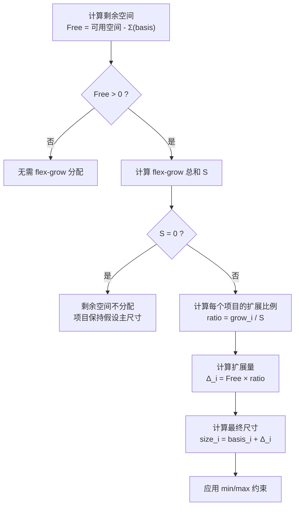
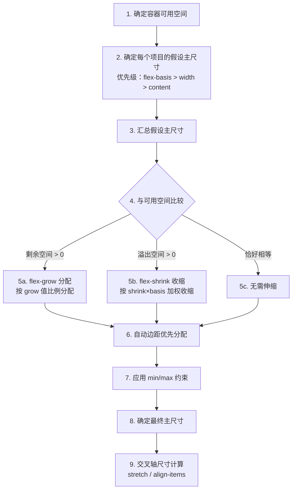

# Flex 计算原理

> 揭开 Flex 布局的计算黑盒：从 flex-basis 的确定到 grow/shrink 的空间分配，用数学推演还原浏览器每一步的尺寸决策。

## Flex 计算概述

Flex 布局的核心计算问题是：**在容器主轴尺寸确定的前提下，如何将可用空间分配给各个 Flex 项目？** 浏览器遵循 W3C CSS Flexbox 规范定义的算法，按固定步骤依次计算每个项目的最终尺寸。整个过程可以概括为三个阶段：

1. **确定基准尺寸** — 每个 Flex 项目根据 `flex-basis`、`width`/`height`、内容尺寸的优先级链，得出假设主尺寸（Hypothetical Main Size）
2. **分配空间** — 将所有假设主尺寸求和，与容器可用空间比较：有剩余则按 `flex-grow` 扩展，有不足则按 `flex-shrink` 收缩
3. **应用约束** — 受 `min-width`/`max-width` 等约束修正后，得到最终主尺寸

理解这套算法的意义在于：当布局结果与预期不符时，你能精确定位问题出在哪一步，而非盲目调参。

## flex-basis 的确定

`flex-basis` 是 Flex 项目参与空间分配的起点，它定义了项目在伸缩计算之前的初始主轴尺寸。确定 `flex-basis` 的优先级链如下：

```
flex-basis（非 auto） > width / inline-size > 内容尺寸（max-content）
```

具体规则：

| `flex-basis` 值 | `width` 值 | 假设主尺寸 | 说明 |
|:---|:---|:---|:---|
| `200px` | `100px` | **200px** | `flex-basis` 优先，忽略 `width` |
| `auto` | `100px` | **100px** | `auto` 回退到 `width` |
| `auto` | `auto` | **max-content** | 均为 `auto` 时使用内容最大宽度 |
| `0` | `100px` | **0** | `flex-basis: 0` 忽略 `width` |
| `content` | `100px` | **max-content** | `content` 始终使用内容尺寸，忽略 `width` |

需要特别注意：`flex-basis: auto` 并非"无基准"，而是回退到 `width`/`height`；`flex-basis: 0` 才是真正的"零基准"，让项目完全依赖 `flex-grow` 分配空间。这一差异是 `flex: 1` 与 `flex: auto` 行为不同的根源。

## flex-grow 分配算法

当所有 Flex 项目的假设主尺寸之和**小于**容器可用空间时，产生剩余空间（Free Space），由 `flex-grow` 按比例分配。

### 剩余空间计算

```
剩余空间 = 容器可用空间 - Σ(所有项目的假设主尺寸)
```

其中容器可用空间的计算方式：

```
容器可用空间 = 容器主轴尺寸
             - 容器主轴方向 padding（两侧之和）
             - 容器主轴方向 border-width（两侧之和）
             - gap × (项目数 - 1)
             - Σ(所有项目主轴方向 margin)
```

### 按比例分配

```
项目扩展量 = 剩余空间 × (当前项目 flex-grow / Σ(所有项目 flex-grow))
```

### 比例归一化

当所有项目的 `flex-grow` 之和大于 1 时，各项目的扩展比例自动归一化——每个项目实际分到的比例就是 `flex-grow / 总和`，无需额外处理。当 `flex-grow` 之和小于 1 时，规范规定只分配 `剩余空间 × 总和` 的部分，剩余空间不被完全分配。

### 不会产生负值（最小尺寸保护）

`flex-grow` 的计算天然不会产生负值：剩余空间 ≥ 0，`flex-grow` ≥ 0，因此扩展量 ≥ 0，最终尺寸 = 假设主尺寸 + 扩展量 ≥ 假设主尺寸。即使 `flex-grow` 之和为 0，也只是不分配剩余空间，不会出现负值。

### flex-grow 分配算法流程



### 数值推演：基础扩展

```css
.container { display: flex; width: 600px; }
.item-a { flex-basis: 100px; flex-grow: 1; }
.item-b { flex-basis: 100px; flex-grow: 2; }
.item-c { flex-basis: 100px; flex-grow: 1; }
```

逐步计算：

```
1. 可用空间 = 600px
2. Σ(basis) = 100 + 100 + 100 = 300px
3. 剩余空间 = 600 - 300 = 300px
4. flex-grow 总和 S = 1 + 2 + 1 = 4

5. 扩展比例与扩展量：
   item-a: ratio = 1/4,  Δ = 300 × 1/4 = 75px
   item-b: ratio = 2/4,  Δ = 300 × 2/4 = 150px
   item-c: ratio = 1/4,  Δ = 300 × 1/4 = 75px

6. 最终尺寸：
   item-a = 100 + 75 = 175px
   item-b = 100 + 150 = 250px
   item-c = 100 + 75 = 175px

验证：175 + 250 + 175 = 600px ✓
```

### 数值推演：flex-basis 为 0 的严格等分

```css
.container { display: flex; width: 600px; }
.item-a { flex-basis: 0; flex-grow: 1; }
.item-b { flex-basis: 0; flex-grow: 1; }
.item-c { flex-basis: 0; flex-grow: 1; }
```

逐步计算：

```
1. 可用空间 = 600px
2. Σ(basis) = 0 + 0 + 0 = 0px
3. 剩余空间 = 600 - 0 = 600px
4. flex-grow 总和 S = 1 + 1 + 1 = 3

5. 扩展量：
   item-a = 600 × 1/3 = 200px
   item-b = 600 × 1/3 = 200px
   item-c = 600 × 1/3 = 200px

6. 最终尺寸：
   item-a = 0 + 200 = 200px
   item-b = 0 + 200 = 200px
   item-c = 0 + 200 = 200px

验证：200 + 200 + 200 = 600px ✓
```

关键结论：`flex-basis: 0` 让所有项目从同一起跑线出发，配合相同的 `flex-grow` 实现严格等分。

## flex-shrink 收缩算法

当所有 Flex 项目的假设主尺寸之和**大于**容器可用空间时，产生溢出空间，由 `flex-shrink` 按加权比例收缩。

### 溢出空间计算

```
溢出空间 = Σ(所有项目的假设主尺寸) - 容器可用空间
```

### 加权收缩（考虑 flex-shrink × flex-basis）

与 `flex-grow` 的简单比例分配不同，`flex-shrink` 采用**加权收缩**，权重为 `flex-shrink × flex-basis`：

```
缩放基准_i = flex-shrink_i × flex-basis_i

缩放基准总和 = Σ(所有项目的缩放基准)

项目收缩量 = 溢出空间 × (缩放基准_i / 缩放基准总和)

项目最终尺寸 = flex-basis_i - 项目收缩量
```

### 与 flex-grow 的不对称性

`flex-grow` 和 `flex-shrink` 的计算方式存在根本性不对称：

| 对比维度 | flex-grow | flex-shrink |
|:---|:---|:---|
| 分配权重 | `flex-grow` 值本身 | `flex-shrink × flex-basis`（加权） |
| 是否考虑 basis | 不考虑 | 考虑（basis 越大收缩越多） |
| 设计意图 | 按比例分享剩余空间 | 大项目承担更多收缩责任 |
| 结果倾向 | 值大的项目获得更多空间 | basis 大的项目让出更多空间 |

这种不对称性是合理的：如果收缩不考虑 `flex-basis`，一个 100px 的项目和一个 500px 的项目按相同比例收缩，小项目可能被压缩到 0 甚至负值，而大项目仍有大量空间。加权机制确保收缩更"公平"。

### min-width 对收缩的影响

Flex 项目默认 `min-width: auto`，这意味着项目**不会缩小到内容的最小宽度以下**。当 `flex-shrink` 计算出的收缩量会导致项目低于其最小内容宽度时，浏览器会：

1. 将该项目固定为最小内容宽度
2. 将该项目从收缩计算中移除
3. 重新计算剩余项目的收缩量

这一保护机制可能导致其他项目被迫承担更多收缩，甚至出现溢出。

### 数值推演：等 basis 等比例收缩

```css
.container { display: flex; width: 300px; }
.item-a { flex-basis: 200px; flex-shrink: 1; }
.item-b { flex-basis: 200px; flex-shrink: 1; }
.item-c { flex-basis: 200px; flex-shrink: 1; }
```

逐步计算：

```
1. 可用空间 = 300px
2. Σ(basis) = 200 + 200 + 200 = 600px
3. 溢出空间 = 600 - 300 = 300px

4. 缩放基准：
   item-a = 1 × 200 = 200
   item-b = 1 × 200 = 200
   item-c = 1 × 200 = 200
   缩放基准总和 = 600

5. 收缩比例与收缩量：
   item-a: ratio = 200/600 = 1/3,  收缩 = 300 × 1/3 = 100px
   item-b: ratio = 200/600 = 1/3,  收缩 = 300 × 1/3 = 100px
   item-c: ratio = 200/600 = 1/3,  收缩 = 300 × 1/3 = 100px

6. 最终尺寸：
   item-a = 200 - 100 = 100px
   item-b = 200 - 100 = 100px
   item-c = 200 - 100 = 100px

验证：100 + 100 + 100 = 300px ✓
```

### 数值推演：不同 basis 的加权收缩

```css
.container { display: flex; width: 300px; }
.item-a { flex-basis: 200px; flex-shrink: 1; }
.item-b { flex-basis: 400px; flex-shrink: 1; }
```

逐步计算：

```
1. 可用空间 = 300px
2. Σ(basis) = 200 + 400 = 600px
3. 溢出空间 = 600 - 300 = 300px

4. 缩放基准：
   item-a = 1 × 200 = 200
   item-b = 1 × 400 = 400
   缩放基准总和 = 600

5. 收缩比例与收缩量：
   item-a: ratio = 200/600 = 1/3,  收缩 = 300 × 1/3 = 100px
   item-b: ratio = 400/600 = 2/3,  收缩 = 300 × 2/3 = 200px

6. 最终尺寸：
   item-a = 200 - 100 = 100px
   item-b = 400 - 200 = 200px

验证：100 + 200 = 300px ✓
```

关键观察：虽然两个项目的 `flex-shrink` 相同，但 `item-b` 的 `flex-basis` 更大，因此缩放基准更大，承担了更多收缩（200px vs 100px）。这正是加权收缩的体现。

### 数值推演：不同 flex-shrink 值

```css
.container { display: flex; width: 300px; }
.item-a { flex-basis: 200px; flex-shrink: 1; }
.item-b { flex-basis: 200px; flex-shrink: 3; }
```

逐步计算：

```
1. 可用空间 = 300px
2. Σ(basis) = 200 + 200 = 400px
3. 溢出空间 = 400 - 300 = 100px

4. 缩放基准：
   item-a = 1 × 200 = 200
   item-b = 3 × 200 = 600
   缩放基准总和 = 800

5. 收缩比例与收缩量：
   item-a: ratio = 200/800 = 1/4,  收缩 = 100 × 1/4 = 25px
   item-b: ratio = 600/800 = 3/4,  收缩 = 100 × 3/4 = 75px

6. 最终尺寸：
   item-a = 200 - 25 = 175px
   item-b = 200 - 75 = 125px

验证：175 + 125 = 300px ✓
```

## flex 简写的计算映射

`flex` 是 `flex-grow`、`flex-shrink`、`flex-basis` 三者的简写，不同简写值会展开为不同的计算参数，直接影响布局结果。

### 完整映射表

| 简写 | 展开值 | flex-grow | flex-shrink | flex-basis | 行为特征 |
|:---|:---|:---|:---|:---|:---|
| `flex: initial` | `0 1 auto` | 0 | 1 | auto | 不扩展，可收缩，基于内容 |
| `flex: auto` | `1 1 auto` | 1 | 1 | auto | 可扩展可收缩，基于内容 |
| `flex: none` | `0 0 auto` | 0 | 0 | auto | 完全不伸缩，固定于内容尺寸 |
| `flex: 1` | `1 1 0%` | 1 | 1 | 0% | 可扩展可收缩，初始为零 |
| `flex: 2` | `2 1 0%` | 2 | 1 | 0% | 占 2 份空间 |
| `flex: 1 0 300px` | — | 1 | 0 | 300px | 最小 300px，可扩展不收缩 |

### flex: auto → flex: 1 1 auto

`flex: auto` 展开为 `flex-grow: 1; flex-shrink: 1; flex-basis: auto`。项目先根据 `width` 或内容确定基准尺寸，然后参与剩余空间的扩展分配。内容多的项目基准更大，扩展后仍然更大。

### flex: none → flex: 0 0 auto

`flex: none` 展开为 `flex-grow: 0; flex-shrink: 0; flex-basis: auto`。项目既不扩展也不收缩，始终保持其内容尺寸或 `width` 指定的尺寸。适用于固定宽度的侧边栏、图标等元素。

### flex: 1 → flex: 1 1 0%

这是最关键的映射：`flex: 1` 的 `flex-basis` 是 `0%` 而非 `auto`。这意味着所有项目的假设主尺寸从 0 开始，剩余空间等于整个容器可用空间，然后完全按 `flex-grow` 比例分配。当所有项目 `flex: 1` 时，实现严格等分。

### flex: 0 0 auto 的特殊行为

`flex: 0 0 auto` 等价于 `flex: none`，项目完全拒绝参与伸缩。即使容器空间不足，项目也不会收缩，可能导致溢出。这种"刚性"行为在需要固定尺寸元素时很有用，但需要确保容器有足够空间或搭配 `overflow` 处理溢出。

### flex: 1 与 flex: auto 的核心区别

| 对比维度 | `flex: 1`（basis: 0%） | `flex: auto`（basis: auto） |
|:---|:---|:---|
| 基准尺寸 | 0 | 内容宽度或 width |
| 剩余空间 | ≈ 容器全部可用空间 | 容器可用空间 - 内容宽度之和 |
| 分配结果 | 严格按 grow 比例 | 内容多的项目更大 |
| 适用场景 | 等分布局 | 内容自适应布局 |

## 自动边距的计算优先级

`margin: auto` 在 Flex 布局中具有特殊地位：**自动边距的分配优先级高于 flex-grow**。

计算顺序：

1. 先计算剩余空间
2. 如果某个项目在主轴方向有 `margin: auto`，则先从剩余空间中分配给自动边距
3. 分配完自动边距后，剩余的空间才按 `flex-grow` 分配

这意味着：

- 当剩余空间充足时，`margin: auto` 会占据对应方向的全部剩余空间，实现居中或偏移效果
- 当剩余空间不足时，`margin: auto` 计算为 0，退回普通边距行为
- `margin: auto` 可以让单个项目脱离 `flex-grow` 的比例分配，独立定位

```css
.container { display: flex; width: 600px; }
.item-a { flex-basis: 100px; flex-grow: 1; }
.item-b { flex-basis: 100px; margin-left: auto; }  /* 自动边距优先 */

/* 计算过程：
   剩余空间 = 600 - 100 - 100 = 400px
   item-b 的 margin-left: auto 先取走 400px
   item-a 的 flex-grow: 1 无剩余空间可分配
   结果：item-a 在左侧 100px，item-b 在最右侧 100px
*/
```

## 交叉轴尺寸计算

Flex 布局不仅有主轴的空间分配，还有交叉轴的尺寸计算。当 `align-items: stretch`（默认值）时，Flex 项目会在交叉轴方向拉伸以填满容器。

### align-items: stretch 的计算逻辑

1. 计算容器的交叉轴可用空间：容器交叉轴尺寸减去 padding 和 border
2. 对于每个 `align-self: stretch` 的项目：
   - 如果项目没有显式设置交叉轴尺寸（`height` 在行方向 Flex 中，`width` 在列方向 Flex 中），则其交叉轴尺寸 = 容器交叉轴可用空间 - 项目交叉轴 margin
   - 如果项目显式设置了交叉轴尺寸，则 `stretch` 不生效，项目保持设定尺寸

```css
.container {
  display: flex;           /* 主轴为水平方向 */
  height: 300px;           /* 交叉轴（垂直）尺寸 */
  padding: 20px 0;         /* 上下各 20px */
}

.item-a {
  /* 未设置 height，stretch 生效 */
  /* 交叉轴尺寸 = 300 - 40（容器 padding） - 0（自身 margin）= 260px */
}

.item-b {
  height: 100px;           /* 显式设置，stretch 不生效 */
  /* 交叉轴尺寸 = 100px */
}
```

需要注意：`stretch` 不会覆盖显式的 `width`/`height`，也不会让项目的交叉轴尺寸超过 `max-height`/`max-width` 的约束。

## 常见计算陷阱

### flex-basis: 0 vs auto

这是最常见的 Flex 布局困惑来源。`flex-basis: 0` 让项目从零开始参与分配，`flex-basis: auto` 让项目先保留内容宽度再分配剩余空间。

```css
/* 陷阱：以为 flex: 1 能等分，但内容差异导致不等宽 */
.container { display: flex; width: 600px; }
.item-a { flex: 1; }  /* 内容："短" */
.item-b { flex: 1; }  /* 内容："这是一段很长的文本内容" */

/* 实际上 flex: 1 的 basis 是 0%，所以确实等分 */
/* 但 min-width: auto 可能阻止项目缩小到内容宽度以下！ */
```

### min-width: auto 的隐式影响

Flex 项目默认 `min-width: auto`，等价于 `min-content`（内容最小宽度）。这意味着：

- 即使 `flex-shrink` 计算出的收缩量很大，项目也不会缩小到内容最小宽度以下
- 长文本、长单词、固定宽度的子元素都可能撑大项目
- 这是最常见的"Flex 布局溢出"原因

```css
/* 问题：长文本导致项目无法收缩，容器溢出 */
.container { display: flex; width: 200px; }
.item { flex: 1; }
/* 如果某个 item 包含长英文单词，min-width: auto 阻止收缩 */

/* 解决：显式设置 min-width: 0 */
.item {
  flex: 1;
  min-width: 0;           /* 解除最小尺寸保护 */
  overflow: hidden;        /* 配合文本截断 */
  text-overflow: ellipsis;
  white-space: nowrap;
}
```

### 嵌套 Flex 的尺寸传递

当 Flex 项目本身也是 Flex 容器时，尺寸计算会变得复杂：

1. **内层容器的尺寸由外层计算决定**：内层 Flex 容器作为外层的项目，其主轴尺寸由外层的 flex-grow/shrink 计算
2. **内层项目的尺寸依赖内层容器**：内层容器尺寸确定后，内层项目才能开始自己的 flex 计算
3. **内容驱动的循环依赖**：如果外层项目 `flex-basis: auto`，其尺寸依赖内容（即内层容器），而内层容器又可能依赖外层项目的尺寸

```css
/* 嵌套 Flex 的典型问题 */
.outer { display: flex; width: 600px; }
.outer-item {
  flex: 1;
  display: flex;          /* 内层也是 Flex 容器 */
  flex-direction: column;
  /* 外层先计算 outer-item 宽度 = 200px */
  /* 内层再在 200px 内分配空间 */
}

/* 潜在问题：如果内层项目有 min-width: auto，
   可能撑大外层项目，破坏等分布局 */
```

## 代码示例

### 示例 1：flex-grow 分配完整演示

```html
<!DOCTYPE html>
<html lang="zh-CN">
<head>
<meta charset="UTF-8">
<title>flex-grow 分配演示</title>
<style>
  /* 容器：600px 宽，无 padding/border/gap */
  .container {
    display: flex;
    width: 600px;
    border: 2px solid #333;
    margin-bottom: 10px;
    font-family: monospace;
  }
  .item {
    padding: 16px 0;
    text-align: center;
    color: #fff;
  }
  /* 三个项目：basis 各 100px，grow 分别为 1、2、1 */
  .item-a { flex-basis: 100px; flex-grow: 1; background: #1976d2; }
  .item-b { flex-basis: 100px; flex-grow: 2; background: #388e3c; }
  .item-c { flex-basis: 100px; flex-grow: 1; background: #d32f2f; }

  /*
   * 计算过程：
   * 剩余空间 = 600 - 300 = 300px
   * grow 总和 = 4
   * item-a: 100 + 300×1/4 = 175px
   * item-b: 100 + 300×2/4 = 250px
   * item-c: 100 + 300×1/4 = 175px
   */
</style>
</head>
<body>
  <h3>flex-grow 分配（容器 600px）</h3>
  <div class="container">
    <div class="item item-a">A: 175px</div>
    <div class="item item-b">B: 250px</div>
    <div class="item item-c">C: 175px</div>
  </div>
</body>
</html>
```

### 示例 2：flex-shrink 加权收缩演示

```html
<!DOCTYPE html>
<html lang="zh-CN">
<head>
<meta charset="UTF-8">
<title>flex-shrink 加权收缩演示</title>
<style>
  /* 容器：300px 宽，项目总 basis 600px，溢出 300px */
  .container {
    display: flex;
    width: 300px;
    border: 2px solid #333;
    margin-bottom: 10px;
    font-family: monospace;
  }
  .item {
    padding: 16px 0;
    text-align: center;
    color: #fff;
  }
  /* 两个项目：basis 分别 200px 和 400px，shrink 均为 1 */
  .item-a { flex-basis: 200px; flex-shrink: 1; background: #1976d2; }
  .item-b { flex-basis: 400px; flex-shrink: 1; background: #388e3c; }

  /*
   * 计算过程：
   * 溢出空间 = 600 - 300 = 300px
   * 缩放基准：A = 1×200 = 200, B = 1×400 = 400, 总和 = 600
   * item-a 收缩 = 300 × 200/600 = 100px → 最终 100px
   * item-b 收缩 = 300 × 400/600 = 200px → 最终 200px
   */
</style>
</head>
<body>
  <h3>flex-shrink 加权收缩（容器 300px）</h3>
  <div class="container">
    <div class="item item-a">A: 100px</div>
    <div class="item item-b">B: 200px</div>
  </div>
</body>
</html>
```

### 示例 3：flex: 1 vs flex: auto 与 min-width 陷阱

```html
<!DOCTYPE html>
<html lang="zh-CN">
<head>
<meta charset="UTF-8">
<title>flex: 1 vs flex: auto 与 min-width 陷阱</title>
<style>
  .container {
    display: flex;
    width: 600px;
    border: 2px solid #333;
    margin-bottom: 10px;
    font-family: monospace;
  }
  .item {
    padding: 12px 8px;
    text-align: center;
    overflow: hidden;
    text-overflow: ellipsis;
    white-space: nowrap;
  }

  /* 第一行：flex: 1（basis: 0%），严格等分 */
  .row-1 .item {
    flex: 1;
    min-width: 0;           /* 解除 min-width: auto 约束 */
    background: #1976d2;
    color: #fff;
  }
  /*
   * 计算过程：
   * basis 均为 0，剩余空间 = 600px
   * grow 总和 = 3，每个项目 = 600 × 1/3 = 200px
   */

  /* 第二行：flex: auto（basis: auto），内容感知 */
  .row-2 .item {
    flex: auto;
    background: #388e3c;
    color: #fff;
  }
  /*
   * 计算过程：
   * basis = 内容宽度，假设分别为 50px、300px、100px
   * 剩余空间 = 600 - 450 = 150px
   * grow 总和 = 3
   * item-a: 50 + 150×1/3 = 100px
   * item-b: 300 + 150×1/3 = 350px
   * item-c: 100 + 150×1/3 = 150px
   */

  /* 第三行：flex: 1 但未设 min-width: 0，长文本溢出 */
  .row-3 .item {
    flex: 1;
    /* 缺少 min-width: 0，长文本项目拒绝缩小 */
    background: #d32f2f;
    color: #fff;
  }
</style>
</head>
<body>
  <h3>flex: 1 + min-width: 0 — 严格等分</h3>
  <div class="container row-1">
    <div class="item">短文本</div>
    <div class="item">这是一段很长的文本内容</div>
    <div class="item">中等</div>
  </div>

  <h3>flex: auto — 内容感知分配</h3>
  <div class="container row-2">
    <div class="item">短文本</div>
    <div class="item">这是一段很长的文本内容</div>
    <div class="item">中等</div>
  </div>

  <h3>flex: 1 但未设 min-width: 0 — 可能溢出</h3>
  <div class="container row-3">
    <div class="item">短文本</div>
    <div class="item">Superlongwordwithoutanyspaces</div>
    <div class="item">中等</div>
  </div>
</body>
</html>
```

## 最佳实践

1. **需要等分时使用 `flex: 1` + `min-width: 0`**：`flex: 1` 确保 basis 为 0，`min-width: 0` 解除内容最小宽度约束，二者配合才能实现真正的等宽布局。

2. **固定宽度元素使用 `flex: none`**：侧边栏、图标等不应参与伸缩的元素，使用 `flex: none` 配合显式 `width`，语义清晰且安全。

3. **弹性最小宽度使用 `flex: 1 0 Npx`**：需要"最小 N 像素，有空间可扩展"的卡片布局，`flex: 1 0 300px` 是最直观的写法。

4. **处理文本溢出三件套**：`min-width: 0` + `overflow: hidden` + `text-overflow: ellipsis`，缺一不可。

5. **使用 `box-sizing: border-box`**：确保 padding 包含在 flex 分配的尺寸内，避免计算偏差。

6. **嵌套 Flex 时注意尺寸传递**：外层项目设 `min-width: 0`，防止内层内容撑大外层项目。

## 常见问题

### Q1：为什么 flex: 1 没有实现等宽？

可能原因有三个：（1）`min-width: auto` 阻止了长内容项目缩小——添加 `min-width: 0`；（2）项目有不对称的 padding 或 border——使用 `box-sizing: border-box`；（3）项目内有固定宽度的子元素——确保子元素不会撑大父项目。

### Q2：flex-shrink 为什么不按比例收缩？

因为 `flex-shrink` 的收缩是加权的，权重为 `flex-shrink × flex-basis`。`flex-basis` 越大的项目承担更多收缩责任。如果需要"按比例"收缩（不考虑 basis），可以手动调整 `flex-shrink` 值来补偿 basis 的差异。

### Q3：flex-basis 和 width 同时设置会怎样？

`flex-basis` 优先级高于 `width`。只有当 `flex-basis: auto` 时，才会回退到 `width`。`flex-basis: 0` 会完全忽略 `width`。

### Q4：margin: auto 为什么能居中？

在 Flex 容器中，`margin: auto` 的分配优先级高于 `flex-grow`。自动边距会先占据剩余空间，将项目推到容器的另一侧，从而实现居中或偏移效果。

### Q5：嵌套 Flex 布局溢出怎么办？

外层 Flex 项目默认 `min-width: auto`，内层内容可能撑大外层项目。解决方案：给外层项目添加 `min-width: 0`，并确保内层内容有合理的溢出处理。

## 总结

Flex 布局的计算原理可以归纳为一条清晰的链路：



掌握这套算法的关键在于理解三个核心不对称：

- **flex-basis: 0 vs auto** — 决定是从零开始分配还是先保留内容宽度
- **flex-grow vs flex-shrink** — 扩展按简单比例，收缩按加权比例
- **min-width: auto 的隐式保护** — 可能阻止收缩，导致布局溢出

理解了这些计算细节，你就能在面对任何 Flex 布局异常时，快速定位问题所在并给出精确的修复方案。

## 参考资料

- [W3C CSS Flexible Box Layout Module Level 1 — Flex Layout Algorithm](https://www.w3.org/TR/css-flexbox-1/#layout-algorithm)
- [MDN: CSS Flexible Box Layout](https://developer.mozilla.org/zh-CN/docs/Web/CSS/CSS_Flexible_Box_Layout)
- [CSS-Tricks: A Complete Guide to Flexbox](https://css-tricks.com/snippets/css/a-guide-to-flexbox/)
- [W3C CSS Intrinsic & Extrinsic Sizing Module Level 3](https://www.w3.org/TR/css-sizing-3/)
