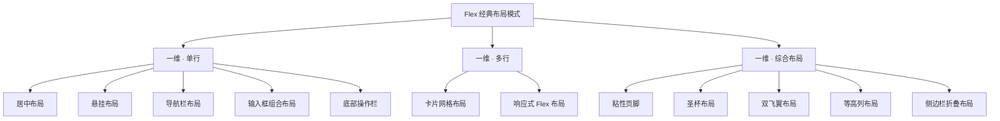

# Flex 经典布局

> 掌握 Flexbox 在真实项目中最常用的 12 种布局模式，从居中对齐到复杂的三栏自适应，用最少的代码解决最经典的布局问题。

在掌握了 Flex 属性体系与计算原理之后，真正的挑战在于：面对一个具体的布局需求，能否迅速选择正确的 Flex 属性组合？本文将 12 种反复出现在实际项目中的经典布局逐一拆解，每种模式均给出完整的可运行代码、布局原理分析以及方案对比，帮助你建立从需求到代码的直觉映射。



## 居中布局

水平垂直居中是 CSS 中出现频率最高的需求之一，Flex 提供了多种实现路径，理解它们之间的差异是选型的关键。

### 方案一：justify-content + align-items

最直观的方案，通过容器属性同时控制主轴与交叉轴的对齐方式。适用于单元素或多元素居中，多元素会在两个方向上聚拢排列。

```html
<div class="center-justify-align">
  <div class="box">居中内容</div>
</div>
```

```css
.center-justify-align {
  display: flex;
  justify-content: center; /* 主轴居中 */
  align-items: center;     /* 交叉轴居中 */
  height: 300px;
  border: 2px dashed #ccc;
}

.box {
  padding: 20px 40px;
  background: #e3f2fd;
}
```

**布局分析**：`justify-content: center` 将项目组移至主轴中央，`align-items: center` 将每个项目在交叉轴上居中。两者配合实现完美居中，且不依赖项目尺寸。

### 方案二：margin: auto

利用 Flex 容器中自动边距会吸收剩余空间的特性，将项目四个方向的 margin 设为 auto，浏览器自动分配空间实现居中。

```html
<div class="center-margin">
  <div class="box">居中内容</div>
</div>
```

```css
.center-margin {
  display: flex;
  height: 300px;
  border: 2px dashed #ccc;
}

.center-margin .box {
  margin: auto; /* 四个方向自动边距，吸收全部剩余空间 */
  padding: 20px 40px;
  background: #e3f2fd;
}
```

**布局分析**：在 Flex 上下文中，`margin: auto` 的计算优先级高于 `justify-content` 和 `align-items`。当自动边距存在时，容器对齐属性不再生效——剩余空间全部被 auto margin 占据。此方案适合单元素居中；多元素设置 `margin: auto` 时，剩余空间会被所有 auto 边距均分，元素会像 `space-around` 一样分散排列，而非聚拢居中。

### 方案三：place-content + align-items

`place-content` 是 `align-content` 和 `justify-content` 的简写。由于单行 Flex 容器中 `align-content` 不生效，必须配合 `align-items` 控制交叉轴。

```html
<div class="center-place">
  <div class="box">居中内容</div>
</div>
```

```css
.center-place {
  display: flex;
  place-content: center; /* align-content + justify-content 简写 */
  align-items: center;   /* 单行时 align-content 无效，需 align-items */
  height: 300px;
  border: 2px dashed #ccc;
}

.center-place .box {
  padding: 20px 40px;
  background: #e3f2fd;
}
```

**布局分析**：`place-content: center` 等价于 `align-content: center; justify-content: center`。但单行容器中 `align-content` 被忽略，交叉轴居中仍依赖 `align-items`。此方案语义最简洁，但兼容性略低（IE 不支持 `place-content`）。

### 方案对比

| 方案 | 核心属性 | 多元素支持 | IE 兼容 | 适用场景 |
|------|---------|-----------|---------|---------|
| justify + align | `justify-content` + `align-items` | ✅ 聚拢排列 | ✅ | 通用首选 |
| margin: auto | `margin: auto` | ❌ 会分散排列 | ✅ | 单元素居中 |
| place-content | `place-content` + `align-items` | ✅ 聚拢排列 | ❌ | 现代项目简写 |

## 粘性页脚

页面内容不足一屏时，页脚始终贴在视口底部；内容超出一屏时，页脚自然跟随内容。这是几乎所有 Web 应用的基础布局需求。

```html
<body class="sticky-footer">
  <header class="site-header">网站头部</header>
  <main class="site-main">
    <p>页面主体内容</p>
  </main>
  <footer class="site-footer">网站页脚</footer>
</body>
```

```css
.sticky-footer {
  display: flex;
  flex-direction: column; /* 纵向排列 */
  min-height: 100vh;      /* 至少占满视口高度 */
  margin: 0;
}

.site-header {
  flex: none; /* 固定高度，不参与伸缩 */
  padding: 16px 24px;
  background: #1976d2;
  color: #fff;
}

.site-main {
  flex: 1; /* 占据全部剩余空间，将页脚推到底部 */
  padding: 24px;
}

.site-footer {
  flex: none; /* 固定高度，不参与伸缩 */
  padding: 12px 24px;
  background: #f5f5f5;
  text-align: center;
}
```

**布局分析**：核心机制是 `flex: 1` 与 `min-height: 100vh` 的配合。容器至少占满视口，`main` 的 `flex: 1` 使其扩展填充 header 和 footer 之外的剩余空间。当内容不足一屏时，main 被拉高，footer 贴底；当内容超出一屏时，容器自然增高，footer 在内容下方。

**注意事项**：`min-height: 100vh` 而非 `height: 100vh`，后者在内容超出一屏时会导致溢出而非自然增长。

## 圣杯布局

圣杯布局（Holy Grail Layout）是 CSS 布局领域的经典难题：三栏布局，左右固定宽度，中间自适应，且中间栏在 DOM 中优先渲染以提升首屏性能。

```html
<div class="holy-grail">
  <main class="holy-main">主内容区</main>
  <nav class="holy-nav">左侧导航</nav>
  <aside class="holy-aside">右侧边栏</aside>
</div>
```

```css
.holy-grail {
  display: flex;
  min-height: 100vh;
}

.holy-main {
  flex: 1;        /* 自适应剩余空间 */
  order: 2;       /* 视觉上居中 */
  min-width: 0;   /* 允许缩小，防止内容溢出 */
  padding: 24px;
  background: #fff;
}

.holy-nav {
  flex: 0 0 200px; /* 固定 200px，不伸缩 */
  order: 1;        /* 视觉上在左 */
  padding: 24px 16px;
  background: #e3f2fd;
}

.holy-aside {
  flex: 0 0 150px; /* 固定 150px，不伸缩 */
  order: 3;        /* 视觉上在右 */
  padding: 24px 16px;
  background: #fce4ec;
}

/* 响应式：小屏幕变为纵向堆叠 */
@media (max-width: 768px) {
  .holy-grail {
    flex-direction: column;
  }
  .holy-nav,
  .holy-aside {
    flex: none;
    width: auto;
  }
}
```

**布局分析**：`order` 属性将 DOM 顺序与视觉顺序解耦——main 在 DOM 中排在最前，搜索引擎和屏幕阅读器优先获取核心内容，而视觉上通过 `order` 重排为"左-中-右"。`flex: 0 0 200px` 让侧栏固定宽度不参与伸缩，`flex: 1` 让 main 占据剩余空间。`min-width: 0` 是关键——Flex 项目默认 `min-width: auto`，不会缩小到内容最小宽度以下，不加此声明长文本会导致溢出。

## 双飞翼布局

双飞翼布局与圣杯布局的目标相同，但实现思路不同：中间栏不使用 `padding` 或 `order`，而是在内部嵌套一个内容容器，通过 `margin` 为侧栏留出空间。

```html
<div class="double-wing">
  <div class="dw-center">
    <div class="dw-content">主内容区</div>
  </div>
  <div class="dw-left">左侧导航</div>
  <div class="dw-right">右侧边栏</div>
</div>
```

```css
.double-wing {
  display: flex;
  min-height: 100vh;
}

.dw-center {
  flex: 1;        /* 占据全部空间 */
  min-width: 0;
}

.dw-content {
  /* 用 margin 为左右侧栏留出空间 */
  margin-left: 200px;
  margin-right: 150px;
  padding: 24px;
  background: #fff;
}

.dw-left {
  flex: 0 0 200px;
  margin-left: -200px; /* 负边距让侧栏与中间栏重叠 */
  padding: 24px 16px;
  background: #e3f2fd;
}

.dw-right {
  flex: 0 0 150px;
  margin-right: -150px;
  padding: 24px 16px;
  background: #fce4ec;
}
```

**与圣杯布局的核心区别**：圣杯布局通过 `order` 重排视觉顺序，中间栏使用 `padding` 留出空间；双飞翼布局中间栏不设 `padding`，而是嵌套子容器用 `margin` 留出空间，侧栏通过负 margin 与中间栏重叠。在 Flex 语境下，圣杯布局更简洁直观，双飞翼布局的优势在于中间栏背景可以独立于侧栏控制——当中间栏需要独立背景色或边框时更灵活。

## 等高列布局

多列内容高度不一致时，传统方案需要 `padding-bottom` + `margin-bottom` 负值 Hack 或 JavaScript 计算。Flex 的 `align-items: stretch`（默认值）天然实现等高——所有项目自动拉伸至容器交叉轴最大高度。

```html
<div class="equal-height">
  <div class="eh-col">
    <h3>短内容</h3>
    <p>只有一行文字。</p>
  </div>
  <div class="eh-col">
    <h3>中等内容</h3>
    <p>这里有两行文字。<br/>第二行。</p>
  </div>
  <div class="eh-col">
    <h3>长内容</h3>
    <p>这里有三行文字。<br/>第二行。<br/>第三行。</p>
  </div>
</div>
```

```css
.equal-height {
  display: flex;
  gap: 20px;
}

.eh-col {
  flex: 1;                    /* 等宽分配 */
  padding: 24px;
  background: #f5f5f5;
  border: 1px solid #e0e0e0;
  /* align-items: stretch 是默认值，自动等高 */
}
```

**布局分析**：`align-items: stretch` 让每个项目在交叉轴（此处为纵向）方向拉伸至与最高项目齐平。配合 `flex: 1` 实现等宽等高。这是 Flex 最被低估的特性之一——在传统布局中需要大量 Hack 才能实现的效果，Flex 默认就做到了。

**注意**：如果项目显式设置了 `height` 或 `align-self` 非 `stretch` 值，等高效果会被覆盖。

## 悬挂布局

悬挂布局（Media Object）是图文混排的通用模式：图片固定宽度在左，文字自适应在右。常见于评论列表、消息卡片、商品条目等场景。

```html
<div class="media">
  
  <div class="media-body">
    <h3 class="media-title">用户名称</h3>
    <p class="media-text">这是一段评论内容，可能会很长需要截断显示。</p>
  </div>
</div>

<!-- 图片在右侧的变体 -->
<div class="media media--reverse">
  
  <div class="media-body">
    <h3 class="media-title">用户名称</h3>
    <p class="media-text">图片在右侧的变体。</p>
  </div>
</div>
```

```css
.media {
  display: flex;
  gap: 16px;
  align-items: flex-start; /* 顶部对齐，也可用 center 垂直居中 */
}

.media--reverse {
  flex-direction: row-reverse; /* 图片在右 */
}

.media-figure {
  flex: none;     /* 固定尺寸，不参与伸缩 */
  width: 64px;
  height: 64px;
  object-fit: cover;
  border-radius: 50%;
}

.media-body {
  flex: 1;        /* 占据剩余空间 */
  min-width: 0;   /* 允许缩小，配合文本截断 */
}

.media-title {
  margin: 0 0 4px;
  font-size: 16px;
}

.media-text {
  margin: 0;
  color: #666;
  overflow: hidden;
  text-overflow: ellipsis;
  white-space: nowrap; /* 单行截断，多行截断用 -webkit-line-clamp */
}
```

**布局分析**：`flex: none` 让图片保持原始尺寸不受 Flex 分配影响，`flex: 1` 让文字区域填满剩余空间。`min-width: 0` 是文本截断的前提——Flex 项目默认 `min-width: auto`，不会缩小到内容宽度以下，导致 `text-overflow: ellipsis` 失效。`flex-direction: row-reverse` 一行代码实现图片右置变体，无需修改 DOM 结构。

## 导航栏布局

导航栏是 Flex 最典型的应用场景之一，常见变体包括：左右分布、居中排列、响应式折叠。

```html
<nav class="navbar">
  <div class="navbar-brand">Logo</div>
  <ul class="navbar-links">
    <li><a href="#">首页</a></li>
    <li><a href="#">产品</a></li>
    <li><a href="#">关于</a></li>
  </ul>
  <div class="navbar-actions">
    <button>登录</button>
  </div>
</nav>
```

```css
.navbar {
  display: flex;
  align-items: center; /* 垂直居中 */
  gap: 24px;
  padding: 0 24px;
  height: 56px;
  background: #fff;
  border-bottom: 1px solid #e0e0e0;
}

.navbar-brand {
  flex: none;         /* Logo 固定宽度 */
  font-weight: 700;
  font-size: 20px;
}

.navbar-links {
  display: flex;
  gap: 8px;
  list-style: none;
  margin: 0;
  padding: 0;
  flex: 1;            /* 占据中间空间，将 actions 推到右侧 */
  justify-content: center; /* 链接居中排列 */
}

.navbar-links a {
  display: block;
  padding: 8px 16px;
  text-decoration: none;
  color: #333;
}

.navbar-actions {
  flex: none;         /* 操作区固定宽度 */
}

/* 变体：链接靠左，actions 靠右 */
.navbar--left .navbar-links {
  justify-content: flex-start;
}

/* 响应式：小屏幕链接隐藏 */
@media (max-width: 640px) {
  .navbar-links {
    display: none;
  }
}
```

**布局分析**：三段式结构——Brand（`flex: none`）、Links（`flex: 1`）、Actions（`flex: none`）。Links 的 `flex: 1` 是关键，它占据中间所有空间，将 Actions 自然推到右侧。Links 内部再嵌套一个 Flex 容器，通过 `justify-content` 控制链接的对齐方式。这种"嵌套 Flex"的模式在导航栏中非常常见。

## 卡片网格布局

卡片网格需要自动换行、等间距、等宽，是 `flex-wrap` + `gap` + `flex-basis` 的经典组合。

```html
<div class="card-grid">
  <div class="card">
    <div class="card-image"></div>
    <div class="card-body">
      <h3>卡片标题</h3>
      <p>卡片描述文字</p>
    </div>
  </div>
  <!-- 更多卡片... -->
</div>
```

```css
.card-grid {
  display: flex;
  flex-wrap: wrap;     /* 允许换行 */
  gap: 24px;           /* 统一行列间距 */
}

.card {
  /*
   * flex-basis: calc((100% - 48px) / 3)
   * 三列布局：总宽度减去 2 个 gap(24px×2=48px) 后三等分
   * flex-grow: 1  最后一行不足三张时自动扩展填满
   * flex-shrink: 1  允许收缩，实际下限由 min-width 兜底
   */
  flex: 1 1 calc((100% - 48px) / 3);
  min-width: 280px;    /* 最小宽度，低于此值自动换行 */
  background: #fff;
  border: 1px solid #e0e0e0;
  border-radius: 8px;
  overflow: hidden;
}

.card-image {
  height: 160px;
  background: linear-gradient(135deg, #e3f2fd, #bbdefb);
}

.card-body {
  padding: 16px;
}

.card-body h3 {
  margin: 0 0 8px;
}

.card-body p {
  margin: 0;
  color: #666;
}
```

**布局分析**：`flex-wrap: wrap` 让卡片在容器宽度不足时自动换行。`gap: 24px` 统一控制行列间距，无需为最后一个元素特殊处理 margin。`flex-basis` 精确计算三列宽度，`min-width: 280px` 作为兜底——当容器宽度不足以容纳三列时，卡片自动换为两列或一列，实现无媒体查询的响应式效果。

## 输入框组合布局

搜索框 + 按钮是典型的"固定 + 弹性"组合：输入框自适应宽度，按钮固定宽度，两者无缝拼接。

```html
<div class="input-group">
  <span class="input-prefix">🔍</span>
  <input class="input-field" type="text" placeholder="搜索关键词..." />
  <button class="input-btn">搜索</button>
</div>
```

```css
.input-group {
  display: flex;
  max-width: 500px;
}

.input-prefix {
  flex: none;            /* 固定宽度 */
  display: flex;
  align-items: center;
  justify-content: center;
  padding: 0 12px;
  background: #f5f5f5;
  border: 1px solid #ddd;
  border-right: none;
  border-radius: 4px 0 0 4px;
  color: #999;
}

.input-field {
  flex: 1;               /* 占据剩余空间 */
  min-width: 0;          /* 允许缩小 */
  padding: 8px 12px;
  border: 1px solid #ddd;
  border-radius: 0;      /* 中间无圆角 */
  outline: none;
  font-size: 14px;
}

.input-field:focus {
  border-color: #1976d2;
}

.input-btn {
  flex: none;            /* 固定宽度 */
  padding: 8px 24px;
  background: #1976d2;
  color: #fff;
  border: none;
  border-radius: 0 4px 4px 0;
  cursor: pointer;
  font-size: 14px;
  white-space: nowrap;
}

.input-btn:hover {
  background: #1565c0;
}
```

**布局分析**：三段式结构——前缀（`flex: none`）、输入框（`flex: 1`）、按钮（`flex: none`）。输入框的 `min-width: 0` 确保在容器变窄时能正常缩小。圆角的处理遵循"只有首尾有圆角"的原则，中间元素圆角设为 0，视觉上形成无缝拼接。这种模式同样适用于带单位后缀的输入框（如"元""kg"）。

## 侧边栏折叠布局

可收缩侧边栏是后台管理系统的标配。展开时侧栏固定宽度，折叠时仅保留图标宽度，主内容区始终自适应填满剩余空间。

```html
<div class="sidebar-layout">
  <aside class="sidebar" id="sidebar">
    <div class="sidebar-header">
      <span class="sidebar-title">菜单</span>
      <button class="sidebar-toggle" onclick="toggleSidebar()">☰</button>
    </div>
    <nav class="sidebar-nav">
      <a href="#" class="sidebar-item">📊 仪表盘</a>
      <a href="#" class="sidebar-item">👥 用户管理</a>
      <a href="#" class="sidebar-item">⚙️ 系统设置</a>
    </nav>
  </aside>
  <main class="sidebar-main">
    <h1>主内容区</h1>
    <p>侧边栏折叠时，此区域自动扩展。</p>
  </main>
</div>
```

```css
.sidebar-layout {
  display: flex;
  height: 100vh;
}

.sidebar {
  flex: none;            /* 不参与伸缩 */
  width: 240px;          /* 展开宽度 */
  background: #1a1a2e;
  color: #fff;
  transition: width 0.3s ease; /* 平滑过渡 */
  overflow: hidden;
}

/* 折叠状态 */
.sidebar.collapsed {
  width: 64px;           /* 仅保留图标宽度 */
}

.sidebar-header {
  display: flex;
  align-items: center;
  justify-content: space-between;
  padding: 16px;
}

.sidebar-title {
  white-space: nowrap;
  overflow: hidden;
}

.sidebar.collapsed .sidebar-title {
  opacity: 0;            /* 折叠时隐藏文字 */
}

.sidebar-toggle {
  background: none;
  border: none;
  color: #fff;
  cursor: pointer;
  font-size: 18px;
}

.sidebar-nav {
  display: flex;
  flex-direction: column;
  gap: 4px;
  padding: 8px;
}

.sidebar-item {
  display: flex;
  align-items: center;
  gap: 12px;
  padding: 10px 12px;
  color: #ccc;
  text-decoration: none;
  border-radius: 4px;
  white-space: nowrap;
  overflow: hidden;
}

.sidebar-item:hover {
  background: rgba(255, 255, 255, 0.1);
  color: #fff;
}

.sidebar-main {
  flex: 1;               /* 占据剩余空间 */
  padding: 24px;
  overflow-y: auto;
  background: #f5f5f5;
}
```

```javascript
function toggleSidebar() {
  document.getElementById('sidebar').classList.toggle('collapsed');
}
```

**布局分析**：侧栏 `flex: none` + 固定 `width`，主内容 `flex: 1`。折叠通过切换 `width` 值实现，`transition` 提供平滑动画。`overflow: hidden` 确保侧栏变窄时内容不溢出。主内容区无需任何额外处理——`flex: 1` 自动重新计算分配空间，这是 Flex 布局"弹性"的典型体现。

## 底部操作栏

移动端常见的底部固定操作栏：按钮组固定在视口底部，不随页面滚动，上方内容区可滚动。

```html
<div class="bottom-bar-layout">
  <main class="bottom-bar-main">
    <p>页面内容区域，可以滚动。</p>
  </main>
  <footer class="bottom-bar">
    <button class="btn btn--secondary">取消</button>
    <button class="btn btn--primary">确认提交</button>
  </footer>
</div>
```

```css
.bottom-bar-layout {
  display: flex;
  flex-direction: column; /* 纵向排列 */
  height: 100vh;          /* 占满视口 */
}

.bottom-bar-main {
  flex: 1;                /* 占据剩余空间 */
  overflow-y: auto;       /* 内容可滚动 */
  padding: 24px;
}

.bottom-bar {
  flex: none;             /* 固定高度 */
  display: flex;
  justify-content: flex-end; /* 按钮靠右 */
  gap: 12px;
  padding: 12px 24px;
  background: #fff;
  border-top: 1px solid #e0e0e0;
  box-shadow: 0 -2px 8px rgba(0, 0, 0, 0.06);
}

.btn {
  padding: 10px 24px;
  border: none;
  border-radius: 4px;
  cursor: pointer;
  font-size: 14px;
}

.btn--secondary {
  background: #f5f5f5;
  color: #333;
}

.btn--primary {
  background: #1976d2;
  color: #fff;
}

.btn--primary:hover {
  background: #1565c0;
}
```

**布局分析**：与粘性页脚结构相同，但场景不同——底部操作栏强调固定可见，按钮始终可操作。`flex: none` 保证操作栏不被压缩，`flex: 1` + `overflow-y: auto` 让主内容区可滚动。操作栏内部再用 Flex 控制按钮排列：`justify-content: flex-end` 让按钮靠右，`gap: 12px` 控制按钮间距。

## 响应式 Flex 布局

Flex 的 `flex-wrap` 天然支持无媒体查询的响应式，但结合媒体查询可以实现更精细的控制。

```html
<div class="responsive-layout">
  <div class="responsive-item">项目 1</div>
  <div class="responsive-item">项目 2</div>
  <div class="responsive-item">项目 3</div>
  <div class="responsive-item">项目 4</div>
  <div class="responsive-item">项目 5</div>
  <div class="responsive-item">项目 6</div>
</div>
```

```css
.responsive-layout {
  display: flex;
  flex-wrap: wrap; /* 允许换行 */
  gap: 16px;
}

.responsive-item {
  /*
   * 无媒体查询的响应式：
   * flex-basis 设为固定值，容器宽度不足时自动换行
   * flex-grow: 1 让最后一行项目扩展填满
   */
  flex: 1 1 250px;
  min-width: 0;
  padding: 24px;
  background: #f5f5f5;
  border: 1px solid #e0e0e0;
  border-radius: 4px;
  text-align: center;
}

/* 结合媒体查询的精细控制 */
@media (max-width: 480px) {
  .responsive-layout {
    flex-direction: column; /* 极窄屏幕变为纵向 */
    gap: 12px;
  }

  .responsive-item {
    flex: none; /* 纵向时每项占满宽度 */
  }
}
```

**布局分析**：`flex: 1 1 250px` 是响应式 Flex 的核心公式——`flex-basis: 250px` 设定项目基准宽度，容器能容纳多少个就排多少个，排不下自动换行；`flex-grow: 1` 让项目扩展填满行内剩余空间，避免最后一行出现半空状态。这种"无媒体查询响应式"适合卡片、标签等均质内容，但需要更精细控制（如导航栏折叠）时仍需配合媒体查询。

**两种响应式策略对比**：

| 策略 | 实现方式 | 优点 | 缺点 |
|------|---------|------|------|
| 纯 flex-wrap | `flex: 1 1 Npx` + `flex-wrap` | 零媒体查询，代码简洁 | 断点不可控，仅适合均质内容 |
| flex-wrap + 媒体查询 | 配合 `@media` 切换方向/宽度 | 精确控制断点和布局变化 | 代码量稍多 |

## 布局方案速查表

| 布局名称 | 核心 Flex 属性 | 适用场景 |
|---------|--------------|---------|
| 居中布局 | `justify-content: center` + `align-items: center` | 模态框、加载动画、空状态 |
| 粘性页脚 | `flex-direction: column` + `flex: 1` | 全局页面框架 |
| 圣杯布局 | `flex: 0 0 Npx` + `flex: 1` + `order` | 三栏后台、内容站 |
| 双飞翼布局 | `flex: 1` + 嵌套容器 `margin` | 中间栏需独立背景的三栏布局 |
| 等高列布局 | `align-items: stretch`（默认） | 多列卡片、对比展示 |
| 悬挂布局 | `flex: none` + `flex: 1` + `min-width: 0` | 评论、消息、商品条目 |
| 导航栏布局 | `flex: 1`（中间段）+ `flex: none`（两端） | 顶部导航、面包屑 |
| 卡片网格布局 | `flex-wrap: wrap` + `gap` + `flex: 1 1 Npx` | 商品列表、图片画廊 |
| 输入框组合布局 | `flex: 1`（输入框）+ `flex: none`（前后缀） | 搜索框、表单输入组 |
| 侧边栏折叠布局 | `flex: none`（侧栏）+ `flex: 1`（主区）+ `transition` | 后台管理、IDE 布局 |
| 底部操作栏 | `flex-direction: column` + `flex: none`（底栏） | 移动端确认页、表单提交 |
| 响应式 Flex 布局 | `flex-wrap` + `flex: 1 1 Npx` + `@media` | 自适应卡片、标签流 |

## 最佳实践

### 始终设置 min-width: 0

Flex 项目默认 `min-width: auto`，不会缩小到内容最小宽度以下。这在文本截断、等宽分配等场景中是常见的"坑"。

```css
/* ✅ 推荐：允许缩小和文本截断 */
.flex-item {
  flex: 1;
  min-width: 0;
  overflow: hidden;
  text-overflow: ellipsis;
  white-space: nowrap;
}

/* ❌ 常见问题：flex: 1 但项目不等宽 */
.flex-item-bad {
  flex: 1;
  /* 缺少 min-width: 0，长内容项目会撑开 */
}
```

### 用 gap 替代 margin 控制间距

`gap` 只作用于项目之间，不会在首尾产生多余间距，无需 `:last-child` 清除。

```css
/* ✅ 推荐 */
.container {
  display: flex;
  gap: 16px;
}

/* ❌ 不推荐：需要处理首尾间距 */
.item {
  margin-right: 16px;
}
.item:last-child {
  margin-right: 0;
}
```

### 用 margin: auto 实现精准推挤

`margin-left: auto` 可以将某个项目推到主轴末端，比 `justify-content: space-between` 更灵活——不需要项目数量恰好为二。

```css
.navbar {
  display: flex;
}

/* 将登录按钮推到最右侧 */
.navbar-login {
  margin-left: auto;
}
```

### 避免在 flex 简写中省略 flex-basis

`flex: 1` 等价于 `flex: 1 1 0%`，`flex: auto` 等价于 `flex: 1 1 auto`。两者行为差异显著——前者初始尺寸为 0 完全按比例分配，后者初始尺寸为内容宽度再按比例分配。在需要精确控制的场景中，建议写全三个值。

```css
/* 精确控制：不放大、不缩小、固定 200px */
.sidebar {
  flex: 0 0 200px;
}

/* 自适应：可放大、可缩小、基准 300px */
.card {
  flex: 1 1 300px;
  min-width: 0;
}
```

### 纵向布局时注意 min-height

纵向 Flex 容器中，`flex: 1` 需要容器有确定的高度才能计算剩余空间。如果容器高度由内容撑开（如 `height: auto`），`flex: 1` 不会生效。此时需要设置 `min-height: 100vh` 或明确的高度值。

## 总结

Flex 经典布局的本质是三种基本模式的组合与变体：

1. **固定 + 弹性**：`flex: none` + `flex: 1`，解决侧栏、导航栏、输入框组合等"部分固定、部分自适应"的需求。
2. **弹性 + 换行**：`flex: 1 1 Npx` + `flex-wrap`，解决卡片网格、响应式排列等"自动换行、等宽分配"的需求。
3. **纵向填充**：`flex-direction: column` + `flex: 1`，解决粘性页脚、底部操作栏等"内容撑开、底部固定"的需求。

掌握这三种模式，12 种经典布局都可以推导出来。核心心法是：**先确定主轴方向，再区分哪些项目固定、哪些弹性，最后用 `gap` 或 `margin: auto` 处理间距与推挤**。

## 参考资料

- [CSS Flexible Box Layout Module Level 1 — W3C](https://www.w3.org/TR/css-flexbox-1/)
- [MDN: CSS Flexbox 指南](https://developer.mozilla.org/zh-CN/docs/Web/CSS/CSS_Flexible_Box_Layout)
- [Solved by Flexbox — Philip Walton](https://philipwalton.com/solved-by-flexbox/)
- [A Complete Guide to Flexbox — CSS-Tricks](https://css-tricks.com/snippets/css/a-guide-to-flexbox/)
- [Flexbox Froggy — 交互式学习](https://flexboxfroggy.com/)
