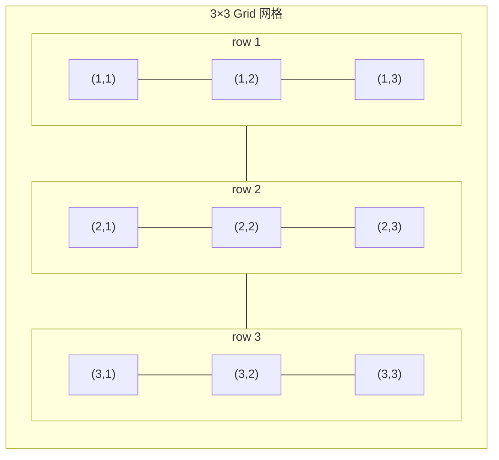
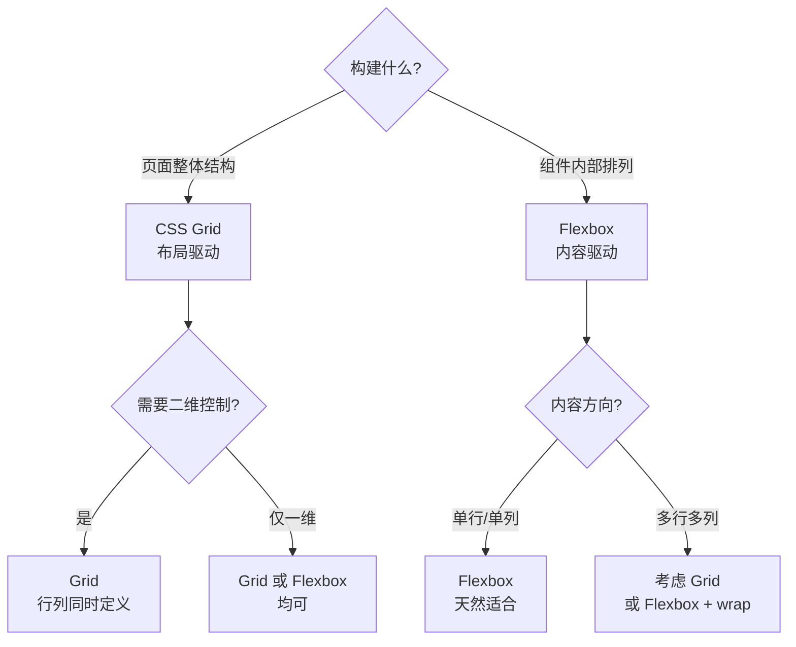

# Grid 概述

CSS Grid Layout 是一个强大的二维布局系统，专门用于创建复杂的网页布局。它将容器划分为行和列，可以精确控制子元素的位置和大小。

## 发展历程

| 时间 | 事件 |
|------|------|
| 2012年 | Microsoft 首先在 IE10 中实现 Grid 布局 |
| 2015年 | Chrome 和 Firefox 开始支持 |
| 2017年 | 主流浏览器全面支持 Grid |
| 2019年 | Subgrid 在 Firefox 71 中实现 |

## 基本概念

Grid 布局将容器划分为**行（row）与列（column）**，行与列交叉形成单元格（cell）。下图展示了 3×3 网格的行列结构：



### Grid 容器和项目

```css
.container {
  display: grid;
}

.item {
  /* 容器的直接子元素成为 grid 项目 */
}
```

**注意**：只有容器的直接子元素才会成为 Grid 项目，孙级元素不受影响。

### 网格线（Grid Lines）

网格线是构成网格结构的分界线，用于定位网格项目：

```
  1         2         3         4
  ├─────────┼─────────┼─────────┤
1 │         │         │         │
  ├─────────┼─────────┼─────────┤
2 │         │         │         │
  ├─────────┼─────────┼─────────┤
3 │         │         │         │
  └─────────┴─────────┴─────────┘
```

**网格线特点**：
- 默认编号从 1 开始
- 负数从右下角开始（-1 表示最后一条线）
- 可以自定义命名

### 网格轨道（Grid Track）

相邻两条网格线之间的空间：

| 类型 | 方向 | 说明 |
|------|------|------|
| 行轨道（Row Track） | 水平方向 | 两行之间的空间 |
| 列轨道（Column Track） | 垂直方向 | 两列之间的空间 |

```
    ┌──────────────────────┐
    │      列轨道          │
    │   ┌───┬───┬───┐      │
    │   │   │   │   │ ←── 行轨道
    │   ├───┼───┼───┤      │
    │   │   │   │   │      │
    │   └───┴───┴───┘      │
    └──────────────────────┘
```

### 网格单元格（Grid Cell）

网格的最小单位，由相邻的行和列网格线围成，类似于表格中的一个单元格。

### 网格区域（Grid Area）

由一个或多个网格单元格组成的矩形区域。网格区域必须是矩形的，不能是 L 形或其他不规则形状。

```
┌─────────────────────┐
│      header         │
├─────────┬───────────┤
│ sidebar │   main    │
├─────────┴───────────┤
│      footer         │
└─────────────────────┘
```

### 显式网格与隐式网格

#### 显式网格（Explicit Grid）

通过 `grid-template-columns`、`grid-template-rows` 或 `grid-template-areas` 明确定义的网格：

```css
.container {
  display: grid;
  /* 明确定义了 3 列 2 行 */
  grid-template-columns: repeat(3, 1fr);
  grid-template-rows: 100px 200px;
}
```

#### 隐式网格（Implicit Grid）

当项目超出显式网格范围时自动创建的网格：

```css
.container {
  display: grid;
  grid-template-columns: repeat(3, 100px); /* 3 列 */
  /* 未定义行，会自动创建隐式行 */
  grid-auto-rows: 50px; /* 控制隐式行的大小 */
}
```

```
┌─────────────────────────┐
│      显式网格           │
│  ┌────┬────┬────┐       │
│  │    │    │    │       │
│  ├────┼────┼────┤       │
│  │    │    │    │       │
│  └────┴────┴────┘       │
├─────────────────────────┤
│      隐式网格           │
│  ┌────┬────┬────┐       │
│  │    │    │    │ ← 自动创建
│  └────┴────┴────┘       │
└─────────────────────────┘
```

## 开启 Grid 布局

### display: grid

创建块级 Grid 容器：

```css
.container {
  display: grid;
}
```

### display: inline-grid

创建行内级 Grid 容器：

```css
.container {
  display: inline-grid;
}
```

### subgrid（子网格）

嵌套网格继承父网格的轨道大小（截至 2026 年，Chrome 117+、Firefox 71+、Safari 16+ 均已支持）：

```css
.parent {
  display: grid;
  grid-template-columns: repeat(3, 1fr);
}

.child {
  display: grid;
  grid-template-columns: subgrid; /* 继承父网格的列定义 */
}
```

## 网格线命名

### 自动命名

Grid 会自动为网格线命名：

```css
.container {
  grid-template-columns: [col1-start] 1fr [col1-end col2-start] 1fr [col2-end];
}
```

### 使用命名线定位项目

```css
.item {
  grid-column: col1-start / col2-end;
}
```

### 隐式命名

使用 `grid-template-areas` 时会自动创建命名线：

```css
.container {
  grid-template-areas:
    "header header"
    "sidebar main";
}

/* 自动创建：
   - header-start, header-end
   - sidebar-start, sidebar-end
   - main-start, main-end
*/
```

## Grid 布局特点

### 1. 二维布局

同时控制行和列，这是 Grid 与 Flexbox 的本质区别：

```css
.container {
  display: grid;
  grid-template-columns: repeat(3, 1fr);
  grid-template-rows: repeat(2, 100px);
}
```

### 2. 精确控制

可以精确指定项目的位置和大小：

```css
.item {
  grid-column: 1 / 3; /* 从第1条线到第3条线 */
  grid-row: 1 / 2;
}
```

### 3. 命名区域

使用语义化的命名区域定义布局，提高代码可读性：

```css
.container {
  display: grid;
  grid-template-areas:
    "header header header"
    "sidebar main main"
    "footer footer footer";
}

.header { grid-area: header; }
.sidebar { grid-area: sidebar; }
.main { grid-area: main; }
.footer { grid-area: footer; }
```

### 4. 自动布局

自动填充和适应内容：

```css
/* auto-fill: 尽可能多地放置轨道 */
.container {
  grid-template-columns: repeat(auto-fill, 200px);
}

/* auto-fit: 折叠空轨道 */
.container {
  grid-template-columns: repeat(auto-fit, minmax(200px, 1fr));
}
```

### 5. 内容对齐

强大的对齐控制能力：

```css
.container {
  justify-items: center;  /* 项目水平对齐 */
  align-items: center;    /* 项目垂直对齐 */
  justify-content: center; /* 网格水平对齐 */
  align-content: center;   /* 网格垂直对齐 */
}
```

## Grid vs Flexbox

| 特性 | Grid | Flexbox |
|------|------|---------|
| 维度 | 二维（行和列） | 一维（单方向） |
| 布局方式 | 基于网格 | 基于内容流 |
| 方向控制 | 行和列同时 | 主轴或交叉轴 |
| 项目定位 | 可精确定位 | 流式排列 |
| 项目大小 | 可独立控制 | 受 flex-grow/shrink 影响 |
| 适用场景 | 页面整体布局 | 组件内部布局 |
| 学习曲线 | 相对复杂 | 相对简单 |

### 选择建议

**使用 Grid 的场景**：
- 整体页面布局
- 需要二维对齐的内容
- 需要精确定位元素
- 复杂的表格类布局
- 卡片网格、图库布局
- 仪表盘布局

**使用 Flexbox 的场景**：
- 导航栏、工具栏
- 单行或单列布局
- 内容对齐和分布
- 组件内部元素排列
- 动态内容的居中

### 组合使用

实际项目中，Grid 和 Flexbox 经常配合使用：

```css
/* 外层用 Grid 做页面布局 */
.page {
  display: grid;
  grid-template-areas:
    "header"
    "main"
    "footer";
}

/* 导航栏用 Flexbox 做内部排列 */
.nav {
  display: flex;
  justify-content: space-between;
  align-items: center;
}
```

## Grid vs Flexbox 深度对比

### Grid 会替代 Flexbox 吗？

**不会。** Grid 和 Flexbox 是互补关系，而非替代关系。它们的设计哲学有本质区别：

| 维度 | Flexbox | CSS Grid |
|------|---------|----------|
| 设计哲学 | **内容驱动**（Content-out） | **布局驱动**（Layout-in） |
| 维度 | 一维（单方向） | 二维（行列同时） |
| 项目尺寸 | 由内容决定，弹性伸缩 | 由网格定义，精确控制 |
| 对齐 | 交叉轴对齐为主 | 双轴对齐，更完整 |
| 适用层级 | 组件内部 | 页面整体 |



### 内容驱动 vs 布局驱动

**Flexbox（内容驱动）**：项目尺寸由内容决定，布局是内容的结果。

```css
/* Flexbox：内容决定布局 */
.nav { display: flex; gap: 16px; }
/* 导航项宽度由文字长度决定，自动排列 */
```

**Grid（布局驱动）**：项目尺寸由网格定义决定，内容适应布局。

```css
/* Grid：布局决定内容位置 */
.page {
  display: grid;
  grid-template-columns: 250px 1fr;
  grid-template-rows: 60px 1fr 40px;
}
/* 区域大小由网格定义，内容填入指定区域 */
```

### 何时用 Flex，何时用 Grid

**用 Flexbox 的场景**：
- 导航栏、工具栏、按钮组
- 单行或单列布局
- 内容对齐和分布
- 组件内部元素排列（如卡片内部）
- 动态内容的居中
- 不知道项目数量时

**用 Grid 的场景**：
- 页面整体布局（header/main/sidebar/footer）
- 需要二维对齐的内容
- 需要精确定位元素
- 复杂的表格类布局
- 卡片网格、图库布局
- 仪表盘布局
- 需要项目跨行跨列

### 组合使用的最佳实践

```css
/* 外层 Grid 做页面布局 */
.page {
  display: grid;
  grid-template-areas:
    "header header"
    "sidebar main"
    "footer footer";
  grid-template-columns: 250px 1fr;
  grid-template-rows: 60px 1fr 40px;
}

/* 导航栏用 Flex 做内部排列 */
.header {
  grid-area: header;
  display: flex;
  justify-content: space-between;
  align-items: center;
}

/* 卡片内部用 Flex 做垂直排列 */
.card {
  display: flex;
  flex-direction: column;
  gap: 12px;
}

/* 卡片网格用 Grid 做响应式排列 */
.card-grid {
  display: grid;
  grid-template-columns: repeat(auto-fit, minmax(280px, 1fr));
  gap: 20px;
}
```

> **经验法则**：Grid 做宏观布局（页面、区域），Flexbox 做微观布局（组件、元素）。

## Grid 属性概览

### 容器属性

| 属性 | 说明 | 默认值 |
|------|------|--------|
| `grid-template-columns` | 定义列轨道大小 | none |
| `grid-template-rows` | 定义行轨道大小 | none |
| `grid-template-areas` | 命名网格区域 | none |
| `grid-template` | 上述三个属性的简写 | none |
| `column-gap` | 列间距 | normal |
| `row-gap` | 行间距 | normal |
| `gap` | 间距简写 | normal |
| `justify-items` | 项目水平对齐 | stretch |
| `align-items` | 项目垂直对齐 | stretch |
| `place-items` | 对齐简写 | stretch |
| `justify-content` | 网格水平对齐 | stretch |
| `align-content` | 网格垂直对齐 | stretch |
| `place-content` | 对齐简写 | stretch |
| `grid-auto-columns` | 隐式列大小 | auto |
| `grid-auto-rows` | 隐式行大小 | auto |
| `grid-auto-flow` | 自动排列方向 | row |
| `grid` | 所有属性简写 | - |

### 项目属性

| 属性 | 说明 | 默认值 |
|------|------|--------|
| `grid-column-start` | 列起始线 | auto |
| `grid-column-end` | 列结束线 | auto |
| `grid-row-start` | 行起始线 | auto |
| `grid-row-end` | 行结束线 | auto |
| `grid-column` | 列简写 | auto / auto |
| `grid-row` | 行简写 | auto / auto |
| `grid-area` | 区域名或位置 | auto |
| `justify-self` | 项目水平对齐 | auto |
| `align-self` | 项目垂直对齐 | auto |
| `place-self` | 对齐简写 | auto |
| `order` | 排列顺序 | 0 |

## 浏览器支持

### 兼容性表格

| 浏览器 | 版本支持 | 发布时间 |
|--------|---------|---------|
| Chrome | 57+ | 2017年3月 |
| Firefox | 52+ | 2017年3月 |
| Safari | 10.1+ | 2017年3月 |
| Edge | 16+ | 2017年10月 |
| Opera | 44+ | 2017年3月 |
| iOS Safari | 10.3+ | 2017年3月 |
| Android | 67+ | 2018年 |

### 特性支持

| 特性 | Chrome | Firefox | Safari | Edge |
|------|--------|---------|--------|------|
| 基础 Grid | 57+ | 52+ | 10.1+ | 16+ |
| gap 属性 | 66+ | 61+ | 12+ | 16+ |
| subgrid | 117+ | 71+ | 16+ | 117+ |
| aspect-ratio | 88+ | 89+ | 15+ | 88+ |

### 兼容性处理

```css
/* 渐进增强方案 */
.container {
  /* 回退布局 */
  display: flex;
  flex-wrap: wrap;
}

@supports (display: grid) {
  .container {
    display: grid;
    grid-template-columns: repeat(3, 1fr);
  }
}
```

## 常见问题 FAQ

### Q1: Grid 项目之间为什么有默认间距？

**A**: Grid 项目默认没有间距，可能是浏览器的默认样式。使用 `gap` 属性显式设置间距：

```css
.container {
  display: grid;
  gap: 0; /* 移除间距 */
}
```

### Q2: 为什么 Grid 项目溢出容器？

**A**: 可能原因：
1. 使用固定像素值，总宽度超过容器
2. 未处理内容溢出

**解决方案**：

```css
.container {
  display: grid;
  grid-template-columns: repeat(auto-fit, minmax(200px, 1fr));
  /* 使用 minmax 确保响应式 */
}

.item {
  min-width: 0; /* 允许收缩 */
  overflow: hidden; /* 处理内容溢出 */
}
```

### Q3: Grid 布局中 margin 还生效吗？

**A**: 是的，margin 仍然有效。但推荐使用 `gap` 处理项目间距，避免 margin 折叠问题：

```css
/* 推荐 */
.container {
  display: grid;
  gap: 20px;
}

/* 不推荐（可能导致布局问题） */
.item {
  margin: 10px;
}
```

### Q4: 如何实现等高列？

**A**: Grid 默认实现等高列，同一行的所有项目高度相同：

```css
.container {
  display: grid;
  grid-template-columns: repeat(3, 1fr);
  align-items: stretch; /* 默认值，拉伸填满 */
}
```

### Q5: auto-fill 和 auto-fit 有什么区别？

**A**:
- `auto-fill`: 尽可能多地创建轨道，即使轨道是空的
- `auto-fit`: 折叠空轨道，让现有项目扩展填满空间

```css
/* auto-fill: 可能产生空轨道 */
grid-template-columns: repeat(auto-fill, minmax(100px, 1fr));

/* auto-fit: 空轨道被折叠 */
grid-template-columns: repeat(auto-fit, minmax(100px, 1fr));
```

### Q6: 如何调试 Grid 布局？

**A**: Chrome DevTools 提供了 Grid 可视化功能：
1. 打开开发者工具（F12）
2. 在 Elements 面板中选择 Grid 容器
3. 点击 `.grid` 徽章显示网格线
4. 在 Layout 面板中可以设置显示选项

## 最佳实践

1. **理解二维布局**：Grid 适合二维布局，Flexbox 适合一维布局
2. **优先使用 fr 单位**：弹性分配空间，避免溢出
3. **使用开发者工具**：Chrome DevTools 可视化 Grid 布局
4. **命名区域**：提高代码可读性和可维护性
5. **响应式设计**：使用 `auto-fit` 和 `minmax` 实现自适应
6. **合理设置 min-width**：防止内容撑破布局
7. **结合 Flexbox**：布局层面用 Grid，组件内部用 Flexbox
8. **注意隐式网格**：使用 `grid-auto-rows/columns` 控制自动创建的轨道

## 学习资源

- [MDN - CSS Grid Layout](https://developer.mozilla.org/zh-CN/docs/Web/CSS/CSS_Grid_Layout)
- [CSS Tricks - A Complete Guide to Grid](https://css-tricks.com/snippets/css/complete-guide-grid/)
- [Grid Garden](https://cssgridgarden.com/) - 交互式学习游戏
