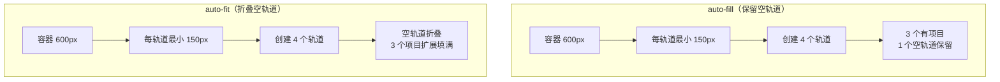
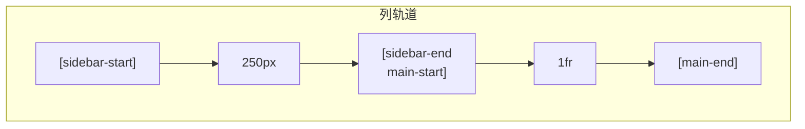
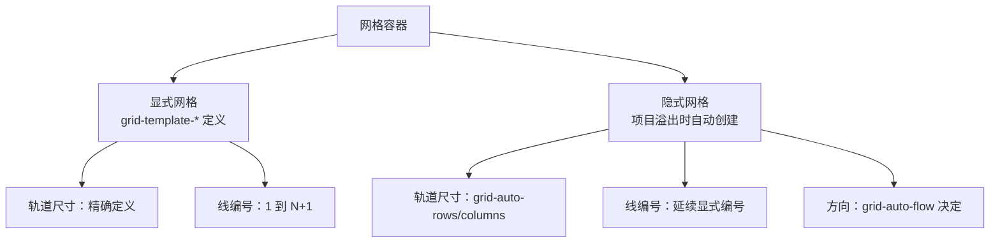

# Grid 容器属性

Grid 容器上的属性控制整个网格的布局结构，包括轨道定义、间距、对齐等。

## 属性速查表

| 属性 | 说明 | 默认值 | 继承 |
|------|------|--------|------|
| `grid-template-columns` | 定义列轨道大小 | none | 否 |
| `grid-template-rows` | 定义行轨道大小 | none | 否 |
| `grid-template-areas` | 命名网格区域 | none | 否 |
| `grid-template` | 模板简写 | none | 否 |
| `gap` | 轨道间距 | normal | 否 |
| `justify-items` | 项目水平对齐 | stretch | 否 |
| `align-items` | 项目垂直对齐 | stretch | 否 |
| `justify-content` | 网格水平对齐 | stretch | 否 |
| `align-content` | 网格垂直对齐 | stretch | 否 |
| `grid-auto-columns` | 隐式列大小 | auto | 否 |
| `grid-auto-rows` | 隐式行大小 | auto | 否 |
| `grid-auto-flow` | 自动排列方向 | row | 否 |
| `grid` | 所有属性简写 | - | 否 |

## 轨道定义属性

### grid-template-columns 定义列

定义网格的列轨道大小。

#### 基本语法

```css
.container {
  display: grid;
  
  /* 固定宽度 */
  grid-template-columns: 200px 200px 200px;
  
  /* 百分比 */
  grid-template-columns: 25% 50% 25%;
  
  /* fr 单位（弹性单位） */
  grid-template-columns: 1fr 2fr 1fr;
  
  /* 混合使用 */
  grid-template-columns: 200px 1fr 200px;
}
```

#### fr 单位详解

`fr`（fraction）是 Grid 特有的弹性单位，表示可用空间的比例：

```css
/* 1fr + 2fr + 1fr = 4fr */
/* 可用空间按 1:2:1 分配 */
.container {
  grid-template-columns: 1fr 2fr 1fr;
}

/* 固定宽度优先，剩余空间弹性分配 */
.container {
  grid-template-columns: 200px 1fr 200px;
  /* 200px 和 200px 固定，中间 1fr 占据剩余空间 */
}
```

#### repeat() 函数

简化重复的轨道定义：

```css
.container {
  /* 重复3次，每次100px */
  grid-template-columns: repeat(3, 100px);
  
  /* 重复3次，每次1fr */
  grid-template-columns: repeat(3, 1fr);
  
  /* 重复模式 */
  grid-template-columns: repeat(2, 100px 200px);
  /* 等同于：100px 200px 100px 200px */
  
  /* 带命名线的重复 */
  grid-template-columns: repeat(3, [col-start] 1fr [col-end]);
}
```

#### auto-fill 和 auto-fit

实现响应式网格的关键关键字：

```css
.container {
  /* auto-fill: 尽可能多地填充轨道 */
  grid-template-columns: repeat(auto-fill, 200px);
  
  /* auto-fit: 折叠空轨道 */
  grid-template-columns: repeat(auto-fit, minmax(200px, 1fr));
}
```

**auto-fill vs auto-fit 对比**：

```
auto-fill（容器宽度 600px，轨道 150px）:
┌────┬────┬────┬────┐
│    │    │    │    │ ← 创建4个轨道，可能有空轨道
└────┴────┴────┴────┘

auto-fit（容器宽度 600px，轨道 150px）:
┌──────────────────────┐
│                      │ ← 空轨道被折叠，现有轨道扩展
└──────────────────────┘
```

#### minmax() 函数

定义轨道的最小和最大尺寸：

```css
.container {
  /* 最小200px，最大1fr */
  grid-template-columns: repeat(3, minmax(200px, 1fr));
  
  /* 最小内容宽度，最大最大内容宽度 */
  grid-template-columns: minmax(min-content, max-content);
  
  /* 最小0，最大1fr（允许收缩） */
  grid-template-columns: minmax(0, 1fr);
}
```

#### fit-content() 函数

限制轨道的最大尺寸：

```css
.container {
  /* 轨道大小根据内容，但不超过300px */
  grid-template-columns: fit-content(300px);
  
  /* 组合使用 */
  grid-template-columns: 200px fit-content(400px) 1fr;
}
```


#### grid-template-columns 交互演示（MDN）

定义网格的列轨道（宽度），支持 fr、repeat()、minmax() 等。

```html
<!DOCTYPE html>
<html lang="zh-CN">
  <head>
    <meta charset="UTF-8" />
    <meta name="viewport" content="width=device-width, initial-scale=1.0" />
    <title>grid-template-columns 属性演示 - MDN 示例</title>
    <meta name="description" content="grid-template-columns 属性演示" />
    <style>
      * {
        margin: 0;
        padding: 0;
        box-sizing: border-box;
      }
      body {
        font-family: -apple-system, BlinkMacSystemFont, "Segoe UI", Roboto, "Helvetica Neue", Arial, sans-serif;
        min-height: 100vh;
        padding: 0;
      }
      .demo-layout {
        display: flex;
        height: 100vh;
        gap: 0;
      }
      .snippet-panel {
        width: 320px;
        flex-shrink: 0;
        padding: 16px;
        display: flex;
        flex-direction: column;
        gap: 8px;
        overflow-y: auto;
        border-right: 1px solid #ddd;
        background: #fafafa;
      }
      .snippet-btn {
        padding: 10px 14px;
        border: 1px solid #ccc;
        border-radius: 6px;
        background: #fff;
        font-family: "JetBrains Mono", "Fira Code", monospace;
        font-size: 13px;
        color: #333;
        cursor: pointer;
        text-align: left;
        transition: all 0.2s;
        line-height: 1.4;
      }
      .snippet-btn:hover {
        border-color: #8083ff;
        background: #f0f0ff;
      }
      .snippet-btn.active {
        border-color: #8083ff;
        background: #e8e8ff;
        color: #571bc1;
        font-weight: 600;
      }
      .preview-panel {
        flex: 1;
        padding: 16px;
        display: flex;
        align-items: center;
        justify-content: center;
        background: #fff;
        overflow: auto;
      }
      .preview-panel > section,
      .preview-panel > div:not(.snippet-panel):not(.demo-layout) {
        flex: 1;
        width: 100%;
        min-height: 0;
        height: 100%;
        display: flex;
        align-items: center;
        justify-content: center;
      }
      #example-element {
        border: 1px solid #c5c5c5;
        display: grid;
        grid-auto-rows: 40px;
        grid-gap: 10px;
        width: 200px;
      }

      #example-element > div {
        background-color: rgba(0, 0, 255, 0.2);
        border: 3px solid blue;
      }
    </style>
  </head>
  <body>
    <div class="demo-layout">
      <div class="snippet-panel">
        <button class="snippet-btn active" data-index="0">grid-template-columns: 60px 60px;</button>
        <button class="snippet-btn" data-index="1">grid-template-columns: 1fr 60px;</button>
        <button class="snippet-btn" data-index="2">grid-template-columns: 1fr 2fr;</button>
        <button class="snippet-btn" data-index="3">grid-template-columns: 8ch auto;</button>
      </div>
      <div class="preview-panel">
        <section class="default-example" id="default-example">
          <div class="example-container">
            <div class="transition-all" id="example-element">
              <div>One</div>
              <div>Two</div>
              <div>Three</div>
              <div>Four</div>
              <div>Five</div>
            </div>
          </div>
        </section>
      </div>
    </div>
    <script>
      const snippets = [
        `#example-element {
  grid-template-columns: 60px 60px;
}`,
        `#example-element {
  grid-template-columns: 1fr 60px;
}`,
        `#example-element {
  grid-template-columns: 1fr 2fr;
}`,
        `#example-element {
  grid-template-columns: 8ch auto;
}`,
      ];

      let styleEl = document.createElement("style");
      document.head.appendChild(styleEl);

      function applySnippet(index) {
        styleEl.textContent = snippets[index];
        document.querySelectorAll(".snippet-btn").forEach((btn, i) => {
          btn.classList.toggle("active", i === index);
        });
      }

      document.querySelectorAll(".snippet-btn").forEach((btn) => {
        btn.addEventListener("click", () => applySnippet(parseInt(btn.dataset.index)));
      });

      applySnippet(0);
    </script>
  </body>
</html>

```
### grid-template-rows 定义行

定义网格的行轨道大小：

```css
.container {
  display: grid;
  
  /* 固定高度 */
  grid-template-rows: 100px 200px 100px;
  
  /* 使用 repeat */
  grid-template-rows: repeat(3, 100px);
  
  /* 弹性高度 */
  grid-template-rows: auto 1fr auto;
  
  /* 使用 minmax */
  grid-template-rows: minmax(100px, auto);
}
```


#### grid-template-rows 交互演示（MDN）

定义网格的行轨道（高度）。

```html
<!DOCTYPE html>
<html lang="zh-CN">
  <head>
    <meta charset="UTF-8" />
    <meta name="viewport" content="width=device-width, initial-scale=1.0" />
    <title>grid-template-rows 属性演示 - MDN 示例</title>
    <meta name="description" content="grid-template-rows 属性演示" />
    <style>
      * {
        margin: 0;
        padding: 0;
        box-sizing: border-box;
      }
      body {
        font-family: -apple-system, BlinkMacSystemFont, "Segoe UI", Roboto, "Helvetica Neue", Arial, sans-serif;
        min-height: 100vh;
        padding: 0;
      }
      .demo-layout {
        display: flex;
        height: 100vh;
        gap: 0;
      }
      .snippet-panel {
        width: 320px;
        flex-shrink: 0;
        padding: 16px;
        display: flex;
        flex-direction: column;
        gap: 8px;
        overflow-y: auto;
        border-right: 1px solid #ddd;
        background: #fafafa;
      }
      .snippet-btn {
        padding: 10px 14px;
        border: 1px solid #ccc;
        border-radius: 6px;
        background: #fff;
        font-family: "JetBrains Mono", "Fira Code", monospace;
        font-size: 13px;
        color: #333;
        cursor: pointer;
        text-align: left;
        transition: all 0.2s;
        line-height: 1.4;
      }
      .snippet-btn:hover {
        border-color: #8083ff;
        background: #f0f0ff;
      }
      .snippet-btn.active {
        border-color: #8083ff;
        background: #e8e8ff;
        color: #571bc1;
        font-weight: 600;
      }
      .preview-panel {
        flex: 1;
        padding: 16px;
        display: flex;
        align-items: center;
        justify-content: center;
        background: #fff;
        overflow: auto;
      }
      .preview-panel > section,
      .preview-panel > div:not(.snippet-panel):not(.demo-layout) {
        flex: 1;
        width: 100%;
        min-height: 0;
        height: 100%;
        display: flex;
        align-items: center;
        justify-content: center;
      }
      #example-element {
        border: 1px solid #c5c5c5;
        display: grid;
        grid-template-columns: 1fr 1fr;
        grid-gap: 10px;
        width: 200px;
      }

      #example-element > div {
        background-color: rgba(0, 0, 255, 0.2);
        border: 3px solid blue;
      }
    </style>
  </head>
  <body>
    <div class="demo-layout">
      <div class="snippet-panel">
        <button class="snippet-btn active" data-index="0">grid-template-rows: auto;</button>
        <button class="snippet-btn" data-index="1">grid-template-rows: 40px 4em 40px;</button>
        <button class="snippet-btn" data-index="2">grid-template-rows: 1fr 2fr 1fr;</button>
        <button class="snippet-btn" data-index="3">grid-template-rows: 3ch auto minmax(10px, 60px);</button>
      </div>
      <div class="preview-panel">
        <section class="default-example" id="default-example">
          <div class="example-container">
            <div class="transition-all" id="example-element">
              <div>One</div>
              <div>Two</div>
              <div>Three</div>
              <div>Four</div>
              <div>Five</div>
            </div>
          </div>
        </section>
      </div>
    </div>
    <script>
      const snippets = [
        `#example-element {
  grid-template-rows: auto;
}`,
        `#example-element {
  grid-template-rows: 40px 4em 40px;
}`,
        `#example-element {
  grid-template-rows: 1fr 2fr 1fr;
}`,
        `#example-element {
  grid-template-rows: 3ch auto minmax(10px, 60px);
}`,
      ];

      let styleEl = document.createElement("style");
      document.head.appendChild(styleEl);

      function applySnippet(index) {
        styleEl.textContent = snippets[index];
        document.querySelectorAll(".snippet-btn").forEach((btn, i) => {
          btn.classList.toggle("active", i === index);
        });
      }

      document.querySelectorAll(".snippet-btn").forEach((btn) => {
        btn.addEventListener("click", () => applySnippet(parseInt(btn.dataset.index)));
      });

      applySnippet(0);
    </script>
  </body>
</html>

```
### grid-template-areas 命名区域

使用语义化命名定义网格区域：

```css
.container {
  display: grid;
  grid-template-columns: 200px 1fr 200px;
  grid-template-rows: auto 1fr auto;
  grid-template-areas:
    "header header header"
    "sidebar main aside"
    "footer footer footer";
}

.header { grid-area: header; }
.sidebar { grid-area: sidebar; }
.main { grid-area: main; }
.aside { grid-area: aside; }
.footer { grid-area: footer; }
```

#### 区域命名规则

```
┌─────────────────────────────┐
│         header              │ header 占据整行
├─────────┬─────────┬────────┤
│ sidebar │  main   │ aside  │ 三个区域并排
├─────────┴─────────┴────────┤
│         footer              │ footer 占据整行
└─────────────────────────────┘
```

#### 使用点号表示空区域

```css
.container {
  grid-template-areas:
    "header header header"
    "sidebar . aside"    /* 中间留空 */
    "footer footer footer";
}
```

#### 命名区域的优势

1. **语义化**：布局结构一目了然
2. **可维护性**：修改布局只需调整模板
3. **响应式友好**：通过媒体查询轻松重排


#### grid-template-areas 交互演示（MDN）

通过命名区域字符串定义网格布局结构。

```html
<!DOCTYPE html>
<html lang="zh-CN">
  <head>
    <meta charset="UTF-8" />
    <meta name="viewport" content="width=device-width, initial-scale=1.0" />
    <title>grid-template-areas 属性演示 - MDN 示例</title>
    <meta name="description" content="grid-template-areas 属性演示" />
    <style>
      * {
        margin: 0;
        padding: 0;
        box-sizing: border-box;
      }
      body {
        font-family: -apple-system, BlinkMacSystemFont, "Segoe UI", Roboto, "Helvetica Neue", Arial, sans-serif;
        min-height: 100vh;
        padding: 0;
      }
      .demo-layout {
        display: flex;
        height: 100vh;
        gap: 0;
      }
      .snippet-panel {
        width: 320px;
        flex-shrink: 0;
        padding: 16px;
        display: flex;
        flex-direction: column;
        gap: 8px;
        overflow-y: auto;
        border-right: 1px solid #ddd;
        background: #fafafa;
      }
      .snippet-btn {
        padding: 10px 14px;
        border: 1px solid #ccc;
        border-radius: 6px;
        background: #fff;
        font-family: "JetBrains Mono", "Fira Code", monospace;
        font-size: 13px;
        color: #333;
        cursor: pointer;
        text-align: left;
        transition: all 0.2s;
        line-height: 1.4;
      }
      .snippet-btn:hover {
        border-color: #8083ff;
        background: #f0f0ff;
      }
      .snippet-btn.active {
        border-color: #8083ff;
        background: #e8e8ff;
        color: #571bc1;
        font-weight: 600;
      }
      .preview-panel {
        flex: 1;
        padding: 16px;
        display: flex;
        align-items: center;
        justify-content: center;
        background: #fff;
        overflow: auto;
      }
      .preview-panel > section,
      .preview-panel > div:not(.snippet-panel):not(.demo-layout) {
        flex: 1;
        width: 100%;
        min-height: 0;
        height: 100%;
        display: flex;
        align-items: center;
        justify-content: center;
      }
      #example-element {
        border: 1px solid #c5c5c5;
        display: grid;
        grid-template-columns: 1fr 1fr 1fr;
        grid-template-rows: repeat(3, minmax(40px, auto));
        grid-gap: 10px;
        width: 200px;
      }

      #example-element :nth-child(1) {
        background-color: rgba(0, 0, 255, 0.2);
        border: 3px solid blue;
        grid-area: a;
      }

      #example-element :nth-child(2) {
        background-color: rgba(255, 0, 200, 0.2);
        border: 3px solid rebeccapurple;
        grid-area: b;
      }

      #example-element :nth-child(3) {
        background-color: rgba(94, 255, 0, 0.2);
        border: 3px solid green;
        grid-area: c;
      }
    </style>
  </head>
  <body>
    <div class="demo-layout">
      <div class="snippet-panel">
        <button class="snippet-btn active" data-index="0">grid-template-areas:</button>
        <button class="snippet-btn" data-index="1">grid-template-areas:</button>
        <button class="snippet-btn" data-index="2">grid-template-areas:</button>
      </div>
      <div class="preview-panel">
        <section class="default-example" id="default-example">
          <div class="example-container">
            <div class="transition-all" id="example-element">
              <div>One (a)</div>
              <div>Two (b)</div>
              <div>Three (c)</div>
            </div>
          </div>
        </section>
      </div>
    </div>
    <script>
      const snippets = [
        `#example-element {
  grid-template-areas:
  "a a a"
  "b c c"
  "b c c";
}`,
        `#example-element {
  grid-template-areas:
  "b b a"
  "b b c"
  "b b c";
}`,
        `#example-element {
  grid-template-areas:
  "a a ."
  "a a ."
  ". b c";
}`,
      ];

      let styleEl = document.createElement("style");
      document.head.appendChild(styleEl);

      function applySnippet(index) {
        styleEl.textContent = snippets[index];
        document.querySelectorAll(".snippet-btn").forEach((btn, i) => {
          btn.classList.toggle("active", i === index);
        });
      }

      document.querySelectorAll(".snippet-btn").forEach((btn) => {
        btn.addEventListener("click", () => applySnippet(parseInt(btn.dataset.index)));
      });

      applySnippet(0);
    </script>
  </body>
</html>

```
### grid-template 简写

一次性定义轨道和区域：

```css
.container {
  grid-template:
    "header header header" 100px
    "sidebar main aside" 1fr
    "footer footer footer" 50px
    / 200px 1fr 200px;
}

/* 等同于 */
.container {
  grid-template-areas:
    "header header header"
    "sidebar main aside"
    "footer footer footer";
  grid-template-rows: 100px 1fr 50px;
  grid-template-columns: 200px 1fr 200px;
}
```


#### grid-template 交互演示（MDN）

grid-template-rows/columns/areas 的简写属性。

```html
<!DOCTYPE html>
<html lang="zh-CN">
  <head>
    <meta charset="UTF-8" />
    <meta name="viewport" content="width=device-width, initial-scale=1.0" />
    <title>grid-template 属性演示 - MDN 示例</title>
    <meta name="description" content="grid-template 属性演示" />
    <style>
      * {
        margin: 0;
        padding: 0;
        box-sizing: border-box;
      }
      body {
        font-family: -apple-system, BlinkMacSystemFont, "Segoe UI", Roboto, "Helvetica Neue", Arial, sans-serif;
        min-height: 100vh;
        padding: 0;
      }
      .demo-layout {
        display: flex;
        height: 100vh;
        gap: 0;
      }
      .snippet-panel {
        width: 320px;
        flex-shrink: 0;
        padding: 16px;
        display: flex;
        flex-direction: column;
        gap: 8px;
        overflow-y: auto;
        border-right: 1px solid #ddd;
        background: #fafafa;
      }
      .snippet-btn {
        padding: 10px 14px;
        border: 1px solid #ccc;
        border-radius: 6px;
        background: #fff;
        font-family: "JetBrains Mono", "Fira Code", monospace;
        font-size: 13px;
        color: #333;
        cursor: pointer;
        text-align: left;
        transition: all 0.2s;
        line-height: 1.4;
      }
      .snippet-btn:hover {
        border-color: #8083ff;
        background: #f0f0ff;
      }
      .snippet-btn.active {
        border-color: #8083ff;
        background: #e8e8ff;
        color: #571bc1;
        font-weight: 600;
      }
      .preview-panel {
        flex: 1;
        padding: 16px;
        display: flex;
        align-items: center;
        justify-content: center;
        background: #fff;
        overflow: auto;
      }
      .preview-panel > section,
      .preview-panel > div:not(.snippet-panel):not(.demo-layout) {
        flex: 1;
        width: 100%;
        min-height: 0;
        height: 100%;
        display: flex;
        align-items: center;
        justify-content: center;
      }
      #example-element {
        border: 1px solid #c5c5c5;
        display: grid;
        grid-gap: 10px;
        width: 200px;
      }

      #example-element :nth-child(1) {
        background-color: rgba(0, 0, 255, 0.2);
        border: 3px solid blue;
        grid-area: a;
      }

      #example-element :nth-child(2) {
        background-color: rgba(255, 0, 200, 0.2);
        border: 3px solid rebeccapurple;
        grid-area: b;
      }

      #example-element :nth-child(3) {
        background-color: rgba(94, 255, 0, 0.2);
        border: 3px solid green;
        grid-area: c;
      }
    </style>
  </head>
  <body>
    <div class="demo-layout">
      <div class="snippet-panel">
        <button class="snippet-btn active" data-index="0">grid-template:</button>
        <button class="snippet-btn" data-index="1">grid-template:</button>
        <button class="snippet-btn" data-index="2">grid-template:</button>
      </div>
      <div class="preview-panel">
        <section class="default-example" id="default-example">
          <div class="example-container">
            <div class="transition-all" id="example-element">
              <div>One</div>
              <div>Two</div>
              <div>Three</div>
            </div>
          </div>
        </section>
      </div>
    </div>
    <script>
      const snippets = [
        `#example-element {
  grid-template:
  "a a a" 40px
  "b c c" 40px
  "b c c" 40px / 1fr 1fr 1fr;
}`,
        `#example-element {
  grid-template:
  "b b a" auto
  "b b c" 2ch
  "b b c" 1em / 20% 20px 1fr;
}`,
        `#example-element {
  grid-template:
  "a a ." minmax(50px, auto)
  "a a ." 80px
  "b b c" auto / 2em 3em auto;
}`,
      ];

      let styleEl = document.createElement("style");
      document.head.appendChild(styleEl);

      function applySnippet(index) {
        styleEl.textContent = snippets[index];
        document.querySelectorAll(".snippet-btn").forEach((btn, i) => {
          btn.classList.toggle("active", i === index);
        });
      }

      document.querySelectorAll(".snippet-btn").forEach((btn) => {
        btn.addEventListener("click", () => applySnippet(parseInt(btn.dataset.index)));
      });

      applySnippet(0);
    </script>
  </body>
</html>

```
### subgrid 嵌套网格

让子网格继承父网格的轨道定义：

```css
.parent {
  display: grid;
  grid-template-columns: repeat(3, 1fr);
  grid-template-rows: repeat(2, 100px);
}

.child {
  display: grid;
  grid-template-columns: subgrid; /* 继承列定义 */
  grid-template-rows: subgrid;    /* 继承行定义 */
}
```

**subgrid 应用场景**：

```
父网格
┌────────┬────────┬────────┐
│        │        │        │
├────────┼────────┼────────┤
│        │ 子网格  │        │
│        │ ┌────┬─┼──┐     │
│        │ │    │  │  │    │ ← 子网格对齐父网格线
│        │ └────┴──┼──┘     │
└────────┴────────┴────────┘
```

**浏览器支持**：Chrome 117+, Firefox 71+, Safari 16+

## 间距属性

### gap 轨道间距

设置网格轨道之间的间距：

```css
.container {
  /* 行间距 列间距 */
  gap: 10px 20px;
  
  /* 行和列相同 */
  gap: 10px;
}

/* 单独设置 */
.container {
  row-gap: 10px;
  column-gap: 20px;
}
```

#### gap 与 margin 的区别

| 特性 | gap | margin |
|------|-----|--------|
| 位置 | 轨道之间 | 项目周围 |
| 折叠 | 不会折叠 | 会折叠 |
| 边缘 | 不影响边缘 | 影响边缘 |
| 继承 | 容器设置 | 项目设置 |

```css
/* 使用 gap（推荐） */
.container {
  display: grid;
  gap: 20px;
}

/* 使用 margin（不推荐） */
.item {
  margin: 10px;
  /* 可能导致边缘问题、折叠问题 */
}
```

## 对齐属性

### justify-items 项目水平对齐

控制所有项目在单元格内的水平对齐方式：

```css
.container {
  display: grid;
  justify-items: start;   /* 起点对齐 */
  justify-items: end;     /* 终点对齐 */
  justify-items: center;  /* 居中对齐 */
  justify-items: stretch; /* 默认：拉伸填满 */
}
```

**可视化对比**：

```
start:              center:            stretch:
┌──────────────┐    ┌──────────────┐    ┌──────────────┐
│item          │    │    item      │    │    item      │
└──────────────┘    └──────────────┘    └──────────────┘
┌──────────────┐    ┌──────────────┐    ┌──────────────┐
│item          │    │    item      │    │   item       │
└──────────────┘    └──────────────┘    └──────────────┘
```


#### justify-items 交互演示（MDN）

设置网格项目在行内方向的默认对齐方式。

```html
<!DOCTYPE html>
<html lang="zh-CN">
  <head>
    <meta charset="UTF-8" />
    <meta name="viewport" content="width=device-width, initial-scale=1.0" />
    <title>justify-items 属性演示 - MDN 示例</title>
    <meta name="description" content="justify-items 属性演示" />
    <style>
      * {
        margin: 0;
        padding: 0;
        box-sizing: border-box;
      }
      body {
        font-family: -apple-system, BlinkMacSystemFont, "Segoe UI", Roboto, "Helvetica Neue", Arial, sans-serif;
        min-height: 100vh;
        padding: 0;
      }
      .demo-layout {
        display: flex;
        height: 100vh;
        gap: 0;
      }
      .snippet-panel {
        width: 320px;
        flex-shrink: 0;
        padding: 16px;
        display: flex;
        flex-direction: column;
        gap: 8px;
        overflow-y: auto;
        border-right: 1px solid #ddd;
        background: #fafafa;
      }
      .snippet-btn {
        padding: 10px 14px;
        border: 1px solid #ccc;
        border-radius: 6px;
        background: #fff;
        font-family: "JetBrains Mono", "Fira Code", monospace;
        font-size: 13px;
        color: #333;
        cursor: pointer;
        text-align: left;
        transition: all 0.2s;
        line-height: 1.4;
      }
      .snippet-btn:hover {
        border-color: #8083ff;
        background: #f0f0ff;
      }
      .snippet-btn.active {
        border-color: #8083ff;
        background: #e8e8ff;
        color: #571bc1;
        font-weight: 600;
      }
      .preview-panel {
        flex: 1;
        padding: 16px;
        display: flex;
        align-items: center;
        justify-content: center;
        background: #fff;
        overflow: auto;
      }
      .preview-panel > section,
      .preview-panel > div:not(.snippet-panel):not(.demo-layout) {
        flex: 1;
        width: 100%;
        min-height: 0;
        height: 100%;
        display: flex;
        align-items: center;
        justify-content: center;
      }
      #example-element {
        border: 1px solid #c5c5c5;
        display: grid;
        grid-template-columns: 1fr 1fr;
        grid-auto-rows: 40px;
        grid-gap: 10px;
        width: 220px;
      }

      #example-element > div {
        background-color: rgba(0, 0, 255, 0.2);
        border: 3px solid blue;
      }
    </style>
  </head>
  <body>
    <div class="demo-layout">
      <div class="snippet-panel">
        <button class="snippet-btn active" data-index="0">justify-items: stretch;</button>
        <button class="snippet-btn" data-index="1">justify-items: center;</button>
        <button class="snippet-btn" data-index="2">justify-items: start;</button>
        <button class="snippet-btn" data-index="3">justify-items: end;</button>
      </div>
      <div class="preview-panel">
        <section class="default-example" id="default-example">
          <div class="example-container">
            <div class="transition-all" id="example-element">
              <div>One</div>
              <div>Two</div>
              <div>Three</div>
            </div>
          </div>
        </section>
      </div>
    </div>
    <script>
      const snippets = [
        `#example-element {
  justify-items: stretch;
}`,
        `#example-element {
  justify-items: center;
}`,
        `#example-element {
  justify-items: start;
}`,
        `#example-element {
  justify-items: end;
}`,
      ];

      let styleEl = document.createElement("style");
      document.head.appendChild(styleEl);

      function applySnippet(index) {
        styleEl.textContent = snippets[index];
        document.querySelectorAll(".snippet-btn").forEach((btn, i) => {
          btn.classList.toggle("active", i === index);
        });
      }

      document.querySelectorAll(".snippet-btn").forEach((btn) => {
        btn.addEventListener("click", () => applySnippet(parseInt(btn.dataset.index)));
      });

      applySnippet(0);
    </script>
  </body>
</html>

```
### align-items 项目垂直对齐

控制所有项目在单元格内的垂直对齐方式：

```css
.container {
  display: grid;
  align-items: start;   /* 起点对齐 */
  align-items: end;     /* 终点对齐 */
  align-items: center;  /* 居中对齐 */
  align-items: stretch; /* 默认：拉伸填满 */
}
```

### place-items 简写

同时设置两个方向的对齐：

```css
.container {
  /* align-items justify-items */
  place-items: center center;
  place-items: center; /* 两个方向相同 */
}
```


#### place-items 交互演示（MDN）

align-items 与 justify-items 的简写。

```html
<!DOCTYPE html>
<html lang="zh-CN">
  <head>
    <meta charset="UTF-8" />
    <meta name="viewport" content="width=device-width, initial-scale=1.0" />
    <title>place-items 属性演示 - MDN 示例</title>
    <meta name="description" content="place-items 属性演示" />
    <style>
      * {
        margin: 0;
        padding: 0;
        box-sizing: border-box;
      }
      body {
        font-family: -apple-system, BlinkMacSystemFont, "Segoe UI", Roboto, "Helvetica Neue", Arial, sans-serif;
        min-height: 100vh;
        padding: 0;
      }
      .demo-layout {
        display: flex;
        height: 100vh;
        gap: 0;
      }
      .snippet-panel {
        width: 320px;
        flex-shrink: 0;
        padding: 16px;
        display: flex;
        flex-direction: column;
        gap: 8px;
        overflow-y: auto;
        border-right: 1px solid #ddd;
        background: #fafafa;
      }
      .snippet-btn {
        padding: 10px 14px;
        border: 1px solid #ccc;
        border-radius: 6px;
        background: #fff;
        font-family: "JetBrains Mono", "Fira Code", monospace;
        font-size: 13px;
        color: #333;
        cursor: pointer;
        text-align: left;
        transition: all 0.2s;
        line-height: 1.4;
      }
      .snippet-btn:hover {
        border-color: #8083ff;
        background: #f0f0ff;
      }
      .snippet-btn.active {
        border-color: #8083ff;
        background: #e8e8ff;
        color: #571bc1;
        font-weight: 600;
      }
      .preview-panel {
        flex: 1;
        padding: 16px;
        display: flex;
        align-items: center;
        justify-content: center;
        background: #fff;
        overflow: auto;
      }
      .preview-panel > section,
      .preview-panel > div:not(.snippet-panel):not(.demo-layout) {
        flex: 1;
        width: 100%;
        min-height: 0;
        height: 100%;
        display: flex;
        align-items: center;
        justify-content: center;
      }
      #example-element {
        border: 1px solid #c5c5c5;
        display: grid;
        grid-template-columns: 1fr 1fr;
        grid-auto-rows: 80px;
        grid-gap: 10px;
        width: 220px;
      }

      #example-element > div {
        background-color: rgba(0, 0, 255, 0.2);
        border: 3px solid blue;
      }
    </style>
  </head>
  <body>
    <div class="demo-layout">
      <div class="snippet-panel">
        <button class="snippet-btn active" data-index="0">place-items: center stretch;</button>
        <button class="snippet-btn" data-index="1">place-items: center start;</button>
        <button class="snippet-btn" data-index="2">place-items: start end;</button>
        <button class="snippet-btn" data-index="3">place-items: end center;</button>
      </div>
      <div class="preview-panel">
        <section class="default-example" id="default-example">
          <div class="example-container">
            <div class="transition-all" id="example-element">
              <div>One</div>
              <div>Two</div>
              <div>Three</div>
            </div>
          </div>
        </section>
      </div>
    </div>
    <script>
      const snippets = [
        `#example-element {
  place-items: center stretch;
}`,
        `#example-element {
  place-items: center start;
}`,
        `#example-element {
  place-items: start end;
}`,
        `#example-element {
  place-items: end center;
}`,
      ];

      let styleEl = document.createElement("style");
      document.head.appendChild(styleEl);

      function applySnippet(index) {
        styleEl.textContent = snippets[index];
        document.querySelectorAll(".snippet-btn").forEach((btn, i) => {
          btn.classList.toggle("active", i === index);
        });
      }

      document.querySelectorAll(".snippet-btn").forEach((btn) => {
        btn.addEventListener("click", () => applySnippet(parseInt(btn.dataset.index)));
      });

      applySnippet(0);
    </script>
  </body>
</html>

```
### justify-content 网格水平对齐

当网格总宽度小于容器时，控制整个网格的水平对齐：

```css
.container {
  display: grid;
  grid-template-columns: repeat(3, 100px);
  width: 500px;
  
  justify-content: start;        /* 起点对齐 */
  justify-content: end;          /* 终点对齐 */
  justify-content: center;       /* 居中对齐 */
  justify-content: space-between; /* 两端对齐 */
  justify-content: space-around;  /* 两侧间隔相等 */
  justify-content: space-evenly;  /* 所有间隔相等 */
}
```

**可视化对比**：

```
容器宽度 500px，网格宽度 300px

start:     ┌───┬───┬───┐──────────────┐
           │   │   │   │              │
           └───┴───┴───┘──────────────┘

center:    ┌──────────┬───┬───┬───┬──────────┐
           │          │   │   │   │          │
           └──────────┴───┴───┴───┴──────────┘

space-between: ┌───┬───┬───┐
           │   │         │         │   │
           └───┴─────────┴─────────┴───┘
```

### align-content 网格垂直对齐

当网格总高度小于容器时，控制整个网格的垂直对齐：

```css
.container {
  display: grid;
  grid-template-rows: repeat(2, 100px);
  height: 500px;
  
  align-content: start;        /* 起点对齐 */
  align-content: end;          /* 终点对齐 */
  align-content: center;       /* 居中对齐 */
  align-content: space-between; /* 两端对齐 */
  align-content: space-around;  /* 两侧间隔相等 */
  align-content: space-evenly;  /* 所有间隔相等 */
}
```

### place-content 简写

同时设置网格的两个方向对齐：

```css
.container {
  /* align-content justify-content */
  place-content: center center;
  place-content: center; /* 两个方向相同 */
}
```


#### place-content 交互演示（MDN）

align-content 与 justify-content 的简写。

```html
<!DOCTYPE html>
<html lang="zh-CN">
  <head>
    <meta charset="UTF-8" />
    <meta name="viewport" content="width=device-width, initial-scale=1.0" />
    <title>place-content 属性演示 - MDN 示例</title>
    <meta name="description" content="place-content 属性演示" />
    <style>
      * {
        margin: 0;
        padding: 0;
        box-sizing: border-box;
      }
      body {
        font-family: -apple-system, BlinkMacSystemFont, "Segoe UI", Roboto, "Helvetica Neue", Arial, sans-serif;
        min-height: 100vh;
        padding: 0;
      }
      .demo-layout {
        display: flex;
        height: 100vh;
        gap: 0;
      }
      .snippet-panel {
        width: 320px;
        flex-shrink: 0;
        padding: 16px;
        display: flex;
        flex-direction: column;
        gap: 8px;
        overflow-y: auto;
        border-right: 1px solid #ddd;
        background: #fafafa;
      }
      .snippet-btn {
        padding: 10px 14px;
        border: 1px solid #ccc;
        border-radius: 6px;
        background: #fff;
        font-family: "JetBrains Mono", "Fira Code", monospace;
        font-size: 13px;
        color: #333;
        cursor: pointer;
        text-align: left;
        transition: all 0.2s;
        line-height: 1.4;
      }
      .snippet-btn:hover {
        border-color: #8083ff;
        background: #f0f0ff;
      }
      .snippet-btn.active {
        border-color: #8083ff;
        background: #e8e8ff;
        color: #571bc1;
        font-weight: 600;
      }
      .preview-panel {
        flex: 1;
        padding: 16px;
        display: flex;
        align-items: center;
        justify-content: center;
        background: #fff;
        overflow: auto;
      }
      .preview-panel > section,
      .preview-panel > div:not(.snippet-panel):not(.demo-layout) {
        flex: 1;
        width: 100%;
        min-height: 0;
        height: 100%;
        display: flex;
        align-items: center;
        justify-content: center;
      }
      #example-element {
        border: 1px solid #c5c5c5;
        display: grid;
        grid-template-columns: 60px 60px;
        grid-auto-rows: 40px;
        height: 180px;
        width: 220px;
      }

      #example-element > div {
        background-color: rgba(0, 0, 255, 0.2);
        border: 3px solid blue;
      }
    </style>
  </head>
  <body>
    <div class="demo-layout">
      <div class="snippet-panel">
        <button class="snippet-btn active" data-index="0">place-content: end space-between;</button>
        <button class="snippet-btn" data-index="1">place-content: space-around start;</button>
        <button class="snippet-btn" data-index="2">place-content: start space-evenly;</button>
        <button class="snippet-btn" data-index="3">place-content: end center;</button>
        <button class="snippet-btn" data-index="4">place-content: end;</button>
      </div>
      <div class="preview-panel">
        <section class="default-example" id="default-example">
          <div class="example-container">
            <div class="transition-all" id="example-element">
              <div>One</div>
              <div>Two</div>
              <div>Three</div>
            </div>
          </div>
        </section>
      </div>
    </div>
    <script>
      const snippets = [
        `#example-element {
  place-content: end space-between;
}`,
        `#example-element {
  place-content: space-around start;
}`,
        `#example-element {
  place-content: start space-evenly;
}`,
        `#example-element {
  place-content: end center;
}`,
        `#example-element {
  place-content: end;
}`,
      ];

      let styleEl = document.createElement("style");
      document.head.appendChild(styleEl);

      function applySnippet(index) {
        styleEl.textContent = snippets[index];
        document.querySelectorAll(".snippet-btn").forEach((btn, i) => {
          btn.classList.toggle("active", i === index);
        });
      }

      document.querySelectorAll(".snippet-btn").forEach((btn) => {
        btn.addEventListener("click", () => applySnippet(parseInt(btn.dataset.index)));
      });

      applySnippet(0);
    </script>
  </body>
</html>

```
## 自动轨道属性

### grid-auto-columns 定义隐式列

当项目超出定义的列范围时，自动创建的列的大小：

```css
.container {
  display: grid;
  grid-template-columns: repeat(3, 100px);
  grid-auto-columns: 100px; /* 隐式列的宽度 */
}
```


#### grid-auto-columns 交互演示（MDN）

定义隐式创建的列轨道尺寸。

```html
<!DOCTYPE html>
<html lang="zh-CN">
  <head>
    <meta charset="UTF-8" />
    <meta name="viewport" content="width=device-width, initial-scale=1.0" />
    <title>grid-auto-columns 属性演示 - MDN 示例</title>
    <meta name="description" content="grid-auto-columns 属性演示" />
    <style>
      * {
        margin: 0;
        padding: 0;
        box-sizing: border-box;
      }
      body {
        font-family: -apple-system, BlinkMacSystemFont, "Segoe UI", Roboto, "Helvetica Neue", Arial, sans-serif;
        min-height: 100vh;
        padding: 0;
      }
      .demo-layout {
        display: flex;
        height: 100vh;
        gap: 0;
      }
      .snippet-panel {
        width: 320px;
        flex-shrink: 0;
        padding: 16px;
        display: flex;
        flex-direction: column;
        gap: 8px;
        overflow-y: auto;
        border-right: 1px solid #ddd;
        background: #fafafa;
      }
      .snippet-btn {
        padding: 10px 14px;
        border: 1px solid #ccc;
        border-radius: 6px;
        background: #fff;
        font-family: "JetBrains Mono", "Fira Code", monospace;
        font-size: 13px;
        color: #333;
        cursor: pointer;
        text-align: left;
        transition: all 0.2s;
        line-height: 1.4;
      }
      .snippet-btn:hover {
        border-color: #8083ff;
        background: #f0f0ff;
      }
      .snippet-btn.active {
        border-color: #8083ff;
        background: #e8e8ff;
        color: #571bc1;
        font-weight: 600;
      }
      .preview-panel {
        flex: 1;
        padding: 16px;
        display: flex;
        align-items: center;
        justify-content: center;
        background: #fff;
        overflow: auto;
      }
      .preview-panel > section,
      .preview-panel > div:not(.snippet-panel):not(.demo-layout) {
        flex: 1;
        width: 100%;
        min-height: 0;
        height: 100%;
        display: flex;
        align-items: center;
        justify-content: center;
      }
      #example-element {
        border: 1px solid #c5c5c5;
        display: grid;
        grid-auto-rows: 40px;
        grid-gap: 10px;
        width: 220px;
      }

      #example-element > div {
        background-color: rgba(0, 0, 255, 0.2);
        border: 3px solid blue;
      }

      #example-element > div:nth-child(1) {
        grid-column: 1 / 3;
      }

      #example-element > div:nth-child(2) {
        grid-column: 2;
      }
    </style>
  </head>
  <body>
    <div class="demo-layout">
      <div class="snippet-panel">
        <button class="snippet-btn active" data-index="0">grid-auto-columns: auto;</button>
        <button class="snippet-btn" data-index="1">grid-auto-columns: 1fr;</button>
        <button class="snippet-btn" data-index="2">grid-auto-columns: min-content;</button>
        <button class="snippet-btn" data-index="3">grid-auto-columns: minmax(10px, auto);</button>
      </div>
      <div class="preview-panel">
        <section class="default-example" id="default-example">
          <div class="example-container">
            <div class="transition-all" id="example-element">
              <div>One</div>
              <div>Two</div>
              <div>Three</div>
              <div>Four</div>
              <div></div>
            </div>
          </div>
        </section>
      </div>
    </div>
    <script>
      const snippets = [
        `#example-element {
  grid-auto-columns: auto;
}`,
        `#example-element {
  grid-auto-columns: 1fr;
}`,
        `#example-element {
  grid-auto-columns: min-content;
}`,
        `#example-element {
  grid-auto-columns: minmax(10px, auto);
}`,
      ];

      let styleEl = document.createElement("style");
      document.head.appendChild(styleEl);

      function applySnippet(index) {
        styleEl.textContent = snippets[index];
        document.querySelectorAll(".snippet-btn").forEach((btn, i) => {
          btn.classList.toggle("active", i === index);
        });
      }

      document.querySelectorAll(".snippet-btn").forEach((btn) => {
        btn.addEventListener("click", () => applySnippet(parseInt(btn.dataset.index)));
      });

      applySnippet(0);
    </script>
  </body>
</html>

```
### grid-auto-rows 定义隐式行

当项目超出定义的行范围时，自动创建的行的大小：

```css
.container {
  display: grid;
  grid-template-rows: 100px;
  grid-auto-rows: 50px; /* 隐式行的高度 */
}

/* 实用技巧：使用 minmax */
.container {
  grid-auto-rows: minmax(100px, auto);
}
```

**显式 vs 隐式网格**：

```
显式定义 2 行，但有 4 个项目：

┌──────────────────┐
│  显式网格 (定义)  │
│  ┌────┬────┬────┐│
│  │ 1  │ 2  │ 3  ││ ← grid-template-rows
│  ├────┼────┼────┤│
│  │ 4  │ 5  │ 6  ││
│  └────┴────┴────┘│
├──────────────────┤
│  隐式网格 (自动)  │
│  ┌────┬────┬────┐│
│  │ 7  │ 8  │ 9  ││ ← grid-auto-rows
│  └────┴────┴────┘│
└──────────────────┘
```


#### grid-auto-rows 交互演示（MDN）

定义隐式创建的行轨道尺寸。

```html
<!DOCTYPE html>
<html lang="zh-CN">
  <head>
    <meta charset="UTF-8" />
    <meta name="viewport" content="width=device-width, initial-scale=1.0" />
    <title>grid-auto-rows 属性演示 - MDN 示例</title>
    <meta name="description" content="grid-auto-rows 属性演示" />
    <style>
      * {
        margin: 0;
        padding: 0;
        box-sizing: border-box;
      }
      body {
        font-family: -apple-system, BlinkMacSystemFont, "Segoe UI", Roboto, "Helvetica Neue", Arial, sans-serif;
        min-height: 100vh;
        padding: 0;
      }
      .demo-layout {
        display: flex;
        height: 100vh;
        gap: 0;
      }
      .snippet-panel {
        width: 320px;
        flex-shrink: 0;
        padding: 16px;
        display: flex;
        flex-direction: column;
        gap: 8px;
        overflow-y: auto;
        border-right: 1px solid #ddd;
        background: #fafafa;
      }
      .snippet-btn {
        padding: 10px 14px;
        border: 1px solid #ccc;
        border-radius: 6px;
        background: #fff;
        font-family: "JetBrains Mono", "Fira Code", monospace;
        font-size: 13px;
        color: #333;
        cursor: pointer;
        text-align: left;
        transition: all 0.2s;
        line-height: 1.4;
      }
      .snippet-btn:hover {
        border-color: #8083ff;
        background: #f0f0ff;
      }
      .snippet-btn.active {
        border-color: #8083ff;
        background: #e8e8ff;
        color: #571bc1;
        font-weight: 600;
      }
      .preview-panel {
        flex: 1;
        padding: 16px;
        display: flex;
        align-items: center;
        justify-content: center;
        background: #fff;
        overflow: auto;
      }
      .preview-panel > section,
      .preview-panel > div:not(.snippet-panel):not(.demo-layout) {
        flex: 1;
        width: 100%;
        min-height: 0;
        height: 100%;
        display: flex;
        align-items: center;
        justify-content: center;
      }
      #example-element {
        border: 1px solid #c5c5c5;
        display: grid;
        grid-template-columns: 1fr 1fr;
        grid-auto-rows: 40px;
        grid-gap: 10px;
        width: 220px;
      }

      #example-element > div {
        background-color: rgba(0, 0, 255, 0.2);
        border: 3px solid blue;
        font-size: 22px;
      }

      #example-element div:last-child {
        font-size: 13px;
      }
    </style>
  </head>
  <body>
    <div class="demo-layout">
      <div class="snippet-panel">
        <button class="snippet-btn active" data-index="0">grid-auto-rows: auto;</button>
        <button class="snippet-btn" data-index="1">grid-auto-rows: 50px;</button>
        <button class="snippet-btn" data-index="2">grid-auto-rows: min-content;</button>
        <button class="snippet-btn" data-index="3">grid-auto-rows: minmax(30px, auto);</button>
      </div>
      <div class="preview-panel">
        <section class="default-example" id="default-example">
          <div class="example-container">
            <div class="transition-all" id="example-element">
              <div>One</div>
              <div>Two</div>
              <div>Three</div>
              <div>Four</div>
              <div>Five</div>
            </div>
          </div>
        </section>
      </div>
    </div>
    <script>
      const snippets = [
        `#example-element {
  grid-auto-rows: auto;
}`,
        `#example-element {
  grid-auto-rows: 50px;
}`,
        `#example-element {
  grid-auto-rows: min-content;
}`,
        `#example-element {
  grid-auto-rows: minmax(30px, auto);
}`,
      ];

      let styleEl = document.createElement("style");
      document.head.appendChild(styleEl);

      function applySnippet(index) {
        styleEl.textContent = snippets[index];
        document.querySelectorAll(".snippet-btn").forEach((btn, i) => {
          btn.classList.toggle("active", i === index);
        });
      }

      document.querySelectorAll(".snippet-btn").forEach((btn) => {
        btn.addEventListener("click", () => applySnippet(parseInt(btn.dataset.index)));
      });

      applySnippet(0);
    </script>
  </body>
</html>

```
### grid-auto-flow 自动排列方向

控制自动放置项目时的排列方向：

```css
.container {
  display: grid;
  grid-template-columns: repeat(3, 1fr);
  grid-template-rows: repeat(2, 100px);
  
  grid-auto-flow: row;     /* 默认：按行排列 */
  grid-auto-flow: column;  /* 按列排列 */
  grid-auto-flow: dense;   /* 尽量填满空隙 */
  grid-auto-flow: row dense; /* 组合使用 */
}
```

**排列方向对比**：

```
grid-auto-flow: row (默认)
┌───┬───┬───┐
│ 1 │ 2 │ 3 │
├───┼───┼───┤
│ 4 │ 5 │ 6 │
└───┴───┴───┘

grid-auto-flow: column
┌───┬───┬───┐
│ 1 │ 3 │ 5 │
├───┼───┼───┤
│ 2 │ 4 │ 6 │
└───┴───┴───┘
```

**dense 关键字**：

```
不使用 dense（有空洞）：
┌───────┬───┬───┐
│   1   │   │   │
│(跨2列)├───┤ 3 │
├───────┤ 2 ├───┤
│   4   │   │   │
└───────┴───┴───┘

使用 dense（填满空隙）：
┌───────┬───┬───┐
│   1   │ 2 │ 3 │
│(跨2列)├───┼───┤
├───────┤ 4 │   │
│   5   │   │   │
└───────┴───┴───┘
```


#### grid-auto-flow 交互演示（MDN）

控制自动放置算法的流向（row/column/dense）。

```html
<!DOCTYPE html>
<html lang="zh-CN">
  <head>
    <meta charset="UTF-8" />
    <meta name="viewport" content="width=device-width, initial-scale=1.0" />
    <title>grid-auto-flow 属性演示 - MDN 示例</title>
    <meta name="description" content="grid-auto-flow 属性演示" />
    <style>
      * {
        margin: 0;
        padding: 0;
        box-sizing: border-box;
      }
      body {
        font-family: -apple-system, BlinkMacSystemFont, "Segoe UI", Roboto, "Helvetica Neue", Arial, sans-serif;
        min-height: 100vh;
        padding: 0;
      }
      .demo-layout {
        display: flex;
        height: 100vh;
        gap: 0;
      }
      .snippet-panel {
        width: 320px;
        flex-shrink: 0;
        padding: 16px;
        display: flex;
        flex-direction: column;
        gap: 8px;
        overflow-y: auto;
        border-right: 1px solid #ddd;
        background: #fafafa;
      }
      .snippet-btn {
        padding: 10px 14px;
        border: 1px solid #ccc;
        border-radius: 6px;
        background: #fff;
        font-family: "JetBrains Mono", "Fira Code", monospace;
        font-size: 13px;
        color: #333;
        cursor: pointer;
        text-align: left;
        transition: all 0.2s;
        line-height: 1.4;
      }
      .snippet-btn:hover {
        border-color: #8083ff;
        background: #f0f0ff;
      }
      .snippet-btn.active {
        border-color: #8083ff;
        background: #e8e8ff;
        color: #571bc1;
        font-weight: 600;
      }
      .preview-panel {
        flex: 1;
        padding: 16px;
        display: flex;
        align-items: center;
        justify-content: center;
        background: #fff;
        overflow: auto;
      }
      .preview-panel > section,
      .preview-panel > div:not(.snippet-panel):not(.demo-layout) {
        flex: 1;
        width: 100%;
        min-height: 0;
        height: 100%;
        display: flex;
        align-items: center;
        justify-content: center;
      }
      #example-element {
        border: 1px solid #c5c5c5;
        display: grid;
        grid-template-columns: 1fr 1fr 1fr;
        grid-template-rows: repeat(3, minmax(40px, auto));
        grid-gap: 10px;
        width: 220px;
      }

      #example-element > div {
        background-color: rgba(0, 0, 255, 0.2);
        border: 3px solid blue;
      }

      #example-element > div:nth-child(1) {
        grid-column: auto / span 2;
      }

      #example-element > div:nth-child(2) {
        grid-column: auto / span 2;
      }
    </style>
  </head>
  <body>
    <div class="demo-layout">
      <div class="snippet-panel">
        <button class="snippet-btn active" data-index="0">grid-auto-flow: row;</button>
        <button class="snippet-btn" data-index="1">grid-auto-flow: column;</button>
        <button class="snippet-btn" data-index="2">grid-auto-flow: row dense;</button>
      </div>
      <div class="preview-panel">
        <section class="default-example" id="default-example">
          <div class="example-container">
            <div class="transition-all" id="example-element">
              <div>One</div>
              <div>Two</div>
              <div>Three</div>
              <div>Four</div>
              <div>Five</div>
            </div>
          </div>
        </section>
      </div>
    </div>
    <script>
      const snippets = [
        `#example-element {
  grid-auto-flow: row;
}`,
        `#example-element {
  grid-auto-flow: column;
}`,
        `#example-element {
  grid-auto-flow: row dense;
}`,
      ];

      let styleEl = document.createElement("style");
      document.head.appendChild(styleEl);

      function applySnippet(index) {
        styleEl.textContent = snippets[index];
        document.querySelectorAll(".snippet-btn").forEach((btn, i) => {
          btn.classList.toggle("active", i === index);
        });
      }

      document.querySelectorAll(".snippet-btn").forEach((btn) => {
        btn.addEventListener("click", () => applySnippet(parseInt(btn.dataset.index)));
      });

      applySnippet(0);
    </script>
  </body>
</html>

```
## grid 简写属性

`grid` 是最强大的简写属性，可以一次性设置几乎所有容器属性：

```css
.container {
  /* 模板 + 自动轨道 + 自动排列 */
  grid: 
    "header header" 100px
    "sidebar main" 1fr
    / 200px 1fr;
  
  /* 等同于 */
  grid-template-areas:
    "header header"
    "sidebar main";
  grid-template-rows: 100px 1fr;
  grid-template-columns: 200px 1fr;
}

/* 更完整的简写 */
.container {
  grid: 
    [row1-start] "header header" 100px [row1-end]
    [row2-start] "sidebar main" 1fr [row2-end]
    / [col1-start] 200px [col1-end] 1fr;
}
```

## 常见布局组合

### 等宽多列

```css
.container {
  display: grid;
  grid-template-columns: repeat(3, 1fr);
  gap: 20px;
}
```

### 固定宽度 + 自适应

```css
.container {
  display: grid;
  grid-template-columns: 250px 1fr;
}

/* 侧边栏 + 主内容 */
.sidebar { width: 250px; }
.main { /* 占据剩余空间 */ }
```

### 响应式网格

```css
.container {
  display: grid;
  grid-template-columns: repeat(auto-fit, minmax(300px, 1fr));
  gap: 20px;
}

/* 媒体查询增强 */
@media (max-width: 768px) {
  .container {
    grid-template-columns: 1fr;
  }
}
```

### 圣杯布局

```css
.layout {
  display: grid;
  grid-template:
    "header header header" 60px
    "sidebar main aside" 1fr
    "footer footer footer" 60px
    / 200px 1fr 200px;
  min-height: 100vh;
}

.header { grid-area: header; }
.sidebar { grid-area: sidebar; }
.main { grid-area: main; }
.aside { grid-area: aside; }
.footer { grid-area: footer; }
```

### 居中布局

```css
.container {
  display: grid;
  place-items: center;
  min-height: 100vh;
}

.centered {
  /* 自动居中 */
}
```

### 粘性页脚

```css
.page {
  display: grid;
  grid-template-rows: auto 1fr auto;
  min-height: 100vh;
}

.header { /* 自动高度 */ }
.main { /* 占据剩余空间 */ }
.footer { /* 自动高度，始终在底部 */ }
```

## 常见问题 FAQ

### Q1: 为什么使用 fr 单位时项目会溢出？

**A**: 项目内容可能比预期大。解决方法：

```css
.item {
  min-width: 0; /* 允许项目收缩 */
  overflow: hidden; /* 或使用 text-overflow */
}
```

### Q2: gap 和 margin 有什么区别？

**A**:
- `gap` 只作用于轨道之间，不影响容器边缘
- `margin` 会在项目周围产生间距，可能导致边缘问题
- `gap` 不会产生间距折叠

### Q3: 如何实现不等宽的响应式网格？

**A**: 使用媒体查询或容器查询：

```css
.container {
  grid-template-columns: 1fr;
}

@media (min-width: 768px) {
  .container {
    grid-template-columns: 200px 1fr;
  }
}

@media (min-width: 1024px) {
  .container {
    grid-template-columns: 250px 1fr 200px;
  }
}
```

### Q4: justify-content 和 justify-items 有什么区别？

**A**:
- `justify-items`: 控制项目**在单元格内**的水平对齐
- `justify-content`: 控制**整个网格**在容器内的水平对齐

### Q5: 如何处理 Grid 布局中的图片溢出？

**A**: 设置项目的最小宽度为 0：

```css
.item {
  min-width: 0;
}

.item img {
  max-width: 100%;
  height: auto;
}
```

### Q6: dense 关键字会影响性能吗？

**A**: 在大量项目时可能会有轻微影响，但通常可以忽略不计。建议仅在必要时使用。

## 最佳实践

1. **优先使用 fr 单位**：弹性分配空间，避免溢出
2. **使用 gap 替代 margin**：更简洁、无副作用
3. **命名区域提高可读性**：`grid-template-areas` 让布局一目了然
4. **auto-fit + minmax 实现响应式**：自动适应容器宽度
5. **使用 grid-template 简写**：一体化定义，减少代码量
6. **设置 min-width: 0**：防止内容撑破布局
7. **利用开发者工具**：Chrome DevTools 可视化调试 Grid
8. **合理使用隐式网格**：`grid-auto-rows` 控制自动创建的行

## 浏览器兼容性

### 属性支持

| 属性 | Chrome | Firefox | Safari | Edge |
|------|--------|---------|--------|------|
| 基础属性 | 57+ | 52+ | 10.1+ | 16+ |
| gap | 66+ | 61+ | 12+ | 16+ |
| subgrid | 117+ | 71+ | 16+ | - |
| fit-content() | 57+ | 52+ | 10.1+ | 16+ |

### 兼容性建议

现代浏览器对 Grid 的支持已全面就绪，新项目可直接使用；如需兼容极老旧环境，可用 `@supports` 提供渐进增强：

```css
/* 渐进增强 */
.container {
  /* 回退方案 */
  display: flex;
  flex-wrap: wrap;
}

@supports (display: grid) {
  .container {
    display: grid;
    grid-template-columns: repeat(auto-fit, minmax(300px, 1fr));
    gap: 20px;
  }
}
```

## 轨道尺寸函数深度解析

### repeat() 函数：auto-fill vs auto-fit

`repeat()` 是定义重复轨道的核心函数。`auto-fill` 和 `auto-fit` 是它最强大的两个参数，但行为有本质区别。



```css
/* auto-fill：空轨道保留，项目不扩展 */
.grid-fill {
  grid-template-columns: repeat(auto-fill, minmax(150px, 1fr));
}

/* auto-fit：空轨道折叠，项目扩展填满剩余空间 */
.grid-fit {
  grid-template-columns: repeat(auto-fit, minmax(150px, 1fr));
}
```

> **选择建议**：大多数场景使用 `auto-fit`。仅在需要保持轨道最小宽度（如保持列宽一致性）时使用 `auto-fill`。

### minmax() 函数：最小最大约束

`minmax(min, max)` 为轨道设定尺寸范围，是响应式网格的核心工具。

```css
/* 最小 200px，最大 1fr（均分剩余空间） */
grid-template-columns: repeat(auto-fit, minmax(200px, 1fr));

/* 最小 0，最大 1fr（允许项目收缩到内容宽度以下） */
grid-template-columns: minmax(0, 1fr);

/* 固定范围 */
grid-template-columns: minmax(100px, 300px);
```

**minmax 的特殊值组合**：

| min 值 | max 值 | 行为 |
|--------|--------|------|
| `200px` | `1fr` | 最小 200px，最大均分空间 |
| `0` | `1fr` | 允许完全收缩，均分空间 |
| `min-content` | `max-content` | 内容自适应范围 |
| `auto` | `1fr` | 最小为内容宽度或固定尺寸，最大均分 |
| `200px` | `auto` | 最小 200px，最大由内容决定 |

### fit-content() 函数：内容自适应

`fit-content(length)` 让轨道在内容尺寸和指定上限之间取值：

```
fit-content(300px) = min(max-content, max(min-content, 300px))
```

```css
/* 侧边栏：内容自适应，但不超过 300px */
.sidebar-grid {
  grid-template-columns: fit-content(300px) 1fr;
}
```

---

## fr 单位计算原理

`fr`（fraction）单位代表容器剩余空间的一份。它的计算方式与百分比有本质区别。

### fr 的计算公式

```
剩余空间 = 容器宽度 - 固定轨道宽度之和 - gap 总宽度
单份 fr = 剩余空间 / fr 值总和
某轨道宽度 = 单份 fr × 该轨道的 fr 值
```

### fr 与固定单位混合计算

```css
.container {
  display: grid;
  grid-template-columns: 200px 1fr 2fr;
  width: 800px;
  gap: 0;
}
```

```
剩余空间 = 800 - 200 = 600px
fr 总和 = 1 + 2 = 3
单份 fr = 600 / 3 = 200px

第1列 = 200px（固定）
第2列 = 200px × 1 = 200px
第3列 = 200px × 2 = 400px
```

### fr vs 百分比的差异

| 特性 | `fr` | `%` |
|------|------|-----|
| 参照对象 | 剩余空间 | 容器总宽度 |
| 包含 gap | `fr` 计算已扣除 gap | `%` 不扣除 gap，可能溢出 |
| 与固定值混用 | 自动分配剩余空间 | 各自独立计算，可能冲突 |
| 内容约束 | `min-width` 约束生效 | `min-width` 约束生效 |

> **结论**：在 Grid 中优先使用 `fr` 而非 `%`，因为 `fr` 自动处理 gap 和混合单位，不会溢出。

---

## 命名线系统（Named Grid Lines）

Grid 线除了使用数字编号引用，还可以通过命名线（Named Lines）用自定义名称引用，使布局代码更可读。

### 定义命名线

在 `grid-template-columns` / `grid-template-rows` 中用方括号 `[]` 定义线名：

```css
.container {
  grid-template-columns: [sidebar-start] 250px [sidebar-end main-start] 1fr [main-end];
  grid-template-rows: [header-start] 60px [header-end content-start] 1fr [content-end footer-start] 40px [footer-end];
}
```



> 一条线可以有多个名称，用空格分隔：`[sidebar-end main-start]`。

### 使用命名线定位项目

```css
.sidebar {
  grid-column: sidebar-start / sidebar-end;
  grid-row: content-start / content-end;
}

.main {
  grid-column: main-start / main-end;
  grid-row: content-start / content-end;
}
```

### 同名命名线与 repeat()

当 `repeat()` 与命名线结合时，会生成多条同名线，浏览器自动添加数字后缀：

```css
.container {
  grid-template-columns: repeat(3, [col-start] 1fr [col-end]);
}

/* 生成的线名：
   col-start 1 | col-end 1 | col-start 2 | col-end 2 | col-start 3 | col-end 3
*/
```

```css
/* 引用第 2 条 col-start 线 */
.item {
  grid-column: col-start 2 / col-end 2;
}
```

### 隐式命名线（来自 grid-template-areas）

使用 `grid-template-areas` 时，Grid 自动为每个命名区域的四条边界创建命名线：

```css
.container {
  grid-template-areas:
    "header header"
    "sidebar main";
}

/* 自动创建的命名线：
   {area}-start 和 {area}-end（行和列两个方向）

   header-start / header-end（行方向）
   header-start / header-end（列方向）
   sidebar-start / sidebar-end
   main-start / main-end
*/
```

```css
/* 使用隐式命名线 */
.item {
  grid-row: header-start / header-end;
  grid-column: sidebar-start / main-start;
}
```

> **显式命名线 vs 隐式命名线**：显式命名线在 `grid-template-*` 中手动定义，隐式命名线由 `grid-template-areas` 自动生成。两者可以混合使用。

---

## 隐式网格深度解析

### 显式网格 vs 隐式网格

| 类型 | 定义方式 | 轨道尺寸 | 线编号 |
|------|----------|----------|--------|
| **显式网格** | `grid-template-columns/rows` | 由开发者精确定义 | 正数编号（1, 2, 3...） |
| **隐式网格** | 项目超出显式网格时自动创建 | 由 `grid-auto-rows/columns` 决定 | 正数编号延续显式网格 |



### 隐式网格的创建场景

**场景 1：项目超出显式网格范围**

```css
.container {
  display: grid;
  grid-template-columns: repeat(3, 200px); /* 显式定义 3 列 */
  grid-template-rows: 100px;               /* 显式定义 1 行 */
}

/* 第 4-6 个项目超出第 1 行，自动创建隐式行 */
```

```
显式网格（1行 × 3列）：
┌──────┬──────┬──────┐
│  1   │  2   │  3   │ ← 显式行
├──────┼──────┼──────┤
│  4   │  5   │  6   │ ← 隐式行（自动创建）
└──────┴──────┴──────┘
```

**场景 2：项目定位到显式网格之外**

```css
.container {
  grid-template-columns: repeat(2, 200px);
}

.item {
  grid-column: 3; /* 定位到第 3 列，但只定义了 2 列 → 创建隐式列 */
}
```

### grid-auto-rows 和 grid-auto-columns

控制隐式轨道的尺寸：

```css
.container {
  grid-template-columns: repeat(3, 200px);
  grid-auto-rows: minmax(100px, auto);  /* 隐式行最小 100px，最大由内容决定 */
  grid-auto-columns: 150px;             /* 隐式列固定 150px */
}
```

**常见模式**：

```css
/* 模式 1：所有行等高 */
grid-auto-rows: 200px;

/* 模式 2：行高自适应内容，但最小保障 */
grid-auto-rows: minmax(150px, auto);

/* 模式 3：基于内容的最小行高 */
grid-auto-rows: min-content;

/* 模式 4：流式行高 */
grid-auto-rows: minmax(100px, 1fr);
```

### grid-auto-flow 控制隐式网格方向

```css
/* row（默认）：按行填充，超出时创建新行 */
grid-auto-flow: row;

/* column：按列填充，超出时创建新列 */
grid-auto-flow: column;

/* dense：尽量填满空隙（视觉顺序可能与 DOM 顺序不一致） */
grid-auto-flow: row dense;
```

```css
.container {
  display: grid;
  grid-template-columns: repeat(3, 1fr);
  grid-auto-rows: 100px;
  grid-auto-flow: row; /* 默认：按行填充 */
}
```

### 隐式网格与 auto-fill/auto-fit 的关系

`auto-fill` 和 `auto-fit` 创建的是**显式网格轨道**（即使没有内容填充），而非隐式轨道：

```css
/* auto-fill：创建 4 个显式轨道（即使只有 3 个项目） */
grid-template-columns: repeat(auto-fill, minmax(150px, 1fr));

/* 隐式轨道：仅当项目超出显式轨道时才创建 */
/* 例如：4 个项目但只定义了 3 列 → 第 4 个项目创建隐式列 */
```

> **区别**：`auto-fill`/`auto-fit` 创建的空轨道是显式的（可通过 DevTools 查看），隐式轨道仅在项目溢出显式定义时才创建。

---

## CSS 数学函数在 Grid 中的应用

### calc() + minmax() 组合

```css
/* 侧边栏固定，主内容自适应，最小保障 300px */
.grid {
  grid-template-columns: 250px minmax(calc(100% - 250px - 20px), 1fr);
  gap: 20px;
}

/* 响应式列宽：基于视窗宽度计算 */
.grid {
  grid-template-columns: repeat(auto-fit, minmax(calc(50% - 16px), 1fr));
  gap: 16px;
}
```

### clamp() 控制轨道尺寸范围

```css
/* 列宽在 200px 到 400px 之间弹性变化 */
.grid {
  grid-template-columns: repeat(auto-fit, clamp(200px, 25vw, 400px));
}

/* 侧边栏宽度在 200-320px 之间 */
.sidebar {
  width: clamp(200px, 20vw, 320px);
}
```

### min() / max() 函数

```css
/* 最小取 200px 或 25vw，确保不会太小 */
.grid {
  grid-template-columns: repeat(3, min(200px, 25vw));
}

/* 最大取 1fr 或 400px，防止轨道过宽 */
.grid {
  grid-template-columns: 1fr max(1fr, 400px);
}
```

