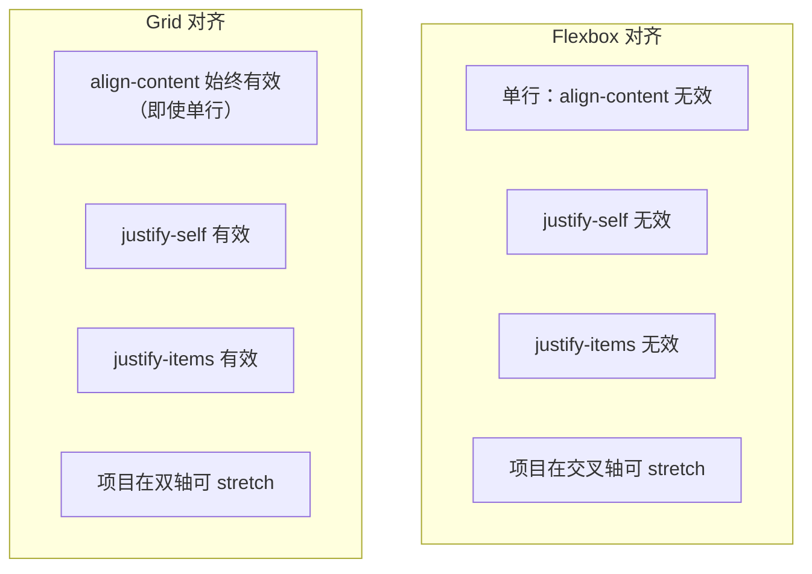
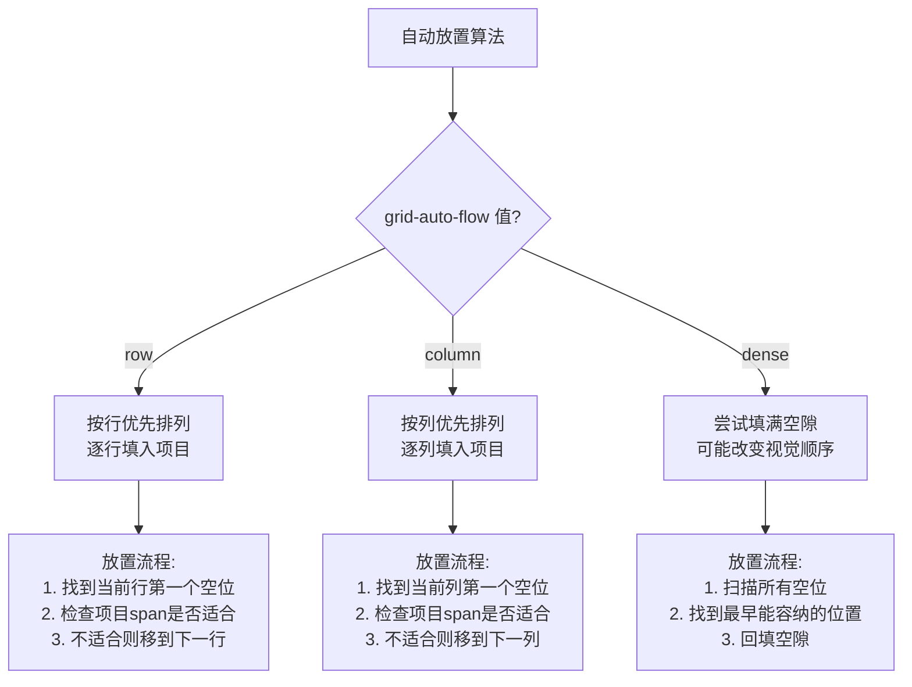
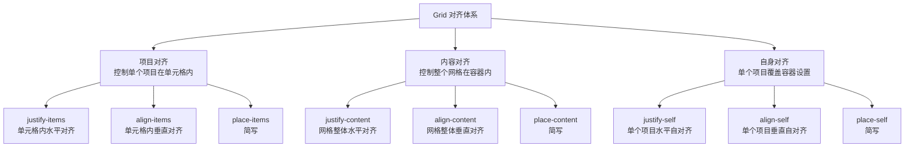

# Grid 项目属性

Grid 项目上的属性控制单个项目在网格中的位置、大小和对齐方式。

## 属性速查表

| 属性 | 说明 | 默认值 | 继承 |
|------|------|--------|------|
| `grid-column-start` | 列起始线 | auto | 否 |
| `grid-column-end` | 列结束线 | auto | 否 |
| `grid-row-start` | 行起始线 | auto | 否 |
| `grid-row-end` | 行结束线 | auto | 否 |
| `grid-column` | 列简写 | auto / auto | 否 |
| `grid-row` | 行简写 | auto / auto | 否 |
| `grid-area` | 区域名或位置 | auto | 否 |
| `justify-self` | 项目水平对齐 | auto | 否 |
| `align-self` | 项目垂直对齐 | auto | 否 |
| `place-self` | 对齐简写 | auto | 否 |
| `order` | 排列顺序 | 0 | 否 |

## 网格线定位属性

### grid-column-start / grid-column-end

指定项目的列范围：

#### 基本用法

```css
.item {
  /* 从第1条线开始 */
  grid-column-start: 1;
  
  /* 到第3条线结束 */
  grid-column-end: 3;
}
```

#### 使用 span 关键字

```css
.item {
  grid-column-start: 1;
  grid-column-end: span 2; /* 从起点跨越2列 */
}
```

#### 使用命名网格线

```css
.container {
  grid-template-columns: [content-start] 1fr [content-end sidebar-start] 200px [sidebar-end];
}

.item {
  grid-column-start: content-start;
  grid-column-end: content-end;
}
```

### grid-row-start / grid-row-end

指定项目的行范围：

```css
.item {
  grid-row-start: 1;
  grid-row-end: 3;
  
  /* 或使用 span */
  grid-row-start: 1;
  grid-row-end: span 2;
}
```

### grid-column / grid-row 简写

更简洁的写法：

```css
.item {
  /* start / end */
  grid-column: 1 / 3;
  grid-row: 1 / 2;
  
  /* start / span */
  grid-column: 1 / span 2;
  grid-row: 1 / span 3;
  
  /* 单个值：只设置 start */
  grid-column: 1;
  grid-row: 2;
  
  /* 仅使用 span */
  grid-column: span 2;
  grid-row: span 3;
}
```


#### grid-column 交互演示（MDN）

grid-column-start/end 的简写，控制项目水平跨越范围。

```html
<!DOCTYPE html>
<html lang="zh-CN">
  <head>
    <meta charset="UTF-8" />
    <meta name="viewport" content="width=device-width, initial-scale=1.0" />
    <title>grid-column 属性演示 - MDN 示例</title>
    <meta name="description" content="grid-column 属性演示" />
    <style>
      * {
        margin: 0;
        padding: 0;
        box-sizing: border-box;
      }
      body {
        font-family: -apple-system, BlinkMacSystemFont, "Segoe UI", Roboto, "Helvetica Neue", Arial, sans-serif;
        min-height: 100vh;
        padding: 0;
      }
      .demo-layout {
        display: flex;
        height: 100vh;
        gap: 0;
      }
      .snippet-panel {
        width: 320px;
        flex-shrink: 0;
        padding: 16px;
        display: flex;
        flex-direction: column;
        gap: 8px;
        overflow-y: auto;
        border-right: 1px solid #ddd;
        background: #fafafa;
      }
      .snippet-btn {
        padding: 10px 14px;
        border: 1px solid #ccc;
        border-radius: 6px;
        background: #fff;
        font-family: "JetBrains Mono", "Fira Code", monospace;
        font-size: 13px;
        color: #333;
        cursor: pointer;
        text-align: left;
        transition: all 0.2s;
        line-height: 1.4;
      }
      .snippet-btn:hover {
        border-color: #8083ff;
        background: #f0f0ff;
      }
      .snippet-btn.active {
        border-color: #8083ff;
        background: #e8e8ff;
        color: #571bc1;
        font-weight: 600;
      }
      .preview-panel {
        flex: 1;
        padding: 16px;
        display: flex;
        align-items: center;
        justify-content: center;
        background: #fff;
        overflow: auto;
      }
      .preview-panel > section,
      .preview-panel > div:not(.snippet-panel):not(.demo-layout) {
        flex: 1;
        width: 100%;
        min-height: 0;
        height: 100%;
        display: flex;
        align-items: center;
        justify-content: center;
      }
      .example-container {
        border: 1px solid #c5c5c5;
        display: grid;
        grid-template-columns: 1fr 1.5fr 1fr;
        grid-template-rows: repeat(3, minmax(40px, auto));
        grid-gap: 10px;
        width: 200px;
      }

      .example-container > div {
        background-color: rgba(0, 0, 255, 0.2);
        border: 3px solid blue;
      }

      #example-element {
        background-color: rgba(255, 0, 200, 0.2);
        border: 3px solid rebeccapurple;
      }
    </style>
  </head>
  <body>
    <div class="demo-layout">
      <div class="snippet-panel">
        <button class="snippet-btn active" data-index="0">grid-column: 1;</button>
        <button class="snippet-btn" data-index="1">grid-column: 1 / 3;</button>
        <button class="snippet-btn" data-index="2">grid-column: 2 / -1;</button>
        <button class="snippet-btn" data-index="3">grid-column: 1 / span 2;</button>
      </div>
      <div class="preview-panel">
        <section class="default-example" id="default-example">
          <div class="example-container">
            <div class="transition-all" id="example-element">One</div>
            <div>Two</div>
            <div>Three</div>
          </div>
        </section>
      </div>
    </div>
    <script>
      const snippets = [
        `#example-element {
  grid-column: 1;
}`,
        `#example-element {
  grid-column: 1 / 3;
}`,
        `#example-element {
  grid-column: 2 / -1;
}`,
        `#example-element {
  grid-column: 1 / span 2;
}`,
      ];

      let styleEl = document.createElement("style");
      document.head.appendChild(styleEl);

      function applySnippet(index) {
        styleEl.textContent = snippets[index];
        document.querySelectorAll(".snippet-btn").forEach((btn, i) => {
          btn.classList.toggle("active", i === index);
        });
      }

      document.querySelectorAll(".snippet-btn").forEach((btn) => {
        btn.addEventListener("click", () => applySnippet(parseInt(btn.dataset.index)));
      });

      applySnippet(0);
    </script>
  </body>
</html>

```

#### grid-row 交互演示（MDN）

grid-row-start/end 的简写，控制项目垂直跨越范围。

```html
<!DOCTYPE html>
<html lang="zh-CN">
  <head>
    <meta charset="UTF-8" />
    <meta name="viewport" content="width=device-width, initial-scale=1.0" />
    <title>grid-row 属性演示 - MDN 示例</title>
    <meta name="description" content="grid-row 属性演示" />
    <style>
      * {
        margin: 0;
        padding: 0;
        box-sizing: border-box;
      }
      body {
        font-family: -apple-system, BlinkMacSystemFont, "Segoe UI", Roboto, "Helvetica Neue", Arial, sans-serif;
        min-height: 100vh;
        padding: 0;
      }
      .demo-layout {
        display: flex;
        height: 100vh;
        gap: 0;
      }
      .snippet-panel {
        width: 320px;
        flex-shrink: 0;
        padding: 16px;
        display: flex;
        flex-direction: column;
        gap: 8px;
        overflow-y: auto;
        border-right: 1px solid #ddd;
        background: #fafafa;
      }
      .snippet-btn {
        padding: 10px 14px;
        border: 1px solid #ccc;
        border-radius: 6px;
        background: #fff;
        font-family: "JetBrains Mono", "Fira Code", monospace;
        font-size: 13px;
        color: #333;
        cursor: pointer;
        text-align: left;
        transition: all 0.2s;
        line-height: 1.4;
      }
      .snippet-btn:hover {
        border-color: #8083ff;
        background: #f0f0ff;
      }
      .snippet-btn.active {
        border-color: #8083ff;
        background: #e8e8ff;
        color: #571bc1;
        font-weight: 600;
      }
      .preview-panel {
        flex: 1;
        padding: 16px;
        display: flex;
        align-items: center;
        justify-content: center;
        background: #fff;
        overflow: auto;
      }
      .preview-panel > section,
      .preview-panel > div:not(.snippet-panel):not(.demo-layout) {
        flex: 1;
        width: 100%;
        min-height: 0;
        height: 100%;
        display: flex;
        align-items: center;
        justify-content: center;
      }
      .example-container {
        border: 1px solid #c5c5c5;
        display: grid;
        grid-template-columns: 1fr 1.5fr 1fr;
        grid-template-rows: repeat(3, minmax(40px, auto));
        grid-gap: 10px;
        width: 200px;
      }

      .example-container > div {
        background-color: rgba(0, 0, 255, 0.2);
        border: 3px solid blue;
      }

      #example-element {
        background-color: rgba(255, 0, 200, 0.2);
        border: 3px solid rebeccapurple;
      }
    </style>
  </head>
  <body>
    <div class="demo-layout">
      <div class="snippet-panel">
        <button class="snippet-btn active" data-index="0">grid-row: 1;</button>
        <button class="snippet-btn" data-index="1">grid-row: 1 / 3;</button>
        <button class="snippet-btn" data-index="2">grid-row: 2 / -1;</button>
        <button class="snippet-btn" data-index="3">grid-row: 1 / span 2;</button>
      </div>
      <div class="preview-panel">
        <section class="default-example" id="default-example">
          <div class="example-container">
            <div class="transition-all" id="example-element">One</div>
            <div>Two</div>
            <div>Three</div>
          </div>
        </section>
      </div>
    </div>
    <script>
      const snippets = [
        `#example-element {
  grid-row: 1;
}`,
        `#example-element {
  grid-row: 1 / 3;
}`,
        `#example-element {
  grid-row: 2 / -1;
}`,
        `#example-element {
  grid-row: 1 / span 2;
}`,
      ];

      let styleEl = document.createElement("style");
      document.head.appendChild(styleEl);

      function applySnippet(index) {
        styleEl.textContent = snippets[index];
        document.querySelectorAll(".snippet-btn").forEach((btn, i) => {
          btn.classList.toggle("active", i === index);
        });
      }

      document.querySelectorAll(".snippet-btn").forEach((btn) => {
        btn.addEventListener("click", () => applySnippet(parseInt(btn.dataset.index)));
      });

      applySnippet(0);
    </script>
  </body>
</html>

```
### 网格线编号系统

#### 正向编号

从左上角开始，从 1 递增：

```
  1         2         3         4
  ├─────────┼─────────┼─────────┤
1 │    1    │    2    │    3    │
  ├─────────┼─────────┼─────────┤
2 │    4    │    5    │    6    │
  ├─────────┼─────────┼─────────┤
3 │    7    │    8    │    9    │
  └─────────┴─────────┴─────────┘
```

#### 负向编号

从右下角开始，从 -1 递减：

```
 -4        -3        -2        -1
  ├─────────┼─────────┼─────────┤
  │         │         │         │
  ├─────────┼─────────┼─────────┤
  │         │         │         │
  ├─────────┼─────────┼─────────┤
  │         │         │         │
  └─────────┴─────────┴─────────┘
```

#### 负数的使用

```css
.item {
  grid-column: 1 / -1; /* 从第一列到最后一列 */
  grid-row: -2 / -1;   /* 倒数第二行到最后一行 */
}
```

### 定位示例

#### 占据第一列

```css
.item {
  grid-column: 1 / 2;
}
```

#### 跨越所有列

```css
.header {
  grid-column: 1 / -1; /* 或 span 所有列数 */
}
```

#### 占据中间区域

```css
.main {
  grid-column: 2 / -2; /* 第二列到倒数第二列 */
}
```

#### 固定在右下角

```css
.item {
  grid-column: -2 / -1;
  grid-row: -2 / -1;
}
```

## grid-area 区域属性

### 引用命名区域

使用 `grid-template-areas` 定义的名称：

```css
.container {
  display: grid;
  grid-template-areas:
    "header header"
    "sidebar main"
    "footer footer";
}

.header { grid-area: header; }
.sidebar { grid-area: sidebar; }
.main { grid-area: main; }
.footer { grid-area: footer; }
```

### 直接指定位置

使用网格线编号：

```css
.item {
  /* row-start / column-start / row-end / column-end */
  grid-area: 1 / 2 / 3 / 4;
}

/* 等同于 */
.item {
  grid-row-start: 1;
  grid-column-start: 2;
  grid-row-end: 3;
  grid-column-end: 4;
}
```

### 组合使用

```css
.container {
  grid-template-areas:
    "header header header"
    "sidebar main main"
    "footer footer footer";
}

.main {
  grid-area: main;
  /* 占据 main 区域 */
}

.header {
  grid-area: header;
  /* 占据 header 区域 */
}
```

## 对齐属性

### justify-self 项目水平对齐

覆盖容器的 `justify-items` 设置，控制单个项目的水平对齐：

```css
.item {
  justify-self: start;   /* 起点对齐 */
  justify-self: end;     /* 终点对齐 */
  justify-self: center;  /* 居中对齐 */
  justify-self: stretch; /* 拉伸填满 */
  justify-self: auto;    /* 继承容器设置（默认） */
}
```

**可视化对比**：

```
start:              center:            stretch:
┌──────────────┐    ┌──────────────┐    ┌──────────────┐
│item          │    │    item      │    │    item      │
└──────────────┘    └──────────────┘    └──────────────┘
```


#### justify-self 交互演示（MDN）

覆盖单个网格项目在行内方向的对齐方式。

```html
<!DOCTYPE html>
<html lang="zh-CN">
  <head>
    <meta charset="UTF-8" />
    <meta name="viewport" content="width=device-width, initial-scale=1.0" />
    <title>justify-self 属性演示 - MDN 示例</title>
    <meta name="description" content="justify-self 属性演示" />
    <style>
      * {
        margin: 0;
        padding: 0;
        box-sizing: border-box;
      }
      body {
        font-family: -apple-system, BlinkMacSystemFont, "Segoe UI", Roboto, "Helvetica Neue", Arial, sans-serif;
        min-height: 100vh;
        padding: 0;
      }
      .demo-layout {
        display: flex;
        height: 100vh;
        gap: 0;
      }
      .snippet-panel {
        width: 320px;
        flex-shrink: 0;
        padding: 16px;
        display: flex;
        flex-direction: column;
        gap: 8px;
        overflow-y: auto;
        border-right: 1px solid #ddd;
        background: #fafafa;
      }
      .snippet-btn {
        padding: 10px 14px;
        border: 1px solid #ccc;
        border-radius: 6px;
        background: #fff;
        font-family: "JetBrains Mono", "Fira Code", monospace;
        font-size: 13px;
        color: #333;
        cursor: pointer;
        text-align: left;
        transition: all 0.2s;
        line-height: 1.4;
      }
      .snippet-btn:hover {
        border-color: #8083ff;
        background: #f0f0ff;
      }
      .snippet-btn.active {
        border-color: #8083ff;
        background: #e8e8ff;
        color: #571bc1;
        font-weight: 600;
      }
      .preview-panel {
        flex: 1;
        padding: 16px;
        display: flex;
        align-items: center;
        justify-content: center;
        background: #fff;
        overflow: auto;
      }
      .preview-panel > section,
      .preview-panel > div:not(.snippet-panel):not(.demo-layout) {
        flex: 1;
        width: 100%;
        min-height: 0;
        height: 100%;
        display: flex;
        align-items: center;
        justify-content: center;
      }
      .example-container {
        border: 1px solid #c5c5c5;
        display: grid;
        width: 220px;
        grid-template-columns: 1fr 1fr;
        grid-auto-rows: 40px;
        grid-gap: 10px;
      }

      .example-container > div {
        background-color: rgb(0 0 255 / 0.2);
        border: 3px solid blue;
      }
    </style>
  </head>
  <body>
    <div class="demo-layout">
      <div class="snippet-panel">
        <button class="snippet-btn active" data-index="0">justify-self: stretch;</button>
        <button class="snippet-btn" data-index="1">justify-self: center;</button>
        <button class="snippet-btn" data-index="2">justify-self: start;</button>
        <button class="snippet-btn" data-index="3">justify-self: end;</button>
      </div>
      <div class="preview-panel">
        <section class="default-example" id="default-example">
          <div class="example-container">
            <div class="transition-all" id="example-element">一</div>
            <div>二</div>
            <div>三</div>
          </div>
        </section>
      </div>
    </div>
    <script>
      const snippets = [
        `#example-element {
  justify-self: stretch;
}`,
        `#example-element {
  justify-self: center;
}`,
        `#example-element {
  justify-self: start;
}`,
        `#example-element {
  justify-self: end;
}`,
      ];

      let styleEl = document.createElement("style");
      document.head.appendChild(styleEl);

      function applySnippet(index) {
        styleEl.textContent = snippets[index];
        document.querySelectorAll(".snippet-btn").forEach((btn, i) => {
          btn.classList.toggle("active", i === index);
        });
      }

      document.querySelectorAll(".snippet-btn").forEach((btn) => {
        btn.addEventListener("click", () => applySnippet(parseInt(btn.dataset.index)));
      });

      applySnippet(0);
    </script>
  </body>
</html>

```
### align-self 项目垂直对齐

覆盖容器的 `align-items` 设置，控制单个项目的垂直对齐：

```css
.item {
  align-self: start;   /* 起点对齐 */
  align-self: end;     /* 终点对齐 */
  align-self: center;  /* 居中对齐 */
  align-self: stretch; /* 拉伸填满 */
  align-self: auto;    /* 继承容器设置（默认） */
}
```

### place-self 简写

同时设置两个方向的对齐：

```css
.item {
  /* align-self justify-self */
  place-self: center center;
  place-self: center; /* 两个方向相同 */
}
```

### 对齐属性组合示例

```css
.container {
  display: grid;
  grid-template-columns: repeat(3, 200px);
  grid-template-rows: repeat(2, 100px);
  justify-items: stretch;
  align-items: stretch;
}

/* 单个项目居中 */
.item-1 {
  place-self: center;
}

/* 单个项目右上角 */
.item-2 {
  justify-self: end;
  align-self: start;
}
```

## order 排列顺序

控制项目的自动排列顺序：

```css
.item {
  order: 0;   /* 默认 */
  order: 1;   /* 排在后面 */
  order: -1;  /* 排在前面 */
}
```

### order 使用示例

```css
.container {
  display: grid;
  grid-template-columns: repeat(3, 1fr);
  grid-auto-flow: dense;
}

/* 让重要内容优先显示 */
.important {
  order: -1;
}

/* 让次要内容后显示 */
.secondary {
  order: 1;
}
```

### order 与可访问性

**注意**：`order` 只影响视觉顺序，不影响 DOM 顺序和 Tab 键顺序。使用屏幕阅读器或键盘导航时，仍然按照 DOM 顺序。

```html
<!-- 推荐：在 HTML 中就安排好顺序 -->
<div class="main">重要内容</div>
<div class="sidebar">次要内容</div>
```

```css
/* 不推荐：使用 order 改变视觉顺序
   （main 在 DOM 中靠前，却因 order 显示在 sidebar 之后） */
.main { order: 1; }
.sidebar { order: -1; }
```

## 常见应用场景

### 跨列标题

```css
.header {
  grid-column: 1 / -1; /* 跨越所有列 */
}
```

### 跨行侧边栏

```css
.sidebar {
  grid-row: 1 / span 3; /* 跨越3行 */
}
```

### 完全覆盖层

```css
.overlay {
  grid-column: 1 / -1;
  grid-row: 1 / -1;
  z-index: 10;
}
```

### 网格中的精确定位

```css
.container {
  display: grid;
  grid-template-columns: repeat(3, 1fr);
  grid-template-rows: repeat(3, 100px);
}

.item {
  grid-column: 2;  /* 放在第2列 */
  grid-row: 2;     /* 放在第2行 */
}
```

### 响应式位置调整

```css
.item {
  grid-column: 1 / 3;
  grid-row: 1;
}

@media (min-width: 768px) {
  .item {
    grid-column: 2 / 4;
    grid-row: 2;
  }
}

@media (min-width: 1024px) {
  .item {
    grid-column: 3;
    grid-row: 1 / 3;
  }
}
```

### 瀑布流布局

```css
.container {
  display: grid;
  grid-template-columns: repeat(3, 1fr);
  grid-auto-rows: 10px;
  gap: 10px;
}

.item:nth-child(1) { grid-row: span 20; }
.item:nth-child(2) { grid-row: span 30; }
.item:nth-child(3) { grid-row: span 25; }
.item:nth-child(4) { grid-row: span 15; }
.item:nth-child(5) { grid-row: span 35; }
```

### 不规则网格

```css
.container {
  display: grid;
  grid-template-columns: repeat(4, 1fr);
  grid-auto-rows: 150px;
  gap: 20px;
}

/* 第一个大卡片 */
.item:nth-child(1) {
  grid-column: span 2;
  grid-row: span 2;
}

/* 每第5个跨两列 */
.item:nth-child(5n) {
  grid-column: span 2;
}
```

## 高级技巧

### 使用自定义属性

```css
.container {
  --columns: 3;
  display: grid;
  grid-template-columns: repeat(var(--columns), 1fr);
}

.item {
  --span: 2;
  grid-column: span var(--span);
}
```

### 结合 CSS 计数器

```css
.container {
  display: grid;
  grid-template-columns: repeat(3, 1fr);
  counter-reset: item;
}

.item::before {
  counter-increment: item;
  content: counter(item);
}
```

### 使用 :nth-child 模式

```css
/* 每3个一组，第一个跨两列 */
.item:nth-child(3n+1) {
  grid-column: span 2;
}

/* 每4个一组，最后一个跨两行 */
.item:nth-child(4n) {
  grid-row: span 2;
}
```

### 自动填充剩余空间

```css
/* 最后一个项目占据剩余所有行 */
.item:last-child {
  grid-row: auto / -1;
}
```

### 防止项目溢出

```css
.item {
  /* 确保项目可以收缩 */
  min-width: 0;
  min-height: 0;
  
  /* 处理内容溢出 */
  overflow: hidden;
}
```

## 常见问题 FAQ

### Q1: grid-column 和 grid-row 的默认值是什么？

**A**: 默认值都是 `auto`，意味着项目会自动放置在下一个可用位置，占用一个网格单元。

### Q2: 为什么 grid-column: span 2 不起作用？

**A**: 可能原因：
1. 容器列数不足
2. 项目被自动放置到了边缘
3. 需要显式设置起始位置

```css
/* 推荐写法 */
.item {
  grid-column: 1 / span 2; /* 明确起始位置 */
}
```

### Q3: 如何让项目占据整个网格？

**A**: 使用 `grid-area` 或分别设置行列：

```css
/* 方法1: 使用负数 */
.item {
  grid-column: 1 / -1;
  grid-row: 1 / -1;
}

/* 方法2: 使用 grid-area */
.item {
  grid-area: 1 / 1 / -1 / -1;
}
```

### Q4: align-self 和 align-items 有什么区别？

**A**:
- `align-items`: 设置在容器上，影响所有项目
- `align-self`: 设置在项目上，只影响当前项目，优先级更高

### Q5: 使用 order 有什么注意事项？

**A**:
1. 只影响视觉顺序，不影响 DOM 顺序
2. 可能影响键盘导航和屏幕阅读器的体验
3. 不应该仅为了视觉效果而使用

### Q6: 如何实现项目的精确定位？

**A**: 使用命名网格线或明确的编号：

```css
.container {
  grid-template-columns: 
    [left-start] 200px [left-end main-start] 1fr [main-end right-start] 200px [right-end];
}

.main {
  grid-column: main-start / main-end;
}
```

### Q7: 项目为什么超出了网格范围？

**A**: 项目跨越的网格线超出了定义的范围，会创建隐式网格：

```css
/* 容器定义了3列 */
.container {
  grid-template-columns: repeat(3, 1fr);
}

/* 项目跨越5列，创建了2列隐式网格 */
.item {
  grid-column: 1 / 6; /* 注意！ */
}
```

### Q8: span 可以和负数一起使用吗？

**A**: 不可以，`span` 只能使用正整数：

```css
/* 错误 */
.item {
  grid-column: span -1;
}

/* 正确 */
.item {
  grid-column: 1 / -1;
}
```

## 网格线编号体系

### 编号规则

Grid 线的编号是项目定位的基础，理解其规则至关重要：

```
grid-template-columns: 200px 1fr 300px

列线编号（正数，从左到右）：
1         2         3         4
├─────────┼─────────┼─────────┤
│  200px  │   1fr   │  300px  │
├─────────┼─────────┼─────────┤

列线编号（负数，从右到左）：
-4        -3        -2        -1
```

**编号规则**：
- 正数：从 1 开始，从起始方向（LTR 中为左侧/顶部）递增
- 负数：从 -1 开始，从结束方向递减（-1 = 最后一条线）
- 正数和负数可以混用：`grid-column: 1 / -1` 表示从第一列到最后一列

### 书写模式对线编号的影响

在 `writing-mode: vertical-rl` 中，线编号的方向随书写模式变化：

| 书写模式 | 行线编号方向 | 列线编号方向 |
|----------|-------------|-------------|
| `horizontal-tb` | 从上到下 | 从左到右 |
| `vertical-rl` | 从右到左 | 从上到下 |
| `vertical-lr` | 从左到右 | 从上到下 |

> **建议**：在多语言项目中，优先使用逻辑属性（`inline-size`/`block-size`）和命名线，而非物理编号。

### span 关键字详解

`span` 指定项目跨越的轨道数量，而非定位到哪条线：

```css
/* 跨 2 列（从自动放置的起始位置开始） */
.item { grid-column: span 2; }

/* 跨 3 行 */
.item { grid-row: span 3; }

/* 从第 2 条线开始，跨 2 列 → 结束线为 4 */
.item { grid-column: 2 / span 2; }

/* 从第 -3 条线开始，跨 2 列 */
.item { grid-column: -3 / span 2; }
```

**span 的规则**：
- `span N` 中的 N 必须是正整数
- `span` 只能作为 `grid-row-start`/`grid-column-start` 或 `grid-row-end`/`grid-column-end` 的值
- 一条轴的两个值中，最多只有一个使用 `span`
- 如果两个值都用 `span`，则 `grid-row-start`/`grid-column-start` 的 `span` 被忽略

```css
/* 写法合法，但 start 的 span 会被忽略（视为 auto），实际只跨 3 列 */
.item { grid-column: span 2 / span 3; }

/* 有效：一个用 span，一个用编号 */
.item { grid-column: span 2 / 5; }
.item { grid-column: 2 / span 3; }
```

### grid-area 四值语法边界情况

```css
/* 标准四值语法 */
grid-area: row-start / column-start / row-end / column-end;

/* 常见写法 */
.item { grid-area: 1 / 2 / 3 / 4; }

/* 省略值的行为 */
grid-area: 1 / 2;       /* 等价于 1 / 2 / auto / auto → 跨 1 行 1 列 */
grid-area: 1 / 2 / 3;  /* 等价于 1 / 2 / 3 / auto → 列结束为 auto */
grid-area: span 2 / 3;  /* 等价于 span 2 / 3 / auto / auto → 跨 2 行，从第 3 列开始 */

/* 使用命名区域 */
.item { grid-area: header; } /* 等价于 grid-row/header 的四条命名线 */
```

**grid-area 值解析优先级**：
1. 如果只有一个值且不是数字 → 作为 `grid-template-areas` 的区域名
2. 如果是数字或 span → 按 `row-start / col-start / row-end / col-end` 解析
3. 缺失的值默认为 `auto`

---

## Grid 对齐可视化

Grid 的对齐体系在规范层面与 Flexbox 共享 CSS Box Alignment Module，但实际行为有重要差异。

### Grid vs Flexbox 对齐行为差异



| 对齐属性 | Flexbox 行为 | Grid 行为 |
|---------|-------------|-----------|
| `justify-content` | 有效（主轴空间分配） | 有效（网格整体水平位置） |
| `align-content` | 仅多行时有效 | **始终有效**（即使单行） |
| `justify-items` | **无效** | 有效（单元格内水平对齐） |
| `align-items` | 有效（交叉轴项目对齐） | 有效（单元格内垂直对齐） |
| `justify-self` | **无效** | 有效（单个项目水平自对齐） |
| `align-self` | 有效（交叉轴自对齐） | 有效（单个项目垂直自对齐） |

### align-content 在 Grid 中的可视化效果

与 Flexbox 不同，Grid 的 `align-content` 在单行网格中也有效——它控制**整个网格在容器内的垂直位置**：

```css
.container {
  display: grid;
  grid-template-columns: repeat(3, 100px);
  grid-template-rows: 100px;
  height: 400px; /* 容器高度大于网格高度 */
  align-content: center; /* 网格整体垂直居中 */
}
```

```
align-content: start        align-content: center       align-content: space-between
┌─────────────────────┐     ┌─────────────────────┐     ┌─────────────────────┐
│ ┌───┬───┬───┐       │     │                     │     │ ┌───┬───┬───┐       │
│ │   │   │   │       │     │                     │     │ │   │   │   │       │
│ └───┴───┴───┘       │     │ ┌───┬───┬───┐       │     │ └───┴───┴───┘       │
│                     │     │ │   │   │   │       │     │                     │
│                     │     │ └───┴───┴───┘       │     │                     │
│                     │     │                     │     │                     │
│      (空白)         │     │      (空白)         │     │      (空白)         │
└─────────────────────┘     └─────────────────────┘     └─────────────────────┘
```

### justify-content 在 Grid 中的可视化效果

```css
.container {
  display: grid;
  grid-template-columns: repeat(3, 100px);
  width: 500px; /* 容器宽度大于网格宽度 */
  justify-content: center; /* 网格整体水平居中 */
}
```

```
justify-content: start      justify-content: center     justify-content: space-between
┌─────────────────────┐     ┌─────────────────────┐     ┌─────────────────────┐
│┌───┬───┬───┐        │     │   ┌───┬───┬───┐     │     │┌───┐   ┌───┐   ┌───┐│
││   │   │   │  (空白)│     │   │   │   │   │     │     ││   │   │   │   │   ││
│└───┴───┴───┘        │     │   └───┴───┴───┘     │     │└───┘   └───┘   └───┘│
└─────────────────────┘     └─────────────────────┘     └─────────────────────┘
```

### baseline 对齐在 Grid 中的行为

Grid 中 `align-items: baseline` 让所有项目按第一行文字基线对齐：

```css
.container {
  display: grid;
  grid-template-columns: repeat(3, 1fr);
  align-items: baseline; /* 所有项目按基线对齐 */
}

.item:nth-child(1) { font-size: 2rem; }
.item:nth-child(2) { font-size: 0.875rem; }
.item:nth-child(3) { font-size: 1.25rem; }
```

> **与 Flexbox 的区别**：Grid 的 `baseline` 对齐基于每个**单元格**内的项目，Flexbox 基于**整行**的 Flex 项目。在 Grid 中，不同行的基线对齐是独立的。

---

## 网格项目放置策略

### Line-based 放置详解

Grid 的线编号系统是项目放置的基础。理解线的编号规则至关重要：

```
grid-template-columns: 100px 200px 300px

列线编号（正数，从左到右）：
1       2       3       4
├───────┼───────┼───────┤
│ 100px │ 200px │ 300px │
└───────┴───────┴───────┘

负数编号（从右往左）：
-4      -3      -2      -1
├───────┼───────┼───────┤
│       │       │       │
└───────┴───────┴───────┘
```

**grid-area 四值语法**：

```css
.item {
  /* grid-row-start | grid-column-start | grid-row-end | grid-column-end */
  grid-area: 1 / 2 / 3 / 4;
  
  /* 等价于 */
  grid-row: 1 / 3;
  grid-column: 2 / 4;
}
```

### 隐式命名线（来自 grid-template-areas）

使用 `grid-template-areas` 时，Grid 会自动为每个命名区域的边界创建命名线：

```css
.container {
  grid-template-areas:
    "header header"
    "sidebar main";
}

/* 自动创建的命名线：
   header-start, header-end    (行和列方向)
   sidebar-start, sidebar-end
   main-start, main-end
*/
```

```css
/* 使用隐式命名线定位 */
.item {
  grid-column: header-start / header-end;
  grid-row: sidebar-start / main-start;
}
```

### 自动放置算法（Auto-placement）

当项目未显式指定位置时，Grid 的自动放置算法决定其位置。



**row vs dense 的实际效果**：

```css
/* 3列网格，第1个项目跨2列 */

/* grid-auto-flow: row（默认，留空洞） */
┌───────┬───┬───┐
│   1   │   │   │  ← 项目1跨2列
│(跨2列)├───┤ 3 │  ← 项目2 被放到下一行，留下空隙
├───────┤ 2 ├───┤
│   4   │   │   │
└───────┴───┴───┘

/* grid-auto-flow: row dense（填满空隙） */
┌───────┬───┬───┐
│   1   │ 2 │ 3 │  ← 项目2填入空隙
│(跨2列)├───┼───┤
├───────┤ 4 │   │
│   5   │   │   │
└───────┴───┴───┘
```

> **注意**：`dense` 可能改变项目的视觉顺序与 DOM 顺序，影响可访问性。仅在视觉顺序无关紧要时使用。

---

## Grid 对齐体系矩阵

CSS Box Alignment 模块在 Grid 中完整可用（比 Flexbox 多了 `justify-items` 和 `justify-self`）。



### 对齐属性分类对照

| 作用对象 | 主轴（justify-*） | 交叉轴（align-*） | Grid 特有 |
|---------|-------------------|-------------------|-----------|
| 所有项目 | `justify-items` | `align-items` | — |
| 单个项目 | `justify-self` | `align-self` | — |
| 网格整体 | `justify-content` | `align-content` | — |

> **与 Flexbox 的区别**：Grid 支持 `justify-items` 和 `justify-self`，Flexbox 不支持。

### 安全对齐（Safe / Unsafe Alignment）

```css
/* 安全对齐：溢出时回退为 start */
.item {
  place-self: safe center;
}

/* 不安全对齐：溢出时仍保持居中（两侧裁切） */
.item {
  place-self: unsafe center;
}
```

---

## 最佳实践

1. **优先使用命名区域**：`grid-area` 让代码更语义化
2. **使用负数定位末尾**：`grid-column: 1 / -1` 简洁高效
3. **使用 span 简化代码**：`grid-column: span 2` 比计算起止线更直观
4. **谨慎使用 order**：考虑可访问性
5. **设置 min-width: 0**：防止内容溢出
6. **覆盖容器对齐**：使用 `justify-self`/`align-self` 单独控制
7. **配合媒体查询**：实现响应式布局调整
8. **使用开发者工具**：可视化网格线帮助调试

## 浏览器兼容性

### 属性支持

| 属性 | Chrome | Firefox | Safari | Edge |
|------|--------|---------|--------|------|
| 基础定位属性 | 57+ | 52+ | 10.1+ | 16+ |
| grid-area | 57+ | 52+ | 10.1+ | 16+ |
| 对齐属性 | 57+ | 52+ | 10.1+ | 16+ |
| order | 57+ | 52+ | 10.1+ | 16+ |

### 兼容性建议

所有现代浏览器都支持 Grid 项目属性，无需特殊处理。对于需要支持 IE 的项目，参考 IE 特定语法。

