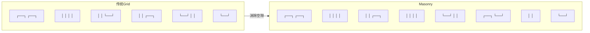
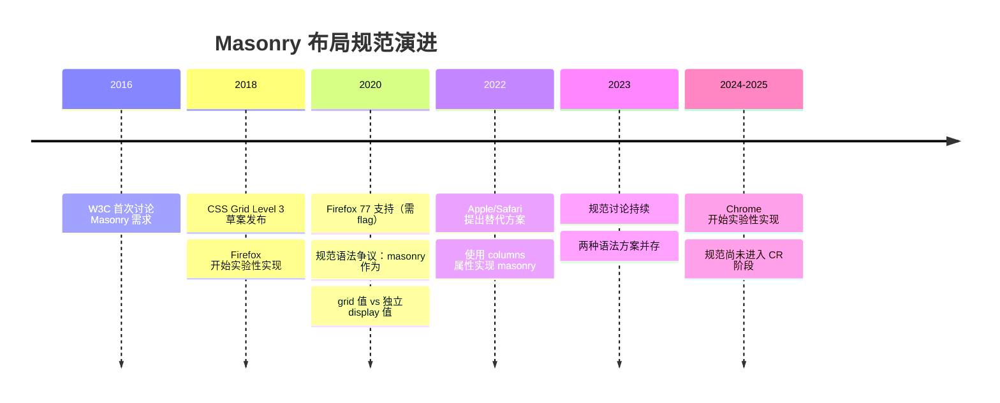
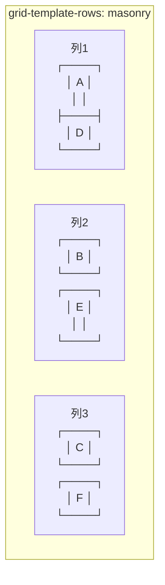
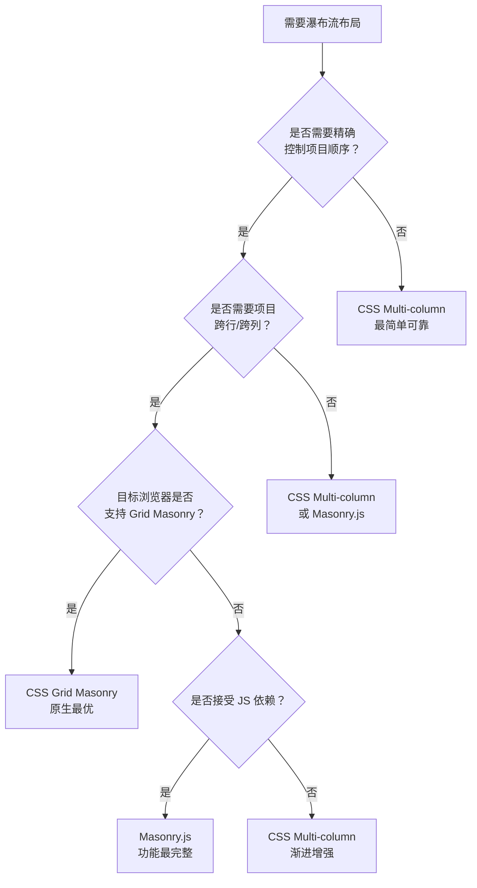

# Grid 瀑布流布局：Masonry

CSS Grid 的 Masonry 布局模式允许网格项目在列（或行）中自然流动填充空隙，实现类似 Pinterest 的瀑布流效果——无需 JavaScript 计算定位。

## 概述

传统 Grid 布局中，网格行高由该行最高项目决定，导致短项目下方留有空白。Masonry 模式打破这一约束，让项目自动向上填充空隙。



## 规范进展：CSS Grid Level 3

Masonry 布局属于 **CSS Grid Layout Module Level 3** 草案规范。该规范的目标是在不引入新布局模型的前提下，通过扩展 Grid 的 `grid-template-rows` 和 `grid-template-columns` 属性，让 Grid 具备瀑布流能力。

### 规范演进时间线



### 语法争议：两种方案

W3C 内部对 Masonry 的语法归属存在分歧，目前有两种竞争方案：

**方案一：Grid 集成方案（Firefox 主导）**

将 `masonry` 作为 `grid-template-rows` / `grid-template-columns` 的值，Masonry 是 Grid 的子集：

```css
/* 方案一：masonry 作为 Grid 的扩展 */
.masonry {
  display: grid;
  grid-template-columns: repeat(3, 1fr);
  grid-template-rows: masonry;  /* 行方向自动填充 */
}
```

**方案二：独立布局方案（Apple/Safari 主导）**

将 Masonry 作为独立的 `display` 值，与 Grid 平级：

```css
/* 方案二：masonry 作为独立 display 值 */
.masonry {
  display: masonry;
  masonry-template-tracks: repeat(3, 1fr);
  masonry-direction: column;
  masonry-fill: pack;
}
```

| 对比维度 | 方案一（Grid 集成） | 方案二（独立布局） |
|----------|---------------------|-------------------|
| 语法复用 | 复用 Grid 语法，学习成本低 | 新语法，概念更清晰 |
| 功能范围 | 仅限 Grid 的 masonry 模式 | 可独立发展 masonry 特性 |
| 实现复杂度 | 需修改 Grid 算法 | 独立实现，不影响 Grid |
| 浏览器实现 | Firefox 已实现 | 仅有提案，无实现 |
| 社区倾向 | 主流社区更倾向此方案 | 部分规范作者倾向此方案 |

> **当前状态**：方案一（Grid 集成）拥有实际浏览器实现和更广泛的社区支持，是更可能成为标准的方案。但规范仍在讨论中，最终语法可能调整。

---

## 两种语法方案详解

### grid-template-rows: masonry（列方向瀑布流）

这是最常见的用法——列固定、行自动填充。项目从上到下排列，短项目下方的空隙会被后续项目自动填充。

```css
.column-masonry {
  display: grid;
  /* 列轨道明确定义 */
  grid-template-columns: repeat(3, 1fr);
  /* 行轨道使用 masonry，自动紧凑排列 */
  grid-template-rows: masonry;
  gap: 16px;
}
```

**布局逻辑**：
1. 浏览器按 DOM 顺序依次放置项目
2. 每个项目放入当前最短的列（`pack` 模式）
3. 项目高度由内容决定，不强制等高
4. 后续项目向上填充已放置项目下方的空隙



### grid-template-columns: masonry（行方向瀑布流）

行固定、列自动填充。项目从左到右排列，适用于横向滚动的瀑布流场景。

```css
.row-masonry {
  display: grid;
  /* 行轨道明确定义 */
  grid-template-rows: repeat(3, 1fr);
  /* 列轨道使用 masonry，自动紧凑排列 */
  grid-template-columns: masonry;
  gap: 16px;
}
```

**布局逻辑**：
1. 项目按 DOM 顺序放入当前最短的行
2. 项目宽度由内容决定
3. 适用于横向时间线、水平卡片流等场景

### 两种方向对比

| 维度 | `grid-template-rows: masonry` | `grid-template-columns: masonry` |
|------|-------------------------------|----------------------------------|
| 瀑布方向 | 列方向（垂直） | 行方向（水平） |
| 固定轴 | 列数固定 | 行数固定 |
| 填充方向 | 向上填充空隙 | 向左填充空隙 |
| 典型场景 | Pinterest 风格 | 横向卡片流 |
| 项目尺寸 | 宽度固定，高度自适应 | 高度固定，宽度自适应 |

---

## 基本语法

Masonry 有两种实现思路：多列布局回退（全浏览器可用）与 Grid Masonry（实验性）。注意二者不能写在同一条规则里——元素一旦 `display: grid`，`columns` 属性即被忽略：

```css
/* 回退方案：CSS 多列布局 */
.masonry {
  columns: 3;
  column-gap: 16px;
}

/* Grid Masonry 语法（实验性） */
.masonry {
  display: grid;
  grid-template-columns: repeat(3, 1fr);
  grid-template-rows: masonry; /* 核心：行高自动填充 */
  gap: 16px;
}
```

## masonry-auto-flow

`masonry-auto-flow` 控制项目在瀑布流中的放置策略：

```css
.masonry {
  display: grid;
  grid-template-columns: repeat(3, 1fr);
  grid-template-rows: masonry;
  masonry-auto-flow: pack;       /* 默认：填充最短列 */
  masonry-auto-flow: next;       /* 按顺序放置到下一列 */
  masonry-auto-flow: pack ordered; /* 先按 order 排序，再填充最短列 */
}
```

| 值 | 行为 |
|----|------|
| `pack` | 项目放入当前最短列（紧凑布局） |
| `next` | 项目按顺序放入下一列（顺序布局） |
| `ordered` | 先按 `order` 属性排序再放置 |

## 方向控制

```css
/* 列方向瀑布流（默认） */
.masonry-columns {
  grid-template-columns: repeat(3, 1fr);
  grid-template-rows: masonry;
}

/* 行方向瀑布流 */
.masonry-rows {
  grid-template-rows: repeat(3, 1fr);
  grid-template-columns: masonry;
}
```

## 实战：Pinterest 风格瀑布流

```html
<div class="masonry-grid">
  <article class="item" style="--span:2">长内容...</article>
  <article class="item">短内容...</article>
  <article class="item" style="--span:3">超长内容...</article>
  <article class="item">中等内容...</article>
  <article class="item">短内容...</article>
</div>
```

```css
.masonry-grid {
  display: grid;
  grid-template-columns: repeat(auto-fill, minmax(280px, 1fr));
  grid-template-rows: masonry;
  gap: 16px;
  padding: 16px;
}

.item {
  border-radius: 8px;
  background: white;
  box-shadow: 0 2px 8px rgba(0, 0, 0, 0.1);
  overflow: hidden;
}

/* 控制项目跨行 */
.item[style*="--span:2"] {
  grid-row: span 2;
}

.item[style*="--span:3"] {
  grid-row: span 3;
}
```

## 回退方案

Masonry 目前仅在 Firefox 中支持。其他浏览器需要回退到多列布局：

```css
/* 回退：CSS Multi-column */
.masonry-grid {
  columns: 3;
  column-gap: 16px;
}

.masonry-grid .item {
  break-inside: avoid;
  margin-bottom: 16px;
}

/* 渐进增强：支持 masonry 时使用 Grid */
@supports (grid-template-rows: masonry) {
  .masonry-grid {
    display: grid;
    grid-template-columns: repeat(3, 1fr);
    grid-template-rows: masonry;
    columns: unset;
  }

  .masonry-grid .item {
    margin-bottom: 0;
  }
}
```

### Masonry vs Multi-column 对比

| 特性 | Grid Masonry | CSS Multi-column |
|------|-------------|-----------------|
| 项目顺序 | 从左到右、从上到下 | 从上到下、从左到右 |
| 项目跨行 | 支持 `grid-row: span` | 不支持 |
| 响应式列数 | `auto-fill` + `minmax()` | `columns` 数值 |
| 项目定位 | Grid 定位（可精确控制） | 自动流动 |
| 浏览器支持 | 仅 Firefox | 全部 |

---

## 完整示例

### 示例 1：图片卡片瀑布流

```html
<!DOCTYPE html>
<html lang="zh-CN">
<head>
  <meta charset="UTF-8">
  <meta name="viewport" content="width=device-width, initial-scale=1.0">
  <title>Masonry 图片卡片瀑布流</title>
  <style>
    * { margin: 0; padding: 0; box-sizing: border-box; }

    body {
      font-family: -apple-system, BlinkMacSystemFont, "Segoe UI", sans-serif;
      background: #f5f5f5;
      padding: 24px;
    }

    /* 瀑布流容器 */
    .masonry {
      display: grid;
      grid-template-columns: repeat(auto-fill, minmax(280px, 1fr));
      grid-template-rows: masonry;
      gap: 20px;
      max-width: 1200px;
      margin: 0 auto;
    }

    /* 卡片样式 */
    .card {
      background: #fff;
      border-radius: 12px;
      overflow: hidden;
      box-shadow: 0 2px 12px rgba(0, 0, 0, 0.08);
      transition: transform 0.2s, box-shadow 0.2s;
    }

    .card:hover {
      transform: translateY(-4px);
      box-shadow: 0 8px 24px rgba(0, 0, 0, 0.12);
    }

    .card img {
      width: 100%;
      display: block;
      /* 不同高度的图片 */
    }

    .card-body {
      padding: 16px;
    }

    .card-body h3 {
      font-size: 1rem;
      margin-bottom: 8px;
      color: #1a1a1a;
    }

    .card-body p {
      font-size: 0.875rem;
      color: #666;
      line-height: 1.5;
    }

    /* 跨行卡片 */
    .card.tall {
      grid-row: span 2;
    }

    /* 回退：不支持 masonry 时使用多列布局 */
    @supports not (grid-template-rows: masonry) {
      .masonry {
        columns: 3;
        column-gap: 20px;
      }
      .card {
        break-inside: avoid;
        margin-bottom: 20px;
      }
    }
  </style>
</head>
<body>
  <div class="masonry">
    <div class="card tall">
      
      <div class="card-body">
        <h3>山间晨雾</h3>
        <p>清晨的山间，薄雾缭绕，远处的山峰若隐若现，宛如一幅水墨画卷。</p>
      </div>
    </div>
    <div class="card">
      
      <div class="card-body">
        <h3>城市夜景</h3>
        <p>灯火通明的都市。</p>
      </div>
    </div>
    <div class="card">
      
      <div class="card-body">
        <h3>春日花卉</h3>
        <p>盛开的花朵。</p>
      </div>
    </div>
    <div class="card tall">
      
      <div class="card-body">
        <h3>古典建筑</h3>
        <p>历经岁月洗礼的古典建筑，每一块砖石都诉说着历史的故事，精美的雕刻令人叹为观止。</p>
      </div>
    </div>
    <div class="card">
      
      <div class="card-body">
        <h3>碧海蓝天</h3>
        <p>海天一色的美景。</p>
      </div>
    </div>
    <div class="card">
      
      <div class="card-body">
        <h3>密林深处</h3>
        <p>阳光透过树叶洒下斑驳光影。</p>
      </div>
    </div>
  </div>
</body>
</html>
```

### 示例 2：动态内容瀑布流（含 masonry-auto-flow）

```html
<!DOCTYPE html>
<html lang="zh-CN">
<head>
  <meta charset="UTF-8">
  <meta name="viewport" content="width=device-width, initial-scale=1.0">
  <title>Masonry 动态内容瀑布流</title>
  <style>
    * { margin: 0; padding: 0; box-sizing: border-box; }

    body {
      font-family: -apple-system, BlinkMacSystemFont, "Segoe UI", sans-serif;
      background: #fafafa;
      padding: 24px;
    }

    h1 {
      text-align: center;
      margin-bottom: 24px;
      font-size: 1.5rem;
      color: #333;
    }

    /* 控制面板 */
    .controls {
      display: flex;
      justify-content: center;
      gap: 12px;
      margin-bottom: 24px;
    }

    .controls button {
      padding: 8px 20px;
      border: 2px solid #6366f1;
      background: transparent;
      color: #6366f1;
      border-radius: 8px;
      cursor: pointer;
      font-size: 0.875rem;
      transition: all 0.2s;
    }

    .controls button.active,
    .controls button:hover {
      background: #6366f1;
      color: #fff;
    }

    /* 瀑布流容器 */
    .masonry {
      display: grid;
      grid-template-columns: repeat(4, 1fr);
      grid-template-rows: masonry;
      gap: 16px;
      max-width: 1100px;
      margin: 0 auto;
    }

    /* 不同 flow 模式 */
    .masonry.flow-pack {
      masonry-auto-flow: pack;
    }

    .masonry.flow-next {
      masonry-auto-flow: next;
    }

    .masonry.flow-ordered {
      masonry-auto-flow: pack ordered;
    }

    /* 内容卡片 */
    .note {
      background: #fff;
      border-radius: 10px;
      padding: 20px;
      border-left: 4px solid;
      box-shadow: 0 1px 6px rgba(0, 0, 0, 0.06);
    }

    .note.purple  { border-color: #8b5cf6; }
    .note.blue    { border-color: #3b82f6; }
    .note.green   { border-color: #10b981; }
    .note.orange  { border-color: #f59e0b; }
    .note.red     { border-color: #ef4444; }

    .note h3 {
      font-size: 0.95rem;
      margin-bottom: 8px;
      color: #1a1a1a;
    }

    .note p {
      font-size: 0.85rem;
      color: #555;
      line-height: 1.6;
    }

    .note .tag {
      display: inline-block;
      margin-top: 10px;
      padding: 2px 10px;
      border-radius: 20px;
      font-size: 0.75rem;
      background: #f0f0f0;
      color: #666;
    }

    /* 回退方案 */
    @supports not (grid-template-rows: masonry) {
      .masonry {
        columns: 4;
        column-gap: 16px;
      }
      .note {
        break-inside: avoid;
        margin-bottom: 16px;
      }
    }

    @media (max-width: 768px) {
      .masonry {
        grid-template-columns: repeat(2, 1fr);
      }
      @supports not (grid-template-rows: masonry) {
        .masonry { columns: 2; }
      }
    }
  </style>
</head>
<body>
  <h1>Masonry 动态内容瀑布流</h1>

  <div class="controls">
    <button class="active" onclick="setFlow('pack')">Pack 模式</button>
    <button onclick="setFlow('next')">Next 模式</button>
    <button onclick="setFlow('ordered')">Ordered 模式</button>
  </div>

  <div class="masonry flow-pack" id="masonry">
    <div class="note purple">
      <h3>项目规划</h3>
      <p>本季度需要完成三个核心模块的开发，包括用户系统、支付系统和数据分析平台。优先级从高到低排列。</p>
      <span class="tag">规划</span>
    </div>
    <div class="note blue">
      <h3>技术选型</h3>
      <p>前端框架选择 Vue 3 + TypeScript。</p>
      <span class="tag">技术</span>
    </div>
    <div class="note green">
      <h3>设计评审</h3>
      <p>本周五下午进行设计评审，需要准备高保真原型和交互说明文档。重点关注移动端适配方案和无障碍访问支持。</p>
      <span class="tag">设计</span>
    </div>
    <div class="note orange">
      <h3>性能优化</h3>
      <p>首屏加载时间需控制在 2 秒以内。</p>
      <span class="tag">性能</span>
    </div>
    <div class="note red">
      <h3>紧急修复</h3>
      <p>线上环境发现内存泄漏问题，需要排查事件监听器是否正确移除。建议使用 Chrome DevTools 的 Memory 面板进行快照对比分析。</p>
      <span class="tag">紧急</span>
    </div>
    <div class="note blue">
      <h3>API 文档</h3>
      <p>后端接口文档已更新至 v2.3 版本。</p>
      <span class="tag">文档</span>
    </div>
    <div class="note green">
      <h3>代码审查</h3>
      <p>本周需完成 12 个 PR 的审查，重点关注安全性和代码规范。</p>
      <span class="tag">审查</span>
    </div>
    <div class="note purple">
      <h3>团队会议</h3>
      <p>每日站会时间调整为上午 10:00。</p>
      <span class="tag">会议</span>
    </div>
  </div>

  <script>
    // 切换 masonry-auto-flow 模式
    function setFlow(mode) {
      const container = document.getElementById('masonry');
      container.className = 'masonry flow-' + mode;

      // 更新按钮状态
      document.querySelectorAll('.controls button').forEach(btn => {
        btn.classList.remove('active');
      });
      event.target.classList.add('active');
    }
  </script>
</body>
</html>
```

---

## 与 JavaScript 瀑布流库对比

### Masonry.js 简介

[Masonry.js](https://masonry.desandro.com/) 是最流行的 JavaScript 瀑布流库，由 David DeSandro 开发。它通过计算每个元素的位置，实现绝对定位的瀑布流效果。

### 核心对比

| 维度 | CSS Grid Masonry | Masonry.js | CSS Multi-column |
|------|-----------------|------------|------------------|
| **实现方式** | 浏览器原生 Grid 算法 | JS 计算绝对定位 | CSS 多列布局 |
| **性能** | 最优，浏览器原生渲染 | 中等，需 JS 计算和 DOM 操作 | 优，原生渲染 |
| **项目顺序** | 从左到右、从上到下 | 从左到右、从上到下 | 从上到下、从左到右 |
| **跨行/跨列** | 支持 `grid-row: span` | 支持，但需手动配置 | 不支持 |
| **动态内容** | 自动重排 | 需调用 `layout()` | 自动重排 |
| **响应式** | `auto-fill` + `minmax()` | 需监听 resize 事件 | `columns` 属性 |
| **首屏渲染** | 无阻塞，CSS 解析即可 | 需等待 JS 加载执行 | 无阻塞 |
| **SEO 友好** | 高，正常 DOM 结构 | 高，正常 DOM 结构 | 高，正常 DOM 结构 |
| **无障碍** | 优，语义化 DOM | 优，语义化 DOM | 中，阅读顺序异常 |
| **浏览器支持** | 仅 Firefox（实验性） | 全部浏览器 | 全部浏览器 |
| **包体积** | 0 KB | ~25 KB（gzip ~8 KB） | 0 KB |
| **维护成本** | 无，浏览器维护 | 需跟进版本更新 | 无 |

### 何时选择哪种方案？



### Masonry.js 基础用法参考

```html
<!-- Masonry.js 基础用法 -->
<script src="https://unpkg.com/masonry-layout@4/dist/masonry.pkgd.min.js"></script>

<div class="grid">
  <div class="grid-item">...</div>
  <div class="grid-item grid-item--wide">...</div>
  <div class="grid-item">...</div>
</div>

<script>
  // 初始化 Masonry
  const msnry = new Masonry('.grid', {
    itemSelector: '.grid-item',
    columnWidth: 280,
    gutter: 16,
    percentPosition: true,
  });

  // 图片加载后重新布局
  imagesLoaded('.grid', () => {
    msnry.layout();
  });
</script>
```

> **建议**：在 CSS Grid Masonry 规范成熟并获得主流浏览器支持之前，生产环境推荐使用 **CSS Multi-column 作为基础方案**，配合 `@supports` 规则渐进增强到 Grid Masonry。如果需要精确的项目顺序控制和跨行能力，再考虑 Masonry.js。

---

## 浏览器兼容性与 Polyfill 方案

### 当前兼容性现状（2025年）

| 浏览器 | 支持状态 | 启用方式 | 备注 |
|--------|----------|----------|------|
| Firefox 77+ | ✅ 实验性支持 | `about:config` 中设置 `layout.css.grid-template-masonry-value.enabled = true` | 默认关闭 |
| Chrome 140+ | ⚠️ 实验性标志 | 启动参数 `--enable-blink-features=MasonryLayout` 或 `chrome://flags` | 开发中 |
| Safari | ❌ 不支持 | — | 提出 alternative 方案，尚未实现 |
| Edge | ⚠️ 跟随 Chrome | 同 Chrome | 开发中 |
| iOS Safari | ❌ 不支持 | — | — |
| Samsung Internet | ❌ 不支持 | — | — |

### 特性检测

```css
/* 使用 @supports 检测 masonry 支持 */
@supports (grid-template-rows: masonry) {
  .masonry-grid {
    display: grid;
    grid-template-columns: repeat(3, 1fr);
    grid-template-rows: masonry;
  }
}

/* 不支持时的回退 */
@supports not (grid-template-rows: masonry) {
  .masonry-grid {
    columns: 3;
    column-gap: 16px;
  }
  .masonry-grid .item {
    break-inside: avoid;
    margin-bottom: 16px;
  }
}
```

```javascript
// JavaScript 特性检测
function supportsMasonry() {
  const el = document.createElement('div');
  el.style.gridTemplateRows = 'masonry';
  return el.style.gridTemplateRows === 'masonry';
}

if (supportsMasonry()) {
  document.documentElement.classList.add('masonry-supported');
} else {
  document.documentElement.classList.add('masonry-not-supported');
}
```

### Polyfill 方案

目前没有官方的 CSS Masonry Polyfill，但可以通过以下方式模拟：

**方案一：CSS Multi-column 渐进增强（推荐）**

```css
/* 基础：多列布局 */
.masonry-grid {
  columns: 3;
  column-gap: 16px;
}

.masonry-grid .item {
  break-inside: avoid;
  margin-bottom: 16px;
}

/* 增强：支持 masonry 时升级 */
@supports (grid-template-rows: masonry) {
  .masonry-grid {
    display: grid;
    grid-template-columns: repeat(3, 1fr);
    grid-template-rows: masonry;
    columns: unset;
  }
  .masonry-grid .item {
    margin-bottom: 0;
  }
}
```

**方案二：JavaScript 位置计算 Polyfill**

```javascript
// 简易 Masonry Polyfill：计算绝对定位
function masonryPolyfill(container, itemSelector, columnCount, gap) {
  const items = container.querySelectorAll(itemSelector);
  const columnHeights = new Array(columnCount).fill(0);
  const containerWidth = container.offsetWidth;
  const columnWidth = (containerWidth - gap * (columnCount - 1)) / columnCount;

  container.style.position = 'relative';

  items.forEach(item => {
    // 找到最短列
    const minHeight = Math.min(...columnHeights);
    const columnIndex = columnHeights.indexOf(minHeight);

    // 设置位置
    item.style.position = 'absolute';
    item.style.width = columnWidth + 'px';
    item.style.left = columnIndex * (columnWidth + gap) + 'px';
    item.style.top = columnHeights[columnIndex] + 'px';

    // 更新列高度
    columnHeights[columnIndex] += item.offsetHeight + gap;
  });

  // 设置容器高度
  container.style.height = Math.max(...columnHeights) + 'px';
}

// 使用示例
const grid = document.querySelector('.masonry-grid');
masonryPolyfill(grid, '.item', 3, 16);

// 响应式：窗口变化时重新计算
window.addEventListener('resize', () => {
  masonryPolyfill(grid, '.item', 3, 16);
});
```

**方案三：使用 Masonry.js 作为 Polyfill**

```javascript
// 条件加载 Masonry.js
if (!CSS.supports('grid-template-rows', 'masonry')) {
  const script = document.createElement('script');
  script.src = 'https://unpkg.com/masonry-layout@4/dist/masonry.pkgd.min.js';
  script.onload = () => {
    new Masonry('.masonry-grid', {
      itemSelector: '.item',
      percentPosition: true,
      gutter: 16,
    });
  };
  document.head.appendChild(script);
}
```

> **生产建议**：对于大多数场景，CSS Multi-column 渐进增强方案已经足够。只有在需要精确控制项目顺序和跨行能力时，才需要引入 JavaScript 方案。

---

## 参考资源

- [MDN: masonry](https://developer.mozilla.org/en-US/docs/Web/CSS/CSS_grid_layout/Masonry_layout)
- [CSS Grid Level 3 Specification](https://drafts.csswg.org/css-grid-3/)
- [Masonry layout in CSS](https://www.smashingmagazine.com/2023/05/masonry-layouts-css-grid/)
- [Masonry.js 官方文档](https://masonry.desandro.com/)
- [W3C CSS Grid Level 3 Issue Tracker](https://github.com/w3c/csswg-drafts/issues?q=masonry)
