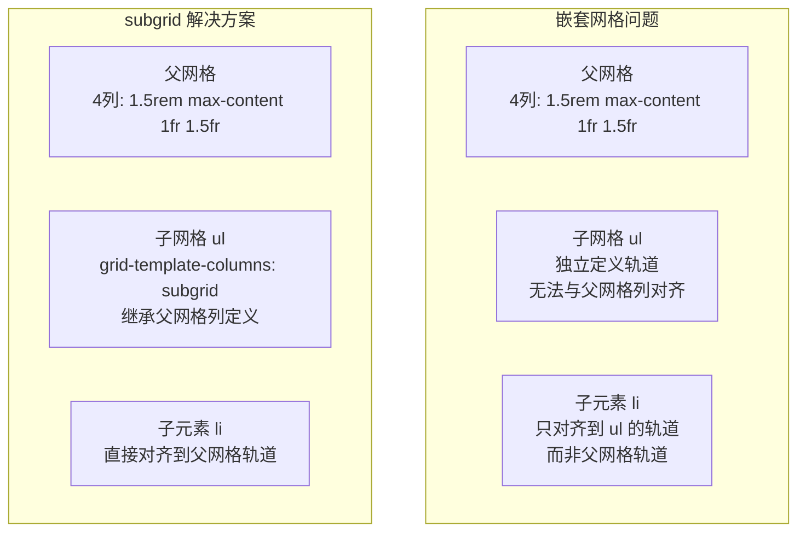
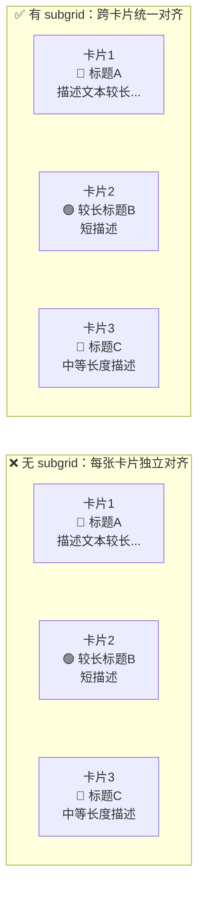
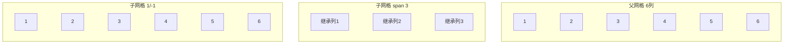
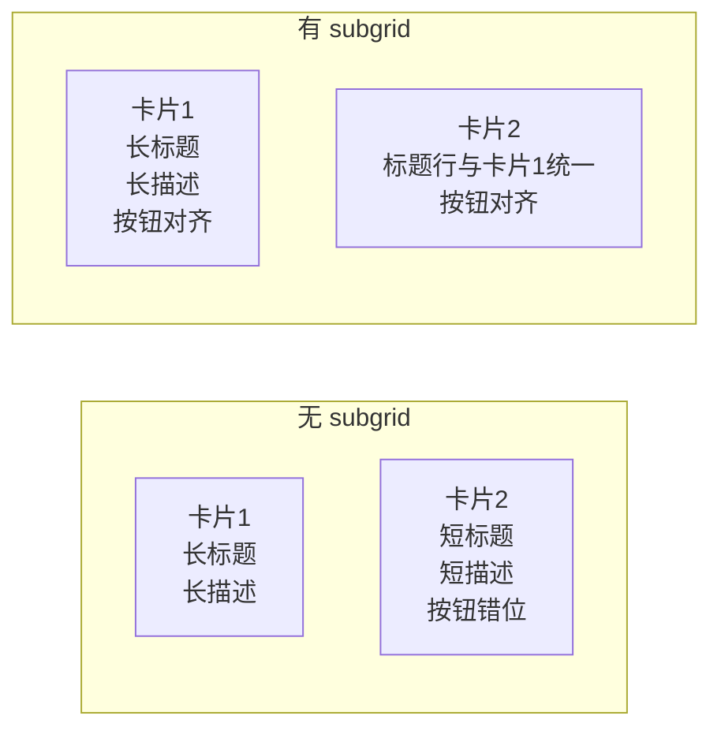
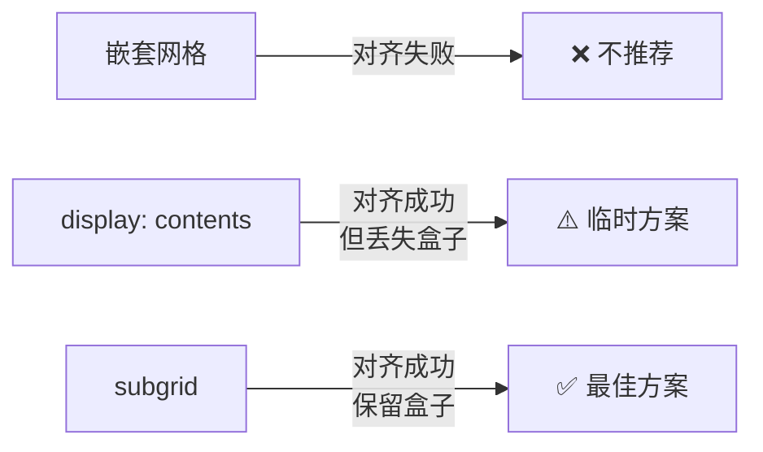

# CSS 子网格（subgrid）

CSS Grid 的 `subgrid` 是解决嵌套网格无法继承父网格轨道的关键特性。它让子网格能够"共享"父网格的轨道定义，实现真正的跨层级对齐。

## 为什么需要子网格？

在 CSS Grid 布局中，**嵌套网格不能继承其父网格的轨道特性**——每个嵌套网格都是独立的布局上下文，拥有自己的轨道尺寸。

### 核心问题：嵌套网格的对齐困境

当我们在一个 Grid 容器中嵌套另一个 Grid 容器时，子网格的轨道与父网格的轨道是完全独立的。这意味着：

1. **列不对齐**：子网格的列宽与父网格的列宽无法自动同步
2. **间距不一致**：子网格的 gap 与父网格的 gap 相互独立
3. **命名线丢失**：父网格定义的命名线无法在子网格中使用
4. **响应式断裂**：父网格轨道变化时，子网格不会自动跟随调整



### 具体场景：卡片列表对齐问题

假设我们有一组卡片，每张卡片包含图标、标题和描述。我们希望所有卡片的图标列、标题列、描述列分别对齐：



没有 subgrid 时，每张卡片内部的列宽是独立计算的——卡片1的图标列可能与卡片2的图标列宽度不同，导致视觉上的参差不齐。使用 subgrid 后，所有卡片的列宽共享父网格的轨道定义，实现完美对齐。

---

## subgrid 语法详解

### grid-template-columns: subgrid

将子网格的列轨道设置为父网格对应区域的列轨道。子网格会占据父网格中由 `grid-column` 指定的列范围，并继承这些列的轨道定义。

```css
.parent {
  display: grid;
  grid-template-columns: 200px 1fr 1fr 100px;
  gap: 16px;
}

.child {
  grid-column: 2 / 4;           /* 占据父网格第2-3列 */
  display: grid;
  grid-template-columns: subgrid; /* 继承父网格第2-3列的轨道 */
}
```

**关键规则**：
- 子网格的列数 = `grid-column` 跨越的父网格列数
- 子网格的列宽 = 父网格对应列的宽度
- 子网格不能添加额外的列轨道

### grid-template-rows: subgrid

将子网格的行轨道设置为父网格对应区域的行轨道。子网格会占据父网格中由 `grid-row` 指定的行范围，并继承这些行的轨道定义。

```css
.parent {
  display: grid;
  grid-template-rows: auto 1fr auto auto;
  gap: 16px;
}

.child {
  grid-row: 2 / 5;           /* 占据父网格第2-4行 */
  display: grid;
  grid-template-rows: subgrid; /* 继承父网格第2-4行的轨道 */
}
```

### 行方向子网格

```css
.parent {
  display: grid;
  grid-template-rows: auto 1fr auto;
  grid-template-columns: 1.5rem max-content 1fr 1.5fr;
}

.child {
  grid-row: 2;
  grid-column: 2 / span 2;
  display: grid;
  grid-template-columns: subgrid; /* 继承父网格的第2-3列轨道 */
  row-gap: inherit;               /* 继承父网格的行间距 */
}
```

### 列方向子网格

```css
.child {
  display: grid;
  grid-template-rows: subgrid; /* 继承父网格的行轨道 */
}
```

### 双方向子网格

```css
.child {
  display: grid;
  grid-template-columns: subgrid;
  grid-template-rows: subgrid; /* 行和列都继承父网格 */
}
```

---

## subgrid 的继承行为

subgrid 不仅继承轨道尺寸，还会继承间距、命名线等父网格的特性。理解这些继承行为是正确使用 subgrid 的关键。

### 轨道尺寸继承

子网格会精确继承父网格对应区域的轨道尺寸，包括：

- 固定尺寸（如 `200px`）
- 弹性尺寸（如 `1fr`、`2fr`）
- 内容尺寸（如 `auto`、`max-content`、`min-content`）
- 函数尺寸（如 `minmax(100px, 1fr)`）

```css
.parent {
  display: grid;
  grid-template-columns: 200px minmax(100px, 1fr) 2fr;
}

.child {
  grid-column: 1 / 4;
  display: grid;
  grid-template-columns: subgrid;
  /* 子网格的3列分别继承：200px、minmax(100px,1fr)、2fr */
  /* 当父网格列宽变化时，子网格自动跟随 */
}
```

> **重要**：子网格的轨道尺寸由父网格完全控制，子网格自身不能修改继承的轨道尺寸。这意味着子网格中的项目内容不会影响轨道大小——只有父网格的同级内容才能影响。

### 间距（gap）继承

子网格默认继承父网格的 `gap` 值。你也可以在子网格上覆盖间距：

```css
.parent {
  display: grid;
  gap: 24px;
  grid-template-columns: 1fr 1fr 1fr;
}

.child {
  grid-column: 1 / -1;
  display: grid;
  grid-template-columns: subgrid;
  /* 默认继承父网格的 gap: 24px */

  /* 也可以覆盖间距 */
  gap: 12px;  /* 子网格使用自己的间距 */
  /* 或者只覆盖某个方向的间距 */
  row-gap: 8px;     /* 行间距覆盖；column-gap 未声明，仍继承父网格的 24px */
}
```

| 间距属性 | 继承行为 | 可否覆盖 |
|----------|----------|----------|
| `gap` | 默认继承父网格 | 可以覆盖为自定义值 |
| `row-gap` | 默认继承父网格 | 可以覆盖 |
| `column-gap` | 默认继承父网格 | 可以覆盖 |
| 单方向继承 | 可以一个方向继承，另一个方向自定义 | 可以 |

### 命名线继承

父网格中定义的命名线会自动传递给子网格，子网格的项目可以使用这些命名线进行定位：

```css
.parent {
  display: grid;
  grid-template-columns:
    [sidebar-start] 250px
    [sidebar-end content-start] 1fr
    [content-end];
  grid-template-rows:
    [header-start] auto
    [header-end main-start] 1fr
    [main-start footer-start] auto
    [footer-end];
}

.child {
  grid-column: sidebar-end / content-end;
  grid-row: header-end / footer-start;
  display: grid;
  grid-template-columns: subgrid;
  grid-template-rows: subgrid;

  /* 子网格中可以使用父网格的命名线 */
}

.child .nav {
  grid-column: sidebar-end / content-end; /* 使用继承的命名线 */
}
```

### subgrid 的 span 行为

子网格跨越的轨道数由 `grid-column` / `grid-row` 的 `span` 值决定：

```css
.parent {
  display: grid;
  grid-template-columns: repeat(6, 1fr);
}

/* 子网格跨越3列 */
.child-3 {
  grid-column: span 3;
  display: grid;
  grid-template-columns: subgrid;
  /* 子网格有3列，继承父网格对应3列的轨道 */
}

/* 子网格跨越全部列 */
.child-full {
  grid-column: 1 / -1;
  display: grid;
  grid-template-columns: subgrid;
  /* 子网格有6列，继承父网格全部6列的轨道 */
}
```



---

## subgrid vs 嵌套网格 vs display:contents

| 特性 | `subgrid` | 嵌套网格 | `display: contents` |
|------|-----------|----------|---------------------|
| 继承父轨道 | 自动继承轨道尺寸、间距、命名线 | 不继承，需手动定义 | 不继承，子元素直接参与父网格 |
| 代码量 | 少，只需 `subgrid` 一行 | 多，需重新定义轨道 | 多，需为每个子元素指定位置 |
| 响应式能力 | 强，随父网格自动调整 | 弱，独立轨道不联动 | 中等，需逐个调整 |
| 可访问性 | 无风险 | 无风险 | 有风险（语义可能丢失） |
| 浏览器支持 | Chrome 117+ / Firefox 71+ / Safari 16+ | 全面支持 | 广泛支持 |
| 对齐能力 | 跨层级精确对齐 | 仅在各自网格内对齐 | 跨层级对齐但需手动定位 |

> **建议**：`subgrid` 是最优雅的方案。在 `subgrid` 浏览器支持不完善时，可用 `display: contents` 作为降级方案，但不应长期替代。

---

## subgrid 实战案例

### 案例 1：卡片组件跨行对齐

```html
<div class="card-grid">
  <div class="card">
    
    <h3>长标题卡片</h3>
    <p>较长的描述文本...</p>
    <button>操作</button>
  </div>
  <div class="card">
    
    <h3>短标题</h3>
    <p>简短描述</p>
    <button>操作</button>
  </div>
</div>
```

```css
.card-grid {
  display: grid;
  grid-template-columns: repeat(3, 1fr);
  grid-template-rows: auto auto auto auto; /* 4行：图片、标题、描述、按钮 */
  gap: 16px;
}

.card {
  display: grid;
  grid-template-rows: subgrid; /* 继承父网格的行轨道 */
  grid-row: span 4;            /* 跨 4 行 */
}

/* 图片、标题、描述、按钮分别占据各自的行 */
/* 不同卡片的标题行高度自动统一 */
```



### 案例 2：表单标签对齐

```css
.form-container {
  display: grid;
  grid-template-columns: auto 1fr auto;
  gap: 1rem 0.5rem;
}

.form-group {
  display: grid;
  grid-template-columns: subgrid; /* 继承 3 列轨道 */
  grid-column: 1 / -1;
}

.form-group label {
  grid-column: 1;
  justify-self: end;
  align-self: center;
}

.form-group input {
  grid-column: 2;
}

.form-group .error-msg {
  grid-column: 3;
}
```

> 所有表单行的 label、input、error-msg 分别在父网格的同一列轨道上对齐。

### 案例 3：完整的嵌套对齐示例——产品卡片网格

这是一个更完整的示例，展示 subgrid 如何让多张卡片的内部元素跨卡片对齐：

```html
<!DOCTYPE html>
<html lang="zh-CN">
<head>
  <meta charset="UTF-8">
  <meta name="viewport" content="width=device-width, initial-scale=1.0">
  <title>subgrid 嵌套对齐示例</title>
  <style>
    * { margin: 0; padding: 0; box-sizing: border-box; }

    body {
      font-family: -apple-system, BlinkMacSystemFont, "Segoe UI", sans-serif;
      background: #f0f2f5;
      padding: 32px;
    }

    /* 父网格：定义4行轨道（图片、标题、描述、操作） */
    .product-grid {
      display: grid;
      grid-template-columns: repeat(3, 1fr);
      /* 4行：图片区、标题区、描述区、操作区 */
      grid-template-rows: 200px auto auto auto;
      gap: 24px;
      max-width: 960px;
      margin: 0 auto;
    }

    /* 每张卡片跨越4行，使用 subgrid 继承行轨道 */
    .card {
      display: grid;
      grid-template-rows: subgrid;  /* 核心：继承父网格行轨道 */
      grid-row: span 4;             /* 跨4行 */
      gap: 12px;
      background: #fff;
      border-radius: 12px;
      overflow: hidden;
      box-shadow: 0 2px 8px rgba(0, 0, 0, 0.08);
    }

    .card img {
      width: 100%;
      height: 100%;
      object-fit: cover;
    }

    .card h3 {
      padding: 0 16px;
      font-size: 1.1rem;
      color: #1a1a1a;
    }

    .card p {
      padding: 0 16px;
      font-size: 0.875rem;
      color: #666;
      line-height: 1.5;
    }

    .card .actions {
      padding: 0 16px 16px;
      display: flex;
      gap: 8px;
    }

    .card .actions button {
      flex: 1;
      padding: 8px 16px;
      border: none;
      border-radius: 6px;
      cursor: pointer;
      font-size: 0.85rem;
    }

    .btn-primary {
      background: #6366f1;
      color: #fff;
    }

    .btn-secondary {
      background: #f0f0f0;
      color: #333;
    }

    /* 不支持 subgrid 时的回退 */
    @supports not (grid-template-rows: subgrid) {
      .card {
        grid-template-rows: 200px auto auto auto;
      }
    }
  </style>
</head>
<body>
  <div class="product-grid">
    <article class="card">
      
      <h3>智能手表 Pro</h3>
      <p>全天候健康监测，超长续航，支持百种运动模式。</p>
      <div class="actions">
        <button class="btn-primary">立即购买</button>
        <button class="btn-secondary">了解更多</button>
      </div>
    </article>

    <article class="card">
      
      <h3>无线降噪耳机 Ultra</h3>
      <p>40dB 主动降噪，Hi-Res 认证音质，30 小时续航，舒适佩戴。</p>
      <div class="actions">
        <button class="btn-primary">立即购买</button>
        <button class="btn-secondary">了解更多</button>
      </div>
    </article>

    <article class="card">
      
      <h3>便携音箱</h3>
      <p>小巧便携。</p>
      <div class="actions">
        <button class="btn-primary">立即购买</button>
        <button class="btn-secondary">了解更多</button>
      </div>
    </article>
  </div>
</body>
</html>
```

**效果说明**：即使三张卡片的标题和描述长度不同，使用 subgrid 后：
- 所有卡片的图片区域高度一致（200px）
- 标题行高度由最长的标题决定，所有卡片统一
- 描述行高度由最长的描述决定，所有卡片统一
- 操作按钮始终对齐在卡片底部

---

## 与非 subgrid 方案的深度对比

### 方案一：嵌套网格（不使用 subgrid）

```css
/* 不使用 subgrid 的嵌套网格 */
.product-grid {
  display: grid;
  grid-template-columns: repeat(3, 1fr);
  gap: 24px;
}

.card {
  display: grid;
  grid-template-rows: 200px auto auto auto; /* 独立定义行轨道 */
  gap: 12px;
}
```

**问题**：每张卡片的 `auto` 行高度独立计算，导致标题行、描述行高度不一致，操作按钮无法对齐。

### 方案二：display: contents

```css
/* 使用 display: contents */
.product-grid {
  display: grid;
  grid-template-columns: repeat(3, 1fr);
  grid-template-rows: 200px auto auto auto;
  gap: 24px;
}

.card {
  display: contents; /* 卡片本身不生成盒子，子元素直接参与父网格 */
}

.card img { grid-row: 1; }
.card h3  { grid-row: 2; }
.card p   { grid-row: 3; }
.card .actions { grid-row: 4; }
```

**优点**：可以实现跨卡片对齐。
**缺点**：
1. 卡片元素（`.card`）不再生成盒子，无法设置背景、边框、圆角等
2. 可访问性风险——部分屏幕阅读器会忽略 `display: contents` 的元素
3. 需要为每个子元素手动指定网格位置，代码冗长

### 方案三：subgrid（推荐）

```css
.product-grid {
  display: grid;
  grid-template-columns: repeat(3, 1fr);
  grid-template-rows: 200px auto auto auto;
  gap: 24px;
}

.card {
  display: grid;
  grid-template-rows: subgrid;
  grid-row: span 4;
  gap: 12px;
  background: #fff;
  border-radius: 12px;
}
```

**优点**：
1. 跨卡片完美对齐
2. 卡片保留完整的盒子模型（背景、边框等）
3. 代码简洁，只需一行 `subgrid`
4. 无可访问性风险

### 三种方案综合对比

| 维度 | 嵌套网格 | display: contents | subgrid |
|------|----------|-------------------|---------|
| 跨卡片对齐 | ❌ 不支持 | ✅ 支持 | ✅ 支持 |
| 保留父元素盒子 | ✅ 保留 | ❌ 不保留 | ✅ 保留 |
| 可访问性 | ✅ 无风险 | ⚠️ 有风险 | ✅ 无风险 |
| 代码量 | 少 | 多 | 少 |
| 响应式联动 | ❌ 独立 | ✅ 联动 | ✅ 联动 |
| 浏览器支持 | ✅ 全面 | ✅ 广泛 | ⚠️ 2023年起主流支持 |



---

## 浏览器兼容性与渐进增强

| 浏览器 | subgrid 支持版本 |
|--------|-----------------|
| Chrome | 117+（2023年9月） |
| Edge | 117+ |
| Firefox | 71+（2019年12月） |
| Safari | 16.0+（2022年9月） |
| iOS Safari | 16.0+ |

### 渐进增强方案

```css
/* 方案1：display: contents 降级 */
.form-group {
  display: grid;
  grid-template-columns: subgrid;
}

@supports not (grid-template-columns: subgrid) {
  .form-group {
    display: contents; /* 子元素直接参与父网格 */
  }
}

/* 方案2：嵌套网格降级 */
.form-group {
  display: grid;
  grid-template-columns: subgrid;
}

@supports not (grid-template-columns: subgrid) {
  .form-group {
    grid-template-columns: auto 1fr auto;
    gap: 1rem 0.5rem;
  }
}
```

---

> 参考来源：W3C [CSS Grid Layout Module Level 2](https://www.w3.org/TR/css-grid-2/#subgrids)、Miriam Suzanne [Subgrid](https://developer.mozilla.org/en-US/docs/Web/CSS/CSS_Grid_Layout/Subgrid)