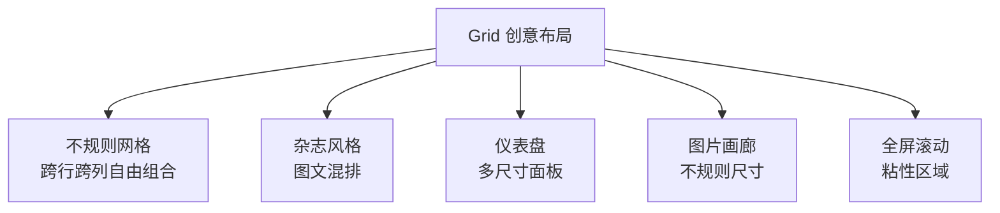
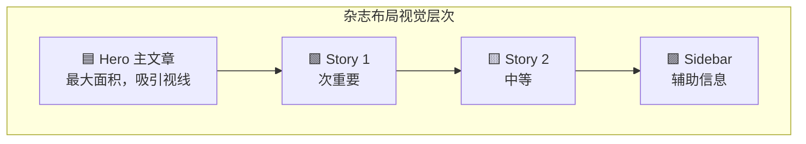
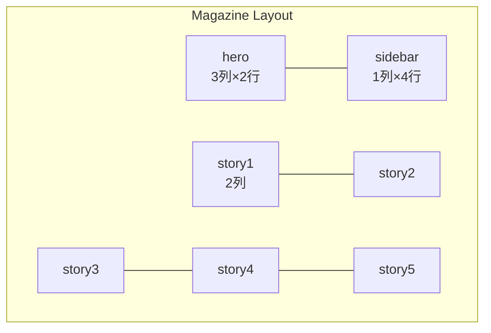
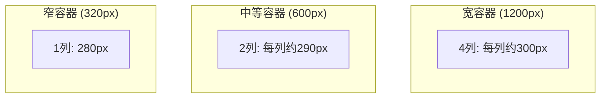

# Grid 创意布局

CSS Grid 不只是"规整的行列网格"——它强大的二维控制能力可以实现杂志排版、不规则组合、仪表盘等传统布局方案无法实现的创意效果。

## 创意布局分类



---

## 1. 不规则网格布局

利用 `grid-column` 和 `grid-row` 的 span 值，让某些项目跨越多行多列。

```css
.irregular-grid {
  display: grid;
  grid-template-columns: repeat(4, 1fr);
  grid-template-rows: repeat(3, 200px);
  gap: 16px;
}

/* 大图跨越 2 列 2 行 */
.featured {
  grid-column: span 2;
  grid-row: span 2;
}

/* 长条跨越 4 列 */
.banner {
  grid-column: 1 / -1;
}
```

```html
<div class="irregular-grid">
  <div class="featured">Featured</div>
  <div>Item 1</div>
  <div>Item 2</div>
  <div>Item 3</div>
  <div>Item 4</div>
  <div class="banner">Banner</div>
</div>
```

```
┌──────────────┬──────────┬──────────┐
│              │  Item 1  │  Item 2  │
│   Featured   ├──────────┼──────────┤
│   (2×2)      │  Item 3  │  Item 4  │
├──────────────┴──────────┴──────────┤
│           Banner (4列)             │
└───────────────────────────────────┘
```

---

## 2. 杂志风格布局

使用 `grid-template-areas` 以可视化方式定义布局，实现图文混排的杂志排版效果。

### 设计思路

杂志风格布局的核心在于**内容层次感**——通过不同大小的区域引导读者视线，主文章占据最大面积，次要文章依次缩小，侧边栏提供辅助信息。



### 布局定义

```css
.magazine {
  display: grid;
  grid-template-areas:
    "hero    hero    hero    sidebar"
    "hero    hero    hero    sidebar"
    "story1  story1  story2  sidebar"
    "story3  story4  story5  sidebar";
  grid-template-columns: 1fr 1fr 1fr 250px;
  grid-template-rows: 200px 200px 150px 150px;
  gap: 16px;
}

.hero { grid-area: hero; }
.sidebar { grid-area: sidebar; }
.story1 { grid-area: story1; }
.story2 { grid-area: story2; }
.story3 { grid-area: story3; }
.story4 { grid-area: story4; }
.story5 { grid-area: story5; }
```



> `grid-template-areas` 的优势：布局结构一目了然，修改只需调整字符串模板。

### 完整示例：新闻杂志页面

```html
<!DOCTYPE html>
<html lang="zh-CN">
<head>
  <meta charset="UTF-8">
  <meta name="viewport" content="width=device-width, initial-scale=1.0">
  <title>杂志风格布局</title>
  <style>
    * { margin: 0; padding: 0; box-sizing: border-box; }

    body {
      font-family: "Noto Serif SC", Georgia, serif;
      background: #fafafa;
      color: #1a1a1a;
    }

    /* 杂志布局 */
    .magazine {
      display: grid;
      grid-template-areas:
        "hero    hero    hero    sidebar"
        "hero    hero    hero    sidebar"
        "story1  story1  story2  sidebar"
        "story3  story4  story5  sidebar";
      grid-template-columns: 1fr 1fr 1fr 280px;
      grid-template-rows: 240px 240px 180px 180px;
      gap: 2px;
      max-width: 1200px;
      margin: 0 auto;
      background: #ddd;
    }

    /* 通用文章样式 */
    .magazine > * {
      background: #fff;
      overflow: hidden;
      position: relative;
    }

    .magazine > *:hover img {
      transform: scale(1.05);
    }

    /* Hero 主文章 */
    .hero {
      grid-area: hero;
      display: flex;
      flex-direction: column;
      justify-content: flex-end;
      padding: 32px;
    }

    .hero img {
      position: absolute;
      inset: 0;
      width: 100%;
      height: 100%;
      object-fit: cover;
      transition: transform 0.4s;
    }

    .hero .overlay {
      position: relative;
      z-index: 1;
      background: linear-gradient(transparent, rgba(0,0,0,0.7));
      margin: -32px;
      padding: 60px 32px 32px;
      color: #fff;
    }

    .hero .category {
      font-size: 0.75rem;
      text-transform: uppercase;
      letter-spacing: 2px;
      color: #ffd700;
      margin-bottom: 8px;
    }

    .hero h2 {
      font-size: 2rem;
      line-height: 1.3;
      margin-bottom: 12px;
    }

    .hero p {
      font-size: 0.95rem;
      opacity: 0.85;
      line-height: 1.5;
    }

    /* 次要文章 */
    .story1, .story2, .story3, .story4, .story5 {
      display: flex;
      flex-direction: column;
      justify-content: flex-end;
      padding: 20px;
    }

    .story1 img, .story2 img,
    .story3 img, .story4 img, .story5 img {
      position: absolute;
      inset: 0;
      width: 100%;
      height: 100%;
      object-fit: cover;
      transition: transform 0.4s;
    }

    .story1 .overlay, .story2 .overlay,
    .story3 .overlay, .story4 .overlay, .story5 .overlay {
      position: relative;
      z-index: 1;
      background: linear-gradient(transparent, rgba(0,0,0,0.65));
      margin: -20px;
      padding: 40px 20px 20px;
      color: #fff;
    }

    .story1 .category, .story2 .category,
    .story3 .category, .story4 .category, .story5 .category {
      font-size: 0.65rem;
      text-transform: uppercase;
      letter-spacing: 1.5px;
      color: #ffd700;
      margin-bottom: 4px;
    }

    .story1 h3, .story2 h3,
    .story3 h3, .story4 h3, .story5 h3 {
      font-size: 1.1rem;
      line-height: 1.3;
    }

    /* 侧边栏 */
    .sidebar {
      grid-area: sidebar;
      padding: 24px;
      background: #1a1a2e;
      color: #eee;
    }

    .sidebar h3 {
      font-size: 0.85rem;
      text-transform: uppercase;
      letter-spacing: 2px;
      color: #ffd700;
      margin-bottom: 20px;
      padding-bottom: 12px;
      border-bottom: 2px solid #ffd700;
    }

    .sidebar-item {
      padding: 12px 0;
      border-bottom: 1px solid rgba(255,255,255,0.1);
    }

    .sidebar-item .number {
      font-size: 1.5rem;
      font-weight: bold;
      color: #ffd700;
    }

    .sidebar-item h4 {
      font-size: 0.9rem;
      margin-top: 4px;
      line-height: 1.4;
    }

    /* 响应式：移动端单列 */
    @media (max-width: 768px) {
      .magazine {
        grid-template-areas:
          "hero"
          "hero"
          "story1"
          "story2"
          "story3"
          "story4"
          "story5"
          "sidebar";
        grid-template-columns: 1fr;
        grid-template-rows: 300px 300px 200px 200px 200px 200px 200px auto;
      }
    }
  </style>
</head>
<body>
  <div class="magazine">
    <article class="hero">
      
      <div class="overlay">
        <div class="category">深度报道</div>
        <h2>人工智能如何重塑未来城市：从智慧交通到可持续建筑</h2>
        <p>随着 AI 技术的飞速发展，城市规划正在经历一场前所未有的变革……</p>
      </div>
    </article>

    <article class="story1">
      
      <div class="overlay">
        <div class="category">科技</div>
        <h3>量子计算突破：新算法实现百倍加速</h3>
      </div>
    </article>

    <article class="story2">
      
      <div class="overlay">
        <div class="category">文化</div>
        <h3>数字艺术展：当传统遇上科技</h3>
      </div>
    </article>

    <article class="story3">
      
      <div class="overlay">
        <div class="category">健康</div>
        <h3>新型疫苗研发进展</h3>
      </div>
    </article>

    <article class="story4">
      
      <div class="overlay">
        <div class="category">环境</div>
        <h3>海洋塑料清理新方案</h3>
      </div>
    </article>

    <article class="story5">
      
      <div class="overlay">
        <div class="category">教育</div>
        <h3>在线学习的新模式</h3>
      </div>
    </article>

    <aside class="sidebar">
      <h3>热门阅读</h3>
      <div class="sidebar-item">
        <span class="number">01</span>
        <h4>全球芯片供应链的新格局</h4>
      </div>
      <div class="sidebar-item">
        <span class="number">02</span>
        <h4>太空旅游：梦想照进现实</h4>
      </div>
      <div class="sidebar-item">
        <span class="number">03</span>
        <h4>远程办公的未来形态</h4>
      </div>
      <div class="sidebar-item">
        <span class="number">04</span>
        <h4>基因编辑技术的伦理边界</h4>
      </div>
    </aside>
  </div>
</body>
</html>
```

---

## 3. 仪表盘布局

仪表盘需要多种尺寸的面板：大面板占 2×2，中等面板占 1×2 或 2×1，小面板占 1×1。

### 布局定义

```css
.dashboard {
  display: grid;
  grid-template-columns: repeat(4, 1fr);
  grid-template-rows: repeat(3, minmax(200px, auto));
  gap: 12px;
  grid-template-areas:
    "chart  chart  stats  stats"
    "chart  chart  users  activity"
    "feed   feed   users  settings";
}

.chart { grid-area: chart; }       /* 2列×2行 */
.stats { grid-area: stats; }       /* 2列×1行 */
.users { grid-area: users; }       /* 1列×2行 */
.feed { grid-area: feed; }         /* 2列×1行 */
.activity { grid-area: activity; } /* 1列×1行 */
.settings { grid-area: settings; } /* 1列×1行 */
```

### 完整示例：数据仪表盘

```html
<!DOCTYPE html>
<html lang="zh-CN">
<head>
  <meta charset="UTF-8">
  <meta name="viewport" content="width=device-width, initial-scale=1.0">
  <title>数据仪表盘</title>
  <style>
    * { margin: 0; padding: 0; box-sizing: border-box; }

    body {
      font-family: -apple-system, BlinkMacSystemFont, "Segoe UI", sans-serif;
      background: #0f172a;
      color: #e2e8f0;
      min-height: 100vh;
      padding: 20px;
    }

    /* 仪表盘头部 */
    .dashboard-header {
      display: flex;
      justify-content: space-between;
      align-items: center;
      margin-bottom: 20px;
    }

    .dashboard-header h1 {
      font-size: 1.5rem;
      font-weight: 600;
    }

    .dashboard-header .date {
      color: #94a3b8;
      font-size: 0.875rem;
    }

    /* 仪表盘网格 */
    .dashboard {
      display: grid;
      grid-template-columns: repeat(4, 1fr);
      grid-template-rows: repeat(3, minmax(180px, auto));
      gap: 16px;
      grid-template-areas:
        "chart  chart  stats  stats"
        "chart  chart  users  activity"
        "feed   feed   users  settings";
    }

    /* 面板通用样式 */
    .panel {
      background: #1e293b;
      border-radius: 12px;
      padding: 20px;
      border: 1px solid #334155;
    }

    .panel-title {
      font-size: 0.8rem;
      color: #94a3b8;
      text-transform: uppercase;
      letter-spacing: 1px;
      margin-bottom: 12px;
    }

    /* 主图表区域 */
    .chart {
      grid-area: chart;
    }

    .chart .chart-placeholder {
      height: 80%;
      background: linear-gradient(180deg, rgba(99,102,241,0.2) 0%, transparent 100%);
      border-radius: 8px;
      display: flex;
      align-items: flex-end;
      justify-content: space-around;
      padding: 20px;
      gap: 8px;
    }

    .chart-placeholder .bar {
      width: 100%;
      background: linear-gradient(180deg, #6366f1, #818cf8);
      border-radius: 4px 4px 0 0;
      min-height: 20px;
    }

    /* 统计卡片 */
    .stats {
      grid-area: stats;
      display: grid;
      grid-template-columns: 1fr 1fr;
      gap: 16px;
    }

    .stat-card {
      background: #1e293b;
      border-radius: 12px;
      padding: 16px;
      border: 1px solid #334155;
    }

    .stat-card .value {
      font-size: 1.8rem;
      font-weight: 700;
      color: #fff;
    }

    .stat-card .label {
      font-size: 0.75rem;
      color: #94a3b8;
      margin-top: 4px;
    }

    .stat-card .change {
      font-size: 0.75rem;
      margin-top: 8px;
    }

    .stat-card .change.up { color: #10b981; }
    .stat-card .change.down { color: #ef4444; }

    /* 用户列表 */
    .users {
      grid-area: users;
    }

    .user-item {
      display: flex;
      align-items: center;
      gap: 12px;
      padding: 10px 0;
      border-bottom: 1px solid #334155;
    }

    .user-item:last-child { border-bottom: none; }

    .user-avatar {
      width: 36px;
      height: 36px;
      border-radius: 50%;
      background: #6366f1;
      display: flex;
      align-items: center;
      justify-content: center;
      font-size: 0.8rem;
      font-weight: 600;
      color: #fff;
    }

    .user-info .name {
      font-size: 0.875rem;
      color: #e2e8f0;
    }

    .user-info .role {
      font-size: 0.7rem;
      color: #94a3b8;
    }

    .user-status {
      margin-left: auto;
      width: 8px;
      height: 8px;
      border-radius: 50%;
    }

    .user-status.online { background: #10b981; }
    .user-status.offline { background: #64748b; }

    /* 活动面板 */
    .activity {
      grid-area: activity;
    }

    .activity-item {
      display: flex;
      gap: 10px;
      padding: 8px 0;
      font-size: 0.8rem;
    }

    .activity-dot {
      width: 8px;
      height: 8px;
      border-radius: 50%;
      margin-top: 4px;
      flex-shrink: 0;
    }

    .activity-dot.blue { background: #3b82f6; }
    .activity-dot.green { background: #10b981; }
    .activity-dot.yellow { background: #f59e0b; }

    .activity-text { color: #cbd5e1; }
    .activity-time { color: #64748b; font-size: 0.7rem; margin-top: 2px; }

    /* 动态面板 */
    .feed {
      grid-area: feed;
    }

    .feed-list {
      display: flex;
      flex-direction: column;
      gap: 8px;
    }

    .feed-item {
      display: flex;
      justify-content: space-between;
      align-items: center;
      padding: 10px 12px;
      background: #0f172a;
      border-radius: 8px;
      font-size: 0.85rem;
    }

    .feed-item .tag {
      padding: 2px 8px;
      border-radius: 4px;
      font-size: 0.7rem;
      font-weight: 500;
    }

    .tag.feature { background: rgba(99,102,241,0.2); color: #818cf8; }
    .tag.bugfix { background: rgba(239,68,68,0.2); color: #f87171; }
    .tag.release { background: rgba(16,185,129,0.2); color: #34d399; }

    /* 设置面板 */
    .settings {
      grid-area: settings;
    }

    .setting-row {
      display: flex;
      justify-content: space-between;
      align-items: center;
      padding: 8px 0;
      font-size: 0.85rem;
    }

    .toggle {
      width: 40px;
      height: 22px;
      border-radius: 11px;
      background: #475569;
      position: relative;
      cursor: pointer;
    }

    .toggle.active { background: #6366f1; }

    .toggle::after {
      content: '';
      position: absolute;
      width: 18px;
      height: 18px;
      border-radius: 50%;
      background: #fff;
      top: 2px;
      left: 2px;
      transition: transform 0.2s;
    }

    .toggle.active::after { transform: translateX(18px); }

    /* 响应式 */
    @media (max-width: 1024px) {
      .dashboard {
        grid-template-columns: repeat(2, 1fr);
        grid-template-areas:
          "stats  stats"
          "chart  chart"
          "chart  chart"
          "users  activity"
          "feed   feed"
          "settings settings";
      }
    }

    @media (max-width: 640px) {
      .dashboard {
        grid-template-columns: 1fr;
        grid-template-areas:
          "stats"
          "chart"
          "users"
          "activity"
          "feed"
          "settings";
      }

      .stats {
        grid-template-columns: 1fr;
      }
    }
  </style>
</head>
<body>
  <header class="dashboard-header">
    <h1>📊 数据仪表盘</h1>
    <span class="date">2025年6月14日 星期六</span>
  </header>

  <div class="dashboard">
    <!-- 主图表 -->
    <section class="panel chart">
      <div class="panel-title">月度趋势</div>
      <div class="chart-placeholder">
        <div class="bar" style="height: 40%"></div>
        <div class="bar" style="height: 65%"></div>
        <div class="bar" style="height: 45%"></div>
        <div class="bar" style="height: 80%"></div>
        <div class="bar" style="height: 55%"></div>
        <div class="bar" style="height: 90%"></div>
        <div class="bar" style="height: 70%"></div>
        <div class="bar" style="height: 85%"></div>
        <div class="bar" style="height: 60%"></div>
        <div class="bar" style="height: 95%"></div>
        <div class="bar" style="height: 75%"></div>
        <div class="bar" style="height: 50%"></div>
      </div>
    </section>

    <!-- 统计卡片 -->
    <section class="stats">
      <div class="stat-card">
        <div class="value">12,847</div>
        <div class="label">总访问量</div>
        <div class="change up">↑ 12.5%</div>
      </div>
      <div class="stat-card">
        <div class="value">3,426</div>
        <div class="label">活跃用户</div>
        <div class="change up">↑ 8.3%</div>
      </div>
      <div class="stat-card">
        <div class="value">¥89.2k</div>
        <div class="label">总收入</div>
        <div class="change down">↓ 2.1%</div>
      </div>
      <div class="stat-card">
        <div class="value">94.5%</div>
        <div class="label">满意度</div>
        <div class="change up">↑ 1.2%</div>
      </div>
    </section>

    <!-- 用户列表 -->
    <section class="panel users">
      <div class="panel-title">团队成员</div>
      <div class="user-item">
        <div class="user-avatar">张</div>
        <div class="user-info">
          <div class="name">张三</div>
          <div class="role">前端工程师</div>
        </div>
        <div class="user-status online"></div>
      </div>
      <div class="user-item">
        <div class="user-avatar">李</div>
        <div class="user-info">
          <div class="name">李四</div>
          <div class="role">产品经理</div>
        </div>
        <div class="user-status online"></div>
      </div>
      <div class="user-item">
        <div class="user-avatar">王</div>
        <div class="user-info">
          <div class="name">王五</div>
          <div class="role">UI 设计师</div>
        </div>
        <div class="user-status offline"></div>
      </div>
      <div class="user-item">
        <div class="user-avatar">赵</div>
        <div class="user-info">
          <div class="name">赵六</div>
          <div class="role">后端工程师</div>
        </div>
        <div class="user-status online"></div>
      </div>
    </section>

    <!-- 活动面板 -->
    <section class="panel activity">
      <div class="panel-title">最近活动</div>
      <div class="activity-item">
        <div class="activity-dot blue"></div>
        <div>
          <div class="activity-text">部署了 v2.3.1 版本</div>
          <div class="activity-time">10 分钟前</div>
        </div>
      </div>
      <div class="activity-item">
        <div class="activity-dot green"></div>
        <div>
          <div class="activity-text">合并了 PR #142</div>
          <div class="activity-time">1 小时前</div>
        </div>
      </div>
      <div class="activity-item">
        <div class="activity-dot yellow"></div>
        <div>
          <div class="activity-text">创建了新任务</div>
          <div class="activity-time">3 小时前</div>
        </div>
      </div>
    </section>

    <!-- 动态面板 -->
    <section class="panel feed">
      <div class="panel-title">更新动态</div>
      <div class="feed-list">
        <div class="feed-item">
          <span>新增暗色模式支持</span>
          <span class="tag feature">Feature</span>
        </div>
        <div class="feed-item">
          <span>修复登录页面白屏</span>
          <span class="tag bugfix">Bugfix</span>
        </div>
        <div class="feed-item">
          <span>v2.3.0 正式发布</span>
          <span class="tag release">Release</span>
        </div>
        <div class="feed-item">
          <span>优化首页加载速度</span>
          <span class="tag feature">Feature</span>
        </div>
      </div>
    </section>

    <!-- 设置面板 -->
    <section class="panel settings">
      <div class="panel-title">快捷设置</div>
      <div class="setting-row">
        <span>消息通知</span>
        <div class="toggle active"></div>
      </div>
      <div class="setting-row">
        <span>自动刷新</span>
        <div class="toggle"></div>
      </div>
      <div class="setting-row">
        <span>数据导出</span>
        <div class="toggle active"></div>
      </div>
    </section>
  </div>
</body>
</html>
```

---

## 4. 图片画廊（不规则尺寸）

混合不同尺寸的图片，创造视觉上的层次感。

### 使用 grid-template-areas 构建不规则画廊

`grid-template-areas` 可以精确控制每张图片占据的区域，实现更灵活的画廊布局：

```css
.gallery-areas {
  display: grid;
  grid-template-areas:
    "big    big    small1 small2"
    "big    big    small3 small4"
    "wide   wide   wide   small5";
  grid-template-columns: repeat(4, 1fr);
  grid-template-rows: 200px 200px 250px;
  gap: 8px;
}

.gallery-areas .big    { grid-area: big; }
.gallery-areas .small1 { grid-area: small1; }
.gallery-areas .small2 { grid-area: small2; }
.gallery-areas .small3 { grid-area: small3; }
.gallery-areas .small4 { grid-area: small4; }
.gallery-areas .small5 { grid-area: small5; }
.gallery-areas .wide   { grid-area: wide; }
```

### 使用 span 构建灵活画廊

```css
.gallery {
  display: grid;
  grid-template-columns: repeat(4, 1fr);
  grid-auto-rows: 200px;
  gap: 8px;
}

/* 大图 */
.gallery .wide {
  grid-column: span 2;
}

.gallery .tall {
  grid-row: span 2;
}

.gallery .wide-tall {
  grid-column: span 2;
  grid-row: span 2;
}
```

### 完整示例：不规则图片画廊

```html
<!DOCTYPE html>
<html lang="zh-CN">
<head>
  <meta charset="UTF-8">
  <meta name="viewport" content="width=device-width, initial-scale=1.0">
  <title>不规则图片画廊</title>
  <style>
    * { margin: 0; padding: 0; box-sizing: border-box; }

    body {
      font-family: -apple-system, BlinkMacSystemFont, "Segoe UI", sans-serif;
      background: #111;
      padding: 24px;
    }

    h1 {
      color: #fff;
      text-align: center;
      margin-bottom: 24px;
      font-size: 1.5rem;
      font-weight: 300;
      letter-spacing: 4px;
      text-transform: uppercase;
    }

    /* 画廊网格 */
    .gallery {
      display: grid;
      grid-template-areas:
        "big    big    small1 small2"
        "big    big    small3 small4"
        "wide   wide   wide   small5";
      grid-template-columns: repeat(4, 1fr);
      grid-template-rows: 220px 220px 260px;
      gap: 6px;
      max-width: 1100px;
      margin: 0 auto;
    }

    .gallery .item {
      overflow: hidden;
      border-radius: 4px;
      position: relative;
      cursor: pointer;
    }

    .gallery .item img {
      width: 100%;
      height: 100%;
      object-fit: cover;
      transition: transform 0.5s, filter 0.5s;
    }

    .gallery .item:hover img {
      transform: scale(1.08);
      filter: brightness(1.1);
    }

    /* 图片悬浮标题 */
    .gallery .item .caption {
      position: absolute;
      bottom: 0;
      left: 0;
      right: 0;
      padding: 20px 12px 12px;
      background: linear-gradient(transparent, rgba(0,0,0,0.6));
      color: #fff;
      font-size: 0.85rem;
      opacity: 0;
      transform: translateY(10px);
      transition: opacity 0.3s, transform 0.3s;
    }

    .gallery .item:hover .caption {
      opacity: 1;
      transform: translateY(0);
    }

    /* 区域分配 */
    .item.big    { grid-area: big; }
    .item.small1 { grid-area: small1; }
    .item.small2 { grid-area: small2; }
    .item.small3 { grid-area: small3; }
    .item.small4 { grid-area: small4; }
    .item.small5 { grid-area: small5; }
    .item.wide   { grid-area: wide; }

    /* 响应式：平板 */
    @media (max-width: 900px) {
      .gallery {
        grid-template-areas:
          "big    big    small1"
          "big    big    small2"
          "small3 small4 wide"
          "small5 small5 wide";
        grid-template-columns: repeat(3, 1fr);
        grid-template-rows: 200px 200px 200px 200px;
      }
    }

    /* 响应式：手机 */
    @media (max-width: 600px) {
      .gallery {
        grid-template-areas:
          "big"
          "small1"
          "small2"
          "small3"
          "small4"
          "wide"
          "small5";
        grid-template-columns: 1fr;
        grid-template-rows: 300px 200px 200px 200px 200px 200px 200px;
      }
    }
  </style>
</head>
<body>
  <h1>Gallery</h1>
  <div class="gallery">
    <div class="item big">
      
      <div class="caption">山间日出</div>
    </div>
    <div class="item small1">
      
      <div class="caption">城市天际线</div>
    </div>
    <div class="item small2">
      
      <div class="caption">海岸线</div>
    </div>
    <div class="item small3">
      
      <div class="caption">秋日森林</div>
    </div>
    <div class="item small4">
      
      <div class="caption">星空</div>
    </div>
    <div class="item small5">
      
      <div class="caption">花田</div>
    </div>
    <div class="item wide">
      
      <div class="caption">沙漠公路</div>
    </div>
  </div>
</body>
</html>
```

---

## 5. 响应式网格模式

### auto-fit + minmax：自适应列数

```css
/* 根据容器宽度自动调整列数 */
.auto-grid {
  display: grid;
  grid-template-columns: repeat(auto-fit, minmax(280px, 1fr));
  gap: 20px;
}
```



### auto-fill vs auto-fit 的关键区别

| 值 | 空轨道行为 | 适用场景 |
|---|---|---|
| `auto-fill` | 保留空轨道（即使没有内容填充） | 需要保持固定最小宽度 |
| `auto-fit` | 折叠空轨道，让现有项目扩展填满 | 需要项目自动扩展 |

```css
/* auto-fill: 可能产生空轨道 */
.grid-fill {
  grid-template-columns: repeat(auto-fill, minmax(200px, 1fr));
}

/* auto-fit: 空轨道被折叠，项目扩展 */
.grid-fit {
  grid-template-columns: repeat(auto-fit, minmax(200px, 1fr));
}
```

> 当项目数量少于可容纳的轨道数时，`auto-fit` 会让现有项目占据更多空间，`auto-fill` 保持轨道最小宽度。

---

## 6. grid-template-areas 可视化设计方法

`grid-template-areas` 用字符串直接描述布局结构，是最直观的 Grid 定义方式。

### 设计原则

1. **命名区域必须是矩形**：不能定义 L 形或 T 形区域
2. **同一名称占据连续单元格**：不能分散
3. **空单元格用 `.` 表示**

```css
.layout {
  display: grid;
  grid-template-areas:
    "header  header  header"
    "nav     main    aside"
    "nav     main    aside"
    "footer  footer  footer";
  grid-template-columns: 200px 1fr 180px;
  grid-template-rows: 60px 1fr 1fr 40px;
}
```

### 响应式区域切换

```css
/* 桌面端 */
.layout {
  grid-template-areas:
    "header header header"
    "nav    main   aside"
    "footer footer footer";
}

/* 移动端 */
@media (max-width: 768px) {
  .layout {
    grid-template-areas:
      "header"
      "main"
      "nav"
      "aside"
      "footer";
  }
}
```

---

## 7. 全屏滚动布局

利用 Grid 的精确区域控制，实现全屏粘性区域布局。

```css
.fullscreen-scroll {
  display: grid;
  grid-template-rows: 100vh 100vh 100vh 100vh;
}

.section {
  position: relative;
  overflow: hidden;
}

.section h2 {
  position: sticky;
  top: 50%;
  transform: translateY(-50%);
}
```

---

## 8. 响应式 Grid 创意布局

Grid 布局天生适合响应式设计。通过结合 `auto-fit`/`auto-fill`、`minmax()`、`clamp()` 以及媒体查询，可以实现无需断点的流畅响应式布局。

### 无断点响应式：auto-fit + minmax

这是最优雅的响应式 Grid 方案——不需要任何媒体查询，列数自动根据容器宽度调整：

```css
/* 无断点响应式：列数自动调整 */
.fluid-grid {
  display: grid;
  grid-template-columns: repeat(auto-fit, minmax(min(100%, 280px), 1fr));
  gap: 20px;
}
```

> **关键技巧**：使用 `min(100%, 280px)` 而非 `280px`，避免在窄容器下溢出。

### 响应式创意布局：圣杯布局变体

```html
<!DOCTYPE html>
<html lang="zh-CN">
<head>
  <meta charset="UTF-8">
  <meta name="viewport" content="width=device-width, initial-scale=1.0">
  <title>响应式创意布局</title>
  <style>
    * { margin: 0; padding: 0; box-sizing: border-box; }

    body {
      font-family: -apple-system, BlinkMacSystemFont, "Segoe UI", sans-serif;
      background: #f8fafc;
      color: #1e293b;
    }

    /* 响应式网格布局 */
    .creative-layout {
      display: grid;
      grid-template-areas:
        "header  header  header"
        "hero    hero    hero"
        "feature1 feature2 feature3"
        "content content sidebar"
        "content content sidebar"
        "footer  footer  footer";
      grid-template-columns: 1fr 1fr 300px;
      grid-template-rows: 60px 400px auto 1fr 1fr 60px;
      gap: 0;
      min-height: 100vh;
    }

    /* 头部 */
    .header {
      grid-area: header;
      display: flex;
      align-items: center;
      justify-content: space-between;
      padding: 0 24px;
      background: #1e293b;
      color: #fff;
    }

    .header .logo {
      font-size: 1.2rem;
      font-weight: 700;
    }

    .header nav {
      display: flex;
      gap: 24px;
    }

    .header nav a {
      color: #94a3b8;
      text-decoration: none;
      font-size: 0.875rem;
      transition: color 0.2s;
    }

    .header nav a:hover { color: #fff; }

    /* Hero 区域 */
    .hero {
      grid-area: hero;
      background: linear-gradient(135deg, #6366f1 0%, #8b5cf6 50%, #a78bfa 100%);
      display: flex;
      align-items: center;
      justify-content: center;
      color: #fff;
      text-align: center;
      padding: 40px;
    }

    .hero h1 {
      font-size: clamp(2rem, 5vw, 3.5rem);
      font-weight: 800;
      margin-bottom: 16px;
    }

    .hero p {
      font-size: clamp(1rem, 2vw, 1.25rem);
      opacity: 0.9;
      max-width: 600px;
    }

    /* 特性卡片 */
    .feature1, .feature2, .feature3 {
      padding: 32px 24px;
      text-align: center;
      background: #fff;
      border-bottom: 1px solid #e2e8f0;
    }

    .feature1 { grid-area: feature1; }
    .feature2 { grid-area: feature2; }
    .feature3 { grid-area: feature3; }

    .feature-icon {
      font-size: 2rem;
      margin-bottom: 12px;
    }

    .feature1 h3, .feature2 h3, .feature3 h3 {
      font-size: 1rem;
      margin-bottom: 8px;
    }

    .feature1 p, .feature2 p, .feature3 p {
      font-size: 0.85rem;
      color: #64748b;
      line-height: 1.5;
    }

    /* 主内容区 */
    .content {
      grid-area: content;
      padding: 32px;
      background: #fff;
    }

    .content h2 {
      font-size: 1.5rem;
      margin-bottom: 16px;
    }

    .content p {
      color: #475569;
      line-height: 1.7;
      margin-bottom: 16px;
    }

    /* 侧边栏 */
    .sidebar {
      grid-area: sidebar;
      padding: 32px 24px;
      background: #f1f5f9;
      border-left: 1px solid #e2e8f0;
    }

    .sidebar h3 {
      font-size: 0.85rem;
      text-transform: uppercase;
      letter-spacing: 1px;
      color: #64748b;
      margin-bottom: 16px;
    }

    .sidebar-item {
      padding: 12px;
      background: #fff;
      border-radius: 8px;
      margin-bottom: 8px;
      font-size: 0.85rem;
    }

    /* 底部 */
    .footer {
      grid-area: footer;
      display: flex;
      align-items: center;
      justify-content: center;
      background: #1e293b;
      color: #94a3b8;
      font-size: 0.8rem;
    }

    /* 响应式：平板 */
    @media (max-width: 900px) {
      .creative-layout {
        grid-template-areas:
          "header  header"
          "hero    hero"
          "feature1 feature2"
          "feature3 feature3"
          "content content"
          "sidebar sidebar"
          "footer  footer";
        grid-template-columns: 1fr 1fr;
        grid-template-rows: 60px 350px auto auto 1fr auto 60px;
      }

      .sidebar {
        border-left: none;
        border-top: 1px solid #e2e8f0;
      }
    }

    /* 响应式：手机 */
    @media (max-width: 600px) {
      .creative-layout {
        grid-template-areas:
          "header"
          "hero"
          "feature1"
          "feature2"
          "feature3"
          "content"
          "sidebar"
          "footer";
        grid-template-columns: 1fr;
        grid-template-rows: 60px 300px auto auto auto 1fr auto 60px;
      }

      .header nav { gap: 12px; }
      .header nav a { font-size: 0.75rem; }
    }
  </style>
</head>
<body>
  <div class="creative-layout">
    <header class="header">
      <div class="logo">CreativeGrid</div>
      <nav>
        <a href="#">首页</a>
        <a href="#">产品</a>
        <a href="#">关于</a>
        <a href="#">联系</a>
      </nav>
    </header>

    <section class="hero">
      <div>
        <h1>用 Grid 创造无限可能</h1>
        <p>CSS Grid 不仅是布局工具，更是创意表达的画布。从杂志排版到数据仪表盘，一切皆可实现。</p>
      </div>
    </section>

    <div class="feature1">
      <div class="feature-icon">🎨</div>
      <h3>自由布局</h3>
      <p>跨行跨列，自由组合，打破传统网格束缚</p>
    </div>

    <div class="feature2">
      <div class="feature-icon">📱</div>
      <h3>响应式</h3>
      <p>一套代码，多端适配，流畅体验</p>
    </div>

    <div class="feature3">
      <div class="feature-icon">⚡</div>
      <h3>高性能</h3>
      <p>浏览器原生支持，无需 JavaScript 计算</p>
    </div>

    <main class="content">
      <h2>为什么选择 CSS Grid？</h2>
      <p>CSS Grid 是第一个专为二维布局设计的 CSS 模块。与 Flexbox 的一维布局不同，Grid 可以同时控制行和列，实现复杂的页面布局。</p>
      <p>Grid 的核心优势在于其声明式的布局定义方式。通过 grid-template-areas，你可以用字符串直接描述布局结构，让代码和视觉一一对应。修改布局只需调整字符串模板，无需改动 HTML 结构。</p>
      <p>结合 auto-fit、minmax() 和 clamp() 等现代 CSS 函数，Grid 可以实现真正的无断点响应式设计——不再需要为每个屏幕尺寸编写媒体查询。</p>
    </main>

    <aside class="sidebar">
      <h3>推荐阅读</h3>
      <div class="sidebar-item">📐 Grid 布局完全指南</div>
      <div class="sidebar-item">🔧 subgrid 深度解析</div>
      <div class="sidebar-item">🎨 Grid 创意布局实战</div>
      <div class="sidebar-item">📊 Grid 与 Flexbox 选型</div>
      <div class="sidebar-item">🚀 Grid 性能优化技巧</div>
    </aside>

    <footer class="footer">
      © 2025 CreativeGrid — 用 CSS Grid 构建美好布局
    </footer>
  </div>
</body>
</html>
```

### 响应式 Grid 关键技巧总结

| 技巧 | CSS | 适用场景 |
|------|-----|----------|
| 无断点自适应 | `repeat(auto-fit, minmax(280px, 1fr))` | 卡片列表、图片网格 |
| 防溢出 | `minmax(min(100%, 280px), 1fr)` | 窄容器场景 |
| 区域重排 | 媒体查询中重定义 `grid-template-areas` | 复杂布局响应式 |
| 流体尺寸 | `clamp(1rem, 5vw, 3rem)` | 标题、间距等 |
| 隐藏区域 | 媒体查询中设置 `display: none` | 移动端隐藏侧边栏 |
| 列数切换 | 媒体查询中修改 `grid-template-columns` | 精确控制列数 |

---

## 创意布局速查表

| 布局 | 核心 CSS | 特点 |
|------|----------|------|
| 不规则网格 | `span 2` 跨行跨列 | 大小混排 |
| 杂志风格 | `grid-template-areas` | 图文混排，可视化定义 |
| 仪表盘 | `grid-template-areas` + `minmax` | 多尺寸面板 |
| 图片画廊 | `grid-template-areas` + `span` | 不规则尺寸图片 |
| 自适应网格 | `auto-fit + minmax` | 列数自动调整 |
| 全屏滚动 | `grid-template-rows: 100vh` | 粘性内容 |
| 响应式创意 | `clamp()` + 区域重排 | 无断点自适应 |

---

> 参考来源：Jen Simmons [Designing Intrinsic Layouts](https://talks.jensimmons.com/15TjNW)、MDN [CSS Grid Layout](https://developer.mozilla.org/zh-CN/docs/Web/CSS/CSS_Grid_Layout)