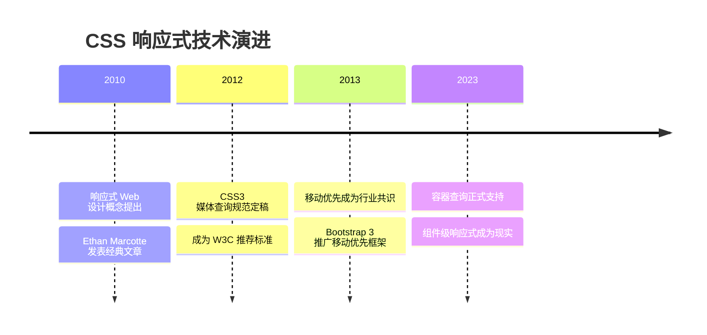
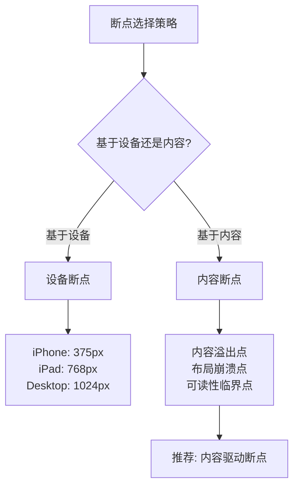

# 媒体查询

媒体查询（Media Queries）是响应式设计的核心技术，允许根据设备特征（如屏幕尺寸、分辨率、方向等）有条件地应用 CSS 样式。

## 背景与动机

### 为什么需要媒体查询

在移动互联网时代，用户通过多种设备访问网页：手机、平板、笔记本、桌面显示器、智能电视等。每种设备的屏幕尺寸、分辨率、交互方式都不同。传统固定宽度布局无法满足这种多样性需求。

**核心挑战：**
- 设备碎片化：数千种不同的屏幕尺寸
- 交互差异：触摸 vs 鼠标、横屏 vs 竖屏
- 性能考量：移动设备需要优化的资源加载
- 用户体验：不同设备需要不同的布局策略

**媒体查询的解决方案：**
根据设备特征动态应用样式，实现"一次编写，多处适配"的响应式设计。

### 响应式设计演进



## 核心概念

### 媒体查询基本语法

```css
@media media-type and (media-feature) {
  /* CSS 规则 */
}
```

或使用 CSS 嵌套语法：

```css
.element {
  font-size: 14px;
  
  @media (min-width: 768px) {
    font-size: 16px;
  }
}
```

### 媒体类型

媒体类型描述设备的一般类别：

```css
/* 所有设备（默认） */
@media all { }

/* 屏幕设备 */
@media screen { }

/* 打印设备 */
@media print { }

/* 语音合成器 */
@media speech { }
```

| 类型 | 说明 | 使用场景 |
|------|------|----------|
| `all` | 所有设备（默认值） | 通用样式 |
| `screen` | 屏幕（电脑、手机、平板） | 网页样式 |
| `print` | 打印机和打印预览 | 打印样式优化 |
| `speech` | 语音合成器 | 屏幕阅读器 |

## 深入原理

### 媒体查询的工作机制

媒体查询在 CSS 解析阶段进行评估，浏览器根据当前设备特征决定是否应用对应的样式规则。这个过程是动态的——当设备特征变化时（如窗口缩放、设备旋转），浏览器会重新评估并应用相应的样式。

**关键原理：**
1. **条件评估**：浏览器实时检查媒体查询条件
2. **样式覆盖**：符合条件的样式会覆盖默认样式
3. **优先级规则**：媒体查询本身不影响优先级，内部规则按正常 CSS 优先级计算
4. **性能影响**：过多的媒体查询会增加样式计算开销

### 断点选择的科学

断点（Breakpoint）是媒体查询中触发样式变化的临界值。选择断点不是随意的，需要基于内容、设备和用户体验的综合考量。



**内容驱动断点 vs 设备驱动断点：**

| 策略 | 优点 | 缺点 | 适用场景 |
|------|------|------|----------|
| 设备驱动 | 直观、易于理解 | 设备碎片化导致断点失效 | 特定设备优化 |
| 内容驱动 | 适应性强、未来兼容 | 需要测试更多内容状态 | 通用响应式设计 |

**推荐方法：** 先编写移动端基础样式，然后逐步扩大窗口宽度，在内容布局"崩溃"（如文字过长、元素重叠）的点设置断点。

## 代码示例

### 媒体特性详解

#### 宽度和高度

```css
/* 视口宽度 */
@media (width: 600px) { }        /* 精确匹配 */
@media (min-width: 600px) { }    /* 大于等于 */
@media (max-width: 600px) { }    /* 小于等于 */

/* 视口高度 */
@media (height: 400px) { }
@media (min-height: 400px) { }
@media (max-height: 400px) { }
```

> ⚠️ **注意**：`device-width` 已废弃，现代浏览器推荐使用 `width`。

#### 屏幕方向

```css
@media (orientation: portrait) { }  /* 竖屏：高度 ≥ 宽度 */
@media (orientation: landscape) { } /* 横屏：宽度 > 高度 */
```

#### 分辨率

```css
@media (resolution: 300dpi) { }
@media (min-resolution: 2dppx) { }  /* 高清屏（Retina） */

/* Safari 兼容写法 */
@media (-webkit-min-device-pixel-ratio: 2) { }
@media (min-resolution: 192dpi) { }
```

| 单位 | 说明 |
|------|------|
| `dpi` | 每英寸点数 |
| `dpcm` | 每厘米点数 |
| `dppx` | 每 CSS 像素的设备像素数 |

#### 交互能力

```css
/* 悬停能力 */
@media (hover: hover) { }    /* 主要输入设备支持悬停（鼠标） */
@media (hover: none) { }     /* 主要输入设备不支持悬停（触摸屏） */

/* 指针精度 */
@media (pointer: fine) { }    /* 精确指针（鼠标、触控板） */
@media (pointer: coarse) { }  /* 粗略指针（触摸屏） */
@media (pointer: none) { }    /* 无指针设备 */

/* 任意输入设备 */
@media (any-hover: hover) { }   /* 任意输入设备支持悬停 */
@media (any-pointer: fine) { }  /* 任意输入设备有精确指针 */
```

#### 用户偏好

```css
/* 颜色偏好 */
@media (prefers-color-scheme: light) { }  /* 浅色主题偏好 */
@media (prefers-color-scheme: dark) { }   /* 深色主题偏好 */

/* 减少动画偏好 */
@media (prefers-reduced-motion: reduce) { }  /* 用户偏好减少动画 */
@media (prefers-reduced-motion: no-preference) { }  /* 无偏好 */

/* 高对比度模式 */
@media (prefers-contrast: more) { }     /* 用户偏好高对比度 */
@media (prefers-contrast: less) { }     /* 用户偏好低对比度 */

/* 强制颜色模式（Windows 高对比度） */
@media (forced-colors: active) { }
```

### 逻辑操作符

#### and（与）

多个条件必须同时满足：

```css
/* 屏幕设备且宽度在 600-900px 之间 */
@media screen and (min-width: 600px) and (max-width: 900px) { }

/* 屏幕设备、横屏且高清屏 */
@media screen and (orientation: landscape) and (min-resolution: 2dppx) { }
```

#### or（或，逗号分隔）

任一条件满足即生效：

```css
/* 屏幕或打印设备 */
@media screen, print { }

/* 宽度 ≥ 600px 或横屏 */
@media (min-width: 600px), (orientation: landscape) { }
```

#### not（非）

对整个媒体查询取反：

```css
/* 不是屏幕设备 */
@media not screen { }

/* 不是单色设备 */
@media not (monochrome) { }
```

#### only（仅）

防止旧浏览器忽略媒体类型：

```css
/* 旧浏览器会忽略整个规则 */
@media only screen and (min-width: 600px) { }
```

> 💡 **注意**：现代浏览器已不再需要 `only`，主要用于兼容非常旧的浏览器。

### 常用断点标准

#### Bootstrap 断点标准

```css
/* Extra small（手机） */
/* < 576px - 默认样式 */

/* Small（手机横屏/小平板） */
@media (min-width: 576px) { }

/* Medium（平板竖屏） */
@media (min-width: 768px) { }

/* Large（平板横屏/小桌面） */
@media (min-width: 992px) { }

/* Extra large（桌面） */
@media (min-width: 1200px) { }

/* Extra extra large（大桌面） */
@media (min-width: 1400px) { }
```

#### 断点对照表

| 断点 | 宽度范围 | 典型设备 |
|------|----------|----------|
| xs | < 576px | 手机竖屏 |
| sm | ≥ 576px | 手机横屏、小平板 |
| md | ≥ 768px | iPad 竖屏 |
| lg | ≥ 992px | iPad 横屏、小桌面 |
| xl | ≥ 1200px | 桌面显示器 |
| xxl | ≥ 1400px | 大屏幕 |

### 移动优先断点实践

```css
/* 默认样式（移动端） */
.container {
  width: 100%;
  padding: 15px;
}

/* 平板及以上 */
@media (min-width: 768px) {
  .container {
    max-width: 720px;
  }
}

/* 桌面及以上 */
@media (min-width: 992px) {
  .container {
    max-width: 960px;
  }
}

/* 大屏幕 */
@media (min-width: 1200px) {
  .container {
    max-width: 1140px;
  }
}

/* 超大屏幕 */
@media (min-width: 1400px) {
  .container {
    max-width: 1320px;
  }
}
```

### 使用 em 单位的断点

```css
/* 推荐：使用 em 单位（基于用户字体设置） */
@media (min-width: 48em) { }   /* 768px @ 16px base */
@media (min-width: 62em) { }   /* 992px @ 16px base */
@media (min-width: 75em) { }   /* 1200px @ 16px base */
```

> 💡 **为什么推荐 em**：当用户调整浏览器字体大小时，em 单位的断点会相应缩放，提供更好的可访问性。

### 媒体查询写法

#### CSS 文件中

```css
/* 方式1：独立的媒体查询块 */
.element {
  font-size: 14px;
}

@media (min-width: 768px) {
  .element {
    font-size: 16px;
  }
}

/* 方式2：CSS 嵌套语法（现代浏览器） */
.element {
  font-size: 14px;
  
  @media (min-width: 768px) {
    font-size: 16px;
  }
}

/* 方式3：预处理器混入（推荐用于大型项目） */
// SCSS
@mixin tablet {
  @media (min-width: 768px) {
    @content;
  }
}

.element {
  font-size: 14px;
  
  @include tablet {
    font-size: 16px;
  }
}
```

#### HTML link 标签

```html
<!-- 根据条件加载样式表 -->
<link rel="stylesheet" href="mobile.css" media="(max-width: 767px)">
<link rel="stylesheet" href="tablet.css" media="(min-width: 768px) and (max-width: 991px)">
<link rel="stylesheet" href="desktop.css" media="(min-width: 992px)">

<!-- 打印样式 -->
<link rel="stylesheet" href="print.css" media="print">
```

#### JavaScript 中使用

```javascript
// 检测媒体查询
const mql = window.matchMedia('(min-width: 768px)');

// 检查当前状态
if (mql.matches) {
  console.log('屏幕宽度 >= 768px');
}

// 监听变化（推荐）
mql.addEventListener('change', (e) => {
  if (e.matches) {
    console.log('进入桌面模式');
  } else {
    console.log('进入移动模式');
  }
});

// 旧版 API（已废弃但仍有兼容性）
mql.addListener((e) => {
  if (e.matches) { /* ... */ }
});
```

### 响应式实战示例

#### 响应式字体

```css
/* 方式1：clamp() 函数（推荐） */
h1 {
  font-size: clamp(1.5rem, 5vw, 3rem);
}

/* 方式2：媒体查询 */
h1 {
  font-size: 1.5rem; /* 24px */
}

@media (min-width: 768px) {
  h1 {
    font-size: 2rem; /* 32px */
  }
}

@media (min-width: 1200px) {
  h1 {
    font-size: 3rem; /* 48px */
  }
}

/* 方式3：calc() 动态计算 */
h1 {
  font-size: calc(1.5rem + 1vw);
}
```

#### 响应式网格

```css
.grid {
  display: grid;
  grid-template-columns: 1fr;
  gap: 20px;
}

@media (min-width: 576px) {
  .grid {
    grid-template-columns: repeat(2, 1fr);
  }
}

@media (min-width: 992px) {
  .grid {
    grid-template-columns: repeat(3, 1fr);
  }
}

@media (min-width: 1200px) {
  .grid {
    grid-template-columns: repeat(4, 1fr);
  }
}
```

#### 响应式导航

```css
/* 移动端：汉堡菜单 */
.nav-menu {
  display: none;
  position: absolute;
  top: 100%;
  left: 0;
  width: 100%;
  background: #fff;
}

.nav-menu.active {
  display: flex;
  flex-direction: column;
}

.hamburger {
  display: block;
}

/* 桌面端：水平导航 */
@media (min-width: 768px) {
  .nav-menu {
    display: flex;
    position: static;
    width: auto;
    flex-direction: row;
  }
  
  .hamburger {
    display: none;
  }
}
```

## 最佳实践

### 1. 移动优先策略

```css
/* ✅ 推荐：移动优先 */
.element {
  /* 移动端样式 */
  font-size: 14px;
}

@media (min-width: 768px) {
  .element {
    /* 增强样式 */
    font-size: 16px;
  }
}

/* ❌ 不推荐：桌面优先 */
.element {
  font-size: 16px;
}

@media (max-width: 767px) {
  .element {
    font-size: 14px;
  }
}
```

**移动优先的优势：**
- 移动端代码优先加载，性能更好
- 渐进增强，用户体验逐步提升
- 代码更易维护，断点逻辑清晰

### 2. 基于内容设置断点

```css
/* ✅ 推荐：内容驱动的断点 */
@media (min-width: 45em) {  /* 当内容需要调整时 */
  .content { /* ... */ }
}

/* ❌ 不推荐：特定设备断点 */
@media (min-width: 768px) {  /* iPad 宽度 */
  .content { /* ... */ }
}
```

### 3. 减少媒体查询数量

```css
/* ✅ 推荐：使用弹性单位减少断点 */
.grid {
  display: grid;
  grid-template-columns: repeat(auto-fit, minmax(280px, 1fr));
  gap: 20px;
}

/* ❌ 不推荐：过多媒体查询 */
.grid { grid-template-columns: 1fr; }
@media (min-width: 576px) { .grid { grid-template-columns: repeat(2, 1fr); } }
@media (min-width: 768px) { .grid { grid-template-columns: repeat(3, 1fr); } }
@media (min-width: 992px) { .grid { grid-template-columns: repeat(4, 1fr); } }
```

### 4. 使用 em 单位

```css
/* ✅ 推荐：使用 em */
@media (min-width: 48em) { }

/* ❌ 不推荐：使用 px */
@media (min-width: 768px) { }
```

### 5. 性能优化策略

**减少媒体查询的性能开销：**

```css
/* ✅ 优化：合并相同断点的媒体查询 */
@media (min-width: 768px) {
  .header { /* ... */ }
  .nav { /* ... */ }
  .content { /* ... */ }
}

/* ❌ 不优化：分散的媒体查询 */
@media (min-width: 768px) {
  .header { /* ... */ }
}
@media (min-width: 768px) {
  .nav { /* ... */ }
}
@media (min-width: 768px) {
  .content { /* ... */ }
}
```

**使用 CSS 自定义属性减少重复：**

```css
:root {
  --spacing: 1rem;
  --font-size: 1rem;
}

@media (min-width: 768px) {
  :root {
    --spacing: 2rem;
    --font-size: 1.125rem;
  }
}

.container {
  padding: var(--spacing);
  font-size: var(--font-size);
}
```

**避免在媒体查询中使用 !important：**

```css
/* ❌ 不推荐 */
@media (min-width: 768px) {
  .element {
    font-size: 16px !important;
  }
}

/* ✅ 推荐：通过优先级解决 */
@media (min-width: 768px) {
  .container .element {
    font-size: 16px;
  }
}
```

### 6. 组织媒体查询

```css
/* 方式1：按断点组织 */
/* Base styles */
@media (min-width: 48em) { /* Tablet */ }
@media (min-width: 64em) { /* Desktop */ }

/* 方式2：按组件组织（推荐） */
.component { }
@media (min-width: 48em) {
  .component { }
}
```

**推荐方式2**：将媒体查询与组件样式放在一起，便于维护和查找。

### 7. 容器查询浏览器支持

容器查询（Container Queries）是媒体查询的补充，允许基于容器尺寸而非视口尺寸应用样式。

**浏览器支持情况（2026年）：**

| 浏览器 | 支持版本 | 备注 |
|--------|----------|------|
| Chrome | 105+ | 完全支持 |
| Firefox | 110+ | 完全支持 |
| Safari | 16+ | 完全支持 |
| Edge | 105+ | 完全支持 |
| iOS Safari | 16+ | 完全支持 |

**渐进增强方案：**

```css
/* 默认样式（不支持容器查询时） */
.card {
  display: flex;
  flex-direction: column;
}

/* 容器查询增强 */
@supports (container-type: inline-size) {
  .card-container {
    container-type: inline-size;
  }
  
  @container (min-width: 400px) {
    .card {
      display: grid;
      grid-template-columns: 200px 1fr;
    }
  }
}
```

## 常见问题

### Q1: 媒体查询的优先级如何？

媒体查询本身不影响优先级，内部规则的优先级按正常 CSS 规则计算：

```css
/* 后写的规则会覆盖先写的（相同优先级时） */
@media (min-width: 768px) {
  .box { color: red; }
}

@media (min-width: 768px) {
  .box { color: blue; }  /* 生效 */
}
```

### Q2: min-width 和 max-width 同时使用时如何计算？

```css
/* 宽度在 600px 到 900px 之间生效 */
@media (min-width: 600px) and (max-width: 900px) { }

/* 注意边界：min-width 包含边界，max-width 也包含边界 */
/* 所以 600px 和 900px 时都会生效 */
```

### Q3: 为什么媒体查询不生效？

常见原因：
1. **语法错误**：缺少括号或 `and`
2. **顺序问题**：后写的规则覆盖了媒体查询中的规则
3. **视口未设置**：移动端需要 `<meta name="viewport">`
4. **单位问题**：混用 `px` 和 `em` 导致计算错误
5. **优先级问题**：其他样式优先级更高

**调试技巧：**

```css
/* 添加可视化指示 */
body::before {
  content: 'xs';
  position: fixed;
  bottom: 0;
  right: 0;
  background: #000;
  color: #fff;
  padding: 5px;
  z-index: 9999;
}

@media (min-width: 576px) {
  body::before { content: 'sm'; }
}
@media (min-width: 768px) {
  body::before { content: 'md'; }
}
@media (min-width: 992px) {
  body::before { content: 'lg'; }
}
@media (min-width: 1200px) {
  body::before { content: 'xl'; }
}
```

### Q4: 如何测试媒体查询？

**Chrome DevTools 测试方法：**
1. 打开开发者工具（F12）
2. 切换到"Device Toolbar"模式（Ctrl+Shift+M）
3. 选择不同设备或自定义尺寸
4. 观察样式变化

**JavaScript 测试：**

```javascript
// 测试所有断点
const breakpoints = {
  sm: 576,
  md: 768,
  lg: 992,
  xl: 1200,
  xxl: 1400
};

Object.entries(breakpoints).forEach(([name, width]) => {
  const mql = window.matchMedia(`(min-width: ${width}px)`);
  console.log(`${name}: ${mql.matches ? '匹配' : '不匹配'}`);
});
```

### Q5: 容器查询与媒体查询如何选择？

**选择策略：**

| 场景 | 推荐方案 | 原因 |
|------|----------|------|
| 页面整体布局 | 媒体查询 | 基于视口的全局布局 |
| 组件内部布局 | 容器查询 | 组件复用性更强 |
| 导航栏响应 | 媒体查询 | 全局导航逻辑 |
| 卡片组件 | 容器查询 | 适应不同容器宽度 |
| 侧边栏组件 | 容器查询 | 独立于视口的布局 |

**最佳实践：** 页面级布局使用媒体查询，组件级样式使用容器查询。

### Q6: 如何处理高分辨率屏幕？

```css
/* 检测 Retina 屏幕 */
@media (-webkit-min-device-pixel-ratio: 2), (min-resolution: 192dpi) {
  .logo {
    background-image: url('logo@2x.png');
    background-size: 100px 50px;
  }
}

/* 检测 3x 屏幕 */
@media (-webkit-min-device-pixel-ratio: 3), (min-resolution: 288dpi) {
  .logo {
    background-image: url('logo@3x.png');
  }
}
```

## 参考资源

- [MDN - 使用媒体查询](https://developer.mozilla.org/zh-CN/docs/Web/CSS/Media_Queries/Using_media_queries)
- [CSS Media Queries - W3C 规范](https://www.w3.org/TR/css3-mediaqueries/)
- [Responsive Web Design - Ethan Marcotte](https://alistapart.com/article/responsive-web-design/)
- [Container Queries - MDN](https://developer.mozilla.org/zh-CN/docs/Web/CSS/CSS_containment/Container_queries)
- [Bootstrap Breakpoints](https://getbootstrap.com/docs/5.3/layout/breakpoints/)
