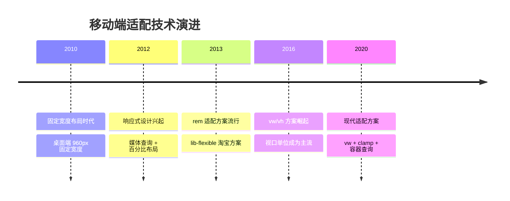
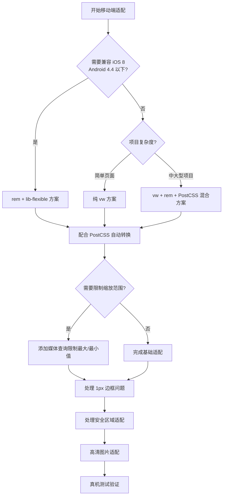
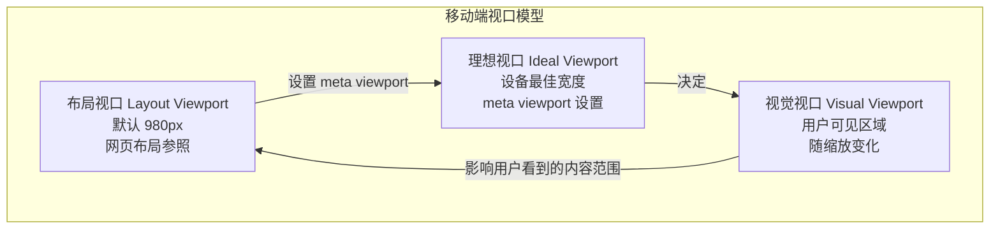
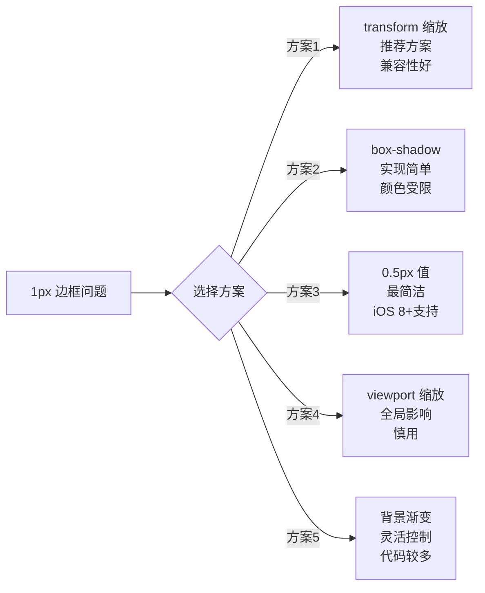
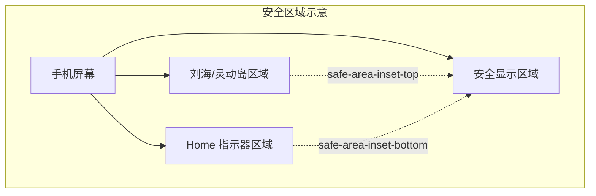
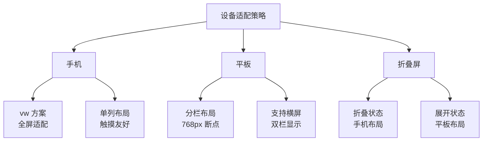

# 移动端适配

移动端适配是确保网页在各种移动设备上正确显示的关键技术。本章介绍主流适配方案的原理、实现和最佳实践。

## 背景与动机

### 为什么需要移动端适配

在移动互联网时代，超过 60% 的网页流量来自移动设备。然而，移动设备与桌面设备存在根本性差异：

- **屏幕尺寸碎片化**：从 320px 的初代 iPhone SE 到 430px 的 iPhone 15 Pro Max，再到各种 Android 设备的不同尺寸
- **像素密度差异**：标准屏（DPR=1）、Retina 屏（DPR=2）、超高清屏（DPR=3）
- **交互方式不同**：触摸操作代替鼠标点击，需要更大的触摸目标
- **性能限制**：移动设备 CPU、内存、网络带宽相对有限

**核心挑战**：如何让同一套代码在不同尺寸、不同像素密度的设备上都能呈现良好的视觉效果？

### 移动端适配技术演进



### 适配方案决策流程



## 核心概念

### 设备像素 vs CSS 像素

理解移动端适配，首先需要理解几种不同的"像素"概念：

| 概念 | 说明 | 示例 |
|------|------|------|
| 物理像素（Device Pixel） | 设备屏幕的实际像素点 | iPhone 15 物理宽度 1179px |
| CSS 像素（CSS Pixel） | CSS 中使用的逻辑像素 | iPhone 15 CSS 宽度 393px |
| 设备像素比（DPR） | 物理像素 / CSS 像素 | iPhone 15 DPR = 3 |
| 位图像素 | 图片的一个采样点 | 一张 100×100 的图片 |

**关键公式**：

```
物理像素 = CSS 像素 × DPR

示例：
- iPhone 15: 393 × 3 = 1179 物理像素宽度
- 1px CSS 边框在 DPR=2 的屏幕上 = 2 物理像素
- 1px CSS 边框在 DPR=3 的屏幕上 = 3 物理像素
```

```javascript
// 获取设备像素比
const dpr = window.devicePixelRatio;
console.log(`当前设备 DPR: ${dpr}`);

// 获取屏幕物理像素
const physicalWidth = screen.width * dpr;
const physicalHeight = screen.height * dpr;
console.log(`物理分辨率: ${physicalWidth} × ${physicalHeight}`);
```

### 视口类型

移动端浏览器存在三种不同的视口概念：

| 视口类型 | 说明 | 获取方式 |
|----------|------|----------|
| 布局视口（Layout Viewport） | 网页布局的容器，CSS 百分比的参照 | `document.documentElement.clientWidth` |
| 视觉视口（Visual Viewport） | 用户可见区域，缩放后的可见范围 | `window.visualViewport.width` |
| 理想视口（Ideal Viewport） | 设备最理想的视口尺寸，通常等于设备屏幕宽度 | `screen.width` |



**三者的关系**：
- 不设置 `<meta viewport>` 时，布局视口默认为 980px（移动端浏览器为了兼容桌面网页）
- 设置 `<meta name="viewport" content="width=device-width">` 后，布局视口等于理想视口
- 用户缩放页面时，视觉视口变化，但布局视口不变

### 常见设备参数对照表

| 设备 | CSS 宽度 | DPR | 物理宽度 | 安全区域底部 |
|------|----------|-----|----------|-------------|
| iPhone SE (3rd) | 375px | 2 | 750px | 0px |
| iPhone 14 | 390px | 3 | 1170px | 34px |
| iPhone 14 Pro Max | 430px | 3 | 1290px | 34px |
| iPhone 15 Pro | 393px | 3 | 1179px | 34px |
| iPad Air | 820px | 2 | 1640px | 0px |
| Galaxy S23 | 360px | 3 | 1080px | 0px |
| Pixel 7 | 412px | 2.625 | 1080px | 0px |

## 深入原理

### viewport 设置原理

`<meta name="viewport">` 标签是移动端适配的基石，它告诉浏览器如何控制页面的视口行为。

```html
<meta name="viewport" content="width=device-width, initial-scale=1.0">
```

#### viewport 属性详解

| 属性 | 说明 | 取值范围 | 默认值 |
|------|------|----------|--------|
| `width` | 视口宽度 | `device-width` 或 200-10000 的数值 | 980px |
| `height` | 视口高度 | `device-height` 或 223-10000 的数值 | 根据宽度计算 |
| `initial-scale` | 初始缩放比例 | 0.1 - 10 | 根据视口宽度计算 |
| `minimum-scale` | 最小缩放比例 | 0.1 - 10 | 0.25 |
| `maximum-scale` | 最大缩放比例 | 0.1 - 10 | 5.0 |
| `user-scalable` | 是否允许用户缩放 | `yes` / `no` | `yes` |
| `viewport-fit` | 视口填充方式 | `auto` / `contain` / `cover` | `auto` |

#### 常用配置

```html
<!-- 标准配置（推荐） -->
<meta name="viewport" content="width=device-width, initial-scale=1.0">

<!-- 全面屏适配 -->
<meta name="viewport" content="width=device-width, initial-scale=1.0, viewport-fit=cover">

<!-- ⚠️ 不推荐：禁止缩放（影响可访问性） -->
<meta name="viewport" content="width=device-width, initial-scale=1.0, maximum-scale=1.0, user-scalable=no">
```

> ⚠️ **可访问性警告**：禁止用户缩放会影响视障用户的使用体验，应避免使用 `user-scalable=no`。WCAG 2.1 标准明确要求允许用户至少缩放到 200%。

### 视觉视口 API

```javascript
// 获取视觉视口信息
console.log('宽度:', window.visualViewport.width);
console.log('高度:', window.visualViewport.height);
console.log('缩放比例:', window.visualViewport.scale);

// 监听视觉视口变化（虚拟键盘弹出时触发）
window.visualViewport?.addEventListener('resize', () => {
  console.log('视口变化:', window.visualViewport.width, window.visualViewport.height);
});

window.visualViewport?.addEventListener('scroll', () => {
  console.log('视口滚动偏移:', window.visualViewport.offsetTop);
});
```

## 代码示例

### rem 适配方案

#### 原理

设置根元素（`html`）字体大小为屏幕宽度的一定比例，元素尺寸使用 `rem` 单位，实现等比缩放。

```
1rem = 根元素字体大小
根元素字体大小 = 屏幕宽度 / 设计稿宽度 × 基准值

示例（设计稿 375px，基准值 100px）：
- 375px 屏幕：根字体 = 375 / 375 × 100 = 100px
- 750px 屏幕：根字体 = 750 / 375 × 100 = 200px
- 设计稿 100px 元素：CSS 写 1rem
```

#### 基础实现

```javascript
/**
 * rem 适配方案
 * @param {number} designWidth - 设计稿宽度（默认 375）
 * @param {number} baseSize - 基准字体大小（默认 100，方便计算）
 */
function setRem(designWidth = 375, baseSize = 100) {
  const clientWidth = document.documentElement.clientWidth;
  const fontSize = (clientWidth / designWidth) * baseSize;
  
  // 限制最大最小值，防止极端情况下布局异常
  const finalSize = Math.min(Math.max(fontSize, baseSize * 0.6), baseSize * 2);
  document.documentElement.style.fontSize = finalSize + 'px';
}

// 初始化
setRem();

// 监听窗口变化
window.addEventListener('resize', () => setRem());
window.addEventListener('orientationchange', () => setRem());
```

#### CSS 使用方式

```css
/* 手动计算 */
/* 设计稿元素宽度 100px，基准值 100px */
.element {
  width: 1rem; /* 100 / 100 = 1rem */
  height: 0.5rem; /* 50 / 100 = 0.5rem */
  font-size: 0.14rem; /* 14 / 100 = 0.14rem */
}

/* 使用 CSS 变量辅助计算 */
:root {
  --design-width: 375;
}

.element {
  /* width: 设计稿尺寸 / (设计稿宽度 / 100) */
  width: calc(100 / var(--design-width) * 100vw);
}
```

#### PostCSS 自动转换

```javascript
// postcss.config.js
module.exports = {
  plugins: {
    'postcss-pxtorem': {
      rootValue: 100,       // 基准值（与 JS 中的 baseSize 一致）
      unitPrecision: 5,     // 小数精度
      propList: ['*', '!border*'],  // 转换属性列表，排除 border
      selectorBlackList: ['.no-rem'],  // 忽略的选择器
      replace: true,        // 替换而非添加
      mediaQuery: false,    // 不转换媒体查询中的 px
      minPixelValue: 2      // 小于 2px 不转换
    }
  }
};
```

```css
/* 输入 */
.element {
  width: 100px;
  height: 50px;
  border: 1px solid #ddd;
  font-size: 14px;
}

/* 输出 */
.element {
  width: 1rem;
  height: 0.5rem;
  border: 1px solid #ddd; /* 小于 2px 不转换 */
  font-size: 0.14rem;
}
```

#### lib-flexible 方案

```html
<!-- 使用 CDN -->
<script src="https://cdn.jsdelivr.net/npm/lib-flexible@0.3.2/flexible.min.js"></script>
```

```javascript
// 或 npm 安装
import 'lib-flexible';
```

> 💡 **注意**：lib-flexible 已停止维护，其核心逻辑是将页面分为 10 等份，不同 DPR 设备使用不同的 `rootValue`。现代项目推荐使用 vw 方案。

### vw/vh 适配方案

#### 原理

`vw`（viewport width）是视口宽度的百分比单位，1vw = 视口宽度的 1%。

```
设计稿宽度 375px，元素 100px
100 / 375 * 100 = 26.667vw

设计稿宽度 375px，元素 14px 字号
14 / 375 * 100 = 3.733vw
```

#### CSS 使用

```css
/* 手动计算 */
.element {
  width: 26.667vw; /* 100 / 375 * 100 */
  height: 13.333vw; /* 50 / 375 * 100 */
  font-size: 3.733vw; /* 14 / 375 * 100 */
}
```

#### PostCSS 自动转换

```javascript
// postcss.config.js
module.exports = {
  plugins: {
    'postcss-px-to-viewport': {
      viewportWidth: 375,      // 设计稿宽度
      viewportHeight: 667,     // 设计稿高度
      unitPrecision: 5,        // 精度
      viewportUnit: 'vw',      // 转换单位
      selectorBlackList: ['.ignore'],  // 忽略选择器
      minPixelValue: 1,
      mediaQuery: false,
      exclude: [/node_modules/]
    }
  }
};
```

```css
/* 输入 */
.element {
  width: 100px;
  height: 50px;
  font-size: 14px;
}

/* 输出 */
.element {
  width: 26.667vw;
  height: 13.333vw;
  font-size: 3.733vw;
}
```

### vw + rem 混合方案

结合两种方案的优点：vw 提供精确的视口比例，rem 提供可控的缩放范围。

```css
/* html 根字体大小基于视口宽度 */
html {
  font-size: calc(100vw / 3.75);  /* 设计稿 375px 时，1rem = 100px */
}

/* 限制最大最小值，防止大屏/小屏极端情况 */
@media screen and (min-width: 750px) {
  html {
    font-size: 200px;  /* 最大限制 */
  }
}

@media screen and (max-width: 320px) {
  html {
    font-size: 85.33px;  /* 最小限制 */
  }
}

/* 元素使用 rem 单位 */
.element {
  width: 1rem;  /* 设计稿 100px */
  height: 0.5rem;  /* 设计稿 50px */
  font-size: 0.14rem;  /* 设计稿 14px */
}
```

### 适配方案对比

| 方案 | 原理 | 优点 | 缺点 | 适用场景 | 性能 |
|------|------|------|------|----------|------|
| rem | 动态设置根元素字体大小 | 兼容性好、可控性强 | 需要 JS、计算复杂 | 需要兼容旧浏览器 | 低 |
| vw | 视口百分比单位 | 无需 JS、简单直接 | 兼容性稍差、无上限 | 现代浏览器项目 | 最低 |
| vw + rem | 结合两种方案 | 兼顾兼容性和可控性 | 配置稍复杂 | 大型项目 | 低 |
| % | 相对于父元素 | 简单、原生支持 | 依赖父元素 | 简单布局 | 最低 |
| clamp() | CSS 函数动态计算 | 无需 JS、流畅缩放 | 浏览器要求较高 | 现代项目 | 最低 |

### 1px 边框问题

高分辨率屏幕（Retina）下，1px CSS 边框显示为 2-3 个物理像素，看起来过粗。

#### 问题原因

```
DPR = 物理像素 / CSS 像素

DPR = 2 时：1 CSS 像素 = 2 物理像素（看起来偏粗）
DPR = 3 时：1 CSS 像素 = 3 物理像素（看起来更粗）
```

#### 多种解决方案对比



| 方案 | 原理 | 优点 | 缺点 | 兼容性 | 推荐度 |
|------|------|------|------|--------|--------|
| transform 缩放 | 伪元素 + 缩放 | 四边支持、灵活 | 代码较多、圆角处理复杂 | 所有现代浏览器 | ⭐⭐⭐⭐⭐ |
| box-shadow | 0.5px 偏移阴影 | 代码简洁 | 颜色不精确、模糊感 | iOS 8+ | ⭐⭐⭐⭐ |
| 0.5px 值 | 直接使用 0.5px | 最简洁 | 低版本不支持 | iOS 8+, Android 5+ | ⭐⭐⭐⭐ |
| viewport 缩放 | 全局缩放 0.5 | 彻底解决 | 影响所有元素、JS 复杂 | 所有浏览器 | ⭐⭐ |
| 背景渐变 | linear-gradient 1px | 精确控制 | 代码多、性能稍差 | 所有浏览器 | ⭐⭐⭐ |

#### 方案一：transform 缩放（推荐）

```css
/* 单边框 */
.hairline-bottom {
  position: relative;
}

.hairline-bottom::after {
  content: '';
  position: absolute;
  left: 0;
  bottom: 0;
  width: 100%;
  height: 1px;
  background: #ddd;
  transform: scaleY(0.5);
  transform-origin: bottom;
}

/* 四边框 */
.hairline-all {
  position: relative;
}

.hairline-all::after {
  content: '';
  position: absolute;
  top: 0;
  left: 0;
  width: 200%;
  height: 200%;
  border: 1px solid #ddd;
  transform: scale(0.5);
  transform-origin: left top;
  pointer-events: none;
  box-sizing: border-box;
}

/* 带圆角的四边框 */
.hairline-rounded {
  position: relative;
  border-radius: 8px;
}

.hairline-rounded::after {
  content: '';
  position: absolute;
  top: -50%;
  left: -50%;
  width: 200%;
  height: 200%;
  border: 1px solid #ddd;
  border-radius: 16px;  /* 圆角也需要 2 倍 */
  transform: scale(0.5);
  transform-origin: center;
  pointer-events: none;
  box-sizing: border-box;
}
```

#### 方案二：box-shadow

```css
.hairline {
  /* 单边 */
  box-shadow: 0 0.5px 0 #ddd;
  
  /* 四边 */
  box-shadow: 0 0 0 0.5px #ddd;
}
```

#### 方案三：使用 0.5px

```css
/* iOS 8+ / Android 5+ 支持 */
.hairline {
  border: 0.5px solid #ddd;
}

/* 兼容处理：不支持 0.5px 时使用 1px */
.hairline {
  border: 1px solid #ddd;
}

@supports (border: 0.5px solid #ddd) {
  .hairline {
    border: 0.5px solid #ddd;
  }
}

/* 或使用 DPR 媒体查询 */
@media (-webkit-min-device-pixel-ratio: 2) {
  .hairline {
    border-width: 0.5px;
  }
}
```

#### 方案四：viewport 缩放

```html
<!-- 动态设置 viewport scale -->
<meta name="viewport" content="width=device-width, initial-scale=0.5">
```

> ⚠️ **警告**：viewport 缩放会影响整个页面的所有元素，包括字体、图片等，需要全局调整所有尺寸，实际项目中很少使用。

#### 方案五：背景渐变

```css
.hairline-bg {
  background: linear-gradient(180deg, #ddd, #ddd 1px, transparent 1px) no-repeat;
  background-size: 100% 1px;
  background-position: bottom;
}

/* 四边 */
.hairline-bg-all {
  background:
    linear-gradient(180deg, #ddd, #ddd 1px, transparent 1px) no-repeat top / 100% 1px,
    linear-gradient(180deg, #ddd, #ddd 1px, transparent 1px) no-repeat bottom / 100% 1px,
    linear-gradient(90deg, #ddd, #ddd 1px, transparent 1px) no-repeat left / 1px 100%,
    linear-gradient(90deg, #ddd, #ddd 1px, transparent 1px) no-repeat right / 1px 100%;
}
```

#### 通用工具类

```css
/* 1px 边框工具类 */
[class*="hairline"] {
  position: relative;
}

[class*="hairline"]::after {
  content: '';
  position: absolute;
  pointer-events: none;
  box-sizing: border-box;
  transform-origin: center;
}

/* 上边框 */
.hairline-top::after {
  top: 0;
  left: 0;
  width: 100%;
  height: 1px;
  background: currentColor;
  transform: scaleY(0.5);
}

/* 下边框 */
.hairline-bottom::after {
  bottom: 0;
  left: 0;
  width: 100%;
  height: 1px;
  background: currentColor;
  transform: scaleY(0.5);
}

/* 全边框 */
.hairline-surround::after {
  top: 0;
  left: 0;
  width: 200%;
  height: 200%;
  border: 1px solid currentColor;
  transform: scale(0.5);
  transform-origin: left top;
}
```

### 安全区域适配

全面屏手机（iPhone X 及以上）需要在安全区域内显示内容，避免被刘海、圆角、Home 指示器遮挡。

#### viewport-fit

```html
<!-- cover: 页面完全覆盖屏幕（包含安全区域外） -->
<meta name="viewport" content="width=device-width, initial-scale=1.0, viewport-fit=cover">

<!-- contain: 页面在安全区域内显示（不覆盖刘海等） -->
<meta name="viewport" content="width=device-width, initial-scale=1.0, viewport-fit=contain">
```



#### env() 函数

```css
/* 安全区域内边距 */
.footer {
  /* iOS 11.0-11.2 使用 constant */
  padding-bottom: constant(safe-area-inset-bottom);
  /* iOS 11.2+ 使用 env */
  padding-bottom: env(safe-area-inset-bottom);
}

/* 四个方向的安全区域 */
.element {
  padding-top: env(safe-area-inset-top);
  padding-right: env(safe-area-inset-right);
  padding-bottom: env(safe-area-inset-bottom);
  padding-left: env(safe-area-inset-left);
}

/* 与原有 padding 结合 */
.footer {
  padding-bottom: calc(12px + env(safe-area-inset-bottom));
}
```

#### 安全区域值参考

| 方向 | 说明 | iPhone X/11/12/13/14 | iPhone 14 Pro/15 Pro |
|------|------|---------------------|---------------------|
| `safe-area-inset-top` | 顶部安全区域 | 44px（状态栏） | 59px（灵动岛） |
| `safe-area-inset-bottom` | 底部安全区域 | 34px（Home 指示器） | 34px（Home 指示器） |
| `safe-area-inset-left` | 左侧安全区域 | 0px（竖屏）/ 44px（横屏） | 0px（竖屏）/ 59px（横屏） |
| `safe-area-inset-right` | 右侧安全区域 | 0px（竖屏）/ 44px（横屏） | 0px（竖屏）/ 59px（横屏） |

#### 底部固定元素适配

```css
/* 底部固定按钮 */
.fixed-button {
  position: fixed;
  bottom: 0;
  left: 0;
  right: 0;
  padding: 12px 16px;
  /* 兼容 iOS 11.0-11.2 */
  padding-bottom: calc(12px + constant(safe-area-inset-bottom));
  /* iOS 11.2+ */
  padding-bottom: calc(12px + env(safe-area-inset-bottom));
  background: #fff;
  box-shadow: 0 -2px 8px rgba(0, 0, 0, 0.1);
}
```

#### 横屏适配

```css
/* 横屏时左右安全区域 */
@supports (padding: max(0px)) {
  .container {
    padding-left: max(16px, env(safe-area-inset-left));
    padding-right: max(16px, env(safe-area-inset-right));
  }
}
```

### 高清图片适配

#### srcset 方案

```html
<!-- 根据 DPR 选择图片 -->


<!-- 根据宽度选择图片 -->

```

#### CSS 媒体查询

```css
/* 背景图片 */
.icon {
  width: 24px;
  height: 24px;
  background-image: url('icon@1x.png');
  background-size: contain;
}

@media (-webkit-min-device-pixel-ratio: 2), (min-resolution: 192dpi) {
  .icon {
    background-image: url('icon@2x.png');
  }
}

@media (-webkit-min-device-pixel-ratio: 3), (min-resolution: 288dpi) {
  .icon {
    background-image: url('icon@3x.png');
  }
}
```

#### image-set()

```css
.icon {
  background-image: image-set(
    'icon@1x.png' 1x,
    'icon@2x.png' 2x,
    'icon@3x.png' 3x
  );
}
```

#### 使用 SVG 替代位图

```html
<!-- SVG 图标天然支持高清屏，无需多倍图 -->


<!-- 或使用 icon font -->
<link rel="stylesheet" href="iconfont.css">
<span class="iconfont icon-home"></span>
```

## 最佳实践

### 1. 适配方案选择

```css
/* 推荐：vw + rem 混合方案 */
html {
  font-size: calc(100vw / 3.75);
}

/* 限制范围 */
@media (min-width: 750px) {
  html { font-size: 200px; }
}

@media (max-width: 320px) {
  html { font-size: 85.33px; }
}
```

### 2. PostCSS 完整配置

```javascript
// postcss.config.js - 完整配置
module.exports = {
  plugins: {
    'postcss-px-to-viewport': {
      viewportWidth: 375,
      unitPrecision: 5,
      viewportUnit: 'vw',
      selectorBlackList: ['.van'],  // 忽略第三方组件
      minPixelValue: 1,
      mediaQuery: false
    },
    'postcss-pxtorem': {
      rootValue: 37.5,
      propList: ['*'],
      selectorBlackList: ['.van']
    }
  }
};
```

### 3. 真机测试

```javascript
// 获取设备信息
const info = {
  dpr: window.devicePixelRatio,
  width: window.innerWidth,
  height: window.innerHeight,
  pixelRatio: window.devicePixelRatio,
  isIOS: /iPhone|iPad|iPod/i.test(navigator.userAgent),
  isAndroid: /Android/i.test(navigator.userAgent)
};
console.log('设备信息:', info);
```

### 4. 性能优化

```css
/* 减少重绘 */
.will-change {
  will-change: transform;
  transform: translateZ(0);
}

/* 合理使用硬件加速 */
.animate {
  transform: translate3d(0, 0, 0);
  backface-visibility: hidden;
}
```

### 5. 不同设备适配策略



### 6. 常见适配问题处理

```css
/* 移动端点击延迟（300ms） */
* {
  touch-action: manipulation;
}

/* iOS 输入框内阴影 */
input, textarea {
  -webkit-appearance: none;
  border-radius: 0;
}

/* 移动端字体 */
body {
  font-family: -apple-system, BlinkMacSystemFont, "PingFang SC", "Hiragino Sans GB", "Microsoft YaHei", sans-serif;
}

/* 禁用长按菜单 */
img, a {
  -webkit-touch-callout: none;
}

.no-select {
  -webkit-user-select: none;
  user-select: none;
}
```

## 常见问题

### Q1: rem 方案中，设计稿标注 100px，CSS 应该写多少？

假设设计稿宽度 375px，基准值 37.5（方便计算）：

```css
html { font-size: calc(100vw / 3.75); }  /* 10vw = 37.5px */

/* 设计稿 100px = 100 / 37.5 = 2.667rem */
.element { width: 2.667rem; }
```

### Q2: 为什么 vw 方案在某些安卓机型上显示异常？

部分旧版安卓浏览器对 vw 单位支持不完整，可以添加 fallback：

```css
.element {
  width: 50%;     /* 回退方案 */
  width: 50vw;    /* 现代浏览器 */
}
```

### Q3: 如何处理第三方组件库的适配？

```javascript
// postcss.config.js
module.exports = {
  plugins: {
    'postcss-px-to-viewport': {
      viewportWidth: 375,
      selectorBlackList: ['.van', '.ant', '.el'],  // 忽略组件库
    }
  }
};
```

### Q4: 字体大小随屏幕变化导致阅读困难？

```css
/* 文章正文不使用 rem/vw，使用固定 px 或 clamp */
.article {
  font-size: 16px;
  line-height: 1.6;
}

/* 或使用 clamp 限制范围 */
.article {
  font-size: clamp(14px, 4vw, 18px);
  line-height: 1.6;
}

/* 标题可以使用视口单位 */
h1 {
  font-size: clamp(1.5rem, 5vw, 2.5rem);
}
```

### Q5: 如何检测当前设备的 DPR？

```javascript
const dpr = window.devicePixelRatio || 1;
console.log(`DPR: ${dpr}`);

// 响应式加载
if (dpr >= 3) {
  // 加载 3x 图片
} else if (dpr >= 2) {
  // 加载 2x 图片
} else {
  // 加载 1x 图片
}
```

### Q6: 1px 边框在圆角元素上如何处理？

```css
/* 圆角元素的 1px 边框 */
.rounded-hairline {
  position: relative;
  border-radius: 8px;
}

.rounded-hairline::after {
  content: '';
  position: absolute;
  top: -50%;
  left: -50%;
  width: 200%;
  height: 200%;
  border: 1px solid #ddd;
  border-radius: 16px;  /* 圆角值 × 2 */
  transform: scale(0.5);
  transform-origin: center;
  pointer-events: none;
  box-sizing: border-box;
}
```

### Q7: 如何在不同 DPR 设备上精确控制图片清晰度？

```html
<!-- 使用 picture 元素提供不同 DPR 的图片 -->
<picture>
  <source 
    media="(min-resolution: 288dpi)" 
    srcset="image@3x.jpg">
  <source 
    media="(min-resolution: 192dpi)" 
    srcset="image@2x.jpg">
  
</picture>
```

## 参考资源

- [MDN - Viewport 元标签](https://developer.mozilla.org/zh-CN/docs/Web/HTML/Viewport_meta_tag)
- [MDN - env() CSS 函数](https://developer.mozilla.org/zh-CN/docs/Web/CSS/env)
- [lib-flexible - GitHub](https://github.com/amfe/lib-flexible)
- [postcss-px-to-viewport - GitHub](https://github.com/evrone/postcss-px-to-viewport)
- [postcss-pxtorem - GitHub](https://github.com/cuth/postcss-pxtorem)
- [CSS 视口单位 - MDN](https://developer.mozilla.org/zh-CN/docs/Web/CSS/length#视口单位)
- [The Notch and iOS 11 - Apple Developer](https://developer.apple.com/documentation/uikit/positioning_content_relative_to_the_safe_area)

## 浏览器支持

| 特性 | Chrome | Firefox | Safari | Edge | iOS Safari |
|------|--------|---------|--------|------|------------|
| vw/vh | 20+ | 19+ | 6+ | 12+ | 6+ |
| env() | 69+ | 65+ | 11.2+ | 79+ | 11.2+ |
| calc() | 26+ | 16+ | 7+ | 12+ | 6+ |
| image-set() | 113+（21–112 需 `-webkit-` 前缀） | 89+ | 14+（17+ 完整，6–13 需 `-webkit-` 前缀） | 113+ | 14+（17+ 完整） |
| clamp() | 79+ | 75+ | 13.1+ | 79+ | 13.4+ |
| dvh/svh/lvh | 108+ | 101+ | 15.4+ | 108+ | 15.4+ |
