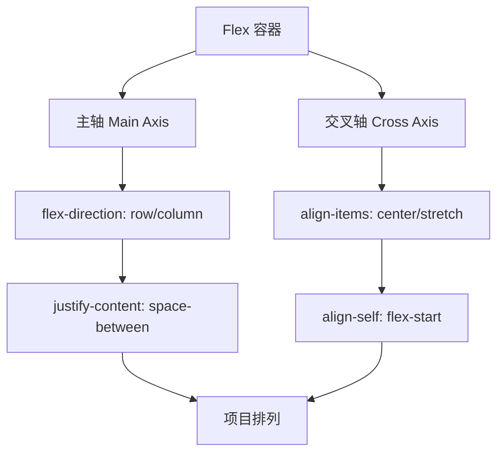
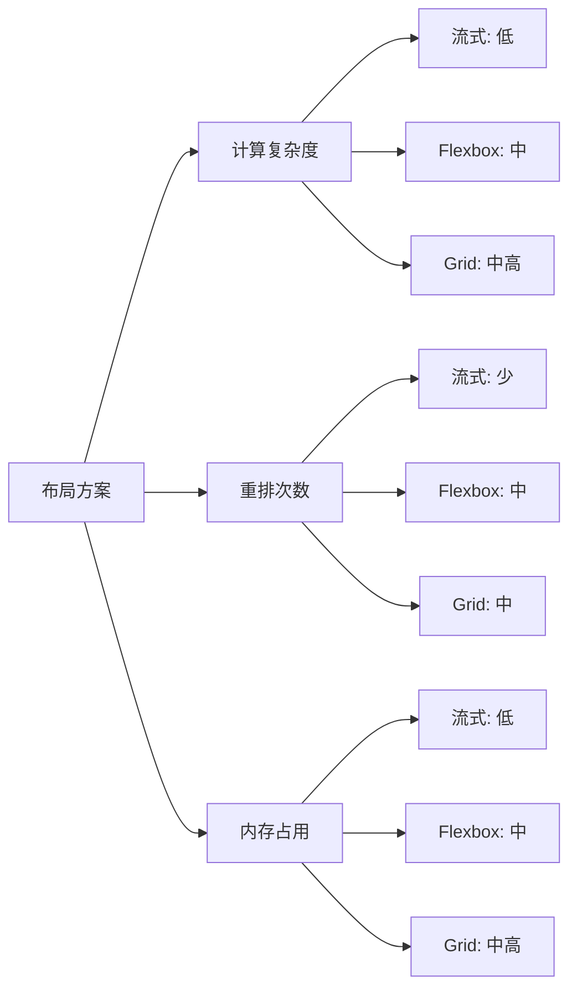
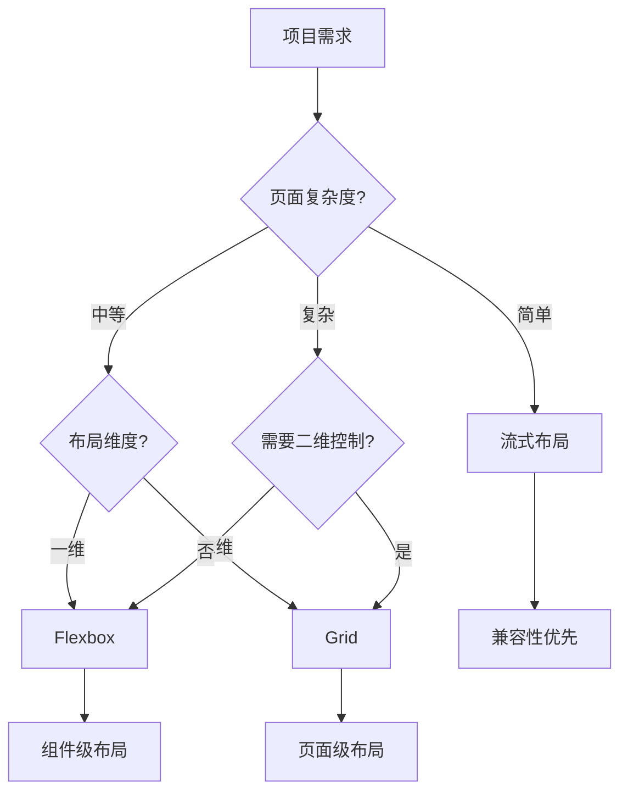

# 响应式布局方案完全指南

本章节系统介绍各种响应式布局的实现方案，从基础到高级，帮助你构建适应各种设备的网页布局。

## 背景与动机

### 为什么需要多种布局方案？

在响应式设计的早期，开发者主要依赖流式布局（百分比布局）和浮动来实现自适应效果。随着 Web 技术的发展，CSS3 引入了更强大的布局模型：Flexbox 和 Grid。每种方案都有其特定的应用场景和优势。

### 布局技术演进


### 核心挑战

1. **设备碎片化**：屏幕尺寸从 320px 到 4K+，需要灵活的布局方案
2. **性能要求**：不同方案的渲染性能差异显著
3. **兼容性考虑**：旧浏览器支持与现代特性的平衡
4. **开发效率**：选择适合项目的方案能大幅提升开发速度
5. **维护成本**：代码复杂度和可维护性的权衡

## 布局方案概览

| 方案 | 核心技术 | 特点 | 适用场景 | 性能 | 兼容性 |
|------|----------|------|----------|------|--------|
| 流式布局 | 百分比 | 简单直接，兼容性好 | 简单页面、旧项目 | ⭐⭐⭐⭐⭐ | ⭐⭐⭐⭐⭐ |
| Flexbox | flex | 一维布局，灵活对齐 | 导航、卡片列表、组件 | ⭐⭐⭐⭐ | ⭐⭐⭐⭐⭐ |
| Grid | grid | 二维布局，精确控制 | 复杂页面结构、仪表盘 | ⭐⭐⭐⭐ | ⭐⭐⭐⭐ |
| 多列布局 | column | 文字排版优化 | 文章列表、杂志风格 | ⭐⭐⭐⭐ | ⭐⭐⭐⭐ |
| 容器查询 | @container | 组件级响应 | 可复用组件、设计系统 | ⭐⭐⭐⭐ | ⭐⭐⭐ |

## 流式布局

流式布局（Fluid Layout）是最基础的响应式布局方案，使用百分比单位让元素宽度适应容器宽度。

### 基础实现

```css
/* 经典流式布局 */
.container {
  width: 100%;
  max-width: 1200px;
  margin: 0 auto;
  padding: 0 20px;
}

.main {
  width: 70%;
  float: left;
}

.sidebar {
  width: 30%;
  float: left;
}

/* 清除浮动 */
.container::after {
  content: '';
  display: table;
  clear: both;
}
```

### 媒体查询改进

```css
/* 移动优先方案 */
.main,
.sidebar {
  width: 100%;
  float: none;
}

@media (min-width: 768px) {
  .main { 
    width: 70%; 
    float: left;
  }
  .sidebar { 
    width: 30%; 
    float: left;
  }
}

/* 现代方案：使用 Flexbox 替代浮动 */
.layout {
  display: flex;
  flex-wrap: wrap;
}

.main { 
  flex: 70%; 
}

.sidebar { 
  flex: 30%; 
}

@media (max-width: 767px) {
  .main, 
  .sidebar { 
    flex: 100%; 
  }
}
```

### 流式布局的常见问题与解决方案

```css
/* 问题 1：图片超出容器 */
img, video, iframe {
  max-width: 100%;
  height: auto;
  display: block;
}

/* 问题 2：内容溢出 */
.container {
  overflow: hidden; /* 或 overflow-x: auto */
}

/* 问题 3：最小宽度限制 */
.container {
  min-width: 320px; /* 防止过小 */
}

/* 问题 4：边框和 padding 导致溢出 */
* {
  box-sizing: border-box; /* 必须添加 */
}
```

### 流式布局优缺点

**优点：**
- ✅ 实现简单，易于理解
- ✅ 浏览器兼容性极好（IE6+）
- ✅ 性能开销最小
- ✅ 适合简单页面结构

**缺点：**
- ❌ 需要处理浮动清除
- ❌ 布局灵活性有限
- ❌ 难以实现复杂对齐
- ❌ 等高列需要额外技巧
- ❌ 代码维护成本随复杂度增加

## Flexbox 响应式布局

Flexbox 是一维布局模型，专为处理行或列方向的布局而设计。它提供了强大的对齐控制和空间分配能力。

### 核心概念



### 自动换行与弹性

```css
.container {
  display: flex;
  flex-wrap: wrap; /* 允许换行 */
  gap: 20px; /* 项目间距 */
}

.item {
  flex: 1 1 300px; /* grow shrink basis */
  min-width: 0;    /* 防止内容撑开 */
}

/* flex 属性详解 */
.item-grow {
  flex-grow: 1;    /* 有剩余空间时扩展 */
  flex-shrink: 1;  /* 空间不足时收缩 */
  flex-basis: 200px; /* 初始大小 */
}
```

### 响应式导航栏

```css
/* 移动端：垂直堆叠 */
.nav {
  display: flex;
  flex-direction: column;
  gap: 10px;
  padding: 20px;
}

.nav-item {
  padding: 10px 15px;
  text-decoration: none;
  color: #333;
}

/* 桌面端：水平排列 */
@media (min-width: 768px) {
  .nav {
    flex-direction: row;
    justify-content: space-between;
    align-items: center;
  }
  
  .nav-item:hover {
    background: #f0f0f0;
    border-radius: 4px;
  }
}
```

### 圣杯布局（Holy Grail Layout）

```html
<div class="layout">
  <header class="header">Header</header>
  <div class="main-content">
    <aside class="sidebar-left">Left Sidebar</aside>
    <main class="main">Main Content</main>
    <aside class="sidebar-right">Right Sidebar</aside>
  </div>
  <footer class="footer">Footer</footer>
</div>
```

```css
.layout {
  display: flex;
  flex-direction: column;
  min-height: 100vh;
}

.header,
.footer {
  flex: 0 0 auto; /* 不伸缩 */
  padding: 20px;
  background: #333;
  color: white;
}

.main-content {
  display: flex;
  flex-direction: column;
  flex: 1; /* 占据剩余空间 */
}

.main {
  flex: 1;
  padding: 20px;
  order: 2; /* 移动端：主内容在中间 */
}

.sidebar-left,
.sidebar-right {
  padding: 20px;
  background: #f0f0f0;
  order: 1; /* 移动端：侧边栏在上方 */
}

@media (min-width: 768px) {
  .main-content {
    flex-direction: row; /* 桌面端：水平排列 */
  }
  
  .main {
    order: 2;
  }
  
  .sidebar-left {
    flex: 0 0 200px;
    order: 1;
  }
  
  .sidebar-right {
    flex: 0 0 250px;
    order: 3;
  }
}
```

### 等高列布局

```css
/* Flexbox 默认等高 */
.columns {
  display: flex;
  gap: 20px;
}

.column {
  flex: 1;
  padding: 20px;
  background: #f0f0f0;
  /* 自动等高，无需额外设置 */
}

/* 如果需要最小高度 */
.column {
  min-height: 200px;
}
```

### 响应式卡片网格

```css
.card-grid {
  display: flex;
  flex-wrap: wrap;
  gap: 20px;
}

.card {
  flex: 1 1 calc(33.333% - 20px);
  min-width: 280px; /* 最小宽度 */
  padding: 20px;
  border: 1px solid #eee;
  border-radius: 8px;
  background: white;
}

/* 平板：两列 */
@media (max-width: 991px) {
  .card {
    flex: 1 1 calc(50% - 20px);
  }
}

/* 手机：单列 */
@media (max-width: 575px) {
  .card {
    flex: 1 1 100%;
  }
}
```

### Flexbox 性能优化

```css
/* 避免过度使用 flex */
.flex-container {
  display: flex;
  /* 只在需要时添加 */
}

/* 使用 transform 替代某些 flex 场景 */
.centered {
  position: absolute;
  top: 50%;
  left: 50%;
  transform: translate(-50%, -50%);
  /* 性能优于 flex 居中 */
}

/* 避免嵌套过深 */
/* ❌ 不推荐 */
.flex-1 { display: flex; }
.flex-2 { display: flex; }
.flex-3 { display: flex; }

/* ✅ 推荐：扁平化结构 */
```

## Grid 响应式布局

CSS Grid 是二维布局系统，可以同时处理行和列，适合复杂的页面布局。

### auto-fit 与 auto-fill

```css
/* auto-fit：自动适应，空轨道折叠 */
.grid-fit {
  display: grid;
  grid-template-columns: repeat(auto-fit, minmax(280px, 1fr));
  gap: 20px;
}

/* auto-fill：自动填充，保留空轨道 */
.grid-fill {
  display: grid;
  grid-template-columns: repeat(auto-fill, minmax(200px, 1fr));
  gap: 20px;
}

/* 区别示例 */
/* 3 个项目，可放 4 列 */
.grid-fit .item { /* 项目扩展填满 3 列 */ }
.grid-fill .item { /* 保持 4 列，第 4 列为空 */ }
```

### 响应式网格区域

```css
.layout {
  display: grid;
  min-height: 100vh;
  grid-template-areas:
    "header"
    "main"
    "sidebar"
    "footer";
  grid-template-rows: auto 1fr auto auto;
}

.header { 
  grid-area: header;
  padding: 20px;
  background: #333;
  color: white;
}

.main { 
  grid-area: main;
  padding: 20px;
}

.sidebar { 
  grid-area: sidebar;
  padding: 20px;
  background: #f0f0f0;
}

.footer { 
  grid-area: footer;
  padding: 20px;
  background: #333;
  color: white;
}

/* 平板：两列布局 */
@media (min-width: 768px) {
  .layout {
    grid-template-areas:
      "header header"
      "sidebar main"
      "footer footer";
    grid-template-columns: 250px 1fr;
  }
}

/* 桌面：三列布局 */
@media (min-width: 1024px) {
  .layout {
    grid-template-columns: 250px 1fr 200px;
    grid-template-areas:
      "header header header"
      "sidebar main aside"
      "footer footer footer";
  }
}
```

### 复杂仪表盘布局

```css
.dashboard {
  display: grid;
  grid-template-columns: repeat(4, 1fr);
  grid-template-rows: repeat(3, auto);
  gap: 20px;
  padding: 20px;
}

.widget {
  background: white;
  border-radius: 8px;
  padding: 20px;
  box-shadow: 0 2px 4px rgba(0,0,0,0.1);
}

/* 特色组件跨列跨行 */
.featured {
  grid-column: span 2;
  grid-row: span 2;
}

/* 响应式调整 */
@media (max-width: 991px) {
  .dashboard {
    grid-template-columns: repeat(2, 1fr);
  }
  
  .featured {
    grid-column: span 2;
    grid-row: span 1;
  }
}

@media (max-width: 575px) {
  .dashboard {
    grid-template-columns: 1fr;
  }
  
  .featured {
    grid-column: span 1;
  }
}
```

### Grid 与 Flexbox 组合

```css
/* 页面级：使用 Grid 控制整体结构 */
.page {
  display: grid;
  grid-template-areas:
    "header"
    "main"
    "footer";
  min-height: 100vh;
  grid-template-rows: auto 1fr auto;
}

/* 组件级：使用 Flexbox 处理内部布局 */
.nav {
  display: flex;
  justify-content: space-between;
  align-items: center;
  padding: 0 20px;
}

.card-list {
  display: flex;
  flex-wrap: wrap;
  gap: 20px;
  padding: 20px;
}

.card {
  flex: 1 1 300px;
  display: flex;
  flex-direction: column;
}

.card-content {
  flex: 1; /* 内容区域自动扩展 */
}

.card-footer {
  margin-top: auto; /* 底部对齐 */
}
```

### Grid 性能考虑

```css
/* 避免过度复杂的网格 */
/* ❌ 不推荐：过多轨道 */
.grid {
  grid-template-columns: repeat(12, 1fr);
  grid-template-rows: repeat(10, auto);
}

/* ✅ 推荐：简洁的网格 */
.grid {
  grid-template-columns: repeat(auto-fit, minmax(300px, 1fr));
}

/* 使用 subgrid 简化嵌套 */
.parent {
  display: grid;
  grid-template-columns: repeat(3, 1fr);
}

.child {
  display: grid;
  grid-template-columns: subgrid;
  grid-column: span 3;
}
```

## 多列布局

多列布局（Multi-column Layout）专门用于文本排版，可以自动将内容分成多列，类似报纸或杂志的排版效果。

### 基础多列

```css
.article {
  column-count: 3; /* 列数 */
  column-gap: 40px; /* 列间距 */
  column-rule: 1px solid #ddd; /* 列分隔线 */
}

/* 或使用列宽 */
.article {
  column-width: 300px; /* 浏览器自动计算列数 */
  column-gap: 40px;
}
```


#### column-count 交互演示（MDN）

设置多列布局的列数。

```html
<!DOCTYPE html>
<html lang="zh-CN">
  <head>
    <meta charset="UTF-8" />
    <meta name="viewport" content="width=device-width, initial-scale=1.0" />
    <title>column-count 属性演示 - MDN 示例</title>
    <meta name="description" content="column-count 属性演示" />
    <style>
      * {
        margin: 0;
        padding: 0;
        box-sizing: border-box;
      }
      body {
        font-family: -apple-system, BlinkMacSystemFont, "Segoe UI", Roboto, "Helvetica Neue", Arial, sans-serif;
        min-height: 100vh;
        padding: 0;
      }
      .demo-layout {
        display: flex;
        height: 100vh;
        gap: 0;
      }
      .snippet-panel {
        width: 320px;
        flex-shrink: 0;
        padding: 16px;
        display: flex;
        flex-direction: column;
        gap: 8px;
        overflow-y: auto;
        border-right: 1px solid #ddd;
        background: #fafafa;
      }
      .snippet-btn {
        padding: 10px 14px;
        border: 1px solid #ccc;
        border-radius: 6px;
        background: #fff;
        font-family: "JetBrains Mono", "Fira Code", monospace;
        font-size: 13px;
        color: #333;
        cursor: pointer;
        text-align: left;
        transition: all 0.2s;
        line-height: 1.4;
      }
      .snippet-btn:hover {
        border-color: #8083ff;
        background: #f0f0ff;
      }
      .snippet-btn.active {
        border-color: #8083ff;
        background: #e8e8ff;
        color: #571bc1;
        font-weight: 600;
      }
      .preview-panel {
        flex: 1;
        padding: 16px;
        display: flex;
        align-items: center;
        justify-content: center;
        background: #fff;
        overflow: auto;
      }
      .preview-panel > section,
      .preview-panel > div:not(.snippet-panel):not(.demo-layout) {
        flex: 1;
        width: 100%;
        min-height: 0;
        height: 100%;
        display: flex;
        align-items: center;
        justify-content: center;
      }
      #example-element {
        width: 100%;
        text-align: left;
      }
    </style>
  </head>
  <body>
    <div class="demo-layout">
      <div class="snippet-panel">
        <button class="snippet-btn active" data-index="0">列-count: 2;</button>
        <button class="snippet-btn" data-index="1">列-count: 3;</button>
        <button class="snippet-btn" data-index="2">列-count: 4;</button>
        <button class="snippet-btn" data-index="3">列-count: auto;</button>
      </div>
      <div class="preview-panel">
        <section id="default-example">
          <p id="example-element">
            London. Michaelmas term lately over, and the Lord Chancellor sitting in Lincoln's Inn Hall. Implacable
            November weather. As much mud in the streets as if the waters had but newly retired from the face of the
            earth, and it would not be wonderful to meet a Megalosaurus, forty feet long or so, waddling like an
            elephantine lizard up Holborn Hill.
          </p>
        </section>
      </div>
    </div>
    <script>
      const snippets = [
        `#example-element {
  column-count: 2;
}`,
        `#example-element {
  column-count: 3;
}`,
        `#example-element {
  column-count: 4;
}`,
        `#example-element {
  column-count: auto;
column-width: 8rem;
}`,
      ];

      let styleEl = document.createElement("style");
      document.head.appendChild(styleEl);

      function applySnippet(index) {
        styleEl.textContent = snippets[index];
        document.querySelectorAll(".snippet-btn").forEach((btn, i) => {
          btn.classList.toggle("active", i === index);
        });
      }

      document.querySelectorAll(".snippet-btn").forEach((btn) => {
        btn.addEventListener("click", () => applySnippet(parseInt(btn.dataset.index)));
      });

      applySnippet(0);
    </script>
  </body>
</html>

```

#### column-fill 交互演示（MDN）

设置多列内容的填充方式（balance 平衡/auto 顺序填充）。

```html
<!DOCTYPE html>
<html lang="zh-CN">
  <head>
    <meta charset="UTF-8" />
    <meta name="viewport" content="width=device-width, initial-scale=1.0" />
    <title>column-fill 属性演示 - MDN 示例</title>
    <meta name="description" content="column-fill 属性演示" />
    <style>
      * {
        margin: 0;
        padding: 0;
        box-sizing: border-box;
      }
      body {
        font-family: -apple-system, BlinkMacSystemFont, "Segoe UI", Roboto, "Helvetica Neue", Arial, sans-serif;
        min-height: 100vh;
        padding: 0;
      }
      .demo-layout {
        display: flex;
        height: 100vh;
        gap: 0;
      }
      .snippet-panel {
        width: 320px;
        flex-shrink: 0;
        padding: 16px;
        display: flex;
        flex-direction: column;
        gap: 8px;
        overflow-y: auto;
        border-right: 1px solid #ddd;
        background: #fafafa;
      }
      .snippet-btn {
        padding: 10px 14px;
        border: 1px solid #ccc;
        border-radius: 6px;
        background: #fff;
        font-family: "JetBrains Mono", "Fira Code", monospace;
        font-size: 13px;
        color: #333;
        cursor: pointer;
        text-align: left;
        transition: all 0.2s;
        line-height: 1.4;
      }
      .snippet-btn:hover {
        border-color: #8083ff;
        background: #f0f0ff;
      }
      .snippet-btn.active {
        border-color: #8083ff;
        background: #e8e8ff;
        color: #571bc1;
        font-weight: 600;
      }
      .preview-panel {
        flex: 1;
        padding: 16px;
        display: flex;
        align-items: center;
        justify-content: center;
        background: #fff;
        overflow: auto;
      }
      .preview-panel > section,
      .preview-panel > div:not(.snippet-panel):not(.demo-layout) {
        flex: 1;
        width: 100%;
        min-height: 0;
        height: 100%;
        display: flex;
        align-items: center;
        justify-content: center;
      }
      #example-element {
        width: 100%;
        height: 90%;
        columns: 3;
        text-align: left;
      }
    </style>
  </head>
  <body>
    <div class="demo-layout">
      <div class="snippet-panel">
        <button class="snippet-btn active" data-index="0">列-fill: auto;</button>
        <button class="snippet-btn" data-index="1">列-fill: balance;</button>
      </div>
      <div class="preview-panel">
        <section id="default-example">
          <p id="example-element">
            London. Michaelmas term lately over, and the Lord Chancellor sitting in Lincoln's Inn Hall. Implacable
            November weather.
          </p>
        </section>
      </div>
    </div>
    <script>
      const snippets = [
        `#example-element {
  column-fill: auto;
}`,
        `#example-element {
  column-fill: balance;
}`,
      ];

      let styleEl = document.createElement("style");
      document.head.appendChild(styleEl);

      function applySnippet(index) {
        styleEl.textContent = snippets[index];
        document.querySelectorAll(".snippet-btn").forEach((btn, i) => {
          btn.classList.toggle("active", i === index);
        });
      }

      document.querySelectorAll(".snippet-btn").forEach((btn) => {
        btn.addEventListener("click", () => applySnippet(parseInt(btn.dataset.index)));
      });

      applySnippet(0);
    </script>
  </body>
</html>

```

#### column-gap 交互演示（MDN）

设置多列之间的间距。

```html
<!DOCTYPE html>
<html lang="zh-CN">
  <head>
    <meta charset="UTF-8" />
    <meta name="viewport" content="width=device-width, initial-scale=1.0" />
    <title>column-gap 属性演示 - MDN 示例</title>
    <meta name="description" content="column-gap 属性演示" />
    <style>
      * {
        margin: 0;
        padding: 0;
        box-sizing: border-box;
      }
      body {
        font-family: -apple-system, BlinkMacSystemFont, "Segoe UI", Roboto, "Helvetica Neue", Arial, sans-serif;
        min-height: 100vh;
        padding: 0;
      }
      .demo-layout {
        display: flex;
        height: 100vh;
        gap: 0;
      }
      .snippet-panel {
        width: 320px;
        flex-shrink: 0;
        padding: 16px;
        display: flex;
        flex-direction: column;
        gap: 8px;
        overflow-y: auto;
        border-right: 1px solid #ddd;
        background: #fafafa;
      }
      .snippet-btn {
        padding: 10px 14px;
        border: 1px solid #ccc;
        border-radius: 6px;
        background: #fff;
        font-family: "JetBrains Mono", "Fira Code", monospace;
        font-size: 13px;
        color: #333;
        cursor: pointer;
        text-align: left;
        transition: all 0.2s;
        line-height: 1.4;
      }
      .snippet-btn:hover {
        border-color: #8083ff;
        background: #f0f0ff;
      }
      .snippet-btn.active {
        border-color: #8083ff;
        background: #e8e8ff;
        color: #571bc1;
        font-weight: 600;
      }
      .preview-panel {
        flex: 1;
        padding: 16px;
        display: flex;
        align-items: center;
        justify-content: center;
        background: #fff;
        overflow: auto;
      }
      .preview-panel > section,
      .preview-panel > div:not(.snippet-panel):not(.demo-layout) {
        flex: 1;
        width: 100%;
        min-height: 0;
        height: 100%;
        display: flex;
        align-items: center;
        justify-content: center;
      }
      #example-element {
        border: 1px solid #c5c5c5;
        display: grid;
        grid-template-columns: 1fr 1fr;
        width: 200px;
      }

      #example-element > div {
        background-color: rgba(0, 0, 255, 0.2);
        border: 3px solid blue;
      }
    </style>
  </head>
  <body>
    <div class="demo-layout">
      <div class="snippet-panel">
        <button class="snippet-btn active" data-index="0">column-gap: 0;</button>
        <button class="snippet-btn" data-index="1">column-gap: 10%;</button>
        <button class="snippet-btn" data-index="2">column-gap: 1em;</button>
        <button class="snippet-btn" data-index="3">column-gap: 20px;</button>
      </div>
      <div class="preview-panel">
        <section class="default-example" id="default-example">
          <div class="example-container">
            <div class="transition-all" id="example-element">
              <div>One</div>
              <div>Two</div>
              <div>Three</div>
              <div>Four</div>
              <div>Five</div>
            </div>
          </div>
        </section>
      </div>
    </div>
    <script>
      const snippets = [
        `#example-element {
  columns: 3;
  column-gap: 0;
}`,
        `#example-element {
  columns: 3;
  column-gap: 10%;
}`,
        `#example-element {
  columns: 3;
  column-gap: 1em;
}`,
        `#example-element {
  columns: 3;
  column-gap: 20px;
}`,
      ];

      let styleEl = document.createElement("style");
      document.head.appendChild(styleEl);

      function applySnippet(index) {
        styleEl.textContent = snippets[index];
        document.querySelectorAll(".snippet-btn").forEach((btn, i) => {
          btn.classList.toggle("active", i === index);
        });
      }

      document.querySelectorAll(".snippet-btn").forEach((btn) => {
        btn.addEventListener("click", () => applySnippet(parseInt(btn.dataset.index)));
      });

      applySnippet(0);
    </script>
  </body>
</html>

```

#### column-rule 交互演示（MDN）

设置多列之间分隔线的简写。

```html
<!DOCTYPE html>
<html lang="zh-CN">
  <head>
    <meta charset="UTF-8" />
    <meta name="viewport" content="width=device-width, initial-scale=1.0" />
    <title>column-rule 属性演示 - MDN 示例</title>
    <meta name="description" content="column-rule 属性演示" />
    <style>
      * {
        margin: 0;
        padding: 0;
        box-sizing: border-box;
      }
      body {
        font-family: -apple-system, BlinkMacSystemFont, "Segoe UI", Roboto, "Helvetica Neue", Arial, sans-serif;
        min-height: 100vh;
        padding: 0;
      }
      .demo-layout {
        display: flex;
        height: 100vh;
        gap: 0;
      }
      .snippet-panel {
        width: 320px;
        flex-shrink: 0;
        padding: 16px;
        display: flex;
        flex-direction: column;
        gap: 8px;
        overflow-y: auto;
        border-right: 1px solid #ddd;
        background: #fafafa;
      }
      .snippet-btn {
        padding: 10px 14px;
        border: 1px solid #ccc;
        border-radius: 6px;
        background: #fff;
        font-family: "JetBrains Mono", "Fira Code", monospace;
        font-size: 13px;
        color: #333;
        cursor: pointer;
        text-align: left;
        transition: all 0.2s;
        line-height: 1.4;
      }
      .snippet-btn:hover {
        border-color: #8083ff;
        background: #f0f0ff;
      }
      .snippet-btn.active {
        border-color: #8083ff;
        background: #e8e8ff;
        color: #571bc1;
        font-weight: 600;
      }
      .preview-panel {
        flex: 1;
        padding: 16px;
        display: flex;
        align-items: center;
        justify-content: center;
        background: #fff;
        overflow: auto;
      }
      .preview-panel > section,
      .preview-panel > div:not(.snippet-panel):not(.demo-layout) {
        flex: 1;
        width: 100%;
        min-height: 0;
        height: 100%;
        display: flex;
        align-items: center;
        justify-content: center;
      }
      #example-element {
        columns: 3;
        column-rule: solid;
        text-align: left;
      }
    </style>
  </head>
  <body>
    <div class="demo-layout">
      <div class="snippet-panel">
        <button class="snippet-btn active" data-index="0">column-rule: dotted;</button>
        <button class="snippet-btn" data-index="1">column-rule: solid 6px;</button>
        <button class="snippet-btn" data-index="2">column-rule: solid blue;</button>
        <button class="snippet-btn" data-index="3">column-rule: thick inset blue;</button>
      </div>
      <div class="preview-panel">
        <section id="default-example">
          <p id="example-element">
            London. Michaelmas term lately over, and the Lord Chancellor sitting in Lincoln's Inn Hall. Implacable
            November weather. As much mud in the streets as if the waters had but newly retired from the face of the
            earth, and it would not be wonderful to meet a Megalosaurus, forty feet long or so, waddling like an
            elephantine lizard up Holborn Hill.
          </p>
        </section>
      </div>
    </div>
    <script>
      const snippets = [
        `#example-element {
  columns: 3;
  column-rule: 1px dotted #88f;
}`,
        `#example-element {
  columns: 3;
  column-rule: 6px solid #88f;
}`,
        `#example-element {
  columns: 3;
  column-rule: 1px solid blue;
}`,
        `#example-element {
  columns: 3;
  column-rule: thick inset blue;
}`,
      ];

      let styleEl = document.createElement("style");
      document.head.appendChild(styleEl);

      function applySnippet(index) {
        styleEl.textContent = snippets[index];
        document.querySelectorAll(".snippet-btn").forEach((btn, i) => {
          btn.classList.toggle("active", i === index);
        });
      }

      document.querySelectorAll(".snippet-btn").forEach((btn) => {
        btn.addEventListener("click", () => applySnippet(parseInt(btn.dataset.index)));
      });

      applySnippet(0);
    </script>
  </body>
</html>

```

#### column-rule-color 交互演示（MDN）

设置多列分隔线的颜色。

```html
<!DOCTYPE html>
<html lang="zh-CN">
  <head>
    <meta charset="UTF-8" />
    <meta name="viewport" content="width=device-width, initial-scale=1.0" />
    <title>column-rule-color 属性演示 - MDN 示例</title>
    <meta name="description" content="column-rule-color 属性演示" />
    <style>
      * {
        margin: 0;
        padding: 0;
        box-sizing: border-box;
      }
      body {
        font-family: -apple-system, BlinkMacSystemFont, "Segoe UI", Roboto, "Helvetica Neue", Arial, sans-serif;
        min-height: 100vh;
        padding: 0;
      }
      .demo-layout {
        display: flex;
        height: 100vh;
        gap: 0;
      }
      .snippet-panel {
        width: 320px;
        flex-shrink: 0;
        padding: 16px;
        display: flex;
        flex-direction: column;
        gap: 8px;
        overflow-y: auto;
        border-right: 1px solid #ddd;
        background: #fafafa;
      }
      .snippet-btn {
        padding: 10px 14px;
        border: 1px solid #ccc;
        border-radius: 6px;
        background: #fff;
        font-family: "JetBrains Mono", "Fira Code", monospace;
        font-size: 13px;
        color: #333;
        cursor: pointer;
        text-align: left;
        transition: all 0.2s;
        line-height: 1.4;
      }
      .snippet-btn:hover {
        border-color: #8083ff;
        background: #f0f0ff;
      }
      .snippet-btn.active {
        border-color: #8083ff;
        background: #e8e8ff;
        color: #571bc1;
        font-weight: 600;
      }
      .preview-panel {
        flex: 1;
        padding: 16px;
        display: flex;
        align-items: center;
        justify-content: center;
        background: #fff;
        overflow: auto;
      }
      .preview-panel > section,
      .preview-panel > div:not(.snippet-panel):not(.demo-layout) {
        flex: 1;
        width: 100%;
        min-height: 0;
        height: 100%;
        display: flex;
        align-items: center;
        justify-content: center;
      }
      #example-element {
        columns: 3;
        column-rule: solid;
        text-align: left;
      }
    </style>
  </head>
  <body>
    <div class="demo-layout">
      <div class="snippet-panel">
        <button class="snippet-btn active" data-index="0">column-rule-color: red;</button>
        <button class="snippet-btn" data-index="1">column-rule-color: rgb(48, 125, 222);</button>
        <button class="snippet-btn" data-index="2">column-rule-color: hsla(120, 80%, 40%, 0.6);</button>
        <button class="snippet-btn" data-index="3">column-rule-color: currentcolor;</button>
      </div>
      <div class="preview-panel">
        <section id="default-example">
          <p id="example-element">
            London. Michaelmas term lately over, and the Lord Chancellor sitting in Lincoln's Inn Hall. Implacable
            November weather. As much mud in the streets as if the waters had but newly retired from the face of the
            earth, and it would not be wonderful to meet a Megalosaurus, forty feet long or so, waddling like an
            elephantine lizard up Holborn Hill.
          </p>
        </section>
      </div>
    </div>
    <script>
      const snippets = [
        `#example-element {
  columns: 3;
  column-rule: 1px solid;
  column-rule-color: red;
}`,
        `#example-element {
  columns: 3;
  column-rule: 1px solid;
  column-rule-color: rgb(48, 125, 222);
}`,
        `#example-element {
  columns: 3;
  column-rule: 1px solid;
  column-rule-color: hsla(120, 80%, 40%, 0.6);
}`,
        `#example-element {
  columns: 3;
  column-rule: 1px solid;
  column-rule-color: currentcolor;
}`,
      ];

      let styleEl = document.createElement("style");
      document.head.appendChild(styleEl);

      function applySnippet(index) {
        styleEl.textContent = snippets[index];
        document.querySelectorAll(".snippet-btn").forEach((btn, i) => {
          btn.classList.toggle("active", i === index);
        });
      }

      document.querySelectorAll(".snippet-btn").forEach((btn) => {
        btn.addEventListener("click", () => applySnippet(parseInt(btn.dataset.index)));
      });

      applySnippet(0);
    </script>
  </body>
</html>

```

#### column-rule-style 交互演示（MDN）

设置多列分隔线的样式。

```html
<!DOCTYPE html>
<html lang="zh-CN">
  <head>
    <meta charset="UTF-8" />
    <meta name="viewport" content="width=device-width, initial-scale=1.0" />
    <title>column-rule-style 属性演示 - MDN 示例</title>
    <meta name="description" content="column-rule-style 属性演示" />
    <style>
      * {
        margin: 0;
        padding: 0;
        box-sizing: border-box;
      }
      body {
        font-family: -apple-system, BlinkMacSystemFont, "Segoe UI", Roboto, "Helvetica Neue", Arial, sans-serif;
        min-height: 100vh;
        padding: 0;
      }
      .demo-layout {
        display: flex;
        height: 100vh;
        gap: 0;
      }
      .snippet-panel {
        width: 320px;
        flex-shrink: 0;
        padding: 16px;
        display: flex;
        flex-direction: column;
        gap: 8px;
        overflow-y: auto;
        border-right: 1px solid #ddd;
        background: #fafafa;
      }
      .snippet-btn {
        padding: 10px 14px;
        border: 1px solid #ccc;
        border-radius: 6px;
        background: #fff;
        font-family: "JetBrains Mono", "Fira Code", monospace;
        font-size: 13px;
        color: #333;
        cursor: pointer;
        text-align: left;
        transition: all 0.2s;
        line-height: 1.4;
      }
      .snippet-btn:hover {
        border-color: #8083ff;
        background: #f0f0ff;
      }
      .snippet-btn.active {
        border-color: #8083ff;
        background: #e8e8ff;
        color: #571bc1;
        font-weight: 600;
      }
      .preview-panel {
        flex: 1;
        padding: 16px;
        display: flex;
        align-items: center;
        justify-content: center;
        background: #fff;
        overflow: auto;
      }
      .preview-panel > section,
      .preview-panel > div:not(.snippet-panel):not(.demo-layout) {
        flex: 1;
        width: 100%;
        min-height: 0;
        height: 100%;
        display: flex;
        align-items: center;
        justify-content: center;
      }
      #example-element {
        columns: 3;
        column-rule: solid;
        text-align: left;
      }
    </style>
  </head>
  <body>
    <div class="demo-layout">
      <div class="snippet-panel">
        <button class="snippet-btn active" data-index="0">column-rule-style: none;</button>
        <button class="snippet-btn" data-index="1">column-rule-style: dotted;</button>
        <button class="snippet-btn" data-index="2">column-rule-style: solid;</button>
        <button class="snippet-btn" data-index="3">column-rule-style: double;</button>
        <button class="snippet-btn" data-index="4">column-rule-style: ridge;</button>
      </div>
      <div class="preview-panel">
        <section id="default-example">
          <p id="example-element">
            London. Michaelmas term lately over, and the Lord Chancellor sitting in Lincoln's Inn Hall. Implacable
            November weather. As much mud in the streets as if the waters had but newly retired from the face of the
            earth, and it would not be wonderful to meet a Megalosaurus, forty feet long or so, waddling like an
            elephantine lizard up Holborn Hill.
          </p>
        </section>
      </div>
    </div>
    <script>
      const snippets = [
        `#example-element {
  columns: 3;
  column-rule: 1px none;
  column-rule-color: #88f;
}`,
        `#example-element {
  columns: 3;
  column-rule: 1px dotted;
  column-rule-color: #88f;
}`,
        `#example-element {
  columns: 3;
  column-rule: 1px solid;
  column-rule-color: #88f;
}`,
        `#example-element {
  columns: 3;
  column-rule: 1px double;
  column-rule-color: #88f;
}`,
        `#example-element {
  columns: 3;
  column-rule: 1px ridge;
  column-rule-color: #88f;
}`,
      ];

      let styleEl = document.createElement("style");
      document.head.appendChild(styleEl);

      function applySnippet(index) {
        styleEl.textContent = snippets[index];
        document.querySelectorAll(".snippet-btn").forEach((btn, i) => {
          btn.classList.toggle("active", i === index);
        });
      }

      document.querySelectorAll(".snippet-btn").forEach((btn) => {
        btn.addEventListener("click", () => applySnippet(parseInt(btn.dataset.index)));
      });

      applySnippet(0);
    </script>
  </body>
</html>

```

#### column-rule-width 交互演示（MDN）

设置多列分隔线的宽度。

```html
<!DOCTYPE html>
<html lang="zh-CN">
  <head>
    <meta charset="UTF-8" />
    <meta name="viewport" content="width=device-width, initial-scale=1.0" />
    <title>column-rule-width 属性演示 - MDN 示例</title>
    <meta name="description" content="column-rule-width 属性演示" />
    <style>
      * {
        margin: 0;
        padding: 0;
        box-sizing: border-box;
      }
      body {
        font-family: -apple-system, BlinkMacSystemFont, "Segoe UI", Roboto, "Helvetica Neue", Arial, sans-serif;
        min-height: 100vh;
        padding: 0;
      }
      .demo-layout {
        display: flex;
        height: 100vh;
        gap: 0;
      }
      .snippet-panel {
        width: 320px;
        flex-shrink: 0;
        padding: 16px;
        display: flex;
        flex-direction: column;
        gap: 8px;
        overflow-y: auto;
        border-right: 1px solid #ddd;
        background: #fafafa;
      }
      .snippet-btn {
        padding: 10px 14px;
        border: 1px solid #ccc;
        border-radius: 6px;
        background: #fff;
        font-family: "JetBrains Mono", "Fira Code", monospace;
        font-size: 13px;
        color: #333;
        cursor: pointer;
        text-align: left;
        transition: all 0.2s;
        line-height: 1.4;
      }
      .snippet-btn:hover {
        border-color: #8083ff;
        background: #f0f0ff;
      }
      .snippet-btn.active {
        border-color: #8083ff;
        background: #e8e8ff;
        color: #571bc1;
        font-weight: 600;
      }
      .preview-panel {
        flex: 1;
        padding: 16px;
        display: flex;
        align-items: center;
        justify-content: center;
        background: #fff;
        overflow: auto;
      }
      .preview-panel > section,
      .preview-panel > div:not(.snippet-panel):not(.demo-layout) {
        flex: 1;
        width: 100%;
        min-height: 0;
        height: 100%;
        display: flex;
        align-items: center;
        justify-content: center;
      }
      #example-element {
        columns: 3;
        column-rule: solid;
        text-align: left;
      }
    </style>
  </head>
  <body>
    <div class="demo-layout">
      <div class="snippet-panel">
        <button class="snippet-btn active" data-index="0">column-rule-width: thin;</button>
        <button class="snippet-btn" data-index="1">column-rule-width: medium;</button>
        <button class="snippet-btn" data-index="2">column-rule-width: thick;</button>
        <button class="snippet-btn" data-index="3">column-rule-width: 12px;</button>
      </div>
      <div class="preview-panel">
        <section id="default-example">
          <p id="example-element">
            London. Michaelmas term lately over, and the Lord Chancellor sitting in Lincoln's Inn Hall. Implacable
            November weather. As much mud in the streets as if the waters had but newly retired from the face of the
            earth, and it would not be wonderful to meet a Megalosaurus, forty feet long or so, waddling like an
            elephantine lizard up Holborn Hill.
          </p>
        </section>
      </div>
    </div>
    <script>
      const snippets = [
        `#example-element {
  columns: 3;
  column-rule: thin solid #88f;
}`,
        `#example-element {
  columns: 3;
  column-rule: medium solid #88f;
}`,
        `#example-element {
  columns: 3;
  column-rule: thick solid #88f;
}`,
        `#example-element {
  columns: 3;
  column-rule: 12px solid #88f;
}`,
      ];

      let styleEl = document.createElement("style");
      document.head.appendChild(styleEl);

      function applySnippet(index) {
        styleEl.textContent = snippets[index];
        document.querySelectorAll(".snippet-btn").forEach((btn, i) => {
          btn.classList.toggle("active", i === index);
        });
      }

      document.querySelectorAll(".snippet-btn").forEach((btn) => {
        btn.addEventListener("click", () => applySnippet(parseInt(btn.dataset.index)));
      });

      applySnippet(0);
    </script>
  </body>
</html>

```

#### column-span 交互演示（MDN）

设置元素是否横跨所有列（all 常用于标题跨列）。

```html
<!DOCTYPE html>
<html lang="zh-CN">
  <head>
    <meta charset="UTF-8" />
    <meta name="viewport" content="width=device-width, initial-scale=1.0" />
    <title>column-span 属性演示 - MDN 示例</title>
    <meta name="description" content="column-span 属性演示" />
    <style>
      * {
        margin: 0;
        padding: 0;
        box-sizing: border-box;
      }
      body {
        font-family: -apple-system, BlinkMacSystemFont, "Segoe UI", Roboto, "Helvetica Neue", Arial, sans-serif;
        min-height: 100vh;
        padding: 0;
      }
      .demo-layout {
        display: flex;
        height: 100vh;
        gap: 0;
      }
      .snippet-panel {
        width: 320px;
        flex-shrink: 0;
        padding: 16px;
        display: flex;
        flex-direction: column;
        gap: 8px;
        overflow-y: auto;
        border-right: 1px solid #ddd;
        background: #fafafa;
      }
      .snippet-btn {
        padding: 10px 14px;
        border: 1px solid #ccc;
        border-radius: 6px;
        background: #fff;
        font-family: "JetBrains Mono", "Fira Code", monospace;
        font-size: 13px;
        color: #333;
        cursor: pointer;
        text-align: left;
        transition: all 0.2s;
        line-height: 1.4;
      }
      .snippet-btn:hover {
        border-color: #8083ff;
        background: #f0f0ff;
      }
      .snippet-btn.active {
        border-color: #8083ff;
        background: #e8e8ff;
        color: #571bc1;
        font-weight: 600;
      }
      .preview-panel {
        flex: 1;
        padding: 16px;
        display: flex;
        align-items: center;
        justify-content: center;
        background: #fff;
        overflow: auto;
      }
      .preview-panel > section,
      .preview-panel > div:not(.snippet-panel):not(.demo-layout) {
        flex: 1;
        width: 100%;
        min-height: 0;
        height: 100%;
        display: flex;
        align-items: center;
        justify-content: center;
      }
      .multicol-element {
        width: 100%;
        text-align: left;
        column-count: 3;
      }

      .multicol-element p {
        margin: 0;
      }

      #example-element {
        background-color: rebeccapurple;
        padding: 10px;
        color: #fff;
      }
    </style>
  </head>
  <body>
    <div class="demo-layout">
      <div class="snippet-panel">
        <button class="snippet-btn active" data-index="0">column-span: none;</button>
        <button class="snippet-btn" data-index="1">column-span: all;</button>
      </div>
      <div class="preview-panel">
        <section id="default-example">
          <div class="multicol-element">
            <p>London. Michaelmas term lately over, and the Lord Chancellor sitting in Lincoln's Inn Hall.</p>
            <div id="example-element">Spanner?</div>
            <p>
              Implacable November weather. As much mud in the streets as if the waters had but newly retired from the
              face of the earth, and it would not be wonderful to meet a Megalosaurus, forty feet long or so, waddling
              like an elephantine lizard up Holborn Hill.
            </p>
          </div>
        </section>
      </div>
    </div>
    <script>
      const snippets = [
        `.multicol-element {
  columns: 3;
}
#example-element {
  column-span: none;
  background: #e8f4fd;
  padding: 8px;
  border-radius: 4px;
}`,
        `.multicol-element {
  columns: 3;
}
#example-element {
  column-span: all;
  background: #e8f4fd;
  padding: 8px;
  border-radius: 4px;
}`,
      ];

      let styleEl = document.createElement("style");
      document.head.appendChild(styleEl);

      function applySnippet(index) {
        styleEl.textContent = snippets[index];
        document.querySelectorAll(".snippet-btn").forEach((btn, i) => {
          btn.classList.toggle("active", i === index);
        });
      }

      document.querySelectorAll(".snippet-btn").forEach((btn) => {
        btn.addEventListener("click", () => applySnippet(parseInt(btn.dataset.index)));
      });

      applySnippet(0);
    </script>
  </body>
</html>

```

#### column-width 交互演示（MDN）

设置多列布局的理想列宽，浏览器据此自动计算列数。

```html
<!DOCTYPE html>
<html lang="zh-CN">
  <head>
    <meta charset="UTF-8" />
    <meta name="viewport" content="width=device-width, initial-scale=1.0" />
    <title>column-width 属性演示 - MDN 示例</title>
    <meta name="description" content="column-width 属性演示" />
    <style>
      * {
        margin: 0;
        padding: 0;
        box-sizing: border-box;
      }
      body {
        font-family: -apple-system, BlinkMacSystemFont, "Segoe UI", Roboto, "Helvetica Neue", Arial, sans-serif;
        min-height: 100vh;
        padding: 0;
      }
      .demo-layout {
        display: flex;
        height: 100vh;
        gap: 0;
      }
      .snippet-panel {
        width: 320px;
        flex-shrink: 0;
        padding: 16px;
        display: flex;
        flex-direction: column;
        gap: 8px;
        overflow-y: auto;
        border-right: 1px solid #ddd;
        background: #fafafa;
      }
      .snippet-btn {
        padding: 10px 14px;
        border: 1px solid #ccc;
        border-radius: 6px;
        background: #fff;
        font-family: "JetBrains Mono", "Fira Code", monospace;
        font-size: 13px;
        color: #333;
        cursor: pointer;
        text-align: left;
        transition: all 0.2s;
        line-height: 1.4;
      }
      .snippet-btn:hover {
        border-color: #8083ff;
        background: #f0f0ff;
      }
      .snippet-btn.active {
        border-color: #8083ff;
        background: #e8e8ff;
        color: #571bc1;
        font-weight: 600;
      }
      .preview-panel {
        flex: 1;
        padding: 16px;
        display: flex;
        align-items: center;
        justify-content: center;
        background: #fff;
        overflow: auto;
      }
      .preview-panel > section,
      .preview-panel > div:not(.snippet-panel):not(.demo-layout) {
        flex: 1;
        width: 100%;
        min-height: 0;
        height: 100%;
        display: flex;
        align-items: center;
        justify-content: center;
      }
      #example-element {
        width: 100%;
        columns: auto;
        text-align: left;
      }
    </style>
  </head>
  <body>
    <div class="demo-layout">
      <div class="snippet-panel">
        <button class="snippet-btn active" data-index="0">列-width: auto;</button>
        <button class="snippet-btn" data-index="1">列-width: 6rem;</button>
        <button class="snippet-btn" data-index="2">列-width: 120px;</button>
        <button class="snippet-btn" data-index="3">列-width: 18ch;</button>
      </div>
      <div class="preview-panel">
        <section id="default-example">
          <p id="example-element">
            London. Michaelmas term lately over, and the Lord Chancellor sitting in Lincoln's Inn Hall. Implacable
            November weather. As much mud in the streets as if the waters had but newly retired from the face of the
            earth, and it would not be wonderful to meet a Megalosaurus, forty feet long or so, waddling like an
            elephantine lizard up Holborn Hill.
          </p>
        </section>
      </div>
    </div>
    <script>
      const snippets = [
        `#example-element {
  column-count: 3;
  column-width: auto;
}`,
        `#example-element {
  column-count: auto;
  column-width: 6rem;
}`,
        `#example-element {
  column-count: auto;
  column-width: 120px;
}`,
        `#example-element {
  column-count: auto;
  column-width: 18ch;
}`,
      ];

      let styleEl = document.createElement("style");
      document.head.appendChild(styleEl);

      function applySnippet(index) {
        styleEl.textContent = snippets[index];
        document.querySelectorAll(".snippet-btn").forEach((btn, i) => {
          btn.classList.toggle("active", i === index);
        });
      }

      document.querySelectorAll(".snippet-btn").forEach((btn) => {
        btn.addEventListener("click", () => applySnippet(parseInt(btn.dataset.index)));
      });

      applySnippet(0);
    </script>
  </body>
</html>

```

#### columns 交互演示（MDN）

column-width 与 column-count 的简写。

```html
<!DOCTYPE html>
<html lang="zh-CN">
  <head>
    <meta charset="UTF-8" />
    <meta name="viewport" content="width=device-width, initial-scale=1.0" />
    <title>columns 属性演示 - MDN 示例</title>
    <meta name="description" content="columns 属性演示" />
    <style>
      * {
        margin: 0;
        padding: 0;
        box-sizing: border-box;
      }
      body {
        font-family: -apple-system, BlinkMacSystemFont, "Segoe UI", Roboto, "Helvetica Neue", Arial, sans-serif;
        min-height: 100vh;
        padding: 0;
      }
      .demo-layout {
        display: flex;
        height: 100vh;
        gap: 0;
      }
      .snippet-panel {
        width: 320px;
        flex-shrink: 0;
        padding: 16px;
        display: flex;
        flex-direction: column;
        gap: 8px;
        overflow-y: auto;
        border-right: 1px solid #ddd;
        background: #fafafa;
      }
      .snippet-btn {
        padding: 10px 14px;
        border: 1px solid #ccc;
        border-radius: 6px;
        background: #fff;
        font-family: "JetBrains Mono", "Fira Code", monospace;
        font-size: 13px;
        color: #333;
        cursor: pointer;
        text-align: left;
        transition: all 0.2s;
        line-height: 1.4;
      }
      .snippet-btn:hover {
        border-color: #8083ff;
        background: #f0f0ff;
      }
      .snippet-btn.active {
        border-color: #8083ff;
        background: #e8e8ff;
        color: #571bc1;
        font-weight: 600;
      }
      .preview-panel {
        flex: 1;
        padding: 16px;
        display: flex;
        align-items: center;
        justify-content: center;
        background: #fff;
        overflow: auto;
      }
      .preview-panel > section,
      .preview-panel > div:not(.snippet-panel):not(.demo-layout) {
        flex: 1;
        width: 100%;
        min-height: 0;
        height: 100%;
        display: flex;
        align-items: center;
        justify-content: center;
      }
      #example-element {
        min-width: 21rem;
        text-align: left;
      }
    </style>
  </head>
  <body>
    <div class="demo-layout">
      <div class="snippet-panel">
        <button class="snippet-btn active" data-index="0">列s: 2;</button>
        <button class="snippet-btn" data-index="1">列s: 6rem auto;</button>
        <button class="snippet-btn" data-index="2">列s: 12em;</button>
        <button class="snippet-btn" data-index="3">列s: 3;</button>
      </div>
      <div class="preview-panel">
        <section id="default-example">
          <p id="example-element">
            London. Michaelmas term lately over, and the Lord Chancellor sitting in Lincoln's Inn Hall. Implacable
            November weather. As much mud in the streets as if the waters had but newly retired from the face of the
            earth, and it would not be wonderful to meet a Megalosaurus, forty feet long or so, waddling like an
            elephantine lizard up Holborn Hill.
          </p>
        </section>
      </div>
    </div>
    <script>
      const snippets = [
        `#example-element {
  columns: 2;
}`,
        `#example-element {
  columns: 6rem auto;
}`,
        `#example-element {
  columns: 12em;
}`,
        `#example-element {
  columns: 3;
}`,
      ];

      let styleEl = document.createElement("style");
      document.head.appendChild(styleEl);

      function applySnippet(index) {
        styleEl.textContent = snippets[index];
        document.querySelectorAll(".snippet-btn").forEach((btn, i) => {
          btn.classList.toggle("active", i === index);
        });
      }

      document.querySelectorAll(".snippet-btn").forEach((btn) => {
        btn.addEventListener("click", () => applySnippet(parseInt(btn.dataset.index)));
      });

      applySnippet(0);
    </script>
  </body>
</html>

```

#### break-inside 交互演示（MDN）

控制元素内部在分页/分栏时是否允许断开。

```html
<!DOCTYPE html>
<html lang="zh-CN">
  <head>
    <meta charset="UTF-8" />
    <meta name="viewport" content="width=device-width, initial-scale=1.0" />
    <title>break-inside 属性演示 - MDN 示例</title>
    <meta name="description" content="break-inside 属性演示" />
    <style>
      * {
        margin: 0;
        padding: 0;
        box-sizing: border-box;
      }
      body {
        font-family: -apple-system, BlinkMacSystemFont, "Segoe UI", Roboto, "Helvetica Neue", Arial, sans-serif;
        min-height: 100vh;
        padding: 0;
      }
      .demo-layout {
        display: flex;
        height: 100vh;
        gap: 0;
      }
      .snippet-panel {
        width: 320px;
        flex-shrink: 0;
        padding: 16px;
        display: flex;
        flex-direction: column;
        gap: 8px;
        overflow-y: auto;
        border-right: 1px solid #ddd;
        background: #fafafa;
      }
      .snippet-btn {
        padding: 10px 14px;
        border: 1px solid #ccc;
        border-radius: 6px;
        background: #fff;
        font-family: "JetBrains Mono", "Fira Code", monospace;
        font-size: 13px;
        color: #333;
        cursor: pointer;
        text-align: left;
        transition: all 0.2s;
        line-height: 1.4;
      }
      .snippet-btn:hover {
        border-color: #8083ff;
        background: #f0f0ff;
      }
      .snippet-btn.active {
        border-color: #8083ff;
        background: #e8e8ff;
        color: #571bc1;
        font-weight: 600;
      }
      .preview-panel {
        flex: 1;
        padding: 16px;
        display: flex;
        align-items: center;
        justify-content: center;
        background: #fff;
        overflow: auto;
      }
      .preview-panel > section,
      .preview-panel > div:not(.snippet-panel):not(.demo-layout) {
        flex: 1;
        width: 100%;
        min-height: 0;
        height: 100%;
        display: flex;
        align-items: center;
        justify-content: center;
      }
      .box {
        border: solid #5b6dcd 5px;
        background-color: #5b6dcd;
        margin: 10px 0;
        padding: 5px;
      }

      #example-element {
        border: solid 5px #ffc129;
        background-color: #ffc129;
        color: black;
      }

      .hide-element {
        display: none;
      }

      @media print {
        #exam {
          #example-element {
            height: 25cm;
          }
        }
      }
    </style>
  </head>
  <body>
    <div class="demo-layout">
      <div class="snippet-panel">
        <button class="snippet-btn active" data-index="0">break-inside: auto;</button>
        <button class="snippet-btn" data-index="1">break-inside: avoid;</button>
      </div>
      <div class="preview-panel">
        <section id="default-example">
          <div>
            <p>
              The effect of this property can be noticed when the document is being printed or a preview of a print is
              displayed.
            </p>
            <button id="print-btn">Show Print Preview</button>
            <div class="box-container">
              <div class="box">Content before the property</div>
              <div class="box" id="example-element">Content with 'break-inside'</div>
              <div class="box">Content after the property</div>
            </div>
          </div>
        </section>
      </div>
    </div>
    <script>
      const snippets = [
        `#example-element {
  break-inside: auto;
}`,
        `#example-element {
  break-inside: avoid;
}`,
      ];

      let styleEl = document.createElement("style");
      document.head.appendChild(styleEl);

      function applySnippet(index) {
        styleEl.textContent = snippets[index];
        document.querySelectorAll(".snippet-btn").forEach((btn, i) => {
          btn.classList.toggle("active", i === index);
        });
      }

      document.querySelectorAll(".snippet-btn").forEach((btn) => {
        btn.addEventListener("click", () => applySnippet(parseInt(btn.dataset.index)));
      });

      applySnippet(0);
    </script>
  </body>
</html>

```
### 响应式多列

```css
.article {
  column-count: 1;
  column-gap: 30px;
}

@media (min-width: 768px) {
  .article {
    column-count: 2;
  }
}

@media (min-width: 1024px) {
  .article {
    column-count: 3;
  }
}

/* 控制元素不被分割 */
h1, h2, h3 {
  break-after: avoid; /* 标题后不分页 */
}

img {
  break-inside: avoid; /* 图片不分割 */
}
```

### 多列布局应用场景

```css
/* 新闻列表 */
.news-list {
  column-count: 2;
  column-gap: 30px;
}

.news-item {
  break-inside: avoid;
  margin-bottom: 20px;
  padding: 15px;
  background: #f9f9f9;
  border-radius: 8px;
}

/* 图片画廊 */
.gallery {
  column-count: 3;
  column-gap: 10px;
}

.gallery img {
  width: 100%;
  break-inside: avoid;
  margin-bottom: 10px;
}
```

## 响应式图片

### max-width 基础方案

```css
img {
  max-width: 100%;
  height: auto;
  display: block;
}
```

### srcset 和 sizes

```html

```

**sizes 属性解析：**
- 屏幕宽度 ≤ 600px：图片宽度 100% 视口宽度
- 屏幕宽度 ≤ 900px：图片宽度 50% 视口宽度
- 其他情况：图片宽度 33% 视口宽度

### picture 元素

```html
<!-- 艺术指导：不同尺寸使用不同图片 -->
<picture>
  <source 
    media="(min-width: 1024px)"
    srcset="large.jpg, large@2x.jpg 2x">
  <source 
    media="(min-width: 768px)"
    srcset="medium.jpg, medium@2x.jpg 2x">
  
</picture>

<!-- 格式选择：优先使用现代格式 -->
<picture>
  <source type="image/avif" srcset="image.avif">
  <source type="image/webp" srcset="image.webp">
  
</picture>
```

### 背景图片响应式

```css
.hero {
  background-image: url('small.jpg');
  background-size: cover;
  background-position: center;
}

@media (min-width: 768px) {
  .hero {
    background-image: url('medium.jpg');
  }
}

@media (min-width: 1024px) {
  .hero {
    background-image: url('large.jpg');
  }
}

/* 使用 image-set() */
.hero {
  background-image: image-set(
    'small.jpg' 1x,
    'medium.jpg' 2x,
    'large.jpg' 3x
  );
}
```

### 图片性能优化

```html
<!-- 懒加载 -->


<!-- 异步解码 -->


<!-- 预加载关键图片 -->
<link rel="preload" as="image" href="hero.jpg">

<!-- 完整优化示例 -->

```

## 响应式表格

### 水平滚动方案

```css
.table-container {
  overflow-x: auto;
  -webkit-overflow-scrolling: touch;
}

table {
  width: 100%;
  min-width: 600px;
  border-collapse: collapse;
}

th, td {
  padding: 12px;
  text-align: left;
  border-bottom: 1px solid #ddd;
}
```

### 卡片式布局（移动端）

```html
<table class="responsive-table">
  <thead>
    <tr>
      <th>姓名</th>
      <th>邮箱</th>
      <th>电话</th>
    </tr>
  </thead>
  <tbody>
    <tr>
      <td data-label="姓名">张三</td>
      <td data-label="邮箱">zhang@example.com</td>
      <td data-label="电话">13800138000</td>
    </tr>
    <tr>
      <td data-label="姓名">李四</td>
      <td data-label="邮箱">li@example.com</td>
      <td data-label="电话">13900139000</td>
    </tr>
  </tbody>
</table>
```

```css
@media (max-width: 767px) {
  .responsive-table thead {
    display: none; /* 隐藏表头 */
  }
  
  table.responsive-table,
  .responsive-table tbody,
  .responsive-table tr, 
  .responsive-table td {
    display: block;
    width: 100%;
  }
  
  .responsive-table tr {
    margin-bottom: 15px;
    border: 1px solid #ddd;
    border-radius: 8px;
    padding: 10px;
  }
  
  .responsive-table td {
    display: flex;
    justify-content: space-between;
    padding: 8px 0;
    border: none;
    border-bottom: 1px solid #eee;
  }
  
  .responsive-table td:last-child {
    border-bottom: none;
  }
  
  .responsive-table td::before {
    content: attr(data-label);
    font-weight: bold;
    color: #666;
  }
}
```

### 列隐藏方案

```css
/* 优先级隐藏：小屏幕隐藏次要列 */
table th:nth-child(4),
table td:nth-child(4) {
  display: none;
}

@media (min-width: 768px) {
  table th:nth-child(4),
  table td:nth-child(4) {
    display: table-cell;
  }
}

@media (min-width: 1024px) {
  table th:nth-child(5),
  table td:nth-child(5) {
    display: table-cell;
  }
}
```

## 响应式字体

### clamp() 函数

```css
/* clamp(最小值, 首选值, 最大值) */
h1 {
  font-size: clamp(1.5rem, 5vw + 1rem, 3rem);
}

h2 {
  font-size: clamp(1.25rem, 4vw + 0.5rem, 2rem);
}

p {
  font-size: clamp(0.875rem, 2vw, 1.125rem);
}
```

### 媒体查询方案

```css
:root {
  --font-size-base: 14px;
  --font-size-h1: 1.5rem;
  --font-size-h2: 1.25rem;
}

@media (min-width: 768px) {
  :root {
    --font-size-base: 16px;
    --font-size-h1: 2rem;
    --font-size-h2: 1.5rem;
  }
}

@media (min-width: 1200px) {
  :root {
    --font-size-base: 18px;
    --font-size-h1: 2.5rem;
    --font-size-h2: 1.75rem;
  }
}

body {
  font-size: var(--font-size-base);
}

h1 {
  font-size: var(--font-size-h1);
}

h2 {
  font-size: var(--font-size-h2);
}
```

### 视口单位方案

```css
/* 纯视口单位：随视口缩放，但小屏过小、大屏过大 */
h1 {
  font-size: 5vw;
}

/* calc() 配合媒体查询限制极值 */
h1 {
  font-size: calc(1.5rem + 2vw);
}

@media (min-width: 1200px) {
  h1 {
    font-size: 3rem; /* 最大值 */
  }
}
```

### 响应式行高

```css
p {
  font-size: clamp(1rem, 2vw, 1.125rem);
  /* em 行高相对元素自身字号计算，效果等同无单位行高，且可参与 clamp 流式缩放 */
  line-height: clamp(1.4em, 1.5em + 0.5vw, 1.8em);
}
```

## 响应式视频

### 传统 padding-bottom 方案

```css
.video-container {
  position: relative;
  width: 100%;
  padding-bottom: 56.25%; /* 16:9 = 9/16 = 0.5625 */
  height: 0;
  overflow: hidden;
}

.video-container iframe,
.video-container video {
  position: absolute;
  top: 0;
  left: 0;
  width: 100%;
  height: 100%;
}
```

### aspect-ratio 现代方案

```css
.video-container {
  width: 100%;
  aspect-ratio: 16 / 9;
}

.video-container iframe,
.video-container video {
  width: 100%;
  height: 100%;
  object-fit: cover;
}
```

### 常见视频比例

```css
/* 16:9（标准视频） */
.ratio-16-9 { aspect-ratio: 16 / 9; }

/* 4:3（传统电视） */
.ratio-4-3 { aspect-ratio: 4 / 3; }

/* 21:9（超宽屏电影） */
.ratio-21-9 { aspect-ratio: 21 / 9; }

/* 1:1（正方形） */
.ratio-1-1 { aspect-ratio: 1 / 1; }

/* 3:4（竖版视频） */
.ratio-3-4 { aspect-ratio: 3 / 4; }

/* 9:16（竖屏短视频） */
.ratio-9-16 { aspect-ratio: 9 / 16; }
```

## 响应式间距

### clamp() 方案

```css
.section {
  padding: clamp(20px, 5vw, 60px);
  gap: clamp(10px, 2vw, 30px);
}
```

### CSS 变量 + 媒体查询

```css
:root {
  --spacing-xs: 4px;
  --spacing-sm: 8px;
  --spacing-md: 16px;
  --spacing-lg: 24px;
  --spacing-xl: 32px;
}

@media (min-width: 768px) {
  :root {
    --spacing-md: 20px;
    --spacing-lg: 32px;
    --spacing-xl: 48px;
  }
}

@media (min-width: 1200px) {
  :root {
    --spacing-lg: 40px;
    --spacing-xl: 64px;
  }
}

.section {
  padding: var(--spacing-lg);
  margin-bottom: var(--spacing-xl);
}
```

### 间距工具类

```css
/* 响应式间距 */
.p-responsive {
  padding: 1rem;
}

@media (min-width: 768px) {
  .p-responsive {
    padding: 2rem;
  }
}

@media (min-width: 1200px) {
  .p-responsive {
    padding: 3rem;
  }
}
```

## 方案性能对比

### 渲染性能



### 性能测试数据

| 方案 | 首次渲染 | 重排成本 | 内存占用 | 适用规模 |
|------|----------|----------|----------|----------|
| 流式布局 | ⚡ 快 | 💚 低 | 💚 低 | 小型页面 |
| Flexbox | ⚡ 快 | 💛 中 | 💛 中 | 组件级 |
| Grid | 🐢 较慢 | 💛 中 | 🧡 中高 | 页面级 |
| 多列布局 | ⚡ 快 | 💚 低 | 💚 低 | 文本排版 |

### 性能优化建议

```css
/* 1. 避免过度嵌套 */
/* ❌ 不推荐 */
.flex-1 { display: flex; }
.flex-2 { display: flex; }
.flex-3 { display: flex; }

/* ✅ 推荐：扁平化 */
.layout { display: grid; }

/* 2. 使用 will-change 优化动画 */
.animate {
  will-change: transform;
  transform: translateZ(0);
}

/* 3. 减少媒体查询数量 */
/* 使用 clamp() 替代多个断点 */
.text {
  font-size: clamp(1rem, 2.5vw, 1.5rem);
}

/* 4. 图片优化 */
img {
  content-visibility: auto; /* 延迟渲染 */
  max-width: 100%;
}
```

## 浏览器兼容性

### 详细兼容性表

| 特性 | Chrome | Firefox | Safari | Edge | IE | 备注 |
|------|--------|---------|--------|------|-----|------|
| 流式布局 | ✅ 全部 | ✅ 全部 | ✅ 全部 | ✅ 全部 | ✅ 5.5+ | 需要处理浮动 |
| Flexbox | ✅ 29+ | ✅ 28+ | ✅ 9+ | ✅ 12+ | ⚠️ 10-11 | IE10 需要 -ms- 前缀 |
| Grid | ✅ 57+ | ✅ 52+ | ✅ 10.1+ | ✅ 16+ | ❌ | IE 不支持 |
| Grid subgrid | ✅ 117+ | ✅ 71+ | ✅ 16+ | ✅ 117+ | ❌ | 新特性 |
| aspect-ratio | ✅ 88+ | ✅ 89+ | ✅ 15+ | ✅ 88+ | ❌ | 可用 padding 方案降级 |
| clamp() | ✅ 79+ | ✅ 75+ | ✅ 13.1+ | ✅ 79+ | ❌ | 可用 calc() 降级 |
| Container Queries | ✅ 105+ | ✅ 110+ | ✅ 16+ | ✅ 105+ | ❌ | 最新特性 |
| 多列布局 | ✅ 50+ | ✅ 52+ | ✅ 9+ | ✅ 12+ | ⚠️ 10+ | 部分属性支持不完整 |

### 兼容性处理策略

```css
/* Flexbox 降级 */
.flex-container {
  display: block; /* 降级方案 */
  display: flex;  /* 现代方案 */
}

/* Grid 降级 */
.grid-container {
  display: flex; /* 降级方案 */
  display: grid; /* 现代方案 */
}

/* aspect-ratio 降级 */
.ratio-container {
  position: relative;
  height: 0;
  padding-bottom: 56.25%; /* 降级方案 */
}

@supports (aspect-ratio: 16 / 9) {
  .ratio-container {
    padding-bottom: 0;
    aspect-ratio: 16 / 9;
  }
}

/* clamp() 降级 */
h1 {
  font-size: 2rem; /* 降级方案 */
  font-size: clamp(1.5rem, 5vw, 3rem); /* 现代方案 */
}
```

## 项目选择指南

### 决策流程图



### 场景推荐矩阵

| 项目类型 | 推荐方案 | 理由 | 示例 |
|----------|----------|------|------|
| 企业官网 | Grid + Flexbox | 复杂页面结构 + 组件灵活性 | 首页、产品页 |
| 电商网站 | Grid + Flexbox | 商品网格 + 导航灵活性 | 商品列表、详情页 |
| 博客文章 | 多列布局 + Flexbox | 文本排版优化 | 文章列表、阅读页 |
| 后台管理 | Grid | 仪表盘布局 | 数据面板、报表 |
| 移动端应用 | Flexbox | 一维布局为主 | 列表、卡片 |
| 落地页 | Grid + Flexbox | 复杂视觉布局 | 营销页、活动页 |
| 文档站点 | 流式 + 多列 | 简单结构 + 文本排版 | 文档、API 参考 |

### 实际项目选择依据

**选择流式布局当：**
- ✅ 需要支持 IE6-9
- ✅ 页面结构简单
- ✅ 性能要求极高
- ✅ 团队熟悉度有限

**选择 Flexbox 当：**
- ✅ 一维布局（导航、卡片列表）
- ✅ 需要灵活对齐控制
- ✅ 组件内部布局
- ✅ 需要等高列

**选择 Grid 当：**
- ✅ 二维布局（页面整体结构）
- ✅ 需要精确控制行列
- ✅ 复杂仪表盘布局
- ✅ 需要网格区域命名

**选择多列布局当：**
- ✅ 文本排版（报纸、杂志风格）
- ✅ 自动分列需求
- ✅ 不需要精确控制列高

## 最佳实践

### 1. 移动优先原则

```css
/* ✅ 推荐：移动优先 */
.element { 
  /* 移动端基础样式 */
  padding: 10px;
  font-size: 14px;
}

@media (min-width: 768px) { 
  /* 平板增强 */
  padding: 20px;
  font-size: 16px;
}

@media (min-width: 1200px) { 
  /* 桌面增强 */
  padding: 30px;
  font-size: 18px;
}

/* ❌ 不推荐：桌面优先 */
.element { 
  /* 桌面样式 */
  padding: 30px;
  font-size: 18px;
}

@media (max-width: 767px) { 
  /* 移动端覆盖 */
  padding: 10px;
  font-size: 14px;
}
```

### 2. 合理使用单位

| 场景 | 推荐单位 | 原因 |
|------|----------|------|
| 布局尺寸 | `%`, `vw`, `fr` | 自适应容器 |
| 字体大小 | `rem`, `clamp()` | 可访问性，用户缩放 |
| 间距 | `rem`, `clamp()` | 一致性，可维护 |
| 边框 | `px` | 固定视觉边界 |
| 媒体查询 | `em` | 基于字体大小 |
| 图标尺寸 | `em` | 跟随字体缩放 |

### 3. 使用现代 CSS 特性

```css
/* 使用 auto-fit 减少媒体查询 */
.grid {
  display: grid;
  grid-template-columns: repeat(auto-fit, minmax(280px, 1fr));
  gap: 20px;
}

/* 使用 clamp() 实现流式排版 */
.text {
  font-size: clamp(1rem, 2.5vw, 1.5rem);
  line-height: clamp(1.4, 1.5 + 0.5vw, 1.8);
}

/* 使用 aspect-ratio 保持比例 */
.video {
  aspect-ratio: 16 / 9;
}

/* 使用 gap 替代 margin */
.flex {
  display: flex;
  gap: 20px; /* 比 margin 更简洁 */
}
```

### 4. 性能优化

```css
/* 图片优化（loading/decoding 是 HTML 属性而非 CSS 属性，需写在 img 标签上） */
img {
  max-width: 100%;
  height: auto;
}

/*  */

/* 减少重排 */
.animate {
  will-change: transform;
  transform: translateZ(0); /* GPU 加速 */
}

/* 使用 content-visibility 延迟渲染 */
.section {
  content-visibility: auto;
  contain-intrinsic-size: 0 500px;
}

/* 避免过度使用 flex/grid */
/* 只在真正需要时使用 */
```

### 5. 可访问性考虑

```css
/* 支持用户字体缩放 */
html {
  font-size: 100%; /* 使用浏览器默认 */
}

body {
  font-size: 1rem; /* 相对单位 */
}

/* 避免固定字体大小 */
/* ❌ */
.text { font-size: 16px; }

/* ✅ */
.text { font-size: 1rem; }

/* 支持 prefers-reduced-motion */
@media (prefers-reduced-motion: reduce) {
  * {
    animation: none !important;
    transition: none !important;
  }
}
```

## 常见问题

### Q1: Flexbox 和 Grid 如何选择？

| 场景 | 推荐 | 原因 |
|------|------|------|
| 一维布局（行或列） | Flexbox | 专为单轴设计 |
| 二维布局（行和列） | Grid | 可同时控制两个维度 |
| 内容驱动布局 | Flexbox | 项目大小由内容决定 |
| 结构驱动布局 | Grid | 先定义网格再放置内容 |
| 组件内部布局 | Flexbox | 简单灵活 |
| 页面整体布局 | Grid | 结构清晰，易于维护 |
| 等高列 | Flexbox | 默认等高 |
| 复杂对齐 | Grid | 网格区域命名 |

**实际建议：**
- 页面级布局用 Grid
- 组件级布局用 Flexbox
- 两者可以组合使用

### Q2: auto-fit 和 auto-fill 区别？

```css
/* auto-fit：空轨道折叠，项目扩展填满 */
grid-template-columns: repeat(auto-fit, minmax(200px, 1fr));
/* 3 个项目，可放 4 列 → 项目扩展填满 3 列，无空白 */

/* auto-fill：保留空轨道，维持列数 */
grid-template-columns: repeat(auto-fill, minmax(200px, 1fr));
/* 3 个项目，可放 4 列 → 保持 4 列，第 4 列为空白 */
```

**使用场景：**
- `auto-fit`：希望项目填满可用空间
- `auto-fill`：希望保持固定的列宽，即使有空白

### Q3: 响应式图片加载性能问题？

```html
<!-- 使用 srcset 让浏览器选择合适的图片 -->


<!-- 懒加载非关键图片 -->


<!-- 预加载关键图片 -->
<link rel="preload" as="image" href="hero.jpg">

<!-- 使用现代格式 -->
<picture>
  <source type="image/avif" srcset="image.avif">
  <source type="image/webp" srcset="image.webp">
  
</picture>
```

### Q4: 如何处理复杂的响应式组件？

```css
/* 使用容器查询（现代方案） */
.component {
  container-type: inline-size;
  container-name: card;
}

@container card (min-width: 400px) {
  .component-inner {
    display: flex;
    gap: 20px;
  }
}

@container card (max-width: 399px) {
  .component-inner {
    display: block;
  }
}

/* 降级方案：使用媒体查询 */
@media (min-width: 768px) {
  .component-inner {
    display: flex;
  }
}
```

### Q5: 响应式断点应该设置多少个？

**建议基于内容变化而非设备数量：**

```css
/* 最小断点方案（推荐） */
/* 移动端：默认样式 < 576px */

@media (min-width: 576px) { 
  /* 平板竖屏 */
}

@media (min-width: 768px) { 
  /* 平板横屏 */
}

@media (min-width: 992px) { 
  /* 桌面 */
}

@media (min-width: 1200px) { 
  /* 大桌面 */
}

/* 实际项目中，通常 3-4 个断点足够 */
/* 关键原则：在内容开始破损时添加断点 */
```

### Q6: 如何测试响应式布局？

**测试工具：**
1. Chrome DevTools - 设备模拟器
2. Firefox Responsive Design Mode
3. Safari Responsive Design Mode
4. BrowserStack - 真实设备测试
5. 物理设备测试（最重要）

**测试检查清单：**
- [ ] 320px - 768px - 1024px - 1440px - 1920px
- [ ] 横屏和竖屏模式
- [ ] 触摸交互（移动端）
- [ ] 字体缩放（可访问性）
- [ ] 深色模式
- [ ] 弱网环境
- [ ] 真实设备测试

## 完整响应式页面模板

```html
<!DOCTYPE html>
<html lang="zh-CN">
<head>
  <meta charset="UTF-8">
  <meta name="viewport" content="width=device-width, initial-scale=1.0">
  <title>响应式页面模板</title>
  <style>
    /* CSS 变量 */
    :root {
      --primary: #007bff;
      --text: #333;
      --bg: #fff;
      --spacing: clamp(16px, 4vw, 32px);
      --font-size-base: clamp(14px, 2vw, 16px);
    }
    
    /* 重置 */
    *, *::before, *::after {
      box-sizing: border-box;
      margin: 0;
      padding: 0;
    }
    
    body {
      font-family: system-ui, -apple-system, sans-serif;
      font-size: var(--font-size-base);
      line-height: 1.6;
      color: var(--text);
      background: var(--bg);
    }
    
    /* 容器 */
    .container {
      width: 100%;
      max-width: 1200px;
      margin: 0 auto;
      padding: 0 var(--spacing);
    }
    
    /* 页面布局 */
    .page {
      display: grid;
      grid-template-areas:
        "header"
        "main"
        "footer";
      min-height: 100vh;
      grid-template-rows: auto 1fr auto;
    }
    
    /* 导航 */
    .nav {
      display: flex;
      justify-content: space-between;
      align-items: center;
      padding: var(--spacing) 0;
    }
    
    .nav-menu {
      display: none;
      gap: 20px;
    }
    
    @media (min-width: 768px) {
      .nav-menu {
        display: flex;
      }
      .hamburger {
        display: none;
      }
    }
    
    /* 主内容 */
    .main {
      padding: var(--spacing) 0;
    }
    
    /* 卡片网格 */
    .card-grid {
      display: grid;
      grid-template-columns: repeat(auto-fit, minmax(280px, 1fr));
      gap: var(--spacing);
    }
    
    .card {
      padding: var(--spacing);
      border: 1px solid #eee;
      border-radius: 8px;
      background: white;
    }
    
    /* 页脚 */
    .footer {
      padding: var(--spacing) 0;
      text-align: center;
      background: #f5f5f5;
    }
  </style>
</head>
<body>
  <div class="page">
    <header class="header">
      <nav class="nav container">
        <a href="#" class="logo">Logo</a>
        <div class="nav-menu">
          <a href="#">首页</a>
          <a href="#">产品</a>
          <a href="#">关于</a>
        </div>
        <button class="hamburger">☰</button>
      </nav>
    </header>
    
    <main class="main container">
      <div class="card-grid">
        <article class="card">
          <h3>卡片标题 1</h3>
          <p>卡片内容描述</p>
        </article>
        <article class="card">
          <h3>卡片标题 2</h3>
          <p>卡片内容描述</p>
        </article>
        <article class="card">
          <h3>卡片标题 3</h3>
          <p>卡片内容描述</p>
        </article>
        <article class="card">
          <h3>卡片标题 4</h3>
          <p>卡片内容描述</p>
        </article>
      </div>
    </main>
    
    <footer class="footer">
      <p>&copy; 2024 响应式页面模板</p>
    </footer>
  </div>
</body>
</html>
```

## 参考资源

### 官方文档
- [MDN - Flexbox](https://developer.mozilla.org/zh-CN/docs/Web/CSS/CSS_Flexible_Box_Layout)
- [MDN - Grid](https://developer.mozilla.org/zh-CN/docs/Web/CSS/CSS_Grid_Layout)
- [MDN - 响应式设计](https://developer.mozilla.org/zh-CN/docs/Learn/CSS/CSS_layout/Responsive_Design)
- [CSS Tricks - Flexbox](https://css-tricks.com/snippets/css/a-guide-to-flexbox/)
- [CSS Tricks - Grid](https://css-tricks.com/snippets/css/complete-guide-grid/)

### 学习资源
- [Flexbox Froggy](https://flexboxfroggy.com/) - Flexbox 游戏学习
- [Grid Garden](https://cssgridgarden.com/) - Grid 游戏学习
- [Responsive Web Design](https://web.dev/responsive-web-design/) - web.dev 响应式设计指南

### 工具推荐
- [Chrome DevTools](https://developer.chrome.com/docs/devtools/) - 设备模拟
- [BrowserStack](https://www.browserstack.com/) - 真实设备测试
- [Responsinator](http://www.responsinator.com/) - 多设备预览
- [Can I Use](https://caniuse.com/) - 浏览器兼容性查询

### 设计模式
- [A List Apart - Responsive Web Design](https://alistapart.com/article/responsive-web-design/)
- [Smashing Magazine - Responsive Design](https://www.smashingmagazine.com/category/responsive-web-design/)
- [Responsive Design Patterns](https://responsivedesign.is/patterns/)
