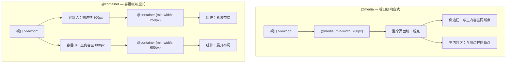
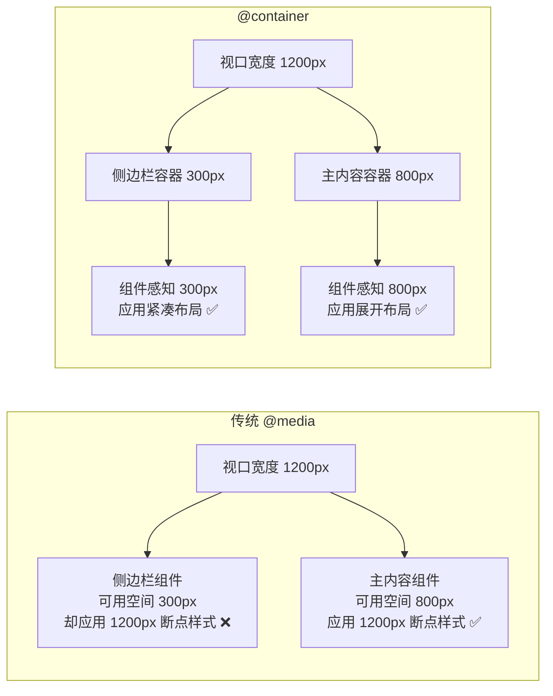
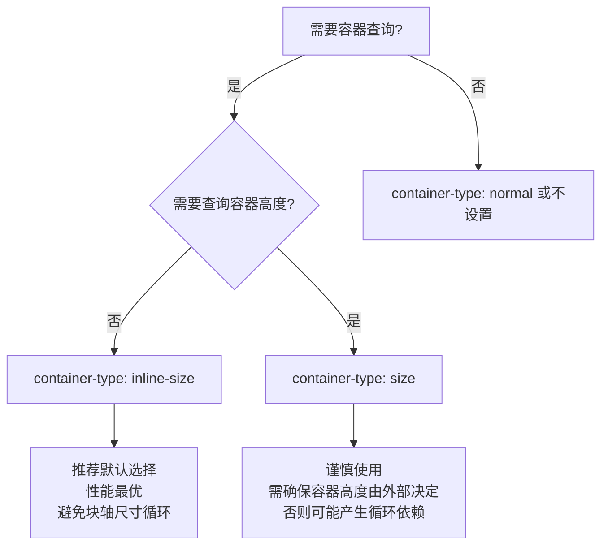
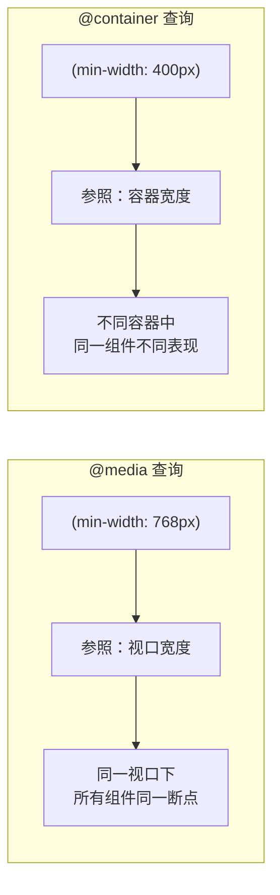
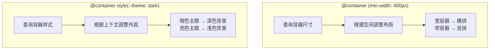
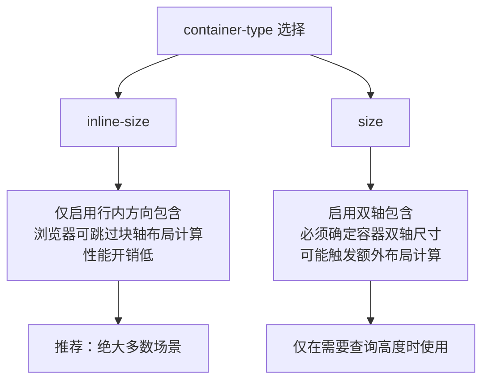
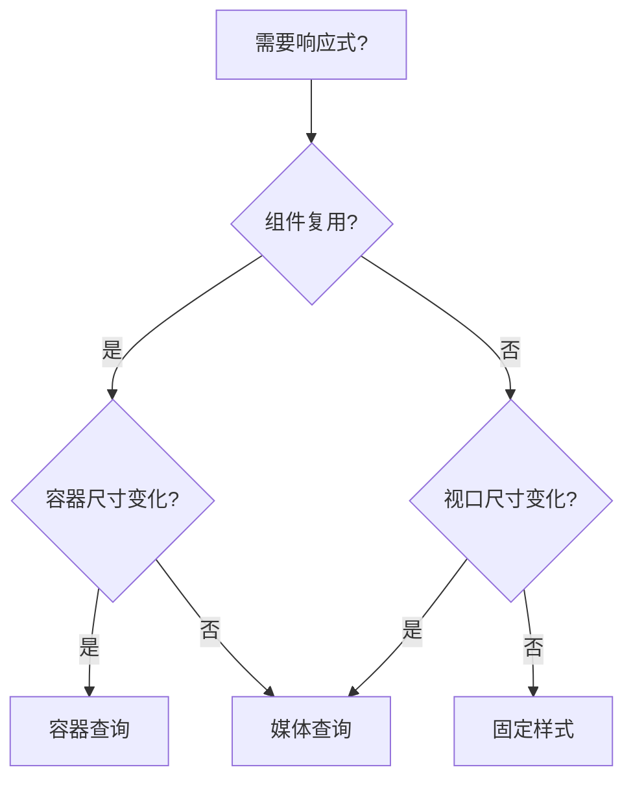

# 容器查询完全指南

容器查询（Container Queries）是 CSS 响应式设计的范式升级——从依赖视口尺寸的**页面级响应**，转向依赖容器尺寸的**组件级响应**。它让组件能够根据自身所在容器的空间自适应调整布局，真正实现"一次编写，随处适配"。

## 背景与动机

### 为什么需要容器查询

传统 `@media` 查询基于视口（viewport）尺寸进行响应式适配，这在组件化开发中存在根本性局限：

- **同一组件在不同容器中表现一致**：一个卡片组件在侧边栏（窄）和主内容区（宽）中，视口宽度相同，但可用空间截然不同
- **组件无法感知自身上下文**：组件不知道自己被放在多大的容器里，只能依赖外部传入 props 或 class 来切换布局
- **复用困难**：将组件从主内容区移到侧边栏，必须手动调整媒体查询断点或添加修饰类

容器查询让组件**根据其父容器的尺寸**自适应，而非根据整个视口。这意味着同一个组件可以智能地适应任何布局位置。

### 视口级 vs 容器级响应式





### 容器查询解决的典型场景

| 场景 | 传统 @media 方案 | 容器查询方案 |
|------|-----------------|-------------|
| 卡片在主内容区和侧边栏 | 需要传 props 或添加修饰类 | 自动根据容器宽度切换 |
| 组件库中的通用组件 | 需要使用者手动控制布局 | 组件自包含，自适应 |
| 嵌套布局中的组件 | 需要多层媒体查询 | 每层容器独立查询 |
| 主题切换影响组件样式 | 需要 CSS 变量 + 类名 | 样式查询直接感知 |
| 仪表盘中的小组件 | 需要 JavaScript 监听 | 纯 CSS 容器查询 |

## 核心概念

### container-type

`container-type` 属性将一个元素声明为查询容器，定义其可以被查询的维度。

#### 取值说明

| 值 | 含义 | 可查询维度 | 布局包含 | 尺寸包含 |
|---|---|---|---|---|
| `inline-size` | 行内尺寸容器 | `inline-size`（宽度，在水平书写模式下） | 是 | 行内方向 |
| `size` | 双轴尺寸容器 | `inline-size` 和 `block-size` | 是 | 双轴 |
| `normal` | 默认值，非查询容器 | 无（不可被尺寸查询） | 否 | 否 |

#### 使用示例

```css
/* 行内尺寸容器 — 最常用 */
.sidebar {
  container-type: inline-size;
}

/* 双轴尺寸容器 — 需要查询高度时使用 */
.hero-section {
  container-type: size;
}

/* 默认值 — 不作为查询容器 */
.fallback {
  container-type: normal;
}
```

#### 何时使用哪种类型



**关键原则**：优先使用 `inline-size`。只有当你确实需要根据容器高度切换布局时才使用 `size`，因为 `size` 类型要求容器在两个轴上都有确定的尺寸，否则可能导致循环依赖——容器高度依赖内容，内容又依赖容器高度。

### container-name

`container-name` 为查询容器赋予名称，使 `@container` 规则可以精确指定要查询的容器。

#### 基本用法

```css
/* 命名容器 */
.card-wrapper {
  container-type: inline-size;
  container-name: card-container;
}

/* 另一个命名容器 */
.sidebar {
  container-type: inline-size;
  container-name: sidebar;
}

/* 通过名称定向查询 */
@container sidebar (min-width: 300px) {
  .nav-item {
    flex-direction: row;
  }
}

@container card-container (min-width: 400px) {
  .card {
    grid-template-columns: 1fr 2fr;
  }
}
```

### 命名的重要性

```css
/* 不命名 — 查询最近的容器祖先 */
@container (min-width: 400px) {
  /* 匹配任何满足条件的容器祖先 */
}

/* 命名 — 精确查询指定容器 */
@container card (min-width: 400px) {
  /* 只匹配 container-name 包含 card 的容器 */
}
```

当组件嵌套多层容器时，命名可以避免查询到错误的容器层级：

```css
.outer {
  container-type: inline-size;
  container-name: layout;
}

.inner {
  container-type: inline-size;
  container-name: card;
}

/* 精确查询内层容器 */
@container card (min-width: 300px) {
  .card-content { /* ... */ }
}

/* 精确查询外层容器 */
@container layout (min-width: 800px) {
  .layout-grid { /* ... */ }
}
```

一个容器可以有多个名称：

```css
.panel {
  container-type: inline-size;
  container-name: panel card-wrapper sidebar-widget;
}

/* 以下查询都能匹配到 .panel */
@container panel (min-width: 400px) { }
@container card-wrapper (min-width: 400px) { }
@container sidebar-widget (min-width: 400px) { }
```

### container 简写

`container` 是 `container-name` 和 `container-type` 的简写属性，语法为 `container: <name> / <type>`。

```css
/* 完整简写 */
.card-wrapper {
  container: card-container / inline-size;
}

/* 等价于 */
.card-wrapper {
  container-name: card-container;
  container-type: inline-size;
}

/* 仅指定 type（name 为 none） */
.element {
  container: inline-size;
}

/* 仅指定 name（type 为 normal — 不推荐，无法被尺寸查询） */
.element {
  container: my-container;
}

/* 多名称简写 */
.panel {
  container: panel card / inline-size;
}
```

**推荐写法**：始终使用简写形式，简洁且不易遗漏：

```css
/* 推荐 */
.sidebar { container: sidebar / inline-size; }
.main    { container: main / inline-size; }
.card    { container: card / inline-size; }
.hero    { container: hero / size; }
```

## 深入原理

### @container 尺寸查询

#### 基本语法

```css
@container [<container-name>] (<container-condition>) {
  /* 样式规则 */
}
```

- `container-name`：可选，指定查询的容器名称
- `container-condition`：容器查询条件，支持尺寸和样式查询

#### 比较运算符

容器查询支持完整的比较运算符，比传统 `min-`/`max-` 前缀更直观：

| 运算符 | 含义 | 示例 |
|--------|------|------|
| `>` | 大于 | `(width > 400px)` |
| `>=` | 大于等于 | `(width >= 400px)` |
| `<` | 小于 | `(width < 400px)` |
| `<=` | 小于等于 | `(width <= 400px)` |
| `=` | 等于 | `(width = 400px)` |

```css
/* 传统 min-/max- 前缀写法 */
@container (min-width: 400px) { }
@container (max-width: 600px) { }

/* 比较运算符写法 — 更直观 */
@container (width >= 400px) { }
@container (width <= 600px) { }

/* 组合条件 */
@container (width > 300px) and (width < 600px) {
  .card { font-size: 1rem; }
}

/* 查询行内尺寸（水平书写模式下即宽度） */
@container (inline-size >= 500px) {
  .component { flex-direction: row; }
}

/* 查询块尺寸（需要 container-type: size） */
@container hero (block-size >= 400px) {
  .hero-content { align-items: center; }
}
```

#### 与 @media 的核心区别



| 特性 | @media | @container |
|------|--------|------------|
| 参照对象 | 视口（viewport） | 最近祖先容器 |
| 粒度 | 页面级 | 组件级 |
| 组件复用 | 差（需外部控制） | 好（自包含） |
| 嵌套查询 | 不支持 | 支持（多层容器） |
| 查询高度 | `@media (height)` | 需 `container-type: size` |
| 样式查询 | 不支持 | `@container style()` |
| CSS 包含 | 无 | 启用 CSS Containment |

#### 嵌套容器查询

```css
.page-layout {
  container: page / inline-size;
}

@container page (inline-size >= 800px) {
  .sidebar {
    container: sidebar / inline-size;
  }

  @container sidebar (inline-size >= 250px) {
    .nav-link {
      flex-direction: row;
      gap: 8px;
    }
  }
}
```

### 容器查询单位

容器查询单位相对于最近查询容器的尺寸计算，类似于 `vw`/`vh` 相对于视口，但参照物是容器。

| 单位 | 全称 | 相对于 | 水平书写模式下 |
|------|------|--------|---------------|
| `cqw` | container query width | 容器宽度的 1% | 容器 inline-size 的 1% |
| `cqh` | container query height | 容器高度的 1% | 容器 block-size 的 1% |
| `cqi` | container query inline | 容器行内尺寸的 1% | 等同于 cqw |
| `cqb` | container query block | 容器块尺寸的 1% | 等同于 cqh |
| `cqmin` | container query min | min(cqi, cqb) 的 1% | min(cqw, cqh) 的 1% |
| `cqmax` | container query max | max(cqi, cqb) 的 1% | max(cqw, cqh) 的 1% |

#### 使用示例

```html
<div class="container">
  <article class="card">
    <h2 class="card__title">容器查询单位</h2>
    <p class="card__text">
      字体大小和间距随容器尺寸平滑缩放
    </p>
  </article>
</div>
```

```css
.container {
  container: card / inline-size;
}

/* 标题大小随容器宽度平滑缩放 */
.card__title {
  font-size: clamp(1rem, 5cqw, 2.5rem);
}

/* 间距也使用容器单位 */
.card__text {
  font-size: clamp(0.875rem, 2.5cqw, 1.125rem);
  padding: 2cqw;
  line-height: 1.6;
}

/* 使用 cqmin 确保在任意方向上都有合理尺寸 */
.card__icon {
  width: 10cqmin;
  height: 10cqmin;
}
```

#### 与视口单位的对比

```css
/* 视口单位 — 所有卡片标题随视口变化，无法区分容器 */
.card__title {
  font-size: clamp(1rem, 2vw, 2.5rem);
}

/* 容器单位 — 每个卡片标题随自身容器变化 */
.card__title {
  font-size: clamp(1rem, 5cqw, 2.5rem);
}
```

**注意**：如果元素不在任何查询容器内，容器查询单位会回退为视口单位（与 `vw`/`vh` 相同）。因此务必确保祖先元素设置了 `container-type`。

### 容器样式查询

`@container style()` 允许根据容器的**计算样式**（主要是自定义属性值）来应用样式，而非尺寸。这为组件提供了基于"主题"或"状态"的样式切换能力。

#### 基本语法

```css
@container style(<custom-property>: <value>) {
  /* 当容器的自定义属性等于指定值时应用 */
}

@container style(<custom-property>: <value1>) and style(<custom-property>: <value2>) {
  /* 多条件组合 */
}
```

#### 查询自定义属性值

```html
<div class="theme-provider" data-theme="dark">
  <div class="card">
    <h3>暗色主题卡片</h3>
    <p>根据容器主题自动适配样式</p>
  </div>
</div>

<div class="theme-provider" data-theme="light">
  <div class="card">
    <h3>亮色主题卡片</h3>
    <p>根据容器主题自动适配样式</p>
  </div>
</div>
```

```css
/* 容器设置自定义属性 */
.theme-provider {
  container-type: inline-size;
  container-name: theme;
  --theme: light;
  --accent: blue;
}

.theme-provider[data-theme="dark"] {
  --theme: dark;
  --accent: gold;
}

/* 根据容器自定义属性值切换样式 */
@container style(--theme: dark) {
  .card {
    background: #1a1a2e;
    color: #e0e0e0;
    border-color: #333;
  }

  .card h3 {
    color: var(--accent);
  }
}

@container style(--theme: light) {
  .card {
    background: #ffffff;
    color: #333333;
    border-color: #ddd;
  }

  .card h3 {
    color: #2563eb;
  }
}
```

#### 多条件组合

```css
/* 同时满足主题和强调色条件 */
@container style(--theme: dark) and style(--accent: gold) {
  .card {
    border: 2px solid gold;
    box-shadow: 0 0 20px rgba(255, 215, 0, 0.3);
  }
}

/* 使用 or 组合 */
@container style(--theme: dark) or style(--accent: red) {
  .card__badge {
    font-weight: bold;
  }
}
```

#### 样式查询 vs 尺寸查询



#### 样式查询的典型用例

- **组件主题切换**：同一组件在不同主题容器中自动适配
- **变体控制**：通过自定义属性控制组件变体（`--variant: compact` / `--variant: spacious`）
- **状态联动**：父容器状态影响子组件样式（`--state: active` / `--state: disabled`）
- **避免 prop drilling**：无需通过多层组件传递 class 或 props

**注意**：样式查询目前仅支持自定义属性（CSS Custom Properties）的离散值比较，不支持普通 CSS 属性查询。

### 容器状态查询

容器状态查询（Container State Queries）是容器查询的实验性扩展，允许根据容器的布局状态（如 sticky、floating）来应用样式。

```css
/* 实验性语法 — 尚未标准化 */
@container sticky {
  .header {
    box-shadow: 0 2px 8px rgba(0, 0, 0, 0.15);
    backdrop-filter: blur(8px);
  }
}
```

> 此功能目前处于 CSS Working Group 讨论阶段，语法和语义可能发生变化，不建议在生产环境使用。可关注 [CSS Container Queries Level 3](https://drafts.csswg.org/css-contain-3/) 规范进展。

## 代码示例

### 响应式卡片组件

一个卡片组件根据容器宽度自动在竖排和横排之间切换：

```html
<div class="layout">
  <main class="layout__main">
    <div class="card-container">
      <article class="card">
        
        <div class="card__body">
          <h3 class="card__title">响应式卡片</h3>
          <p class="card__desc">
            此卡片会根据容器宽度自动切换布局：窄容器竖排，宽容器横排。
          </p>
          <div class="card__actions">
            <button class="btn btn--primary">了解更多</button>
            <button class="btn btn--secondary">收藏</button>
          </div>
        </div>
      </article>
    </div>
  </main>
  <aside class="layout__sidebar">
    <div class="card-container">
      <article class="card">
        
        <div class="card__body">
          <h3 class="card__title">响应式卡片</h3>
          <p class="card__desc">
            同一个组件，在侧边栏中自动变为紧凑布局。
          </p>
          <div class="card__actions">
            <button class="btn btn--primary">了解更多</button>
            <button class="btn btn--secondary">收藏</button>
          </div>
        </div>
      </article>
    </div>
  </aside>
</div>
```

```css
/* 容器声明 */
.card-container {
  container: card / inline-size;
}

/* 基础样式 — 竖排布局（默认） */
.card {
  display: grid;
  grid-template-rows: auto 1fr;
  gap: 0;
  border-radius: 12px;
  overflow: hidden;
  background: #fff;
  box-shadow: 0 1px 3px rgba(0, 0, 0, 0.1);
}

.card__image {
  width: 100%;
  height: 200px;
  object-fit: cover;
}

.card__body {
  padding: 16px;
  display: flex;
  flex-direction: column;
  gap: 8px;
}

.card__title {
  font-size: clamp(1rem, 3cqw, 1.5rem);
  font-weight: 600;
  margin: 0;
}

.card__desc {
  font-size: clamp(0.875rem, 2cqw, 1rem);
  color: #666;
  margin: 0;
  flex: 1;
}

.card__actions {
  display: flex;
  gap: 8px;
  margin-top: 8px;
}

/* 容器宽度 >= 400px — 横排布局 */
@container card (inline-size >= 400px) {
  .card {
    grid-template-rows: none;
    grid-template-columns: 200px 1fr;
  }

  .card__image {
    height: 100%;
    min-height: 200px;
  }

  .card__body {
    padding: 20px;
  }

  .card__actions {
    margin-top: auto;
  }
}

/* 容器宽度 >= 600px — 更宽松的横排布局 */
@container card (inline-size >= 600px) {
  .card {
    grid-template-columns: 280px 1fr;
  }

  .card__image {
    min-height: 240px;
  }

  .card__body {
    padding: 24px;
    gap: 12px;
  }
}

/* 按钮样式 */
.btn {
  padding: 8px 16px;
  border-radius: 6px;
  border: none;
  cursor: pointer;
  font-size: 0.875rem;
  font-weight: 500;
  transition: all 0.2s;
}

.btn--primary {
  background: #2563eb;
  color: #fff;
}

.btn--primary:hover {
  background: #1d4ed8;
}

.btn--secondary {
  background: #f1f5f9;
  color: #475569;
}

.btn--secondary:hover {
  background: #e2e8f0;
}

/* 页面布局 */
.layout {
  display: grid;
  grid-template-columns: 1fr 300px;
  gap: 24px;
  max-width: 1200px;
  margin: 0 auto;
  padding: 24px;
}

.layout__main .card-container {
  /* 主内容区容器较宽 */
}

.layout__sidebar {
  /* 侧边栏 300px，卡片自动切换为竖排 */
}
```

### 侧边栏自适应导航

导航组件根据容器宽度在图标模式和展开模式之间切换：

```html
<nav class="nav-container">
  <ul class="nav-list">
    <li class="nav-item">
      <svg class="nav-item__icon" viewBox="0 0 24 24"><!-- 图标 --></svg>
      <span class="nav-item__label">首页</span>
    </li>
    <li class="nav-item">
      <svg class="nav-item__icon" viewBox="0 0 24 24"><!-- 图标 --></svg>
      <span class="nav-item__label">项目</span>
    </li>
    <li class="nav-item">
      <svg class="nav-item__icon" viewBox="0 0 24 24"><!-- 图标 --></svg>
      <span class="nav-item__label">团队</span>
    </li>
    <li class="nav-item">
      <svg class="nav-item__icon" viewBox="0 0 24 24"><!-- 图标 --></svg>
      <span class="nav-item__label">设置</span>
    </li>
  </ul>
</nav>
```

```css
.nav-container {
  container: nav / inline-size;
  background: #1e293b;
  border-radius: 12px;
  padding: 8px;
}

.nav-list {
  list-style: none;
  margin: 0;
  padding: 0;
  display: flex;
  flex-direction: column;
  gap: 4px;
}

/* 窄容器 — 仅图标模式 */
.nav-item {
  display: flex;
  align-items: center;
  justify-content: center;
  padding: 12px;
  border-radius: 8px;
  color: #94a3b8;
  cursor: pointer;
  transition: all 0.2s;
  white-space: nowrap;
  overflow: hidden;
}

.nav-item:hover {
  background: #334155;
  color: #e2e8f0;
}

.nav-item__icon {
  width: 24px;
  height: 24px;
  flex-shrink: 0;
}

.nav-item__label {
  display: none;
}

/* 容器 >= 200px — 图标 + 文字 */
@container nav (inline-size >= 200px) {
  .nav-item {
    justify-content: flex-start;
    gap: 12px;
    padding: 12px 16px;
  }

  .nav-item__label {
    display: inline;
    font-size: 0.875rem;
  }
}

/* 容器 >= 280px — 更宽松间距 */
@container nav (inline-size >= 280px) {
  .nav-item {
    padding: 12px 20px;
  }

  .nav-item__label {
    font-size: 1rem;
  }
}
```

### 容器主题切换

结合样式查询实现基于容器的主题系统：

```html
<div class="dashboard">
  <section class="panel panel--stats" style="--panel-theme: success">
    <div class="stat-card">
      <span class="stat-card__value">12,345</span>
      <span class="stat-card__label">活跃用户</span>
    </div>
  </section>

  <section class="panel panel--stats" style="--panel-theme: warning">
    <div class="stat-card">
      <span class="stat-card__value">89</span>
      <span class="stat-card__label">待处理工单</span>
    </div>
  </section>

  <section class="panel panel--stats" style="--panel-theme: danger">
    <div class="stat-card">
      <span class="stat-card__value">3</span>
      <span class="stat-card__label">系统告警</span>
    </div>
  </section>
</div>
```

```css
.panel {
  container: panel / inline-size;
  border-radius: 12px;
  padding: 20px;
  background: #fff;
  border: 1px solid #e2e8f0;
}

/* 主题：成功 */
@container style(--panel-theme: success) {
  .stat-card {
    --accent: #10b981;
    --accent-light: #d1fae5;
    --accent-bg: #ecfdf5;
  }
}

/* 主题：警告 */
@container style(--panel-theme: warning) {
  .stat-card {
    --accent: #f59e0b;
    --accent-light: #fef3c7;
    --accent-bg: #fffbeb;
  }
}

/* 主题：危险 */
@container style(--panel-theme: danger) {
  .stat-card {
    --accent: #ef4444;
    --accent-light: #fee2e2;
    --accent-bg: #fef2f2;
  }
}

.stat-card {
  display: flex;
  flex-direction: column;
  gap: 4px;
  padding: 16px;
  border-radius: 8px;
  background: var(--accent-bg, #f8fafc);
  border-left: 4px solid var(--accent, #94a3b8);
}

.stat-card__value {
  font-size: 2rem;
  font-weight: 700;
  color: var(--accent, #1e293b);
  line-height: 1;
}

.stat-card__label {
  font-size: 0.875rem;
  color: #64748b;
}

/* 同时结合尺寸查询和样式查询 */
@container panel (inline-size >= 400px) and style(--panel-theme: success) {
  .stat-card {
    flex-direction: row;
    align-items: center;
    gap: 16px;
  }

  .stat-card__value {
    font-size: 2.5rem;
  }
}
```

### 组件库通用模式

为组件库设计可复用的容器查询模式：

```html
<!-- 组件使用者只需设置容器 -->
<div class="my-container" style="width: 100%">
  <x-search-box placeholder="搜索..."></x-search-box>
</div>

<div class="my-container" style="width: 250px">
  <x-search-box placeholder="搜索..."></x-search-box>
</div>
```

```css
/* 组件库通用容器声明 */
.cq-inline {
  container: cq / inline-size;
}

.cq-size {
  container: cq / size;
}

/* 搜索框组件 — 自适应布局 */
.search-box {
  display: flex;
  flex-direction: column;
  gap: 8px;
}

.search-box__input-wrapper {
  display: flex;
  gap: 0;
}

.search-box__input {
  flex: 1;
  padding: 8px 12px;
  border: 1px solid #d1d5db;
  border-radius: 6px 0 0 6px;
  outline: none;
}

.search-box__btn {
  padding: 8px 16px;
  background: #2563eb;
  color: #fff;
  border: none;
  border-radius: 0 6px 6px 0;
  cursor: pointer;
}

.search-box__filters {
  display: none;
}

/* 宽容器 — 展开筛选器 */
@container cq (inline-size >= 400px) {
  .search-box__filters {
    display: flex;
    gap: 8px;
  }

  .search-box__filter-chip {
    padding: 4px 12px;
    border-radius: 999px;
    background: #f1f5f9;
    font-size: 0.75rem;
    cursor: pointer;
  }
}

/* 更宽容器 — 输入框和筛选器同行 */
@container cq (inline-size >= 600px) {
  .search-box {
    flex-direction: row;
    align-items: center;
  }

  .search-box__filters {
    margin-left: 8px;
  }
}
```

## 最佳实践

### 性能优化

#### container-type 选择



#### CSS Containment 隐含影响

设置 `container-type` 会自动启用 CSS Containment，这对性能有双重影响：

**正面影响**：
- 浏览器可以独立计算容器内部布局，减少重排范围
- 容器外部的布局变化不会影响容器内部
- 容器内部的布局变化不会影响容器外部

**注意事项**：
- `container-type: inline-size` 启用 `layout`、`style` 和 `inline-size` 包含，容器宽度必须由外部决定
- `container-type: size` 启用 `layout`、`style` 和 `size` 包含，容器双轴尺寸必须由外部决定
- 如果容器高度由内容撑开（`height: auto`），使用 `size` 类型会导致高度塌陷为 0

```css
/* 正确：容器宽度由 grid/flex 外部决定 */
.grid-layout {
  display: grid;
  grid-template-columns: 1fr 300px;
}

.grid-layout > .main {
  container: main / inline-size;
  /* 宽度由 grid 列决定，不依赖内容 — 正确 */
}

/* 错误：容器高度由内容决定，使用 size 类型会塌陷 */
.hero {
  container: hero / size; /* 危险！如果 height: auto，高度会变为 0 */
}

/* 正确：容器高度由外部决定 */
.hero {
  container: hero / size;
  height: 60vh; /* 高度由外部决定 — 正确 */
}
```

#### 性能优化建议

1. **优先使用 `inline-size`**：只在确实需要查询高度时使用 `size`
2. **避免过度嵌套容器**：每层容器都会增加布局计算的复杂度
3. **合理使用容器查询单位**：`cqw`/`cqh` 每次容器尺寸变化都会触发重计算，配合 `clamp()` 限制范围
4. **减少容器查询断点数量**：每个断点都是一份额外的样式计算，2-3 个断点通常足够
5. **利用 Containment 的隔离性**：容器查询天然提供布局隔离，善用这一特性减少全局重排

## 浏览器兼容性

| 特性 | Chrome | Firefox | Safari | Edge | 状态 |
|------|--------|---------|--------|------|------|
| `container-type` | 105+ | 110+ | 16+ | 105+ | 稳定 |
| `container-name` | 105+ | 110+ | 16+ | 105+ | 稳定 |
| `@container` 尺寸查询 | 105+ | 110+ | 16+ | 105+ | 稳定 |
| 容器查询单位 (cqw 等) | 105+ | 110+ | 16+ | 105+ | 稳定 |
| 比较运算符 (>=, > 等) | 105+ | 110+ | 16+ | 105+ | 稳定 |
| `@container style()`（自定义属性） | 111+ | 151+ | 18+ | 111+ | 稳定 |
| 容器状态查询 | -- | -- | -- | -- | 规范讨论中 |

> **渐进增强策略**：对于不支持容器查询的浏览器，组件使用默认的竖排布局（移动优先），通过 `@supports` 检测支持性后再应用容器查询样式。

```css
/* 基础样式 — 所有浏览器可用 */
.card {
  display: flex;
  flex-direction: column;
}

/* 容器查询增强 — 仅支持时应用 */
@supports (container-type: inline-size) {
  .card-container {
    container: card / inline-size;
  }

  @container card (inline-size >= 400px) {
    .card {
      flex-direction: row;
    }
  }
}
```

### 与媒体查询选择策略

#### 何时使用容器查询



**使用容器查询的场景：**
- ✅ 组件需要在不同容器中自适应（卡片、导航、表单）
- ✅ 组件库中的通用组件
- ✅ 嵌套布局中的独立模块
- ✅ 主题/状态驱动的样式切换

**使用媒体查询的场景：**
- ✅ 页面整体布局（header、sidebar、footer）
- ✅ 基于视口宽度的全局断点
- ✅ 横竖屏切换
- ✅ 打印样式

**混合使用：**
```css
/* 页面级：媒体查询 */
.page {
  display: grid;
  grid-template-columns: 1fr;
}

@media (min-width: 768px) {
  .page {
    grid-template-columns: 1fr 300px;
  }
}

/* 组件级：容器查询 */
.card-container {
  container: card / inline-size;
}

@container card (inline-size >= 400px) {
  .card {
    flex-direction: row;
  }
}
```

### 渐进增强策略

`@supports` 检测与媒体查询后备的写法已见上文"浏览器兼容性"一节，此处补充同时使用两者时的降级细节：

#### 降级方案

```css
/* 不支持容器查询时的降级 */
.card {
  display: flex;
  flex-direction: column;
}

/* 使用媒体查询作为后备 */
@media (min-width: 768px) {
  .card {
    flex-direction: row;
  }
}

/* 支持容器查询时覆盖 */
@supports (container-type: inline-size) {
  .card-container {
    container: card / inline-size;
  }
  
  @container card (inline-size >= 400px) {
    .card {
      flex-direction: row;
    }
  }
  
  /* 移除媒体查询的影响 */
  @media (min-width: 768px) {
    .card {
      flex-direction: column; /* 恢复，让容器查询接管 */
    }
  }
}
```

## 常见问题

### Q1: 容器查询会替代媒体查询吗？

**不会。** 它们是互补关系：
- **媒体查询**：视口级别，适合页面整体布局
- **容器查询**：组件级别，适合组件内部自适应

实际项目中通常混合使用。

### Q2: 容器查询的性能影响大吗？

**合理使用时性能良好：**
- ✅ 优先使用 `inline-size` 而非 `size`
- ✅ 避免过度嵌套容器（2-3 层即可）
- ✅ 减少容器查询断点数量
- ✅ 利用 CSS Containment 的布局隔离优势

**可能的性能问题：**
- ❌ 过度使用 `container-type: size`
- ❌ 深层嵌套容器
- ❌ 大量容器查询断点

### Q3: 如何调试容器查询？

**Chrome DevTools：**
1. 打开 Elements 面板
2. 选中元素，查看 Styles 面板
3. 容器查询规则会显示 `@container` 标记
4. 可以切换容器尺寸查看效果

**调试技巧：**
```css
/* 临时显示容器边界 */
.card-container {
  container: card / inline-size;
  outline: 2px dashed red;
}

/* 显示当前容器尺寸 */
.card-container::after {
  content: "Width: " attr(style);
  position: absolute;
  top: 0;
  right: 0;
  background: yellow;
  padding: 4px;
  font-size: 12px;
}
```

### Q4: 容器查询支持嵌套吗？

**支持。** 可以在容器内部再创建容器：

```css
.outer {
  container: outer / inline-size;
}

.inner {
  container: inner / inline-size;
}

@container outer (inline-size >= 800px) {
  /* 外层容器查询 */
}

@container inner (inline-size >= 300px) {
  /* 内层容器查询 */
}
```

**注意：** 嵌套过深会影响性能，建议控制在 2-3 层。

### Q5: 容器查询单位（cqw）和视口单位（vw）有什么区别？

| 特性 | cqw | vw |
|------|-----|----|
| 参照物 | 最近容器宽度 | 视口宽度 |
| 适用场景 | 组件内部 | 页面级 |
| 响应粒度 | 组件级 | 页面级 |

```css
/* vw：所有元素随视口变化 */
.title {
  font-size: 5vw;
}

/* cqw：每个组件随自己容器变化 */
.card-container {
  container: card / inline-size;
}

.card-title {
  font-size: 5cqw;
}
```

### Q6: 如何处理不支持容器查询的旧浏览器？

**渐进增强策略：**

```css
/* 1. 基础样式（移动优先） */
.card {
  display: flex;
  flex-direction: column;
}

/* 2. 媒体查询后备 */
@media (min-width: 768px) {
  .card {
    flex-direction: row;
  }
}

/* 3. 容器查询增强 */
@supports (container-type: inline-size) {
  .card-container {
    container: card / inline-size;
  }
  
  @container card (inline-size >= 400px) {
    .card {
      flex-direction: row;
    }
  }
}
```

### Q7: 容器查询可以用于高度查询吗？

**可以，但需要谨慎：**

```css
/* 需要设置 container-type: size */
.hero {
  container-type: size;
  height: 60vh; /* 必须由外部决定高度 */
}

@container hero (block-size >= 400px) {
  .hero-content {
    font-size: 2rem;
  }
}
```

**注意：** 如果容器高度由内容撑开（`height: auto`），使用 `size` 类型会导致高度塌陷为 0。

### Q8: 容器查询和 CSS Grid 如何配合使用？

**最佳实践：**

```css
/* 页面布局用 Grid */
.page {
  display: grid;
  grid-template-columns: 1fr 300px;
  gap: 20px;
}

/* 组件内部用容器查询 */
.card-container {
  container: card / inline-size;
}

@container card (inline-size >= 400px) {
  .card {
    display: grid;
    grid-template-columns: 200px 1fr;
  }
}
```

**优势：** Grid 处理页面级布局，容器查询处理组件级自适应。

### Q9: 如何在组件库中使用容器查询？

**提供容器工具类：**

```css
/* 组件库提供的容器类 */
.cq-inline {
  container-type: inline-size;
}

.cq-size {
  container-type: size;
}
```

```html
<!-- 使用者 -->
<div class="cq-inline">
  <my-component></my-component>
</div>
```

**组件内部：**
```css
@container (inline-size >= 400px) {
  /* 组件响应式样式 */
}
```

### Q10: 容器查询可以查询多个条件吗？

**可以，使用 `and`、`or`、`not`：**

```css
/* and：同时满足 */
@container card (inline-size >= 400px) and (inline-size <= 800px) {
  .card {
    font-size: 1rem;
  }
}

/* or：满足其一 */
@container card (inline-size >= 600px) or style(--theme: dark) {
  .card {
    background: #f0f0f0;
  }
}

/* not：取反（not 写在查询条件前、容器名之后） */
@container card not (inline-size < 400px) {
  .card {
    display: flex;
  }
}
```

## 参考资源

### 官方文档
- [CSS Container Queries - MDN](https://developer.mozilla.org/zh-CN/docs/Web/CSS/CSS_Container_Queries)
- [CSS Containment Module Level 3 - W3C](https://www.w3.org/TR/css-contain-3/)
- [Container Queries - Chrome Developers](https://developer.chrome.com/docs/css-ui/container-queries)

### 教程文章
- [CSS Container Queries: A First Look - Smashing Magazine](https://www.smashingmagazine.com/2022/01/css-container-queries-first-look/)
- [Container Queries Are Finally Here - CSS Tricks](https://css-tricks.com/container-queries-are-finally-here/)
- [The Complete Guide to CSS Container Queries - LogRocket](https://blog.logrocket.com/complete-guide-css-container-queries/)

### 工具
- [Can I Use - Container Queries](https://caniuse.com/css-container-queries)
- [Container Queries Playground](https://codepen.io/pen/?template=vYJzOQm)
- [CSS Container Queries Demo](https://web.dev/articles/css-container-queries?hl=zh-cn)

### 浏览器支持
- Chrome 105+
- Firefox 110+
- Safari 16+
- Edge 105+
