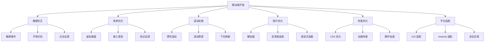
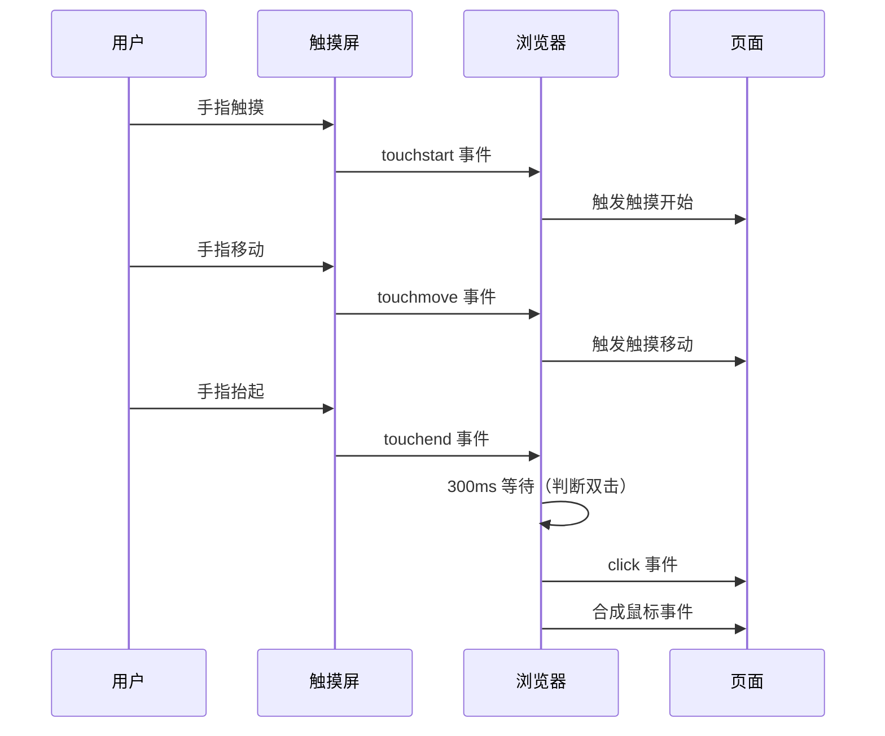
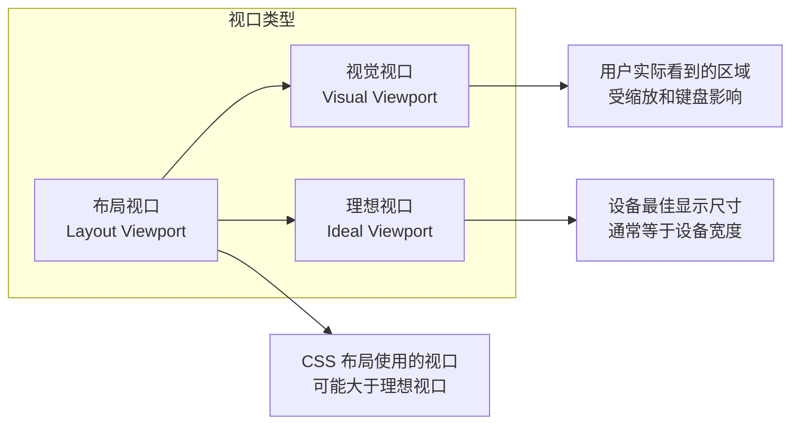
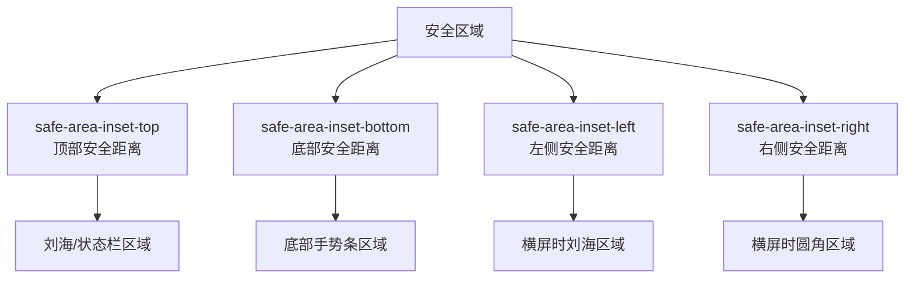
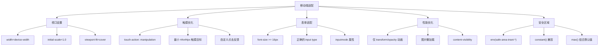

# 移动端实践完全指南

移动端开发中的常见问题、最佳实践和调试技巧。本章涵盖触摸交互、表单优化、性能提升等核心主题。

## 背景与动机

### 为什么移动端实践如此重要？

截至 2025 年，全球超过 60% 的网页流量来自移动设备。移动端开发不再是"可选的附加项"，而是核心开发能力。然而，移动端开发面临诸多独特挑战：

1. **交互方式不同**：触摸代替鼠标，手势操作复杂多样
2. **屏幕尺寸碎片化**：从 320px 到 4K+，设备种类繁多
3. **网络环境不稳定**：3G/4G/5G/WiFi 切换，延迟和带宽波动
4. **性能受限**：CPU、GPU、内存相比桌面设备有限
5. **平台差异**：iOS 和 Android 的行为差异显著
6. **安全区域**：刘海屏、圆角、底部手势条等硬件特性

### 移动端技术栈全景



## 核心概念

### 移动端与桌面端差异

| 特性 | 桌面端 | 移动端 |
|------|--------|--------|
| 输入方式 | 鼠标 + 键盘 | 触摸 + 手势 |
| 悬停状态 | `:hover` 有效 | 无真正悬停 |
| 点击延迟 | 无 | 历史 300ms 延迟 |
| 滚动方式 | 滚动条 / 滚轮 | 触摸滑动 / 惯性 |
| 视口 | 固定 | 动态变化（键盘弹出等） |
| 像素密度 | 1x 为主 | 2x/3x 高清屏 |
| 网络 | 稳定宽带 | 不稳定移动网络 |
| 性能 | 高性能 | 资源受限 |

### 触摸交互模型



## 深入原理

### 触摸事件机制

移动端触摸事件是移动端开发的基础。理解触摸事件的触发顺序和处理机制至关重要。

**事件触发顺序：**

```
touchstart → touchmove → touchend → mouseover → mousemove → mousedown → mouseup → click
```

**触摸事件对象：**

```javascript
element.addEventListener('touchstart', (e) => {
  // touches: 当前屏幕上所有触摸点
  console.log(e.touches.length);        // 触摸点数量
  console.log(e.touches[0].clientX);    // 相对于视口的 X
  console.log(e.touches[0].clientY);    // 相对于视口的 Y
  console.log(e.touches[0].pageX);      // 相对于页面的 X
  console.log(e.touches[0].pageY);      // 相对于页面的 Y
  console.log(e.touches[0].screenX);    // 相对于屏幕的 X
  console.log(e.touches[0].screenY);    // 相对于屏幕的 Y
  
  // targetTouches: 当前目标元素上的触摸点
  console.log(e.targetTouches.length);
  
  // changedTouches: 本次事件改变的触摸点
  console.log(e.changedTouches[0].identifier); // 触摸点唯一 ID
}, { passive: true });
```

**passive 事件监听器：**

```javascript
// 标记为 passive，告诉浏览器不会调用 preventDefault
// 浏览器可以安全地执行默认滚动行为，无需等待 JavaScript
element.addEventListener('touchstart', handler, { passive: true });
element.addEventListener('touchmove', handler, { passive: true });

// 如果需要 preventDefault，不能使用 passive
element.addEventListener('touchmove', (e) => {
  e.preventDefault(); // 阻止默认滚动
  // 处理自定义滚动逻辑
}, { passive: false });
```

### 视口与缩放

移动端视口是一个复杂的概念，理解它对正确处理布局和定位至关重要。



**viewport meta 标签详解：**

```html
<!-- 标准设置 -->
<meta name="viewport" content="width=device-width, initial-scale=1.0">

<!-- 各参数说明 -->
<!-- width=device-width: 布局视口宽度 = 设备理想宽度 -->
<!-- initial-scale=1.0: 初始缩放比例 1:1 -->
<!-- minimum-scale=1.0: 最小缩放比例 -->
<!-- maximum-scale=5.0: 最大缩放比例 -->
<!-- user-scalable=yes: 允许用户缩放 -->
<!-- viewport-fit=cover: 延伸到安全区域外（用于刘海屏适配） -->

<!-- 完整设置 -->
<meta name="viewport" content="
  width=device-width,
  initial-scale=1.0,
  maximum-scale=5.0,
  user-scalable=yes,
  viewport-fit=cover
">
```

**⚠️ 可访问性警告：** 不要设置 `user-scalable=no` 或 `maximum-scale=1.0`，这会阻止用户缩放页面，影响视力障碍用户的可访问性。

### 安全区域机制

随着 iPhone X 引入刘海屏和底部手势条，安全区域适配成为移动端开发的必要技能。



**前提条件：** 必须在 viewport meta 标签中设置 `viewport-fit=cover`，否则 `env(safe-area-inset-*)` 值全部为 0。

## 代码示例

### 触摸交互优化

#### 禁用双击缩放

```css
/* 全局禁用双击缩放（同时消除 300ms 点击延迟） */
* {
  touch-action: manipulation;
}

/* 局部禁用 */
.no-zoom {
  touch-action: manipulation;
}
```

#### 点击高亮处理

```css
/* 移除默认点击高亮 */
* {
  -webkit-tap-highlight-color: transparent;
}

/* 自定义点击反馈 */
.button {
  background: #007bff;
  color: #fff;
  padding: 12px 24px;
  border-radius: 8px;
  border: none;
  cursor: pointer;
  transition: all 0.15s ease;
  /* 防止文本选择 */
  -webkit-user-select: none;
  user-select: none;
}

.button:active {
  background: #0056b3;
  transform: scale(0.98);
}

/* 禁用状态 */
.button:disabled {
  background: #ccc;
  cursor: not-allowed;
  transform: none;
}
```

#### 触摸反馈涟漪效果

```css
/* Material Design 风格涟漪效果 */
.ripple-button {
  position: relative;
  overflow: hidden;
  padding: 12px 24px;
  background: #007bff;
  color: #fff;
  border: none;
  border-radius: 8px;
  cursor: pointer;
}

.ripple-button::after {
  content: '';
  position: absolute;
  top: 50%;
  left: 50%;
  width: 0;
  height: 0;
  background: rgba(255, 255, 255, 0.3);
  border-radius: 50%;
  transform: translate(-50%, -50%);
  opacity: 0;
  transition: none;
}

.ripple-button:active::after {
  width: 200%;
  padding-bottom: 200%;
  opacity: 1;
  transition: width 0.3s ease-out, padding-bottom 0.3s ease-out, opacity 0.3s ease-out;
}
```

#### 触摸区域优化

```css
/* 确保触摸目标足够大（Apple HIG 建议最小 44x44px） */
.touchable {
  min-width: 44px;
  min-height: 44px;
  display: inline-flex;
  align-items: center;
  justify-content: center;
}

/* 扩大点击区域（视觉大小不变，但触摸区域更大） */
.icon-button {
  position: relative;
  width: 24px;
  height: 24px;
  padding: 0;
  background: none;
  border: none;
  cursor: pointer;
}

/* 使用伪元素扩大触摸区域 */
.icon-button::before {
  content: '';
  position: absolute;
  top: -10px;
  left: -10px;
  right: -10px;
  bottom: -10px;
  /* 实际触摸区域：44x44px */
}

/* 使用 padding 扩大触摸区域 */
.nav-link {
  padding: 12px 16px;
  /* 确保总尺寸 >= 44x44px */
}
```

#### 滑动手势识别

```javascript
// 原生触摸事件实现滑动识别
class SwipeDetector {
  constructor(element, options = {}) {
    this.element = element;
    this.threshold = options.threshold || 50;   // 最小滑动距离
    this.restraint = options.restraint || 100;  // 最大反向距离
    this.allowedTime = options.allowedTime || 300; // 最大时间（ms）
    this.startX = 0;
    this.startY = 0;
    this.startTime = 0;
    
    this._bindEvents();
  }
  
  _bindEvents() {
    this.element.addEventListener('touchstart', (e) => {
      this.startX = e.touches[0].clientX;
      this.startY = e.touches[0].clientY;
      this.startTime = Date.now();
    }, { passive: true });
    
    this.element.addEventListener('touchend', (e) => {
      const endX = e.changedTouches[0].clientX;
      const endY = e.changedTouches[0].clientY;
      const elapsed = Date.now() - this.startTime;
      
      const deltaX = endX - this.startX;
      const deltaY = endY - this.startY;
      const absDeltaX = Math.abs(deltaX);
      const absDeltaY = Math.abs(deltaY);
      
      if (elapsed > this.allowedTime) return;
      
      // 水平滑动
      if (absDeltaX >= this.threshold && absDeltaX > absDeltaY) {
        const direction = deltaX > 0 ? 'right' : 'left';
        this.element.dispatchEvent(new CustomEvent('swipe', {
          detail: { direction, distance: absDeltaX }
        }));
      }
      
      // 垂直滑动
      if (absDeltaY >= this.threshold && absDeltaY > absDeltaX) {
        const direction = deltaY > 0 ? 'down' : 'up';
        this.element.dispatchEvent(new CustomEvent('swipevertical', {
          detail: { direction, distance: absDeltaY }
        }));
      }
    }, { passive: true });
  }
}

// 使用示例
const swiper = new SwipeDetector(document.querySelector('.swipe-area'));

swiper.element.addEventListener('swipe', (e) => {
  console.log(`向${e.detail.direction}滑动了 ${e.detail.distance}px`);
});
```

#### Pointer Events 统一输入

```javascript
// Pointer Events 统一了鼠标、触摸和触控笔事件
const element = document.querySelector('.draw-area');

element.addEventListener('pointerdown', (e) => {
  console.log('Pointer type:', e.pointerType); // 'mouse', 'touch', 'pen'
  console.log('Pressure:', e.pressure);         // 0-1 压力值
  console.log('Width:', e.width);               // 接触面积宽度
  console.log('Height:', e.height);             // 接触面积高度
  
  element.setPointerCapture(e.pointerId);
});

element.addEventListener('pointermove', (e) => {
  if (e.buttons > 0) {
    // 绘制逻辑
    console.log(`Drawing at (${e.clientX}, ${e.clientY})`);
  }
});

element.addEventListener('pointerup', (e) => {
  element.releasePointerCapture(e.pointerId);
});
```

### 表单优化

#### 虚拟键盘适配

```html
<!-- 触发数字键盘 -->
<input type="tel" pattern="[0-9]*" inputmode="numeric">
<input type="number" inputmode="decimal">

<!-- 触发邮箱键盘 -->
<input type="email" autocomplete="email" inputmode="email">

<!-- 触发搜索键盘 -->
<input type="search" autocorrect="off" inputmode="search">

<!-- 触发 URL 键盘 -->
<input type="url" autocomplete="url" inputmode="url">

<!-- 触发电话键盘 -->
<input type="tel" inputmode="tel">

<!-- 触发日期选择器 -->
<input type="date">
<input type="month">
<input type="time">
<input type="datetime-local">

<!-- 禁用自动大写和自动修正 -->
<input type="text" autocapitalize="off" autocorrect="off" autocomplete="off">

<!-- 触发电话拨号 -->
<a href="tel:+8613800138000">拨打电话</a>

<!-- 触发邮件 -->
<a href="mailto:example@email.com">发送邮件</a>

<!-- 触发短信 -->
<a href="sms:+8613800138000">发送短信</a>
```

**inputmode 属性对照表：**

| inputmode | 键盘类型 | 适用场景 |
|-----------|---------|---------|
| `text` | 标准文本键盘 | 普通文本输入 |
| `numeric` | 数字键盘 (0-9) | 验证码、数量 |
| `decimal` | 数字键盘 (含小数点) | 价格、金额 |
| `tel` | 电话键盘 | 电话号码 |
| `email` | 邮箱键盘 | 邮箱地址 |
| `url` | URL 键盘 | 网址输入 |
| `search` | 搜索键盘 | 搜索框 |
| `none` | 不显示键盘 | 自定义键盘 |

#### 输入框样式优化

```css
/* 移除 iOS 默认样式（圆角、内阴影、渐变） */
input, textarea, select {
  -webkit-appearance: none;
  appearance: none;
  border-radius: 0; /* iOS Safari 需要显式设置 */
}

/* 自定义输入框样式 */
.input {
  width: 100%;
  padding: 12px 16px;
  border: 1px solid #d1d5db;
  border-radius: 8px;
  font-size: 16px; /* ≥ 16px 防止 iOS 自动缩放 */
  line-height: 1.5;
  color: #333;
  background: #fff;
  transition: border-color 0.2s, box-shadow 0.2s;
}

/* 占位符样式 */
.input::placeholder {
  color: #9ca3af;
}

/* 聚焦样式 */
.input:focus {
  outline: none;
  border-color: #007bff;
  box-shadow: 0 0 0 3px rgba(0, 123, 255, 0.15);
}

/* 错误状态 */
.input:invalid:not(:focus):not(:placeholder-shown) {
  border-color: #dc3545;
}

/* 禁用 iOS 输入框自动缩放 */
/* 当字体 < 16px 时，iOS 会自动缩放页面 */
input, textarea, select {
  font-size: 16px;
}

/* 如果设计需要更小的字体，使用 transform 缩放 */
.input-small {
  font-size: 14px;
  transform-origin: left top;
  transform: scale(1.143); /* 16/14 ≈ 1.143 */
}
```

#### 表单验证反馈

```css
/* 验证状态样式 */
.input:valid {
  border-color: #28a745;
}

.input:invalid {
  border-color: #dc3545;
}

/* 聚焦时不显示验证状态（避免干扰输入） */
.input:focus:valid,
.input:focus:invalid {
  border-color: #007bff;
}

/* 仅在失焦后显示验证状态 */
.input:not(:focus):not(:placeholder-shown):valid {
  border-color: #28a745;
}

.input:not(:focus):not(:placeholder-shown):invalid {
  border-color: #dc3545;
}

/* 验证图标 */
.input-wrapper {
  position: relative;
}

.input-wrapper::after {
  content: '✓';
  position: absolute;
  right: 12px;
  top: 50%;
  transform: translateY(-50%);
  color: #28a745;
  opacity: 0;
  transition: opacity 0.2s;
}

.input-wrapper:has(input:valid:not(:placeholder-shown))::after {
  opacity: 1;
}
```

#### 虚拟键盘弹出处理

```javascript
// 使用 Visual Viewport API 处理键盘弹出
const input = document.querySelector('input');

// 监听视觉视口变化
window.visualViewport?.addEventListener('resize', () => {
  const viewportHeight = window.visualViewport.height;
  const documentHeight = window.innerHeight;
  
  if (viewportHeight < documentHeight * 0.75) {
    // 键盘弹出（视觉视口显著缩小）
    document.body.classList.add('keyboard-open');
    
    // 将输入框滚动到可视区域
    setTimeout(() => {
      input.scrollIntoView({ behavior: 'smooth', block: 'center' });
    }, 300);
  } else {
    // 键盘收起
    document.body.classList.remove('keyboard-open');
  }
});

// iOS 特定处理：输入框聚焦时滚动
input.addEventListener('focus', () => {
  setTimeout(() => {
    input.scrollIntoView({ behavior: 'smooth', block: 'center' });
  }, 300); // iOS 键盘弹出动画约 300ms
});

// 失焦时恢复
input.addEventListener('blur', () => {
  // iOS 有时不会自动恢复滚动位置
  window.scrollTo(0, 0);
  document.body.classList.remove('keyboard-open');
});
```

#### 安全区域适配

```css
/* 前提：viewport meta 中设置 viewport-fit=cover */
/* <meta name="viewport" content="..., viewport-fit=cover"> */

/* 全屏页面安全区域 */
.fullscreen {
  padding-top: env(safe-area-inset-top);
  padding-bottom: env(safe-area-inset-bottom);
  padding-left: env(safe-area-inset-left);
  padding-right: env(safe-area-inset-right);
}

/* 底部固定输入框 */
.input-fixed {
  position: fixed;
  bottom: 0;
  left: 0;
  right: 0;
  padding: 12px 16px;
  padding-bottom: calc(12px + env(safe-area-inset-bottom));
  background: #fff;
  box-shadow: 0 -2px 8px rgba(0, 0, 0, 0.1);
}

/* 底部导航栏 */
.bottom-nav {
  position: fixed;
  bottom: 0;
  left: 0;
  right: 0;
  padding-bottom: env(safe-area-inset-bottom);
  background: #fff;
}

/* 使用 constant() 兼容 iOS 11.0-11.2 */
.bottom-nav {
  padding-bottom: constant(safe-area-inset-bottom); /* iOS 11.0-11.2 */
  padding-bottom: env(safe-area-inset-bottom);       /* iOS 11.2+ */
}

/* 使用 max() 结合默认间距 */
.bottom-nav {
  padding-bottom: max(env(safe-area-inset-bottom), 12px);
}
```

### 滚动优化

#### 平滑滚动

```css
/* iOS 惯性滚动 */
/* 注：iOS 13+ 已默认启用惯性滚动，此属性已废弃，仅为兼容旧版 iOS 保留 */
.scroll-container {
  overflow-y: auto;
  -webkit-overflow-scrolling: touch;
}

/* 全局平滑滚动 */
html {
  scroll-behavior: smooth;
}

/* 局部平滑滚动 */
.smooth-scroll {
  scroll-behavior: smooth;
}

/* 滚动对齐 */
.scroll-snap-container {
  overflow-x: auto;
  scroll-snap-type: x mandatory;
  -webkit-overflow-scrolling: touch;
}

.scroll-snap-item {
  scroll-snap-align: start;
  flex-shrink: 0;
}
```

#### 隐藏滚动条

```css
.hide-scrollbar {
  overflow-y: auto;
  -webkit-overflow-scrolling: touch;
}

/* Webkit 浏览器（Chrome, Safari, 大部分移动端浏览器） */
.hide-scrollbar::-webkit-scrollbar {
  display: none;
}

/* Firefox */
.hide-scrollbar {
  scrollbar-width: none;
}

/* IE/Edge */
.hide-scrollbar {
  -ms-overflow-style: none;
}
```

#### 滚动穿透问题

```javascript
// 方案 1：position fixed（推荐）
function lockBody() {
  const scrollTop = document.documentElement.scrollTop || document.body.scrollTop;
  document.body.style.cssText = `
    position: fixed;
    top: -${scrollTop}px;
    width: 100%;
    overflow: hidden;
  `;
}

function unlockBody() {
  const scrollTop = Math.abs(parseInt(document.body.style.top || '0', 10));
  document.body.style.cssText = '';
  document.documentElement.scrollTop = scrollTop;
}

// 方案 2：overscroll-behavior（CSS）
// 防止弹窗内部滚动传递到背景页面
```

```css
.modal-content {
  overflow-y: auto;
  overscroll-behavior: contain;
}
```

```javascript
// 方案 3：touchmove 阻止
function preventScroll(e) {
  e.preventDefault();
}

// 打开弹窗时
document.body.addEventListener('touchmove', preventScroll, { passive: false });

// 关闭弹窗时
document.body.removeEventListener('touchmove', preventScroll);
```

#### 下拉刷新控制

```css
/* 禁用全局下拉刷新和橡皮筋效果 */
body {
  overscroll-behavior-y: contain;
}

/* 局部禁用 */
.scroll-container {
  overscroll-behavior-y: contain;
}

/* 允许橡皮筋效果（默认行为） */
.bounce-scroll {
  overscroll-behavior-y: auto;
}
```

### 图片优化

#### 懒加载

```html
<!-- 原生懒加载 -->


<!-- 配合异步解码 -->


<!-- 预加载首屏关键图片 -->
<link rel="preload" as="image" href="hero.jpg">

<!-- 完整优化示例 -->

```

#### 高清图适配

```html
<!-- srcset 方案：根据 DPR 选择图片 -->


<!-- picture 元素：根据屏幕宽度和 DPR 选择 -->
<picture>
  <source media="(min-width: 768px)" srcset="large.jpg, large@2x.jpg 2x">
  <source media="(min-width: 375px)" srcset="medium.jpg, medium@2x.jpg 2x">
  
</picture>
```

```javascript
// JavaScript 动态获取 DPR
const dpr = window.devicePixelRatio || 1;
const screen = `${Math.ceil(dpr)}x`;

// 根据 DPR 加载不同图片
function getHDImage(basePath) {
  if (dpr >= 3) return `${basePath}@3x.jpg`;
  if (dpr >= 2) return `${basePath}@2x.jpg`;
  return `${basePath}@1x.jpg`;
}
```

#### 渐进式图片加载

```css
/* 模糊占位图效果 */
.image-container {
  position: relative;
  overflow: hidden;
  background: #f0f0f0;
}

/* 小尺寸占位图（模糊放大） */
.image-placeholder {
  width: 100%;
  height: 100%;
  object-fit: cover;
  filter: blur(20px);
  transform: scale(1.1); /* 防止模糊边缘露出 */
  transition: opacity 0.3s ease;
}

/* 高清图覆盖 */
.image-full {
  position: absolute;
  top: 0;
  left: 0;
  width: 100%;
  height: 100%;
  object-fit: cover;
  opacity: 0;
  transition: opacity 0.5s ease;
}

.image-full.loaded {
  opacity: 1;
}
```

```javascript
// 渐进式图片加载逻辑
function progressiveLoad(container, thumbSrc, fullSrc) {
  const thumb = new Image();
  const full = new Image();
  
  thumb.src = thumbSrc;
  thumb.className = 'image-placeholder';
  container.appendChild(thumb);
  
  full.src = fullSrc;
  full.className = 'image-full';
  
  full.onload = () => {
    full.classList.add('loaded');
    // 高清图加载完成后移除占位图
    setTimeout(() => thumb.remove(), 500);
  };
  
  container.appendChild(full);
}
```

#### 图片加载失败处理

```css
/* 图片加载失败占位 */
.image-wrapper {
  position: relative;
  background: #f5f5f5;
  min-height: 200px;
  display: flex;
  align-items: center;
  justify-content: center;
}

/* 使用 CSS 处理加载失败 */
img {
  object-fit: cover;
}

img[alt] {
  /* 加载失败时显示 alt 文本 */
  color: #999;
  font-size: 14px;
  text-align: center;
}
```

```javascript
// JavaScript 处理图片加载失败
document.querySelectorAll('img').forEach(img => {
  img.addEventListener('error', function() {
    this.style.display = 'none';
    // 或替换为默认图片
    // this.src = '/images/placeholder.png';
  });
});
```

### 字体优化

#### 系统字体栈

```css
/* 英文系统字体栈 */
body {
  font-family: 
    -apple-system,          /* iOS/macOS Safari */
    BlinkMacSystemFont,     /* macOS Chrome */
    "Segoe UI",             /* Windows */
    Roboto,                 /* Android */
    "Helvetica Neue",
    Arial,
    sans-serif;
}

/* 中英文混合字体栈 */
body {
  font-family: 
    -apple-system,
    BlinkMacSystemFont,
    "PingFang SC",          /* iOS/macOS 中文 */
    "Hiragino Sans GB",     /* macOS 中文备选 */
    "Microsoft YaHei",      /* Windows 中文 */
    "WenQuanYi Micro Hei",  /* Linux 中文 */
    sans-serif;
}

/* 等宽字体（代码） */
code, pre {
  font-family: 
    "SF Mono",
    "Fira Code",
    "JetBrains Mono",
    "Cascadia Code",
    Consolas,
    "Courier New",
    monospace;
}
```

#### 字体加载优化

```css
/* 自定义字体加载 */
@font-face {
  font-family: 'CustomFont';
  src: url('font.woff2') format('woff2'),
       url('font.woff') format('woff');
  font-weight: normal;
  font-style: normal;
  /* font-display 策略 */
  font-display: swap;
  /* 
    auto: 浏览器默认行为
    block: 短暂隐藏文本，字体加载后显示（FOIT）
    swap: 立即显示后备字体，字体加载后替换（FOUT）
    fallback: 极短暂隐藏，之后使用后备字体
    optional: 极短暂隐藏，如果字体未加载则使用后备字体
  */
}

/* 预加载关键字体 */
/* <link rel="preload" href="font.woff2" as="font" type="font/woff2" crossorigin> */
```

#### 响应式字体

```css
/* 使用 clamp() 实现流式字体 */
h1 {
  font-size: clamp(1.5rem, 5vw + 0.5rem, 3rem);
}

h2 {
  font-size: clamp(1.25rem, 3vw + 0.5rem, 2rem);
}

p {
  font-size: clamp(0.875rem, 2vw + 0.5rem, 1.125rem);
}
```

### 性能优化

#### CSS 优化

```css
/* ✅ 使用简写属性 */
.element {
  margin: 10px 20px;
  padding: 10px;
  border: 1px solid #ddd;
}

/* ❌ 避免过度嵌套 */
.parent .child .grandchild .great-grandchild { }

/* ✅ 推荐：扁平化选择器 */
.grandchild { }

/* ❌ 避免复杂选择器 */
ul li a span.icon { }

/* ✅ 推荐：简单类选择器 */
.icon { }

/* 使用 CSS containment 限制重排范围 */
.card {
  contain: layout style;
}

/* 使用 content-visibility 延迟渲染 */
.below-fold {
  content-visibility: auto;
  contain-intrinsic-size: auto 300px;
}
```

#### 避免重排重绘

```css
/* ❌ 不推荐：触发重排的属性 */
.element {
  position: relative;
  left: 100px;
  top: 50px;
  width: 200px;
  height: 100px;
}

/* ✅ 推荐：使用 transform（仅触发合成） */
.element {
  transform: translate(100px, 50px) scale(1.2);
}

/* ❌ 不推荐 */
.element {
  visibility: hidden;
}

/* ✅ 推荐 */
.element {
  opacity: 0;
  pointer-events: none;
}

/* 动画属性性能排名 */
/* 合成（最快）> 绘制 > 布局（最慢） */
/* transform, opacity → 合成层 */
/* color, background → 绘制层 */
/* width, height, top, left, margin, padding → 布局层 */
```

#### 硬件加速

```css
/* 开启硬件加速（创建合成层） */
.hardware-accelerated {
  transform: translateZ(0);
  /* 或 */
  transform: translate3d(0, 0, 0);
}

/* will-change 提示浏览器即将变化 */
.animate-on-hover:hover {
  will-change: transform;
}

/* ⚠️ 不要滥用 will-change */
/* ❌ 不推荐：全局设置 */
* {
  will-change: transform;
}

/* ✅ 推荐：在动画开始前设置，结束后移除 */
.element {
  transition: transform 0.3s;
}

.element.animating {
  will-change: transform;
}

/* 动画结束后 */
.element:not(.animating) {
  will-change: auto;
}
```

#### 动画性能

```css
/* ✅ 仅使用 transform 和 opacity 做动画 */
.animated {
  transition: transform 0.3s ease, opacity 0.3s ease;
}

.animated:hover {
  transform: translateY(-10px);
  opacity: 0.8;
}

/* ❌ 避免动画这些属性 */
/* width, height, top, left, right, bottom */
/* margin, padding */
/* border-width */
/* font-size */
/* background-position */

/* 使用 CSS 动画 */
@keyframes slideIn {
  from {
    transform: translateX(-100%);
    opacity: 0;
  }
  to {
    transform: translateX(0);
    opacity: 1;
  }
}

.slide-in {
  animation: slideIn 0.3s ease forwards;
}

/* 尊重用户偏好 */
@media (prefers-reduced-motion: reduce) {
  *, *::before, *::after {
    animation-duration: 0.01ms !important;
    animation-iteration-count: 1 !important;
    transition-duration: 0.01ms !important;
  }
}
```

#### JavaScript 性能优化

```javascript
// 防抖（Debouncing）：最后一次操作后延迟执行
function debounce(fn, delay = 200) {
  let timer = null;
  return function(...args) {
    clearTimeout(timer);
    timer = setTimeout(() => fn.apply(this, args), delay);
  };
}

// 节流（Throttling）：固定间隔执行一次
function throttle(fn, interval = 100) {
  let last = 0;
  return function(...args) {
    const now = Date.now();
    if (now - last >= interval) {
      last = now;
      fn.apply(this, args);
    }
  };
}

// requestAnimationFrame 版本节流
function rafThrottle(fn) {
  let ticking = false;
  return function(...args) {
    if (!ticking) {
      requestAnimationFrame(() => {
        fn.apply(this, args);
        ticking = false;
      });
      ticking = true;
    }
  };
}

// 使用示例
window.addEventListener('scroll', rafThrottle(() => {
  console.log('滚动事件');
}));

window.addEventListener('resize', debounce(() => {
  console.log('窗口大小变化');
}, 200));

// Intersection Observer 替代滚动监听
const observer = new IntersectionObserver((entries) => {
  entries.forEach(entry => {
    if (entry.isIntersecting) {
      // 元素进入视口
      entry.target.classList.add('visible');
      observer.unobserve(entry.target);
    }
  });
}, { threshold: 0.1 });

document.querySelectorAll('.lazy-element').forEach(el => {
  observer.observe(el);
});
```

## 最佳实践

### 移动端适配策略



### 性能优化清单

```css
/* 1. 使用 CSS Containment 限制重排范围 */
.card {
  contain: layout style paint;
}

/* 2. 使用 content-visibility 延迟渲染 */
.section {
  content-visibility: auto;
  contain-intrinsic-size: auto 500px;
}

/* 3. 图片优化 */
img {
  max-width: 100%;
  height: auto;
  content-visibility: auto;
}

/* 4. 减少 CSS 选择器复杂度 */
/* 使用简单的类选择器 */
.btn { }
.card { }

/* 5. 使用 CSS 自定义属性减少重复 */
:root {
  --primary: #007bff;
  --spacing: 16px;
  --radius: 8px;
}
```

### 可访问性考虑

```css
/* 1. 不要阻止用户缩放 */
/* ❌ 不推荐 */
/* <meta name="viewport" content="..., user-scalable=no"> */

/* ✅ 推荐：允许缩放 */
/* <meta name="viewport" content="width=device-width, initial-scale=1.0"> */

/* 2. 足够的颜色对比度（WCAG AA 标准：4.5:1） */
body {
  color: #333;        /* 对比度 12.63:1 */
  background: #fff;
}

.text-secondary {
  color: #666;        /* 对比度 5.74:1 */
}

/* 3. 焦点指示器 */
:focus-visible {
  outline: 2px solid #007bff;
  outline-offset: 2px;
}

/* 4. 尊重减少动画偏好 */
@media (prefers-reduced-motion: reduce) {
  * {
    animation-duration: 0.01ms !important;
    transition-duration: 0.01ms !important;
  }
}

/* 5. 触摸目标足够大 */
.touchable {
  min-width: 44px;
  min-height: 44px;
}
```

## 常见问题

### Q1: 如何判断当前设备是 iOS 还是 Android？

```javascript
const ua = navigator.userAgent;
const isIOS = /iPhone|iPad|iPod/i.test(ua);
const isAndroid = /Android/i.test(ua);
const isWechat = /MicroMessenger/i.test(ua);
const isAlipay = /AlipayClient/i.test(ua);
const isHarmonyOS = /HarmonyOS/i.test(ua);

// 更可靠的 iPad 检测（iPadOS 13+ 伪装为桌面）
const isIPadOS = navigator.platform === 'MacIntel' && navigator.maxTouchPoints > 1;

console.log({ isIOS, isAndroid, isWechat, isAlipay, isHarmonyOS, isIPadOS });
```

### Q2: 如何获取设备 DPR 并适配高清屏？

```javascript
const dpr = window.devicePixelRatio || 1;

// 根据 DPR 加载不同图片
function getImageSrc(basePath) {
  if (dpr >= 3) return `${basePath}@3x.png`;
  if (dpr >= 2) return `${basePath}@2x.png`;
  return `${basePath}@1x.png`;
}

// CSS 中使用媒体查询
// @media (-webkit-min-device-pixel-ratio: 2), (min-resolution: 192dpi) {
//   .element { background-image: url('image@2x.png'); }
// }
```

### Q3: 如何检测横竖屏切换？

```javascript
// 方式 1：matchMedia（推荐）
const mql = window.matchMedia('(orientation: portrait)');
mql.addEventListener('change', (e) => {
  console.log(e.matches ? '竖屏' : '横屏');
  // 重新计算布局
});

// 方式 2：resize 事件
window.addEventListener('resize', () => {
  const isPortrait = window.innerHeight > window.innerWidth;
  console.log(isPortrait ? '竖屏' : '横屏');
});

// CSS 方式
// @media (orientation: portrait) { }
// @media (orientation: landscape) { }
```

### Q4: 如何优化移动端动画性能？

```css
/* 1. 仅使用 transform 和 opacity */
.animate {
  will-change: transform, opacity;
  transform: translateZ(0); /* 创建合成层 */
  transition: transform 0.3s ease, opacity 0.3s ease;
}

/* 2. 使用 requestAnimationFrame */
/* 3. 避免在动画中读取布局属性 */
/* ❌ */
function animate() {
  const height = element.offsetHeight; // 触发重排
  element.style.height = (height + 1) + 'px';
  requestAnimationFrame(animate);
}

/* ✅ */
function animate(timestamp) {
  const progress = timestamp - startTime;
  element.style.transform = `translateY(${Math.min(progress / 10, 200)}px)`;
  if (progress < 2000) {
    requestAnimationFrame(animate);
  }
}
requestAnimationFrame(animate);
```

### Q5: 如何处理 iOS 安全区适配？

```css
/* 全屏页面 */
.fullscreen {
  padding-top: env(safe-area-inset-top);
  padding-bottom: env(safe-area-inset-bottom);
  padding-left: env(safe-area-inset-left);
  padding-right: env(safe-area-inset-right);
}

/* 底部固定元素 */
.bottom-bar {
  padding-bottom: calc(12px + env(safe-area-inset-bottom));
}

/* 兼容 iOS 11.0-11.2 */
.bottom-bar {
  padding-bottom: calc(12px + constant(safe-area-inset-bottom));
  padding-bottom: calc(12px + env(safe-area-inset-bottom));
}

/* 使用 max() 确保最小间距 */
.bottom-bar {
  padding-bottom: max(12px, env(safe-area-inset-bottom));
}
```

### Q6: 300ms 点击延迟如何解决？

```css
/* 方案 1：CSS touch-action（推荐） */
* {
  touch-action: manipulation;
}

/* 方案 2：viewport 设置（不推荐，影响可访问性） */
/* <meta name="viewport" content="width=device-width, user-scalable=no"> */

/* 方案 3：使用 Pointer Events */
/* pointerdown 事件没有 300ms 延迟 */
```

### Q7: 1px 边框在高清屏上太粗怎么办？

```css
/* 方案 1：transform 缩放 */
.hairline::after {
  content: '';
  position: absolute;
  left: 0;
  bottom: 0;
  width: 100%;
  height: 1px;
  background: currentColor;
  transform: scaleY(0.5);
  transform-origin: bottom;
}

/* 方案 2：box-shadow */
.hairline-shadow {
  box-shadow: 0 1px 0 0 rgba(0, 0, 0, 0.1);
}

/* 方案 3：border-image（渐变需为可见颜色，纯 transparent 渐变将绘制不出边框） */
.hairline-border {
  border-bottom: 1px solid;
  border-image: linear-gradient(to right, #ddd, #ddd) 0 0 1;
}

/* 方案 4：SVG 边框 */
.hairline-svg {
  border-bottom: 1px solid;
  border-image: url('data:image/svg+xml,<svg xmlns="http://www.w3.org/2000/svg" width="1" height="1"><rect width="1" height="0.5" fill="black"/></svg>') 0 0 1;
}
```

### Q8: iOS 橡皮筋效果如何控制？

```css
/* 全局禁用 */
body {
  overscroll-behavior: none;
}

/* 局部禁用（推荐） */
.scroll-container {
  overscroll-behavior-y: contain;
}

/* 保留橡皮筋但防止导航 */
body {
  overscroll-behavior-x: none; /* 禁用水平橡皮筋 */
  overscroll-behavior-y: contain; /* 禁用垂直橡皮筋 */
}
```

### Q9: 固定定位在 iOS 输入框聚焦时失效？

```css
/* 方案 1：使用 absolute 替代 fixed */
.input-container {
  position: absolute;
  bottom: 0;
}

/* 方案 2：键盘弹出时调整 fixed 元素 */
.keyboard-open .fixed-header,
.keyboard-open .fixed-sidebar {
  position: absolute;
  /* 或 display: none */
}

/* 方案 3：使用 sticky 替代 fixed */
.sticky-header {
  position: sticky;
  top: 0;
  z-index: 100;
}
```

### Q10: iOS 日期格式兼容问题？

```javascript
// iOS Safari 无法解析非标准的 "YYYY-MM-DD HH:mm:ss"（空格分隔日期与时间）格式
// ❌ iOS Safari 返回 Invalid Date
const bad = new Date('2024-01-01 10:30:00');

// ✅ 方案 1：使用斜杠
const date2 = new Date('2024/01/01 10:30:00');

// ✅ 方案 2：正则替换
const date3 = new Date('2024-01-01 10:30:00'.replace(/-/g, '/'));

// ✅ 方案 3：标准 ISO 8601 格式（T 分隔，全浏览器支持）
const date4 = new Date('2024-01-01T10:30:00');

// ✅ 方案 4：分别传入参数
const date5 = new Date(2024, 0, 1, 10, 30); // 月份从 0 开始

// 补充："YYYY-MM-DD" 纯日期串属于 ES5 标准 ISO 格式，现代浏览器（含 iOS）均可正确解析，
// 但会按 UTC 午夜解读，跨时区显示时注意偏差
const date1 = new Date('2024-01-01');
```

## 调试技巧

### 移动端调试工具

```html
<!-- vConsole（腾讯出品） -->
<script src="https://cdn.jsdelivr.net/npm/vconsole/dist/vconsole.min.js"></script>
<script>
  // 仅在开发/测试环境启用
  if (location.hostname === 'localhost' || location.search.includes('debug')) {
    new VConsole();
  }
</script>

<!-- eruda（更轻量） -->
<script src="https://cdn.jsdelivr.net/npm/eruda"></script>
<script>
  if (location.hostname === 'localhost' || location.search.includes('debug')) {
    eruda.init();
  }
</script>
```

### Chrome 远程调试 Android

1. 手机开启开发者模式和 USB 调试
2. 用数据线连接电脑
3. 电脑 Chrome 访问 `chrome://inspect`
4. 勾选 "Discover USB devices"
5. 点击对应设备/标签开始调试

### Safari 调试 iOS

1. iPhone：设置 → Safari → 高级 → Web 检查器（开启）
2. Mac Safari：设置 → 高级 → 在菜单栏中显示"开发"菜单
3. Safari 开发菜单 → 选择设备和页面

### 调试工具函数

```javascript
// 输出设备和浏览器信息
function debugInfo() {
  console.table({
    'User Agent': navigator.userAgent,
    'Platform': navigator.platform,
    'Screen': `${screen.width}x${screen.height}`,
    'Viewport': `${window.innerWidth}x${window.innerHeight}`,
    'DPR': window.devicePixelRatio,
    'Language': navigator.language,
    'Touch': 'ontouchstart' in window,
    'iOS': /iPhone|iPad|iPod/i.test(navigator.userAgent),
    'Android': /Android/i.test(navigator.userAgent),
    'WeChat': /MicroMessenger/i.test(navigator.userAgent),
    'Online': navigator.onLine,
    'Connection': navigator.connection?.effectiveType
  });
}
```

## 最佳实践清单

### 触摸交互
- [ ] 触摸目标至少 44x44px
- [ ] 移除点击高亮或自定义反馈
- [ ] 使用 `touch-action: manipulation` 消除 300ms 延迟
- [ ] 为可点击元素添加视觉反馈

### 表单
- [ ] 输入框字体大小 ≥ 16px（防止 iOS 缩放）
- [ ] 使用正确的 `input type` 和 `inputmode` 触发合适的键盘
- [ ] 处理虚拟键盘遮挡问题
- [ ] 提供清晰的验证反馈

### 滚动
- [ ] 滚动容器使用 `overflow: auto`（旧版 iOS 惯性滚动需 `-webkit-overflow-scrolling: touch`，该属性已废弃）
- [ ] 处理滚动穿透问题
- [ ] 控制下拉刷新和橡皮筋效果
- [ ] 使用 `scroll-snap` 实现滚动对齐

### 图片
- [ ] 使用懒加载 `loading="lazy"`
- [ ] 提供高清图适配 `srcset`
- [ ] 设置合适的占位图
- [ ] 使用 WebP/AVIF 等现代格式

### 性能
- [ ] 仅使用 `transform` 和 `opacity` 做动画
- [ ] 合理使用硬件加速
- [ ] 图片和资源懒加载
- [ ] 使用 CSS Containment

### 可访问性
- [ ] 不禁用用户缩放
- [ ] 提供足够的颜色对比度（≥ 4.5:1）
- [ ] 使用语义化标签
- [ ] 支持键盘导航
- [ ] 尊重 `prefers-reduced-motion`

## 浏览器支持

| 特性 | Chrome | Firefox | Safari | Edge | iOS Safari |
|------|--------|---------|--------|------|------------|
| touch-action | 36+ | 52+ | 11+ | 12+ | 11+ |
| -webkit-overflow-scrolling | ❌ | ❌ | ✅ | ❌ | ✅ |
| overscroll-behavior | 63+ | 59+ | 16+ | 17+ | 16+ |
| loading="lazy" | 77+ | 75+ | 14+ | 79+ | 14+ |
| visualViewport API | 61+ | 63+ | 13+ | 12+ | 13+ |
| env(safe-area-inset-*) | 69+ | 65+ | 11.2+ | 79+ | 11.2+ |
| Pointer Events | 55+ | 59+ | 13+ | 12+ | 13+ |
| scroll-behavior | 61+ | 36+ | 15.4+ | 79+ | 15.4+ |
| scroll-snap-type | 69+ | 39+ | 14+ | 79+ | 14+ |
| content-visibility | 85+ | 125+ | 18+ | 85+ | 18+ |

## 参考资源

### 官方文档
- [MDN - Touch Events](https://developer.mozilla.org/zh-CN/docs/Web/API/Touch_events)
- [MDN - Pointer Events](https://developer.mozilla.org/zh-CN/docs/Web/API/Pointer_events)
- [MDN - Visual Viewport API](https://developer.mozilla.org/zh-CN/docs/Web/API/Visual_Viewport_API)
- [Apple HIG - Tap Targets](https://developer.apple.com/design/human-interface-guidelines/layout#spacing)

### 教程文章
- [Mobile Web 开发最佳实践 - web.dev](https://web.dev/articles/responsive-web-design-basics)
- [CSS Tricks - Mobile 开发指南](https://css-tricks.com/)
- [Smashing Magazine - Mobile 性能优化](https://www.smashingmagazine.com/category/performance/)

### 工具
- [Chrome DevTools - Device Mode](https://developer.chrome.com/docs/devtools/device-mode/)
- [Responsive Design Testing](http://responsivetesttool.com/)
- [Can I Use](https://caniuse.com/)
- [web.dev - Mobile](https://web.dev/explore/mobile)
