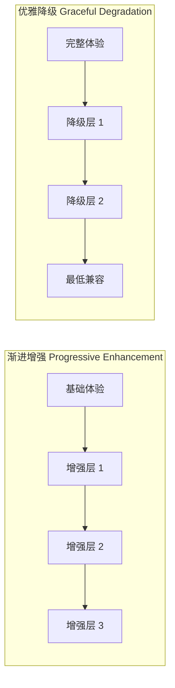
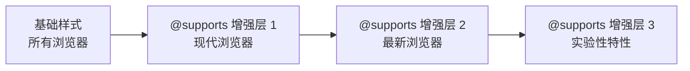

# 特性检测与渐进增强

特性检测（Feature Detection）与渐进增强（Progressive Enhancement）是构建健壮 CSS 的核心策略。`@supports` 规则让 CSS 具备了原生的特性检测能力，使开发者能够安全地使用现代 CSS 特性，同时为不支持这些特性的浏览器提供可靠的回退方案。

## 概述

### 为什么需要特性检测

浏览器对 CSS 特性的支持存在差异，直接使用新特性可能导致：

- **样式失效**：不支持的属性被忽略，页面布局崩溃
- **体验断裂**：不同浏览器呈现截然不同的视觉效果
- **维护困难**：通过 JavaScript 检测或浏览器嗅探增加复杂度

`@supports` 提供了一种声明式的、纯 CSS 的特性检测方案，让浏览器自行判断是否支持某项特性，从而选择性地应用样式。

### 渐进增强决策流程

```mermaid
flowchart TD
  A[需要使用现代 CSS 特性] --> B{@supports 特性检测}
  B -->|支持| C[应用现代样式]
  B -->|不支持| D[应用回退样式]
  C --> E[完整体验]
  D --> F[基础可用体验]
  F --> G[核心内容可访问<br/>布局功能完整<br/>视觉表现简化]
  E --> H[增强视觉效果<br/>高级布局能力<br/>交互体验提升]

```

### 渐进增强 vs 优雅降级



| 策略 | 思路 | 起点 | 目标 |
|------|------|------|------|
| 渐进增强 | 从基础到增强 | 所有浏览器可用的基础体验 | 逐步添加高级特性 |
| 优雅降级 | 从完整到兼容 | 完整的现代体验 | 确保旧浏览器基本可用 |

**推荐策略**：渐进增强。先确保基础体验可用，再通过 `@supports` 逐步增强，这样即使特性检测失败，用户仍能获得可用的页面。

## @supports 语法

`@supports` 是 CSS Conditional Rules Module Level 3 定义的规则，用于在样式表中进行条件判断。

### 基本语法

```css
@supports (<property>: <value>) {
  /* 当浏览器支持该属性-值对时应用的样式 */
}

@supports not (<property>: <value>) {
  /* 当浏览器不支持该属性-值对时应用的样式 */
}
```

### 条件运算符

`@supports` 支持三种逻辑运算符，可组合构建复杂条件：

| 运算符 | 含义 | 示例 |
|--------|------|------|
| `not` | 逻辑非 — 条件取反 | `@supports not (display: grid)` |
| `and` | 逻辑与 — 全部满足 | `@supports (display: grid) and (gap: 1rem)` |
| `or` | 逻辑或 — 任一满足 | `@supports (backdrop-filter: blur(10px)) or (-webkit-backdrop-filter: blur(10px))` |

### 运算符优先级

```css
/* not 优先级最高，and 次之，or 最低 */

/* 等价于：(not A) and B or C */
@supports not (display: grid) and (gap: 1rem) or (display: flex) {
  /* ... */
}

/* 使用括号明确优先级 — 推荐 */
@supports (not (display: grid)) and ((gap: 1rem) or (display: flex)) {
  /* ... */
}
```

**最佳实践**：始终使用括号明确运算优先级，避免歧义。

### selector() 函数

CSS Conditional Rules Module Level 4 新增了 `selector()` 函数，用于检测选择器支持性：

```css
/* 检测 :has() 选择器是否支持 */
@supports selector(:has(*)) {
  .card:has(img) {
    display: flex;
  }
}

/* 检测 :is() 选择器 */
@supports selector(:is(*)) {
  :is(h1, h2, h3):hover {
    color: #2563eb;
  }
}

/* 检测 :where() 选择器 */
@supports selector(:where(*)) {
  :where(.btn, .link) {
    cursor: pointer;
  }
}

/* 检测嵌套选择器 */
@supports selector(&) {
  .card {
    & .title {
      font-weight: bold;
    }
  }
}
```

### font-format() 和 font-tech() 检测

CSS Fonts Module Level 4 提供了字体格式和技术检测：

```css
/* 检测字体格式支持 */
@supports font-format(opentype) {
  @font-face {
    font-family: "MyFont";
    src: url("myfont.otf") format("opentype");
  }
}

@supports font-format(woff2) {
  @font-face {
    font-family: "MyFont";
    src: url("myfont.woff2") format("woff2");
  }
}

/* 检测字体技术支持 */
@supports font-tech(color-COLRv1) {
  @font-face {
    font-family: "Emoji";
    src: url("emoji.woff2") tech(color-COLRv1);
  }
}
```

## 特性检测策略

### 检测属性支持

检测浏览器是否支持某个 CSS 属性：

```css
/* 检测 Grid 布局 */
@supports (display: grid) {
  .layout {
    display: grid;
    grid-template-columns: repeat(3, 1fr);
    gap: 20px;
  }
}

/* 检测 Flexbox 布局 */
@supports (display: flex) {
  .nav {
    display: flex;
    justify-content: space-between;
    align-items: center;
  }
}

/* 检测 backdrop-filter */
@supports (backdrop-filter: blur(10px)) or (-webkit-backdrop-filter: blur(10px)) {
  .glass-header {
    -webkit-backdrop-filter: blur(10px);
    backdrop-filter: blur(10px);
    background: rgba(255, 255, 255, 0.7);
  }
}

/* 检测 CSS 容器查询 */
@supports (container-type: inline-size) {
  .card-wrapper {
    container: card / inline-size;
  }
}
```

### 检测属性值支持

检测浏览器是否支持某个属性的特定值——这比检测属性本身更精确：

```css
/* 检测 sticky 定位 */
@supports (position: sticky) {
  .header {
    position: sticky;
    top: 0;
    z-index: 100;
  }
}

/* 检测 color-mix() 函数 */
@supports (color: color-mix(in srgb, red, blue)) {
  .button {
    background: color-mix(in srgb, var(--primary) 80%, white);
  }
}

/* 检测 oklch 色彩空间 */
@supports (color: oklch(0.7 0.15 200)) {
  :root {
    --primary: oklch(0.7 0.15 200);
    --primary-light: oklch(0.85 0.1 200);
  }
}

/* 检测 CSS 嵌套 */
@supports (display: grid) and (selector(&)) {
  .card {
    display: grid;

    & .title {
      font-size: 1.5rem;
    }

    &:hover {
      box-shadow: 0 4px 12px rgba(0, 0, 0, 0.1);
    }
  }
}
```

### 检测选择器支持

使用 `selector()` 函数检测选择器语法支持：

```css
/* 检测 :has() 父选择器 */
@supports selector(:has(*)) {
  /* 包含图片的卡片使用横向布局 */
  .card:has(img) {
    display: grid;
    grid-template-columns: 200px 1fr;
  }

  /* 表单验证状态联动 */
  .form-group:has(input:invalid) .error-message {
    display: block;
  }

  /* 无子项时隐藏容器 */
  .menu:not(:has(> *)) {
    display: none;
  }
}

/* 检测 :is() / :where() */
@supports selector(:is(*)) {
  :is(h1, h2, h3, h4, h5, h6) {
    line-height: 1.2;
  }
}

/* 检测 :nth-child(of) 语法 */
@supports selector(:nth-child(1 of .active)) {
  .item:nth-child(1 of .active) {
    border-top: none;
  }
}
```

### 检测组合策略

实际项目中常需要同时检测多个特性：

```css
/* Grid + gap 同时支持才使用 */
@supports (display: grid) and (gap: 1rem) {
  .gallery {
    display: grid;
    grid-template-columns: repeat(auto-fill, minmax(250px, 1fr));
    gap: 1rem;
  }
}

/* 容器查询 + 容器单位 */
@supports (container-type: inline-size) and (width: 1cqw) {
  .card-wrapper {
    container: card / inline-size;
  }

  .card__title {
    font-size: clamp(1rem, 3cqw, 1.5rem);
  }
}

/* 带前缀的跨浏览器检测 */
@supports ((-webkit-backdrop-filter: blur(10px)) or (backdrop-filter: blur(10px)))
  and ((-webkit-mask-image: linear-gradient(black, transparent)) or (mask-image: linear-gradient(black, transparent))) {
  .frosted-card {
    -webkit-backdrop-filter: blur(10px);
    backdrop-filter: blur(10px);
    -webkit-mask-image: linear-gradient(black, transparent);
    mask-image: linear-gradient(black, transparent);
  }
}
```

## 渐进增强模式

### 基线优先（Baseline-First）方法

渐进增强的核心思想是"基线优先"：先编写所有浏览器都能理解的基础样式，再通过 `@supports` 逐步增强。



### 模式一：回退在外部

最常用的模式——基础样式写在 `@supports` 外部，增强样式写在内部：

```css
/* 基础样式 — 所有浏览器 */
.layout {
  display: flex;
  flex-wrap: wrap;
  margin: -10px;
}

.layout > * {
  margin: 10px;
  flex: 0 0 calc(33.333% - 20px);
}

/* Grid 增强 — 支持 Grid 的浏览器 */
@supports (display: grid) {
  .layout {
    display: grid;
    grid-template-columns: repeat(3, 1fr);
    gap: 20px;
    margin: 0;
  }

  .layout > * {
    margin: 0;
    flex: none;
  }
}
```

### 模式二：回退在 @supports not 内

当回退样式较复杂时，将回退样式放在 `@supports not` 块中：

```css
/* 通用样式 */
.card {
  border-radius: 12px;
  overflow: hidden;
}

/* Grid 增强样式 */
@supports (display: grid) {
  .card {
    display: grid;
    grid-template-rows: auto 1fr auto;
  }
}

/* 非 Grid 回退样式 */
@supports not (display: grid) {
  .card {
    display: flex;
    flex-direction: column;
  }

  .card__image {
    flex-shrink: 0;
  }

  .card__body {
    flex: 1;
  }

  .card__footer {
    margin-top: auto;
  }
}
```

### 模式三：多层渐进增强

针对不同特性层级逐步增强：

```css
/* 第一层：基础布局 — 所有浏览器 */
.page {
  max-width: 1200px;
  margin: 0 auto;
  padding: 20px;
}

.header {
  margin-bottom: 20px;
}

.content {
  overflow: hidden;
}

.sidebar {
  margin-top: 20px;
}

/* 第二层：Flexbox 增强 */
@supports (display: flex) {
  .content {
    display: flex;
    flex-wrap: wrap;
    gap: 20px;
  }

  .main {
    flex: 1;
    min-width: 0;
  }

  .sidebar {
    flex: 0 0 300px;
    margin-top: 0;
  }
}

/* 第三层：Grid 增强 */
@supports (display: grid) {
  .content {
    display: grid;
    grid-template-columns: 1fr 300px;
    gap: 20px;
  }

  .main {
    min-width: 0;
  }

  .sidebar {
    margin-top: 0;
  }
}

/* 第四层：Grid 子网格增强 */
@supports (grid-template-columns: subgrid) {
  .content {
    grid-template-columns: 1fr 300px;
  }

  .card {
    display: grid;
    grid-row: span 3;
    grid-template-rows: subgrid;
  }
}
```

### 模式四：CSS 变量渐进增强

利用 CSS 变量的回退机制与 `@supports` 结合：

```css
/* 基础颜色 — 不依赖自定义属性 */
.card {
  background: #ffffff;
  border: 1px solid #e2e8f0;
  color: #1e293b;
}

/* 自定义属性增强 — 支持时使用主题系统 */
@supports (color: var(--test)) {
  .card {
    background: var(--card-bg, #ffffff);
    border-color: var(--card-border, #e2e8f0);
    color: var(--card-text, #1e293b);
  }
}

/* oklch 色彩空间增强 — 更精确的颜色控制 */
@supports (color: oklch(0.7 0.15 200)) {
  :root {
    --primary: oklch(0.65 0.25 260);
    --primary-hover: oklch(0.55 0.25 260);
    --primary-light: oklch(0.92 0.08 260);
  }
}
```

## @supports 与 @media 组合

`@supports` 可以与 `@media` 组合使用，实现"特性 + 视口"的双重条件判断。

### 组合语法

```css
/* 同时满足特性支持和视口条件 */
@supports (display: grid) and (gap: 1rem) {
  @media (min-width: 768px) {
    .dashboard {
      display: grid;
      grid-template-columns: 1fr 300px;
      gap: 1rem;
    }
  }
}

/* 也可以反过来嵌套 */
@media (min-width: 768px) {
  @supports (display: grid) {
    .dashboard {
      display: grid;
      grid-template-columns: 1fr 300px;
      gap: 1rem;
    }
  }
}
```

### 响应式 + 特性检测实战

```css
/* 移动端基础样式 */
.nav {
  display: flex;
  flex-direction: column;
  gap: 4px;
}

/* 平板 + Grid 支持 */
@supports (display: grid) {
  @media (min-width: 768px) {
    .nav {
      display: grid;
      grid-template-columns: repeat(2, 1fr);
      gap: 8px;
    }
  }
}

/* 桌面 + Grid 支持 */
@supports (display: grid) {
  @media (min-width: 1024px) {
    .nav {
      grid-template-columns: repeat(4, 1fr);
    }
  }
}

/* 容器查询 + 特性检测 */
@supports (container-type: inline-size) {
  .card-wrapper {
    container: card / inline-size;
  }

  @container card (inline-size >= 400px) {
    .card {
      display: grid;
      grid-template-columns: 1fr 2fr;
    }
  }
}

/* 不支持容器查询时的媒体查询回退 */
@supports not (container-type: inline-size) {
  @media (min-width: 768px) {
    .card {
      display: grid;
      grid-template-columns: 1fr 2fr;
    }
  }
}
```

### 用户偏好 + 特性检测

```css
/* 减少动画偏好 + backdrop-filter 支持 */
@supports (backdrop-filter: blur(10px)) {
  @media (prefers-reduced-motion: no-preference) {
    .modal-backdrop {
      backdrop-filter: blur(10px);
      animation: fadeIn 0.3s ease;
    }
  }

  @media (prefers-reduced-motion: reduce) {
    .modal-backdrop {
      backdrop-filter: blur(10px);
      /* 跳过动画 */
    }
  }
}
```

## JavaScript CSS.supports()

`CSS.supports()` 是 `@supports` 的 JavaScript API，提供命令式的特性检测能力。

### 静态方法

```javascript
// 两种调用方式

// 方式一：两个参数（属性名 + 属性值）
CSS.supports('display', 'grid')           // true
CSS.supports('gap', '1rem')               // true
CSS.supports('position', 'sticky')        // true
CSS.supports('backdrop-filter', 'blur(10px)') // 视浏览器而定

// 方式二：一个参数（完整条件字符串）
CSS.supports('(display: grid)')                        // true
CSS.supports('not (display: grid)')                    // false
CSS.supports('(display: grid) and (gap: 1rem)')        // true
CSS.supports('(backdrop-filter: blur(10px)) or (-webkit-backdrop-filter: blur(10px))')
```

### 实际应用示例

```javascript
// 根据特性支持动态加载样式
function loadEnhancedStyles() {
  if (CSS.supports('display', 'grid')) {
    // 动态加载 Grid 布局样式
    const link = document.createElement('link');
    link.rel = 'stylesheet';
    link.href = 'styles/grid-layout.css';
    document.head.appendChild(link);
  }
}

// 根据特性支持添加 class
function applyFeatureClasses() {
  const html = document.documentElement;

  const features = {
    'grid': CSS.supports('display', 'grid'),
    'sticky': CSS.supports('position', 'sticky'),
    'gap': CSS.supports('gap', '1rem'),
    'backdrop-filter': CSS.supports('(backdrop-filter: blur(10px)) or (-webkit-backdrop-filter: blur(10px))'),
    'container-queries': CSS.supports('container-type', 'inline-size'),
    'has-selector': CSS.supports('selector(:has(*))'),
    'nesting': CSS.supports('selector(&)'),
    'oklch': CSS.supports('(color: oklch(0.7 0.15 200))'),
  };

  for (const [feature, supported] of Object.entries(features)) {
    html.classList.toggle(`supports-${feature}`, supported);
    html.classList.toggle(`no-${feature}`, !supported);
  }
}

// 页面加载时执行
document.addEventListener('DOMContentLoaded', applyFeatureClasses);
```

### 配合 CSS 使用

```css
/* JavaScript 添加的 class 与 @supports 配合 */
.supports-grid .layout {
  display: grid;
  grid-template-columns: repeat(3, 1fr);
  gap: 20px;
}

.no-grid .layout {
  display: flex;
  flex-wrap: wrap;
  margin: -10px;
}

.no-grid .layout > * {
  margin: 10px;
  width: calc(33.333% - 20px);
}
```

### 运行时特性检测面板

```javascript
// 构建特性检测报告
function buildSupportReport() {
  const checks = [
    { name: 'CSS Grid', test: () => CSS.supports('display', 'grid') },
    { name: 'Flexbox Gap', test: () => CSS.supports('gap', '1rem') },
    { name: 'Sticky Position', test: () => CSS.supports('position', 'sticky') },
    { name: 'Backdrop Filter', test: () => CSS.supports('(backdrop-filter: blur(1px)) or (-webkit-backdrop-filter: blur(1px))') },
    { name: 'Container Queries', test: () => CSS.supports('container-type', 'inline-size') },
    { name: ':has() Selector', test: () => CSS.supports('selector(:has(*))') },
    { name: 'CSS Nesting', test: () => CSS.supports('selector(&)') },
    { name: 'oklch Color', test: () => CSS.supports('(color: oklch(0.7 0.15 200))') },
    { name: 'color-mix()', test: () => CSS.supports('(color: color-mix(in srgb, red, blue))') },
    { name: 'Subgrid', test: () => CSS.supports('grid-template-columns', 'subgrid') },
    { name: 'scrollbar-gutter', test: () => CSS.supports('scrollbar-gutter', 'stable') },
    { name: 'text-wrap: balance', test: () => CSS.supports('text-wrap', 'balance') },
  ];

  return checks.map(({ name, test }) => ({
    feature: name,
    supported: test(),
  }));
}

// 输出报告
console.table(buildSupportReport());
```

## 实战示例

### Grid 布局回退

以 inline-block、Flexbox 作为逐级回退的 Grid 布局示例：

```html
<div class="gallery">
  <article class="gallery__item">
    
    <h3>标题一</h3>
  </article>
  <article class="gallery__item">
    
    <h3>标题二</h3>
  </article>
  <article class="gallery__item">
    
    <h3>标题三</h3>
  </article>
  <article class="gallery__item">
    
    <h3>标题四</h3>
  </article>
</div>
```

```css
/* 基础样式 — inline-block 回退 */
.gallery {
  font-size: 0; /* 消除 inline-block 间距 */
}

.gallery__item {
  display: inline-block;
  width: 50%;
  font-size: 1rem;
  vertical-align: top;
  padding: 10px;
  box-sizing: border-box;
}

/* Flexbox 增强 */
@supports (display: flex) {
  .gallery {
    display: flex;
    flex-wrap: wrap;
    font-size: 1rem;
  }

  .gallery__item {
    flex: 0 0 50%;
    padding: 10px;
  }
}

/* Grid 增强 — 最终目标 */
@supports (display: grid) {
  .gallery {
    display: grid;
    grid-template-columns: repeat(auto-fill, minmax(250px, 1fr));
    gap: 20px;
  }

  .gallery__item {
    width: auto;
    padding: 0;
    flex: none;
  }
}

/* 响应式调整（仅回退布局需要；Grid 由 auto-fill 自动响应，无需额外调整） */
@supports not (display: grid) {
  @media (min-width: 768px) {
    .gallery__item {
      width: 33.333%;
    }
  }
}
```

### 自定义属性回退

CSS 自定义属性与 `@supports` 结合实现主题系统：

```css
/* 基础主题 — 硬编码颜色值 */
.card {
  background: #ffffff;
  border: 1px solid #e2e8f0;
  border-radius: 8px;
  padding: 16px;
  color: #1e293b;
  box-shadow: 0 1px 3px rgba(0, 0, 0, 0.1);
}

.card__title {
  color: #2563eb;
  font-size: 1.25rem;
  font-weight: 600;
}

/* 自定义属性增强 — 支持时启用主题系统 */
@supports (color: var(--test)) {
  :root {
    --card-bg: #ffffff;
    --card-border: #e2e8f0;
    --card-text: #1e293b;
    --card-title: #2563eb;
    --card-shadow: 0 1px 3px rgba(0, 0, 0, 0.1);
    --card-radius: 8px;
    --card-padding: 16px;
  }

  [data-theme="dark"] {
    --card-bg: #1e293b;
    --card-border: #334155;
    --card-text: #e2e8f0;
    --card-title: #60a5fa;
    --card-shadow: 0 1px 3px rgba(0, 0, 0, 0.3);
  }

  .card {
    background: var(--card-bg);
    border-color: var(--card-border);
    color: var(--card-text);
    box-shadow: var(--card-shadow);
    border-radius: var(--card-radius);
    padding: var(--card-padding);
  }

  .card__title {
    color: var(--card-title);
  }
}
```

### 现代色彩空间回退

从 sRGB 到 oklch 的渐进增强：

```css
/* 基础 — sRGB 颜色 */
:root {
  --primary: #2563eb;
  --primary-hover: #1d4ed8;
  --primary-light: #dbeafe;
  --success: #16a34a;
  --warning: #d97706;
  --danger: #dc2626;
}

/* oklch 增强 — 更广的色域、更均匀的感知 */
@supports (color: oklch(0.7 0.15 200)) {
  :root {
    --primary: oklch(0.62 0.22 260);
    --primary-hover: oklch(0.52 0.22 260);
    --primary-light: oklch(0.93 0.06 260);
    --success: oklch(0.65 0.2 145);
    --warning: oklch(0.75 0.15 80);
    --danger: oklch(0.63 0.25 25);
  }
}

/* color-mix 增强 — 动态颜色混合 */
@supports (color: color-mix(in srgb, red, blue)) {
  .btn--primary {
    background: var(--primary);
  }

  .btn--primary:hover {
    background: color-mix(in srgb, var(--primary) 85%, black);
  }

  .btn--primary:active {
    background: color-mix(in srgb, var(--primary) 75%, black);
  }

  .btn--primary-light {
    background: color-mix(in srgb, var(--primary) 15%, white);
    color: var(--primary);
  }
}

/* 不支持 color-mix 的回退 */
@supports not (color: color-mix(in srgb, red, blue)) {
  .btn--primary:hover {
    background: var(--primary-hover);
  }

  .btn--primary-light {
    background: var(--primary-light);
    color: var(--primary);
  }
}
```

### CSS 嵌套回退

从扁平选择器到嵌套语法的渐进增强：

```css
/* 基础 — 扁平选择器（所有浏览器） */
.card {
  padding: 16px;
  border-radius: 8px;
  background: #fff;
  border: 1px solid #e2e8f0;
}

.card__title {
  font-size: 1.25rem;
  font-weight: 600;
  color: #1e293b;
}

.card__body {
  margin-top: 8px;
  color: #64748b;
}

.card:hover {
  box-shadow: 0 4px 12px rgba(0, 0, 0, 0.1);
  border-color: #cbd5e1;
}

.card--featured {
  border-color: #2563eb;
  background: linear-gradient(135deg, #eff6ff, #fff);
}

.card--featured .card__title {
  color: #2563eb;
}

/* 嵌套语法增强 — 更简洁的代码 */
@supports selector(&) {
  .card {
    padding: 16px;
    border-radius: 8px;
    background: #fff;
    border: 1px solid #e2e8f0;

    & .card__title {
      font-size: 1.25rem;
      font-weight: 600;
      color: #1e293b;
    }

    & .card__body {
      margin-top: 8px;
      color: #64748b;
    }

    &:hover {
      box-shadow: 0 4px 12px rgba(0, 0, 0, 0.1);
      border-color: #cbd5e1;
    }

    &--featured {
      border-color: #2563eb;
      background: linear-gradient(135deg, #eff6ff, #fff);

      & .card__title {
        color: #2563eb;
      }
    }
  }
}
```

### 毛玻璃效果回退

```css
/* 基础 — 半透明背景 */
.modal-backdrop {
  position: fixed;
  inset: 0;
  background: rgba(0, 0, 0, 0.5);
  z-index: 1000;
}

/* 毛玻璃增强 */
@supports (backdrop-filter: blur(10px)) or (-webkit-backdrop-filter: blur(10px)) {
  .modal-backdrop {
    -webkit-backdrop-filter: blur(10px) saturate(180%);
    backdrop-filter: blur(10px) saturate(180%);
    background: rgba(255, 255, 255, 0.3);
  }
}

/* 暗色主题毛玻璃 */
@supports (backdrop-filter: blur(10px)) or (-webkit-backdrop-filter: blur(10px)) {
  [data-theme="dark"] .modal-backdrop {
    background: rgba(0, 0, 0, 0.4);
  }
}
```

## 浏览器兼容性

| 特性 | Chrome | Firefox | Safari | Edge | 状态 |
|------|--------|---------|--------|------|------|
| `@supports` 基本语法 | 28+ | 22+ | 9+ | 12+ | 稳定 |
| `not` / `and` / `or` 运算符 | 28+ | 22+ | 9+ | 12+ | 稳定 |
| `selector()` 函数 | 83+ | 69+ | 14.1+ | 83+ | 稳定 |
| `font-format()` | -- | -- | -- | -- | 实验性 |
| `font-tech()` | -- | -- | -- | -- | 实验性 |
| `CSS.supports()` | 28+ | 22+ | 10+ | 12+ | 稳定 |

> **渐进增强提示**：`@supports` 本身已获得所有主流浏览器的广泛支持，可以放心使用。`selector()` 函数是较新的扩展，对于需要兼容旧浏览器的项目，建议配合 `CSS.supports('selector(:has(*))')` 进行 JavaScript 检测作为补充。

## 参考资源

- [CSS Conditional Rules Module Level 3 — W3C 规范](https://drafts.csswg.org/css-conditional-3/)
- [CSS Conditional Rules Module Level 4 — W3C 规范](https://drafts.csswg.org/css-conditional-4/)
- [@supports — MDN](https://developer.mozilla.org/zh-CN/docs/Web/CSS/@supports)
- [CSS.supports() — MDN](https://developer.mozilla.org/zh-CN/docs/Web/API/CSS/supports)
- [Using Feature Queries — CSS Tricks](https://css-tricks.com/using-feature-queries-css/)
- [Progressive Enhancement — MDN](https://developer.mozilla.org/zh-CN/docs/Glossary/Progressive_Enhancement)
- [Baseline — Web Platform Status](https://webstatus.dev/)
