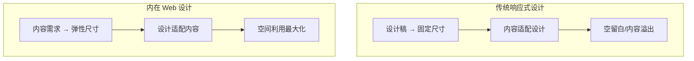
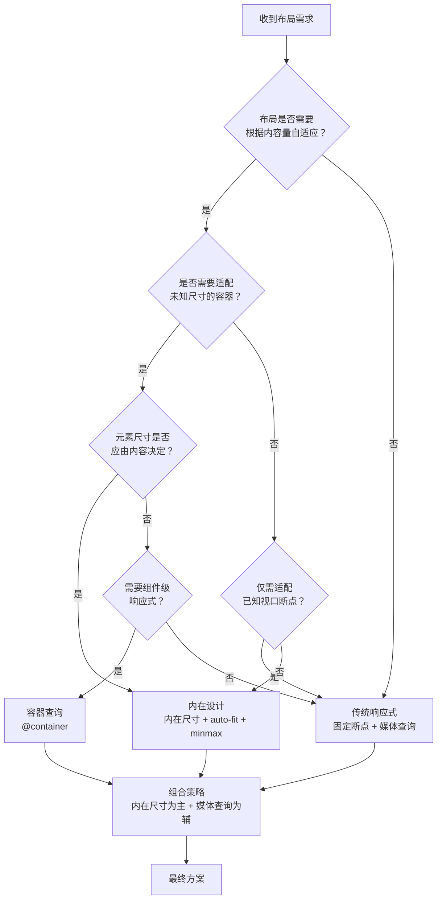
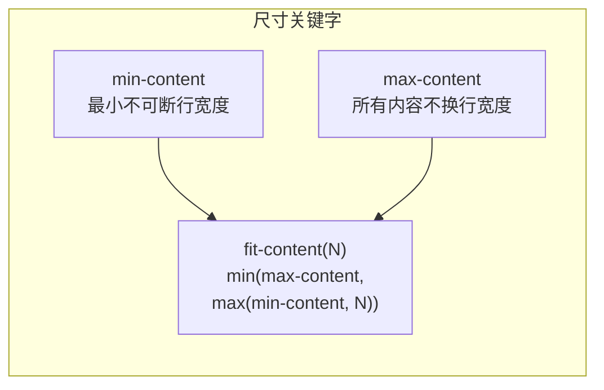
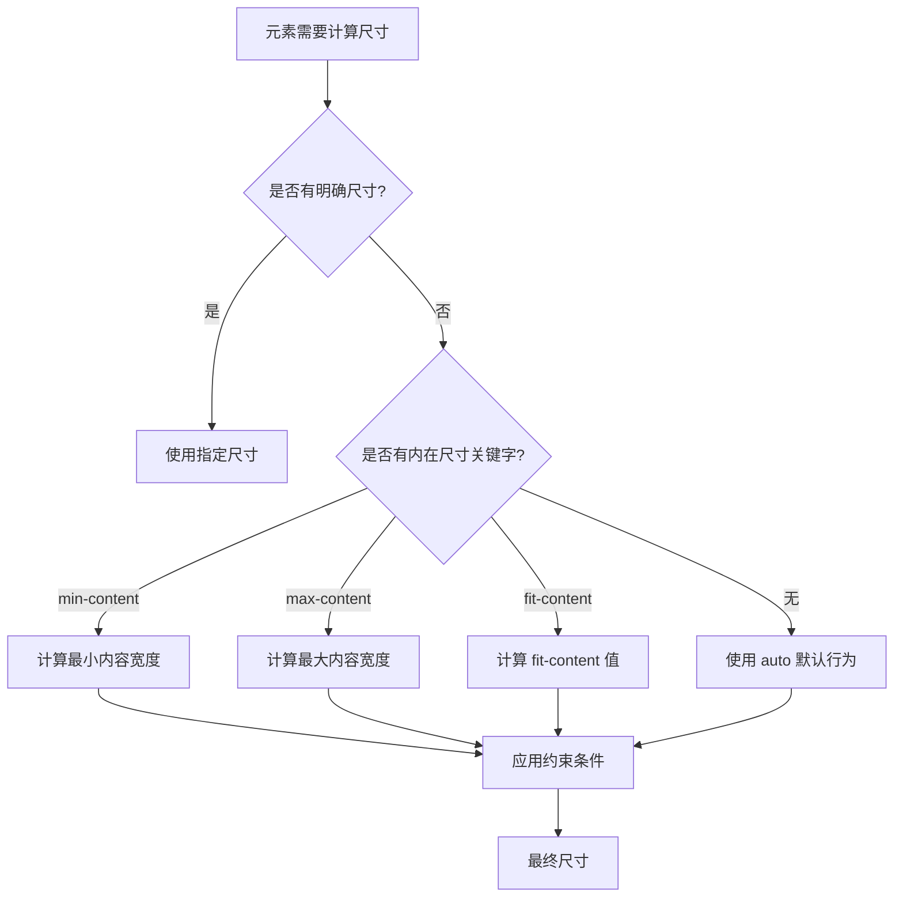
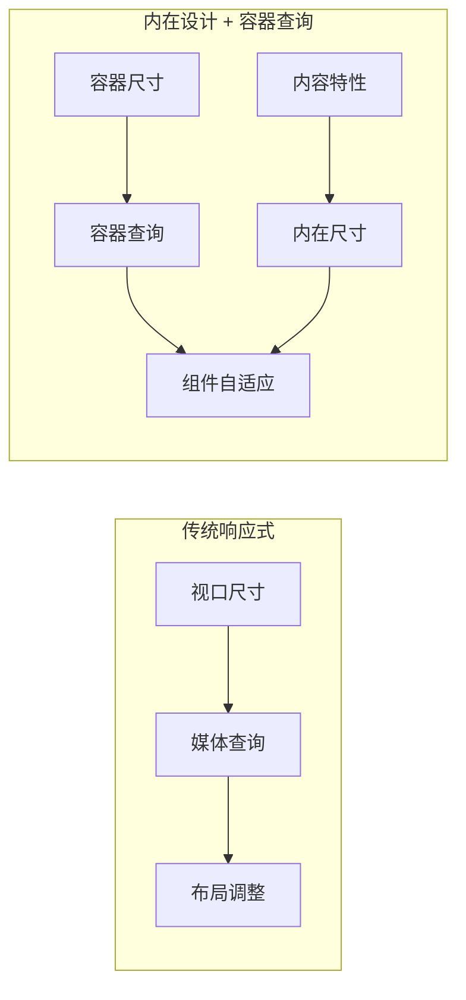

# 内在 Web 设计（Intrinsic Web Design）

内在 Web 设计是 2018 年由 Jen Simmons 提出的概念，被称为"响应式 Web 设计+"。它的核心理念是**设计受内容驱动（Design Content-Driven），而非内容以设计为导向（Content Design-Driven）**。

内在设计不是简单地适配不同屏幕尺寸，而是让布局根据内容本身的特性自动调整，创造出更加灵活、健壮的 Web 界面。

## 概念起源

### Jen Simmons 与内在 Web 设计的诞生

2018 年，Mozilla 的设计师兼开发者倡导者 **Jen Simmons** 在 An Event Apart 大会上发表了题为 *"Designing Intrinsic Layouts"* 的演讲，正式提出了 **内在 Web 设计（Intrinsic Web Design）** 这一概念。她将内在设计称为"响应式 Web 设计+"（Responsive Web Design+），意指它并非对响应式设计的否定，而是在其基础上的进化与超越。

Jen Simmons 指出，Ethan Marcotte 在 2010 年提出的响应式 Web 设计（RWD）解决了"同一页面适配不同设备"的核心问题，但随着 CSS Grid、Flexbox、内在尺寸关键字等现代特性的成熟，我们拥有了比媒体查询断点更强大的工具——让布局本身具备"内在的"弹性，无需依赖外部断点即可自适应。

### 从响应式设计到内在设计的演进

Web 布局范式经历了三个重要阶段：

| 阶段 | 时期 | 核心思想 | 关键技术 |
|------|------|----------|----------|
| 固定布局 | 2000s | 为特定屏幕尺寸设计 | 固定像素宽度、`960px` 网格 |
| 响应式设计 | 2010–2018 | 为不同断点设计 | 媒体查询、百分比、Flexbox |
| 内在设计 | 2018–至今 | 让内容决定布局 | CSS Grid、内在尺寸、`clamp()`、容器查询 |

响应式设计的核心公式是 **"流式网格 + 弹性图片 + 媒体查询"**，它仍然以断点为驱动——设计师需要预设 768px、1024px 等断点，然后为每个断点编写不同的样式规则。内在设计则提出了一个根本性的转变：**不再为设备尺寸设计，而是让布局规则本身足够灵活，由内容与可用空间共同决定最终呈现**。

### 内在设计不是替代，而是进化

需要强调的是，内在设计并不排斥响应式设计。两者的关系是：

- **响应式设计** 解决了"多设备适配"的问题
- **内在设计** 解决了"内容与空间的最佳匹配"的问题

在实际项目中，内在设计大幅减少了媒体查询的使用量，但在需要全局布局切换（如移动端导航抽屉）、用户偏好检测（如暗色模式）等场景下，媒体查询仍然是不可或缺的工具。推荐策略是 **"内在尺寸为主，媒体查询为辅"**。

## 背景与动机

### 传统响应式设计的局限

传统响应式设计依赖媒体查询和固定断点，存在以下问题：

- **内容溢出或留白**：固定宽度无法适应不同长度的内容
- **断点维护困难**：每增加一个设备尺寸就需要添加新的媒体查询
- **设计僵化**：设计师需要为每个断点提供设计稿
- **新设备适配滞后**：新设备尺寸出现时需要手动添加断点
- **组件不可移植**：基于视口的媒体查询让组件无法在不同容器中复用



### 内在设计的优势

- **内容自适应**：元素尺寸由内容本身决定，无需预设固定值
- **减少断点依赖**：布局自动适应各种屏幕尺寸，减少媒体查询
- **未来兼容**：新设备出现时无需额外适配
- **代码简洁**：用内在尺寸替代大量媒体查询规则
- **维护成本低**：布局逻辑更清晰，易于理解和修改

## 核心区别

| 维度 | 传统响应式 | 内在设计 |
|------|-----------|----------|
| 驱动方式 | 设计驱动（Design-Driven） | 内容驱动（Content-Driven） |
| 元素尺寸 | 设计稿固定尺寸 | 内在尺寸自适应 |
| 内容与空间 | 内容适配设计框 | 设计适应内容量 |
| 空间利用 | 固定尺寸可能有空白/溢出 | 弹性分配，最大化利用 |
| CSS 技术 | 媒体查询 + 百分比 | `min-content`/`max-content`/`fit-content`/`fr`/`auto-fit` |
| 断点策略 | 预设固定断点 | 内容自然断点 |
| 维护成本 | 高（多断点维护） | 低（一套规则适配所有） |

### 决策流程：内在设计 vs 传统响应式

当面对一个布局需求时，如何选择内在设计还是传统响应式？以下决策流程图帮助你做出判断：



## 内在设计核心 CSS 技术

### 1. min-content / max-content / fit-content

内在尺寸关键字让元素大小由内容决定，而非设计师硬性规定。

#### min-content：最小内容宽度

`min-content` 表示元素的最小内容宽度，即最长的不可断行单词或元素的宽度。

```css
/* 按钮宽度由文字内容决定 */
.button { 
  width: min-content; 
  padding: 8px 16px;
}

/* 侧边栏最小宽度由内容决定 */
.sidebar {
  width: min-content;
}
```

**应用场景**：
- 按钮、标签：宽度由文字内容决定
- 导航菜单项：避免文字换行
- 徽章、标记：紧凑显示

#### max-content：最大内容宽度

`max-content` 表示元素的最大内容宽度，即所有内容不换行时的宽度。

```css
/* tooltip 宽度由内容决定，不换行 */
.tooltip { 
  width: max-content; 
}

/* 下拉菜单选项不换行 */
.dropdown-item {
  width: max-content;
}
```

**应用场景**：
- 提示文字、tooltip：完整显示内容
- 下拉选项：避免文字截断
- 代码块：保持代码完整性

#### fit-content()：自适应但有上限

`fit-content()` 在 `min-content` 和指定上限之间取最小值，实现内容自适应但不超过最大限制。

```css
/* 侧边栏宽度自适应内容，但不超过 300px */
.sidebar { 
  width: fit-content(300px); 
}

/* 卡片宽度自适应，最大 400px */
.card {
  width: fit-content(400px);
}
```

**计算公式**：`fit-content(N) = min(max-content, max(min-content, N))`

**应用场景**：
- 侧边栏：内容自适应但有最大宽度约束
- 卡片组件：灵活适应内容但不超过容器
- 表单输入框：根据 placeholder 长度自适应



| 关键字 | 行为 | 适用场景 |
|--------|------|----------|
| `min-content` | 最小内容宽度，尽可能多换行 | 按钮、标签、侧边栏最小宽度 |
| `max-content` | 最大内容宽度，不换行 | 提示文字、下拉选项、tooltip |
| `fit-content()` | 内容自适应但不超过上限 | 侧边栏（内容自适应但有最大宽度） |
| `auto` | 依赖上下文的计算值 | 通用场景 |

### 2. auto-fill / auto-fit 的内在弹性

`auto-fill` 和 `auto-fit` 让网格轨道数量由容器空间决定，而非固定列数，是内在设计的核心工具。

#### auto-fill：填充可用空间

`auto-fill` 创建尽可能多的轨道，即使没有内容也会保留空轨道。

```css
/* 内在设计：轨道数量由容器空间决定 */
.intrinsic-grid {
  grid-template-columns: repeat(auto-fill, minmax(200px, 1fr));
}

/* 容器宽度 800px：4 列 */
/* 容器宽度 600px：3 列 */
/* 容器宽度 400px：2 列 */
```

#### auto-fit：适配内容

`auto-fit` 与 `auto-fill` 类似，但会折叠空轨道，让有内容的轨道占据更多空间。

```css
/* 有内容的轨道会扩展填充空轨道空间 */
.product-grid {
  grid-template-columns: repeat(auto-fit, minmax(250px, 1fr));
}

/* 3 个产品，容器 1000px：每个产品 333px */
/* 2 个产品，容器 1000px：每个产品 500px */
```

**auto-fill vs auto-fit 区别**：
- `auto-fill`：保留空轨道，适合固定布局
- `auto-fit`：折叠空轨道，适合内容优先布局

```css
/* 传统：固定列数 */
.traditional-grid {
  grid-template-columns: repeat(3, 1fr); /* 始终 3 列 */
}

/* 内在设计：动态列数 */
.intrinsic-grid {
  grid-template-columns: repeat(auto-fit, minmax(min-content, 1fr));
}
```

**应用场景**：
- 产品列表：自动适应屏幕宽度
- 图片画廊：响应式网格布局
- 卡片容器：灵活排列卡片

### 3. fr 单位的灵活分配

`fr`（fraction）单位根据剩余空间动态分配，是内在设计的核心工具。

#### fr 单位的工作原理

`fr` 单位表示可用空间的一个分数，所有 `fr` 单位按比例分配剩余空间。

```css
/* 传统：固定宽度 */
.columns { 
  grid-template-columns: 200px 400px 200px; 
}

/* 内在设计：弹性分配 */
.columns { 
  grid-template-columns: 1fr 2fr 1fr; 
}
/* 列宽随容器宽度变化，比例保持 1:2:1 */
/* 容器 800px：200px 400px 200px */
/* 容器 1200px：300px 600px 300px */
```

#### fr 与固定值混合使用

`fr` 单位可以与固定值混合使用，实现更灵活的布局。

```css
/* 侧边栏固定，主内容弹性 */
.layout {
  grid-template-columns: 250px 1fr;
}

/* 两侧固定，中间弹性 */
.layout {
  grid-template-columns: 200px 1fr 200px;
}

/* 混合固定和弹性 */
.dashboard {
  grid-template-columns: 100px 1fr 2fr 150px;
}
```

**应用场景**：
- 页面布局：侧边栏固定，主内容弹性
- 表单布局：标签固定，输入框弹性
- 仪表盘：多列灵活分配

### 4. minmax() 函数：弹性范围约束

`minmax()` 函数为轨道尺寸设定一个弹性范围，让浏览器在这个范围内根据可用空间自动选择最优值。它是内在设计中实现"内容与空间动态平衡"的关键函数。

#### 基本语法

```css
/* minmax(最小值, 最大值) */
grid-template-columns: minmax(200px, 1fr);
```

`minmax()` 接受两个参数：最小值和最大值。浏览器会确保轨道不小于最小值、不大于最大值，并在两者之间弹性伸缩。

#### 与 auto-fill / auto-fit 的黄金组合

`minmax()` 与 `auto-fill`/`auto-fit` 结合是内在设计中最经典的模式——无需任何媒体查询即可实现完全响应式的网格布局：

```css
/* 无断点响应式网格：每个卡片最小 250px，最大 1fr */
.card-grid {
  display: grid;
  grid-template-columns: repeat(auto-fit, minmax(250px, 1fr));
  gap: clamp(16px, 2vw, 32px);
}

/* 容器 500px：1 列，每列 500px */
/* 容器 800px：2 列，每列 ~400px */
/* 容器 1200px：3 列，每列 ~400px */
/* 容器 1600px：4 列，每列 ~400px */
```

**工作原理**：浏览器先按最小值（250px）计算能放多少列，然后将剩余空间按 `1fr` 分配给每列，使每列在 250px 到 1fr 之间弹性伸缩。

#### minmax() 的参数组合

```css
/* 固定最小值 + 弹性最大值（最常用） */
grid-template-columns: repeat(auto-fit, minmax(250px, 1fr));

/* 内容最小值 + 弹性最大值 */
grid-template-columns: minmax(min-content, 1fr);

/* 内容最小值 + 内容最大值（等同于 max-content） */
grid-template-columns: minmax(min-content, max-content);

/* 固定最小值 + 固定最大值（等同于固定值） */
grid-template-columns: minmax(200px, 400px);

/* 0 + 弹性（允许轨道收缩到 0，auto-fill 时折叠空轨道） */
grid-template-columns: repeat(auto-fill, minmax(0, 250px));
```

#### 侧边栏布局中的 minmax()

```css
/* 侧边栏：最小 200px，最大 300px */
.layout {
  display: grid;
  grid-template-columns: minmax(200px, 300px) 1fr;
  gap: clamp(16px, 3vw, 32px);
}

/* 当容器宽度不足时，侧边栏收缩到 200px */
/* 当容器宽度充裕时，侧边栏扩展到 300px */
/* 主内容区始终占据剩余空间 */
```

**应用场景**：
- 响应式卡片网格：与 `auto-fit` 组合实现无断点布局
- 侧边栏布局：侧边栏有弹性范围约束
- 内容区域：最小可读宽度 + 弹性扩展
- 仪表盘面板：面板尺寸在合理范围内弹性变化

### 5. grid-auto-flow: dense 密集填充

在网格布局中，当子项尺寸不一致时，默认的放置算法可能会留下空洞（空白区域）。`grid-auto-flow: dense` 让浏览器回填这些空洞，实现更紧凑、更高效的空间利用——这正是内在设计"最大化利用空间"理念的体现。

#### 默认行为 vs 密集填充

```css
/* 默认：稀疏放置（保留空洞） */
.masonry-sparse {
  display: grid;
  grid-template-columns: repeat(auto-fill, minmax(200px, 1fr));
  grid-auto-flow: row; /* 默认值 */
}

/* 内在设计：密集填充（回填空洞） */
.masonry-dense {
  display: grid;
  grid-template-columns: repeat(auto-fill, minmax(200px, 1fr));
  grid-auto-flow: dense; /* 回填空洞 */
}
```

#### 不同尺寸卡片的密集排列

```css
/* 某些卡片跨两列，使用 dense 避免空洞 */
.photo-grid {
  display: grid;
  grid-template-columns: repeat(auto-fill, minmax(180px, 1fr));
  grid-auto-flow: dense;
  gap: 16px;
}

/* 普通照片：占 1 列 */
.photo-grid .photo {
  /* 默认占 1 列 1 行 */
}

/* 特色照片：跨 2 列 */
.photo-grid .photo--featured {
  grid-column: span 2;
}

/* 竖版照片：跨 2 行 */
.photo-grid .photo--tall {
  grid-row: span 2;
}
```

**注意**：`dense` 会改变元素的视觉顺序，可能导致 DOM 顺序与视觉顺序不一致，对屏幕阅读器用户可能造成困扰。在需要保持严格阅读顺序的场景下，应谨慎使用或提供 `tabindex` 等辅助标记。

**应用场景**：
- 瀑布流图片画廊：不同尺寸图片紧凑排列
- 产品展示网格：特色产品跨多列
- 仪表盘面板：大小不一的面板密集排列
- 博客文章列表：置顶文章跨多列

### 6. aspect-ratio 的内在比例

`aspect-ratio` 让元素保持内在比例而非固定尺寸，实现响应式比例控制。

#### 基本用法

```css
/* 传统：固定宽高 */
.card-image { 
  width: 300px; 
  height: 200px; 
}

/* 内在设计：内在比例 */
.card-image {
  aspect-ratio: 3 / 2;
  width: 100%; /* 宽度自适应，高度由比例决定 */
}

/* 宽度 300px → 高度 200px */
/* 宽度 600px → 高度 400px */
```

#### 常用比例

```css
/* 正方形 */
.square { aspect-ratio: 1 / 1; }

/* 16:9 视频 */
.video { aspect-ratio: 16 / 9; }

/* 4:3 图片 */
.photo { aspect-ratio: 4 / 3; }

/* 黄金比例 */
.golden { aspect-ratio: 1.618 / 1; }
```

**应用场景**：
- 图片容器：保持图片比例
- 视频嵌入：响应式视频播放器
- 卡片封面：统一的视觉比例
- 头像：圆形或方形头像


#### aspect-ratio 交互演示（MDN）

设置元素的宽高比，长度属性可省略时自动按比例计算。

```html
<!DOCTYPE html>
<html lang="zh-CN">
  <head>
    <meta charset="UTF-8" />
    <meta name="viewport" content="width=device-width, initial-scale=1.0" />
    <title>aspect-ratio 属性演示 - MDN 示例</title>
    <meta name="description" content="盒模型示例：aspect（ratio 属性演示）。" />
    <style>
      * {
        margin: 0;
        padding: 0;
        box-sizing: border-box;
      }
      body {
        font-family: -apple-system, BlinkMacSystemFont, "Segoe UI", Roboto, "Helvetica Neue", Arial, sans-serif;
        min-height: 100vh;
        padding: 0;
      }
      .demo-layout {
        display: flex;
        height: 100vh;
        gap: 0;
      }
      .snippet-panel {
        width: 320px;
        flex-shrink: 0;
        padding: 16px;
        display: flex;
        flex-direction: column;
        gap: 8px;
        overflow-y: auto;
        border-right: 1px solid #ddd;
        background: #fafafa;
      }
      .snippet-btn {
        padding: 10px 14px;
        border: 1px solid #ccc;
        border-radius: 6px;
        background: #fff;
        font-family: "JetBrains Mono", "Fira Code", monospace;
        font-size: 13px;
        color: #333;
        cursor: pointer;
        text-align: left;
        transition: all 0.2s;
        line-height: 1.4;
      }
      .snippet-btn:hover {
        border-color: #8083ff;
        background: #f0f0ff;
      }
      .snippet-btn.active {
        border-color: #8083ff;
        background: #e8e8ff;
        color: #571bc1;
        font-weight: 600;
      }
      .preview-panel {
        flex: 1;
        padding: 16px;
        display: flex;
        align-items: center;
        justify-content: center;
        background: #fff;
        overflow: auto;
      }
      .preview-panel > section,
      .preview-panel > div:not(.snippet-panel):not(.demo-layout) {
        flex: 1;
        width: 100%;
        min-height: 0;
        height: 100%;
        display: flex;
        align-items: center;
        justify-content: center;
      }
      #example-element {
        height: 100%;
        width: auto;
      }
    </style>
  </head>
  <body>
    <div class="demo-layout">
      <div class="snippet-panel">
        <button class="snippet-btn active" data-index="0">aspect-ratio: auto;</button>
        <button class="snippet-btn" data-index="1">aspect-ratio: 1 / 1;</button>
        <button class="snippet-btn" data-index="2">aspect-ratio: 16 / 9;</button>
        <button class="snippet-btn" data-index="3">aspect-ratio: 0.5;</button>
      </div>
      <div class="preview-panel">
        <section id="default-example">
          <img
            class="transition-all"
            height="640"
            id="example-element"
            src="data:image/jpeg;base64,/9j/4AAQSkZJRgABAQEASABIAAD/4U0qRXhpZgAASUkqAAgAAAAJAA8BAgAGAAAAigAAABABAgAbAAAAkAAAABIBAwABAAAAAQAAABoBBQABAAAAegAAABsBBQABAAAAggAAACgBAwABAAAAAgAAADIBAgAUAAAArAAAABMCAwABAAAAAgAAAGmHBAABAAAAwAAAAC4jAABIAAAAAQAAAEgAAAABAAAAQ2Fub24AQ2Fub24gRU9TIERJR0lUQUwgUkVCRUwgWFQAADIwMDU6MTI6MjYgMTA6Mzg6MTUAHACaggUAAQAAABYCAACdggUAAQAAAB4CAAAiiAMAAQAAAAMAAAAniAMAAQAAAGQAAAAAkAcABAAAADAyMjEDkAIAFAAAAOAiAAAEkAIAFAAAAPQiAAABkQcABAAAAAECAwABkgoAAQAAACYCAAACkgUAAQAAAC4CAAAEkgoAAQAAADYCAAAHkgMAAQAAAAUAAAAJkgMAAQAAABAAAAAKkgUAAQAAAD4CAAB8kgcAiiAAAEYCAACGkgcACAAAAAgjAAAAoAcABAAAADAxMDABoAMAAQAAAAEAAAACoAMAAQAAAD8GAAADoAMAAQAAACoEAAAFoAQAAQAAABAjAAAOogUAAQAAANAiAAAPogUAAQAAANgiAAAQogMAAQAAAAIAAAABpAMAAQAAAAAAAAACpAMAAQAAAAAAAAADpAMAAQAAAAAAAAAGpAMAAQAAAAAAAAAAAAAAAQAAACADAAA4AAAACgAAANSkCQAAAAEAivgEAAAAAQAAAAAAAgAAABIAAAABAAAAGAABAAMALgAAAGwDAAACAAMABAAAAMgDAAADAAMABAAAANADAAAEAAMAIgAAANgDAAAGAAIAIAAAABwEAAAHAAIAIAAAADwEAAAJAAIAIAAAAFwEAAAMAAQAAQAAANvfwkgNAAcAAAQAAHwEAAAPAAMACgAAAHwIAAAQAAQAAQAAAIkBAIASAAMAGAAAAJAIAAATAAMABAAAAMAIAAAVAAQAAQAAAAAAAKAZAAMAAQAAAAEAAACDAAQAAQAAAAAAAACTAAMAEAAAAMgIAACgAAMADgAAAOgIAACqAAMABQAAAAQJAADQAAQAAQAAAAAAAADgAAMAEQAAAA4JAAABQAMARgIAADAJAAACQAMAdAoAALwNAAADQAMAFgAAAKQiAAAAAAAAXAACAAAAAwAAAAAAAAAAAAAAAQAAAAEAAAABAAEAAQD/fwMAAgAAAAMA/////zcAEgABAIAAMAEAAAAAAAAAAAAA/////wAAAAAAAAAA//8AAP9/AAD/f/////8CABIAiwNdAmQAAAAAAAAARAAAAKAAMAGfADUBAAAAAAMAAAAIAAgAAAAAAAAAAAAAAAAAAQAAAAAAoADQAasAAAAAAPwAAAD//wAAAAAAAAAAAABDYW5vbiBFT1MgRElHSVRBTCBSRUJFTCBYVAAAAAAAAEZpcm13YXJlIDEuMC4zAAAAAAAAAAAAAAAAAAAAAAAAdW5rbm93bgABAAAAPAAAAAEAAABQAAAAAQAAAGQAAAAAAAAAAAAAAAAAAAAAAAAAAAAAAAAAAAAAAAAAAAAAAAAAAAAAAAAAAAAAAAAAAAAAAAAAAAAAAAAAAAAAAAAAAAAAAAAAAAAAAAAAAAAAAAAAAAAAAAAAAAAAAAAAAAAAAAAAAAAAAAAAAAAAAAAAAAAAAAAAAAAAAAAAAAAAAAAAAAAAAAAAAAAAAAAAAAAAAAAAAAAAAAAAAAAAAAAAAAAAAAAAAAAAAAAAAAAAAAAAAAAAAAAAAAAAAAAAAAAAAAAAAAAAAAAAAAAAAAAAAAAAAAAAAAAAAAAAAAAAAAAAAAAAAAAAAAAAAAAAAAAAAAAAAAAAAAAAAAAAAAAAAAAAAAAAAAAAAAAAAAAAAAAAAAAAAAAAAAAAAAAAAAAAAAAAAAAAAAAAAAAAAAAAAAAAAAAAAAAAAAAAAAAAAAAAAAAAAAAAAAAAAAAAAAAAAAAAAAAAAAAAAAAAAAAAAAAAAAAAAAAAAAAAAAAAAAAAAAAAAAAAAAAAAAAAAAAAAAAAAAAAAAAAAAAAAAAAAAAAAAAAAAAAAAAAAAAAAAAAAAAAAAAAAAAAAAAAAAAAAAAAAAAAAAAAAAAAAAAAAAAAAAAAAAAAAAAAAAAAAAAAAAAAAAAAAAAAAAAAAAAAAAAAAAAAAAAAAAAAAAAAAAAAAAAAAAAAAAAAAAAAAAAAAAAAAAAAAAAAAAAAAAAAAAAAAAAAAAAAAAAAAAAAAAAAAAAAAAAAAAAAAAAAAAAAAAAAAAAAAAAAAAAAAAAAAAAAAAAAAAAAAAAAAAAAAAAAAAAAAAAAAAAAAAAAAAAAAAAAAAAAAAAAAAAAAAAAAAAAAAAAAAAAAAAAAAAAAAAAAAAAAAAAAAAAAAAAAAAAAAAAAAAAAAAAAAAAAAAAAAAAAAAAAAAAAAAAAAAAAAAAAAAAAAAAAAAAAAAAAAAAAAAAAAAAAAAAAAAAAAAAAAAAAAAAAAAAAAAAAAAAAAAAAAAAAAAAAAAAAAAAAAAAAAAAAAAAAAAAAAAAAAAAAAAAAAAAAAAAAAAAAAAAAAAAAAAAAAAAAAAAAAAAAAAAAAAAAAAAAAAAAAAAAAAAAAAAAAAAAAAAAAAAAAAAAAAAAAAAAAAAAAAAAAAAAAAAAAAAAAAAAAAAAAAAAAAAAAAAAAAAAAAAAAAAAAAAAAAAAAAAAAAAAAAAAAAAAAAAAAAAAAAAAAAAAAAAAAAAAAAAAAAAAAAAAAAAAAAAAAAAAAAAAAAAAAAAAAAAAAAAAAAAAAAAAAAAAAAAAAAAAAAAAAAAAAAAAAAAAAAAAAAAAAAAAAAAAAAAAAAAAAAAAAAAAAAAAAAAAAAAAAAAAAAAAAAAAAAAAAAAAAAAFAAAAAABAAIAAwAEAAUABgAHAAgHAAcAgA0ACYANAAm9ALwAAAAr+xr9AADmAtUEAACX/QAAAAAAAAAAAABpAhgA//8AAJ8ABwBwACAAghqCAAAAAAAAAP////8AAAAAAAAAAAAAAAAAAAAAHAAAAAAAAAAAAAAAAAAAAACAUBQAAAAAAAAAAAoAHwIABAAE9QEiALwNGAkBAAEANAATALMNEgkAAAAAAAAAAAAAAAAAAAAAjAQKAwAEAARkAQMCAAQABAYCVgEABAAE6wLoACMBIwFpAKMANwE2AaIAewBjAWIBEQG1CPkD/QNSBlAStQj9AwEEUgZQEtsI/QMBBNYFUBR+Cv0DAQTPBFgbrAn9AwEEQQVwF8MF/QMBBE0JgQxjB/0DAQTmBz8PDgr9AwEEDwUsGdsI/QMBBNYFUBTbCP0DAQTWBVAUTQEGBF7+ZStbAdIDgf4zJW8BjQOz/kAfhgFTA+H+WBunAQsDIP9wF7gB6AJA/+AVzgG9Amj/UBTtAYsCm/+NEhQCVwLV/9gQNAIzAgAAtw9mAgMCPwBwDrsCvwGhALIM6AKkAc4A6wsdA4UBAgE3C9gDPwGWAW0J9AEVCCcIFQgnCBUIJwgVCCcIFQgnCBUIJwgVCCcIFQgnCBUIJwgVCCcIFQgnCBUIJwgVCCcIFQgnCBUIJwgBAQEBAQEBAQAAAAAAACsAGwAoADEAGwBIAD0AaAAwAHAAMQA4ACMAeABvAEQARABBADoAPwBeAFwAXABOAE8ARABQADIALgBPACcAQgCBAHAAYABrAGEAWQBoAF4AUwBMAFMAPQAzAFAAWwBhAF0AZgB0AHEAcAByAGsAagBLAD8AQABDAEQAAAAAAAAAeQAnADQAdwArAF4AUgCbAEEApwA+AEIAJQAcAZ8AjwCQAIAAbwCTAKUAqgCUAHUAcgBoAHQAQQA8AKoAKwCEABwB9wDMAMgAyACzAMEApwCHAHQAeQBTADsArADEANMA0wDjAP0A8wDuAOwA1gDPAIwAcABuAGgAWwAAAAAAAABbAC8AQgBeAC0AcABbAJoAQQCWAD8AQAAjACkB4ACaAI8AgABtAH0AqgClAJkAeQB0AGIAbwA+ADMAvwBMAJYAHwHvAMYAzwDAAKoAuQCdAIEAcQB4AFAAOADRAOgA9QDaAOUA/QDyAO0A6gDUAMsAhgBqAGcAYABUAAAAAAAAAGYAHAAkAFkAHgA7ADIAXQAlAFwAHwAhABAA/wCHAHoAbQBbAEsAZQBpAGkAVgBAADoAMwA4AB0AGgCWACMAbADPAKgAhAB9AHwAawBuAFoAQwA3ADYAIwAVAIgAlgCeAIwAjwCZAI8AhwB+AGoAXwA9AC4ALQApAB0AAAAAAAAAAAAAAAAAAAAAAAAAAAAAAAAAAAAAAAAAAAAAAAAAAAAAAAAAAAAAAAAAAAAAAAAAAAAAAAAAAAAAAAAAAAAAAAAAAAAAAAAAAAAAAAAAAAAAAAAAAAAAAAAAAAAAAAAAAAAAAAAAAAAAAAAAAAAAAAAAAAAAAAAAAAAAAAAAAAACAAIAAgABAAUADwAGAAMACQAGAAcAJwACAAEAAgAGACAAEQAJAAMAFQAxAB4AHAA8ABgAIwCuAAQACgABAAQARgAUACYAEgBOAGUALQA0AEIALAAuAIwABQC0AFsAzQBHJIQsdSV9EdggTSPYF0wNGwfBAjYCPQU4AKYCqwG8AZ0CYgFXAwAAbgDFAMcAZAD/AwAEAAQAAAAAAAAAAAAAAAAAAAAAZgQABAAE6QqiD6ka6BQAAAAAAAAZFv//AP8ApBEF//+QAQAAAXAaA9oPPAHEADAA0AHtDocMAACllpaWQABAAEAAAACWc49wD8YAAAAAnA/hAQ0AoQN4APYBlgEAACwBvAFeADsR2QGZAFUh6QHPAKkx2wH+APYEVoAAAB4B9gRWgAAAHgH2BFaAAAAeAQAAdgBCAk0HAADtEZ8HXwAfEdQHkgD6MdEHwAD3MPAH4ABMBK4w9gfuAPAFKYAAAPwAEAQQBBAEAAARABMAMwUcADoAgAAxAwgAEgAAACAAIAAgAAAAAQAAAAIAwACHS/8BAAIAAgACAQABAE4AlwAcAAAAAAMAAAAAAAMAAAAABggLCxEAIAAAAP9CAQAACwACZlVwCj8ACQAdAAYAGgCFAD8ADQAgAAUADwBDAD8ACgApAAUAFQBEAD8AFQAkABAAHABmAD8ADQAgAAoAGwB2ACgAAALKAIQAAAAfBQAAKACAAZAAWAAAABgEAAAwAAAAAAAAAAAAAAAAAAAAAAAAAAAAAAAAAAAAAAAAAAAAAAAAAAAAAAAAAAAAAAAAAAAAAAAAAAAAAAAAAAAAAAAAAAAAAAAAAAAAAAAAAAAAAAAAAAAAAAAAAAAAAAAAAAEAAAAAADACkAEIDEsEAAAAAAAAAAAAAAAAAAAAAAAAAAAAAAAAAAEAAAAAAAAAAAAAAAAAAAABAAEgAAERAAEAAQAAAAAAAAAAAAAAAJABkAGQAZARkBGllpaWlpaWc6WWlpaWlpZzpZaWlpaWlnOllpaWlpaWc6WWlpaWlpZzAAAAAAAAAAAAAAAAAAAAAAAAAAAAAAAAAAAAAAAAAAAAAAAAAAAAAAAAAAAAAAAAAAAAAAAAAAAAAAAAAAAAAAAAAAAAAAAAAAAAAAAAAAAAAAAAAAAAAAAAAAAAAAAAAAAAAAAAAAAAAAAAAAAAAAAAAAAAAAAAAAAAAAAAAAAAAAAAAAAAAAAAAAAAAAAAAAAAAAAAAAAAAAAAAAAAAAAAAAAAAAAAAAAAAAAAAAAAAAAAAAAAAAAAAAAAAAAAAAAAAAAAAABAAEAAQABAAEAAQAAAABwAOgAUACgAQABAADIAAAA+ADcACgAjAEAAIwAwAEYALgA3AB4AQAA0ACAAQACcD+EBDQChA3gA9gGWAQAALAG8AV4AOxHZAZkAVSHpAc8AqTHbAf4A9gRWgAAAHgH2BFaAAAAeAfYEVoAAAB4BnA/hAQ0AoQN4APYBlgEAACwBvAFeADsR2QGZAFUh6QHPAKkx2wH+APYEVoAAAB4B9gRWgAAAHgH2BFaAAAAeAZwP4QENAKEDeAD2AZYBAAAsAbwBXgA7EdkBmQBVIekBzwCpMdsB/gD2BFaAAAAeAfYEVoAAAB4B9gRWgAAAHgGcD+EBDQChA3gA9gGWAQAALAG8AV4AOxHZAZkAVSHpAc8AqTHbAf4A9gRWgAAAHgH2BFaAAAAeAfYEVoAAAB4BnA/hAQ0AoQN4APYBlgEAACwBvAFeADsR2QGZAFUh6QHPAKkx2wH+APYEVoAAAB4B9gRWgAAAHgH2BFaAAAAeAZwP4QENAKEDeAD2AZYBAAAsAbwBXgA7EdkBmQBVIekBzwCpMdsB/gD2BFaAAAAeAfYEVoAAAB4B9gRWgAAAHgGcD+EBDQChA3gA9gGWAQAALAG8AV4AOxHZAZkAVSHpAc8AqTHbAf4A9gRWgAAAHgH2BFaAAAAeAfYEVoAAAB4BnA/hAQ0AoQN4APYBlgEAACwBvAFeADsR2QGZAFUh6QHPAKkx2wH+APYEVoAAAB4B9gRWgAAAHgH2BFaAAAAeAZwP4QENAKEDeAD2AZYBAAAsAbwBXgA7EdkBmQBVIekBzwCpMdsB/gD2BFaAAAAeAfYEVoAAAB4B9gRWgAAAHgGcD+EBDQChA3gA9gGWAQAALAG8AV4AOxHZAZkAVSHpAc8AqTHbAf4A9gRWgAAAHgH2BFaAAAAeAfYEVoAAAB4BAAB2AIQCIgcAANERlQdlAN0htQeTAJwx6we5ACYx9AfXAN4DBjHyB+IA3AUwgAAA+wAAAHYAVgJLBwAABgG6B2MAwyHIB5QA8zHYB7sAFjHtB9wA3gPjMPIH5gDcBTCAAAD7AAAAdgBCAk0HAADtEZ8HXwAfEdQHkgD6MdEHwAD3MPAH4ABMBK4w9gfuAPAFKYAAAPwAAAB2AOwBogcAADwBsgddAC0R1geaACgh3AfMALkw5gftAN4DdjD4B/MA0wQcgAAA+QAAAHYAXQERAAAAfAGhB1QAZBHJB50AOCHYB9YAsTDFB/gA3gMZMP0H/ADBBAmAAAD9AAAAdgCDAiMHAADUEZIHZQDWIb4HkwDMMd4HugANMeAH2QDeA7ow+wfiANwFOoAAAPYAAAB2AFYCSwcAAAYBugdjAMMhyAeUAPMx2Ae7ABYx2QfcAN4DsTD5B+UA3AUzgAAA9wAAAHYAQgJOBwAA7hGeB18AHhHVB5IA/jHQB8AA8zDrB+AATASUMPgH7QDwBSmAAAD5AAAAdgAAApAHAAAwAboHXgA2EdEHmgAXIeIHzADbMMwH7QDeA1Uw/gfzAOIEGYAAAPgAAAB2AF0BEQAAAHwBoQdUAGQRyQedADgh2AfWALEwxQf4AN4DGTD9B/wAwQQJgAAA/QAAAHYAgwIjBwAA1BGSB2UA1iG+B5MAzDHeB7oADTHgB9kA3gO6MPsH4gDcBUGAAAD2AAAAdgBWAksHAAAGAboHYwDDIcgHlADzMdgHuwAWMdkH3ADeA7Ew+QflANwFM4AAAPcAAAB2AEICTgcAAO4RngdfAB4R1QeSAP4x0AfAAPMw6wfgAEwElDD4B+0A8AUugAAA+QAAAHYAAAKQBwAAMAG6B14ANhHRB5oAFyHiB8wA2zDMB+0A3gNVMP4H8wDiBBuAAAD4AAAAdgBdAREAAAB8AaEHVABkEckHnQA4IdgH1gCxMMUH+ADeAxkw/Qf8AMEECYAAAP0AAAB2AIMCIwcAANQRkgdlANYhvgeTAMwx4ge6ACUx4QfaAN4D1TD2B+QA3AU7gAAA+QAAAHYAVgJLBwAABgG6B2MAwyHIB5QA8zHdB7sALjHaB90A3gPMMPYH5wDcBSeAAAD7AAAAdgBCAk4HAADuEZ4HXwAeEdUHkgD+MdAHwADzMPIH4ABMBLIw8gfuAOsFKoAAAPsAAAB2AAACkAcAADABugdeADYR0QeaABch4gfMANswzAftAN4DVTD+B/MA4gQfgAAA+AAAAHYAXQERAAAAfAGhB1QAZBHJB50AOCHYB9YAsTDFB/gA3gMZMP0H/ADBBAmAAAD9AAAAdgCDAiMHAADUEZIHZQDWIb4HkwDMMeIHugAlMeEH2gDeA9Uw9gfkANwFO4AAAPkAAAB2AFYCSwcAAAYBugdjAMMhyAeUAPMx3Qe7AC4x2gfdAN4DzDD2B+cA3AUngAAA+wAAAHYAQgJOBwAA7hGeB18AHhHVB5IA/jHQB8AA8zDyB+AATASyMPIH7gDrBSqAAAD7AAAAdgAAApAHAAAwAboHXgA2EdEHmgAXIeIHzADbMMwH7QDeA1Uw/gfzAOIEH4AAAPgAAAB2AF0BEQAAAHwBoQdUAGQRyQedADgh2AfWALEwxQf4AN4DGTD9B/wAwQQJgAAA/QAAAAgICAAIAAgAUABnZDQhUABnZDQhUABnZDQhVABnZDQhVABnZDQhTgCXABwAYgCeAAEAigB2AAEA/gABAAEAAQD+AAEABggLCxEAIAAGCAsLEQAgAAYICwsRACAACBAWGiQBIAAKGiMnOAEgAD8AFQAkABAAHABmAD8ADQAgAAoAGwB2AD8AFQAkABAAHABmAD8ADQAgAAoAGwB2AD8AFQAkAAgADgAzAD8ADQAgAAoAGwB2AD8AAAAAAAAAAAAAAD8ADQAgAAoAGwB2AD8AAAAAAAAAAAAAAD8ADQAgAAoAGwB2ACYAKwAwADoAQwCAAIAAgACAAIAAgACAAIAAAQABAAEAAQABAAEAAQABAAEAAQABAAEAAQABAAEAAQABAAEAAQABAAEAAQABAAEAAQC4CxoD5vwmANr/PAHEADAA0AHt/hMBeQOH/IgTGgPm/CYA2v88AcQAMADQAe3+EwF5A4f8WBsaA+b8JgDa/zwBxAAwANAB7f4TAXkDh/y4CxoD5vwmANr/PAHEADAA0AHt/hMBeQOH/IgTGgPm/CYA2v88AcQAMADQAe3+EwF5A4f8WBsaA+b8JgDa/zwBxAAwANAB7f4TAXkDh/y4CxoD5vwmANr/PAHEADAA0AHt/hMBeQOH/IgTGgPm/CYA2v88AcQAMADQAe3+EwF5A4f8WBsaA+b8JgDa/zwBxAAwANAB7f4TAXkDh/y4CxoD5vwmANr/PAHEADAA0AHt/hMBeQOH/IgTGgPm/CYA2v88AcQAMADQAe3+EwF5A4f8WBsaA+b8JgDa/zwBxAAwANAB7f4TAXkDh/y4CxoD5vwmANr/PAHEADAA0AHt/hMBeQOH/IgTGgPm/CYA2v88AcQAMADQAe3+EwF5A4f8WBsaA+b8JgDa/zwBxAAwANAB7f4TAXkDh/y4C74CQv0PAPH/VwGpAA0A8wES/+4AmQNn/IgTvgJC/Q8A8f9XAakADQDzARL/7gCZA2f8WBu+AkL9DwDx/1cBqQANAPMBEv/uAJkDZ/y4C7gCSP0aAOb/VAGsACUA2wES/+4AmQNn/IgTuAJI/RoA5v9UAawAJQDbARL/7gCZA2f8WBu4Akj9GgDm/1QBrAAlANsBEv/uAJkDZ/y4C7kCR/0OAPL/WAGoACIA3gEQ//AAkQNv/IgTuQJH/Q4A8v9YAagAIgDeARD/8ACRA2/8WBu5Akf9DgDy/1gBqAAiAN4BEP/wAJEDb/y4C8oCNv0LAPX/hAF8ABYA6gEG//oAhAN8/IgTygI2/QsA9f+EAXwAFgDqAQb/+gCEA3z8WBvKAjb9CwD1/4QBfAAWAOoBBv/6AIQDfPy4C6gCWP0PAPH/kwFtAAEA/wEW/+oAcAOQ/IgTqAJY/Q8A8f+TAW0AAQD/ARb/6gBwA5D8WBuoAlj9DwDx/5MBbQABAP8BFv/qAHADkPy4C/T/9P8OAAAAiBP0//T/DgAAAFgb9P/0/w4AAAC4C/r/+v8HAAAAiBP6//r/BwAAAFgb+v/6/wcAAAC4CwAAAAAAAAAAiBMAAAAAAAAAAFgbAAAAAAAAAAC4CwYABgD5/wAAiBMGAAYA+f8AAFgbBgAGAPn/AAC4CwwADADy/wAAiBMMAAwA8v8AAFgbDAAMAPL/AAC4C/L/8v8PAAAAiBPy//L/DwAAAFgb8v/y/w8AAAC4C/r/+v8HAAAAiBP6//r/BwAAAFgb+v/6/wcAAAC4CwAAAAAAAAAAiBMAAAAAAAAAAFgbAAAAAAAAAAC4CwYABgD5/wAAiBMGAAYA+f8AAFgbBgAGAPn/AAC4Cw0ADADy/wAAiBMNAAwA8v8AAFgbDQAMAPL/AABuAGQAhwAEAAUAyAAGAG4AZACHAAQABQDIAAYAbgBkAIcABAAFAMgABgBuAGQAhwAEAAUAyAAGAG4AZACHAAQABQDIAAYAfQBuAHoABAAGAL4ACQB9AG4AegAEAAYAvgAJAH0AbgB6AAQABgC+AAkAfQBuAHoABAAGAL4ACQB9AG4AegAEAAYAvgAJAI8AcABzAAkABgDGAA8AjwBwAHMACQAGAMYADwCPAHAAcwAJAAYAxgAPAI8AcABzAAkABgDGAA8AjwBwAHMACQAGAMYADwCiAHoAdwAKAAkAngAPAKIAegB3AAoACQCeAA8AogB6AHcACgAJAJ4ADwCiAHoAdwAKAAkAngAPAKIAegB3AAoACQCeAA8AsgB8AH0ADAALAJYAEQCyAHwAfQAMAAsAlgARALIAfAB9AAwACwCWABEAsgB8AH0ADAALAJYAEQCyAHwAfQAMAAsAlgARAGQAWgC1AAUAAgC0AAUAZABaALUABQACALQABQBkAFoAtQAFAAIAtAAFAGQAWgC1AAUAAgC0AAUAZABaALUABQACALQABQBuAGQAhwAFAAUAyAAGAG4AZACHAAUABQDIAAYAbgBkAIcABQAFAMgABgBuAGQAhwAFAAUAyAAGAG4AZACHAAUABQDIAAYAfQBuAHsABAAGAL4ACQB9AG4AewAEAAYAvgAJAH0AbgB7AAQABgC+AAkAfQBuAHsABAAGAL4ACQB9AG4AewAEAAYAvgAJAI8AcABzAAkABgDGAA8AjwBwAHMACQAGAMYADwCPAHAAcwAJAAYAxgAPAI8AcABzAAkABgDGAA8AjwBwAHMACQAGAMYADwCiAHoAdwAKAAkAngAPAKIAegB3AAoACQCeAA8AogB6AHcACgAJAJ4ADwCiAHoAdwAKAAkAngAPAKIAegB3AAoACQCeAA8ABwAAAJIAlACRAAAAAgAGAAoADgASABYAGgAeACIAJgAqAC4AMgA2ADoAPgBCAEYASgBOAFIAVgBaAF4AYgBmAGoAbgByAHYAegB+AIIAhgCKAI4AkgCWAJoAngCiAKYAqgCuALIAtgC6AL4AwgDGAMoAzgDSANYA2gDeAOIA5gDqAO4A8gD2APoA/gACAQYBCgEOARIBFgEaAR4BIgEmASoBMAE0ATgBPAFAAUQBSAFMAVABVAFaAV4BYgFoAWwBcAF2AXoBgAGEAYoBkAGUAZoBoAGkAaoBsAG2AbwBxAHKAdAB2AHeAeYB7gH0Af4BBgIOAhYCHgIoAjACOAJCAkoCVAJcAmYCcAJ4AoICjAKWAqACqgK0AsACygLWAuAC7AL2AgIDDgMaAyYDNANCA04DXANqA3gDiAOYA6gDuAPKA9wD7AP+AxAEIgQ0BEYEWARqBHwEjgSgBLIExgTYBOoE/AQQBSIFNgVIBVwFbgWCBZQFqAW8BdAF4gX2BQoGHgYyBkYGWgZuBoQGmAasBsIG2AbsBgIHGAcwB0YHXgd0B4wHpAe+B9YH8AcKCCQIPghaCHYIkgiuCMoI6AgGCSQJQglgCX4Jngm8CdwJ+gkaCjoKWgp6CpoKugrcCvwKHgtAC2ILhAumC8oL7AsQDDQMWAx8DKAMxgzqDBANNg1cDYQNqg3SDfoNAAAAAAAAAAAAAAAAAAAAAAAAAAAAAAAAAAAAAAAAAAAAAAAAAAAAAAAAAAAAvDQAagMAAAAoIwBGAgAAMjAwNToxMjoyNiAxMDozODoxNQAyMDA1OjEyOjI2IDEwOjM4OjE1AEFTQ0lJAAAAAgABAAIABAAAAFI5OAACAAcABAAAADAxMDAAAAAABgADAQMAAQAAAAYAAAAaAQUAAQAAAHwjAAAbAQUAAQAAAIQjAAAoAQMAAQAAAAIAAAABAgQAAQAAAIwjAAACAgQAAQAAAJYpAAAAAAAASAAAAAEAAABIAAAAAQAAAP/Y/8QBogAAAQUBAQEBAQEAAAAAAAAAAAECAwQFBgcICQoLAQADAQEBAQEBAQEBAAAAAAAAAQIDBAUGBwgJCgsQAAIBAwMCBAMFBQQEAAABfQECAwAEEQUSITFBBhNRYQcicRQygZGhCCNCscEVUtHwJDNicoIJChYXGBkaJSYnKCkqNDU2Nzg5OkNERUZHSElKU1RVVldYWVpjZGVmZ2hpanN0dXZ3eHl6g4SFhoeIiYqSk5SVlpeYmZqio6Slpqeoqaqys7S1tre4ubrCw8TFxsfIycrS09TV1tfY2drh4uPk5ebn6Onq8fLz9PX29/j5+hEAAgECBAQDBAcFBAQAAQJ3AAECAxEEBSExBhJBUQdhcRMiMoEIFEKRobHBCSMzUvAVYnLRChYkNOEl8RcYGRomJygpKjU2Nzg5OkNERUZHSElKU1RVVldYWVpjZGVmZ2hpanN0dXZ3eHl6goOEhYaHiImKkpOUlZaXmJmaoqOkpaanqKmqsrO0tba3uLm6wsPExcbHyMnK0tPU1dbX2Nna4uPk5ebn6Onq8vP09fb3+Pn6/9sAhAADAgIDAgIDAwIDAwMDBAUIBQUEBAUJBwcGCAsKDAsLCgsKDA4RDwwNEQ0NCw8VDxESExQUFAwPFRcVExcRExQTAQMDAwUEBQkFBQkTDQsNExMTExMTExMTExMTExMTExMTExMTExMTExMTExMTExMTExMTExMTExMTExMTExMTExP/wAARCAB4AKADASEAAhEBAxEB/9oADAMBAAIRAxEAPwD8zG+HfiZcZ0LU+eceSaZD8P8AxJcBvI0XUH29cRHivOlm+Dje9VaeZPOn1NLSfg54412YRaN4W1q8kJwFht2bJrU1D9nT4naVcpb6l4E8T20zjcqSWTgkevSuqliaVWPPCSaDnXc5PWvBmu+Hb9rLXdJvrC7XGYbiIowz7GpYvAXiOaaKKPQ9UMkqeZGvkNl19RxyPenPEU4LmlKyF7SPcuWPwq8Y6nM8WneGdauZUYKyRWzsQx7YA6+1dHpf7MfxY1uymu9I+Hviy8toc+ZJDYSMEx1zgcUUq9OtZ05J3HzK1zg28N6olxLA+n3azRP5ckbRkMjZxgjsabLoOowDM1lcJzj5kIolXpxdmw50+pWaynRwjQyBj2xzWjpfg/WtbLjSdMvLop94RISR+FEsRTjHmctA5kzWj+EvjOWMvH4Z1lkH8Qt2xVa++G/inTZRHf6BqkEhAIV4WyQelcdLOcFVfLCrFv1KWuxQufCusWeoLY3WmXsV42MW7REOc9OK2rL4P+N9SQtp/hXXLhRwTHau38hW2IzDD4dqNWaTe12Spp9TGPhLWhqLWB0q/F6p2m3MLbwfpirF34B8R2MXmXmi6jCg/ikiIFFXMMPSkoTmk3srhzx7mZ/Y98Y2kFpP5a9X2HA/Gmtpl2sayNbTBG6MVODXQ6sFZt7gpp9T6l8NXHjvxXLCNK0+21C4vAXURMA4PU/jWZqPwx8d3curXWpaRdaZPaRFpEmPlbwOpHrXwWX5XDmlUpptXs7nI3y7nvP7KngSfxXbiXxTrE1tZ6egY2Nsxj3luVBcfQ19GeJ/i58Im0+e21ue4sprOIwKJJSCWXgrnPJr6LE0qdPSsr37HThqalC6Pn/4lfsvv408Dan45tdYhs9K+ztdxNdPv8yNRkYPUVn/ALPP7O/xA+KugaHe6x4k0vR9Clg8zTZL5fNuBGpxtUDGAfcmppYVSp8q0jLp2IeH99xXQ+3/AA/4TsP2fPhOltrH9l6lcW6vcTao0SxoG6ghj3x+NfIvh/8AbUi0r4mapP4OeLStOkZTKLhjJBcSEncSD93PqK58RNxoP6u2pUttO36PY1qfu+WNtGebftD+A4/iP4wuPGPhKGy0W+uwJLmy5EEsmPvq4zgn0IA968a8QeFk07w2t948kkg1diYLW3hC7CB/EXGQfwNeRSz942K9nG1RtJrpbq0RKkoq8TjdQ+EPjzQPDsHi/UfCviC20CXEkOrvZSC3ZT91g5GNp7Hoe1dN8GdZOreK5DqFtC9yYyRcINpHrkDrXtZsnHCzl5GKbiz6XvLgaV4duJw2PLjL5+gzWX478beEoPhX4c8TT3kOr+M747VSFwFhiUY+dBwDmviuDsFGv7SpJ/C0/U0dZ04tLroanwR+AEnjyceM/GMctik64iJGJCp7jPT6179N4g8LfCbSFtNFtog6D5UU7pHPqWPP419k3Rw0amZ4pX/l8ktrebOW7SUUfMvxf+MWlXOrPfa79gt7tgVigt0XzCPcjk/jXiRvb74takik/wBl6JG2JZp5AgAz2/vHFfN5epVZzzbHLT7K79i7NWSPQJ9A8IeG9AmsreVJ9P37x9tmDF2/DHFeW+MPG3h698P3loLKNtRXMduYlwka+1feZfCt7WljcztJOLUIL7Gmjfmc1m21T011f5nuMen2/wAMvFyXOj+ZDpeojfFIrEGInupHQg1T1340a7rjN4f16Kz1jUIGLwzM+Tcw/wB04/irzqdOpKnKpTdrbrv5lKSfus2fDX7QpHgnUPC3w/0xNG1CWQCeGUYIJ4JUkcH6nivHfGmiXFt4tEGv6ozOMPcmVS0O49gw+99a0k3VabWyOmhWlB2INC8YeMvF/inTfhgniq8Xw7eXqWe0NlUjZsHGe2M8ZxX258RPiNpXwG0LR/BXgm6k1KPQkVJGjm/0vb1boMKevSpxFDlouVO97o78PVjz80z5c+N/7Q2r+MZF0/w7rviH/hEpblZ3sdTm3MZP4gx7gHoOleet8KNc1ozSaHaXF3qErK0dvao3zoeQff8AChVVzXb8tScc0krI+gPhb4V+JOj+HpLX4oeD/Emn2UWPsuoX2nTRRMv93eygHHY5q1feHkWWR7IDYc742UOj+zKcgj2Ir86zKm8Bjpciai9V0IV0k+p6f4c+K1prCNpfxKUwQ3MRge7jQNEyEbcPF0xj049q+SPhzodhpHjvxFZWts0f2W9lSCRlKEw7ztOD2IxivoMZm0sXlsk376381/W5NRJrmR6j8Sr1bbwLqTQ53+QwA+oxXzVoni2HTNQ02bU7GO6jsmTFs33JADnBrm4Lg/YVPNnNVeh94+IP2rPCy+HdOg8LPAuLNZpi3yx2gx90ju2e1fMHxA+MN/4ihe40q4Foty5UXd0drMP7wHYV6+a03mONhQl/Bhb/ALel2+SJpq+rPBdZuIyZpZL3+0bhHI84gkN75PNZ91rs1zpccDvyG3EgYwPSvqadCMUnb/gHQlYt2b6prgSO2E9zjA2oCx/+tWv4j+GXiXw/ocOsappV1Bpk4Gy6kXCsc4xn1q6tpSXcxb1Pe/Bvjqz8R6Y/hHxayjUrQ4tblGBD49zXOeDvDWq+OfixN4e8I6fFNqMjBd8h2bAvJbcOleJThKcPddjNR986T4p+DLbQfE1zo13qVzJr9xCEa2sGUqXUcln/AKVz2h/D/wAX3nw71TVr/wD03RYFZGjmj3PER/Fu7UqM6spNVFZLYuDSWqOC+HF3ouleI4dR8dWi3Wmp8whEskbs4PBDIQ36198/s/6z8PP2hLh7TwVYxaPq1nEWuF1Jmc7RxuMhDMcnA59a66NV+09m43i7a+fp2NaictIn0B4O/ZW8N6jZ+J7H4heFdJ1KKe3CW009tFKFJyd8Um3IPTvn1p3wc/ZQ0/4a6vqOr+H7u/tFurdIIVhnbEaBiWABJK5+XgHHArudCm5LTVGlOMrLmO51HwV4h05ZJNL1WW/icFZYJnPzqeoIJIOfevkz4ufDa48D6sJ1hli0q9YtGWGPLYctGfTHUe1fJcYYVzoKpu4v8H/SOjlutDz86WNTkjht1Z3lYKqAc8nAH1NfSuk/DLwv8KNFtvteh6Tq3ixoh9ou722SfyMjPlqGBAx375rzuEcLHEyk6ivGPTzZjseNftS/CvVNX8F2GszaFFoOl3VylnLPZ2Yi3tI2VkKqAcE4UHGOmOtfGXxD+G9r8D9dkh8SX9jqt+YxJbWtuxfyyRwZR2I9K+jeBeElVp0kkpNWt0T3OWfxHkM+r3V7cSSTSOd53Fc8flU2o6zd6oY/t0u8RjCjAAUV6UcPG8XbbYhszXUZ6CnWlqbm4SOJRuY+ldL0FzM9D8N+I/8AhHFkgUCC1nZWlkh4fA64qLxt401X4l6pY6Xp7Xk9hagxWVmWLAdy2OxPUms4VbJynsi/a88eXqdVa/C651OZbnR52S/N2sIaQ/dJPJ/CvqrXn8FfsveDRfadNFe+PNRtdrXSuQUBHzN7V5OX1uahKrPdbL8ib9EfNfhjSrrxE9/qF+2xtTDTPdSsTJEgycg9s16R4a+IMtr+yt4y0aBv9NS5SBQx+ZkPRvxFdME1bmHHVs+UZZ2uLQLPIHcHBTupr9R/+Ccfwu8Cp8Mm1jws0F74qldoNWu/OdnjOd6Rhc7Qm3ac4znPNb0Xy3R1UVaTR9ly6LLPo7w2t5c280edpilZQrD2B5rC8Uapfad8H/EWoW07W10mnXCwtG2HW4CMBtx0INTj/aRhCUHa2/p1O6kouTueMfB/XE+LHgazm0DV73QPGNtCI5ytw3l3zD+J8nIc/wB7ueta+s+AviX488K6honiLSP7StH+5LciOKaORc7XQkjdj6HIyM806+DpZlhPis2tzKUpU6jVro8c8AfDnW/BXxZ0az8c6RcWJgL3hE0ZEcyxAt8pPDDIHSvavh7CPiH8Q4UvR5sSyG5uM8ggHOPxOK+Y4cqRytyw9fSXM19yVvzJVJyTaPQv2tNdj0/4IeJPIaKKdo44rRmQMFmLrsIHqCN3ttz2r8aLTQJJ/E7yfEzRdS1a3uJna/mt5P30RJwpDdx39819HmGJpPERhKVtEzCUUk5M6HxR8HfhDaeGF1XS/iBdWF3Ju26dcQefIpH8JVQGH1NYPws+Bvh34rXZ03RvFUh1cJJMYBaYHlRqWZ+SCAFBJrSTnB+7qcjT6I17n9lOymj36V4ttp1IyC0BUH8dxo0j9mb7PGGXXIo5i4BlmgIQD0yCfy6msvrvN7qMHUvoVP2iPgcvwx0/w5LpFxcX8V4pjmldcBpuowOwx0FW/hp4Dg8Oad9oudjX8wHmyf3B/cHp7+tedxLivq+GVKO8vyOikr6kOh/GC30HUjZ2dmlw8ErSxzyPxK5GADXm2ueJtS+IPi2e68SXDuwc+YGfKIAfuj2rrVPko+7/AExRjZ3PTPH+sr4Z+G5fT0VZr1Ft4mB6R4+Y14xoPiW8spWeG8lVlwcE/KxHTI71s6PPBxfoXh1bU998C/sqeJPi/wCLtIi0bWvDd/Z35D3d3aTeW9uuNzHyJAsjnHA2Kwzjmv1G+BvwI0D4HaTa2fgrR9WYQJtknuZzH5x7sY1IBJ687iPWqwlKEo2Ten9anp1cHOhK8+v3HqSTiO4uHkElqJTu2Sg4B/3uleaeNvEb2dle6SZY4nlMjwOQHXMi7enQ4bB/Gvk+J87lSnCjSerdrHs5ZgPb3b6HxZceHvi58NtQfUfhv4R8UXj29zuDW2lzzRSpnp8q/Mpr7c+CH7Qlt4/0qDSPE0Fz4b8VhAG0vUFaJnYDnyywGf8Ad6j0xzXoe3rYbCSi003e1/66nkqneu+2ho+PtTi1+N9P1WE/2jaB2tZujDcpUj3BBxiuE+BdpLouqatM/wAhMahpWOFjXJySa/F6/E1TFVaSm/ejo38938j6eOXKEJNLfU7TxhrfhbxlNaw6npba/b2LlkS6ZhbeYRjeYxw5xkDdkDJwOTT7G40ezi26V4W8N2qEYxb2US8fgtfvOR5jhMw/eUld2Wr3PlcRh5UnaR5t8Xf2e/hx8adNlg8YeDdOtb1h8mraRElpeRH1EijDfRww9q8O/ZR/Y11X4HfHXxnea6JNW8KjQ5LbT9TZAju1z8uxkz94IHzg4wVPG4CvopRSadjmcbnh/wAUf2G/Fnwihl1Twx47trvTGlykUTS289spJILxkspUDjIbOe1R+ALj7Nf2b+ILuW8trfCpLIOS/wDEW7An6dK4KlGMal7HDiko2SPSfjrd6Xf+DbCKRYLuSWZXt1Jy0TL1f8uK+M/HXiSTQbm7MU0peVyEjDHaf9oj0rx8Slicd7J6pJf5mlCN0cA9w0JBGVYdj1FVbC9mV/JgOGdsk9zXqRheNmUo3PUteki1TwNpd1eX8Vy8DvbPbE4ZDjI4+leaTXSG7/0CLZGpHOM/nTjF312Kdoqx7H8KfiZeeG9VsdN8QwXs9ldyKthd2KMZ4pCQFVVXlxnHA+Yds9K/Qnwz+0L42+FcVx4d+Ira+0Wzyor54Eee2JUEECVTuIyCVY5HQgV5eJU8HP2tP4T3MLiI4ml7Ke6PnL44+N/Hw0afVW+L2t+Jk80tFboJbBQueFeCMIu4e24e9dh+wz+1vqnh1rnTPit4f8ReJlaZ3tvFRikvmsUAG6KQMeEGM7gc84wRjG9KWCxLhiJQV49WtUzni8RSk6VNvVa27H3Fo37WXwz123F1B8UvCtmSdohvrhbPB9Csu05puvfHz4M63th8WeNvhjqTMOBJqtpIzD2AfJr18ROnWpO9mjKNKpCWi1Es/Hfw6+Kjtb/DTxXoesazYoSIrS7+0OFBwQ3JYjP15rW+Hvg6WPR/tOoaZd3Cyu0jWs0YRCeRllblvx49q/mbO8mnhs8/2Si5xbvy9Pv6ry36H3OHxCeBftWlJaf0j0nQ7y0gsTFY2UFsiEL5EEYQDOf4R9KhvvDGj61IWksXt5j/AMtbcbDn34wfxFf0dk2GjTpRlCCimtkrW7nwteblJ3dyXTPAOmafKJpfNumXlVmxtH4Ac1gW3ha40ZNaTUb19Re+1Ka+SST7yxvjZHgcYQAIPZR3zXpYmfLG5nFXOU1L4NWvifSNX/teFZ5buB40RxkDIOP1xXhngX9ibSfCTS6v8VNQmvpJ1H/Elsm2wx9wJZhyxH+xt/3jXKuVrmkYVqHtJI5D9rnQfCOg/DQ3fhbRtNsr2wkVYPIi+dgeNrOTlh3wc1+UXim/udX1y5e48y42Oc7F6c1lTwlONeVeO8rL7i1FRVkbt7Pous6nfPp0DQwhWeKJnwUHbJ7muTubi2D7rNXUDqWPJqqabV2YR5tmMYmYGVZWD9cZrUsJDZ2Jkhtt8qNuaQk8j0qKl2uW9i+tz7R/4JpeEZPH3xam17UdPe7tvDNo97awsoMQu3YRwYz0Iy5HoQD2r2P9vfxX8QPhd4LufD2geHNaudN1Wdr7WPFcUBa3WZiP3SMMlAuAuWxnGec8aNRVJx+Rpd2vA+D49c1jWWRNT122aTyPOjWQ7d3+zxxn8KxU17WvC9xDd20gt/tQ82ItGmQMkZU445zyK4FgKdKLUVoz18HjJOS5txfFGqN4hsIrnW7/AO03Uv3pi7O647OCP1GayPBd1b6N4ohu9StI9SsrUGVojkxyADhWIIKgnAOOcHiqpRtBxex24hJ1E79j9U/2Evj78IdHsLhvCenjw3e6ska3Fld3DtKrR7gBGZGIZclvukZ6kCvti5+KuhRWxltZpJz/AHUjOfyrWliqNCm1NfDfpc8vEU5zlzPqeH/GDx7oPjvSrvRNVGq6ZE7rKl/ZOqSxyqcqSnRh6jIPvWNa/GrVPDN1AljqEkqiNARKd6twOcHpXwWZ8WQ9pKeHbjK6Vulu51Ucve8tj0nwl+0ZBq19FZ63bxQh+DcxNgKfdT2981r3nxI0XU/EV5Do16bm4tCLecR/NHuHPB74JIJHcGvqqef062EVap/NZeZzLCyVRwj2K2oeNLeFtj3UpJ6rHk4qvqHimzsLcNZXz3V1KOYwxKqvowPf2rq/tahGPvS1eyM5UJXPkD/goDrOiaJ8Hv7UvmXSNamuV/s+C3IUXrD72Y/7oHJZcc+tfnLoGjaXbeFX1rVNYWG9upD+4RxyPcV68G5QTtucrR50WQsTEW3GrEOm+bBJKGUhOoJxUuLSMeTqeufs7fDr4a/EjVLvR/in4j17wveykCxvrKGOa3HtJG2GY5/usOOx7fU2jf8ABMzV7i/0o+FPFnhzxt4OluEa7ubaY2l0ItwLZRsr930cn2rjrS5pqPZnVLC89NTg/U+5fgZ8MdF+DGqHw54F0W30bSTKZpFiJLSttIDMxJZuPU133j3wncanLLqGiX72d4YzHLBMDJaXS+ksWQG9MjnHrXTiuSpH2d7a2+YUrx1R+TX7ZfgTw1a+LZrOLwXbeBPFRJYyaaxXT9Q90jY/Jn1U4zwR3r5ei0a/jaNNZ3rEjBBHJ8xUZ6qCeK46FSpGLpVviX4o19klUhOnqmbOt+ANct9Qs4JreS2ubyRYoYguEkJwAQRx3Few/Ev4aeGfhl8PNI0LTxJqPi/VystwIyCzRqcvgHocgBQOuMZ655K+JtKMVp1foj26dF04yqT1SWnqzkvAHwC8cePtavR8Nba5Tw4JWMOpXpMMJXPBBYbiemQBkd6+s/hn4I+LPwmjijvPiHbarZrjdpt9bPcxr6hZCyuo9MYHtUZhiKeGpOrU0OF1HUl7OGqTdvToe4yXmneM9Mn+3XMena+E3Rxyv+7uCByoJ7/r7Ht5rqmttLfQRJu85UCsp6gjg5/KvwXOq9KriXVw70f5n1OBw8pU7TWxraL4gt9IlD3jfamP3olYhcehYEH8iPrXpegfHCTRtIksdGs7GwgcYC2sKxYPr8o5Puea/SOEM3pqnChbVdfXc+dzDDOM3JmA3j2Oe7aa/lJdjlnJ5P41bm+PQ8F6Dq03g3w/pPiLXfIJs4dTkZIhIOnQHP5D6ivtlllOtVjUrRu47M86Va0Wos/K742fFjxr8ZviHd6z8W75zrCloTayIY47VQeIkj6Io/XqSetecvDJD8k2cdQpPA9696cjz6krK5saTaTeJte06w0a22yyOsQIGTknk19weC/+Cbtjq+lX2qar4pW8ha2GyFAI5IpiMncO4FZzagryZSg5HoHhb9gD4b+D/C9tr/xR167eKKHfbWFjtRpJxnDyOMllBHCqR7n1k8E6J4iW7utS8B65N4a0+BsG7lmZIGI6LjncfwNcecRVOkqnVHTgZOEuXufSP7OvxffxJJ/wj/je4gbxNbFhb3LMNt4nP3GHBP8AsnnuO+PdL3UEWJkuiFOP4q+VzTOIvB/WKb/4dHoU8K1V5Gj5h/a3+AuifGv4fPczBU1jQmN5bXMabnMQ/wBYmMjIxzjP8NfmL8Uvhnqvgu/j1K1vYdR0q4OyC7iBMe4gHy2zgo3oGxnBxnBrsyzPaeNVObfxL+v68iHg5UKj1/4c639nHTn8WeOItO8QTPIpZGt0uGOYZCQHcHPO1Qa+gbz9nNvFPxsfxX4qvYpNItHSTT7S0LK+F4RXPGAMZOPvZ7V6FCj7fFvskdGLrKlhVHrJt/cfUng/wnda1NbWOm2xht8hcQx4WNfw4ArL8U+DJbLU7i1uDGrI5UF3znng4Ga6s6yqOMouFjycPXdOVzmLnwz4YudQh0jX/EESXzgyiws5FF0UXksFOSo6fMRjJHrU/h79nLxD4q8WSXsuganH4XkAMUlxfItzIuPvFgMEnrjaRX4JnOSrL8SsPTTnJ66aL06/f+B93leap0ZOdlpZdXc9E8N/smWd9qfmy6w7aKjYaNk23IPdG7D/AHu/pXdan+yf4Pu4m/smfUdPkI+UrMJFB+jDJ/Ov0DhHh9U6iqTV07Nej7r8GfL5ljHUbSPEPip+zjr/AID0yXU7aeHVdOQ/O9urB4x6svp7gmvDbhltw0k0gjRAWZmOAAOpzX657CKieBKTTPiD49eKNN8f/ES/1bwyu23QJAXZsmcoMGT8e3sBXnrlpXy3JPevPqtXJrPZFzQ73UtA1q0n0xJVvoXWSMqeeDmvubwt+3NeeIfBlv4Wn0c2via8K2EM8ChfNuJCER39gSDSq0+dKLV0bRlyLzPevEfgW4tNB0//AIT/AFkaXo9hbJBDbbw07qqgZY9AT1J5OTXsXg39nLRPGujaNe+ITJc6PFGsthp1tKwg2kZDuVI8xj154qcVShUXJL7i4to7fUfg/o3hi8tLnTPDlm1rGVdjDZLuj2nOcqMjjvVq7+LvgfxEstrdNNaZyokfKke+a8SWWYbF0q2HxFO0XotLbo7Y1qkHGcXdo8i1XxnbeF9fmgW/jv8ATH4JBzlD3x39xXxt8cdOg+F+r3kGp2q6l4N11WawuzD51vMCdxt5MEFZE6g5BIAI5Bx+fZHk9bATlgua7g/dfeO6/VHt5jVp4iEa0dL7+TPn7wwk+iR3Gp2F/eW8kkwWwjtn2+Vz/G55HHHv617x4c/bf/4Rm4tLXUPDo1p7VQJJZ5tjOw6ggAg/XjNfoeExNSNVzgkl1/r1OaWVxlRi5zu/+Dt9x6JL/wAFQbCZoLC18F3VnFI21mn1VY4Iz6mOKEEj8a+cPij+174/8f3l01jqVv4d095WUW+khkIUf9NGLOfwIr0K+KlU91I4qmXqNG8HeTe3Zdz1X9lG6sdc1LX/ABDZaaLC4aOG2aQ3LzvI+WeR8tyMnYce1fqt8GPFo8YeDLdrgg3tsBFL74HB/KvPnk8K841mujRx06jo3p3uT+PbbUND0rWtS8MPHBeyWE7IXQMgnRC0bFT1GRg18I+Fv+CqH9nQBPin4Hd2QfvLzQ7gKWx3EMv/AMcr0VWWXunTteLv6/1qc9SXM7s9Y0D/AIKLfDTxboP2vR9E8VXKyqym3uoYIxnurESNx+dfMfxe8aweOtWvp/DOiafoWmzxtH/Z8KtIGJ6szMcZ9lCj2ryM04xjSk6VGGq3v+hxyrqL0Vz498XfCAaI8txEXwzkLGgwM+1cLZva6RNK88JmuUP7pXwUU+rDv9K0wmZPGwbWgRqKo7szI2SGFZYpWknYA7hkMh9BXs/wM8HJexTeJdeYLBan5ZLg52nPX65r1sfJxpNJ2NKr0bPqS8+BHxH8XeC9b8a+L9aubPRbCBWstOvNzNeFiAm0k8DHTPrX0X+yb8O/jH8M3tR46urG08FSpuWyuLpZJoyeRs2n5R7bvwrzY4evSqxq819Nf8goKbaZ9H+I/ilbaApitLKdw4IFxIDsI9q+QPHlxHpur3Mll/qXYuoHYHnH4V24ury+4ehTXU8X8eeO4tLtZri9mSCGMZaRzgCvnzX/ANpC7NvNpumXk9zpUrhpLS6gSW3kPr5bk/yHWvmqOCniJuUdPPY9H65Tw0bS18jnNR+KkeoxvJDb22iG5QwzSWEWxJl/uvESV/FcV59qifZ9Vb99MrOAxZwwGD/EO54r2cJSnSjyT18zWpiIzpc8NFpp0HWmiXV1PbrapJdTPhkhVCxbvj3qxay291q8iX8awtIxAXGEQ+mO1aOfOnyk4epzR5Y9T6m/ZT1+00M3vhueNLa7kxLExP8ArgM9z14P6V+hf7M3il7HxONPlYiO6QoVPqORXqZRN1MP726bPBqxlTqOM9z3n4warHoXww8UahcHalvp07599hxX4Sa74TnuLW4McE7MVJ3Mc5NeFxHilRnSTff9CajsN+CviS00Dw5rK60LxRaPvYwxeYVB46ZFegeHfizpIjkmvbhbqAR+aggQrLgeqEnt7187jcgxGJrzqQSs9tTCOF5veuGq/ETwT4t0RrqbU7nToDIVVZIhuLY54BzXi/ivwf4auzPdeD/EUEqoC7x3ismf904rbLMLjMFJp07x62COHlE9h/YS+Bng74mz61e/ECxu9XurbatraLuEfIOTkcE+1fQH/CmtA+L3xD0/4dfCzRrjQrDR7pLjWVfK7Y0Occ/eLGvrsTUnKtGnGF13O/2MHG8n8j6f/aS/aY8PfBix/wCEcksotZvvsiRf2cAGAAGBuzwB9a/PbxL8f/iHrepz3Gk+I7zw3bSPvSw067ZI48dAOc/yrwsTjHOTp1Pst69/+GM8TKULKj13N2z/AGovixNpRtbjxxdlgAFZoo3Y/wDAvLJ/WuWX4jeNpdRmvtS1x9almADx38jsD9OPl/CuetmabTkzjjKtF3bOJ8bQ+J/HsxS/ggjt+QkMMoKg+pyck15Rd/DzxFalvM0e/YKcZSIsD+Vehl+ZYZJx50vXQU3OcnKRkT6Xe6fMIru1uYJW6RyRlSfwNfT3wN/Z50u00yLxT8YTHLGV3WmjyHGR1DSnqB/s/nXZjMRCFPmTu3sdWHnPWN9CH4g6z4Wh15Z/CuiWFlcWzfu3t02IOw4HX615l4t8LDVNLn8QarF9lRiQjxlQ8r/7vf6149CrKEkzrpzknddDB8L+JtY0EwTwo9zFC25EY/vYiD1XByPqK+xP2c/27fDHhXxJpd18U/tsMFs4El3bQ75B2yygjcPUgA+xr6DCVfY1G47Pf/M7sU6eKpqf2ke3/tn/APBQD4c+L/g+fD3wd8RJrl5rMqJcypDLEsEAILBvMVfmY4GB2zXxhoviOzW0V5VjKkZ5Gf618zxhSdeUHDpoeNWjZJnB+J/HlxDrcsfhy0K2cZYyLDENrMwwdxA5/GvOdVdpL6S50hP7PMi4eMHIJ7/T6V7WWVZQoQjPVpamaq8seWxmPoBFoHS7t5ZOrQlirL9NwwfzrJLPGzKjOh6YzXsU5qWxpGV1ofsH+zlYWXwA+Av9p3d1b3a3DPPAipGs0pxgDA6Zx35r57X42eNr7xbrfiTwnbt4dvNUYQfa4l3TRIDwit03H16187mmYToSulqtvS250VGuRPqzCb4ceKPGuo3OpatDqerXrsXuLu7ZnZj6szUeOPha3wx8JWniTxyLXTtNupjbwv5iu7uBkgIpLY98V8bz4nEV3Rinz2vZ6afMlYaco89tDhbHxz4Mu3VLO7uJ2P8Actzx9c4rsPFOmweCdK0zUPE1ne2FvqUJntjKqgvGP4sZ+lVPJ8bq5JKxlOKieZy/Hvwza3bwRaZqku0nDnYoP61m6p8aJdZh8vw1Ym1ZuBuYNIT6DjFejS4WnCSniJprsjOXKt2bem6MfCbQa342Pnak4EkVpKxZkz0JBHX2qj4l+IOqeKJ9lvLMsK5O1SRge/tXpOMVtsjZaaI639lXwl4a+LHxTg0TxTO09rtcusblckKTkEHOB61r/ET4G+EZPGl1beFpprbTLeU7pZCztIAeQGPArlx8q+AbxEneLVlH+8a80XTsl719/IxfCnwel8Saze+INNuYfBHw700mK4128Xebp16pCrffPv0H6V438TNM8N+I/GIsvhF/ad/Hkq0tyFLTHuyqoGB9a3y3E1faq6ukryfn2Q3BwXmzzya3mt5BG6khHwc+ua7vwt4lcRNb3Mu1R8pPXHoa9vMqKrUbowlG6sallq8mg60dR0G9tXREO4yFkWUjqv1/wrsLLxd4Y8fxGDVLW2i1FuPLusKT/uSjB/An868HHYCtFLFYd+8t15FypWikY178EbvVbmf/AIRa4gcpz9juX2S/RTjDfp9Kj039mjxbqmoNb3kWm2Eca7pp7i4UrEPfbk59q9DCZxTqQTe55837Nnkl38XvGl9aSWt34m1eS2kOWiM52n8Kg/4Wd4s/sWDSB4g1RdNgl8+O2WYhVk/vcd6+sjQpxd0tTvep0SftI/E+PTIdPj8b6+tlCMJCs+FArn/FfxS8W+ORaf8ACX+INS1UWi7IBcy7hGvoKy+o0Pautyrmel/I0VWajyX0Ma08QajYtutLyaJvVTWvrXxP8WeI7W1t9e8Q6rqEFrH5UEdzOXESZztXPQe1avD03ujJpPcwZNTupSDJPIxHcmrWmeJdU0a7iudLvZreeFtyOh5U+ooeHptWa0FyJ9C7qfxB8R6zO02q6zfXUrHJeR8moJPGWty2T2j6ndfZn+9GGwG+uOtYvAUHa8FoOxJ4Y8d+IPBmpf2h4U1e90u92lPPtn2vtPUZrQn+LfjG6VhceI9UcNnOZeuaMRl+HxFvawTt3BK2xL4k+MfjbxfoVloviTxNqt9pFkMW9jJLiGIeyDArB0TxRq3hu9+16Ffz2VztKebEcHBGCPyqlgqKi4KKs9y3Jt8z3Kh1K6Y5aeQkHdye/rSxardwsWiuJFLDBIPWtXRg1axI5davliMa3UoQncVzxn1ph1O6JBM8mR70Rowjsh3bNq1+I/iiyWEWuu6lH5P+rKynK/Q1oH4zeNzGYz4n1bYx3FfN4J9T61yLKsKm2qaIlBS3R//Z/9sAQwAGBAUGBQQGBgUGBwcGCAoQCgoJCQoUDg8MEBcUGBgXFBYWGh0lHxobIxwWFiAsICMmJykqKRkfLTAtKDAlKCko/9sAQwEHBwcKCAoTCgoTKBoWGigoKCgoKCgoKCgoKCgoKCgoKCgoKCgoKCgoKCgoKCgoKCgoKCgoKCgoKCgoKCgoKCgo/8AAEQgCgAHSAwEiAAIRAQMRAf/EAB0AAAEEAwEBAAAAAAAAAAAAAAUDBAYHAAECCAn/xABIEAACAQMCBAQEAwYEBAQEBwEBAgMABBEFIQYSMUETIlFhBzJxgRSRoSNCUrHB0RUzYuEIJHLwFkNjgjRTc/EXJTVEg5Kyov/EABoBAAIDAQEAAAAAAAAAAAAAAAIDAAEEBQb/xAAzEQACAgEEAQMDAgUDBQEAAAAAAQIDEQQSITFBEyJRBTJhFHEVI0KRsYGh8AYWUmLB8f/aAAwDAQACEQMRAD8AiNpwlbzxAFAM1HuJeCJbTMlt5l9Kszh+9tri3UrIvT1rNZkSZSoxis7gsCHIpC1haFuSRSG7g1LNFjQR5x1pxq+kiRy64z1pDS+aGQxSjGDWCyLJ2G4rbm3IBFJSpsQu1P4pVEeF60NuH5SyjqTXGug93APYA1fGSBWaFw1c3cwm5Gx1AxUv4f4cXULlXnBZc7VcnDfCkCQqAnbvXX0dD28jYRKstNJeygDGFiQO4rkTtcMym1cHoAavafhmFoivIKGtwpDGDiMfWuj6Re3kr3h7hKG9jc3VurCQYII7UzvOHH4Q1ONjI0+l3uYl8QnmhfGRns22cfTerisbFLWEADFC+L4rW90ea1uolkiYbg+vYj0I9allSceOGGpbSshzWcolJ/Z52kXdT9f4fv8AnU/4avudFIOQarGOeXTpnhEpdBspPUj0PrR/RNVWCVDGEjJ/cGyOc/8A/J/SuZTr5Uz9O/guVUZcwLnspMqN6fsiyJvvUY0LUo7lFCkrIBvG2OYf9+1SOCTI613qpqazF5QiScXhkZ4m0OO7gdWTII9K82fE3gR7WWS5tEx1JAFev5EWVSMVD+KtDju7eQFAdvSjlFSRT5PCk0bRuVcYI7ViMcirG+J/CbabdyTRR4QnsKriIftR6isUlzyUSGBVEYHqKZXwG2B3rQuCq4zTWSfxZwOuKHjASDdgoCg+1dXOZWCiubY8sYFOIipnUHvtWOUcyLXLBj2w5s8vTuaVM/4cADYVKRp8ZhJwOlRXXoAiHkPy9cU3ZvWGG2I3N9zIQO9DufmJON6RRmb5jSoG1SMFBYAaN5xvWBjnOTmtH2rknFWkVg3NMxGCaZSv1Fdyt1zTfqadCOC+jBXQrkV2KMoXtLZrh+VRT+40p44s46U74aCkMD1qSiBGibmO2KHJaZXS5STftRvTb9YSCTW7rTg0zlRtmmj6eRnAoHOLDabJpp/EQUAK1SbTtaaZNiTmqkijkgbI3qa8Oyv4S8wxms+oaUGyJYJVdyu65Y9aQhrC2QKVjXavO2PkF8sViAzTyEYpvEN+lO4h61mmy0LqNtq5Y7Gul6Vw1JLGlwdiaf6JcyDZOb7Uwl8xC+pqTaDZx4Bzv7V1NDXKT9pIg7V5p3U84fGPSoVfMFkbtVt6pap4DbVVnEiBJmwK0XVyjLk21pNAZ3z0rgrzrgmkgTTuyjMzgdhTKm84FWRwM4tIFxMGZfLmpZpOlxwoMqMUpaWwVQcUtcXQjQqvWu1VlIwzkAeKEjVCqYAxVb3yYlap9rMniK3rUJ1GMh2NNbBQM75pzZWrXMgAG2etcQQNNLyqKmnD+l8oUkbVl1F6pjlhpZB6aKOUeU9Kyp2tooAG1ZXG/iL+Q9pXFnq19YkGGZgo7E1JNJ4wmllEd2Ov71RSULyGmYJRsqcEV2lIDCZaz3QlTmBGD70KurxVlIz2qKWetTxxiNySOxp9FaX2oKZIY25f4iKkuURJkktb8Fc5rJbwO5ZSNjTTS9F1ARgyRNg98U4v9GuraLxFU59KwT07byFtfZYvAV2k0kaqQT3FXvofKsK9OlUx8KtAaSGNipDdWJq8bKw/DwL3OK6dMXGI5dBFeUikZ1TlPSmE974J5c70jLejw9zvTN5WBG9cKDiglzAs6kSbg13qV7yITmhkOrRE4dsUpKUpF5SQJ1zQIPDJVVzUHuLV7C4cjDxHPzHp7VYet6xbJbnzZNVRrPEMc18UjI5Qd96VqtLC1YfYv1drJFputy2pU+IQV3XJ6ffqKnekcb8rCO4Ik9Ox+xGxqnrkyPEs0Dc0LbFs5Kn+1PbSYiFQcsPQnbPrntXCk9RoZe14/wAD9+Vzyj0ZpWtWd9hYpQJP4H2b7ev2p9doskTAjevO1hrE9qMwvzxj9xjuvv8A71OdF43mQiOSUFegjlOfyPXv611NN9di/besflAekpfaxp8S9Bju7SYFcnHpXlvWNOaxv5UKnAO1ewNV1K31K0OYypYdR51P0I/tVBfEjR1SZ5owMZzt0rpSurtW6t5EyrlB8oqp8jNcWgzNn3p9cx+Ugj2ptaLysSaU5cFrlBPxOVRWQ3SmQb4INM5JMdaY+IeckGqhEuKJwb8GEANtj1oJqMwcMBvkUIS4kxyg/SjukadJcYLgnNXbZGuOWVgBwWshOymlzaS4+WrAtdDUR5K0ndaakSHyiuW/qCbwiMr14mTdgaaSt+dSLVo1UtgVGrg4YgGuhTLeslZG7EMawCsxW1rUUbAyK2BitgbVmMZoShe0uXt35kbBo1Fq7uuGNR7HXFbDEdDihlHJaJOl3GRua6aaNtts1GBMy96cW1w3OCSetK9ELeSmw04XLgkbVLrKwWGMYG1RPQ73EqjNTOG5Vo8Cs2qShDkJSycEftCB2pxHTeMZYmnca15+bBFYqcx0jGuDt0pwlZ20EKAkDpSbtsaU7Uk/egSKYyvJfDXmz0rvRuJ/Bl5WkXA9aZau+ImqN2sYa6+9d36ZF54J4LSm4g/ExcoIYn0FDv8AAX1OTLKfNTXSYf8ALGO4q4uFNLjkijkIGwo9XRbOaSNVNiiintS4KktVBAOD60Kt7D8LKUYYIr0BxNZRLbtsNqo/iC6jS9mKkYBxW6jS7Vlib7MnMkwiTA60GvJetMbjUCXO9NpLrnBGa2p+DE3k1dMHByaj1/AXfCjrRZ5OY4zTmysvFbLDOaCyxQjlhRGOh6V5gSMmprZ24gjGBvWadYhAAFyTUn0zRWnIMq7elecusnqbNsR64I2S+ehrKsFdAj5R5f0rKZ/DLCsnm+ytpr+Xw4VzR+Pg28MfMYmIPpU2+EnDi3Nqk0iZY79KuFdGjjiwUC42wRXfjVxkOMUuyl+DPhl+JnSe6Ylc7IRVz6PwRAsCr4KhVGBgU/0e3jglwoAHtU609olhGMUyqK8jGkuiJpwlAIgojX8qZ33BUM8JQx5FT55Y03ON67hZJOgFOaQPZG+FdDGmoAq8oFSmWRViOcCsaPl3G1BNakkRDymseo1HoxyFGG7hArUroG4OOxpuZmkU8tJlCxBcbmlZisUOBgGuZp9a7HkbOraiMa1PLzMAfKKh1/fcjHLYIqW6/IkULuxAGOtU1r+uqJ5ORth3ru0yW3LMNnA/1zV5DGyiU7j1qutRvmW5/Ztvnet6jqrTFvMcUGRuebmPrS5vIuJYvCetgYilwY2GGU96kzxJHytES0J3U+nsaq+zJiIdD0qT6XxCI18Of5Dtg1z7YrULZIbGW39iXRDlIKN5s5BzsftW7rHiHlUomcZUnf1pnpl7DcKTC4YLuR3FEIVjYAO/LnbJ6GvPXVSpk4sd2dWepXVqWdJPEQHcHOc+vqPtRFtes72PwtRtY5lYeYSRhh/ehKRAKeXmDNsMbnH9abzKdzIm5wQe4HahjLHKeGFGycOmJ6pwRw/qyO+mTS6fN17vHn6HcVA9c4A13Sw8iWwvbYH/ADbU84/LrU4xNGeeJnbG+QNx9RTq012e1+V2yCNl2yO+9b6tbdDh+5BKyEvvj/Yoq5dk5lYFW6YIwRSCN616Av59G1+Hw9Z063ndjgNy8sufXnGKh2sfDKCbml4cvw+f/wBtdHlb6K3Q/eupR9QqnxLh/kr0lL7Hn/JAtNg8Wddts1ZnD1kojXK1EbHSLzSbwwanbSQSA9HGx+h6GppY3iQw7EbCsn1Kxy4iIlmPDC93JHbxYGBUQ1nVAvMAa61bVs83mqE6jfGaU7nFZNHo3J5kLXIteyG4LUFuISpJ7UVicPECNxSFygxXbr9nAbjgEEVoUuYjv6U5g0q+uIWlt7K6ljXq8cLMo+pArUnkFJsYAb1ulHieNirqysOoIwfyrjlO9QmDVZjIrVbGKhRqsBI3Fb7dK1jFQgR0qd/xKgGrD0lmaMEmq60Zc3VWLpQxDXM+oMNdBOHrmnsXTrTGCn0NcCZEOYxS6gUnF0pUVnlyWY1IydKWY/Wm8nepFEYB1yTETb0E0qUG6G/eiXEb8sTb1DdMvxFfcrHvXpfpUUuSpLgvDhu0NzJCIxkkirr0eAWlmqnqBVT/AA1vYVhRwQW9ase71iKO1Zi4AAyTXd9NPlgp4I58S9cFlYuobDkYFeedU1FpJWJPU1I/iNxIdR1GQKxMa7LVfTT5PWkSazwLb3MUmuTk70mt0elMpH5jXVnE00wUDagbS5ZeA3psZnkDEbVMtIsS2Aq5NDuHNMaRkVV3q0dA0YRou2/c1ybpT1M9kOg0sCGh6NsGYZNS60skiQEjFL2tusKCu3+tdTS6KFK/JTZmR/DWVzzD1rK2YBAXwxtEt9KtggG6jep/qIBtN13qtvhnqCjT4EY5wuKsieXxbcY6UiNixwasERaWe3uSQTij9hqzlFVSSfSmd1Gp5iR0ofYSCOZmBxvvWL1nGzCHqGVkmSzO6ectmn9lI6AEsQKj9jqMW5ZgAPU031HiaGHKo4AHfNdGPWWIfwibG+UJgsM0kbf8Xu3y1TupceW8WoRRvPks2MA1ZGgcQRz2ycrDBFZbqo3e1BwbhyFrqyiiiOwqvuLdYjsEJBwBUt4n4jsbKyZ55lXA9a82/ETjBb6dlt2zHn86zx0caei3c58CnFfFUl8GiRzy9NqrPU5ZHYkk0RtpTODnvTe/hCoTTYzecATgsAFm2NJrJysDS0keScUzmDIfatHZmSJLYTKYhzb1zduCDihNndciYJ2pWe5HIdxSXUs8FjrS9VutPvVlgckqcYPRh6GrU0e/h1C0W4gPlOAVJyUb0NU3asJW61KuH9QfTpg8fmQ7SJ2Yf3rFrKFYvyMjLHDLOC9T2CheYDpW+XJZ2V9jksRkE+4/Om1rdwzxJNC3PDIMg+nsadoeZB6scHevPTg4Sww8Y4GsgdIRGhUFzznHXHamU6DldSAwJwCfX7UVlXmmflQEKQuxx07+9ISQq0eeU8uM4GObr3olNrgoASQgE8p3HQE9a4S7mgYAE4H7rHI/Ki89sCvNkN64HrTW/jA5UaL5RuWG5rVXOMuwUOLfXl8AwXccc0f/AMuUc4P07ik7vRtO1GFn0+5NjM3yo/mjP36ig7RAZ6Bq5UyQk8uQTvkGnRjj7WGrXjEuSMcSaHrGmFmvIGMGdpozzIfuOn3qNGCaX/KRm+gq4NP1ye3PKSOVhhlYZVvqDT23i0a9yYrVLSRjuyrlPy7Vup1cY8TWAlCuX2PH/PkpCN57YkOpX60d4V0TUuKtZg03SbZprqU4AHRR3Zj2A9amnEPBl7d3EMNlbCZp3CRshBXJO2T2+9Xj8P8Ahyz+HOgm2sYVuNXnUG6uiNyf4V9AK6MNtvMXwA4OP3D7gf4T8I8F2kUmqwQarrHLzST3CcyIfREOwHud6nI4htbbENvFHHGB8qKFA+1VzqGq3M8rGckNnvTH8TISSWJJrQmo8IHknOvwcLcSQPb63o9jdI4OWMQDj3DDcfnXn34pfA2TS7eXVuC5JL/T180lq280Q9v4h+v1qyVmYZ33orpOtTWUw5mJjPUVfDKbfk8VupQkEEEbEHtXPSvQ/wAcvhzHqSTcUcLwJkDmvbaIbn1kUevqK88kb0trADWDAe9ZWgN8U7ht2cbCgclHsiWRfRf/AIk46VYemD9h9qgOlwtHdeYGrA0v/J3rla956L8BCAU+iFM4BT6IZrhTZaHEecUoDXCdKwkCkMs6YmkJG2PSts2xpCViEaiiiiLcUSeRhVdsc3JwcEb1NuKZfK29QaFWkvAF9a9R9NjiGRmOCx+CeI7vT48Fede29SDW+L7y6t2j5vDjx0FQ/TFCRjC4NNtUnYnlBrpuXHBmkhtfXBldiSaFyMSaXZiSRWvCzQESEoQZGCjrUv4b0czSKAuSepoboWkyTzryqSTVz8I6AIIlLL5u5rHc5WP04hxWOR3wzoSQRr5d/WppbWyxIMDess4FiUCnu3LWzTaaNSKbGr7e1ISNjoaVnfFM3atIJnMfWspPNZUyUB/hvoJsbCI3BLSEAn0FWXHGiQkbYFDo7RbZNhygd6Y3+vQxAorZxsTWR1quJsUvCOtWeNFbG1QjUr+WAt4Ryac61rqSK3K+1Q2fVQ0p522zXItxOeUbauFyGoZdTvUIR/DHYetMdT0TV5YyfELbZGKkHC9zDIVBKnNWDHawm2DDlYEV06ouS5Yicop8I81T6fPBdt+LB8T1NGoeMr3SYfDGXCjYg9qnHxC0mBrSSeAASJviqVvZ/EVufP0oNkq5cDlKFkcMdcR8YXeqMTO7BR0XNQq8vGklJJO9ObwAqcbUHYkt1puG+WKcUlhEo0h8qKcaqQI6H6TJhQDSupzAod6z/wBQqxjDlzvTW8i5o2NbSbG3pTiFfGO9P5XJn6BkETY3BrcqnBqQpYjk6UPv4hGDsKOM9zA3IHwZVdqI292UTFDRsdqwufWqlWpF5JXw3xMdLu+SfLWcpxIo/d/1D/verRt51eON1kDxMAyOpyGHWqALGpt8P+I1glXTNRfFrI37KQn/AC29D7H+dYNZolOO6PaGQl4ZZrLzPKQvRydz71zJgyZ5FGBjlLmlUj8IshPmJzntj1rkNkHBXl6DHpXnJLDDawcFQCzk8ojGRnzZJphJAJM5ZuYj5d9z70RYAwgcozI5bP06VyyY2ZUYZAwQQWNGpYQLBBtM75UEkjAGelItH4akmNXVugO+KKlNxGrFebZsnbFNJUUAnGAenofvT4Ta5KBMsUTZxlT7VwiSwOGDdDsQdqfNBglWGTjfHasMZQjupGcA52960K1PhkwL6Zq89q+Ecgb5Gcg/UVNNH4udVRJmPK3Y+ZcfzFQGSzUKrKwHNuFPXFcxh4n5v4dsg9KKLlX7q3gONko8PlFzx3VrqUQwyqT0bOVJ+v8AQ02ubR4GOQcCq40vVWt5AGY+GMDYfMO+R3qZ6VxCJo0SVl5SNlckj7HqPp0rdR9SX23cfkPEZ/bwx6BtWHrROzt4L1swvjuVPUf3HuKcT6SQDy9t8V14NTWYvIppp4Yx0vUJLKUkeaNhhlPcV5v+L+hQaNxfObJeWzux48agbKSfMPz/AJ16MazkRiCpxVV/H7TiNI0+85cNHKUJx2Iq2uAWikIx5x9alWkWqyIPWoojYYGpZoc2ApzXP1eVHgFcBSHTgJTtRqziMaFTXFu6thu9PwAUyBXDnbJ8MLjB3CKfQ7imkA2p9CBWOZSFkBHSt426V2ijsawgjtWbJY3cCml0cRk08kOKHXzYianV8spEF4pk3agGjoPGLnqTRTiVsyEZoLbSmM9a9Xo1trQ1v2kyhdUhJzuKE3B5mYnG9NVviQFztShkDjatTZlyN5AebIp3p8fiPv0FIKC5wKIQkQR4H50uyWFwWuSyuBLOElTgEmrf0+3RIFKgV524P4i/DXwgZhudqvzhy+W4t13zkUzTQWMvsrPgMcuDWia7Y+9NZZMZrWWJznrTJ2AzuK3d3SxqSxxUdv8AV1XIVhSbbVVFykUGTOmTuKyocdX3O4rK5X8VgFhFya1+1hdYthUA1O3Kls1LdW1SOGNhkVA9V1uIuwLCuhqGtvJoh2R/VBhWA2qJXsjRMc9KP6tqCSA8g2qKXpZ+Y71ytvPBs9RJYOE1q4spee3lZSO2dqsrg34jJc2Zt7twky+p61Td4G32oYJjE+VJBHcVspzDlCXFS5L24q4iiltZBzjcHvVQXT+eT0JJpiuozSkK8jMPc0qQXGcmissbeSoraDrs42zmmAjx2oncR8pOaaOQKuM8ly5HNifMFzRg2yyR4IzQC2l5ZBUs04xyRjmqRjyLnwgFJpoWTPLRPT7NQAOUU+vEUHIFcW1xGpx0NE3ngxueRW5t1SLKiolqwbnORU0kYzAKgJzTObRjLnnHWqglEpIguD2raRlidtqmDcPBd1Sk5dJ8KPpijdqQeCLeDSsEHM2MUQubfw84FbsoGJGxpU7eMh4LC4O1V7zTxY3TZuIR+zdv319PqP5VIUYkMhGCP1NQTSkeJ0dSVZTkEetTmykF5GJUwJV+dfftXCvgptyj2Ni9/D7FeQGTByQgC+5rOVVz0O33B/pWoQQhZshtyf8AetnzKgyBn3zj1rBLLZQg+VA5sFnGTgbAUkF5nyckDchf9+tKseeV3bKqxyMD8hWtiDn5QMnPt9KPOOEUItGUBIVum+BjIpJ4ySEVRnYbDrThY1bzHlP1b/vFbWIpNzKSORc/T0pke8EwD7kc07cuBy+Xr0pNcq2SQM+/WnZXJJySe571wyK42ycnuNh+VM3lDVVR88uFkG/1rtZnVsDIJI3IpT8NgczBieu46V1KiNbqzsRKNgR3FMTUuCIK6ZrstrygtjlO25yD6g9qsLQuKopwqXhyCP8AMA3H1A6j3H3qnVXByvmAp5Z38lsedd/qSMe9Nqss07zW+PgYrPEuUeg4YY5kVk5XQjIIOQR61U//ABLwxwcDRMAA73KAU64a4xexdVLAxscmNj5T9+x96jH/ABM6/Bqmh6HFZCTw2laSQEfKQMAE9O9dzT6yu9fD+CpQ4zHlHngNUi0OXYDNR00V0WTEgBq745gLaJ1ZOeWjFu2Y6Cad5vyo3ar5eoxXm7cLIK6HkHSnsR2xTKIYp1GfesMiDtDW2O1Nw1dFhSmslpnMhyaG6mcRNT9m9DQnV3xE1PqWZYIivdffNwaEqCenSiGsozzsd6ZQjAwa9ZUnGtBN8CTZU7UvDOelZIm1NlHK/tRxeRIat2CrzHqaRurkgEA/SmfjHlpMkscmoo+WRvCFra4eG4WUHzA5q+Phvr63FvGC2/1qgOtSfgnWW0+9VCxCk06LwwH8nqtJxJAGBobqN4sCsWIqMaZxJELRcyDOPWofxfxaF50jfJPoaOViislp5CXE3E6oWRG3oHZ3Ut23O5OPSoZazS313zyknfapnY4hgya899S1Dl7UEgjj3rKHHUEyd6yuN6TLyS3jbWnj5gjEnsBVX3Op3bysX59zUpDy6lMZJFZiegxSj6E8v/lY+or2+ocMB1xl2Ra2u5JfmzRGOIuu+9GouHSvXC/aidloMWPNzGstcE/BUnIgd9Y5BKj9KjV9YuGJCn8qvFdEtsYZM00m4dsnJ5oVNM2tdIOuxx7ZSEFtIHBomkUipk9KtX/whYO2RCB9KbT8GWr5Chl+jUt1ykaPUi0VLdOMnehUz4PWrq0v4QT8QXzQ2M5iUDLO4yBTPjH4Ea/ocJmhmiu4RuSikEfajhW0VuyslOxyYcGptw+6uFzio9fcM6nZE+JbMQO6713pV3LaOEkVlI9RipPKXAEvcixms4ZYwTgEUxksIUfYCmdrq4MYya22qRM27b1znKbkIcUgxaWyg5UCpDpGiXWqSeFY2c1w/cRoWx9fSuPhhpkfFGvraPIYrWJDNPIOoQdh7k7V6Gg1rTtFtUs9Jt44oEGAqDH3Pqfet1Ncp8t8FRh5Ks0/4S67eKDNFb2in/50m/5DNH7T4HacXVtY1aWVR80VvGEz7cxyf0qZHiosemKby8Rk9DtWlUVrsYljpGrX4X8CWyKo4fs5mH70/NIT9cmnH/4bcDuDjhzT1z/ChX+RodJrsjNscAfrSkevOg3J+tHivrBeWN9T+DfCl3E34JLmwkPRopSwH2bNQbVPg7r2jTfitEu4NSjXrEf2cjL6YOx/OrLg4iw2xP0NG7PXYpQMsAT60mWlpn4wRPHJ5x1WzubK4/5q3lhkGOaORSrD6imjtkMwA38g9s16G440KDinSCIQov4QWhf+L1Q+x/nXnq9tJLecRyKVCEjBGCG9DXB1uj9CWV0MfuWUNxzBx2PqSQDW405l8oY52A9fWuztgDmJbbc1pWyx8PcDYDPb61zehYoAAMAq/UkFce/WtFQtu7cpBkbCjPYUoWCxkAkbYCsvT0ri7xG0UeT5UzgHuetXX5ZBs8QXBOx+nb7VwyKu2UbGMkN2pbL8gVcnl3AKg5zW4Yw2chhj/Vg/lRJlCDJkBVAye4OR9aSnHOcrgKNgAad8nKJZD0+QfX/7UkAAuc49vWmxeEQHtbsu69q1jmAHRx+tEDGGXYjGOuMUjJFgbZB9SKbGzwygaWdZSBlcf970VgvIrq2ktL6JZ7Rxhon3z9KbycrABwMjYn1pFYW5sjoO9Occ8rsuM3B5RDeMOBZdNja/0sNPpx3I6tF7H2qI2KlJqvWwu2gzGWBikwHjfo1AeJ+BoLlGvtCBWf5pLXGx91rZVrG1st/uaHGNyzHh/H/P8Ef0diQoNSO2FB+FNH1HU75bLT7K4uLoHBjjQlh9fT71cGkfCHiOZVN2bOyB6iWXmYfZQf51is01lkvZHJmUX0QGM796cJVt2/wYHh/8xrih/wDRbZH6tmk7n4PTxxObfWYJJADyo8LKGPoTk4pT+manGdpNpVm2K0cCnuq6VeaXfyWV9A0VwhAK9c+hBHUH1riXS76OAzPaTrF/EUIFYXVJNporDGDGg+qt5SDRduhoBrb8sbHpTdOveikRDUV5pmND5QEYU5u5/O1D5GLHPevWJpwwinkWZgRTcrWxWiaCEQTnGK161utqCxwNzTuijFGTgUQtbORCHOzDcUR0XSS2JJB/tRG/WO3jJOKyWalJ7Yhxj5Y2XWJoouTJzQuad7iUl2JJpGWbmYtmkRPynY1HukiYSJRo/JCASd6fahqwSMqp6CoeNSMYwDvTeS7eQks1Ijot8t0ykF21eTmO/esoD4p/irK1/pK/gLCPXsHC6W0XlQCkZ9OEZxgVKVv4p08rAn602lVWbfFa9sJcguckQ26gAOyHauYUkHRAKkl5BGchcU1WEAGpswL5zyBjFMc4x+VIzW1wBs36UbbC9cVrKuDUwURk/jFzvn7VoXF2p86qftUi8BSelJvapncCqwTBP/hEhOmz3DoAzPjP0qdXSpKhSUBlbY5qPcCWyWuhwhe+5o/Icg0UXhGtdFNfELhWCyvDLEi+BKc4x0NQO54TtLoHnhRifar/AOLrNNQsGikGTjY1Wi6ReWnMPDcqDgHrtVSSYtuUXwVVqnw/QKzWhaM+g3FQvVOHtQsGJaNnUd1r0JN0xImKaS6fBdKcqD9aU6l4B35BHwNtmtODb675GFxe3Bjzjfw0HT8yanEayO2MHNHOENJjtNDt4UQBcFsY9Tmi6WkatnkXP0q4xwsGmOMEPZHXqCK5BzmplNYxzIQUFB59EcMTH0q9rIBv+xWc1P59LmjXmxn1plJEydVIoWTByrGlYp2HQmkMkVinzUOSYJBp+qyRbE5FRj4i6Ql9G+qWy+cj9uo7ns/96ewvvRO2cMpVxkYwQe4pdkVbBwkSPDKRlcgFMftPl/3pSNAoO2eXbA7ipPxnoH+HXPiwLmCTzREdvVajCHnIGMAHfPrXmdRU6ntZUo4FI1LPGowOY79c/lSE8hmuXYrjJO1OYzyO7kgcik00hXcc2FY7klsfnS48IE2gywwe/brSjoeUIG5icDpXcYIZiCfQ4836elKxLkyzdRH07DJqLlkELhEWXwlJKrttvvSIUuxOO306V2FHN5sdck43rtEHLhhucf8AftR5KOEXIZSxUY6etN5cZ67dh608MfLsc++TTQ7ylgMDqP7UcMdlDd0DA4G1K2q8uzHKHbftTgLkEKpPue1KxR5ZRjGNz7U6M/BSMNmFOcYG5B/rU5+HvB15rk3jEtbaehw82N2P8Kg9T79v0pL4f8MzcTakfELR6dbkeM47+iD3P6dau+5lh0u0is7FEiVF5URRsiiuppdIrfdPoNccjS1tNP0eJrXS4I4I85mdAA0jf6j1JpC51PwxgbCmNzc8ikA7UDvLvmyCa6ywuETvlheXWiMnmpn/AI4xbJaozdzsCcE0yNw2c5q+wcYLCt7yzvJYpbiGGSaMEKzqCRnrvQX4l8RW1jostsgRp5l5VUDpmo1BqLxMDkmmXF9quuWP423H/N264dR++n9x/Ks+r3xqk4LknJW7nYmo1xA/kapPKMKTiotramQlRXldLzPkFELmQsTjNNpUKncGpVBpLyDPL1ppqGnGLPMu9elguAWyPg1yetKypyORSYGdhvT0sIrsxVLHA3qR6Do5kZXkG/8AKuNB0lpZA7rn+lTNUjsbbOwIrm6zV7PZDsKKxyN5zFZW/YYFQnVr4zTNvsDT3iDVC7MoaoxLKSTvk1Wj07++ZbZ1JNjIpuzsSRWjvWDFdJJIo6HvXQ+ornNbBq8lHWD61lc81ZVZIX7pPGpSQLK23qDVg6NrsN7GCsgbPvXk60v50kAd2I+tTfh3X57R0MUhHtmsUnOjrlDHhno64XnTmjPan3D3D95qsbvHyJGDjmbv9Kr7hriyO7VI5m5Xq9OGmNpo0JO3MObH1rZp71d0DGtEavOB79VJjkikPpuDUdu9LudPYrcRNH9RtVsxamGJBO9LTJbX8DRzxo6n1FatqI60+ilCcNvXHMSwG1TjiDgpo1ebTDzDr4Z/oahdnbyDUo7eZWSTnAKsN6XJYFbWngtnhmMxaXCD6UTbcGkLCMR2saj0pZjQZ4NeAdqyFrZiOo3oDLcjwRzICKk90vNC49RUYEQYshx1qoyKaGUumw3y58PH2prc8PRCP9meV6l2nQKIwMCnUunxyDpvTUsgNIH6JblNLt0PUKAadSQk9qc2cBhQoegO1KMmc1TWBiGCoOlb5N96cNHjpWAdQRUTyQbNCCOm1NLjT4pcgqKKcpG/atcoxtVkwRO60Qglo6FXFhLFnKnA9KsApnYim01qjAggUuUEy0yvhlae2snQ+tHL3R0bJUAE0Gks5LdjkbUhrAXY8uLOHVdPktLjow8rd1PY1UWuabNpd9NFMOVlbzemPUfWrasJfDkpPjLQBrWmme3QG8gXIA/8xe6/XuKxauhXwyu0XH/xZTVzIFtVUYzId8elcxr5c8nMO2dsit3lsYrgEnIxgA9jWhjI26dBXBsWOBco4YuxVYz5dzgeuPsa3dMIhHDgMFGW9ya5R8RtK5HKo2z05qbDLEEbu2+ebrVRW1FCsQ5mIQll6bD/ALxS2Ty756YHMPT3pKNc87MG2OPUZpZigzy4AHmJz2qs84KEbhvJ7v126CkkUqSSoO+Aa2ziSQvy8ik5GOgrtBgEGM8p3GTTM44KNouDzYKkdven+l2M+o6hb2FpGXu7h+UA9B9fYbk0yByvMwPKvc+varo+C/Dn4TTX1q8T/mbscsIYbpF3P/uP6AVt0VDunjwXgmmiabacNaDDaQYCRLlnPV27sfqaBXd20kkkjnzN+g7CiXEl5v4Ckco3b+lRO6ueu9em4isIrJq8uM53oJczEk70tczE5AND5G5icVEQTaTJ33zSTjPSumG9cYx70aWCsjeQelbtbh7dwV9aVaMt0H+9S/hXhl/CF3dxqyuMxq38zRYyUVHxZZrbXBngTlt5twB+63cf1qDyqJLg83TNehuOOGFvtNuEiCifBZAoxhh0rzdqU7Ws7q4KspIIPUEdq8/fpPR1G5dMjJXpdlG0WcClJeHheA4UHNA9B1VpXCA1avDVv4kalh19q6cWn0IzyVXqvADPGXjXDVF04XuLS6xcLtnavT15awLbHmADYqruMZrW25wWGfag1MnCHHYyKIpCIrGA5x0qP6tq3ilgrbDtTLXtZLMyRnb2qMm4bmJY5zWHS6TL9Swtse3rrIGOMN60LJ/+9dySlqSPWurx4KMzWZrQFbAqENjpWxWAVuqIbxWVqsqYKMduVwe9E9Ouyp60JbfvS9mcSipKCksMcWv8M0k1TinTrY55DIGb6DevWV1dpFEkS/ujtXlv4FFf/FSuRusRI/SvRbsZZCaqqtVZwFGOFgcLcNzZzROyviD5jQlV26UugwOtHuYW0ldrdBlx2prqWhWl9cRXXIFnjOQw2oZaTFdjRSLUEhQtK4VR96NTT4BcR6q8iha4PpTC44gtg2BBcNjuEoceMIFcrHbsnbfrQuBFIOyDYgjH1qOTL4d02D3p/b8RQ3JCyjr3pDUYx4wdd1IyDS3BwYSeR7p7iiQ6UFs2IFFIXyKBX7HhkcRU/Nk1sjrXDHau4iWUgjcVpUlJA4wcFc9KRdcHahXGXElrwzpoubo5d25Y0/iNRlePrHXNA1FLB3g1COMYXocFgMqfuaFySlt8hqL2t44JadVsY55IJLuFZY9mVmxinUTpMnNbyJIvqpB/lVWG1vILSO4ubeZIpd1kZThs+/vSMN40EgZHMbjcMpwattp4YJbe1aK5HvUD07i25hwLrFxH6tsw+/8AepBbcUaZKuXkaInsy/1FC3wRMMlAy701mtlkBDKDXMOq2E4zDeQEnsWwf1pyHVl5lII9jSLJYDSA02mAElOo7U409miYBs7U+O4ztXBAJ6CsjtSYeCtfijwyLdjqNon/AClwf2gUf5cnr9D/ADqtYtiYyMNnb3r041tBf2E9ldqHhlUow9v71QHF+gT6Hq80D+cqOaN+zoehrnaqlN749ElHcvyAr11DLCvyoMnHc1zEFd8LuewPc01gTK8z5DE5JpzGOY42O1YJ8CGOVYRoW++B0z2pJnBQIVPMN2+voa0QAWZiSo6Z7ntXMCs7b/MT+f3oVwslDiEYyBzY2JAH8qUyBkAls9gOv2rIkCnHLg+2x+9akkwrTsQCdl7ZP0qo+5kCXDWmHXdestLiVsSyDxX9FG7H8ga9MMYbKyVEAjhjUKqjYKAMAVVXwE0RVgvtZmGWY/hoiR22Ln88D7VPuKb0QW5iU+Zuv0r1f06r06tz8kItqt4ZZpHJ3J3oJNIWzvStxKWJ3poe9bO+yCT75pEjrtSxpNu9MigWIEAUb4c4dm1Z2ZcJCmMu3T6CmelWT315HAgyXYAVb+l2MVhaRwQAcq9Tj5j60RS5GFtoGnxRKpto2ZQPMV3JHenzwKDgKMAbACnhBxXDbnA6VEwgRe2KyxsOUFugOa8t/H/hptI4hiuoE5Yb8FsAbCQHDfnkH869bOoLYH3qtvjbw+mr8LGYIDJZSpOp9Bnlb8wf0pd9asgTwefeBdCaRkZwfWrk09I7K3GcDAqNaLBHp9qGIGQKEcUcUi2hcI55qywxXHLERWWEONuLYrOFwHHNjGKojXtem1C4kYscE7VriDVJtQndpHJX0oMiGR+VNyaS8Te5h4G8uWYkknNIlaPDRpGiLu2PtQm5hMMhU0yFkZcIm1rsa8ta5aUrOtNTKE+Wt4rutiryQTA9a3iu8b1vFXkgnispTlHvWVMlHENvJNMkUKF5HPKqqMkn0r0p8K/gbpcmnx3fFrNJcyjIhVyqp7bdTQD/AIfOFLW7MurXEaySoxWPIzy/T3r0A0EgUMpIC9AO1HHGMs1fbwI6R8K+GeHw93o8LxzgbMZCf506S3Zeopezv5eXwnOQdqIpFzLuKksPoqP5BqJ7UsEpSSMo5wK2q9aQ2MSOVTFOo4iY/MPeuYI+eQL60+5fNgbbUdKzyDIbNErL0/SgWsaUJVLxKA49O9STkwTSU0WQa0AEEi5oZSj7EVKNLuBcW/gydf3TQvXbFlYzxjfuBSWkTnmXOxpTXgv8kkg8rEU8ik5cimy4PK470o5xvXE+pydMVYvBpqju4HYfmp7bDCZPeg8UnnxmjMe0eK0fTNV68ci7a9jKL/4jbsyX2nWqdIozIfqTUI4HkX/GLEyHyOfDcexqS/Hzmbihkb92JQKrzQrowXETKxBBBBHqDTrp4s3fA6r7MHshBbahZNFIiyQSLgoehFV1xlwBMLeWfRJGl5QSIju6/Q/vfTr9aX4N4iEkMPiP5GAIqwLa7WVRggj9K6OFOPBjztZ5s0nUrpue21KBobqI8pODyt7in7M/UZq5uKuEbPWua4hCQX3XxMbP/wBQ/rVV6npdzp109vdxNFKvbsR6g9xVQhjgqfPKBnjyAYDU7s9XvLR8288kf0Ox+1IPCcHFJmLHTOKN1qQtNolFpxtdx4FzFHMPUeU/pR6w4s026wskjW7+kg2/MVW3J1rSqOtY7dDCf4GRuaLstLlHUPG6uhGxU5B+9RjjHTRrenSR7fjrbLQt3Yd1qDadqN7p0nPZzuh7rnKn6jpR234nM03Pdp4cnd4+h+o7Vyr9JdSm4+5Gqu2MuHwVXdqYbtgRyg9iO9LR5KgDct+lSrj7SY7hRqdiVaKY+fk6K/r96gwuH5fCGRJ0JHpXIcd/INsNvI5lYMwjDAovf1NOIYQPK46DO/p/am8K8gByft2pyzcq4LEg9FIz/wB/akybZnN4PNy/ujqQcgCm0ziSXyj9mowABvWTzeGnhqSJHPnA7CnnC2nyalxBptkV/Zzzoh27E7/oDT6YZaiu2Q9IcB6d/hPCGl2pXEghEjgDHmbzH+dRviq559RkVdgu2AcipjrdwLazbwzy52G1VlfTeJK75zk5r2Emq4KJaEmOTSbHrWubP1rhm+9SMkUzG7560mdhWM2c7mlbSIzzpGu5LU5MEm/w90zCveyjf5U+vc/l/Opvnbamml2q2VjDAo+RRnHr3p30G9WwlwYSMbkUiXGM9K7kO3X60g7ABux6VaRGYXyxyaF8UxLNw9qcbjKm2kO/spP9BRCPbzN+VMNdOdB1R2OP+UlAydvkNXLhArk8v65r6xRsqN2qudXvJLl2Z2PLS+qrdQXrwXmVZfyI9RQLVLoIhUda4km5zwilDb2DLybLkDcD0oloNsW/auPpQW0Q3F0F6jqamSKtpYlsY2p1zUI7UMSR3c3kfKIUUlj6UnFwrJqQLoWVu1RxL8x6jzvupO9W9wTqVnPEg6GipoUVnyDNla33BmoW+SE5h7UFm0m7iJDRNkV6mNnbXMOQFzUev9Btnc/s0I+lOakhXB5xe1mj+eNhXHhsP3T+VegLngiC4TKIB9KHn4fgZ5V/MULk14LKPwR1rYzVrarwFKASkYP0FRe84Pu4eYiNxj2qt6KIjg1lGToV0CRytt/prKm4hevwMvU0u4l0+UgCQ86/1q+o4g6A9Qa8kW+rHTbmO7hfEkZyMHrXpb4f8R2/EGhwXMEgbI336H0p0XjgdF5C01v4UwK9M0YtxmMH2pJ0Ei4NOLVSEx1xUyEkczRB0J70yVdz2otyDHSmk8XKcgUmY2LOrRQiM577CnMYyTTV28NY4+4606tzla1QW1JCm8s0w7iuXGVpcikyAc+tGQHXUIkiZSM1EQptr5kO2+1TmRc5qMa/bckyyqPrign0RBjTX8W2x3G9OnQmI0K4dl5goz1qRxwc7cg71zdbT+orcPk0Uy28jPTbNpm8R8hB096MooPXoK2QIoxGnah2qXgjXwIzufmPpVfT9HDQ1bc8+QLbHayg/ji4m4ruJFOVCqv6VWVtlWP1q0PizDzavI57qDVXwgB2XOTnINDdLc2w4cRwWLwTqh2tWYhm80Z9+4/rVo6DrUkbKJGOfXNUBpbujZjPK4PMhHYirR0HUFv7RJhtJ8rr6N/atGj1HOxgWwz7kXLp14JUBBz3rNZ0mz1uz8G6XDD5JF+ZD7f2qE6RqUkJALEjpUxsL4SJnmGa6WcmfoqzXtCutGuvDuVyjZKSj5XH9/ahJSr0vba11Sze2u0Dxt+YPqD2NVdxFw5c6PO2zS2pPkmA/Q+hq0ymiMNEDvgGk2iIyQKIrAScBTmi+l8M3uoMPDiKp/E2wq8lJZIp4ZzuK6EeRvvVo2fAFsBm5uHJ9EFLTfD6wYHwrmdD7gGh4LUSpiknhvGrMqSbOvZh71Fdb0ma2k/FWymRV3ZR1x/WrrvPh7doSbWeKUdg2VNAL/hfUrMt41rJy9mUcw/MVku0ldy5XIalJcFWWbiZVZDt9achVClmJ5E3+po5qmhGN5JrWMxydXjxs3uB2NRm6dpX8LlKqmxU7b15fU6Oenn7uiL5EXctM0hGxOTjfap18Gbdbjjm3YgYt4ZJiADgELyj/wD1UIEe3+XzD1xVn/AiEHXNSlYDmS1C5z6uP7UWhxLURX5KLC4vuyMoNgqnv1JqATPnPXapVxdKDNJyMd2xv7VDJnwxrs6y7axsIiiSZzWi3nIpsGw1cmTGe59aTVqeEmRxHHNk1LeArAXGp+O65WIc3TbPaobB53+tWzwXZfgtIRm/zJfMT7dq6FVyayxe0kQ9zmt5ycCkx096xnAHptWiNiZGsHMrgZwd6byHG2Mnr612DuTsMfpSJbqRnPrT4vKAZzK4RQp+Y9s9KAfEi/8A8P4H1Z8kM8QhXH8TnH8s0etlyzPnLfoKq347Xxgs9O0mJ2bxJGu5gTnAGyD6Z5j9qVqbNlbZF8lPazZRazZlQCt5GMxvj5h6Gqc1jxI7qSKVSjoeUqeoq44H3GM5B61H/iBw1/iNudTsEP4qMftox1YDvj1rgaO5Qntl5NEf5qw+0Qfhq253Lkd8UY1yTkiCA9BW9At/CtlJ2wM0lfwvdOxHc1rnJSsFS44ZE5Dl2yaM8O6vJp86+Yhc+tdjRGIyc02l0iVDsT+VbFZHoF4awXVw/wARLcWg/abj3oiupCVvn3z3qlNJurrTn3y0ftR068VYMGNMjJCnFovfQrhZYgrdaOCBCKqzhDiCOQJzOPzqfHW4VgB5h+dG0nyCmEJbOJh5sUNvNPtCpyFNR/VuLYYFb9oPzqE6rx+o5uSTNKaRe4njabY5PkWsqpDx9Jk+dqyg2xL3MgtzqEsqEFjVs/8AD7q+oaVqLQTBvwE5yM9mqAcLcPvqFwrSIeTOw9auzh7TIrG3UKoBFEsY5HR45L7tJhNGrqQQRT6E77d6rHhjiqG3uFs7iXrspNWNbSrIivGcqaBWRn9rDTTCPLtXEqgoa7hfnX3rbr5SO+Kt8hLgDTS5nffcGntpICBQl2/5hs5609tXAP1rRkBBTORiuDWkOVyKw771eS8HDjPQUK1WISW7jAz2osx2zTG5xysOuaVOeCJAHQZfDueQncHFT+0UCMv7VXZHgX4YbAnNT+zkDacp9qz1TUpBvhCN9c+BGzn5j0qNySkszMSSe5ohq0hLYzsKBySdR6msuqu2+0OqGeSC/E+28Tw5cdVxn6VT9zF4UpI2Od/pXpX4maUBwdaOFHiQsOY4/iBz+tee9ShHOwIyM9aCcXBrPkilnOBOxfzgjFSjR7qWzLyQb5GeU9CR2+9Q61JjfkP2NSPTJSRt1FZZtweUHHnKLK0HU4NRtEuLZsq2xB6qfQ+9SixuGUeU1S+mXb6VdvNbHyMfMh6MPerI4d1m31CESwNv0dCd1PvXcpt3RyYlJN4fZYFjfZGGNF45kmiZJFV0YYIbcGojbPkZB6UUtbgpgHOKepl4Cdto2n27F4raPOc5Izin4VQuAoA7Uztrgd96dk7ZHTsaLKIbzsN8ehrXN16g+la5sD29K4LEgkHagnPCLSFlcd/1rpT2zTFpsH0I6ilFlGOu1Yf18YtxkM2PB1NZWkxzNbwuw7sgNQb4g8A2usWbXOkQRQapGCQqDlEwx8p7Z9DU8V810fMCQa0/y9TDD5QHKPJbQSRzyRzI0bxtysh2ZSNjn3q0vgfgS63JnOIogO/UtTj4xcL4B1+wjGV2vEA+wk/ofsaH/BK5Qz62idFijYn1PM1cGvTS0uqWevBEshnih8XDAdcmonO45j6VIOJHPj7tnY7/AHqMSNvtSNZqMzZrrgdF8ttXHN1/pSbN9s1pDmskb+cBOAa0K3/EXsMQHzsBVyQcqRqiHCoMemwqsuBLcSamHIz4alqsiF8k5AwO9bXqsYjkUoeR2r4TOd6RkkJ2rl5cbjY0ij85J7Dua20ahzkopgSjhZFWydht9K4ZCw5Rsvc1uMZBZuldJljgZA7tXoK/tMzO15I42ZsLGu5J/nXmvjTWTrnFd7fDmNtI/hxZ7Rrsv8s/erW+LfEg07Rzpdo+Lq8Uh8HdIu5+rdB7Zqk0YAc5wDnYY2+tcf6nqeVVH/UtIaXMHgyEMNwe3eu7WdkZdxvsebpintlp2p6tcBbSzuLticfs4y2PuKk1h8KuJro5e0htlPeeUD9Bk1zo0Ts+1MtJp5RWPEWnx2sclzbACKQHIA+U96E6XAshHMK9F2nwcnmheLVdUthG6gMscZY/XJxTjTPgXoFnvNqWoz+y8q/0roU6W5xxJchW+/ldlDizi5dh+lNZ7GM9tq9R2vwr4Ug+a1uZ/wD6s7b/AJYp6nw84RUf/ocB/wCp3P8AWmrRWeWZ1W/k8iSaWpGQtCr/AEnKnAIr2c/w84QcHOhwL/0u4/rTC7+FPB9wpAsJoveO4YfzzToaWyPkNRa8niy2u7vRmweYxg7EU/m4zuWi5Y2PSvTWr/ATQbtZPwep3lvkbLIiyAfyNVNxb/w68T2Bkm0J7TVIRk+HFJ4cmP8ApbH860qEsYYWxNlQXeqXN0SZJDv70yPmO5Jp1rWjalod61prFjc2VyvWOeMof160xD460DjgHbg7xWVzzisqYJtZ6K4f0JbCBMKAQKkVlo2pavJ4OlW0ko6F8YUfVulWvo/A2maeoe/c3co6g7IPt3+9H2vLe0iEcCJHGuwVBgClz08rFhvCDx8lUwfCC+YLJPqdsk3XlCk4+9TPh7hjWNMjEc9/bTxjpswNF31Nc+U5FdxamOhyKGrRU1PdHsscJZXEe+FJ74NLlH5fMpFIpqG/WnMd6hHmIrRsiWmyMahF4V0wx1ORW7cgjfZvWi+uxLPEssWOZetCLfZiCBmr6IgjE+39a7Y75FIKpAyoIpQGk2SaQyPJvmG4O4NNbg7EelLSdDjem0jcw96xzvUo4GqAD1UYPN6VJtCuPG01MH2NR3UEzGwNK8K3oRZYHPQ5Fct6nbIaq8of6k3nahdmvjalBG3ylwT9Ov8ASn+otnmOe9CbGbkvy3oDismo1ObMjaq/bgR+JvEcTtHpKkEvufqN6pTWIcSFl+U1N/iJZStqFtex55kfmJ/nUT1QYmeNvlbda6Nd/wCogrUZXW65ODIxJHzZA2btT7Sbllk848wO9JSJyk5xkUgzGKQP0P8AOpNZRSYav5QjNjbuKCxa3d6TfLcWM3JINiDurD0I7ilNaus2MUynp5TUVnuS7mtunlmtHNvTVrwei+BOM7TX4uQEQ3qjMkBOdv4l9R+oqe2sqtjf2rxf/iM9nNHPbTSQzRnmSRGwVPqCKv34a/EWHVNPtk1uVYLk+T8RjCMw2838J9+m9ao2JcMbVPdwy44SV3Bolbz5HKxwD2oNbS5Az0IyDnrT+M+lHuwNSCDEqfUdRvXBYHcHesicSJyPsexpGXKsc7H1FYNTbKrn+ljIRTNSEY22P8qbGZkbH60sXBzkYamFxuCQc9q4msluW+BprXhj+G5xtTlZwfrUdSbk35sf1p5FcjnAJ37Csem+ozqeMhzoTQVuxHPbvHLGrxOhV0PRgdiD9jVR/D7Rm4Y484g0o5MLWYntmJzzxeIMZ9xnB/3q0Fn3wW2PrTG6tYTqUd3ygzrFJGD35WwSPplQa9DLVRvr3PtGRV7Xgg/E2WmDEY6j9ajEv0qV8SJ5879T1qLyL1rzF9mZs3wjwNGHtSsCnPWs5KVjXbrSoT92QnHgm/Aq8kU74+YgZqZxsAp9u9RPg8cmn5A3Ldc1IvEGMdQKGNzlIFwwjuSTLZOfzpWDmdlGMgdhTMNk5BGfQmnttsmVGSfWvS/S4vdkx3McMCzBB26+gprrmqW+iacbmcNIx8kUKDzyv2VcfqewonbxHlBbAB6+/wBK2ywrMJeRTMo5Vc7lR6D0r0zlhYTMqWSnIOAuIOKtRl1LXXSxSZuYiQZkx2AUdABsM4qd6J8PeH9LKySW3424H79z5gPovT+dSSS7UdSPzpnLqCb4IxWWvT1Qe7t/kIJxeHBGI4ESOMbBUAUD7CtNKO5oK2pL60i2pZPWtSaBDvijfpXDTgZ3oEdQycA1z+NA771eSYDnjj1rX4getBRdd81r8T3zvVpkDJuB61wbkUHNx71z+Ix3qZIGfxIrf4ketBhPt1/Wtif1NQg61zS9K4hsWs9csLa/tiMck6BsfQ9QfpXn74lf8PAEct/wJM8hG5024fzf/wAbnr9G/Or5W5x3peO77k1ZabR4Lm4O4ihleKTQtUV0YqwNrJsR17Vle/RqBA2kf/8Asayq2xKBUmqzyAgttTZpWc5Y5pEK3YZpVLaVsYU70rcw9ptXpRZMU6ttNYjMmRS0mmfwNU5INUl22NOI5x60i2nyg7Vr8HMvagbwRBGO52IJ2PauDCjNlCB7UPKTp1XNYJ5F7EUmVjiGo5DMUZxvtXRj9s0Li1Fk6g08h1OJ9n2NKlqYSWJBKtro6ljPUdaYTgg56Gi4KSLlGBFNbmHK9K5WpbXuiaan4YEuRzofWo/4jW12WXapFdxNHkjpQG/UM3MK49tmTbGrygv+IE1tzd8UKglAvTSFhclQ8TNTaebw7kkHcUmp75pS6HKG1PA74jt1ntGU71W/EFowgjyMMNs1YOoXHiWPOp3AodqFnFq3Dkk8ABli8xA67da7Wkp9DdSunyjDqo78Wr/UqeQiTOdnGxFJOgZeVtxXWqo0U5ePqOvuK5ikEqZByK0tcGPHlDK4UtZXNu3UDmX3xUUY4BqZ3ScoWQZPKd/pUP1MeHK6j1p+lecoy6uOcSQPmJY1JeDZsRz2rd/Ov8jUbiQu3ejOig295G52HQ/Q1osjmLQip7ZIt7grji80Hkt5wbrTs7xMfNH7of6dPpV56BqllrNkl3ptwssLbEd1PoR2NeWlOGO31xRjQdZv9DvBdaXcmJ8YZSMq49GHesleodftlyjoOGej1GAR1rv/ADE5W69jUH4H+IdhxAUtL0LZ6l2jZvJIf9Df0O/1qcsgIypp9jjOL8oFcMZTho2Kt1FM5m5tj17HsaLOBIvK+xHRvShdzC0RIPX1ryusrnp3mLzE2VNS4fYLun5XLdCOoFIJcY6E560teLzA46jvQaRzFJ12PvXJtlzuRqiuMEiW45owcnI96Rgmc3kWW5g2QR9qFQ3GByhs570vCxFzCy5wGHT61q0+ra4FzqGfEiszMT2NRSRN2FTTWo+YPtneotNFhqTbZ7hsI8DAR711yYPfFOeTc1yEy+1K38BOJL+HT4emp0yScEGiniZ+U4AoLoxP4dVH3o9Y2jXJ5t0gXYsR+gpmli7J4QmxqK5FbOF55BjzD0H9aORKkKjOCw79h9Ka+LFbRckY5U/U+5oLqWr8oIVq9NTrK9OsQfJidblyw5d6ikYbLfrQO71rryVHbi/kmzvtTdHJOe1N/iDlwmD6WAzJqMkhO5xSJuHY45qYrJ6Glo2Hc5rVXrGLcB2jMRkk1vJHfNJq57UouM5Nbq70xbR0Ob1rMtmlBg9BW+WtsHlAiXM1Yshrsp61nKcdKYkUaEhrA5rfKa1ympghsPisMhArOStcvtVkMWTfJNbE+M71zyVnJUId/iD61lJ+H7CsquSEuWziG/IM0qIwOgplp+qC5jDNGN/4Tn9aIoyuPKf0pMLYyHSg0cBazFKctawaa0LE8VycV2VNJlGpc030WmcMV7ik2RDnyiu2TlBLOAPehGp65pmnKxur2NcduYVjsqmw1NIfPEh/dFNZLRGzy7GoJrPxc4b0/mH4lpCP4RmoNqvx8gdzHpFlK57M+wrHPTTl0MV0UXaYZojmJyPvWhfzxbSLzCqFh+Nesr5prGB19AxzRKy+OtkWC6np8sWerL5hWC7RaiKykaa7qpdsulrmK5QhTv6Go3qy+Cx3OKE6NxzoGvqDYXqLL/CTg/lRG+n8aEq+G9CO9ceyE08SXJ1NPjx0C2m5JeYd6QnkaWcCMFmbYAb040nRr/VJT4ERWEH/ADG2H+9WDofDcdigMXmnI80rLv8Ab0rpaD6XbdzJYXyVqtTVp3jtkEsNF1aaNklgMER/elOP060a0PhV9PEv/OvIsowyLHsKsC10tFPNKxkb/VRCOJEGFAr09WhrrXPJw56mcspcIrC3+GGjysz3Ec8uTnDtgfkKJQ/C/hsFiNPhXPYc396sDA9K4kkVBWhVQXCRn3P5IbH8NOGApV9KgdT1yW/vTaf4R8EzkmXQYCx7h3H8jU3W4Q96VVlPQ0SriukTOeytJ/gjwU+8enzQH/07h/65oZqXwL0FoHOm3N7bz48vNIrqfrkVcG3Y1uqdcX2ik8PKPNWp/DO7tGEYvOWRNv20RHMPqKGTcF6vbg8kcVwP/TcZ/I4r1Dc2sNynJPEki+jCo9qHDCkl7F+Q9eR+n51jt0cJLgarH5PMd/pt1aN/zEE1uy9CyFd/Y1OOA/ineae6WOuFru2XCiXP7RB6/wCofXf3qw7uxkiLRXdu2OhDLkGo5qnBOh6kwdrUW846SW55D9x0P5VzZUurpjE89llaXqljrNkt1ptzHPC23Mh6H0I7H2NKyBXHhyg47H0qjk4U4k4Y1F9Q4V1BJCT5oH8viD0YHZv0qxeHOM4b9bW11yD/AAvVJcqIZT5XYdlb+h3+tc3VJyjlD1Hygre2zo2/y9mHQ1HNRjYEnAHp7VN2OAVYcyHqDQPV9MPgvLB506le4rzt1S52f2NVVniRFoHZW360/gdudMk4DD+dDuXklINELfcA1zt7izY4ZQU1JOdSfeo1dRAO21Si588DEenegV8OtaLJ85BhEEMMA7b/AFrmJMtW5mAqQcK6Ut1zXd1taxnAB/fPp9KlcXa9qKm1BZYS4c0zmgE91lYeqju/+1HZ7hUQDZVUYCjoKRmugcnIAGygdAKCaheFsqpPpWmVyrXp1f8A7/z4Mqrc3ukc6pqRyQpoBNMztuSaNJw9qt0Awt+VT05iBWPwlqgbHhLg9w1bK9FqnHdseP2Bc4dZAHMc9SfanNrbT3D8sUbsfYVL9N4Vht1BuwZH7joKkVvbxW6BIo1UdMAVpp09jeJcCZ2R8ckCh0HUWGVgP/uIFbk0XUIgWaBsDrjerFRaUCj0rs0/T5S5yZ3b+CsDBcRH9pFIv1U1tWYddqs5olcEMAV9DQ270KzuObEYjc91rfDR2Q6eRbmmQtH360oH+lFrrhqeIE27LKPQbGhUkE0DFZYypHYit1UZRXItnQYe1dA5pJSe4pRWAH+1akCdAZroJmtKa7Gcdqso5Cis5RXY6Vs7VCCXLWitK43rApOwqFiXLWU5FpMRnkb8qypghQ2k63q2nESW9w7xjqrmrA0L4mhQsd7FKPcnI+tVTC7RMCFG3rUk0XX0ibF0seO/LEMmuIn8PB0s57Ly0fizTdQVeS4j5iOhYUcmvIY7V5xzSIg5j4Y5jj6DrVQ6Vqui3ylZYY4FzguVGT9NqlujRaOHA07ULtGG+RLt+WMVohdOPXIqdcH+APr/AMbOGdL8RIzPcTIcFEjI3+9VTxN/xDatc88eiWEdtH0DytzH8hVt8b/DTSeLbeSSXli1Ejy3kS8rH/qHRq8vcfcC6xwbemHU4ea3c/srmPdHH17H2psNRJywzHKqUe3wKXXxT4uumdpNVfzfuhQBQGbXdX1aQ/i7uV8n6U10+xa4lAI8uallloXKAyrkVpXIOCPSWhC+fJPqa5tYVV87bd6lWo2ASE7b1Er3nt2PLnBqYwWGQoK5ztUf1nlRiBjfpXLalIowTtQ+5nMzZJzQt8AyMt55IJA8UjI43BU4Ir1h8CtHvtW4Ztr/AFjUhcRSDKRY3A9Ca8kjbvVz/Aj4lx8Oyro+sPy2Mjfs5Sdoyex9vekzprsac1kZRfOvKi8ZPX9lZwwRBUAVRsAOlPg0ajGQKj1lPHe2qS2lxzowyCrZGKx47lRkMWrWmksIrLfLJCZo16sKSa7jHfNRtpZwSGDUm0zj1qZKD82oADY0xmvS2cGhfiseua7jR5DsDipkmByJ2z1pxFdMO9JLZN4eT1pFlaMnI6VMkwE0uz3pZLs96DrJSyvU3EwGEuvWlFuAaEK9dh/eqyTAW8VGG+DSUkFpMP2kMbfVRTIOcda2G360EmvKLWRX/CdPYEeCoz6Eihuq8IaTqcDQ3cXiRn91t8e/tRBWPrXXiN61nnVTL7oIapzXTA9no95pUfgpcvfWijy+L/mxj0z++Prv9aX6brmiizMB1rmQRyjzrhvUda4Ov+lVWe+l7WNha19xDdd0rxOa4tV8w3eNR19x/ag1u+OtWBNaMuSh5h7VE+IbAW5a4iXl38y47+teQ12jsreZLD/ydbSXqXsbFFkD2ZPtQW4bKmlobsCy5SfN0pmzZGPasDk3g2xrxkYRQNdXYiXp1Y+gqVveCG2itYAFSMYGKC27CCMkY5m3JoxpWi3F7iWc+BAd+ZurD2FPrVk/ZWKt2x90xJrlmXlG59qK6LoE9xNHcXmYolIYIfmb+1GLK1s7Af8ALRgt3d9zToXPU5rr6KnTaaSldLc14XRzbdRKaxBYCZYKNqxZFNDPxGT1roS5Neu0/wBVVj46MDpwgn5WHaufDAzjFMVmYd6WSckgGumnXd2hWGhbp1xmuucdqx/lBpMYG+aTZvqlhdFrkVDe9dA+9JA4rsEU+qbYLR1v7UlPbxTriaIOPcUoCM9RW8D1rQigFecPQyZa3Yo3o24oNdaVdWpy6Er6jcVNq3gEHIFWQr0AjY12pqaT6dazbvEAfUbGmT6BAfkkdfrvV8FYI0PvXQBPaj40AZ2m2+lOrXR7eLBfMh9+lWTBHbe1luGxGhJ9hR7T9HjiAacBm9OwopGiIMIqqPQCusUOSGgqgYGMfSsreKyoWeOW8PGRKD7Nsa5DjPlYGpDxRoM2luyXKSI+cFWAqJNB15edSfSuBJOLwzoJqXKCMMxVsg7j3qS6Txfe2OwYFR0GNqhQjlUeV2B/1CuWNwvTB/SopNdEwmXfoPxBikx+PlZR0CA7fepfcy6FxVpT2d/FDdWsw5eRh+o7j615kWecAeUe+DTyz16+tM+EZV7ZBqvVmvGQXBMnev8AwLW0me64WuTJD834W4PmH/S3f71GU0ybTnMF9byQSrsVdSDRbSPijqVkgSUNJgbM25qQj4i6Nrlt+H12zVz0V8YI980yv6i6/vQt6dv7SuNTsVlfbpUO4h0+NY32GRVhai9rJJI1hJzxA7AnJAqDcQzBg+T0rp13wtWYszzg49leXsBVsDYZ6025KJ3bCSTYbCmkqEA7VN2WZ2NO+K7bZa3CmWOaXkhbkOxqs8kiTHgL4oa/weyJbXBuLIHe3mJIA9j2r0jwJ8bNC4gRIr0mxujsVl+Un2PSvGSoxPmGKkfDEZ59s5zTlwOR77tLq1vIg9vLHKp3BU5pVreJtyorydomqappaq9heTQgfuhsj8ulSfSvjdqmnT+DqUEV0inDMvlal+uk9shkK964Z6IWzh7KKWSFFGAAKrHRPjPw5fKouJJLVz1Ei7fnUx0/jHQ74D8PqVu2egLgUxWRfTKdc49oPheopOSBXBDCuYruCUZjmjb6MKWWVT3FMTQAwksd8qaQeCRDnGaL81Z5TsapogHBYDcV0shxv0ok0adwK5NvGd8CgaZBor+tdq+dqceBHXJhjXfmwKW0wjlWrsNtSZ8LP+ag/wDcK4kurOJcy3cCD1aRR/Ws82EkOQwNdbYoa2taPEMyapYgdibhP711FrmkS7RanZOf9M6H+tYrmNih9zFelN7rkuImjuIw6MMEV14sTrzI4YeoORSUmOoNee1104ppDoR5yRm/4aAUvp0hIG/gyH+R/vUUMjI7I6lWUlSD2xVkuSObNVdxFdBOILwZ/wDMz+grzs1GzpYZ2tDZObcZckr0C1tUVZ7lhK/7qfuj6+tSE3Zc5LZP6CojpMxuFRIFJOAABvUotdNnKjnIX69aRutn/LguBOphGMt03yKeN71sS5704TSzjeT9Kw6XJvyuDWmrQ397WZPUr+RNZsdN6VSWm0trLCTzLt61qJsfWu9oYSjLD4E2NNcBJGrtWximcTk9aXVhjrXrdO8rJhkGVPNBn2pkj55hnoe9O7Yg2477UNVgbiUe9brK1NYYtPA558dRWw5HQkUicetcliO5qoV4JkdCU9ya34gHcimgJ65NYObPXIp64KHqyj+KuxJTJWIH9qVRyemDUIOg/vW1YetJIxPalB9BUIdg+ma2PoRWgCB0rqqLMrRNZnI2rQ71CGb/AMVZWA7VlQhR3xIvY7nWXR4Y3WHCnOfP3wf5Uz1T4fWeo2MGo8P3TRJOgfwJzkA+gb6+tC+Mr0TazdMrZBc1OeA/El4YsUGSzAgD7mssq4zk1JBxbUeCpdS4d1LTWIu7R+UfvIOZfzFCGjA/dG1esrGzg0+0aS55SxGWLfyqrePdE0bUpZ72CNbIqpLPGMK3uRWezQtc1sNX44kU9ydycfStBV/hz9TTD/ErOe6lgtL2J5IyVw2xNdu88Y3QN965snOLw0aFiS4Y8OAMEKKf6ZPZxKVuYlYevLUea/ZBmSJ9vSmkusQDOTyn3oHl9EUfgI6vyRXjy2DkKTkDpQXUE/xNTyMFn/h/ipOfVonyoYE/WhpuMyFkPKfrTqty56L4a2zB01tJb3HhTpyMPWubpFyOUDHpRgypfnwrg5I+Vx1FDNRtZrTLHEkPZ1/rXRrt3cPsx20OKyuUMPCw6he9WPwkOH59GW31rT1d42PNMQcnPTcHb71XdqrsfxMnkgU7E9WPoK7nvp/FTwS6hv3UO339alkd3CY/Rr025SXBbZ4T4Fu5Mx3FxZr/AKnJH6jpUv0/hPgiPSra3SSLxwCFuEk5Xc+pB2qgIJ7mcKpkduXYKSTgfSntqJpJFhTnadmASP8AiJ9KzNTT+46OK31FFxXfCl3AzDTyl3B+6VYZx7iqu4n0LWLHUJpJtOulhLbP4ZK/mKken/4rpcbOLowzp8ysAy57jY7n6A0vB8SNVt5Ct1CrsCOeKRivOO2B1oldN9oTLS19p4K88cx4O4I6indvqrDHMc46Gphr2qaRr9lcNdafHa3hTmiljTly3pt1+9VtLG0akpkiolu5ZWHFbW8oM6nrmpWdzG9hqN3EpXOEmYf1pJ/iJxXaqGg1+/Uj1kz/ADoBNMzR+bI5fWh9zJzBt9jWurKWDNKOETyH41cdWxAXWnYf641NPE+OvHTgE6pHt/6C1WEq5hRx9DXMQ2p254E45LVf448cyLg6qin1WBaGXfxb43uo2LcQXSMu48MKu35VASxBpSMgv7EYoMsYookN38R+MLxeWbiPUyPQTFf5VzpvFmvSOVuNZ1GQE9GuX/vUZjTzEU7t1fnBjGcbmpPlYKgtryS+a/vOdXe7uDzDOTK396Za8/j2LM8krty5TznZqS/Ec9sg/eXvSNuXurmO2Qrzu2FLHAHufSscYtPJsazHAP0i4k8QREFixGBjJo9cxXEaNG8TJIrfKwwR/apBoeoaVotpeTWCQ3uvuTEkyj9nbDpzLnG59celB7ZZWvFgnDePK4GW6kk/71Jy3PKRdUcQxJ8k/wDgvwXr+rJLqj65qOjWatywmCQ80rD2Jxyj3r0XoNjrSxLHcXiXvKMGUxchPv1xRbhDhKy0TRLGzjDOIYgN+mepP51KFRVGFAA9BSb/AKV+r5teP2Mq1OzKisgJNMkZcTSb9woqP3nw/wBNuruW4mmuzI5ycOAP5VPOUVooD2rN/wBvURXtJDWWxeYvAB0bRLTS4PCtkIA6s25P1NFUgGNutOAmBW1XFNo+kV1+1oVO6U3lsbeERXaLinOK55a1R+nRg8xA3iLxK6lWGQaEX1l4BLJkqaPctaZFZSGGRTZaGMucckU8EYUkbdKVRh3NPbzT+XLxnam0Vqf3jTa6nHspvIRs5P8AlyTTWx5Zp5irKSD0zvSF/c/h7ZljGWIwKo/4j6nMt0iQSvHJzZ5kYqdvcUWo1CohuYB6Ca1B7kVoQuOm4ry/aca8SWTKtnrN39HfmA+xzV0cF8TapfcPWdxeTrNO6nnYoBkgkdvpSaPqNd3SaLSyTjwzv5f0raxofmBFAm4juI3KmKJhj0IrF4ofo1tHn/qNav1EF2y9jD4twflNdrbAbZpKwvkuoFdSgY9VB6U5DH1olbF9MrBixAd67GBWhv1NbHfFEpZJg3n0rPrvWVgz3FWQ11rK3WicfSoQz71la+1ZUIeT5mlv7/w4QXkkblVR3Jr0RwlpEehaHbfiSOaKMDft61EfhbwQLNxqepKDOB5FPRP96OcW6v40xtITiNPmx3NKqi29zJN4WEI63rD38zBTywKdh61SPxj4w8K1fSbCT9q4/aMD0FFviRxxBw9ZtbwOHvpBgKD8vvVA3F895NJPcSc8jnLEmg1FrisREy+APPGUYkHfrRDTeI9Rs15EnMiD92TzUyu5AScU0jBJyKRCKmsSQUG10TKHjFHHLd2uCerIayfUtMvEPLLyMf4lxURaMlTSShicd6p6SHa4NEbpIkMkQLExSKw7b0j4Miklc+5oYEYDCsQfalI3u4SOVmK+hqek/DGx1CfaCCzvGcDPuaWTUHVGU4ZSOh6UyN4M4mTGe4rswiSMtCwIIoHXjtDYzT+0YXs5aXIJCDog6CurTUZYZOePB2x5hnakPMjESZOO1dskfIWTZu4rRxgFbs5RKLDjbVLcgc0EigYVZYw2Pv1p4OLJrlnmnMaSAYVBEpVvrUFYnG4rFZkOzEUt1RY71pIkl1qkkzK8PNC46+GxVfsO1NXu3mfmlkYyj95jn9aHxSnl3AI9RS2Q42INDtSLUsoM2d6zKFMjA9OtbeMEEHcUFjlMZ3+X1ovayeJEDzA+4pco7ehkZblhg+6tyOYDpQa5RVflyenepTNylTtn1oReWivlcfQ06qYi6t44BdqyywyQ9+o96TQcpIbtWmiktZwWGBnYjoadXCggSAAE9RT3hGdZa/YRfHLXKkqR7VtsfauTjeoieRQkAlh0NSCxltRo6LGP+YOS3uajiAkFfaj3Bto8t9DI8TNDnlJAyAaXOOURxc+EXzw5w1wxrXC2m/8A5dA8ZgUiRSVk5sebLDfPNnrRGD4Z8KCTnWwkV8YyLh+/3qs9O4nk4L4qns7pWOj3PLKFH/lkjdh7eo/7N16ZqEN5bxzW8qyRSDKupyCKU1/uG1KHDIhefBDhe7Zmgn1G1c91lDj8mFN7P4K3WnXEclhrcdzDHIsiR3MRVgVYHqCRVnQy7Zp9bXHrQPd8lbsPJZ1o3PBG3qopao5w3qisgt5W8w+Unv7VIwdq6NclKOTM1hmVlZWUZRlZWVlQhlZWVokAZJqEN1xJIqDc0lLPjIXr601bLEknNUQUluS2yjam+5O9dqABSFzcxW6FnYDFA5JLLLSyIX0TSRMIULORgACvP/xF0fWLLVWk1Kzkhhl/y5c8yEemRtn2r0Rpes2Nz+zSQJINsNtn6U+vrO31C1ktruGOe3kHK8cgyrCst9ENXDCZGsdnjWR/C8kfXu1Xd8O3H/g7TSBg8jf/AOjUa+KHw3k0Hn1LRkebS85kj6tB9T3X37d/Wjnw6lB4QsgMeQuh/wD7H+9ciuqdFuyZcOySXD+cmmpkwxGa6uW+xplJKMU+2zHA6KH8V7JAwKOQfY0cseJpE5ROA49e9Q15fStCc4rmy1LjLMWOUMotC21y0mXd+U+9EYbiKUDw5Fb6GqkjumUnzfSiFpfSxjIcg10dLrpzeGJnVhFo5/KsBHQVBLXiGeIjmfmHo1GLTiaF/wDOXlPqK6n6uC7FbGSPIrkncH8qZWupW1z/AJUq59Dsac82d6ZG6MumDho6yPX9ayteb0rKaUCtcu00rSisezkcqiqB+JPHNvw5YyBHWS/kHkQHp7mrh4nsb3XZZ0snEaRDkVyNubvXl74hfCDi+G+uL5m/xDmJOV2IHsKqVsY+0BpvkqrVNTudTvJbq7lMkrnJJ/lTTxGxsaVv9Pu9PnaG+t5YJB+66kU3BpL55IkbLZ608sUDEA0xp/pW8gqJFoLpYhl6UxubYRSZxUqtUia2wetAtXwnNvR+CMzSrRZGBbejkumgphEB96jmkXfKR5ts1ONOu4TENwTQx4CSIRqthIikhelCLS5e2m9u61PtYZJAwAGKhOowcsuVG+e1E1lYZE3HlDqWBbmPxEG5FMuUqSpFFdGtpiDgEgjOKRvYhzsCP9qzNODx4Nlc1NA0jciuGU9etKv1w3TsaTwQPUUaYT/JpG5T5c0ukikbjHuNqTWFmGUO/pWiHT5gR9qnDIsoJ2lnLdnEAL0te6TqGlqsssZVG6MDlTTzQ+Io7cLFdQQKgGOYKct9cVJZNSt9W06W3imULIvy7kZHTAK0huSfXBrjCEo8Pkg6XocYl8p/SlsrnOQwofMQkjpImCpx1pASFD5JMe1M9PPKEObXDCN0YXUp4Zb60xuLR/AzHnHpXS3jDZgpp3FeK6YOMe9XzEH2yALkjZsg+9chs7Gi9zEsoOMUJmhMZJXp6elOjJMzzTiKRnzCpBw1xHJpVhNaBFbMnMpPUA1GoWohYWDzyGWTyxevrVSws5Lg22miWcZXEWrW1lchwtwi8p91ptwjxre8KXAWEtPYs2ZIHO31X0P86E3rhEwOgGBQOUlmJNBCO5YfQ/UWbnlI9Z8H8X6bxJZ+Np9wrOoHPE2zofQj+vSpXbyjG5FeLNCudStNRim0Z5kvB8ngglj7Y7j2q6+CvinJKq2+vwcjLgG4iG2fde32oJw2dCI+4ve3nK7qdx6VJtK4geNQlxllHfvVdaXrFtfQrLazxyxnujZoxBcAjrVQs29AuPhloWmowXABRxv2NPAwPQ5qsYLkrurEUUttZuYhgSZHvWiN/wAi3AnRYDqa58VfWogmtSk5c5+9K/4w5Hy1frxK2Mkrz7bU3kl9WqPS6jM4wjBTQq7vLvJ53YD2pFutVfgKNTfkl73USfM4/Omc+r20QPnz9KhzXDud2YmkWk2INZf4hu6D9LHYdvuI23WBcD1NR+7v5LgnxXJHp2pGUj1pk7cpIrl6rU2vt8D4QihfnKHKk4onp/El5ZEKJS8f8LbigHiYXHp60i0gwcVlr1jqfDCde7stCw4osL2EpdYiZhhlYZVh6VFZNNsNIaWHSWX8HJI0yopyI+bqv0yKihn9zRHSJ+aOZSemDXSWv9aOJdifS2vIQuZcjrgihkk/Ub7Utcy+dgaGTycrHeufqLh0Ii7Sn1rYl2OTQ95CRjJH0rayVz3ZljUgikufrT6Oby9aCRSHm3/KnYmIXrXR0VmE5MVYvA/eY82Aaw3BBod44LYJGT0rDJnI70135fAG0LW164YFWIx71L9A14ORFdtn0Ymq+ibBxmn9tJysCD0rbpJPORc0mWuJVwMAY7bVlV+urThQBK2APWsrr72Z8Mmltdwg+F8jDqDTtlSUYPKw96F8Q6WbmFpLdik43BHeoEOL7vSLo22pBgynGfWguTr5fQ2LTJPxVwFonEVuyXtlCxI+YrvVAcef8Pk9qJLjh+QlevhPuPsavzTON7K4ABkAJ9aP22s2Vwp/aoc9s0pWLwyOs+eGt6Jf6Ldtb6jbSQyqf3hsfpTewk5JMHavfHFnBegcV2rR3lvC7MNmAGRXnvjn/h/v9P8AEn0Cbx4uvhv1H0NOjPIhxcSqob7kj+bahGp3niE71ms6XqWjXD2+o200EgOMONvsaFDmc+9MTyTsWglKHKmjen6r4WOY0C8F133rkuRsdqPBecErudWjkU8uKFiVZph6UI5jXcMpRs1GA2WPw+I1VcgGmvF1hCA11bnB/eQVGrLWXhGM0rca0ZfmbI70MkmsMGMnF5QFe4KseYZHet8wYc0bfalZolduYdD0po8RQnGQaBJG9ZSFluJFpdLoyjDAbUztI5JpxECCx6Zow+jGGMGSTz+woZbU+S1Pb2NCqPuNjS1rc3Fm4aCVkIPakJrZ42x83oa4EpQYcfeqw+himuxzcubuZppPnbc02ltw58rHP0rrORlT+VciVlGDmry/Bb2vsbNE8Z33Fcc5B2yKe+ID8wOKTeMYyu4NEpfIuUPMRNLojvWjKG3PWk2jBPlohoWmG6nLSg+Ch3z3PpVvauQFubwdaVpJlYTzZEROQv8AF/tRa4YIgC4AG2Owp7KRsikIO59qU4vsXsdJ05pEWEyKzLEf8wr/ABt6A9hWdzc5cmhQ2R4IlezczYHT1NMGHp3pfBkZjg4HU+lckAbjc/pWiPBnbySPgnXrfhs3954Ly6m0JitD+7GW2Zj9ulOrSHwkUvgsfMx9SaiLAgZ/WpBp+qpLGkczcsoGMnvSrYtrKG1SWcMO2F9dWE3i2NxJC47oxGfr61OND+Jd5akR6nEs6jHnTytj6dKrckjcHJrPGz161m5HuKfZ6P4d4y0vVwBbXKCXG8bnlYfapVDcBgN68irJ3RyrruCDuKk2i8ea3o0YZLkXlsGAMM5JK59Go4tmeVeOj04svvSizYqpOFvi9o2pMINRLafc5xiXdCfZv71Y1nfwXUSyW08csbdGRsg0TWOxOAwJtutdeNkYO496YCT3roP71TWSHc0IZ+eE4I7Ute2Qu7IXVuv7RNpUHr601598060+/a1m5hup2ZT0Irn36NSzKHDDjNrsjxlKkhqRmPMpIOT7UU123hdzcWoIRtyv8JoEzsh67Vx5Wyrfp2o0KKfMRKR9iCcUkz4FdzEPuppszY2rn3La+8odDkx39TT7QZszyoT1Whkp2pXRZeXUUB6MCKqm5xki5QygtevhzQ2d9+tPtSOGxQmZqddZmQMYmi/vWxJgYzTYsawNSEw8D+FvX86Vab3pmr8q+1ch89a2eqq4bV2J25eR54uO33raSeh3/lTPn/Ou0bY/rUqk5MqSwEY3OOu9P4DhBvg0IgcZ3NP4ZDjINei0UODJNhAOcD+1ZTXxj6VldTCE8lyK/OCG61EOOeGYdWs2dEHjruDUoJwc12MOuDT8qftkV1yedoYf8OvTHdIwKHBqaaLqVjJhOhqZ65oFlf73ECufUbGoNrfA1zAGn0eXmA38Jtj+dYJ6OceYcoYrfknWmtaso8KQZ9jRpEyuCwYehrz1LrGraTMY5hLFID0NEbL4j6hbMPEBYCs3q7eJLAxLPRZ/FnA+k8R2jw31pGxYdStebviD8E7rQmkutIDzW4yfDO5H0NXNpvxXgZuW6iYe4qRpxlpGoW5Erryt2ajjqNvKZTpb8Hh+WBoHeOVCrDYhhuKFXSgPtivSfxO4I0zWvFvdHZFn65Tv9RXnnXdKvNLuWivYmQ52YjY1up1ELVx2JsrlBZaBQGK3WVlOM5natZNb7VoVTIPLW45V5GGV7e1OGjWUcyUMAIO1KwztG2R9/egcc8muq7bxLoVeMo2V2ZaNWOoi5jENx842B9aaSQM8Sy8pCnv2pkUwd9mHelvEux8oKS4CGqmSBl5QCnrQq7Pipg7d8UXgmZ4VhusMj/K3cUMKrzNykNg4o0/IqMP6WDiGToSKXRmKZLGlZLZmGFGe4IpCPZirjfpR5TBaw8Gy7Z2J+lLrIVBJO1I48xFL21tLdyxwQI0k0jBERRkkk4AFC8EUnF4Q70rT5tXvYrW0jeSaQ4AQZNWlBwZ/hti/4yVY1tgPF3wqMeilv4vXHSpTwhw/b/D/AEEcyxS8R3IxJM26wZ/dHsO57najmnaM1zcQHUj4gtsSC2k+VGO/iS9ix6heg2zWCy7c8Lo6VdWFl9kF4Y4SYzHU72PZvPbxzeRSo/8AMbPRR2z1qHce6ums38kVuwktYny1yR5p3x29FHQCrx1zTbriqU6db3At9JSQf4hcD/MlPURqO23bsOu9efeKJw2s3MKQpBBbu0UcSDARVJA+/qTV0vLyXYsLACZCExsqDoo2pO70+dLFLko3I58oA7etEba2a6kDEfsQwBPqfSpzd2SSaWq4G8eAAOlaPU2i4URthJ/BVcasYjkYxSOc7HrRCReVmXuNqYSDdt8GnxeTC1ge22oTwKFzzr6NTh9SZx5UC/U0OGeSlbZc7Y+lC4R7Gxm3wLmeYDPM2exrdve3MfPiTIYYYMAQRWOnl9T6VzDGOYc2AM9KHhLoKXHLY2uPEiuW8YYZjzexo1ofEGpaVLnTb6e3Yb4VvK326VvWLbx9KWdR5oj+lAoCWxy5yPSpCSsjkzVWvOS9eGfjFIkCJrtv4hGxlh2P1K/2q0uHuKdK1+AS6beRynumcMPqOteTIbG6uOVobeZs9cKadW2matZ3Alt4buGQbhkVlIpUoRXkZPh/g9hq+elbzvXnnhv4j8SaSyR6nDJfW4/+YhV/zq3OGONdK15F8GUwznrDMOVs/wBaRKTXZE0+iV82xB3FD7rT2ky1uCxP7veny4O4NL25KOCuxFZb4V3rEhkW4dESmVonKsCrA4IIxTeTDbg71Zt9p1jxBCDIwt70DaVRs31FV/relXOkXTRXS+6uPlceoNee1eknRz3H5NVU1P8AcFMTg1zZvyX0DejCtuevoaQ5uWVGHZga5i4ZrSyiQ6qcb0FmbrmjOqZMAbt1oDK29OkxcYiRatq2/wBaSY1pWIB9qkWW4jkvnABrZfApBGzWy351e5t8g7cIWDbZ713Gxzud6a83bvS8Clq36ZZZmsHsR2/pT2JycLGpLN0Uda5tbTC80x5B+tPYZkhP7Icv+o9TXoabFUjI4tj1OG9dkRXSyHKwyMy74rK2NcuwMC6kA+tZT/1Efz/cH02Wo1J5wc0od6TYbGtdjaeUAjbgOlMZBytnt3p0Dg0lcL3HSn03b/3KlHAB1zQbPV4SJ41J7HuKqHi/hi50PmnK+JZ5+dR8v1q8i3KabXsMU8TxyqskbjDKwyCKltMLl7uwYycOjzV+Ot4znKkUO1bWVMZEL8p9jR74ucBXGiO2qaIryaexzLENzF7j2qr0jMq83OQfQiua9FKD+TZVfHHYd0ria+tLkFZWZAdwTRziG+0/ivT/AApY1iuAPpk+1QCSQ274YjelrafmOxxS3VseVwx+VYsMi+rae9jdOnzKDgGmFT26t0vE5ZBlsbGovqeky2zsVGVrfVcpLD7OdbQ4croFfSlIoyxwBTq3s2YZIp5DaiNs03cjON0tlC5bqa4kgUAkriilxCVtw47UP5SUOTtQrJqqrU1kM6TeQtpxhceYbUOmiDMcbY6U1tCUkIqa2nD7ahpvjwjJxnalyShyzVUnjaiEymRBgHFFdGsbIWDT3LxvPMCqqTuhB6/cU8h0OWfxImBE6E4B70za1ktsxTIQynoaGbe3BElKX5E57NlVm9PlAoPfL5wcYbvijDXBjUjGR3oXOOd81Km/IVlOEI4DAHG+Ktv4OcPR2FjNxRqEfO6ZSzjPdv4/6D7n0qAcNaM2sa5Z2EBJadwDgfKvc1fuoRwWQtbGNFW2tVCxwrvlh3Prj0peoswtqK0lWXvfgX0u2lE4vrxjPeOcRoRspPoPX+Q3NHLlXg02SOKZYnxzTXGOYr7KD1ckgDPqD6CmWlgrOJXIa4JMagbhB3+p9T3O1ccQzoREBK8VrYH8RLgZEsgzyKfocufovtWKLydFobcUa5BwjooS3HhX7plY1bmwf3mJO5A657k+9eZtWu5bi5uLk8zeLIzFz3JOTR7jTX59a1aZml51JA5sHJA6Dfem2kpDcRNBKAUbbFba0qllnN1F257UCtBvzbXPhynMTtv7H1q42sx/gaSrv5c1UGuaJNprCQee3c+Vh29jR3R+Mrz/AAtNMlw2PKkh649DTZwVi3QD0l0a1KMvJHdQXw72VdtmNMH2c0XvbbMrsdyTnNMRZyTTLFAjvIxwFUZJpkWlwY5yz0JwoWQ4FObWJi6qqkt2AGc1YfCfwqv71Vl1OT8LCd/DG7n+1Wvw/wAF6VoyD8NaoZB1kfzMfvV8skJ7eyidL4M1zVcNBZOkZ/fl8g/WpZp/wjuHZXv78IR+7Euf1NXbHaquNsV34QH0qtpJWOfBXtj8PtNt4PDl8SdSMEOdjRKz4U0myXFtYQIB3CDNSwoMdqRkXrikS2x6KjHHQEGnxJnkjA+grg2igfLvRZ8jrTdsds1jsvghiiwcbOM5yo+4pJtLt2AIiUYPYURJrB7Vhs1kUNjWxXT7+5scJzNLCOzHcD61KtFv4b9wkbBZP4D1qJAZycb0i/NG4eNijruCDgisb1iz2NVZahtJIgGH6V1OINQtGs9STnjPyt3Q+oqLcPca+Hy2+rnK9BMB/Opk6QXcQkgdWVhkFT1qO9TXt/sRQaKv4k0iXR7sxufEgfeKUdGH9/agEr471ZuvwfiLR7WbdM5U91PqKrDU4ZLOdope3Q+orlWVrdlHQoluWH2SWV/E09STuUH8qAO9EbKfxNOj3/dxQWSTcilYbCjDs2zb1gbJps0ldo2aPbwRxHKEgetbU9fWtW0UkzYjHN7+lFYYIbYc02Hf9BUjH5Ez+BCzspJiGI5E/iNFIvBtQfDHM/8AEaZTXpbocKO1NHuCa1wvUFiAh155YUkuuYkk5NN2umJocZSe9bD4p0LW3yA44CH4g+tZQ/xvesp/qv5F7T0b1rk1gNYa9NZIyJCTgVzkEFWpRhSLCskbvSluC25WBnOeR8HoabMxzjtTu5XnX6UwznynYiurGxSjvQprwzi5hjkjeOZQ8bjDKRkEV59+J/Bf+A3TXliubCU5wB8h9K9BupwaH6tpsGq6bPaXSB4pFwQaZGaYDXweJ+IZQJP2ZIoda6g8TDnOR61J/ilwpd8LcQyW8wZrV/NDJjZh6VC8UE4p8MGM5ReUS/TtRVx1og5WZMMMr71D9NV1fI6elSOCYouG6YrBZXsfBuquViw+zRhjRtsU0vR4R9q7upSQQu9MzN4kTQzHzD5TTqfhme2na8o29yDHyZGKRkiK4wdqZBys/KTtmjBTxIVZd9sGnyQdMtrBpQo/MKt34aTqdMCvgjFVa6bEVJeEtXFlGYncIPyrNcnKOEdKrEZbn0SXUdQsrXicRDADmiut6DZapaF1wsmMhx/Wqn12/wDF1CSVG5iDnOan2hav4+lRsz+bG9Nri1HEjBbPM3KJAdSsZbO5kgnBDKcfWhbgqcdDU019ku336g7GotcW7KTld6F4i8Gmu5WrD7LQ+BWjiKDUtfuF5Rj8NAx9erkfoKkCTtc6jLdHmDO+E5gfzA/Kh9pdtw3wrpejzsqyCJppkx+8/mK/XcD8/SpDwXbG+NxdyjII5VwMco6n6ZrnWzzJs3VwUUErITxJHFaoslzjlUStyj18xH5nHtVe/FbiFtMtjoumtG3iOXuLgHeSTfmK98Z23PQAVYOoCa0tzdl1jhUOztzYYYxso79f0FecuJL1tT1Sa4GREG5Y19FFFpo7pZYrU2bIZXYDkeRLhg/U+tE9Ol8CVHOwprqUSy2yyp1XrWaDcW4lZL9HkQg8oB6GultVkTjLl8lm6bDFqVk0MyiSKQYx1/KoDxZw3d8O36rKhEUnmicd/b61YPwyvbCCGb8TzNcIf2cfUn0xU8s+HH1i7S/15FblPNBbEZEQ9/U1j0sZRsaXQ+WFDLKx4S4Rv+IrSGWSJrVM4eSRccw7ECrc4W4I03Q0DxRCS4I3lcZP29Kk1rbJEgVFCgbCnSrgGt6rXZnbyJxwhRgAClQgGa2CBnIrRbaiZEa5cDpSbEj0rpmNJO1ZbZPpBxQk7D0pu/fFLOwpu0h7Yrl3Nj44EGJ70i2T2pdmOe1Iua5lmV5GxECBnYVgGfaumG/rXPNv3rnWNj4oWXGKTlXOTXQNYTWOTY6KQMuIzit6Vrl7pEuEkYwZ3TPT6U4mXOaG3SDBGKKuXhjVBMnltrC38Svz82aF8Q2K3tq3J/mLupqGWd++nT7MfCJ3H9alcGppPECGyCKc8x76J6bhygBp1z4du0UmQybEU2L5JwdqdatDm4aSHctuQKHpsCM1El2jbXHcso5d9+tEtOszIokmPKnYdzTCExo/iSb8vQUpLqbSZC7Cjx+BVkG+EG5byO3Tw4QBj0pk9yXYljk0MWUsetLx9KXJfIlwUR0Hz3zWhk59K5QUov0qo8CJGhtmtj61sAgVmafBiWjW/wDDWVmfY1lM3A4PRwI9a3mkenSugTivVTmYUjvIpNuhrYI9a03SsVk+ORiQ2fbNDb5CvnQdKKSjamso5lKmq0OsUZ+nLplzrytyEYCssQasKYb29qRgzDKVPyk09A3x2rquz0pYYjblZRXnxY4Mi4r4buIQo/GQgyW7Y35h2+9ePDYyw3UkMyFZI2KsD2Ir6BSxDPrXmn45cGjSuJhqdrFi0vfM2Bsr960OzMcmeyOOSrLC1xRKeFfC96VghCClJoCyHFY8uTEwk1LKIvdzGPKruaHzSO+5O/ajN/YnzOoyR1FCniJBxWuK2nTjH1FljUuS/m60RtrxokwOlMZIH5c43pNRIAaauREouDDayLJ5hSN3HzISM0NgneNjkYFF7eRZUpTWHk10z9SO1gteYhgNsUX4cvpEZomY8o3AofdxGFyR8ppvDKYpOZM0WciZxUSVyzh3bfvVtcCcD2MenDWdZKXLxqJI4VwyIcZy3qfbpVM8OIby7RZPkLZYk9FG7H8s1fmuyroHw0jhDo094DK23LnxNwMey1g1MnuwP0dSlmb8EEtZH4g4o1G+lXxIYstGhGRzdEH571cHDtimn6JgkktnLd2PTp9qrT4VWD3FpczGMnxJ1VPLseVf7n9KuYWnJCiZyEA6dTWWZ0osp74w6/b2VvFpdrMxvjC/ihflTnYHf3wPyxVPPAvhAL09aL8d3D33FeqzPg5uGAwcjAOB/KgkRdNiSV9K11wajwYNVGU3wNZYTysudjXVnamR0it4y8rHACjJJp9bWc+ozrb2kbSTOcKAO9XZ8PuC4NBhW4ukWbUGG742T2Faq4ynwc5rHZv4ccEx6LbJd3qh7+QAnPSMegqwEVVGBSKviugxJrXGCiuAci4cg7VvmJO1I8xx1ranY4zUZBbPuK55uu9cgZ6mtqo9CaBrISNEVww9BRbRrI3l2iAbE1xq9k1rdyR9ADSpV5L3AdkONgKTePI7Zp2yAHek2wM7VnnQn2EpYGPhn0rkwncmnhJxSTsB1rn2aaC7GKbGjQ4pPwxmlmfcgCkWLHpXI1Ea10aISkzfhrjGawRgDrWwM+tKRwuw2Q/lXNnDd9sTTF47Yzmj60Muozg4qTLp0rj5Pzrf+BmT52C5qo6S5vKixiujHtle3ynBBFcaVJdljFbwzTY6CNS38qvXhjhHh1rNZby3/EXAPm8U7Z+lSdbiy06Lw7O3iiUdBGgA/Suj6Crh/NaD/XJ8Rjk86CWdJOa6jkiZegZSKQ8QOSw7mrN4/nt7p2ldEU8uG261T7Xa+IyRnK82xrHGKm3sOnpbd8esBT/D7i6A8EL7ZOK6TQNRBAW2aT/6fmriwvJonBQnbsanvCHFR0668Sa2VwRykjqKr1NjxLoz3SsXRBpLO4tX5LmGSF/SRSp/WlY1P/Yr0NaX2kcS2xiuIopcjdJVGRUW4g+GURDzaJKUPXwJDkH6Gtj0Tuhvoe5f7nO/VLO2xYZVUan3pURn3p/eaXd6fMYryF4nHZh1+h71wkZG4ya521xe2SwW5Z5Q1ER9K6WE56U9SNidqK6XpVzeyBYoixPoKfXGL8iZSZH/AMOfQ1lWdHwTMUXLJnAzWVq9JCvUJfgisV8HekuYpkN0rC/fqK7VjcRKWehfmyK0Wx16U3Eg7bVvxD9a591iwOhE6c96byb796UZ/tSLkGuLda1LKNEY+BvcLzJleopS1k50wfmFcFt6bl/BlDAbHrXqdHqFr9N/7IyTh6UsPphQAMu/WgHGeh22uaNJbXkJlWNhKFU4Jxvj70bRgwBB2O9KPt5hR6TU8uufYNlfk86aUOHr6Wa0m0uPxUlZcy+STGehZT1H8sUSvOAbC5QjTLmS1cjIjuSHU/RhQ74p6MdC4tkntwViuR4ox+tJaPxK8MYiuVDx/wAWd6G2c655ixjVdkeuSK8S8LX+jFvxduyqSQsg3RvoagtxAFZjyke1ekLPX4nt2iu4UuLF/KwkHNt6Ef1qI8X/AA6t9QtpL/hTLEglrJmy3/sJ6/Q/Y1pp10bPbZwxHNTyuimVjXG4FJS2w3KVxPK9tcPBOGRlYqQwwQR2I7UrHJttuK2JuI9ONyBdwwTKla5065McnKelF57aKaPJ2ahsmnuh5lGQKbvUlgUq3W8oMvGtxB70Gni8Nip609064IIRtu1a1AxSS8o2YUlZTJa1JZJn8Go4DxPaG7I8ELIWB7+U7VMfi9qDXWqxqhVIEiQRRD933P8Ab+9Rf4W2lsk7XNzMhdFPhxgnIJ25j6d8fnRXUUXV+JGd3MkIkXxM5PMiAbff1rFc16jZu0kGquSzvhTZeBwzp6lW8STMg745jnp9h+VSX4k30mi8J3VzaDNzJyQxDuHdgo+p/tXPBdrmFZoEjVQoVEHRVAApjxvdLqGoRafGwaO0fnl3yPExsPsCfufagUNzwS2xVxcit7XgKyvdGhguAUvAuWmXqXO5z7dvtUC4g4N1LRrlUlhMsTsFSROhzV/2NvyqM7UP1aL8ZfQKfNBB5+X+J+35V0lUmsHIr1FikwHwNwxBodgrvGrXsgzI57ewqWpgdKQQY60oDWyEdqwgZScnkUzvXSnPrSa5PalkX1qykbUHpmlAvqa2ie1LIu3SqwWcKuO2aUVcmlUQ4zS0UWSM1RRJuDLZR4kpGTjAphxjDy3rMBjmGakXDcBjsR2zvSHEmlzXjIbdOYgbkmra4LK9Zdj/AFpufzo7PpE0blZsIR1pL8DBGPO2fpWecG+gkwEyu3Y49q3HZSythVx7mjLtDEPIg+9JPcEjbYe1ZpaRT+5hKbXQxXSHJ80igUvFptsnz5Y13ztmu1BPWqjoaI87S/UkdR21unSIfel1UdFUCuEXanMaZFW4Qh0i+X2cRxs2Qd6dwWvMBkUjPd21jA0t1MkUa7lnOAKD2HFkOreJ/hH7SBTy+MflY+1czVXYi2NrjySsNDawlpZFRB1LHAqJ8QcZxRBotNiM79OdvKv+9NL6KW7cmeRn9idhTJ9PXHTJryd+o3y5OnTBLsheu3WpaqW/ETFQT0XYULtNOZCA2TirP03haXUpOSFQPVj0FPG+H1+khCorj1Bpleqe3bFGxamMPb0QKys8Y2qQadZszAKhNTPTeAJ8j8Q6Iv5mplo/Ddnpwyi88mPmal+lbc+EZrdXFeSC6ZE0BUjKkVM9J1maMBZjzp79aW1PREkDSQDDegoIqNE5VxgipT6+kszF4M8nC6PJL7uzsdbs2jnjSRCO43Wq513g2406bmt8zW7HY43X61KbC6e3cMp27j1qVW0i3MAbYgjpXrqo1fU6/esTRhbdL46K+0Hg9WVZb7y9+TvU1srKC0j5II1Qewp24CnpitL9cVhjofRltl2SVjlya5T61ld4X1rK1fpwMgp0DDcU0lUxn1FECMbGkpEBBrTZiSwwovHQwY7ZFJ+KVzSssZTJWmczECvP6uEqmbK2malvMZps16QdqbztkmmbuQa89dY22a4RQXS6V++9dyESpgYyaj/jEHY0vBfFTudvWtP0v6i9Jcm+n2XdQrI8BaynMbGKQ7djRJJRjDUI8s8fMD5h6UrBOSuGPmFet11TwtTT/wARz6+fZIiXxm0lb/h5bxE5prVuYkD909aoy3wGKHZTuM16juo47yymt5RlZUKn7ivM+r2Emnavd2MwxJBIV+3Y/cUmm/14bvIE4uDwLW1zJAwBOV9MZzUg0W7lhAmspjC2do2dQG/qKikL9Ek7etKkMjc0ezeuKJrPYvOOyScY8K6Zx1ZtK7RafxCi+S4Pyy/6Xx1/6uo96oPVbLUOHtUmsNTgeG5iIDI2+3Yg9CD2Iq8NIvzI6w3QEqbABsDHvRHjvghOKdCX8OUN3Ap/DSlskf6CTuVP6Hf1zu0up2vZPoCcUvdBlB2t7HJgMd6KQspTGxFRq/sLrTr2W1vIXhnjOGVhg/8A296dWdxJFgOSR6V0ZV+YlQ1OOJD6SBEueddhmuWtPEn516GncUa3MPNzAH3rVqTHIVODg0uUmhnElwPdMR7XzQOyOPlYHpUr+G1066s5mR5Cp5SB71G4mXHrRbh3U4tI1eG9eNpEQjnRT8w9N6yTTkmaNLb6csS6PQ2oalHo2mRi3RElb5VQ7Z7Z9x7bVGdGt2jDu7GSWVzI7n94mojLxrBrWriR/wBjHnEUZPyj+9TSzuokiBUgkjIHrTdNVhuUuzNrb97UIdf5H1y7FfDU4HfFJInKOmKWZCN+561yQc11q0kY8YNdK2oyc1gGNjSqLTCI3GtOY022GayJCe2aLafpF3dn9lC3L6nYVWCZGMcZ705hhZjgKSewAqU2PChADXcoA7haM21pp2njKheYdzUwX2Riw4evLnDMoiQ9260esuGbeAhp35yO3QUrda7EmQhz9KE3GuyNkLsKrOC0iUiSC2QIuAB0FNJ9WiQEAj7VEJ9QkkOSxzTKa4Z+9VuRaQ71y9E1wzKaBySk53rc7nfNM2kAO5oHIvB25PrXC981w0ox1ptcX8ECFpZFVR1JNKlItIIqRilFdVGciq/1v4iaNp3Mq3AmlH7ke9V7xH8TdXvI2TTYvw0R25+rUpyzwiZS7Lt1jijS9IjLXl1GhH7udz9qrXiX4ySRho9Etf8A+WXp9hVNm+uLm6aW8lkllbcs7ZNK3Cc8ZxikzXPu6Bdj/pDGocQ63xXfRQ3t3LL4jgLEDhQT7V6B4XsU0bRrazjAHhqOb3Peqf8AhBowudSkv5gOWDZdu9XODk9TWPV1OxbV0Molh7mEDMD7miGjafJqFwqIpxnc46UCVgZBnpVo8F/hjpo8EAP+8fWvMW6H+ZtOgrmo5QQ03T47KARxrv3PrRCNdxXQG9dIMGt+l0qg8YMspOXLNMuGrAMZpVx3rjHc10ZUbZNIBM1y5FCtV0zx1MkY846gd6LrXXL1oJaSNqwy1NxfBBBzRvhtiNqO6BdlZfDY+U9K1r9h5TPGu/cUEt5mRwRsVNXpYPTzDm96J7IoZablcDqa50u5/E2wY9e9LMvmx616B1QuSkZctCWPesrrkPrWUP6RF7zp7dT1rg2qGlWkG9c+IPanumD7QKbGsliGzg0MvNJkwSm9HRIK2Hz1FZbvp9Vqw0NhdKPRX99BJCSHUihEzEZ3qzby0iuYyGUdKhGuaSbdyV+WvG/U/wDp+2rM6eUdPTayMuJ8EfeSkjIfWsuY3jzsSKaF968vKuUHiSwdWGJcoM6Xe8kgRz5TRaclGWRN1PcVDfFwdqPaLfLMngykffvXr/oGu3x/S2f6HP1un2P1YhlJMEMPlNVV8dNKMUdvxDaJvHiK5x3XsTVpFfCB5TlO69xTS/tINQsrizvEElvOhRh6g066p6C/el7JdmdpXQ47PONjdQ30CvE4P0PQ07TxEG4yvqN6jvEWi3vBXE1zZDmMBPNEx6Oh6H60Z0zU4byNc+V/Q1strx7o8pmKMk3tfY7WRVfI2Ye1GtD4im06UszBwfXfahJgSXqcfSmc9nIufDdh6Z3pOEwsInHFfCuj/ESyW5tJVtNbiXljkbpIN/K4Hb37VQutaRd6Nfz2WowNb3MJwyN/MeoPY1OoNV1HSJhNEreXuhxTfjHiGLivRZDciNNSsx4kckh5WZP3kHr649tq6WktmvY+UJtpynJFcrKwfZyAPetxXjJKSd1pq2xO9aUZ2FdNxT7M8ZtLCJLaXImTIzW5pWJKg4opwToUV+4imkmVw2XVI8hV9c9c+wFSfiDhzSrLS3S3kje8iYnx15hzjGwweo674Fc+UowkzpVVWNZaIHbeIHznHofSp1pGqX8tslxGfPZednJ2ZR2NQSSblwBVgcJ28EvDNwLadDeSZEkbdcDdeX9ak7fTjvB2KT5LV0PVLbWdMhuYWxzqCQeoPvT8RZOxGKqbhm2n0+7WO3vZEJOZTyBox7DzZJ+1SVuL4bX/AOOBiXOznuPWnU6+v7W+Rb08pcxRNlgH8Qp1awQmRVeTAJ3qIWvE2nzj9ndRkn/UKfRarCTlZlI+tbVchPptdlt2CaLZQowVHkxnJ3NKT8RwxgrAoAquNNvVuJVTxlGds5qV2+iGRAwmBz70Ss3dA4SHFxxBPLkBsfSh73kkhOWJJovBoUIH7R96dxadaQjLFT9anLLIz+0bfBNdx2s0vRDUimudLtVJlngQDrzMBQS74/4VsZGjfVbQyD91HBP6VOF2WoSl0hSPR7h9+lOo9AyMyNUHvfjfoAu2tdMiubuYdcJyr+ZqDcYfHPV4maHTLOCD/W5LEfagc4rgfDSWzi5Y4LS4nS301Rl1H1NV1q/G+kWBZZblC3opyapHiDjHXNemMmpajNJn91TyqPsKAF2Yk7ljSZ2fBTqUO2Wlr/xScqyaVAfZ5P7VXmr8Sarqrt+Lu3ZT+4pwKE85DkNWEbZoF+TJKeejUZIcHrVk8JaLHqdoOhBFVp361Yvw/wBettMt+a8k5UWhlxyKab6H2ocAYyyCo3qOgPYg+M6oO3Matiw440K+LKtwgI/i2qreMNYh1jiSQQHEAYJH6GhfIUK5Z5LL+G1iLPh6MjrKS5PrUvQ+tC9DiW20u2jGAAgAomtPjX7RyeDoZLE1JOFNVaxu0yT4bHDCo4PalbdiHzXJ1el8rsfXPwXnC6zRq6HIIyKURcVFuCdSE1t4EjeYfLUtWi09amk32VLhmyMikyKWHSucV0LadyFpiQHrSgNbxWitIhU4F5ycyIJEKsMg7VDtYsjaXBwPIdxU0A2pjq1qtxbMMZYbitDpU1kieALw5dckxjY4DdKkk5whZRk9ag0JaC4GdipqawOJLZT1yK0UcLAEuwJJxNGkjIbOYlTg4ArK7ksA0jn1JNZTyDdtXUn5q2mqKe9VodSkB6n86cQ6uw2Y0HqBuJZceoqe9OI7tW71XUWr7fNRC21lR1aq3g4J0LgY2NIXax3MLK4GajkOrxttzinK6gCNjkVTaZMADV4PwkzAjKGglxbrJkxnBqT648d1bsc+YVCmuDG5XPQ1wfqH06q7lo2afUzr6EpleJiGBriG6aCVZFO4pw10ki8rjNNJoMktEcj0rylmks0dinHwd2nUV3x2yJdp16LuLm5+2xB3FPI8jqMe46Gq/tL57GYg55WqTaZrb3gEcajmHXPQ16ui+vXUYn5OTZXLT2NLoF/EvhJOKdEbwcDULYFoW/i9V+9eX5ry40u8dHQrJGxV42GNx2r2dHJn5hyP3FU78cPh1/ikEuv6HFm6jHNcwoN5B/EB6+tK0jeks9C/mL6f/wAEamnevVr7IHo+rfiLcPbv4g7ox3X2o1bX0MwwTyt6HrVQWV7cWE4eFyrrsQeh9iKkkfENveIBOrQzDuOhP1rZdo2nmPQiu1S4kTe/8LwzzMp9qg98oS+ZogGBprdXd0zYjmco2w3zTJJpOf8AasS/TNSqlw8miHHRvU9NREa5jkAhbHKvKT5j+76Dp3onwnYRRX0U10scqshZAemc4z9qcaJMqsYp0EkMgw6N0YUel0iG3sxc2jlrYHy/xLk9D/emWalqO3yBOlVzVqWY+QvJqAhv49RjZoJIV5VWEBFxjHQe3eo3xFrMt+7MrksTuc7mkHvCnNDKeZc5XfGRQCeZluecE4PUUiqpze6XJ6ODp9NSr8mXB5ZELfK4yM0W0fUm0+4jkU7Z6GnWiW1pczwC8UmLJII/dNNuJ4LeCUpbdM7VonBTW1nGtfoXp44ZKjxDaB3lgHIzLn6VCtV1eW5aQMTyk9KFLK42zt23pCRjvnelUaKFbyjS7lFYhwELS7Mg5G8vINuUYP3NO0vbiP5J5R9GNBLduVwfXanYc5rcnjgzZywy2u3kNp+yuZ0n5hhg56b/AO1KWfH3FFkMQ61dqAcbkGgUpZivakZVwMj3qZ5FWL4JWvxN4vnblfXLoADsQM/pTS74z4juVKza3fsp6jxSP5VGE8u/SlC3lqnJsqvlcji51C6uCfHup5Cf45Cf5mktPuDb3sbZ2zg03ZqRY75osN8MNS2tSRb1tpcVtAt7GATIuc1CeJ5Oa5JFSDgvX4rnQ3sLt/2sY8hPcVFuIXxcMPSskMxntkdieojPT4QFLHNEtNVGyX6npQhTzPgUWhhdFDYxt1p9kW1webvlngQ1K3CSFlpojZGKI3LeKhU9RTJIlRsk/arrTxhmeFMpdHUcPMdxgU4k5Uh5APm2pFpSuFA61qQkqPY1bRqVKihe2QRIQDkmldJiN1xLp8G5PiAkVzbLzCpHwRZpLxRayEDmXoaGE1v5Ja1jCLuhjCwonoBTpO+aQU70oDXQS4MqFVb2paLZvam4OO+aWi+bNItr3Fp4JFod21rcxup6GrWsZluLZJFOxGapq2bHSrA4J1Hnja3dtxuKyRr9KfQzOUS8dKzpWCtmt+OADgCsrqtUrbgsytEZFdVo01RKIjxFaGK48VR5W/nRvRm57BPpXerWwuLV17gbUy4clJgaNuqHFWo4eSMelNzWUsRuaymA5KELe9csa1IAO9JFj6msQ8XDkdzXYmbsT+dNA9dA1TZB2ty69GNOodWljGCxNCs4rhnIpbk0TIdbVvEQjPaglzL5yc03Z8Cm8j570ic20WkLPN6GkxeshxkkUzkcjO9NpJfWsVlcZrDQ+DcXlBWS5SeMq3U/pTOy1KWxnwrEb9KHGfBO9Izyq467+tY69O6G3X0anZ6ixIsvRNdF6yqxXIG4J61JYmWVeZPK/cHoaoq31B7aTKtgipfo3FjJEBJLhs1vjbG2Oy1CnFweYkU+L/wwS6ml1XhyDku2Jaa0Gwf/AFJ7+1USqNFKUlUrIhwykY3FezP8Ys7u3AkdGOPuKg3FXBug6wxmnhRJe00GEb7+v3rXVf6MdreUJnplbzDhlBQzL4eNqxMTMSF3HeplrPwx1GBnbSLiG8i6hebkfH0OxP3remcM3FpatHe2kqOfmDIf5031ITXDMqjbp5e5ETjHKcDY/WpFo+qNBGUcho2GGU9CKGalYvaTtC3zAcyH+JaZpOUBBG9Zp17+DpVT3LK6Dc2ki5u+S3f9lIOaNv4d+lDtQ0S8tZntbyExSlTJExGzEb7HuCM/fFP+E9RWLW7RblHmtTIOZV3OOm1WrY3Wm8TcPSpcQrmByjKT5o2HRlPuN6fRwsMVKyWnft+3/BS2hXJjlEMjcoz+VPOK7MvaG8jP+XguOxGeoprxJpf+G30ggkMig7N3x22pK31g/hJbe580TqVIO9FjnKOpCVWppakAlIRgpPkPyn09jXbDIOQKbuEhRlX9pnpzdhXFvcc3kc+YdD607b5Rya7P6ZC4IGRTiFw8YzjmG1MZT13rcDeIwj7sQBVNZDk8LjsM3EEtuIBMpXxIllXP7ytkg01kx4RNKapq8t7PEJ+UGBBCvKAMquwzimMkuRgMSPcUO15Adixz2dn/ACmIHQik1fK1zbzjkkDbj19a0OpI6UWMdlRmsGmbc1xnOxrHG/WtBCTVrgtySO7aZ4JQ6MQRT+/uBcxhs+bG9MUiZj0ovY6W00Ekr5CIKCSXY2Dk47UA4yVcEZyDRlr15IlVRyjHWh55ImbA3rGnJHlo+GD6CT9wvJJgdabmXf3rjdj1pSOMGo2H1wjc+ORXH3rUUo/eORSk0Je3ZR1HSh0T7kPsRVJbkZJzcXhhmJjFjl8yGpZ8PpS3EcK+1RDT25thuPapZwYog4itpNwDsKUsKfIP3Lgu1fWlAcnak13A71gGGzn7V1Irgyi6ml4/amoODtSysewqNEQUtTt1o1oN2bW+R87ZqP2j7Yp/A/K4PpSpQTCTLmtpBLCrqdiKVqO8IX34izCE+ZNqkQokEjKzFZWVWCGYrVbrMVZBNlyDQuCD8NfOV2V9/vRYim08efN3FWimaJ3NZSBY5NZV4KKLmXrTZh1ojexGNjQ99qxMahIjesGQOu1ad+1JmTbrS2w0xQP70m8vWkvEwTSbSUmTJg6eTI702kbNbeQb00kl64rPKQaRtyfWkJCB1NcSSntTaSU9qUmGjuRkG1NZChBpOWRt98UxmlbcA1awNjk6uGAB3pi15JDurZxWpVdzudqaSwHfByanpphbseR9HxFLCfmYem9ZLxRM6gLMcZ9aj12hUHFDSDnbqatUJ+Qo2beUWbovFSLNEZpPlYHFSMcU2r3MuJCi9x2qjsyxdM5pZbyVTnmNKlpPKYav+S8Gu9J1IKLy1tZz2LoCR/Wo3xJwdpF9b50dhZXIJPKWLRufQ53FV9BrNxGRyuQRTyHia5VvMxI96qFd0HlMvfXLsYyTXnDAuIGhlhvJsBJ+wUd0PekeEtfn0i4kJfMU55ZATuR6/rUrXWbLV7J7e8RWBGeR+59Qex96guu6b+GkdrUtJag5B7r7NXSpt3rbJYYp04zLOUL63fvd3zMpOM5pp4Uc0XNjkcdcdDTmENJYCdQG5dpBjcH1+lMA7eMy74PanRx0IhF0v9xvNCdzjGKHzgjGNiDmjiox2bcGh19DyMeYH2NHCfgqcUuhCDnn2QdOp9KVaCSFg5yV5sc2Mb1lhIImKH98/SltTcmIDkVQDkcrdKLPOBO9iUuS5YdzSTcxHmpzb4MIJGW2IrhgOclvqarIyST5E0TCnPSuoyAawEOuR3rnHmquwX0dSMM7UllietKcuc+tbC1a4Raj5Y405z4yq24PrU+M9uNBKqoWTG9V4D4eCKIC+eS3KcxpNkW3lGqixVvIPu952x61zGld4ycnrS0aD1xTM4RU57m2ZGmT0p1DBWoHjEgVu9P3jwNvlpMpMXKbUcobthEx1IoTLZGWY8pAB9aMMoOdqQdeU5H5VUZOPRilY5dhXhu3is3BOHJ65FT6wgguHieKNA4IORVdafKOYA7VLNGvWhkUhulc3U7lPfkDotWFj4SZ2OKW5hnpTOxuBc2scq43FOu/XNel08/UrUgGdA70spxSOdq7ycCnYKQ9tmweu1EYW3oPC2KIwPnFC0EiW8HXngXqoThW2qyVbIyBtVNWE3hXCMDgg1bOk3AuLON/UUDQaHorK0K3VFmVgrKyoQ5bpScnymlTSUvymrRQPPU1lcNKoY/WsoslFW6xEGQkVGpQRmpJcyc8ZBNR65GGNc6MtyHYwNHxikSdjXbnrSDdDQSLQnK/LnFIF2Ndydd+lISMBSZDEzTOMHJ3ptJIOorUzYzimkrk9M4rNJBpGpZvMd6bSyHBzXRwAT3pvIwzk71SiHlITdyQaQdgB6U01XVILFCZXHN2UVDtR124u2Kq/hxei9TTq6pS6Alal5JVeapa220kq83oNzQi74ltoxhUdvTtUYDJzZJJPuaRuFEjAjoKfDTrPIh3rwSNtV8dCxQIPemv4+FnwHGTQSQuy8pby+maQEWDt+lNWniA7myTGVQMu+M+9YkkD9Jd6jR5yd2Y/Wtef1NV+mXyD6rJJIo35WD/AEpAjI2P50JtnkZwoJoqgYrudx3oXXtH12Z7EjIVOzYNSLgW8hk4hgi1G4SG0cMspkBKsuD5SB69KjFy++43pGO6EJz3I6elFsyhytcfJK5hBp+tXX+HMHsC58MdRy+n0/2prqWnw+Os9mwXm3aE9V+nqKBwXwM3myNjgZ2p5cPJJEsq5KDbmHb61ThJGlOM6+RcxsXwBlvSh99KgZormNo98AnvWnvZUKtnLKc5obqF1Jdys0jcx7Z9KOqvyzDOTiObFOWWVyAyojEEjbOMD+dJyMeUFzkVmlSyyeJAmWyPl9awtgFGXmOeWmtYYnwOzbTR2Edz4TG2ZzGsmNuYb4z64INN+Uykqp3xjNO01G8t9HfSi7LbPMJ2jLbEgYG1N7fZhnucUDyg9/tHC2wjiXlwcDeuFURtzSJzKadhwFz2rllVlJ7Gkqb8khN4MlnhdeQQRrtsaZNGV+ldoqFmU5xXTRsgwTlT0pieBvquXY25ck0rGpRSSK7MLIAzoyqehIrJWyNugqZyRJtjZ2JO1dxEAEsc+1ctjFcE4osF7RwSG3G1FdMugw8KX7GgSNTq3flYZqpRysDq2k/wHri3K+Zd1pqyAindndYQLJhlNOZ7HxE8SDcelZX7QL9Hhb6+gKuY32o/pdxzKASMig00ZUkMCCPastZjDJnpS7Ib0YGvDLd4Pvw8bW7HON1qVk7Cqk0HUjBcRyqdgRmrUtJ0uIEkRsgjNbfptmIutgNDk5wKUHy1x+7jFbTJGK6oAqrYWntq2VFMB03p3atiqCCMZx9qsngm78WzMZO61WUZqYcEXHJd8hOxFDgtMsYVgrSbit0sYjKysrKhDQpC4OFNOD0pneHEbGrRTAUlwPEbfuayg8tyviv5h8xrKLJMIhUiSYPlNC7tGGSQaKa3xjomnqwM0bMOwOar7UPiBb3t54cEZVM9TXFjJxfA1yXlhqSm7kgGsgukuowyEZriQkZpzeSCLtsc03c5pV2pu7daVJBIby5P0pGQ+gzSsjbGmcz4ziktBqQlI+1RzX9ZWziZIyGl7e1Ka5qwt0McRzIf0qH3RabmdzknvR115eWItvx7UC7q4kuZmkmcsx96RzXcqkMQa4rekvBmznlmA1on0NbA3NaP6UeCG+Y1oNWduprkjeoQ75vUVgZTXFaFQvI4hwkgOaJRyxrGSxzmg4NdBiKXOG4KM2lgWupBIcIp5aZsp7dKcBu+1dhkbcjB/SrjwOrmn9w2XA+1GtA1GWyZlBBjbYhhkEe9DhDzAlSD9DWYKHIyKqXKwbqZ7XlEuu9JsdThL2Srb3QGeQfK/wDY1Dbu28OR0cYZTg0/s76WFgQzDlOxBxim97J487SZyW3JPrQQ3RfJeoVc1uisDK3zE2xIOeoNOVkwSxwWHQkVwsZJpXwwRh/zpjlkwppcMQ8zszliT3zTqJOeWKJhg55vypa0tJLlvCtYmllJ+VBnajmm8PX91cKlnYTST/LzchAFLnNIp/gHtHgYYUm68keAKN6po9/pNz+HvrSRXP72Mj86H3VpMUyEbHuKzrPkuKaQJjQnmx1NPo1VogJcZHek7VNmDDzA128JkKxqPMzY2o2/AS6LPu9IsdQ0a3jjRAfDGGXvtVaa3olxpsrZUmPsRVkadbnT9Ngt+dm8NeppO7kiu42jnUE4xvSY2OD/AADGTi+Co2xjek2XFSjW9C8Nme2wV9KjkkbRthlwa1wmpdD1NSED1raOQdzWz0rgimItcBawuhy8rdKN2V20Aypyh7VD1Yr0p9a3bKPMcilThk2VXeGTBo4L+PK4D0GvbGa3JJUlfWstLkbMjYaj8GpxSQ+FdICenNWdxx0S3Twt5XDAWn3JjbBO3pU+4T18wzLbzN5D0zUUuNHWQGW1YEdcCmLCe3YcwZSDsaGLcJqUTnTolXLEi/bWVJscpByKc+Hymq14R4kxyQ3TYPqTVl2sgniDKQwx1rs1WqayjNKODkjGaUiPKciuuTasjX1NO7AHkLZFSHhyXw76JvcVGYTynG1HNGbFzH9RUCRb8BzGD7UpTexObZPpTilPsNGVlZWVRZo0M1eTw7WRj2FEycCopxtfC10yZs42q0Qru41QfiJfN+8f51lVxc69/wAxL5/3j/OsrP66KyVczM+7Nn6mk1OGzmuxuKSbOa5iMbJDo+uy2bBXYlamdlqkF3GCHHNVXfu1q2vZ7WXMbnHpRxY+u7bwy15G9OnrTZ296iFrxUUQCYZpeTii35Mjc1eTQpxazkOzSBQcmovxBrSwqY4SC522oVqfEctxlYfKvrQViZCWYkk9zUUfkXO1Ywjp5DIxZjlj1rWxUiuVG1b+lMMoNu0wSabUUu4sqTQwjBNPg8oNM5HesrO9YaYEaFZitqOtaO1QiZrFZit961UIaA3NdAbbVretiqIYO9Z0rdaPSqIbUn1pQTONjg/WkxWqvGS1JrpiwlU9U/I1sPEevNSHalrS3kuZRHCpLGpsQxXT+ReJoWYAc+T7VOeDuEF1ORZLjn5OvKNqc8G8CSTOksyk/Wro0PSodOgCqoBA64rLZOOcRGRTazIY6Bw1Z6XCBbW0cZ7kDc/U0ZkZIlPIPNXN3dhQVQ4A70JmuuXJJ2rPKWOCcHGoSo5PjKremQDQS6aBlIeCMjt5RTi8mDZOcUJnulbKk0vJRFOIuHI7id7iwZYnb5k7famejaOlncCe8dZJF+VR0B9akN3MFyObrQHUJmBLLnajTfReXjAanugwwSMGhF7KUBZetDPxrMME710lz4qlW61SWCjX4tubLHIPWm2o2sNxGSoAauJxyk471xHKQCD0o08cogCns2RiCKZvGV6ipLKoc7DNKW2jG9U4wKfG3HYyNnhkTFdAdx1opqmkvZOQRtQ7l29DToyUlwOTybhnZDRO2u+cb9aEMuaxXZT1qOOR0LMcMltjqMluRhuZfSj8N5Z38YWQBZPeq/t7vB81PopsnmRsUiVZpU00S+50ocmYGweoxRLh3im90WQQ3waW3zjm7iopZazNCQGJI96O22oWt2As2M0MHKtinRCfKLe0fWLLVIVeCVST2zRBoyDkdKpmOyltpRPpVwUfOcKdj9RUr0TjK4tcQ6tCR/6g3BrfVqE1yc63TuDJ2EPMN6NaOP8AmI8b7igmnahaX8YaCVTn3qT8O2ckt7HhTyg9a1Jp9GfotHTwfwyZ9Kc0lbLyxKPQUrQMNdGVlZWVRZxIeVSapz40a2LTT5ED7kVbGp3CwW7uxwAK8lfGriL8bqzW0b5AO+DQzeINlog7XjOxbmO5zWUK8Q1lcfJWAjHZTFRtitNYzZPlFFEvYx+41Y19Hn5Dis6tkJ9KIKWxl5elNZ7OYMfITUgF7F05WrYngfOQR9qtXNeCejH5IrJbyDqjflTVo2AOVb8qmhNu3UiufAt26MtWtR8or0vyQSQYO9Kw7pUxk0uCQbchpIaLFn5B9qZ+piyOpkV3DUoi5FSKTQUPyg/auBoZGQCaNaiAPpyAkkHPFnHagd0hSUjGKn8GjNyMC36UD1jQpubKAE0+m2PWSJNEU71vtiiD6Rdr/wCXmkzp1yo3hatO+PyEkMwK01OPwk6neJ/ypNo2HVWH1FWmmUJ1rtXWNqwDbpUIcDNbArYFZURZo1v61o1sdKvBDBWHpWU806xlvZgkY27n0q1hdkxno4sLOW8lCRKTk9at7gLgtVCSzp7nNd8EcLRwxo7oNqs60SO1iAGFx0rHbdueF0aIQUVz2ObO3htYQFUKB2FcXNzgHGwprdTk5INB7i9IJBO9ZpSLHd5OGB5TtQS5uCpwdxXU1yCCQd6DX13scEUHZGK3l2oU+bIoBf3Ox5TvTO+vWVzk7UOa7HMcnY9atIoVl1BmyrnFJLcLKCrdaRuArrlaY5ZWz3FFggtcx8jcy9KQDEHOd6cGUOu43pBhirIdluZd6RwScCu442YjANHtL0Ge4KsY2C+4qnJR5ZaTfQJtbcuOlPVuTZIcdqliaMttFhwBtUS4iCx84XAoK5qx4QxxcUAdU1N7lmZyD7UDFwpk3FZcOzOyrvTY28o3KnFdGuCS5Euxp8BHlEo8o39KSkhdASRkVxY86sMZPtRhcSgCRcbUTTQ+FifYE5e4ruKZ4zRl9LVxlCM+1DbiykiJ5kJHrQqSfA2La6F4bpTjmpfxip5lag2CvSukmZc7mptQasz2SrTNamt3B5icVKLTiC3ugEuUH1qtYplJ3NORKV3B2oHV8Bb/AJLNWSS1kFzpc5QjflB2P1FW58NPilpCclnq8q2t10zJ8p+hrzVpuryQn5jj0pnrFyZn5wd6OqcoPDMtsI9n0S0/VLW9iWS2mR1boVOafBge4r55cMfEDiDhx1OnX8oiH/lOeZat/h7/AIkZ40RNXsiW7vGc1sUlLoRwer8iuHcKpORVFWn/ABCaDPGCZCjejAimWu/HjT/wjiycySEbBRVvC7CUSXfF7jODRtMljWQeKR0zXkHVL6a/1CW5mJLO2aKcW8UXnEd+89055Ccqmaj5ast1yftiEo54F/ENZTfn9xWVj2om0l6xAV34IYdKc+F1rAuK5PqMRgaeBv0roRcop34YNb5Kr1GTAzEINYYadBcH2rrkBqb2TA1SMilArjdWP50uE2rpE33oXMgikko/eP3rsTSj0z9KW8IHNYEwaDeRNm4rp125VNZJMsnzx/rWvDzviugmDvU346KyxMC3OxjNbEFq3VD+VK+GPStcnY1PWkumWmImxtGPUD7UlJo1rJ0K098OtcuDg0a1M15JkGHhy3b91D+VIPwvBv8As1oyeVdyaZ3F4kY+amR1Vr6K4A0vCsQBPIBQDUtJS3PlBFHrzWH3COfzoLcXMkx87E/WuhRZb3ImEBmtmHSuPAbeiuR3G9L2VqbmQKBtnc1r9bHZSQN0/TJbyYBQQnc1ZvCugJAqFlwO3vW9A0qKFVJQewqVxPHbpnbnx+VJsvc1jwOjFQ/cMWoW3iGNiKx7sgnnNAJb5g5IbNNp74uDk0hvJeQzd6kEBwcihUt6sgJz96DXGorGSHIoXdaooYmM7dxUSKC91qBRiCaE3N8HJKnNMbi6EyZB3oW0zIxolEmQrM6zIemaESgoxAO1ciZgxIOK2z84q+ijaSEDGfzrGGRmku9dpzNtUwQ0M52pxHHnduldRxhRlqa3l2EXlT9Ki5LwGtHntYroeLyk52zU/j4l0nT7XLSI8uPlHQVR8hkdiSx+1cGNj1JNG6k1hhKe0sbWeMIriR2Rhg1DNV1MXRODmhfgmsENSqmFfKLna5icWBISaeu0Rj65NN1hrsQ01tMVgyDlRjTrx05cYpuI/SthKvf+SCouJQ2Y+lPob2Nl5blMe9K6PbxOw58CjZ0u1Ygtgj0rPZdBPkJTkiNXmnQzJ4kQIB7gbUEuLN4s7ZFWvLp9q1mfDdR5dlFQ/ULQwcwcbUcL0umMVnyQ7BBrpZSu2aJz2iSZK0MuLdoydtq1RmpBqR3449wa5eVmXBNNulbDUzagZPJ3zVyWNYKwiolgQ0aQ5fei9ueVBQhThqexzAJjJobMtBVtZyx1JcBKZS3pztSM0mWpEjPeqjWvIcrPgcfjX9Kymwj9/wBaymbIgb2XQo9jmsMPXFP/AAMjpitCEivIbwBgqkHBrrkyKf8Ag5G4rn8PjO2RU3kGQSthMH2p8sPtWxB3AqbihlyZrBHjrT0Qkelb8L6VWSDRFx1rvw8inSwjvgVvwgP3hQ8kwNAmD02rfID9KeiNMbsM1wREoyWH51EmyYyNgmB7VvkGN+lZJPEmfMPzoZe6kiKeVhmmRqlLomB7I6Rg5IoVe6kkecEUIu9SZyRnahssofPMxrdVo/MibR9c6s7EhM0MmuZZDlia550HU1rxYh3rdCqMekWkzjc9d65KkjuaVEqHPSl7OP8AESYXp60zlclqL8CNravPIAucd6mWh6YIwuFzXGn2KRKCQAP50bguEgTpluwHalOW79hiWz9whHGYEzkZpCWYbgnf3phc3su7Ngr6Cmpu1kG53oAHyPXuBETTG7vBylgRn0pndzPg75FB7i5YEgGrSJkc3kvig70Id2ViK2ZmDE52rljzb0xLBRuOZlO3SumfnpDod62Dg7VMEOsEGsBIranm/tSsUJY71WSGRoXqVcMcONqB5nyE9u9CLWBUxnGauH4d2QFurzJhT02rJqpyrhmI6qKcsMj83AMcsR5FYHHXNR244DdJGBQ4HevScGnK9vlV27UG1HSB4bnlwa4Nes1G/CZ0PRr2nnG74TeHPlyBTA6HjOV6VdOq2SCOTmABAqvr1eRmGO9em0e+S95zbIpPghd7pwhU7UEuH8NutSzVFdlJ3oBBpU13cbqQmfzrZJwjyxWRraRyXDhY1JqWaXw4ZUzICSaLaHoKRICygAVKLeNIlwi7etcbU65LiBEmRGfhZUQsRvUb1LTxbsQBVhaze+DE29V1rF9zuxZqrSTtsfIaj5B7XBtz5TWLrUg256C3d0XYgGkbaOW4kEcKl2PQCu0tPFrMgW/glNtr0iNu2aezXkl/H5UZie+KL8F/De5vWSfUFIXqEq07Pgi2gjVBGqhR0A61is9JSxDsJJtZKGbTLxFL+GcUMu+dciRCMe1ejp+GrWNeUx7ds1AeO9CtLeF2jAB9KGvWR3bZdk2tclOuoOTSBGDTu7j8ORgOlNHauvDlA7jatWy2aSGSdqVVG6miKNgV0Acda0PrWxsKFkOSMVtd60zetcq3WiSLFgB61lcA1lDghdp1eInC4NOYblmXmZOUH1FEuGeFXcqzQlh6kUU1jRmt4yXjwB6CuMvp8cZGOGFki0t/Gmd8Gko9VjOcsKC6xypdMiHp13oecDbNZnp4p4MyseSUNqcZOxprca9HEDlxUemuljQ4O9ANRucq29aqdFGXYxSZKrji2JGID00fjGPBw+9V9LlmJpDpmtq+nVIvJYZ4yVSfMa1/4tZ91zVfA05t2x0ov0NS8F5JrJxZLggA0wk4ouGJAzQTIxSRIBNWtLUvBNweGtTuN2NJPeyOTkmhEUmKdLJnG9T04x6QLngcl2fOTSUnOBtXaOuM5ArsujKRvUzjwB6gOkaQE+alLZGkIya6mUE7UV0Cxe5mXykqDROSSIpN9C+n6W9wBt5alekaIUAwoH1ozpthHbwKWUA4pa4vUiUrHgt61klNz/YevahreWq28PlPmoLI8kDEydT3pW9vm5yxfmPoaG3l8JYio60OPCAYudQBOCRTS5nX5o2waDyOwY5rnnPrtR7SBJdQJBWT6UyuTzNzA03Yk+taBx71EsEyYfetqa62YVyRv61ZDojNYqk9KVt7d369KWmaO1QliMig3eEXgSRBGOZjWkvBz8qdaBahqbSuVj2HrTjSnAILHJ96010eZFN4WETPRYDLMjSdM1eHBMkcpijXAC4qjtMugFXBq2vhjI0twTvgGqt06t4JCTi8l42saLbKB3FA+IpVt4HJI3FGLd+WDJPQVXfHOrcrGPPeud/DlCxSNXr5jgjet3IZGKnNQO7HiSkDbejmqXmYiM1FLi4YSZUdTW66arj7TLLLHqaYkoy25p3b6dFCckDb0prZXjfKBj3opG2VyTXnb77G8Mihjk6+gAA6Ck7icRRnLUpzKMk0C1y8EcbUmqDm8BJZYB4i1HmLKG6VAtSui7kKaI61eczNvvTzgzg684jvFPIywZ3bFem01UaIbpFvL4QF0HQ7zWbpYrWNjk7nHSvQnw3+GMFkiTXMYebYkkVLODOCbLRLJMRqCBucbmpPPqEVlGQuFArHqta5d8IdCnHZo2lvp8QVFUYHWguoanBbKzcwBFAuKeLFVWAIAqp+IuL5JHdUc4+tcpQsvn/L6JKaSwSjinjN4pn8N846VW+vcSz6iWDsaC32oSXDsWbrTAyjeu1ptBGv3S5YhycjU/nJNMWj81PQ4Y4GK7MQONq6cXtBSEYYRjeu3AAIo3YaLPcWxkVTy/ShF5GYZWjYYI2pcbFOWEFt4GB2atZrvGSa6WPNPyUN2rgnG9OXj2pFoT2okyjnmFZW/DNZV5RMHv3h23gisUxGOlBuOI4m02YqoU8pqK8JcfxXEBWRSpXbPamPHPFXj2ciwbkiqU4ODJNvBTN87JqE4YknmNNLm45UO+9bkdpbh3Y5LGml4OYEZ2rlKvMsiYoYXF0WY0yYtKPNmlpQA5rkYrZF7ehg1aGmrwnJoocd6QkC74pkbGTIN5CDSsYwa7cDNYKPdkpyFOfAxSbNmsPSuaooUiGTTtBgU3gHrTnOFpcgGdilYxmkE3ojptpJdTBEBPrS5cFYb4Q50rS5L6YKASud6tDQdAjs4VLKM+ldcJ6KlpbK7qM42ovez+GrBSB71lctw+Mdi/Iz1AxIhUHBqK6l5CeQ5HrTnUZizMVcg1H571slZDURbGlxMSxyaYPIQ+VNOLpQ2WU0xPfNGkUKM4ekyCK0Dg0pGpkbA61OiCYrYUnoKfRac7b4OKLWGlhvmFKnfGJCPxQyOcKporaaYcc0vb1qQG1t7OMu+Mioxr2vqoMcG30pELZ3vEEGo7eZHWpX0FnGVTGaiF/fSXLnchaSuJ3ncs5zSVdWmhVrnsXKeeEcYpeC4MVJYzmtYp+Ackh0fUWaQLXoD4QbKWbqa85aPE3jKy9Kv74b3Xg2YAOCKkGlIvOS7p7nw7djnoKpvjW+E1+wDVNb3XCLRlJ7VVmqv4967ZJBNJ1lyriNissayZlHmJxSH4VSxLYAp2PKuTSJyxyelebt1Epsk8GRRKpyBSwf3pu0gTrSIuCST2rPjLBy+hxd3HJGahWv3pbIUk0b1O7why1K8H8JT8QXolmQi2B/OujpKlH3MbCOegFwNwTdcRXyzToVtQd8969O8G8KWulWkaLEFCjYYp5whwzBp1rGqxhQo2AFEdf1SDS7diWAbHSt1ksrdPo0wgo8Aria7SyiOGAI6Cqj4m4p8PnHib/WuOOuMjI0gWTb61S+ua1JcSN5zXOr0z1dmf6Rd1qXCCvEHET3LsA5xUVmuyxOTmmjysxJzSfUV3qdNCqOEZHLIq0zE0nk561oV1WjhA5YtZgs9SDTbNrm5jiUZyQKDaaPNk1Zvwy0r8ZqgkYAqlY9VZti2Ppju4JpZ6NFp/DpZ1GQudxVFa9IH1OfHTmr0rxwotNAkVdsJXljUZSb2VuuWNYfpmZylJh3e3gVjApTlx0prC+epp0pGOua6zQpCbLjrXDOoHvWTyYOKQUFjnNWkQ6rKUCnFZVkP//Z"
            width="466"
            alt=""
          />
        </section>
      </div>
    </div>
    <script>
      const snippets = [
        `#example-element {
  aspect-ratio: auto;
}`,
        `#example-element {
  aspect-ratio: 1 / 1;
}`,
        `#example-element {
  aspect-ratio: 16 / 9;
}`,
        `#example-element {
  aspect-ratio: 0.5;
}`,
      ];

      let styleEl = document.createElement("style");
      document.head.appendChild(styleEl);

      function applySnippet(index) {
        styleEl.textContent = snippets[index];
        document.querySelectorAll(".snippet-btn").forEach((btn, i) => {
          btn.classList.toggle("active", i === index);
        });
      }

      document.querySelectorAll(".snippet-btn").forEach((btn) => {
        btn.addEventListener("click", () => applySnippet(parseInt(btn.dataset.index)));
      });

      applySnippet(0);
    </script>
  </body>
</html>

```
### 7. clamp() 流式尺寸

`clamp()` 函数实现流式尺寸，在最小值、首选值和最大值之间自动调整。

#### 流式字体大小

```css
/* 传统：媒体查询调整字号 */
.title {
  font-size: 16px;
}
@media (min-width: 768px) {
  .title { font-size: 20px; }
}
@media (min-width: 1024px) {
  .title { font-size: 24px; }
}

/* 内在设计：流式字号 */
.title {
  font-size: clamp(1rem, 2.5vw, 1.5rem);
}
/* 视口 320px：1rem (16px) */
/* 视口 768px：1.2rem (19.2px) */
/* 视口 1440px：1.5rem (24px) */
```

#### 流式间距

```css
/* 流式内距 */
.card {
  padding: clamp(12px, 3vw, 24px);
}

/* 流式外边距 */
.section {
  margin-block: clamp(2rem, 5vh, 4rem);
}

/* 流式间隙 */
.grid {
  gap: clamp(16px, 2vw, 32px);
}
```

**计算公式**：`clamp(MIN, VAL, MAX) = max(MIN, min(VAL, MAX))`

**应用场景**：
- 字体大小：响应式排版
- 内边距：流式间距
- 外边距：响应式留白
- 间隙：弹性网格间距

### 8. 逻辑属性：方向无关

逻辑属性（Logical Properties）使用 `inline-size`/`block-size` 代替 `width`/`height`，实现方向无关的布局。

#### 尺寸逻辑属性

```css
/* 传统：物理属性 */
.box {
  width: 300px;
  height: 200px;
}

/* 内在设计：逻辑属性 */
.box {
  inline-size: 300px;  /* 行内方向尺寸（水平 writing-mode 下为 width） */
  block-size: 200px;   /* 块级方向尺寸（水平 writing-mode 下为 height） */
}
```

#### 间距逻辑属性

```css
/* 传统：物理方向 */
.card {
  margin-top: 20px;
  margin-bottom: 20px;
  padding-left: 16px;
  padding-right: 16px;
}

/* 内在设计：逻辑方向 */
.card {
  margin-block: 20px;      /* 上下外边距 */
  padding-inline: 16px;    /* 左右内边距 */
}
```

**优势**：
- 支持多语言：自动适配 RTL（从右到左）语言
- 支持竖排文字：自动适配垂直 writing-mode
- 代码简洁：用逻辑方向代替物理方向

**应用场景**：
- 国际化网站：支持多语言方向
- 竖排排版：中文、日文竖排
- 通用组件：方向无关的布局

---

## 实战：从固定尺寸到内在尺寸的重构

### 卡片组件重构

#### 传统方式：固定尺寸

```css
/* 传统：固定尺寸 */
.card-traditional {
  width: 280px;         /* 固定宽度 */
  height: 360px;        /* 固定高度 */
  padding: 20px;        /* 固定内距 */
}

.card-traditional .title {
  font-size: 18px;      /* 固定字号 */
  line-height: 24px;     /* 固定行高 */
}

.card-traditional .image {
  width: 280px;
  height: 160px;
}

/* 需要媒体查询适配不同屏幕 */
@media (max-width: 768px) {
  .card-traditional {
    width: 100%;
    height: auto;
  }
  .card-traditional .image {
    width: 100%;
    height: auto;
  }
}
```

#### 内在设计：弹性尺寸

```css
/* 内在设计：弹性尺寸 */
.card-intrinsic {
  inline-size: 100%;           /* 自适应宽度 */
  max-inline-size: 320px;      /* 上限约束 */
  padding: clamp(12px, 3vw, 24px); /* 流式内距 */
}

.card-intrinsic .title {
  font-size: clamp(1rem, 2.5vw, 1.25rem); /* 流式字号 */
  line-height: 1.4;            /* 比例行高 */
}

.card-intrinsic .image {
  inline-size: 100%;
  aspect-ratio: 16 / 9;        /* 内在比例 */
  object-fit: cover;
}

/* 无需媒体查询，自动适应所有屏幕 */
```

**优势对比**：
- 传统方式：需要多个媒体查询，代码量大
- 内在设计：一套规则适配所有尺寸，代码简洁

### 页面布局重构

#### 传统方式：固定断点 + 固定宽度

```css
/* 传统：固定断点 + 固定宽度 */
.page-traditional {
  max-width: 1200px;
  margin: 0 auto;
  padding: 0 20px;
}

@media (min-width: 768px) {
  .page-traditional { padding: 0 40px; }
}

@media (min-width: 1024px) {
  .page-traditional { padding: 0 60px; }
}

.content-traditional {
  width: 100%;
}

@media (min-width: 768px) {
  .content-traditional {
    width: 70%;
    float: left;
  }
}

@media (min-width: 1024px) {
  .content-traditional {
    width: 75%;
  }
}
```

#### 内在设计：弹性布局

```css
/* 内在设计：弹性布局 */
.page-intrinsic {
  max-inline-size: 1200px;
  margin-inline: auto;
  padding-inline: clamp(16px, 5vw, 64px);
  
  display: grid;
  grid-template-columns: 
    [full-start] minmax(16px, 5vw)
    [content-start] minmax(min-content, 65ch)
    [content-end] minmax(16px, 5vw)
    [full-end];
}

.content-intrinsic {
  grid-column: content-start / content-end;
  inline-size: 100%;
}

/* 侧边栏布局 */
.layout-intrinsic {
  display: grid;
  grid-template-columns: minmax(min-content, 250px) 1fr;
  gap: clamp(16px, 3vw, 32px);
}

/* 无需媒体查询，自动适应 */
```

> **`65ch`** 的含义：基于字符宽度的最大行内尺寸，约为 65 个字符的宽度，是阅读体验的最佳行宽。研究表明，65-75 个字符的行宽最适合阅读。

### 导航菜单重构

#### 传统方式：媒体查询切换

```css
/* 传统：媒体查询切换布局 */
.nav-traditional {
  display: flex;
  flex-direction: column;
}

@media (min-width: 768px) {
  .nav-traditional {
    flex-direction: row;
  }
}

.nav-item-traditional {
  padding: 12px 16px;
}

@media (min-width: 768px) {
  .nav-item-traditional {
    padding: 8px 12px;
  }
}
```

#### 内在设计：容器查询 + 弹性布局

```css
/* 内在设计：容器查询 */
.nav-wrapper {
  container-type: inline-size;
  container-name: nav;
}

.nav-intrinsic {
  display: flex;
  flex-wrap: wrap;
  gap: clamp(8px, 2cqw, 16px);
}

.nav-item-intrinsic {
  padding: clamp(8px, 1.5cqw, 12px) clamp(12px, 2cqw, 16px);
  white-space: nowrap;
}

/* 容器宽度足够时自动换行 */
@container nav (inline-size > 600px) {
  .nav-intrinsic {
    flex-wrap: nowrap;
  }
}
```

### 图片画廊重构

#### 传统方式：固定列数

```css
/* 传统：固定列数 */
.gallery-traditional {
  display: grid;
  grid-template-columns: repeat(2, 1fr);
  gap: 16px;
}

@media (min-width: 768px) {
  .gallery-traditional {
    grid-template-columns: repeat(3, 1fr);
  }
}

@media (min-width: 1024px) {
  .gallery-traditional {
    grid-template-columns: repeat(4, 1fr);
  }
}

.gallery-item-traditional {
  width: 100%;
  height: 200px;
}
```

#### 内在设计：自动列数

```css
/* 内在设计：自动列数 */
.gallery-intrinsic {
  display: grid;
  grid-template-columns: repeat(auto-fit, minmax(200px, 1fr));
  gap: clamp(12px, 2vw, 24px);
}

.gallery-item-intrinsic {
  inline-size: 100%;
  aspect-ratio: 1 / 1;
  object-fit: cover;
}

/* 无需媒体查询，自动适应列数 */
/* 容器 400px：2 列 */
/* 容器 800px：4 列 */
/* 容器 1200px：6 列 */
```

---

## 完整实战案例

以下三个案例展示了内在设计在实际项目中的应用，每个案例都是完整的 HTML+CSS 代码，可直接在浏览器中运行。

### 案例 1：无断点响应式卡片网格

这个案例使用 `auto-fit` + `minmax()` 实现完全无媒体查询的响应式卡片网格，卡片数量和宽度完全由容器空间决定。

```html
<!DOCTYPE html>
<html lang="zh-CN">
<head>
  <meta charset="UTF-8">
  <meta name="viewport" content="width=device-width, initial-scale=1.0">
  <title>无断点响应式卡片网格</title>
  <style>
    /* 基础重置 */
    *, *::before, *::after {
      box-sizing: border-box;
      margin: 0;
      padding: 0;
    }

    body {
      font-family: -apple-system, BlinkMacSystemFont, "Segoe UI", sans-serif;
      background-color: #f5f5f7;
      color: #1d1d1f;
      padding: clamp(16px, 4vw, 48px);
    }

    /* 页面标题：流式字号 */
    .page-title {
      font-size: clamp(1.5rem, 4vw, 2.5rem);
      font-weight: 700;
      margin-block-end: clamp(16px, 3vw, 32px);
    }

    /* 核心：无断点响应式网格 */
    .card-grid {
      display: grid;
      /* 自动列数：每列最小 280px，最大 1fr */
      grid-template-columns: repeat(auto-fit, minmax(280px, 1fr));
      /* 流式间距 */
      gap: clamp(16px, 2.5vw, 32px);
    }

    /* 卡片样式 */
    .card {
      background: #fff;
      border-radius: 12px;
      overflow: hidden;
      /* 卡片内流式内距 */
      transition: transform 0.2s ease, box-shadow 0.2s ease;
    }

    .card:hover {
      transform: translateY(-2px);
      box-shadow: 0 8px 24px rgba(0, 0, 0, 0.12);
    }

    /* 卡片图片：内在比例 */
    .card__image {
      inline-size: 100%;
      aspect-ratio: 16 / 9;
      object-fit: cover;
      display: block;
    }

    /* 卡片内容区 */
    .card__content {
      padding: clamp(12px, 2vw, 24px);
    }

    .card__tag {
      display: inline-block;
      font-size: 0.75rem;
      color: #6e6e73;
      background: #f5f5f7;
      padding: 4px 8px;
      border-radius: 4px;
      margin-block-end: 8px;
    }

    .card__title {
      font-size: clamp(1rem, 2vw, 1.125rem);
      font-weight: 600;
      margin-block-end: 8px;
      /* 标题最多两行，溢出省略 */
      display: -webkit-box;
      -webkit-line-clamp: 2;
      -webkit-box-orient: vertical;
      overflow: hidden;
    }

    .card__desc {
      font-size: clamp(0.8rem, 1.5vw, 0.875rem);
      color: #6e6e73;
      line-height: 1.5;
      /* 描述最多三行 */
      display: -webkit-box;
      -webkit-line-clamp: 3;
      -webkit-box-orient: vertical;
      overflow: hidden;
    }
  </style>
</head>
<body>
  <h1 class="page-title">文章推荐</h1>

  <div class="card-grid">
    <article class="card">
      
      <div class="card__content">
        <span class="card__tag">CSS</span>
        <h2 class="card__title">深入理解 CSS Grid 布局的内在尺寸机制</h2>
        <p class="card__desc">探索 min-content、max-content 和 fit-content 如何让网格轨道根据内容自动调整大小。</p>
      </div>
    </article>

    <article class="card">
      
      <div class="card__content">
        <span class="card__tag">布局</span>
        <h2 class="card__title">告别媒体查询：auto-fit 与 minmax 的响应式实践</h2>
        <p class="card__desc">使用 auto-fit 和 minmax() 构建无需断点的自适应网格布局。</p>
      </div>
    </article>

    <article class="card">
      
      <div class="card__content">
        <span class="card__tag">设计</span>
        <h2 class="card__title">内在 Web 设计：从为设备设计到为内容设计</h2>
        <p class="card__desc">Jen Simmons 提出的内在设计理念如何改变我们对响应式布局的认知。</p>
      </div>
    </article>

    <article class="card">
      
      <div class="card__content">
        <span class="card__tag">实战</span>
        <h2 class="card__title">clamp() 流式排版：一行代码替代三个媒体查询</h2>
        <p class="card__desc">用 clamp() 实现字体、间距的流式变化，告别断点跳变。</p>
      </div>
    </article>

    <article class="card">
      
      <div class="card__content">
        <span class="card__tag">进阶</span>
        <h2 class="card__title">容器查询实战：让组件真正独立于视口</h2>
        <p class="card__desc">容器查询如何让组件根据自身容器尺寸响应，实现真正的组件级响应式。</p>
      </div>
    </article>
  </div>
</body>
</html>
```

**关键点解析**：
- `repeat(auto-fit, minmax(280px, 1fr))`：浏览器自动计算列数，无需任何断点
- `clamp()` 用于标题字号和间距，实现丝滑的流式变化
- `aspect-ratio: 16 / 9`：图片容器保持比例，无需固定高度
- 逻辑属性 `inline-size`、`margin-block-end`：方向无关

### 案例 2：自适应导航栏

这个案例使用 Flexbox + 容器查询实现导航栏的自适应布局，导航项根据容器宽度自动换行或排列为一行。

```html
<!DOCTYPE html>
<html lang="zh-CN">
<head>
  <meta charset="UTF-8">
  <meta name="viewport" content="width=device-width, initial-scale=1.0">
  <title>自适应导航栏</title>
  <style>
    *, *::before, *::after {
      box-sizing: border-box;
      margin: 0;
      padding: 0;
    }

    body {
      font-family: -apple-system, BlinkMacSystemFont, "Segoe UI", sans-serif;
      background-color: #fafafa;
      color: #1d1d1f;
    }

    /* 导航栏外壳：设置容器查询上下文 */
    .nav-wrapper {
      container-type: inline-size;
      container-name: navbar;
      background: #fff;
      border-block-end: 1px solid #e5e5e7;
      padding-inline: clamp(16px, 4vw, 48px);
      padding-block: 12px;
    }

    /* 导航栏：弹性布局 */
    .navbar {
      display: flex;
      flex-wrap: wrap;
      align-items: center;
      gap: clamp(8px, 1.5vw, 16px);
    }

    /* 品牌 Logo */
    .navbar__brand {
      font-size: clamp(1.125rem, 2.5vw, 1.375rem);
      font-weight: 700;
      color: #0071e3;
      /* 品牌名宽度由内容决定 */
      inline-size: fit-content;
      white-space: nowrap;
      margin-inline-end: auto;
    }

    /* 导航链接列表 */
    .navbar__links {
      display: flex;
      flex-wrap: wrap;
      gap: clamp(4px, 1vw, 8px);
      list-style: none;
    }

    /* 导航链接项 */
    .navbar__link {
      display: inline-flex;
      align-items: center;
      padding: clamp(6px, 1cqw, 10px) clamp(10px, 1.5cqw, 16px);
      font-size: clamp(0.8rem, 1.5cqw, 0.9rem);
      color: #6e6e73;
      text-decoration: none;
      border-radius: 6px;
      white-space: nowrap;
      transition: background-color 0.15s, color 0.15s;
    }

    .navbar__link:hover {
      background-color: #f5f5f7;
      color: #1d1d1f;
    }

    .navbar__link--active {
      color: #0071e3;
      background-color: rgba(0, 113, 227, 0.08);
    }

    /* 容器宽度足够时，导航项排列为一行 */
    @container navbar (inline-size > 640px) {
      .navbar__links {
        flex-wrap: nowrap;
      }
    }

    /* 容器宽度更大时，增加间距 */
    @container navbar (inline-size > 900px) {
      .navbar__link {
        padding-inline: clamp(12px, 2cqw, 20px);
      }
    }

    /* 演示用：可调整宽度的容器 */
    .demo-resizer {
      padding: 16px;
      text-align: center;
    }

    .demo-resizer label {
      font-size: 0.875rem;
      color: #6e6e73;
    }

    .demo-resizer input[type="range"] {
      inline-size: 100%;
      max-inline-size: 400px;
      margin-block-start: 8px;
    }
  </style>
</head>
<body>
  <!-- 演示控制：拖动滑块调整导航栏宽度 -->
  <div class="demo-resizer">
    <label>拖动调整导航栏宽度：</label><br>
    <input type="range" id="widthSlider" min="300" max="1200" value="800">
  </div>

  <!-- 导航栏：宽度由滑块控制 -->
  <div class="nav-wrapper" id="navWrapper" style="max-inline-size: 800px; margin-inline: auto;">
    <nav class="navbar">
      <span class="navbar__brand">IntrinsicUI</span>
      <ul class="navbar__links">
        <li><a class="navbar__link navbar__link--active" href="#">首页</a></li>
        <li><a class="navbar__link" href="#">产品</a></li>
        <li><a class="navbar__link" href="#">解决方案</a></li>
        <li><a class="navbar__link" href="#">文档</a></li>
        <li><a class="navbar__link" href="#">博客</a></li>
        <li><a class="navbar__link" href="#">定价</a></li>
      </ul>
    </nav>
  </div>

  <script>
    // 演示用：滑块控制导航栏宽度
    const slider = document.getElementById('widthSlider');
    const wrapper = document.getElementById('navWrapper');
    slider.addEventListener('input', () => {
      wrapper.style.maxInlineSize = slider.value + 'px';
    });
  </script>
</body>
</html>
```

**关键点解析**：
- `container-type: inline-size`：为导航栏设置容器查询上下文
- `fit-content`：品牌名宽度由文字内容决定
- `flex-wrap: wrap` + 容器查询：窄容器自动换行，宽容器排列为一行
- `cqw` 单位：容器查询宽度单位，让间距随容器尺寸弹性变化
- `margin-inline-end: auto`：将导航链接推到右侧

### 案例 3：内容驱动的多列布局

这个案例展示了一个典型的博客/新闻页面布局，侧边栏宽度由内容决定，主内容区占据剩余空间，整体无需媒体查询即可自适应。

```html
<!DOCTYPE html>
<html lang="zh-CN">
<head>
  <meta charset="UTF-8">
  <meta name="viewport" content="width=device-width, initial-scale=1.0">
  <title>内容驱动的多列布局</title>
  <style>
    *, *::before, *::after {
      box-sizing: border-box;
      margin: 0;
      padding: 0;
    }

    body {
      font-family: -apple-system, BlinkMacSystemFont, "Segoe UI", sans-serif;
      background-color: #f5f5f7;
      color: #1d1d1f;
      line-height: 1.6;
    }

    /* 页面容器：弹性内距 */
    .page {
      max-inline-size: 1200px;
      margin-inline: auto;
      padding: clamp(16px, 4vw, 48px);
    }

    /* 页面标题区 */
    .page-header {
      margin-block-end: clamp(24px, 4vw, 48px);
    }

    .page-header__title {
      font-size: clamp(1.75rem, 5vw, 2.75rem);
      font-weight: 800;
      letter-spacing: -0.02em;
      margin-block-end: 8px;
    }

    .page-header__subtitle {
      font-size: clamp(0.9rem, 2vw, 1.1rem);
      color: #6e6e73;
    }

    /* 核心布局：内容驱动的双列 */
    .content-layout {
      display: grid;
      /* 侧边栏：最小内容宽度到 280px，主内容区弹性 */
      grid-template-columns: minmax(min-content, 280px) 1fr;
      gap: clamp(24px, 4vw, 48px);
      align-items: start;
    }

    /* 侧边栏 */
    .sidebar {
      position: sticky;
      top: 24px;
    }

    .sidebar__section {
      margin-block-end: clamp(16px, 2vw, 24px);
    }

    .sidebar__title {
      font-size: clamp(0.7rem, 1.2vw, 0.75rem);
      font-weight: 600;
      text-transform: uppercase;
      letter-spacing: 0.05em;
      color: #86868b;
      margin-block-end: 12px;
    }

    /* 标签列表：宽度由内容决定 */
    .tag-list {
      display: flex;
      flex-wrap: wrap;
      gap: 8px;
      list-style: none;
    }

    .tag-list__item {
      /* 标签宽度由文字内容决定 */
      inline-size: fit-content;
      font-size: 0.8rem;
      padding: 4px 12px;
      background: #fff;
      border: 1px solid #e5e5e7;
      border-radius: 100px;
      color: #1d1d1f;
      text-decoration: none;
      transition: border-color 0.15s, background-color 0.15s;
    }

    .tag-list__item:hover {
      border-color: #0071e3;
      background: rgba(0, 113, 227, 0.04);
    }

    /* 归档列表 */
    .archive-list {
      list-style: none;
    }

    .archive-list__item {
      padding-block: 8px;
      border-block-end: 1px solid #f0f0f2;
    }

    .archive-list__link {
      font-size: 0.875rem;
      color: #6e6e73;
      text-decoration: none;
      display: flex;
      justify-content: space-between;
    }

    .archive-list__link:hover {
      color: #0071e3;
    }

    .archive-list__count {
      color: #86868b;
      font-size: 0.75rem;
    }

    /* 主内容区 */
    .main-content {
      min-inline-size: 0; /* 防止内容溢出 */
    }

    /* 文章卡片 */
    .article-card {
      background: #fff;
      border-radius: 12px;
      padding: clamp(16px, 3vw, 32px);
      margin-block-end: clamp(16px, 2vw, 24px);
      transition: box-shadow 0.2s;
    }

    .article-card:hover {
      box-shadow: 0 4px 16px rgba(0, 0, 0, 0.06);
    }

    .article-card__meta {
      font-size: 0.75rem;
      color: #86868b;
      margin-block-end: 8px;
    }

    .article-card__title {
      font-size: clamp(1.1rem, 2.5vw, 1.375rem);
      font-weight: 600;
      margin-block-end: 12px;
      line-height: 1.3;
    }

    .article-card__excerpt {
      font-size: clamp(0.85rem, 1.5vw, 0.9375rem);
      color: #6e6e73;
      /* 限制最大行宽，优化阅读体验 */
      max-inline-size: 65ch;
    }

    .article-card__read-more {
      display: inline-block;
      margin-block-start: 12px;
      font-size: 0.875rem;
      color: #0071e3;
      text-decoration: none;
    }

    .article-card__read-more:hover {
      text-decoration: underline;
    }

    /* 容器查询：窄容器时切换为单列 */
    .content-layout-wrapper {
      container-type: inline-size;
      container-name: content;
    }

    @container content (inline-size < 640px) {
      .content-layout {
        grid-template-columns: 1fr;
      }

      .sidebar {
        position: static;
        /* 侧边栏标签改为水平滚动 */
        overflow-x: auto;
      }
    }
  </style>
</head>
<body>
  <div class="page">
    <header class="page-header">
      <h1 class="page-header__title">技术博客</h1>
      <p class="page-header__subtitle">探索现代 Web 开发的最佳实践</p>
    </header>

    <div class="content-layout-wrapper">
      <div class="content-layout">
        <!-- 侧边栏：宽度由内容决定 -->
        <aside class="sidebar">
          <div class="sidebar__section">
            <h3 class="sidebar__title">标签</h3>
            <ul class="tag-list">
              <li><a class="tag-list__item" href="#">CSS</a></li>
              <li><a class="tag-list__item" href="#">Grid</a></li>
              <li><a class="tag-list__item" href="#">Flexbox</a></li>
              <li><a class="tag-list__item" href="#">内在设计</a></li>
              <li><a class="tag-list__item" href="#">响应式</a></li>
              <li><a class="tag-list__item" href="#">容器查询</a></li>
            </ul>
          </div>

          <div class="sidebar__section">
            <h3 class="sidebar__title">归档</h3>
            <ul class="archive-list">
              <li class="archive-list__item">
                <a class="archive-list__link" href="#">
                  <span>2026 年 6 月</span>
                  <span class="archive-list__count">3 篇</span>
                </a>
              </li>
              <li class="archive-list__item">
                <a class="archive-list__link" href="#">
                  <span>2026 年 5 月</span>
                  <span class="archive-list__count">5 篇</span>
                </a>
              </li>
              <li class="archive-list__item">
                <a class="archive-list__link" href="#">
                  <span>2026 年 4 月</span>
                  <span class="archive-list__count">4 篇</span>
                </a>
              </li>
            </ul>
          </div>
        </aside>

        <!-- 主内容区：弹性宽度 -->
        <main class="main-content">
          <article class="article-card">
            <p class="article-card__meta">2026-06-10 · CSS</p>
            <h2 class="article-card__title">minmax() 与 auto-fit：构建零断点响应式网格</h2>
            <p class="article-card__excerpt">通过组合 minmax() 函数与 auto-fit 关键字，我们可以创建完全由内容与容器空间驱动的网格布局，彻底告别媒体查询断点。</p>
            <a class="article-card__read-more" href="#">阅读全文 →</a>
          </article>

          <article class="article-card">
            <p class="article-card__meta">2026-06-05 · 布局</p>
            <h2 class="article-card__title">从 fit-content 到容器查询：CSS 自适应布局的进化之路</h2>
            <p class="article-card__excerpt">CSS 自适应布局经历了从百分比到内在尺寸、从媒体查询到容器查询的演进。本文梳理这一发展脉络，并探讨最佳实践。</p>
            <a class="article-card__read-more" href="#">阅读全文 →</a>
          </article>

          <article class="article-card">
            <p class="article-card__meta">2026-05-28 · 设计</p>
            <h2 class="article-card__title">grid-auto-flow: dense —— 让网格布局不留空洞</h2>
            <p class="article-card__excerpt">当网格子项尺寸不一致时，默认的放置算法会留下空白。dense 关键字让浏览器回填空洞，实现更紧凑的空间利用。</p>
            <a class="article-card__read-more" href="#">阅读全文 →</a>
          </article>
        </main>
      </div>
    </div>
  </div>
</body>
</html>
```

**关键点解析**：
- `grid-template-columns: minmax(min-content, 280px) 1fr`：侧边栏宽度在内容最小宽度到 280px 之间弹性变化
- `inline-size: fit-content`：标签宽度由文字内容决定
- `max-inline-size: 65ch`：文章摘要在最佳阅读宽度内
- 容器查询 `@container content (inline-size < 640px)`：窄容器时切换为单列
- `position: sticky`：侧边栏在宽屏时固定，窄屏时取消固定

---

## 内在设计的核心原则

1. **让内容决定尺寸**：使用 `min-content`/`max-content`/`fit-content` 代替固定像素值
2. **让比例决定形状**：使用 `aspect-ratio` 代替固定宽高
3. **让空间决定布局**：使用 `auto-fit`/`auto-fill` + `minmax` 代替固定列数
4. **让弹性决定间距**：使用 `clamp()` 代替固定断点的 margin/padding
5. **让容器决定响应**：使用 `@container` 代替 `@media`
6. **让逻辑属性决定方向**：使用 `inline-size`/`block-size` 代替 `width`/`height`

---

## 深入原理

### 内在尺寸的算法机制

浏览器在计算内在尺寸时，遵循以下优先级：



#### 最小内容宽度计算

`min-content` 计算元素中最长的不可断行内容的宽度。

```css
/* 示例：计算 min-content */
.example {
  width: min-content;
}

/* 内容："Hello World" */
/* min-content = "World" 的宽度（假设 "Hello" 和 "World" 可以换行） */

/* 内容："Supercalifragilisticexpialidocious" */
/* min-content = 整个单词的宽度（不可断行） */
```

#### 最大内容宽度计算

`max-content` 计算元素中所有内容不换行时的宽度。

```css
/* 示例：计算 max-content */
.example {
  width: max-content;
}

/* 内容："Hello World" */
/* max-content = "Hello World" 的完整宽度 */

/* 内容：多行文本 */
/* max-content = 最长行的宽度 */
```

#### fit-content 计算公式

`fit-content()` 的计算遵循以下公式：

```
fit-content(N) = min(max-content, max(min-content, N))
```

**示例**：
```css
.sidebar {
  width: fit-content(300px);
}

/* 场景 1：min-content = 200px, max-content = 400px */
/* fit-content(300px) = min(400px, max(200px, 300px)) = min(400px, 300px) = 300px */

/* 场景 2：min-content = 200px, max-content = 250px */
/* fit-content(300px) = min(250px, max(200px, 300px)) = min(250px, 300px) = 250px */

/* 场景 3：min-content = 350px, max-content = 500px */
/* fit-content(300px) = min(500px, max(350px, 300px)) = min(500px, 350px) = 350px */
```

### 容器查询与内在设计的关系

容器查询（Container Queries）是内在设计的重要组成部分，它让组件根据其容器的尺寸而非视口尺寸进行响应。



**容器查询的优势**：
- 组件可复用：不依赖视口尺寸
- 局部响应：组件根据容器调整
- 更精细控制：基于容器而非全局视口

```css
/* 容器查询示例 */
.card-container {
  container-type: inline-size;
  container-name: card;
}

.card {
  display: flex;
  flex-direction: column;
}

/* 容器宽度大于 400px 时切换为横向布局 */
@container card (inline-size > 400px) {
  .card {
    flex-direction: row;
  }
  
  .card__image {
    flex: 0 0 200px;
  }
  
  .card__content {
    flex: 1;
  }
}
```

---

## 设计哲学：从"为设备设计"到"为内容设计"

### 范式转变的本质

内在 Web 设计不仅仅是一组 CSS 技术的集合，它代表了一种根本性的设计哲学转变——**从"为设备设计"到"为内容设计"**。

在传统响应式设计范式下，设计师的工作流程是：

1. 选择目标设备（iPhone、iPad、Desktop…）
2. 为每个设备绘制设计稿
3. 开发者用媒体查询将设计稿翻译为代码
4. 新设备出现时，重复以上流程

这种范式的隐含假设是：**布局的形态由设备尺寸决定**。它导致了一个悖论——我们声称在做"响应式"设计，实际上是在做"为有限数量的预设尺寸"做设计。当设备种类从 3 种增长到 30 种时，断点维护就成了噩梦。

内在设计提出了一个不同的假设：**布局的形态应由内容本身和可用空间共同决定**。设计师不再需要为每个设备尺寸绘制设计稿，而是定义一套"布局规则"——这些规则足够灵活，能够自动适应任何尺寸的容器。

### 内容决定布局的三层含义

"内容决定布局"并非一句口号，它包含三个递进的层次：

**第一层：尺寸由内容决定**

元素的大小不再由设计师硬编码，而是由内容本身决定。一个按钮的宽度由其文字决定（`width: fit-content`），一个侧边栏的宽度由其内容的最大不可断行宽度决定（`width: min-content`），一个图片容器的比例由图片本身决定（`aspect-ratio`）。

**第二层：结构由空间决定**

布局的结构不再由断点切换，而是由可用空间决定。当容器宽度足够时，卡片自动排列为多列；当容器变窄时，卡片自动换行为更少的列。这一切由 `auto-fit` + `minmax()` 自动完成，无需任何媒体查询。

**第三层：组件由容器决定**

组件的响应式行为不再依赖视口，而是依赖其所在的容器。同一个卡片组件，放在宽容器中显示为横向布局，放在窄容器中自动切换为纵向布局——这是容器查询带来的组件级响应式能力。

### 内在设计的思维模型

传统响应式设计的思维模型是**离散的**——布局在断点处发生跳变，像阶梯一样从一个状态切换到另一个状态。

内在设计的思维模型是**连续的**——布局像流体一样平滑地适应空间变化，没有跳变点。`clamp()` 让字体大小在最小值和最大值之间连续变化，`auto-fit` 让列数随容器宽度连续增减，`fr` 让轨道宽度随剩余空间连续伸缩。

这种从离散到连续的转变，正是"为内容设计"的核心——内容不需要知道它在什么"断点"上，它只需要知道它有多少可用空间，然后在这个空间内做到最优呈现。

### 设计师角色的演变

内在设计也改变了设计师的角色：

| 维度 | 传统响应式 | 内在设计 |
|------|-----------|----------|
| 设计产出 | 每个断点的完整设计稿 | 布局规则与约束条件 |
| 核心决策 | 每个断点的具体像素值 | 尺寸范围与弹性规则 |
| 交付物 | 3–5 套设计稿 | 1 套规则 + 边界条件 |
| 与开发协作 | "768px 以下改为单列" | "卡片最小 280px，自动换行" |
| 适配范围 | 已知设备 | 所有设备 |

设计师从"为每个尺寸画图"转变为"定义布局的弹性规则"。这要求设计师理解 CSS 的内在尺寸机制，并学会用"范围"和"约束"而非"固定值"来思考布局。

---

## 最佳实践

### 1. 优先使用内在尺寸

```css
/* ✅ 推荐：内在尺寸 */
.button {
  width: fit-content;
  padding: 8px 16px;
}

/* ❌ 避免：固定宽度 */
.button {
  width: 120px;
}
```

### 2. 使用 clamp() 替代多个媒体查询

```css
/* ✅ 推荐：流式尺寸 */
.title {
  font-size: clamp(1.5rem, 4vw, 3rem);
  padding: clamp(16px, 3vw, 32px);
}

/* ❌ 避免：多个媒体查询 */
.title {
  font-size: 1.5rem;
}
@media (min-width: 768px) {
  .title { font-size: 2rem; }
}
@media (min-width: 1024px) {
  .title { font-size: 3rem; }
}
```

### 3. 使用 auto-fit 创建响应式网格

```css
/* ✅ 推荐：自动列数 */
.grid {
  grid-template-columns: repeat(auto-fit, minmax(250px, 1fr));
  gap: clamp(16px, 2vw, 32px);
}

/* ❌ 避免：固定列数 */
.grid {
  grid-template-columns: repeat(3, 1fr);
}
@media (max-width: 768px) {
  .grid { grid-template-columns: repeat(2, 1fr); }
}
@media (max-width: 480px) {
  .grid { grid-template-columns: 1fr; }
}
```

### 4. 使用 aspect-ratio 保持比例

```css
/* ✅ 推荐：内在比例 */
.video-container {
  aspect-ratio: 16 / 9;
  width: 100%;
}

/* ❌ 避免：固定宽高 */
.video-container {
  width: 640px;
  height: 360px;
}
```

### 5. 使用逻辑属性支持多语言

```css
/* ✅ 推荐：逻辑属性 */
.card {
  inline-size: 100%;
  padding-inline: 16px;
  margin-block: 20px;
}

/* ❌ 避免：物理属性 */
.card {
  width: 100%;
  padding-left: 16px;
  padding-right: 16px;
  margin-top: 20px;
  margin-bottom: 20px;
}
```

### 6. 组合使用内在技术

```css
/* ✅ 推荐：组合使用 */
.responsive-card {
  inline-size: 100%;
  max-inline-size: fit-content(400px);
  padding: clamp(16px, 3vw, 32px);
  
  display: grid;
  grid-template-columns: repeat(auto-fit, minmax(150px, 1fr));
  gap: clamp(12px, 2vw, 24px);
}

.responsive-card__image {
  aspect-ratio: 16 / 9;
  inline-size: 100%;
  object-fit: cover;
}
```

---

## 常见问题

### 1. 内在设计是否完全取代媒体查询？

**答**：不是完全取代，而是减少依赖。媒体查询仍然在某些场景下有用：

- 全局布局切换（如移动端导航）
- 用户偏好检测（如暗色模式）
- 打印样式
- 特定设备优化

**推荐策略**：优先使用内在尺寸，必要时配合媒体查询。

```css
/* 内在尺寸为主 */
.layout {
  display: grid;
  grid-template-columns: repeat(auto-fit, minmax(300px, 1fr));
  gap: clamp(16px, 3vw, 32px);
}

/* 媒体查询为辅 */
@media (max-width: 768px) {
  /* 移动端特殊处理 */
  .mobile-nav {
    display: block;
  }
}
```

### 2. 如何处理内在尺寸的溢出问题？

**答**：使用 `max-inline-size` 和 `overflow` 控制溢出。

```css
/* 控制最大宽度 */
.card {
  inline-size: 100%;
  max-inline-size: 400px;
  overflow: hidden;
}

/* 文本溢出处理 */
.text {
  inline-size: 100%;
  max-inline-size: 65ch;
  overflow-wrap: break-word;
}
```

### 3. 内在设计的性能如何？

**答**：内在设计的性能与传统的媒体查询方案相当，甚至在某些情况下更好：

- **减少 CSS 体积**：更少的媒体查询规则
- **减少重排**：内在尺寸自动适应，减少布局调整
- **浏览器优化**：现代浏览器对内在尺寸有良好优化

**注意事项**：
- 避免过度使用 `min-content`/`max-content`，可能导致频繁重排
- 使用 `contain` 属性优化性能

```css
/* 性能优化 */
.card {
  contain: layout style;
  inline-size: 100%;
  max-inline-size: 400px;
}
```

### 4. 如何测试内在设计的兼容性？

**答**：使用特性检测和渐进增强。

```css
/* 基础样式 */
.layout {
  display: flex;
  flex-wrap: wrap;
  gap: 16px;
}

/* 内在设计增强 */
/* 注：auto-fit 只能搭配 minmax() 等 fixed-size 使用，检测值必须写成合法声明 */
@supports (grid-template-columns: repeat(auto-fit, minmax(250px, 1fr))) {
  .layout {
    display: grid;
    grid-template-columns: repeat(auto-fit, minmax(250px, 1fr));
  }
}

@supports (aspect-ratio: 1 / 1) {
  .image {
    aspect-ratio: 16 / 9;
  }
}
```

### 5. 内在设计是否适合所有项目？

**答**：内在设计适合大多数现代 Web 项目，特别是：

**适合的场景**：
- 内容驱动的布局（博客、新闻、文档）
- 组件库和设计系统
- 响应式仪表盘
- 电商产品列表
- 图片画廊

**不太适合的场景**：
- 需要精确像素控制的印刷式布局
- 复杂的固定网格设计
- 需要支持非常旧的浏览器（IE11 及以下）

---

## 浏览器兼容性

| 特性 | Chrome | Firefox | Safari | Edge | 状态 |
|------|--------|---------|--------|------|------|
| `min-content`/`max-content` | 46+ | 66+ | 11+ | 79+ | 稳定 |
| `fit-content` 关键字 | 46+ | 94+（66–93 需 `-moz-` 前缀） | 11+（7–10.1 需 `-webkit-` 前缀） | 79+ | 稳定 |
| `fit-content()` 函数（Grid 轨道尺寸） | 57+ | 52+ | 10.1+ | 16+ | 稳定 |
| `auto-fit`/`auto-fill` | 57+ | 52+ | 10.1+ | 16+ | 稳定 |
| `fr` 单位 | 57+ | 52+ | 10.1+ | 16+ | 稳定 |
| `aspect-ratio` | 88+ | 89+ | 15+ | 88+ | 稳定 |
| `clamp()` | 79+ | 75+ | 13.1+ | 79+ | 稳定 |
| 逻辑属性 | 89+ | 66+ | 15+ | 79+ | 稳定 |
| 容器查询 | 105+ | 110+ | 16+ | 105+ | 稳定 |

> **渐进增强提示**：内在设计的核心特性已获得所有主流浏览器的广泛支持。对于需要兼容旧浏览器的项目，建议使用 `@supports` 进行特性检测，并提供回退方案。

---

## 参考资源

- [Jen Simmons - Designing Intrinsic Layouts](https://talks.jensimmons.com/15TjNW)
- [CSS Grid Layout - MDN](https://developer.mozilla.org/en-US/docs/Web/CSS/CSS_Grid_Layout)
- [CSS Sizing Level 3 - W3C](https://drafts.csswg.org/css-sizing-3/)
- [CSS Sizing Level 4 - W3C](https://drafts.csswg.org/css-sizing-4/)
- [Container Queries - MDN](https://developer.mozilla.org/zh-CN/docs/Web/CSS/CSS_Container_Queries)
- [Logical Properties - MDN](https://developer.mozilla.org/zh-CN/docs/Web/CSS/CSS_Logical_Properties)
- [clamp() - MDN](https://developer.mozilla.org/zh-CN/docs/Web/CSS/clamp)
- [aspect-ratio - MDN](https://developer.mozilla.org/zh-CN/docs/Web/CSS/aspect-ratio)
- [Can I Use - CSS Intrinsic Sizing](https://caniuse.com/?search=intrinsic)
- [Smashing Magazine - Intrinsic Web Design](https://www.smashingmagazine.com/2021/06/intrinsic-web-design/)
