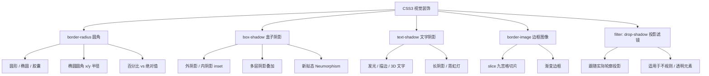
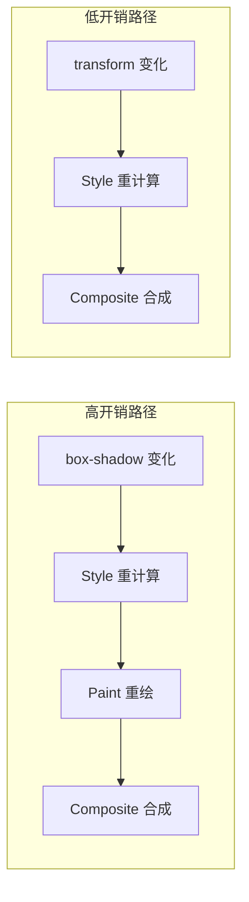

# 圆角与阴影

## 背景与动机

在 CSS3 之前，实现圆角和阴影效果必须依赖图片拼接或多层 DOM 嵌套，开发效率极低且维护困难。CSS3 引入了 `border-radius`、`box-shadow`、`text-shadow` 以及 `border-image` 等原生属性，让开发者能够纯粹用 CSS 创建丰富的视觉效果，大幅减少了对图片资源的依赖。

**为什么需要掌握这些特性？**

- **减少 HTTP 请求**：不再需要下载圆角图片或阴影素材
- **响应式友好**：纯 CSS 效果可随元素尺寸自适应缩放
- **交互灵活**：可配合 `transition` / `animation` 实现动态效果
- **渲染可控**：理解底层渲染管线有助于做出性能友好的选择

### 特性全景图



---

## 核心概念

### 属性速查表

| 属性 | 用途 | 适用元素 | 可动画 |
|------|------|----------|--------|
| `border-radius` | 创建圆角边框 | 块级 / 行内块元素 | ✅ |
| `box-shadow` | 添加盒子阴影 | 块级 / 行内块元素 | ✅ |
| `text-shadow` | 添加文字阴影 | 文本元素 | ✅ |
| `border-image` | 用图像/渐变填充边框 | 块级元素 | ✅（slice 等数值类值） |
| `filter: drop-shadow()` | 跟随实际轮廓投影 | 任意元素 | ✅ |

---

## 深入原理

### border-radius 的几何模型

`border-radius` 的本质是定义一个**四分之一椭圆**来替换元素的直角。每个角由两个半径控制：水平半径（x）和垂直半径（y），默认两者相等形成四分之一圆弧。

```
圆角几何模型：

     水平半径 rx
    ◄──────────►
    ┌───────────╮ ▲
    │            ╲ │ 垂直半径 ry
    │             ╲│ ▼
    │              ╰────
    │
```

**关键规则：**

1. 当同一条边上两个相邻圆角的半径之和超过该边长时，浏览器会按比例缩小各角半径，确保不溢出
2. 斜杠 `/` 前是水平半径，后是垂直半径
3. 百分比值相对于元素**自身尺寸**计算（水平半径相对宽度，垂直半径相对高度）

```css
/* 当圆角值过大时，浏览器自动按比例缩减 */
.box {
  width: 100px;
  height: 50px;
  border-radius: 80px; /* 实际渲染会被缩减，不会溢出 */
}

/* 椭圆圆角：水平 50px，垂直 20px */
.ellipse-corner {
  border-radius: 50px / 20px;
}

/* 完整四值椭圆圆角 */
.complex {
  border-radius: 10px 20px 30px 40px / 5px 10px 15px 20px;
  /* 水平半径：左上10 右上20 右下30 左下40 */
  /* 垂直半径：左上5  右上10 右下15 左下20 */
}
```

### box-shadow 的渲染机制

`box-shadow` 的渲染涉及以下步骤：

1. **扩展阶段**：根据 `spread-radius` 扩大/缩小阴影轮廓
2. **模糊阶段**：对扩展后的轮廓应用高斯模糊（半径 = `blur-radius / 2`）
3. **偏移阶段**：按 `x-offset` 和 `y-offset` 平移阴影
4. **合成阶段**：将阴影层与元素本身按层叠顺序合成

```
box-shadow 渲染管线：

原始矩形 ──► 扩展(spread) ──► 高斯模糊(blur/2) ──► 偏移(offset) ──► 合成
 ┌───┐        ┌─────┐        ╔═════╗              ╔═════╗          ┌───┐
 │   │   ►    │     │   ►    ║     ║    ►        ║     ║   ►      │   │
 └───┘        └─────┘        ╚═════╝              ╚═════╝          ╔═══╗
                                                                   ╚═══╝
                                                                  阴影+元素
```

**性能关键点：**

- 模糊半径越大，GPU 采样范围越大，性能消耗越高
- 多层阴影会叠加渲染成本，每增加一层就多一次模糊计算
- `box-shadow` 仅触发**重绘（Paint）**，不触发重排（Layout）

### border-image 高级用法深度解析

`border-image` 是 CSS3 中最具创意但也最容易被误解的属性之一。它使用 **九宫格切片**（9-slice scaling）机制将一张图像或渐变分割为 9 个区域，分别填充边框的四个角、四条边和中心区域。

#### 九宫格切片原理详解

```
border-image 九宫格切片模型：

源图像（如 90×90px，slice: 30px）

    30px   30px   30px
  ┌──────┬──────┬──────┐ ▲ 30px
  │ 角   │  边  │  角  │
  ├──────┼──────┼──────┤ │ 30px
  │ 边   │ 中心 │  边  │
  ├──────┼──────┼──────┤ │ 30px
  │ 角   │  边  │  角  │
  └──────┴──────┴──────┘

  角 → 不拉伸，原尺寸渲染
  边 → 根据 repeat 平铺方式拉伸/平铺
  中心 → 可选填充（fill 关键字）
```

**关键概念：**

1. **slice 值**：决定从图像边缘向内切割多少像素
2. **repeat 方式**：控制边缘如何填充（stretch/repeat/round/space）
3. **fill 关键字**：是否保留中心区域

#### 完整的 border-image 语法

```css
/* 完整语法 */
border-image: source slice width outset repeat;

/* 示例 */
.border-image-full {
  border: 20px solid;
  border-image: 
    url('border.png')    /* source: 图像源 */
    30                   /* slice: 切片位置 */
    20px                 /* width: 边框宽度 */
    10px                 /* outset: 向外扩展 */
    round;               /* repeat: 平铺方式 */
}
```

#### 实际应用场景

**1. 渐变边框（最常用）**

```css
/* 线性渐变边框 */
.gradient-border {
  border: 4px solid;
  border-image: linear-gradient(135deg, #667eea, #764ba2) 1;
}

/* 多色渐变边框 */
.rainbow-border {
  border: 5px solid;
  border-image: linear-gradient(
    90deg, 
    red, orange, yellow, green, blue, indigo, violet
  ) 1;
}

/* 径向渐变边框 */
.radial-border {
  border: 10px solid;
  border-image: radial-gradient(circle, #ff6b6b, #4ecdc4) 1;
}
```

**2. 装饰性边框**

```css
/* 使用图片创建装饰边框 */
.ornamental-border {
  border: 30px solid;
  border-image: url('ornament.png') 60 round;
  /* slice=60 表示从图像边缘 60px 处切割 */
  /* round 表示自动缩放以完整显示图案 */
}

/* 复古相框效果 */
.vintage-frame {
  border: 20px solid;
  border-image: url('vintage-frame.png') 40 round;
  padding: 10px;
}
```

**3. 动画渐变边框**

```css
/* 旋转渐变边框：--angle 需先用 @property 注册为 <angle> 才能平滑插值，
   未注册的自定义属性动画只会离散跳变（0deg 与 360deg 外观相同，等于静止） */
@property --angle {
  syntax: '<angle>';
  inherits: false;
  initial-value: 0deg;
}

@keyframes border-rotate {
  to { --angle: 360deg; }
}

.animated-border {
  --angle: 0deg;
  border: 3px solid;
  border-image: linear-gradient(var(--angle), #ff6b6b, #4ecdc4, #667eea) 1;
  animation: border-rotate 3s linear infinite;
}

/* 脉冲边框 */
@keyframes border-pulse {
  0%, 100% { border-image-slice: 30; }
  50% { border-image-slice: 60; }
}

.pulse-border {
  border: 10px solid;
  border-image: linear-gradient(45deg, #ff6b6b, #4ecdc4) 1;
  animation: border-pulse 2s ease-in-out infinite;
}
```

#### slice 切片详解

```css
/* slice 值决定九宫格的切割位置 */
/* 类似 margin 的简写规则 */

border-image-slice: 30;        /* 四边均为 30 */
border-image-slice: 30 20;     /* 上下30, 左右20 */
border-image-slice: 30 20 10;  /* 上30, 左右20, 下10 */
border-image-slice: 30 20 10 5; /* 上右下左各不同 */

/* fill 关键字：保留中心区域 */
border-image-slice: 30 fill;

/* 百分比值：相对于图像尺寸 */
border-image-slice: 25%;       /* 从图像 25% 处切割 */
```

**slice 值的理解：**

- **数值**：表示从图像边缘向内切割的像素数
- **百分比**：表示从图像边缘向内切割的百分比
- **fill**：保留中心区域，否则中心透明

#### repeat 平铺方式对比

| 值 | 效果 | 适用场景 | 示例 |
|----|------|---------|------|
| `stretch` | 拉伸填充（默认） | 渐变边框 | 平滑过渡 |
| `repeat` | 重复平铺（可能截断） | 图案边框 | 可能出现不完整图案 |
| `round` | 重复平铺并自动缩放 | 装饰边框 | 完整显示图案 |
| `space` | 重复平铺并在间隔中留白 | 特殊效果 | 图案间有间隙 |

```css
/* 渐变边框推荐 round 或 stretch */
.gradient-border {
  border: 4px solid;
  border-image: linear-gradient(to right, #ff6b6b, #4ecdc4) 1;
  /* 渐变不需要切片，slice=1 表示从 1px 处切割 */
}

/* 图片边框推荐 round */
.image-border {
  border: 20px solid;
  border-image: url('ornament.png') 60 round;
}

/* 使用 space 创建间隔效果 */
.spaced-border {
  border: 20px solid;
  border-image: url('pattern.png') 40 space;
}
```

#### border-image 与 border-radius 的冲突

**重要限制**：`border-image` 会覆盖 `border-radius` 的效果，两者不能同时使用。

```css
/* ❌ 错误：border-radius 失效 */
.wrong {
  border-radius: 20px;
  border-image: linear-gradient(45deg, #ff6b6b, #4ecdc4) 1;
  /* border-radius 不生效！ */
}

/* ✅ 解决方案：双层嵌套 */
.outer {
  padding: 4px;
  background: linear-gradient(135deg, #667eea, #764ba2);
  border-radius: 20px;
}

.inner {
  background: white;
  border-radius: 16px;
  padding: 20px;
}
```

### 渲染性能影响深度分析

不同阴影/圆角操作在浏览器渲染管线中的开销差异显著：

| 操作 | 渲染阶段 | GPU 加速 | 性能影响 |
|------|----------|----------|----------|
| `border-radius`（静态） | Paint | ✅ 合成层 | 低 |
| `border-radius`（动画） | Paint + Composite | ✅ | 中 |
| `box-shadow`（静态） | Paint | ✅ | 中（blur 越大越高） |
| `box-shadow`（动画） | Paint + Composite | ⚠️ 每帧重绘 | 高 |
| `text-shadow`（多层） | Paint | ⚠️ | 高 |
| `filter: drop-shadow` | Paint + Filter | ✅ | 中高 |
| `backdrop-filter` | Composite（独立通道） | ✅ | 高（需采样背后内容） |

**为什么 `box-shadow` 动画性能差？**

`box-shadow` 的变化（如 hover 时阴影扩大）会触发 **Paint 阶段重新执行**。Paint 是 CPU 密集型操作，浏览器需要重新计算每个像素的颜色值。而 `transform` 和 `opacity` 只触发 **Composite 阶段**，由 GPU 直接处理，性能远优于 Paint。



#### GPU 加速机制详解

现代浏览器对圆角和阴影的渲染采用了不同的优化策略：

**1. 合成层（Compositing Layer）原理**

当元素使用 `border-radius` 或 `box-shadow` 时，浏览器会为其创建独立的合成层：

```
合成层架构：

┌─────────────────────────────────────┐
│           主线程 (CPU)               │
│  ┌─────────┐  ┌─────────┐          │
│  │  Layer 1 │  │  Layer 2 │  ...    │
│  │ (静态)   │  │ (阴影)   │          │
│  └─────────┘  └─────────┘          │
└─────────────────────────────────────┘
              │
              ▼ 栅格化（Rasterize）
┌─────────────────────────────────────┐
│           GPU 线程                   │
│  ┌─────────┐  ┌─────────┐          │
│  │ Texture1 │  │ Texture2 │  ...    │
│  └─────────┘  └─────────┘          │
│              │                       │
│              ▼ 合成（Composite）      │
│         ┌─────────┐                 │
│         │ 最终画面 │                 │
│         └─────────┘                 │
└─────────────────────────────────────┘
```

**2. 圆角的渲染优化**

`border-radius` 的渲染经过高度优化：

- **静态圆角**：仅在首次绘制时计算，后续帧直接复用
- **动画圆角**：如果只改变 `border-radius` 值，会触发重绘
- **配合 transform**：使用 `transform: scale()` 配合圆角可避免重绘

```css
/* ✅ 高性能：使用 transform 缩放 */
.card {
  border-radius: 20px;
  transform: scale(1);
  transition: transform 0.3s;
}

.card:hover {
  transform: scale(1.05); /* 仅触发合成，不重绘 */
}

/* ❌ 低性能：直接改变 border-radius */
.card {
  border-radius: 20px;
  transition: border-radius 0.3s;
}

.card:hover {
  border-radius: 30px; /* 触发重绘 */
}
```

**3. 阴影的渲染开销**

`box-shadow` 的渲染涉及高斯模糊计算，开销与模糊半径成正比：

```
模糊计算复杂度：

blur-radius = 10px  → 采样范围 20×20 像素
blur-radius = 20px  → 采样范围 40×40 像素（4倍开销）
blur-radius = 50px  → 采样范围 100×100 像素（25倍开销）
```

**性能优化策略：**

```css
/* 策略 1：使用伪元素 + opacity 动画 */
.card {
  position: relative;
}

.card::after {
  content: '';
  position: absolute;
  inset: 0;
  border-radius: inherit;
  box-shadow: 0 10px 30px rgba(0, 0, 0, 0.3);
  opacity: 0;
  transition: opacity 0.3s;
  pointer-events: none;
}

.card:hover::after {
  opacity: 1; /* 仅改变 opacity，性能最优 */
}

/* 策略 2：使用 will-change 提示浏览器 */
.animated-shadow {
  will-change: box-shadow;
  transition: box-shadow 0.3s;
}

/* 动画结束后移除 will-change */
.animated-shadow:not(:hover) {
  will-change: auto;
}

/* 策略 3：使用 filter: drop-shadow 替代 */
.drop-shadow-card {
  filter: drop-shadow(0 10px 20px rgba(0, 0, 0, 0.2));
  /* drop-shadow 可以使用 GPU 加速 */
}
```

**4. 多层阴影的性能陷阱**

每增加一层阴影，渲染开销就会叠加：

```css
/* ❌ 性能差：多层阴影 */
.bad {
  box-shadow:
    0 1px 2px rgba(0, 0, 0, 0.1),
    0 4px 8px rgba(0, 0, 0, 0.1),
    0 8px 16px rgba(0, 0, 0, 0.1),
    0 16px 32px rgba(0, 0, 0, 0.1);
  /* 4层阴影 = 4次模糊计算 */
}

/* ✅ 性能好：使用渐变模拟多层阴影 */
.good {
  background: linear-gradient(
    to bottom,
    transparent 0%,
    rgba(0, 0, 0, 0.05) 100%
  );
}
```

**5. 移动端性能优化**

移动设备 GPU 性能有限，需要特别注意：

```css
/* 移动端优化策略 */
@media (max-width: 768px) {
  .card {
    /* 减少模糊半径 */
    box-shadow: 0 2px 8px rgba(0, 0, 0, 0.1);
    /* 而非 0 10px 30px */
    
    /* 使用简单的圆角 */
    border-radius: 8px;
    /* 避免复杂的椭圆圆角 */
  }
  
  /* 禁用大面积阴影 */
  .large-shadow {
    box-shadow: none;
  }
}
```

#### 渲染性能检测工具

使用 Chrome DevTools 检测渲染性能：

```javascript
// 1. 打开 Performance 面板
// 2. 勾选 "Paint flashing"（绘制闪烁）
// 3. 观察页面变化时的绿色闪烁区域

// 4. 使用 Layers 面板查看合成层
// - 打开 More tools > Layers
// - 查看哪些元素创建了独立的层
// - 层过多会导致性能问题

// 5. 使用 Rendering 面板
// - 打开 More tools > Rendering
// - 勾选 "Layer borders" 查看层边界
// - 勾选 "Paint flashing" 查看重绘区域
```

**性能指标参考：**

| 指标 | 优秀 | 良好 | 需优化 |
|------|------|------|--------|
| 帧率（FPS） | 60 | 30-60 | <30 |
| 重绘区域 | <10% | 10-30% | >30% |
| 合成层数量 | <20 | 20-50 | >50 |
| 单帧渲染时间 | <16ms | 16-33ms | >33ms |

---

## 代码示例

### border-radius 圆角

#### 基本语法与多值规则

```css
/* 四值顺序：左上 → 右上 → 右下 → 左下 */
/* ┌─────────────────┐
   │ ① 左上     ② 右上│
   │                 │
   │ ④ 左下     ③ 右下│
   └─────────────────┘ */

border-radius: 10px;              /* 四角相同 */
border-radius: 10px 20px;         /* ①③=10px, ②④=20px */
border-radius: 10px 20px 30px;    /* ①=10, ②④=20, ③=30 */
border-radius: 10px 20px 30px 40px; /* 各不同 */
```

#### 单独控制每个角

```css
border-top-left-radius: 10px;
border-top-right-radius: 20px;
border-bottom-right-radius: 30px;
border-bottom-left-radius: 40px;

/* 椭圆圆角：水平半径 垂直半径 */
border-top-left-radius: 20px 10px;
```

#### 常见形状速查

```css
/* 圆形 */
.circle { width: 100px; height: 100px; border-radius: 50%; }

/* 椭圆 */
.ellipse { width: 200px; height: 100px; border-radius: 50%; }

/* 胶囊形 */
.pill { height: 40px; border-radius: 999px; }

/* 半圆 */
.half-circle { width: 100px; height: 50px; border-radius: 100px 100px 0 0; }

/* 四分之一圆 */
.quarter { width: 50px; height: 50px; border-radius: 0 0 0 50px; }

/* 叶形 */
.leaf { border-radius: 0 100% 0 100%; }

/* 对话框气泡 */
.bubble { border-radius: 20px 20px 20px 0; }
```

#### 百分比 vs 固定值

```css
/* 固定值：精确控制，适合固定尺寸 */
.fixed { width: 200px; height: 100px; border-radius: 10px; }

/* 百分比：响应式，相对自身尺寸 */
.responsive { width: 20%; border-radius: 10%; }

/* 圆形推荐百分比：任何尺寸下都是正圆 */
.circle { width: 100px; height: 100px; border-radius: 50%; }
```


#### border-bottom-left-radius 交互演示（MDN）

设置元素左下角的圆角半径。

```html
<!DOCTYPE html>
<html lang="zh-CN">
  <head>
    <meta charset="UTF-8" />
    <meta name="viewport" content="width=device-width, initial-scale=1.0" />
    <title>border-bottom-left-radius 属性演示 - MDN 示例</title>
    <meta name="description" content="border-bottom-left-radius 属性演示" />
    <style>
      * {
        margin: 0;
        padding: 0;
        box-sizing: border-box;
      }
      body {
        font-family: -apple-system, BlinkMacSystemFont, "Segoe UI", Roboto, "Helvetica Neue", Arial, sans-serif;
        min-height: 100vh;
        padding: 0;
      }
      .demo-layout {
        display: flex;
        height: 100vh;
        gap: 0;
      }
      .snippet-panel {
        width: 320px;
        flex-shrink: 0;
        padding: 16px;
        display: flex;
        flex-direction: column;
        gap: 8px;
        overflow-y: auto;
        border-right: 1px solid #ddd;
        background: #fafafa;
      }
      .snippet-btn {
        padding: 10px 14px;
        border: 1px solid #ccc;
        border-radius: 6px;
        background: #fff;
        font-family: "JetBrains Mono", "Fira Code", monospace;
        font-size: 13px;
        color: #333;
        cursor: pointer;
        text-align: left;
        transition: all 0.2s;
        line-height: 1.4;
      }
      .snippet-btn:hover {
        border-color: #8083ff;
        background: #f0f0ff;
      }
      .snippet-btn.active {
        border-color: #8083ff;
        background: #e8e8ff;
        color: #571bc1;
        font-weight: 600;
      }
      .preview-panel {
        flex: 1;
        padding: 16px;
        display: flex;
        align-items: center;
        justify-content: center;
        background: #fff;
        overflow: auto;
      }
      .preview-panel > section,
      .preview-panel > div:not(.snippet-panel):not(.demo-layout) {
        flex: 1;
        width: 100%;
        min-height: 0;
        height: 100%;
        display: flex;
        align-items: center;
        justify-content: center;
      }
      #example-element {
        width: 80%;
        height: 80%;
        display: flex;
        justify-content: center;
        flex-direction: column;
        background-color: #5b6dcd;
        color: white;
        padding: 10px;
      }
    </style>
  </head>
  <body>
    <div class="demo-layout">
      <div class="snippet-panel">
        <button class="snippet-btn active" data-index="0">border-bottom-left-radius: 80px 80px;</button>
        <button class="snippet-btn" data-index="1">border-bottom-left-radius: 250px 100px;</button>
        <button class="snippet-btn" data-index="2">border-bottom-left-radius: 50%;</button>
        <button class="snippet-btn" data-index="3">border-bottom-left-radius: 50%;</button>
      </div>
      <div class="preview-panel">
        <section class="default-example" id="default-example">
          <div class="transition-all" id="example-element">这是一个左下角带有圆角的盒子。</div>
        </section>
      </div>
    </div>
    <script>
      const snippets = [
        `#example-element {
  border-bottom-left-radius: 80px 80px;
}`,
        `#example-element {
  border-bottom-left-radius: 250px 100px;
}`,
        `#example-element {
  border-bottom-left-radius: 50%;
}`,
        `#example-element {
  border-bottom-left-radius: 50%;
border: black 10px double;
background-clip: content-box;
}`,
      ];

      let styleEl = document.createElement("style");
      document.head.appendChild(styleEl);

      function applySnippet(index) {
        styleEl.textContent = snippets[index];
        document.querySelectorAll(".snippet-btn").forEach((btn, i) => {
          btn.classList.toggle("active", i === index);
        });
      }

      document.querySelectorAll(".snippet-btn").forEach((btn) => {
        btn.addEventListener("click", () => applySnippet(parseInt(btn.dataset.index)));
      });

      applySnippet(0);
    </script>
  </body>
</html>

```

#### border-end-end-radius 交互演示（MDN）

逻辑属性：设置块末方向和行末方向交界处的圆角。

```html
<!DOCTYPE html>
<html lang="zh-CN">
  <head>
    <meta charset="UTF-8" />
    <meta name="viewport" content="width=device-width, initial-scale=1.0" />
    <title>border-end-end-radius 属性演示 - MDN 示例</title>
    <meta name="description" content="border-end-end-radius 属性演示" />
    <style>
      * {
        margin: 0;
        padding: 0;
        box-sizing: border-box;
      }
      body {
        font-family: -apple-system, BlinkMacSystemFont, "Segoe UI", Roboto, "Helvetica Neue", Arial, sans-serif;
        min-height: 100vh;
        padding: 0;
      }
      .demo-layout {
        display: flex;
        height: 100vh;
        gap: 0;
      }
      .snippet-panel {
        width: 320px;
        flex-shrink: 0;
        padding: 16px;
        display: flex;
        flex-direction: column;
        gap: 8px;
        overflow-y: auto;
        border-right: 1px solid #ddd;
        background: #fafafa;
      }
      .snippet-btn {
        padding: 10px 14px;
        border: 1px solid #ccc;
        border-radius: 6px;
        background: #fff;
        font-family: "JetBrains Mono", "Fira Code", monospace;
        font-size: 13px;
        color: #333;
        cursor: pointer;
        text-align: left;
        transition: all 0.2s;
        line-height: 1.4;
      }
      .snippet-btn:hover {
        border-color: #8083ff;
        background: #f0f0ff;
      }
      .snippet-btn.active {
        border-color: #8083ff;
        background: #e8e8ff;
        color: #571bc1;
        font-weight: 600;
      }
      .preview-panel {
        flex: 1;
        padding: 16px;
        display: flex;
        align-items: center;
        justify-content: center;
        background: #fff;
        overflow: auto;
      }
      .preview-panel > section,
      .preview-panel > div:not(.snippet-panel):not(.demo-layout) {
        flex: 1;
        width: 100%;
        min-height: 0;
        height: 100%;
        display: flex;
        align-items: center;
        justify-content: center;
      }
      #example-element {
        width: 80%;
        height: 80%;
        display: flex;
        justify-content: center;
        flex-direction: column;
        background-color: #5b6dcd;
        color: white;
        padding: 10px;
      }
    </style>
  </head>
  <body>
    <div class="demo-layout">
      <div class="snippet-panel">
        <button class="snippet-btn active" data-index="0">border-end-end-radius: 80px 80px;</button>
        <button class="snippet-btn" data-index="1">border-end-end-radius: 250px 100px;</button>
        <button class="snippet-btn" data-index="2">border-end-end-radius: 50%;</button>
        <button class="snippet-btn" data-index="3">border-end-end-radius: 50%;</button>
      </div>
      <div class="preview-panel">
        <section class="default-example" id="default-example">
          <div class="transition-all" id="example-element">This is a box with a bottom right rounded corner.</div>
        </section>
      </div>
    </div>
    <script>
      const snippets = [
        `#example-element {
  border-end-end-radius: 80px 80px;
}`,
        `#example-element {
  border-end-end-radius: 250px 100px;
direction: rtl;
}`,
        `#example-element {
  border-end-end-radius: 50%;
writing-mode: vertical-lr;
}`,
        `#example-element {
  border-end-end-radius: 50%;
writing-mode: vertical-rl;
}`,
      ];

      let styleEl = document.createElement("style");
      document.head.appendChild(styleEl);

      function applySnippet(index) {
        styleEl.textContent = snippets[index];
        document.querySelectorAll(".snippet-btn").forEach((btn, i) => {
          btn.classList.toggle("active", i === index);
        });
      }

      document.querySelectorAll(".snippet-btn").forEach((btn) => {
        btn.addEventListener("click", () => applySnippet(parseInt(btn.dataset.index)));
      });

      applySnippet(0);
    </script>
  </body>
</html>

```

#### border-end-start-radius 交互演示（MDN）

逻辑属性：设置块末方向和行首方向交界处的圆角。

```html
<!DOCTYPE html>
<html lang="zh-CN">
  <head>
    <meta charset="UTF-8" />
    <meta name="viewport" content="width=device-width, initial-scale=1.0" />
    <title>border-end-start-radius 属性演示 - MDN 示例</title>
    <meta name="description" content="border-end-start-radius 属性演示" />
    <style>
      * {
        margin: 0;
        padding: 0;
        box-sizing: border-box;
      }
      body {
        font-family: -apple-system, BlinkMacSystemFont, "Segoe UI", Roboto, "Helvetica Neue", Arial, sans-serif;
        min-height: 100vh;
        padding: 0;
      }
      .demo-layout {
        display: flex;
        height: 100vh;
        gap: 0;
      }
      .snippet-panel {
        width: 320px;
        flex-shrink: 0;
        padding: 16px;
        display: flex;
        flex-direction: column;
        gap: 8px;
        overflow-y: auto;
        border-right: 1px solid #ddd;
        background: #fafafa;
      }
      .snippet-btn {
        padding: 10px 14px;
        border: 1px solid #ccc;
        border-radius: 6px;
        background: #fff;
        font-family: "JetBrains Mono", "Fira Code", monospace;
        font-size: 13px;
        color: #333;
        cursor: pointer;
        text-align: left;
        transition: all 0.2s;
        line-height: 1.4;
      }
      .snippet-btn:hover {
        border-color: #8083ff;
        background: #f0f0ff;
      }
      .snippet-btn.active {
        border-color: #8083ff;
        background: #e8e8ff;
        color: #571bc1;
        font-weight: 600;
      }
      .preview-panel {
        flex: 1;
        padding: 16px;
        display: flex;
        align-items: center;
        justify-content: center;
        background: #fff;
        overflow: auto;
      }
      .preview-panel > section,
      .preview-panel > div:not(.snippet-panel):not(.demo-layout) {
        flex: 1;
        width: 100%;
        min-height: 0;
        height: 100%;
        display: flex;
        align-items: center;
        justify-content: center;
      }
      #example-element {
        width: 80%;
        height: 80%;
        display: flex;
        justify-content: center;
        flex-direction: column;
        background-color: #5b6dcd;
        color: white;
        padding: 10px;
      }
    </style>
  </head>
  <body>
    <div class="demo-layout">
      <div class="snippet-panel">
        <button class="snippet-btn active" data-index="0">border-end-start-radius: 80px 80px;</button>
        <button class="snippet-btn" data-index="1">border-end-start-radius: 250px 100px;</button>
        <button class="snippet-btn" data-index="2">border-end-start-radius: 50%;</button>
        <button class="snippet-btn" data-index="3">border-end-start-radius: 50%;</button>
      </div>
      <div class="preview-panel">
        <section class="default-example" id="default-example">
          <div class="transition-all" id="example-element">This is a box with a bottom left rounded corner.</div>
        </section>
      </div>
    </div>
    <script>
      const snippets = [
        `#example-element {
  border-end-start-radius: 80px 80px;
}`,
        `#example-element {
  border-end-start-radius: 250px 100px;
direction: rtl;
}`,
        `#example-element {
  border-end-start-radius: 50%;
writing-mode: vertical-lr;
}`,
        `#example-element {
  border-end-start-radius: 50%;
writing-mode: vertical-rl;
}`,
      ];

      let styleEl = document.createElement("style");
      document.head.appendChild(styleEl);

      function applySnippet(index) {
        styleEl.textContent = snippets[index];
        document.querySelectorAll(".snippet-btn").forEach((btn, i) => {
          btn.classList.toggle("active", i === index);
        });
      }

      document.querySelectorAll(".snippet-btn").forEach((btn) => {
        btn.addEventListener("click", () => applySnippet(parseInt(btn.dataset.index)));
      });

      applySnippet(0);
    </script>
  </body>
</html>

```

#### border-start-end-radius 交互演示（MDN）

逻辑属性：设置块首方向和行末方向交界处的圆角。

```html
<!DOCTYPE html>
<html lang="zh-CN">
  <head>
    <meta charset="UTF-8" />
    <meta name="viewport" content="width=device-width, initial-scale=1.0" />
    <title>border-start-end-radius 属性演示 - MDN 示例</title>
    <meta name="description" content="border-start-end-radius 属性演示" />
    <style>
      * {
        margin: 0;
        padding: 0;
        box-sizing: border-box;
      }
      body {
        font-family: -apple-system, BlinkMacSystemFont, "Segoe UI", Roboto, "Helvetica Neue", Arial, sans-serif;
        min-height: 100vh;
        padding: 0;
      }
      .demo-layout {
        display: flex;
        height: 100vh;
        gap: 0;
      }
      .snippet-panel {
        width: 320px;
        flex-shrink: 0;
        padding: 16px;
        display: flex;
        flex-direction: column;
        gap: 8px;
        overflow-y: auto;
        border-right: 1px solid #ddd;
        background: #fafafa;
      }
      .snippet-btn {
        padding: 10px 14px;
        border: 1px solid #ccc;
        border-radius: 6px;
        background: #fff;
        font-family: "JetBrains Mono", "Fira Code", monospace;
        font-size: 13px;
        color: #333;
        cursor: pointer;
        text-align: left;
        transition: all 0.2s;
        line-height: 1.4;
      }
      .snippet-btn:hover {
        border-color: #8083ff;
        background: #f0f0ff;
      }
      .snippet-btn.active {
        border-color: #8083ff;
        background: #e8e8ff;
        color: #571bc1;
        font-weight: 600;
      }
      .preview-panel {
        flex: 1;
        padding: 16px;
        display: flex;
        align-items: center;
        justify-content: center;
        background: #fff;
        overflow: auto;
      }
      .preview-panel > section,
      .preview-panel > div:not(.snippet-panel):not(.demo-layout) {
        flex: 1;
        width: 100%;
        min-height: 0;
        height: 100%;
        display: flex;
        align-items: center;
        justify-content: center;
      }
      #example-element {
        width: 80%;
        height: 80%;
        display: flex;
        justify-content: center;
        flex-direction: column;
        background-color: #5b6dcd;
        color: white;
        padding: 10px;
      }
    </style>
  </head>
  <body>
    <div class="demo-layout">
      <div class="snippet-panel">
        <button class="snippet-btn active" data-index="0">border-start-end-radius: 80px 80px;</button>
        <button class="snippet-btn" data-index="1">border-start-end-radius: 250px 100px;</button>
        <button class="snippet-btn" data-index="2">border-start-end-radius: 50%;</button>
        <button class="snippet-btn" data-index="3">border-start-end-radius: 50%;</button>
      </div>
      <div class="preview-panel">
        <section class="default-example" id="default-example">
          <div class="transition-all" id="example-element">This is a box with a top right rounded corner.</div>
        </section>
      </div>
    </div>
    <script>
      const snippets = [
        `#example-element {
  border-start-end-radius: 80px 80px;
}`,
        `#example-element {
  border-start-end-radius: 250px 100px;
direction: rtl;
}`,
        `#example-element {
  border-start-end-radius: 50%;
writing-mode: vertical-lr;
}`,
        `#example-element {
  border-start-end-radius: 50%;
writing-mode: vertical-rl;
}`,
      ];

      let styleEl = document.createElement("style");
      document.head.appendChild(styleEl);

      function applySnippet(index) {
        styleEl.textContent = snippets[index];
        document.querySelectorAll(".snippet-btn").forEach((btn, i) => {
          btn.classList.toggle("active", i === index);
        });
      }

      document.querySelectorAll(".snippet-btn").forEach((btn) => {
        btn.addEventListener("click", () => applySnippet(parseInt(btn.dataset.index)));
      });

      applySnippet(0);
    </script>
  </body>
</html>

```

#### border-start-start-radius 交互演示（MDN）

逻辑属性：设置块首方向和行首方向交界处的圆角。

```html
<!DOCTYPE html>
<html lang="zh-CN">
  <head>
    <meta charset="UTF-8" />
    <meta name="viewport" content="width=device-width, initial-scale=1.0" />
    <title>border-start-start-radius 属性演示 - MDN 示例</title>
    <meta name="description" content="border-start-start-radius 属性演示" />
    <style>
      * {
        margin: 0;
        padding: 0;
        box-sizing: border-box;
      }
      body {
        font-family: -apple-system, BlinkMacSystemFont, "Segoe UI", Roboto, "Helvetica Neue", Arial, sans-serif;
        min-height: 100vh;
        padding: 0;
      }
      .demo-layout {
        display: flex;
        height: 100vh;
        gap: 0;
      }
      .snippet-panel {
        width: 320px;
        flex-shrink: 0;
        padding: 16px;
        display: flex;
        flex-direction: column;
        gap: 8px;
        overflow-y: auto;
        border-right: 1px solid #ddd;
        background: #fafafa;
      }
      .snippet-btn {
        padding: 10px 14px;
        border: 1px solid #ccc;
        border-radius: 6px;
        background: #fff;
        font-family: "JetBrains Mono", "Fira Code", monospace;
        font-size: 13px;
        color: #333;
        cursor: pointer;
        text-align: left;
        transition: all 0.2s;
        line-height: 1.4;
      }
      .snippet-btn:hover {
        border-color: #8083ff;
        background: #f0f0ff;
      }
      .snippet-btn.active {
        border-color: #8083ff;
        background: #e8e8ff;
        color: #571bc1;
        font-weight: 600;
      }
      .preview-panel {
        flex: 1;
        padding: 16px;
        display: flex;
        align-items: center;
        justify-content: center;
        background: #fff;
        overflow: auto;
      }
      .preview-panel > section,
      .preview-panel > div:not(.snippet-panel):not(.demo-layout) {
        flex: 1;
        width: 100%;
        min-height: 0;
        height: 100%;
        display: flex;
        align-items: center;
        justify-content: center;
      }
      #example-element {
        width: 80%;
        height: 80%;
        display: flex;
        justify-content: center;
        flex-direction: column;
        background-color: #5b6dcd;
        color: white;
        padding: 10px;
      }
    </style>
  </head>
  <body>
    <div class="demo-layout">
      <div class="snippet-panel">
        <button class="snippet-btn active" data-index="0">border-start-start-radius: 80px 80px;</button>
        <button class="snippet-btn" data-index="1">border-start-start-radius: 250px 100px;</button>
        <button class="snippet-btn" data-index="2">border-start-start-radius: 50%;</button>
        <button class="snippet-btn" data-index="3">border-start-start-radius: 50%;</button>
      </div>
      <div class="preview-panel">
        <section class="default-example" id="default-example">
          <div class="transition-all" id="example-element">This is a box with a top left rounded corner.</div>
        </section>
      </div>
    </div>
    <script>
      const snippets = [
        `#example-element {
  border-start-start-radius: 80px 80px;
}`,
        `#example-element {
  border-start-start-radius: 250px 100px;
direction: rtl;
}`,
        `#example-element {
  border-start-start-radius: 50%;
writing-mode: vertical-lr;
}`,
        `#example-element {
  border-start-start-radius: 50%;
writing-mode: vertical-rl;
}`,
      ];

      let styleEl = document.createElement("style");
      document.head.appendChild(styleEl);

      function applySnippet(index) {
        styleEl.textContent = snippets[index];
        document.querySelectorAll(".snippet-btn").forEach((btn, i) => {
          btn.classList.toggle("active", i === index);
        });
      }

      document.querySelectorAll(".snippet-btn").forEach((btn) => {
        btn.addEventListener("click", () => applySnippet(parseInt(btn.dataset.index)));
      });

      applySnippet(0);
    </script>
  </body>
</html>

```
### box-shadow 盒子阴影

#### 基本语法

```css
/* box-shadow: [inset] x偏移 y偏移 模糊半径 扩展半径 颜色 */

/* 基本外阴影 */
.card { box-shadow: 0 2px 4px rgba(0, 0, 0, 0.1); }

/* 带扩展 */
.extended { box-shadow: 0 2px 4px 2px rgba(0, 0, 0, 0.1); }

/* 纯色偏移（无模糊） */
.hard { box-shadow: 4px 4px 0 #ddd; }

/* 负偏移 */
.negative { box-shadow: -4px -4px 8px rgba(0, 0, 0, 0.2); }

/* 负扩展（缩小阴影范围） */
.tight { box-shadow: 0 0 10px -5px rgba(0, 0, 0, 0.5); }
```

#### 内阴影

```css
/* 基本内阴影 */
.inset { box-shadow: inset 0 2px 4px rgba(0, 0, 0, 0.1); }

/* 凹陷效果 */
.pressed {
  box-shadow:
    inset 2px 2px 5px rgba(0, 0, 0, 0.2),
    inset -2px -2px 5px rgba(255, 255, 255, 0.5);
}

/* 内发光 */
.inner-glow { box-shadow: inset 0 0 20px rgba(255, 200, 0, 0.5); }
```

#### 多层阴影与常见效果

```css
/* 多层阴影叠加（层次感） */
.layered {
  box-shadow:
    0 1px 2px rgba(0, 0, 0, 0.1),
    0 4px 8px rgba(0, 0, 0, 0.1),
    0 8px 16px rgba(0, 0, 0, 0.1);
}

/* 新拟态（Neumorphism） */
.neumorphism {
  background: #e0e0e0;
  box-shadow:
    8px 8px 16px rgba(0, 0, 0, 0.1),
    -8px -8px 16px rgba(255, 255, 255, 0.8);
}

/* 模拟边框 */
.fake-border { box-shadow: 0 0 0 1px #ddd; }

/* 多层边框 */
.multi-border {
  box-shadow:
    0 0 0 1px #ddd,
    0 0 0 3px #fff,
    0 0 0 4px #ddd;
}

/* 聚焦发光 */
.focus-glow:focus {
  box-shadow: 0 0 0 3px rgba(0, 123, 255, 0.25);
  outline: none;
}

/* 单边阴影 */
.bottom-only { box-shadow: 0 4px 8px -2px rgba(0, 0, 0, 0.2); }
.top-only { box-shadow: 0 -4px 8px -2px rgba(0, 0, 0, 0.2); }
```

### text-shadow 文字阴影

```css
/* 基本阴影 */
.basic { text-shadow: 2px 2px 4px rgba(0, 0, 0, 0.3); }

/* 发光文字 */
.glow {
  text-shadow:
    0 0 10px #fff,
    0 0 20px #fff,
    0 0 30px #e60073;
}

/* 3D 文字 */
.text-3d {
  text-shadow:
    1px 1px 0 #ccc,
    2px 2px 0 #c9c9c9,
    3px 3px 0 #bbb,
    4px 4px 0 #b9b9b9,
    5px 5px 0 #aaa;
}

/* 霓虹灯 */
.neon {
  color: #fff;
  text-shadow:
    0 0 5px #fff,
    0 0 10px #fff,
    0 0 20px #ff00de,
    0 0 30px #ff00de,
    0 0 40px #ff00de;
}

/* 描边效果 */
.stroke {
  text-shadow:
    -1px -1px 0 #000,
    1px -1px 0 #000,
    -1px 1px 0 #000,
    1px 1px 0 #000;
}
```

### border-image 高级用法

#### 基本语法

```css
/* border-image: source slice width outset repeat; */

/* 使用图片 */
.fancy-border {
  border: 10px solid;
  border-image: url('border.png') 30 round;
}

/* 使用渐变 */
.gradient-border {
  border: 4px solid;
  border-image: linear-gradient(135deg, #667eea, #764ba2) 1;
}

/* 多色渐变边框 */
.rainbow-border {
  border: 5px solid;
  border-image: linear-gradient(90deg, red, orange, yellow, green, blue, indigo, violet) 1;
}
```

#### slice 切片详解

```css
/* slice 值决定九宫格的切割位置 */
/* 类似 margin 的简写规则 */

border-image-slice: 30;        /* 四边均为 30 */
border-image-slice: 30 20;     /* 上下30, 左右20 */
border-image-slice: 30 20 10;  /* 上30, 左右20, 下10 */
border-image-slice: 30 20 10 5; /* 上右下左各不同 */

/* fill 关键字：保留中心区域 */
border-image-slice: 30 fill;
```

#### repeat 平铺方式

| 值 | 效果 |
|----|------|
| `stretch` | 拉伸填充（默认） |
| `repeat` | 重复平铺（可能截断） |
| `round` | 重复平铺并自动缩放以适应 |
| `space` | 重复平铺并在间隔中留白 |

```css
/* 渐变边框推荐 round 或 stretch */
.gradient-border {
  border: 4px solid;
  border-image: linear-gradient(to right, #ff6b6b, #4ecdc4) 1;
  /* 渐变不需要切片，slice=1 表示从 1px 处切割 */
}

/* 图片边框推荐 round */
.image-border {
  border: 20px solid;
  border-image: url('ornament.png') 60 round;
}
```

#### 渐变边框实战

```css
/* 卡片渐变边框 */
.gradient-card {
  position: relative;
  padding: 2px;
  background: linear-gradient(135deg, #667eea, #764ba2);
  border-radius: 12px;
}

.gradient-card > .content {
  background: white;
  border-radius: 10px;
  padding: 20px;
}

/* 动画渐变边框：--angle 已通过 @property 注册，可平滑插值 */
@property --angle {
  syntax: '<angle>';
  inherits: false;
  initial-value: 0deg;
}

@keyframes border-rotate {
  to { --angle: 360deg; }
}

.animated-border {
  --angle: 0deg;
  border: 3px solid;
  border-image: linear-gradient(var(--angle), #ff6b6b, #4ecdc4, #667eea) 1;
  animation: border-rotate 3s linear infinite;
}
```


#### border-image 交互演示（MDN）

用图片代替 border 样式绘制边框，支持九宫格切片。

```html
<!DOCTYPE html>
<html lang="zh-CN">
  <head>
    <meta charset="UTF-8" />
    <meta name="viewport" content="width=device-width, initial-scale=1.0" />
    <title>border-image 属性演示 - MDN 示例</title>
    <meta name="description" content="border-image 属性演示" />
    <style>
      * {
        margin: 0;
        padding: 0;
        box-sizing: border-box;
      }
      body {
        font-family: -apple-system, BlinkMacSystemFont, "Segoe UI", Roboto, "Helvetica Neue", Arial, sans-serif;
        min-height: 100vh;
        padding: 0;
      }
      .demo-layout {
        display: flex;
        height: 100vh;
        gap: 0;
      }
      .snippet-panel {
        width: 320px;
        flex-shrink: 0;
        padding: 16px;
        display: flex;
        flex-direction: column;
        gap: 8px;
        overflow-y: auto;
        border-right: 1px solid #ddd;
        background: #fafafa;
      }
      .snippet-btn {
        padding: 10px 14px;
        border: 1px solid #ccc;
        border-radius: 6px;
        background: #fff;
        font-family: "JetBrains Mono", "Fira Code", monospace;
        font-size: 13px;
        color: #333;
        cursor: pointer;
        text-align: left;
        transition: all 0.2s;
        line-height: 1.4;
      }
      .snippet-btn:hover {
        border-color: #8083ff;
        background: #f0f0ff;
      }
      .snippet-btn.active {
        border-color: #8083ff;
        background: #e8e8ff;
        color: #571bc1;
        font-weight: 600;
      }
      .preview-panel {
        flex: 1;
        padding: 16px;
        display: flex;
        align-items: center;
        justify-content: center;
        background: #fff;
        overflow: auto;
      }
      .preview-panel > section,
      .preview-panel > div:not(.snippet-panel):not(.demo-layout) {
        flex: 1;
        width: 100%;
        min-height: 0;
        height: 100%;
        display: flex;
        align-items: center;
        justify-content: center;
      }
      #example-element {
        width: 80%;
        height: 80%;
        display: flex;
        align-items: center;
        justify-content: center;
        padding: 50px;
        background: #fff3d4;
        color: #000;
        border: 30px solid;
        border-image: url("data:image/png;base64,iVBORw0KGgoAAAANSUhEUgAAAFoAAABaBAMAAADKhlwxAAAAFVBMVEX////2nTzmZGXu7u72nTzmZGXu7u5STD5TAAAABHRSTlMAoKCgEjok+wAAAT5JREFUeF7tlkGqwjAURaNuwA8uQIQ/FwTnQlcgZAVC9r8EIVx66q0U7sBZOj29p03y3iNFz6V8PH+FZ0339byku+m4Qct/fS7xaXp8oYSr4lJPyKGEq+JST8ihhBWf1cihhHscNXIoYcVRI4cS7nHUyKGEFZcauVOFFZdacqcKE5dacqMKE5dacqMKE+9q5EYVnuNdjdxo9nb2J9Eqsx2MTic7+aiqsoqNuiHrtKiLswmRT598suVT0/Fti/qnD+3qdGNZ9/ZaU98y1A051I4DdUMO9aNGjRzqZYQaOdRLFDVyqJU/asmNWmtJjdyota3UyI3aSJBacqc2bqRGbtRGWVcjN1psTHY1cqPZ29mfRKvMdjA6nezko6rKKjbqhqzToi7OJkQ0fdLJlk/N391jxz123GPHPXbcY8c99g1A7me1IHQX+QAAAABJRU5ErkJggg==")
          30 round;
        font-size: 1.2em;
      }
    </style>
  </head>
  <body>
    <div class="demo-layout">
      <div class="snippet-panel">
        <button class="snippet-btn active" data-index="0">
          border-image:
          url("data:image/png;base64,iVBORw0KGgoAAAANSUhEUgAAAFoAAABaBAMAAADKhlwxAAAAFVBMVEX////2nTzmZGXu7u72nTzmZGXu7u5STD5TAAAABHRSTlMAoKCgEjok+wAAAT5JREFUeF7tlkGqwjAURaNuwA8uQIQ/FwTnQlcgZAVC9r8EIVx66q0U7sBZOj29p03y3iNFz6V8PH+FZ0339byku+m4Qct/fS7xaXp8oYSr4lJPyKGEq+JST8ihhBWf1cihhHscNXIoYcVRI4cS7nHUyKGEFZcauVOFFZdacqcKE5dacqMKE5dacqMKE+9q5EYVnuNdjdxo9nb2J9Eqsx2MTic7+aiqsoqNuiHrtKiLswmRT598suVT0/Fti/qnD+3qdGNZ9/ZaU98y1A051I4DdUMO9aNGjRzqZYQaOdRLFDVyqJU/asmNWmtJjdyota3UyI3aSJBacqc2bqRGbtRGWVcjN1psTHY1cqPZ29mfRKvMdjA6nezko6rKKjbqhqzToi7OJkQ0fdLJlk/N391jxz123GPHPXbcY8c99g1A7me1IHQX+QAAAABJRU5ErkJggg==")
          30;
        </button>
        <button class="snippet-btn" data-index="1">
          border-image:
          url("data:image/png;base64,iVBORw0KGgoAAAANSUhEUgAAAFoAAABaBAMAAADKhlwxAAAAFVBMVEX////2nTzmZGXu7u72nTzmZGXu7u5STD5TAAAABHRSTlMAoKCgEjok+wAAAT5JREFUeF7tlkGqwjAURaNuwA8uQIQ/FwTnQlcgZAVC9r8EIVx66q0U7sBZOj29p03y3iNFz6V8PH+FZ0339byku+m4Qct/fS7xaXp8oYSr4lJPyKGEq+JST8ihhBWf1cihhHscNXIoYcVRI4cS7nHUyKGEFZcauVOFFZdacqcKE5dacqMKE5dacqMKE+9q5EYVnuNdjdxo9nb2J9Eqsx2MTic7+aiqsoqNuiHrtKiLswmRT598suVT0/Fti/qnD+3qdGNZ9/ZaU98y1A051I4DdUMO9aNGjRzqZYQaOdRLFDVyqJU/asmNWmtJjdyota3UyI3aSJBacqc2bqRGbtRGWVcjN1psTHY1cqPZ29mfRKvMdjA6nezko6rKKjbqhqzToi7OJkQ0fdLJlk/N391jxz123GPHPXbcY8c99g1A7me1IHQX+QAAAABJRU5ErkJggg==")
          30 /
        </button>
        <button class="snippet-btn" data-index="2">
          border-image:
          url("data:image/png;base64,iVBORw0KGgoAAAANSUhEUgAAAFoAAABaBAMAAADKhlwxAAAAFVBMVEX////2nTzmZGXu7u72nTzmZGXu7u5STD5TAAAABHRSTlMAoKCgEjok+wAAAT5JREFUeF7tlkGqwjAURaNuwA8uQIQ/FwTnQlcgZAVC9r8EIVx66q0U7sBZOj29p03y3iNFz6V8PH+FZ0339byku+m4Qct/fS7xaXp8oYSr4lJPyKGEq+JST8ihhBWf1cihhHscNXIoYcVRI4cS7nHUyKGEFZcauVOFFZdacqcKE5dacqMKE5dacqMKE+9q5EYVnuNdjdxo9nb2J9Eqsx2MTic7+aiqsoqNuiHrtKiLswmRT598suVT0/Fti/qnD+3qdGNZ9/ZaU98y1A051I4DdUMO9aNGjRzqZYQaOdRLFDVyqJU/asmNWmtJjdyota3UyI3aSJBacqc2bqRGbtRGWVcjN1psTHY1cqPZ29mfRKvMdjA6nezko6rKKjbqhqzToi7OJkQ0fdLJlk/N391jxz123GPHPXbcY8c99g1A7me1IHQX+QAAAABJRU5ErkJggg==")
          30
        </button>
        <button class="snippet-btn" data-index="3">border-image: linear-gradient(#f6b73c, #4d9f0c) 30;</button>
        <button class="snippet-btn" data-index="4">
          border-image: repeating-linear-gradient(30deg, #4d9f0c, #9198e5, #4d9f0c 20px)
        </button>
      </div>
      <div class="preview-panel">
        <section id="default-example">
          <div id="example-element">This is a box with a border around it.</div>
        </section>
      </div>
    </div>
    <script>
      const snippets = [
        `#example-element {
  border-image: url("data:image/png;base64,iVBORw0KGgoAAAANSUhEUgAAAFoAAABaBAMAAADKhlwxAAAAFVBMVEX////2nTzmZGXu7u72nTzmZGXu7u5STD5TAAAABHRSTlMAoKCgEjok+wAAAT5JREFUeF7tlkGqwjAURaNuwA8uQIQ/FwTnQlcgZAVC9r8EIVx66q0U7sBZOj29p03y3iNFz6V8PH+FZ0339byku+m4Qct/fS7xaXp8oYSr4lJPyKGEq+JST8ihhBWf1cihhHscNXIoYcVRI4cS7nHUyKGEFZcauVOFFZdacqcKE5dacqMKE5dacqMKE+9q5EYVnuNdjdxo9nb2J9Eqsx2MTic7+aiqsoqNuiHrtKiLswmRT598suVT0/Fti/qnD+3qdGNZ9/ZaU98y1A051I4DdUMO9aNGjRzqZYQaOdRLFDVyqJU/asmNWmtJjdyota3UyI3aSJBacqc2bqRGbtRGWVcjN1psTHY1cqPZ29mfRKvMdjA6nezko6rKKjbqhqzToi7OJkQ0fdLJlk/N391jxz123GPHPXbcY8c99g1A7me1IHQX+QAAAABJRU5ErkJggg==") 30;
}`,
        `#example-element {
  border-image: url("data:image/png;base64,iVBORw0KGgoAAAANSUhEUgAAAFoAAABaBAMAAADKhlwxAAAAFVBMVEX////2nTzmZGXu7u72nTzmZGXu7u5STD5TAAAABHRSTlMAoKCgEjok+wAAAT5JREFUeF7tlkGqwjAURaNuwA8uQIQ/FwTnQlcgZAVC9r8EIVx66q0U7sBZOj29p03y3iNFz6V8PH+FZ0339byku+m4Qct/fS7xaXp8oYSr4lJPyKGEq+JST8ihhBWf1cihhHscNXIoYcVRI4cS7nHUyKGEFZcauVOFFZdacqcKE5dacqMKE5dacqMKE+9q5EYVnuNdjdxo9nb2J9Eqsx2MTic7+aiqsoqNuiHrtKiLswmRT598suVT0/Fti/qnD+3qdGNZ9/ZaU98y1A051I4DdUMO9aNGjRzqZYQaOdRLFDVyqJU/asmNWmtJjdyota3UyI3aSJBacqc2bqRGbtRGWVcjN1psTHY1cqPZ29mfRKvMdjA6nezko6rKKjbqhqzToi7OJkQ0fdLJlk/N391jxz123GPHPXbcY8c99g1A7me1IHQX+QAAAABJRU5ErkJggg==") 30 /
  19px round;
}`,
        `#example-element {
  border-image: url("data:image/png;base64,iVBORw0KGgoAAAANSUhEUgAAAFoAAABaBAMAAADKhlwxAAAAFVBMVEX////2nTzmZGXu7u72nTzmZGXu7u5STD5TAAAABHRSTlMAoKCgEjok+wAAAT5JREFUeF7tlkGqwjAURaNuwA8uQIQ/FwTnQlcgZAVC9r8EIVx66q0U7sBZOj29p03y3iNFz6V8PH+FZ0339byku+m4Qct/fS7xaXp8oYSr4lJPyKGEq+JST8ihhBWf1cihhHscNXIoYcVRI4cS7nHUyKGEFZcauVOFFZdacqcKE5dacqMKE5dacqMKE+9q5EYVnuNdjdxo9nb2J9Eqsx2MTic7+aiqsoqNuiHrtKiLswmRT598suVT0/Fti/qnD+3qdGNZ9/ZaU98y1A051I4DdUMO9aNGjRzqZYQaOdRLFDVyqJU/asmNWmtJjdyota3UyI3aSJBacqc2bqRGbtRGWVcjN1psTHY1cqPZ29mfRKvMdjA6nezko6rKKjbqhqzToi7OJkQ0fdLJlk/N391jxz123GPHPXbcY8c99g1A7me1IHQX+QAAAABJRU5ErkJggg==") 30
  fill / 30px / 30px space;
}`,
        `#example-element {
  border-image: linear-gradient(#f6b73c, #4d9f0c) 30;
}`,
        `#example-element {
  border-image: repeating-linear-gradient(30deg, #4d9f0c, #9198e5, #4d9f0c 20px)
  60;
}`,
      ];

      let styleEl = document.createElement("style");
      document.head.appendChild(styleEl);

      function applySnippet(index) {
        styleEl.textContent = snippets[index];
        document.querySelectorAll(".snippet-btn").forEach((btn, i) => {
          btn.classList.toggle("active", i === index);
        });
      }

      document.querySelectorAll(".snippet-btn").forEach((btn) => {
        btn.addEventListener("click", () => applySnippet(parseInt(btn.dataset.index)));
      });

      applySnippet(0);
    </script>
  </body>
</html>

```

#### border-image-slice 交互演示（MDN）

定义 border-image 图片的切片尺寸（九宫格划分）。

```html
<!DOCTYPE html>
<html lang="zh-CN">
  <head>
    <meta charset="UTF-8" />
    <meta name="viewport" content="width=device-width, initial-scale=1.0" />
    <title>border-image-slice 属性演示 - MDN 示例</title>
    <meta name="description" content="border-image-slice 属性演示" />
    <style>
      * {
        margin: 0;
        padding: 0;
        box-sizing: border-box;
      }
      body {
        font-family: -apple-system, BlinkMacSystemFont, "Segoe UI", Roboto, "Helvetica Neue", Arial, sans-serif;
        min-height: 100vh;
        padding: 0;
      }
      .demo-layout {
        display: flex;
        height: 100vh;
        gap: 0;
      }
      .snippet-panel {
        width: 320px;
        flex-shrink: 0;
        padding: 16px;
        display: flex;
        flex-direction: column;
        gap: 8px;
        overflow-y: auto;
        border-right: 1px solid #ddd;
        background: #fafafa;
      }
      .snippet-btn {
        padding: 10px 14px;
        border: 1px solid #ccc;
        border-radius: 6px;
        background: #fff;
        font-family: "JetBrains Mono", "Fira Code", monospace;
        font-size: 13px;
        color: #333;
        cursor: pointer;
        text-align: left;
        transition: all 0.2s;
        line-height: 1.4;
      }
      .snippet-btn:hover {
        border-color: #8083ff;
        background: #f0f0ff;
      }
      .snippet-btn.active {
        border-color: #8083ff;
        background: #e8e8ff;
        color: #571bc1;
        font-weight: 600;
      }
      .preview-panel {
        flex: 1;
        padding: 16px;
        display: flex;
        align-items: center;
        justify-content: center;
        background: #fff;
        overflow: auto;
      }
      .preview-panel > section,
      .preview-panel > div:not(.snippet-panel):not(.demo-layout) {
        flex: 1;
        width: 100%;
        min-height: 0;
        height: 100%;
        display: flex;
        align-items: center;
        justify-content: center;
      }
      #example-element {
        width: 80%;
        height: 80%;
        display: flex;
        align-items: center;
        justify-content: center;
        padding: 50px;
        background: #fff3d4;
        color: #000;
        border: 30px solid;
        border-image: url("data:image/png;base64,iVBORw0KGgoAAAANSUhEUgAAAFoAAABaBAMAAADKhlwxAAAAFVBMVEX////2nTzmZGXu7u72nTzmZGXu7u5STD5TAAAABHRSTlMAoKCgEjok+wAAAT5JREFUeF7tlkGqwjAURaNuwA8uQIQ/FwTnQlcgZAVC9r8EIVx66q0U7sBZOj29p03y3iNFz6V8PH+FZ0339byku+m4Qct/fS7xaXp8oYSr4lJPyKGEq+JST8ihhBWf1cihhHscNXIoYcVRI4cS7nHUyKGEFZcauVOFFZdacqcKE5dacqMKE5dacqMKE+9q5EYVnuNdjdxo9nb2J9Eqsx2MTic7+aiqsoqNuiHrtKiLswmRT598suVT0/Fti/qnD+3qdGNZ9/ZaU98y1A051I4DdUMO9aNGjRzqZYQaOdRLFDVyqJU/asmNWmtJjdyota3UyI3aSJBacqc2bqRGbtRGWVcjN1psTHY1cqPZ29mfRKvMdjA6nezko6rKKjbqhqzToi7OJkQ0fdLJlk/N391jxz123GPHPXbcY8c99g1A7me1IHQX+QAAAABJRU5ErkJggg==")
          30 round;
        font-size: 1.2em;
      }
    </style>
  </head>
  <body>
    <div class="demo-layout">
      <div class="snippet-panel">
        <button class="snippet-btn active" data-index="0">border-image-slice: 30;</button>
        <button class="snippet-btn" data-index="1">border-image-slice: 30 fill;</button>
        <button class="snippet-btn" data-index="2">border-image-slice: 44;</button>
        <button class="snippet-btn" data-index="3">
          border-image:
          url("data:image/svg+xml;base64,PHN2ZyB4bWxucz0iaHR0cDovL3d3dy53My5vcmcvMjAwMC9zdmciIHZpZXdCb3g9IjAgMCAyODQgMTg0Ij48ZGVmcz48c3R5bGU+LmF7ZmlsbDojZWVlO30uYntmaWxsOiNlNjY0NjU7fTwvc3R5bGU+PC9kZWZzPjx0aXRsZT5ib3JkZXItZmxvcmlkPC90aXRsZT48cGF0aCBjbGFzcz0iYSIgZD0iTTEzNy40NywxMjEuNzRhMTcuMzgsMTcuMzgsMCwwLDAtLjYyLTVjLTQuMiw0LjQyLTcuMjEsOS4xMy0xMy44NCw5LjcxLTUuNDkuNDgtMTItNC44Ny0xMi40Mi0xMC4zOC0uMzItNC42OSwyLjIyLTkuODcsNS41LTEzLDEuMTktMS4xMiw0LjUyLTIuNCw0LjU5LTQuMjQuMTItMy0xLjQ3LTEuMzktMy0xLjUxLTUuODQtLjQ0LTEyLjI3LS41OS0xMy4yOC03Ljc0LS40OC0zLjQ0LS43LTEwLjksMS45MS0xMy42NCwyLjM0LTIuNDYsOC41Ny0zLjEzLDExLjY0LTIuNDYsMS44NC40MSw3LjU4LDMuNTgsOS4yNSwxLjQ5LDEuMjktMS42Mi0yLjE2LTguMTYtMi4zMi0xMC4zOWExMS42NCwxMS42NCwwLDAsMSwxLTZjMi4xMy00LjY3LDgtNi40NSwxMy4xNS01LjM5YTExLjg1LDExLjg1LDAsMCwxLDguMzcsNi42NGMxLjQxLDIuODguNzIsNi4zOSwyLjExLDkuMTdhMzAuNSwzMC41LDAsMCwwLDIuNjQtMi44MmMxLjY1LTEuNzgsMy4yNC0zLjczLDUuNS00Ljc0LDMuNDktMS41NSw2LS43LDkuMTcuNzksNC42MywyLjIyLDguNzcsNi40Myw3LjczLDEyLjExLS42NSwzLjU0LTYuMjYsMTAuMDktOS44MSwxMSw1Ljg0LDEuNzksMTEuNDksMS4yOCwxNC4zMSw3Ljc2LDEuODUsNC4yNi44OSwxMS0xLjcxLDE0Ljc4LTIsMi44NS01LDUuMi04LjUsNC42Ni0yLjI5LS4zNS0xLjY2LS42OC0zLjUyLTEuNjhzLS4xNy0uNjctMy4yMi0xLjI3YTM1LjY4LDM1LjY4LDAsMCwxLTQuNjYtLjc4Yy4wOSwzLjI0LDQuMyw1LjEsNS40Myw4LDEuODUsNC43NS0yLjI5LDkuMzMtNS45MSwxMS44Ni0zLDIuMDktOC4yNywyLjY3LTEyLDIuMjItMi40Ny0uMy0yLjUyLS41My00LjIyLTIuNUMxMzguMDksMTI1LjM4LDEzNy40NywxMjUuOTIsMTM3LjQ3LDEyMS43NFptLTQuODItMjcuNTFjMi41MiwzLjc4LDQuNjYsNy4yOCw5LjY0LDYuNjksNC41OS0uNTMsNy4zOC0yLjQ3LDcuNzctNy4zMS4zMS0zLjc2LTQuMzUtOC44Ni04LTkuNDFDMTM2Ljg0LDgzLjQzLDEzMy4yOSw4OS45NCwxMzIuNjUsOTQuMjNaIiB0cmFuc2Zvcm09InRyYW5zbGF0ZSgwIDApIi8+PHBhdGggY2xhc3M9ImIiIGQ9Ik01Ni4xNCw0Mi4xOWwuMTktLjhDNTksNDIuNTksNjAuNCw0NS42LDY0LDQ0LjczYzIuNzItLjY3LDQuODYtMy45NCw1LjU2LTYuNDZhMTMuMTQsMTMuMTQsMCwwLDAtMi44LTEyLjQsMTIuNTUsMTIuNTUsMCwwLDAtOS00LjIyYy0yLjg5LS4yMS01LjY4LDAtOC41Ni0uNDQtMS44NS0uMjktNC4xNy0xLjEzLTYtMS4xMy0uMiwwLDIuNzUsNSwyLjk0LDYsLjcyLDMuNjMtMS4zMSw2LjU2LTQuMzMsOC4xNi01LjY0LDMtMTAuMy0uNy0xNC4xLTYuNTFTMTMuNCwxNy43Niw2LjE4LDIwLjc4QzIuMzIsMjIuNC42MywyNy4zOCwyLjQyLDMxLjIyYzEuMTcsMi41MiwxLjM3LDEuOTIsMy45NCwyLjMsMi40LjM2LDMuODcuOTMsMS41MywzQzIuMDUsNDEuNzktLjIyLDMwLjE0LDAsMjYuNTIuMzYsMjEuMjEsMi40MSwxNy4yOSw1LjU4LDEzYzctOS41NSwyMC4zLTE0LjEyLDMxLjY3LTEyLjc3QzQzLC45MSw1NC4wOSw1LjQxLDQ5LjQ0LDEzLjNjLTEuMzQsMi4yOS0zLjY3LDIuMTktNS40NSwzLjYyLTEuNCwxLjE0LTEuNzkuMTguMTksMS4yNyw0LjQxLDIuNDYsMTAuNzQuNTIsMTUuNTMsMSwxLjM1LjE1LDQuODQsMS41Myw1LjEzLDFzLTEuNDEtNC4xLTEuNDktNC43MmMtLjU0LTQsLjU1LTcuODEsMy42Ny0xMC4yNiwxLjU2LTEuMjIsNi42LTMuNDcsNS0uMjktMSwyLTQsMi43LTQuOTQsNS4xNi0zLjUxLDguNjksNC41OSwxMy4zNCw2Ljg2LDIxLC40MSwxLjM5LjQ2LDMsMS4yNSw0LjI4LjUzLjg2LDIuOTQsMi4xLDIuMzYsMy4zcy0yLjY4LDAtMy44Ny40OC0yLjUzLDIuNTYtMy40OCwzLjU1Yy0xLjk0LDItMy43OSwzLjU2LTYuNDksNFM1Ni4xNCw0NS43OCw1Ni4xNCw0Mi4xOVoiIHRyYW5zZm9ybT0idHJhbnNsYXRlKDAgMCkiLz48cGF0aCBjbGFzcz0iYiIgZD0iTTE0Mi41NiwyOC45NGMtNi4yMiwxMi41NC0yNC4yNSwxMS44Mi0zNS43Nyw4LjIxLTMuMTgtMS01LjczLTEuNjYtOC42MS0zLjU3LTIuMTYtMS40Mi01LjUzLTMtNy4zNy00LjcyLTEuMTItMS0xLjIxLTIuNDktMi4xMy0zLjRzLTIuMTItMS4xMy0zLTIuMTNjLTIuMS0yLjUzLTIuNjEtNi4yNC0yLjg0LTkuMzQtLjM0LTQuNjMuMjgtOS4zOCw1LTExLjc4LDUuOTQtMywxMi4zMiwzLjE5LDkuODMsOS4yNS0xLjYxLDMuOTMtOC4xNyw0LjE0LTUuNjItLjM5LjUyLS45MywyLjExLS4yNywyLjY3LTEuNzlhMy42MywzLjYzLDAsMCwwLS43LTIuOTFjLTEuNzEtMi4wNi01LjM5LTEuMzEtNy4xLjMxUzg1LjU4LDEwLDg1LjcsMTIuMTljLjc1LDEyLjYzLDE3LjEzLDIzLjU2LDI5LjE2LDIzLjU2LDAtLjY4LTQuNzUtMy44LTUuMzUtNC41OWE1Miw1MiwwLDAsMS00LjY3LTcuNDJjLTEuOTQtMy44MS0yLjM1LTEwLjg1LTEuMjEtMTUsMS4xOS00LjMyLDMuMDUtNy4yMyw3LjgtOC4yNywyLjc2LS42MSw3LjU5LjI2LDguNzMsMy40MS40OCwxLjMzLjkzLDUuNzguMDYsNi4xNC0xLjYuNjQtMS0uOTEtMS40Mi0xLjM5YTE2LjE2LDE2LjE2LDAsMCwwLTEtMmMtMy40My03Ljg4LTExLjktLjExLTcuNjcsMy44NiwxLjg2LDEuNzYsNC40MiwxLjQ4LDYuNjgsMS44OCwyLjg5LjUxLDQuNzUsMS4wNyw2LjEzLDMuMjcsMiwzLjA5LDEuMjMsNi40MS0xLjEsOS4zLTQsNS05LjEyLjg5LTEzLjA3LTEuNDguMiwyLjQ0LDMuMyw1LjY0LDUsNy4zNiwzLDMuMDYsNi42Myw0LjE3LDEwLjc1LDQuMjdhMTkuMjcsMTkuMjcsMCwwLDAsMTAuNTYtMi42LDExLjMxLDExLjMxLDAsMCwwLDQuNjQtNS42MmMuMzUtLjg1LDItMy45MiwyLTQuNDgtMS44Ni0uMTItMy44NSwyLjktNiwzLjI5YTYuMDYsNi4wNiwwLDAsMS02LjI4LTMuNDRjLTEuNzQtNC4yMS0uNS0xNy4xLDYuMzUtMTIuNjIsMS45MiwxLjI1LDIuODcsNC43MSw0LDEuMzlDMTQxLDcuMTEsMTM1LjgxLDQsMTQxLC44M2MzLjc0LTIuMjksNi44OC40Niw3LjUxLDQuNDQuNTMsMy4zNS0yLDUuNDgtMiw4LjY4LDIuMzUtLjQ5LDMuNC00LjMyLDUuNjktNS4wOXMzLDEuMjIsNC40MSwyLjQ5YzEuNjIsMS40NSwyLjYyLDEuODMsMi42NSwzLjkxLDAtLjQyLS44MiwyLjEzLS44MSwyLjA2LS4yNSwxLjU0LjI1LDMtLjM5LDQuNThhOSw5LDAsMCwxLTEuNTMsMi4zOGMtMy45Miw1LjE2LTcuMTEsMS0xMS42Mi0uNzctMS40MSwyLjExLDEuNSw2LjMxLDIuODksNy42OCwyLjIsMi4xOSw2LDMuMDksOC45NCwzLjgsNi44LDEuNjUsMTIuNzEtLjYyLDE1LjQ4LTdzLTEtMS44NC00LjktMy41MkMxNjMuMjEsMjIuNzMsMTYzLDE4LDE2NiwxNWMxLjQxLTEuMzksMy4zMy0xLjk1LDQuNTItMy40NCwyLjM4LTMsMS4zNi03LjQ4LTIuODYtNy42NS0xLjU2LS4wNi0zLC4zLTMuNjMsMnMuNjksMi4yNS42OSwzLjdjMCwzLjU4LTIuNzQuNzItMy41LTEuNDEtMi4yOC02LjM3LDcuMzQtOC4zNiwxMS40MS02LjVhMTQuNjIsMTQuNjIsMCwwLDEsNy4zLDE5LjA4Yy0xLjM3LDMuMDUtMyw2LjY0LTUuNDIsOS4wNi0xLjIxLDEuMjQtMy4zOCwyLjM1LTQsNC0xLjM4LDMuNzEsMi4zMy45Miw0LjY3LjQsNi4wOC0xLjM2LDkuMjYtMy4yOSwxNC4xNC03LjY5LDMuNzctMy40MSw4LjgxLTguMTMsOS41Mi0xMy4zOXMtNi0xMC4zLTguNzQtNC4xN2MtLjY5LDEuNTYsMS44Miw4LjIyLTIuMzgsNS0zLjg0LTMtMS4xNy05LjE2LDEuOTItMTEuNDYsNS42NS00LjIsMTEuMDgsMy41OSwxMS41Myw4Ljg0LDEsMTEuNDktMTAuNCwxOS4zNi0xOS40OSwyMy42Mi02LjYzLDMuMTEtMTMuNDksNS0yMS4xMSw0LjQzLTQuNDItLjM0LTkuOTMtMi0xMy41Mi00LjY2QzE0Ni4wNSwzNC4wNywxNDIuMzQsMjkuMTUsMTQyLjU2LDI4Ljk0WiIgdHJhbnNmb3JtPSJ0cmFuc2xhdGUoMCAwKSIvPjxwYXRoIGNsYXNzPSJiIiBkPSJNMzkuNDQsNzMuNTNjMSw0LjMzLTIsOS45Mi00LjY2LDEzLjUyLS43MSwxLTUuNjIsNC42Ny01Ljg0LDQuNDVDMzgsOTguNzEsMzkuNTUsMTA1LDM3LjQzLDExNS42N2MtLjE5LDEtLjg1LDMtMS42OCwzLjUyLS41OC4zNy0zLjgsNC43Ni00LjU5LDUuMzZhNTEsNTEsMCwwLDEtNy40Miw0LjY2Yy0zLjgxLDEuOTUtMTAuODUsMi4zNS0xNSwxLjIyLTQuMzItMS4xOS03LjIyLTMuMDUtOC4yNy03LjgtLjYtMi43Ni4yNi03LjU5LDMuNDEtOC43MywxLjMzLS40OSw1Ljc5LS45Myw2LjE0LS4wNi42NCwxLjU5LS45MSwxLTEuMzksMS40MWExOC4xLDE4LjEsMCwwLDAtMiwxYy03Ljg4LDMuNDMtLjExLDExLjksMy44Niw3LjY3LDEuNzYtMS44NiwxLjQ4LTQuNDIsMS44OC02LjY4LjUxLTIuODksMS4wNy00Ljc1LDMuMjctNi4xMywzLjA5LTIsNi40MS0xLjIzLDkuMywxLjEsNSw0LC44OSw5LjEyLTEuNDgsMTMuMDYsMi40NC0uMTksNS42NC0zLjI5LDcuMzYtNSwzLjA2LTMsNC4xNy02LjY0LDQuMjctMTAuNzVBMTkuMjcsMTkuMjcsMCwwLDAsMzIuNTQsOTlhMTEuMjIsMTEuMjIsMCwwLDAtNS42Mi00LjY0Yy0uODUtLjM1LTMuOTItMi00LjQ4LTItLjEyLDEuODcsMi45LDMuODYsMy4yOSw2YTYuMDYsNi4wNiwwLDAsMS0zLjQ0LDYuMjhjLTQuMjEsMS43NC0xNy4xLjUtMTIuNjItNi4zNSwxLjI1LTEuOTIsNC43MS0yLjg3LDEuMzktNEM3LjExLDkzLjA2LDQsOTguMjQuODMsOTMuMDVjLTIuMjktMy43NC40Ni02Ljg5LDQuNDQtNy41MSwzLjM1LS41Myw1LjQ4LDIsOC42OCwyLS40OS0yLjM0LTQuMzItMy40LTUuMDktNS42OHMxLjIyLTMsMi40OS00LjQxYzEuNDUtMS42MiwxLjgzLTIuNjIsMy45MS0yLjY1LS40MiwwLDIuMTMuODIsMi4wNi44MSwxLjU0LjI0LDMtLjI1LDQuNTguMzhhOS4yNiw5LjI2LDAsMCwxLDIuMzgsMS41M2M1LjE3LDMuOTMsMSw3LjEyLS43NywxMS42MywyLjExLDEuNCw2LjMxLTEuNTEsNy42OS0yLjg5LDIuMTgtMi4yLDMuMDgtNiwzLjc5LTguOTUsMS42NS02Ljc5LS42Mi0xMi43LTctMTUuNDdzLTEuODQsMS0zLjUxLDQuOUMyMi43Myw3MC44NSwxOCw3MS4wNiwxNSw2OC4xYy0xLjM5LTEuNDEtMS45NS0zLjM0LTMuNDQtNC41Mi0zLTIuMzgtNy40OC0xLjM2LTcuNjUsMi44NS0uMDYsMS41Ny4zLDMsMiwzLjYzczIuMjUtLjY4LDMuNy0uNjhjMy41OCwwLC43MiwyLjczLTEuNDEsMy41QzEuODQsNzUuMTYtLjE1LDY1LjU0LDEuNzIsNjEuNDdhMTQuNiwxNC42LDAsMCwxLDE5LjA3LTcuM2MzLjA1LDEuMzcsNi42NSwzLDkuMDYsNS40MSwxLjI0LDEuMjIsNS4xMiwzLjU1LDYuNDksNC43MkMzOC41LDY2LjE1LDM4LjgzLDcwLjc1LDM5LjQ0LDczLjUzWiIgdHJhbnNmb3JtPSJ0cmFuc2xhdGUoMCAwKSIvPjxwYXRoIGNsYXNzPSJiIiBkPSJNMzkuMjIsMTEwLjQ3Yy0uOTQtNC4zMywyLTkuOTIsNC42Ni0xMy41Mi43MS0xLDUuNjItNC42Nyw1Ljg0LTQuNDVDNDAuNjYsODUuMjksMzkuMTIsNzksNDEuMjMsNjguMzNjLjE5LTEsLjg2LTMsMS42OC0zLjUyLjU4LS4zNywzLjgtNC43Niw0LjU5LTUuMzZhNTEuNTcsNTEuNTcsMCwwLDEsNy40Mi00LjY2YzMuODEtMS45NSwxMC44NS0yLjM1LDE1LTEuMjIsNC4zMiwxLjE5LDcuMjIsMyw4LjI2LDcuOC42MSwyLjc2LS4yNiw3LjU5LTMuNDEsOC43My0xLjMzLjQ5LTUuNzguOTMtNi4xMy4wNi0uNjUtMS41OS45MS0xLDEuMzgtMS40MWExOC4wOCwxOC4wOCwwLDAsMCwyLTFjNy44Ny0zLjQzLjEtMTEuOS0zLjg3LTcuNjctMS43NiwxLjg2LTEuNDgsNC40Mi0xLjg4LDYuNjgtLjUsMi44OS0xLjA3LDQuNzUtMy4yNiw2LjEzLTMuMSwyLTYuNDIsMS4yMy05LjMxLTEuMS01LTQtLjg4LTkuMTIsMS40OC0xMy4wNi0yLjQzLjE5LTUuNjMsMy4yOS03LjM1LDVhMTQuNzMsMTQuNzMsMCwwLDAtNC4yNywxMC43NUExOS4xOCwxOS4xOCwwLDAsMCw0Ni4xMyw4NWExMS4yNCwxMS4yNCwwLDAsMCw1LjYxLDQuNjRjLjg2LjM1LDMuOTIsMiw0LjQ4LDIsLjEzLTEuODctMi44OS0zLjg2LTMuMjktNmE2LjA2LDYuMDYsMCwwLDEsMy40NS02LjI4YzQuMi0xLjc0LDE3LjA5LS41LDEyLjYxLDYuMzUtMS4yNSwxLjkyLTQuNywyLjg3LTEuMzksNCw0LDEuMjksNy4wNi0zLjg5LDEwLjIzLDEuMywyLjI5LDMuNzQtLjQ2LDYuODktNC40Myw3LjUxLTMuMzUuNTMtNS40OS0yLTguNjktMiwuNDksMi4zNCw0LjMyLDMuNCw1LjA5LDUuNjhzLTEuMjIsMy0yLjQ4LDQuNDFjLTEuNDYsMS42Mi0xLjg0LDIuNjItMy45MSwyLjY1LjQyLDAtMi4xNC0uODItMi4wNy0uODEtMS41NC0uMjQtMywuMjUtNC41OC0uMzhhOSw5LDAsMCwxLTIuMzctMS41M2MtNS4xNy0zLjkzLTEtNy4xMi43Ni0xMS42My0yLjExLTEuNC02LjMsMS41MS03LjY4LDIuODktMi4xOSwyLjItMy4wOSw2LTMuOCw4Ljk1LTEuNjUsNi43OS42MywxMi43LDcsMTUuNDdzMS44NS0xLDMuNTItNC45YzEuNzctNC4xMyw2LjU0LTQuMzQsOS40OC0xLjM4LDEuNCwxLjQxLDIsMy4zNCwzLjQ1LDQuNTIsMywyLjM4LDcuNDcsMS4zNiw3LjY0LTIuODUuMDctMS41Ny0uMy0zLTItMy42M3MtMi4yNS42OC0zLjcxLjY4Yy0zLjU4LDAtLjcxLTIuNzMsMS40MS0zLjUsNi4zOC0yLjI4LDguMzcsNy4zNCw2LjUsMTEuNDFhMTQuNiwxNC42LDAsMCwxLTE5LjA3LDcuM2MtMy4wNi0xLjM3LTYuNjUtMy05LjA3LTUuNDEtMS4yNC0xLjIyLTUuMTEtMy41NS02LjQ4LTQuNzJDNDAuMTcsMTE3Ljg1LDM5LjgzLDExMy4yNSwzOS4yMiwxMTAuNDdaIiB0cmFuc2Zvcm09InRyYW5zbGF0ZSgwIDApIi8+PHBhdGggY2xhc3M9ImIiIGQ9Ik02My43NCwxMzcuMzNjMi43LjQxLDQuNTUsMS45NSw2LjQ5LDQsMSwxLDIuMTYsMywzLjQ4LDMuNTVzMy4yNS0uNzgsMy44Ny40OC0xLjgzLDIuNDQtMi4zNiwzLjNjLS43OSwxLjI4LS44NCwyLjg5LTEuMjUsNC4yOC0yLjI3LDcuNjMtMTAuMzcsMTIuMjgtNi44NiwyMSwxLDIuNDYsMy45MywzLjEzLDQuOTQsNS4xNiwxLjU3LDMuMTgtMy40Ny45My01LS4yOS0zLjEyLTIuNDUtNC4yMS02LjI2LTMuNjctMTAuMjYuMDgtLjYyLDEuNzktNC4yLDEuNDktNC43MnMtMy43OC44OC01LjEzLDFjLTQuNzkuNDktMTEuMTItMS40NS0xNS41MywxLTIsMS4wOS0xLjU5LjEzLS4xOSwxLjI3LDEuNzgsMS40Myw0LjExLDEuMzMsNS40NSwzLjYyLDQuNjUsNy44OS02LjQ4LDEyLjM5LTEyLjE5LDEzLjA3QzI1Ljg4LDE4NS4xMiwxMi42MiwxODAuNTUsNS41OCwxNzEsMi40MSwxNjYuNzEuMzYsMTYyLjc5LDAsMTU3LjQ4Yy0uMjQtMy42MiwyLTE1LjI3LDcuODctMTAsMi4zNCwyLjEuODcsMi42Ny0xLjUzLDMtMi41Ny4zOC0yLjc3LS4yMi0zLjk0LDIuMy0xLjc5LDMuODQtLjEsOC44MiwzLjc2LDEwLjQ0LDcuMjIsMywxNy43LTEsMjEuNTQtNi45czguNDYtOS40NywxNC4xLTYuNTFjMywxLjYsNSw0LjUzLDQuMzMsOC4xNi0uMTksMS0zLjE0LDUuOTUtMi45NCw1Ljk1LDEuNzksMCw0LjExLS44NCw2LTEuMTMsMi44OC0uNDUsNS42Ny0uMjMsOC41Ni0uNDRhMTIuNTUsMTIuNTUsMCwwLDAsOS00LjIyLDEzLjE0LDEzLjE0LDAsMCwwLDIuOC0xMi40Yy0uNy0yLjUyLTIuODQtNS43OS01LjU2LTYuNDYtMy41NS0uODctNC45MywyLjE0LTcuNjIsMy4zNGwtLjE5LS44QzU2LjE0LDEzOC4yMiw2MSwxMzYuOTEsNjMuNzQsMTM3LjMzWiIgdHJhbnNmb3JtPSJ0cmFuc2xhdGUoMCAwKSIvPjxwYXRoIGNsYXNzPSJiIiBkPSJNMjI3Ljg2LDE0MS44MWwtLjE5LjhjLTIuNjktMS4yLTQuMDctNC4yMS03LjYyLTMuMzQtMi43Mi42Ny00Ljg2LDMuOTQtNS41Niw2LjQ2YTEzLjE0LDEzLjE0LDAsMCwwLDIuOCwxMi40LDEyLjU1LDEyLjU1LDAsMCwwLDksNC4yMmMyLjg5LjIxLDUuNjgsMCw4LjU2LjQ0LDEuODUuMjksNC4xNywxLjEzLDYsMS4xMy4yLDAtMi43NS01LTIuOTQtNS45NS0uNzItMy42MywxLjMxLTYuNTYsNC4zMy04LjE2LDUuNjQtMywxMC4zLjcsMTQuMSw2LjUxczE0LjMyLDkuOTIsMjEuNTQsNi45YzMuODYtMS42Miw1LjU1LTYuNiwzLjc2LTEwLjQ0LTEuMTctMi41Mi0xLjM3LTEuOTItMy45NC0yLjMtMi40LS4zNi0zLjg3LS45My0xLjUzLTMsNS44NC01LjI0LDguMTEsNi40MSw3Ljg3LDEwLS4zNCw1LjMxLTIuMzksOS4yMy01LjU2LDEzLjUyLTcsOS41NS0yMC4zLDE0LjEyLTMxLjY3LDEyLjc3LTUuNzEtLjY4LTE2Ljg0LTUuMTgtMTIuMTktMTMuMDcsMS4zNC0yLjI5LDMuNjctMi4xOSw1LjQ1LTMuNjIsMS40LTEuMTQsMS43OS0uMTgtLjE5LTEuMjctNC40MS0yLjQ2LTEwLjc0LS41Mi0xNS41My0xLTEuMzUtLjE1LTQuODQtMS41My01LjEzLTFzMS40MSw0LjEsMS40OSw0LjcyYy41NCw0LS41NSw3LjgxLTMuNjcsMTAuMjYtMS41NiwxLjIyLTYuNiwzLjQ3LTUsLjI5LDEtMiw0LTIuNyw0Ljk0LTUuMTYsMy41MS04LjY5LTQuNTktMTMuMzQtNi44Ni0yMS0uNDEtMS4zOS0uNDYtMy0xLjI1LTQuMjgtLjUzLS44Ni0yLjk0LTIuMS0yLjM2LTMuM3MyLjY4LDAsMy44Ny0uNDgsMi41My0yLjU2LDMuNDgtMy41NWMxLjk0LTIsMy43OS0zLjU2LDYuNDktNFMyMjcuODYsMTM4LjIyLDIyNy44NiwxNDEuODFaIiB0cmFuc2Zvcm09InRyYW5zbGF0ZSgwIDApIi8+PHBhdGggY2xhc3M9ImIiIGQ9Ik0xNDEuNDQsMTU1LjA2YzYuMjItMTIuNTQsMjQuMjUtMTEuODIsMzUuNzctOC4yMSwzLjE4LDEsNS43MywxLjY2LDguNjEsMy41NywyLjE2LDEuNDIsNS41MywzLDcuMzcsNC43MiwxLjEyLDEsMS4yMSwyLjQ5LDIuMTMsMy40czIuMTIsMS4xMywzLDIuMTNjMi4xLDIuNTMsMi42MSw2LjI0LDIuODQsOS4zNC4zNCw0LjYzLS4yOCw5LjM4LTUuMDUsMTEuNzgtNS45NCwzLTEyLjMyLTMuMTktOS44My05LjI1LDEuNjEtMy45Myw4LjE3LTQuMTQsNS42Mi4zOS0uNTIuOTMtMi4xMS4yNy0yLjY3LDEuNzlhMy42MywzLjYzLDAsMCwwLC43LDIuOTFjMS43MSwyLjA2LDUuMzksMS4zMSw3LjEtLjMxczEuNDQtMy4zNiwxLjMyLTUuNTFjLS43NS0xMi42My0xNy4xMy0yMy41Ni0yOS4xNi0yMy41NiwwLC42OCw0Ljc1LDMuOCw1LjM1LDQuNTlhNTIsNTIsMCwwLDEsNC42Nyw3LjQyYzEuOTQsMy44MSwyLjM1LDEwLjg1LDEuMjEsMTUtMS4xOSw0LjMyLTMuMDUsNy4yMy03LjgsOC4yNy0yLjc2LjYxLTcuNTktLjI2LTguNzMtMy40MS0uNDgtMS4zMy0uOTMtNS43OC0uMDYtNi4xNCwxLjYtLjY0LDEsLjkxLDEuNDIsMS4zOWExNi4xNiwxNi4xNiwwLDAsMCwxLDJjMy40Myw3Ljg4LDExLjkuMTEsNy42Ny0zLjg2LTEuODYtMS43Ni00LjQyLTEuNDgtNi42OC0xLjg4LTIuODktLjUxLTQuNzUtMS4wNy02LjEzLTMuMjctMi0zLjA5LTEuMjMtNi40MSwxLjEtOS4zLDQtNSw5LjEyLS44OSwxMy4wNywxLjQ4LS4yLTIuNDQtMy4zLTUuNjQtNS03LjM2LTMtMy4wNi02LjYzLTQuMTctMTAuNzUtNC4yN2ExOS4yNywxOS4yNywwLDAsMC0xMC41NiwyLjYsMTEuMzEsMTEuMzEsMCwwLDAtNC42NCw1LjYyYy0uMzUuODUtMiwzLjkyLTIsNC40OCwxLjg2LjEyLDMuODUtMi45LDYtMy4yOWE2LjA2LDYuMDYsMCwwLDEsNi4yOCwzLjQ0YzEuNzQsNC4yMS41LDE3LjEtNi4zNSwxMi42Mi0xLjkyLTEuMjUtMi44Ny00LjcxLTQtMS4zOS0xLjI5LDMuOTUsMy45LDcuMDYtMS4zLDEwLjIzLTMuNzQsMi4yOS02Ljg4LS40Ni03LjUxLTQuNDQtLjUzLTMuMzUsMi01LjQ4LDItOC42OC0yLjM1LjQ5LTMuNCw0LjMyLTUuNjksNS4wOXMtMy0xLjIyLTQuNDEtMi40OWMtMS42Mi0xLjQ1LTIuNjItMS44My0yLjY1LTMuOTEsMCwuNDIuODItMi4xMy44MS0yLjA2LjI1LTEuNTQtLjI1LTMsLjM5LTQuNThhOSw5LDAsMCwxLDEuNTMtMi4zOGMzLjkyLTUuMTYsNy4xMS0xLDExLjYyLjc3LDEuNDEtMi4xMS0xLjUtNi4zMS0yLjg5LTcuNjgtMi4yLTIuMTktNi0zLjA5LTguOTQtMy44LTYuOC0xLjY1LTEyLjcxLjYyLTE1LjQ4LDdzMSwxLjg0LDQuOSwzLjUyQzEyMC43OSwxNjEuMjcsMTIxLDE2NiwxMTgsMTY5Yy0xLjQxLDEuMzktMy4zMywyLTQuNTIsMy40NC0yLjM4LDMtMS4zNiw3LjQ4LDIuODYsNy42NSwxLjU2LjA2LDMtLjMsMy42My0ycy0uNjktMi4yNS0uNjktMy43YzAtMy41OCwyLjc0LS43MiwzLjUsMS40MSwyLjI4LDYuMzctNy4zNCw4LjM2LTExLjQxLDYuNWExNC42MiwxNC42MiwwLDAsMS03LjMtMTkuMDhjMS4zNy0zLjA1LDMtNi42NCw1LjQyLTkuMDYsMS4yMS0xLjI0LDMuMzgtMi4zNSw0LTQuMDUsMS4zOC0zLjcxLTIuMzMtLjkyLTQuNjctLjQtNi4wOCwxLjM2LTkuMjYsMy4yOS0xNC4xNCw3LjY5LTMuNzcsMy40MS04LjgxLDguMTMtOS41MiwxMy4zOXM2LDEwLjMsOC43NCw0LjE3Yy42OS0xLjU2LTEuODItOC4yMiwyLjM4LTUsMy44NCwzLDEuMTcsOS4xNi0xLjkyLDExLjQ2LTUuNjUsNC4yLTExLjA4LTMuNTktMTEuNTMtOC44NC0xLTExLjQ5LDEwLjQtMTkuMzYsMTkuNDktMjMuNjIsNi42My0zLjExLDEzLjQ5LTUsMjEuMTEtNC40Myw0LjQyLjM0LDkuOTMsMiwxMy41Miw0LjY2QzEzOCwxNDkuOTMsMTQxLjY2LDE1NC44NSwxNDEuNDQsMTU1LjA2WiIgdHJhbnNmb3JtPSJ0cmFuc2xhdGUoMCAwKSIvPjxwYXRoIGNsYXNzPSJiIiBkPSJNMjQ0LjU2LDExMC40N2MtLjk1LTQuMzMsMi05LjkyLDQuNjYtMTMuNTIuNzEtMSw1LjYyLTQuNjcsNS44NC00LjQ1QzI0Niw4NS4yOSwyNDQuNDUsNzksMjQ2LjU3LDY4LjMzYy4xOS0xLC44NS0zLDEuNjgtMy41Mi41OC0uMzcsMy44LTQuNzYsNC41OS01LjM2YTUxLDUxLDAsMCwxLDcuNDItNC42NmMzLjgxLTEuOTUsMTAuODUtMi4zNSwxNS0xLjIyLDQuMzIsMS4xOSw3LjIyLDMsOC4yNyw3LjguNiwyLjc2LS4yNiw3LjU5LTMuNDEsOC43My0xLjMzLjQ5LTUuNzkuOTMtNi4xNC4wNi0uNjQtMS41OS45MS0xLDEuMzktMS40MWExOC4xLDE4LjEsMCwwLDAsMi0xYzcuODgtMy40My4xMS0xMS45LTMuODYtNy42Ny0xLjc2LDEuODYtMS40OCw0LjQyLTEuODgsNi42OC0uNTEsMi44OS0xLjA3LDQuNzUtMy4yNyw2LjEzLTMuMDksMi02LjQxLDEuMjMtOS4zLTEuMS01LTQtLjg5LTkuMTIsMS40OC0xMy4wNi0yLjQ0LjE5LTUuNjQsMy4yOS03LjM2LDUtMy4wNiwzLTQuMTcsNi42NC00LjI3LDEwLjc1QTE5LjI3LDE5LjI3LDAsMCwwLDI1MS40Niw4NWExMS4yMiwxMS4yMiwwLDAsMCw1LjYyLDQuNjRjLjg1LjM1LDMuOTIsMiw0LjQ4LDIsLjEyLTEuODctMi45LTMuODYtMy4yOS02YTYuMDYsNi4wNiwwLDAsMSwzLjQ0LTYuMjhjNC4yMS0xLjc0LDE3LjEtLjUsMTIuNjIsNi4zNS0xLjI1LDEuOTItNC43MSwyLjg3LTEuMzksNCwzLjk1LDEuMjksNy4wNi0zLjg5LDEwLjIzLDEuMywyLjI5LDMuNzQtLjQ2LDYuODktNC40NCw3LjUxLTMuMzUuNTMtNS40OC0yLTguNjgtMiwuNDksMi4zNCw0LjMyLDMuNCw1LjA5LDUuNjhzLTEuMjIsMy0yLjQ5LDQuNDFjLTEuNDUsMS42Mi0xLjgzLDIuNjItMy45MSwyLjY1LjQyLDAtMi4xMy0uODItMi4wNi0uODEtMS41NC0uMjQtMywuMjUtNC41OC0uMzhhOS4yNiw5LjI2LDAsMCwxLTIuMzgtMS41M2MtNS4xNy0zLjkzLTEtNy4xMi43Ny0xMS42My0yLjExLTEuNC02LjMxLDEuNTEtNy42OSwyLjg5LTIuMTgsMi4yLTMuMDgsNi0zLjc5LDguOTUtMS42NSw2Ljc5LjYyLDEyLjcsNywxNS40N3MxLjg0LTEsMy41MS00LjljMS43OC00LjEzLDYuNTQtNC4zNCw5LjQ5LTEuMzgsMS4zOSwxLjQxLDEuOTUsMy4zNCwzLjQ0LDQuNTIsMywyLjM4LDcuNDgsMS4zNiw3LjY1LTIuODUuMDYtMS41Ny0uMy0zLTItMy42M3MtMi4yNS42OC0zLjcuNjhjLTMuNTgsMC0uNzItMi43MywxLjQxLTMuNSw2LjM3LTIuMjgsOC4zNiw3LjM0LDYuNDksMTEuNDFhMTQuNiwxNC42LDAsMCwxLTE5LjA3LDcuM2MtMy0xLjM3LTYuNjUtMy05LjA2LTUuNDEtMS4yNC0xLjIyLTUuMTItMy41NS02LjQ5LTQuNzJDMjQ1LjUsMTE3Ljg1LDI0NS4xNywxMTMuMjUsMjQ0LjU2LDExMC40N1oiIHRyYW5zZm9ybT0idHJhbnNsYXRlKDAgMCkiLz48cGF0aCBjbGFzcz0iYiIgZD0iTTI0NC43OCw3My41M2MuOTQsNC4zMy0yLDkuOTItNC42NiwxMy41Mi0uNzEsMS01LjYyLDQuNjctNS44NCw0LjQ1LDkuMDYsNy4yMSwxMC42LDEzLjUxLDguNDksMjQuMTctLjE5LDEtLjg2LDMtMS42OCwzLjUyLS41OC4zNy0zLjgsNC43Ni00LjU5LDUuMzZhNTEuNTcsNTEuNTcsMCwwLDEtNy40Miw0LjY2Yy0zLjgxLDEuOTUtMTAuODUsMi4zNS0xNSwxLjIyLTQuMzItMS4xOS03LjIyLTMuMDUtOC4yNi03LjgtLjYxLTIuNzYuMjYtNy41OSwzLjQxLTguNzMsMS4zMy0uNDksNS43OC0uOTMsNi4xMy0uMDYuNjUsMS41OS0uOTEsMS0xLjM4LDEuNDFhMTguMDgsMTguMDgsMCwwLDAtMiwxYy03Ljg3LDMuNDMtLjEsMTEuOSwzLjg3LDcuNjcsMS43Ni0xLjg2LDEuNDgtNC40MiwxLjg4LTYuNjguNS0yLjg5LDEuMDctNC43NSwzLjI2LTYuMTMsMy4xLTIsNi40Mi0xLjIzLDkuMzEsMS4xLDQuOTUsNCwuODgsOS4xMi0xLjQ4LDEzLjA2LDIuNDMtLjE5LDUuNjMtMy4yOSw3LjM1LTVhMTQuNzMsMTQuNzMsMCwwLDAsNC4yNy0xMC43NUExOS4xOCwxOS4xOCwwLDAsMCwyMzcuODcsOTlhMTEuMjQsMTEuMjQsMCwwLDAtNS42MS00LjY0Yy0uODYtLjM1LTMuOTItMi00LjQ4LTItLjEzLDEuODcsMi44OSwzLjg2LDMuMjksNmE2LjA2LDYuMDYsMCwwLDEtMy40NSw2LjI4Yy00LjIsMS43NC0xNy4wOS41LTEyLjYxLTYuMzUsMS4yNS0xLjkyLDQuNy0yLjg3LDEuMzktNC00LTEuMjktNy4wNiwzLjg5LTEwLjIzLTEuMy0yLjI5LTMuNzQuNDYtNi44OSw0LjQzLTcuNTEsMy4zNS0uNTMsNS40OSwyLDguNjksMi0uNDktMi4zNC00LjMyLTMuNC01LjA5LTUuNjhzMS4yMi0zLDIuNDgtNC40MWMxLjQ2LTEuNjIsMS44NC0yLjYyLDMuOTEtMi42NS0uNDIsMCwyLjE0LjgyLDIuMDcuODEsMS41NC4yNCwzLS4yNSw0LjU4LjM4YTksOSwwLDAsMSwyLjM3LDEuNTNjNS4xNywzLjkzLDEsNy4xMi0uNzYsMTEuNjMsMi4xMSwxLjQsNi4zLTEuNTEsNy42OC0yLjg5LDIuMTktMi4yLDMuMDktNiwzLjgtOC45NSwxLjY1LTYuNzktLjYzLTEyLjctNy0xNS40N3MtMS44NSwxLTMuNTIsNC45Yy0xLjc3LDQuMTMtNi41NCw0LjM0LTkuNDgsMS4zOC0xLjQtMS40MS0yLTMuMzQtMy40NS00LjUyLTMtMi4zOC03LjQ3LTEuMzYtNy42NCwyLjg1LS4wNywxLjU3LjMsMywyLDMuNjNzMi4yNS0uNjgsMy43MS0uNjhjMy41OCwwLC43MSwyLjczLTEuNDEsMy41LTYuMzgsMi4yOC04LjM3LTcuMzQtNi41LTExLjQxYTE0LjYsMTQuNiwwLDAsMSwxOS4wNy03LjNjMy4wNiwxLjM3LDYuNjUsMyw5LjA3LDUuNDEsMS4yNCwxLjIyLDUuMTEsMy41NSw2LjQ4LDQuNzJDMjQzLjgzLDY2LjE1LDI0NC4xNyw3MC43NSwyNDQuNzgsNzMuNTNaIiB0cmFuc2Zvcm09InRyYW5zbGF0ZSgwIDApIi8+PHBhdGggY2xhc3M9ImIiIGQ9Ik0yMjAuMjYsNDYuNjdjLTIuNy0uNDEtNC41NS0yLTYuNDktNC0xLTEtMi4xNi0zLTMuNDgtMy41NXMtMy4yNS43OC0zLjg3LS40OCwxLjgzLTIuNDQsMi4zNi0zLjNjLjc5LTEuMjguODQtMi44OSwxLjI1LTQuMjgsMi4yNy03LjYzLDEwLjM3LTEyLjI4LDYuODYtMjFDMjE1LjksNy42NiwyMTMsNywyMTIsNWMtMS41Ny0zLjE4LDMuNDctLjkzLDUsLjI5LDMuMTIsMi40NSw0LjIxLDYuMjYsMy42NywxMC4yNi0uMDguNjItMS43OSw0LjItMS40OSw0LjcyczMuNzgtLjg4LDUuMTMtMWM0Ljc5LS40OSwxMS4xMiwxLjQ1LDE1LjUzLTEsMi0xLjA5LDEuNTktLjEzLjE5LTEuMjctMS43OC0xLjQzLTQuMTEtMS4zMy01LjQ1LTMuNjJDMjI5LjkxLDUuNDEsMjQxLC45MSwyNDYuNzUuMjMsMjU4LjEyLTEuMTIsMjcxLjM4LDMuNDUsMjc4LjQyLDEzYzMuMTcsNC4yOSw1LjIyLDguMjEsNS41NiwxMy41Mi4yNCwzLjYyLTIsMTUuMjctNy44NywxMC0yLjM0LTIuMS0uODctMi42NywxLjUzLTMsMi41Ny0uMzgsMi43Ny4yMiwzLjk0LTIuMywxLjc5LTMuODQuMS04LjgyLTMuNzYtMTAuNDQtNy4yMi0zLTE3LjcsMS0yMS41NCw2LjlzLTguNDYsOS40Ny0xNC4xLDYuNTFjLTMtMS42LTUuMDUtNC41My00LjMzLTguMTYuMTktMSwzLjE0LTYsMi45NC02LTEuNzksMC00LjExLjg0LTYsMS4xMy0yLjg4LjQ1LTUuNjcuMjMtOC41Ni40NGExMi41NSwxMi41NSwwLDAsMC05LDQuMjIsMTMuMTQsMTMuMTQsMCwwLDAtMi44LDEyLjRjLjcsMi41MiwyLjg0LDUuNzksNS41Niw2LjQ2LDMuNTUuODcsNC45My0yLjE0LDcuNjItMy4zNGwuMTkuOEMyMjcuODYsNDUuNzgsMjIzLDQ3LjA5LDIyMC4yNiw0Ni42N1oiIHRyYW5zZm9ybT0idHJhbnNsYXRlKDAgMCkiLz48L3N2Zz4K")
          round;
        </button>
      </div>
      <div class="preview-panel">
        <section id="default-example">
          <div id="example-element">This is a box with a border around it.</div>
        </section>
      </div>
    </div>
    <script>
      const snippets = [
        `#example-element {
  border-image-slice: 30;
}`,
        `#example-element {
  border-image-slice: 30 fill;
}`,
        `#example-element {
  border-image-slice: 44;
}`,
        `#example-element {
  border-image: url("data:image/svg+xml;base64,PHN2ZyB4bWxucz0iaHR0cDovL3d3dy53My5vcmcvMjAwMC9zdmciIHZpZXdCb3g9IjAgMCAyODQgMTg0Ij48ZGVmcz48c3R5bGU+LmF7ZmlsbDojZWVlO30uYntmaWxsOiNlNjY0NjU7fTwvc3R5bGU+PC9kZWZzPjx0aXRsZT5ib3JkZXItZmxvcmlkPC90aXRsZT48cGF0aCBjbGFzcz0iYSIgZD0iTTEzNy40NywxMjEuNzRhMTcuMzgsMTcuMzgsMCwwLDAtLjYyLTVjLTQuMiw0LjQyLTcuMjEsOS4xMy0xMy44NCw5LjcxLTUuNDkuNDgtMTItNC44Ny0xMi40Mi0xMC4zOC0uMzItNC42OSwyLjIyLTkuODcsNS41LTEzLDEuMTktMS4xMiw0LjUyLTIuNCw0LjU5LTQuMjQuMTItMy0xLjQ3LTEuMzktMy0xLjUxLTUuODQtLjQ0LTEyLjI3LS41OS0xMy4yOC03Ljc0LS40OC0zLjQ0LS43LTEwLjksMS45MS0xMy42NCwyLjM0LTIuNDYsOC41Ny0zLjEzLDExLjY0LTIuNDYsMS44NC40MSw3LjU4LDMuNTgsOS4yNSwxLjQ5LDEuMjktMS42Mi0yLjE2LTguMTYtMi4zMi0xMC4zOWExMS42NCwxMS42NCwwLDAsMSwxLTZjMi4xMy00LjY3LDgtNi40NSwxMy4xNS01LjM5YTExLjg1LDExLjg1LDAsMCwxLDguMzcsNi42NGMxLjQxLDIuODguNzIsNi4zOSwyLjExLDkuMTdhMzAuNSwzMC41LDAsMCwwLDIuNjQtMi44MmMxLjY1LTEuNzgsMy4yNC0zLjczLDUuNS00Ljc0LDMuNDktMS41NSw2LS43LDkuMTcuNzksNC42MywyLjIyLDguNzcsNi40Myw3LjczLDEyLjExLS42NSwzLjU0LTYuMjYsMTAuMDktOS44MSwxMSw1Ljg0LDEuNzksMTEuNDksMS4yOCwxNC4zMSw3Ljc2LDEuODUsNC4yNi44OSwxMS0xLjcxLDE0Ljc4LTIsMi44NS01LDUuMi04LjUsNC42Ni0yLjI5LS4zNS0xLjY2LS42OC0zLjUyLTEuNjhzLS4xNy0uNjctMy4yMi0xLjI3YTM1LjY4LDM1LjY4LDAsMCwxLTQuNjYtLjc4Yy4wOSwzLjI0LDQuMyw1LjEsNS40Myw4LDEuODUsNC43NS0yLjI5LDkuMzMtNS45MSwxMS44Ni0zLDIuMDktOC4yNywyLjY3LTEyLDIuMjItMi40Ny0uMy0yLjUyLS41My00LjIyLTIuNUMxMzguMDksMTI1LjM4LDEzNy40NywxMjUuOTIsMTM3LjQ3LDEyMS43NFptLTQuODItMjcuNTFjMi41MiwzLjc4LDQuNjYsNy4yOCw5LjY0LDYuNjksNC41OS0uNTMsNy4zOC0yLjQ3LDcuNzctNy4zMS4zMS0zLjc2LTQuMzUtOC44Ni04LTkuNDFDMTM2Ljg0LDgzLjQzLDEzMy4yOSw4OS45NCwxMzIuNjUsOTQuMjNaIiB0cmFuc2Zvcm09InRyYW5zbGF0ZSgwIDApIi8+PHBhdGggY2xhc3M9ImIiIGQ9Ik01Ni4xNCw0Mi4xOWwuMTktLjhDNTksNDIuNTksNjAuNCw0NS42LDY0LDQ0LjczYzIuNzItLjY3LDQuODYtMy45NCw1LjU2LTYuNDZhMTMuMTQsMTMuMTQsMCwwLDAtMi44LTEyLjQsMTIuNTUsMTIuNTUsMCwwLDAtOS00LjIyYy0yLjg5LS4yMS01LjY4LDAtOC41Ni0uNDQtMS44NS0uMjktNC4xNy0xLjEzLTYtMS4xMy0uMiwwLDIuNzUsNSwyLjk0LDYsLjcyLDMuNjMtMS4zMSw2LjU2LTQuMzMsOC4xNi01LjY0LDMtMTAuMy0uNy0xNC4xLTYuNTFTMTMuNCwxNy43Niw2LjE4LDIwLjc4QzIuMzIsMjIuNC42MywyNy4zOCwyLjQyLDMxLjIyYzEuMTcsMi41MiwxLjM3LDEuOTIsMy45NCwyLjMsMi40LjM2LDMuODcuOTMsMS41MywzQzIuMDUsNDEuNzktLjIyLDMwLjE0LDAsMjYuNTIuMzYsMjEuMjEsMi40MSwxNy4yOSw1LjU4LDEzYzctOS41NSwyMC4zLTE0LjEyLDMxLjY3LTEyLjc3QzQzLC45MSw1NC4wOSw1LjQxLDQ5LjQ0LDEzLjNjLTEuMzQsMi4yOS0zLjY3LDIuMTktNS40NSwzLjYyLTEuNCwxLjE0LTEuNzkuMTguMTksMS4yNyw0LjQxLDIuNDYsMTAuNzQuNTIsMTUuNTMsMSwxLjM1LjE1LDQuODQsMS41Myw1LjEzLDFzLTEuNDEtNC4xLTEuNDktNC43MmMtLjU0LTQsLjU1LTcuODEsMy42Ny0xMC4yNiwxLjU2LTEuMjIsNi42LTMuNDcsNS0uMjktMSwyLTQsMi43LTQuOTQsNS4xNi0zLjUxLDguNjksNC41OSwxMy4zNCw2Ljg2LDIxLC40MSwxLjM5LjQ2LDMsMS4yNSw0LjI4LjUzLjg2LDIuOTQsMi4xLDIuMzYsMy4zcy0yLjY4LDAtMy44Ny40OC0yLjUzLDIuNTYtMy40OCwzLjU1Yy0xLjk0LDItMy43OSwzLjU2LTYuNDksNFM1Ni4xNCw0NS43OCw1Ni4xNCw0Mi4xOVoiIHRyYW5zZm9ybT0idHJhbnNsYXRlKDAgMCkiLz48cGF0aCBjbGFzcz0iYiIgZD0iTTE0Mi41NiwyOC45NGMtNi4yMiwxMi41NC0yNC4yNSwxMS44Mi0zNS43Nyw4LjIxLTMuMTgtMS01LjczLTEuNjYtOC42MS0zLjU3LTIuMTYtMS40Mi01LjUzLTMtNy4zNy00LjcyLTEuMTItMS0xLjIxLTIuNDktMi4xMy0zLjRzLTIuMTItMS4xMy0zLTIuMTNjLTIuMS0yLjUzLTIuNjEtNi4yNC0yLjg0LTkuMzQtLjM0LTQuNjMuMjgtOS4zOCw1LTExLjc4LDUuOTQtMywxMi4zMiwzLjE5LDkuODMsOS4yNS0xLjYxLDMuOTMtOC4xNyw0LjE0LTUuNjItLjM5LjUyLS45MywyLjExLS4yNywyLjY3LTEuNzlhMy42MywzLjYzLDAsMCwwLS43LTIuOTFjLTEuNzEtMi4wNi01LjM5LTEuMzEtNy4xLjMxUzg1LjU4LDEwLDg1LjcsMTIuMTljLjc1LDEyLjYzLDE3LjEzLDIzLjU2LDI5LjE2LDIzLjU2LDAtLjY4LTQuNzUtMy44LTUuMzUtNC41OWE1Miw1MiwwLDAsMS00LjY3LTcuNDJjLTEuOTQtMy44MS0yLjM1LTEwLjg1LTEuMjEtMTUsMS4xOS00LjMyLDMuMDUtNy4yMyw3LjgtOC4yNywyLjc2LS42MSw3LjU5LjI2LDguNzMsMy40MS40OCwxLjMzLjkzLDUuNzguMDYsNi4xNC0xLjYuNjQtMS0uOTEtMS40Mi0xLjM5YTE2LjE2LDE2LjE2LDAsMCwwLTEtMmMtMy40My03Ljg4LTExLjktLjExLTcuNjcsMy44NiwxLjg2LDEuNzYsNC40MiwxLjQ4LDYuNjgsMS44OCwyLjg5LjUxLDQuNzUsMS4wNyw2LjEzLDMuMjcsMiwzLjA5LDEuMjMsNi40MS0xLjEsOS4zLTQsNS05LjEyLjg5LTEzLjA3LTEuNDguMiwyLjQ0LDMuMyw1LjY0LDUsNy4zNiwzLDMuMDYsNi42Myw0LjE3LDEwLjc1LDQuMjdhMTkuMjcsMTkuMjcsMCwwLDAsMTAuNTYtMi42LDExLjMxLDExLjMxLDAsMCwwLDQuNjQtNS42MmMuMzUtLjg1LDItMy45MiwyLTQuNDgtMS44Ni0uMTItMy44NSwyLjktNiwzLjI5YTYuMDYsNi4wNiwwLDAsMS02LjI4LTMuNDRjLTEuNzQtNC4yMS0uNS0xNy4xLDYuMzUtMTIuNjIsMS45MiwxLjI1LDIuODcsNC43MSw0LDEuMzlDMTQxLDcuMTEsMTM1LjgxLDQsMTQxLC44M2MzLjc0LTIuMjksNi44OC40Niw3LjUxLDQuNDQuNTMsMy4zNS0yLDUuNDgtMiw4LjY4LDIuMzUtLjQ5LDMuNC00LjMyLDUuNjktNS4wOXMzLDEuMjIsNC40MSwyLjQ5YzEuNjIsMS40NSwyLjYyLDEuODMsMi42NSwzLjkxLDAtLjQyLS44MiwyLjEzLS44MSwyLjA2LS4yNSwxLjU0LjI1LDMtLjM5LDQuNThhOSw5LDAsMCwxLTEuNTMsMi4zOGMtMy45Miw1LjE2LTcuMTEsMS0xMS42Mi0uNzctMS40MSwyLjExLDEuNSw2LjMxLDIuODksNy42OCwyLjIsMi4xOSw2LDMuMDksOC45NCwzLjgsNi44LDEuNjUsMTIuNzEtLjYyLDE1LjQ4LTdzLTEtMS44NC00LjktMy41MkMxNjMuMjEsMjIuNzMsMTYzLDE4LDE2NiwxNWMxLjQxLTEuMzksMy4zMy0xLjk1LDQuNTItMy40NCwyLjM4LTMsMS4zNi03LjQ4LTIuODYtNy42NS0xLjU2LS4wNi0zLC4zLTMuNjMsMnMuNjksMi4yNS42OSwzLjdjMCwzLjU4LTIuNzQuNzItMy41LTEuNDEtMi4yOC02LjM3LDcuMzQtOC4zNiwxMS40MS02LjVhMTQuNjIsMTQuNjIsMCwwLDEsNy4zLDE5LjA4Yy0xLjM3LDMuMDUtMyw2LjY0LTUuNDIsOS4wNi0xLjIxLDEuMjQtMy4zOCwyLjM1LTQsNC0xLjM4LDMuNzEsMi4zMy45Miw0LjY3LjQsNi4wOC0xLjM2LDkuMjYtMy4yOSwxNC4xNC03LjY5LDMuNzctMy40MSw4LjgxLTguMTMsOS41Mi0xMy4zOXMtNi0xMC4zLTguNzQtNC4xN2MtLjY5LDEuNTYsMS44Miw4LjIyLTIuMzgsNS0zLjg0LTMtMS4xNy05LjE2LDEuOTItMTEuNDYsNS42NS00LjIsMTEuMDgsMy41OSwxMS41Myw4Ljg0LDEsMTEuNDktMTAuNCwxOS4zNi0xOS40OSwyMy42Mi02LjYzLDMuMTEtMTMuNDksNS0yMS4xMSw0LjQzLTQuNDItLjM0LTkuOTMtMi0xMy41Mi00LjY2QzE0Ni4wNSwzNC4wNywxNDIuMzQsMjkuMTUsMTQyLjU2LDI4Ljk0WiIgdHJhbnNmb3JtPSJ0cmFuc2xhdGUoMCAwKSIvPjxwYXRoIGNsYXNzPSJiIiBkPSJNMzkuNDQsNzMuNTNjMSw0LjMzLTIsOS45Mi00LjY2LDEzLjUyLS43MSwxLTUuNjIsNC42Ny01Ljg0LDQuNDVDMzgsOTguNzEsMzkuNTUsMTA1LDM3LjQzLDExNS42N2MtLjE5LDEtLjg1LDMtMS42OCwzLjUyLS41OC4zNy0zLjgsNC43Ni00LjU5LDUuMzZhNTEsNTEsMCwwLDEtNy40Miw0LjY2Yy0zLjgxLDEuOTUtMTAuODUsMi4zNS0xNSwxLjIyLTQuMzItMS4xOS03LjIyLTMuMDUtOC4yNy03LjgtLjYtMi43Ni4yNi03LjU5LDMuNDEtOC43MywxLjMzLS40OSw1Ljc5LS45Myw2LjE0LS4wNi42NCwxLjU5LS45MSwxLTEuMzksMS40MWExOC4xLDE4LjEsMCwwLDAtMiwxYy03Ljg4LDMuNDMtLjExLDExLjksMy44Niw3LjY3LDEuNzYtMS44NiwxLjQ4LTQuNDIsMS44OC02LjY4LjUxLTIuODksMS4wNy00Ljc1LDMuMjctNi4xMywzLjA5LTIsNi40MS0xLjIzLDkuMywxLjEsNSw0LC44OSw5LjEyLTEuNDgsMTMuMDYsMi40NC0uMTksNS42NC0zLjI5LDcuMzYtNSwzLjA2LTMsNC4xNy02LjY0LDQuMjctMTAuNzVBMTkuMjcsMTkuMjcsMCwwLDAsMzIuNTQsOTlhMTEuMjIsMTEuMjIsMCwwLDAtNS42Mi00LjY0Yy0uODUtLjM1LTMuOTItMi00LjQ4LTItLjEyLDEuODcsMi45LDMuODYsMy4yOSw2YTYuMDYsNi4wNiwwLDAsMS0zLjQ0LDYuMjhjLTQuMjEsMS43NC0xNy4xLjUtMTIuNjItNi4zNSwxLjI1LTEuOTIsNC43MS0yLjg3LDEuMzktNEM3LjExLDkzLjA2LDQsOTguMjQuODMsOTMuMDVjLTIuMjktMy43NC40Ni02Ljg5LDQuNDQtNy41MSwzLjM1LS41Myw1LjQ4LDIsOC42OCwyLS40OS0yLjM0LTQuMzItMy40LTUuMDktNS42OHMxLjIyLTMsMi40OS00LjQxYzEuNDUtMS42MiwxLjgzLTIuNjIsMy45MS0yLjY1LS40MiwwLDIuMTMuODIsMi4wNi44MSwxLjU0LjI0LDMtLjI1LDQuNTguMzhhOS4yNiw5LjI2LDAsMCwxLDIuMzgsMS41M2M1LjE3LDMuOTMsMSw3LjEyLS43NywxMS42MywyLjExLDEuNCw2LjMxLTEuNTEsNy42OS0yLjg5LDIuMTgtMi4yLDMuMDgtNiwzLjc5LTguOTUsMS42NS02Ljc5LS42Mi0xMi43LTctMTUuNDdzLTEuODQsMS0zLjUxLDQuOUMyMi43Myw3MC44NSwxOCw3MS4wNiwxNSw2OC4xYy0xLjM5LTEuNDEtMS45NS0zLjM0LTMuNDQtNC41Mi0zLTIuMzgtNy40OC0xLjM2LTcuNjUsMi44NS0uMDYsMS41Ny4zLDMsMiwzLjYzczIuMjUtLjY4LDMuNy0uNjhjMy41OCwwLC43MiwyLjczLTEuNDEsMy41QzEuODQsNzUuMTYtLjE1LDY1LjU0LDEuNzIsNjEuNDdhMTQuNiwxNC42LDAsMCwxLDE5LjA3LTcuM2MzLjA1LDEuMzcsNi42NSwzLDkuMDYsNS40MSwxLjI0LDEuMjIsNS4xMiwzLjU1LDYuNDksNC43MkMzOC41LDY2LjE1LDM4LjgzLDcwLjc1LDM5LjQ0LDczLjUzWiIgdHJhbnNmb3JtPSJ0cmFuc2xhdGUoMCAwKSIvPjxwYXRoIGNsYXNzPSJiIiBkPSJNMzkuMjIsMTEwLjQ3Yy0uOTQtNC4zMywyLTkuOTIsNC42Ni0xMy41Mi43MS0xLDUuNjItNC42Nyw1Ljg0LTQuNDVDNDAuNjYsODUuMjksMzkuMTIsNzksNDEuMjMsNjguMzNjLjE5LTEsLjg2LTMsMS42OC0zLjUyLjU4LS4zNywzLjgtNC43Niw0LjU5LTUuMzZhNTEuNTcsNTEuNTcsMCwwLDEsNy40Mi00LjY2YzMuODEtMS45NSwxMC44NS0yLjM1LDE1LTEuMjIsNC4zMiwxLjE5LDcuMjIsMyw4LjI2LDcuOC42MSwyLjc2LS4yNiw3LjU5LTMuNDEsOC43My0xLjMzLjQ5LTUuNzguOTMtNi4xMy4wNi0uNjUtMS41OS45MS0xLDEuMzgtMS40MWExOC4wOCwxOC4wOCwwLDAsMCwyLTFjNy44Ny0zLjQzLjEtMTEuOS0zLjg3LTcuNjctMS43NiwxLjg2LTEuNDgsNC40Mi0xLjg4LDYuNjgtLjUsMi44OS0xLjA3LDQuNzUtMy4yNiw2LjEzLTMuMSwyLTYuNDIsMS4yMy05LjMxLTEuMS01LTQtLjg4LTkuMTIsMS40OC0xMy4wNi0yLjQzLjE5LTUuNjMsMy4yOS03LjM1LDVhMTQuNzMsMTQuNzMsMCwwLDAtNC4yNywxMC43NUExOS4xOCwxOS4xOCwwLDAsMCw0Ni4xMyw4NWExMS4yNCwxMS4yNCwwLDAsMCw1LjYxLDQuNjRjLjg2LjM1LDMuOTIsMiw0LjQ4LDIsLjEzLTEuODctMi44OS0zLjg2LTMuMjktNmE2LjA2LDYuMDYsMCwwLDEsMy40NS02LjI4YzQuMi0xLjc0LDE3LjA5LS41LDEyLjYxLDYuMzUtMS4yNSwxLjkyLTQuNywyLjg3LTEuMzksNCw0LDEuMjksNy4wNi0zLjg5LDEwLjIzLDEuMywyLjI5LDMuNzQtLjQ2LDYuODktNC40Myw3LjUxLTMuMzUuNTMtNS40OS0yLTguNjktMiwuNDksMi4zNCw0LjMyLDMuNCw1LjA5LDUuNjhzLTEuMjIsMy0yLjQ4LDQuNDFjLTEuNDYsMS42Mi0xLjg0LDIuNjItMy45MSwyLjY1LjQyLDAtMi4xNC0uODItMi4wNy0uODEtMS41NC0uMjQtMywuMjUtNC41OC0uMzhhOSw5LDAsMCwxLTIuMzctMS41M2MtNS4xNy0zLjkzLTEtNy4xMi43Ni0xMS42My0yLjExLTEuNC02LjMsMS41MS03LjY4LDIuODktMi4xOSwyLjItMy4wOSw2LTMuOCw4Ljk1LTEuNjUsNi43OS42MywxMi43LDcsMTUuNDdzMS44NS0xLDMuNTItNC45YzEuNzctNC4xMyw2LjU0LTQuMzQsOS40OC0xLjM4LDEuNCwxLjQxLDIsMy4zNCwzLjQ1LDQuNTIsMywyLjM4LDcuNDcsMS4zNiw3LjY0LTIuODUuMDctMS41Ny0uMy0zLTItMy42M3MtMi4yNS42OC0zLjcxLjY4Yy0zLjU4LDAtLjcxLTIuNzMsMS40MS0zLjUsNi4zOC0yLjI4LDguMzcsNy4zNCw2LjUsMTEuNDFhMTQuNiwxNC42LDAsMCwxLTE5LjA3LDcuM2MtMy4wNi0xLjM3LTYuNjUtMy05LjA3LTUuNDEtMS4yNC0xLjIyLTUuMTEtMy41NS02LjQ4LTQuNzJDNDAuMTcsMTE3Ljg1LDM5LjgzLDExMy4yNSwzOS4yMiwxMTAuNDdaIiB0cmFuc2Zvcm09InRyYW5zbGF0ZSgwIDApIi8+PHBhdGggY2xhc3M9ImIiIGQ9Ik02My43NCwxMzcuMzNjMi43LjQxLDQuNTUsMS45NSw2LjQ5LDQsMSwxLDIuMTYsMywzLjQ4LDMuNTVzMy4yNS0uNzgsMy44Ny40OC0xLjgzLDIuNDQtMi4zNiwzLjNjLS43OSwxLjI4LS44NCwyLjg5LTEuMjUsNC4yOC0yLjI3LDcuNjMtMTAuMzcsMTIuMjgtNi44NiwyMSwxLDIuNDYsMy45MywzLjEzLDQuOTQsNS4xNiwxLjU3LDMuMTgtMy40Ny45My01LS4yOS0zLjEyLTIuNDUtNC4yMS02LjI2LTMuNjctMTAuMjYuMDgtLjYyLDEuNzktNC4yLDEuNDktNC43MnMtMy43OC44OC01LjEzLDFjLTQuNzkuNDktMTEuMTItMS40NS0xNS41MywxLTIsMS4wOS0xLjU5LjEzLS4xOSwxLjI3LDEuNzgsMS40Myw0LjExLDEuMzMsNS40NSwzLjYyLDQuNjUsNy44OS02LjQ4LDEyLjM5LTEyLjE5LDEzLjA3QzI1Ljg4LDE4NS4xMiwxMi42MiwxODAuNTUsNS41OCwxNzEsMi40MSwxNjYuNzEuMzYsMTYyLjc5LDAsMTU3LjQ4Yy0uMjQtMy42MiwyLTE1LjI3LDcuODctMTAsMi4zNCwyLjEuODcsMi42Ny0xLjUzLDMtMi41Ny4zOC0yLjc3LS4yMi0zLjk0LDIuMy0xLjc5LDMuODQtLjEsOC44MiwzLjc2LDEwLjQ0LDcuMjIsMywxNy43LTEsMjEuNTQtNi45czguNDYtOS40NywxNC4xLTYuNTFjMywxLjYsNSw0LjUzLDQuMzMsOC4xNi0uMTksMS0zLjE0LDUuOTUtMi45NCw1Ljk1LDEuNzksMCw0LjExLS44NCw2LTEuMTMsMi44OC0uNDUsNS42Ny0uMjMsOC41Ni0uNDRhMTIuNTUsMTIuNTUsMCwwLDAsOS00LjIyLDEzLjE0LDEzLjE0LDAsMCwwLDIuOC0xMi40Yy0uNy0yLjUyLTIuODQtNS43OS01LjU2LTYuNDYtMy41NS0uODctNC45MywyLjE0LTcuNjIsMy4zNGwtLjE5LS44QzU2LjE0LDEzOC4yMiw2MSwxMzYuOTEsNjMuNzQsMTM3LjMzWiIgdHJhbnNmb3JtPSJ0cmFuc2xhdGUoMCAwKSIvPjxwYXRoIGNsYXNzPSJiIiBkPSJNMjI3Ljg2LDE0MS44MWwtLjE5LjhjLTIuNjktMS4yLTQuMDctNC4yMS03LjYyLTMuMzQtMi43Mi42Ny00Ljg2LDMuOTQtNS41Niw2LjQ2YTEzLjE0LDEzLjE0LDAsMCwwLDIuOCwxMi40LDEyLjU1LDEyLjU1LDAsMCwwLDksNC4yMmMyLjg5LjIxLDUuNjgsMCw4LjU2LjQ0LDEuODUuMjksNC4xNywxLjEzLDYsMS4xMy4yLDAtMi43NS01LTIuOTQtNS45NS0uNzItMy42MywxLjMxLTYuNTYsNC4zMy04LjE2LDUuNjQtMywxMC4zLjcsMTQuMSw2LjUxczE0LjMyLDkuOTIsMjEuNTQsNi45YzMuODYtMS42Miw1LjU1LTYuNiwzLjc2LTEwLjQ0LTEuMTctMi41Mi0xLjM3LTEuOTItMy45NC0yLjMtMi40LS4zNi0zLjg3LS45My0xLjUzLTMsNS44NC01LjI0LDguMTEsNi40MSw3Ljg3LDEwLS4zNCw1LjMxLTIuMzksOS4yMy01LjU2LDEzLjUyLTcsOS41NS0yMC4zLDE0LjEyLTMxLjY3LDEyLjc3LTUuNzEtLjY4LTE2Ljg0LTUuMTgtMTIuMTktMTMuMDcsMS4zNC0yLjI5LDMuNjctMi4xOSw1LjQ1LTMuNjIsMS40LTEuMTQsMS43OS0uMTgtLjE5LTEuMjctNC40MS0yLjQ2LTEwLjc0LS41Mi0xNS41My0xLTEuMzUtLjE1LTQuODQtMS41My01LjEzLTFzMS40MSw0LjEsMS40OSw0LjcyYy41NCw0LS41NSw3LjgxLTMuNjcsMTAuMjYtMS41NiwxLjIyLTYuNiwzLjQ3LTUsLjI5LDEtMiw0LTIuNyw0Ljk0LTUuMTYsMy41MS04LjY5LTQuNTktMTMuMzQtNi44Ni0yMS0uNDEtMS4zOS0uNDYtMy0xLjI1LTQuMjgtLjUzLS44Ni0yLjk0LTIuMS0yLjM2LTMuM3MyLjY4LDAsMy44Ny0uNDgsMi41My0yLjU2LDMuNDgtMy41NWMxLjk0LTIsMy43OS0zLjU2LDYuNDktNFMyMjcuODYsMTM4LjIyLDIyNy44NiwxNDEuODFaIiB0cmFuc2Zvcm09InRyYW5zbGF0ZSgwIDApIi8+PHBhdGggY2xhc3M9ImIiIGQ9Ik0xNDEuNDQsMTU1LjA2YzYuMjItMTIuNTQsMjQuMjUtMTEuODIsMzUuNzctOC4yMSwzLjE4LDEsNS43MywxLjY2LDguNjEsMy41NywyLjE2LDEuNDIsNS41MywzLDcuMzcsNC43MiwxLjEyLDEsMS4yMSwyLjQ5LDIuMTMsMy40czIuMTIsMS4xMywzLDIuMTNjMi4xLDIuNTMsMi42MSw2LjI0LDIuODQsOS4zNC4zNCw0LjYzLS4yOCw5LjM4LTUuMDUsMTEuNzgtNS45NCwzLTEyLjMyLTMuMTktOS44My05LjI1LDEuNjEtMy45Myw4LjE3LTQuMTQsNS42Mi4zOS0uNTIuOTMtMi4xMS4yNy0yLjY3LDEuNzlhMy42MywzLjYzLDAsMCwwLC43LDIuOTFjMS43MSwyLjA2LDUuMzksMS4zMSw3LjEtLjMxczEuNDQtMy4zNiwxLjMyLTUuNTFjLS43NS0xMi42My0xNy4xMy0yMy41Ni0yOS4xNi0yMy41NiwwLC42OCw0Ljc1LDMuOCw1LjM1LDQuNTlhNTIsNTIsMCwwLDEsNC42Nyw3LjQyYzEuOTQsMy44MSwyLjM1LDEwLjg1LDEuMjEsMTUtMS4xOSw0LjMyLTMuMDUsNy4yMy03LjgsOC4yNy0yLjc2LjYxLTcuNTktLjI2LTguNzMtMy40MS0uNDgtMS4zMy0uOTMtNS43OC0uMDYtNi4xNCwxLjYtLjY0LDEsLjkxLDEuNDIsMS4zOWExNi4xNiwxNi4xNiwwLDAsMCwxLDJjMy40Myw3Ljg4LDExLjkuMTEsNy42Ny0zLjg2LTEuODYtMS43Ni00LjQyLTEuNDgtNi42OC0xLjg4LTIuODktLjUxLTQuNzUtMS4wNy02LjEzLTMuMjctMi0zLjA5LTEuMjMtNi40MSwxLjEtOS4zLDQtNSw5LjEyLS44OSwxMy4wNywxLjQ4LS4yLTIuNDQtMy4zLTUuNjQtNS03LjM2LTMtMy4wNi02LjYzLTQuMTctMTAuNzUtNC4yN2ExOS4yNywxOS4yNywwLDAsMC0xMC41NiwyLjYsMTEuMzEsMTEuMzEsMCwwLDAtNC42NCw1LjYyYy0uMzUuODUtMiwzLjkyLTIsNC40OCwxLjg2LjEyLDMuODUtMi45LDYtMy4yOWE2LjA2LDYuMDYsMCwwLDEsNi4yOCwzLjQ0YzEuNzQsNC4yMS41LDE3LjEtNi4zNSwxMi42Mi0xLjkyLTEuMjUtMi44Ny00LjcxLTQtMS4zOS0xLjI5LDMuOTUsMy45LDcuMDYtMS4zLDEwLjIzLTMuNzQsMi4yOS02Ljg4LS40Ni03LjUxLTQuNDQtLjUzLTMuMzUsMi01LjQ4LDItOC42OC0yLjM1LjQ5LTMuNCw0LjMyLTUuNjksNS4wOXMtMy0xLjIyLTQuNDEtMi40OWMtMS42Mi0xLjQ1LTIuNjItMS44My0yLjY1LTMuOTEsMCwuNDIuODItMi4xMy44MS0yLjA2LjI1LTEuNTQtLjI1LTMsLjM5LTQuNThhOSw5LDAsMCwxLDEuNTMtMi4zOGMzLjkyLTUuMTYsNy4xMS0xLDExLjYyLjc3LDEuNDEtMi4xMS0xLjUtNi4zMS0yLjg5LTcuNjgtMi4yLTIuMTktNi0zLjA5LTguOTQtMy44LTYuOC0xLjY1LTEyLjcxLjYyLTE1LjQ4LDdzMSwxLjg0LDQuOSwzLjUyQzEyMC43OSwxNjEuMjcsMTIxLDE2NiwxMTgsMTY5Yy0xLjQxLDEuMzktMy4zMywyLTQuNTIsMy40NC0yLjM4LDMtMS4zNiw3LjQ4LDIuODYsNy42NSwxLjU2LjA2LDMtLjMsMy42My0ycy0uNjktMi4yNS0uNjktMy43YzAtMy41OCwyLjc0LS43MiwzLjUsMS40MSwyLjI4LDYuMzctNy4zNCw4LjM2LTExLjQxLDYuNWExNC42MiwxNC42MiwwLDAsMS03LjMtMTkuMDhjMS4zNy0zLjA1LDMtNi42NCw1LjQyLTkuMDYsMS4yMS0xLjI0LDMuMzgtMi4zNSw0LTQuMDUsMS4zOC0zLjcxLTIuMzMtLjkyLTQuNjctLjQtNi4wOCwxLjM2LTkuMjYsMy4yOS0xNC4xNCw3LjY5LTMuNzcsMy40MS04LjgxLDguMTMtOS41MiwxMy4zOXM2LDEwLjMsOC43NCw0LjE3Yy42OS0xLjU2LTEuODItOC4yMiwyLjM4LTUsMy44NCwzLDEuMTcsOS4xNi0xLjkyLDExLjQ2LTUuNjUsNC4yLTExLjA4LTMuNTktMTEuNTMtOC44NC0xLTExLjQ5LDEwLjQtMTkuMzYsMTkuNDktMjMuNjIsNi42My0zLjExLDEzLjQ5LTUsMjEuMTEtNC40Myw0LjQyLjM0LDkuOTMsMiwxMy41Miw0LjY2QzEzOCwxNDkuOTMsMTQxLjY2LDE1NC44NSwxNDEuNDQsMTU1LjA2WiIgdHJhbnNmb3JtPSJ0cmFuc2xhdGUoMCAwKSIvPjxwYXRoIGNsYXNzPSJiIiBkPSJNMjQ0LjU2LDExMC40N2MtLjk1LTQuMzMsMi05LjkyLDQuNjYtMTMuNTIuNzEtMSw1LjYyLTQuNjcsNS44NC00LjQ1QzI0Niw4NS4yOSwyNDQuNDUsNzksMjQ2LjU3LDY4LjMzYy4xOS0xLC44NS0zLDEuNjgtMy41Mi41OC0uMzcsMy44LTQuNzYsNC41OS01LjM2YTUxLDUxLDAsMCwxLDcuNDItNC42NmMzLjgxLTEuOTUsMTAuODUtMi4zNSwxNS0xLjIyLDQuMzIsMS4xOSw3LjIyLDMsOC4yNyw3LjguNiwyLjc2LS4yNiw3LjU5LTMuNDEsOC43My0xLjMzLjQ5LTUuNzkuOTMtNi4xNC4wNi0uNjQtMS41OS45MS0xLDEuMzktMS40MWExOC4xLDE4LjEsMCwwLDAsMi0xYzcuODgtMy40My4xMS0xMS45LTMuODYtNy42Ny0xLjc2LDEuODYtMS40OCw0LjQyLTEuODgsNi42OC0uNTEsMi44OS0xLjA3LDQuNzUtMy4yNyw2LjEzLTMuMDksMi02LjQxLDEuMjMtOS4zLTEuMS01LTQtLjg5LTkuMTIsMS40OC0xMy4wNi0yLjQ0LjE5LTUuNjQsMy4yOS03LjM2LDUtMy4wNiwzLTQuMTcsNi42NC00LjI3LDEwLjc1QTE5LjI3LDE5LjI3LDAsMCwwLDI1MS40Niw4NWExMS4yMiwxMS4yMiwwLDAsMCw1LjYyLDQuNjRjLjg1LjM1LDMuOTIsMiw0LjQ4LDIsLjEyLTEuODctMi45LTMuODYtMy4yOS02YTYuMDYsNi4wNiwwLDAsMSwzLjQ0LTYuMjhjNC4yMS0xLjc0LDE3LjEtLjUsMTIuNjIsNi4zNS0xLjI1LDEuOTItNC43MSwyLjg3LTEuMzksNCwzLjk1LDEuMjksNy4wNi0zLjg5LDEwLjIzLDEuMywyLjI5LDMuNzQtLjQ2LDYuODktNC40NCw3LjUxLTMuMzUuNTMtNS40OC0yLTguNjgtMiwuNDksMi4zNCw0LjMyLDMuNCw1LjA5LDUuNjhzLTEuMjIsMy0yLjQ5LDQuNDFjLTEuNDUsMS42Mi0xLjgzLDIuNjItMy45MSwyLjY1LjQyLDAtMi4xMy0uODItMi4wNi0uODEtMS41NC0uMjQtMywuMjUtNC41OC0uMzhhOS4yNiw5LjI2LDAsMCwxLTIuMzgtMS41M2MtNS4xNy0zLjkzLTEtNy4xMi43Ny0xMS42My0yLjExLTEuNC02LjMxLDEuNTEtNy42OSwyLjg5LTIuMTgsMi4yLTMuMDgsNi0zLjc5LDguOTUtMS42NSw2Ljc5LjYyLDEyLjcsNywxNS40N3MxLjg0LTEsMy41MS00LjljMS43OC00LjEzLDYuNTQtNC4zNCw5LjQ5LTEuMzgsMS4zOSwxLjQxLDEuOTUsMy4zNCwzLjQ0LDQuNTIsMywyLjM4LDcuNDgsMS4zNiw3LjY1LTIuODUuMDYtMS41Ny0uMy0zLTItMy42M3MtMi4yNS42OC0zLjcuNjhjLTMuNTgsMC0uNzItMi43MywxLjQxLTMuNSw2LjM3LTIuMjgsOC4zNiw3LjM0LDYuNDksMTEuNDFhMTQuNiwxNC42LDAsMCwxLTE5LjA3LDcuM2MtMy0xLjM3LTYuNjUtMy05LjA2LTUuNDEtMS4yNC0xLjIyLTUuMTItMy41NS02LjQ5LTQuNzJDMjQ1LjUsMTE3Ljg1LDI0NS4xNywxMTMuMjUsMjQ0LjU2LDExMC40N1oiIHRyYW5zZm9ybT0idHJhbnNsYXRlKDAgMCkiLz48cGF0aCBjbGFzcz0iYiIgZD0iTTI0NC43OCw3My41M2MuOTQsNC4zMy0yLDkuOTItNC42NiwxMy41Mi0uNzEsMS01LjYyLDQuNjctNS44NCw0LjQ1LDkuMDYsNy4yMSwxMC42LDEzLjUxLDguNDksMjQuMTctLjE5LDEtLjg2LDMtMS42OCwzLjUyLS41OC4zNy0zLjgsNC43Ni00LjU5LDUuMzZhNTEuNTcsNTEuNTcsMCwwLDEtNy40Miw0LjY2Yy0zLjgxLDEuOTUtMTAuODUsMi4zNS0xNSwxLjIyLTQuMzItMS4xOS03LjIyLTMuMDUtOC4yNi03LjgtLjYxLTIuNzYuMjYtNy41OSwzLjQxLTguNzMsMS4zMy0uNDksNS43OC0uOTMsNi4xMy0uMDYuNjUsMS41OS0uOTEsMS0xLjM4LDEuNDFhMTguMDgsMTguMDgsMCwwLDAtMiwxYy03Ljg3LDMuNDMtLjEsMTEuOSwzLjg3LDcuNjcsMS43Ni0xLjg2LDEuNDgtNC40MiwxLjg4LTYuNjguNS0yLjg5LDEuMDctNC43NSwzLjI2LTYuMTMsMy4xLTIsNi40Mi0xLjIzLDkuMzEsMS4xLDQuOTUsNCwuODgsOS4xMi0xLjQ4LDEzLjA2LDIuNDMtLjE5LDUuNjMtMy4yOSw3LjM1LTVhMTQuNzMsMTQuNzMsMCwwLDAsNC4yNy0xMC43NUExOS4xOCwxOS4xOCwwLDAsMCwyMzcuODcsOTlhMTEuMjQsMTEuMjQsMCwwLDAtNS42MS00LjY0Yy0uODYtLjM1LTMuOTItMi00LjQ4LTItLjEzLDEuODcsMi44OSwzLjg2LDMuMjksNmE2LjA2LDYuMDYsMCwwLDEtMy40NSw2LjI4Yy00LjIsMS43NC0xNy4wOS41LTEyLjYxLTYuMzUsMS4yNS0xLjkyLDQuNy0yLjg3LDEuMzktNC00LTEuMjktNy4wNiwzLjg5LTEwLjIzLTEuMy0yLjI5LTMuNzQuNDYtNi44OSw0LjQzLTcuNTEsMy4zNS0uNTMsNS40OSwyLDguNjksMi0uNDktMi4zNC00LjMyLTMuNC01LjA5LTUuNjhzMS4yMi0zLDIuNDgtNC40MWMxLjQ2LTEuNjIsMS44NC0yLjYyLDMuOTEtMi42NS0uNDIsMCwyLjE0LjgyLDIuMDcuODEsMS41NC4yNCwzLS4yNSw0LjU4LjM4YTksOSwwLDAsMSwyLjM3LDEuNTNjNS4xNywzLjkzLDEsNy4xMi0uNzYsMTEuNjMsMi4xMSwxLjQsNi4zLTEuNTEsNy42OC0yLjg5LDIuMTktMi4yLDMuMDktNiwzLjgtOC45NSwxLjY1LTYuNzktLjYzLTEyLjctNy0xNS40N3MtMS44NSwxLTMuNTIsNC45Yy0xLjc3LDQuMTMtNi41NCw0LjM0LTkuNDgsMS4zOC0xLjQtMS40MS0yLTMuMzQtMy40NS00LjUyLTMtMi4zOC03LjQ3LTEuMzYtNy42NCwyLjg1LS4wNywxLjU3LjMsMywyLDMuNjNzMi4yNS0uNjgsMy43MS0uNjhjMy41OCwwLC43MSwyLjczLTEuNDEsMy41LTYuMzgsMi4yOC04LjM3LTcuMzQtNi41LTExLjQxYTE0LjYsMTQuNiwwLDAsMSwxOS4wNy03LjNjMy4wNiwxLjM3LDYuNjUsMyw5LjA3LDUuNDEsMS4yNCwxLjIyLDUuMTEsMy41NSw2LjQ4LDQuNzJDMjQzLjgzLDY2LjE1LDI0NC4xNyw3MC43NSwyNDQuNzgsNzMuNTNaIiB0cmFuc2Zvcm09InRyYW5zbGF0ZSgwIDApIi8+PHBhdGggY2xhc3M9ImIiIGQ9Ik0yMjAuMjYsNDYuNjdjLTIuNy0uNDEtNC41NS0yLTYuNDktNC0xLTEtMi4xNi0zLTMuNDgtMy41NXMtMy4yNS43OC0zLjg3LS40OCwxLjgzLTIuNDQsMi4zNi0zLjNjLjc5LTEuMjguODQtMi44OSwxLjI1LTQuMjgsMi4yNy03LjYzLDEwLjM3LTEyLjI4LDYuODYtMjFDMjE1LjksNy42NiwyMTMsNywyMTIsNWMtMS41Ny0zLjE4LDMuNDctLjkzLDUsLjI5LDMuMTIsMi40NSw0LjIxLDYuMjYsMy42NywxMC4yNi0uMDguNjItMS43OSw0LjItMS40OSw0LjcyczMuNzgtLjg4LDUuMTMtMWM0Ljc5LS40OSwxMS4xMiwxLjQ1LDE1LjUzLTEsMi0xLjA5LDEuNTktLjEzLjE5LTEuMjctMS43OC0xLjQzLTQuMTEtMS4zMy01LjQ1LTMuNjJDMjI5LjkxLDUuNDEsMjQxLC45MSwyNDYuNzUuMjMsMjU4LjEyLTEuMTIsMjcxLjM4LDMuNDUsMjc4LjQyLDEzYzMuMTcsNC4yOSw1LjIyLDguMjEsNS41NiwxMy41Mi4yNCwzLjYyLTIsMTUuMjctNy44NywxMC0yLjM0LTIuMS0uODctMi42NywxLjUzLTMsMi41Ny0uMzgsMi43Ny4yMiwzLjk0LTIuMywxLjc5LTMuODQuMS04LjgyLTMuNzYtMTAuNDQtNy4yMi0zLTE3LjcsMS0yMS41NCw2LjlzLTguNDYsOS40Ny0xNC4xLDYuNTFjLTMtMS42LTUuMDUtNC41My00LjMzLTguMTYuMTktMSwzLjE0LTYsMi45NC02LTEuNzksMC00LjExLjg0LTYsMS4xMy0yLjg4LjQ1LTUuNjcuMjMtOC41Ni40NGExMi41NSwxMi41NSwwLDAsMC05LDQuMjIsMTMuMTQsMTMuMTQsMCwwLDAtMi44LDEyLjRjLjcsMi41MiwyLjg0LDUuNzksNS41Niw2LjQ2LDMuNTUuODcsNC45My0yLjE0LDcuNjItMy4zNGwuMTkuOEMyMjcuODYsNDUuNzgsMjIzLDQ3LjA5LDIyMC4yNiw0Ni42N1oiIHRyYW5zZm9ybT0idHJhbnNsYXRlKDAgMCkiLz48L3N2Zz4K") round;
border-image-slice: calc(50 / 184 * 100%) calc(80 / 284 * 100%) fill;
border-image-width: 30px 48px;
}`,
      ];

      let styleEl = document.createElement("style");
      document.head.appendChild(styleEl);

      function applySnippet(index) {
        styleEl.textContent = snippets[index];
        document.querySelectorAll(".snippet-btn").forEach((btn, i) => {
          btn.classList.toggle("active", i === index);
        });
      }

      document.querySelectorAll(".snippet-btn").forEach((btn) => {
        btn.addEventListener("click", () => applySnippet(parseInt(btn.dataset.index)));
      });

      applySnippet(0);
    </script>
  </body>
</html>

```

#### border-image-source 交互演示（MDN）

指定 border-image 使用的图片源。

```html
<!DOCTYPE html>
<html lang="zh-CN">
  <head>
    <meta charset="UTF-8" />
    <meta name="viewport" content="width=device-width, initial-scale=1.0" />
    <title>border-image-source 属性演示 - MDN 示例</title>
    <meta name="description" content="border-image-source 属性演示" />
    <style>
      * {
        margin: 0;
        padding: 0;
        box-sizing: border-box;
      }
      body {
        font-family: -apple-system, BlinkMacSystemFont, "Segoe UI", Roboto, "Helvetica Neue", Arial, sans-serif;
        min-height: 100vh;
        padding: 0;
      }
      .demo-layout {
        display: flex;
        height: 100vh;
        gap: 0;
      }
      .snippet-panel {
        width: 320px;
        flex-shrink: 0;
        padding: 16px;
        display: flex;
        flex-direction: column;
        gap: 8px;
        overflow-y: auto;
        border-right: 1px solid #ddd;
        background: #fafafa;
      }
      .snippet-btn {
        padding: 10px 14px;
        border: 1px solid #ccc;
        border-radius: 6px;
        background: #fff;
        font-family: "JetBrains Mono", "Fira Code", monospace;
        font-size: 13px;
        color: #333;
        cursor: pointer;
        text-align: left;
        transition: all 0.2s;
        line-height: 1.4;
      }
      .snippet-btn:hover {
        border-color: #8083ff;
        background: #f0f0ff;
      }
      .snippet-btn.active {
        border-color: #8083ff;
        background: #e8e8ff;
        color: #571bc1;
        font-weight: 600;
      }
      .preview-panel {
        flex: 1;
        padding: 16px;
        display: flex;
        align-items: center;
        justify-content: center;
        background: #fff;
        overflow: auto;
      }
      .preview-panel > section,
      .preview-panel > div:not(.snippet-panel):not(.demo-layout) {
        flex: 1;
        width: 100%;
        min-height: 0;
        height: 100%;
        display: flex;
        align-items: center;
        justify-content: center;
      }
      #example-element {
        width: 80%;
        height: 80%;
        display: flex;
        align-items: center;
        justify-content: center;
        padding: 50px;
        background: #fff3d4;
        color: #000;
        border: 30px solid;
        border-image: url("data:image/png;base64,iVBORw0KGgoAAAANSUhEUgAAAFoAAABaBAMAAADKhlwxAAAAFVBMVEX////2nTzmZGXu7u72nTzmZGXu7u5STD5TAAAABHRSTlMAoKCgEjok+wAAAT5JREFUeF7tlkGqwjAURaNuwA8uQIQ/FwTnQlcgZAVC9r8EIVx66q0U7sBZOj29p03y3iNFz6V8PH+FZ0339byku+m4Qct/fS7xaXp8oYSr4lJPyKGEq+JST8ihhBWf1cihhHscNXIoYcVRI4cS7nHUyKGEFZcauVOFFZdacqcKE5dacqMKE5dacqMKE+9q5EYVnuNdjdxo9nb2J9Eqsx2MTic7+aiqsoqNuiHrtKiLswmRT598suVT0/Fti/qnD+3qdGNZ9/ZaU98y1A051I4DdUMO9aNGjRzqZYQaOdRLFDVyqJU/asmNWmtJjdyota3UyI3aSJBacqc2bqRGbtRGWVcjN1psTHY1cqPZ29mfRKvMdjA6nezko6rKKjbqhqzToi7OJkQ0fdLJlk/N391jxz123GPHPXbcY8c99g1A7me1IHQX+QAAAABJRU5ErkJggg==")
          30 round;
        font-size: 1.2em;
      }
    </style>
  </head>
  <body>
    <div class="demo-layout">
      <div class="snippet-panel">
        <button class="snippet-btn active" data-index="0">
          border-image-source:
          url("data:image/png;base64,iVBORw0KGgoAAAANSUhEUgAAAFoAAABaBAMAAADKhlwxAAAAFVBMVEX////2nTzmZGXu7u72nTzmZGXu7u5STD5TAAAABHRSTlMAoKCgEjok+wAAAT5JREFUeF7tlkGqwjAURaNuwA8uQIQ/FwTnQlcgZAVC9r8EIVx66q0U7sBZOj29p03y3iNFz6V8PH+FZ0339byku+m4Qct/fS7xaXp8oYSr4lJPyKGEq+JST8ihhBWf1cihhHscNXIoYcVRI4cS7nHUyKGEFZcauVOFFZdacqcKE5dacqMKE5dacqMKE+9q5EYVnuNdjdxo9nb2J9Eqsx2MTic7+aiqsoqNuiHrtKiLswmRT598suVT0/Fti/qnD+3qdGNZ9/ZaU98y1A051I4DdUMO9aNGjRzqZYQaOdRLFDVyqJU/asmNWmtJjdyota3UyI3aSJBacqc2bqRGbtRGWVcjN1psTHY1cqPZ29mfRKvMdjA6nezko6rKKjbqhqzToi7OJkQ0fdLJlk/N391jxz123GPHPXbcY8c99g1A7me1IHQX+QAAAABJRU5ErkJggg==");
        </button>
        <button class="snippet-btn" data-index="1">
          border-image-source:
          url("data:image/png;base64,iVBORw0KGgoAAAANSUhEUgAAAFYAAABWCAMAAABiiJHFAAAAb1BMVEX///9NnwyRmOVNnwyRmOVNnwyRmOVNnwxNnwyRmOWRmOVNnwxNnwxNnwxNnwxNnwyRmOWRmOWRmOWRmOWRmOVNnwyRmOVNnwyRmOXu7u7u7u7u7u7u7u7u7u7u7u7u7u7u7u7u7u7u7u7u7u7u7u5RPkArAAAAJXRSTlMAICCgoP//MFAwUEBwgMDgQHCAwODQ0BAQIKD/MFBAcIDA4NAQ6aq54gAAAjRJREFUeAG0ksHOszAMBOMEG4AClADt+z/pX6xKZYuy/S/f3KLRWHtIOCMSCDEyS9qUWFhVRJJWVIWMNSNzSZtUExlrRuaWW9EXQsaSuaRNh0pkLJlbbkUdKY4lc0mb1ElkbGEuaetG3zT1NWs7e9O14b9a6W/DOCkwjcOtl8PG+b7k1YA1L/c5/mg3LbAd4W4F9sOS9rEVzOMIn3vh6vOwrAUHBu9er/L2ka4mufG7lV2o/OrPNl0M/i0Afhlv08WQu3CVt9v3HwD2yx/g7V+fVeA7NAAUbWtUNXatAS1I1jaoGgw7AzqQrB3USUmdAcPFnKoyZwHJ2tGFhCAuRwyzH40hRD+cQbJ2ej0lODKqThiuZjkGJ2azFSRrdew/j35UDC3Pn8ecDSRp5SRcyvkVZ7RzPL/+tWMHGhrDQBDH8xq70+Zr2r7/Mx5xjqj8vxUKZweAWUHwM9zNvBw2odlil03ozp5cM6FJtuRJNqFLvuJJNqFJ8FzosgldgufOu2xCk+C50GUTugTPnXbZhNuu3+xbzJNsQqufo50acrbjU+1Ll014aZLriyfZhPc1uXqzJ9GE/e78KnfZhLfrEb9DnmQT+uNq1JNsQoer3GW8XY8/wN23z7IJNYQ9GTfhpiEbezJswl1DdvZk2ISHetzVc7AnwyZs/aiVYv1wY0+GTXhKzUqPNelkT4ZNqFbLX2oTezJqQqtlSLWAJ19L5n9sjLkx5saYG2NujLkx5saYG2NujD95b2sNgnvVhgAAAABJRU5ErkJggg==");
        </button>
        <button class="snippet-btn" data-index="2">border-image-source: repeating-linear-gradient(</button>
        <button class="snippet-btn" data-index="3">border-image-source: none;</button>
      </div>
      <div class="preview-panel">
        <section id="default-example">
          <div id="example-element">This is a box with a border around it.</div>
        </section>
      </div>
    </div>
    <script>
      const snippets = [
        `#example-element {
  border-image-source: url("data:image/png;base64,iVBORw0KGgoAAAANSUhEUgAAAFoAAABaBAMAAADKhlwxAAAAFVBMVEX////2nTzmZGXu7u72nTzmZGXu7u5STD5TAAAABHRSTlMAoKCgEjok+wAAAT5JREFUeF7tlkGqwjAURaNuwA8uQIQ/FwTnQlcgZAVC9r8EIVx66q0U7sBZOj29p03y3iNFz6V8PH+FZ0339byku+m4Qct/fS7xaXp8oYSr4lJPyKGEq+JST8ihhBWf1cihhHscNXIoYcVRI4cS7nHUyKGEFZcauVOFFZdacqcKE5dacqMKE5dacqMKE+9q5EYVnuNdjdxo9nb2J9Eqsx2MTic7+aiqsoqNuiHrtKiLswmRT598suVT0/Fti/qnD+3qdGNZ9/ZaU98y1A051I4DdUMO9aNGjRzqZYQaOdRLFDVyqJU/asmNWmtJjdyota3UyI3aSJBacqc2bqRGbtRGWVcjN1psTHY1cqPZ29mfRKvMdjA6nezko6rKKjbqhqzToi7OJkQ0fdLJlk/N391jxz123GPHPXbcY8c99g1A7me1IHQX+QAAAABJRU5ErkJggg==");
}`,
        `#example-element {
  border-image-source: url("data:image/png;base64,iVBORw0KGgoAAAANSUhEUgAAAFYAAABWCAMAAABiiJHFAAAAb1BMVEX///9NnwyRmOVNnwyRmOVNnwyRmOVNnwxNnwyRmOWRmOVNnwxNnwxNnwxNnwxNnwyRmOWRmOWRmOWRmOWRmOVNnwyRmOVNnwyRmOXu7u7u7u7u7u7u7u7u7u7u7u7u7u7u7u7u7u7u7u7u7u7u7u5RPkArAAAAJXRSTlMAICCgoP//MFAwUEBwgMDgQHCAwODQ0BAQIKD/MFBAcIDA4NAQ6aq54gAAAjRJREFUeAG0ksHOszAMBOMEG4AClADt+z/pX6xKZYuy/S/f3KLRWHtIOCMSCDEyS9qUWFhVRJJWVIWMNSNzSZtUExlrRuaWW9EXQsaSuaRNh0pkLJlbbkUdKY4lc0mb1ElkbGEuaetG3zT1NWs7e9O14b9a6W/DOCkwjcOtl8PG+b7k1YA1L/c5/mg3LbAd4W4F9sOS9rEVzOMIn3vh6vOwrAUHBu9er/L2ka4mufG7lV2o/OrPNl0M/i0Afhlv08WQu3CVt9v3HwD2yx/g7V+fVeA7NAAUbWtUNXatAS1I1jaoGgw7AzqQrB3USUmdAcPFnKoyZwHJ2tGFhCAuRwyzH40hRD+cQbJ2ej0lODKqThiuZjkGJ2azFSRrdew/j35UDC3Pn8ecDSRp5SRcyvkVZ7RzPL/+tWMHGhrDQBDH8xq70+Zr2r7/Mx5xjqj8vxUKZweAWUHwM9zNvBw2odlil03ozp5cM6FJtuRJNqFLvuJJNqFJ8FzosgldgufOu2xCk+C50GUTugTPnXbZhNuu3+xbzJNsQqufo50acrbjU+1Ll014aZLriyfZhPc1uXqzJ9GE/e78KnfZhLfrEb9DnmQT+uNq1JNsQoer3GW8XY8/wN23z7IJNYQ9GTfhpiEbezJswl1DdvZk2ISHetzVc7AnwyZs/aiVYv1wY0+GTXhKzUqPNelkT4ZNqFbLX2oTezJqQqtlSLWAJ19L5n9sjLkx5saYG2NujLkx5saYG2NujD95b2sNgnvVhgAAAABJRU5ErkJggg==");
}`,
        `#example-element {
  border-image-source: repeating-linear-gradient(
  45deg,
  transparent,
  #4d9f0c 20px
);
}`,
        `#example-element {
  border-image-source: none;
}`,
      ];

      let styleEl = document.createElement("style");
      document.head.appendChild(styleEl);

      function applySnippet(index) {
        styleEl.textContent = snippets[index];
        document.querySelectorAll(".snippet-btn").forEach((btn, i) => {
          btn.classList.toggle("active", i === index);
        });
      }

      document.querySelectorAll(".snippet-btn").forEach((btn) => {
        btn.addEventListener("click", () => applySnippet(parseInt(btn.dataset.index)));
      });

      applySnippet(0);
    </script>
  </body>
</html>

```

#### border-image-width 交互演示（MDN）

设置 border-image 边框图片的宽度。

```html
<!DOCTYPE html>
<html lang="zh-CN">
  <head>
    <meta charset="UTF-8" />
    <meta name="viewport" content="width=device-width, initial-scale=1.0" />
    <title>border-image-width 属性演示 - MDN 示例</title>
    <meta name="description" content="border-image-width 属性演示" />
    <style>
      * {
        margin: 0;
        padding: 0;
        box-sizing: border-box;
      }
      body {
        font-family: -apple-system, BlinkMacSystemFont, "Segoe UI", Roboto, "Helvetica Neue", Arial, sans-serif;
        min-height: 100vh;
        padding: 0;
      }
      .demo-layout {
        display: flex;
        height: 100vh;
        gap: 0;
      }
      .snippet-panel {
        width: 320px;
        flex-shrink: 0;
        padding: 16px;
        display: flex;
        flex-direction: column;
        gap: 8px;
        overflow-y: auto;
        border-right: 1px solid #ddd;
        background: #fafafa;
      }
      .snippet-btn {
        padding: 10px 14px;
        border: 1px solid #ccc;
        border-radius: 6px;
        background: #fff;
        font-family: "JetBrains Mono", "Fira Code", monospace;
        font-size: 13px;
        color: #333;
        cursor: pointer;
        text-align: left;
        transition: all 0.2s;
        line-height: 1.4;
      }
      .snippet-btn:hover {
        border-color: #8083ff;
        background: #f0f0ff;
      }
      .snippet-btn.active {
        border-color: #8083ff;
        background: #e8e8ff;
        color: #571bc1;
        font-weight: 600;
      }
      .preview-panel {
        flex: 1;
        padding: 16px;
        display: flex;
        align-items: center;
        justify-content: center;
        background: #fff;
        overflow: auto;
      }
      .preview-panel > section,
      .preview-panel > div:not(.snippet-panel):not(.demo-layout) {
        flex: 1;
        width: 100%;
        min-height: 0;
        height: 100%;
        display: flex;
        align-items: center;
        justify-content: center;
      }
      #example-element {
        width: 80%;
        height: 80%;
        display: flex;
        align-items: center;
        justify-content: center;
        padding: 50px;
        background: #fff3d4;
        color: #000;
        border: 30px solid;
        border-image: url("data:image/png;base64,iVBORw0KGgoAAAANSUhEUgAAAFoAAABaBAMAAADKhlwxAAAAFVBMVEX////2nTzmZGXu7u72nTzmZGXu7u5STD5TAAAABHRSTlMAoKCgEjok+wAAAT5JREFUeF7tlkGqwjAURaNuwA8uQIQ/FwTnQlcgZAVC9r8EIVx66q0U7sBZOj29p03y3iNFz6V8PH+FZ0339byku+m4Qct/fS7xaXp8oYSr4lJPyKGEq+JST8ihhBWf1cihhHscNXIoYcVRI4cS7nHUyKGEFZcauVOFFZdacqcKE5dacqMKE5dacqMKE+9q5EYVnuNdjdxo9nb2J9Eqsx2MTic7+aiqsoqNuiHrtKiLswmRT598suVT0/Fti/qnD+3qdGNZ9/ZaU98y1A051I4DdUMO9aNGjRzqZYQaOdRLFDVyqJU/asmNWmtJjdyota3UyI3aSJBacqc2bqRGbtRGWVcjN1psTHY1cqPZ29mfRKvMdjA6nezko6rKKjbqhqzToi7OJkQ0fdLJlk/N391jxz123GPHPXbcY8c99g1A7me1IHQX+QAAAABJRU5ErkJggg==")
          30 round;
        font-size: 1.2em;
      }
    </style>
  </head>
  <body>
    <div class="demo-layout">
      <div class="snippet-panel">
        <button class="snippet-btn active" data-index="0">border-image-width: 30px;</button>
        <button class="snippet-btn" data-index="1">border-image-width: 15px 40px;</button>
        <button class="snippet-btn" data-index="2">border-image-width: 2.6rem;</button>
        <button class="snippet-btn" data-index="3">border-image-width: 20% 8%;</button>
      </div>
      <div class="preview-panel">
        <section id="default-example">
          <div id="example-element">This is a box with a border around it.</div>
        </section>
      </div>
    </div>
    <script>
      const snippets = [
        `#example-element {
  border-image-width: 30px;
}`,
        `#example-element {
  border-image-width: 15px 40px;
}`,
        `#example-element {
  border-image-width: 2.6rem;
}`,
        `#example-element {
  border-image-width: 20% 8%;
}`,
      ];

      let styleEl = document.createElement("style");
      document.head.appendChild(styleEl);

      function applySnippet(index) {
        styleEl.textContent = snippets[index];
        document.querySelectorAll(".snippet-btn").forEach((btn, i) => {
          btn.classList.toggle("active", i === index);
        });
      }

      document.querySelectorAll(".snippet-btn").forEach((btn) => {
        btn.addEventListener("click", () => applySnippet(parseInt(btn.dataset.index)));
      });

      applySnippet(0);
    </script>
  </body>
</html>

```
### backdrop-filter 毛玻璃效果

```css
/* 基础毛玻璃 */
.glass {
  background: rgba(255, 255, 255, 0.1);
  backdrop-filter: blur(10px);
  -webkit-backdrop-filter: blur(10px); /* Safari */
  border: 1px solid rgba(255, 255, 255, 0.2);
  border-radius: 12px;
}

/* 强毛玻璃 */
.glass-strong {
  background: rgba(255, 255, 255, 0.05);
  backdrop-filter: blur(20px) saturate(1.8);
  -webkit-backdrop-filter: blur(20px) saturate(1.8);
}

/* 深色毛玻璃 */
.glass-dark {
  background: rgba(0, 0, 0, 0.3);
  backdrop-filter: blur(12px);
  -webkit-backdrop-filter: blur(12px);
  color: white;
}
```

> **关键注意**：`backdrop-filter` 要求元素必须有**半透明背景**（`rgba` 或 `hsla`），否则看不到效果。旧版 Safari 需要 `-webkit-` 前缀，保留带前缀写法可同时兼容新旧浏览器。

---

## 最佳实践

### 1. 阴影动画性能优化

```css
/* ❌ 避免：直接动画 box-shadow（每帧触发 Paint） */
.bad { animation: shadow-pulse 1s infinite; }
@keyframes shadow-pulse {
  0%, 100% { box-shadow: 0 0 20px rgba(0, 0, 0, 0.2); }
  50% { box-shadow: 0 0 40px rgba(0, 0, 0, 0.4); }
}

/* ✅ 推荐：用伪元素 + opacity 动画（仅触发 Composite） */
.good { position: relative; }
.good::after {
  content: '';
  position: absolute;
  inset: 0;
  border-radius: inherit;
  box-shadow: 0 0 40px rgba(0, 0, 0, 0.4);
  opacity: 0;
  animation: fade-shadow 1s infinite;
  pointer-events: none;
}
@keyframes fade-shadow {
  0%, 100% { opacity: 0; }
  50% { opacity: 1; }
}
```

### 2. 使用 will-change 提示浏览器

```css
/* 对需要动画的阴影使用 will-change */
.animated-shadow {
  will-change: box-shadow;
  transition: box-shadow 0.3s;
}

/* 动画结束后移除 will-change 释放内存 */
.animated-shadow:not(:hover) {
  will-change: auto;
}
```

### 3. 圆角溢出问题

```css
/* ❌ 子元素溢出圆角 */
.parent { border-radius: 20px; }
.child { /* 超出圆角区域 */ }

/* ✅ 添加 overflow: hidden */
.parent {
  border-radius: 20px;
  overflow: hidden;
}
```

### 4. 阴影被裁切

```css
/* ❌ 父元素 overflow: hidden 裁切了阴影 */
.parent { overflow: hidden; }
.child { box-shadow: 0 10px 20px rgba(0, 0, 0, 0.2); }

/* ✅ 方案一：把 filter: drop-shadow 加在裁切容器自身上（filter 作用于裁切后的渲染结果，阴影不会被自身的 overflow 裁切） */
.parent { filter: drop-shadow(0 10px 20px rgba(0, 0, 0, 0.2)); }

/* ✅ 方案二：给父元素添加 padding */
.parent {
  overflow: hidden;
  padding: 20px; /* 为阴影留出空间 */
}
```

### 5. box-shadow vs drop-shadow 选择

| 特性 | `box-shadow` | `filter: drop-shadow()` |
|------|--------------|-------------------------|
| 投影依据 | 矩形盒模型轮廓 | 实际可见轮廓（含透明区域） |
| 透明图片 | 整个矩形区域有阴影 | 只在非透明部分有阴影 |
| inset 支持 | ✅ | ❌ |
| 多层阴影 | ✅ | ❌（可叠加多个 filter） |
| 扩展参数 | ✅ spread | ❌ |
| 性能 | 仅重绘 | 触发滤镜计算，略高 |

```css
/* 透明 PNG 图标 → 用 drop-shadow */
.icon { filter: drop-shadow(0 4px 8px rgba(0, 0, 0, 0.3)); }

/* 普通卡片 → 用 box-shadow */
.card { box-shadow: 0 2px 8px rgba(0, 0, 0, 0.1); }
```

### 6. 响应式圆角

```css
/* 使用 CSS clamp() 实现响应式圆角 */
.responsive-radius {
  border-radius: clamp(4px, 2vw, 16px);
}

/* 使用 CSS 变量统一管理 */
:root {
  --radius-sm: 4px;
  --radius-md: 8px;
  --radius-lg: 16px;
  --radius-full: 999px;
}
```

---

## 常见问题

### Q1: 为什么圆角失效？

子元素溢出圆角区域，需要添加 `overflow: hidden`。

### Q2: 为什么阴影被裁切？

父元素的 `overflow: hidden` 会裁切阴影。解决方案：将 `filter: drop-shadow` 加在裁切容器自身上，或给父元素留 padding。

### Q3: 如何创建单边阴影？

```css
.bottom-shadow { box-shadow: 0 4px 8px -2px rgba(0, 0, 0, 0.2); }
.top-shadow { box-shadow: 0 -4px 8px -2px rgba(0, 0, 0, 0.2); }
```

利用负 `spread` 值抵消偏移方向的阴影。

### Q4: border-image 和 border-radius 能同时使用吗？

**不能。** `border-image` 会覆盖 `border-radius` 的效果。如需圆角渐变边框，使用双层嵌套方案：外层设置渐变背景 + 圆角，内层设置白色背景 + 较小圆角。

### Q5: backdrop-filter 不生效？

检查三点：① 元素背景必须半透明 ② 添加 `-webkit-` 前缀兼容 Safari ③ 使用 `@supports` 检测浏览器支持。

### Q6: 圆角百分比 vs 固定值如何选择？

固定值适合精确控制和固定尺寸元素；百分比适合响应式设计和需要保持圆角比例的场景。创建正圆/椭圆必须使用百分比 `50%`。

---

## 参考资源

- [MDN - border-radius](https://developer.mozilla.org/zh-CN/docs/Web/CSS/border-radius)
- [MDN - box-shadow](https://developer.mozilla.org/zh-CN/docs/Web/CSS/box-shadow)
- [MDN - border-image](https://developer.mozilla.org/zh-CN/docs/Web/CSS/border-image)
- [MDN - backdrop-filter](https://developer.mozilla.org/zh-CN/docs/Web/CSS/backdrop-filter)
- [CSS3 圆角生成器](https://developer.mozilla.org/en-US/docs/Web/CSS/CSS_backgrounds_and_borders/Border-radius_generator)
- [Can I Use - border-image](https://caniuse.com/border-image)

---

## 浏览器兼容性

| 特性 | Chrome | Firefox | Safari | Edge | IE |
|------|--------|---------|--------|------|-----|
| `border-radius` | 5+ | 4+ | 5+ | 12+ | 9+ |
| `box-shadow` | 10+ | 4+ | 5.1+ | 12+ | 9+ |
| `text-shadow` | 2+ | 3.5+ | 1.1+ | 12+ | 10+ |
| `border-image` | 16+ | 15+ | 6+ | 12+ | ❌ |
| `backdrop-filter` | 76+ | 103+ | 9+ | 17+ | ❌ |
| `filter: drop-shadow` | 53+ | 35+ | 9.1+ | 12+ | ❌ |

