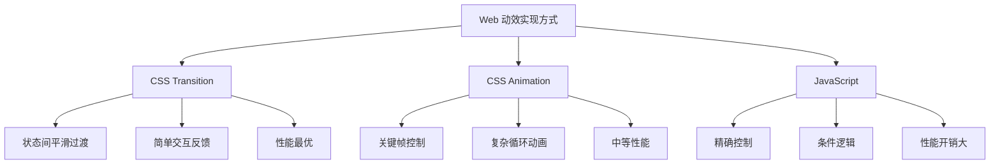
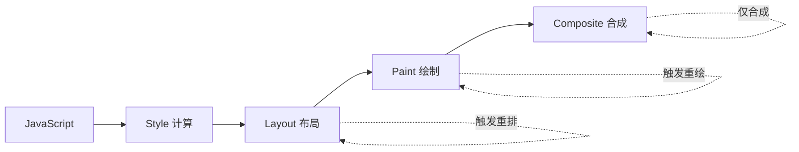

# CSS 过渡动画

## 背景与动机

在 Web 发展早期，实现元素状态的平滑过渡需要依赖 JavaScript 定时器或 Flash 动画，代码复杂且性能不佳。CSS3 引入的 `transition` 属性让开发者能够纯粹用 CSS 创建流畅的过渡效果，显著提升了用户体验和开发效率。

**为什么需要掌握过渡动画？**

- **提升交互反馈**：让用户操作获得即时、流畅的视觉响应
- **降低认知负担**：平滑的状态变化比突兀的切换更易理解
- **性能优势**：CSS 过渡由浏览器引擎优化，比 JavaScript 动画更高效
- **代码简洁**：无需引入额外的动画库或编写复杂的 JS 逻辑

### 过渡 vs 动画 vs JavaScript



---

## 核心概念

### 过渡的基本原理

过渡动画的核心机制是在 CSS 属性值发生变化时，让浏览器自动在两个状态之间创建平滑的中间帧。整个过程由浏览器引擎处理，性能优秀。

```
┌─────────────┐     过渡时间      ┌─────────────┐
│   初始状态   │ ───────────────▶ │   目标状态   │
│  (width:0)  │   缓动函数控制    │ (width:100) │
└─────────────┘                  └─────────────┘
      │                                ▲
      │    ┌───┬───┬───┬───┬───┬───┐  │
      └───▶│ 0 │20│40│60│80│100│───┘
           └───┴───┴───┴───┴───┴───┘
                 中间帧自动计算
```

**过渡触发的四个必要条件：**

1. 存在初始状态和目标状态
2. 状态变化被触发（如 `:hover`、类名改变等）
3. 属性值可动画化（animatable）
4. 设置了过渡持续时间

### 属性速查表

| 属性 | 用途 | 默认值 |
|------|------|--------|
| `transition-property` | 指定过渡属性 | `all` |
| `transition-duration` | 过渡持续时间 | `0s` |
| `transition-timing-function` | 缓动函数 | `ease` |
| `transition-delay` | 延迟时间 | `0s` |
| `transition` | 简写属性 | - |

---

## 深入原理

### 浏览器渲染管线

理解过渡性能的关键在于理解浏览器的渲染管线。当 CSS 属性发生变化时，浏览器需要经历以下步骤：



**各阶段说明：**

| 阶段 | 英文 | 触发条件 | 性能开销 |
|------|------|----------|----------|
| Style | 样式计算 | 任何属性变化 | 低 |
| Layout | 布局/重排 | 几何属性变化（width、height、margin 等） | 高 |
| Paint | 绘制/重绘 | 视觉属性变化（color、background、shadow 等） | 中 |
| Composite | 合成 | transform、opacity 变化 | 最低 |

### 合成层（Compositing Layer）原理

现代浏览器会将页面分割成多个**合成层**，每个层独立渲染，最后在 GPU 中合成为最终画面。理解合成层是优化过渡性能的关键。

**合成层的创建条件：**

1. 使用 `transform` 或 `opacity` 属性的元素
2. 使用 `will-change` 显式声明的元素
3. 使用 `translateZ()` 或 `translate3d()` 的元素
4. 使用 `backface-visibility: hidden` 的元素
5. 视频、canvas、iframe 等特定元素

```
合成层工作原理：

┌─────────────────────────────────────┐
│           主线程 (CPU)               │
│  ┌─────────┐  ┌─────────┐          │
│  │  Layer 1 │  │  Layer 2 │  ...    │
│  │ (静态)   │  │ (动画)   │          │
│  └─────────┘  └─────────┘          │
└─────────────────────────────────────┘
              │
              ▼ 栅格化（Rasterize）
┌─────────────────────────────────────┐
│           GPU 线程                   │
│  ┌─────────┐  ┌─────────┐          │
│  │ Texture1 │  │ Texture2 │  ...    │
│  └─────────┘  └─────────┘          │
│              │                       │
│              ▼ 合成（Composite）      │
│         ┌─────────┐                 │
│         │ 最终画面 │                 │
│         └─────────┘                 │
└─────────────────────────────────────┘
```

**关键优势：**

- 合成层的变换（transform、opacity）**不需要重新布局和绘制**
- GPU 直接操作纹理，性能极高
- 主线程不会被阻塞，页面保持响应

### GPU 加速机制深度说明

GPU 加速的本质是将元素的渲染从 CPU 转移到 GPU，利用 GPU 的并行计算能力处理变换和合成操作。

**GPU 加速的触发方式：**

```css
/* 方式 1：使用 3D 变换（最常用） */
.gpu-accelerated {
  transform: translateZ(0);
  /* 或 */
  transform: translate3d(0, 0, 0);
}

/* 方式 2：使用 will-change（现代推荐方式） */
.gpu-accelerated {
  will-change: transform, opacity;
}

/* 方式 3：使用 backface-visibility */
.gpu-accelerated {
  backface-visibility: hidden;
  perspective: 1000px;
}
```

**GPU 加速的代价：**

虽然 GPU 加速能显著提升动画性能，但也有代价：

1. **内存占用**：每个合成层都需要独立的纹理内存
2. **电池消耗**：GPU 持续工作会增加移动设备的电量消耗
3. **层爆炸**：过多的合成层反而降低性能

**最佳实践：**

```css
/* ✅ 推荐：仅在动画元素上使用 */
.animated-card {
  will-change: transform;
  transition: transform 0.3s;
}

/* 动画结束后移除 will-change */
.animated-card:not(:hover) {
  will-change: auto;
}

/* ❌ 避免：全局滥用 */
* {
  will-change: transform; /* 性能灾难！ */
}
```

### 可过渡属性分类

并非所有 CSS 属性都支持过渡。只有具有中间值的属性才能产生过渡效果。

| 类别 | 可过渡属性 | 性能等级 |
|------|------------|----------|
| 变换类 | `transform`, `opacity` | ⭐⭐⭐ 最优（仅合成） |
| 滤镜类 | `filter`, `clip-path` | ⭐⭐ 较好（重绘） |
| 颜色类 | `color`, `background-color`, `border-color` | ⭐⭐ 中等（重绘） |
| 尺寸类 | `width`, `height`, `margin`, `padding` | ⭐ 差（重排） |
| 定位类 | `left`, `top`, `right`, `bottom` | ⭐ 差（重排） |
| 离散值 | `display`, `position` | ❌ 不可过渡 |

> **特殊说明**：`visibility` 虽是离散属性，但过渡期间会保持 `visible`，因此常与 `opacity` 搭配实现"淡出后再隐藏"。`display` 在 2024 年起的现代浏览器中可配合 `transition-behavior: allow-discrete` 与 `@starting-style` 参与过渡，但传统写法（直接过渡）仍然不生效。

**为什么 display 不可过渡？**

`display` 的值是离散的（如 `block`、`none`），没有中间状态。浏览器无法在 `none` 和 `block` 之间计算"50% 的状态"。

```css
/* ❌ 无效 */
.element {
  display: none;
  transition: display 0.3s; /* 不生效 */
}

/* ✅ 替代方案：opacity + visibility */
.element {
  opacity: 0;
  visibility: hidden;
  transition: opacity 0.3s, visibility 0.3s;
}
.element.active {
  opacity: 1;
  visibility: visible;
}
```

---

## 代码示例

### 基本语法

```css
/* 简写形式 */
transition: property duration timing-function delay;

/* 完整示例 */
.box {
  transition: width 0.3s ease 0.1s;
}

/* 等同于分写 */
.box {
  transition-property: width;
  transition-duration: 0.3s;
  transition-timing-function: ease;
  transition-delay: 0.1s;
}
```

### transition-property 过渡属性

```css
/* 单个属性 */
transition-property: width;

/* 多个属性 */
transition-property: width, height, opacity;

/* 所有属性 - 注意性能 */
transition-property: all;

/* 无过渡 */
transition-property: none;

/* ❌ 不推荐：使用 all 可能导致不必要的计算 */
.element {
  transition: all 0.3s;
}

/* ✅ 推荐：明确指定需要过渡的属性 */
.element {
  transition-property: transform, opacity;
  transition-duration: 0.3s;
}
```


#### transition-property 交互演示（MDN）

指定参与过渡动画的 CSS 属性列表。

```html
<!DOCTYPE html>
<html lang="zh-CN">
  <head>
    <meta charset="UTF-8" />
    <meta name="viewport" content="width=device-width, initial-scale=1.0" />
    <title>transition-property 属性演示 - MDN 示例</title>
    <meta name="description" content="transition-property 属性演示" />
    <style>
      * {
        margin: 0;
        padding: 0;
        box-sizing: border-box;
      }
      body {
        font-family: -apple-system, BlinkMacSystemFont, "Segoe UI", Roboto, "Helvetica Neue", Arial, sans-serif;
        min-height: 100vh;
        padding: 0;
      }
      .demo-layout {
        display: flex;
        height: 100vh;
        gap: 0;
      }
      .snippet-panel {
        width: 320px;
        flex-shrink: 0;
        padding: 16px;
        display: flex;
        flex-direction: column;
        gap: 8px;
        overflow-y: auto;
        border-right: 1px solid #ddd;
        background: #fafafa;
      }
      .snippet-btn {
        padding: 10px 14px;
        border: 1px solid #ccc;
        border-radius: 6px;
        background: #fff;
        font-family: "JetBrains Mono", "Fira Code", monospace;
        font-size: 13px;
        color: #333;
        cursor: pointer;
        text-align: left;
        transition: all 0.2s;
        line-height: 1.4;
      }
      .snippet-btn:hover {
        border-color: #8083ff;
        background: #f0f0ff;
      }
      .snippet-btn.active {
        border-color: #8083ff;
        background: #e8e8ff;
        color: #571bc1;
        font-weight: 600;
      }
      .preview-panel {
        flex: 1;
        padding: 16px;
        display: flex;
        align-items: center;
        justify-content: center;
        background: #fff;
        overflow: auto;
      }
      .preview-panel > section,
      .preview-panel > div:not(.snippet-panel):not(.demo-layout) {
        flex: 1;
        width: 100%;
        min-height: 0;
        height: 100%;
        display: flex;
        align-items: center;
        justify-content: center;
      }
      #example-element {
        background-color: #e4f0f5;
        color: #000;
        padding: 1rem;
        border-radius: 0.5rem;
        font: 1em monospace;
        width: 100%;
        transition: margin-right 2s;
      }

      #default-example:hover > #example-element {
        background-color: #909;
        color: #fff;
        margin-right: 40%;
      }
    </style>
  </head>
  <body>
    <div class="demo-layout">
      <div class="snippet-panel">
        <button class="snippet-btn active" data-index="0">transition-property: margin-right;</button>
        <button class="snippet-btn" data-index="1">transition-property: margin-right, color;</button>
        <button class="snippet-btn" data-index="2">transition-property: all;</button>
        <button class="snippet-btn" data-index="3">transition-property: none;</button>
      </div>
      <div class="preview-panel">
        <section id="default-example">
          <div id="example-element">Hover to see<br />the transition.</div>
        </section>
      </div>
    </div>
    <script>
      const snippets = [
        `#example-element {
  transition-property: margin-right;
}`,
        `#example-element {
  transition-property: margin-right, color;
}`,
        `#example-element {
  transition-property: all;
}`,
        `#example-element {
  transition-property: none;
}`,
      ];

      let styleEl = document.createElement("style");
      document.head.appendChild(styleEl);

      function applySnippet(index) {
        styleEl.textContent = snippets[index];
        document.querySelectorAll(".snippet-btn").forEach((btn, i) => {
          btn.classList.toggle("active", i === index);
        });
      }

      document.querySelectorAll(".snippet-btn").forEach((btn) => {
        btn.addEventListener("click", () => applySnippet(parseInt(btn.dataset.index)));
      });

      applySnippet(0);
    </script>
  </body>
</html>

```
### transition-duration 过渡时间

```css
/* 基本用法 */
transition-duration: 0.3s;
transition-duration: 300ms;  /* 等同于 0.3s */

/* 多个属性分别设置时间 */
transition-property: width, height, opacity;
transition-duration: 0.3s, 0.5s, 0.2s;

/* 推荐时长参考 */
.button { transition-duration: 150ms; }   /* 快速响应 */
.content { transition-duration: 0.5s; }   /* 优雅展示 */
```

| 场景 | 推荐时长 | 说明 |
|------|----------|------|
| 按钮反馈 | 100-200ms | 快速响应 |
| 菜单展开 | 200-300ms | 适中观察 |
| 页面过渡 | 300-500ms | 完整展示 |
| 大型动画 | 500-1000ms | 复杂变化 |

### transition-timing-function 缓动函数

#### 预设关键字

```
linear:      ████████████████ 匀速
ease:        ▁▂▄████████▅▃▂  慢-快-慢（默认）
ease-in:     ▁▂▃▄▅▆▇████████  慢开始
ease-out:    ████████▆▅▃▂▁   慢结束
ease-in-out: ▁▂▃▅████████▅▃▂ 慢开始和结束
```

```css
transition-timing-function: linear;      /* 线性匀速 */
transition-timing-function: ease;        /* 默认：慢-快-慢 */
transition-timing-function: ease-in;     /* 慢开始（加速） */
transition-timing-function: ease-out;    /* 慢结束（减速） */
transition-timing-function: ease-in-out; /* 两端慢速 */
```

| 关键字 | 贝塞尔值 | 适用场景 |
|--------|----------|----------|
| `linear` | `cubic-bezier(0, 0, 1, 1)` | 进度条、线性运动 |
| `ease` | `cubic-bezier(0.25, 0.1, 0.25, 1)` | 通用过渡 |
| `ease-in` | `cubic-bezier(0.42, 0, 1, 1)` | 元素离开、关闭 |
| `ease-out` | `cubic-bezier(0, 0, 0.58, 1)` | 元素进入、展开 |
| `ease-in-out` | `cubic-bezier(0.42, 0, 0.58, 1)` | 大型元素过渡 |

#### 自定义贝塞尔曲线

```css
/* cubic-bezier(x1, y1, x2, y2) */

/* 经典回弹效果 */
transition-timing-function: cubic-bezier(0.68, -0.55, 0.265, 1.55);

/* 快速开始，慢速结束 */
transition-timing-function: cubic-bezier(0.25, 0.1, 0.25, 1);

/* 弹性效果 */
transition-timing-function: cubic-bezier(0.68, -0.6, 0.32, 1.6);
```

**可视化工具：**
- [Cubic Bezier 生成器](https://cubic-bezier.com/)
- [Easings.net 缓动函数库](https://easings.net/)

#### steps() 步进函数

```css
/* 将过渡分成离散步骤 */
transition-timing-function: steps(4, end);   /* 4步，结束时跳跃 */
transition-timing-function: steps(4, start); /* 4步，开始时跳跃 */
transition-timing-function: step-start;      /* 等同于 steps(1, start) */
transition-timing-function: step-end;        /* 等同于 steps(1, end) */

/* 打字机效果 */
.typing {
  width: 0;
  overflow: hidden;
  white-space: nowrap;
  transition: width 5s steps(20);
}
```


#### transition-timing-function 交互演示（MDN）

设置过渡动画的速度曲线（ease/linear/贝塞尔/steps）。

```html
<!DOCTYPE html>
<html lang="zh-CN">
  <head>
    <meta charset="UTF-8" />
    <meta name="viewport" content="width=device-width, initial-scale=1.0" />
    <title>transition-timing-function 属性演示 - MDN 示例</title>
    <meta name="description" content="transition-timing-function 属性演示" />
    <style>
      * {
        margin: 0;
        padding: 0;
        box-sizing: border-box;
      }
      body {
        font-family: -apple-system, BlinkMacSystemFont, "Segoe UI", Roboto, "Helvetica Neue", Arial, sans-serif;
        min-height: 100vh;
        padding: 0;
      }
      .demo-layout {
        display: flex;
        height: 100vh;
        gap: 0;
      }
      .snippet-panel {
        width: 320px;
        flex-shrink: 0;
        padding: 16px;
        display: flex;
        flex-direction: column;
        gap: 8px;
        overflow-y: auto;
        border-right: 1px solid #ddd;
        background: #fafafa;
      }
      .snippet-btn {
        padding: 10px 14px;
        border: 1px solid #ccc;
        border-radius: 6px;
        background: #fff;
        font-family: "JetBrains Mono", "Fira Code", monospace;
        font-size: 13px;
        color: #333;
        cursor: pointer;
        text-align: left;
        transition: all 0.2s;
        line-height: 1.4;
      }
      .snippet-btn:hover {
        border-color: #8083ff;
        background: #f0f0ff;
      }
      .snippet-btn.active {
        border-color: #8083ff;
        background: #e8e8ff;
        color: #571bc1;
        font-weight: 600;
      }
      .preview-panel {
        flex: 1;
        padding: 16px;
        display: flex;
        align-items: center;
        justify-content: center;
        background: #fff;
        overflow: auto;
      }
      .preview-panel > section,
      .preview-panel > div:not(.snippet-panel):not(.demo-layout) {
        flex: 1;
        width: 100%;
        min-height: 0;
        height: 100%;
        display: flex;
        align-items: center;
        justify-content: center;
      }
      #example-element {
        background-color: #e4f0f5;
        color: black;
        padding: 1rem;
        border-radius: 0.5rem;
        font: 1em monospace;
        width: 100%;
        transition: margin-right 2s;
      }

      #default-example:hover > #example-element {
        background-color: #990099;
        color: white;
        margin-right: 40%;
      }
    </style>
  </head>
  <body>
    <div class="demo-layout">
      <div class="snippet-panel">
        <button class="snippet-btn active" data-index="0">transition-timing-function: linear;</button>
        <button class="snippet-btn" data-index="1">transition-timing-function: ease-in;</button>
        <button class="snippet-btn" data-index="2">transition-timing-function: steps(6, end);</button>
        <button class="snippet-btn" data-index="3">
          transition-timing-function: cubic-bezier(0.29, 1.01, 1, -0.68);
        </button>
      </div>
      <div class="preview-panel">
        <section id="default-example">
          <div id="example-element">悬停以查看<br />过渡。</div>
        </section>
      </div>
    </div>
    <script>
      const snippets = [
        `#example-element {
  transition-timing-function: linear;
}`,
        `#example-element {
  transition-timing-function: ease-in;
}`,
        `#example-element {
  transition-timing-function: steps(6, end);
}`,
        `#example-element {
  transition-timing-function: cubic-bezier(0.29, 1.01, 1, -0.68);
}`,
      ];

      let styleEl = document.createElement("style");
      document.head.appendChild(styleEl);

      function applySnippet(index) {
        styleEl.textContent = snippets[index];
        document.querySelectorAll(".snippet-btn").forEach((btn, i) => {
          btn.classList.toggle("active", i === index);
        });
      }

      document.querySelectorAll(".snippet-btn").forEach((btn) => {
        btn.addEventListener("click", () => applySnippet(parseInt(btn.dataset.index)));
      });

      applySnippet(0);
    </script>
  </body>
</html>

```
### transition-delay 延迟时间

```css
/* 基本用法 */
transition-delay: 0s;      /* 无延迟 */
transition-delay: 200ms;   /* 延迟 200 毫秒 */
transition-delay: -0.5s;   /* 负值：跳过前 0.5s 动画 */

/* 交错动画 - 多个元素依次出现 */
.item:nth-child(1) { transition-delay: 0s; }
.item:nth-child(2) { transition-delay: 0.1s; }
.item:nth-child(3) { transition-delay: 0.2s; }

/* 使用 CSS 变量简化 */
.item {
  transition-delay: calc(var(--index) * 0.1s);
}
```

### 多属性过渡

```css
/* 多个属性，相同参数 */
transition: width 0.3s, height 0.3s;

/* 多个属性，不同参数 */
transition:
  width 0.3s ease,
  height 0.5s ease-in-out 0.1s;

/* 实际开发示例 */
.btn {
  background: #007bff;
  color: white;
  transform: translateY(0);
  transition: background 0.2s, transform 0.2s, box-shadow 0.2s;
}

.btn:hover {
  background: #0056b3;
  transform: translateY(-2px);
  box-shadow: 0 4px 12px rgba(0, 0, 0, 0.15);
}
```

### 常见应用场景

#### 悬停效果

```css
.button {
  background: #007bff;
  color: white;
  padding: 12px 24px;
  border-radius: 6px;
  border: none;
  cursor: pointer;
  transition: background 0.3s, transform 0.3s, box-shadow 0.3s;
}

.button:hover {
  background: #0056b3;
  transform: translateY(-2px);
  box-shadow: 0 4px 12px rgba(0, 123, 255, 0.3);
}

.button:active {
  transform: translateY(0);
  box-shadow: none;
}
```

#### 透明度淡入淡出

```css
/* 基本淡入淡出 */
.fade {
  opacity: 0;
  transition: opacity 0.3s ease;
}

.fade.visible {
  opacity: 1;
}

/* 模态框淡入 */
.modal-overlay {
  opacity: 0;
  visibility: hidden;
  transition: opacity 0.3s ease, visibility 0.3s ease;
}

.modal-overlay.active {
  opacity: 1;
  visibility: visible;
}
```

#### 位移动画

```css
/* 左侧滑入 */
.slide-in-left {
  transform: translateX(-100%);
  transition: transform 0.3s ease-out;
}

.slide-in-left.active {
  transform: translateX(0);
}

/* 底部滑入 */
.slide-up {
  transform: translateY(100%);
  opacity: 0;
  transition: transform 0.4s ease-out, opacity 0.4s ease-out;
}

.slide-up.visible {
  transform: translateY(0);
  opacity: 1;
}
```

#### 菜单展开折叠

```css
/* 使用 max-height */
.menu {
  max-height: 0;
  overflow: hidden;
  transition: max-height 0.3s ease-out;
}

.menu.open {
  max-height: 300px;  /* 设置足够大的值 */
}

/* 使用 transform（性能更好） */
.dropdown {
  transform: scaleY(0);
  transform-origin: top;
  transition: transform 0.3s ease;
}

.dropdown.open {
  transform: scaleY(1);
}
```

### JavaScript 控制

#### 类名切换触发过渡

```javascript
// 切换类名
document.querySelector('.modal').classList.add('active');
document.querySelector('.sidebar').classList.toggle('open');

// 直接修改样式
element.style.width = '200px';
element.style.opacity = '1';

// 使用 CSS 变量
element.style.setProperty('--scale', '1.2');
```

```css
.box {
  transform: scale(var(--scale, 1));
  transition: transform 0.3s ease;
}
```

#### 过渡事件监听

```javascript
const element = document.querySelector('.animated-box');

// 监听过渡开始
element.addEventListener('transitionstart', (e) => {
  console.log(`过渡开始: ${e.propertyName}`);
});

// 监听过渡完成
element.addEventListener('transitionend', (e) => {
  console.log(`过渡完成: ${e.propertyName}`);
  console.log(`耗时: ${e.elapsedTime}s`);
});

// 监听过渡取消
element.addEventListener('transitioncancel', (e) => {
  console.log(`过渡被取消: ${e.propertyName}`);
});

// 实用：过渡完成后执行回调
function fadeOut(element) {
  element.style.opacity = '0';
  element.style.transition = 'opacity 0.3s';

  element.addEventListener('transitionend', function handler(e) {
    if (e.propertyName === 'opacity') {
      element.remove();
      element.removeEventListener('transitionend', handler);
    }
  });
}
```

---

## 最佳实践

### 1. 优先使用 transform 和 opacity

```css
/* ❌ 避免：触发重排 */
.box {
  position: absolute;
  left: 0;
  top: 0;
  transition: left 0.3s, top 0.3s;
}
.box:hover {
  left: 100px;
  top: 50px;
}

/* ✅ 推荐：使用 transform，仅触发合成 */
.box {
  transform: translate(0, 0);
  transition: transform 0.3s;
}
.box:hover {
  transform: translate(100px, 50px);
}
```

### 2. 合理使用 will-change

```css
/* ✅ 正确：需要动画时声明 */
.animate-element {
  will-change: transform, opacity;
}

/* ❌ 错误：过度使用 */
.every-element {
  will-change: transform;  /* 消耗内存 */
}

/* ✅ 正确：动画结束后移除 */
.animated:not(:hover) {
  will-change: auto;
}
```

### 3. 启用 GPU 加速

```css
/* 强制创建合成层 */
.gpu-accelerated {
  transform: translateZ(0);
  /* 或 */
  transform: translate3d(0, 0, 0);
  /* 或 */
  backface-visibility: hidden;
}

/* 移动端常用 */
.mobile-card {
  transform: translateZ(0);
  transition: transform 0.3s;
}
```

### 4. 避免过度使用过渡

```css
/* ❌ 不推荐：所有属性都过渡 */
* {
  transition: all 0.3s;  /* 性能灾难 */
}

/* ✅ 推荐：仅对需要的属性设置过渡 */
.card {
  transition: transform 0.3s, opacity 0.3s;
}
```

### 5. 使用 contain 属性优化

```css
/* 限制重排范围 */
.contained {
  contain: layout style paint;
}

/* 独立的动画元素 */
/* 注意：strict 等价于 size layout paint，含 size 包含，
   元素必须有显式尺寸，否则会按无内容处理导致塌缩 */
.animation-container {
  contain: strict;
}
```

### 6. 尊重用户偏好

```css
/* 减少动画偏好 */
@media (prefers-reduced-motion: reduce) {
  * {
    transition-duration: 0.01ms !important;
    animation-duration: 0.01ms !important;
  }
}

/* 或提供替代方案 */
@media (prefers-reduced-motion: reduce) {
  .fade-in {
    opacity: 1 !important;  /* 直接显示 */
  }
}
```

### 7. 性能检测

```javascript
// 使用 Performance API 检测
const observer = new PerformanceObserver((list) => {
  for (const entry of list.getEntries()) {
    console.log(`${entry.name}: ${entry.duration}ms`);
  }
});

observer.observe({ entryTypes: ['measure'] });

// 测量过渡性能
performance.mark('transition-start');
element.classList.add('animate');
element.addEventListener('transitionend', () => {
  performance.mark('transition-end');
  performance.measure('transition', 'transition-start', 'transition-end');
});
```

---

## 常见问题

### Q1: 过渡不生效？

**原因分析：**

1. 缺少初始状态
2. 属性不可过渡
3. 过渡时间未设置
4. 过渡被其他样式覆盖

```css
/* ❌ 错误：缺少初始状态 */
.box:hover {
  width: 200px;
  transition: width 0.3s;  /* 过渡在 hover 状态才生效 */
}

/* ✅ 正确：在初始状态设置过渡 */
.box {
  width: 100px;
  transition: width 0.3s;
}

.box:hover {
  width: 200px;
}
```

### Q2: 过渡闪烁/抖动？

**原因：** GPU 加速问题或亚像素渲染

```css
/* 解决方案：强制 GPU 加速 */
.flicker-fix {
  transform: translateZ(0);
  backface-visibility: hidden;
  perspective: 1000px;
}

/* 或使用 will-change */
.flicker-fix {
  will-change: transform;
}
```

### Q3: display 过渡无效？

**原因：** display 没有中间值

```css
/* ✅ 解决方案一：opacity + visibility */
.element {
  opacity: 0;
  visibility: hidden;
  transition: opacity 0.3s, visibility 0.3s;
}

.element.active {
  opacity: 1;
  visibility: visible;
}

/* ✅ 解决方案二：max-height */
.element {
  max-height: 0;
  overflow: hidden;
  transition: max-height 0.3s;
}

.element.active {
  max-height: 500px;
}

/* ✅ 解决方案三：scale */
.element {
  transform: scale(0);
  transition: transform 0.3s;
}

.element.active {
  transform: scale(1);
}
```

### Q4: transitionend 事件多次触发？

**原因：** 每个属性完成时都会触发

```javascript
// ❌ 问题：多次触发
element.addEventListener('transitionend', () => {
  // 可能触发多次
});

// ✅ 解决方案：检查特定属性
element.addEventListener('transitionend', (e) => {
  if (e.propertyName === 'opacity') {
    // 只在 opacity 完成时执行
  }
});

// ✅ 解决方案：使用 once
element.addEventListener('transitionend', handler, { once: true });
```

### Q5: height: auto 无法过渡？

**原因：** auto 不是具体数值

```css
/* ✅ 解决方案一：使用 max-height */
.element {
  max-height: 0;
  transition: max-height 0.3s;
}

.element.active {
  max-height: 500px;  /* 设置足够大的值 */
}

/* ✅ 解决方案二：JavaScript 计算高度 */
```

```javascript
element.style.height = 'auto';
const height = element.scrollHeight + 'px';
element.style.height = '0';
requestAnimationFrame(() => {
  element.style.height = height;
});
```

### Q6: 过渡性能差？

**解决方案：**

```css
/* 1. 使用高性能属性 */
.optimized {
  transition: transform 0.3s, opacity 0.3s;
}

/* 2. 启用 GPU 加速 */
.gpu-optimized {
  will-change: transform;
  transform: translateZ(0);
}

/* 3. 避免过度使用 */
.selective {
  transition: transform 0.3s;
  /* 而非 transition: all 0.3s; */
}
```

---

## 参考资源

- [MDN - CSS Transition](https://developer.mozilla.org/zh-CN/docs/Web/CSS/transition)
- [MDN - CSS 可动画属性](https://developer.mozilla.org/zh-CN/docs/Web/CSS/CSS_animated_properties)
- [CSS Triggers](https://csstriggers.com/) - 查看属性变化触发的渲染阶段
- [GPU Acceleration in Chrome](https://www.html5rocks.com/en/tutorials/speed/layers/)
- [Cubic Bezier 生成器](https://cubic-bezier.com/)
- [Easings.net](https://easings.net/) - 缓动函数参考

---

## 浏览器兼容性

| 特性 | Chrome | Firefox | Safari | Edge | IE |
|------|--------|---------|--------|------|-----|
| 基本过渡 | 26+ | 16+ | 9+ | 12+ | 10+ |
| transitionend 事件 | 26+ | 16+ | 9+ | 12+ | 10+ |
| will-change | 36+ | 36+ | 9.1+ | 12+ | ❌ |
| prefers-reduced-motion | 74+ | 63+ | 10.1+ | 79+ | ❌ |

> **注意**：现代浏览器已全面支持 CSS 过渡。如需兼容 IE9 及以下，建议使用 JavaScript 动画库作为降级方案。

