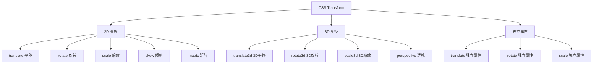
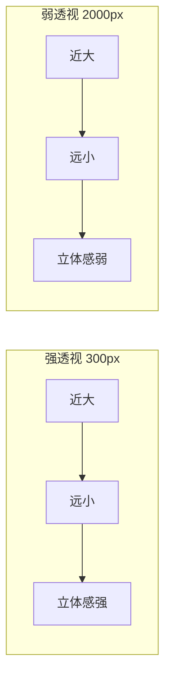
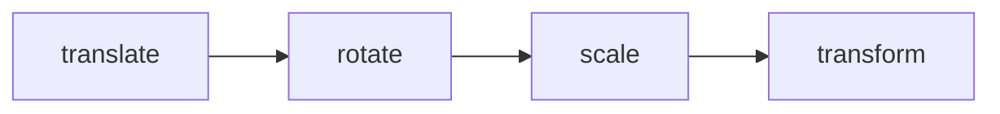

# CSS 变换

## 背景与动机

在 CSS3 之前，改变元素的位置、大小、旋转角度等操作需要依赖 JavaScript 或图片预处理，开发效率低且性能不佳。CSS3 引入的 `transform` 属性让开发者能够直接在 CSS 中对元素进行平移、旋转、缩放、倾斜等几何变换，为创建丰富的视觉效果和流畅动画提供了原生支持。

**为什么需要掌握变换？**

- **性能优异**：变换由 GPU 加速，只触发合成而不触发重排
- **不破坏文档流**：变换后的元素仍占据原始空间，不影响其他元素布局
- **支持动画**：所有变换函数都可以平滑过渡，是 CSS 动画的核心
- **3D 能力**：支持真正的 3D 空间变换，创建立体视觉效果

### 变换特性全景图



---

## 核心概念

### 核心特点

| 特性 | 说明 |
|------|------|
| **不破坏文档流** | 变换后的元素仍占据原始空间位置 |
| **性能优异** | 由 GPU 加速，只触发重绘/合成而不触发重排 |
| **支持动画** | 所有变换函数都可以平滑过渡 |
| **组合能力强** | 多个变换可以组合使用 |
| **创建层叠上下文** | 变换元素会创建新的层叠上下文 |

### 浏览器支持

| 特性 | Chrome | Firefox | Safari | Edge | IE |
|------|--------|---------|--------|------|-----|
| 2D Transform | 36+ | 16+ | 9+ | 12+ | 9+ |
| 3D Transform | 36+ | 16+ | 9+ | 12+ | 10+ |

> **注意**：IE9 支持基本 2D 变换（需 `-ms-` 前缀），IE10+ 支持完整 3D 变换。

---

## 深入原理

### 坐标系统

**2D 坐标系**：原点 (0,0) 位于元素左上角，X 轴向右为正，Y 轴向下为正。

```
2D 坐标系：

        X 轴正方向 →
    ┌──────────────────────►
    │
    │  (0,0) 原点
    │     ╲
    │      ╲
    ▼       ╲
  Y 轴       ╲
  正方向      ╲
              ╲
```

**3D 坐标系**：在 2D 基础上增加 Z 轴，指向观察者为正方向，远离观察者为负方向。

```
3D 坐标系：

           Z 轴（指向观察者）
          ╱
         ╱
        ╱
       ╱
      ●────────► X 轴
      │
      │
      ▼
    Y 轴
```

### 变换矩阵基础

所有 CSS 变换最终都会转换为矩阵计算。理解矩阵原理有助于掌握变换的本质。

#### 2D 矩阵（3×3 齐次坐标）

```
| a  c  tx |     | scaleX  skewX   translateX |
| b  d  ty |  =  | skewY   scaleY  translateY |
| 0  0  1  |     | 0       0       1          |
```

**参数说明：**
- `a (scaleX)`：X 轴缩放
- `b (skewY)`：Y 轴倾斜
- `c (skewX)`：X 轴倾斜
- `d (scaleY)`：Y 轴缩放
- `tx (translateX)`：X 轴平移
- `ty (translateY)`：Y 轴平移

#### 3D 矩阵（4×4）

```
| m11  m21  m31  m41 |     | scaleX  xy剪切  xz剪切  translateX |
| m12  m22  m32  m42 |  =  | yx剪切  scaleY  yz剪切  translateY |
| m13  m23  m33  m43 |     | zx剪切  zy剪切  scaleZ  translateZ |
| m14  m24  m34  m44 |     | 0       0       0       1          |
```

#### 矩阵变换等价关系

```css
/* 平移 */
transform: translate(100px, 50px);
/* 等价于 */
transform: matrix(1, 0, 0, 1, 100, 50);

/* 旋转 45度 */
transform: rotate(45deg);
/* 等价于 (cos45°≈0.707, sin45°≈0.707) */
transform: matrix(0.707, 0.707, -0.707, 0.707, 0, 0);

/* 缩放 */
transform: scale(2, 1.5);
/* 等价于 */
transform: matrix(2, 0, 0, 1.5, 0, 0);

/* 倾斜 */
transform: skew(20deg, 10deg);
/* 等价于 (tan20°≈0.364, tan10°≈0.176) */
transform: matrix(1, 0.176, 0.364, 1, 0, 0);
```

### 透视（Perspective）原理

3D 变换需要透视才能产生立体效果。透视模拟人眼观察 3D 场景时的"近大远小"效果。

#### 透视的数学模型

```
透视投影原理：

观察点（眼睛）
    ●
     \
      \        屏幕平面
       \      ┌─────────┐
        \     │         │
         \    │  ●A     │  ← A 点离观察者近，看起来大
          \   │    ●B   │  ← B 点离观察者远，看起来小
           \  │         │
            \ └─────────┘
             \
              \
               消失点
```

**透视公式：**

```
投影后的 x' = x × d / (d + z)
投影后的 y' = y × d / (d + z)

其中：
- d = perspective 值（观察距离）
- z = 元素的 Z 轴位置
- x, y = 原始坐标
```

#### perspective 的设置方式

```css
/* 方式 1：在父元素设置（推荐） */
/* 所有子元素共享同一个透视点 */
.container {
  perspective: 1000px;
}
.child {
  transform: rotateY(45deg);
}

/* 方式 2：在元素自身设置 */
/* 每个元素有自己的透视点 */
.element {
  transform: perspective(1000px) rotateY(45deg);
}
```


##### perspective 交互演示（MDN）

为 3D 变换设置透视距离，产生近大远小的立体效果。

```html
<!DOCTYPE html>
<html lang="zh-CN">
  <head>
    <meta charset="UTF-8" />
    <meta name="viewport" content="width=device-width, initial-scale=1.0" />
    <title>perspective 属性演示 - MDN 示例</title>
    <meta name="description" content="perspective 属性演示" />
    <style>
      * {
        margin: 0;
        padding: 0;
        box-sizing: border-box;
      }
      body {
        font-family: -apple-system, BlinkMacSystemFont, "Segoe UI", Roboto, "Helvetica Neue", Arial, sans-serif;
        min-height: 100vh;
        padding: 0;
      }
      .demo-layout {
        display: flex;
        height: 100vh;
        gap: 0;
      }
      .snippet-panel {
        width: 320px;
        flex-shrink: 0;
        padding: 16px;
        display: flex;
        flex-direction: column;
        gap: 8px;
        overflow-y: auto;
        border-right: 1px solid #ddd;
        background: #fafafa;
      }
      .snippet-btn {
        padding: 10px 14px;
        border: 1px solid #ccc;
        border-radius: 6px;
        background: #fff;
        font-family: "JetBrains Mono", "Fira Code", monospace;
        font-size: 13px;
        color: #333;
        cursor: pointer;
        text-align: left;
        transition: all 0.2s;
        line-height: 1.4;
      }
      .snippet-btn:hover {
        border-color: #8083ff;
        background: #f0f0ff;
      }
      .snippet-btn.active {
        border-color: #8083ff;
        background: #e8e8ff;
        color: #571bc1;
        font-weight: 600;
      }
      .preview-panel {
        flex: 1;
        padding: 16px;
        display: flex;
        align-items: center;
        justify-content: center;
        background: #fff;
        overflow: auto;
      }
      .preview-panel > section,
      .preview-panel > div:not(.snippet-panel):not(.demo-layout) {
        flex: 1;
        width: 100%;
        min-height: 0;
        height: 100%;
        display: flex;
        align-items: center;
        justify-content: center;
      }
      #default-example {
        background: linear-gradient(skyblue, khaki);
        perspective: 800px;
        perspective-origin: 150% 150%;
      }

      #example-element {
        width: 100px;
        height: 100px;
        perspective: 550px;
        transform-style: preserve-3d;
      }

      .face {
        display: flex;
        align-items: center;
        justify-content: center;
        width: 100%;
        height: 100%;
        position: absolute;
        backface-visibility: inherit;
        font-size: 60px;
        color: white;
      }

      .front {
        background: rgba(90, 90, 90, 0.7);
        transform: translateZ(50px);
      }

      .back {
        background: rgba(0, 210, 0, 0.7);
        transform: rotateY(180deg) translateZ(50px);
      }

      .right {
        background: rgba(210, 0, 0, 0.7);
        transform: rotateY(90deg) translateZ(50px);
      }

      .left {
        background: rgba(0, 0, 210, 0.7);
        transform: rotateY(-90deg) translateZ(50px);
      }

      .top {
        background: rgba(210, 210, 0, 0.7);
        transform: rotateX(90deg) translateZ(50px);
      }

      .bottom {
        background: rgba(210, 0, 210, 0.7);
        transform: rotateX(-90deg) translateZ(50px);
      }
    </style>
  </head>
  <body>
    <div class="demo-layout">
      <div class="snippet-panel">
        <button class="snippet-btn active" data-index="0">perspective: none;</button>
        <button class="snippet-btn" data-index="1">perspective: 800px;</button>
        <button class="snippet-btn" data-index="2">perspective: 23rem;</button>
        <button class="snippet-btn" data-index="3">perspective: 5.5cm;</button>
      </div>
      <div class="preview-panel">
        <section class="default-example" id="default-example">
          <div class="transition-all" id="example-element">
            <div class="face front">1</div>
            <div class="face back">2</div>
            <div class="face right">3</div>
            <div class="face left">4</div>
            <div class="face top">5</div>
            <div class="face bottom">6</div>
          </div>
        </section>
      </div>
    </div>
    <script>
      const snippets = [
        `#example-element {
  perspective: none;
}`,
        `#example-element {
  perspective: 800px;
}`,
        `#example-element {
  perspective: 23rem;
}`,
        `#example-element {
  perspective: 5.5cm;
}`,
      ];

      let styleEl = document.createElement("style");
      document.head.appendChild(styleEl);

      function applySnippet(index) {
        styleEl.textContent = snippets[index];
        document.querySelectorAll(".snippet-btn").forEach((btn, i) => {
          btn.classList.toggle("active", i === index);
        });
      }

      document.querySelectorAll(".snippet-btn").forEach((btn) => {
        btn.addEventListener("click", () => applySnippet(parseInt(btn.dataset.index)));
      });

      applySnippet(0);
    </script>
  </body>
</html>

```
#### perspective 值的影响

| perspective 值 | 效果 | 适用场景 |
|----------------|------|----------|
| 100-300px | 强烈透视（近大远小明显） | 卡片翻转、戏剧效果 |
| 500-1000px | 自然透视 | 通用 3D 效果 |
| 1500-3000px | 微弱透视 | 微妙立体感 |
| none/infinity | 无透视（正交投影） | 技术图示 |



### 变换顺序的重要性

变换函数从左到右依次执行，**顺序不同结果完全不同**。

```css
/* 先平移后旋转 */
.example1 {
  transform: translate(100px, 0) rotate(45deg);
  /* 1. 先向右移动 100px
     2. 然后绕元素中心旋转 45度 */
}

/* 先旋转后平移 */
.example2 {
  transform: rotate(45deg) translate(100px, 0);
  /* 1. 先旋转 45度（坐标系也跟着旋转）
     2. 然后沿旋转后的 X 轴移动 100px */
}
```

**矩阵乘法顺序：**

```
最终矩阵 = Tn × ... × T2 × T1 × 原始矩阵

其中 T1 是最右边的变换，最先应用
```

---

## 代码示例

### 2D 变换

#### translate 平移

```css
/* 基础语法 */
transform: translate(tx);           /* 只指定 x 轴 */
transform: translate(tx, ty);       /* 同时指定 x 和 y 轴 */
transform: translateX(tx);          /* x 轴平移 */
transform: translateY(ty);          /* y 轴平移 */

/* 示例 */
transform: translateX(100px);           /* 向右移动 100px */
transform: translateY(-50px);           /* 向上移动 50px */
transform: translate(100px, 50px);      /* 向右 100px，向下 50px */

/* 百分比相对于自身 */
transform: translate(50%, 50%);         /* 向右移动自身宽度的一半 */

/* 实际应用：元素居中 */
.center {
  position: absolute;
  top: 50%;
  left: 50%;
  transform: translate(-50%, -50%);
}

/* 配合 calc() */
.box {
  transform: translate(calc(100% + 20px), 0);
}
```


##### translate 交互演示（MDN）

独立变换属性：平移元素，不触发布局重排。

```html
<!DOCTYPE html>
<html lang="zh-CN">
  <head>
    <meta charset="UTF-8" />
    <meta name="viewport" content="width=device-width, initial-scale=1.0" />
    <title>translate 属性演示 - MDN 示例</title>
    <meta name="description" content="translate 属性演示" />
    <style>
      * {
        margin: 0;
        padding: 0;
        box-sizing: border-box;
      }
      body {
        font-family: -apple-system, BlinkMacSystemFont, "Segoe UI", Roboto, "Helvetica Neue", Arial, sans-serif;
        min-height: 100vh;
        padding: 0;
      }
      .demo-layout {
        display: flex;
        height: 100vh;
        gap: 0;
      }
      .snippet-panel {
        width: 320px;
        flex-shrink: 0;
        padding: 16px;
        display: flex;
        flex-direction: column;
        gap: 8px;
        overflow-y: auto;
        border-right: 1px solid #ddd;
        background: #fafafa;
      }
      .snippet-btn {
        padding: 10px 14px;
        border: 1px solid #ccc;
        border-radius: 6px;
        background: #fff;
        font-family: "JetBrains Mono", "Fira Code", monospace;
        font-size: 13px;
        color: #333;
        cursor: pointer;
        text-align: left;
        transition: all 0.2s;
        line-height: 1.4;
      }
      .snippet-btn:hover {
        border-color: #8083ff;
        background: #f0f0ff;
      }
      .snippet-btn.active {
        border-color: #8083ff;
        background: #e8e8ff;
        color: #571bc1;
        font-weight: 600;
      }
      .preview-panel {
        flex: 1;
        padding: 16px;
        display: flex;
        align-items: center;
        justify-content: center;
        background: #fff;
        overflow: auto;
      }
      .preview-panel > section,
      .preview-panel > div:not(.snippet-panel):not(.demo-layout) {
        flex: 1;
        width: 100%;
        min-height: 0;
        height: 100%;
        display: flex;
        align-items: center;
        justify-content: center;
      }
      #default-example {
        background: linear-gradient(skyblue, khaki);
        perspective: 800px;
        perspective-origin: 150% 150%;
      }

      #example-element {
        width: 100px;
        height: 100px;
        perspective: 550px;
        transform-style: preserve-3d;
      }

      .face {
        display: flex;
        align-items: center;
        justify-content: center;
        width: 100%;
        height: 100%;
        position: absolute;
        backface-visibility: inherit;
        font-size: 60px;
        color: white;
      }

      .front {
        background: rgb(90 90 90 / 0.7);
        transform: translateZ(50px);
      }

      .back {
        background: rgb(0 210 0 / 0.7);
        transform: rotateY(180deg) translateZ(50px);
      }

      .right {
        background: rgb(210 0 0 / 0.7);
        transform: rotateY(90deg) translateZ(50px);
      }

      .left {
        background: rgb(0 0 210 / 0.7);
        transform: rotateY(-90deg) translateZ(50px);
      }

      .top {
        background: rgb(210 210 0 / 0.7);
        transform: rotateX(90deg) translateZ(50px);
      }

      .bottom {
        background: rgb(210 0 210 / 0.7);
        transform: rotateX(-90deg) translateZ(50px);
      }
    </style>
  </head>
  <body>
    <div class="demo-layout">
      <div class="snippet-panel">
        <button class="snippet-btn active" data-index="0">translate: none;</button>
        <button class="snippet-btn" data-index="1">translate: 40px;</button>
        <button class="snippet-btn" data-index="2">translate: 50% -40%;</button>
        <button class="snippet-btn" data-index="3">translate: 20px 4rem;</button>
        <button class="snippet-btn" data-index="4">translate: 20px 4rem 150px;</button>
      </div>
      <div class="preview-panel">
        <section class="default-example" id="default-example">
          <div class="transition-all" id="example-element">
            <div class="face front">1</div>
            <div class="face back">2</div>
            <div class="face right">3</div>
            <div class="face left">4</div>
            <div class="face top">5</div>
            <div class="face bottom">6</div>
          </div>
        </section>
      </div>
    </div>
    <script>
      const snippets = [
        `#example-element {
  translate: none;
}`,
        `#example-element {
  translate: 40px;
}`,
        `#example-element {
  translate: 50% -40%;
}`,
        `#example-element {
  translate: 20px 4rem;
}`,
        `#example-element {
  translate: 20px 4rem 150px;
}`,
      ];

      let styleEl = document.createElement("style");
      document.head.appendChild(styleEl);

      function applySnippet(index) {
        styleEl.textContent = snippets[index];
        document.querySelectorAll(".snippet-btn").forEach((btn, i) => {
          btn.classList.toggle("active", i === index);
        });
      }

      document.querySelectorAll(".snippet-btn").forEach((btn) => {
        btn.addEventListener("click", () => applySnippet(parseInt(btn.dataset.index)));
      });

      applySnippet(0);
    </script>
  </body>
</html>

```
#### rotate 旋转

```css
/* 基础语法 */
transform: rotate(angle);

/* 不同角度单位 */
transform: rotate(45deg);        /* 旋转 45 度 */
transform: rotate(0.125turn);    /* 旋转 1/8 圈 = 45deg */
transform: rotate(0.785rad);     /* 旋转 π/4 弧度 ≈ 45deg */
transform: rotate(50grad);       /* 旋转 50 梯度 = 45deg */

/* 负值逆时针旋转 */
transform: rotate(-45deg);       /* 逆时针旋转 45 度 */

/* 大于 360 度 */
transform: rotate(720deg);       /* 旋转两圈 */

/* 实际应用：旋转箭头 */
.arrow { transition: transform 0.3s; }
.arrow.down { transform: rotate(90deg); }
.arrow.up { transform: rotate(-90deg); }

/* 加载动画 */
@keyframes loading {
  from { transform: rotate(0deg); }
  to { transform: rotate(360deg); }
}
.spinner { animation: loading 1s linear infinite; }
```

#### scale 缩放

```css
/* 基础语法 */
transform: scale(s);              /* 等比例缩放 */
transform: scale(sx, sy);         /* 分别设置 x 和 y 轴 */
transform: scaleX(sx);            /* x 轴缩放 */
transform: scaleY(sy);            /* y 轴缩放 */

/* 示例 */
transform: scale(1.5);            /* 整体放大 1.5 倍 */
transform: scale(2, 1.5);         /* 水平放大 2 倍，垂直放大 1.5 倍 */
transform: scale(0.5);            /* 缩小到原来的一半 */

/* 翻转 */
transform: scale(-1, 1);          /* 水平翻转 */
transform: scale(1, -1);          /* 垂直翻转 */
transform: scale(-1);             /* 同时翻转 */

/* 悬停放大效果 */
.card { transition: transform 0.3s ease; }
.card:hover { transform: scale(1.05); }

/* 点击缩小效果 */
.button:active { transform: scale(0.95); }
```

> **注意**：使用 `scale` 缩放文字可能导致模糊，文字缩放推荐使用 `font-size`。

#### skew 倾斜

```css
/* 基础语法 */
transform: skew(ax);              /* x 轴倾斜 */
transform: skew(ax, ay);          /* 同时倾斜 x 和 y 轴 */
transform: skewX(ax);             /* x 轴倾斜 */
transform: skewY(ay);            /* y 轴倾斜 */

/* 示例 */
transform: skewX(20deg);          /* 向左倾斜 20 度 */
transform: skewX(-20deg);         /* 向右倾斜 20 度 */
transform: skewY(10deg);          /* 向下倾斜 10 度 */
transform: skew(20deg, 10deg);    /* 同时倾斜 */

/* 平行四边形效果 */
.parallelogram { transform: skewX(-20deg); }

/* 斜角导航 */
.nav-item { transform: skewX(-15deg); }
.nav-item span { transform: skewX(15deg); } /* 文字反向倾斜保持正常 */
```

#### matrix 矩阵变换

```css
/* 基础语法 */
transform: matrix(a, b, c, d, tx, ty);

/* 等价关系 */
/* | a  c  tx |    | scaleX  skewX   translateX |
   | b  d  ty | =  | skewY   scaleY  translateY |
   | 0  0  1  |    | 0       0       1          | */

/* 平移 */
transform: translate(100px, 50px);
/* 等价于 */
transform: matrix(1, 0, 0, 1, 100, 50);

/* 旋转 45度 */
transform: rotate(45deg);
/* 等价于 */
transform: matrix(0.707, 0.707, -0.707, 0.707, 0, 0);

/* 缩放 */
transform: scale(2, 1.5);
/* 等价于 */
transform: matrix(2, 0, 0, 1.5, 0, 0);
```

#### 组合变换

```css
/* 多个变换函数用空格分隔 */
.combined {
  transform: translate(100px, 50px) rotate(45deg) scale(1.5);
}

/* 旋转并放大 */
.rotate-scale {
  transform: rotate(45deg) scale(1.2);
}

/* 重要：变换顺序影响结果 */
/* 先平移后旋转 */
.transform-1 {
  transform: translate(100px, 0) rotate(45deg);
}

/* 先旋转后平移（平移方向被旋转） */
.transform-2 {
  transform: rotate(45deg) translate(100px, 0);
}
```

### 3D 变换

#### translate3d 平移

```css
/* 基础语法 */
transform: translateZ(tz);                /* z 轴平移 */
transform: translate3d(tx, ty, tz);       /* 3D 平移 */

/* 示例 */
transform: translateZ(100px);              /* 向观察者方向移动 */
transform: translateZ(-50px);              /* 远离观察者移动 */
transform: translate3d(100px, 50px, 100px);

/* 配合透视 */
.container { perspective: 1000px; }
.element { transform: translateZ(200px); }  /* 放大效果 */

/* 视差滚动效果 */
.parallax-layer {
  transform: translateZ(-1px) scale(2);
  /* z 轴后退的同时放大，保持视觉大小但移动速度不同 */
}
```

#### rotate3d 旋转

```css
/* 基础语法 */
transform: rotateX(angle);                          /* 绕 x 轴旋转 */
transform: rotateY(angle);                          /* 绕 y 轴旋转 */
transform: rotateZ(angle);                          /* 绕 z 轴旋转 */
transform: rotate3d(x, y, z, angle);                /* 绕任意轴旋转 */

/* 示例 */
transform: rotateX(45deg);              /* 绕 x 轴旋转（前后翻滚） */
transform: rotateY(45deg);              /* 绕 y 轴旋转（左右翻滚） */
transform: rotateZ(45deg);              /* 绕 z 轴旋转（与 2D 相同） */

/* 任意轴旋转 */
transform: rotate3d(1, 0, 0, 45deg);    /* 等同于 rotateX(45deg) */
transform: rotate3d(0, 1, 0, 45deg);    /* 等同于 rotateY(45deg) */
transform: rotate3d(1, 1, 0, 45deg);    /* 绕对角轴旋转 */

/* 3D 卡片翻转 */
.card-container { perspective: 1000px; }
.card {
  transform-style: preserve-3d;
  transition: transform 0.6s;
}
.card:hover { transform: rotateY(180deg); }
```

#### scale3d 缩放

```css
/* 基础语法 */
transform: scaleZ(sz);                  /* z 轴缩放 */
transform: scale3d(sx, sy, sz);         /* 3D 缩放 */

/* 示例 */
transform: scaleZ(2);
transform: scale3d(1.5, 1.5, 2);
transform: scale3d(2, 2, 2);
```

> **注意**：z 轴缩放在平面元素上没有可见效果，主要用于 3D 场景中的子元素。

#### perspective-origin 透视原点

```css
/* 基础语法 */
perspective-origin: x-position y-position;

/* 关键字 */
perspective-origin: center center;      /* 默认值，中心点 */
perspective-origin: left top;           /* 左上角 */
perspective-origin: right bottom;       /* 右下角 */

/* 百分比 */
perspective-origin: 50% 50%;            /* 中心点 */
perspective-origin: 0% 0%;              /* 左上角 */

/* 具体值 */
perspective-origin: 200px 300px;
```


##### perspective-origin 交互演示（MDN）

设置 3D 透视的消失点位置。

```html
<!DOCTYPE html>
<html lang="zh-CN">
  <head>
    <meta charset="UTF-8" />
    <meta name="viewport" content="width=device-width, initial-scale=1.0" />
    <title>perspective-origin 属性演示 - MDN 示例</title>
    <meta name="description" content="perspective-origin 属性演示" />
    <style>
      * {
        margin: 0;
        padding: 0;
        box-sizing: border-box;
      }
      body {
        font-family: -apple-system, BlinkMacSystemFont, "Segoe UI", Roboto, "Helvetica Neue", Arial, sans-serif;
        min-height: 100vh;
        padding: 0;
      }
      .demo-layout {
        display: flex;
        height: 100vh;
        gap: 0;
      }
      .snippet-panel {
        width: 320px;
        flex-shrink: 0;
        padding: 16px;
        display: flex;
        flex-direction: column;
        gap: 8px;
        overflow-y: auto;
        border-right: 1px solid #ddd;
        background: #fafafa;
      }
      .snippet-btn {
        padding: 10px 14px;
        border: 1px solid #ccc;
        border-radius: 6px;
        background: #fff;
        font-family: "JetBrains Mono", "Fira Code", monospace;
        font-size: 13px;
        color: #333;
        cursor: pointer;
        text-align: left;
        transition: all 0.2s;
        line-height: 1.4;
      }
      .snippet-btn:hover {
        border-color: #8083ff;
        background: #f0f0ff;
      }
      .snippet-btn.active {
        border-color: #8083ff;
        background: #e8e8ff;
        color: #571bc1;
        font-weight: 600;
      }
      .preview-panel {
        flex: 1;
        padding: 16px;
        display: flex;
        align-items: center;
        justify-content: center;
        background: #fff;
        overflow: auto;
      }
      .preview-panel > section,
      .preview-panel > div:not(.snippet-panel):not(.demo-layout) {
        flex: 1;
        width: 100%;
        min-height: 0;
        height: 100%;
        display: flex;
        align-items: center;
        justify-content: center;
      }
      #default-example {
        background: linear-gradient(skyblue, khaki);
        perspective: 550px;
      }

      #example-element {
        width: 100px;
        height: 100px;
        transform-style: preserve-3d;
        perspective: 250px;
      }

      .face {
        display: flex;
        align-items: center;
        justify-content: center;
        width: 100%;
        height: 100%;
        position: absolute;
        backface-visibility: inherit;
        font-size: 60px;
        color: white;
      }

      .front {
        background: rgba(90, 90, 90, 0.7);
        transform: translateZ(50px);
      }

      .back {
        background: rgba(0, 210, 0, 0.7);
        transform: rotateY(180deg) translateZ(50px);
      }

      .right {
        background: rgba(210, 0, 0, 0.7);
        transform: rotateY(90deg) translateZ(50px);
      }

      .left {
        background: rgba(0, 0, 210, 0.7);
        transform: rotateY(-90deg) translateZ(50px);
      }

      .top {
        background: rgba(210, 210, 0, 0.7);
        transform: rotateX(90deg) translateZ(50px);
      }

      .bottom {
        background: rgba(210, 0, 210, 0.7);
        transform: rotateX(-90deg) translateZ(50px);
      }
    </style>
  </head>
  <body>
    <div class="demo-layout">
      <div class="snippet-panel">
        <button class="snippet-btn active" data-index="0">perspective-origin: center;</button>
        <button class="snippet-btn" data-index="1">perspective-origin: top;</button>
        <button class="snippet-btn" data-index="2">perspective-origin: bottom right;</button>
        <button class="snippet-btn" data-index="3">perspective-origin: -170%;</button>
        <button class="snippet-btn" data-index="4">perspective-origin: 500% 200%;</button>
      </div>
      <div class="preview-panel">
        <section class="default-example" id="default-example">
          <div class="transition-all" id="example-element">
            <div class="face front">1</div>
            <div class="face back">2</div>
            <div class="face right">3</div>
            <div class="face left">4</div>
            <div class="face top">5</div>
            <div class="face bottom">6</div>
          </div>
        </section>
      </div>
    </div>
    <script>
      const snippets = [
        `#example-element {
  perspective-origin: center;
}`,
        `#example-element {
  perspective-origin: top;
}`,
        `#example-element {
  perspective-origin: bottom right;
}`,
        `#example-element {
  perspective-origin: -170%;
}`,
        `#example-element {
  perspective-origin: 500% 200%;
}`,
      ];

      let styleEl = document.createElement("style");
      document.head.appendChild(styleEl);

      function applySnippet(index) {
        styleEl.textContent = snippets[index];
        document.querySelectorAll(".snippet-btn").forEach((btn, i) => {
          btn.classList.toggle("active", i === index);
        });
      }

      document.querySelectorAll(".snippet-btn").forEach((btn) => {
        btn.addEventListener("click", () => applySnippet(parseInt(btn.dataset.index)));
      });

      applySnippet(0);
    </script>
  </body>
</html>

```
#### transform-style 变换风格

```css
/* 基础语法 */
transform-style: flat;         /* 扁平化（默认） */
transform-style: preserve-3d;  /* 保持 3D 空间 */

/* 3D 立方体示例 */
.cube-container { perspective: 1000px; }

.cube {
  transform-style: preserve-3d;
  transform: rotateX(-30deg) rotateY(-30deg);
}

.face { position: absolute; width: 200px; height: 200px; }

.front  { transform: translateZ(100px); }
.back   { transform: translateZ(-100px) rotateY(180deg); }
.right  { transform: rotateY(90deg) translateZ(100px); }
.left   { transform: rotateY(-90deg) translateZ(100px); }
.top    { transform: rotateX(90deg) translateZ(100px); }
.bottom { transform: rotateX(-90deg) translateZ(100px); }
```


##### transform-style 交互演示（MDN）

设置子元素是否继承父元素的 3D 空间（flat/preserve-3d）。

```html
<!DOCTYPE html>
<html lang="zh-CN">
  <head>
    <meta charset="UTF-8" />
    <meta name="viewport" content="width=device-width, initial-scale=1.0" />
    <title>transform-style 属性演示 - MDN 示例</title>
    <meta name="description" content="transform-style 属性演示" />
    <style>
      * {
        margin: 0;
        padding: 0;
        box-sizing: border-box;
      }
      body {
        font-family: -apple-system, BlinkMacSystemFont, "Segoe UI", Roboto, "Helvetica Neue", Arial, sans-serif;
        min-height: 100vh;
        padding: 0;
      }
      .demo-layout {
        display: flex;
        height: 100vh;
        gap: 0;
      }
      .snippet-panel {
        width: 320px;
        flex-shrink: 0;
        padding: 16px;
        display: flex;
        flex-direction: column;
        gap: 8px;
        overflow-y: auto;
        border-right: 1px solid #ddd;
        background: #fafafa;
      }
      .snippet-btn {
        padding: 10px 14px;
        border: 1px solid #ccc;
        border-radius: 6px;
        background: #fff;
        font-family: "JetBrains Mono", "Fira Code", monospace;
        font-size: 13px;
        color: #333;
        cursor: pointer;
        text-align: left;
        transition: all 0.2s;
        line-height: 1.4;
      }
      .snippet-btn:hover {
        border-color: #8083ff;
        background: #f0f0ff;
      }
      .snippet-btn.active {
        border-color: #8083ff;
        background: #e8e8ff;
        color: #571bc1;
        font-weight: 600;
      }
      .preview-panel {
        flex: 1;
        padding: 16px;
        display: flex;
        align-items: center;
        justify-content: center;
        background: #fff;
        overflow: auto;
      }
      .preview-panel > section,
      .preview-panel > div:not(.snippet-panel):not(.demo-layout) {
        flex: 1;
        width: 100%;
        min-height: 0;
        height: 100%;
        display: flex;
        align-items: center;
        justify-content: center;
      }
      .layer {
        background: #623e3f;
        border-radius: 0.75rem;
        color: white;
        transform: perspective(200px) rotateY(30deg);
      }

      .numeral {
        background-color: #ffba08;
        border-radius: 0.2rem;
        color: #000;
        margin: 1rem;
        padding: 0.2rem;
        transform: rotate3d(1, 1, 1, 45deg);
      }
    </style>
  </head>
  <body>
    <div class="demo-layout">
      <div class="snippet-panel">
        <button class="snippet-btn active" data-index="0">transform-style: flat;</button>
        <button class="snippet-btn" data-index="1">transform-style: preserve-3d;</button>
      </div>
      <div class="preview-panel">
        <section class="default-example" id="default-example">
          <div class="transition-all layer" id="example-element">
            <p>Parent</p>
            <div class="numeral"><code>rotate3d(1, 1, 1, 45deg)</code></div>
          </div>
        </section>
      </div>
    </div>
    <script>
      const snippets = [
        `#example-element {
  transform-style: flat;
}`,
        `#example-element {
  transform-style: preserve-3d;
}`,
      ];

      let styleEl = document.createElement("style");
      document.head.appendChild(styleEl);

      function applySnippet(index) {
        styleEl.textContent = snippets[index];
        document.querySelectorAll(".snippet-btn").forEach((btn, i) => {
          btn.classList.toggle("active", i === index);
        });
      }

      document.querySelectorAll(".snippet-btn").forEach((btn) => {
        btn.addEventListener("click", () => applySnippet(parseInt(btn.dataset.index)));
      });

      applySnippet(0);
    </script>
  </body>
</html>

```
#### backface-visibility 背面可见性

```css
/* 基础语法 */
backface-visibility: visible;  /* 背面可见（默认） */
backface-visibility: hidden;    /* 背面隐藏 */

/* 翻转卡片效果 */
.card-container { perspective: 1000px; }

.card {
  position: relative;
  width: 300px;
  height: 200px;
  transform-style: preserve-3d;
  transition: transform 0.6s;
}

.card:hover { transform: rotateY(180deg); }

.card-front,
.card-back {
  position: absolute;
  width: 100%;
  height: 100%;
  backface-visibility: hidden;  /* 隐藏背面 */
}

.card-back { transform: rotateY(180deg); }
```


##### backface-visibility 交互演示（MDN）

控制元素背面是否可见（3D 翻转场景）。

```html
<!DOCTYPE html>
<html lang="zh-CN">
  <head>
    <meta charset="UTF-8" />
    <meta name="viewport" content="width=device-width, initial-scale=1.0" />
    <title>backface-visibility 属性演示 - MDN 示例</title>
    <meta name="description" content="backface-visibility 属性演示" />
    <style>
      * {
        margin: 0;
        padding: 0;
        box-sizing: border-box;
      }
      body {
        font-family: -apple-system, BlinkMacSystemFont, "Segoe UI", Roboto, "Helvetica Neue", Arial, sans-serif;
        min-height: 100vh;
        padding: 0;
      }
      .demo-layout {
        display: flex;
        height: 100vh;
        gap: 0;
      }
      .snippet-panel {
        width: 320px;
        flex-shrink: 0;
        padding: 16px;
        display: flex;
        flex-direction: column;
        gap: 8px;
        overflow-y: auto;
        border-right: 1px solid #ddd;
        background: #fafafa;
      }
      .snippet-btn {
        padding: 10px 14px;
        border: 1px solid #ccc;
        border-radius: 6px;
        background: #fff;
        font-family: "JetBrains Mono", "Fira Code", monospace;
        font-size: 13px;
        color: #333;
        cursor: pointer;
        text-align: left;
        transition: all 0.2s;
        line-height: 1.4;
      }
      .snippet-btn:hover {
        border-color: #8083ff;
        background: #f0f0ff;
      }
      .snippet-btn.active {
        border-color: #8083ff;
        background: #e8e8ff;
        color: #571bc1;
        font-weight: 600;
      }
      .preview-panel {
        flex: 1;
        padding: 16px;
        display: flex;
        align-items: center;
        justify-content: center;
        background: #fff;
        overflow: auto;
      }
      .preview-panel > section,
      .preview-panel > div:not(.snippet-panel):not(.demo-layout) {
        flex: 1;
        width: 100%;
        min-height: 0;
        height: 100%;
        display: flex;
        align-items: center;
        justify-content: center;
      }
      #default-example {
        background: linear-gradient(skyblue, khaki);
      }

      #example-element {
        width: 100px;
        height: 100px;
        perspective: 550px;
        perspective-origin: 220% 220%;
        transform-style: preserve-3d;
      }

      .face {
        display: flex;
        align-items: center;
        justify-content: center;
        width: 100%;
        height: 100%;
        position: absolute;
        backface-visibility: inherit;
        background: rgba(0, 0, 0, 0.4);
        font-size: 60px;
        color: white;
      }

      .front {
        transform: translateZ(50px);
      }

      .back {
        background: rgb(230, 0, 0);
        color: white;
        transform: rotateY(180deg) translateZ(50px);
      }

      .right {
        background: rgba(0, 0, 0, 0.6);
        transform: rotateY(90deg) translateZ(50px);
      }

      .bottom {
        background: rgba(0, 0, 0, 0.6);
        transform: rotateX(-90deg) translateZ(50px);
      }
    </style>
  </head>
  <body>
    <div class="demo-layout">
      <div class="snippet-panel">
        <button class="snippet-btn active" data-index="0">backface-visibility: visible;</button>
        <button class="snippet-btn" data-index="1">backface-visibility: hidden;</button>
      </div>
      <div class="preview-panel">
        <section class="default-example" id="default-example">
          <div id="example-element">
            <div class="face front">1</div>
            <div class="face back">2</div>
            <div class="face right">3</div>
            <div class="face bottom">6</div>
          </div>
        </section>
      </div>
    </div>
    <script>
      const snippets = [
        `#example-element {
  backface-visibility: visible;
}`,
        `#example-element {
  backface-visibility: hidden;
}`,
      ];

      let styleEl = document.createElement("style");
      document.head.appendChild(styleEl);

      function applySnippet(index) {
        styleEl.textContent = snippets[index];
        document.querySelectorAll(".snippet-btn").forEach((btn, i) => {
          btn.classList.toggle("active", i === index);
        });
      }

      document.querySelectorAll(".snippet-btn").forEach((btn) => {
        btn.addEventListener("click", () => applySnippet(parseInt(btn.dataset.index)));
      });

      applySnippet(0);
    </script>
  </body>
</html>

```
### transform-origin 变换原点

```css
/* 基础语法 */
transform-origin: x-axis y-axis z-axis;

/* 关键字 */
transform-origin: center center;        /* 默认值，中心 */
transform-origin: top left;             /* 左上角 */
transform-origin: bottom right;         /* 右下角 */
transform-origin: center top;           /* 顶部中心 */

/* 百分比（相对于元素尺寸） */
transform-origin: 50% 50%;              /* 中心 */
transform-origin: 0% 0%;                /* 左上角 */
transform-origin: 100% 100%;            /* 右下角 */

/* 长度值 */
transform-origin: 10px 20px;
transform-origin: 0 0;

/* 3D 原点 */
transform-origin: center center 100px;

/* 钟表指针 */
.hour-hand {
  transform-origin: bottom center;
  transform: rotate(90deg);
}

/* 开门效果 */
.door {
  transform-origin: left center;
  transform: rotateY(-45deg);
}
```


#### transform-origin 交互演示（MDN）

设置变换的原点位置，影响旋转/缩放的基准点。

```html
<!DOCTYPE html>
<html lang="zh-CN">
  <head>
    <meta charset="UTF-8" />
    <meta name="viewport" content="width=device-width, initial-scale=1.0" />
    <title>transform-origin 属性演示 - MDN 示例</title>
    <meta name="description" content="transform-origin 属性演示" />
    <style>
      * {
        margin: 0;
        padding: 0;
        box-sizing: border-box;
      }
      body {
        font-family: -apple-system, BlinkMacSystemFont, "Segoe UI", Roboto, "Helvetica Neue", Arial, sans-serif;
        min-height: 100vh;
        padding: 0;
      }
      .demo-layout {
        display: flex;
        height: 100vh;
        gap: 0;
      }
      .snippet-panel {
        width: 320px;
        flex-shrink: 0;
        padding: 16px;
        display: flex;
        flex-direction: column;
        gap: 8px;
        overflow-y: auto;
        border-right: 1px solid #ddd;
        background: #fafafa;
      }
      .snippet-btn {
        padding: 10px 14px;
        border: 1px solid #ccc;
        border-radius: 6px;
        background: #fff;
        font-family: "JetBrains Mono", "Fira Code", monospace;
        font-size: 13px;
        color: #333;
        cursor: pointer;
        text-align: left;
        transition: all 0.2s;
        line-height: 1.4;
      }
      .snippet-btn:hover {
        border-color: #8083ff;
        background: #f0f0ff;
      }
      .snippet-btn.active {
        border-color: #8083ff;
        background: #e8e8ff;
        color: #571bc1;
        font-weight: 600;
      }
      .preview-panel {
        flex: 1;
        padding: 16px;
        display: flex;
        align-items: center;
        justify-content: center;
        background: #fff;
        overflow: auto;
      }
      .preview-panel > section,
      .preview-panel > div:not(.snippet-panel):not(.demo-layout) {
        flex: 1;
        width: 100%;
        min-height: 0;
        height: 100%;
        display: flex;
        align-items: center;
        justify-content: center;
      }
      @keyframes rotate {
        from {
          transform: rotate(0);
        }

        to {
          transform: rotate(30deg);
        }
      }

      @keyframes rotate3d {
        from {
          transform: rotate3d(0);
        }

        to {
          transform: rotate3d(1, 2, 0, 60deg);
        }
      }

      #example-container {
        width: 160px;
        height: 160px;
        position: relative;
      }

      #example-element {
        width: 100%;
        height: 100%;
        display: flex;
        position: absolute;
        align-items: center;
        justify-content: center;
        background: #f7ebee;
        color: #000000;
        font-size: 1.2rem;
        text-transform: uppercase;
      }

      #example-element.rotate {
        animation: rotate 1s forwards;
      }

      #example-element.rotate3d {
        animation: rotate3d 1s forwards;
      }

      #crosshair {
        width: 24px;
        height: 24px;
        opacity: 0;
        position: absolute;
      }

      #static-element {
        width: 100%;
        height: 100%;
        position: absolute;
        border: dotted 3px #ff1100;
      }
    </style>
  </head>
  <body>
    <div class="demo-layout">
      <div class="snippet-panel">
        <button class="snippet-btn active" data-index="0">transform-origin: center;</button>
        <button class="snippet-btn" data-index="1">transform-origin: top left;</button>
        <button class="snippet-btn" data-index="2">transform-origin: 50px 50px;</button>
        <button class="snippet-btn" data-index="3">/* 3D rotation with z-axis origin */</button>
      </div>
      <div class="preview-panel">
        <section id="default-example">
          <div id="example-container">
            <div id="example-element">Rotate me!</div>
            
            <div id="static-element"></div>
          </div>
        </section>
      </div>
    </div>
    <script>
      const snippets = [
        `#example-element {
  transform-origin: center;
}`,
        `#example-element {
  transform-origin: top left;
}`,
        `#example-element {
  transform-origin: 50px 50px;
}`,
        `#example-element {
  /* 3D rotation with z-axis origin */
transform-origin: bottom right 60px;
}`,
      ];

      let styleEl = document.createElement("style");
      document.head.appendChild(styleEl);

      function applySnippet(index) {
        styleEl.textContent = snippets[index];
        document.querySelectorAll(".snippet-btn").forEach((btn, i) => {
          btn.classList.toggle("active", i === index);
        });
      }

      document.querySelectorAll(".snippet-btn").forEach((btn) => {
        btn.addEventListener("click", () => applySnippet(parseInt(btn.dataset.index)));
      });

      applySnippet(0);
    </script>
  </body>
</html>

```
### 独立变换属性（CSS Transforms Level 2）

CSS Transforms Level 2 将 `transform` 拆分为三个独立属性：`translate`、`rotate`、`scale`。

```css
/* 独立属性 */
translate: 50px 20px;
rotate: 45deg;
scale: 1.5;

/* 等价的 transform 写法 */
transform: translate(50px, 20px) rotate(45deg) scale(1.5);
```

#### 属性详情

| 属性 | 语法 | 默认值 | 说明 |
|------|------|--------|------|
| `translate` | `none \| [x y? z?]` | `none` | 平移，1-3 个值 |
| `rotate` | `none \| [x y?] <angle>` | `none` | 旋转，可选旋转轴 |
| `scale` | `none \| [x y?]` | `none` | 缩放，1-2 个值 |

#### 与 transform 的关键差异

```css
/* transform：每帧必须重写完整值 */
.element {
  transform: translate(0, 0);
  transition: transform 0.3s;
}
.element:hover {
  transform: translate(0, -4px); /* 必须重写 rotate/scale */
}

/* 独立属性：只需修改目标属性 */
.element {
  translate: 0 0;
  transition: translate 0.3s;
}
.element:hover {
  translate: 0 -4px; /* rotate 和 scale 不受影响 */
}
```

#### 渲染顺序

独立属性和 `transform` 共存时的渲染顺序固定：



> **translate → rotate → scale → transform**：独立属性先执行，`transform` 最后执行。

```css
/* 两者同时存在时 */
.box {
  translate: 50px 0;
  rotate: 45deg;
  scale: 1.2;
  transform: skew(10deg);
  /* 等价于：transform: translate(50px, 0) rotate(45deg) scale(1.2) skew(10deg) */
}
```

---

## 最佳实践

### 1. 变换顺序建议

```css
/* 推荐顺序：平移 → 旋转 → 缩放 */
.best-practice {
  transform: translate(100px, 50px) rotate(45deg) scale(1.5);
}
```

### 2. 优先使用 transform 替代布局属性

```css
/* ❌ 避免：触发重排 */
.element {
  position: absolute;
  left: 100px;
  top: 50px;
}

/* ✅ 推荐：只触发合成 */
.element {
  transform: translate(100px, 50px);
}

/* ❌ 避免：改变元素尺寸 */
.box { width: 200px; }

/* ✅ 推荐：使用 scale */
.box { transform: scaleX(2); }
```

### 3. 启用硬件加速

```css
/* 方式 1：使用 translateZ */
.accelerated { transform: translateZ(0); }

/* 方式 2：使用 translate3d */
.accelerated { transform: translate3d(0, 0, 0); }

/* 方式 3：使用 will-change（现代方式） */
.accelerated { will-change: transform; }
```

### 4. will-change 使用注意事项

```css
/* ✅ 正确：需要动画时声明 */
.element { will-change: transform; }

/* ❌ 错误：过度使用 */
.element {
  will-change: transform, opacity, left, top;  /* 不要滥用 */
}

/* ✅ 正确：动画结束后移除 */
.element { will-change: auto; }
```

### 5. 性能对比

| 属性 | 触发重排 | 触发重绘 | 性能 |
|------|----------|----------|------|
| `top/left` | ✓ | ✓ | 差 |
| `margin` | ✓ | ✓ | 差 |
| `transform` | ✗ | ✓ | 好 |
| `transform` (GPU加速) | ✗ | ✗ | 最优 |

### 6. 响应式变换

```css
/* 使用媒体查询调整变换 */
.responsive { transform: scale(1); }

@media (min-width: 768px) {
  .responsive { transform: scale(1.1); }
}

/* 使用 CSS 变量 */
:root { --scale-factor: 1; }

@media (min-width: 768px) {
  :root { --scale-factor: 1.1; }
}

.element { transform: scale(var(--scale-factor)); }
```

### 7. 无障碍考虑

```css
/* 减少动效（尊重用户偏好） */
@media (prefers-reduced-motion: reduce) {
  .animated {
    transform: none;
    animation: none;
    transition: none;
  }
}

/* 或提供替代效果 */
@media (prefers-reduced-motion: reduce) {
  .card:hover {
    transform: none;
    opacity: 0.8;  /* 用透明度替代 */
  }
}
```

### 8. 兼容性处理

```css
/* 添加厂商前缀（历史写法：现代浏览器均已无前缀支持 transform，
   仅在需要兼容 IE9 等旧环境时才考虑） */
.transform {
  -webkit-transform: translate(100px, 0);
     -moz-transform: translate(100px, 0);
      -ms-transform: translate(100px, 0);
          transform: translate(100px, 0);
}

/* 渐进增强 */
.fallback {
  margin-left: 100px;  /* IE9 以下使用 margin */
}

@supports (transform: translate(100px, 50px)) {
  .fallback {
    margin: 0;
    transform: translate(100px, 50px);
  }
}
```

---

## 常见问题

### Q1: transform 与 position 的区别？

- `transform` 不影响文档流，元素仍占据原始位置
- `position` 改变元素位置，会影响文档流或创建新的层叠上下文
- `transform` 性能更好，适合动画场景

```css
/* 对比 */
.positioned {
  position: relative;
  left: 100px;  /* 文档流变化 */
}

.transformed {
  transform: translateX(100px);  /* 视觉移动，不影响布局 */
}
```

### Q2: 为什么 3D 变换没有效果？

需要设置透视才能看到 3D 效果。

```css
/* ❌ 错误：无透视 */
.element {
  transform: rotateY(45deg);  /* 看起来像水平压缩 */
}

/* ✅ 正确：添加透视 */
.container { perspective: 1000px; }
.element { transform: rotateY(45deg); }

/* 或在元素自身设置 */
.element {
  transform: perspective(1000px) rotateY(45deg);
}
```

### Q3: transform-origin 为什么不生效？

检查是否设置了正确的值。

```css
/* 常见错误 */
.wrong {
  transform-origin: center;  /* 只有一个值，y 默认为 center */
  transform: rotate(45deg);
}

/* 正确写法 */
.correct {
  transform-origin: center center;  /* 明确两个值 */
  transform: rotate(45deg);
}

/* 或者使用百分比 */
.correct-alt {
  transform-origin: 50% 50%;
}
```

### Q4: 组合变换顺序如何理解？

从左到右依次执行，每个变换基于前一个变换的结果。

```css
.example {
  transform: translate(100px, 0) rotate(45deg) scale(2);
}

/*
执行过程：
1. 初始位置 (0, 0)
2. translate(100px, 0) → 移动到 (100, 0)
3. rotate(45deg) → 在 (100, 0) 位置旋转 45 度
4. scale(2) → 放大 2 倍

等价矩阵运算：
最终矩阵 = translate矩阵 × rotate矩阵 × scale矩阵 × 原始矩阵
*/
```

### Q5: scale 会导致文字模糊怎么办？

```css
/* ❌ 问题：scale 缩放文字会模糊 */
.bad { transform: scale(1.5); }

/* ✅ 解决方案 1：使用 font-size */
.good1 { font-size: 1.5em; }

/* ✅ 解决方案 2：使用 transform 后调整 */
.good2 {
  transform: scale(1.5);
  transform-origin: top left;
  width: 66.67%;  /* 补偿 scale 的影响 */
}
```

### Q6: transform 影响 fixed 定位吗？

会创建新的包含块，影响 fixed 定位的后代元素。

```css
.parent {
  transform: translateZ(0);  /* 创建新包含块 */
}

.child {
  position: fixed;
  top: 0;
  /* 相对于 .parent 定位，而不是 viewport */
}

/* 解决方案：避免在 fixed 父元素上使用 transform */
```

### Q7: 如何调试 transform 问题？

```css
/* 1. 使用 Chrome DevTools */
/* Elements 面板 → computed → 查看 transform 矩阵 */

/* 2. 可视化调试 */
.debug {
  outline: 1px solid red;      /* 显示元素边界 */
  transform-origin: 0 0;       /* 固定原点便于观察 */
}

/* 3. 单独测试每个变换函数 */
.test {
  /* transform: translate(100px, 0) rotate(45deg); */
  transform: translate(100px, 0);  /* 先测试一个 */
}
```

---

## 参考资源

- [MDN - CSS transform](https://developer.mozilla.org/zh-CN/docs/Web/CSS/transform)
- [CSS Transform Playground](https://css-transform.moro.es/)
- [Can I Use - CSS Transforms](https://caniuse.com/transforms2d)
- [CSS Triggers](https://csstriggers.com/) - 查看属性变化触发的渲染阶段
- [3D Transform Primer](https://desandro.github.io/3dtransforms/)

---

## 浏览器兼容性

| 特性 | Chrome | Firefox | Safari | Edge | IE |
|------|--------|---------|--------|------|-----|
| 2D Transform | 36+ | 16+ | 9+ | 12+ | 9+ |
| 3D Transform | 36+ | 16+ | 9+ | 12+ | 10+ |
| 独立属性 (translate/rotate/scale) | 104+ | 72+ | 14.1+ | 104+ | ❌ |

