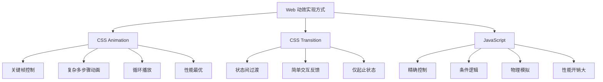

# CSS 动画

## 背景与动机

CSS 动画提供了强大的关键帧动画能力，允许元素从一种样式逐渐变化到另一种样式，无需使用 JavaScript 或 Flash。动画可以播放多次、设置延迟、暂停、反向播放等，是现代网页动效的核心技术之一。

### 为什么需要 CSS 动画？

在 Web 开发中，动效是提升用户体验的重要手段。CSS 动画的出现解决了以下问题：

1. **无需 JavaScript**：纯 CSS 实现动画，减少 JS 开销
2. **性能优化**：浏览器可以优化动画执行，使用 GPU 加速
3. **声明式语法**：通过 @keyframes 定义关键帧，代码更直观
4. **丰富的控制**：支持循环、延迟、方向、填充模式等
5. **事件监听**：提供动画开始、结束、循环等事件

### 动画 vs 过渡 vs JavaScript



### 动画特性全景图

```
CSS Animation
├── 基础属性
│   ├── animation-name          # 动画名称
│   ├── animation-duration      # 动画时长
│   ├── animation-timing-function # 时间函数
│   ├── animation-delay         # 延迟时间
│   ├── animation-iteration-count # 播放次数
│   ├── animation-direction     # 播放方向
│   ├── animation-fill-mode     # 填充模式
│   └── animation-play-state    # 播放状态
├── 高级特性
│   ├── animation-composition   # 动画组合模式（新）
│   ├── animation-timeline      # 动画时间线（新）
│   └── animation-range         # 动画范围（新）
├── 关键帧
│   ├── @keyframes              # 定义动画
│   ├── from / to               # 起止关键帧
│   └── 百分比关键帧            # 多关键帧控制
└── 事件
    ├── animationstart          # 动画开始
    ├── animationend            # 动画结束
    └── animationiteration      # 循环结束
```

## 核心概念

### 与过渡（Transition）的区别

| 特性 | 动画（Animation） | 过渡（Transition） |
|------|------------------|-------------------|
| 触发方式 | 自动触发或 JS 控制 | 需要状态变化触发 |
| 关键帧 | 支持多个关键帧 | 只能定义起止状态 |
| 循环播放 | 支持 infinite | 不支持 |
| 中间状态 | 精确控制 | 自动插值 |
| 复杂程度 | 适合复杂动画 | 适合简单过渡 |
| 反向播放 | 支持 | 需要特殊处理 |
| 性能 | 更优（可预测） | 较好 |

### 属性速查表

| 属性 | 说明 | 默认值 |
|------|------|--------|
| `animation-name` | 动画名称（@keyframes） | none |
| `animation-duration` | 动画时长 | 0s |
| `animation-timing-function` | 时间函数 | ease |
| `animation-delay` | 延迟时间 | 0s |
| `animation-iteration-count` | 播放次数 | 1 |
| `animation-direction` | 播放方向 | normal |
| `animation-fill-mode` | 填充模式 | none |
| `animation-play-state` | 播放状态 | running |
| `animation-composition` | 组合模式（新） | replace |
| `animation-timeline` | 时间线（新） | auto |
| `animation` | 简写属性 | - |

## 深入原理

### 动画执行机制

CSS 动画的执行涉及浏览器的渲染管线：

```
动画执行流程：

┌─────────────────────────────────────────────────────────┐
│                    主线程 (Main Thread)                   │
│  ┌──────────┐  ┌──────────┐  ┌──────────┐              │
│  │  Style   │→│  Layout  │→│  Paint   │              │
│  │ 计算     │  │ 布局     │  │ 绘制     │              │
│  └──────────┘  └──────────┘  └──────────┘              │
│       ↓            ↓            ↓                        │
│  ┌──────────────────────────────────────────┐          │
│  │         合成线程 (Compositor Thread)       │          │
│  │  ┌──────────┐  ┌──────────┐              │          │
│  │  │ Rasterize│→│Composite │              │          │
│  │  │ 栅格化   │  │ 合成     │              │          │
│  │  └──────────┘  └──────────┘              │          │
│  └──────────────────────────────────────────┘          │
└─────────────────────────────────────────────────────────┘
```

### 动画性能分层

动画属性的性能消耗不同：

| 属性类型 | 触发操作 | 性能消耗 | 示例 |
|---------|---------|---------|------|
| 合成层属性 | 仅合成 | 最低 | transform, opacity |
| 绘制属性 | 绘制+合成 | 中等 | color, background |
| 布局属性 | 布局+绘制+合成 | 最高 | width, height, top |

### animation-composition 组合模式

`animation-composition` 是 CSS Animations Level 2 引入的新属性，用于控制多个动画如何组合在一起。

#### 组合模式类型

| 值 | 说明 | 使用场景 |
|----|------|---------|
| `replace` | 后一个动画替换前一个（默认） | 单一动画场景 |
| `add` | 后一个动画效果叠加到前一个 | 累积动画效果 |
| `accumulate` | 后一个动画效果与前一个累积 | 重复动画累积 |

#### 工作原理

```css
/* 场景：元素同时应用两个动画 */
.element {
  animation: 
    moveRight 1s linear,
    moveDown 1s linear;
}

@keyframes moveRight {
  from { transform: translateX(0); }
  to { transform: translateX(100px); }
}

@keyframes moveDown {
  from { transform: translateY(0); }
  to { transform: translateY(100px); }
}

/* 默认 replace 模式：只有 moveDown 生效 */
/* add 模式：两个动画效果叠加，元素向右下移动 */
```

#### 实际应用示例

```css
/* 累积旋转动画 */
@keyframes rotate {
  from { transform: rotate(0deg); }
  to { transform: rotate(360deg); }
}

.spinner {
  animation: rotate 2s linear infinite;
  animation-composition: accumulate;
  /* accumulate 把动画效果叠加到元素底层的 transform 值上；
     多个动画作用于同一属性时也按叠加而非替换组合。
     注意：组合不跨循环累积，单动画且无底层 transform 时与默认效果接近 */
}

/* 弹跳累积效果 */
@keyframes bounce-up {
  0%, 100% { transform: translateY(0); }
  50% { transform: translateY(-20px); }
}

@keyframes bounce-down {
  0%, 100% { transform: translateY(0); }
  50% { transform: translateY(20px); }
}

.bouncing {
  animation: 
    bounce-up 1s ease-in-out infinite,
    bounce-down 0.5s ease-in-out infinite;
  animation-composition: add;
  /* 两个弹跳效果叠加 */
}
```

### view-timeline 滚动驱动动画

`animation-timeline` 是 CSS Scroll-driven Animations 规范引入的属性，允许动画进度与滚动位置关联。

#### 时间线类型

| 类型 | 说明 | 使用场景 |
|------|------|---------|
| `auto` | 默认时间线 | 普通动画 |
| `scroll()` | 基于滚动容器的滚动进度 | 滚动进度条 |
| `view()` | 基于元素在视口中的可见性 | 滚动揭示动画 |

#### scroll() 时间线

```css
/* 滚动进度条 */
.scroll-progress {
  position: fixed;
  top: 0;
  left: 0;
  width: 100%;
  height: 4px;
  background: linear-gradient(90deg, #667eea, #764ba2);
  transform-origin: left;
  transform: scaleX(0);
  animation: progress linear;
  animation-timeline: scroll();
}

@keyframes progress {
  to { transform: scaleX(1); }
}
```

#### view() 时间线

```css
/* 元素进入视口时显示 */
.reveal-element {
  opacity: 0;
  transform: translateY(50px);
  animation: reveal linear both;
  animation-timeline: view();
  animation-range: entry 0% entry 100%;
}

@keyframes reveal {
  to {
    opacity: 1;
    transform: translateY(0);
  }
}
```

#### animation-range 控制范围

```css
/* 完整语法 */
animation-range: <start> <end>;

/* 关键字 */
animation-range: entry 0% entry 100%;    /* 进入视口时 */
animation-range: cover 0% cover 100%;    /* 覆盖整个视口 */
animation-range: contain 0% contain 100%; /* 完全在视口内 */
animation-range: entry 25% exit 75%;     /* 自定义范围 */

/* 实际示例 */
.parallax {
  animation: parallax linear;
  animation-timeline: view();
  animation-range: entry 0% exit 100%;
}

@keyframes parallax {
  from { transform: translateY(100px); }
  to { transform: translateY(-100px); }
}
```

### 动画性能优化原理

#### GPU 加速机制

```css
/* 方式 1：使用 3D 变换触发合成层 */
.gpu-accelerated {
  transform: translateZ(0);
  /* 或 */
  transform: translate3d(0, 0, 0);
}

/* 方式 2：使用 will-change 提示浏览器 */
.will-change-element {
  will-change: transform, opacity;
}

/* 方式 3：使用 contain 属性 */
.contain-element {
  contain: layout style paint;
}
```

#### 合成层工作原理

```
合成层（Compositing Layer）架构：

┌─────────────────────────────────────────┐
│           主线程 (CPU)                   │
│  ┌─────────┐  ┌─────────┐  ┌─────────┐ │
│  │ Layer 1 │  │ Layer 2 │  │ Layer 3 │ │
│  │ (静态)  │  │ (动画)  │  │ (静态)  │ │
│  └─────────┘  └─────────┘  └─────────┘ │
└─────────────────────────────────────────┘
              │
              ▼ 栅格化（Rasterize）
┌─────────────────────────────────────────┐
│           GPU 线程                       │
│  ┌─────────┐  ┌─────────┐  ┌─────────┐ │
│  │Texture 1│  │Texture 2│  │Texture 3│ │
│  └─────────┘  └─────────┘  └─────────┘ │
│              │                          │
│              ▼ 合成（Composite）         │
│         ┌─────────┐                     │
│         │ 最终画面 │                     │
│         └─────────┘                     │
└─────────────────────────────────────────┘
```

#### 性能优化策略

```css
/* ✅ 推荐：使用 transform 和 opacity */
@keyframes optimized {
  from {
    transform: translateY(0);
    opacity: 1;
  }
  to {
    transform: translateY(100px);
    opacity: 0;
  }
}

/* ❌ 避免：使用布局属性 */
@keyframes bad {
  from {
    width: 100px;    /* 触发布局重排 */
    height: 100px;   /* 触发布局重排 */
    top: 0;          /* 触发布局重排 */
    left: 0;         /* 触发布局重排 */
  }
  to {
    width: 200px;
    height: 200px;
    top: 100px;
    left: 100px;
  }
}

/* ✅ 推荐：使用 transform 替代 */
@keyframes good {
  from {
    transform: translate(0, 0) scale(1);
  }
  to {
    transform: translate(100px, 100px) scale(2);
  }
}
```

## 代码示例

### @keyframes 定义动画

#### 基本语法

```css
@keyframes animation-name {
  from { /* 起始状态，等同于 0% */ }
  to { /* 结束状态，等同于 100% */ }
}

/* 或使用百分比定义多个关键帧 */
@keyframes animation-name {
  0% { /* 起始状态 */ }
  25% { /* 第25%时的状态 */ }
  50% { /* 第50%时的状态 */ }
  75% { /* 第75%时的状态 */ }
  100% { /* 结束状态 */ }
}
```

#### 关键帧规则

```css
/* 多个关键帧共享相同样式 */
@keyframes bounce {
  0%, 100% {  /* 起始和结束状态相同 */
    transform: translateY(0);
  }
  50% {
    transform: translateY(-30px);
  }
}

/* 重复定义时，后面的会覆盖前面的 */
@keyframes example {
  0% { opacity: 0; }
  0% { opacity: 1; } /* 这个会覆盖上面的 */
}
```

#### 基础动画示例

```css
/* 淡入动画 */
@keyframes fadeIn {
  from {
    opacity: 0;
  }
  to {
    opacity: 1;
  }
}

.fade-in {
  animation: fadeIn 1s ease forwards;
}

/* 弹跳动画 */
@keyframes bounce {
  0%, 100% {
    transform: translateY(0);
  }
  50% {
    transform: translateY(-30px);
  }
}

.bounce {
  animation: bounce 1s ease infinite;
}

/* 复杂多属性动画 */
@keyframes complex {
  0% {
    opacity: 0;
    transform: translateX(-100px) scale(0.8);
  }
  50% {
    opacity: 1;
    transform: translateX(0) scale(1);
  }
  100% {
    opacity: 0;
    transform: translateX(100px) scale(0.8);
  }
}

.complex {
  animation: complex 2s ease-in-out;
}
```

### animation 属性详解

#### animation-name 动画名称

```css
.element {
  animation-name: fadeIn;
  animation-name: bounce, spin; /* 多个动画 */
}
```


##### animation-name 交互演示（MDN）

指定动画名称，对应 @keyframes 中定义的动画。

```html
<!DOCTYPE html>
<html lang="zh-CN">
  <head>
    <meta charset="UTF-8" />
    <meta name="viewport" content="width=device-width, initial-scale=1.0" />
    <title>animation-name 属性演示 - MDN 示例</title>
    <meta name="description" content="animation-name 属性演示" />
    <style>
      * {
        margin: 0;
        padding: 0;
        box-sizing: border-box;
      }
      body {
        font-family: -apple-system, BlinkMacSystemFont, "Segoe UI", Roboto, "Helvetica Neue", Arial, sans-serif;
        min-height: 100vh;
        padding: 0;
      }
      .demo-layout {
        display: flex;
        height: 100vh;
        gap: 0;
      }
      .snippet-panel {
        width: 320px;
        flex-shrink: 0;
        padding: 16px;
        display: flex;
        flex-direction: column;
        gap: 8px;
        overflow-y: auto;
        border-right: 1px solid #ddd;
        background: #fafafa;
      }
      .snippet-btn {
        padding: 10px 14px;
        border: 1px solid #ccc;
        border-radius: 6px;
        background: #fff;
        font-family: "JetBrains Mono", "Fira Code", monospace;
        font-size: 13px;
        color: #333;
        cursor: pointer;
        text-align: left;
        transition: all 0.2s;
        line-height: 1.4;
      }
      .snippet-btn:hover {
        border-color: #8083ff;
        background: #f0f0ff;
      }
      .snippet-btn.active {
        border-color: #8083ff;
        background: #e8e8ff;
        color: #571bc1;
        font-weight: 600;
      }
      .preview-panel {
        flex: 1;
        padding: 16px;
        display: flex;
        align-items: center;
        justify-content: center;
        background: #fff;
        overflow: auto;
      }
      .preview-panel > section,
      .preview-panel > div:not(.snippet-panel):not(.demo-layout) {
        flex: 1;
        width: 100%;
        min-height: 0;
        height: 100%;
        display: flex;
        align-items: center;
        justify-content: center;
      }
      #example-element {
        animation-direction: alternate;
        animation-duration: 1s;
        animation-iteration-count: infinite;
        animation-timing-function: ease-in;
        background-color: #1766aa;
        border-radius: 50%;
        border: 5px solid #333;
        color: white;
        height: 150px;
        margin: auto;
        margin-left: 0;
        width: 150px;
      }

      @keyframes slide {
        from {
          background-color: orange;
          color: black;
          margin-left: 0;
        }

        to {
          background-color: orange;
          color: black;
          margin-left: 80%;
        }
      }

      @keyframes bounce {
        from {
          background-color: orange;
          color: black;
          margin-top: 0;
        }

        to {
          background-color: orange;
          color: black;
          margin-top: 40%;
        }
      }
    </style>
  </head>
  <body>
    <div class="demo-layout">
      <div class="snippet-panel">
        <button class="snippet-btn active" data-index="0">animation-name: none;</button>
        <button class="snippet-btn" data-index="1">animation-name: slide;</button>
        <button class="snippet-btn" data-index="2">animation-name: bounce;</button>
      </div>
      <div class="preview-panel">
        <section class="flex-column" id="default-example">
          <div class="animating" id="example-element"></div>
        </section>
      </div>
    </div>
    <script>
      const snippets = [
        `#example-element {
  animation-name: none;
}`,
        `#example-element {
  animation-name: slide;
}`,
        `#example-element {
  animation-name: bounce;
}`,
      ];

      let styleEl = document.createElement("style");
      document.head.appendChild(styleEl);

      function applySnippet(index) {
        styleEl.textContent = snippets[index];
        document.querySelectorAll(".snippet-btn").forEach((btn, i) => {
          btn.classList.toggle("active", i === index);
        });
      }

      document.querySelectorAll(".snippet-btn").forEach((btn) => {
        btn.addEventListener("click", () => applySnippet(parseInt(btn.dataset.index)));
      });

      applySnippet(0);
    </script>
  </body>
</html>

```
#### animation-duration 动画时长

```css
.element {
  animation-duration: 1s;     /* 1秒 */
  animation-duration: 500ms;  /* 500毫秒 */
  animation-duration: 0.5s;   /* 0.5秒 */
}

/* 多个动画使用不同时长 */
.element {
  animation-name: fadeIn, slideIn;
  animation-duration: 1s, 0.5s;
}
```

**注意**：如果未设置时长或设置为 0s，动画不会播放。


##### animation-duration 交互演示（MDN）

设置动画播放一次所需时长。

```html
<!DOCTYPE html>
<html lang="zh-CN">
  <head>
    <meta charset="UTF-8" />
    <meta name="viewport" content="width=device-width, initial-scale=1.0" />
    <title>animation-duration 属性演示 - MDN 示例</title>
    <meta name="description" content="animation-duration 属性演示" />
    <style>
      * {
        margin: 0;
        padding: 0;
        box-sizing: border-box;
      }
      body {
        font-family: -apple-system, BlinkMacSystemFont, "Segoe UI", Roboto, "Helvetica Neue", Arial, sans-serif;
        min-height: 100vh;
        padding: 0;
      }
      .demo-layout {
        display: flex;
        height: 100vh;
        gap: 0;
      }
      .snippet-panel {
        width: 320px;
        flex-shrink: 0;
        padding: 16px;
        display: flex;
        flex-direction: column;
        gap: 8px;
        overflow-y: auto;
        border-right: 1px solid #ddd;
        background: #fafafa;
      }
      .snippet-btn {
        padding: 10px 14px;
        border: 1px solid #ccc;
        border-radius: 6px;
        background: #fff;
        font-family: "JetBrains Mono", "Fira Code", monospace;
        font-size: 13px;
        color: #333;
        cursor: pointer;
        text-align: left;
        transition: all 0.2s;
        line-height: 1.4;
      }
      .snippet-btn:hover {
        border-color: #8083ff;
        background: #f0f0ff;
      }
      .snippet-btn.active {
        border-color: #8083ff;
        background: #e8e8ff;
        color: #571bc1;
        font-weight: 600;
      }
      .preview-panel {
        flex: 1;
        padding: 16px;
        display: flex;
        align-items: center;
        justify-content: center;
        background: #fff;
        overflow: auto;
      }
      .preview-panel > section,
      .preview-panel > div:not(.snippet-panel):not(.demo-layout) {
        flex: 1;
        width: 100%;
        min-height: 0;
        height: 100%;
        display: flex;
        align-items: center;
        justify-content: center;
      }
      #example-element {
        animation-direction: alternate;
        animation-iteration-count: infinite;
        animation-name: slide;
        animation-play-state: paused;
        animation-timing-function: ease-in;
        background-color: #1766aa;
        border-radius: 50%;
        border: 5px solid #333;
        color: white;
        height: 150px;
        margin: auto;
        margin-left: 0;
        width: 150px;
      }

      #example-element.running {
        animation-play-state: running;
      }

      #play-pause {
        font-size: 2rem;
      }

      @keyframes slide {
        from {
          background-color: orange;
          color: black;
          margin-left: 0;
        }

        to {
          background-color: orange;
          color: black;
          margin-left: 80%;
        }
      }
    </style>
  </head>
  <body>
    <div class="demo-layout">
      <div class="snippet-panel">
        <button class="snippet-btn active" data-index="0">animation-duration: 750ms;</button>
        <button class="snippet-btn" data-index="1">animation-duration: 3s;</button>
        <button class="snippet-btn" data-index="2">animation-duration: 0s;</button>
      </div>
      <div class="preview-panel">
        <section class="flex-column" id="default-example">
          <div class="animating" id="example-element"></div>
          <button id="play-pause">Play</button>
        </section>
      </div>
    </div>
    <script>
      const snippets = [
        `#example-element {
  animation-duration: 750ms;
}`,
        `#example-element {
  animation-duration: 3s;
}`,
        `#example-element {
  animation-duration: 0s;
}`,
      ];

      let styleEl = document.createElement("style");
      document.head.appendChild(styleEl);

      function applySnippet(index) {
        styleEl.textContent = snippets[index];
        document.querySelectorAll(".snippet-btn").forEach((btn, i) => {
          btn.classList.toggle("active", i === index);
        });
      }

      document.querySelectorAll(".snippet-btn").forEach((btn) => {
        btn.addEventListener("click", () => applySnippet(parseInt(btn.dataset.index)));
      });

      applySnippet(0);
    </script>
  </body>
</html>

```
#### animation-timing-function 时间函数

```css
.element {
  animation-timing-function: linear;       /* 匀速 */
  animation-timing-function: ease;         /* 默认：慢-快-慢 */
  animation-timing-function: ease-in;      /* 慢开始 */
  animation-timing-function: ease-out;     /* 慢结束 */
  animation-timing-function: ease-in-out;  /* 慢开始和结束 */
}

/* 自定义贝塞尔曲线 */
.element {
  animation-timing-function: cubic-bezier(0.25, 0.1, 0.25, 1);
  /* 弹性效果 */
  animation-timing-function: cubic-bezier(0.68, -0.55, 0.27, 1.55);
}

/* 阶梯函数 */
.element {
  animation-timing-function: steps(4, end);   /* 结束时跳跃 */
  animation-timing-function: steps(4, start); /* 开始时跳跃 */
}
```


##### animation-timing-function 交互演示（MDN）

设置动画的速度曲线。

```html
<!DOCTYPE html>
<html lang="zh-CN">
  <head>
    <meta charset="UTF-8" />
    <meta name="viewport" content="width=device-width, initial-scale=1.0" />
    <title>animation-timing-function 属性演示 - MDN 示例</title>
    <meta name="description" content="animation-timing-function 属性演示" />
    <style>
      * {
        margin: 0;
        padding: 0;
        box-sizing: border-box;
      }
      body {
        font-family: -apple-system, BlinkMacSystemFont, "Segoe UI", Roboto, "Helvetica Neue", Arial, sans-serif;
        min-height: 100vh;
        padding: 0;
      }
      .demo-layout {
        display: flex;
        height: 100vh;
        gap: 0;
      }
      .snippet-panel {
        width: 320px;
        flex-shrink: 0;
        padding: 16px;
        display: flex;
        flex-direction: column;
        gap: 8px;
        overflow-y: auto;
        border-right: 1px solid #ddd;
        background: #fafafa;
      }
      .snippet-btn {
        padding: 10px 14px;
        border: 1px solid #ccc;
        border-radius: 6px;
        background: #fff;
        font-family: "JetBrains Mono", "Fira Code", monospace;
        font-size: 13px;
        color: #333;
        cursor: pointer;
        text-align: left;
        transition: all 0.2s;
        line-height: 1.4;
      }
      .snippet-btn:hover {
        border-color: #8083ff;
        background: #f0f0ff;
      }
      .snippet-btn.active {
        border-color: #8083ff;
        background: #e8e8ff;
        color: #571bc1;
        font-weight: 600;
      }
      .preview-panel {
        flex: 1;
        padding: 16px;
        display: flex;
        align-items: center;
        justify-content: center;
        background: #fff;
        overflow: auto;
      }
      .preview-panel > section,
      .preview-panel > div:not(.snippet-panel):not(.demo-layout) {
        flex: 1;
        width: 100%;
        min-height: 0;
        height: 100%;
        display: flex;
        align-items: center;
        justify-content: center;
      }
      #example-element {
        animation-duration: 3s;
        animation-iteration-count: infinite;
        animation-name: slide;
        animation-play-state: paused;
        background-color: #1766aa;
        border-radius: 50%;
        border: 5px solid #333;
        color: white;
        height: 150px;
        margin: auto;
        margin-left: 0;
        width: 150px;
      }

      #example-element.running {
        animation-play-state: running;
      }

      #play-pause {
        font-size: 2rem;
      }

      @keyframes slide {
        from {
          background-color: orange;
          color: black;
          margin-left: 0;
        }

        to {
          background-color: orange;
          color: black;
          margin-left: 80%;
        }
      }
    </style>
  </head>
  <body>
    <div class="demo-layout">
      <div class="snippet-panel">
        <button class="snippet-btn active" data-index="0">animation-timing-function: linear;</button>
        <button class="snippet-btn" data-index="1">animation-timing-function: ease-in-out;</button>
        <button class="snippet-btn" data-index="2">animation-timing-function: steps(5, end);</button>
        <button class="snippet-btn" data-index="3">animation-timing-function: cubic-bezier(0.1, -0.6, 0.2, 0);</button>
      </div>
      <div class="preview-panel">
        <section class="flex-column" id="default-example">
          <div class="animating" id="example-element"></div>
          <button id="play-pause">Play</button>
        </section>
      </div>
    </div>
    <script>
      const snippets = [
        `#example-element {
  animation-timing-function: linear;
}`,
        `#example-element {
  animation-timing-function: ease-in-out;
}`,
        `#example-element {
  animation-timing-function: steps(5, end);
}`,
        `#example-element {
  animation-timing-function: cubic-bezier(0.1, -0.6, 0.2, 0);
}`,
      ];

      let styleEl = document.createElement("style");
      document.head.appendChild(styleEl);

      function applySnippet(index) {
        styleEl.textContent = snippets[index];
        document.querySelectorAll(".snippet-btn").forEach((btn, i) => {
          btn.classList.toggle("active", i === index);
        });
      }

      document.querySelectorAll(".snippet-btn").forEach((btn) => {
        btn.addEventListener("click", () => applySnippet(parseInt(btn.dataset.index)));
      });

      applySnippet(0);
    </script>
  </body>
</html>

```
#### animation-delay 延迟时间

```css
.element {
  animation-delay: 0s;      /* 立即开始 */
  animation-delay: 200ms;   /* 延迟200毫秒 */
  animation-delay: 1s;      /* 延迟1秒 */
  animation-delay: -1s;     /* 负值：从动画第1秒处开始 */
}

/* 交错动画效果 */
.item:nth-child(1) { animation-delay: 0s; }
.item:nth-child(2) { animation-delay: 0.1s; }
.item:nth-child(3) { animation-delay: 0.2s; }
```


##### animation-delay 交互演示（MDN）

设置动画开始前的延迟时间，可为负值（立即开始到中途）。

```html
<!DOCTYPE html>
<html lang="zh-CN">
  <head>
    <meta charset="UTF-8" />
    <meta name="viewport" content="width=device-width, initial-scale=1.0" />
    <title>animation-delay 属性演示 - MDN 示例</title>
    <meta name="description" content="animation-delay 属性演示" />
    <style>
      * {
        margin: 0;
        padding: 0;
        box-sizing: border-box;
      }
      body {
        font-family: -apple-system, BlinkMacSystemFont, "Segoe UI", Roboto, "Helvetica Neue", Arial, sans-serif;
        min-height: 100vh;
        padding: 0;
      }
      .demo-layout {
        display: flex;
        height: 100vh;
        gap: 0;
      }
      .snippet-panel {
        width: 320px;
        flex-shrink: 0;
        padding: 16px;
        display: flex;
        flex-direction: column;
        gap: 8px;
        overflow-y: auto;
        border-right: 1px solid #ddd;
        background: #fafafa;
      }
      .snippet-btn {
        padding: 10px 14px;
        border: 1px solid #ccc;
        border-radius: 6px;
        background: #fff;
        font-family: "JetBrains Mono", "Fira Code", monospace;
        font-size: 13px;
        color: #333;
        cursor: pointer;
        text-align: left;
        transition: all 0.2s;
        line-height: 1.4;
      }
      .snippet-btn:hover {
        border-color: #8083ff;
        background: #f0f0ff;
      }
      .snippet-btn.active {
        border-color: #8083ff;
        background: #e8e8ff;
        color: #571bc1;
        font-weight: 600;
      }
      .preview-panel {
        flex: 1;
        padding: 16px;
        display: flex;
        align-items: center;
        justify-content: center;
        background: #fff;
        overflow: auto;
      }
      .preview-panel > section,
      .preview-panel > div:not(.snippet-panel):not(.demo-layout) {
        flex: 1;
        width: 100%;
        min-height: 0;
        height: 100%;
        display: flex;
        align-items: center;
        justify-content: center;
      }
      #example-element {
        background-color: #1766aa;
        color: white;
        margin: auto;
        margin-left: 0;
        border: 5px solid #333;
        width: 150px;
        height: 150px;
        border-radius: 50%;
        display: flex;
        justify-content: center;
        align-items: center;
        flex-direction: column;
      }

      #playstatus {
        font-weight: bold;
      }

      .animating {
        animation-name: slide;
        animation-duration: 3s;
        animation-timing-function: ease-in;
        animation-iteration-count: 2;
        animation-direction: alternate;
      }

      @keyframes slide {
        from {
          background-color: orange;
          color: black;
          margin-left: 0;
        }

        to {
          background-color: orange;
          color: black;
          margin-left: 80%;
        }
      }
    </style>
  </head>
  <body>
    <div class="demo-layout">
      <div class="snippet-panel">
        <button class="snippet-btn active" data-index="0">animation-delay: 250ms;</button>
        <button class="snippet-btn" data-index="1">animation-delay: 2s;</button>
        <button class="snippet-btn" data-index="2">animation-delay: -2s;</button>
      </div>
      <div class="preview-panel">
        <section class="flex-column" id="default-example">
          <div>Animation <span id="playstatus"></span></div>
          <div id="example-element">Select a delay to start!</div>
        </section>
      </div>
    </div>
    <script>
      const snippets = [
        `#example-element {
  animation-delay: 250ms;
}`,
        `#example-element {
  animation-delay: 2s;
}`,
        `#example-element {
  animation-delay: -2s;
}`,
      ];

      let styleEl = document.createElement("style");
      document.head.appendChild(styleEl);

      function applySnippet(index) {
        styleEl.textContent = snippets[index];
        document.querySelectorAll(".snippet-btn").forEach((btn, i) => {
          btn.classList.toggle("active", i === index);
        });
      }

      document.querySelectorAll(".snippet-btn").forEach((btn) => {
        btn.addEventListener("click", () => applySnippet(parseInt(btn.dataset.index)));
      });

      applySnippet(0);
    </script>
  </body>
</html>

```
#### animation-iteration-count 播放次数

```css
.element {
  animation-iteration-count: 1;        /* 默认：播放1次 */
  animation-iteration-count: 3;        /* 播放3次 */
  animation-iteration-count: infinite; /* 无限循环 */
  animation-iteration-count: 2.5;      /* 小数：播放2.5次 */
}
```


##### animation-iteration-count 交互演示（MDN）

设置动画播放次数（数字或 infinite）。

```html
<!DOCTYPE html>
<html lang="zh-CN">
  <head>
    <meta charset="UTF-8" />
    <meta name="viewport" content="width=device-width, initial-scale=1.0" />
    <title>animation-iteration-count 属性演示 - MDN 示例</title>
    <meta name="description" content="animation-iteration-count 属性演示" />
    <style>
      * {
        margin: 0;
        padding: 0;
        box-sizing: border-box;
      }
      body {
        font-family: -apple-system, BlinkMacSystemFont, "Segoe UI", Roboto, "Helvetica Neue", Arial, sans-serif;
        min-height: 100vh;
        padding: 0;
      }
      .demo-layout {
        display: flex;
        height: 100vh;
        gap: 0;
      }
      .snippet-panel {
        width: 320px;
        flex-shrink: 0;
        padding: 16px;
        display: flex;
        flex-direction: column;
        gap: 8px;
        overflow-y: auto;
        border-right: 1px solid #ddd;
        background: #fafafa;
      }
      .snippet-btn {
        padding: 10px 14px;
        border: 1px solid #ccc;
        border-radius: 6px;
        background: #fff;
        font-family: "JetBrains Mono", "Fira Code", monospace;
        font-size: 13px;
        color: #333;
        cursor: pointer;
        text-align: left;
        transition: all 0.2s;
        line-height: 1.4;
      }
      .snippet-btn:hover {
        border-color: #8083ff;
        background: #f0f0ff;
      }
      .snippet-btn.active {
        border-color: #8083ff;
        background: #e8e8ff;
        color: #571bc1;
        font-weight: 600;
      }
      .preview-panel {
        flex: 1;
        padding: 16px;
        display: flex;
        align-items: center;
        justify-content: center;
        background: #fff;
        overflow: auto;
      }
      .preview-panel > section,
      .preview-panel > div:not(.snippet-panel):not(.demo-layout) {
        flex: 1;
        width: 100%;
        min-height: 0;
        height: 100%;
        display: flex;
        align-items: center;
        justify-content: center;
      }
      #example-element {
        align-items: center;
        background-color: #1766aa;
        border-radius: 50%;
        border: 5px solid #333;
        color: white;
        display: flex;
        flex-direction: column;
        height: 150px;
        justify-content: center;
        margin: auto;
        margin-left: 0;
        width: 150px;
      }

      #playstatus {
        font-weight: bold;
      }

      .animating {
        animation-name: slide;
        animation-duration: 3s;
        animation-timing-function: ease-in;
      }

      @keyframes slide {
        from {
          background-color: orange;
          color: black;
          margin-left: 0;
        }

        to {
          background-color: orange;
          color: black;
          margin-left: 80%;
        }
      }
    </style>
  </head>
  <body>
    <div class="demo-layout">
      <div class="snippet-panel">
        <button class="snippet-btn active" data-index="0">animation-iteration-count: 0;</button>
        <button class="snippet-btn" data-index="1">animation-iteration-count: 2;</button>
        <button class="snippet-btn" data-index="2">animation-iteration-count: 1.5;</button>
      </div>
      <div class="preview-panel">
        <section class="flex-column" id="default-example">
          <div>Animation <span id="playstatus"></span></div>
          <div id="example-element">Select a count to start!</div>
        </section>
      </div>
    </div>
    <script>
      const snippets = [
        `#example-element {
  animation-iteration-count: 0;
}`,
        `#example-element {
  animation-iteration-count: 2;
}`,
        `#example-element {
  animation-iteration-count: 1.5;
}`,
      ];

      let styleEl = document.createElement("style");
      document.head.appendChild(styleEl);

      function applySnippet(index) {
        styleEl.textContent = snippets[index];
        document.querySelectorAll(".snippet-btn").forEach((btn, i) => {
          btn.classList.toggle("active", i === index);
        });
      }

      document.querySelectorAll(".snippet-btn").forEach((btn) => {
        btn.addEventListener("click", () => applySnippet(parseInt(btn.dataset.index)));
      });

      applySnippet(0);
    </script>
  </body>
</html>

```
#### animation-direction 播放方向

```css
.element {
  animation-direction: normal;            /* 默认：正向播放 */
  animation-direction: reverse;           /* 反向播放 */
  animation-direction: alternate;         /* 正向然后反向交替 */
  animation-direction: alternate-reverse; /* 反向然后正向交替 */
}
```


##### animation-direction 交互演示（MDN）

设置动画播放方向（normal/reverse/alternate）。

```html
<!DOCTYPE html>
<html lang="zh-CN">
  <head>
    <meta charset="UTF-8" />
    <meta name="viewport" content="width=device-width, initial-scale=1.0" />
    <title>animation-direction 属性演示 - MDN 示例</title>
    <meta name="description" content="animation-direction 属性演示" />
    <style>
      * {
        margin: 0;
        padding: 0;
        box-sizing: border-box;
      }
      body {
        font-family: -apple-system, BlinkMacSystemFont, "Segoe UI", Roboto, "Helvetica Neue", Arial, sans-serif;
        min-height: 100vh;
        padding: 0;
      }
      .demo-layout {
        display: flex;
        height: 100vh;
        gap: 0;
      }
      .snippet-panel {
        width: 320px;
        flex-shrink: 0;
        padding: 16px;
        display: flex;
        flex-direction: column;
        gap: 8px;
        overflow-y: auto;
        border-right: 1px solid #ddd;
        background: #fafafa;
      }
      .snippet-btn {
        padding: 10px 14px;
        border: 1px solid #ccc;
        border-radius: 6px;
        background: #fff;
        font-family: "JetBrains Mono", "Fira Code", monospace;
        font-size: 13px;
        color: #333;
        cursor: pointer;
        text-align: left;
        transition: all 0.2s;
        line-height: 1.4;
      }
      .snippet-btn:hover {
        border-color: #8083ff;
        background: #f0f0ff;
      }
      .snippet-btn.active {
        border-color: #8083ff;
        background: #e8e8ff;
        color: #571bc1;
        font-weight: 600;
      }
      .preview-panel {
        flex: 1;
        padding: 16px;
        display: flex;
        align-items: center;
        justify-content: center;
        background: #fff;
        overflow: auto;
      }
      .preview-panel > section,
      .preview-panel > div:not(.snippet-panel):not(.demo-layout) {
        flex: 1;
        width: 100%;
        min-height: 0;
        height: 100%;
        display: flex;
        align-items: center;
        justify-content: center;
      }
      #example-element {
        animation-duration: 3s;
        animation-iteration-count: infinite;
        animation-name: slide;
        animation-play-state: paused;
        animation-timing-function: ease-in;
        background-color: #1766aa;
        border-radius: 50%;
        border: 5px solid #333;
        color: white;
        height: 150px;
        margin: auto;
        margin-left: 0;
        width: 150px;
      }

      #example-element.running {
        animation-play-state: running;
      }

      #play-pause {
        font-size: 2rem;
      }

      @keyframes slide {
        from {
          background-color: orange;
          color: black;
          margin-left: 0;
        }

        to {
          background-color: orange;
          color: black;
          margin-left: 80%;
        }
      }
    </style>
  </head>
  <body>
    <div class="demo-layout">
      <div class="snippet-panel">
        <button class="snippet-btn active" data-index="0">animation-direction: normal;</button>
        <button class="snippet-btn" data-index="1">animation-direction: reverse;</button>
        <button class="snippet-btn" data-index="2">animation-direction: alternate;</button>
        <button class="snippet-btn" data-index="3">animation-direction: alternate-reverse;</button>
      </div>
      <div class="preview-panel">
        <section class="flex-column" id="default-example">
          <div id="example-element"></div>
          <button id="play-pause">Play</button>
        </section>
      </div>
    </div>
    <script>
      const snippets = [
        `#example-element {
  animation-direction: normal;
}`,
        `#example-element {
  animation-direction: reverse;
}`,
        `#example-element {
  animation-direction: alternate;
}`,
        `#example-element {
  animation-direction: alternate-reverse;
}`,
      ];

      let styleEl = document.createElement("style");
      document.head.appendChild(styleEl);

      function applySnippet(index) {
        styleEl.textContent = snippets[index];
        document.querySelectorAll(".snippet-btn").forEach((btn, i) => {
          btn.classList.toggle("active", i === index);
        });
      }

      document.querySelectorAll(".snippet-btn").forEach((btn) => {
        btn.addEventListener("click", () => applySnippet(parseInt(btn.dataset.index)));
      });

      applySnippet(0);
    </script>
  </body>
</html>

```
#### animation-fill-mode 填充模式

```css
.element {
  animation-fill-mode: none;      /* 默认：动画外不应用任何样式 */
  animation-fill-mode: forwards;  /* 保持结束状态 */
  animation-fill-mode: backwards; /* 保持开始状态 */
  animation-fill-mode: both;      /* 两端都保持 */
}
```


##### animation-fill-mode 交互演示（MDN）

设置动画播放前后元素的样式保持方式。

```html
<!DOCTYPE html>
<html lang="zh-CN">
  <head>
    <meta charset="UTF-8" />
    <meta name="viewport" content="width=device-width, initial-scale=1.0" />
    <title>animation-fill-mode 属性演示 - MDN 示例</title>
    <meta name="description" content="animation-fill-mode 属性演示" />
    <style>
      * {
        margin: 0;
        padding: 0;
        box-sizing: border-box;
      }
      body {
        font-family: -apple-system, BlinkMacSystemFont, "Segoe UI", Roboto, "Helvetica Neue", Arial, sans-serif;
        min-height: 100vh;
        padding: 0;
      }
      .demo-layout {
        display: flex;
        height: 100vh;
        gap: 0;
      }
      .snippet-panel {
        width: 320px;
        flex-shrink: 0;
        padding: 16px;
        display: flex;
        flex-direction: column;
        gap: 8px;
        overflow-y: auto;
        border-right: 1px solid #ddd;
        background: #fafafa;
      }
      .snippet-btn {
        padding: 10px 14px;
        border: 1px solid #ccc;
        border-radius: 6px;
        background: #fff;
        font-family: "JetBrains Mono", "Fira Code", monospace;
        font-size: 13px;
        color: #333;
        cursor: pointer;
        text-align: left;
        transition: all 0.2s;
        line-height: 1.4;
      }
      .snippet-btn:hover {
        border-color: #8083ff;
        background: #f0f0ff;
      }
      .snippet-btn.active {
        border-color: #8083ff;
        background: #e8e8ff;
        color: #571bc1;
        font-weight: 600;
      }
      .preview-panel {
        flex: 1;
        padding: 16px;
        display: flex;
        align-items: center;
        justify-content: center;
        background: #fff;
        overflow: auto;
      }
      .preview-panel > section,
      .preview-panel > div:not(.snippet-panel):not(.demo-layout) {
        flex: 1;
        width: 100%;
        min-height: 0;
        height: 100%;
        display: flex;
        align-items: center;
        justify-content: center;
      }
      #example-element {
        background-color: #1766aa;
        color: white;
        margin: auto;
        margin-left: 0;
        border: 5px solid #333;
        width: 150px;
        height: 150px;
        border-radius: 50%;
        display: flex;
        justify-content: center;
        align-items: center;
        flex-direction: column;
      }

      #playstatus {
        font-weight: bold;
      }

      .animating {
        animation: slide 1s ease-in 1;
      }

      @keyframes slide {
        from {
          background-color: orange;
          color: black;
          margin-left: 0;
        }

        to {
          background-color: orange;
          color: black;
          margin-left: 80%;
        }
      }
    </style>
  </head>
  <body>
    <div class="demo-layout">
      <div class="snippet-panel">
        <button class="snippet-btn active" data-index="0">animation-fill-mode: none;</button>
        <button class="snippet-btn" data-index="1">animation-fill-mode: forwards;</button>
        <button class="snippet-btn" data-index="2">animation-fill-mode: backwards;</button>
        <button class="snippet-btn" data-index="3">animation-fill-mode: both;</button>
      </div>
      <div class="preview-panel">
        <section class="flex-column" id="default-example">
          <div>Animation <span id="playstatus"></span></div>
          <div id="example-element">Select a mode to start!</div>
        </section>
      </div>
    </div>
    <script>
      const snippets = [
        `#example-element {
  animation-fill-mode: none;
animation-delay: 1s;
}`,
        `#example-element {
  animation-fill-mode: forwards;
animation-delay: 1s;
}`,
        `#example-element {
  animation-fill-mode: backwards;
animation-delay: 1s;
}`,
        `#example-element {
  animation-fill-mode: both;
animation-delay: 1s;
}`,
      ];

      let styleEl = document.createElement("style");
      document.head.appendChild(styleEl);

      function applySnippet(index) {
        styleEl.textContent = snippets[index];
        document.querySelectorAll(".snippet-btn").forEach((btn, i) => {
          btn.classList.toggle("active", i === index);
        });
      }

      document.querySelectorAll(".snippet-btn").forEach((btn) => {
        btn.addEventListener("click", () => applySnippet(parseInt(btn.dataset.index)));
      });

      applySnippet(0);
    </script>
  </body>
</html>

```
#### animation-play-state 播放状态

```css
.element {
  animation-play-state: running; /* 默认：播放 */
  animation-play-state: paused;  /* 暂停 */
}

/* 悬停时暂停 */
.element:hover {
  animation-play-state: paused;
}
```


##### animation-play-state 交互演示（MDN）

控制动画的运行/暂停状态。

```html
<!DOCTYPE html>
<html lang="zh-CN">
  <head>
    <meta charset="UTF-8" />
    <meta name="viewport" content="width=device-width, initial-scale=1.0" />
    <title>animation-play-state 属性演示 - MDN 示例</title>
    <meta name="description" content="animation-play-state 属性演示" />
    <style>
      * {
        margin: 0;
        padding: 0;
        box-sizing: border-box;
      }
      body {
        font-family: -apple-system, BlinkMacSystemFont, "Segoe UI", Roboto, "Helvetica Neue", Arial, sans-serif;
        min-height: 100vh;
        padding: 0;
      }
      .demo-layout {
        display: flex;
        height: 100vh;
        gap: 0;
      }
      .snippet-panel {
        width: 320px;
        flex-shrink: 0;
        padding: 16px;
        display: flex;
        flex-direction: column;
        gap: 8px;
        overflow-y: auto;
        border-right: 1px solid #ddd;
        background: #fafafa;
      }
      .snippet-btn {
        padding: 10px 14px;
        border: 1px solid #ccc;
        border-radius: 6px;
        background: #fff;
        font-family: "JetBrains Mono", "Fira Code", monospace;
        font-size: 13px;
        color: #333;
        cursor: pointer;
        text-align: left;
        transition: all 0.2s;
        line-height: 1.4;
      }
      .snippet-btn:hover {
        border-color: #8083ff;
        background: #f0f0ff;
      }
      .snippet-btn.active {
        border-color: #8083ff;
        background: #e8e8ff;
        color: #571bc1;
        font-weight: 600;
      }
      .preview-panel {
        flex: 1;
        padding: 16px;
        display: flex;
        align-items: center;
        justify-content: center;
        background: #fff;
        overflow: auto;
      }
      .preview-panel > section,
      .preview-panel > div:not(.snippet-panel):not(.demo-layout) {
        flex: 1;
        width: 100%;
        min-height: 0;
        height: 100%;
        display: flex;
        align-items: center;
        justify-content: center;
      }
      #example-element {
        background-color: #1766aa;
        color: white;
        margin: auto;
        margin-left: 0;
        border: 5px solid #333;
        width: 150px;
        height: 150px;
        border-radius: 50%;
      }

      .animating {
        animation-name: slide;
        animation-duration: 3s;
        animation-timing-function: ease-in;
        animation-iteration-count: infinite;
        animation-direction: alternate;
      }

      @keyframes slide {
        from {
          background-color: orange;
          color: black;
          margin-left: 0;
        }

        to {
          background-color: orange;
          color: black;
          margin-left: 80%;
        }
      }
    </style>
  </head>
  <body>
    <div class="demo-layout">
      <div class="snippet-panel">
        <button class="snippet-btn active" data-index="0">animation-play-state: paused;</button>
        <button class="snippet-btn" data-index="1">animation-play-state: running;</button>
      </div>
      <div class="preview-panel">
        <section class="flex-column" id="default-example">
          <div class="animating" id="example-element"></div>
        </section>
      </div>
    </div>
    <script>
      const snippets = [
        `#example-element {
  animation-play-state: paused;
}`,
        `#example-element {
  animation-play-state: running;
}`,
      ];

      let styleEl = document.createElement("style");
      document.head.appendChild(styleEl);

      function applySnippet(index) {
        styleEl.textContent = snippets[index];
        document.querySelectorAll(".snippet-btn").forEach((btn, i) => {
          btn.classList.toggle("active", i === index);
        });
      }

      document.querySelectorAll(".snippet-btn").forEach((btn) => {
        btn.addEventListener("click", () => applySnippet(parseInt(btn.dataset.index)));
      });

      applySnippet(0);
    </script>
  </body>
</html>

```
#### animation 简写属性

```css
/* 完整语法 */
animation: 
  name 
  duration 
  timing-function 
  delay 
  iteration-count 
  direction 
  fill-mode 
  play-state;

/* 常用简写 */
animation: fadeIn 1s ease;
animation: bounce 0.5s ease infinite;
animation: slide 1s ease-out 0.5s forwards;
animation: spin 1s linear infinite paused;

/* 多个动画 */
animation: 
  fadeIn 1s ease,
  slideIn 0.5s ease 0.5s;
```

### 常用动画效果

#### 淡入淡出

```css
/* 淡入 */
@keyframes fadeIn {
  from { opacity: 0; }
  to { opacity: 1; }
}

.fade-in {
  animation: fadeIn 0.5s ease forwards;
}

/* 多方向淡入 */
@keyframes fadeInUp {
  from {
    opacity: 0;
    transform: translateY(20px);
  }
  to {
    opacity: 1;
    transform: translateY(0);
  }
}

.fade-in-up {
  animation: fadeInUp 0.5s ease forwards;
}

/* 淡入从左 */
@keyframes fadeInLeft {
  from {
    opacity: 0;
    transform: translateX(-30px);
  }
  to {
    opacity: 1;
    transform: translateX(0);
  }
}

.fade-in-left {
  animation: fadeInLeft 0.5s ease forwards;
}
```

#### 弹跳效果

```css
@keyframes bounce {
  0%, 20%, 50%, 80%, 100% {
    transform: translateY(0);
  }
  40% {
    transform: translateY(-30px);
  }
  60% {
    transform: translateY(-15px);
  }
}

.bounce {
  animation: bounce 1s ease infinite;
}

/* 弹性弹跳 */
@keyframes rubberBand {
  0% { transform: scale(1); }
  30% { transform: scaleX(1.25) scaleY(0.75); }
  40% { transform: scaleX(0.75) scaleY(1.25); }
  50% { transform: scaleX(1.15) scaleY(0.85); }
  65% { transform: scaleX(0.95) scaleY(1.05); }
  75% { transform: scaleX(1.05) scaleY(0.95); }
  100% { transform: scale(1); }
}

.rubber-band {
  animation: rubberBand 1s ease;
}
```

#### 旋转加载

```css
/* 基础旋转 */
@keyframes spin {
  from { transform: rotate(0deg); }
  to { transform: rotate(360deg); }
}

.spinner {
  width: 40px;
  height: 40px;
  border: 3px solid #f3f3f3;
  border-top: 3px solid #3498db;
  border-radius: 50%;
  animation: spin 1s linear infinite;
}

/* 脉冲旋转 */
@keyframes spinPulse {
  0% { transform: rotate(0deg) scale(1); }
  50% { transform: rotate(180deg) scale(1.1); }
  100% { transform: rotate(360deg) scale(1); }
}

.spinner-pulse {
  animation: spinPulse 1s ease-in-out infinite;
}
```

#### 脉冲效果

```css
@keyframes pulse {
  0% {
    transform: scale(1);
    opacity: 1;
  }
  50% {
    transform: scale(1.1);
    opacity: 0.7;
  }
  100% {
    transform: scale(1);
    opacity: 1;
  }
}

.pulse {
  animation: pulse 1s ease-in-out infinite;
}

/* 扩散脉冲 */
@keyframes ripple {
  0% {
    transform: scale(1);
    opacity: 1;
  }
  100% {
    transform: scale(2);
    opacity: 0;
  }
}

.ripple {
  animation: ripple 1s ease-out;
}
```

#### 摇晃效果

```css
@keyframes shake {
  0%, 100% { transform: translateX(0); }
  10%, 30%, 50%, 70%, 90% {
    transform: translateX(-10px);
  }
  20%, 40%, 60%, 80% {
    transform: translateX(10px);
  }
}

.shake {
  animation: shake 0.5s ease-in-out;
}

/* 水平摇晃 */
@keyframes wobble {
  0% { transform: translateX(0); }
  15% { transform: translateX(-25px) rotate(-5deg); }
  30% { transform: translateX(20px) rotate(3deg); }
  45% { transform: translateX(-15px) rotate(-3deg); }
  60% { transform: translateX(10px) rotate(2deg); }
  75% { transform: translateX(-5px) rotate(-1deg); }
  100% { transform: translateX(0); }
}

.wobble {
  animation: wobble 1s ease-in-out;
}
```

#### 滑入效果

```css
/* 从左滑入 */
@keyframes slideInLeft {
  from {
    transform: translateX(-100%);
    opacity: 0;
  }
  to {
    transform: translateX(0);
    opacity: 1;
  }
}

.slide-in-left {
  animation: slideInLeft 0.5s ease-out forwards;
}

/* 从右滑入 */
@keyframes slideInRight {
  from {
    transform: translateX(100%);
    opacity: 0;
  }
  to {
    transform: translateX(0);
    opacity: 1;
  }
}

.slide-in-right {
  animation: slideInRight 0.5s ease-out forwards;
}

/* 从下滑入 */
@keyframes slideInUp {
  from {
    transform: translateY(100%);
    opacity: 0;
  }
  to {
    transform: translateY(0);
    opacity: 1;
  }
}

.slide-in-up {
  animation: slideInUp 0.5s ease-out forwards;
}
```

#### 渐变背景动画

```css
@keyframes gradient {
  0% { background-position: 0% 50%; }
  50% { background-position: 100% 50%; }
  100% { background-position: 0% 50%; }
}

.gradient-bg {
  background: linear-gradient(45deg, #ff6b6b, #4ecdc4, #45b7d1, #96e6a1);
  background-size: 400% 400%;
  animation: gradient 3s ease infinite;
}
```

#### 打字机效果

```css
@keyframes typing {
  from { width: 0; }
  to { width: 100%; }
}

@keyframes blink-caret {
  from, to { border-color: transparent; }
  50% { border-color: currentColor; }
}

.typing {
  overflow: hidden;
  white-space: nowrap;
  border-right: 2px solid;
  animation: 
    typing 3.5s steps(40, end),
    blink-caret 0.75s step-end infinite;
}
```

### 滚动驱动动画完整示例

```html
<!DOCTYPE html>
<html lang="zh-CN">
<head>
  <meta charset="UTF-8">
  <title>滚动驱动动画示例</title>
  <style>
    * {
      margin: 0;
      padding: 0;
      box-sizing: border-box;
    }

    body {
      font-family: system-ui, sans-serif;
      min-height: 300vh;
    }

    /* 滚动进度条 */
    .scroll-progress {
      position: fixed;
      top: 0;
      left: 0;
      width: 100%;
      height: 4px;
      background: linear-gradient(90deg, #667eea, #764ba2);
      transform-origin: left;
      transform: scaleX(0);
      animation: progress linear;
      animation-timeline: scroll();
      z-index: 1000;
    }

    @keyframes progress {
      to { transform: scaleX(1); }
    }

    /* 滚动揭示动画 */
    .reveal-section {
      min-height: 100vh;
      display: flex;
      align-items: center;
      justify-content: center;
      padding: 2rem;
    }

    .reveal-card {
      max-width: 600px;
      padding: 2rem;
      background: white;
      border-radius: 16px;
      box-shadow: 0 10px 40px rgba(0, 0, 0, 0.1);
      opacity: 0;
      transform: translateY(50px);
      animation: reveal linear both;
      animation-timeline: view();
      animation-range: entry 0% entry 50%;
    }

    @keyframes reveal {
      to {
        opacity: 1;
        transform: translateY(0);
      }
    }

    /* 视差效果 */
    .parallax-bg {
      position: fixed;
      top: 0;
      left: 0;
      width: 100%;
      height: 100vh;
      background: linear-gradient(135deg, #667eea, #764ba2);
      animation: parallax linear;
      animation-timeline: scroll();
      z-index: -1;
    }

    @keyframes parallax {
      from { transform: translateY(0); }
      to { transform: translateY(-30%); }
    }
  </style>
</head>
<body>
  <div class="scroll-progress"></div>
  <div class="parallax-bg"></div>
  
  <section class="reveal-section">
    <div class="reveal-card">
      <h2>第一个卡片</h2>
      <p>滚动时显示动画效果</p>
    </div>
  </section>
  
  <section class="reveal-section">
    <div class="reveal-card">
      <h2>第二个卡片</h2>
      <p>每个卡片独立动画</p>
    </div>
  </section>
  
  <section class="reveal-section">
    <div class="reveal-card">
      <h2>第三个卡片</h2>
      <p>纯 CSS 实现</p>
    </div>
  </section>
</body>
</html>
```

### JavaScript 控制

#### 播放和暂停

```javascript
const element = document.querySelector('.animated');

// 播放
element.style.animationPlayState = 'running';

// 暂停
element.style.animationPlayState = 'paused';

// 切换播放状态
function toggleAnimation(element) {
  const state = element.style.animationPlayState;
  element.style.animationPlayState = state === 'paused' ? 'running' : 'paused';
}
```

#### 重置动画

```javascript
function resetAnimation(element) {
  element.style.animation = 'none';
  element.offsetHeight; // 触发重排
  element.style.animation = '';
}

// 或者重新设置动画
function restartAnimation(element, animationName) {
  element.classList.remove(animationName);
  void element.offsetWidth; // 触发重排
  element.classList.add(animationName);
}
```

#### 动画事件监听

```javascript
const element = document.querySelector('.animated');

// 动画开始
element.addEventListener('animationstart', (e) => {
  console.log('动画开始', e.animationName);
});

// 动画结束
element.addEventListener('animationend', (e) => {
  console.log('动画结束', e.animationName);
});

// 动画每次循环结束
element.addEventListener('animationiteration', (e) => {
  console.log('一次循环结束', e.animationName);
});

// 动画取消
element.addEventListener('animationcancel', (e) => {
  console.log('动画取消', e.animationName);
});
```

#### 实用工具函数

```javascript
// 动画结束后执行回调
function onAnimationEnd(element, callback) {
  element.addEventListener('animationend', function handler(e) {
    if (e.target === element) {
      element.removeEventListener('animationend', handler);
      callback();
    }
  });
}

// 使用示例
onAnimationEnd(element, () => {
  console.log('动画完成');
  element.style.display = 'none';
});

// 等待所有动画完成
function waitForAnimations(element) {
  return Promise.all(
    element.getAnimations().map(animation => animation.finished)
  );
}

// 使用示例
async function animateAndHide(element) {
  element.classList.add('fade-out');
  await waitForAnimations(element);
  element.style.display = 'none';
}
```

## 最佳实践

### 性能优化

```css
/* 1. 优先使用 transform 和 opacity */
.optimized {
  will-change: transform, opacity;
  animation: slideIn 0.5s ease;
}

/* 2. 强制 GPU 加速 */
.gpu-accelerated {
  transform: translateZ(0);
  /* 或 */
  backface-visibility: hidden;
}

/* 3. 使用 contain 属性 */
.contain-element {
  contain: layout style paint;
}

/* 4. 避免触发布局重排的属性 */
@keyframes optimized {
  from {
    transform: translateY(0);
    opacity: 1;
  }
  to {
    transform: translateY(100px);
    opacity: 0;
  }
}
```

### 动画队列

```css
/* 方法1: 使用延迟 */
.queue-animation > *:nth-child(1) { animation-delay: 0s; }
.queue-animation > *:nth-child(2) { animation-delay: 0.1s; }
.queue-animation > *:nth-child(3) { animation-delay: 0.2s; }
.queue-animation > *:nth-child(4) { animation-delay: 0.3s; }

/* 方法2: 使用 CSS 变量 */
.queue-animation > * {
  --delay: calc(var(--i, 0) * 0.1s);
  animation: fadeIn 0.5s ease var(--delay) forwards;
}

.queue-animation > *:nth-child(1) { --i: 0; }
.queue-animation > *:nth-child(2) { --i: 1; }
.queue-animation > *:nth-child(3) { --i: 2; }
.queue-animation > *:nth-child(4) { --i: 3; }
```

### 响应式动画

```css
.animated {
  animation: fadeIn 0.5s ease;
}

/* 尊重用户的减少动画偏好 */
@media (prefers-reduced-motion: reduce) {
  .animated {
    animation: none;
    transition: none;
  }
  
  .animated {
    animation-duration: 0.01ms !important;
    animation-iteration-count: 1 !important;
  }
}
```

### 动画库模式

```css
/* 定义动画变量 */
:root {
  --animation-duration: 0.3s;
  --animation-timing: ease;
  --animation-delay: 0s;
}

/* 动画类 */
.animate-fade-in {
  animation: fadeIn var(--animation-duration) var(--animation-timing) var(--animation-delay) forwards;
}

.animate-slide-up {
  animation: slideInUp var(--animation-duration) var(--animation-timing) var(--animation-delay) forwards;
}

.animate-bounce {
  animation: bounce 1s var(--animation-timing) infinite;
}

/* 延迟类 */
.delay-100 { animation-delay: 0.1s; }
.delay-200 { animation-delay: 0.2s; }
.delay-300 { animation-delay: 0.3s; }
.delay-500 { animation-delay: 0.5s; }
.delay-1000 { animation-delay: 1s; }

/* 时长类 */
.duration-fast { animation-duration: 0.15s; }
.duration-normal { animation-duration: 0.3s; }
.duration-slow { animation-duration: 0.5s; }
```

### will-change 使用规范

```css
/* ✅ 推荐：在动画开始前设置 */
.element:hover {
  will-change: transform;
  animation: pulse 1s ease;
}

/* ✅ 推荐：动画结束后移除 */
.element:not(:hover) {
  will-change: auto;
}

/* ❌ 避免：全局设置 will-change */
* {
  will-change: transform, opacity;
}

/* ❌ 避免：长时间保持 will-change */
.always-will-change {
  will-change: transform;
}
```

## 常见问题

### Q1: 动画结束后为什么会回到初始状态？

**A**: 默认的 `animation-fill-mode: none` 会让元素回到初始状态。使用 `forwards` 保持结束状态：

```css
.element {
  animation: fadeIn 1s ease forwards;
}
```

### Q2: 如何让动画只播放一次后停止？

**A**: 设置 `animation-iteration-count: 1` 和 `animation-fill-mode: forwards`：

```css
.element {
  animation: fadeIn 1s ease forwards;
  /* iteration-count 默认为 1 */
}
```

### Q3: 动画延迟后为什么看不到元素？

**A**: 动画延迟期间，元素显示的是默认样式。使用 `backwards` 在延迟期间显示起始状态：

```css
.element {
  opacity: 0; /* 默认状态 */
  animation: fadeIn 1s ease 1s backwards;
  /* 延迟1秒期间，元素会显示 @keyframes 中的 0% 状态 */
}
```

### Q4: 为什么动画很卡顿？

**A**: 可能使用了会触发布局重排的属性。优化方法：

```css
/* ❌ 避免 */
@keyframes bad {
  from { width: 100px; }
  to { width: 200px; }
}

/* ✅ 推荐 */
@keyframes good {
  from { transform: scaleX(1); }
  to { transform: scaleX(2); }
}

/* 添加性能提示 */
.element {
  will-change: transform;
}
```

### Q5: 如何实现动画的无限循环？

**A**: 使用 `animation-iteration-count: infinite`：

```css
.element {
  animation: spin 1s linear infinite;
}
```

### Q6: 如何暂停无限循环的动画？

**A**: 使用 `animation-play-state: paused`：

```css
.element {
  animation: spin 1s linear infinite;
}

.element:hover {
  animation-play-state: paused;
}
```

### Q7: 可以同时播放多个动画吗？

**A**: 可以，使用逗号分隔多个动画：

```css
.element {
  animation: 
    fadeIn 0.5s ease,
    slideIn 0.5s ease 0.5s;
}
```

### Q8: steps() 和 linear 有什么区别？

**A**:
- `linear`: 连续平滑过渡
- `steps()`: 阶梯式跳跃过渡

```css
/* 平滑旋转 */
animation: spin 1s linear;

/* 分帧旋转（帧动画） */
animation: spin 1s steps(12);
```

### Q9: animation-composition 什么时候使用？

**A**: 当需要同时应用多个动画且它们影响相同属性时使用：

```css
/* 场景：两个动画都影响 transform */
.element {
  animation: 
    rotate 2s linear infinite,
    scale 1s ease-in-out infinite;
  animation-composition: add;
  /* 两个动画效果会叠加 */
}
```

### Q10: view-timeline 浏览器支持如何？

**A**: Chrome/Edge 115+ 自 2023 年率先支持；Safari 26（2025 年 9 月）与 Firefox 144（2025 年 10 月）也已跟进，截至 2026 年主流浏览器均已支持。对旧浏览器仍建议做特性检测并提供回退：

```javascript
// 回退方案
if (!CSS.supports('animation-timeline', 'view()')) {
  // 使用 Intersection Observer 或 scroll 事件
  const observer = new IntersectionObserver((entries) => {
    entries.forEach(entry => {
      if (entry.isIntersecting) {
        entry.target.classList.add('visible');
      }
    });
  });
  
  document.querySelectorAll('.reveal').forEach(el => {
    observer.observe(el);
  });
}
```

## 参考资源

- [MDN - CSS animation](https://developer.mozilla.org/zh-CN/docs/Web/CSS/animation)
- [MDN - animation-composition](https://developer.mozilla.org/en-US/docs/Web/CSS/animation-composition)
- [MDN - animation-timeline](https://developer.mozilla.org/en-US/docs/Web/CSS/animation-timeline)
- [Animate.css](https://animate.style/) - 常用动画库
- [Cubic Bezier Generator](https://cubic-bezier.com/) - 贝塞尔曲线生成器
- [Easings.net](https://easings.net/) - 缓动函数参考
- [Scroll-driven Animations](https://scroll-driven-animations.style/) - 滚动驱动动画文档

