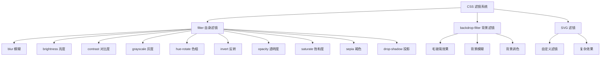

# CSS 滤镜效果

## 背景与动机

CSS 滤镜（Filter）提供强大的图像处理能力，可以在不借助图片编辑软件的情况下，直接通过 CSS 对元素进行视觉效果处理。滤镜技术的出现彻底改变了 Web 开发中图像处理的方式。

### 为什么需要 CSS 滤镜？

在传统 Web 开发中，图像效果处理面临以下挑战：

1. **依赖图片编辑软件**：需要 Photoshop 等工具预处理图片
2. **增加 HTTP 请求**：每种效果需要单独的图片文件
3. **维护成本高**：修改效果需要重新生成图片
4. **无法动态调整**：无法根据用户交互实时改变效果
5. **响应式困难**：不同屏幕尺寸需要不同尺寸的图片

CSS 滤镜解决了这些问题：

- **纯 CSS 实现**：无需 JavaScript 或图片预处理
- **实时效果**：可以动态调整滤镜参数
- **减少请求**：一张原图 + CSS 实现多种效果
- **GPU 加速**：现代浏览器使用 GPU 处理滤镜
- **可动画化**：滤镜参数可以平滑过渡

### 滤镜特性全景图



## 核心概念

### 滤镜属性对比

| 属性 | 作用对象 | 说明 | 性能影响 |
|------|----------|------|---------|
| `filter` | 元素自身 | 对元素内容应用滤镜效果 | 中等 |
| `backdrop-filter` | 元素背后的内容 | 对元素背后的区域应用滤镜效果 | 较高 |

### 基本语法

```css
/* filter 语法 */
element {
  filter: none | <filter-function>+;
}

/* backdrop-filter 语法 */
element {
  backdrop-filter: none | <filter-function>+;
}
```

## 深入原理

### 滤镜渲染管线

滤镜效果的渲染涉及浏览器的多个处理阶段：

```
滤镜渲染管线流程：

┌─────────────────────────────────────────────────────────────┐
│                    渲染管线 (Rendering Pipeline)              │
│                                                               │
│  ┌──────────┐    ┌──────────┐    ┌──────────┐              │
│  │  Style   │ →  │  Layout  │ →  │  Paint   │              │
│  │  计算    │    │  布局    │    │  绘制    │              │
│  └──────────┘    └──────────┘    └──────────┘              │
│                                       ↓                       │
│                    ┌─────────────────────────────────────┐  │
│                    │         滤镜处理阶段                  │  │
│                    │  ┌──────────────────────────────┐  │  │
│                    │  │  1. 栅格化元素内容为纹理       │  │  │
│                    │  │  2. 应用滤镜函数链             │  │  │
│                    │  │  3. GPU 并行处理像素           │  │  │
│                    │  │  4. 输出结果到合成层           │  │  │
│                    │  └──────────────────────────────┘  │  │
│                    └─────────────────────────────────────┘  │
│                                       ↓                       │
│                    ┌─────────────────────────────────────┐  │
│                    │         合成阶段 (Composite)          │  │
│                    │  将滤镜结果与其他层合成               │  │
│                    └─────────────────────────────────────┘  │
└─────────────────────────────────────────────────────────────┘
```

### 滤镜函数执行顺序

多个滤镜函数组合时，按从左到右的顺序依次应用：

```css
/* 执行顺序：brightness → contrast → blur */
.element {
  filter: brightness(1.2) contrast(1.1) blur(5px);
}

/* 不同顺序产生不同效果 */
/* 先模糊后亮度：模糊后的整体提亮 */
.element-a {
  filter: blur(5px) brightness(1.5);
}

/* 先亮度后模糊：提亮后再模糊 */
.element-b {
  filter: brightness(1.5) blur(5px);
}
```

### backdrop-filter 工作原理

`backdrop-filter` 的渲染机制比 `filter` 更复杂：

```
backdrop-filter 渲染机制：

┌─────────────────────────────────────────────────────────┐
│                    页面渲染层                             │
│  ┌─────────────────────────────────────────────────┐   │
│  │              背景内容层                           │   │
│  │  ┌─────────┐  ┌─────────┐  ┌─────────┐        │   │
│  │  │ 图片    │  │ 文字    │  │ 其他元素│        │   │
│  │  └─────────┘  └─────────┘  └─────────┘        │   │
│  └─────────────────────────────────────────────────┘   │
│                         ↓                                │
│  ┌─────────────────────────────────────────────────┐   │
│  │         backdrop-filter 元素                     │   │
│  │  ┌─────────────────────────────────────────┐   │   │
│  │  │  1. 捕获元素背后的区域                   │   │   │
│  │  │  2. 对该区域应用滤镜                     │   │   │
│  │  │  3. 将滤镜结果与元素背景混合             │   │   │
│  │  │  4. 渲染元素内容                         │   │   │
│  │  └─────────────────────────────────────────┘   │   │
│  └─────────────────────────────────────────────────┘   │
└─────────────────────────────────────────────────────────┘
```

### backdrop-filter 性能影响深度分析

`backdrop-filter` 的性能消耗比 `filter` 更高，原因如下：

#### 1. 额外的捕获开销

```
性能开销对比：

filter:
┌─────────┐
│ 元素内容 │ → 应用滤镜 → 输出
└─────────┘

backdrop-filter:
┌─────────┐    ┌──────────┐    ┌─────────┐
│ 背景内容 │ →  │ 捕获区域 │ →  │ 应用滤镜 │ → 混合 → 输出
└─────────┘    └──────────┘    └─────────┘
     ↑
  额外开销
```

#### 2. 实时重绘成本

当背景内容变化时，`backdrop-filter` 需要重新计算：

```css
/* 高性能场景：背景静态 */
.static-background {
  background: url('static-image.jpg');
}

.glass-panel {
  backdrop-filter: blur(20px);
  /* 背景不变时，只需计算一次 */
}

/* 低性能场景：背景动态 */
.animated-background {
  animation: bg-move 10s linear infinite;
}

.glass-panel {
  backdrop-filter: blur(20px);
  /* 背景每帧变化，需要重新计算滤镜 */
}
```

#### 3. 层合成开销

`backdrop-filter` 会创建新的合成层：

```
合成层架构：

普通元素：
┌─────────────────┐
│    Layer 1      │  ← 单一层
└─────────────────┘

backdrop-filter 元素：
┌─────────────────┐
│    Layer 1      │  ← 背景层
└─────────────────┘
┌─────────────────┐
│    Layer 2      │  ← 滤镜捕获层
└─────────────────┘
┌─────────────────┐
│    Layer 3      │  ← 滤镜结果层
└─────────────────┘
┌─────────────────┐
│    Layer 4      │  ← 最终合成层
└─────────────────┘
```

#### 4. 移动端性能问题

移动端 GPU 性能有限，`backdrop-filter` 可能导致：

- 帧率下降（特别是滚动时）
- 电池消耗增加
- 设备发热

```css
/* 移动端优化策略 */
@media (max-width: 768px) {
  .glass-panel {
    /* 方案 1：降低模糊强度 */
    backdrop-filter: blur(10px);
    
    /* 方案 2：使用更透明的背景 */
    background: rgba(255, 255, 255, 0.9);
    
    /* 方案 3：完全禁用 */
    backdrop-filter: none;
  }
}
```

### 滤镜性能优化策略

#### 1. 使用 will-change 提示浏览器

```css
/* 在动画前提示浏览器 */
.filter-animation {
  will-change: filter;
  transition: filter 0.3s ease;
}

/* 动画结束后移除 will-change */
.filter-animation:not(:hover) {
  will-change: auto;
}
```

#### 2. 使用 contain 属性

```css
/* 告诉浏览器该元素的滤镜不影响其他元素 */
.contained-filter {
  contain: layout style paint;
  filter: blur(10px);
}
```

#### 3. 限制滤镜区域大小

```css
/* 不推荐：大面积滤镜 */
.full-page-blur {
  width: 100vw;
  height: 100vh;
  backdrop-filter: blur(20px);
}

/* 推荐：限制滤镜区域 */
.small-blur {
  width: 300px;
  height: 200px;
  backdrop-filter: blur(20px);
}
```

## 代码示例

### filter 滤镜属性

`filter` 属性支持以下滤镜函数，可单独使用或组合使用：

#### 滤镜函数速查表

| 函数 | 作用 | 参数范围 | 默认值 | 性能消耗 |
|------|------|----------|--------|---------|
| `blur()` | 模糊效果 | `<length>` (px, rem, em 等) | `0` | 高 |
| `brightness()` | 亮度调节 | `<number>` 或 `<percentage>` | `1` / `100%` | 低 |
| `contrast()` | 对比度调节 | `<number>` 或 `<percentage>` | `1` / `100%` | 低 |
| `grayscale()` | 灰度转换 | `<number>` 或 `<percentage>` (0-1) | `0` | 中 |
| `hue-rotate()` | 色相旋转 | `<angle>` (deg, rad, turn) | `0deg` | 低 |
| `invert()` | 颜色反转 | `<number>` 或 `<percentage>` (0-1) | `0` | 低 |
| `opacity()` | 透明度调节 | `<number>` 或 `<percentage>` (0-1) | `1` | 低 |
| `saturate()` | 饱和度调节 | `<number>` 或 `<percentage>` | `1` / `100%` | 低 |
| `sepia()` | 褐色调转换 | `<number>` 或 `<percentage>` (0-1) | `0` | 中 |
| `drop-shadow()` | 投影效果 | `<offset-x> <offset-y> <blur> <color>` | - | 高 |
| `url()` | SVG 滤镜引用 | `<url>` | - | 可变 |

#### 1. blur() - 模糊

模糊元素内容，产生高斯模糊效果。

**语法**：`blur(<length>)`

**参数**：
- 接受 CSS 长度单位（px、rem、em、vw 等）
- 值越大越模糊，不允许负值
- 值为 0 时无模糊效果

```css
/* 基础用法 */
.image {
  filter: blur(5px);      /* 模糊 5 像素 */
  filter: blur(0.5rem);   /* 模糊 0.5rem */
  filter: blur(0);        /* 无模糊 */
}

/* 实际应用：图片加载过渡 */
.image-loading {
  filter: blur(20px);
  transition: filter 0.5s ease;
}

.image-loaded {
  filter: blur(0);
}
```

**示例：模糊效果演示**

```html
<!DOCTYPE html>
<html lang="zh-CN">
<head>
  <meta charset="UTF-8">
  <title>模糊效果演示</title>
  <style>
    .blur-demo {
      display: flex;
      gap: 20px;
      padding: 20px;
    }
    .blur-demo img {
      width: 200px;
      height: 150px;
      object-fit: cover;
      border-radius: 8px;
    }
    .blur-0 { filter: blur(0); }
    .blur-2 { filter: blur(2px); }
    .blur-5 { filter: blur(5px); }
    .blur-10 { filter: blur(10px); }
    
    .demo-label {
      text-align: center;
      margin-top: 8px;
      font-size: 14px;
      color: #666;
    }
  </style>
</head>
<body>
  <div class="blur-demo">
    <div>
      
      <div class="demo-label">原图</div>
    </div>
    <div>
      
      <div class="demo-label">blur(2px)</div>
    </div>
    <div>
      
      <div class="demo-label">blur(5px)</div>
    </div>
    <div>
      
      <div class="demo-label">blur(10px)</div>
    </div>
  </div>
</body>
</html>
```

#### 2. brightness() - 亮度

调节元素的亮度。

**语法**：`brightness(<number> | <percentage>)`

**参数**：
- `0` 或 `0%`：完全黑色
- `1` 或 `100%`：原始亮度（默认）
- 大于 1 或 100%：增加亮度
- 不允许负值（负值声明无效）

```css
.image {
  filter: brightness(1);     /* 默认：原始亮度 */
  filter: brightness(0.5);   /* 变暗 50% */
  filter: brightness(1.5);   /* 变亮 50% */
  filter: brightness(0);     /* 完全黑色 */
  filter: brightness(200%);  /* 变亮两倍 */
}

/* 实际应用：悬停高亮 */
.card-image {
  transition: filter 0.3s ease;
}

.card-image:hover {
  filter: brightness(1.2);
}
```

#### 3. contrast() - 对比度

调节元素的对比度。

**语法**：`contrast(<number> | <percentage>)`

**参数**：
- `0`：完全灰色
- `1` 或 `100%`：原始对比度（默认）
- 大于 1：增加对比度
- 值越大对比度越强烈

```css
.image {
  filter: contrast(1);     /* 默认 */
  filter: contrast(0.5);   /* 降低对比度 */
  filter: contrast(1.5);   /* 增加对比度 */
  filter: contrast(0);     /* 完全灰色 */
}

/* 高对比度黑白效果 */
.high-contrast-bw {
  filter: contrast(2) grayscale(1);
}
```

#### 4. grayscale() - 灰度

将元素转换为灰度图像。

**语法**：`grayscale(<number> | <percentage>)`

**参数**：
- `0` 或 `0%`：原始彩色（默认）
- `0` ~ `1`：部分灰度
- `1` 或 `100%`：完全灰度

```css
.image {
  filter: grayscale(0);    /* 彩色 */
  filter: grayscale(0.5);  /* 50% 灰度 */
  filter: grayscale(1);    /* 完全灰度 */
}

/* 实际应用：悬停显示彩色 */
.thumbnail {
  filter: grayscale(1);
  transition: filter 0.3s ease;
}

.thumbnail:hover {
  filter: grayscale(0);
}
```

#### 5. hue-rotate() - 色相旋转

旋转元素的整体色相。

**语法**：`hue-rotate(<angle>)`

**参数**：
- 接受角度单位：`deg`（度）、`rad`（弧度）、`turn`（圈）
- `0deg`：原始色相（默认）
- `0deg` ~ `360deg`：色相环旋转
- 超过 360deg 会循环

```css
.image {
  filter: hue-rotate(0deg);    /* 默认 */
  filter: hue-rotate(90deg);   /* 旋转 90 度 */
  filter: hue-rotate(180deg);  /* 旋转 180 度（色相转到对侧） */
  filter: hue-rotate(270deg);  /* 旋转 270 度 */
  filter: hue-rotate(1turn);   /* 旋转一圈（等于 360deg） */
}

/* 色相动画 */
@keyframes rainbow {
  0% { filter: hue-rotate(0deg); }
  100% { filter: hue-rotate(360deg); }
}

.rainbow-effect {
  animation: rainbow 5s linear infinite;
}
```

#### 6. invert() - 反转

反转元素的颜色。

**语法**：`invert(<number> | <percentage>)`

**参数**：
- `0`：原始颜色（默认）
- `0` ~ `1`：部分反转
- `1` 或 `100%`：完全反转（黑白颠倒）

```css
.image {
  filter: invert(0);    /* 默认 */
  filter: invert(0.5);  /* 50% 反转（灰色调） */
  filter: invert(1);    /* 完全反转 */
}

/* 实际应用：深色模式图标 */
.icon {
  filter: invert(0);
}

.dark-mode .icon {
  filter: invert(1);
}
```

#### 7. opacity() - 透明度

调节元素的透明度。

**语法**：`opacity(<number> | <percentage>)`

**参数**：
- `0` 或 `0%`：完全透明
- `1` 或 `100%`：完全不透明（默认）
- 与 `opacity` 属性的区别：`filter: opacity()` 可与其他滤镜组合

```css
.image {
  filter: opacity(1);    /* 默认：不透明 */
  filter: opacity(0.5);  /* 50% 透明 */
  filter: opacity(0);    /* 完全透明 */
}

/* 与 opacity 属性对比 */
.box-a {
  opacity: 0.5;  /* 整个元素半透明 */
}

.box-b {
  filter: opacity(0.5);  /* 可与其他滤镜组合 */
  filter: opacity(0.5) blur(5px);  /* 组合使用 */
}
```

#### 8. saturate() - 饱和度

调节元素的色彩饱和度。

**语法**：`saturate(<number> | <percentage>)`

**参数**：
- `0`：完全去色（灰色）
- `1` 或 `100%`：原始饱和度（默认）
- 大于 1：增加饱和度（更鲜艳）

```css
.image {
  filter: saturate(1);   /* 默认 */
  filter: saturate(0.5); /* 降低饱和度 */
  filter: saturate(2);   /* 增加饱和度（更鲜艳） */
  filter: saturate(0);   /* 完全去色 */
}
```

#### 9. sepia() - 褐色调

将元素转换为褐色调（复古效果）。

**语法**：`sepia(<number> | <percentage>)`

**参数**：
- `0`：原始颜色（默认）
- `0` ~ `1`：部分褐色调
- `1` 或 `100%`：完全褐色调

```css
.image {
  filter: sepia(0);    /* 默认 */
  filter: sepia(0.5);  /* 50% 褐色调 */
  filter: sepia(1);    /* 完全褐色调 */
}

/* 复古照片效果 */
.vintage {
  filter: sepia(0.4) contrast(1.1) brightness(0.9);
}
```

#### 10. drop-shadow() - 投影

为元素添加投影效果，比 `box-shadow` 更智能。

**语法**：`drop-shadow(<offset-x> <offset-y> <blur-radius>? <color>?)`

**参数**：
- `<offset-x>`：水平偏移（必需）
- `<offset-y>`：垂直偏移（必需）
- `<blur-radius>`：模糊半径（可选）
- `<color>`：阴影颜色（可选）

**与 box-shadow 的区别**：

| 特性 | drop-shadow | box-shadow |
|------|-------------|------------|
| 透明图片 | 遵循图片形状 | 遵循盒子形状 |
| 伪元素 | 包含伪元素 | 不包含 |
| 性能 | 稍差 | 更好 |
| 内阴影 | 不支持 | 支持 |
| 多层阴影 | 不支持 | 支持 |

```css
/* 基础用法 */
.image {
  filter: drop-shadow(4px 4px 10px rgba(0, 0, 0, 0.3));
}

/* 为透明 PNG 添加阴影 */
.logo {
  filter: drop-shadow(0 2px 5px rgba(0, 0, 0, 0.3));
}

/* 文字阴影效果 */
.text {
  filter: drop-shadow(2px 2px 0 white);
}

/* 多层 drop-shadow 可通过叠加实现 */
.multi-shadow {
  filter: drop-shadow(0 1px 1px rgba(0,0,0,0.15))
          drop-shadow(0 2px 2px rgba(0,0,0,0.15))
          drop-shadow(0 4px 4px rgba(0,0,0,0.15));
}
```

#### 11. url() - SVG 滤镜

引用外部 SVG 滤镜或页面内定义的 SVG 滤镜。

**语法**：`url(<url>)`

```css
/* 引用外部 SVG 文件 */
.image {
  filter: url('filters.svg#custom-filter');
}

/* 引用页面内的 SVG 滤镜 */
.image {
  filter: url('#my-filter');
}
```

**示例：自定义 SVG 滤镜**

```html
<!DOCTYPE html>
<html lang="zh-CN">
<head>
  <meta charset="UTF-8">
  <title>SVG 滤镜示例</title>
  <style>
    .filtered {
      filter: url(#wave-distortion);
      width: 300px;
      height: 200px;
      object-fit: cover;
    }
  </style>
</head>
<body>
  <!-- SVG 滤镜定义 -->
  <svg width="0" height="0" style="position: absolute;">
    <defs>
      <filter id="wave-distortion">
        <feTurbulence type="turbulence" baseFrequency="0.01" numOctaves="2" result="turbulence"/>
        <feDisplacementMap in="SourceGraphic" in2="turbulence" scale="10"/>
      </filter>
    </defs>
  </svg>
  
  
</body>
</html>
```

#### 组合滤镜

多个滤镜函数可以组合使用，按从左到右的顺序依次应用：

```css
.image {
  /* 增加亮度和对比度，轻微模糊 */
  filter: brightness(1.2) contrast(1.1) blur(2px);
  
  /* 复古效果 */
  filter: sepia(0.3) contrast(1.1) brightness(0.9) saturate(0.8);
  
  /* 高对比度黑白 */
  filter: grayscale(1) contrast(1.5);
  
  /* 冷色调 */
  filter: saturate(0.8) hue-rotate(180deg) brightness(1.1);
}
```

### backdrop-filter 背景滤镜

`backdrop-filter` 对元素**背后的内容**应用滤镜效果，常用于创建毛玻璃、磨砂玻璃等效果。

#### 基本概念

```css
.glass-panel {
  background: rgba(255, 255, 255, 0.5);
  backdrop-filter: blur(10px);
}
```

> **注意**：使用 `backdrop-filter` 时，元素必须有透明或半透明的背景，否则无法看到背后的内容。

#### 1. 模糊背景

```css
.glass {
  background: rgba(255, 255, 255, 0.5);
  backdrop-filter: blur(10px);
}
```

**示例：模糊遮罩层**

```html
<!DOCTYPE html>
<html lang="zh-CN">
<head>
  <meta charset="UTF-8">
  <title>模糊遮罩层</title>
  <style>
    body {
      margin: 0;
      min-height: 100vh;
      background: url('https://picsum.photos/1920/1080?random=1') center/cover;
    }
    
    .modal-backdrop {
      position: fixed;
      inset: 0;
      background: rgba(0, 0, 0, 0.3);
      backdrop-filter: blur(5px);
      -webkit-backdrop-filter: blur(5px);
      display: flex;
      align-items: center;
      justify-content: center;
    }
    
    .modal {
      background: rgba(255, 255, 255, 0.9);
      padding: 20px;
      border-radius: 12px;
      box-shadow: 0 10px 40px rgba(0, 0, 0, 0.2);
      max-width: 400px;
    }
    
    .modal h2 {
      margin: 0 0 10px 0;
    }
    
    .modal p {
      margin: 0;
      color: #666;
    }
  </style>
</head>
<body>
  <div class="modal-backdrop">
    <div class="modal">
      <h2>模态框内容</h2>
      <p>背景已模糊，创建聚焦效果</p>
    </div>
  </div>
</body>
</html>
```

#### 2. 毛玻璃效果

```css
/* iOS 风格毛玻璃 */
.frosted-glass {
  background: rgba(255, 255, 255, 0.3);
  backdrop-filter: blur(20px) saturate(180%);
  -webkit-backdrop-filter: blur(20px) saturate(180%);
  border: 1px solid rgba(255, 255, 255, 0.3);
  border-radius: 12px;
}

/* 深色毛玻璃 */
.dark-glass {
  background: rgba(0, 0, 0, 0.4);
  backdrop-filter: blur(20px) saturate(150%);
  -webkit-backdrop-filter: blur(20px) saturate(150%);
  border: 1px solid rgba(255, 255, 255, 0.1);
}
```

**示例：毛玻璃导航栏**

```html
<!DOCTYPE html>
<html lang="zh-CN">
<head>
  <meta charset="UTF-8">
  <title>毛玻璃导航栏</title>
  <style>
    * {
      margin: 0;
      padding: 0;
      box-sizing: border-box;
    }
    
    body {
      font-family: system-ui, -apple-system, sans-serif;
      background: linear-gradient(135deg, #667eea 0%, #764ba2 100%);
      min-height: 100vh;
      padding-top: 80px;
    }
    
    .navbar {
      position: fixed;
      top: 0;
      left: 0;
      right: 0;
      height: 60px;
      background: rgba(255, 255, 255, 0.15);
      backdrop-filter: blur(20px) saturate(180%);
      -webkit-backdrop-filter: blur(20px) saturate(180%);
      border-bottom: 1px solid rgba(255, 255, 255, 0.2);
      display: flex;
      align-items: center;
      padding: 0 20px;
      z-index: 1000;
    }
    
    .navbar a {
      color: white;
      text-decoration: none;
      margin-right: 20px;
      font-weight: 500;
      transition: opacity 0.3s;
    }
    
    .navbar a:hover {
      opacity: 0.8;
    }
    
    .content {
      max-width: 800px;
      margin: 0 auto;
      padding: 40px 20px;
      color: white;
    }
    
    .content h1 {
      margin-bottom: 20px;
    }
    
    .content p {
      line-height: 1.6;
      opacity: 0.9;
    }
  </style>
</head>
<body>
  <nav class="navbar">
    <a href="#">首页</a>
    <a href="#">产品</a>
    <a href="#">关于</a>
    <a href="#">联系</a>
  </nav>
  
  <div class="content">
    <h1>毛玻璃导航栏示例</h1>
    <p>滚动页面时，导航栏会显示模糊的背景效果。这种效果被称为"毛玻璃"或"磨砂玻璃"效果，广泛应用于现代 UI 设计中。</p>
  </div>
</body>
</html>
```

#### 3. 暗色背景效果

```css
.dark-overlay {
  background: rgba(0, 0, 0, 0.3);
  backdrop-filter: blur(5px) brightness(0.8);
  -webkit-backdrop-filter: blur(5px) brightness(0.8);
}

/* 对比度增强遮罩 */
.contrast-overlay {
  background: rgba(0, 0, 0, 0.2);
  backdrop-filter: blur(8px) contrast(0.9);
  -webkit-backdrop-filter: blur(8px) contrast(0.9);
}
```

#### 4. 彩色毛玻璃

```css
/* 蓝色调毛玻璃 */
.blue-glass {
  background: rgba(59, 130, 246, 0.3);
  backdrop-filter: blur(20px) hue-rotate(0deg);
  -webkit-backdrop-filter: blur(20px) hue-rotate(0deg);
}

/* 渐变毛玻璃 */
.gradient-glass {
  background: linear-gradient(
    135deg,
    rgba(255, 255, 255, 0.3),
    rgba(255, 255, 255, 0.1)
  );
  backdrop-filter: blur(20px);
  -webkit-backdrop-filter: blur(20px);
}
```

### 实际应用场景

#### 1. 图片悬停效果

```html
<!DOCTYPE html>
<html lang="zh-CN">
<head>
  <meta charset="UTF-8">
  <title>图片悬停效果</title>
  <style>
    .image-grid {
      display: grid;
      grid-template-columns: repeat(auto-fit, minmax(200px, 1fr));
      gap: 20px;
      padding: 20px;
      max-width: 1200px;
      margin: 0 auto;
    }
    
    .image-card {
      position: relative;
      overflow: hidden;
      border-radius: 8px;
      aspect-ratio: 4/3;
    }
    
    .image-card img {
      width: 100%;
      height: 100%;
      object-fit: cover;
      display: block;
      transition: filter 0.3s ease, transform 0.3s ease;
    }
    
    /* 亮度提升效果 */
    .image-card:hover img {
      filter: brightness(1.1) contrast(1.1);
      transform: scale(1.05);
    }
    
    /* 灰度转彩色 */
    .image-card.grayscale img {
      filter: grayscale(1);
    }
    
    .image-card.grayscale:hover img {
      filter: grayscale(0);
    }
    
    /* 悬停模糊效果 */
    .image-card.blur-hover:hover img {
      filter: blur(2px) brightness(0.8);
    }
    
    /* 复古效果 */
    .image-card.vintage:hover img {
      filter: sepia(0.5) contrast(1.1);
    }
  </style>
</head>
<body>
  <div class="image-grid">
    <div class="image-card">
      
    </div>
    <div class="image-card grayscale">
      
    </div>
    <div class="image-card blur-hover">
      
    </div>
    <div class="image-card vintage">
      
    </div>
  </div>
</body>
</html>
```

#### 2. 图片滤镜预设

```css
/* 复古效果 */
.filter-vintage {
  filter: sepia(0.3) contrast(1.1) brightness(0.9);
}

/* 冷色调 */
.filter-cool {
  filter: saturate(0.8) hue-rotate(180deg) brightness(1.05);
}

/* 暖色调 */
.filter-warm {
  filter: sepia(0.2) saturate(1.2) brightness(1.05);
}

/* 高对比度黑白 */
.filter-noir {
  filter: grayscale(1) contrast(1.5) brightness(1.1);
}

/* 褪色效果 */
.filter-faded {
  filter: contrast(0.9) brightness(1.1) saturate(0.8);
}

/* 戏剧性效果 */
.filter-dramatic {
  filter: contrast(1.3) brightness(1.1) saturate(1.2);
}

/* 怀旧电影 */
.filter-nostalgia {
  filter: sepia(0.4) contrast(1.1) brightness(0.9) saturate(0.8);
}
```

#### 3. 卡片悬浮效果

```css
.card-container {
  display: flex;
  gap: 20px;
  padding: 20px;
}

.card {
  transition: filter 0.3s ease, transform 0.3s ease;
  background: white;
  border-radius: 8px;
  overflow: hidden;
}

.card:hover {
  transform: translateY(-5px);
  filter: brightness(1.05);
}

/* 悬停时其他卡片变暗 */
.card-container:hover .card:not(:hover) {
  filter: brightness(0.7);
}
```

#### 4. 加载状态模糊过渡

```html
<!DOCTYPE html>
<html lang="zh-CN">
<head>
  <meta charset="UTF-8">
  <title>图片加载过渡</title>
  <style>
    .lazy-image {
      filter: blur(20px);
      transition: filter 0.5s ease;
      width: 100%;
      max-width: 600px;
      display: block;
      margin: 20px auto;
    }
    
    .lazy-image.loaded {
      filter: blur(0);
    }
  </style>
</head>
<body>
  
</body>
</html>
```

#### 5. 暗色模式图标切换

```css
/* 浅色模式图标 */
.icon {
  filter: invert(0);
  transition: filter 0.3s ease;
}

/* 深色模式图标 */
@media (prefers-color-scheme: dark) {
  .icon {
    filter: invert(1);
  }
}

/* 或通过类名控制 */
.dark-mode .icon {
  filter: invert(1);
}
```

#### 6. 文字可读性增强

```css
/* 图片上的文字背景 */
.text-overlay {
  position: relative;
}

.text-overlay::before {
  content: '';
  position: absolute;
  inset: 0;
  background: rgba(0, 0, 0, 0.5);
  backdrop-filter: blur(3px);
  -webkit-backdrop-filter: blur(3px);
}

.text-overlay .text {
  position: relative;
  color: white;
  z-index: 1;
}
```

## 最佳实践

### 1. 适量使用

```css
/* 推荐：适度使用滤镜 */
.good {
  filter: blur(5px) brightness(1.1);
}

/* 不推荐：过多滤镜 */
.bad {
  filter: blur(10px) brightness(1.2) contrast(1.3) saturate(1.5) hue-rotate(10deg);
}
```

### 2. 提供后备方案

```css
.glass-panel {
  /* 后备：不支持 backdrop-filter 时 */
  background: rgba(255, 255, 255, 0.95);
  
  /* 现代浏览器 */
  backdrop-filter: blur(20px);
  -webkit-backdrop-filter: blur(20px);
}
```

### 3. 平滑过渡

```css
.image {
  filter: grayscale(0);
  transition: filter 0.3s ease;
}

.image:hover {
  filter: grayscale(1);
}
```

### 4. 响应式设计

```css
/* 移动端简化效果 */
@media (max-width: 768px) {
  .glass {
    background: rgba(255, 255, 255, 0.95);
    backdrop-filter: none;
    -webkit-backdrop-filter: none;
  }
}

@media (min-width: 769px) {
  .glass {
    background: rgba(255, 255, 255, 0.7);
    backdrop-filter: blur(20px);
    -webkit-backdrop-filter: blur(20px);
  }
}
```

### 5. 性能测试

```css
/* 使用 will-change 优化已知动画 */
.card {
  transition: filter 0.3s;
}

.card:hover {
  will-change: filter;
  filter: brightness(1.1);
}

/* 动画结束后移除 will-change */
.card:not(:hover) {
  will-change: auto;
}
```

### 6. 无障碍考虑

```css
/* 尊重用户的减少动画偏好 */
@media (prefers-reduced-motion: reduce) {
  .image {
    filter: none;
    transition: none;
  }
}
```

### 7. 使用 contain 优化

```css
/* 告诉浏览器滤镜不影响其他元素 */
.optimized-filter {
  contain: layout style paint;
  filter: blur(10px);
}
```

## 常见问题

### Q1: filter: opacity() 与 opacity 属性有什么区别？

**A**: 主要区别：

| 特性 | filter: opacity() | opacity 属性 |
|------|-------------------|--------------|
| 可组合性 | 可与其他滤镜组合 | 独立属性 |
| 性能 | 稍差 | 更好 |
| 继承 | 不继承 | 不继承（整组一起合成，子元素视觉上一并变透明） |

```css
/* 使用 opacity 属性 */
.box-a {
  opacity: 0.5;
}

/* 使用 filter，可组合 */
.box-b {
  filter: opacity(0.5) blur(5px);
}
```

### Q2: backdrop-filter 不生效怎么办？

**A**: 检查以下几点：

1. **元素必须有透明背景**
```css
/* 错误：背景不透明 */
.wrong {
  background: white;  /* 完全不透明 */
  backdrop-filter: blur(10px);  /* 不生效 */
}

/* 正确 */
.correct {
  background: rgba(255, 255, 255, 0.5);  /* 半透明 */
  backdrop-filter: blur(10px);
}
```

2. **添加浏览器前缀**
```css
.glass {
  backdrop-filter: blur(10px);
  -webkit-backdrop-filter: blur(10px);
}
```

3. **检查浏览器支持**
```css
@supports (backdrop-filter: blur(10px)) {
  .glass {
    background: rgba(255, 255, 255, 0.3);
    backdrop-filter: blur(10px);
  }
}
```

### Q3: 如何在鼠标悬停时平滑过渡滤镜效果？

**A**: 使用 `transition` 属性：

```css
.image {
  filter: grayscale(1);
  transition: filter 0.3s ease;
}

.image:hover {
  filter: grayscale(0);
}

/* 多个滤镜过渡 */
.card {
  filter: brightness(1) contrast(1);
  transition: filter 0.3s ease;
}

.card:hover {
  filter: brightness(1.1) contrast(1.1);
}
```

### Q4: drop-shadow 和 box-shadow 如何选择？

**A**: 根据场景选择：

```css
/* 使用 drop-shadow：透明图片、不规则形状 */
.transparent-logo {
  filter: drop-shadow(2px 2px 5px rgba(0, 0, 0, 0.3));
}

/* 使用 box-shadow：普通矩形元素、需要内阴影或多层阴影 */
.card {
  box-shadow: 
    0 2px 4px rgba(0, 0, 0, 0.1),
    0 4px 8px rgba(0, 0, 0, 0.1);
  /* 或内阴影 */
  box-shadow: inset 0 2px 4px rgba(0, 0, 0, 0.1);
}
```

### Q5: 滤镜动画性能差怎么办？

**A**: 优化方案：

```css
/* 1. 使用 will-change 提示浏览器 */
.optimized-animation {
  will-change: filter;
  transition: filter 0.3s;
}

/* 2. 限制动画元素数量 */
.container:hover .card:not(:hover) {
  filter: brightness(0.8);
  will-change: auto;  /* 非动画状态移除 */
}

/* 3. 使用 transform 替代部分效果 */
/* 模糊效果可以通过缩放+模糊实现，然后缩放回来 */
.blur-effect {
  transform: scale(1.1);
  filter: blur(5px);
}
```

### Q6: 为什么滤镜在移动端卡顿？

**A**: 移动端 GPU 性能有限，优化建议：

```css
/* 1. 减少模糊半径 */
.mobile-friendly {
  filter: blur(5px);  /* 而非 blur(20px) */
}

/* 2. 避免大面积应用 */
.small-area {
  filter: blur(10px);
}

/* 3. 使用媒体查询降低效果 */
@media (max-width: 768px) {
  .responsive-filter {
    filter: blur(3px);
  }
}

@media (min-width: 769px) {
  .responsive-filter {
    filter: blur(10px);
  }
}
```

### Q7: backdrop-filter 和 filter 的性能差异？

**A**: `backdrop-filter` 性能消耗更高，因为：

1. 需要捕获背景内容
2. 对捕获内容应用滤镜
3. 将结果与元素背景混合
4. 可能需要实时重绘

```css
/* 性能更好：使用 filter */
.better {
  filter: blur(10px);
}

/* 性能较差：使用 backdrop-filter */
.worse {
  backdrop-filter: blur(10px);
}

/* 优化：在移动端禁用 backdrop-filter */
@media (max-width: 768px) {
  .glass {
    backdrop-filter: none;
    background: rgba(255, 255, 255, 0.95);
  }
}
```

## 参考资源

- [MDN - CSS filter](https://developer.mozilla.org/zh-CN/docs/Web/CSS/filter)
- [MDN - backdrop-filter](https://developer.mozilla.org/zh-CN/docs/Web/CSS/backdrop-filter)
- [MDN - CSS filter effects](https://developer.mozilla.org/en-US/docs/Web/CSS/CSS_filter_effects)
- [CSS Filter Effects Generator](https://cssfiltergenerator.com/) - 滤镜效果生成器
- [Frosted Glass Effect](https://glassmorphism.com/) - 毛玻璃效果参考
- [Can I Use - CSS Filters](https://caniuse.com/css-filters) - 浏览器兼容性查询
- [Can I Use - backdrop-filter](https://caniuse.com/css-backdrop-filter) - backdrop-filter 兼容性
