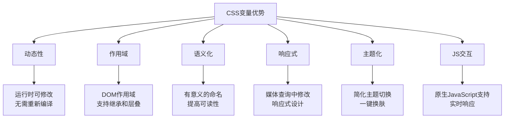
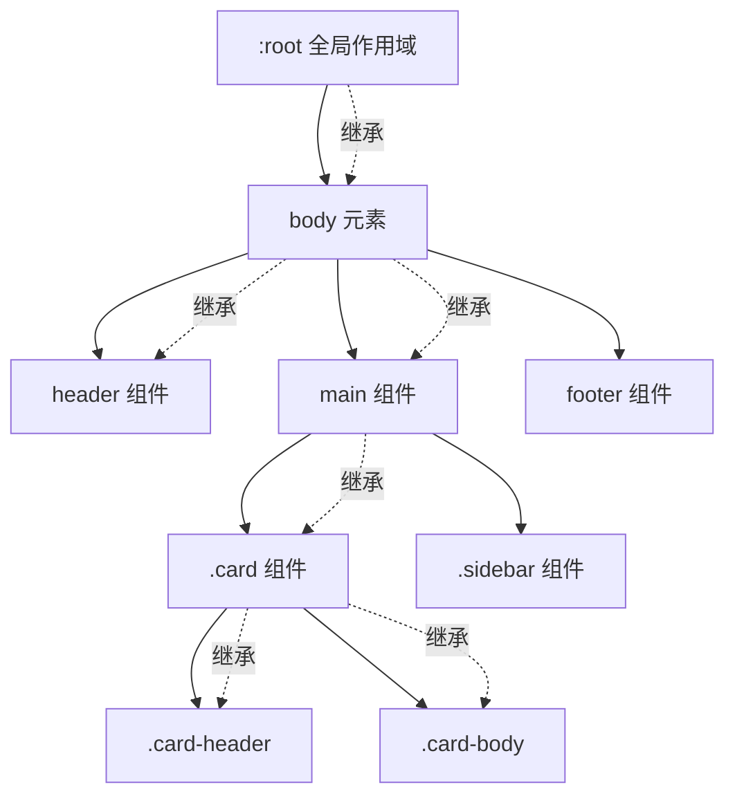
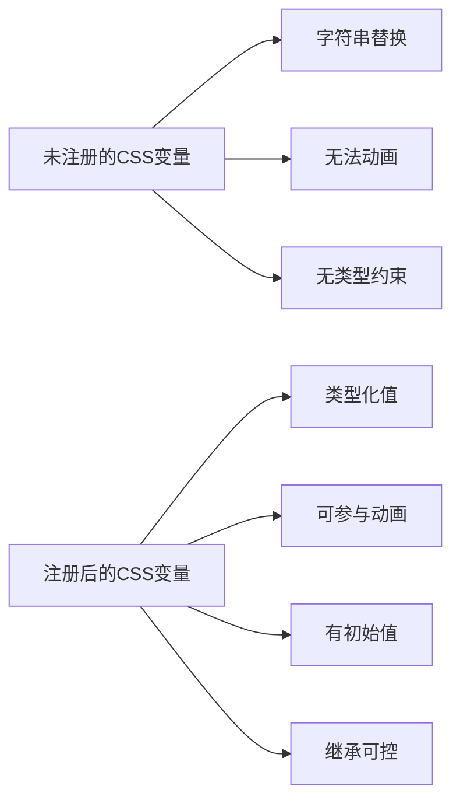

# CSS变量（自定义属性）

## 背景与动机

### 传统CSS的局限性

在CSS变量出现之前，样式复用主要依赖预处理器（Sass/Less）或重复硬编码。这种方式存在明显痛点：

```scss
// Sass预处理器变量 - 编译时固定
$primary-color: #007bff;

.button {
  background: $primary-color;  // 编译后变成 background: #007bff
}

// 问题：无法在运行时动态修改
// 问题：无法响应DOM状态变化
// 问题：无法通过JavaScript实时控制
```

### CSS变量的诞生

CSS自定义属性（Custom Properties）于2015年12月成为W3C正式推荐标准（Recommendation），解决了预处理器的根本缺陷：

```css
/* CSS变量 - 运行时动态 */
:root {
  --primary-color: #007bff;
}

.button {
  background: var(--primary-color);
}
```

```javascript
// 可以通过JavaScript实时修改
document.documentElement.style.setProperty('--primary-color', '#ff0000');
```

### 核心优势



### 与预处理器变量的对比

| 特性 | CSS变量 | Sass/Less变量 |
|------|---------|---------------|
| **执行时机** | ✓ 运行时（浏览器渲染时） | ✗ 编译时（构建时固定） |
| **作用域** | ✓ DOM作用域（遵循层叠规则） | ✗ 文件作用域（全局或局部） |
| **媒体查询** | ✓ 可在媒体查询中动态修改 | ✗ 不支持在媒体查询中修改 |
| **JavaScript** | ✓ 原生支持读写 | ✗ 需要额外工具或重新编译 |
| **继承机制** | ✓ 子元素自动继承父元素变量 | ✗ 无继承概念 |
| **浏览器支持** | IE11+（部分支持），现代浏览器完全支持 | ✓ 编译后兼容所有浏览器 |
| **动态计算** | ✓ 可与calc()、JS实时计算 | ✗ 编译时计算完成 |
| **调试能力** | ✓ 浏览器DevTools实时查看修改 | ✗ 需要查看编译后的CSS |

### 浏览器支持

| 浏览器 | 支持版本 | 备注 |
|--------|----------|------|
| Chrome | 49+ | 完全支持 |
| Firefox | 31+ | 完全支持 |
| Safari | 9.1+ | 完全支持 |
| Edge | 15+ | 完全支持 |
| IE | 11 | 部分支持（需polyfill） |
| Opera | 36+ | 完全支持 |

## 核心概念

### 变量定义语法

CSS变量使用 `--` 前缀定义，变量名区分大小写。

```css
/* 基础语法 */
:root {
  --variable-name: value;
}

/* 示例 */
:root {
  /* 颜色变量 */
  --primary-color: #007bff;
  --secondary-color: #6c757d;
  --success-color: #28a745;
  
  /* 尺寸变量 */
  --font-size: 16px;
  --spacing: 20px;
  --border-radius: 4px;
  
  /* 复杂值 */
  --shadow: 0 2px 4px rgba(0, 0, 0, 0.1);
  --gradient: linear-gradient(135deg, #667eea 0%, #764ba2 100%);
  
  /* 多值 */
  --padding: 10px 20px;
  --transition: all 0.3s ease;
}
```

### 变量引用语法

使用 `var()` 函数引用变量，可提供后备值。

```css
/* 基础语法 */
var(--variable-name, fallback-value)

/* 示例 */
.button {
  /* 基础用法 */
  background-color: var(--primary-color);
  
  /* 带后备值 */
  color: var(--text-color, #333);
  
  /* 后备值可以是另一个变量 */
  color: var(--text-color, var(--default-color, #333));
  
  /* 后备值可以是多值 */
  padding: var(--custom-padding, 10px 20px);
}
```

### 命名规范

```css
/* ✅ 推荐：语义化命名 */
--primary-color: #007bff;
--font-size-base: 16px;
--spacing-md: 20px;

/* ✅ 推荐：使用连字符分隔 */
--card-padding: 20px;
--button-bg: #007bff;

/* ✅ 允许：下划线分隔 */
--primary_color: #007bff;

/* ⚠️ 不推荐：驼峰命名 */
--primaryColor: #007bff;

/* ❌ 错误：以数字开头 */
--1color: #007bff;  /* 无效 */

/* ❌ 错误：包含特殊字符 */
--color-primary-dark!: #0056b3;  /* 无效 */
```

## 深入原理

### 变量作用域机制

CSS变量遵循DOM树的作用域规则，可以在不同层级定义和覆盖。



#### 全局作用域

在 `:root` 中定义的变量全局可用，所有元素都可以访问。

```css
:root {
  --global-color: blue;
  --global-spacing: 20px;
}

/* 所有元素都可以使用 */
.any-element {
  color: var(--global-color);
  padding: var(--global-spacing);
}
```

#### 局部作用域

变量可以在任何选择器中定义，作用域限于该选择器匹配的元素及其后代元素。

```css
.card {
  --card-padding: 20px;
  --card-bg: #f5f5f5;
  
  padding: var(--card-padding);
  background: var(--card-bg);
}

/* 子元素可以访问 */
.card .header {
  padding: var(--card-padding);
  background: var(--card-bg);
}

/* 外部元素无法访问 */
.other-element {
  padding: var(--card-padding);  /* 无效，变量未定义 */
  background: var(--card-bg);    /* 无效，变量未定义 */
}
```

#### 作用域优先级

CSS变量遵循层叠规则，更具体的选择器优先级更高。

```css
:root {
  --color: blue;
}

.card {
  --color: red;  /* 覆盖全局变量 */
  color: var(--color);  /* red */
}

.card.special {
  --color: green;  /* 覆盖 .card 的变量 */
  color: var(--color);  /* green */
}

.card .inner {
  --color: purple;  /* 覆盖父元素的变量 */
  color: var(--color);  /* purple */
}
```

### 变量继承机制

子元素会自动继承父元素的CSS变量，这是CSS变量的核心特性之一。

```css
.parent {
  --parent-var: value;
}

.child {
  /* 可以直接使用父元素的变量 */
  color: var(--parent-var);
}

/* 继承特性在组件中很有用 */
.theme-dark {
  --bg-color: #1a1a1a;
  --text-color: #ffffff;
}

.card {
  background: var(--bg-color);  /* 继承自 .theme-dark */
  color: var(--text-color);
}
```

**继承的限制**：

```css
/* ❌ 变量不能继承自兄弟元素 */
.sibling-1 {
  --shared: value1;
}

.sibling-2 {
  color: var(--shared);  /* 无效，无法继承 */
}

/* ✓ 变量只在后代元素中继承 */
.parent {
  --inherited: value;
}

.parent .child {
  color: var(--inherited);  /* 有效 */
}
```

### @property 注册自定义属性

CSS Houdini 的 `@property` 规则允许定义变量的类型、初始值和继承性，这是CSS变量从"字符串替换"升级为"类型化值"的关键特性。



#### 核心优势

- **类型约束**：确保变量值符合预期类型，避免无效值
- **动画能力**：注册后的变量可以参与CSS过渡和动画
- **初始值**：提供可靠的默认值
- **继承控制**：精确控制变量是否继承

#### 基础定义

```css
/* 定义自定义属性 */
@property --gradient-angle {
  syntax: '<angle>';
  initial-value: 0deg;
  inherits: false;
}

@property --primary-color {
  syntax: '<color>';
  initial-value: #007bff;
  inherits: true;
}

/* 使用定义的属性 */
.element {
  --gradient-angle: 45deg;
  background: linear-gradient(var(--gradient-angle), var(--primary-color), transparent);
}

/* 优势：可以实现动画 */
@keyframes rotate-gradient {
  to {
    --gradient-angle: 360deg;
  }
}

.animated-gradient {
  animation: rotate-gradient 3s linear infinite;
}
```

#### 支持的类型

```css
/* 长度类型 */
@property --length {
  syntax: '<length>';
  inherits: false;
  initial-value: 0px;
}

/* 颜色类型 */
@property --color {
  syntax: '<color>';
  inherits: true;
  initial-value: #000;
}

/* 数值类型 */
@property --number {
  syntax: '<number>';
  inherits: false;
  initial-value: 0;
}

/* 百分比类型 */
@property --percentage {
  syntax: '<percentage>';
  inherits: false;
  initial-value: 0%;
}

/* 角度类型 */
@property --angle {
  syntax: '<angle>';
  inherits: false;
  initial-value: 0deg;
}

/* 整数类型 */
@property --integer {
  syntax: '<integer>';
  inherits: false;
  initial-value: 0;
}

/* 时间类型 */
@property --time {
  syntax: '<time>';
  inherits: false;
  initial-value: 0s;
}

/* 分辨率类型 */
@property --resolution {
  syntax: '<resolution>';
  inherits: false;
  initial-value: 96dpi;
}

/* 多类型联合 */
@property --size {
  syntax: '<length> | <percentage>';
  inherits: false;
  initial-value: 0px;
}

/* 任意类型 */
@property --any {
  syntax: '*';
  inherits: false;
}
```

#### @property 实现变量过渡动画

未注册的CSS变量无法参与过渡动画，注册后可以：

```css
/* 注册变量 */
@property --border-width {
  syntax: '<length>';
  inherits: false;
  initial-value: 0px;
}

@property --glow-color {
  syntax: '<color>';
  inherits: false;
  initial-value: transparent;
}

/* 使用过渡 */
.animated-border {
  border: var(--border-width) solid #007bff;
  box-shadow: 0 0 10px var(--glow-color);
  transition: --border-width 0.3s ease, --glow-color 0.3s ease;
}

.animated-border:hover {
  --border-width: 4px;
  --glow-color: rgba(0, 123, 255, 0.5);
}
```

```css
/* 渐变角度动画 */
@property --hue {
  syntax: '<number>';
  inherits: false;
  initial-value: 0;
}

.rainbow-button {
  background: linear-gradient(
    calc(var(--hue) * 1deg),
    #ff0000, #ff8800, #ffff00, #00ff00, #0088ff, #8800ff
  );
  animation: hue-rotate 3s linear infinite;
}

@keyframes hue-rotate {
  to { --hue: 360; }
}
```

```css
/* 数字计数动画 */
@property --num {
  syntax: '<integer>';
  inherits: false;
  initial-value: 0;
}

.counter {
  transition: --num 0.5s ease-out;
  counter-reset: num var(--num);
}

.counter::after {
  content: counter(num);
}

.counter:hover {
  --num: 100;
}
```

#### JavaScript 注册 @property

```javascript
// 使用 CSS.registerProperty() 注册
CSS.registerProperty({
  name: '--primary-color',
  syntax: '<color>',
  inherits: true,
  initialValue: '#007bff',
});

// 动态注册多个属性
const properties = [
  { name: '--spacing', syntax: '<length>', inherits: false, initialValue: '16px' },
  { name: '--radius', syntax: '<length>', inherits: false, initialValue: '4px' },
  { name: '--opacity', syntax: '<number>', inherits: false, initialValue: '1' },
];

properties.forEach(prop => CSS.registerProperty(prop));
```

#### 浏览器支持

| 浏览器 | 支持版本 | 备注 |
|--------|----------|------|
| Chrome | 85+ | 完全支持 |
| Edge | 85+ | 完全支持 |
| Safari | 16.4+ | 完全支持 |
| Firefox | 128+ | 完全支持 |

> 💡 **渐进增强**：对于不支持 @property 的浏览器，CSS变量仍然可以正常使用，只是无法参与过渡动画。

## 代码示例

### JavaScript 操作

#### 读取变量值

```javascript
// 方法1：获取计算后的样式
const element = document.querySelector('.element');
const styles = getComputedStyle(element);
const color = styles.getPropertyValue('--primary-color');
console.log(color);  // "#007bff"

// 方法2：读取内联样式
const value = element.style.getPropertyValue('--my-var');

// 方法3：读取 :root 变量
const rootStyles = getComputedStyle(document.documentElement);
const globalVar = rootStyles.getPropertyValue('--global-color');

// 去除首尾空格
const cleanValue = color.trim();
```

#### 设置变量值

```javascript
// 在元素上设置
element.style.setProperty('--my-var', 'value');

// 在根元素上设置（全局）
document.documentElement.style.setProperty('--primary-color', '#ff0000');

// 设置多个变量
const cssVars = {
  '--primary-color': '#007bff',
  '--secondary-color': '#6c757d',
  '--font-size': '16px'
};

Object.entries(cssVars).forEach(([key, value]) => {
  document.documentElement.style.setProperty(key, value);
});

// 动态计算值
const width = element.offsetWidth;
document.documentElement.style.setProperty('--element-width', `${width}px`);
```

#### 删除变量

```javascript
// 删除变量
element.style.removeProperty('--my-var');

// 恢复为继承值
element.style.setProperty('--my-var', 'inherit');

// 恢复为初始值
element.style.setProperty('--my-var', 'initial');
```

#### 实时更新示例

```html
<!DOCTYPE html>
<html>
<head>
<style>
:root {
  --box-size: 100px;
  --box-color: #3498db;
}

.box {
  width: var(--box-size);
  height: var(--box-size);
  background: var(--box-color);
  margin: 20px;
  transition: all 0.3s;
}
</style>
</head>
<body>
  <div class="box"></div>
  
  <input type="range" id="sizeSlider" min="50" max="200" value="100">
  <input type="color" id="colorPicker" value="#3498db">
  
  <script>
    const box = document.querySelector('.box');
    const sizeSlider = document.getElementById('sizeSlider');
    const colorPicker = document.getElementById('colorPicker');
    
    // 实时更新尺寸
    sizeSlider.addEventListener('input', (e) => {
      const size = e.target.value + 'px';
      document.documentElement.style.setProperty('--box-size', size);
    });
    
    // 实时更新颜色
    colorPicker.addEventListener('input', (e) => {
      const color = e.target.value;
      document.documentElement.style.setProperty('--box-color', color);
    });
  </script>
</body>
</html>
```

### 与 calc() 配合

CSS变量可以与 `calc()` 函数结合使用，实现动态计算。

```css
:root {
  --base-size: 16px;
  --scale: 1.5;
}

.text {
  font-size: calc(var(--base-size) * var(--scale));
  /* 结果：24px */
}

/* 实际应用：响应式间距 */
:root {
  --spacing-unit: 8px;
}

.element {
  margin: calc(var(--spacing-unit) * 2);        /* 16px */
  padding: calc(var(--spacing-unit) * 3);       /* 24px */
  gap: calc(var(--spacing-unit) * 1.5);         /* 12px */
}

/* 复杂计算 */
:root {
  --container-width: 1200px;
  --sidebar-width: 250px;
  --padding: 20px;
}

.main-content {
  width: calc(var(--container-width) - var(--sidebar-width) - var(--padding) * 2);
}
```

### 在媒体查询中使用

可以在媒体查询中重新定义变量，实现响应式设计。

```css
:root {
  --font-size: 16px;
  --spacing: 20px;
  --columns: 1;
}

/* 平板 */
@media (min-width: 768px) {
  :root {
    --font-size: 18px;
    --spacing: 30px;
    --columns: 2;
  }
}

/* 桌面 */
@media (min-width: 1024px) {
  :root {
    --font-size: 20px;
    --spacing: 40px;
    --columns: 3;
  }
}

.container {
  font-size: var(--font-size);
  padding: var(--spacing);
  display: grid;
  grid-template-columns: repeat(var(--columns), 1fr);
}
```

### 在伪元素和伪类中使用

```css
/* 伪元素 */
.element::before {
  content: '';
  background: var(--icon-color);
  width: var(--icon-size);
  height: var(--icon-size);
}

/* 伪类 */
.button {
  --btn-color: #007bff;
  background: var(--btn-color);
}

.button:hover {
  --btn-color: #0056b3;  /* 悬停时修改变量 */
}

.button:disabled {
  --btn-color: #ccc;
}

/* ❌ 无效：var() 不能用于选择器（包括伪类参数） */
.element:nth-child(var(--nth-child)) {
  background: red;  /* 整条规则无效，不会匹配任何元素 */
}
/* CSS变量只能在属性值中使用，选择器在解析阶段就固定了 */
```

### 变量的动态计算

```css
/* 组合使用 */
:root {
  --hue: 200;
  --saturation: 70%;
  --lightness: 50%;
  
  --primary-color: hsl(var(--hue), var(--saturation), var(--lightness));
  --primary-dark: hsl(var(--hue), var(--saturation), calc(var(--lightness) - 10%));
  --primary-light: hsl(var(--hue), var(--saturation), calc(var(--lightness) + 10%));
}

.button {
  background: var(--primary-color);
}

.button:hover {
  background: var(--primary-dark);
}
```

## 最佳实践

### 1. 设计系统变量

```css
/* 颜色系统 */
:root {
  /* 主色调 */
  --color-primary: #007bff;
  --color-primary-dark: #0056b3;
  --color-primary-light: #4da3ff;
  
  /* 语义色 */
  --color-success: #28a745;
  --color-danger: #dc3545;
  --color-warning: #ffc107;
  --color-info: #17a2b8;
  
  /* 中性色 */
  --color-white: #ffffff;
  --color-gray-100: #f8f9fa;
  --color-gray-200: #e9ecef;
  --color-gray-300: #dee2e6;
  --color-gray-400: #ced4da;
  --color-gray-500: #adb5bd;
  --color-gray-600: #6c757d;
  --color-gray-700: #495057;
  --color-gray-800: #343a40;
  --color-gray-900: #212529;
  --color-black: #000000;
}

/* 间距系统 */
:root {
  --space-0: 0;
  --space-1: 0.25rem;   /* 4px */
  --space-2: 0.5rem;    /* 8px */
  --space-3: 0.75rem;   /* 12px */
  --space-4: 1rem;      /* 16px */
  --space-5: 1.25rem;   /* 20px */
  --space-6: 1.5rem;    /* 24px */
  --space-8: 2rem;      /* 32px */
  --space-10: 2.5rem;   /* 40px */
  --space-12: 3rem;     /* 48px */
  --space-16: 4rem;     /* 64px */
}

/* 字体系统 */
:root {
  --font-family: -apple-system, BlinkMacSystemFont, 'Segoe UI', Roboto, sans-serif;
  --font-mono: 'SFMono-Regular', Consolas, 'Liberation Mono', Menlo, monospace;
  
  --font-size-xs: 0.75rem;    /* 12px */
  --font-size-sm: 0.875rem;   /* 14px */
  --font-size-base: 1rem;     /* 16px */
  --font-size-lg: 1.125rem;   /* 18px */
  --font-size-xl: 1.25rem;    /* 20px */
  --font-size-2xl: 1.5rem;    /* 24px */
  --font-size-3xl: 1.875rem;  /* 30px */
  --font-size-4xl: 2.25rem;   /* 36px */
  
  --font-weight-normal: 400;
  --font-weight-medium: 500;
  --font-weight-semibold: 600;
  --font-weight-bold: 700;
  
  --line-height-tight: 1.25;
  --line-height-normal: 1.5;
  --line-height-relaxed: 1.75;
}

/* 圆角系统 */
:root {
  --radius-none: 0;
  --radius-sm: 0.125rem;   /* 2px */
  --radius-md: 0.375rem;   /* 6px */
  --radius-lg: 0.5rem;     /* 8px */
  --radius-xl: 0.75rem;    /* 12px */
  --radius-2xl: 1rem;      /* 16px */
  --radius-full: 9999px;
}

/* 阴影系统 */
:root {
  --shadow-xs: 0 1px 2px 0 rgba(0, 0, 0, 0.05);
  --shadow-sm: 0 1px 3px 0 rgba(0, 0, 0, 0.1), 0 1px 2px 0 rgba(0, 0, 0, 0.06);
  --shadow-md: 0 4px 6px -1px rgba(0, 0, 0, 0.1), 0 2px 4px -1px rgba(0, 0, 0, 0.06);
  --shadow-lg: 0 10px 15px -3px rgba(0, 0, 0, 0.1), 0 4px 6px -2px rgba(0, 0, 0, 0.05);
  --shadow-xl: 0 20px 25px -5px rgba(0, 0, 0, 0.1), 0 10px 10px -5px rgba(0, 0, 0, 0.04);
  --shadow-2xl: 0 25px 50px -12px rgba(0, 0, 0, 0.25);
  --shadow-inner: inset 0 2px 4px 0 rgba(0, 0, 0, 0.06);
}

/* 过渡系统 */
:root {
  --transition-fast: 150ms;
  --transition-normal: 300ms;
  --transition-slow: 500ms;
  --ease-in: cubic-bezier(0.4, 0, 1, 1);
  --ease-out: cubic-bezier(0, 0, 0.2, 1);
  --ease-in-out: cubic-bezier(0.4, 0, 0.2, 1);
}

/* Z-index系统 */
:root {
  --z-dropdown: 1000;
  --z-sticky: 1020;
  --z-fixed: 1030;
  --z-modal-backdrop: 1040;
  --z-modal: 1050;
  --z-popover: 1060;
  --z-tooltip: 1070;
}
```

### 2. 主题切换方案

#### 明暗主题

```css
/* 默认（浅色）主题 */
:root {
  --bg-primary: #ffffff;
  --bg-secondary: #f8f9fa;
  --text-primary: #212529;
  --text-secondary: #6c757d;
  --border-color: #dee2e6;
  --shadow-color: rgba(0, 0, 0, 0.1);
}

/* 暗色主题 */
[data-theme="dark"] {
  --bg-primary: #1a1a1a;
  --bg-secondary: #2d2d2d;
  --text-primary: #ffffff;
  --text-secondary: #adb5bd;
  --border-color: #495057;
  --shadow-color: rgba(0, 0, 0, 0.3);
}

/* 应用主题 */
body {
  background-color: var(--bg-primary);
  color: var(--text-primary);
  transition: background-color 0.3s, color 0.3s;
}

.card {
  background: var(--bg-secondary);
  border: 1px solid var(--border-color);
  box-shadow: 0 2px 4px var(--shadow-color);
}

.text-muted {
  color: var(--text-secondary);
}
```

#### JavaScript 主题切换

```javascript
// 完整的主题切换实现
class ThemeManager {
  constructor() {
    this.theme = this.getStoredTheme() || this.getPreferredTheme();
    this.applyTheme(this.theme);
  }
  
  getStoredTheme() {
    return localStorage.getItem('theme');
  }
  
  getPreferredTheme() {
    return window.matchMedia('(prefers-color-scheme: dark)').matches ? 'dark' : 'light';
  }
  
  applyTheme(theme) {
    document.documentElement.setAttribute('data-theme', theme);
    localStorage.setItem('theme', theme);
    this.theme = theme;
  }
  
  toggle() {
    const newTheme = this.theme === 'dark' ? 'light' : 'dark';
    this.applyTheme(newTheme);
  }
  
  watchSystemTheme() {
    window.matchMedia('(prefers-color-scheme: dark)').addEventListener('change', (e) => {
      if (!this.getStoredTheme()) {
        this.applyTheme(e.matches ? 'dark' : 'light');
      }
    });
  }
}

// 使用
const themeManager = new ThemeManager();
themeManager.watchSystemTheme();

// 切换按钮
document.querySelector('.theme-toggle').addEventListener('click', () => {
  themeManager.toggle();
});
```

#### 多主题方案

```css
/* 定义多个主题 */
:root {
  --primary-hue: 211;
  --primary-saturation: 100%;
  --primary-lightness: 50%;
}

/* 蓝色主题 */
[data-theme="blue"] {
  --primary-hue: 211;
}

/* 绿色主题 */
[data-theme="green"] {
  --primary-hue: 145;
}

/* 紫色主题 */
[data-theme="purple"] {
  --primary-hue: 271;
}

/* 橙色主题 */
[data-theme="orange"] {
  --primary-hue: 24;
}

/* 使用 HSL 颜色 */
:root {
  --color-primary: hsl(var(--primary-hue), var(--primary-saturation), var(--primary-lightness));
  --color-primary-dark: hsl(var(--primary-hue), var(--primary-saturation), calc(var(--primary-lightness) - 10%));
  --color-primary-light: hsl(var(--primary-hue), var(--primary-saturation), calc(var(--primary-lightness) + 10%));
}

.button {
  background: var(--color-primary);
}

.button:hover {
  background: var(--color-primary-dark);
}
```

### 3. 组件库变量

```css
/* 按钮组件 */
:root {
  /* 尺寸 */
  --btn-padding-sm: var(--space-2) var(--space-3);
  --btn-padding-md: var(--space-2) var(--space-4);
  --btn-padding-lg: var(--space-3) var(--space-6);
  
  --btn-font-size-sm: var(--font-size-sm);
  --btn-font-size-md: var(--font-size-base);
  --btn-font-size-lg: var(--font-size-lg);
  
  --btn-radius: var(--radius-md);
}

.btn {
  padding: var(--btn-padding-md);
  font-size: var(--btn-font-size-md);
  border-radius: var(--btn-radius);
  border: none;
  cursor: pointer;
  transition: all var(--transition-fast) var(--ease-in-out);
}

.btn-sm {
  padding: var(--btn-padding-sm);
  font-size: var(--btn-font-size-sm);
}

.btn-lg {
  padding: var(--btn-padding-lg);
  font-size: var(--btn-font-size-lg);
}

.btn-primary {
  background: var(--color-primary);
  color: var(--color-white);
}

.btn-primary:hover {
  background: var(--color-primary-dark);
}

.btn-danger {
  background: var(--color-danger);
  color: var(--color-white);
}
```

### 4. 布局系统

```css
:root {
  /* 容器 */
  --container-max-width: 1200px;
  --container-padding: var(--space-4);
  
  /* 栅格 */
  --grid-columns: 12;
  --grid-gap: var(--space-4);
}

.container {
  max-width: var(--container-max-width);
  margin: 0 auto;
  padding: 0 var(--container-padding);
}

.grid {
  display: grid;
  grid-template-columns: repeat(var(--grid-columns), 1fr);
  gap: var(--grid-gap);
}

/* 响应式布局 */
@media (min-width: 768px) {
  :root {
    --container-padding: var(--space-6);
    --grid-gap: var(--space-6);
  }
}

@media (min-width: 1024px) {
  :root {
    --container-padding: var(--space-8);
  }
}
```

### 5. 性能优化

```css
/* ❌ 不推荐：过度嵌套 */
.card .header .title .text {
  --color: red;
  color: var(--color);
}

/* ✅ 推荐：合理的层级 */
.card {
  --card-text-color: red;
}

.card .text {
  color: var(--card-text-color);
}

/* ✅ 推荐：在需要的地方定义 */
.component {
  --component-var: value;
}

/* ❌ 不推荐：同一计算重复书写，难以维护 */
.element {
  width: calc(100% - var(--spacing) * 2);
  padding: var(--spacing);
  margin: calc(100% - var(--spacing) * 2);
}

/* ✅ 推荐：提取为变量，语义清晰且便于复用 */
:root {
  --spacing: 20px;
  --content-width: calc(100% - var(--spacing) * 2);
}

.element {
  width: var(--content-width);
  padding: var(--spacing);
  margin: var(--content-width);
}
```

### 6. 命名规范

```css
/* ✅ 推荐：语义化命名 */
--color-primary: #007bff;
--font-size-base: 16px;
--spacing-md: 20px;
--border-radius: 4px;

/* ✅ 推荐：功能命名 */
--button-bg: #007bff;
--card-shadow: 0 2px 4px rgba(0, 0, 0, 0.1);
--input-border: 1px solid #ccc;

/* ✅ 推荐：状态命名 */
--color-text: #333;
--color-text-muted: #999;
--color-text-disabled: #ccc;

/* ❌ 避免：无意义命名 */
--color1: #007bff;
--var1: 20px;
--my-value: red;
```

### 7. 组织结构

```css
/* 推荐：按功能分组 */
:root {
  /* ===== 颜色 ===== */
  --color-primary: #007bff;
  --color-secondary: #6c757d;
  
  /* ===== 间距 ===== */
  --spacing-sm: 8px;
  --spacing-md: 16px;
  
  /* ===== 字体 ===== */
  --font-size-base: 16px;
  --font-family: sans-serif;
  
  /* ===== 布局 ===== */
  --container-width: 1200px;
  --sidebar-width: 250px;
  
  /* ===== 动画 ===== */
  --transition-fast: 150ms;
  --ease-in-out: cubic-bezier(0.4, 0, 0.2, 1);
}

/* 或使用注释分组 */
:root {
  /* Colors */
  --color-primary: #007bff;
  
  /* Typography */
  --font-size-base: 16px;
  
  /* Layout */
  --spacing-md: 16px;
}
```

### 8. 与预处理器配合

```scss
// Sass变量用于编译时逻辑
$breakpoints: (
  sm: 576px,
  md: 768px,
  lg: 992px,
  xl: 1200px
);

// CSS变量用于运行时修改
:root {
  --color-primary: $primary-color;
  --font-size-base: $font-size-base;
}

// 混合使用
@mixin theme-variables($theme) {
  --bg-color: map-get($theme, 'bg');
  --text-color: map-get($theme, 'text');
}

:root {
  @include theme-variables($light-theme);
}

[data-theme="dark"] {
  @include theme-variables($dark-theme);
}
```

## 常见问题

### Q1: CSS变量可以在哪些地方使用？

**回答**：CSS变量可以用在几乎任何CSS属性的值中。

```css
/* ✅ 可以使用 */
.element {
  color: var(--color);                    /* 颜色 */
  margin: var(--spacing);                 /* 长度 */
  padding: var(--padding);                /* 长度 */
  font-size: var(--font-size);            /* 字体大小 */
  background: var(--bg-image);            /* 背景 */
  border: var(--border-width) solid var(--border-color);  /* 边框 */
  box-shadow: var(--shadow);              /* 阴影 */
  animation: var(--animation-name) var(--duration);       /* 动画 */
}

/* ❌ 不能使用 */
.element {
  --property: color;
  var(--property): red;  /* 错误：不能作为属性名 */
  
  --selector: .class;
  var(--selector) { }    /* 错误：不能作为选择器 */
  
  --media: (min-width: 768px);
  @media var(--media) { } /* 错误：不能作为媒体查询 */
}
```

### Q2: 变量未定义会发生什么？

**回答**：如果变量未定义，会使用后备值；如果没有后备值，则使用初始值或继承值。

```css
/* 变量未定义的情况 */
.element {
  color: var(--undefined-var);           /* 无后备值 → unset：color 为继承属性，表现为继承父元素颜色 */
  color: var(--undefined-var, #333);     /* 使用后备值：#333 */
  padding: var(--undefined-var);         /* 无后备值 → unset：padding 为非继承属性，取初始值 0 */
}

/* 变量值为空 */
:root {
  --empty: ;
}
.element {
  color: var(--empty);                   /* 空值，使用初始值 */
  color: var(--empty, #333);             /* 空值，仍使用初始值，不是#333 */
}
```

### Q3: 如何调试CSS变量？

**回答**：使用浏览器开发工具查看和修改变量。

```css
/* 1. Chrome DevTools查看 */
/* Elements -> Styles -> 查看变量值 */

/* 3. 添加调试样式 */
:root {
  --debug-color: red;
}

.debug {
  outline: 2px solid var(--debug-color);
}

/* 4. 使用CSS显示变量值 */
.debug::after {
  content: var(--debug-value, 'undefined');
  display: block;
  background: yellow;
  padding: 5px;
}
```

```javascript
// 2. 在控制台查看
const value = getComputedStyle(document.documentElement).getPropertyValue('--primary-color');
console.log(value);
```

### Q4: CSS变量会影响性能吗？

**回答**：CSS变量对性能影响很小，但需要注意以下几点。

```css
/* ⚠️ 注意：频繁更新变量 */
/* 避免在动画中频繁更新全局变量 */
@keyframes bad-practice {
  0% { --progress: 0%; }
  100% { --progress: 100%; }
}

/* ✅ 改进：使用CSS属性 */
@keyframes good-practice {
  0% { transform: translateX(0); }
  100% { transform: translateX(100px); }
}

/* ✅ 优化：批量更新 */
/* 使用类切换而不是逐个修改变量 */
.theme-dark {
  --bg: #1a1a1a;
  --text: #ffffff;
  --border: #333;
}

/* ⚠️ 注意：过多变量 */
:root {
  --var1: value;
  --var2: value;
  /* ... 数百个变量 */
}

/* ✅ 改进：只定义必要的变量 */
:root {
  --color-primary: #007bff;
  --spacing-unit: 8px;
}
```

### Q5: 如何在calc()中使用变量？

**回答**：变量可以与calc()配合使用，需要注意类型匹配。

```css
/* ✅ 正确：类型匹配 */
:root {
  --base-size: 16px;
  --multiplier: 2;
}

.element {
  font-size: calc(var(--base-size) * var(--multiplier));  /* 32px */
  margin: calc(var(--base-size) + 10px);                  /* 26px */
}

/* ⚠️ 注意：百分比计算 */
:root {
  --percentage: 50%;
}

.element {
  width: calc(var(--percentage) + 10px);  /* 错误：类型不匹配 */
  width: calc(var(--percentage));         /* 正确 */
}

/* ✅ 改进：使用数值 */
:root {
  --percentage-num: 50;
}

.element {
  width: calc(var(--percentage-num) * 1% + 10px);  /* 正确 */
}
```

### Q6: CSS变量可以继承吗？

**回答**：可以继承，子元素会继承父元素的变量。

```css
.parent {
  --inherited-color: red;
}

.child {
  color: var(--inherited-color);  /* red，继承自父元素 */
}

/* 重写继承的变量 */
.parent {
  --color: red;
}

.child {
  --color: blue;  /* 重写父元素的变量 */
  color: var(--color);  /* blue */
}

/* 不继承的情况 */
.sibling-1 {
  --var: value;
}

.sibling-2 {
  color: var(--var);  /* 无效，兄弟元素不继承 */
}
```

### Q7: 如何实现主题切换动画？

**回答**：为相关属性添加transition，主题切换时会有平滑过渡。

```css
:root {
  --bg-color: #ffffff;
  --text-color: #333333;
}

/* 添加过渡效果 */
body {
  background-color: var(--bg-color);
  color: var(--text-color);
  transition: background-color 0.3s, color 0.3s;
}

/* 切换主题时有动画 */
[data-theme="dark"] {
  --bg-color: #1a1a1a;
  --text-color: #ffffff;
}

/* 注意：变量本身不能过渡 */
:root {
  --color: red;
  transition: --color 0.3s;  /* 无效 */
}

/* 使用 @property 可以实现变量过渡 */
@property --color {
  syntax: '<color>';
  inherits: true;
  initial-value: red;
}

.element {
  --color: red;
  background: var(--color);
  transition: --color 0.3s;  /* 有效 */
}

.element:hover {
  --color: blue;
}
```

### Q8: CSS变量与!important的优先级？

**回答**：变量定义可以使用!important，遵循CSS层叠规则。

```css
/* 变量定义的优先级 */
:root {
  --color: blue !important;
}

.element {
  --color: red;
  color: var(--color);  /* blue，!important优先级最高 */
}

/* 使用时的优先级 */
.element {
  color: red !important;
  color: var(--custom-color);  /* red，!important优先 */
}

/* ✅ 推荐：避免在变量中使用!important */
:root {
  --color: blue;  /* 不使用!important */
}

.element {
  color: var(--color);
}

.special {
  --color: red;  /* 通过选择器优先级覆盖 */
}
```

### Q9: 如何监听CSS变量的变化？

**回答**：使用MutationObserver监听DOM样式变化。

```javascript
// 方法1：使用 MutationObserver
const observer = new MutationObserver((mutations) => {
  mutations.forEach((mutation) => {
    if (mutation.attributeName === 'style') {
      const newValue = mutation.target.style.getPropertyValue('--my-var');
      console.log('变量已更改:', newValue);
    }
  });
});

observer.observe(element, { attributes: true });

// 方法2：使用自定义事件
function watchCSSVariable(element, varName, callback) {
  const observer = new MutationObserver((mutations) => {
    mutations.forEach((mutation) => {
      if (mutation.attributeName === 'style') {
        const newValue = element.style.getPropertyValue(varName);
        callback(newValue);
      }
    });
  });
  
  observer.observe(element, { attributes: true });
  return observer;
}

// 使用
watchCSSVariable(document.documentElement, '--primary-color', (value) => {
  console.log('主题色已更新:', value);
});
```

### Q10: CSS变量的浏览器兼容性如何处理？

**回答**：使用渐进增强和polyfill方案。

```javascript
// 方法1：检测CSS支持
if (CSS.supports('--test', '0')) {
  console.log('支持CSS变量');
} else {
  console.log('不支持CSS变量');
}

// 方法2：检测window.CSS
if (window.CSS && CSS.supports && CSS.supports('--a', '0')) {
  // 支持CSS变量
}
```

```css
/* 方法1：属性后备 */
.element {
  color: #333;  /* 后备值 */
  color: var(--text-color, #333);  /* CSS变量 */
}

/* 方法2：@supports规则 */
.element {
  color: #333;
}

@supports (--css: variables) {
  .element {
    color: var(--text-color);
  }
}

/* 方法3：层叠后备 */
.element {
  background: #007bff;  /* IE后备 */
  background: var(--primary-color, #007bff);
}
```

```html
<!-- IE11支持 -->
<script>
  if (!CSS.supports('--a', '0')) {
    // 加载polyfill
    document.write('<script src="https://cdn.jsdelivr.net/npm/css-vars-ponyfill@2"><\/script>');
  }
</script>

<script>
  // 使用css-vars-ponyfill
  if (window.cssVars) {
    cssVars({
      // 配置选项
      onlyLegacy: true,
      preserveVars: true,
      silent: false
    });
  }
</script>
```

## 参考资源

- [MDN - CSS自定义属性](https://developer.mozilla.org/zh-CN/docs/Web/CSS/Using_CSS_custom_properties)
- [CSS Variables规范](https://www.w3.org/TR/css-variables/)
- [CSS Houdini @property](https://developer.mozilla.org/en-US/docs/Web/Houdini)
- [css-vars-ponyfill](https://github.com/jhildenbiddle/css-vars-ponyfill)
- [CSS-Tricks - Custom-properties-guide](https://css-tricks.com/guides/css-custom-properties/)
