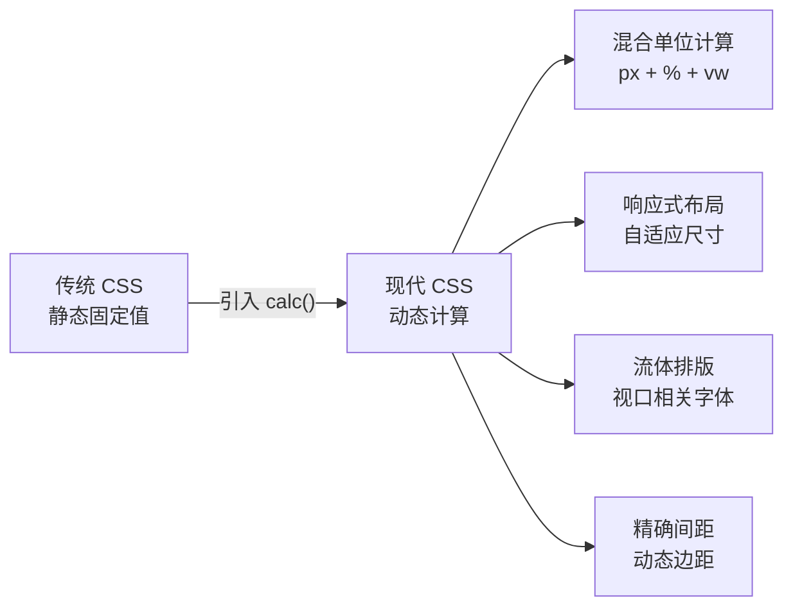
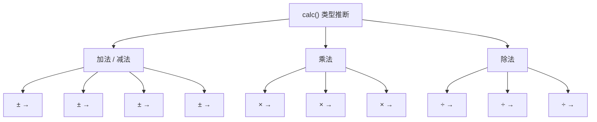

# calc() 函数

## 背景与动机

### 传统 CSS 的局限

在 CSS 的发展早期，样式表中的值都是**静态的**——开发者只能预先设定固定的像素值、百分比或关键字。当面对需要动态计算的场景时，传统 CSS 显得力不从心：

```css
/* ❌ 传统 CSS 无法实现：宽度 = 100% 减去固定像素 */
.sidebar { width: 250px; }
.main-content { width: ???; } /* 无法表达 "剩余宽度" */

/* ❌ 无法实现：字体大小随视口线性增长 */
h1 { font-size: ???; } /* 无法表达 "16px + 2vw" 的混合计算 */
```

**常见的痛点场景**包括：

1. **响应式布局**：需要元素宽度 = 父容器 100% 减去固定间距
2. **流体排版**：需要字体大小 = 基础值 + 视口相关增量
3. **动态间距**：需要根据容器尺寸自动调整内边距
4. **居中定位**：需要计算 `50% - 元素尺寸/2` 的偏移量
5. **网格系统**：需要将可用宽度等分并减去间距

### calc() 的诞生

`calc()` 作为 CSS Values and Units Module Level 3 规范的一部分被引入，它允许在 CSS 属性值中执行**动态数学运算**，打破了传统 CSS 只能使用固定值的限制。它的核心优势在于实现了**绝对单位与相对单位的混合计算**，是现代响应式布局的核心工具之一。



### 核心特性一览

| 特性 | 说明 | 示例 |
|------|------|------|
| **混合计算** | 支持不同单位类型的组合运算 | `calc(100% - 20px)` |
| **运行时计算** | 浏览器在渲染时动态计算最终值 | 自动响应视口变化 |
| **广泛支持** | 支持多种数据类型 | `<length>`、`<angle>`、`<time>`、`<number>` 等 |
| **嵌套能力** | 支持与 CSS 变量、其他 CSS 函数组合 | `calc(var(--x) * 2 + 10px)` |
| **类型推断** | 根据运算规则自动推断结果类型 | `<length> * <number>` → `<length>` |

## 核心概念

### 基本语法

`calc()` 函数的基本结构非常直观：

```css
/* 语法 */
property: calc(expression);

/* expression 组成 */
/* expression = value operator value [operator value ...] */
```

```css
/* 基本示例 */
.element {
  width: calc(100% - 20px);        /* 百分比减固定值 */
  height: calc(50vh - 100px);      /* 视口高度减固定值 */
  padding: calc(10px + 2%);        /* 固定值加百分比 */
  font-size: calc(16px + 0.5vw);   /* 固定值加视口单位 */
}
```

**关键要点**：

- `calc()` 函数只能用于接受**数值类型**的 CSS 属性
- 表达式支持四则运算：加（`+`）、减（`-`）、乘（`*`）、除（`/`）
- 运算结果必须符合目标属性的类型要求（如 `width` 需要 `<length-percentage>` 类型）
- 表达式内部的**空格**在某些情况下是必需的（详见后文注意事项）

### 运算符详解

`calc()` 支持四种基本数学运算符，每种运算符都有特定的**类型约束规则**。

#### 加法运算符 (+)

将两个值相加，结果的单位类型由参与运算的值决定。

```css
.element {
  /* 百分比 + 固定值 */
  width: calc(100% + 20px);
  
  /* 相对单位组合 */
  margin-left: calc(10px + 5%);
  padding: calc(1em + 10px);
  
  /* 与 CSS 变量组合 */
  gap: calc(var(--base-gap) + 10px);
}
```

**类型规则**：
- ✅ `<length> + <length>` → `<length>`
- ✅ `<percentage> + <length>` → `<length-percentage>`
- ✅ `<number> + <number>` → `<number>`
- ❌ `<length> + <number>` → **无效**（类型不兼容）

#### 减法运算符 (-)

从第一个值中减去第二个值。

```css
.element {
  /* 百分比 - 固定值 */
  width: calc(100% - 40px);
  
  /* 视口单位 - 固定高度 */
  height: calc(100vh - 60px);
  
  /* 固定值 - 固定值 */
  margin: calc(20px - 5px);  /* 结果：15px */
  
  /* 与变量组合 */
  width: calc(100% - var(--sidebar-width));
}
```

> **⚠️ 重要提示**：减法运算符两侧**必须保留空格**，否则 CSS 解析器会将其误解为负号。

```css
/* ✅ 正确 */
width: calc(100% - 20px);

/* ❌ 错误 - 被解析为 "100%" 和 "-20px" */
width: calc(100%-20px);
```

#### 乘法运算符 (*)

将值乘以一个**纯数值**因子。

```css
.element {
  /* 百分比 × 数值 */
  width: calc(50% * 2);      /* 等同于 100% */
  
  /* 固定值 × 数值 */
  font-size: calc(16px * 1.5);  /* 结果：24px */
  
  /* 与变量组合 */
  width: calc(var(--base-width) * var(--scale-factor));
}
```

**类型约束**：
- ✅ `<length> * <number>` → `<length>`
- ✅ `<percentage> * <number>` → `<percentage>`
- ❌ `<length> * <length>` → **无效**（结果单位不符合 CSS 规范）
- ❌ `<percentage> * <percentage>` → **无效**

#### 除法运算符 (/)

将值除以一个**纯数值**。

```css
.element {
  /* 百分比 ÷ 数值 */
  width: calc(100% / 3);     /* 三等分 */
  
  /* 固定值 ÷ 数值 */
  margin: calc(20px / 2);    /* 结果：10px */
  font-size: calc(16px / 2); /* 结果：8px */
  
  /* 与变量组合 */
  width: calc(var(--total-width) / var(--columns));
}
```

**类型约束**：
- ✅ `<length> / <number>` → `<length>`
- ✅ `<percentage> / <number>` → `<percentage>`
- ❌ `<length> / <length>` → **无效**（结果为 `<number>`，但需要 `<length>`）
- ❌ `<length> / <percentage>` → **无效**

### 运算符优先级

`calc()` 遵循标准数学运算优先级规则：

| 优先级 | 运算符 | 结合性 | 说明 |
|--------|--------|--------|------|
| 1（最高） | `()` 括号 | - | 括号内的表达式优先计算 |
| 2 | `*` `/` | 从左到右 | 乘除优先于加减 |
| 3（最低） | `+` `-` | 从左到右 | 同级运算符从左到右 |

```css
.element {
  /* 先除后减：相当于 (100% / 3) - 20px */
  width: calc(100% / 3 - 20px);
  
  /* 先减后除：使用括号改变优先级 */
  width: calc((100% - 20px) / 3);
  
  /* 复杂表达式示例 */
  width: calc(100% - 20px * 2);      /* 先乘后减：100% - 40px */
  width: calc((100% - 20px) * 2);    /* 先减后乘 */
  
  /* 多个相同优先级运算符，从左到右计算 */
  width: calc(100% - 20px - 10px);   /* 相当于 ((100% - 20px) - 10px) */
  margin: calc(20px + 10px + 5px);   /* 相当于 ((20px + 10px) + 5px) */
}
```

> **推荐做法**：在复杂表达式中，始终使用括号明确计算顺序，提高代码可读性。

```css
/* ✅ 推荐：使用括号提高可读性 */
width: calc((100% - var(--padding) * 2) / 3);

/* ❌ 不推荐：依赖默认优先级，可读性差 */
width: calc(100% - var(--padding) * 2 / 3);
```

## 深入原理

### 类型推断机制

`calc()` 表达式在运算过程中会进行**类型推断**，根据参与运算的值的类型自动确定结果的类型。理解类型推断规则是正确使用 `calc()` 的关键。

#### 类型推断规则表



#### 类型兼容性与错误

当运算结果的类型与目标属性不匹配时，整个 `calc()` 表达式将被视为**无效**：

```css
/* ✅ 类型匹配 */
width: calc(100% - 20px);     /* 结果类型 <length-percentage>，width 接受 */
opacity: calc(0.5 + 0.3);     /* 结果类型 <number>，opacity 接受 */
font-size: calc(16px + 2px);  /* 结果类型 <length>，font-size 接受 */

/* ❌ 类型不匹配 → 整个表达式无效 */
opacity: calc(100px);          /* 结果类型 <length>，但 opacity 需要 <number> */
width: calc(10s + 5px);       /* <time> + <length> 类型不兼容 */
font-size: calc(100% * 50%);  /* <percentage> * <percentage> 无效运算 */
```

#### 类型提升规则

当不同类型的值参与加减运算时，结果类型会被**提升**为更通用的类型：

```css
/* 类型提升示例 */
.element {
  /* <percentage> + <length> → <length-percentage> */
  width: calc(50% + 100px);   /* 结果类型：length-percentage */
  
  /* 这在 width（接受 length-percentage）上是有效的 */
  /* 但在 opacity（只接受 number）上是无效的 */
}
```

### calc() 与 CSS 变量的组合

CSS 变量（自定义属性）与 `calc()` 的组合是现代 CSS 中最强大的模式之一。变量提供**可配置的值**，`calc()` 提供**动态计算能力**。

#### 基础组合模式

```css
:root {
  --sidebar-width: 250px;
  --header-height: 60px;
  --gap: 20px;
  --base-font-size: 16px;
}

.main {
  width: calc(100% - var(--sidebar-width));
  margin-top: var(--header-height);
  min-height: calc(100vh - var(--header-height));
  font-size: calc(var(--base-font-size) + 0.5vw);
}

/* 使用 var() 提供默认值 */
.element {
  width: calc(100% - var(--sidebar-width, 200px));
}
```

#### 变量驱动的计算系统

```css
:root {
  --base-spacing: 8px;
  --scale-ratio: 1.5;
  
  /* 通过 calc() 构建间距系统 */
  --space-xs: calc(var(--base-spacing) * 0.5);   /* 4px */
  --space-sm: var(--base-spacing);                 /* 8px */
  --space-md: calc(var(--base-spacing) * 2);       /* 16px */
  --space-lg: calc(var(--base-spacing) * 3);       /* 24px */
  --space-xl: calc(var(--base-spacing) * 4);       /* 32px */
  --space-2xl: calc(var(--base-spacing) * 6);      /* 48px */
  
  /* 通过 calc() 构建字体比例系统 */
  --font-xs: calc(1rem / var(--scale-ratio) / var(--scale-ratio));  /* ~0.44rem */
  --font-sm: calc(1rem / var(--scale-ratio));                        /* ~0.67rem */
  --font-md: 1rem;                                                    /* 1rem */
  --font-lg: calc(1rem * var(--scale-ratio));                        /* 1.5rem */
  --font-xl: calc(1rem * var(--scale-ratio) * var(--scale-ratio));   /* 2.25rem */
}
```

#### 变量与 calc() 的响应式联动

```css
:root {
  --container-max-width: 1200px;
  --container-padding: 20px;
}

.container {
  /* 容器宽度 = min(最大宽度, 100% - 两侧内边距) */
  width: min(
    var(--container-max-width),
    calc(100% - var(--container-padding) * 2)
  );
  margin: 0 auto;
  padding: 0 var(--container-padding);
}

/* 响应式调整变量，calc() 自动重新计算 */
@media (max-width: 768px) {
  :root {
    --container-padding: 16px;
  }
}

@media (max-width: 480px) {
  :root {
    --container-padding: 12px;
  }
}
```

### 嵌套 calc()

`calc()` 支持嵌套使用，但在大多数情况下，显式嵌套是不必要的——因为 `calc()` 内部的表达式本身就可以包含完整的数学运算。

#### 显式嵌套 vs 简化形式

```css
.element {
  /* 显式嵌套 */
  width: calc(calc(100% / 3) - 20px);
  
  /* 简化形式，效果完全相同 */
  width: calc(100% / 3 - 20px);
}
```

#### 嵌套的实际应用场景

嵌套在以下场景中可能有用：

```css
:root {
  --base-spacing: 10px;
  --multiplier: 2;
}

.element {
  /* 多层计算：先计算变量乘以倍数，再加上偏移 */
  padding: calc(calc(var(--base-spacing) * var(--multiplier)) + 5px);
  
  /* 简化形式 */
  padding: calc(var(--base-spacing) * var(--multiplier) + 5px);
}

/* 嵌套与 CSS 函数组合 */
.responsive {
  /* clamp 内嵌套 calc */
  font-size: clamp(
    14px,
    calc(14px + (24 - 14) * ((100vw - 320px) / (1200 - 320))),
    24px
  );
}
```

> **注意**：虽然嵌套在语法上是有效的，但过度嵌套会降低代码可读性。建议尽量简化表达式。

### 支持的数据类型与单位

`calc()` 支持所有 CSS 数值数据类型，允许不同单位之间的混合运算。

#### 长度单位

```css
.element {
  /* 绝对单位 */
  width: calc(100% - 20px);
  font-size: calc(12pt + 2pt);
  border-width: calc(1mm + 0.5mm);
  padding: calc(1cm - 5mm);
  
  /* 相对单位 */
  padding: calc(1em + 10px);          /* em - 相对于元素自身字体大小 */
  font-size: calc(1rem + 2vw);        /* rem - 相对于根元素字体大小 */
  width: calc(50vw - 2rem);           /* vw - 视口宽度百分比 */
  height: calc(100vh - 60px);         /* vh - 视口高度百分比 */
  padding: calc(2vmin + 10px);        /* vmin - 视口较小维度 */
  font-size: calc(1rem + 0.5vmax);    /* vmax - 视口较大维度 */
  
  /* 容器查询单位 */
  padding: calc(1rem + 2cqi);         /* cqi - 容器内联尺寸百分比 */
  width: calc(50cqw - 20px);          /* cqw - 容器宽度百分比 */
  height: calc(30cqh + 10px);         /* cqh - 容器高度百分比 */
}
```

#### 百分比单位

```css
.element {
  width: calc(50% - 100px);      /* 宽度百分比 */
  left: calc(50% - 50px);        /* 定位百分比 */
  font-size: calc(100% + 2px);   /* 字体大小百分比 */
}
```

**百分比基准参考表**：

| 属性 | 百分比参考基准 | calc() 示例 |
|------|---------------|-------------|
| `width` | 包含块的宽度 | `calc(100% - 40px)` |
| `height` | 包含块的高度 | `calc(100% - 60px)` |
| `padding` | 包含块的宽度（水平书写模式） | `calc(2% + 10px)` |
| `margin` | 包含块的宽度（水平书写模式） | `calc(5% - 20px)` |
| `top/left` | 包含块的高度/宽度 | `calc(50% - 100px)` |
| `font-size` | 父元素的字体大小 | `calc(100% + 2px)` |
| `line-height` | 元素自身的字体大小 | `calc(150% + 0.1vw)` |

#### 其他数值类型

```css
/* 角度值 */
.element {
  transform: rotate(calc(45deg + 15deg));
  transform: rotate(calc(1rad + 0.5rad));
  background: linear-gradient(calc(90deg + 45deg), red, blue);
}

/* 时间值 */
.element {
  transition-duration: calc(0.3s + 0.2s);
  animation-delay: calc(100ms * 2);
  transition-delay: calc(0.1s * 3);
}

/* 纯数值 */
.element {
  opacity: calc(0.5 + 0.3);
  z-index: calc(10 + 5);
  flex-grow: calc(1 * 2);
  line-height: calc(1.5 * 1.2);   /* 结果：1.8 */
}

/* 频率值 */
.element {
  /* 用于 voice-family 等语音属性 */
  voice-pitch: calc(200Hz + 50Hz);
}
```

## 代码示例

### 示例 1：固定侧边栏布局

```html
<!DOCTYPE html>
<html lang="zh-CN">
<head>
  <meta charset="UTF-8">
  <meta name="viewport" content="width=device-width, initial-scale=1.0">
  <title>固定侧边栏布局</title>
  <style>
    :root {
      --sidebar-width: 250px;
      --header-height: 60px;
      --bg-primary: #ffffff;
      --bg-sidebar: #f5f5f5;
      --text-primary: #333333;
    }

    * {
      margin: 0;
      padding: 0;
      box-sizing: border-box;
    }

    body {
      font-family: -apple-system, BlinkMacSystemFont, "Segoe UI", Roboto, sans-serif;
      color: var(--text-primary);
    }

    .header {
      height: var(--header-height);
      background: var(--bg-primary);
      border-bottom: 1px solid #e0e0e0;
      display: flex;
      align-items: center;
      padding: 0 20px;
      position: fixed;
      top: 0;
      left: 0;
      right: 0;
      z-index: 100;
    }

    .layout {
      display: flex;
      min-height: calc(100vh - var(--header-height));
      margin-top: var(--header-height);
    }

    .sidebar {
      width: var(--sidebar-width);
      background: var(--bg-sidebar);
      padding: 20px;
      position: fixed;
      top: var(--header-height);
      left: 0;
      bottom: 0;
      overflow-y: auto;
    }

    .main-content {
      flex: 1;
      width: calc(100% - var(--sidebar-width));
      margin-left: var(--sidebar-width);
      padding: 20px;
    }

    @media (max-width: 768px) {
      :root {
        --sidebar-width: 0px;
      }
      .sidebar {
        display: none;
      }
      .main-content {
        width: 100%;
        margin-left: 0;
      }
    }
  </style>
</head>
<body>
  <header class="header">
    <h1>Dashboard</h1>
  </header>
  <div class="layout">
    <aside class="sidebar">
      <nav>
        <ul>
          <li>首页</li>
          <li>数据</li>
          <li>设置</li>
        </ul>
      </nav>
    </aside>
    <main class="main-content">
      <p>主内容区域，宽度 = 100% - 侧边栏宽度</p>
    </main>
  </div>
</body>
</html>
```

### 示例 2：全高布局（减去页头页脚）

```html
<!DOCTYPE html>
<html lang="zh-CN">
<head>
  <meta charset="UTF-8">
  <meta name="viewport" content="width=device-width, initial-scale=1.0">
  <title>全高布局</title>
  <style>
    :root {
      --header-height: 60px;
      --footer-height: 50px;
    }

    * {
      margin: 0;
      padding: 0;
      box-sizing: border-box;
    }

    .page-wrapper {
      min-height: 100vh;
      display: flex;
      flex-direction: column;
    }

    .header {
      height: var(--header-height);
      background: #333;
      color: white;
      display: flex;
      align-items: center;
      padding: 0 20px;
      flex-shrink: 0;
    }

    .content {
      flex: 1;
      /* 关键：内容区域高度 = 视口高度 - 页头 - 页脚 */
      min-height: calc(100vh - var(--header-height) - var(--footer-height));
      padding: 20px;
      background: #f9f9f9;
    }

    .footer {
      height: var(--footer-height);
      background: #f5f5f5;
      display: flex;
      align-items: center;
      padding: 0 20px;
      flex-shrink: 0;
      border-top: 1px solid #e0e0e0;
    }
  </style>
</head>
<body>
  <div class="page-wrapper">
    <header class="header"><h1>页头</h1></header>
    <main class="content">
      <p>内容区域自动填满页头和页脚之间的空间。</p>
      <p>min-height: calc(100vh - 60px - 50px) = calc(100vh - 110px)</p>
    </main>
    <footer class="footer"><p>页脚</p></footer>
  </div>
</body>
</html>
```

### 示例 3：响应式流体排版系统

```html
<!DOCTYPE html>
<html lang="zh-CN">
<head>
  <meta charset="UTF-8">
  <meta name="viewport" content="width=device-width, initial-scale=1.0">
  <title>流体排版系统</title>
  <style>
    :root {
      --base-font-size: 16px;
      --scale-ratio: 1.25;

      /* 使用 calc() 构建字体比例系统 */
      --font-size-xs: calc(var(--base-font-size) / var(--scale-ratio) / var(--scale-ratio));
      --font-size-sm: calc(var(--base-font-size) / var(--scale-ratio));
      --font-size-md: var(--base-font-size);
      --font-size-lg: calc(var(--base-font-size) * var(--scale-ratio));
      --font-size-xl: calc(var(--base-font-size) * var(--scale-ratio) * var(--scale-ratio));
      --font-size-2xl: calc(var(--base-font-size) * var(--scale-ratio) * var(--scale-ratio) * var(--scale-ratio));
    }

    body {
      font-size: var(--font-size-md);
      font-family: -apple-system, BlinkMacSystemFont, "Segoe UI", Roboto, sans-serif;
      line-height: 1.6;
      padding: 20px;
      max-width: 800px;
      margin: 0 auto;
    }

    /* 流体标题：使用 clamp + calc 确保上下限 */
    h1 {
      font-size: clamp(
        var(--font-size-xl),
        calc(var(--font-size-xl) + 2vw),
        var(--font-size-2xl)
      );
      margin-bottom: calc(var(--font-size-md) * 0.5);
    }

    h2 {
      font-size: clamp(
        var(--font-size-lg),
        calc(var(--font-size-lg) + 1vw),
        var(--font-size-xl)
      );
      margin-bottom: calc(var(--font-size-md) * 0.4);
    }

    h3 {
      font-size: var(--font-size-lg);
      margin-bottom: calc(var(--font-size-md) * 0.3);
    }

    p {
      font-size: var(--font-size-md);
      margin-bottom: var(--font-size-md);
    }

    small {
      font-size: var(--font-size-sm);
      color: #666;
    }

    /* 响应式间距 */
    .section {
      padding: clamp(1rem, calc(1rem + 2vw), 3rem) 0;
    }

    /* 响应式字间距 */
    .wide-text {
      letter-spacing: calc(0.01em + 0.05vw);
      word-spacing: calc(0.1em + 0.1vw);
    }
  </style>
</head>
<body>
  <h1>流体排版系统</h1>
  <p>字体大小使用 <code>calc()</code> 结合 CSS 变量构建，实现基于比例尺的和谐字体层级。</p>
  
  <div class="section">
    <h2>二级标题</h2>
    <p>使用 <code>clamp()</code> 限制字体大小的上下限，确保在任何视口尺寸下都保持良好的可读性。</p>
  </div>

  <div class="section">
    <h3>三级标题</h3>
    <p>间距同样使用 <code>calc()</code> 和 <code>clamp()</code> 实现响应式调整。</p>
    <small>这段文字使用较小的字体尺寸。</small>
  </div>
</body>
</html>
```

### 示例 4：Flex 网格等间距系统

```html
<!DOCTYPE html>
<html lang="zh-CN">
<head>
  <meta charset="UTF-8">
  <meta name="viewport" content="width=device-width, initial-scale=1.0">
  <title>Flex 网格系统</title>
  <style>
    :root {
      --columns: 12;
      --gap: 20px;
      --container-padding: 20px;
    }

    * {
      margin: 0;
      padding: 0;
      box-sizing: border-box;
    }

    .container {
      width: calc(100% - var(--container-padding) * 2);
      max-width: 1200px;
      margin: 0 auto;
      padding: 20px 0;
    }

    .grid {
      display: flex;
      gap: var(--gap);
      flex-wrap: wrap;
      margin-bottom: 20px;
    }

    .grid-item {
      background: #4a90d9;
      color: white;
      padding: 20px;
      border-radius: 8px;
      text-align: center;
      font-weight: bold;
    }

    /* 三列网格：每个项目宽度 = (100% - 2个间距) / 3 */
    .col-3 {
      width: calc((100% - var(--gap) * 2) / 3);
    }

    /* 四列网格：每个项目宽度 = (100% - 3个间距) / 4 */
    .col-4 {
      width: calc((100% - var(--gap) * 3) / 4);
    }

    /* 六列网格 */
    .col-6 {
      width: calc((100% - var(--gap) * 5) / 6);
    }

    /* 响应式调整 */
    @media (max-width: 768px) {
      .col-3, .col-4, .col-6 {
        width: calc((100% - var(--gap)) / 2);
      }
    }

    @media (max-width: 480px) {
      .col-3, .col-4, .col-6 {
        width: 100%;
      }
    }
  </style>
</head>
<body>
  <div class="container">
    <h3>三列网格</h3>
    <div class="grid">
      <div class="grid-item col-3">1/3</div>
      <div class="grid-item col-3">1/3</div>
      <div class="grid-item col-3">1/3</div>
    </div>

    <h3>四列网格</h3>
    <div class="grid">
      <div class="grid-item col-4">1/4</div>
      <div class="grid-item col-4">1/4</div>
      <div class="grid-item col-4">1/4</div>
      <div class="grid-item col-4">1/4</div>
    </div>

    <h3>六列网格</h3>
    <div class="grid">
      <div class="grid-item col-6">1/6</div>
      <div class="grid-item col-6">1/6</div>
      <div class="grid-item col-6">1/6</div>
      <div class="grid-item col-6">1/6</div>
      <div class="grid-item col-6">1/6</div>
      <div class="grid-item col-6">1/6</div>
    </div>
  </div>
</body>
</html>
```

### 示例 5：响应式卡片组件

```html
<!DOCTYPE html>
<html lang="zh-CN">
<head>
  <meta charset="UTF-8">
  <meta name="viewport" content="width=device-width, initial-scale=1.0">
  <title>响应式卡片</title>
  <style>
    :root {
      --card-max-width: 400px;
      --card-padding: 20px;
      --border-radius: 12px;
    }

    body {
      font-family: -apple-system, BlinkMacSystemFont, "Segoe UI", Roboto, sans-serif;
      background: #f0f2f5;
      padding: 20px;
      display: flex;
      justify-content: center;
      align-items: center;
      min-height: 100vh;
    }

    .card {
      /* 卡片宽度 = min(最大宽度, 100% - 两侧外边距) */
      width: calc(100% - 40px);
      max-width: var(--card-max-width);
      margin: 20px auto;
      padding: calc(var(--card-padding) + 4px);
      background: white;
      border-radius: var(--border-radius);
      box-shadow: 0 2px 12px rgba(0, 0, 0, 0.08);
      overflow: hidden;
    }

    .card-image {
      width: 100%;
      height: calc(var(--card-max-width) * 0.5);
      background: linear-gradient(135deg, #667eea 0%, #764ba2 100%);
      border-radius: calc(var(--border-radius) - 4px);
      margin-bottom: calc(var(--card-padding) * 0.75);
    }

    .card-title {
      font-size: calc(1.2rem + 0.3vw);
      margin-bottom: calc(0.5rem + 4px);
      color: #333;
    }

    .card-content {
      font-size: calc(0.9rem + 0.1vw);
      color: #666;
      line-height: calc(150% + 0.1vw);
    }

    .card-footer {
      margin-top: calc(var(--card-padding) * 0.75);
      padding-top: calc(var(--card-padding) * 0.5);
      border-top: 1px solid #eee;
      display: flex;
      justify-content: space-between;
      align-items: center;
    }
  </style>
</head>
<body>
  <div class="card">
    <div class="card-image"></div>
    <h3 class="card-title">响应式卡片组件</h3>
    <p class="card-content">
      这个卡片组件使用 calc() 实现响应式尺寸。
      字体大小、内边距、图片高度等都通过 calc() 动态计算，
      确保在不同屏幕尺寸下都有良好的视觉效果。
    </p>
    <div class="card-footer">
      <span>2024-01-01</span>
      <span>阅读更多 →</span>
    </div>
  </div>
</body>
</html>
```

### 示例 6：模态框居中

```html
<!DOCTYPE html>
<html lang="zh-CN">
<head>
  <meta charset="UTF-8">
  <meta name="viewport" content="width=device-width, initial-scale=1.0">
  <title>模态框</title>
  <style>
    * {
      margin: 0;
      padding: 0;
      box-sizing: border-box;
    }

    .modal-overlay {
      position: fixed;
      top: 0;
      left: 0;
      right: 0;
      bottom: 0;
      background: rgba(0, 0, 0, 0.5);
      display: flex;
      justify-content: center;
      align-items: center;
      z-index: 1000;
    }

    .modal {
      /* 使用 calc() 确保模态框在各种屏幕尺寸下都可见 */
      width: calc(100% - 40px);
      max-width: 600px;
      max-height: calc(100vh - 40px);
      padding: calc(20px + 1vw);
      background: white;
      border-radius: 12px;
      overflow-y: auto;
      box-shadow: 0 20px 60px rgba(0, 0, 0, 0.3);
    }

    .modal-header {
      margin-bottom: calc(16px + 0.5vw);
    }

    .modal-title {
      font-size: calc(1.25rem + 0.25vw);
    }

    .modal-body {
      margin-bottom: calc(16px + 0.5vw);
      line-height: calc(150% + 0.1vw);
    }

    .modal-footer {
      display: flex;
      gap: calc(8px + 0.5vw);
      justify-content: flex-end;
    }

    .btn {
      padding: calc(8px + 0.25vw) calc(16px + 0.5vw);
      border: none;
      border-radius: 6px;
      cursor: pointer;
      font-size: calc(0.875rem + 0.1vw);
    }

    .btn-primary {
      background: #007bff;
      color: white;
    }

    .btn-secondary {
      background: #e0e0e0;
      color: #333;
    }
  </style>
</head>
<body>
  <div class="modal-overlay">
    <div class="modal">
      <div class="modal-header">
        <h2 class="modal-title">模态框标题</h2>
      </div>
      <div class="modal-body">
        <p>模态框使用 calc() 实现响应式尺寸和间距。</p>
        <p>宽度: calc(100% - 40px)，最大宽度 600px</p>
        <p>最大高度: calc(100vh - 40px)</p>
      </div>
      <div class="modal-footer">
        <button class="btn btn-secondary">取消</button>
        <button class="btn btn-primary">确认</button>
      </div>
    </div>
  </div>
</body>
</html>
```

### 示例 7：主题系统（calc + HSL 色彩）

```css
:root {
  /* 主题色相 */
  --primary-hue: 220;
  --primary-sat: 70%;
  --primary-lightness: 50%;

  /* 使用 calc() 生成色彩变体 */
  --primary: hsl(var(--primary-hue), var(--primary-sat), var(--primary-lightness));
  --primary-dark: hsl(
    var(--primary-hue),
    var(--primary-sat),
    calc(var(--primary-lightness) - 10%)
  );
  --primary-darker: hsl(
    var(--primary-hue),
    var(--primary-sat),
    calc(var(--primary-lightness) - 20%)
  );
  --primary-light: hsl(
    var(--primary-hue),
    var(--primary-sat),
    calc(var(--primary-lightness) + 20%)
  );
  --primary-lighter: hsl(
    var(--primary-hue),
    calc(var(--primary-sat) - 20%),
    calc(var(--primary-lightness) + 35%)
  );
  
  /* 间距系统 */
  --space-unit: 8px;
  --space-1: calc(var(--space-unit) * 1);   /* 8px */
  --space-2: calc(var(--space-unit) * 2);   /* 16px */
  --space-3: calc(var(--space-unit) * 3);   /* 24px */
  --space-4: calc(var(--space-unit) * 4);   /* 32px */
  --space-5: calc(var(--space-unit) * 6);   /* 48px */
  --space-6: calc(var(--space-unit) * 8);   /* 64px */
}

/* 暗色主题覆盖 */
@media (prefers-color-scheme: dark) {
  :root {
    --primary-lightness: 60%;
    --primary-lighter: hsl(
      var(--primary-hue),
      calc(var(--primary-sat) - 30%),
      calc(var(--primary-lightness) - 30%)
    );
  }
}

/* 使用示例 */
.button {
  background: var(--primary);
  color: white;
  padding: var(--space-1) var(--space-3);
  border-radius: calc(var(--space-unit) * 0.75);
}

.button:hover {
  background: var(--primary-dark);
}

.card {
  padding: var(--space-3);
  border-radius: calc(var(--space-unit) * 1.5);
  box-shadow: 0 calc(var(--space-unit) * 0.25) calc(var(--space-unit) * 1) rgba(0, 0, 0, 0.1);
}
```

### 示例 8：与 min/max/clamp 组合的响应式布局

```css
/* 响应式容器 */
.container {
  /* 容器宽度：不超过 1200px，两侧至少留 20px */
  width: min(1200px, calc(100% - 40px));
  margin: 0 auto;
}

/* 响应式字体 */
h1 {
  /* 最小 24px，随视口增长，最大 48px */
  font-size: clamp(24px, calc(24px + 2vw), 48px);
}

/* 响应式侧边栏 */
.sidebar {
  /* 最小 200px，理想 25% + 50px，最大 350px */
  width: clamp(200px, calc(25% + 50px), 350px);
}

/* 响应式网格 */
.grid {
  /* 自适应列：每列最小 250px，最大 1fr */
  grid-template-columns: repeat(
    auto-fill,
    minmax(min(250px, 100%), 1fr)
  );
  gap: calc(16px + 0.5vw);
}

/* 安全的视口高度（处理移动端地址栏） */
.full-height {
  height: min(100vh, 100dvh);
}

/* 响应式图片 */
.hero-image {
  width: 100%;
  /* 高度 = 宽度 × 宽高比，但不超过 600px */
  height: min(calc(100vw * 0.5625), 600px);
  object-fit: cover;
}
```

## 最佳实践

### 1. 始终保留运算符空格

无论运算符类型如何，始终在运算符两侧保留空格，保持代码一致性：

```css
/* ✅ 推荐 */
width: calc(100% - 20px);
width: calc(100% * 2);
width: calc(100% / 3);

/* ❌ 避免 */
width: calc(100%-20px);   /* 语法错误 */
width: calc(100% +20px);  /* 可能被误解 */
```

### 2. 使用括号明确优先级

在复杂表达式中使用括号提高可读性：

```css
/* ✅ 推荐 */
width: calc((100% - 40px) / 3);
padding: calc((var(--base) * 2) + 10px);

/* ❌ 可读性差 */
width: calc(100% - 40px / 3);
```

### 3. 结合 CSS 变量提高可维护性

将关键值提取为 CSS 变量，通过 `calc()` 进行计算：

```css
:root {
  --spacing: 20px;
  --sidebar: 250px;
  --header: 60px;
}

.element {
  padding: var(--spacing);
  width: calc(100% - var(--sidebar));
  min-height: calc(100vh - var(--header));
}
```

### 4. 提供后备方案

确保老旧浏览器优雅降级：

```css
.element {
  /* 后备方案 */
  width: 95%;
  /* 渐进增强 */
  width: calc(100% - 20px);
}

/* 使用 @supports 检测 */
@supports (width: calc(100% - 20px)) {
  .element {
    width: calc(100% - 20px);
  }
}
```

### 5. 避免过度嵌套

保持表达式简洁，避免多层嵌套：

```css
/* ✅ 简洁清晰 */
width: calc((100% - 40px) / 3);

/* ❌ 过于复杂 */
width: calc(calc(calc(100% - 20px) / 3) * 2 + 10px - 5px);

/* ✅ 优化后 */
width: calc((100% - 20px) * 2 / 3 + 5px);
```

### 6. 利用现代函数组合

与 `clamp()`、`min()`、`max()` 组合实现更智能的响应式设计：

```css
/* 响应式字体 */
font-size: clamp(16px, calc(16px + 1vw), 24px);

/* 响应式间距 */
padding: clamp(10px, calc(5px + 2vw), 30px);

/* 响应式容器 */
width: min(1200px, calc(100% - 40px));
```

### 7. 性能优化

```css
/* ✅ 避免在动画中使用 calc() 改变尺寸属性 */
.element {
  animation: slide 1s ease-in-out;
}

@keyframes slide {
  from { transform: translateX(0); }
  to { transform: translateX(100%); }
}

/* ❌ 避免：在动画中改变使用 calc() 的尺寸 */
@keyframes resize {
  from { width: 100px; }
  to { width: calc(100% - 20px); }
}
```

### 8. 为复杂表达式添加注释

```css
.element {
  /* 三列布局：总宽度减去两个间距后除以 3 */
  width: calc((100% - 40px) / 3);
  
  /* 响应式字体：基础大小 16px + 视口宽度的 0.5% */
  font-size: calc(16px + 0.5vw);
  
  /* 内容高度：视口高度 - 页头(60px) - 页脚(50px) - 上下内边距(40px) */
  min-height: calc(100vh - 60px - 50px - 40px);
}
```

### 9. 使用 CSS 变量构建计算系统

```css
:root {
  /* 基础单位 */
  --unit: 8px;
  
  /* 间距系统 */
  --space-1: calc(var(--unit) * 1);
  --space-2: calc(var(--unit) * 2);
  --space-3: calc(var(--unit) * 3);
  --space-4: calc(var(--unit) * 4);
  --space-5: calc(var(--unit) * 6);
  --space-6: calc(var(--unit) * 8);
  
  /* 字体系统 */
  --text-xs: calc(1rem * 0.75);
  --text-sm: calc(1rem * 0.875);
  --text-base: 1rem;
  --text-lg: calc(1rem * 1.25);
  --text-xl: calc(1rem * 1.5);
  --text-2xl: calc(1rem * 2);
}
```

## 常见问题

### Q1: 为什么 `calc(100%-20px)` 不工作？

**A**: 减法和加法运算符两侧**必须保留空格**。正确的写法是 `calc(100% - 20px)`。这是 CSS 解析器的语法要求，因为 `-` 可能被误解为负值的一部分（如 `-20px`）。

```css
/* ✅ 正确 */
width: calc(100% - 20px);

/* ❌ 错误 - 缺少空格 */
width: calc(100%-20px);
```

### Q2: 可以在 calc() 中使用 px 和 % 混合计算吗？

**A**: 可以。`calc()` 的核心优势就是支持不同单位类型的混合计算。`calc(100% - 20px)` 是完全有效的表达式，结果类型为 `<length-percentage>`。

### Q3: calc() 支持哪些 CSS 属性？

**A**: `calc()` 支持所有接受数值类型的 CSS 属性，包括但不限于：

| 属性类别 | 示例属性 | calc() 示例 |
|---------|---------|-------------|
| 尺寸属性 | `width`、`height` | `calc(100% - 40px)` |
| 间距属性 | `margin`、`padding`、`gap` | `calc(1rem + 2vw)` |
| 定位属性 | `top`、`left`、`right` | `calc(50% - 100px)` |
| 字体属性 | `font-size`、`line-height` | `calc(16px + 0.5vw)` |
| 时间属性 | `transition-duration` | `calc(0.3s + 0.1s)` |
| 变换属性 | `transform` 中的值 | `rotate(calc(45deg * 2))` |

### Q4: 如何在 calc() 中使用 CSS 变量？

**A**: 使用 `var()` 函数引用 CSS 变量：

```css
:root {
  --sidebar-width: 250px;
}

.main {
  width: calc(100% - var(--sidebar-width));
  /* 也可以提供默认值 */
  width: calc(100% - var(--sidebar-width, 200px));
}
```

### Q5: calc() 会影响性能吗？

**A**: 简单的 `calc()` 表达式对性能影响**微乎其微**。浏览器会在渲染时高效地计算这些值。需要注意的情况：

- 避免过度复杂的嵌套表达式（如 `calc(calc(calc(...)))`）
- 避免在动画中频繁改变使用 `calc()` 的尺寸属性
- 对于动画，优先使用 `transform` 而非改变尺寸

### Q6: calc() 与 JavaScript 中的计算有什么区别？

**A**: 主要区别如下：

| 特性 | CSS calc() | JavaScript |
|------|-----------|-----------|
| 执行时机 | 浏览器渲染时自动计算 | 代码运行时执行 |
| 单位支持 | 原生支持 CSS 单位混合 | 需要手动处理单位转换 |
| 响应式 | 自动响应视口/容器变化 | 需要监听 resize 事件 |
| 性能 | 浏览器原生优化 | 依赖 JS 引擎 |
| 可维护性 | 纯 CSS，无需 JS | 需要额外的 DOM 操作 |

### Q7: 如何调试 calc() 表达式？

**A**: 

1. **使用浏览器开发者工具**：在 Elements 面板中检查计算后的最终值
2. **确保空格正确**：加法和减法必须有空格
3. **检查单位兼容性**：确保参与运算的单位类型兼容
4. **使用 @supports 检测**：

```css
@supports (width: calc(100% - 20px)) {
  /* calc() 被支持时使用 */
  .element {
    width: calc(100% - 20px);
  }
}
```

### Q8: calc() 可以嵌套使用吗？

**A**: 可以，但通常不需要显式嵌套：

```css
/* 显式嵌套（不推荐，可读性差） */
width: calc(calc(100% / 3) - 20px);

/* 简化形式（推荐，效果相同） */
width: calc(100% / 3 - 20px);
```

### Q9: 如何处理 calc() 计算结果为负值的情况？

**A**: 不同属性对负值的处理不同：

```css
.element {
  /* ✅ margin 可以接受负值 */
  margin-left: calc(-20px);
  
  /* ❌ width 不接受负值，会自动设为 0 */
  width: calc(100% - 150%); /* 结果为负 → 实际为 0 */
  
  /* ✅ 使用 max() 避免负值 */
  width: max(0px, calc(100% - 150%));
}
```

### Q10: calc() 与 min()、max()、clamp() 如何选择？

**A**: 它们各有用途，经常组合使用：

| 函数 | 用途 | 典型场景 |
|------|------|---------|
| `calc()` | 精确数学计算 | `calc(100% - 40px)` |
| `min()` | 取多个值中的最小值 | `min(100%, 500px)` — 设置上限 |
| `max()` | 取多个值中的最大值 | `max(200px, 50%)` — 设置下限 |
| `clamp()` | 设置上下限约束 | `clamp(16px, 2vw, 24px)` — 流体排版 |

```css
/* 组合使用示例 */
.container {
  width: min(1200px, calc(100% - 40px));
  font-size: clamp(16px, calc(16px + 0.5vw), 24px);
  padding: max(16px, calc(16px + 1vw));
}
```

### Q11: 为什么 width: calc(100px / 10px) 是无效的？

**A**: 早期规范要求 `calc()` 除法的除数必须是**纯数值**（`<number>`），不能是带单位的值。CSS Values 4 已放宽为允许**同类型相除**——`100px / 10px` 会得到纯数值 `10`，Chrome 140+、Edge 140+、Safari 26+ 已支持，Firefox 尚未支持。但 `width` 需要 `<length>` 类型，而同类型相除的结果是 `<number>`，类型不匹配，因此这个声明在任何浏览器中都无效。

```css
/* ✅ 正确 - 除数是纯数值 */
width: calc(100px / 2);      /* 结果：50px */
width: calc(100% / 3);       /* 结果：33.33% */

/* ❌ 错误 - width 需要 <length>，同类型相除结果是 <number> */
width: calc(100px / 10px);   /* 结果为 10（number），不是 length */

/* ✅ 同类型相除可用于接受 <number> 的场合（受支持浏览器） */
scale: calc(100px / 10px);   /* 结果：10 */
```

### Q12: 在 calc() 中使用 var() 时，变量未定义会怎样？

**A**: 如果变量未定义且没有提供默认值，整个 `calc()` 表达式将被视为无效，属性会使用其初始值或继承值。

```css
/* 如果 --sidebar-width 未定义 */
width: calc(100% - var(--sidebar-width));  /* 整个表达式无效 */

/* 提供默认值避免问题 */
width: calc(100% - var(--sidebar-width, 250px));  /* 使用 250px 作为后备 */
```

## 参考资源

- [MDN - calc()](https://developer.mozilla.org/zh-CN/docs/Web/CSS/calc)
- [CSS Values and Units Module Level 3](https://www.w3.org/TR/css-values-3/#calc-notation)
- [CSS Values and Units Module Level 4](https://www.w3.org/TR/css-values-4/#calc-notation)
- [Can I use - calc()](https://caniuse.com/calc)
- [CSS-Tricks - A Complete Guide to calc()](https://css-tricks.com/a-complete-guide-to-calc/)
- [Smashing Magazine - Using calc() For Responsive Design](https://www.smashingmagazine.com/2015/12/getting-started-with-calc/)
- [MDN - CSS 数学函数](https://developer.mozilla.org/zh-CN/docs/Web/CSS/CSS_math_functions)
