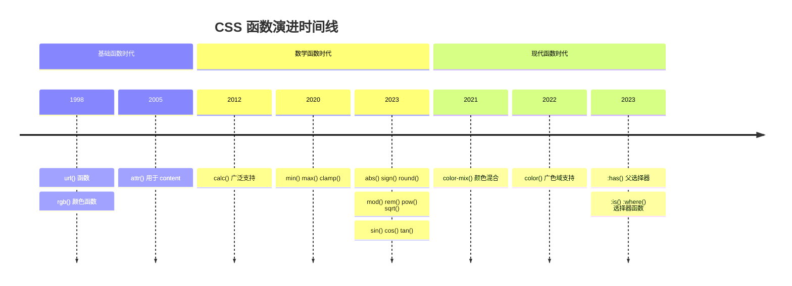
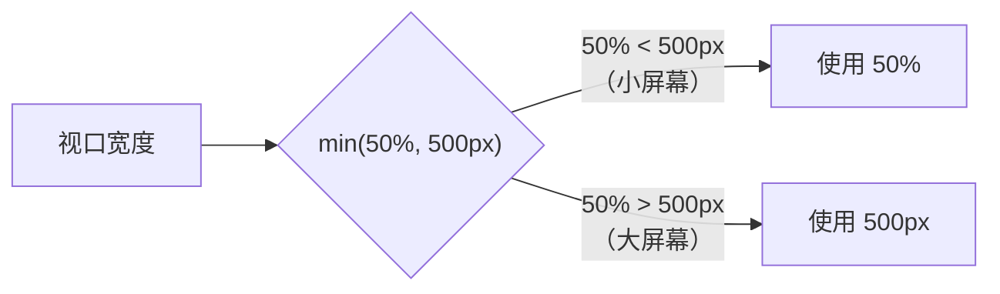
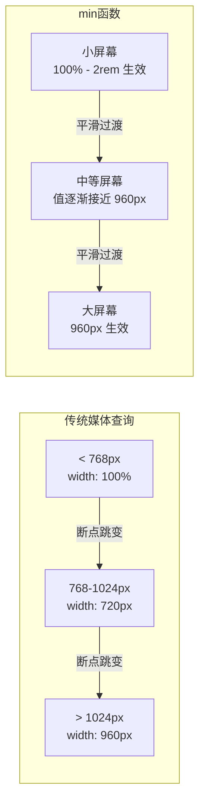
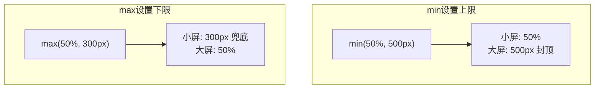
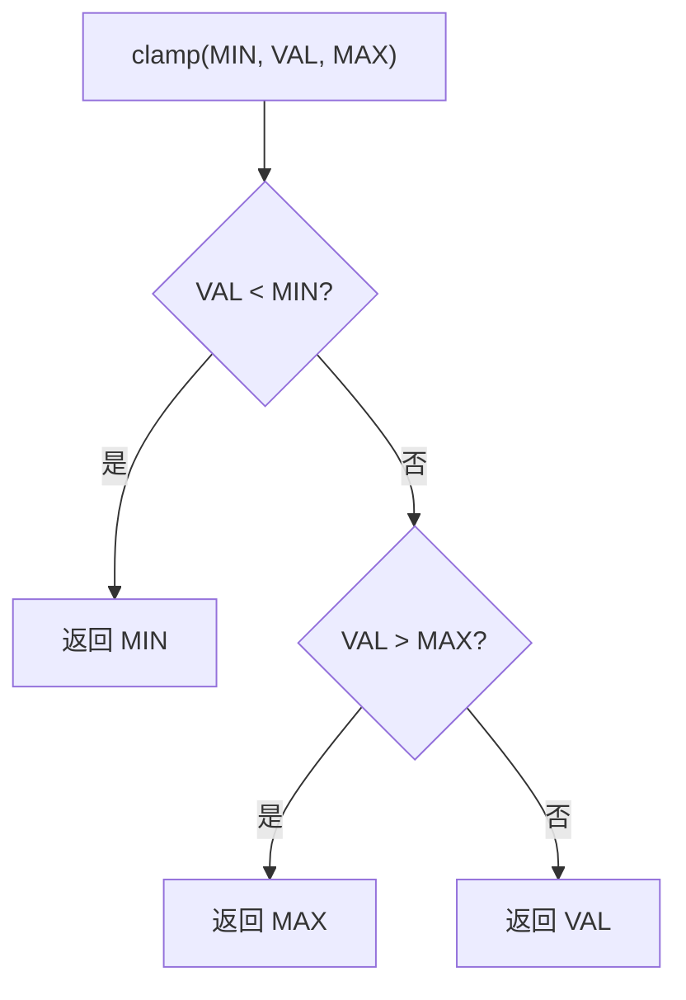
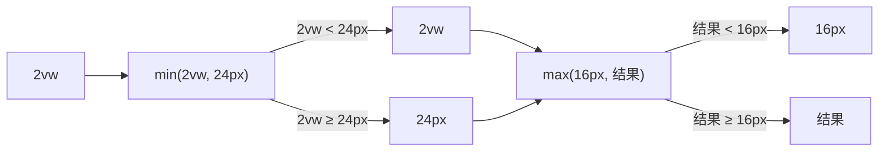
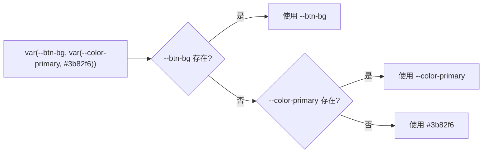
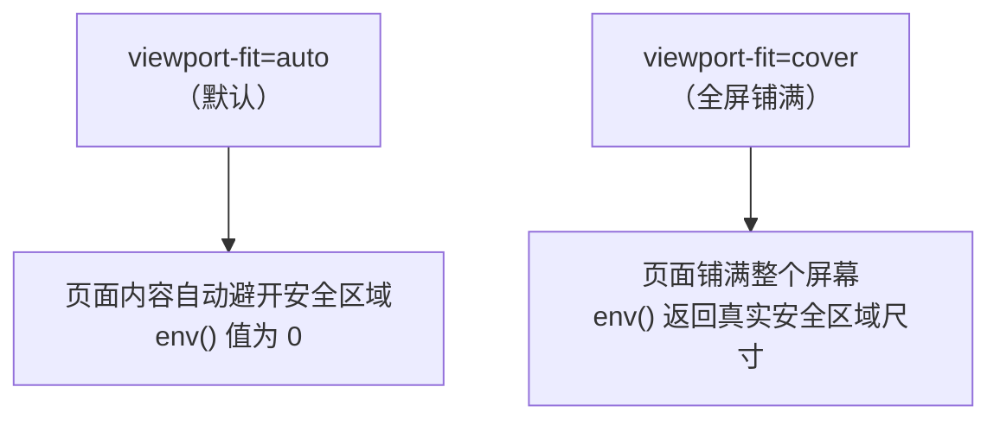

# 其他 CSS 函数

## 背景与动机

### CSS 函数的演进历程

CSS 从最初的简单样式描述语言，已经发展成为一门功能强大的声明式编程语言。函数的引入是这一演进过程中的关键里程碑——它们赋予了 CSS **动态计算**、**条件判断**和**数据操作**的能力，使得开发者能够在纯 CSS 层面实现复杂的逻辑。



### 为什么需要 CSS 函数？

传统 CSS 的局限性催生了函数的需求：

| 传统 CSS 痛点 | 函数解决方案 | 典型场景 |
|--------------|-------------|---------|
| 无法动态计算尺寸 | `calc()` | `width: calc(100% - 40px)` |
| 无法设置响应式边界 | `min()` / `max()` / `clamp()` | `font-size: clamp(16px, 2vw, 24px)` |
| 颜色变体需要预计算 | `color-mix()` | `color-mix(in srgb, var(--primary), white 20%)` |
| 无法从 HTML 获取值 | `attr()` | `width: attr(data-width px)` |
| 选择器过于冗长 | `:is()` / `:where()` | `:is(h1, h2, h3) { font-weight: bold; }` |
| 无法根据子元素选择父元素 | `:has()` | `.card:has(img) { padding-top: 0; }` |

### CSS 函数全景分类

CSS 中共有 86+ 个函数可用，按功能可分为以下几大类：

```mermaid
flowchart TD
    A["CSS 函数体系<br/>86+ 个函数"] --> B["数学函数"]
    A --> C["颜色函数"]
    A --> D["图像/渐变函数"]
    A --> E["滤镜函数"]
    A --> F["变换函数"]
    A --> G["工具函数"]
    A --> H["选择器函数"]
    A --> I["布局函数"]
    
    B --> B1["calc() 四则运算"]
    B --> B2["min() max() clamp() 比较"]
    B --> B3["abs() sign() round() 基础"]
    B --> B4["mod() rem() pow() sqrt() 高级"]
    B --> B5["sin() cos() tan() 三角"]
    
    C --> C1["rgb() hsl() hwb() 传统"]
    C --> C2["lab() lch() oklch() 感知均匀"]
    C --> C3["color() 广色域"]
    C --> C4["color-mix() 颜色混合"]
    
    D --> D1["url() 资源引用"]
    D --> D2["linear-gradient() 线性渐变"]
    D --> D3["radial-gradient() 径向渐变"]
    D --> D4["conic-gradient() 锥形渐变"]
    D --> D5["image-set() 响应式图片"]
    
    G --> G1["var() CSS 变量"]
    G --> G2["attr() HTML 属性"]
    G --> G3["env() 环境变量"]
    G --> G4["counter() 计数器"]
    
    H --> H1[":is() 匹配选择器"]
    H --> H2[":where() 零优先级"]
    H --> H3[":not() 排除选择器"]
    H --> H4[":has() 父选择器"]
    
```



## 核心概念

### 尺寸函数：min() / max() / clamp()

尺寸函数是响应式设计的核心工具，它们允许在多个候选值中进行**智能选择**，无需媒体查询即可实现自适应布局。

#### 函数对比

| 函数 | 语法 | 功能 | 典型用途 |
|------|------|------|---------|
| `min()` | `min(v1, v2, ...)` | 取最小值 | 设置**上限**约束 |
| `max()` | `max(v1, v2, ...)` | 取最大值 | 设置**下限**约束 |
| `clamp()` | `clamp(min, val, max)` | 三值约束 | **流体排版**、响应式间距 |

#### min() 深入

`min()` 从逗号分隔的值列表中选择**最小值**作为最终结果。它常用于设置响应式尺寸的**上限**。

```css
/* 基础用法：元素宽度不超过 500px */
.element {
  width: min(50%, 500px);
  /* 当 50% < 500px 时（小屏幕），使用 50% */
  /* 当 50% > 500px 时（大屏幕），使用 500px */
}

/* 响应式字体大小 */
.text {
  font-size: min(3vw, 24px);
  /* 字体随视口缩放，但不超过 24px */
}

/* 多值比较 */
.container {
  width: min(100%, 800px, 80vw);
  /* 取三个值中的最小值 */
}

/* 响应式内边距 */
.section {
  padding: min(5vw, 3rem);
  /* 内边距随视口缩放，但有上限 */
}

/* 图片最大尺寸控制 */
.hero-image {
  width: 100%;
  height: min(50vh, 400px);
  object-fit: cover;
}
```

**min() 的工作原理**：



**min() 多值比较规则**

`min()` 接受任意数量的逗号分隔参数，最终取所有计算结果中的最小值。理解其比较规则是正确使用的关键：

1. **不同单位可混用**：`min(50%, 500px, 80vw)` 中三个值分别基于父元素宽度、固定像素和视口宽度计算，浏览器会在每个布局时刻分别求值后取最小
2. **计算顺序无关**：`min(500px, 50%)` 与 `min(50%, 500px)` 结果完全相同
3. **嵌套 calc() 可省略**：`min(50% - 20px, 500px)` 等价于 `min(calc(50% - 20px), 500px)`，在 min/max/clamp 内部可省略 calc() 包装
4. **百分比基准取决于属性**：`width: min(50%, 500px)` 中的 50% 基于父元素宽度，而 `height: min(50%, 500px)` 中的 50% 基于父元素高度

**min() 替代媒体查询**

传统响应式布局依赖媒体查询在断点处切换固定值，而 `min()` 可以实现无断点的平滑过渡，大幅减少媒体查询的使用：

```css
/* ❌ 传统方式：使用媒体查询 */
.container {
  width: 100%;
  padding: 1rem;
}
@media (min-width: 768px) {
  .container {
    width: 720px;
    padding: 2rem;
  }
}
@media (min-width: 1024px) {
  .container {
    width: 960px;
    padding: 3rem;
  }
}

/* ✅ min() 方式：一行代码实现平滑过渡 */
.container {
  width: min(100% - 2rem, 960px);
  padding: min(1rem, 3vw);
  margin-inline: auto;
}
```



**完整示例：min() 实现响应式卡片网格**

```html
<!DOCTYPE html>
<html lang="zh-CN">
<head>
  <meta charset="UTF-8">
  <meta name="viewport" content="width=device-width, initial-scale=1.0">
  <title>min() 响应式卡片网格</title>
  <style>
    /* 使用 min() 实现无媒体查询的自适应网格 */
    .card-grid {
      display: grid;
      /* 列宽最小 280px，最大 1fr，自动填充 */
      grid-template-columns: repeat(auto-fill, minmax(min(280px, 100%), 1fr));
      gap: min(1rem, 3vw);
      padding: min(1rem, 4vw);
    }

    .card {
      background: #f8f9fa;
      border-radius: min(8px, 1.5vw);
      padding: min(1.25rem, 3vw);
      box-shadow: 0 2px 8px rgba(0, 0, 0, 0.08);
    }

    .card h3 {
      font-size: min(1.25rem, 4vw);
      margin-bottom: 0.5rem;
    }

    .card p {
      font-size: min(0.875rem, 2.5vw);
      color: #666;
      line-height: 1.5;
    }
  </style>
</head>
<body>
  <div class="card-grid">
    <div class="card"><h3>卡片一</h3><p>使用 min() 实现无断点的平滑响应式布局</p></div>
    <div class="card"><h3>卡片二</h3><p>无需任何媒体查询，代码更简洁</p></div>
    <div class="card"><h3>卡片三</h3><p>列数随容器宽度自动调整</p></div>
    <div class="card"><h3>卡片四</h3><p>间距和圆角也随视口平滑缩放</p></div>
  </div>
</body>
</html>
```

#### max() 深入

`max()` 从逗号分隔的值列表中选择**最大值**作为最终结果。它常用于设置响应式尺寸的**下限**。

```css
/* 基础用法：元素宽度至少 300px */
.sidebar {
  width: max(300px, 25%);
  /* 当 25% < 300px 时（小屏幕），使用 300px */
  /* 当 25% > 300px 时（大屏幕），使用 25% */
}

/* 响应式字体最小值 */
.text {
  font-size: max(16px, 1.5vw);
  /* 字体最小 16px，防止在小屏幕上过小 */
}

/* 最小间距保障 */
.section {
  padding: max(1rem, 3vw);
  /* 确保最小内边距为 1rem */
}

/* 结合 min() 使用 */
.article {
  width: max(300px, min(80%, 900px));
  /* 宽度范围：300px ~ 900px */
}
```

**max() 与 min() 的对称性**

`max()` 和 `min()` 是一对完全对称的函数，理解其中一个就能推导另一个的行为：

| 对比维度 | `min()` | `max()` |
|---------|---------|---------|
| 选择策略 | 取所有值中的**最小值** | 取所有值中的**最大值** |
| 设计意图 | 设置**上限**约束 | 设置**下限**约束 |
| 典型场景 | 防止元素过大 | 防止元素过小 |
| 互为替代 | `min(50%, 500px)` ≈ 宽度不超过 500px | `max(50%, 300px)` ≈ 宽度不低于 300px |



**max() 典型用法：最小字体与最小间距**

在响应式设计中，`max()` 最常见的用途是确保文字和间距不会因视口缩小而变得不可用：

```css
/* 最小字体保障：防止小屏幕上文字过小 */
body {
  /* 字体随视口缩放，但最小 16px */
  font-size: max(16px, 1.2vw);
}

h1 {
  /* 标题最小 24px，防止过小失去层级感 */
  font-size: max(24px, 4vw);
}

/* 最小间距保障：防止间距过小导致拥挤 */
.section {
  /* 内边距最小 1rem */
  padding: max(1rem, 3vw);
}

.stack > * + * {
  /* 垂直间距最小 0.5rem */
  margin-top: max(0.5rem, 1.5vw);
}

/* 侧边栏最小宽度 */
.sidebar {
  /* 侧边栏至少 240px，防止内容挤压 */
  width: max(240px, 20vw);
  flex-shrink: 0;
}
```

**完整示例：max() 保障可读性**

```html
<!DOCTYPE html>
<html lang="zh-CN">
<head>
  <meta charset="UTF-8">
  <meta name="viewport" content="width=device-width, initial-scale=1.0">
  <title>max() 保障可读性</title>
  <style>
    body {
      font-family: system-ui, sans-serif;
      /* 字体最小 16px，防止过小 */
      font-size: max(16px, 1.2vw);
      line-height: 1.6;
      padding: max(1rem, 3vw);
      max-width: 70ch;
      margin: 0 auto;
    }

    h1 {
      /* 标题最小 28px */
      font-size: max(28px, 5vw);
      line-height: 1.2;
      margin-bottom: max(0.75rem, 2vw);
    }

    h2 {
      font-size: max(20px, 3vw);
      margin-top: max(1.5rem, 4vw);
      margin-bottom: max(0.5rem, 1.5vw);
    }

    p {
      margin-bottom: max(0.75rem, 2vw);
    }

    .sidebar-layout {
      display: flex;
      gap: max(1rem, 3vw);
    }

    .sidebar {
      /* 侧边栏最小宽度 200px */
      width: max(200px, 18vw);
      flex-shrink: 0;
      background: #f0f4f8;
      padding: max(0.75rem, 2vw);
      border-radius: 8px;
    }

    .main {
      flex: 1;
      min-width: 0; /* 防止 flex 子项溢出 */
    }
  </style>
</head>
<body>
  <h1>max() 保障可读性</h1>
  <div class="sidebar-layout">
    <aside class="sidebar">
      <h2>导航</h2>
      <p>侧边栏宽度使用 max(200px, 18vw)，确保最小 200px</p>
    </aside>
    <main class="main">
      <h2>正文区域</h2>
      <p>所有字体和间距都使用 max() 设置下限，即使在很小的视口上也能保持可读性。</p>
    </main>
  </div>
</body>
</html>
```

#### clamp() 深入

`clamp(MIN, VAL, MAX)` 将值限制在 MIN 和 MAX 之间，VAL 为首选值。这是**流体排版**的核心函数。

```css
/* 流体字体：16px <= font-size <= 24px */
.title {
  font-size: clamp(16px, 2vw, 24px);
  /* 小屏幕（< 800px）：16px */
  /* 中等屏幕（800px - 1200px）：根据 2vw 计算 */
  /* 大屏幕（> 1200px）：24px */
}

/* 响应式容器宽度 */
.container {
  width: clamp(300px, 50%, 600px);
}

/* 响应式间距 */
.section {
  padding: clamp(1rem, 5vw, 3rem);
}

/* 响应式行高 */
p {
  line-height: clamp(1.4em, 1.5em + 0.5vw, 1.8em);
}

/* 流体排版公式 */
h1 {
  /* 最小 24px，首选 16px + 2vw，最大 48px */
  font-size: clamp(24px, 16px + 2vw, 48px);
}

/* 响应式宽高比 */
.video-container {
  aspect-ratio: 16 / 9;
  width: clamp(300px, 80%, 1200px);
}
```

**clamp() 的计算逻辑**：



**clamp() 的等价表达式**：

```css
/* clamp() 等价于 max(MIN, min(VAL, MAX)) */
font-size: clamp(16px, 2vw, 24px);
/* 等价于 */
font-size: max(16px, min(2vw, 24px));

/* 但 clamp() 更简洁易读 */
```

**clamp() 与 min(max()) 的等价关系**

`clamp(MIN, VAL, MAX)` 在数学上等价于 `max(MIN, min(VAL, MAX))`。理解这一等价关系有助于深入掌握其行为：

```css
/* 以下两种写法完全等价 */
font-size: clamp(16px, 2vw, 24px);
font-size: max(16px, min(2vw, 24px));

/* 分步理解：
   1. min(2vw, 24px) → 先限制不超过 24px
   2. max(16px, ...) → 再限制不低于 16px
   结果：16px ≤ 最终值 ≤ 24px
*/
```



**clamp() 作为流式排版的核心工具**

流式排版（Fluid Typography）是现代 CSS 布局的基石。它让字体大小在最小值和最大值之间随视口宽度**线性平滑变化**，彻底消除了传统媒体查询带来的断点跳变：

```css
/* 流体排版公式推导 */
/*
  目标：字体在 320px 视口时为 16px，在 1200px 视口时为 24px

  线性方程：y = mx + b
  斜率 m = (24 - 16) / (1200 - 320) = 8 / 880 ≈ 0.00909
  截距 b = 16 - 0.00909 × 320 ≈ 13.09

  CSS 表达式：
  font-size: clamp(16px, 13.09px + 0.909vw, 24px);

  简化写法（推荐）：
  font-size: clamp(1rem, 0.82rem + 0.91vw, 1.5rem);
*/
```

**流体排版比例系统**：通过 clamp() 可以构建一套完整的响应式字体比例系统，所有标题级别自动随视口缩放：

```css
:root {
  /* 流体排版比例：基于 1.25 倍增（Major Third） */
  --fluid-min-width: 320;
  --fluid-max-width: 1200;

  /* 基准字体 */
  --font-size-sm:   clamp(0.875rem, 0.75rem + 0.56vw, 1rem);
  --font-size-base: clamp(1rem, 0.82rem + 0.91vw, 1.125rem);
  --font-size-md:   clamp(1.125rem, 0.89rem + 1.14vw, 1.25rem);
  --font-size-lg:   clamp(1.25rem, 0.95rem + 1.48vw, 1.5rem);
  --font-size-xl:   clamp(1.5rem, 1.05rem + 2.22vw, 1.875rem);
  --font-size-2xl:  clamp(1.875rem, 1.16rem + 3.55vw, 2.25rem);
  --font-size-3xl:  clamp(2.25rem, 1.27rem + 4.84vw, 3rem);
  --font-size-4xl:  clamp(3rem, 1.50rem + 7.39vw, 3.75rem);

  /* 流体间距系统 */
  --space-2xs: clamp(0.25rem, 0.21rem + 0.23vw, 0.375rem);
  --space-xs:  clamp(0.5rem, 0.41rem + 0.45vw, 0.75rem);
  --space-sm:  clamp(0.75rem, 0.59rem + 0.79vw, 1rem);
  --space-md:  clamp(1rem, 0.82rem + 0.91vw, 1.5rem);
  --space-lg:  clamp(1.5rem, 1.14rem + 1.82vw, 2rem);
  --space-xl:  clamp(2rem, 1.46rem + 2.73vw, 3rem);
  --space-2xl: clamp(3rem, 2.10rem + 4.55vw, 4.5rem);
}
```

**完整示例：clamp() 流体排版页面**

```html
<!DOCTYPE html>
<html lang="zh-CN">
<head>
  <meta charset="UTF-8">
  <meta name="viewport" content="width=device-width, initial-scale=1.0">
  <title>clamp() 流体排版</title>
  <style>
    :root {
      /* 流体字体 */
      --font-sm: clamp(0.875rem, 0.75rem + 0.56vw, 1rem);
      --font-base: clamp(1rem, 0.82rem + 0.91vw, 1.125rem);
      --font-lg: clamp(1.25rem, 0.95rem + 1.48vw, 1.5rem);
      --font-xl: clamp(1.5rem, 1.05rem + 2.22vw, 1.875rem);
      --font-2xl: clamp(1.875rem, 1.16rem + 3.55vw, 2.25rem);
      --font-3xl: clamp(2.25rem, 1.27rem + 4.84vw, 3rem);

      /* 流体间距 */
      --space-xs: clamp(0.5rem, 0.41rem + 0.45vw, 0.75rem);
      --space-sm: clamp(0.75rem, 0.59rem + 0.79vw, 1rem);
      --space-md: clamp(1rem, 0.82rem + 0.91vw, 1.5rem);
      --space-lg: clamp(1.5rem, 1.14rem + 1.82vw, 2rem);
      --space-xl: clamp(2rem, 1.46rem + 2.73vw, 3rem);
    }

    body {
      font-family: system-ui, sans-serif;
      font-size: var(--font-base);
      line-height: 1.6;
      padding: var(--space-md);
      max-width: 72ch;
      margin: 0 auto;
    }

    h1 { font-size: var(--font-3xl); line-height: 1.15; margin-bottom: var(--space-md); }
    h2 { font-size: var(--font-xl); line-height: 1.25; margin-top: var(--space-xl); margin-bottom: var(--space-sm); }
    h3 { font-size: var(--font-lg); line-height: 1.3; margin-top: var(--space-lg); margin-bottom: var(--space-xs); }
    p  { margin-bottom: var(--space-sm); }

    .hero {
      padding: var(--space-xl) var(--space-md);
      background: linear-gradient(135deg, #667eea, #764ba2);
      color: white;
      border-radius: clamp(8px, 1vw, 16px);
      margin-bottom: var(--space-lg);
    }

    .hero h1 { margin-top: 0; }
  </style>
</head>
<body>
  <div class="hero">
    <h1>流体排版</h1>
    <p>调整浏览器窗口大小，观察所有文字和间距如何平滑缩放，没有任何断点跳变。</p>
  </div>
  <h2>为什么使用 clamp()</h2>
  <p>clamp() 是流式排版的核心工具，它让字体在最小值和最大值之间随视口线性变化，替代了传统的媒体查询断点方案。</p>
  <h3>等价关系</h3>
  <p>clamp(16px, 2vw, 24px) 等价于 max(16px, min(2vw, 24px))，但前者更简洁易读。</p>
</body>
</html>
```

#### 比较函数组合模式

```css
/* min + max 实现双向约束 */
.element {
  /* 宽度至少 200px，最多 500px，首选 50% */
  width: max(200px, min(50%, 500px));
  /* 等价于 */
  width: clamp(200px, 50%, 500px);
}

/* 响应式网格列数 */
.grid {
  grid-template-columns: repeat(auto-fill, minmax(min(200px, 100%), 1fr));
}

/* 安全的视口高度（处理移动端地址栏） */
.full-height {
  height: min(100vh, 100dvh);
}

/* 响应式卡片布局 */
.card {
  width: clamp(280px, 100%, 400px);
  padding: clamp(1rem, 3vw, 2rem);
}

/* 流体间距系统 */
:root {
  --space-sm: clamp(0.5rem, 1vw, 0.75rem);
  --space-md: clamp(1rem, 2vw, 1.5rem);
  --space-lg: clamp(1.5rem, 3vw, 3rem);
  --space-xl: clamp(2rem, 4vw, 4rem);
}
```

### 颜色函数

CSS 颜色函数经历了从简单的 RGB 到现代感知均匀色彩空间的演进。理解不同颜色函数的特点，有助于选择最适合的颜色表示方式。

#### 颜色函数对比表

| 函数 | 色彩空间 | 特点 | 适用场景 | 浏览器支持 |
|------|---------|------|---------|-----------|
| `rgb()` | RGB | 直观，广泛支持 | 传统 Web 开发 | 所有浏览器 |
| `hsl()` | HSL | 易于调整色相、饱和度 | 主题色变化 | 所有浏览器 |
| `hwb()` | HWB | 简化的颜色混合 | 快速颜色调整 | Chrome 101+ |
| `lab()` | Lab | 感知均匀 | 颜色渐变 | Chrome 111+ |
| `lch()` | LCH | 极坐标 Lab | 颜色过渡 | Chrome 111+ |
| `color()` | 多种 | 支持广色域 | 高质量显示 | Chrome 111+ |
| `color-mix()` | 多种 | 颜色混合 | 主题变体 | Chrome 111+ |

#### rgb() / rgba()

RGB 颜色模型通过红（Red）、绿（Green）、蓝（Blue）三原色混合创建颜色。

```css
.element {
  /* 传统语法（逗号分隔） */
  color: rgb(255, 0, 0);           /* 红色 */
  color: rgba(255, 0, 0, 0.5);     /* 半透明红色 */
  
  /* 现代语法（CSS Color Level 4，空格分隔） */
  color: rgb(255 0 0);             /* 红色 */
  color: rgb(255 0 0 / 0.5);       /* 半透明红色 */
  color: rgb(255 0 0 / 50%);       /* 半透明红色（百分比） */
  
  /* 使用百分比值 */
  color: rgb(100% 0% 0%);          /* 红色 */
  color: rgb(100% 0% 0% / 50%);    /* 半透明红色 */
  
  /* 使用变量 */
  --red: 255;
  --green: 100;
  --blue: 50;
  color: rgb(var(--red) var(--green) var(--blue));
}
```

#### hsl() / hsla()

HSL 颜色模型通过色相（Hue）、饱和度（Saturation）、亮度（Lightness）定义颜色，更符合人类直觉。

```css
.element {
  /* 基础颜色 */
  color: hsl(0, 100%, 50%);    /* 红色 */
  color: hsl(120, 100%, 50%);  /* 绿色 */
  color: hsl(240, 100%, 50%);  /* 蓝色 */
  
  /* 调整亮度和饱和度 */
  color: hsl(0, 100%, 30%);    /* 深红色 */
  color: hsl(0, 100%, 70%);    /* 浅红色 */
  color: hsl(0, 50%, 50%);     /* 暗淡的红色 */
  
  /* 现代语法 */
  color: hsl(0 100% 50% / 0.5);  /* 半透明红色 */
}

/* HSL 色相参考 */
/* 0°   红色    ████ */
/* 60°  黄色    ████ */
/* 120° 绿色    ████ */
/* 180° 青色    ████ */
/* 240° 蓝色    ████ */
/* 300° 紫色    ████ */
/* 360° 红色    ████ */

/* 创建色相环 */
.color-swatch:nth-child(1) { background: hsl(0, 100%, 50%); }
.color-swatch:nth-child(2) { background: hsl(30, 100%, 50%); }
.color-swatch:nth-child(3) { background: hsl(60, 100%, 50%); }
.color-swatch:nth-child(4) { background: hsl(90, 100%, 50%); }
.color-swatch:nth-child(5) { background: hsl(120, 100%, 50%); }
.color-swatch:nth-child(6) { background: hsl(150, 100%, 50%); }
.color-swatch:nth-child(7) { background: hsl(180, 100%, 50%); }
.color-swatch:nth-child(8) { background: hsl(210, 100%, 50%); }
.color-swatch:nth-child(9) { background: hsl(240, 100%, 50%); }
.color-swatch:nth-child(10) { background: hsl(270, 100%, 50%); }
.color-swatch:nth-child(11) { background: hsl(300, 100%, 50%); }
.color-swatch:nth-child(12) { background: hsl(330, 100%, 50%); }
```

#### hwb()

HWB（Hue-Whiteness-Blackness）颜色模型通过添加白色和黑色来调整颜色，语法更简洁。

```css
.element {
  /* 基础用法 */
  color: hwb(0 0% 0%);       /* 纯红色 */
  color: hwb(0 20% 0%);      /* 红色 + 20% 白色 = 浅红色 */
  color: hwb(0 0% 20%);      /* 红色 + 20% 黑色 = 深红色 */
  color: hwb(0 0% 0% / 0.5); /* 半透明红色 */
  
  /* 创建颜色变体 */
  --base-hue: 200;
  color: hwb(var(--base-hue) 30% 20%);
}
```

#### lab() / lch() 深入

Lab 和 LCH 是**感知均匀**的颜色空间，意味着在渐变中颜色的视觉变化是均匀的，不会出现 RGB 渐变中常见的"灰度区域"。

```css
.element {
  /* Lab 颜色 */
  color: lab(50% 0 0);      /* 中灰色 */
  color: lab(50% 80 0);     /* 红色调 */
  color: lab(50% 0 80);     /* 黄色调 */
  
  /* LCH 颜色（极坐标形式） */
  color: lch(50% 100 0);    /* 饱和红色 */
  color: lch(50% 100 120);  /* 饱和绿色 */
  color: lch(50% 100 240);  /* 饱和蓝色 */
}

/* 感知均匀的渐变 */
.gradient-rgb {
  /* RGB 渐变：中间会出现灰度区域 */
  background: linear-gradient(to right, rgb(255, 0, 0), rgb(0, 0, 255));
}

.gradient-lab {
  /* Lab 渐变：颜色过渡更平滑 */
  background: linear-gradient(to right, lab(50% 100 0), lab(50% 0 -100));
}

/* 亮度控制 */
.color-palette {
  --lightness: 50%;
  --chroma: 100;
  --hue: 240;
  
  /* 相同色相，不同亮度 */
  --color-1: lch(30% var(--chroma) var(--hue));  /* 暗 */
  --color-2: lch(50% var(--chroma) var(--hue));  /* 中 */
  --color-3: lch(70% var(--chroma) var(--hue));  /* 亮 */
  --color-4: lch(90% var(--chroma) var(--hue));  /* 很亮 */
}
```

#### color() 深入

`color()` 函数用于指定**特定颜色空间**的颜色，支持广色域显示（如 Display P3）。

```css
.element {
  /* P3 广色域颜色（比 sRGB 更鲜艳） */
  color: color(display-p3 1 0 0);  /* P3 红色 */
  color: color(display-p3 0 1 0);  /* P3 绿色 */
  color: color(display-p3 0 0 1);  /* P3 蓝色 */
  
  /* sRGB 等同于 rgb() */
  color: color(srgb 1 0 0);        /* 等同于 rgb(255, 0, 0) */
  
  /* 带透明度 */
  color: color(display-p3 1 0 0 / 0.5);
  
  /* 其他色彩空间 */
  color: color(a98-rgb 1 0 0);     /* Adobe RGB */
  color: color(prophoto-rgb 1 0 0); /* ProPhoto RGB */
  color: color(rec2020 1 0 0);     /* BT.2020 */
}

/* 广色域回退方案 */
.element {
  /* sRGB 回退 */
  color: rgb(255, 0, 0);
  /* P3 广色域 */
  color: color(display-p3 1 0 0);
}
```

#### color-mix() 深入

`color-mix()` 函数用于**混合两种颜色**，创建新颜色。这是创建主题变体的强大工具。

```css
.element {
  /* 50% 混合（默认） */
  color: color-mix(in srgb, red, blue);       /* 紫色 */
  
  /* 指定比例 */
  color: color-mix(in srgb, red 30%, blue);   /* 偏蓝的紫色 */
  color: color-mix(in srgb, red 70%, blue);   /* 偏红的紫色 */
  
  /* 使用变量 */
  --primary: #3498db;
  --secondary: #2ecc71;
  color: color-mix(in srgb, var(--primary), var(--secondary));
  
  /* 与白色混合创建浅色变体 */
  --primary-light: color-mix(in srgb, var(--primary), white 20%);
  
  /* 与黑色混合创建深色变体 */
  --primary-dark: color-mix(in srgb, var(--primary), black 20%);
}

/* 实用场景：按钮状态 */
.button {
  --base-color: #3498db;
  background: var(--base-color);
}

.button:hover {
  background: color-mix(in srgb, var(--base-color), white 15%);
}

.button:active {
  background: color-mix(in srgb, var(--base-color), black 15%);
}

.button:disabled {
  background: color-mix(in srgb, var(--base-color), gray 50%);
}

/* 主题色系统 */
:root {
  --brand-hue: 200;
  --brand-sat: 70%;
  --brand-light: 50%;
  
  --brand-primary: hsl(var(--brand-hue), var(--brand-sat), var(--brand-light));
  --brand-hover: color-mix(in srgb, var(--brand-primary), white 10%);
  --brand-active: color-mix(in srgb, var(--brand-primary), black 10%);
  --brand-disabled: color-mix(in srgb, var(--brand-primary), gray 40%);
}

/* 在不同色彩空间混合 */
.color-hsl {
  /* 在 HSL 空间混合，色相会插值 */
  color: color-mix(in hsl, red, blue);  /* 可能得到紫色或蓝色，取决于色相路径 */
}

.color-lab {
  /* 在 Lab 空间混合，感知更均匀 */
  color: color-mix(in lab, red, blue);
}
```

**color-mix() 的色彩空间选择**：

| 色彩空间 | 混合效果 | 适用场景 |
|---------|---------|---------|
| `srgb` | 标准 RGB 混合 | 通用颜色混合 |
| `hsl` | 色相、饱和度、亮度分别插值 | 色相过渡 |
| `hwb` | 类似 HSL | 颜色调整 |
| `lab` | 感知均匀混合 | 平滑渐变 |
| `lch` | 极坐标 Lab，色相插值 | 色相环过渡 |
| `oklab` | 改进的 Lab | 更均匀的渐变 |
| `oklch` | 改进的 LCH | 更均匀的色相过渡 |

### 数学函数

CSS 数学函数允许在样式表中进行动态计算，减少对 JavaScript 的依赖。

#### abs() / sign()

```css
.element {
  /* abs() 返回绝对值 */
  width: abs(-100px);    /* 结果: 100px */
  width: abs(100px);     /* 结果: 100px */
  
  /* 配合变量使用 */
  --offset: -20px;
  margin-left: abs(var(--offset));  /* 结果: 20px */
  
  /* sign() 返回符号 */
  order: sign(-10);   /* -1 */
  order: sign(10);    /* 1 */
  order: sign(0);     /* 0 */
  
  /* 用于条件判断（sign 结果为 <number>，可参与 calc 运算） */
  --value: -5;
  translate: calc(sign(var(--value)) * 10px) 0;  /* 结果 -10px，按符号反向偏移 */
}
```

#### round()

`round()` 按照指定步长进行四舍五入。

```css
.element {
  /* 默认四舍五入（nearest） */
  width: round(2.5px, 1px);   /* 3px */
  width: round(2.4px, 1px);   /* 2px */
  
  /* 指定策略 */
  width: round(up, 2.1px, 1px);    /* 3px - 向上取整 */
  width: round(down, 2.9px, 1px);  /* 2px - 向下取整 */
  width: round(to-zero, 2.9px, 1px); /* 2px - 向零取整 */
  
  /* 自定义步长 */
  width: round(17px, 5px);   /* 15px - 最接近的 5 的倍数 */
  width: round(18px, 5px);   /* 20px */
  width: round(12px, 5px);   /* 10px */
  
  /* 对齐到网格 */
  --grid-size: 8px;
  --raw-value: 23px;
  width: round(var(--raw-value), var(--grid-size));  /* 24px */
}
```

**round() 的策略对比**：

| 策略 | 说明 | round(2.3, 1) | round(2.7, 1) | round(-2.3, 1) |
|------|------|---------------|---------------|----------------|
| `nearest` | 四舍五入（默认） | 2 | 3 | -2 |
| `up` | 向上取整（天花板） | 3 | 3 | -2 |
| `down` | 向下取整（地板） | 2 | 2 | -3 |
| `to-zero` | 向零取整（截断） | 2 | 2 | -2 |

#### mod() / rem()

取模运算，两者区别在于结果符号的处理。

```css
.element {
  /* mod() - 结果符号与除数相同 */
  width: mod(15px, 4px);    /* 3px */
  width: mod(-15px, 4px);   /* 1px (结果为正，因为除数 4px 为正) */
  width: mod(15px, -4px);   /* -1px (结果为负，因为除数 -4px 为负) */
  
  /* rem() - 结果符号与被除数相同 */
  width: rem(15px, 4px);    /* 3px */
  width: rem(-15px, 4px);   /* -3px (结果为负，因为被除数 -15px 为负) */
  width: rem(15px, -4px);   /* 3px (结果为正，因为被除数 15px 为正) */
}

/* 实用场景：循环索引 */
.item:nth-child(n) {
  /* 每 4 个元素循环一次背景色 */
  --index: calc(n - 1);
  background: hsl(calc(mod(var(--index), 4) * 90deg), 70%, 50%);
}
```

#### pow() / sqrt()

幂运算和平方根。

```css
.element {
  /* pow() 幂运算（返回 <number>，需配合长度/数值属性使用） */
  --pow-a: pow(2, 3);    /* 8 - 2 的 3 次方 */
  --pow-b: pow(10, 2);   /* 100 - 10 的 2 次方 */
  --pow-c: pow(4, 0.5);  /* 2 - 4 的 0.5 次方等于平方根 */

  /* sqrt() 平方根 */
  --sqrt-a: sqrt(16);    /* 4 */
  --sqrt-b: sqrt(2);     /* 1.414... */
  --sqrt-c: sqrt(100);   /* 10 */

  /* 用于计算 */
  --side: 100px;
  width: calc(sqrt(2) * var(--side));  /* 对角线长度 */
}
```

#### 三角函数

三角函数在 CSS 中主要用于创建圆形布局、旋转定位等高级效果。

```css
.element {
  /* sin() / cos() / tan() - 参数为角度，返回 <number> */
  --sin-45: sin(45deg);   /* 0.707... */
  --cos-45: cos(45deg);   /* 0.707... */
  --tan-45: tan(45deg);   /* 1 */

  /* 使用弧度 */
  --sin-rad: sin(0.785398rad);  /* sin(45°) ≈ 0.707 */

  /* 反三角函数 */
  --asin-x: asin(0.707);  /* ≈ 45° 或 0.785rad */
  --acos-x: acos(0.707);  /* ≈ 45° */
  --atan-x: atan(1);      /* ≈ 45° */

  /* atan2() - 双参数反正切 */
  --atan2-a: atan2(1, 1);  /* ≈ 45° */
  --atan2-b: atan2(0, -1); /* ≈ 180° */
}

/* 创建圆形排列 */
.circle-container {
  --count: 8;
  --radius: 100px;
  position: relative;
  width: calc(var(--radius) * 2);
  height: calc(var(--radius) * 2);
}

.circle-item {
  --i: 0;
  --angle: calc(var(--i) / var(--count) * 360deg);
  position: absolute;
  left: calc(50% + var(--radius) * cos(var(--angle)));
  top: calc(50% + var(--radius) * sin(var(--angle)));
  transform: translate(-50%, -50%);
}

.circle-item:nth-child(1) { --i: 0; }
.circle-item:nth-child(2) { --i: 1; }
.circle-item:nth-child(3) { --i: 2; }
.circle-item:nth-child(4) { --i: 3; }
.circle-item:nth-child(5) { --i: 4; }
.circle-item:nth-child(6) { --i: 5; }
.circle-item:nth-child(7) { --i: 6; }
.circle-item:nth-child(8) { --i: 7; }
```

### 工具函数

#### attr() 深入

`attr()` 函数获取 HTML 元素的属性值，可用于在 CSS 中使用 HTML 数据。

> 💡 **兼容性提示**：`attr()` 直接用于 `content` 是老特性，全浏览器支持；而指定类型/单位（如 `attr(data-width px, 100px)`）或在其他属性中使用属于较新能力（Chrome 133+ 已支持），Firefox/Safari 支持情况请以 MDN 兼容性表为准。

```css
/* 基础用法：获取 data 属性 */
.tooltip::after {
  content: attr(data-tooltip);
}

/* 带单位的属性值 */
.button {
  width: attr(data-width px, 100px);
}

/* 进度条 */
.progress-bar {
  width: attr(value %, 0%);
}

/* 显示链接 URL */
.link::after {
  content: " (" attr(href) ")";
}

/* 自定义属性 */
.product {
  --price: attr(data-price, 0);
}

/* 结合其他函数 */
.element {
  width: calc(attr(data-width, 100) * 1px);
  height: calc(attr(data-height, 100) * 1px);
}
```

**HTML 配合**：

```html
<div class="tooltip" data-tooltip="这是提示信息">悬停查看</div>
<button data-width="200">自定义宽度按钮</button>
<div class="progress-bar" value="75"></div>
<a href="https://example.com" class="link">访问链接</a>
<div class="product" data-price="99.99">产品</div>
<div class="element" data-width="300" data-height="200">元素</div>
```

**attr() 的应用场景拓展**：

```css
/* 1. 动态内容生成 */
.counter::before {
  content: "第 " attr(data-index) " 项";
}

/* 2. 打印样式 */
@media print {
  a::after {
    content: " [" attr(href) "]";
    font-size: 0.8em;
    color: #666;
  }
}

/* 3. 无障碍增强 */
.icon[aria-label]::after {
  content: attr(aria-label);
  /* 为图标添加文本标签 */
}

/* 4. 数据可视化 */
.bar-chart-item {
  width: attr(data-value px, 0px);
  background: linear-gradient(to right, #4a90d9, #67b7dc);
}

/* 5. 配置驱动样式 */
.theme-box {
  --bg-color: attr(data-bg, #ffffff);
  --text-color: attr(data-color, #333333);
  background: var(--bg-color);
  color: var(--text-color);
}
```

#### var()

`var()` 函数引用 CSS 自定义属性（变量）。

```css
:root {
  --primary-color: #3498db;
  --spacing: 16px;
  --font-size-base: 16px;
  --border-radius: 4px;
}

.element {
  /* 基础用法 */
  color: var(--primary-color);
  padding: var(--spacing);
  border-radius: var(--border-radius);
  
  /* 带回退值 */
  color: var(--primary-color, #333);
  background: var(--bg-color, white);
  
  /* 嵌套变量 */
  padding: calc(var(--spacing) * 2);
  font-size: calc(var(--font-size-base) * 1.2);
  
  /* 作用域变量 */
  --local-color: green;
  color: var(--local-color);
}

/* 主题切换 */
.dark-theme {
  --primary-color: #2980b9;
  --bg-color: #1a1a1a;
  --text-color: #ffffff;
}

.light-theme {
  --primary-color: #3498db;
  --bg-color: #ffffff;
  --text-color: #333333;
}
```

**var() 进阶用法**

`var()` 函数虽然语法简单，但在实际工程中有许多高级用法值得深入理解。

**1. 回退值链**

`var()` 的第二个参数是回退值，当变量未定义或无效时使用。回退值本身也可以包含 `var()`，形成回退链：

```css
.element {
  /* 单层回退：--color 不存在时使用 #333 */
  color: var(--color, #333);

  /* 回退值链：依次尝试 --brand-color → --primary-color → #3b82f6 */
  color: var(--brand-color, var(--primary-color, #3b82f6));

  /* 实际场景：组件变量 → 语义变量 → 固定值 */
  background: var(--btn-bg, var(--color-primary, #3b82f6));
  padding: var(--btn-padding, var(--spacing-md, 1rem));
  border-radius: var(--btn-radius, var(--radius-default, 4px));
}
```



**2. 嵌套 var()**

`var()` 可以嵌套使用，变量值本身可以引用其他变量。这在设计令牌系统中非常常见：

```css
:root {
  /* 原语层 */
  --blue-500: #3b82f6;

  /* 语义层：引用原语层 */
  --color-primary: var(--blue-500);

  /* 组件层：引用语义层 */
  --btn-bg: var(--color-primary);
}

/* 嵌套解析过程：
   var(--btn-bg)
   → var(--color-primary)
   → var(--blue-500)
   → #3b82f6
*/

/* 注意：var() 不能递归引用自身 */
:root {
  --x: var(--x);  /* ❌ 无效！会导致循环引用 */
}
```

**3. 无效值处理（Guaranteed-Invalid Value）**

当 `var()` 引用的变量值为空或语法无效时，属性会使用**初始值**或**继承值**，而非回退值。这是 `var()` 最容易踩的坑：

```css
:root {
  --color: ;  /* 空格不是有效颜色值 */
}

.element {
  /* ❌ 不会使用回退值！因为 --color 已定义（只是值无效） */
  /* 当 --color 无效时，color 属性回退到继承值（通常是黑色），
     而非 var() 的第二个参数 */
  color: var(--color, red);  /* 结果：继承的颜色，不是 red */

  /* ✅ 正确做法：使用空格技巧强制触发回退 */
  --color-fallback: var(--color, ) var(--fallback, red);
  /* 或使用 @property 注册类型约束 */
}
```

```css
/* 使用 @property 确保类型安全 */
@property --theme-color {
  syntax: '<color>';
  inherits: true;
  initial-value: #3b82f6;  /* 无效值时使用此初始值 */
}

.element {
  color: var(--theme-color);  /* 即使赋了无效值，也会回退到 #3b82f6 */
}
```

**无效值处理的完整行为**：

| 场景 | 变量状态 | `var(--x, fallback)` 结果 |
|------|---------|--------------------------|
| 变量未定义 | 不存在 | 使用 fallback |
| 变量值为空 | `--x: ;` | 属性回退到初始值/继承值 |
| 变量值类型不匹配 | `--x: 20px;` 用于 `color` | 属性回退到初始值/继承值 |
| 变量值有效 | `--x: red;` | 使用变量值 `red` |

**完整示例：var() 进阶用法**

```html
<!DOCTYPE html>
<html lang="zh-CN">
<head>
  <meta charset="UTF-8">
  <meta name="viewport" content="width=device-width, initial-scale=1.0">
  <title>var() 进阶用法</title>
  <style>
    /* 注册类型安全的变量 */
    @property --accent-color {
      syntax: '<color>';
      inherits: true;
      initial-value: #3b82f6;
    }

    :root {
      /* 原语层 */
      --blue-500: #3b82f6;
      --green-500: #22c55e;
      --space-4: 1rem;

      /* 语义层 */
      --color-primary: var(--blue-500);
      --color-success: var(--green-500);
      --spacing-md: var(--space-4);
    }

    body {
      font-family: system-ui, sans-serif;
      padding: 2rem;
    }

    /* 回退值链示例 */
    .card {
      /* 组件变量 → 语义变量 → 固定值 */
      background: var(--card-bg, var(--bg-surface, #ffffff));
      color: var(--card-text, var(--text-body, #333333));
      padding: var(--card-padding, var(--spacing-md, 1rem));
      border-radius: var(--card-radius, 8px);
      border: 1px solid #e5e7eb;
      margin-bottom: 1rem;
    }

    /* 类型安全变量：即使赋了无效值也有保障 */
    .accent {
      color: var(--accent-color);
      font-weight: 600;
    }

    .controls {
      display: flex;
      gap: 0.5rem;
      margin-bottom: 1rem;
    }

    .controls button {
      padding: 0.5rem 1rem;
      border: 1px solid #ddd;
      border-radius: 4px;
      cursor: pointer;
      background: white;
    }
  </style>
</head>
<body>
  <h1>var() 进阶用法</h1>

  <div class="controls">
    <button onclick="setAccent('#3b82f6')">蓝色主题</button>
    <button onclick="setAccent('#22c55e')">绿色主题</button>
    <button onclick="setAccent('#f59e0b')">橙色主题</button>
  </div>

  <div class="card">
    <h2 class="accent">回退值链</h2>
    <p>此卡片使用了三层回退：组件变量 → 语义变量 → 固定值</p>
  </div>

  <div class="card" style="--card-bg: #f0fdf4; --card-text: #166534;">
    <h2 class="accent">自定义覆盖</h2>
    <p>通过行内样式覆盖组件变量，实现局部定制</p>
  </div>

  <script>
    // 运行时修改类型安全变量
    function setAccent(color) {
      document.documentElement.style.setProperty('--accent-color', color);
    }
  </script>
</body>
</html>
```

#### env()

`env()` 函数访问浏览器环境变量，常用于安全区域适配。

```css
/* 安全区域变量 */
.footer {
  /* 底部安全区域适配（iPhone 刘海屏） */
  padding-bottom: env(safe-area-inset-bottom, 0px);
}

.fullscreen {
  /* 全屏布局适配 */
  padding-top: env(safe-area-inset-top);
  padding-bottom: env(safe-area-inset-bottom);
  padding-left: env(safe-area-inset-left);
  padding-right: env(safe-area-inset-right);
}

/* 固定底部栏 */
.bottom-bar {
  position: fixed;
  bottom: 0;
  left: 0;
  right: 0;
  padding-bottom: calc(10px + env(safe-area-inset-bottom));
  background: white;
  box-shadow: 0 -2px 10px rgba(0, 0, 0, 0.1);
}

/* 结合 viewport 单位 */
.full-height {
  height: 100vh;
  /* 动态视口高度，处理移动端地址栏 */
  height: 100dvh;
}

/* 注意：作者无法自定义 env() 能读取的环境变量 */
/* env() 只暴露浏览器/系统级变量（如 safe-area-inset-*、titlebar-area-*） */
/* 需要自定义"可全局切换的值"时，应使用 CSS 自定义属性 + var() */
```

**安全区域变量说明**：

| 变量 | 说明 | 典型值 |
|------|------|--------|
| `safe-area-inset-top` | 顶部安全区域 | 44px（iPhone 刘海） |
| `safe-area-inset-bottom` | 底部安全区域 | 34px（iPhone Home 指示器） |
| `safe-area-inset-left` | 左侧安全区域 | 0px |
| `safe-area-inset-right` | 右侧安全区域 | 0px |

**env() 与 viewport-fit 的配合**

`env()` 的安全区域变量需要配合 `<meta>` 标签中的 `viewport-fit=cover` 才能生效。默认情况下，`viewport-fit=auto` 会使页面内容避开安全区域，此时 `env()` 值为 0。只有设置 `viewport-fit=cover` 让页面铺满整个屏幕后，`env()` 才会返回真实的安全区域尺寸：

```html
<!-- 必须设置 viewport-fit=cover，env(safe-area-inset-*) 才会返回非零值 -->
<meta name="viewport" content="width=device-width, initial-scale=1.0, viewport-fit=cover">
```



```css
/* 完整的安全区域适配方案 */

/* 步骤1：HTML 中设置 viewport-fit=cover */
/* <meta name="viewport" content="width=device-width, initial-scale=1.0, viewport-fit=cover"> */

/* 步骤2：使用 env() 适配各方向安全区域 */
.fullscreen-layout {
  /* 四个方向都适配安全区域 */
  padding-top: env(safe-area-inset-top, 0px);
  padding-bottom: env(safe-area-inset-bottom, 0px);
  padding-left: env(safe-area-inset-left, 0px);
  padding-right: env(safe-area-inset-right, 0px);
}

/* 固定底栏：确保 Home 指示器不遮挡内容 */
.bottom-bar {
  position: fixed;
  bottom: 0;
  left: 0;
  right: 0;
  /* 基础内边距 + 安全区域内边距 */
  padding: 12px env(safe-area-inset-right, 16px)
           calc(12px + env(safe-area-inset-bottom, 0px))
           env(safe-area-inset-left, 16px);
  background: white;
}

/* 横屏模式：左右安全区域（iPhone 横屏时刘海在左侧或右侧） */
@media (orientation: landscape) {
  .sidebar {
    padding-left: env(safe-area-inset-left, 0px);
    padding-right: env(safe-area-inset-right, 0px);
  }
}
```

**完整示例：安全区域适配**

```html
<!DOCTYPE html>
<html lang="zh-CN">
<head>
  <meta charset="UTF-8">
  <!-- 关键：设置 viewport-fit=cover -->
  <meta name="viewport" content="width=device-width, initial-scale=1.0, viewport-fit=cover">
  <title>env() 安全区域适配</title>
  <style>
    * { margin: 0; padding: 0; box-sizing: border-box; }

    body {
      font-family: system-ui, sans-serif;
      /* 顶部适配刘海屏 */
      padding-top: env(safe-area-inset-top, 0px);
      /* 底部适配 Home 指示器 */
      padding-bottom: calc(60px + env(safe-area-inset-bottom, 0px));
      /* 左右适配横屏刘海 */
      padding-left: env(safe-area-inset-left, 0px);
      padding-right: env(safe-area-inset-right, 0px);
      min-height: 100vh;
      background: #f5f5f5;
    }

    /* 固定顶部导航栏 */
    .top-bar {
      position: fixed;
      top: 0;
      left: 0;
      right: 0;
      /* 顶部安全区域 + 自身内边距 */
      padding: calc(12px + env(safe-area-inset-top, 0px))
               env(safe-area-inset-right, 16px)
               12px
               env(safe-area-inset-left, 16px);
      background: #3b82f6;
      color: white;
      text-align: center;
      font-weight: 600;
      z-index: 100;
    }

    /* 固定底栏 */
    .bottom-bar {
      position: fixed;
      bottom: 0;
      left: 0;
      right: 0;
      /* 底部安全区域 + 自身内边距 */
      padding: 12px
               env(safe-area-inset-right, 16px)
               calc(12px + env(safe-area-inset-bottom, 0px))
               env(safe-area-inset-left, 16px);
      background: white;
      border-top: 1px solid #e5e7eb;
      display: flex;
      justify-content: space-around;
      z-index: 100;
    }

    .bottom-bar span {
      font-size: 0.75rem;
      color: #6b7280;
      text-align: center;
    }

    .content {
      padding: 16px;
    }
  </style>
</head>
<body>
  <div class="top-bar">顶部导航栏</div>
  <div class="content">
    <h2>env() 安全区域适配</h2>
    <p>在 iPhone X 及以上机型上，顶部导航栏会自动避开刘海区域，底栏会自动避开 Home 指示器。</p>
  </div>
  <div class="bottom-bar">
    <span>首页</span>
    <span>搜索</span>
    <span>我的</span>
  </div>
</body>
</html>
```

#### repeat()

`repeat()` 用于 Grid 布局中重复创建轨道。

```css
/* 固定重复 */
.grid {
  grid-template-columns: repeat(3, 1fr);    /* 三等分 */
  grid-template-columns: repeat(4, 100px);  /* 四个 100px 列 */
  grid-template-rows: repeat(2, 200px);     /* 两行 200px */
}

/* 自适应布局 */
.grid-responsive {
  /* auto-fit：折叠空轨道 */
  grid-template-columns: repeat(auto-fit, minmax(200px, 1fr));
}

/* auto-fit vs auto-fill */
.grid-auto-fill {
  /* auto-fill：保留空轨道，即使没有内容 */
  grid-template-columns: repeat(auto-fill, minmax(150px, 1fr));
}

.grid-auto-fit {
  /* auto-fit：折叠空轨道，让现有项目扩展 */
  grid-template-columns: repeat(auto-fit, minmax(150px, 1fr));
}

/* 响应式卡片布局 */
.card-grid {
  display: grid;
  gap: 20px;
  grid-template-columns: repeat(auto-fit, minmax(280px, 1fr));
}

/* 复杂重复模式 */
.complex-grid {
  grid-template-columns: repeat(3, 1fr 2fr);
  /* 等同于：1fr 2fr 1fr 2fr 1fr 2fr */
}
```

#### counter() / counters()

CSS 计数器用于自动编号。

```css
/* 简单计数 */
.list {
  counter-reset: item;
}

.list-item::before {
  content: counter(item) ". ";
  counter-increment: item;
}

/* 自定义计数器样式 */
.roman-list::before {
  content: counter(item, upper-roman) ". ";
}

/* 嵌套计数 */
.nested-list {
  counter-reset: section;
}

.nested-list > li {
  counter-increment: section;
}

.nested-list > li::before {
  content: counter(section) ". ";
}

.nested-list ul {
  counter-reset: subsection;
}

.nested-list ul li::before {
  counter-increment: subsection;
  content: counter(section) "." counter(subsection) " ";
}

/* counters() 创建层级编号 */
.toc {
  counter-reset: chapter;
}

.toc li {
  counter-increment: chapter;
}

.toc li::before {
  /* counters() 自动连接所有层级的计数器 */
  content: counters(chapter, ".") " ";
}
```

**计数器样式类型**：

| 类型 | 说明 | 示例 |
|------|------|------|
| `decimal` | 十进制数字 | 1, 2, 3... |
| `lower-roman` | 小写罗马数字 | i, ii, iii... |
| `upper-roman` | 大写罗马数字 | I, II, III... |
| `lower-alpha` | 小写字母 | a, b, c... |
| `upper-alpha` | 大写字母 | A, B, C... |
| `lower-greek` | 小写希腊字母 | α, β, γ... |


##### counter-increment 交互演示（MDN）

增加 CSS 计数器的计数，与 content: counter() 配合使用。

```html
<!DOCTYPE html>
<html lang="zh-CN">
  <head>
    <meta charset="UTF-8" />
    <meta name="viewport" content="width=device-width, initial-scale=1.0" />
    <title>counter-increment 属性演示 - MDN 示例</title>
    <meta name="description" content="counter-increment 属性演示" />
    <style>
      * {
        margin: 0;
        padding: 0;
        box-sizing: border-box;
      }
      body {
        font-family: -apple-system, BlinkMacSystemFont, "Segoe UI", Roboto, "Helvetica Neue", Arial, sans-serif;
        min-height: 100vh;
        padding: 0;
      }
      .demo-layout {
        display: flex;
        height: 100vh;
        gap: 0;
      }
      .snippet-panel {
        width: 320px;
        flex-shrink: 0;
        padding: 16px;
        display: flex;
        flex-direction: column;
        gap: 8px;
        overflow-y: auto;
        border-right: 1px solid #ddd;
        background: #fafafa;
      }
      .snippet-btn {
        padding: 10px 14px;
        border: 1px solid #ccc;
        border-radius: 6px;
        background: #fff;
        font-family: "JetBrains Mono", "Fira Code", monospace;
        font-size: 13px;
        color: #333;
        cursor: pointer;
        text-align: left;
        transition: all 0.2s;
        line-height: 1.4;
      }
      .snippet-btn:hover {
        border-color: #8083ff;
        background: #f0f0ff;
      }
      .snippet-btn.active {
        border-color: #8083ff;
        background: #e8e8ff;
        color: #571bc1;
        font-weight: 600;
      }
      .preview-panel {
        flex: 1;
        padding: 16px;
        display: flex;
        align-items: center;
        justify-content: center;
        background: #fff;
        overflow: auto;
      }
      .preview-panel > section,
      .preview-panel > div:not(.snippet-panel):not(.demo-layout) {
        flex: 1;
        width: 100%;
        min-height: 0;
        height: 100%;
        display: flex;
        align-items: center;
        justify-content: center;
      }
      #default-example {
        text-align: left;
        counter-reset: example-counter;
      }

      #example-element::after {
        content: counter(example-counter);
      }
    </style>
  </head>
  <body>
    <div class="demo-layout">
      <div class="snippet-panel">
        <button class="snippet-btn active" data-index="0">counter-increment: example-counter;</button>
        <button class="snippet-btn" data-index="1">counter-increment: example-counter 0;</button>
        <button class="snippet-btn" data-index="2">counter-increment: example-counter 5;</button>
        <button class="snippet-btn" data-index="3">counter-increment: example-counter -5;</button>
      </div>
      <div class="preview-panel">
        <section class="default-example" id="default-example">
          <div class="transition-all" id="example-element">计数值：</div>
        </section>
      </div>
    </div>
    <script>
      const snippets = [
        `#example-element {
  counter-increment: example-counter;
}`,
        `#example-element {
  counter-increment: example-counter 0;
}`,
        `#example-element {
  counter-increment: example-counter 5;
}`,
        `#example-element {
  counter-increment: example-counter -5;
}`,
      ];

      let styleEl = document.createElement("style");
      document.head.appendChild(styleEl);

      function applySnippet(index) {
        styleEl.textContent = snippets[index];
        document.querySelectorAll(".snippet-btn").forEach((btn, i) => {
          btn.classList.toggle("active", i === index);
        });
      }

      document.querySelectorAll(".snippet-btn").forEach((btn) => {
        btn.addEventListener("click", () => applySnippet(parseInt(btn.dataset.index)));
      });

      applySnippet(0);
    </script>
  </body>
</html>

```

##### counter-reset 交互演示（MDN）

重置 CSS 计数器的值。

```html
<!DOCTYPE html>
<html lang="zh-CN">
  <head>
    <meta charset="UTF-8" />
    <meta name="viewport" content="width=device-width, initial-scale=1.0" />
    <title>counter-reset 属性演示 - MDN 示例</title>
    <meta name="description" content="counter-reset 属性演示" />
    <style>
      * {
        margin: 0;
        padding: 0;
        box-sizing: border-box;
      }
      body {
        font-family: -apple-system, BlinkMacSystemFont, "Segoe UI", Roboto, "Helvetica Neue", Arial, sans-serif;
        min-height: 100vh;
        padding: 0;
      }
      .demo-layout {
        display: flex;
        height: 100vh;
        gap: 0;
      }
      .snippet-panel {
        width: 320px;
        flex-shrink: 0;
        padding: 16px;
        display: flex;
        flex-direction: column;
        gap: 8px;
        overflow-y: auto;
        border-right: 1px solid #ddd;
        background: #fafafa;
      }
      .snippet-btn {
        padding: 10px 14px;
        border: 1px solid #ccc;
        border-radius: 6px;
        background: #fff;
        font-family: "JetBrains Mono", "Fira Code", monospace;
        font-size: 13px;
        color: #333;
        cursor: pointer;
        text-align: left;
        transition: all 0.2s;
        line-height: 1.4;
      }
      .snippet-btn:hover {
        border-color: #8083ff;
        background: #f0f0ff;
      }
      .snippet-btn.active {
        border-color: #8083ff;
        background: #e8e8ff;
        color: #571bc1;
        font-weight: 600;
      }
      .preview-panel {
        flex: 1;
        padding: 16px;
        display: flex;
        align-items: center;
        justify-content: center;
        background: #fff;
        overflow: auto;
      }
      .preview-panel > section,
      .preview-panel > div:not(.snippet-panel):not(.demo-layout) {
        flex: 1;
        width: 100%;
        min-height: 0;
        height: 100%;
        display: flex;
        align-items: center;
        justify-content: center;
      }
      #default-example {
        text-align: left;
        counter-reset: chapter-count;
      }

      #example-element {
        background-color: lightblue;
        color: black;
      }

      h2 {
        counter-increment: chapter-count;
        font-size: 1em;
      }

      h2::before {
        content: "Chapter " counters(chapter-count, ".") ": ";
      }
    </style>
  </head>
  <body>
    <div class="demo-layout">
      <div class="snippet-panel">
        <button class="snippet-btn active" data-index="0">counter-reset: none;</button>
        <button class="snippet-btn" data-index="1">counter-reset: chapter-count 0;</button>
        <button class="snippet-btn" data-index="2">counter-reset: chapter-count;</button>
        <button class="snippet-btn" data-index="3">counter-reset: chapter-count 5;</button>
        <button class="snippet-btn" data-index="4">counter-reset: chapter-count -5;</button>
      </div>
      <div class="preview-panel">
        <section class="default-example" id="default-example">
          <div class="transition-all" id="chapters">
            <h1>Alice's Adventures in Wonderland</h1>
            <h2>Down the Rabbit-Hole</h2>
            <h2 id="example-element">The Pool of Tears</h2>
            <h2>A Caucus-Race and a Long Tale</h2>
            <h2>The Rabbit Sends in a Little Bill</h2>
          </div>
        </section>
      </div>
    </div>
    <script>
      const snippets = [
        `#example-element {
  counter-reset: none;
}`,
        `#example-element {
  counter-reset: chapter-count 0;
}`,
        `#example-element {
  counter-reset: chapter-count;
}`,
        `#example-element {
  counter-reset: chapter-count 5;
}`,
        `#example-element {
  counter-reset: chapter-count -5;
}`,
      ];

      let styleEl = document.createElement("style");
      document.head.appendChild(styleEl);

      function applySnippet(index) {
        styleEl.textContent = snippets[index];
        document.querySelectorAll(".snippet-btn").forEach((btn, i) => {
          btn.classList.toggle("active", i === index);
        });
      }

      document.querySelectorAll(".snippet-btn").forEach((btn) => {
        btn.addEventListener("click", () => applySnippet(parseInt(btn.dataset.index)));
      });

      applySnippet(0);
    </script>
  </body>
</html>

```

##### counter-set 交互演示（MDN）

直接将 CSS 计数器设置为指定值。

```html
<!DOCTYPE html>
<html lang="zh-CN">
  <head>
    <meta charset="UTF-8" />
    <meta name="viewport" content="width=device-width, initial-scale=1.0" />
    <title>counter-set 属性演示 - MDN 示例</title>
    <meta name="description" content="counter-set 属性演示" />
    <style>
      * {
        margin: 0;
        padding: 0;
        box-sizing: border-box;
      }
      body {
        font-family: -apple-system, BlinkMacSystemFont, "Segoe UI", Roboto, "Helvetica Neue", Arial, sans-serif;
        min-height: 100vh;
        padding: 0;
      }
      .demo-layout {
        display: flex;
        height: 100vh;
        gap: 0;
      }
      .snippet-panel {
        width: 320px;
        flex-shrink: 0;
        padding: 16px;
        display: flex;
        flex-direction: column;
        gap: 8px;
        overflow-y: auto;
        border-right: 1px solid #ddd;
        background: #fafafa;
      }
      .snippet-btn {
        padding: 10px 14px;
        border: 1px solid #ccc;
        border-radius: 6px;
        background: #fff;
        font-family: "JetBrains Mono", "Fira Code", monospace;
        font-size: 13px;
        color: #333;
        cursor: pointer;
        text-align: left;
        transition: all 0.2s;
        line-height: 1.4;
      }
      .snippet-btn:hover {
        border-color: #8083ff;
        background: #f0f0ff;
      }
      .snippet-btn.active {
        border-color: #8083ff;
        background: #e8e8ff;
        color: #571bc1;
        font-weight: 600;
      }
      .preview-panel {
        flex: 1;
        padding: 16px;
        display: flex;
        align-items: center;
        justify-content: center;
        background: #fff;
        overflow: auto;
      }
      .preview-panel > section,
      .preview-panel > div:not(.snippet-panel):not(.demo-layout) {
        flex: 1;
        width: 100%;
        min-height: 0;
        height: 100%;
        display: flex;
        align-items: center;
        justify-content: center;
      }
      #default-example {
        text-align: left;
        counter-set: chapter-count;
      }

      #example-element {
        background-color: #37077c;
        color: white;
      }

      h2 {
        counter-increment: chapter-count;
        font-size: 1em;
      }

      h2::before {
        content: "Chapter " counter(chapter-count) ": ";
      }
    </style>
  </head>
  <body>
    <div class="demo-layout">
      <div class="snippet-panel">
        <button class="snippet-btn active" data-index="0">counter-set: none;</button>
        <button class="snippet-btn" data-index="1">counter-set: chapter-count 0;</button>
        <button class="snippet-btn" data-index="2">counter-set: chapter-count;</button>
        <button class="snippet-btn" data-index="3">counter-set: chapter-count 5;</button>
        <button class="snippet-btn" data-index="4">counter-set: chapter-count -5;</button>
      </div>
      <div class="preview-panel">
        <section class="default-example" id="default-example">
          <div class="transition-all" id="chapters">
            <h1>Alice's Adventures in Wonderland</h1>
            <h2>Down the Rabbit-Hole</h2>
            <h2 id="example-element">The Pool of Tears</h2>
            <h2>A Caucus-Race and a Long Tale</h2>
            <h2>The Rabbit Sends in a Little Bill</h2>
          </div>
        </section>
      </div>
    </div>
    <script>
      const snippets = [
        `#example-element {
  counter-set: none;
}`,
        `#example-element {
  counter-set: chapter-count 0;
}`,
        `#example-element {
  counter-set: chapter-count;
}`,
        `#example-element {
  counter-set: chapter-count 5;
}`,
        `#example-element {
  counter-set: chapter-count -5;
}`,
      ];

      let styleEl = document.createElement("style");
      document.head.appendChild(styleEl);

      function applySnippet(index) {
        styleEl.textContent = snippets[index];
        document.querySelectorAll(".snippet-btn").forEach((btn, i) => {
          btn.classList.toggle("active", i === index);
        });
      }

      document.querySelectorAll(".snippet-btn").forEach((btn) => {
        btn.addEventListener("click", () => applySnippet(parseInt(btn.dataset.index)));
      });

      applySnippet(0);
    </script>
  </body>
</html>

```
#### symbols()

`symbols()` 定义列表标记符号。

```css
/* 循环符号 */
.list-cyclic {
  list-style: symbols(cyclic "*" "†" "‡" "§");
}

/* 数字计数 */
.list-numeric {
  list-style: symbols(numeric "0" "1" "2" "3" "4" "5" "6" "7" "8" "9");
}

/* 字母计数 */
.list-alpha {
  list-style: symbols(alphabetic "a" "b" "c" "d" "e" "f" "g" "h" "i" "j" "k" "l" "m" "n" "o" "p" "q" "r" "s" "t" "u" "v" "w" "x" "y" "z");
}

/* 自定义符号 */
.list-custom {
  list-style: symbols(fixed "→" "⇒" "↠" "⤑");
}
```

### 选择器函数

#### :is()

`:is()` 匹配选择器列表中的任意一个选择器，优先级取列表中最高的。

```css
/* 简化选择器 */
:is(h1, h2, h3) {
  font-weight: bold;
}

/* 等同于 */
h1, h2, h3 {
  font-weight: bold;
}

/* 复杂选择器简化 */
:is(article, section, aside) :is(h2, h3, h4) {
  margin-top: 1em;
}

/* 嵌套使用 */
:is(ol, ul) :is(ol, ul) {
  margin-left: 2em;
}

/* 与伪类组合 */
:is(a, button):hover {
  opacity: 0.8;
}

/* 注意：失败的选择器会被忽略 */
:is(:valid, :unsupported) {
  /* 如果 :unsupported 不支持，:valid 仍然生效 */
  color: green;
}
```

#### :where()

`:where()` 与 `:is()` 功能相同，但优先级始终为 0。

```css
/* 优先级为 0 */
:where(article, section) h2 {
  color: blue;
}

/* 可以被轻松覆盖 */
h2 {
  color: red;  /* 这个规则优先级更高 */
}

/* 重置样式 */
:where(ul, ol) {
  list-style: none;
  padding: 0;
  margin: 0;
}

/* 统一表单样式 */
:where(input, textarea, select) {
  font: inherit;
  color: inherit;
  border: 1px solid #ccc;
}

/* 配合 :not() 使用 */
:where(:not(article)) p {
  margin: 0;
}
```

**:is() vs :where() 对比**：

| 特性 | `:is()` | `:where()` |
|------|---------|------------|
| 功能 | 匹配选择器列表 | 匹配选择器列表 |
| 优先级 | 取列表中最高 | 始终为 0 |
| 用途 | 需要保持优先级 | 需要易于覆盖 |
| 典型场景 | 组件样式 | 重置/基础样式 |

#### :not()

`:not()` 排除匹配指定选择器的元素。

```css
/* 排除最后一个元素 */
.item:not(:last-child) {
  margin-bottom: 10px;
}

/* 排除特定类 */
.button:not(.disabled) {
  cursor: pointer;
}

/* 排除多个选择器 */
a:not(:hover, :focus) {
  text-decoration: none;
}

/* 排除特定类型 */
input:not([type="checkbox"]):not([type="radio"]) {
  width: 100%;
}

/* 响应式设计 */
.item:not(:nth-child(-n+3)) {
  opacity: 0.5;
}
```

#### :has()

`:has()` 父选择器，根据子元素状态选择父元素。这是 CSS 中长期期待的"父选择器"。

```css
/* 包含图片的卡片 */
.card:has(img) {
  padding-top: 0;
}

/* 包含必填字段的表单组 */
.form-group:has(input:required) label::after {
  content: "*";
  color: red;
}

/* 子元素悬停状态 */
nav:has(a:hover) {
  background: #f5f5f5;
}

/* 空状态 */
.container:has(.empty-state) {
  justify-content: center;
  align-items: center;
}

/* 选择后面有特定元素的情况 */
h2:has(+ p) {
  margin-bottom: 0.5em;
}

/* 表格行悬停 */
tr:has(td:hover) {
  background-color: #f0f0f0;
}

/* 图片加载失败处理 */
figure:has(img[alt=""]) {
  border: 1px dashed red;
}

/* 表单验证状态 */
.form:has(input:invalid) {
  border-color: red;
}

/* 动态内容检测 */
.article:has(> h1) {
  font-size: 1.2em;
}
```

## 代码示例

### 示例 1：响应式流体排版系统

```html
<!DOCTYPE html>
<html lang="zh-CN">
<head>
  <meta charset="UTF-8">
  <meta name="viewport" content="width=device-width, initial-scale=1.0">
  <title>流体排版系统</title>
  <style>
    :root {
      /* 基础字体大小 */
      --font-min: 16px;
      --font-max: 24px;
      --font-preferred: 2vw;
      
      /* 间距系统 */
      --space-sm: clamp(0.5rem, 1vw, 0.75rem);
      --space-md: clamp(1rem, 2vw, 1.5rem);
      --space-lg: clamp(1.5rem, 3vw, 3rem);
      --space-xl: clamp(2rem, 4vw, 4rem);
    }

    * {
      margin: 0;
      padding: 0;
      box-sizing: border-box;
    }

    body {
      font-family: -apple-system, BlinkMacSystemFont, "Segoe UI", Roboto, sans-serif;
      line-height: 1.6;
      padding: var(--space-md);
      max-width: min(100%, 800px);
      margin: 0 auto;
    }

    /* 流体标题 */
    h1 {
      font-size: clamp(2rem, 5vw, 3.5rem);
      margin-bottom: var(--space-md);
      line-height: 1.2;
    }

    h2 {
      font-size: clamp(1.5rem, 3vw, 2.5rem);
      margin-top: var(--space-lg);
      margin-bottom: var(--space-sm);
    }

    h3 {
      font-size: clamp(1.25rem, 2.5vw, 1.75rem);
      margin-top: var(--space-md);
      margin-bottom: var(--space-sm);
    }

    p {
      font-size: clamp(1rem, 1.5vw, 1.125rem);
      margin-bottom: var(--space-md);
    }

    /* 流体间距 */
    .section {
      padding: var(--space-lg) 0;
    }

    /* 流体卡片 */
    .card {
      padding: var(--space-md);
      border-radius: clamp(8px, 1vw, 16px);
      background: #f5f5f5;
      margin-bottom: var(--space-md);
    }
  </style>
</head>
<body>
  <h1>流体排版系统</h1>
  <p>这个示例展示了如何使用 clamp() 创建响应式字体和间距，无需媒体查询即可在不同屏幕尺寸下保持良好的可读性。</p>
  
  <div class="section">
    <h2>二级标题</h2>
    <p>字体大小使用 clamp() 限制在最小值和最大值之间，中间值随视口宽度线性变化。</p>
  </div>

  <div class="section">
    <h3>三级标题</h3>
    <p>间距同样使用 clamp() 实现响应式调整，确保在小屏幕上有足够的紧凑性，在大屏幕上保持舒适的间距。</p>
  </div>

  <div class="card">
    <h3>卡片组件</h3>
    <p>卡片的内边距和圆角也使用流体值，确保在各种屏幕尺寸下都有良好的视觉效果。</p>
  </div>
</body>
</html>
```

### 示例 2：主题色系统（color-mix）

```html
<!DOCTYPE html>
<html lang="zh-CN">
<head>
  <meta charset="UTF-8">
  <meta name="viewport" content="width=device-width, initial-scale=1.0">
  <title>主题色系统</title>
  <style>
    :root {
      /* 基础主题色 */
      --primary: #3498db;
      --secondary: #2ecc71;
      --danger: #e74c3c;
      
      /* 使用 color-mix() 自动生成变体 */
      --primary-hover: color-mix(in srgb, var(--primary), white 15%);
      --primary-active: color-mix(in srgb, var(--primary), black 15%);
      --primary-disabled: color-mix(in srgb, var(--primary), gray 40%);
      
      --secondary-hover: color-mix(in srgb, var(--secondary), white 15%);
      --secondary-active: color-mix(in srgb, var(--secondary), black 15%);
      
      --danger-hover: color-mix(in srgb, var(--danger), white 15%);
      --danger-active: color-mix(in srgb, var(--danger), black 15%);
      
      /* 背景色变体 */
      --primary-bg: color-mix(in srgb, var(--primary), white 90%);
      --secondary-bg: color-mix(in srgb, var(--secondary), white 90%);
      --danger-bg: color-mix(in srgb, var(--danger), white 90%);
    }

    * {
      margin: 0;
      padding: 0;
      box-sizing: border-box;
    }

    body {
      font-family: -apple-system, BlinkMacSystemFont, "Segoe UI", Roboto, sans-serif;
      padding: 40px;
      background: #f9f9f9;
    }

    .container {
      max-width: 800px;
      margin: 0 auto;
    }

    h1 {
      margin-bottom: 20px;
    }

    .section {
      margin-bottom: 40px;
    }

    .section h2 {
      margin-bottom: 16px;
      font-size: 1.5rem;
    }

    /* 按钮样式 */
    .button-group {
      display: flex;
      gap: 12px;
      flex-wrap: wrap;
      margin-bottom: 20px;
    }

    .btn {
      padding: 12px 24px;
      border: none;
      border-radius: 6px;
      font-size: 1rem;
      cursor: pointer;
      transition: all 0.2s;
    }

    .btn-primary {
      background: var(--primary);
      color: white;
    }

    .btn-primary:hover {
      background: var(--primary-hover);
    }

    .btn-primary:active {
      background: var(--primary-active);
    }

    .btn-primary:disabled {
      background: var(--primary-disabled);
      cursor: not-allowed;
    }

    .btn-secondary {
      background: var(--secondary);
      color: white;
    }

    .btn-secondary:hover {
      background: var(--secondary-hover);
    }

    .btn-secondary:active {
      background: var(--secondary-active);
    }

    .btn-danger {
      background: var(--danger);
      color: white;
    }

    .btn-danger:hover {
      background: var(--danger-hover);
    }

    .btn-danger:active {
      background: var(--danger-active);
    }

    /* 背景色卡片 */
    .card-group {
      display: grid;
      grid-template-columns: repeat(auto-fit, minmax(200px, 1fr));
      gap: 16px;
    }

    .card {
      padding: 20px;
      border-radius: 8px;
    }

    .card-primary {
      background: var(--primary-bg);
      color: var(--primary-active);
    }

    .card-secondary {
      background: var(--secondary-bg);
      color: var(--secondary-active);
    }

    .card-danger {
      background: var(--danger-bg);
      color: var(--danger-active);
    }
  </style>
</head>
<body>
  <div class="container">
    <h1>主题色系统</h1>
    <p>使用 color-mix() 自动生成颜色的悬停、激活和禁用状态变体。</p>
    
    <div class="section">
      <h2>按钮状态</h2>
      <div class="button-group">
        <button class="btn btn-primary">主要按钮</button>
        <button class="btn btn-secondary">次要按钮</button>
        <button class="btn btn-danger">危险按钮</button>
        <button class="btn btn-primary" disabled>禁用按钮</button>
      </div>
    </div>

    <div class="section">
      <h2>背景色卡片</h2>
      <div class="card-group">
        <div class="card card-primary">
          <h3>主要色背景</h3>
          <p>90% 白色 + 10% 主色</p>
        </div>
        <div class="card card-secondary">
          <h3>次要色背景</h3>
          <p>90% 白色 + 10% 次色</p>
        </div>
        <div class="card card-danger">
          <h3>危险色背景</h3>
          <p>90% 白色 + 10% 危险色</p>
        </div>
      </div>
    </div>
  </div>
</body>
</html>
```

### 示例 3：attr() 数据驱动样式

```html
<!DOCTYPE html>
<html lang="zh-CN">
<head>
  <meta charset="UTF-8">
  <meta name="viewport" content="width=device-width, initial-scale=1.0">
  <title>attr() 数据驱动样式</title>
  <style>
    * {
      margin: 0;
      padding: 0;
      box-sizing: border-box;
    }

    body {
      font-family: -apple-system, BlinkMacSystemFont, "Segoe UI", Roboto, sans-serif;
      padding: 40px;
      background: #f5f5f5;
    }

    .container {
      max-width: 800px;
      margin: 0 auto;
    }

    h1 {
      margin-bottom: 30px;
    }

    /* 1. 工具提示 */
    .tooltip {
      position: relative;
      display: inline-block;
      padding: 10px 20px;
      background: #3498db;
      color: white;
      border-radius: 6px;
      cursor: pointer;
      margin-bottom: 30px;
    }

    .tooltip::after {
      content: attr(data-tooltip);
      position: absolute;
      bottom: 100%;
      left: 50%;
      transform: translateX(-50%);
      padding: 8px 12px;
      background: #333;
      color: white;
      border-radius: 4px;
      font-size: 0.875rem;
      white-space: nowrap;
      opacity: 0;
      visibility: hidden;
      transition: all 0.2s;
      margin-bottom: 8px;
    }

    .tooltip:hover::after {
      opacity: 1;
      visibility: visible;
    }

    /* 2. 进度条 */
    .progress-container {
      margin-bottom: 30px;
    }

    .progress-label {
      margin-bottom: 8px;
      font-weight: 500;
    }

    .progress-bar {
      height: 24px;
      background: #e0e0e0;
      border-radius: 12px;
      overflow: hidden;
      position: relative;
    }

    .progress-fill {
      height: 100%;
      background: linear-gradient(90deg, #4a90d9, #67b7dc);
      border-radius: 12px;
      width: attr(value %, 0%);
      display: flex;
      align-items: center;
      justify-content: flex-end;
      padding-right: 8px;
      color: white;
      font-size: 0.75rem;
      font-weight: bold;
      transition: width 0.3s;
    }

    .progress-fill::after {
      content: attr(value) "%";
    }

    /* 3. 数据列表 */
    .data-list {
      list-style: none;
    }

    .data-item {
      padding: 12px 16px;
      background: white;
      border-radius: 6px;
      margin-bottom: 8px;
      display: flex;
      justify-content: space-between;
      align-items: center;
    }

    .data-item::before {
      content: "第 " attr(data-index) " 项";
      font-weight: 500;
    }

    .data-item::after {
      content: attr(data-description);
      color: #666;
      font-size: 0.875rem;
    }

    /* 4. 打印链接 */
    @media print {
      a.print-link::after {
        content: " [" attr(href) "]";
        font-size: 0.8em;
        color: #666;
      }
    }
  </style>
</head>
<body>
  <div class="container">
    <h1>attr() 数据驱动样式</h1>
    
    <!-- 工具提示 -->
    <div class="tooltip" data-tooltip="这是提示信息，悬停时显示">
      悬停查看提示
    </div>

    <!-- 进度条 -->
    <div class="progress-container">
      <div class="progress-label">进度 1</div>
      <div class="progress-bar">
        <div class="progress-fill" value="75"></div>
      </div>
    </div>

    <div class="progress-container">
      <div class="progress-label">进度 2</div>
      <div class="progress-bar">
        <div class="progress-fill" value="45"></div>
      </div>
    </div>

    <div class="progress-container">
      <div class="progress-label">进度 3</div>
      <div class="progress-bar">
        <div class="progress-fill" value="90"></div>
      </div>
    </div>

    <!-- 数据列表 -->
    <ul class="data-list">
      <li class="data-item" data-index="1" data-description="这是第一项的描述"></li>
      <li class="data-item" data-index="2" data-description="这是第二项的描述"></li>
      <li class="data-item" data-index="3" data-description="这是第三项的描述"></li>
    </ul>

    <!-- 打印链接示例 -->
    <p>
      访问 
      <a href="https://example.com" class="print-link">示例网站</a>
      （打印时显示 URL）
    </p>
  </div>
</body>
</html>
```

### 示例 4：选择器函数简化代码

```html
<!DOCTYPE html>
<html lang="zh-CN">
<head>
  <meta charset="UTF-8">
  <meta name="viewport" content="width=device-width, initial-scale=1.0">
  <title>选择器函数</title>
  <style>
    * {
      margin: 0;
      padding: 0;
      box-sizing: border-box;
    }

    body {
      font-family: -apple-system, BlinkMacSystemFont, "Segoe UI", Roboto, sans-serif;
      padding: 40px;
    }

    .container {
      max-width: 800px;
      margin: 0 auto;
    }

    h1 {
      margin-bottom: 30px;
    }

    /* 使用 :is() 简化标题样式 */
    :is(h2, h3, h4) {
      margin-bottom: 16px;
      color: #333;
    }

    /* 使用 :where() 设置基础样式（优先级为 0，易于覆盖） */
    :where(ul, ol) {
      list-style: none;
      padding: 0;
    }

    :where(li) {
      padding: 12px 16px;
      background: #f5f5f5;
      border-radius: 6px;
      margin-bottom: 8px;
    }

    /* 使用 :not() 排除特定元素 */
    .item:not(:last-child) {
      border-bottom: 1px solid #e0e0e0;
      padding-bottom: 12px;
    }

    .button:not(.disabled) {
      cursor: pointer;
    }

    .button:not(.disabled):hover {
      opacity: 0.9;
    }

    /* 使用 :has() 根据子元素状态选择父元素 */
    .card {
      padding: 20px;
      border-radius: 8px;
      background: white;
      box-shadow: 0 2px 8px rgba(0, 0, 0, 0.1);
      margin-bottom: 16px;
    }

    .card:has(img) {
      display: grid;
      grid-template-columns: 120px 1fr;
      gap: 16px;
    }

    .card:has(img) img {
      width: 120px;
      height: 120px;
      object-fit: cover;
      border-radius: 6px;
    }

    /* 表单验证状态 */
    .form-group {
      margin-bottom: 16px;
    }

    .form-group:has(input:invalid) {
      border-left: 3px solid #e74c3c;
      padding-left: 12px;
    }

    .form-group:has(input:valid) {
      border-left: 3px solid #2ecc71;
      padding-left: 12px;
    }

    input {
      padding: 8px 12px;
      border: 1px solid #ddd;
      border-radius: 4px;
      width: 100%;
      max-width: 300px;
    }

    .button {
      padding: 10px 20px;
      background: #3498db;
      color: white;
      border: none;
      border-radius: 6px;
      font-size: 1rem;
    }

    .button.disabled {
      background: #ccc;
      cursor: not-allowed;
    }
  </style>
</head>
<body>
  <div class="container">
    <h1>选择器函数示例</h1>

    <h2>:is() 简化选择器</h2>
    <h3>三级标题</h3>
    <h4>四级标题</h4>
    <p>这些标题使用 :is(h2, h3, h4) 统一设置样式。</p>

    <h2>:not() 排除选择器</h2>
    <ul>
      <li class="item">项目 1（有下边框）</li>
      <li class="item">项目 2（有下边框）</li>
      <li class="item">项目 3（无下边框，因为是最后一个）</li>
    </ul>

    <h2>:has() 父选择器</h2>
    <div class="card">
      <p>这是一个没有图片的卡片，使用普通布局。</p>
    </div>

    <div class="card">
      
      <div>
        <h3>带图片的卡片</h3>
        <p>这个卡片包含图片，:has(img) 触发了网格布局。</p>
      </div>
    </div>

    <h2>:has() 表单验证</h2>
    <form>
      <div class="form-group">
        <label>邮箱（必填）</label>
        <input type="email" required placeholder="请输入邮箱">
      </div>
      <div class="form-group">
        <label>用户名（必填，至少3个字符）</label>
        <input type="text" required minlength="3" placeholder="请输入用户名">
      </div>
    </form>

    <h2>:not() 按钮状态</h2>
    <button class="button">可点击按钮</button>
    <button class="button disabled">禁用按钮</button>
  </div>
</body>
</html>
```

## 最佳实践

### 1. 响应式设计优先使用 clamp()、min()、max()

```css
/* ✅ 推荐：使用 clamp() 实现流体排版 */
.text {
  font-size: clamp(1rem, 2vw + 0.5rem, 1.5rem);
}

/* ❌ 不推荐：使用多个媒体查询 */
.text {
  font-size: 1rem;
}
@media (min-width: 768px) {
  .text { font-size: 1.25rem; }
}
@media (min-width: 1200px) {
  .text { font-size: 1.5rem; }
}
```

### 2. 使用 CSS 变量配合函数提高可维护性

```css
:root {
  --spacing-unit: 8px;
  --max-width: 1200px;
  --primary: #3498db;
  
  /* 使用 color-mix() 生成变体 */
  --primary-hover: color-mix(in srgb, var(--primary), white 15%);
  --primary-active: color-mix(in srgb, var(--primary), black 15%);
}

.container {
  width: min(100% - var(--spacing-unit) * 2, var(--max-width));
  margin: 0 auto;
  padding: var(--spacing-unit);
}

.button {
  background: var(--primary);
}

.button:hover {
  background: var(--primary-hover);
}
```

### 3. 颜色管理使用现代颜色函数

```css
:root {
  /* 使用 HSL 便于调整 */
  --brand-hue: 200;
  --brand-sat: 70%;
  --brand-lightness: 50%;
  
  --brand-primary: hsl(var(--brand-hue), var(--brand-sat), var(--brand-lightness));
  --brand-light: hsl(var(--brand-hue), var(--brand-sat), 80%);
  --brand-dark: hsl(var(--brand-hue), var(--brand-sat), 30%);
  
  /* 或使用 color-mix() */
  --brand: #3498db;
  --brand-hover: color-mix(in srgb, var(--brand), white 15%);
  --brand-active: color-mix(in srgb, var(--brand), black 15%);
}
```

### 4. 选择器函数简化代码

```css
/* ✅ 推荐：使用 :is() 简化 */
:is(header, main, footer) a {
  color: inherit;
}

:is(h1, h2, h3, h4, h5, h6) {
  font-weight: 600;
}

/* ❌ 不推荐：重复选择器 */
header a,
main a,
footer a {
  color: inherit;
}

h1, h2, h3, h4, h5, h6 {
  font-weight: 600;
}
```

### 5. 注意性能优化

```css
/* ❌ 避免：复杂的 :has() 选择器影响性能 */
.container:has(.deeply .nested .element) { ... }

/* ✅ 推荐：限制选择器深度 */
.container:has(> .element) { ... }
.container:has(.element) { ... }

/* ✅ 使用 :where() 设置基础样式 */
:where(ul, ol) {
  list-style: none;
  padding: 0;
  margin: 0;
}
```

### 6. 提供合理的回退值

```css
.element {
  /* 回退值 */
  width: 50%;
  max-width: 600px;
  min-width: 300px;
  
  /* 现代浏览器使用 clamp */
  width: clamp(300px, 50%, 600px);
}

/* 或使用 @supports */
@supports (width: clamp(0px, 1vw, 10px)) {
  .element {
    width: clamp(300px, 50%, 600px);
    max-width: revert;
    min-width: revert;
  }
}
```

### 7. 数学函数组合使用

```css
/* 复杂计算 */
.sidebar {
  --sidebar-width: 250px;
  --gap: 20px;
  
  width: max(
    var(--sidebar-width),
    min(
      20vw,
      calc(100vw - var(--gap) * 2)
    )
  );
}

/* 圆形布局 */
.circle-item {
  --count: 8;
  --radius: 100px;
  --i: 0;
  --angle: calc(var(--i) / var(--count) * 360deg);
  
  left: calc(50% + var(--radius) * cos(var(--angle)));
  top: calc(50% + var(--radius) * sin(var(--angle)));
}
```

### 8. 安全区域适配

```css
/* 移动端安全区域适配 */
.bottom-bar {
  position: fixed;
  bottom: 0;
  left: 0;
  right: 0;
  padding-bottom: calc(10px + env(safe-area-inset-bottom, 0px));
  background: white;
  box-shadow: 0 -2px 10px rgba(0, 0, 0, 0.1);
}

/* 全屏布局 */
.fullscreen {
  padding-top: env(safe-area-inset-top, 0px);
  padding-bottom: env(safe-area-inset-bottom, 0px);
  padding-left: env(safe-area-inset-left, 0px);
  padding-right: env(safe-area-inset-right, 0px);
}
```

## 常见问题

### Q1: calc() 中的运算符必须有空格吗？

**A**: 是的，`+` 和 `-` 运算符前后**必须有空格**，`*` 和 `/` 可以没有但建议统一添加空格。

```css
/* ✅ 正确 */
width: calc(100% - 20px);
width: calc(100% + 20px);

/* ❌ 错误 */
width: calc(100%-20px);  /* 无效 */
width: calc(100%+20px);  /* 无效 */
```

### Q2: clamp() 的三个参数顺序可以改变吗？

**A**: 不可以，必须是 `clamp(最小值, 理想值, 最大值)` 的顺序。如果顺序错误，会导致意外结果。

```css
/* ✅ 正确 */
font-size: clamp(16px, 2vw, 24px);

/* ❌ 错误 - 顺序颠倒，MIN > MAX 时 MIN 胜出，永远返回 24px */
font-size: clamp(24px, 2vw, 16px);
```

### Q3: :is() 和 :where() 有什么区别？

**A**: 主要区别在于**优先级**：

| 特性 | `:is()` | `:where()` |
|------|---------|------------|
| 优先级 | 取选择器列表中**最高的** | **始终为 0** |
| 用途 | 需要保持优先级 | 需要易于覆盖 |
| 典型场景 | 组件样式 | 重置/基础样式 |

```css
/* :is() 优先级取列表中最高的 #header（1,0,0），整条选择器优先级为 (1,0,1) */
:is(#header, .nav) a {
  color: blue;
}

/* :where() 本身优先级始终为 0，整条选择器优先级只由后面的 a（0,0,1）构成 */
:where(#header, .nav) a {
  color: blue;
}

/* 后者更容易被覆盖 */
a { color: red; }  /* 可以覆盖 :where() 但不能覆盖 :is() */
```

### Q4: 如何检测浏览器是否支持某个 CSS 函数？

**A**: 可以使用 `@supports` 规则：

```css
@supports (width: clamp(0px, 1vw, 10px)) {
  .element {
    width: clamp(300px, 50%, 600px);
  }
}

@supports not (width: clamp(0px, 1vw, 10px)) {
  .element {
    width: 50%;
    max-width: 600px;
    min-width: 300px;
  }
}

/* 检测选择器支持 */
@supports selector(:has(*)) {
  .card:has(img) {
    padding-top: 0;
  }
}
```

### Q5: color-mix() 有什么实际用途？

**A**: `color-mix()` 非常适合创建颜色变体，无需手动计算：

```css
:root {
  --primary: #3498db;
  
  /* 自动创建深浅变体 */
  --primary-light: color-mix(in srgb, var(--primary), white 20%);
  --primary-dark: color-mix(in srgb, var(--primary), black 20%);
  --primary-hover: color-mix(in srgb, var(--primary), white 10%);
  --primary-active: color-mix(in srgb, var(--primary), black 10%);
}

.button {
  background: var(--primary);
}
.button:hover {
  background: var(--primary-hover);
}
.button:active {
  background: var(--primary-active);
}
```

### Q6: 如何处理 :has() 的浏览器兼容性？

**A**: 使用**渐进增强**策略：

```css
/* 基础样式 */
.card {
  padding: 20px;
}

/* 支持 :has() 的浏览器增强 */
@supports selector(:has(*)) {
  .card:has(img) {
    padding-top: 0;
  }
}
```

### Q7: attr() 函数支持哪些数据类型？

**A**: `attr()` 函数可以指定数据类型和单位：

```css
/* 默认返回字符串 */
content: attr(data-tooltip);

/* 指定单位 */
width: attr(data-width px, 100px);
font-size: attr(data-size em, 1em);

/* 支持的单位类型 */
/* length: px, em, rem, cm, mm, in, pt, pc */
/* angle: deg, rad, grad, turn */
/* time: s, ms */
/* frequency: Hz, kHz */
/* number, integer, percentage */
```

### Q8: min()、max()、clamp() 可以嵌套使用吗？

**A**: 可以，它们可以相互嵌套或与其他 CSS 函数组合：

```css
/* 嵌套使用 */
.element {
  width: max(200px, min(50%, 500px));
  /* 等价于 */
  width: clamp(200px, 50%, 500px);
}

/* 与 calc() 组合 */
.element {
  font-size: clamp(16px, calc(16px + 1vw), 24px);
}

/* 与 CSS 变量组合 */
:root {
  --min-width: 300px;
  --max-width: 600px;
}

.element {
  width: clamp(var(--min-width), 50%, var(--max-width));
}
```

### Q9: color() 函数和 rgb() 有什么区别？

**A**: `color()` 支持**多种色彩空间**，包括广色域：

| 特性 | `rgb()` | `color()` |
|------|---------|-----------|
| 色彩空间 | 仅 sRGB | sRGB、Display P3、Adobe RGB 等 |
| 广色域支持 | 否 | 是 |
| 语法 | `rgb(r, g, b)` | `color(space r g b)` |
| 适用场景 | 通用 Web | 高质量显示、印刷 |

```css
/* sRGB 颜色 */
color: rgb(255, 0, 0);
color: color(srgb 1 0 0);  /* 等同于 rgb() */

/* Display P3 广色域（更鲜艳） */
color: color(display-p3 1 0 0);
```

### Q10: 如何选择合适的颜色函数？

**A**: 根据使用场景选择：

| 场景 | 推荐函数 | 原因 |
|------|---------|------|
| 通用 Web 开发 | `rgb()` / `hsl()` | 广泛支持，直观 |
| 主题色变化 | `hsl()` | 易于调整色相和亮度 |
| 颜色变体生成 | `color-mix()` | 自动计算混合比例 |
| 平滑渐变 | `lab()` / `lch()` | 感知均匀，无灰度区域 |
| 高质量显示 | `color(display-p3)` | 支持广色域 |
| 快速颜色调整 | `hwb()` | 语法简洁 |

## 参考资源

- [MDN CSS 函数参考](https://developer.mozilla.org/zh-CN/docs/Web/CSS/CSS_Functions)
- [CSS Values and Units Module Level 4](https://www.w3.org/TR/css-values-4/)
- [CSS Color Module Level 4](https://www.w3.org/TR/css-color-4/)
- [CSS Color Module Level 5](https://www.w3.org/TR/css-color-5/)
- [CSS Selectors Level 4](https://www.w3.org/TR/selectors-4/)
- [Can I Use - CSS 函数兼容性](https://caniuse.com/)
- [CSS-Tricks - Guide to CSS Functions](https://css-tricks.com/)
- [Smashing Magazine - Modern CSS](https://www.smashingmagazine.com/)
