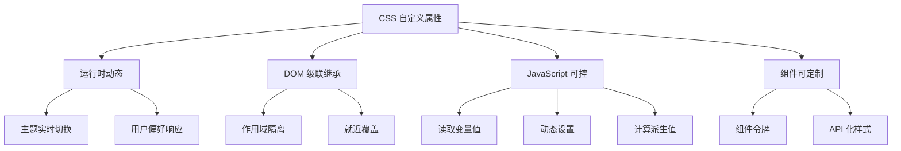
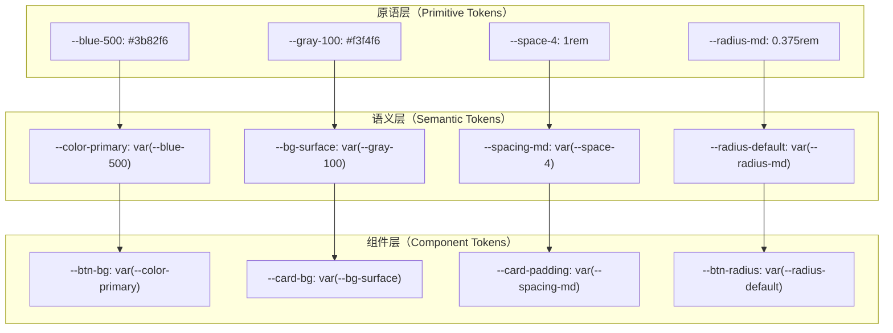
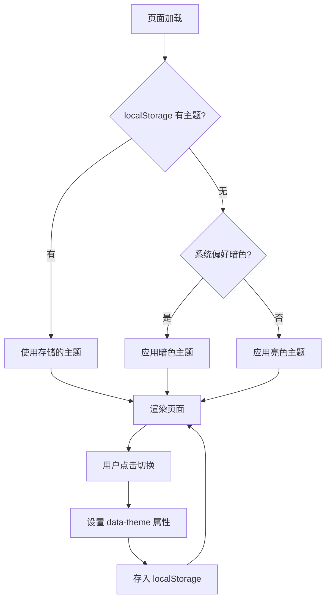
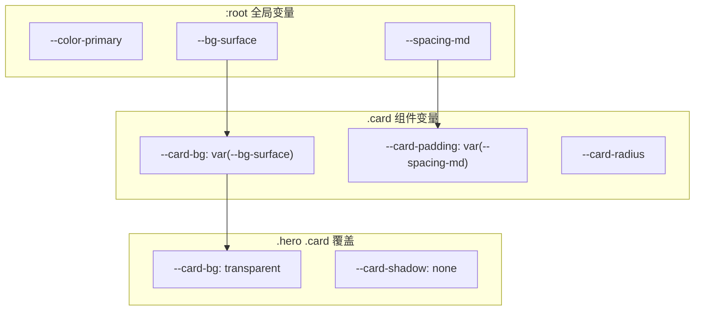
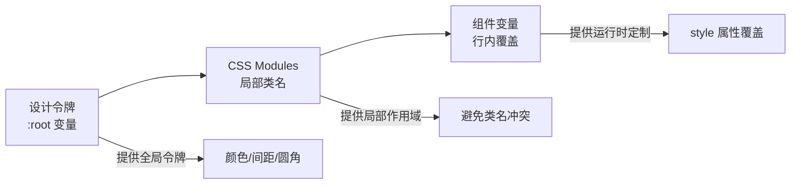

# 自定义属性实践

## 背景与动机

### 传统样式的痛点

在 CSS 自定义属性出现之前，样式开发面临诸多挑战：

```scss
// ❌ Sass 变量 - 编译时固定，无法运行时修改
$primary-color: #007bff;

.button {
  background: $primary-color;  // 编译后变成 background: #007bff
}

// 问题 1：无法在运行时动态修改主题
// 问题 2：无法响应 DOM 状态变化
// 问题 3：无法通过 JavaScript 实时控制
// 问题 4：组件样式难以外部定制
```

**常见的工程痛点**包括：

1. **主题切换困难**：需要为每个主题编写完整的样式文件，或通过预处理器多次编译
2. **组件定制复杂**：组件库使用者难以覆盖内部样式，需要暴露大量配置项
3. **设计一致性差**：颜色、间距、字体等设计决策散落在代码各处，难以统一管理
4. **动态样式繁琐**：需要大量 JavaScript 直接操作 DOM 样式，代码难以维护
5. **响应式重复**：同一组件在不同断点需要重复编写样式规则

### CSS 自定义属性的优势

CSS 自定义属性（Custom Properties）作为浏览器原生支持的变量系统，彻底解决了上述问题：



**核心价值**：

| 特性 | CSS 变量 | Sass 变量 | 直接样式 |
|------|---------|----------|---------|
| 编译时机 | 运行时 | 编译时 | 运行时 |
| 作用域 | DOM 级联 | 文件作用域 | 元素级别 |
| 动态修改 | ✅ 支持 | ❌ 不支持 | ✅ 支持 |
| 继承机制 | ✅ 支持 | ❌ 不支持 | ❌ 不支持 |
| 浏览器支持 | 现代浏览器 | 编译后兼容 | 所有浏览器 |
| 性能 | 优秀 | 无运行时开销 | 较差 |

## 核心概念

### 设计令牌（Design Tokens）

设计令牌是设计系统的最小决策单元，是视觉表现的原子值。采用**三级架构**可以将原始值、语义含义和组件定制解耦：



**三级架构的优势**：

1. **原语层（Primitive）**：存储原始设计值，如 `--blue-500: #3b82f6`
2. **语义层（Semantic）**：赋予用途含义，如 `--color-primary: var(--blue-500)`
3. **组件层（Component）**：暴露定制插槽，如 `--btn-bg: var(--color-primary)`

**核心原则**：主题切换只需重映射语义层，组件层自动跟随，实现主题与组件的解耦。

### 变量作用域与继承

CSS 变量遵循 DOM 级联规则，在不同作用域中可以重写和继承：

```css
/* 全局作用域 */
:root {
  --text-color: #333333;
  --spacing-base: 1rem;
}

/* 组件作用域 */
.card {
  --text-color: #666666;  /* 仅卡片内部生效 */
  --card-padding: var(--spacing-base);
}

.card .title {
  color: var(--text-color);  /* 继承自 .card，值为 #666666 */
}

/* 状态作用域 */
.card:hover {
  --text-color: #000000;  /* 悬停时改变 */
}
```

**继承机制**：

```css
/* 默认继承 */
.parent {
  --custom-spacing: 20px;
}

.child {
  /* 自动继承父元素的变量 */
  padding: var(--custom-spacing);  /* 20px */
}

/* 使用 @property 控制继承 */
@property --animated-value {
  syntax: '<length>';
  inherits: false;  /* 禁止继承 */
  initial-value: 0px;
}
```

### @property 注册自定义属性

CSS Houdini 的 `@property` 规则允许注册自定义属性，提供类型检查和动画支持：

```css
/* 注册角度类型，支持动画插值 */
@property --angle {
  syntax: '<angle>';
  initial-value: 0deg;
  inherits: false;
}

/* 注册颜色类型 */
@property --gradient-color {
  syntax: '<color>';
  initial-value: #000000;
  inherits: true;
}

/* 注册长度类型 */
@property --custom-size {
  syntax: '<length>';
  initial-value: 0px;
  inherits: false;
}

/* 使用示例：实现平滑旋转动画 */
.element {
  --angle: 0deg;
  transform: rotate(var(--angle));
  transition: --angle 0.5s ease;  /* 变量本身可以过渡 */
}

.element:hover {
  --angle: 360deg;
}
```

**@property 的类型支持**：

| 类型 | 说明 | 示例 |
|------|------|------|
| `<length>` | 长度值 | `10px`, `2rem` |
| `<color>` | 颜色值 | `#ff0000`, `rgb(255,0,0)` |
| `<angle>` | 角度值 | `45deg`, `1rad` |
| `<percentage>` | 百分比 | `50%` |
| `<transform-function>` | 变换函数 | `rotate(45deg)` |
| `<custom-ident>` | 自定义标识符 | `open`, `closed` |
| `<integer>` | 整数 | `1`, `2`, `3` |
| `<number>` | 数字 | `1.5`, `2.7` |
| `*` | 任意值 | 默认值 |

## 深入原理

### 令牌三级架构详解

#### 第一层：原语层（Primitive Tokens）

原语层存储原始设计值，不包含任何语义信息：

```css
:root {
  /* 颜色原语 - 基于色相命名 */
  --blue-50:  #eff6ff;
  --blue-100: #dbeafe;
  --blue-200: #bfdbfe;
  --blue-300: #93c5fd;
  --blue-400: #60a5fa;
  --blue-500: #3b82f6;
  --blue-600: #2563eb;
  --blue-700: #1d4ed8;
  --blue-800: #1e40af;
  --blue-900: #1e3a8a;
  
  --gray-50:  #f9fafb;
  --gray-100: #f3f4f6;
  --gray-200: #e5e7eb;
  --gray-300: #d1d5db;
  --gray-400: #9ca3af;
  --gray-500: #6b7280;
  --gray-600: #4b5563;
  --gray-700: #374151;
  --gray-800: #1f2937;
  --gray-900: #111827;
  
  --green-500: #22c55e;
  --red-500: #ef4444;
  --amber-500: #f59e0b;
  
  /* 间距原语 - 基于 4px 基准 */
  --space-px: 1px;
  --space-0: 0;
  --space-1: 0.25rem;   /* 4px */
  --space-2: 0.5rem;    /* 8px */
  --space-3: 0.75rem;   /* 12px */
  --space-4: 1rem;      /* 16px */
  --space-5: 1.25rem;   /* 20px */
  --space-6: 1.5rem;    /* 24px */
  --space-8: 2rem;      /* 32px */
  --space-10: 2.5rem;   /* 40px */
  --space-12: 3rem;     /* 48px */
  --space-16: 4rem;     /* 64px */
  --space-20: 5rem;     /* 80px */
  
  /* 圆角原语 */
  --radius-none: 0;
  --radius-sm: 0.25rem;   /* 4px */
  --radius-md: 0.375rem;  /* 6px */
  --radius-lg: 0.5rem;    /* 8px */
  --radius-xl: 0.75rem;   /* 12px */
  --radius-2xl: 1rem;     /* 16px */
  --radius-full: 9999px;
  
  /* 阴影原语 */
  --shadow-xs: 0 1px 2px rgba(0, 0, 0, 0.05);
  --shadow-sm: 0 1px 3px rgba(0, 0, 0, 0.1), 0 1px 2px rgba(0, 0, 0, 0.06);
  --shadow-md: 0 4px 6px rgba(0, 0, 0, 0.1), 0 2px 4px rgba(0, 0, 0, 0.06);
  --shadow-lg: 0 10px 15px rgba(0, 0, 0, 0.1), 0 4px 6px rgba(0, 0, 0, 0.05);
  --shadow-xl: 0 20px 25px rgba(0, 0, 0, 0.15), 0 10px 10px rgba(0, 0, 0, 0.04);
  
  /* 字体原语 */
  --font-size-xs: 0.75rem;    /* 12px */
  --font-size-sm: 0.875rem;   /* 14px */
  --font-size-base: 1rem;     /* 16px */
  --font-size-lg: 1.125rem;   /* 18px */
  --font-size-xl: 1.25rem;    /* 20px */
  --font-size-2xl: 1.5rem;    /* 24px */
  --font-size-3xl: 1.875rem;  /* 30px */
  --font-size-4xl: 2.25rem;   /* 36px */
}
```

#### 第二层：语义层（Semantic Tokens）

语义层赋予原语值具体的用途含义：

```css
:root {
  /* 语义颜色 - 亮色主题 */
  --color-primary: var(--blue-500);
  --color-primary-hover: var(--blue-600);
  --color-primary-active: var(--blue-700);
  --color-on-primary: #ffffff;
  
  --color-success: var(--green-500);
  --color-warning: var(--amber-500);
  --color-danger: var(--red-500);
  
  /* 语义表面 */
  --bg-body: #ffffff;
  --bg-surface: var(--gray-50);
  --bg-muted: var(--gray-100);
  --bg-inverse: var(--gray-900);
  
  /* 语义文本 */
  --text-heading: var(--gray-900);
  --text-body: var(--gray-700);
  --text-muted: var(--gray-500);
  --text-inverse: #ffffff;
  
  /* 语义边框 */
  --border-default: var(--gray-200);
  --border-strong: var(--gray-400);
  --border-subtle: var(--gray-100);
  
  /* 语义间距 */
  --spacing-xs: var(--space-1);
  --spacing-sm: var(--space-2);
  --spacing-md: var(--space-4);
  --spacing-lg: var(--space-6);
  --spacing-xl: var(--space-8);
  
  /* 语义圆角 */
  --radius-default: var(--radius-md);
  --radius-card: var(--radius-lg);
  --radius-button: var(--radius-md);
  
  /* 语义阴影 */
  --shadow-default: var(--shadow-sm);
  --shadow-elevated: var(--shadow-md);
  --shadow-overlay: var(--shadow-xl);
}

/* 暗色主题 - 只重映射语义层 */
[data-theme="dark"] {
  --color-primary: var(--blue-400);
  --color-primary-hover: var(--blue-300);
  --color-on-primary: var(--gray-900);
  
  --bg-body: var(--gray-900);
  --bg-surface: var(--gray-800);
  --bg-muted: var(--gray-700);
  --bg-inverse: var(--gray-50);
  
  --text-heading: var(--gray-50);
  --text-body: var(--gray-200);
  --text-muted: var(--gray-400);
  
  --border-default: var(--gray-700);
  --border-strong: var(--gray-500);
  --border-subtle: var(--gray-800);
}
```

#### 第三层：组件层（Component Tokens）

组件层暴露定制插槽，实现"组件即 API"模式：

```css
/* 按钮组件 */
.btn {
  /* 组件令牌 - 暴露定制点 */
  --btn-bg: var(--color-primary);
  --btn-bg-hover: var(--color-primary-hover);
  --btn-color: var(--color-on-primary);
  --btn-padding-x: var(--spacing-md);
  --btn-padding-y: var(--spacing-sm);
  --btn-radius: var(--radius-button);
  --btn-font-size: var(--font-size-base);
  --btn-font-weight: 500;
  --btn-border: none;
  --btn-shadow: var(--shadow-xs);
  --btn-transition: all 0.15s ease;
  
  /* 样式实现 */
  display: inline-flex;
  align-items: center;
  justify-content: center;
  gap: var(--spacing-xs);
  padding: var(--btn-padding-y) var(--btn-padding-x);
  font-size: var(--btn-font-size);
  font-weight: var(--btn-font-weight);
  color: var(--btn-color);
  background: var(--btn-bg);
  border: var(--btn-border);
  border-radius: var(--btn-radius);
  box-shadow: var(--btn-shadow);
  transition: var(--btn-transition);
  cursor: pointer;
}

.btn:hover {
  background: var(--btn-bg-hover);
}

/* 卡片组件 */
.card {
  /* 组件令牌 */
  --card-bg: var(--bg-surface);
  --card-border: 1px solid var(--border-default);
  --card-radius: var(--radius-card);
  --card-padding: var(--spacing-md);
  --card-shadow: var(--shadow-elevated);
  --card-gap: var(--spacing-md);
  
  /* 样式实现 */
  background: var(--card-bg);
  border: var(--card-border);
  border-radius: var(--card-radius);
  padding: var(--card-padding);
  box-shadow: var(--card-shadow);
  display: flex;
  flex-direction: column;
  gap: var(--card-gap);
}
```

### JavaScript 交互机制

CSS 变量可以通过 JavaScript 动态读写，实现运行时样式控制：

```javascript
// 1. 读取变量值
const primaryColor = getComputedStyle(document.documentElement)
  .getPropertyValue('--color-primary')
  .trim();

console.log(primaryColor);  // "#3b82f6"

// 2. 设置变量值
document.documentElement.style.setProperty('--color-primary', '#ff0000');

// 3. 在特定元素上设置变量（局部作用域）
const card = document.querySelector('.card');
card.style.setProperty('--card-bg', '#f0f0f0');

// 4. 删除变量（恢复继承）
document.documentElement.style.removeProperty('--color-primary');

// 5. 批量更新变量
function updateTheme(colors) {
  const root = document.documentElement;
  Object.entries(colors).forEach(([key, value]) => {
    root.style.setProperty(`--color-${key}`, value);
  });
}

updateTheme({
  primary: '#8b5cf6',
  secondary: '#ec4899',
  success: '#10b981'
});
```

**与 calc() 结合使用**：

```javascript
// 动态计算并设置变量
function updateSpacing(baseSize) {
  const root = document.documentElement;
  root.style.setProperty('--spacing-base', `${baseSize}px`);
  root.style.setProperty('--spacing-md', `calc(${baseSize}px * 2)`);
  root.style.setProperty('--spacing-lg', `calc(${baseSize}px * 3)`);
}

// 响应视口变化
window.addEventListener('resize', () => {
  const vw = window.innerWidth;
  const baseSize = vw < 768 ? 14 : vw < 1024 ? 16 : 18;
  updateSpacing(baseSize);
});
```

### 状态管理模式

使用自定义属性管理组件状态，将状态逻辑从 JavaScript 转移到 CSS：

```css
/* 折叠组件状态 */
.collapsible {
  --collapsible-state: closed;
  --collapsible-duration: 0.3s;
  
  overflow: hidden;
  transition: max-height var(--collapsible-duration) ease;
}

.collapsible[data-state="open"] {
  --collapsible-state: open;
  max-height: 1000px;
}

.collapsible[data-state="closed"] {
  --collapsible-state: closed;
  max-height: 0;
}

/* 箭头旋转跟随状态 */
.collapsible-trigger[data-state="open"]::after {
  content: '▸';
  display: inline-block;
  transform: rotate(90deg);
  transition: transform var(--collapsible-duration);
}

/* 标签页激活状态 */
.tab {
  --tab-active: 0;
  --tab-active-bg: var(--color-primary);
  --tab-inactive-bg: transparent;
  
  background: var(--tab-inactive-bg);
  transition: all 0.15s ease;
}

.tab[aria-selected="true"] {
  background: var(--tab-active-bg);
}

/* 开关组件状态 */
.toggle {
  --toggle-knob-offset: 0;
  --toggle-color: var(--gray-200);
  
  width: 44px;
  height: 24px;
  border-radius: var(--radius-full);
  background: var(--toggle-color);
  position: relative;
  cursor: pointer;
  transition: background 0.2s;
}

.toggle::after {
  content: '';
  position: absolute;
  top: 2px;
  left: 2px;
  width: 20px;
  height: 20px;
  border-radius: 50%;
  background: white;
  transform: translateX(var(--toggle-knob-offset));
  transition: transform 0.2s;
}

.toggle[aria-checked="true"] {
  --toggle-color: var(--color-primary);
  --toggle-knob-offset: 20px;
}
```

**状态管理要点**：使用 HTML 属性（`data-state`、`aria-selected`、`aria-checked`）驱动 CSS 状态，而非直接操作 class。这样既保证可访问性，又让状态与样式保持一致。

### 主题系统设计

主题系统是 CSS 自定义属性最经典的应用场景。一个专业级主题系统需要考虑：暗色/亮色模式切换、系统偏好跟随、CSS 变量命名规范、以及平滑过渡体验。

#### 暗色/亮色模式切换

**基于 `prefers-color-scheme` 的自动跟随**：

CSS 原生支持通过 `prefers-color-scheme` 媒体查询检测系统主题偏好，配合自定义属性可以实现零 JavaScript 的自动主题切换：

```css
/* 方式一：使用媒体查询（自动跟随系统） */
:root {
  --bg-body: #ffffff;
  --text-body: #333333;
  --bg-surface: #f5f5f5;
  --border-default: #e5e7eb;
}

@media (prefers-color-scheme: dark) {
  :root {
    --bg-body: #111827;
    --text-body: #e5e7eb;
    --bg-surface: #1f2937;
    --border-default: #374151;
  }
}
```

**基于 `data-theme` 的手动切换**：

当需要用户主动选择主题时，使用 `data-theme` 属性配合选择器重映射语义层变量：

```css
/* 亮色主题（默认） */
:root,
[data-theme="light"] {
  --color-primary: var(--blue-500);
  --color-primary-hover: var(--blue-600);
  --bg-body: #ffffff;
  --bg-surface: var(--gray-50);
  --text-heading: var(--gray-900);
  --text-body: var(--gray-700);
  --text-muted: var(--gray-500);
  --border-default: var(--gray-200);
  --shadow-default: var(--shadow-sm);
}

/* 暗色主题 */
[data-theme="dark"] {
  --color-primary: var(--blue-400);
  --color-primary-hover: var(--blue-300);
  --bg-body: var(--gray-900);
  --bg-surface: var(--gray-800);
  --text-heading: var(--gray-50);
  --text-body: var(--gray-200);
  --text-muted: var(--gray-400);
  --border-default: var(--gray-700);
  --shadow-default: 0 1px 3px rgba(0, 0, 0, 0.3);
}
```

**混合策略：系统优先 + 手动覆盖**：

最佳实践是默认跟随系统偏好，但允许用户手动覆盖：

```css
/* 默认跟随系统 */
@media (prefers-color-scheme: dark) {
  :root:not([data-theme]) {
    --bg-body: var(--gray-900);
    --text-body: var(--gray-200);
    /* ...暗色变量 */
  }
}

/* 手动设置优先级更高 */
[data-theme="dark"] {
  --bg-body: var(--gray-900);
  --text-body: var(--gray-200);
}

[data-theme="light"] {
  --bg-body: #ffffff;
  --text-body: var(--gray-700);
}
```



#### CSS 变量命名规范

一致的命名规范是主题系统可维护性的基础。推荐采用**分类-属性-变体**的三段式命名：

```css
:root {
  /* ===== 命名规范：{类别}-{属性}-{变体} ===== */

  /* 颜色系统：color-{用途}-{状态} */
  --color-primary:         var(--blue-500);
  --color-primary-hover:   var(--blue-600);
  --color-primary-active:  var(--blue-700);
  --color-primary-light:   var(--blue-100);
  --color-success:         var(--green-500);
  --color-danger:          var(--red-500);
  --color-warning:         var(--amber-500);

  /* 表面系统：bg-{层级} */
  --bg-body:    #ffffff;
  --bg-surface: var(--gray-50);
  --bg-muted:   var(--gray-100);
  --bg-inverse: var(--gray-900);

  /* 文本系统：text-{层级} */
  --text-heading: var(--gray-900);
  --text-body:    var(--gray-700);
  --text-muted:   var(--gray-500);
  --text-inverse: #ffffff;

  /* 边框系统：border-{强度} */
  --border-default: var(--gray-200);
  --border-strong:  var(--gray-400);
  --border-subtle:  var(--gray-100);

  /* 间距系统：spacing-{尺寸} */
  --spacing-xs: var(--space-1);
  --spacing-sm: var(--space-2);
  --spacing-md: var(--space-4);
  --spacing-lg: var(--space-6);
  --spacing-xl: var(--space-8);

  /* 圆角系统：radius-{尺寸} */
  --radius-sm: 0.25rem;
  --radius-md: 0.375rem;
  --radius-lg: 0.5rem;

  /* 阴影系统：shadow-{层级} */
  --shadow-sm: 0 1px 2px rgba(0, 0, 0, 0.05);
  --shadow-md: 0 4px 6px rgba(0, 0, 0, 0.1);
  --shadow-lg: 0 10px 15px rgba(0, 0, 0, 0.15);
}
```

**命名规范核心原则**：

| 原则 | 说明 | 示例 |
|------|------|------|
| 语义化 | 用途而非外观 | `--color-primary` 而非 `--blue-500` |
| 一致性 | 统一的命名模式 | `{类别}-{属性}-{变体}` |
| 可预测 | 见名知义 | `--text-muted` 一眼可知是弱化文本 |
| 可扩展 | 为未来预留空间 | `--color-primary-light` 可扩展为 `-lighter` |

### 组件级变量与作用域隔离

组件级变量是实现"组件即 API"的关键。通过在组件内部定义变量并暴露为定制点，可以实现样式的作用域隔离和外部可定制性。

#### 作用域隔离原理

CSS 变量的继承机制天然支持作用域隔离：在组件根元素上定义的变量，只在该组件的 DOM 子树中生效，不会泄漏到外部：

```css
/* ✅ 组件作用域：变量定义在组件根元素上 */
.card {
  /* 这些变量只在 .card 内部生效 */
  --card-bg: var(--bg-surface);
  --card-padding: var(--spacing-md);
  --card-radius: var(--radius-lg);
  --card-shadow: var(--shadow-md);

  background: var(--card-bg);
  padding: var(--card-padding);
  border-radius: var(--card-radius);
  box-shadow: var(--card-shadow);
}

/* 外部无法访问 --card-bg，但可以覆盖它 */
.hero .card {
  --card-bg: transparent;        /* 覆盖：英雄区域的卡片透明 */
  --card-shadow: none;           /* 覆盖：移除阴影 */
  --card-padding: var(--spacing-xl);  /* 覆盖：加大内边距 */
}
```



#### 组件 API 设计模式

将组件变量视为组件的样式 API，遵循以下设计原则：

```css
/* 组件 API 设计原则 */

/* 1. 每个可定制点对应一个变量 */
.btn {
  --btn-bg: var(--color-primary);
  --btn-color: var(--color-on-primary);
  --btn-padding-x: var(--spacing-md);
  --btn-padding-y: var(--spacing-sm);
  --btn-radius: var(--radius-default);
  --btn-font-size: var(--font-size-sm);
  --btn-font-weight: 500;
  --btn-border: none;
  --btn-shadow: var(--shadow-xs);
  --btn-transition: all 0.15s ease;

  /* 样式实现全部引用变量 */
  display: inline-flex;
  align-items: center;
  justify-content: center;
  gap: var(--spacing-xs);
  padding: var(--btn-padding-y) var(--btn-padding-x);
  font-size: var(--btn-font-size);
  font-weight: var(--btn-font-weight);
  color: var(--btn-color);
  background: var(--btn-bg);
  border: var(--btn-border);
  border-radius: var(--btn-radius);
  box-shadow: var(--btn-shadow);
  transition: var(--btn-transition);
  cursor: pointer;
}

/* 2. 变体通过覆盖变量实现，而非新增选择器属性 */
.btn-outline {
  --btn-bg: transparent;
  --btn-color: var(--color-primary);
  --btn-border: 2px solid var(--color-primary);
  --btn-shadow: none;
}

.btn-danger {
  --btn-bg: var(--color-danger);
  --btn-color: #ffffff;
}

.btn-sm {
  --btn-padding-x: var(--spacing-sm);
  --btn-padding-y: var(--spacing-xs);
  --btn-font-size: var(--font-size-xs);
}

/* 3. 外部通过行内样式或类覆盖变量 */
/* <button class="btn" style="--btn-bg: #8b5cf6;">自定义颜色</button> */
```

**组件 API 设计检查清单**：

| 检查项 | 说明 |
|--------|------|
| 变量前缀统一 | 所有变量以 `--组件名-` 开头，如 `--btn-`、`--card-` |
| 默认值引用语义层 | `--btn-bg: var(--color-primary)` 而非 `--btn-bg: #3b82f6` |
| 变体只覆盖变量 | `.btn-outline` 只改变量值，不写新属性 |
| 暴露合理的定制点 | 颜色、间距、圆角、字号等常用定制项 |
| 文档化变量列表 | 在组件文档中列出所有可用变量及其默认值 |

### 与 Tailwind CSS / CSS Modules 的配合

CSS 自定义属性可以与主流 CSS 工具和方案无缝配合，发挥各自优势。

#### 与 Tailwind CSS 配合

Tailwind CSS v3+ 原生支持 CSS 变量，可以在 `tailwind.config.js` 中将设计令牌映射为 Tailwind 工具类：

```javascript
// tailwind.config.js
module.exports = {
  theme: {
    extend: {
      // 将 CSS 变量映射为 Tailwind 主题值
      colors: {
        primary: 'var(--color-primary)',
        'primary-hover': 'var(--color-primary-hover)',
        surface: 'var(--bg-surface)',
        muted: 'var(--bg-muted)',
      },
      spacing: {
        xs: 'var(--spacing-xs)',
        sm: 'var(--spacing-sm)',
        md: 'var(--spacing-md)',
        lg: 'var(--spacing-lg)',
        xl: 'var(--spacing-xl)',
      },
      borderRadius: {
        DEFAULT: 'var(--radius-default)',
        card: 'var(--radius-card)',
      },
      boxShadow: {
        DEFAULT: 'var(--shadow-default)',
        elevated: 'var(--shadow-elevated)',
      },
    },
  },
};
```

```html
<!-- 使用 Tailwind 工具类 + CSS 变量驱动 -->
<div class="bg-surface rounded-card shadow-elevated p-md">
  <h2 class="text-primary text-xl font-semibold">标题</h2>
  <p class="text-gray-700 mt-sm">内容</p>
  <button class="bg-primary hover:bg-primary-hover text-white
                 px-md py-sm rounded mt-md transition-all">
    按钮
  </button>
</div>
```

**Tailwind + CSS 变量的优势互补**：

| 能力 | Tailwind 独有 | CSS 变量独有 | 配合后 |
|------|--------------|-------------|--------|
| 运行时主题切换 | ❌ 编译时固定 | ✅ 运行时可变 | ✅ 通过变量实现动态主题 |
| 原子化工具类 | ✅ 开箱即用 | ❌ 需手写 | ✅ 变量驱动 + 工具类组合 |
| 设计令牌管理 | ❌ 配置文件静态 | ✅ 三级架构 | ✅ 变量定义令牌，Tailwind 消费 |
| 组件定制 | ❌ 需要额外配置 | ✅ 行内覆盖 | ✅ 变量覆盖 + 工具类 |

#### 与 CSS Modules 配合

CSS Modules 提供局部作用域的类名，与 CSS 变量的 DOM 级联继承天然互补：

```css
/* Button.module.css */

/* CSS Modules 的局部类名 + CSS 变量的全局令牌 */
.btn {
  /* 组件变量：局部定义，外部可覆盖 */
  --btn-bg: var(--color-primary);
  --btn-color: var(--color-on-primary);
  --btn-padding: var(--spacing-sm) var(--spacing-md);
  --btn-radius: var(--radius-default);

  composes: base from './common.module.css';
  background: var(--btn-bg);
  color: var(--btn-color);
  padding: var(--btn-padding);
  border-radius: var(--btn-radius);
  border: none;
  cursor: pointer;
  transition: all 0.15s ease;
}

.btn:hover {
  filter: brightness(1.1);
}
```

```jsx
// Button.jsx
import styles from './Button.module.css';

export function Button({ variant, children, style, ...props }) {
  // 通过 style 属性覆盖 CSS 变量，实现组件定制
  return (
    <button
      className={`${styles.btn} ${variant ? styles[variant] : ''}`}
      style={style}  // 可传入 { '--btn-bg': '#8b5cf6' }
      {...props}
    >
      {children}
    </button>
  );
}

// 使用
<Button>默认按钮</Button>
<Button style={{ '--btn-bg': '#8b5cf6', '--btn-color': '#fff' }}>
  自定义颜色
</Button>
```

**CSS Modules + CSS 变量的分工**：



### 运行时动态更新

CSS 变量最强大的特性之一是可以在运行时通过 JavaScript 动态修改，实现传统 CSS 无法完成的交互效果。

#### JavaScript 操作 CSS 变量的核心 API

```javascript
// 1. 读取变量值
const value = getComputedStyle(element).getPropertyValue('--color-primary');

// 2. 设置变量值（在指定元素上）
element.style.setProperty('--color-primary', '#8b5cf6');

// 3. 在 :root 上设置全局变量
document.documentElement.style.setProperty('--color-primary', '#8b5cf6');

// 4. 删除变量（恢复继承）
element.style.removeProperty('--color-primary');

// 5. 批量更新（性能优化：减少重排）
function batchUpdate(variables) {
  const root = document.documentElement;
  // 使用 cssText 一次性更新，减少重排次数
  const updates = Object.entries(variables)
    .map(([key, value]) => `${key}: ${value}`)
    .join('; ');
  root.style.cssText += `; ${updates}`;
}

batchUpdate({
  '--color-primary': '#8b5cf6',
  '--bg-body': '#1a1a2e',
  '--text-body': '#e5e7eb',
});
```

#### 实战模式：响应式变量更新

```javascript
// 模式1：基于鼠标位置的视差效果
document.addEventListener('mousemove', (e) => {
  const x = (e.clientX / window.innerWidth) * 100;
  const y = (e.clientY / window.innerHeight) * 100;
  document.documentElement.style.setProperty('--mouse-x', `${x}%`);
  document.documentElement.style.setProperty('--mouse-y', `${y}%`);
});

// 模式2：基于滚动进度的动画
window.addEventListener('scroll', () => {
  const progress = window.scrollY / (document.body.scrollHeight - window.innerHeight);
  document.documentElement.style.setProperty('--scroll-progress', progress);
}, { passive: true });

// 模式3：基于用户偏好的动态主题
function applyUserPreferences() {
  const root = document.documentElement;
  // 字体大小偏好
  const fontSize = localStorage.getItem('font-size') || '16';
  root.style.setProperty('--font-size-base', `${fontSize}px`);
  // 减少动画偏好
  if (window.matchMedia('(prefers-reduced-motion: reduce)').matches) {
    root.style.setProperty('--transition-duration', '0s');
  }
}

// 模式4：基于容器尺寸的响应式变量（Container Queries 的 JS 替代）
const resizeObserver = new ResizeObserver((entries) => {
  for (const entry of entries) {
    const width = entry.contentRect.width;
    const density = width < 400 ? 'compact' : width < 800 ? 'normal' : 'spacious';
    entry.target.style.setProperty('--density', density);
  }
});
resizeObserver.observe(document.querySelector('.container'));
```

### 性能优化

CSS 变量虽然强大，但不当使用会带来性能问题。以下是关键的性能优化策略。

#### 变量继承的开销

CSS 变量默认继承，这意味着每次变量值变化时，浏览器需要遍历整个 DOM 子树重新计算样式。在大型页面上，频繁修改 `:root` 上的变量可能导致明显的性能问题：

```css
/* ❌ 高开销：修改 :root 变量会触发全页面重算 */
:root {
  --scroll-progress: 0;  /* 滚动时频繁更新 */
}

/* ✅ 低开销：将频繁变化的变量限制在最小作用域 */
.scroll-indicator {
  --scroll-progress: 0;  /* 只影响指示器元素 */
  width: calc(var(--scroll-progress) * 100%);
}

/* ✅ 更优：使用 @property 禁止继承 */
@property --scroll-progress {
  syntax: '<number>';
  inherits: false;  /* 不继承，修改时只影响当前元素 */
  initial-value: 0;
}
```

**继承开销对比**：

| 场景 | `inherits: true`（默认） | `inherits: false` |
|------|------------------------|-------------------|
| 变量修改影响范围 | 整个 DOM 子树 | 仅当前元素 |
| 重算复杂度 | O(n)，n 为子树节点数 | O(1) |
| 适用场景 | 主题色、字体等需全局生效 | 动画值、滚动进度等局部值 |

#### :root vs 局部作用域的性能差异

```css
/* ❌ 不推荐：所有变量都定义在 :root */
:root {
  --card-bg: #ffffff;       /* 仅卡片使用 */
  --btn-bg: #3b82f6;        /* 仅按钮使用 */
  --input-border: #e5e7eb;  /* 仅输入框使用 */
  --modal-shadow: ...;      /* 仅弹窗使用 */
  /* 问题：修改任一变量，浏览器需遍历全页面 */
}

/* ✅ 推荐：组件专用变量定义在组件根元素 */
:root {
  /* 只放全局共享的语义变量 */
  --color-primary: #3b82f6;
  --spacing-md: 1rem;
  --radius-default: 4px;
}

.card {
  /* 组件专用变量：修改只影响 .card 子树 */
  --card-bg: var(--color-primary);
  --card-padding: var(--spacing-md);
  --card-radius: var(--radius-default);
}
```

**性能优化最佳实践**：

```css
/* 1. 频繁变化的变量使用 @property 禁止继承 */
@property --mouse-x {
  syntax: '<percentage>';
  inherits: false;
  initial-value: 50%;
}

@property --mouse-y {
  syntax: '<percentage>';
  inherits: false;
  initial-value: 50%;
}

/* 2. 动画变量使用 will-change 提示浏览器 */
.animated-element {
  will-change: transform;
  transform: translate(
    calc(var(--mouse-x) - 50%),
    calc(var(--mouse-y) - 50%)
  );
}

/* 3. 批量更新减少重排 */
/* JavaScript 中使用 requestAnimationFrame 合并变量更新 */
```

```javascript
// 批量更新：使用 rAF 合并多次变量修改
let pendingUpdate = null;

function scheduleVariableUpdate(variables) {
  if (pendingUpdate) cancelAnimationFrame(pendingUpdate);
  pendingUpdate = requestAnimationFrame(() => {
    const root = document.documentElement;
    Object.entries(variables).forEach(([key, value]) => {
      root.style.setProperty(key, value);
    });
    pendingUpdate = null;
  });
}

// 滚动事件中使用
window.addEventListener('scroll', () => {
  const progress = window.scrollY / (document.body.scrollHeight - window.innerHeight);
  scheduleVariableUpdate({
    '--scroll-progress': progress,
    '--scroll-y': `${window.scrollY}px`,
  });
}, { passive: true });
```

**性能优化检查清单**：

| 优化项 | 说明 | 影响 |
|--------|------|------|
| 频繁变化的变量禁止继承 | `@property` 设置 `inherits: false` | 🔴 高 |
| 组件变量定义在组件根元素 | 而非 `:root` | 🟡 中 |
| 使用 `requestAnimationFrame` | 合并多次变量更新 | 🔴 高 |
| 避免深层嵌套 var() | `var(--a, var(--b, var(--c)))` | 🟡 中 |
| 减少变量数量 | 合并相似变量 | 🟢 低 |
| 使用 `will-change` | 提示浏览器优化动画 | 🟡 中 |

## 代码示例

### 完整的设计系统实现

以下是一个完整的设计系统示例，包含令牌定义、主题切换和组件应用：

```html
<!DOCTYPE html>
<html lang="zh-CN" data-theme="light">
<head>
  <meta charset="UTF-8">
  <meta name="viewport" content="width=device-width, initial-scale=1.0">
  <meta name="theme-color" content="#ffffff">
  <title>设计系统完整示例</title>
  <style>
    /* ========== 原语层 ========== */
    :root {
      /* 颜色原语 */
      --blue-50:  #eff6ff;
      --blue-100: #dbeafe;
      --blue-500: #3b82f6;
      --blue-600: #2563eb;
      --blue-700: #1d4ed8;
      
      --gray-50:  #f9fafb;
      --gray-100: #f3f4f6;
      --gray-200: #e5e7eb;
      --gray-300: #d1d5db;
      --gray-500: #6b7280;
      --gray-700: #374151;
      --gray-900: #111827;
      
      --green-500: #22c55e;
      --red-500: #ef4444;
      --amber-500: #f59e0b;
      
      /* 间距原语 */
      --space-1: 0.25rem;
      --space-2: 0.5rem;
      --space-3: 0.75rem;
      --space-4: 1rem;
      --space-6: 1.5rem;
      --space-8: 2rem;
      
      /* 字体原语 */
      --font-xs: 0.75rem;
      --font-sm: 0.875rem;
      --font-base: 1rem;
      --font-lg: 1.125rem;
      --font-xl: 1.25rem;
      --font-2xl: 1.5rem;
      
      /* 圆角原语 */
      --radius-sm: 0.25rem;
      --radius-md: 0.375rem;
      --radius-lg: 0.5rem;
      
      /* 阴影原语 */
      --shadow-sm: 0 1px 2px rgba(0, 0, 0, 0.05);
      --shadow-md: 0 4px 6px rgba(0, 0, 0, 0.1);
    }
    
    /* ========== 语义层 ========== */
    :root {
      --color-primary: var(--blue-500);
      --color-primary-hover: var(--blue-600);
      --color-on-primary: #ffffff;
      --color-success: var(--green-500);
      --color-danger: var(--red-500);
      --color-warning: var(--amber-500);
      
      --bg-body: #ffffff;
      --bg-surface: var(--gray-50);
      --bg-muted: var(--gray-100);
      
      --text-heading: var(--gray-900);
      --text-body: var(--gray-700);
      --text-muted: var(--gray-500);
      
      --border-default: var(--gray-200);
      
      --spacing-xs: var(--space-1);
      --spacing-sm: var(--space-2);
      --spacing-md: var(--space-4);
      --spacing-lg: var(--space-6);
      --spacing-xl: var(--space-8);
      
      --radius-default: var(--radius-md);
      --radius-card: var(--radius-lg);
      
      --shadow-default: var(--shadow-sm);
      --shadow-elevated: var(--shadow-md);
    }
    
    /* 暗色主题 */
    [data-theme="dark"] {
      --color-primary: var(--blue-600);
      --color-primary-hover: var(--blue-500);
      --color-on-primary: #ffffff;
      
      --bg-body: var(--gray-900);
      --bg-surface: #1f2937;
      --bg-muted: var(--gray-800, #1f2937);
      
      --text-heading: var(--gray-50);
      --text-body: var(--gray-200);
      --text-muted: var(--gray-400);
      
      --border-default: var(--gray-700);
    }
    
    /* ========== 基础样式 ========== */
    * {
      box-sizing: border-box;
      margin: 0;
      padding: 0;
    }
    
    body {
      font-family: system-ui, -apple-system, sans-serif;
      font-size: var(--font-base);
      line-height: 1.5;
      background-color: var(--bg-body);
      color: var(--text-body);
      transition: background-color 0.3s, color 0.3s;
      padding: var(--spacing-lg);
    }
    
    /* ========== 组件层 ========== */
    .container {
      max-width: 800px;
      margin: 0 auto;
    }
    
    .card {
      --card-bg: var(--bg-surface);
      --card-border: 1px solid var(--border-default);
      --card-radius: var(--radius-card);
      --card-padding: var(--spacing-lg);
      --card-shadow: var(--shadow-elevated);
      
      background: var(--card-bg);
      border: var(--card-border);
      border-radius: var(--card-radius);
      padding: var(--card-padding);
      box-shadow: var(--card-shadow);
      margin-bottom: var(--spacing-lg);
    }
    
    .btn {
      --btn-bg: var(--color-primary);
      --btn-bg-hover: var(--color-primary-hover);
      --btn-color: var(--color-on-primary);
      --btn-padding-x: var(--spacing-md);
      --btn-padding-y: var(--spacing-sm);
      --btn-radius: var(--radius-default);
      
      display: inline-flex;
      align-items: center;
      justify-content: center;
      padding: var(--btn-padding-y) var(--btn-padding-x);
      font-size: var(--font-sm);
      font-weight: 500;
      color: var(--btn-color);
      background: var(--btn-bg);
      border: var(--btn-border, none);
      border-radius: var(--btn-radius);
      cursor: pointer;
      transition: all 0.2s;
    }
    
    .btn:hover {
      background: var(--btn-bg-hover);
    }
    
    .btn-outline {
      --btn-bg: transparent;
      --btn-bg-hover: var(--color-primary);
      --btn-color: var(--color-primary);
      --btn-border: 2px solid var(--color-primary);
    }
    
    .input {
      --input-bg: var(--bg-body);
      --input-border: var(--border-default);
      --input-radius: var(--radius-default);
      --input-padding: var(--spacing-sm) var(--spacing-md);
      
      width: 100%;
      padding: var(--input-padding);
      font-size: var(--font-base);
      background: var(--input-bg);
      color: var(--text-body);
      border: 1px solid var(--input-border);
      border-radius: var(--input-radius);
      transition: border-color 0.2s;
    }
    
    .input:focus {
      outline: none;
      border-color: var(--color-primary);
      box-shadow: 0 0 0 3px rgba(59, 130, 246, 0.1);
    }
    
    /* 主题切换按钮 */
    .theme-toggle {
      position: fixed;
      top: var(--spacing-lg);
      right: var(--spacing-lg);
    }
    
    h1 {
      font-size: var(--font-2xl);
      color: var(--text-heading);
      margin-bottom: var(--spacing-lg);
    }
    
    h2 {
      font-size: var(--font-xl);
      color: var(--text-heading);
      margin-bottom: var(--spacing-md);
    }
    
    .form-group {
      display: grid;
      gap: var(--spacing-sm);
      margin-bottom: var(--spacing-md);
    }
    
    label {
      font-size: var(--font-sm);
      color: var(--text-body);
      font-weight: 500;
    }
    
    .button-group {
      display: flex;
      gap: var(--spacing-sm);
      flex-wrap: wrap;
    }
  </style>
</head>
<body>
  <button class="btn btn-outline theme-toggle" onclick="toggleTheme()">
    切换主题
  </button>
  
  <div class="container">
    <h1>设计系统完整示例</h1>
    
    <div class="card">
      <h2>表单组件</h2>
      <div class="form-group">
        <label for="username">用户名</label>
        <input type="text" id="username" class="input" placeholder="请输入用户名">
      </div>
      <div class="form-group">
        <label for="email">邮箱</label>
        <input type="email" id="email" class="input" placeholder="请输入邮箱">
      </div>
      <button class="btn">提交</button>
    </div>
    
    <div class="card">
      <h2>按钮组件</h2>
      <div class="button-group">
        <button class="btn">主要按钮</button>
        <button class="btn btn-outline">轮廓按钮</button>
      </div>
    </div>
  </div>
  
  <script>
    // 主题管理
    function toggleTheme() {
      const html = document.documentElement;
      const isDark = html.getAttribute('data-theme') === 'dark';
      const newTheme = isDark ? 'light' : 'dark';
      
      html.setAttribute('data-theme', newTheme);
      localStorage.setItem('theme', newTheme);
      
      // 更新 meta theme-color
      document.querySelector('meta[name="theme-color"]')
        .setAttribute('content', newTheme === 'dark' ? '#111827' : '#ffffff');
    }
    
    // 初始化主题
    const savedTheme = localStorage.getItem('theme') || 'light';
    document.documentElement.setAttribute('data-theme', savedTheme);
    
    // 监听系统主题变化
    window.matchMedia('(prefers-color-scheme: dark)')
      .addEventListener('change', (e) => {
        if (!localStorage.getItem('theme')) {
          document.documentElement.setAttribute('data-theme', e.matches ? 'dark' : 'light');
        }
      });
  </script>
</body>
</html>
```

### 主题切换系统

#### 基础切换功能

```javascript
// 切换主题
function toggleTheme() {
  const html = document.documentElement;
  const isDark = html.getAttribute('data-theme') === 'dark';
  const newTheme = isDark ? 'light' : 'dark';
  
  html.setAttribute('data-theme', newTheme);
  localStorage.setItem('theme', newTheme);
}

// 初始化主题
function initTheme() {
  // 优先级: 本地存储 > 系统偏好 > 默认亮色
  const savedTheme = localStorage.getItem('theme');
  const systemTheme = window.matchMedia('(prefers-color-scheme: dark)').matches 
    ? 'dark' 
    : 'light';
  const theme = savedTheme || systemTheme;
  
  document.documentElement.setAttribute('data-theme', theme);
}

document.addEventListener('DOMContentLoaded', initTheme);
```

#### 完整主题管理类

```javascript
class ThemeManager {
  constructor(options = {}) {
    this.storageKey = options.storageKey || 'app-theme';
    this.defaultTheme = options.defaultTheme || 'light';
    this.themes = options.themes || ['light', 'dark'];
    this.init();
  }
  
  init() {
    const savedTheme = localStorage.getItem(this.storageKey);
    const systemTheme = this.getSystemTheme();
    const theme = savedTheme || systemTheme || this.defaultTheme;
    
    this.applyTheme(theme);
    this.watchSystemTheme();
  }
  
  getSystemTheme() {
    return window.matchMedia('(prefers-color-scheme: dark)').matches 
      ? 'dark' 
      : 'light';
  }
  
  applyTheme(theme) {
    document.documentElement.setAttribute('data-theme', theme);
    localStorage.setItem(this.storageKey, theme);
    this.updateMetaThemeColor(theme);
    this.emitThemeChange(theme);
  }
  
  updateMetaThemeColor(theme) {
    const metaThemeColor = document.querySelector('meta[name="theme-color"]');
    if (metaThemeColor) {
      const colors = {
        light: '#ffffff',
        dark: '#111827',
        blue: '#e6f2ff',
        green: '#e6f7e6',
        purple: '#f3e8ff'
      };
      metaThemeColor.setAttribute('content', colors[theme] || colors.light);
    }
  }
  
  emitThemeChange(theme) {
    window.dispatchEvent(new CustomEvent('themechange', { detail: { theme } }));
  }
  
  toggle() {
    const currentTheme = this.getCurrentTheme();
    const currentIndex = this.themes.indexOf(currentTheme);
    const nextIndex = (currentIndex + 1) % this.themes.length;
    this.applyTheme(this.themes[nextIndex]);
  }
  
  setTheme(theme) {
    if (this.themes.includes(theme)) {
      this.applyTheme(theme);
    }
  }
  
  getCurrentTheme() {
    return document.documentElement.getAttribute('data-theme') || this.defaultTheme;
  }
  
  watchSystemTheme() {
    const mediaQuery = window.matchMedia('(prefers-color-scheme: dark)');
    mediaQuery.addEventListener('change', (e) => {
      if (!localStorage.getItem(this.storageKey)) {
        this.applyTheme(e.matches ? 'dark' : 'light');
      }
    });
  }
}

// 使用示例
const themeManager = new ThemeManager({
  themes: ['light', 'dark', 'blue', 'green']
});

document.querySelector('#theme-toggle')?.addEventListener('click', () => {
  themeManager.toggle();
});

// 监听主题变化
window.addEventListener('themechange', (e) => {
  console.log('主题已切换为:', e.detail.theme);
});
```

### 组件变量实践

#### 按钮组件

```css
:root {
  /* 按钮默认值 */
  --button-padding-x: var(--spacing-md);
  --button-padding-y: var(--spacing-sm);
  --button-font-size: var(--font-size-base);
  --button-font-weight: 500;
  --button-border-radius: var(--radius-default);
  --button-transition: all 0.2s ease;
  
  /* 尺寸变体 */
  --button-sm-padding-x: var(--spacing-sm);
  --button-sm-padding-y: var(--spacing-xs);
  --button-sm-font-size: var(--font-size-sm);
  
  --button-lg-padding-x: var(--spacing-lg);
  --button-lg-padding-y: var(--spacing-md);
  --button-lg-font-size: var(--font-size-lg);
}

.button {
  display: inline-flex;
  align-items: center;
  justify-content: center;
  padding: var(--button-padding-y) var(--button-padding-x);
  font-size: var(--button-font-size);
  font-weight: var(--button-font-weight);
  border-radius: var(--button-border-radius);
  border: none;
  cursor: pointer;
  transition: var(--button-transition);
}

.button:focus {
  outline: none;
  box-shadow: 0 0 0 3px rgba(59, 130, 246, 0.25);
}

.button:disabled {
  opacity: 0.65;
  cursor: not-allowed;
}

/* 主要按钮 */
.button-primary {
  background-color: var(--color-primary);
  color: var(--color-on-primary);
}

.button-primary:hover:not(:disabled) {
  background-color: var(--color-primary-hover);
}

/* 轮廓按钮 */
.button-outline {
  background-color: transparent;
  color: var(--color-primary);
  border: 2px solid var(--color-primary);
}

.button-outline:hover:not(:disabled) {
  background-color: var(--color-primary);
  color: var(--color-on-primary);
}

/* 尺寸变体 */
.button-sm {
  padding: var(--button-sm-padding-y) var(--button-sm-padding-x);
  font-size: var(--button-sm-font-size);
}

.button-lg {
  padding: var(--button-lg-padding-y) var(--button-lg-padding-x);
  font-size: var(--button-lg-font-size);
}
```

#### 卡片组件

```css
:root {
  --card-padding: var(--spacing-md);
  --card-border-radius: var(--radius-card);
  --card-shadow: var(--shadow-elevated);
  --card-bg: var(--bg-surface);
  --card-border: 1px solid var(--border-default);
}

.card {
  background-color: var(--card-bg);
  border: var(--card-border);
  border-radius: var(--card-border-radius);
  box-shadow: var(--card-shadow);
  padding: var(--card-padding);
  transition: box-shadow 0.3s;
}

.card:hover {
  box-shadow: var(--shadow-overlay, var(--shadow-xl));
}

/* 卡片变体 */
.card-flat {
  --card-shadow: none;
  --card-border: 2px solid var(--border-default);
}

.card-elevated {
  --card-shadow: var(--shadow-xl);
}

/* 组件级覆盖 */
.hero .card {
  --card-padding: var(--spacing-xl);
  --card-border-radius: var(--radius-2xl, 1rem);
}
```

### 动态样式实战

#### 放大镜效果

传统放大镜效果需要大量 JavaScript 计算，使用 CSS 变量后，JS 仅负责获取鼠标坐标，所有视觉计算交给 CSS：

```html
<div class="magnifier-container">
  
  <div class="magnifier-lens"></div>
</div>
```

```css
.magnifier-container {
  position: relative;
  --mouse-x: 50%;
  --mouse-y: 50%;
  --zoom: 2;
  --lens-size: 150px;
}

.source-image {
  width: 100%;
  display: block;
}

.magnifier-lens {
  position: absolute;
  width: var(--lens-size);
  height: var(--lens-size);
  border-radius: 50%;
  border: 2px solid rgba(255, 255, 255, 0.5);
  /* 左上角定位：鼠标坐标减去镜头半径 */
  left: calc(var(--mouse-x) - var(--lens-size) / 2);
  top: calc(var(--mouse-y) - var(--lens-size) / 2);
  /* 背景图定位 */
  background: url("product.jpg") no-repeat;
  background-size: calc(var(--zoom) * 100%);
  background-position:
    calc(var(--mouse-x) * var(--zoom) - var(--lens-size) / 2)
    calc(var(--mouse-y) * var(--zoom) - var(--lens-size) / 2);
  pointer-events: none;
}
```

```javascript
const container = document.querySelector('.magnifier-container');

container.addEventListener('mousemove', (e) => {
  const rect = container.getBoundingClientRect();
  const x = e.clientX - rect.left;
  const y = e.clientY - rect.top;
  
  container.style.setProperty('--mouse-x', `${x}px`);
  container.style.setProperty('--mouse-y', `${y}px`);
});
```

#### 滚动渐变背景

```css
.scroll-gradient {
  --scroll-progress: 0;
  min-height: 200vh;
  
  background: linear-gradient(
    to bottom,
    hsl(calc(200 + var(--scroll-progress) * 160), 80%, 60%),
    hsl(calc(280 + var(--scroll-progress) * 80), 70%, 50%)
  );
}
```

```javascript
window.addEventListener('scroll', () => {
  const scrollTop = document.documentElement.scrollTop;
  const scrollHeight = document.documentElement.scrollHeight - window.innerHeight;
  const progress = Math.min(scrollTop / scrollHeight, 1);
  document.documentElement.style.setProperty('--scroll-progress', progress);
});
```

#### 实时颜色选择器

```html
<!DOCTYPE html>
<html lang="zh-CN">
<head>
  <meta charset="UTF-8">
  <meta name="viewport" content="width=device-width, initial-scale=1.0">
  <title>实时颜色选择器</title>
  <style>
    :root {
      --preview-bg: #ffffff;
      --preview-text: #333333;
    }
    
    body {
      font-family: system-ui, sans-serif;
      padding: 2rem;
    }
    
    .preview-box {
      background-color: var(--preview-bg);
      color: var(--preview-text);
      padding: 2rem;
      border-radius: 0.5rem;
      margin: 1rem 0;
      transition: all 0.3s;
    }
    
    .controls {
      display: grid;
      gap: 1rem;
      max-width: 400px;
    }
    
    label {
      display: flex;
      align-items: center;
      gap: 0.5rem;
    }
    
    input[type="color"] {
      width: 60px;
      height: 40px;
      border: none;
      border-radius: 0.25rem;
      cursor: pointer;
    }
  </style>
</head>
<body>
  <div class="controls">
    <label>
      <span>背景颜色:</span>
      <input type="color" id="bg-color" value="#ffffff">
    </label>
    <label>
      <span>文本颜色:</span>
      <input type="color" id="text-color" value="#333333">
    </label>
  </div>
  
  <div class="preview-box">
    <h2>预览区域</h2>
    <p>这是实时预览的文本内容，颜色会随着你的选择而变化。</p>
  </div>
  
  <script>
    const bgColorInput = document.getElementById('bg-color');
    const textColorInput = document.getElementById('text-color');
    const root = document.documentElement;
    
    bgColorInput.addEventListener('input', (e) => {
      root.style.setProperty('--preview-bg', e.target.value);
    });
    
    textColorInput.addEventListener('input', (e) => {
      root.style.setProperty('--preview-text', e.target.value);
    });
  </script>
</body>
</html>
```

## 最佳实践

### 命名规范

#### 语义化命名

```css
/* ✅ 推荐：语义化命名 */
:root {
  --color-primary: #3b82f6;
  --color-success: #22c55e;
  --spacing-large: 2rem;
}

/* ❌ 不推荐：使用具体值 */
:root {
  --blue: #3b82f6;
  --green: #22c55e;
  --spacing-32px: 2rem;
}
```

#### 一致的命名格式

```css
/* 使用统一的命名模式：分类-属性-变体 */
:root {
  /* 颜色系统 */
  --color-primary-light: #60a5fa;
  --color-primary-dark: #1d4ed8;
  
  /* 间距系统 */
  --spacing-xs: 0.25rem;
  --spacing-sm: 0.5rem;
  --spacing-md: 1rem;
  
  /* 组件系统 */
  --button-bg: var(--color-primary);
  --button-color: #ffffff;
}
```

### 分层管理

```css
/* 第一层：原始值（Design Tokens） */
:root {
  --blue-500: #3b82f6;
  --green-500: #22c55e;
  --space-4: 1rem;
}

/* 第二层：语义化引用（Semantic Tokens） */
:root {
  --color-primary: var(--blue-500);
  --color-success: var(--green-500);
  --spacing-base: var(--space-4);
}

/* 第三层：组件变量（Component Tokens） */
.btn {
  --btn-bg: var(--color-primary);
  --btn-padding: var(--spacing-base);
}
```

### 性能优化

#### 合并变量定义

```css
/* ✅ 推荐：集中定义 */
:root {
  --color-primary: #3b82f6;
  --color-secondary: #6b7280;
  --spacing-base: 1rem;
}

/* ❌ 不推荐：分散定义 */
.header { --color-primary: #3b82f6; }
.footer { --color-primary: #3b82f6; }
```

#### 避免过度嵌套

```css
/* ✅ 推荐：直接定义 */
.button {
  --button-color: var(--color-primary);
  color: var(--button-color);
}

/* ❌ 不推荐：多层嵌套 */
.button {
  --button-color: var(--btn-color, var(--color-primary, #3b82f6));
  color: var(--button-color);
}
```

#### 合理使用作用域

```css
/* ✅ 推荐：在需要的作用域定义 */
:root {
  --color-primary: #3b82f6;  /* 全局 */
}

.card {
  --card-padding: 1rem;  /* 仅卡片使用 */
}

/* ❌ 不推荐：全局定义过多变量 */
:root {
  --card-padding: 1rem;      /* 卡片专用 */
  --button-padding: 0.5rem;  /* 按钮专用 */
  --input-padding: 0.75rem;  /* 输入框专用 */
}
```

### 文档化

```css
/**
 * 设计系统变量
 * 
 * 颜色系统:
 * - primary: 主色调，用于主要按钮、链接等
 * - secondary: 次要色调，用于次要操作
 * - success: 成功状态
 * - warning: 警告状态
 * - danger: 危险状态
 * 
 * 间距系统:
 * - 基于 4px 基准单位
 * - 命名规范：spacing-{倍数}
 * 
 * 使用示例:
 * .element {
 *   color: var(--color-primary);
 *   padding: var(--spacing-md);
 * }
 */
:root {
  /* ... */
}
```

### 类型安全

使用 CSS Houdini 的 `@property` 规则定义类型：

```css
@property --angle {
  syntax: '<angle>';
  initial-value: 0deg;
  inherits: false;
}

@property --gradient-color {
  syntax: '<color>';
  initial-value: #000000;
  inherits: true;
}

.element {
  --angle: 45deg;
  --gradient-color: #ff0000;
  transform: rotate(var(--angle));
  background: linear-gradient(45deg, var(--gradient-color), blue);
}
```

### 调试技巧

```javascript
// 获取所有 CSS 变量
function getAllCSSVariables() {
  const variables = [];
  const rules = document.styleSheets;
  
  for (let sheet of rules) {
    try {
      for (let rule of sheet.cssRules) {
        if (rule.selectorText === ':root') {
          const cssText = rule.cssText;
          const matches = cssText.match(/--[\w-]+:\s*[^;]+/g);
          if (matches) {
            matches.forEach(match => {
              const [name, value] = match.split(':').map(s => s.trim());
              variables.push({ name, value });
            });
          }
        }
      }
    } catch (e) {
      // 跨域样式表无法访问
    }
  }
  
  return variables;
}

// 在控制台查看所有变量
console.table(getAllCSSVariables());

// 查看特定元素的变量
function getElementVariables(element) {
  const styles = getComputedStyle(element);
  const vars = {};
  
  for (let sheet of document.styleSheets) {
    try {
      for (let rule of sheet.cssRules) {
        if (element.matches(rule.selectorText)) {
          const cssText = rule.cssText;
          const matches = cssText.match(/--[\w-]+:\s*[^;]+/g);
          if (matches) {
            matches.forEach(match => {
              const [name, value] = match.split(':').map(s => s.trim());
              vars[name] = styles.getPropertyValue(name).trim();
            });
          }
        }
      }
    } catch (e) {}
  }
  
  return vars;
}
```

## 常见问题

### Q: CSS 变量和预处理器变量（Sass/Less）有什么区别？

**A:** 主要区别如下：

| 特性 | CSS 变量 | Sass 变量 |
|------|---------|----------|
| 编译时机 | 运行时 | 编译时 |
| 作用域 | DOM 级联 | 文件作用域 |
| 动态修改 | 支持 | 不支持 |
| 继承机制 | 支持 | 不支持 |
| 浏览器支持 | 需要现代浏览器 | 编译后兼容所有 |

**建议**：使用 CSS 变量处理运行时变化的值（如主题、用户偏好），使用 Sass 变量处理静态配置（如设计令牌原始值）。

### Q: 如何在 calc() 中使用 CSS 变量？

**A:** 直接在 calc() 中使用即可：

```css
:root {
  --spacing-base: 1rem;
  --factor: 2;
}

.element {
  /* 算术运算 */
  padding: calc(var(--spacing-base) * 2);
  
  /* 混合单位 */
  width: calc(100% - var(--spacing-base));
  
  /* 使用乘数 */
  margin: calc(var(--spacing-base) * var(--factor));
  
  /* 复杂计算 */
  font-size: calc(16px + (24 - 16) * (100vw - 320px) / (1920 - 320));
}
```

### Q: CSS 变量可以用于媒体查询吗？

**A:** 不能直接使用，但可以通过 JavaScript 实现：

```css
/* ❌ 不支持 */
@media (min-width: var(--breakpoint)) { }

/* ✅ 替代方案：使用 JavaScript */
```

```javascript
const breakpoint = getComputedStyle(document.documentElement)
  .getPropertyValue('--breakpoint-md');

const mediaQuery = window.matchMedia(`(min-width: ${breakpoint})`);

mediaQuery.addEventListener('change', (e) => {
  if (e.matches) {
    // 桌面端逻辑
  }
});
```

### Q: 如何确保变量被正确继承？

**A:** 使用 `@property` 的 `inherits` 属性控制：

```css
/* 默认继承 */
:root {
  --text-color: #333;  /* 会继承到子元素 */
}

/* 不继承 */
@property --custom-spacing {
  syntax: '<length>';
  inherits: false;  /* 禁止继承 */
  initial-value: 0px;
}

:root {
  --custom-spacing: 10px;  /* 不会继承到子元素 */
}
```

### Q: 变量值可以是任意类型吗？

**A:** CSS 变量可以存储任何值，但需要注意类型匹配：

```css
:root {
  /* ✅ 有效值 */
  --color: #3b82f6;
  --size: 1rem;
  --text: 'Hello';
  
  /* ✅ 复杂值 */
  --shadow: 0 2px 4px rgba(0, 0, 0, 0.1);
  --gradient: linear-gradient(to right, red, blue);
  
  /* ❌ 无效值（会作为原始字符串） */
  --invalid: calc(1rem + );  /* 语法错误 */
}

.element {
  /* ✅ 正确使用 */
  color: var(--color);
  width: var(--size);
  
  /* ❌ 类型不匹配 */
  width: var(--text);  /* 无效，text 是字符串 */
}
```

### Q: 如何处理浏览器兼容性？

**A:** 提供降级方案和 Polyfill：

```css
/* 方式一：提供回退值 */
.element {
  color: #333333;  /* 旧浏览器 */
  color: var(--text-color, #333333);  /* 新浏览器 */
}

/* 方式二：@supports 规则 */
.element {
  color: #333333;
}

@supports (--css: variables) {
  .element {
    color: var(--text-color);
  }
}
```

```html
<!-- 方式三：使用 Polyfill -->
<script src="https://cdn.jsdelivr.net/npm/css-vars-ponyfill@2"></script>
<script>
  cssVars({
    watch: true,
    updateURLs: false
  });
</script>
```

### Q: 如何检测浏览器是否支持 CSS 变量？

**A:** 使用以下方法检测：

```javascript
// 方法一：检查 CSS.supports
if (CSS.supports('--test', '0')) {
  console.log('支持 CSS 变量');
} else {
  console.log('不支持 CSS 变量');
}

// 方法二：尝试设置变量
function supportsCSSVariables() {
  const el = document.createElement('div');
  el.style.setProperty('--test', '1');
  return el.style.getPropertyValue('--test') !== '';
}

if (supportsCSSVariables()) {
  // 使用 CSS 变量
} else {
  // 降级处理
}
```

## 参考资源

### 官方文档

- [CSS Custom Properties - MDN](https://developer.mozilla.org/zh-CN/docs/Web/CSS/Using_CSS_custom_properties)
- [CSS Houdini @property - W3C](https://www.w3.org/TR/css-properties-values-api-1/)
- [Design Tokens - W3C Community Group](https://design-tokens.github.io/community-group/)

### 设计系统案例

- [Material Design Tokens](https://material.io/design/color)
- [Ant Design - 设计令牌](https://ant.design/docs/react/customize-theme-cn)
- [Tailwind CSS - Theme](https://tailwindcss.com/docs/theme)
- [Chakra UI - Theme](https://chakra-ui.com/docs/theming/theme)

### 工具与库

- [Style Dictionary - 设计令牌管理](https://amzn.github.io/style-dictionary/)
- [css-vars-ponyfill - CSS 变量 Polyfill](https://github.com/jhildenbiddle/css-vars-ponyfill)
- [PostCSS Custom Properties - PostCSS 插件](https://github.com/csstools/postcss-plugins/tree/main/plugins/postcss-custom-properties)

### 最佳实践文章

- [CSS Custom Properties: A Practical Guide](https://www.smashingmagazine.com/2020/03/css-custom-practical-guide/)
- [Design Tokens: The Complete Guide](https://medium.com/eightshapes-llc/tokens-in-design-systems-25dd82d58421)
- [Theming with CSS Custom Properties](https://css-tricks.com/theming-with-css-custom-properties/)

### 浏览器支持

CSS 变量在现代浏览器中得到广泛支持：

- Chrome 49+
- Firefox 31+
- Safari 9.1+
- Edge 15+
- Opera 36+
- iOS Safari 9.3+
- Android Browser 4.4+

**兼容性覆盖率**：全球约 97% 的浏览器支持 CSS 变量（数据来源：Can I Use）。

## 总结

CSS 自定义属性为现代 Web 开发提供了强大的样式管理能力。通过合理使用设计系统变量、主题切换、组件变量等模式，可以构建出可维护、可扩展的样式架构。

**关键要点**：

1. **三级令牌架构**：原语层 → 语义层 → 组件层，实现主题与组件解耦
2. **统一命名规范**：采用语义化命名，提高可读性和可维护性
3. **合理作用域**：在适当的作用域定义变量，避免污染全局
4. **性能优化**：集中定义、避免过度嵌套、合理使用继承
5. **JavaScript 交互**：通过 `setProperty` 和 `getPropertyValue` 实现动态控制
6. **状态管理**：使用 HTML 属性驱动 CSS 状态，保证可访问性
7. **兼容处理**：提供降级方案，确保旧浏览器兼容性
8. **文档化**：详细记录变量的用途和使用规范

通过遵循这些最佳实践，可以充分发挥 CSS 变量的优势，构建现代化的 Web 应用。
