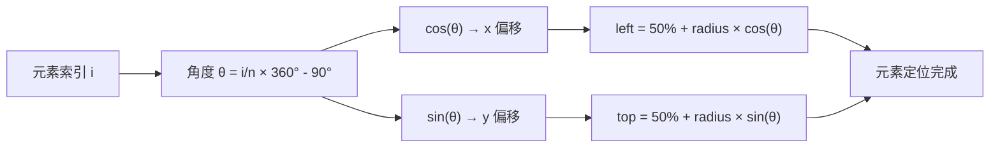
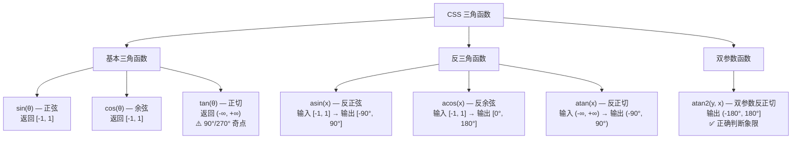

# 三角函数

> CSS 三角函数让样式表具备了真正的几何计算能力——无需 JavaScript，即可在纯 CSS 中完成圆周定位、角度推导和波形运动。

## 概述

CSS 三角函数是 CSS Values and Units Module Level 4 引入的一组数学函数，包括 `sin()`、`cos()`、`tan()` 三个基本三角函数，`asin()`、`acos()`、`atan()` 三个反三角函数，以及 `atan2()` 双参数反正切函数。它们的语义与 JavaScript 中 `Math` 对象的对应方法完全一致，但运行在浏览器的样式计算阶段，无需脚本参与。

在三角函数出现之前，CSS 的数学能力仅限于 `calc()` 的四则运算。任何涉及角度与坐标的几何计算——例如将元素沿圆周均匀排列、根据两点坐标推算朝向角度、生成正弦波形动画——都必须依赖 JavaScript 在运行时计算并注入样式值。这不仅增加了代码复杂度，还破坏了样式与逻辑的分离原则。CSS 三角函数的引入从根本上改变了这一局面：开发者可以在样式表中直接表达几何意图，浏览器在布局阶段完成计算，既减少了脚本开销，又提升了可维护性。

与 JavaScript `Math` 对象的三角函数相比，CSS 版本有两个关键差异：第一，CSS 三角函数接受带角度单位的值（如 `45deg`、`0.5turn`），而 JS 版本只接受弧度数；第二，CSS 反三角函数返回带角度单位的结果，而非裸数字。这种设计让三角函数与 CSS 的 `rotate`、`transform` 等属性天然契合，无需手动进行单位换算。

## sin() 函数

`sin()` 是正弦函数，接受一个角度值，返回该角度在单位圆上对应的 y 坐标。

**语法**：`sin(<angle>)`

**参数**：任意 CSS 角度值，支持 `deg`、`rad`、`grad`、`turn` 四种单位。

**返回值**：无量纲数，范围 `[-1, 1]`。当角度为 0° 时返回 0，90° 时返回 1，180° 时返回 0，270° 时返回 -1。

```css
/* 基础用法 */
.element {
  /* sin(30deg) = 0.5，结果为 50px */
  height: calc(100px * sin(30deg));

  /* sin(90deg) = 1，结果为 100px */
  top: calc(100px * sin(90deg));

  /* 配合 CSS 变量 */
  --angle: 60deg;
  transform: translateY(calc(-80px * sin(var(--angle))));
}
```

`sin()` 最典型的使用场景是计算圆周上某点的 y 坐标（垂直偏移），以及创建垂直方向的周期性运动。在波形动画中，`sin()` 负责控制波峰与波谷的纵向起伏。

## cos() 函数

`cos()` 是余弦函数，接受一个角度值，返回该角度在单位圆上对应的 x 坐标。它与 `sin()` 的关系是：`cos(θ) = sin(90° - θ)`。

**语法**：`cos(<angle>)`

**参数**：与 `sin()` 相同，接受任意 CSS 角度值。

**返回值**：无量纲数，范围 `[-1, 1]`。当角度为 0° 时返回 1，90° 时返回 0，180° 时返回 -1，270° 时返回 0。

```css
/* 基础用法 */
.element {
  /* cos(60deg) = 0.5，结果为 75px */
  width: calc(150px * cos(60deg));

  /* cos(0deg) = 1，结果为 200px */
  left: calc(200px * cos(0deg));

  /* 配合 CSS 变量 */
  --angle: 45deg;
  transform: translateX(calc(100px * cos(var(--angle))));
}
```

`cos()` 最典型的使用场景是计算圆周上某点的 x 坐标（水平偏移）。在圆形布局中，`cos()` 与 `sin()` 配合使用，分别确定元素的水平与垂直位置。

## tan() 函数

`tan()` 是正切函数，返回 `sin(θ) / cos(θ)` 的比值，即单位圆上该角度对应点的斜率。

**语法**：`tan(<angle>)`

**参数**：任意 CSS 角度值。

**返回值**：无量纲数，范围为 `(-∞, +∞)`。

**⚠️ 重要注意**：当角度为 90°（π/2 rad）、270°（3π/2 rad）等 `cos(θ) = 0` 的位置时，`tan()` 的值趋向无穷大，CSS 将返回无效值。在实际使用中，必须避免这些奇点角度，或使用 `clamp()` 限制结果范围。

```css
/* 基础用法 */
.element {
  /* tan(45deg) = 1，结果为 100px */
  height: calc(100px * tan(45deg));

  /* tan(30deg) ≈ 0.577，结果约为 115.47px */
  width: calc(200px * tan(30deg));

  /* ⚠️ 避免：tan(90deg) 趋向无穷，结果无效 */
  /* height: calc(100px * tan(90deg)); */

  /* ✓ 安全做法：使用 clamp 限制范围 */
  --slope: tan(85deg);
  height: calc(100px * clamp(-1000, var(--slope), 1000));
}
```

`tan()` 的典型场景是斜率计算——将角度转换为比例值。例如，根据倾斜角度计算平行四边形布局中的水平偏移量。

## 反三角函数

反三角函数是三角函数的逆运算：给定一个比值，返回对应的角度。CSS 提供了三个反三角函数。

### asin() — 反正弦

**语法**：`asin(<number>)`

**输入范围**：`[-1, 1]`，超出范围返回无效值。

**返回值**：角度，范围 `[-90deg, 90deg]`。

```css
.element {
  /* asin(0.5) = 30deg */
  rotate: asin(0.5);

  /* 根据高度比例反推角度 */
  --ratio: calc(var(--height) / var(--hypotenuse));
  --clamped-ratio: clamp(-1, var(--ratio), 1);
  rotate: asin(var(--clamped-ratio));
}
```

### acos() — 反余弦

**语法**：`acos(<number>)`

**输入范围**：`[-1, 1]`，超出范围返回无效值。

**返回值**：角度，范围 `[0deg, 180deg]`。

```css
.element {
  /* acos(0.5) = 60deg */
  rotate: acos(0.5);

  /* 根据宽度比例反推角度 */
  --ratio: calc(var(--width) / var(--hypotenuse));
  --clamped-ratio: clamp(-1, var(--ratio), 1);
  rotate: acos(var(--clamped-ratio));
}
```

### atan() — 反正切

**语法**：`atan(<number>)`

**输入范围**：`(-∞, +∞)`。

**返回值**：角度，范围 `(-90deg, 90deg)`。

```css
.element {
  /* atan(1) = 45deg */
  rotate: atan(1);

  /* 根据斜率计算角度 */
  --slope: calc(var(--rise) / var(--run));
  rotate: atan(var(--slope));
}
```

**局限性**：`atan()` 只能返回 `-90°` 到 `90°` 之间的角度，无法区分象限。例如 `atan(1)` 和 `atan(-1 / -1)` 都返回 `45deg`，但后者实际应为 `225deg`。在需要完整角度信息的场景中，应使用 `atan2()` 替代。

## atan2() 函数

`atan2(y, x)` 是 CSS 三角函数族中**最实用**的函数。它接受两个参数——y 分量和 x 分量——返回从正 x 轴到点 (x, y) 的角度。

**语法**：`atan2(<y>, <x>)`

**输入**：两个数字或带长度的值。

**返回值**：角度，范围 `(-180deg, 180deg]`。

### 与 atan() 的区别

`atan2()` 解决了 `atan()` 的三个根本问题：

1. **正确判断象限**：`atan()` 只接收一个比值，丢失了 x 和 y 的符号信息；`atan2()` 保留两个独立参数，通过符号组合确定象限。
2. **避免除零错误**：当 x = 0 时，`atan(y / x)` 会导致除零；`atan2(y, 0)` 则正确返回 `±90deg`。
3. **完整覆盖 360°**：`atan2()` 返回 `(-180°, 180°]`，覆盖整个圆周。

```css
/* atan2 的象限判断 */
.element {
  rotate: atan2(1, 1);    /* 45deg — 第一象限 */
  rotate: atan2(1, -1);   /* 135deg — 第二象限 */
  rotate: atan2(-1, -1);  /* -135deg — 第三象限 */
  rotate: atan2(-1, 1);   /* -45deg — 第四象限 */
}
```

### 在布局中的独特价值

`atan2()` 最强大的应用是**计算朝向角度**——让一个元素始终"指向"另一个位置（如鼠标光标、目标元素）。这在游戏 UI、数据可视化、交互式组件中极为常见。只需将目标位置与元素位置的差值作为参数传入，即可获得精确的旋转角度。

## 角度单位

CSS 三角函数接受四种角度单位，它们之间可以自由换算：

| 单位 | 名称 | 完整圆周 | 换算关系 | 示例 |
|------|------|----------|----------|------|
| `deg` | 角度制 | 360deg | 基准单位 | `sin(90deg)` |
| `rad` | 弧度制 | 2π rad ≈ 6.2832rad | 1rad ≈ 57.2958deg | `sin(1.5708rad)` |
| `grad` | 梯度制 | 400grad | 1grad = 0.9deg | `sin(100grad)` |
| `turn` | 圈数 | 1turn | 1turn = 360deg | `sin(0.25turn)` |

四种单位表示同一角度时，三角函数的返回值完全相同：

```css
/* 以下四种写法等价，均表示 90° */
.element {
  transform: translateY(calc(-100px * sin(90deg)));
  transform: translateY(calc(-100px * sin(1.5708rad)));
  transform: translateY(calc(-100px * sin(100grad)));
  transform: translateY(calc(-100px * sin(0.25turn)));
}
```

实际开发中，`deg` 是最常用的单位，因为它直观且易于理解；`turn` 在表示完整旋转时非常简洁（如 `0.5turn` 表示半圈）；`rad` 主要用于与数学公式对齐；`grad` 较少使用。

## 实战案例

### 圆形排列

将多个元素沿圆周均匀分布，是 `sin()` 和 `cos()` 最经典的应用。核心思路：每个元素占据 `360° / n` 的角度间隔，用 `cos()` 计算 x 坐标，`sin()` 计算 y 坐标。



```html
<!DOCTYPE html>
<html lang="zh-CN">
<head>
  <meta charset="UTF-8">
  <title>圆形排列</title>
  <style>
    .circular-menu {
      /* 菜单参数 */
      --count: 8;
      --radius: 140px;
      --item-size: 50px;

      position: relative;
      width: calc(var(--radius) * 2 + var(--item-size));
      height: calc(var(--radius) * 2 + var(--item-size));
      margin: 80px auto;
    }

    .circular-menu .item {
      /* 每个元素的索引，通过内联样式设置 */
      --i: 0;
      /* 计算当前元素的角度，-90deg 让第一个元素从顶部开始 */
      --angle: calc(var(--i) / var(--count) * 360deg - 90deg);

      position: absolute;
      /* 用 cos 计算水平位置，sin 计算垂直位置 */
      left: calc(50% + var(--radius) * cos(var(--angle)) - var(--item-size) / 2);
      top: calc(50% + var(--radius) * sin(var(--angle)) - var(--item-size) / 2);
      width: var(--item-size);
      height: var(--item-size);
      border-radius: 50%;
      background: linear-gradient(135deg, #667eea, #764ba2);
      color: white;
      display: flex;
      align-items: center;
      justify-content: center;
      font-weight: bold;
      font-size: 14px;
      cursor: pointer;
      transition: transform 0.3s, box-shadow 0.3s;
    }

    .circular-menu .item:hover {
      transform: scale(1.2);
      box-shadow: 0 6px 20px rgba(102, 126, 234, 0.5);
    }

    /* 中心按钮 */
    .center-btn {
      position: absolute;
      top: 50%;
      left: 50%;
      transform: translate(-50%, -50%);
      width: 56px;
      height: 56px;
      border-radius: 50%;
      background: #ff6b6b;
      color: white;
      border: none;
      font-size: 22px;
      cursor: pointer;
      box-shadow: 0 4px 12px rgba(255, 107, 107, 0.4);
    }
  </style>
</head>
<body>
  <div class="circular-menu">
    <button class="item" style="--i: 0">1</button>
    <button class="item" style="--i: 1">2</button>
    <button class="item" style="--i: 2">3</button>
    <button class="item" style="--i: 3">4</button>
    <button class="item" style="--i: 4">5</button>
    <button class="item" style="--i: 5">6</button>
    <button class="item" style="--i: 6">7</button>
    <button class="item" style="--i: 7">8</button>
    <button class="center-btn">+</button>
  </div>
</body>
</html>
```

### 波浪效果

利用 `sin()` 函数的周期性，可以创建平滑的波浪动画。通过 `@property` 注册自定义属性为 `<angle>` 类型，让浏览器能够对角度值进行插值，从而驱动 `sin()` 产生连续变化。

```html
<!DOCTYPE html>
<html lang="zh-CN">
<head>
  <meta charset="UTF-8">
  <title>波浪效果</title>
  <style>
    /* 注册角度属性，使浏览器可以对角度进行平滑插值 */
    @property --wave-angle {
      syntax: '<angle>';
      inherits: false;
      initial-value: 0deg;
    }

    .wave-container {
      width: 100%;
      height: 200px;
      overflow: hidden;
      position: relative;
      background: #1a1a2e;
    }

    .wave {
      --wave-angle: 0deg;
      position: absolute;
      bottom: 0;
      left: -50%;
      width: 200%;
      height: 100px;
      background: rgba(102, 126, 234, 0.3);
      border-radius: 40% 40% 0 0;
      /* 用 sin 控制垂直偏移，产生波浪起伏 */
      transform: translateY(calc(20px * sin(var(--wave-angle))));
      animation: wave-move 3s linear infinite;
    }

    .wave:nth-child(2) {
      background: rgba(118, 75, 162, 0.3);
      animation-duration: 4s;
      animation-delay: -1s;
      bottom: 10px;
    }

    .wave:nth-child(3) {
      background: rgba(255, 107, 107, 0.2);
      animation-duration: 5s;
      animation-delay: -2s;
      bottom: 20px;
    }

    @keyframes wave-move {
      to {
        --wave-angle: 360deg;
        transform: translateY(calc(20px * sin(var(--wave-angle))));
      }
    }

    /* 波浪文字 — 用 sin 让每个字符上下波动 */
    .wave-text {
      display: flex;
      justify-content: center;
      gap: 4px;
      margin-top: 40px;
      font-size: 32px;
      font-weight: bold;
      color: #667eea;
    }

    .wave-text span {
      --i: 0;
      --delay: calc(var(--i) * 0.15s);
      animation: char-bounce 2s ease-in-out infinite;
      animation-delay: var(--delay);
    }

    @keyframes char-bounce {
      0%, 100% { transform: translateY(0); }
      50% { transform: translateY(-20px); }
    }
  </style>
</head>
<body>
  <div class="wave-container">
    <div class="wave"></div>
    <div class="wave"></div>
    <div class="wave"></div>
  </div>
  <div class="wave-text">
    <span style="--i: 0">C</span>
    <span style="--i: 1">S</span>
    <span style="--i: 2">S</span>
    <span style="--i: 3">三</span>
    <span style="--i: 4">角</span>
    <span style="--i: 5">函</span>
    <span style="--i: 6">数</span>
  </div>
</body>
</html>
```

### 指针旋转

时钟指针是三角函数的天然应用场景。时针、分针、秒针的角度可以直接由时间推算，而表盘刻度的位置则用 `sin()` / `cos()` 计算。

```html
<!DOCTYPE html>
<html lang="zh-CN">
<head>
  <meta charset="UTF-8">
  <title>时钟指针</title>
  <style>
    .clock {
      --size: 300px;
      width: var(--size);
      height: var(--size);
      border: 4px solid #333;
      border-radius: 50%;
      position: relative;
      margin: 50px auto;
      background: #fafafa;
    }

    /* 表盘刻度 — 用 sin/cos 计算位置 */
    .clock-mark {
      --i: 0;
      --angle: calc(var(--i) * 30deg);

      position: absolute;
      width: 3px;
      height: 14px;
      background: #333;
      /* cos 计算水平位置，sin 计算垂直位置 */
      left: calc(50% + 130px * sin(var(--angle)) - 1.5px);
      top: calc(50% - 130px * cos(var(--angle)) - 7px);
      transform: rotate(var(--angle));
      border-radius: 1px;
    }

    .clock-mark.major {
      width: 4px;
      height: 20px;
      background: #111;
    }

    /* 指针 */
    .hand {
      position: absolute;
      top: 50%;
      left: 50%;
      transform-origin: 50% 100%;
      border-radius: 2px;
    }

    .hand-hour {
      --hours: 0;
      --minutes: 0;
      --angle: calc(var(--hours) * 30deg + var(--minutes) * 0.5deg);
      width: 6px;
      height: 75px;
      margin-left: -3px;
      margin-top: -75px;
      background: #333;
      rotate: var(--angle);
    }

    .hand-minute {
      --minutes: 0;
      --angle: calc(var(--minutes) * 6deg);
      width: 4px;
      height: 100px;
      margin-left: -2px;
      margin-top: -100px;
      background: #555;
      rotate: var(--angle);
    }

    .hand-second {
      --seconds: 0;
      --angle: calc(var(--seconds) * 6deg);
      width: 2px;
      height: 115px;
      margin-left: -1px;
      margin-top: -115px;
      background: #ff6b6b;
      rotate: var(--angle);
    }

    /* 中心圆点 */
    .center-dot {
      position: absolute;
      top: 50%;
      left: 50%;
      transform: translate(-50%, -50%);
      width: 12px;
      height: 12px;
      border-radius: 50%;
      background: #333;
      z-index: 10;
    }
  </style>
</head>
<body>
  <div class="clock" id="clock">
    <!-- 12 个刻度 -->
    <div class="clock-mark major" style="--i: 0"></div>
    <div class="clock-mark" style="--i: 1"></div>
    <div class="clock-mark" style="--i: 2"></div>
    <div class="clock-mark major" style="--i: 3"></div>
    <div class="clock-mark" style="--i: 4"></div>
    <div class="clock-mark" style="--i: 5"></div>
    <div class="clock-mark major" style="--i: 6"></div>
    <div class="clock-mark" style="--i: 7"></div>
    <div class="clock-mark" style="--i: 8"></div>
    <div class="clock-mark major" style="--i: 9"></div>
    <div class="clock-mark" style="--i: 10"></div>
    <div class="clock-mark" style="--i: 11"></div>

    <!-- 指针 -->
    <div class="hand hand-hour" id="hour"></div>
    <div class="hand hand-minute" id="minute"></div>
    <div class="hand hand-second" id="second"></div>
    <div class="center-dot"></div>
  </div>

  <script>
    /* 每秒更新指针角度 */
    function updateClock() {
      const now = new Date();
      const h = now.getHours() % 12;
      const m = now.getMinutes();
      const s = now.getSeconds();

      document.getElementById('hour').style.setProperty('--hours', h);
      document.getElementById('hour').style.setProperty('--minutes', m);
      document.getElementById('minute').style.setProperty('--minutes', m);
      document.getElementById('second').style.setProperty('--seconds', s);
    }

    updateClock();
    setInterval(updateClock, 1000);
  </script>
</body>
</html>
```

### 平行四边形布局

利用 `tan()` 将倾斜角度转换为水平偏移比例，可以实现纯 CSS 的平行四边形布局。

```html
<!DOCTYPE html>
<html lang="zh-CN">
<head>
  <meta charset="UTF-8">
  <title>平行四边形布局</title>
  <style>
    .parallelogram-grid {
      --skew-angle: 15deg;
      --row-height: 60px;
      --gap: 8px;

      display: flex;
      flex-direction: column;
      gap: var(--gap);
      padding: 40px;
    }

    .parallelogram-row {
      --i: 0;
      /* 用 tan 计算每行的水平偏移：偏移量 = 行高 × tan(倾斜角) */
      --offset: calc(var(--i) * var(--row-height) * tan(var(--skew-angle)));

      display: flex;
      gap: 8px;
      /* 应用 tan 计算出的偏移 */
      transform: translateX(var(--offset));
    }

    .parallelogram-row .card {
      width: 120px;
      height: var(--row-height);
      background: linear-gradient(135deg, #667eea, #764ba2);
      color: white;
      display: flex;
      align-items: center;
      justify-content: center;
      font-weight: bold;
      border-radius: 4px;
      /* 用 skew 实现平行四边形外观 */
      transform: skewX(calc(-1 * var(--skew-angle)));
    }
  </style>
</head>
<body>
  <div class="parallelogram-grid">
    <div class="parallelogram-row" style="--i: 0">
      <div class="card">A1</div>
      <div class="card">A2</div>
      <div class="card">A3</div>
    </div>
    <div class="parallelogram-row" style="--i: 1">
      <div class="card">B1</div>
      <div class="card">B2</div>
      <div class="card">B3</div>
    </div>
    <div class="parallelogram-row" style="--i: 2">
      <div class="card">C1</div>
      <div class="card">C2</div>
      <div class="card">C3</div>
    </div>
    <div class="parallelogram-row" style="--i: 3">
      <div class="card">D1</div>
      <div class="card">D2</div>
      <div class="card">D3</div>
    </div>
  </div>
</body>
</html>
```

### 鼠标跟随

`atan2()` 的杀手级应用：让元素始终朝向鼠标光标。只需将鼠标位置与元素位置的差值传入 `atan2()`，即可获得精确的旋转角度。

```html
<!DOCTYPE html>
<html lang="zh-CN">
<head>
  <meta charset="UTF-8">
  <title>鼠标跟随</title>
  <style>
    .arena {
      width: 500px;
      height: 400px;
      border: 2px solid #ddd;
      border-radius: 12px;
      position: relative;
      margin: 50px auto;
      background: #fafafa;
      overflow: hidden;
    }

    .pointer {
      /* 鼠标坐标与元素中心坐标，由 JS 动态设置 */
      --mx: 250px;
      --my: 200px;
      --cx: 250px;
      --cy: 200px;

      position: absolute;
      top: 50%;
      left: 50%;
      width: 80px;
      height: 6px;
      background: linear-gradient(to right, #667eea, #764ba2);
      transform-origin: 0 50%;
      /* 用 atan2 计算朝向鼠标的角度 */
      rotate: atan2(
        calc(var(--my) - var(--cy)),
        calc(var(--mx) - var(--cx))
      );
      border-radius: 3px;
      transition: rotate 0.1s ease-out;
    }

    /* 箭头 */
    .pointer::after {
      content: '';
      position: absolute;
      right: -6px;
      top: 50%;
      transform: translateY(-50%);
      border-left: 10px solid #764ba2;
      border-top: 5px solid transparent;
      border-bottom: 5px solid transparent;
    }

    /* 中心圆点 */
    .center-dot {
      position: absolute;
      top: 50%;
      left: 50%;
      transform: translate(-50%, -50%);
      width: 14px;
      height: 14px;
      border-radius: 50%;
      background: #333;
      z-index: 2;
    }

    /* 提示文字 */
    .hint {
      text-align: center;
      color: #999;
      font-size: 14px;
    }
  </style>
</head>
<body>
  <p class="hint">在下方区域内移动鼠标，指针将跟随光标方向旋转</p>
  <div class="arena" id="arena">
    <div class="pointer" id="pointer"></div>
    <div class="center-dot"></div>
  </div>

  <script>
    /* 监听鼠标移动，更新 CSS 变量 */
    const arena = document.getElementById('arena');
    const pointer = document.getElementById('pointer');

    arena.addEventListener('mousemove', (e) => {
      const rect = arena.getBoundingClientRect();
      const mx = e.clientX - rect.left;
      const my = e.clientY - rect.top;

      pointer.style.setProperty('--mx', `${mx}px`);
      pointer.style.setProperty('--my', `${my}px`);
    });
  </script>
</body>
</html>
```

## 与 CSS 变量的组合

三角函数与 CSS 自定义属性（变量）的组合使用，是实现动态参数化布局的关键模式。通过将角度、半径等参数提取为变量，可以在不修改样式规则的情况下调整布局。

```css
/* 全局参数 — 修改这些变量即可改变整个布局 */
:root {
  --menu-count: 8;
  --menu-radius: 150px;
  --start-offset: -90deg;  /* 起始偏移，-90deg 从顶部开始 */
}

.menu-item {
  --i: 0;
  /* 动态计算每个元素的角度 */
  --angle: calc(var(--i) / var(--menu-count) * 360deg + var(--start-offset));

  position: absolute;
  /* sin/cos 配合变量计算坐标 */
  left: calc(50% + var(--menu-radius) * cos(var(--angle)));
  top: calc(50% + var(--menu-radius) * sin(var(--angle)));
}
```

这种模式的优势在于**单一修改点**：只需更改 `:root` 中的变量值，所有依赖该变量的三角函数计算都会自动更新。例如将 `--menu-count` 从 8 改为 12，8 个元素会自动调整到新的角度间隔。

变量组合还支持**条件化参数**——通过 `clamp()`、`min()`、`max()` 等函数对变量值施加约束：

```css
.element {
  /* 限制半径不超过视口宽度的 30% */
  --radius: min(150px, 30vw);
  /* 限制角度在 0° 到 360° 之间 */
  --angle: clamp(0deg, var(--raw-angle), 360deg);

  left: calc(50% + var(--radius) * cos(var(--angle)));
  top: calc(50% + var(--radius) * sin(var(--angle)));
}
```

## 与 @property 的配合

`@property` 规则允许开发者注册自定义属性的语法类型，使浏览器能够对属性值进行正确插值。这对于三角函数动画至关重要——因为 `sin()` 和 `cos()` 的参数是角度，只有当自定义属性被注册为 `<angle>` 类型时，浏览器才能在动画的关键帧之间进行平滑的角度插值。

```css
/* 注册角度类型的自定义属性 */
@property --angle {
  syntax: '<angle>';
  inherits: false;
  initial-value: 0deg;
}

.orbit {
  --angle: 0deg;
  width: 20px;
  height: 20px;
  border-radius: 50%;
  background: #667eea;
  position: absolute;
  /* 用 sin/cos 计算轨道位置 */
  left: calc(50% + 120px * cos(var(--angle)) - 10px);
  top: calc(50% + 120px * sin(var(--angle)) - 10px);
  /* 动画驱动角度从 0deg 变化到 360deg */
  animation: orbit 4s linear infinite;
}

@keyframes orbit {
  to {
    --angle: 360deg;
  }
}
```

如果不使用 `@property` 注册，浏览器会将 `--angle` 视为字符串，无法在 `0deg` 和 `360deg` 之间进行插值，动画将无法生效。注册为 `<angle>` 类型后，浏览器知道这是一个角度值，可以正确地进行线性插值，`sin()` 和 `cos()` 也会随之产生连续变化。

这种模式可以扩展到更复杂的动画场景：

```css
/* 注册多个角度属性，实现多维度动画 */
@property --spin-angle {
  syntax: '<angle>';
  inherits: false;
  initial-value: 0deg;
}

@property --wobble-angle {
  syntax: '<angle>';
  inherits: false;
  initial-value: 0deg;
}

.planet {
  --spin-angle: 0deg;
  --wobble-angle: 0deg;
  --radius: 120px;
  --wobble: 15px;

  position: absolute;
  /* 主轨道 + 摆动偏移 */
  left: calc(50% + var(--radius) * cos(var(--spin-angle)) + var(--wobble) * cos(var(--wobble-angle)));
  top: calc(50% + var(--radius) * sin(var(--spin-angle)) + var(--wobble) * sin(var(--wobble-angle)));
  animation: spin 6s linear infinite, wobble 1.5s ease-in-out infinite;
}

@keyframes spin {
  to { --spin-angle: 360deg; }
}

@keyframes wobble {
  to { --wobble-angle: 360deg; }
}
```

## 性能考量

三角函数的计算开销高于简单的算术运算，但在现代浏览器中，其性能影响通常可以忽略。以下是几条优化建议：

**1. 优先使用 transform 旋转代替 sin/cos 计算**

对于简单的圆周运动，`rotate() translateX()` 的组合比 `sin()/cos()` 计算坐标更高效，因为浏览器可以对 transform 进行 GPU 加速：

```css
/* ✓ 推荐：GPU 加速的旋转 */
@keyframes orbit-fast {
  to { transform: rotate(360deg) translateX(100px); }
}

/* ⚠️ 可用但需要额外计算 */
@keyframes orbit-calc {
  to {
    left: calc(50% + 100px * cos(360deg));
    top: calc(50% + 100px * sin(360deg));
  }
}
```

**2. 避免在每帧都重新计算不变的三角函数值**

如果角度是固定的，三角函数的结果也是固定的，无需放在动画中重复计算：

```css
/* ❌ 不必要：固定角度不需要动画 */
.element {
  animation: none;
  left: calc(50% + 100px * cos(45deg));  /* 直接计算即可 */
}
```

**3. 减少嵌套层级**

三角函数嵌套（如 `sin(cos(atan2(...)))`）会增加计算复杂度。如果可能，将中间结果提取为 CSS 变量：

```css
/* ✓ 推荐：提取中间变量 */
.element {
  --angle: atan2(var(--dy), var(--dx));
  --x: calc(100px * cos(var(--angle)));
  --y: calc(100px * sin(var(--angle)));
  transform: translate(var(--x), var(--y));
}
```

**4. 使用 will-change 提示浏览器**

对于频繁使用三角函数的动画元素，`will-change: transform` 可以提示浏览器提前优化：

```css
.animated-orbit {
  will-change: transform;
  animation: orbit 3s linear infinite;
}
```

## 浏览器兼容性

CSS 三角函数在 2023 年获得主流浏览器的全面支持：

| 函数 | Chrome | Firefox | Safari | Edge |
|------|--------|---------|--------|------|
| `sin()` | 111+ | 108+ | 15.4+ | 111+ |
| `cos()` | 111+ | 108+ | 15.4+ | 111+ |
| `tan()` | 111+ | 108+ | 15.4+ | 111+ |
| `asin()` | 111+ | 108+ | 15.4+ | 111+ |
| `acos()` | 111+ | 108+ | 15.4+ | 111+ |
| `atan()` | 111+ | 108+ | 15.4+ | 111+ |
| `atan2()` | 111+ | 108+ | 15.4+ | 111+ |

对于需要兼容旧版浏览器的项目，建议使用 `@supports` 进行特性检测并提供降级方案：

```css
.element {
  /* 降级：固定位置 */
  left: 50%;
  top: 0;
}

@supports (left: calc(50% + 100px * cos(45deg))) {
  .element {
    /* 现代浏览器：三角函数计算 */
    left: calc(50% + 100px * cos(45deg));
    top: calc(50% + 100px * sin(45deg));
  }
}
```

## 最佳实践

1. **优先使用 `atan2()` 而非 `atan()`**：`atan2()` 能正确判断象限、避免除零错误，是计算朝向角度的首选。

2. **避免 `tan()` 的奇点角度**：90°、270° 等 `cos(θ) = 0` 的位置会使 `tan()` 返回无效值。如需使用接近奇点的角度，用 `clamp()` 限制结果范围。

3. **用 `clamp()` 保护反三角函数的输入**：`asin()` 和 `acos()` 的输入必须在 `[-1, 1]` 范围内，超出范围会返回无效值。始终使用 `clamp(-1, value, 1)` 确保安全。

4. **提取变量提高可维护性**：将角度、半径等参数提取为 CSS 变量，集中管理、一处修改、全局生效。

5. **简单圆周运动优先用 `rotate() translateX()`**：浏览器对 `transform` 有 GPU 加速优化，性能优于 `sin()/cos()` 计算坐标。

6. **动画中使用 `@property` 注册角度变量**：只有注册为 `<angle>` 类型的自定义属性才能被浏览器正确插值，三角函数动画才能生效。

7. **提供 `@supports` 降级方案**：为不支持三角函数的浏览器提供合理的回退样式。

## 常见问题

### Q1：三角函数返回的值有单位吗？

没有。`sin()`、`cos()`、`tan()` 返回的是无量纲数（纯数字），需要乘以带单位的值才能产生长度。例如 `100px * sin(45deg)` 结果约为 `70.71px`。反三角函数（`asin()`、`acos()`、`atan()`、`atan2()`）返回的是带角度单位的值。

### Q2：为什么我的三角函数动画不生效？

最常见的原因是自定义属性未用 `@property` 注册。浏览器默认将自定义属性视为字符串，无法在关键帧之间插值。解决方法：

```css
@property --angle {
  syntax: '<angle>';
  inherits: false;
  initial-value: 0deg;
}
```

### Q3：`atan2()` 的参数顺序是什么？

`atan2(y, x)` — 第一个参数是 y 分量（垂直），第二个参数是 x 分量（水平）。这与数学中的习惯一致，但容易与 `(x, y)` 的坐标书写顺序混淆。

### Q4：可以在 `calc()` 中直接使用三角函数吗？

可以，但要注意三角函数返回无量纲数，不能直接与带单位的值相加，必须先乘以带单位的值：

```css
/* ✓ 正确：乘法 */
width: calc(200px * sin(30deg));

/* ❌ 错误：加法 — 无量纲数 + 长度，类型不匹配 */
width: calc(200px + sin(30deg));

/* ✓ 正确：先乘后加 */
width: calc(200px + 100px * sin(30deg));
```

### Q5：三角函数可以嵌套使用吗？

可以，但应避免过度嵌套影响可读性和性能：

```css
/* ✓ 合理嵌套 */
rotate: atan2(sin(var(--angle)), cos(var(--angle)));

/* ❌ 过度嵌套，难以理解 */
rotate: atan2(sin(acos(atan2(var(--y), var(--x)))), cos(acos(atan2(var(--y), var(--x)))));
```

## 总结

CSS 三角函数为样式表注入了几何计算能力，使开发者无需 JavaScript 即可实现圆周定位、角度推导、波形运动等复杂布局与动画。核心要点：

- **`sin()` / `cos()`** 是圆周坐标计算的基础，分别对应单位圆上的 y / x 坐标
- **`tan()`** 将角度转换为斜率，需注意 90°/270° 处的奇点问题
- **反三角函数**（`asin` / `acos` / `atan`）从比值反推角度，注意输入范围限制
- **`atan2(y, x)`** 是最实用的函数，能正确判断象限、避免除零，是计算朝向角度的首选
- **`@property`** 是三角函数动画的关键，必须注册为 `<angle>` 类型才能插值
- **性能优化**：简单圆周运动优先用 `rotate() translateX()`，复杂计算提取中间变量



## 参考资料

- [MDN: sin()](https://developer.mozilla.org/zh-CN/docs/Web/CSS/sin)
- [MDN: cos()](https://developer.mozilla.org/zh-CN/docs/Web/CSS/cos)
- [MDN: tan()](https://developer.mozilla.org/zh-CN/docs/Web/CSS/tan)
- [MDN: asin()](https://developer.mozilla.org/zh-CN/docs/Web/CSS/asin)
- [MDN: acos()](https://developer.mozilla.org/zh-CN/docs/Web/CSS/acos)
- [MDN: atan()](https://developer.mozilla.org/zh-CN/docs/Web/CSS/atan)
- [MDN: atan2()](https://developer.mozilla.org/zh-CN/docs/Web/CSS/atan2)
- [CSS Values and Units Module Level 5](https://www.w3.org/TR/css-values-5/)
- [Can I use: CSS math functions](https://caniuse.com/css-math-functions)
