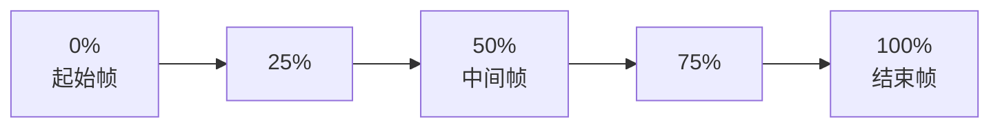
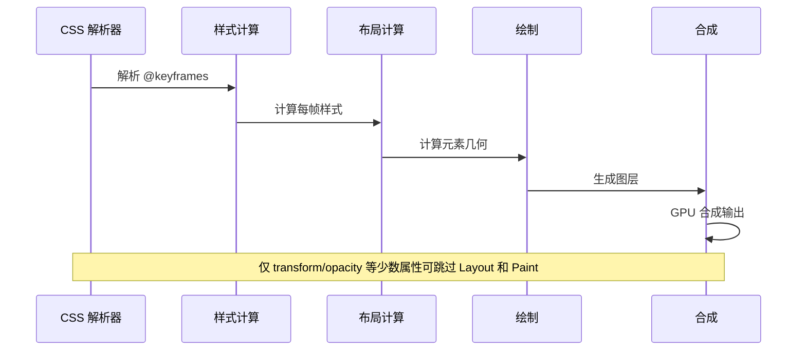

# 关键帧动画

CSS 关键帧动画（Keyframe Animations）是实现复杂动画序列的核心技术，通过 `@keyframes` 规则定义动画序列，配合 `animation` 属性控制动画的执行方式。

## 背景与动机

### 为什么需要关键帧动画

在 Web 开发中，动画是提升用户体验的重要手段。CSS 提供了两种主要的动画机制：

1. **过渡（Transition）**：适合简单的状态切换，只能定义起点和终点
2. **动画（Animation）**：适合复杂的多阶段动画，可以定义任意数量的关键帧

关键帧动画的优势：
- **精确控制**：可以在任意时间点（0%-100%）定义样式
- **循环播放**：支持无限循环、交替播放
- **自动触发**：无需用户交互即可自动执行
- **性能优化**：可以使用 GPU 加速的属性

### 动画 vs 过渡

| 特性 | 动画（Animation） | 过渡（Transition） |
|------|-------------------|-------------------|
| 触发方式 | 自动触发或手动控制 | 需要状态改变触发 |
| 循环播放 | 支持 | 不支持 |
| 中间状态 | 可定义多个关键帧 | 只能定义起点和终点 |
| 复杂度 | 适合复杂动画 | 适合简单动画 |
| 控制能力 | 可暂停、反转、跳转 | 无法精确控制 |

## 核心概念

### @keyframes 规则

`@keyframes` 用于定义动画序列的关键帧，通过百分比（0%-100%）或 `from`/`to` 关键字指定时间点。

```css
/* 使用百分比 */
@keyframes slideIn {
  0% {
    opacity: 0;
    transform: translateX(-100px);
  }
  50% {
    opacity: 0.5;
    transform: translateX(-50px);
  }
  100% {
    opacity: 1;
    transform: translateX(0);
  }
}

/* 使用 from/to */
@keyframes fadeIn {
  from {
    opacity: 0;
  }
  to {
    opacity: 1;
  }
}
```

### animation 属性

`animation` 是一个简写属性，包含 8 个子属性：

```css
.element {
  /* 完整简写 */
  animation: myAnimation 2s ease-in-out 0.5s infinite alternate forwards running;
  
  /* 分解写法 */
  animation-name: myAnimation;           /* 动画名称 */
  animation-duration: 2s;                /* 持续时间 */
  animation-timing-function: ease-in-out; /* 计时函数 */
  animation-delay: 0.5s;                 /* 延迟时间 */
  animation-iteration-count: infinite;   /* 迭代次数 */
  animation-direction: alternate;        /* 播放方向 */
  animation-fill-mode: forwards;         /* 填充模式 */
  animation-play-state: running;         /* 播放状态 */
}
```

### 动画时间线



## 深入原理

### 浏览器渲染流程

CSS 动画在浏览器中的执行流程：



### 合成层优化

浏览器会为动画元素创建独立的**合成层（Compositing Layer）**，在 GPU 中进行合成，避免触发布局和绘制：

**高性能属性**（仅触发合成）：
- `transform`
- `opacity`
- `filter`（部分）

**低性能属性**（触发重排/重绘）：
- `width`, `height`, `margin`, `padding`
- `top`, `left`, `right`, `bottom`
- `background-color`, `color`

## 代码示例

### 基础动画

```html
<!DOCTYPE html>
<html lang="zh-CN">
<head>
  <style>
    .box {
      width: 100px;
      height: 100px;
      background: linear-gradient(135deg, #667eea 0%, #764ba2 100%);
      border-radius: 12px;
      animation: slideIn 2s ease-in-out infinite alternate;
    }
    
    @keyframes slideIn {
      from {
        transform: translateX(0);
        opacity: 1;
      }
      to {
        transform: translateX(200px);
        opacity: 0.5;
      }
    }
  </style>
</head>
<body>
  <div class="box"></div>
</body>
</html>
```

### 多阶段动画

```css
@keyframes complex {
  0% {
    opacity: 0;
    transform: translateY(-100px) scale(0.5);
  }
  25% {
    opacity: 0.5;
    transform: translateY(-50px) scale(0.75);
  }
  50% {
    opacity: 1;
    transform: translateY(0) scale(1.1);
  }
  75% {
    transform: translateY(0) scale(0.95);
  }
  100% {
    opacity: 1;
    transform: translateY(0) scale(1);
  }
}

.complex-animation {
  animation: complex 3s ease-in-out infinite;
}
```

### 步进动画

`steps()` 函数将动画分为固定数量的步骤，适合精灵动画、进度条等场景。

```css
/* 精灵动画 */
@keyframes sprite {
  from { background-position: 0 0; }
  to { background-position: -1000px 0; }
}

.sprite-animation {
  width: 100px;
  height: 100px;
  background: url('sprite.png') no-repeat;
  animation: sprite 1s steps(10) infinite;
}

/* 打字机效果 */
@keyframes typing {
  from { width: 0; }
  to { width: 100%; }
}

@keyframes blink {
  50% { border-color: transparent; }
}

.typewriter {
  overflow: hidden;
  border-right: 2px solid #000;
  white-space: nowrap;
  width: 0;
  animation: 
    typing 3s steps(30) forwards,
    blink 0.5s step-end infinite;
}
```

### 交错动画

使用 CSS 变量实现灵活的交错动画：

```css
@keyframes fadeIn {
  from {
    opacity: 0;
    transform: translateY(20px);
  }
  to {
    opacity: 1;
    transform: translateY(0);
  }
}

.item {
  animation: fadeIn 0.5s ease forwards;
  animation-delay: calc(var(--i) * 0.1s);
  opacity: 0;
}
```

```html
<div class="list-container">
  <div class="item" style="--i: 0">项目 1</div>
  <div class="item" style="--i: 1">项目 2</div>
  <div class="item" style="--i: 2">项目 3</div>
  <div class="item" style="--i: 3">项目 4</div>
  <div class="item" style="--i: 4">项目 5</div>
</div>
```

### 3D 动画

```css
.cube-container {
  width: 200px;
  height: 200px;
  perspective: 1000px;
  margin: 50px auto;
}

.cube {
  width: 100%;
  height: 100%;
  position: relative;
  transform-style: preserve-3d;
  animation: rotateCube 10s linear infinite;
}

.cube-face {
  position: absolute;
  width: 200px;
  height: 200px;
  border: 2px solid #000;
  display: flex;
  align-items: center;
  justify-content: center;
  font-size: 24px;
  font-weight: bold;
}

.cube-face:nth-child(1) { transform: rotateY(0deg) translateZ(100px); }
.cube-face:nth-child(2) { transform: rotateY(90deg) translateZ(100px); }
.cube-face:nth-child(3) { transform: rotateY(180deg) translateZ(100px); }
.cube-face:nth-child(4) { transform: rotateY(-90deg) translateZ(100px); }
.cube-face:nth-child(5) { transform: rotateX(90deg) translateZ(100px); }
.cube-face:nth-child(6) { transform: rotateX(-90deg) translateZ(100px); }

@keyframes rotateCube {
  from { transform: rotateX(0) rotateY(0); }
  to { transform: rotateX(360deg) rotateY(360deg); }
}
```

### animation-timeline 新特性

CSS 滚动驱动动画是最新的特性，可以将动画进度与滚动位置绑定：

```css
/* 传统时间线动画 */
.traditional {
  animation: slideIn 2s ease-out;
}

/* 滚动驱动动画 */
.scroll-driven {
  animation: slideIn linear;
  animation-timeline: scroll();
}

@keyframes slideIn {
  from {
    opacity: 0;
    transform: translateX(-100px);
  }
  to {
    opacity: 1;
    transform: translateX(0);
  }
}
```

**scroll() 函数参数：**

```css
/* 根滚动容器 */
animation-timeline: scroll(root);

/* 最近的滚动容器 */
animation-timeline: scroll(nearest);

/* 元素自身的滚动容器 */
animation-timeline: scroll(self);

/* 指定滚动轴 */
animation-timeline: scroll(root block);
animation-timeline: scroll(root inline);
```

**view() 时间线：**

```css
/* 元素进入视口时触发动画 */
.reveal {
  animation: fadeInUp linear both;
  animation-timeline: view();
  animation-range: entry 0% entry 100%;
}

@keyframes fadeInUp {
  from {
    opacity: 0;
    transform: translateY(60px);
  }
  to {
    opacity: 1;
    transform: translateY(0);
  }
}
```

### 动画组合

使用 `animation-composition` 控制多个动画如何叠加：

```css
.element {
  animation: 
    float-y 3s ease-in-out infinite alternate,
    float-x 4s ease-in-out infinite alternate,
    spin 6s linear infinite;
  animation-composition: add;
}

@keyframes float-y {
  from { transform: translateY(0); }
  to { transform: translateY(-40px); }
}

@keyframes float-x {
  from { transform: translateX(0); }
  to { transform: translateX(60px); }
}

@keyframes spin {
  from { transform: rotate(0deg); }
  to { transform: rotate(360deg); }
}
```

**组合模式对比：**

| 模式 | 行为 | 示例 |
|------|------|------|
| `replace` | 后值替换前值（默认） | `scale(2)` + `rotate(45deg)` = `rotate(45deg)` |
| `add` | 后值追加到前值之后 | `scale(2)` + `rotate(45deg)` = `scale(2) rotate(45deg)` |
| `accumulate` | 同类值累加 | `scale(2)` + `scale(1.5)` = `scale(3)` |

## 最佳实践

### 1. 性能优先

```css
/* ✅ 推荐：使用 transform 和 opacity */
.good-animation {
  transform: translateX(100px);
  opacity: 0.5;
}

/* ❌ 避免：触发重排 */
.bad-animation {
  left: 100px;
  margin-left: 50px;
  width: 200px;
}
```

### 2. 使用 will-change

```css
/* 在动画即将发生时设置 */
.card:hover {
  will-change: transform;
}

/* 动画结束后移除 */
.animated-element.animation-ended {
  will-change: auto;
}
```

### 3. 考虑可访问性

```css
/* 尊重用户偏好 */
@media (prefers-reduced-motion: reduce) {
  .animated-element {
    animation: none !important;
    transition: none !important;
  }
}
```

### 4. 使用 CSS 变量

```css
:root {
  --animation-duration: 0.3s;
  --animation-timing: ease-in-out;
}

.reusable {
  animation: fadeIn var(--animation-duration) var(--animation-timing);
}
```

### 5. 提供暂停控制

```css
.animation-container {
  animation: myAnimation 5s infinite;
}

.animation-container:hover,
.animation-container:focus {
  animation-play-state: paused;
}
```

## 常见问题

### 1. 动画不执行怎么办？

**检查清单：**
- 确认 `@keyframes` 名称与 `animation-name` 匹配
- 检查是否设置了 `animation-duration`（默认为 0）
- 查看浏览器控制台是否有语法错误
- 确认元素是否可见（`display: none` 不会执行动画）
- 检查是否被 `prefers-reduced-motion` 禁用

### 2. 动画结束后如何保持状态？

```css
.keep-final {
  animation: slideIn 1s forwards;
  /* forwards 保持最终帧状态 */
}
```

### 3. 如何让动画无限循环？

```css
.infinite-loop {
  animation: pulse 2s infinite;
  /* infinite 等同于 animation-iteration-count: infinite */
}
```

### 4. 如何实现多个动画？

```css
.multiple-animations {
  animation: 
    fadeIn 1s ease forwards,
    slideUp 0.5s ease 0.5s forwards;
}
```

### 5. 动画性能差怎么优化？

**优化策略：**
- 使用 `transform` 和 `opacity` 代替其他属性
- 减少 DOM 元素数量
- 使用 `will-change` 提示浏览器
- 避免同时动画太多元素
- 使用 Chrome DevTools 分析性能

### 6. 如何调试动画？

```css
/* 使用开发者工具 */
.debug-animation {
  animation: test 1s ease;
  /* Chrome DevTools → Animations 面板 */
  /* 可以暂停、减速、逐帧查看 */
}
```

### 7. animation-timeline 兼容性如何？

`animation-timeline` 已在 Chrome 115+、Edge 115+ 和 Safari 26+ 中支持；Firefox 尚未在正式版中启用（当前处于 Nightly 预览阶段），最新进度请以 [MDN 兼容性表](https://developer.mozilla.org/zh-CN/docs/Web/CSS/animation-timeline) 为准。建议使用渐进增强：

```css
/* 基础样式 */
.element {
  opacity: 1;
  transform: none;
}

/* 支持滚动驱动动画的浏览器增强 */
@supports (animation-timeline: view()) {
  .element {
    opacity: 0;
    transform: translateY(60px);
    animation: reveal linear both;
    animation-timeline: view();
  }
}
```

## 参考资源

- [MDN Web Docs - CSS Animations](https://developer.mozilla.org/zh-CN/docs/Web/CSS/CSS_Animations)
- [MDN - animation-timeline](https://developer.mozilla.org/en-US/docs/Web/CSS/animation-timeline)
- [Chrome Developers - Scroll-driven animations](https://developer.chrome.com/docs/css-ui/scroll-driven-animations)
- [CSS-Tricks - Animation Performance](https://css-tricks.com/myth-busting-css-animations-the-right-performance-metrics/)
- [Web Animations Performance](https://developers.google.com/web/fundamentals/design-and-ux/animations)
- [W3C CSS Scroll-driven Animations](https://www.w3.org/TR/scroll-animations-1/)
